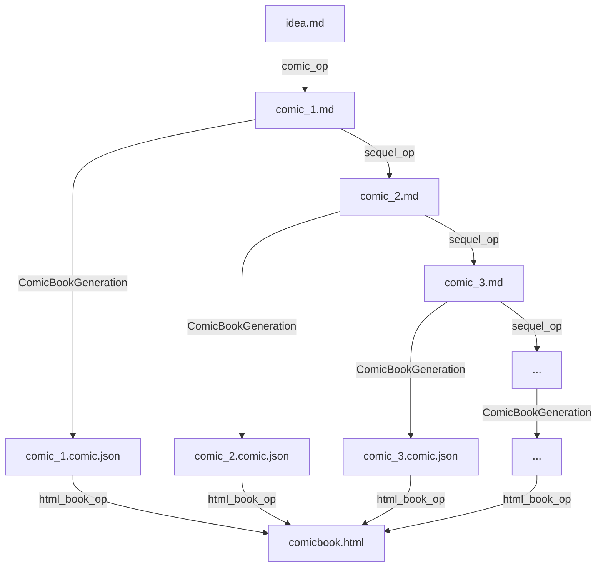

# Pipeline

## Operations

### `comic_op.md`
| Property | Value |
|---|---|
| **Input** | `idea.md` |
| **Output** | `comic_1.md` |
| **Task Type** | `ComicBookGeneration` |
| **Description** | Generates the first comic book episode from the source article/idea. |

### `sequel_op.md`
| Property | Value |
|---|---|
| **Input** | `comic_N.md` |
| **Output** | `comic_N+1.md` |
| **Task Type** | `ComicBookGeneration` |
| **Related** | `idea.md` |
| **Description** | Generates a sequel comic episode from the previous episode, informed by the original idea. Can be applied repeatedly to produce a series. |

### `html_book_op.md`
| Property | Value |
|---|---|
| **Input** | `comic_N.comic.json` |
| **Output** | `comicbook.html` |
| **Task Type** | HTML Generation |
| **Description** | Aggregates all comic JSON files into a single self-contained HTML presentation. Images are referenced inline, captions are displayed as muted text below each image, and the page is styled for visual appeal. |

## Files

| File | Description |
|---|---|
| `idea.md` | Source article or concept that seeds the comic series |
| `comic_1.md` | First comic episode (generated by `comic_op`) |
| `comic_N.md` | Nth comic episode (generated by `sequel_op`) |
| `comic_N.comic.json` | Structured comic data for episode N (generated by `ComicBookGeneration` task) |
| `comicbook.html` | Final self-contained HTML presentation of the full comic book |