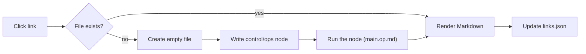

# Hallucipedia

An encyclopedia that does not exist until you read it.

Hallucipedia is a small wiki-shaped web app whose articles are written on demand by
an LLM. Every page is a Markdown file under `articles/`. Articles are dense with
internal links, and most of those links point at pages that have *not been written
yet*. Following one of them is what causes it to be written.

Broken links are not a bug here. They are the growth frontier.

---

## Contents

- [How it works](#how-it-works)
- [Directory layout](#directory-layout)
- [The interface](#the-interface)
- [Paths and linking](#paths-and-linking)
- [Rich content](#rich-content)
- [Illustration](#illustration)
- [`links.json`](#linksjson)
- [`control/notes.md` — setting the canon](#controlnotesmd--setting-the-canon)
- [Models](#models)
- [Tips](#tips)

---

## How it works

1. You navigate to a path, e.g. `physics/quantum_foam.md`.
2. If `articles/physics/quantum_foam.md` already exists, it is rendered immediately.
3. If it does not, the app creates the file as an empty stub and writes a docops
*node* for it at `control/ops/physics/quantum_foam.op.md`. The node points at the
stub, pulls in [`control/notes.md`](control/notes.md),
[`spec/main.op.md`](spec/main.op.md), the pages that link to the target and its
folder neighbours, and lists every page written so far. See [Op nodes](#op-nodes).
4. That node is the operation that runs. It reads `control/notes.md` (the world
bible), the article's path and the listed canon, and writes the article in place.
5. The rendered page is displayed, and `links.json` is updated with the new page and
its outgoing links.

The article's **path is its identity**. `articles/history/ardent_compact.md` becomes
"Ardent Compact", filed under History. There is no separate database of subjects —
the filesystem is the index.



## Directory layout

```
 hallucipedia/
   app.html            entry point / shell
   app.js              router, renderer, sidebar, generation triggers
   style.css           presentation
   idea.md             the original design sketch
   README.md           this file
   links.json          generated: page graph (pages + edges)
   control/
     notes.md          the world bible — universe, tone, visual identity
     seed.md           generated: the reader's setup prompt, verbatim
     setup.json        generated: marker that the world has been defined
      root.op.md        notes on the op-node format
      ops/              generated: one docops node per article
        root.op.md
        setup/          nodes for the first-run initialisation
        physics/
          quantum_foam.op.md
   spec/
     main.op.md        docop: write an article from scratch
     illustrate.op.md  docop: add figures/diagrams to an existing article
     search.op.md      docop: write a simulated search results page
     setup.op.md       docop: expand a reader prompt into control/notes.md
     front_page.op.md  docop: write articles/root.md for a fresh world
   articles/
     root.md           front page
     search/           generated: one results page per query
     physics/
       index.md
       quantum_foam.md
       images/
         quantum_foam_lead.png
     history/
     people/
     places/
```

`articles/` is the wiki root. Nothing outside it is browsable.
## First run: defining the world
On a workspace with no `control/setup.json` and no written pages, the app opens a setup dialog
before anything else. You type one or two sentences describing the world you want — *"a world of
shallow seas and glass beaches where light travels slowly enough to be farmed"* — and press
**Create it**. Three things then happen:
1. The prompt is stored verbatim in `control/seed.md`.
2. `control/ops/setup/notes.op.md` is written and run: [`spec/setup.op.md`](spec/setup.op.md)
expands the prompt into a full `control/notes.md` — premise, timeline anchors, departments, a
first vocabulary of fixed names, voice, visual identity and taboos.
3. `control/ops/setup/root.op.md` is written and run: [`spec/front_page.op.md`](spec/front_page.op.md)
writes `articles/root.md` against that new canon, using exactly the departments the bible names
and leaving thirty-odd red links as the growth frontier.
`links.json` is then reset, because the graph belongs to the old world. **Keep the current world**
skips the whole thing and just records the marker. The 🌱 button re-opens the dialog at any time;
running it again rewrites the bible and the front page but leaves existing articles alone — delete
them (or **Regenerate** them) if they belong to the previous world.


## The interface

**Address bar** — a fixed `articles/` prefix plus an editable path. Type any path and
press *Go* (or Enter) to visit it; if it does not exist, it gets written.

| Control | Effect |
|---|---|
| ← / → | Back and forward through your browsing history |
| ⌂ | Jump to the front page (`root.md`) |
| Go | Navigate to the typed path, generating on miss |
| 🔍 | Search the index, or hallucinate a results page for the query |
| 🎨 Illustrate | Run [`spec/illustrate.op.md`](spec/illustrate.op.md) on the current article |
| ↻ Regenerate | Rewrite the current article from scratch with `main.op.md` |
| 🌱 | Re-run the world setup (prompt → `notes.md` → `root.md`) |
| ⚙ | Open the model settings panel |

A status bar with a spinner appears while a generation is in flight.

**Sidebar**

- *On this page* — table of contents built from the article's `##` headings.
- *Links from here* — outgoing internal links; unwritten ones are styled as red links.
- *Linked from* — backlinks, taken from `links.json`.
- *All pages* — every article that currently exists, with a count badge.

## Search

The search box (`/` focuses it) does two different things.

**Locally**, as you type, it matches every term against the path, title and summary of every page
in `links.json` — written pages rank above promised ones — and drops the hits into a panel under
the box. This is an index lookup: instant, and it never generates anything.

**Simulated search** is the last row of that panel, and what pressing Enter does. The query is
slugified into a path — *"tidal glass harvest"* → `search/tidal_glass_harvest.md` — and that page
is generated like any other article, except through [`spec/search.op.md`](spec/search.op.md) and a
node that briefs it with the local matches, everything written so far and everything promised.
The result is a results page in the encyclopedia's own voice: eight to fifteen entries with
snippets, near matches, and related searches linking sibling `search/*.md` pages. Pages that
already exist come first with their real summaries; **at least two thirds of the results are
articles nobody has written yet**, so a search is itself a commissioning act.

Search pages are indices, not canon. Their snippets advertise an article; the article, when
someone follows the link, may say more — it just may not contradict pages that already exist.
Regenerating a search page re-runs the query against the index as it stands now.

## Paths and linking

Internal links are plain relative Markdown links ending in `.md`:

```md
[quantum foam](quantum_foam.md)
[Ardent Compact](../history/ardent_compact.md)
[Physics](/physics/index.md)
```

Rules the generator follows, and that you should follow if you hand-edit:

- Lowercase, `snake_case`, no spaces.
- Relative to the folder of the current article.
- A leading `/` means "relative to `articles/`".
- Never write the `articles/` prefix itself.
- Folder overviews live at `<folder>/index.md`.
- External `http://` links only inside an `## External resources` section, sparingly.

Every generated article carries at least eight internal links, deliberately weighted
toward pages that do not exist yet.

## Frontmatter

Each article begins with exactly these keys:

```yaml
---
title: Human Readable Title
summary: One sentence, ≤ 200 characters, describing the subject.
tags: tag-one, tag-two, tag-three
updated: YYYY-MM-DD
---
```

The title is rendered by the app, so the body must not repeat it as an `#` heading.

## Rich content

Rendering pipeline: `marked` → `DOMPurify` → Prism (code), Mermaid (diagrams),
MathJax (math).

- **Math** — `$E = mc^2$` inline, `$$…$$` for display. MathJax is configured in
`app.html` before the library loads, and skips `pre`, `code` and `textarea`.
- **Diagrams** — fenced ` ```mermaid ` blocks, Mermaid 11 syntax. Quote any label
containing spaces or punctuation; keep to roughly a dozen nodes.
- **Code** — fenced blocks are highlighted by Prism (`prism-tomorrow` theme).
- **Tables** — GFM tables are supported and encouraged for taxonomies and timelines.

All HTML is sanitised, so raw `<script>` or event handlers in an article will not run.

## Illustration

Pressing **Illustrate** runs [`spec/illustrate.op.md`](spec/illustrate.op.md) against
the current article. That operation is additive by contract: prose, section order,
frontmatter keys and existing links must survive unchanged. It inserts

- a lead image immediately after the opening paragraph (the infobox art),
- two to five supporting figures, each after the section it illustrates,
- Mermaid diagrams wherever structure or causality is described but not drawn.

Generated images are written to an `images/` folder sibling to the article and
referenced relatively:

```md

```

Alt text doubles as the caption, so it should be meaningful. The house visual style is
restrained and editorial — engraved plates, technical cutaways, museum photography —
with no text in the image and no watermarks.

`main.op.md` never invents image links; only `illustrate.op.md` does.
## Op nodes
Articles are never generated by invoking `spec/main.op.md` directly. Instead the app
writes a per-article node under `control/ops/`, mirroring the article path:
```
articles/physics/quantum_foam.md  ->  control/ops/physics/quantum_foam.op.md
articles/root.md                  ->  control/ops/root.op.md
```
The node contains
- `specifies:` — the single article being written,
- `related:` — `control/notes.md`, `spec/main.op.md`, every page that links *to* the
target, and the target's folder neighbours,
- a briefing section listing the inbound links with their summaries, every page
written so far, and every path already promised by a red link but not yet written.
This is what lets a new article see the wiki it is joining: it can quote existing
pages as canon and link to already-promised paths instead of inventing near-synonyms.
Nodes are derived data, like `links.json`. Deleting `control/ops/` is harmless — the
next generation rebuilds whatever it needs. Hand-editing a node before pressing
**Regenerate** is a supported way to steer one specific page.


## `links.json`

A generated index of the page graph. It records which pages currently exist and the
links between them, and it is what powers the *Linked from*, *Links from here* and
*All pages* panels, plus red-link styling.

```json
{
  "pages": {
"physics/quantum_foam.md": {
        "title": "Quantum Foam",
        "summary": "…",
        "links": ["physics/index.md", "history/ardent_compact.md"]
      }
  }
}
```

It is derived data. If it drifts, deleting it and re-browsing rebuilds it; nothing in
it is authoritative over the Markdown files themselves.

## `control/notes.md` — setting the canon

This is the one file you are meant to write by hand. It defines the universe the
encyclopedia describes, and it **overrides** the house style in the specs wherever
they conflict. Both operations read it first.

Useful things to put in it:

- The premise. *"Earth, 2190, after the Ardent Compact ended the water wars."*
- Hard constraints. Technologies that exist, names that are fixed, dates that anchor
the timeline.
- Tone. Dry and academic, or breathless and partisan.
- Visual identity for illustrations.
- Taboos — things the encyclopedia never discusses, or discusses only obliquely.

Leave it thin and the encyclopedia will invent its own world on the first few pages;
because later articles treat existing pages as canon, that world then hardens.

## Models

The ⚙ panel selects three models:

- **Smart** — article generation and illustration planning.
- **Fast** — light-weight passes.
- **Image** — figure generation for Illustrate.

The selection applies to every subsequent generation run.

## Consistency

Everything already written under `articles/` is canon. A new article that contradicts
an existing page is wrong and must align with it; it also reuses existing paths rather
than minting a synonym. Where canon is silent, the generator is instructed to *create*
canon — to choose specific, memorable details and state them as long established.

This is why the first dozen articles matter disproportionately. They set the names,
dates and terminology every later page has to agree with.

## Tips

- Start from `root.md` and let it seed the folder structure; hub pages generate the
densest link graphs.
- To steer a topic, write the linking sentence yourself in the parent article. Context
from inbound links feeds the generation.
- Don't like a page? **Regenerate** rewrites it wholesale. Edit `control/notes.md`
first if the problem is tonal rather than factual.
- Illustrate late. It is cheaper and more coherent once the prose has settled, and it
is designed to preserve whatever is already there.
- Deleting an article file is enough to un-write it; the next visit will write a new
one, informed by whatever now links to it.
Every list in the sidebar labels entries with their **full path** (`physics/index.md`,
not "Index"); the human-readable title is the tooltip.