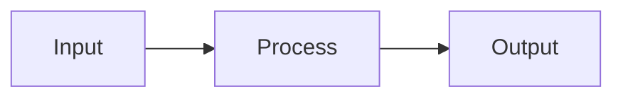

# Hallucipedia — Illustrate Document

The target file is an existing Hallucipedia article. Enrich it with visuals **without rewriting
it**: the prose, section order, frontmatter keys and every existing link must survive unchanged
except where a figure is inserted.

Read `control/notes.md` for the visual identity of this encyclopedia.

## What to add

1. **A lead image** directly after the opening paragraph, acting as the article's infobox art.
2. **2–5 supporting figures**, each placed immediately after the section it illustrates.
3. **Mermaid diagrams** wherever a relationship, process, hierarchy or timeline is described in
   prose but not yet drawn. Diagrams are preferred over images for structure, sequence and
   causality; images are preferred for subjects, places, objects and atmosphere.

## Image conventions

- Generated images are written next to the article, under an `images/` folder that is a sibling of
  the article file, and referenced with a relative path:
  ``
- File names are lowercase `snake_case` and descriptive.
- Every image needs meaningful alt text — it is the caption and the accessibility text.
- Image prompts should describe: subject, composition, medium/style, lighting and mood. Keep a
  single coherent visual style across all figures in one article, and across the encyclopedia:
  restrained, editorial, plate-like — think engraved plates, technical cutaways, museum
  photography — never text-in-image, never watermarks, never UI screenshots.

## Mermaid conventions

````

````

- Must parse under Mermaid 11. Quote labels containing spaces or punctuation.
- Keep to ~12 nodes; split large ideas into two diagrams.
- Follow each diagram with a one-line italic caption.

## Constraints

- Do not change `title`, `summary` or `tags` in the frontmatter; you may bump `updated`.
- Do not remove, reword or re-target existing links, headings or paragraphs.
- Do not add more than one figure per screenful of text.
- Output the complete updated Markdown document, nothing else.