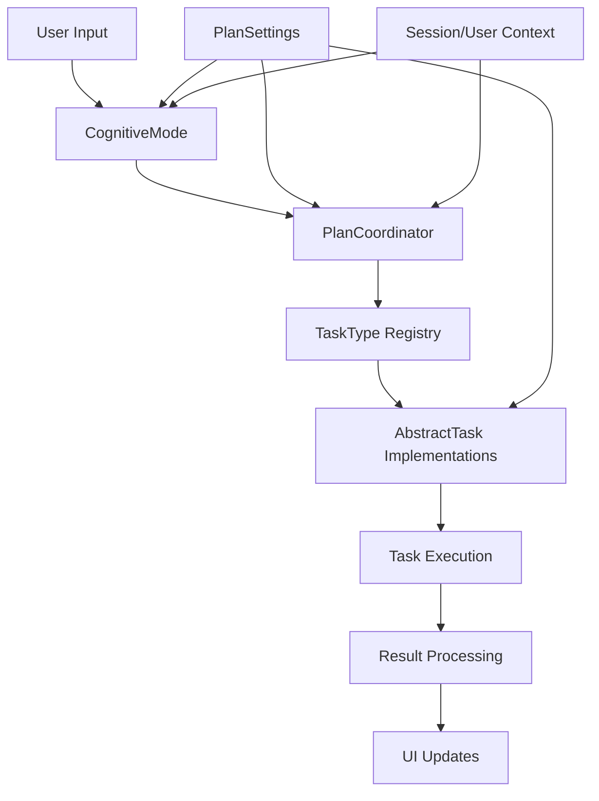

# Cognotik Cognitive Task System - Developer Documentation

## Table of Contents
1. [System Overview](#system-overview)
2. [Architecture](#architecture)
3. [Core Components](#core-components)
4. [Cognitive Modes](#cognitive-modes)
5. [Task System](#task-system)
6. [Implementation Guide](#implementation-guide)
7. [API Reference](#api-reference)
8. [Best Practices](#best-practices)

## System Overview

The Cognotik Cognitive Task System is a sophisticated AI-powered task planning and execution framework that enables intelligent decomposition, planning, and execution of complex software development tasks. The system combines multiple cognitive strategies with a flexible task execution engine to automate and assist with software development workflows.

### Key Features
- **Multiple Cognitive Modes**: Different planning strategies for various use cases
- **Dynamic Task Management**: Automatic task decomposition and dependency resolution
- **Extensible Task Types**: Pluggable task implementations for different operations
- **Real-time UI Updates**: WebSocket-based communication for live progress tracking
- **Intelligent Planning**: AI-driven task planning with context awareness

## Architecture

### High-Level Architecture

```
┌─────────────────────────────────────────────────────────────┐
│                     User Interface Layer                      │
│                    (WebSocket/SocketManager)                  │
└───────────────────┬─────────────────────────┬────────────────┘
                    │                         │
┌───────────────────▼─────────────┐ ┌────────▼────────────────┐
│      Cognitive Mode Layer       │ │    Task Execution Layer  │
│  (Planning & Decision Making)   │ │   (Task Implementation)  │
└───────────────────┬─────────────┘ └────────┬────────────────┘
                    │                         │
┌───────────────────▼─────────────────────────▼────────────────┐
│                    Plan Coordinator Layer                     │
│              (Orchestration & State Management)               │
└───────────────────┬───────────────────────────────────────────┘
                    │
┌───────────────────▼───────────────────────────────────────────┐
│                      Storage & Model Layer                     │
│                  (Data Persistence & AI Models)                │
└────────────────────────────────────────────────────────────────┘
```

### Component Relationships



## Core Components

### 1. PlanSettings

The `PlanSettings` class is the central configuration hub for the entire system:

```kotlin
class PlanSettings(
    var defaultModel: ApiChatModel?,           // Primary AI model
    var parsingModel: ApiChatModel?,           // Model for parsing responses
    val shellCmd: List<String>,                // Shell command configuration
    var temperature: Double = 0.2,             // AI temperature setting
    val budget: Double = 2.0,                  // Resource budget
    val taskSettings: MutableMap<String, TaskSettingsBase>, // Per-task settings
    var autoFix: Boolean = false,              // Auto-fix capability
    val env: Map<String, String>?,             // Environment variables
    val workingDir: String?,                   // Working directory
    val language: String?,                     // Programming language
    var maxTaskHistoryChars: Int = 10000,      // History limit
    var maxTasksPerIteration: Int = 3,         // Parallel task limit
    var maxIterations: Int = 10                // Maximum iterations
)
```

**Key Methods:**
- `instance(model: ApiChatModel): Chatter` - Creates chat instances
- `planningActor(describer: TypeDescriber)` - Creates planning actors
- `getTaskSettings(taskType: TaskType)` - Retrieves task-specific settings

### 2. PlanCoordinator

The `PlanCoordinator` orchestrates task execution and manages system state:

```kotlin
class PlanCoordinator(
    val user: User?,
    val session: Session,
    val dataStorage: StorageInterface,
    val planSettings: PlanSettings,
    val root: Path
) {
    // Lazy-loaded resources
    val pool: ExecutorService
    val files: Array<File>
    val codeFiles: Map<Path, String>

    // State management
    var planProcessingState: PlanProcessingState?

    // Core execution method
    fun executePlan(
        plan: Map<String, TaskConfigBase>,
        task: SessionTask,
        userMessage: String
    ): PlanProcessingState
}
```

**Responsibilities:**
- Task dependency resolution
- Parallel task execution
- State management
- Resource coordination

### 3. TaskType Registry

The `TaskType` system provides a dynamic, extensible task type registry:

```kotlin
class TaskType<T : TaskConfigBase, U : TaskSettingsBase>(
    name: String,
    val taskDataClass: Class<out T>,
    val taskSettingsClass: Class<out U>,
    val description: String?,
    val tooltipHtml: String?
) : DynamicEnum<TaskType<*, *>>(name)
```

**Available Task Types:**
- `FileModificationTask` - File creation and modification
- `CommandAutoFixTask` - Command execution with auto-fixing
- `TaskPlanningTask` - Hierarchical task planning
- `InsightTask` - Code analysis and insights
- `RunShellCommandTask` - Shell command execution
- `GitHubSearchTask` - GitHub API integration
- `EmbeddingSearchTask` - Semantic search capabilities
- And many more...

## Cognitive Modes

### Overview

Cognitive modes represent different planning and execution strategies:

```kotlin
interface CognitiveMode {
    val ui: SocketManager
    val planSettings: PlanSettings
    val session: Session
    val user: User?

    fun initialize()
    fun handleUserMessage(userMessage: String, task: SessionTask)
    fun contextData(): List<String>
}
```

### Available Modes

#### 1. PlanAheadMode
Traditional waterfall-style planning where all tasks are planned upfront:

```kotlin
class PlanAheadMode : CognitiveMode {
    // Creates complete plan before execution
    // Best for well-defined, predictable tasks
}
```

**Use Cases:**
- Well-defined requirements
- Predictable workflows
- Batch processing

#### 2. AutoPlanMode
Iterative planning with thinking status tracking:

```kotlin
class AutoPlanMode : CognitiveMode {
    data class ThinkingStatus(
        var initialPrompt: String?,
        var confidence: Double?,
        var iteration: Int,
        val goals: Goals?,
        val knowledge: Knowledge?,
        val executionContext: ExecutionContext?
    )
}
```

**Features:**
- Maintains thinking status across iterations
- Adaptive task selection
- Knowledge accumulation
- Reflection and improvement

**Use Cases:**
- Exploratory development
- Complex problem-solving
- Learning from execution

#### 3. GoalOrientedMode
Hierarchical goal decomposition with dependency management:

```kotlin
class GoalOrientedMode : CognitiveMode {
    data class Goal(
        val id: String,
        val description: String?,
        var status: GoalStatus?,
        val parentGoalId: String?,
        val subgoals: MutableList<Goal>?,
        val tasks: MutableList<Task>?,
        val dependencies: MutableList<String>?
    )
}
```

**Features:**
- Goal tree visualization
- Automatic dependency resolution
- Parallel execution optimization
- Progress tracking

**Use Cases:**
- Complex projects with multiple objectives
- Dependency-heavy workflows
- Long-running projects

#### 4. TaskChatMode
Conversational task execution with history:

```kotlin
class TaskChatMode : CognitiveMode {
    private val messages = ConcurrentLinkedQueue<ApiModel.ChatMessage>()
    // Maintains conversation context
    // Executes one task per message
}
```

**Use Cases:**
- Interactive development
- Quick task execution
- Conversational workflows

#### 5. GraphOrderedPlanMode
Software graph-based planning:

```kotlin
class GraphOrderedPlanMode : CognitiveMode {
    // Reads software graph from JSON
    // Orders nodes by priority
    // Generates dependency-aware plans
}
```

**Use Cases:**
- Codebase-wide refactoring
- Architecture-driven development
- Dependency-aware modifications

## Task System

### AbstractTask Base Class

All tasks extend the `AbstractTask` base class:

```kotlin
abstract class AbstractTask<T : TaskConfigBase>(
    val planSettings: PlanSettings,
    val taskConfig: T?
) {
    enum class TaskState {
        Pending, InProgress, Completed
    }

    abstract fun promptSegment(): String
    abstract fun run(
        agent: PlanCoordinator,
        messages: List<String>,
        task: SessionTask,
        resultFn: (String) -> Unit,
        planSettings: PlanSettings
    )
}
```

### Task Configuration

Tasks are configured using `TaskConfigBase`:

```kotlin
open class TaskConfigBase(
    val task_type: String?,
    var task_description: String?,
    var task_dependencies: MutableList<String>?,
    var state: AbstractTask.TaskState?
)
```

### Creating Custom Tasks

To create a custom task:

1. **Define Configuration Class:**
```kotlin
data class MyTaskConfig(
    val customParam: String,
    // ... other parameters
) : TaskConfigBase(
    task_type = "MyTask"
)
```

2. **Implement Task Class:**
```kotlin
class MyTask(
    planSettings: PlanSettings,
    taskConfig: MyTaskConfig?
) : AbstractTask<MyTaskConfig>(planSettings, taskConfig) {

    override fun promptSegment(): String {
        return "Description of what this task does"
    }

    override fun run(
        agent: PlanCoordinator,
        messages: List<String>,
        task: SessionTask,
        resultFn: (String) -> Unit,
        planSettings: PlanSettings
    ) {
        // Task implementation
        val result = executeTask()
        resultFn(result)
    }
}
```

3. **Register Task Type:**
```kotlin
companion object {
    val MyTaskType = TaskType(
        "MyTask",
        MyTaskConfig::class.java,
        TaskSettingsBase::class.java,
        "Description",
        "HTML tooltip"
    )

    init {
        TaskType.registerConstructor(MyTaskType) { settings, task ->
            MyTask(settings, task as? MyTaskConfig)
        }
    }
}
```

## Implementation Guide

### Setting Up a Cognitive Mode Session

```kotlin
// 1. Create PlanSettings
val planSettings = object : PlanSettings(
    defaultModel = ApiChatModel.GPT_4,
    workingDir = "/path/to/project"
) {
    override fun instance(model: ApiChatModel): Chatter {
        return ChatClient(model)
    }
}

// 2. Initialize SocketManager for UI
val socketManager = SocketManager(session)

// 3. Create Cognitive Mode
val cognitiveMode = AutoPlanMode(
    ui = socketManager,
    planSettings = planSettings,
    session = session,
    user = currentUser,
    describer = TypeDescriber()
)

// 4. Initialize and handle messages
cognitiveMode.initialize()
cognitiveMode.handleUserMessage(
    "Create a REST API for user management",
    socketManager.newTask()
)
```

### Task Execution Flow

```kotlin
// 1. Parse user intent into tasks
val tasks = parsedActor.answer(userMessage).obj.tasks

// 2. Create execution plan
val plan = tasks.associateBy { it.id }

// 3. Execute with PlanCoordinator
val coordinator = PlanCoordinator(
    user = user,
    session = session,
    dataStorage = storage,
    planSettings = planSettings,
    root = projectRoot
)

val result = coordinator.executePlan(
    plan = plan,
    task = uiTask,
    userMessage = userMessage
)
```

### Handling Dependencies

```kotlin
// Define tasks with dependencies
val task1 = FileModificationTaskConfig(
    task_description = "Create base class",
    task_dependencies = mutableListOf()
)

val task2 = FileModificationTaskConfig(
    task_description = "Create derived class",
    task_dependencies = mutableListOf("task1")
)

// PlanCoordinator automatically handles execution order
```

## API Reference

### Key Interfaces

#### CognitiveModeStrategy
```kotlin
interface CognitiveModeStrategy {
    val inputCnt: Int
    fun getCognitiveMode(
        ui: SocketManager,
        planSettings: PlanSettings,
        session: Session,
        user: User?,
        describer: TypeDescriber
    ): CognitiveMode
}
```

#### SessionTask
```kotlin
interface SessionTask {
    fun add(content: String): StringBuilder?
    fun complete(content: String? = null)
    fun error(throwable: Throwable)
    fun echo(content: String)
    fun verbose(content: String)
}
```

### Utility Classes

#### TabbedDisplay
Creates tabbed UI components:
```kotlin
val tabs = TabbedDisplay(task)
tabs["Tab 1"] = content1
tabs["Tab 2"] = content2
tabs.update()
```

#### FixedConcurrencyProcessor
Manages concurrent task execution:
```kotlin
val processor = FixedConcurrencyProcessor(executor, maxConcurrency = 4)
val future = processor.submit {
    // Task execution
}
```

## Best Practices

### 1. Task Design
- Keep tasks atomic and focused
- Define clear dependencies
- Provide detailed descriptions
- Handle errors gracefully

### 2. Cognitive Mode Selection
- Use `PlanAheadMode` for well-defined tasks
- Use `AutoPlanMode` for exploratory development
- Use `GoalOrientedMode` for complex projects
- Use `TaskChatMode` for interactive sessions

### 3. Performance Optimization
- Limit `maxTasksPerIteration` for resource management
- Use appropriate `maxTaskHistoryChars` to control context size
- Enable task types selectively based on needs
- Monitor and adjust `budget` settings

### 4. Error Handling
```kotlin
try {
    cognitiveMode.handleUserMessage(message, task)
} catch (e: DisabledTaskException) {
    // Handle disabled task
} catch (e: Exception) {
    task.error(e)
    log.error("Task execution failed", e)
}
```

### 5. Logging and Debugging
- Use structured logging for task execution
- Track task state transitions
- Monitor dependency resolution
- Log AI model interactions

### 6. Testing
```kotlin
@Test
fun testTaskExecution() {
    val mockSettings = createMockSettings()
    val task = MyTask(mockSettings, config)

    val result = StringBuilder()
    task.run(
        agent = mockCoordinator,
        messages = listOf("test message"),
        task = mockSessionTask,
        resultFn = { result.append(it) },
        planSettings = mockSettings
    )

    assertEquals(expectedResult, result.toString())
}
```

## Advanced Topics

### Custom Describer Implementation
```kotlin
class CustomDescriber : TypeDescriber {
    override fun describe(clazz: Class<*>): String {
        // Custom type description logic
    }
}
```

### Task Chaining and Pipelines
```kotlin
val pipeline = TaskPipeline()
    .addTask(FileModificationTask())
    .addTask(RunShellCommandTask())
    .addTask(InsightTask())
    .execute(coordinator)
```

### Dynamic Task Generation
```kotlin
fun generateTasks(context: Context): List<TaskConfigBase> {
    return context.files.map { file ->
        FileModificationTaskConfig(
            files = listOf(file),
            task_description = "Process ${file}"
        )
    }
}
```
