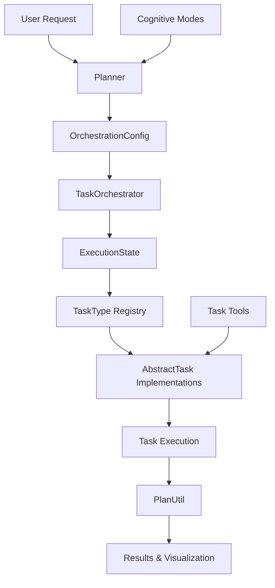

# Cognotik Plan Package - Developer Documentation

## Table of Contents

1. [Overview](#overview)
2. [Architecture](#architecture)
3. [Core Components](#core-components)
4. [Task System](#task-system)
5. [Cognitive Modes](#cognitive-modes)
6. [Task Tools](#task-tools)
7. [Usage Examples](#usage-examples)
8. [Best Practices](#best-practices)

## Overview

The `com.simiacryptus.cognotik.plan` package is the orchestration layer of Cognotik that manages AI-driven task planning, decomposition, and execution. It provides a flexible framework for breaking down complex software development tasks into manageable subtasks, managing dependencies, and coordinating their execution.

### Key Features

- **Intelligent Task Planning**: AI-powered decomposition of complex tasks into executable subtasks
- **Dependency Management**: Automatic resolution and ordering of task dependencies
- **Multiple Cognitive Modes**: Different planning strategies for various workflows
- **Extensible Task Types**: Pluggable task implementations for different operations
- **Real-time Orchestration**: Dynamic task execution with state management
- **Visualization**: Mermaid diagram generation for task dependency graphs

### Package Structure

```
com.simiacryptus.cognotik.plan/
├── AbstractTask.kt              # Base class for all task implementations
├── DisabledTaskException.kt     # Exception for disabled task types
├── ExecutionState.kt            # State management for task execution
├── OrchestrationConfig.kt       # Configuration for orchestration
├── PlanUtil.kt                  # Utility functions for plan management
├── Planner.kt                   # Base planner for task breakdown
├── TaskBreakdownWithPrompt.kt   # Data structure for plan representation
├── TaskConfigBase.kt            # Base configuration for tasks
├── TaskOrchestrator.kt          # Main orchestrator for task execution
├── TaskSettingsBase.kt          # Base settings for task types
├── TaskType.kt                  # Task type registry
├── cognitive/                   # Cognitive mode implementations
│   ├── CognitiveMode.kt
│   ├── AdaptivePlanningMode.kt
│   ├── ConversationalMode.kt
│   ├── DependencyGraphMode.kt
│   ├── HierarchicalPlanningMode.kt
│   └── WaterfallMode.kt
└── tools/                       # Task implementation tools
    ├── file/                    # File operation tasks
    ├── graph/                   # Software graph tasks
    ├── knowledge/               # Knowledge management tasks
    ├── online/                  # Web/online tasks
    └── session/                 # Interactive session tasks
```

## Architecture

### Component Diagram



### Data Flow

1. **Planning Phase**: User request → Planner → AI model → TaskBreakdownWithPrompt
2. **Setup Phase**: TaskBreakdownWithPrompt → TaskOrchestrator → ExecutionState
3. **Execution Phase**: ExecutionState → Task Queue → AbstractTask instances → Results
4. **Monitoring Phase**: ExecutionState updates → PlanUtil → Mermaid diagrams → UI

## Core Components

### Planner

The `Planner` class is responsible for converting user requests into structured task plans.

```kotlin
open class Planner {
    open fun initialPlan(
        codeFiles: Map<Path, String>,
        files: Array<File>,
        root: Path,
        task: SessionTask,
        userMessage: String,
        orchestrationConfig: OrchestrationConfig,
        contextFn: () -> List<String> = { emptyList() },
        describer: TypeDescriber
    ): TaskBreakdownWithPrompt
    
    open fun newPlan(
        orchestrationConfig: OrchestrationConfig,
        inStrings: List<String>,
        describer: TypeDescriber
    ): ParsedResponse<Map<String, TaskConfigBase>>
}
```

**Key Responsibilities:**
- Analyzes user requests and code context
- Generates structured task plans using AI models
- Handles interactive plan refinement (if autoFix is disabled)
- Produces TaskBreakdownWithPrompt with task breakdown

**Usage:**
```kotlin
val planner = Planner()
val plan = planner.initialPlan(
    codeFiles = projectFiles,
    files = fileArray,
    root = projectRoot,
    task = sessionTask,
    userMessage = "Refactor the authentication module",
    orchestrationConfig = config,
    describer = typeDescriber
)
```

### TaskOrchestrator

The `TaskOrchestrator` class manages the execution of task plans.

```kotlin
class TaskOrchestrator(
    val user: User?,
    val session: Session,
    val dataStorage: StorageInterface,
    val orchestrationConfig: OrchestrationConfig,
    val root: Path
) {
    fun executePlan(
        plan: Map<String, TaskConfigBase>,
        task: SessionTask,
        userMessage: String
    ): ExecutionState
}
```

**Key Responsibilities:**
- Executes task plans with proper dependency ordering
- Manages concurrent task execution with thread pooling
- Tracks execution state and task results
- Generates and updates dependency graph visualizations
- Handles task failures and retries

**Features:**
- Parallel execution of independent tasks
- Maximum tasks per iteration limit
- Task result aggregation
- Real-time UI updates via tabs

### OrchestrationConfig

Configuration class that controls orchestration behavior.

```kotlin
open class OrchestrationConfig(
    var defaultModel: ApiChatModel? = null,
    var parsingModel: ApiChatModel? = null,
    val shellCmd: List<String> = listOf(if (isWindows) "powershell" else "bash"),
    var temperature: Double = 0.2,
    val budget: Double = 2.0,
    val taskSettings: MutableMap<String, TaskSettingsBase> = ...,
    var autoFix: Boolean = false,
    val env: Map<String, String>? = mapOf(),
    val workingDir: String? = ".",
    val language: String? = if (isWindows) "powershell" else "bash",
    var maxTaskHistoryChars: Int = 10000,
    var maxTasksPerIteration: Int = 3,
    var maxIterations: Int = 10
)
```

**Key Settings:**
- `defaultModel`: Primary AI model for task execution
- `parsingModel`: Model for parsing structured responses
- `taskSettings`: Per-task type configuration and enablement
- `autoFix`: Whether to execute plans without user confirmation
- `maxTasksPerIteration`: Concurrency control
- `maxIterations`: Maximum number of execution iterations

**Methods:**
- `planningActor(describer)`: Creates a ParsedAgent for generating plans
- `copy(...)`: Creates modified configuration copies
- `instance(model)`: Creates ChatInterface instances

### PlanUtil

Utility object with helper functions for plan management.

```kotlin
object PlanUtil {
    fun diagram(taskMap: Map<String, TaskConfigBase>): String
    fun render(withPrompt: TaskBreakdownWithPrompt): String
    fun executionOrder(tasks: Map<String, TaskConfigBase>): List<String>
    fun buildMermaidGraph(subTasks: Map<String, TaskConfigBase>): String
    fun filterPlan(retries: Int = 3, fn: () -> Map<String, TaskConfigBase>?): Map<String, TaskConfigBase>?
    fun getAllDependencies(subPlanTask: TaskConfigBase, subTasks: Map<String, TaskConfigBase>, visited: MutableSet<String>): List<String>
}
```

**Key Functions:**
- `executionOrder()`: Determines topological order for task execution
- `buildMermaidGraph()`: Generates Mermaid diagram for dependency visualization
- `filterPlan()`: Validates and filters task dependencies, detects circular dependencies
- `render()`: Creates tabbed display with text, JSON, and diagram views
- `getAllDependencies()`: Recursively collects all task dependencies

## Task System

### AbstractTask

Base class for all task implementations.

```kotlin
abstract class AbstractTask<T : TaskConfigBase>(
    val orchestrationConfig: OrchestrationConfig,
    val taskConfig: T?
) {
    var state: TaskState? = TaskState.Pending
    protected val codeFiles = mutableMapOf<Path, String>()
    
    enum class TaskState {
        Pending,
        InProgress,
        Completed
    }
    
    abstract fun promptSegment(): String
    
    abstract fun run(
        agent: TaskOrchestrator,
        messages: List<String> = listOf(),
        task: SessionTask,
        resultFn: (String) -> Unit,
        orchestrationConfig: OrchestrationConfig
    )
    
    open fun getPriorCode(executionState: ExecutionState): String
}
```

**Key Methods:**
- `promptSegment()`: Returns a description of what the task does (used in planning prompts)
- `run()`: Executes the task logic
- `getPriorCode()`: Retrieves results from dependency tasks
- `acceptButtonFooter()`: Creates UI accept buttons for interactive tasks

**Lifecycle:**
1. Task is created with configuration
2. State is set to `InProgress`
3. `run()` is called with necessary context
4. Results are passed to `resultFn`
5. State is set to `Completed`

### TaskType

Registry for task type definitions.

```kotlin
class TaskType<out T : TaskConfigBase, out U : TaskSettingsBase>(
    name: String,
    val taskDataClass: Class<out T>,
    val taskSettingsClass: Class<out U>,
    val description: String? = null,
    val tooltipHtml: String? = null
) : DynamicEnum<TaskType<*, *>>(name)
```

**Key Features:**
- Dynamic enum pattern for extensibility
- Type-safe task configuration and settings classes
- Constructor registration for task instantiation
- Description and tooltip for UI display

**Static Methods:**
- `registerConstructor()`: Registers task type constructor
- `values()`: Returns all registered task types
- `getImpl()`: Creates task instance from configuration
- `valueOf()`: Looks up task type by name

**Example Registration:**
```kotlin
val FileModificationTaskType = TaskType(
    "FileModificationTask",
    FileModificationTaskConfigData::class.java,
    TaskSettingsBase::class.java,
    "Modify existing source files",
    "Edits files based on instructions..."
)

TaskType.registerConstructor(FileModificationTaskType) { config, task ->
    FileModificationTask(config, task as? FileModificationTaskConfigData)
}
```

### TaskConfigBase

Base configuration class for all tasks.

```kotlin
open class TaskConfigBase(
    val task_type: String? = null,
    var task_description: String? = null,
    var task_dependencies: MutableList<String>? = null,
    var state: AbstractTask.TaskState? = null
)
```

**Properties:**
- `task_type`: Identifier for the TaskType (must match registered TaskType name)
- `task_description`: Human-readable description of the task
- `task_dependencies`: List of task IDs that must complete before this task
- `state`: Current execution state

**JSON Serialization:**
- Uses custom type resolver based on `task_type` property
- Polymorphic deserialization to correct task configuration subclass
- Task-specific properties are defined in subclasses

### TaskSettingsBase

Base settings class for task types.

```kotlin
open class TaskSettingsBase(
    val task_type: String? = null,
    var enabled: Boolean = false,
    var model: ApiChatModel? = null
)
```

**Properties:**
- `task_type`: Associated TaskType identifier
- `enabled`: Whether this task type is available for use
- `model`: Optional model override for this task type

**Usage:**
Task-specific settings can extend this class with additional configuration options.

### TaskBreakdownWithPrompt

Data structure representing a complete task plan.

```kotlin
data class TaskBreakdownWithPrompt(
    val prompt: String,
    val plan: Map<String, TaskConfigBase>,
    val planText: String
)
```

**Properties:**
- `prompt`: Original user request
- `plan`: Map of task ID to task configuration
- `planText`: AI-generated textual description of the plan

**Usage:**
This structure bridges the planning and execution phases, containing both the structured task breakdown and the original context.

### ExecutionState

Mutable state tracking for task execution.

```kotlin
data class ExecutionState(
    val subTasks: Map<String, TaskConfigBase>,
    val tasksByDescription: MutableMap<String?, TaskConfigBase> = ...,
    val taskIdProcessingQueue: MutableList<String> = ...,
    val taskResult: MutableMap<String, String> = mutableMapOf(),
    val completedTasks: MutableList<String> = mutableListOf(),
    val taskFutures: MutableMap<String, Future<*>> = mutableMapOf(),
    val uitaskMap: MutableMap<String, SessionTask> = mutableMapOf()
)
```

**Properties:**
- `subTasks`: All tasks in the plan
- `tasksByDescription`: Quick lookup by description
- `taskIdProcessingQueue`: Ordered queue of tasks to execute
- `taskResult`: Accumulated results from completed tasks
- `completedTasks`: List of completed task IDs
- `taskFutures`: Active execution futures for async tasks
- `uitaskMap`: UI session tasks for each task ID

**Lifecycle:**
- Created by TaskOrchestrator from TaskBreakdownWithPrompt
- Updated during execution as tasks complete
- Used to track overall plan progress

### DisabledTaskException

Exception thrown when attempting to use a disabled task type.

```kotlin
class DisabledTaskException(taskType: TaskType<*, *>) : Exception("Task type $taskType is disabled")
```

**Usage:**
Thrown by TaskType.getImpl() when taskSettings.enabled is false for a task type.

## Cognitive Modes

Cognitive modes define different strategies for planning and executing tasks. They implement the `CognitiveMode` interface.

### CognitiveMode Interface

```kotlin
interface CognitiveMode {
    val ui: SocketManager
    val orchestrationConfig: OrchestrationConfig
    val session: Session
    val user: User?
    
    fun initialize()
    fun handleUserMessage(userMessage: String, task: SessionTask)
    fun contextData(): List<String>
}

interface CognitiveModeStrategy {
    val inputCnt: Int
    fun getCognitiveMode(
        ui: SocketManager,
        orchestrationConfig: OrchestrationConfig,
        session: Session,
        user: User?,
        describer: TypeDescriber
    ): CognitiveMode
}
```

### Available Modes

#### 1. WaterfallMode
Linear, sequential execution of tasks with clear phases.
- Plans all tasks upfront
- Executes in strict dependency order
- Best for well-defined workflows

#### 2. DependencyGraphMode
Executes tasks based on dependency graph with maximum parallelism.
- Automatically identifies independent tasks
- Executes parallel tasks concurrently
- Best for large plans with independent subtasks

#### 3. HierarchicalPlanningMode
Breaks down complex tasks hierarchically into sub-plans.
- Top-level planning creates high-level tasks
- Each high-level task can spawn sub-plans
- Best for complex, multi-layered problems

#### 4. AdaptivePlanningMode
Dynamically adjusts plans based on execution results.
- Monitors task results
- Adjusts future tasks based on outcomes
- Best for exploratory or uncertain tasks

#### 5. ConversationalMode
Interactive mode with user guidance at each step.
- Presents plan for user review
- Allows modifications between steps
- Best for collaborative development

### Choosing a Cognitive Mode

```kotlin
val mode: CognitiveMode = when (requirement) {
    "predictable" -> WaterfallMode(...)
    "parallel" -> DependencyGraphMode(...)
    "complex" -> HierarchicalPlanningMode(...)
    "exploratory" -> AdaptivePlanningMode(...)
    "interactive" -> ConversationalMode(...)
    else -> DependencyGraphMode(...) // default
}
```

## Task Tools

The `tools` subdirectory contains concrete task implementations organized by category.

### File Tasks (`tools/file/`)

#### AbstractFileTask
Base class for file operation tasks with common file handling utilities.

#### FileModificationTask
Modifies existing files based on natural language instructions.
- Supports multiple file modifications
- Can include git diff context
- Generates file modification diffs
- Allows user review before applying

**Configuration:**
```kotlin
FileModificationTaskConfigData(
    files = listOf("src/main/kotlin/App.kt"),
    modifications = "Add error handling to the login method",
    includeGitDiff = true,
    task_description = "Add error handling"
)
```

#### AnalysisTask
Analyzes code and generates reports.
- Examines code structure
- Identifies patterns and issues
- Produces analysis reports

#### FileSearchTask
Searches for files matching criteria.
- Glob pattern support
- Content searching
- Returns file listings

### Graph Tasks (`tools/graph/`)

#### SoftwareGraphGenerationTask
Generates software graph representations of codebases.
- Analyzes code structure
- Identifies relationships
- Creates graph representation

#### SoftwareGraphModificationTask
Modifies existing software graphs.
- Loads graph from JSON
- Applies targeted modifications
- Saves updated graph

#### SoftwareGraphPlanningTask
Generates task plans based on software graph context.
- Uses graph structure for planning
- Considers dependencies
- Creates graph-aware plans

#### DataTableCompilationTask
Compiles structured data from multiple files.
- Extracts tabular data
- Supports custom row/column definitions
- Outputs JSON and markdown tables

### Knowledge Tasks (`tools/knowledge/`)

#### KnowledgeIndexingTask
Creates searchable indices of documentation.
- Indexes documentation
- Creates embeddings
- Enables semantic search

#### VectorSearchTask
Performs semantic searches on indexed knowledge.
- Uses vector similarity
- Returns relevant documentation
- Provides context for other tasks

### Online Tasks (`tools/online/`)

#### CrawlerAgentTask
Web crawling with AI-guided navigation.
- Follows links intelligently
- Extracts relevant content
- Handles JavaScript-rendered sites

#### GoogleSearch
Searches using Google search API.

#### GitHubSearchTask
Searches GitHub repositories and code.

### Session Tasks (`tools/session/`)

#### RunShellCommandTask
Executes shell commands.
- Runs in configured shell
- Captures output
- Supports environment variables

#### CommandSessionTask
Interactive command-line sessions.
- Maintains session state
- Supports multi-step interactions
- Captures session output

#### SeleniumSessionTask
Browser automation tasks.
- Web UI testing
- Data extraction
- Automated interactions

### RunCodeTask
Executes code snippets.
- Supports multiple languages
- Sandboxed execution
- Returns execution results

### SelfHealingTask
Automatically fixes failed tasks.
- Analyzes failure reasons
- Attempts corrections
- Retries execution

## Usage Examples

### Example 1: Basic Task Planning and Execution

```kotlin
// Setup configuration
val config = OrchestrationConfig(
    defaultModel = ApiChatModel.GPT4,
    autoFix = false,
    maxTasksPerIteration = 3
)

// Create orchestrator
val orchestrator = TaskOrchestrator(
    user = currentUser,
    session = currentSession,
    dataStorage = storage,
    orchestrationConfig = config,
    root = projectRoot
)

// Generate plan
val planner = Planner()
val breakdown = planner.initialPlan(
    codeFiles = orchestrator.codeFiles,
    files = orchestrator.files,
    root = projectRoot,
    task = sessionTask,
    userMessage = "Refactor authentication to use OAuth2",
    orchestrationConfig = config,
    describer = orchestrator.describer
)

// Execute plan
val executionState = orchestrator.executePlan(
    plan = breakdown.plan,
    task = sessionTask,
    userMessage = breakdown.prompt
)
```

### Example 2: Custom Task Implementation

```kotlin
// 1. Define configuration data class
data class MyCustomTaskConfigData(
    val customParam: String,
    task_description: String? = null,
    task_dependencies: List<String>? = null,
    state: TaskState? = null
) : TaskConfigBase(
    task_type = "MyCustomTask",
    task_description = task_description,
    task_dependencies = task_dependencies?.toMutableList(),
    state = state
)

// 2. Implement task class
class MyCustomTask(
    orchestrationConfig: OrchestrationConfig,
    taskConfig: MyCustomTaskConfigData?
) : AbstractTask<MyCustomTaskConfigData>(orchestrationConfig, taskConfig) {
    
    override fun promptSegment(): String {
        return "Performs custom operation on ${taskConfig?.customParam}"
    }
    
    override fun run(
        agent: TaskOrchestrator,
        messages: List<String>,
        task: SessionTask,
        resultFn: (String) -> Unit,
        orchestrationConfig: OrchestrationConfig
    ) {
        // Get results from dependency tasks
        val priorCode = getPriorCode(agent.executionState!!)
        
        // Perform task logic
        task.echo("Processing ${taskConfig?.customParam}")
        val result = performCustomOperation()
        
        // Return result
        resultFn(result)
    }
    
    private fun performCustomOperation(): String {
        // Implementation
        return "Operation completed"
    }
}

// 3. Register task type
val MyCustomTaskType = TaskType(
    "MyCustomTask",
    MyCustomTaskConfigData::class.java,
    TaskSettingsBase::class.java,
    "Performs custom operations",
    "<ul><li>Custom feature 1</li><li>Custom feature 2</li></ul>"
)

TaskType.registerConstructor(MyCustomTaskType) { config, task ->
    MyCustomTask(config, task as? MyCustomTaskConfigData)
}
```

### Example 3: Using PlanUtil for Visualization

```kotlin
// Generate task plan
val plan = mapOf(
    "task1" to TaskConfigBase(
        task_type = "FileModificationTask",
        task_description = "Update configuration",
        task_dependencies = mutableListOf()
    ),
    "task2" to TaskConfigBase(
        task_type = "AnalysisTask",
        task_description = "Analyze changes",
        task_dependencies = mutableListOf("task1")
    )
)

// Get execution order
val order = PlanUtil.executionOrder(plan)
println("Execution order: $order") // [task1, task2]

// Generate Mermaid diagram
val diagram = PlanUtil.buildMermaidGraph(plan)
// Returns Mermaid graph TD; syntax with task nodes and dependencies

// Render in UI
val rendered = PlanUtil.render(TaskBreakdownWithPrompt(
    prompt = "Update and analyze",
    plan = plan,
    planText = "Plan to update configuration and analyze changes"
))
```

### Example 4: Filtering and Validating Plans

```kotlin
// Filter plan to remove invalid dependencies
val validPlan = PlanUtil.filterPlan {
    aiGeneratedPlan // May contain invalid task references
}

// Detect circular dependencies (throws RuntimeException)
try {
    PlanUtil.executionOrder(planWithCircularDeps)
} catch (e: RuntimeException) {
    println("Circular dependency detected: ${e.message}")
}

// Get all transitive dependencies
val visited = mutableSetOf<String>()
val allDeps = PlanUtil.getAllDependencies(
    subPlanTask = plan["task5"]!!,
    subTasks = plan,
    visited = visited
)
```

## Best Practices

### Planning Best Practices

1. **Enable Appropriate Task Types**: Only enable task types needed for your use case to reduce AI confusion
   ```kotlin
   config.taskSettings["FileModificationTask"]?.enabled = true
   config.taskSettings["UnneededTask"]?.enabled = false
   ```

2. **Provide Good Context**: Supply relevant code files and context functions
   ```kotlin
   planner.initialPlan(
       contextFn = { listOf(projectREADME, architectureDoc) }
   )
   ```

3. **Use Appropriate Models**: Choose models based on task complexity
   ```kotlin
   config.defaultModel = ApiChatModel.GPT4_TURBO  // For complex planning
   config.parsingModel = ApiChatModel.GPT35_TURBO // For parsing
   ```

### Execution Best Practices

1. **Set Reasonable Limits**: Control concurrency and iteration limits
   ```kotlin
   config.maxTasksPerIteration = 3  // Balance speed and resource usage
   config.maxIterations = 10        // Prevent infinite loops
   ```

2. **Handle Failures Gracefully**: Use try-catch and consider SelfHealingTask
   ```kotlin
   try {
       orchestrator.executePlan(plan, task, userMessage)
   } catch (e: Exception) {
       log.error("Execution failed", e)
       // Consider retry or plan revision
   }
   ```

3. **Monitor Execution State**: Track progress and results
   ```kotlin
   val state = executionState
   println("Completed: ${state.completedTasks.size}/${state.subTasks.size}")
   ```

### Task Implementation Best Practices

1. **Clear Prompt Segments**: Provide clear descriptions in promptSegment()
   ```kotlin
   override fun promptSegment() = 
       "Analyzes ${files.size} files for code quality issues"
   ```

2. **Use getPriorCode()**: Leverage dependency task results
   ```kotlin
   val context = getPriorCode(executionState)
   // Use context in task execution
   ```

3. **Report Progress**: Update UI with task.echo() and task.add()
   ```kotlin
   task.echo("Starting analysis...")
   task.add("Found 5 issues")
   ```

4. **Validate Configuration**: Check taskConfig for required fields
   ```kotlin
   require(taskConfig?.files?.isNotEmpty() == true) {
       "Files list cannot be empty"
   }
   ```

### Configuration Best Practices

1. **Version Control Settings**: Store OrchestrationConfig as JSON
   ```kotlin
   val json = JsonUtil.toJson(config)
   File("config.json").writeText(json)
   ```

2. **Environment-Specific Config**: Use different configs for dev/prod
   ```kotlin
   val devConfig = config.copy(autoFix = false)
   val prodConfig = config.copy(autoFix = true, maxTasksPerIteration = 5)
   ```

3. **Budget Management**: Set appropriate budgets for cost control
   ```kotlin
   config.budget = 2.0 // $2.00 limit
   ```

### Debugging Best Practices

1. **Enable Detailed Logging**: Use LoggerFactory for debugging
   ```kotlin
   private val log = LoggerFactory.getLogger(MyTask::class.java)
   log.debug("Task state: ${taskConfig}")
   ```

2. **Visualize Dependency Graphs**: Use PlanUtil.diagram() to understand plans
   ```kotlin
   val diagram = PlanUtil.diagram(plan)
   task.add(diagram) // Display in UI
   ```

3. **Inspect Execution State**: Check state during debugging
   ```kotlin
   executionState.taskResult.forEach { (id, result) ->
       println("Task $id: ${result.take(100)}...")
   }
   ```

4. **Test Plans Incrementally**: Start with small plans and expand
   ```kotlin
   // Start with 1-2 tasks
   val simplePlan = mapOf("task1" to config)
   // Then expand to full plan
   ```

### Performance Best Practices

1. **Optimize File Loading**: Load only necessary files
   ```kotlin
   val codeFiles = files.filter { it.extension in listOf("kt", "java") }
   ```

2. **Use Caching**: PlanUtil caches Mermaid graphs automatically
   ```kotlin
   // Repeated calls use cached results
   val graph = PlanUtil.buildMermaidGraph(plan)
   ```

3. **Parallel Execution**: Leverage DependencyGraphMode for parallelism
   ```kotlin
   val mode = DependencyGraphMode(...) // Auto parallelizes
   ```

4. **Limit History Size**: Control memory usage
   ```kotlin
   config.maxTaskHistoryChars = 10000 // Reasonable limit
   ```

## Conclusion

The Cognotik plan package provides a powerful and flexible framework for AI-driven task orchestration. By understanding the core components, task system, cognitive modes, and best practices, developers can effectively leverage this system to automate complex software development workflows.

For specific task type documentation, see:
- [Task Types](task_types.md)
- [Cognitive Tasks](cognitive-tasks.md)

For WebSocket UI integration, see:
- [WebSocket UI](websocket_ui.md)
