# GeneticOptimizationTask Technical Documentation

## Overview

The `GeneticOptimizationTask` implements a genetic algorithm for iterative text optimization. It evolves text through multiple generations using mutation, crossover, and selection strategies to maximize fitness scores based on configurable evaluation criteria.

## Architecture

### Class Hierarchy

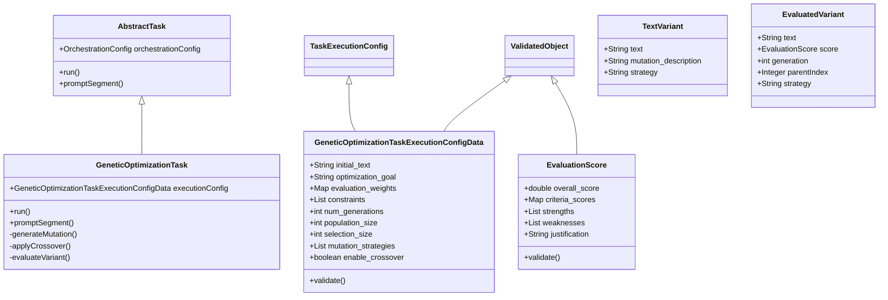

## Data Flow

### High-Level Process Flow

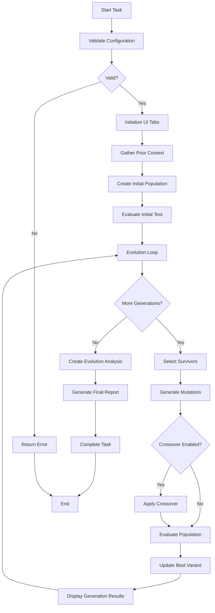

### Detailed Evolution Loop

```mermaid
flowchart TD
    A[Start Generation N] --> B[Sort Previous Population by Score]
    B --> C[Select Top K Survivors]

    C --> D[Calculate Mutations Needed]
    D --> E[For Each Survivor]

    E --> F[Calculate Mutations Per Survivor]
    F --> G[For Each Mutation Slot]

    G --> H[Select Random Strategy]
    H --> I[Call generateMutation]

    I --> J[AI Agent: Generate Variant]
    J --> K[Parse TextVariant Response]
    K --> L[Create EvaluatedVariant]
    L --> M{More Mutations?}

    M -->|Yes| G
    M -->|No| N{More Survivors?}

    N -->|Yes| E
    N -->|No| O{Crossover Enabled?}

    O -->|Yes| P[Select Top 2 Survivors]
    P --> Q[Call applyCrossover]
    Q --> R[AI Agent: Combine Traits]
    R --> S[Create Crossover Variant]
    S --> T[Combine Survivors + New Variants]

    O -->|No| T

    T --> U[For Each Variant]
    U --> V{Already Evaluated?}
    V -->|No| W[Call evaluateVariant]
    W --> X[AI Agent: Score Variant]
    X --> Y[Parse EvaluationScore]
    Y --> Z[Update Variant Score]

    V -->|Yes| AA{More Variants?}
    Z --> AA

    AA -->|Yes| U
    AA -->|No| AB[Find Best in Generation]
    AB --> AC{Better than Global Best?}
    AC -->|Yes| AD[Update Global Best]
    AC -->|No| AE[Display Results]
    AD --> AE
    AE --> AF[Update UI Tabs]
    AF --> AG[End Generation N]
```

## Component Interactions

### AI Agent Interaction Pattern

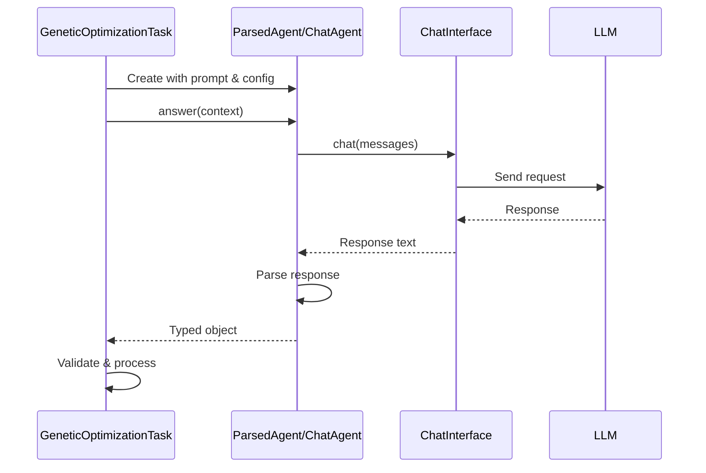

### Mutation Generation Flow

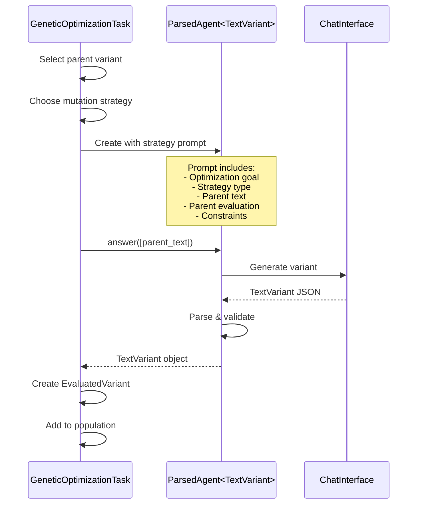

### Evaluation Flow

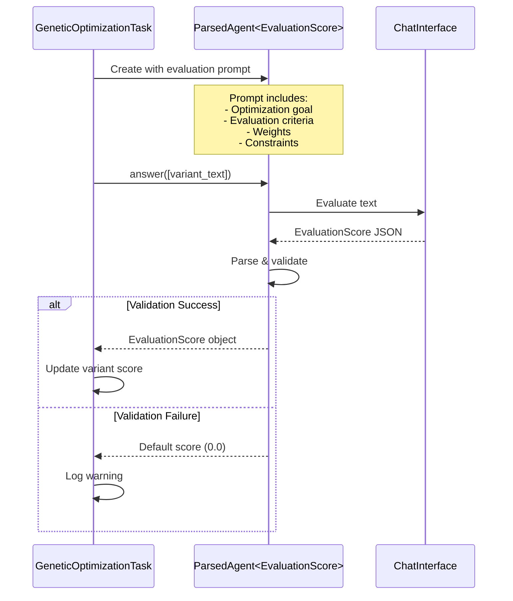

## Data Structures

### Configuration Data Flow

```mermaid
flowchart LR
    A[User Input] --> B[GeneticOptimizationTaskExecutionConfigData]
    B --> C{validate()}
    C -->|Valid| D[Task Execution]
    C -->|Invalid| E[Error Response]

    D --> F[Extract Parameters]
    F --> G[initial_text]
    F --> H[optimization_goal]
    F --> I[num_generations]
    F --> J[population_size]
    F --> K[selection_size]
    F --> L[mutation_strategies]
    F --> M[enable_crossover]
    F --> N[evaluation_weights]
    F --> O[constraints]

    G --> P[Evolution Process]
    H --> P
    I --> P
    J --> P
    K --> P
    L --> P
    M --> P
    N --> P
    O --> P
```

### Population Evolution Data Structure

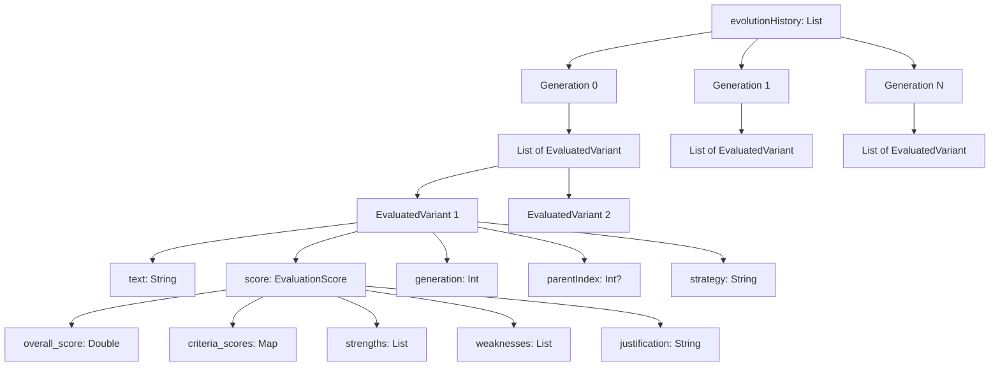

## Algorithm Details

### Selection Strategy

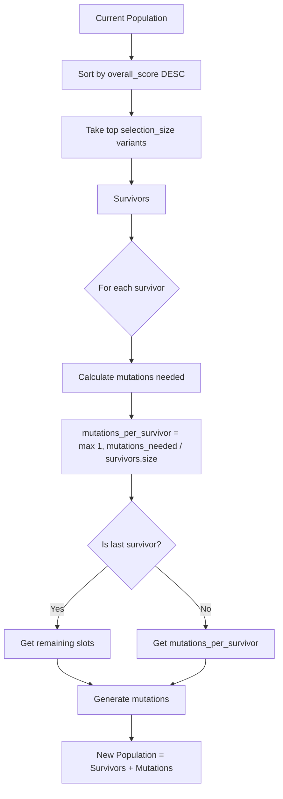

### Fitness Calculation

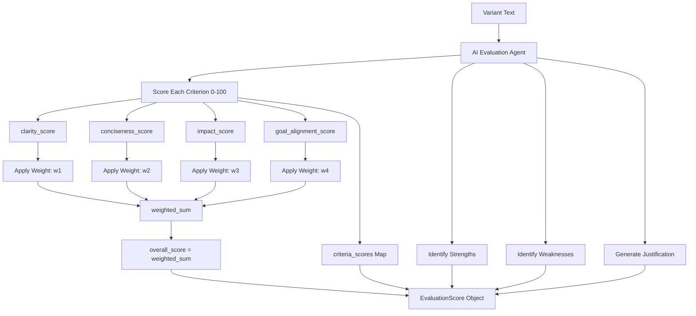

### Crossover Mechanism

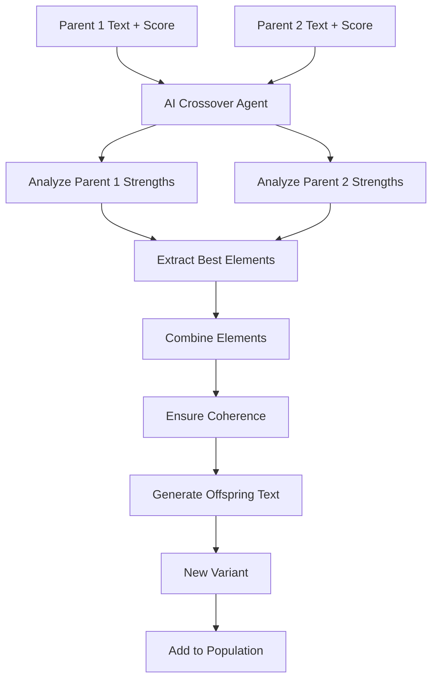

## UI Component Structure

### Tab Organization

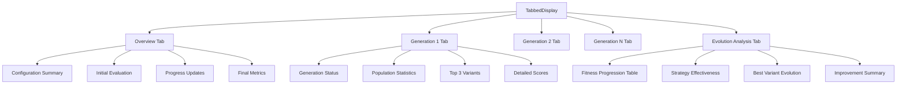

### Real-time Update Flow

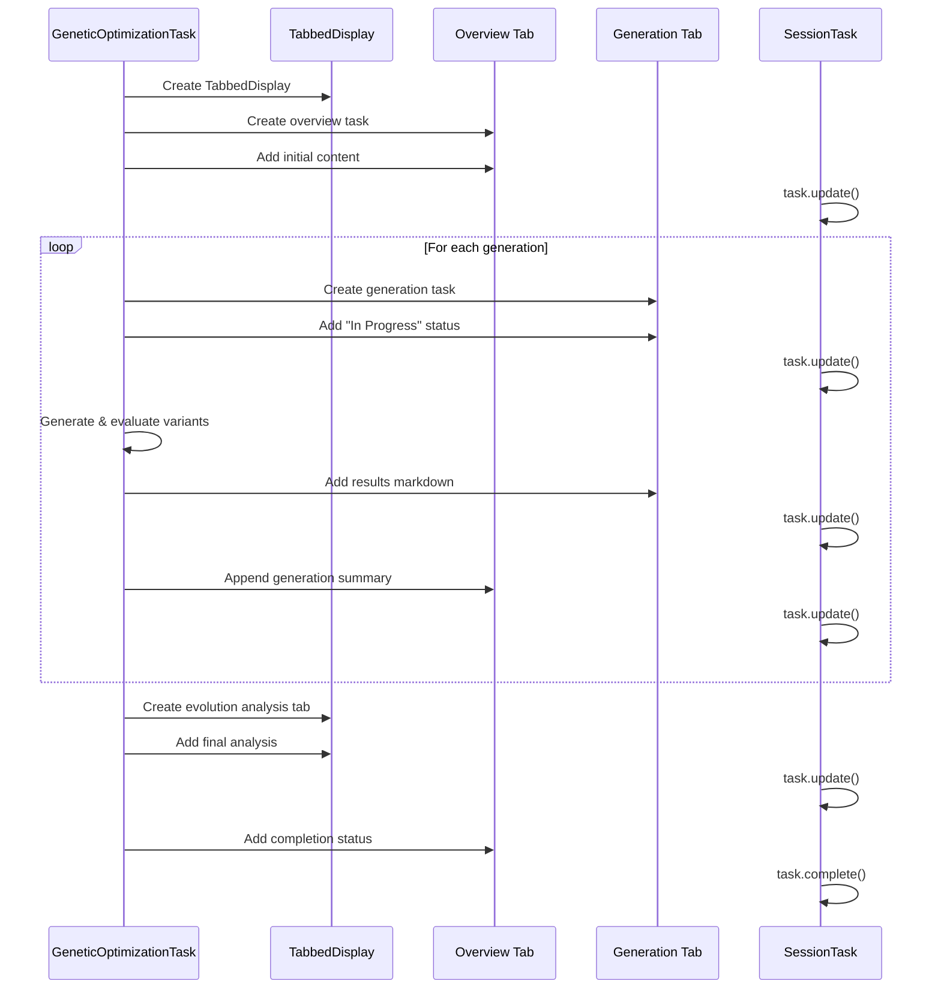

## Error Handling

### Validation and Error Flow

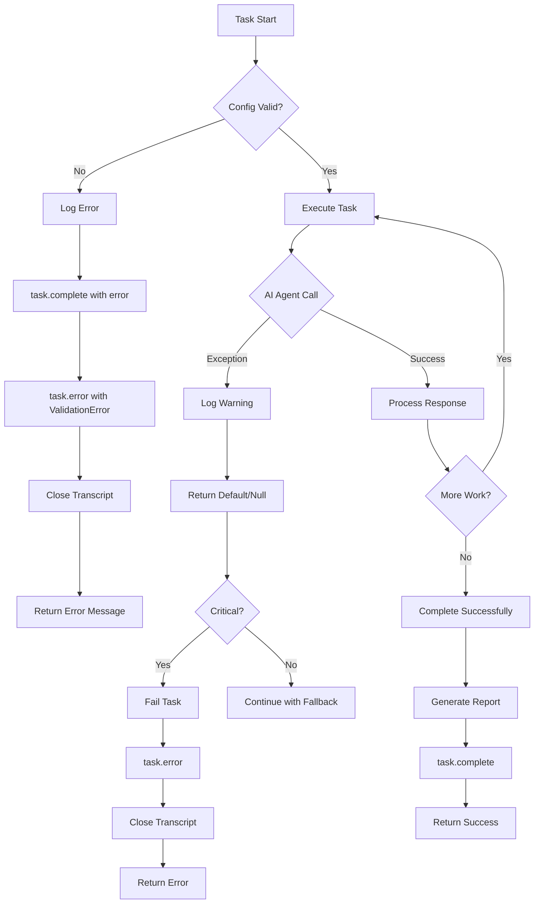

### Agent Failure Handling

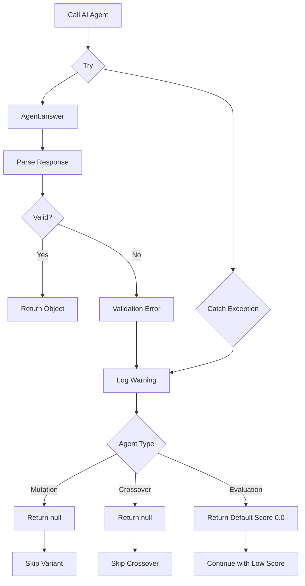

## Performance Considerations

### Computational Complexity

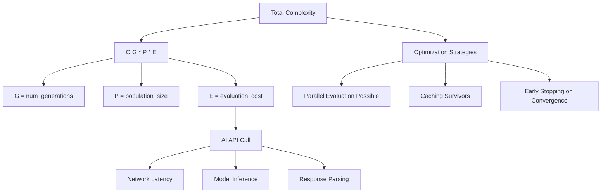

### Memory Usage Pattern

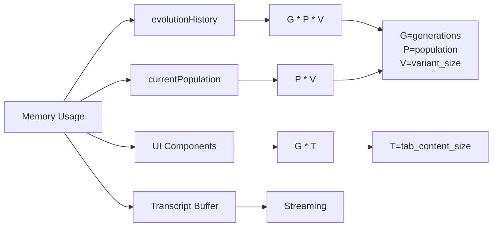

## Extension Points

### Adding Custom Mutation Strategies

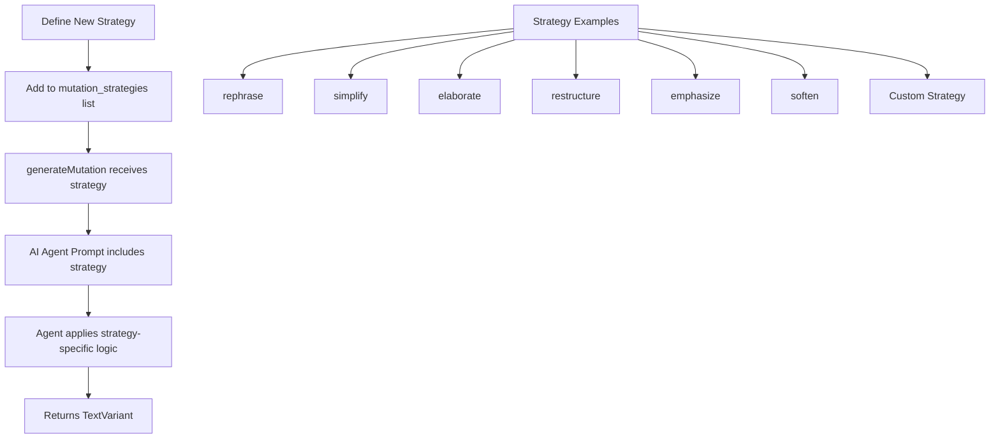

### Custom Evaluation Criteria

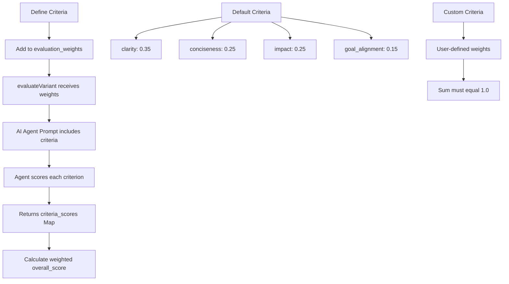

## Integration Points

### Task Orchestration Integration

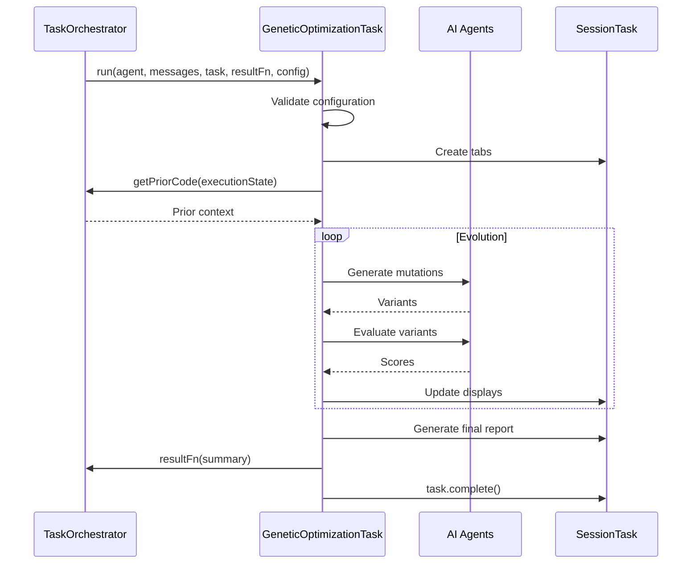

### File System Integration

```mermaid
flowchart TD
    A[Task Execution] --> B[Create Transcript File]
    B --> C[transcript_YYYYMMDDHHMMSS.md]

    A --> D[Write Progress]
    D --> E[FileOutputStream]
    E --> C

    A --> F[Generate Links]
    F --> G[task.linkTo]
    G --> H[Markdown Link]
    G --> I[HTML Link]
    G --> J[PDF Link]

    A --> K[Complete Task]
    K --> L[Close Transcript]
    L --> M[File Available]
```

## Summary

The `GeneticOptimizationTask` implements a sophisticated genetic algorithm for text optimization with the following key characteristics:

1. **Modular Design**: Separation of concerns between mutation, crossover, evaluation, and selection
2. **AI-Driven Evolution**: Uses LLM agents for intelligent variant generation and evaluation
3. **Real-time Feedback**: Progressive UI updates showing evolution progress
4. **Configurable**: Extensive configuration options for generations, population, strategies, and criteria
5. **Robust Error Handling**: Graceful degradation when AI agents fail
6. **Comprehensive Reporting**: Detailed analysis of evolution history and strategy effectiveness

The system leverages AI agents as the core intelligence for both generating creative variations and objectively evaluating fitness, making it a hybrid symbolic-neural approach to text optimization.

