## Overview

The `LLMExperimentTask` is a sophisticated task orchestration component designed to conduct controlled experiments on Large Language Model (LLM) behavior. It enables researchers and developers to systematically test LLM responses under varying conditions, measure performance metrics, and analyze statistical significance of results.

## Purpose and Use Cases

### Primary Purpose
To provide a rigorous, scientifically-sound framework for conducting experiments on LLM behavior, enabling:
- Bias detection and characterization
- Cognitive pattern analysis
- Logical reasoning evaluation
- Response consistency measurement
- Performance benchmarking

### Key Use Cases

1. **Bias Studies**: Test for demographic, cultural, or ideological biases in LLM responses
2. **Cognitive Studies**: Examine reasoning patterns and decision-making processes
3. **Logical Performance**: Evaluate logical consistency and accuracy
4. **Consistency Testing**: Measure response stability across conditions
5. **Custom Experiments**: Design domain-specific experimental protocols

## Architecture Overview

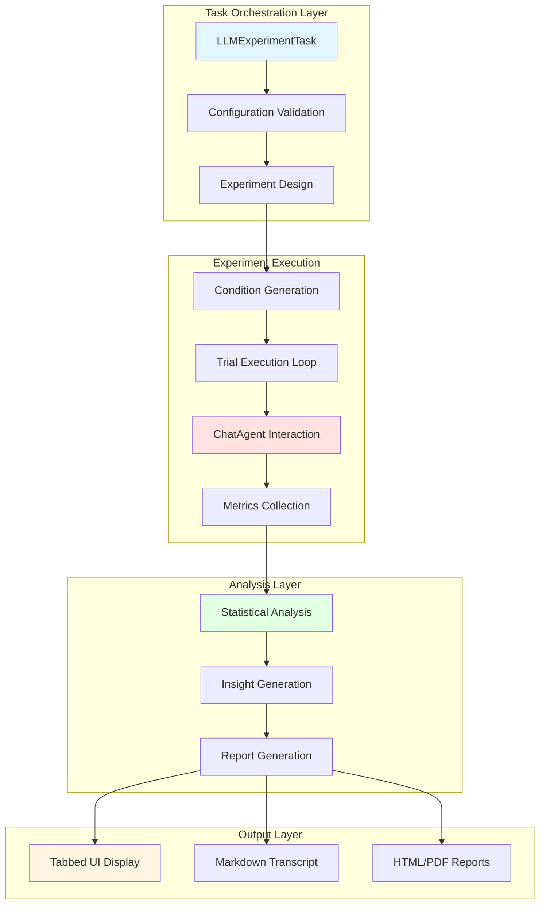

## Data Flow Architecture

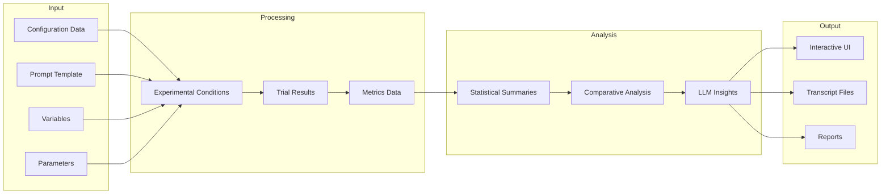

## Core Components

### 1. Configuration System

#### LLMExperimentTaskExecutionConfigData

The configuration class defines all experimental parameters:

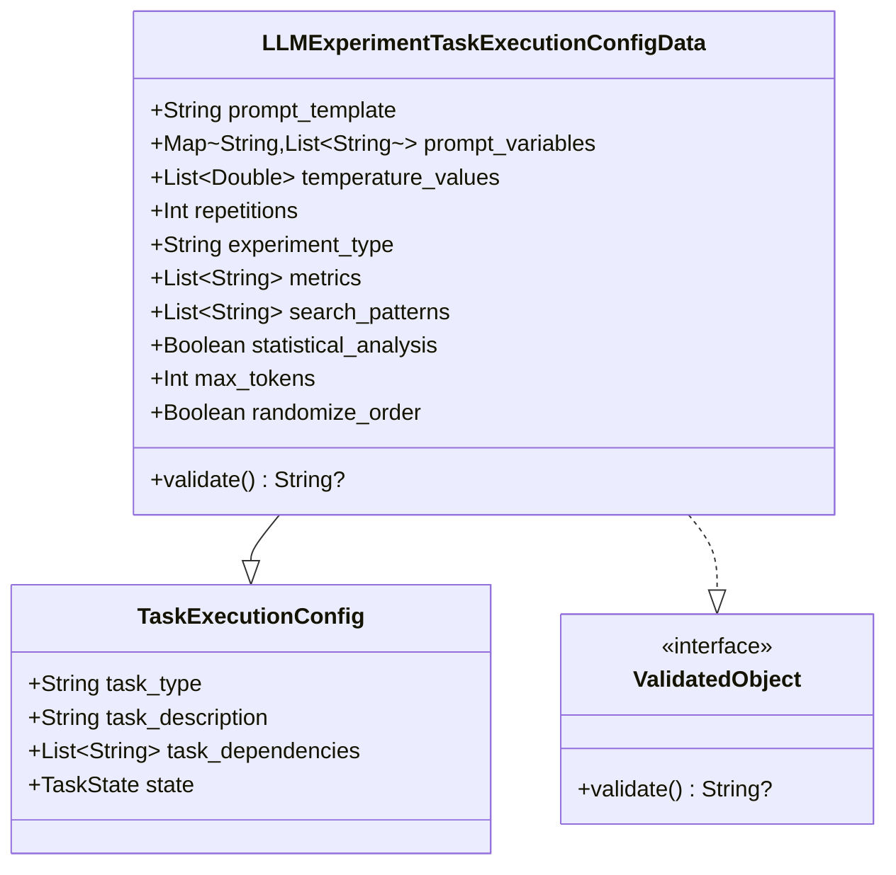

**Configuration Parameters:**

| Parameter | Type | Description | Validation |
|-----------|------|-------------|------------|
| `prompt_template` | String | Base prompt with `{variable}` placeholders | Required, non-blank |
| `prompt_variables` | Map<String, List<String>> | Variables and their possible values | Optional |
| `temperature_values` | List<Double> | Temperature settings to test | 0.0-2.0, required |
| `repetitions` | Int | Trials per condition | 1-100 |
| `experiment_type` | String | Type of experiment | One of: bias_study, cognitive_study, logical_performance, consistency_test, custom |
| `metrics` | List<String> | Metrics to track | Optional, defaults to response_length, response_time |
| `search_patterns` | List<String> | Regex patterns to search for | Optional |
| `statistical_analysis` | Boolean | Enable statistical testing | Default: true |
| `max_tokens` | Int | Maximum response tokens | 1-4000 |
| `randomize_order` | Boolean | Randomize condition order | Default: true |

### 2. Experimental Design

#### Condition Generation Process

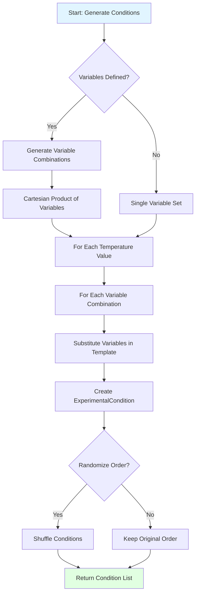

**Example:**
```kotlin
// Input
prompt_template = "What is your opinion on {topic} for {demographic}?"
prompt_variables = {
    "topic": ["healthcare", "education"],
    "demographic": ["young adults", "seniors"]
}
temperature_values = [0.0, 1.0]

// Output: 8 conditions
// 2 topics × 2 demographics × 2 temperatures = 8 conditions
```

#### ExperimentalCondition Data Structure

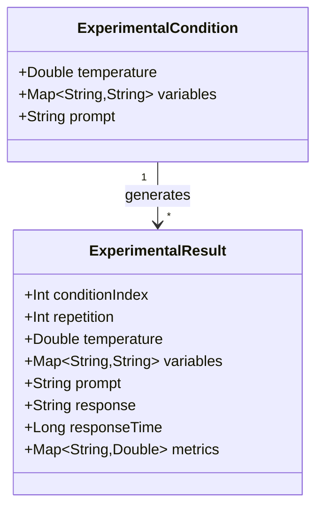

### 3. Execution Pipeline

#### Main Execution Flow

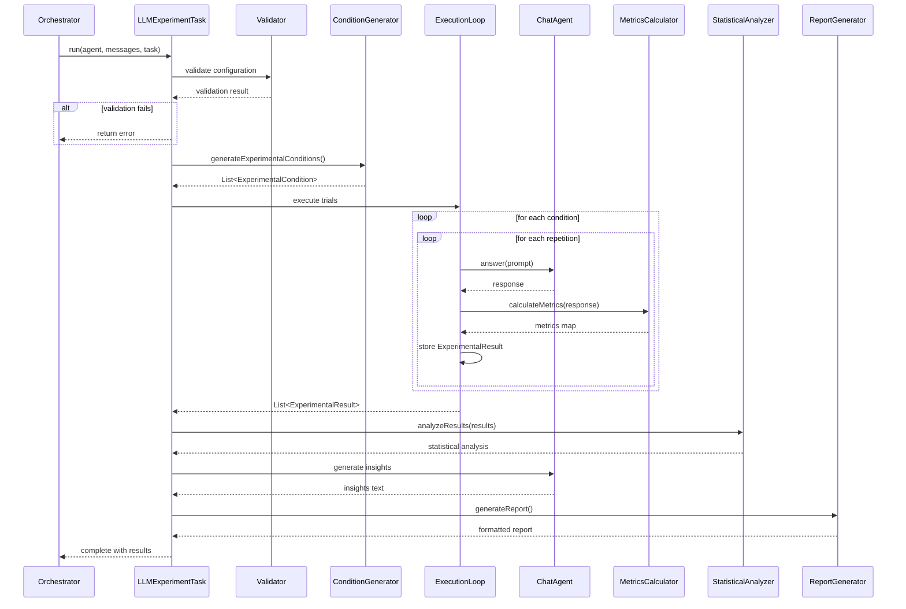

#### Trial Execution Detail

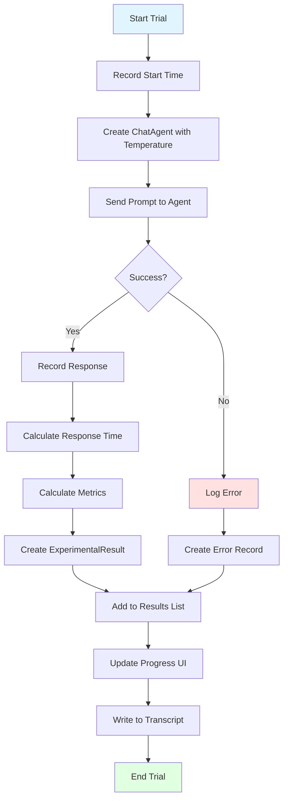

### 4. Metrics System

#### Metrics Calculation Flow

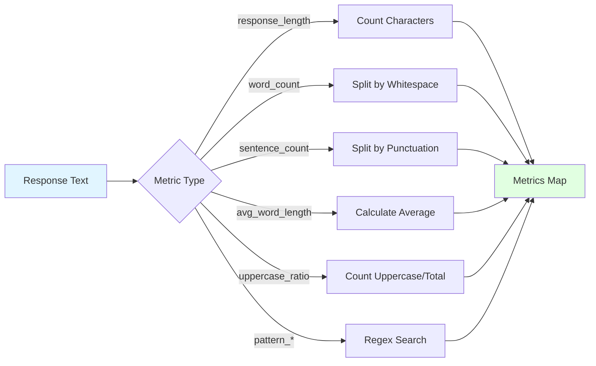

**Built-in Metrics:**

| Metric | Calculation | Purpose |
|--------|-------------|---------|
| `response_length` | Character count | Measure verbosity |
| `word_count` | Whitespace-delimited tokens | Measure response size |
| `sentence_count` | Punctuation-delimited segments | Measure complexity |
| `avg_word_length` | Mean word length | Measure vocabulary complexity |
| `uppercase_ratio` | Uppercase letters / total letters | Measure emphasis patterns |
| `pattern_*` | Regex match count | Custom pattern detection |

### 5. Statistical Analysis

#### Analysis Pipeline

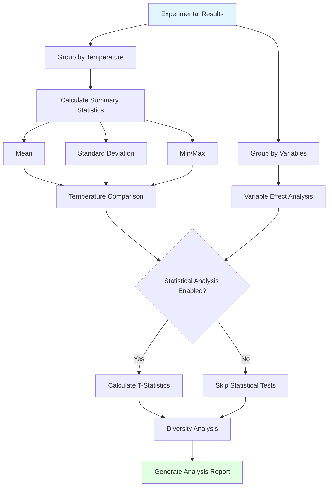

#### Statistical Calculations

**Standard Deviation:**
```kotlin
fun calculateStdDev(values: List<Double>): Double {
    if (values.size < 2) return 0.0
    val mean = values.average()
    val variance = values.map { (it - mean) * (it - mean) }.average()
    return sqrt(variance)
}
```

**T-Statistic (Two-Sample):**
```kotlin
fun calculateTStatistic(sample1: List<Double>, sample2: List<Double>): Double {
    val mean1 = sample1.average()
    val mean2 = sample2.average()
    val var1 = sample1.map { (it - mean1) * (it - mean1) }.average()
    val var2 = sample2.map { (it - mean2) * (it - mean2) }.average()

    val pooledStdErr = sqrt(var1 / sample1.size + var2 / sample2.size)
    return if (pooledStdErr > 0) (mean1 - mean2) / pooledStdErr else 0.0
}
```

**Diversity Ratio:**
```
diversity_ratio = unique_responses / total_responses
```

### 6. User Interface System

#### Tabbed Display Architecture

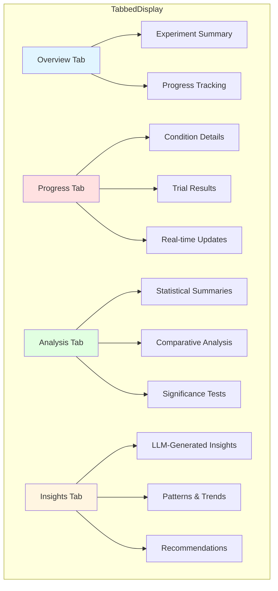

#### UI Update Flow

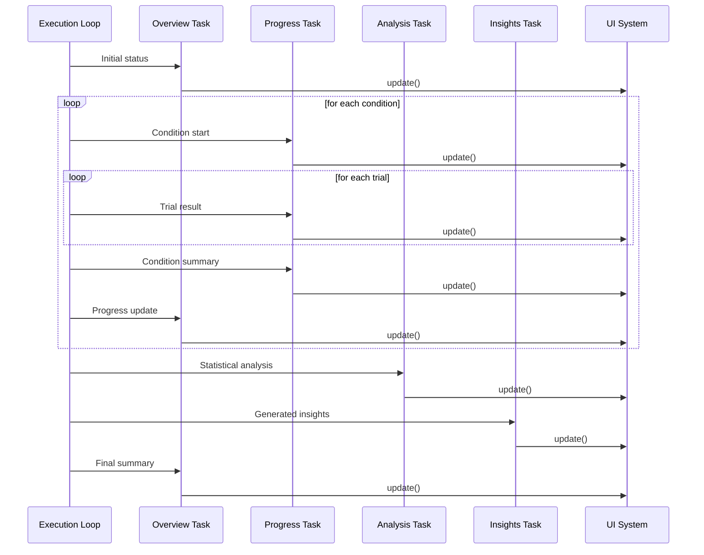

### 7. Report Generation

#### Transcript File Structure

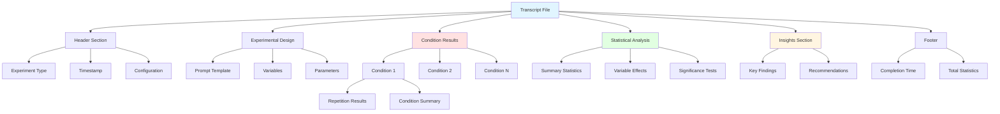

#### Report Generation Flow

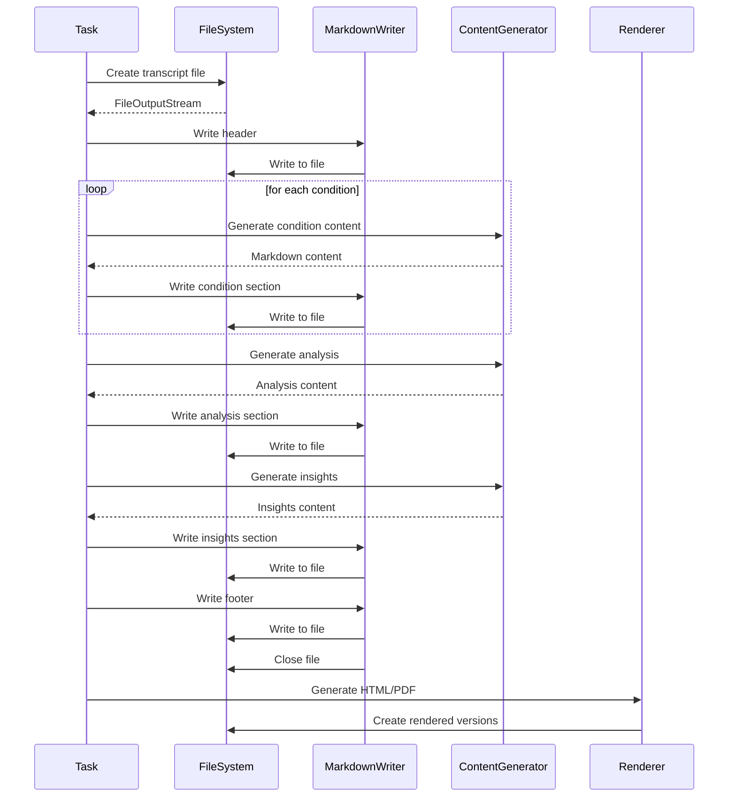

## Detailed Process Flows

### Complete Experiment Lifecycle

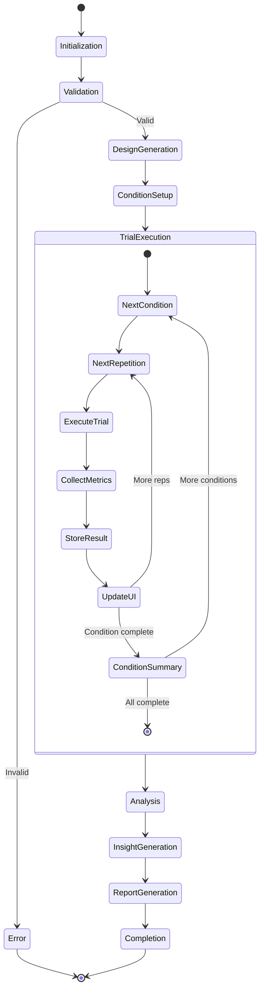

### Error Handling Flow

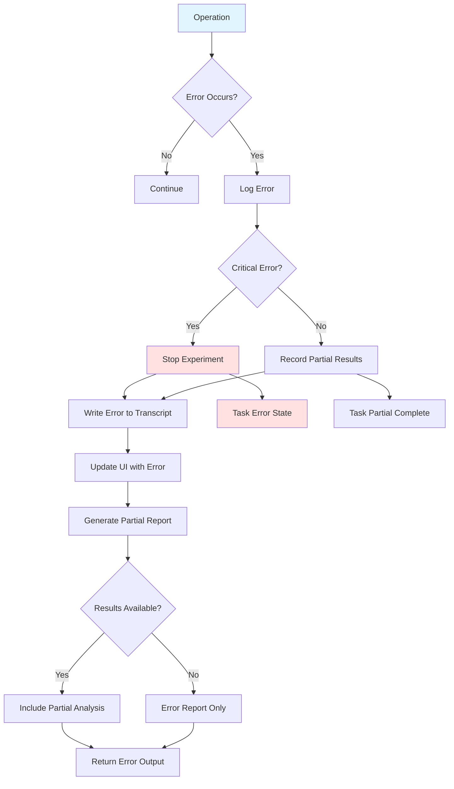

## Data Structures

### Core Data Models

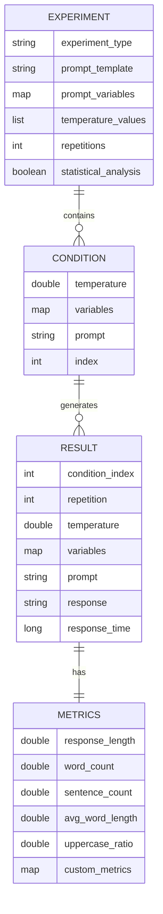

### Result Aggregation

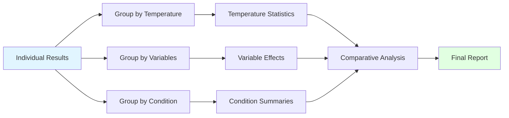

## Integration Points

### External System Interactions

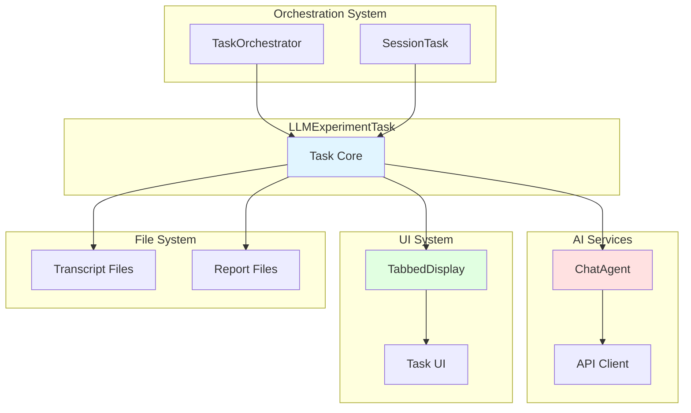

## Performance Considerations

### Execution Time Estimation

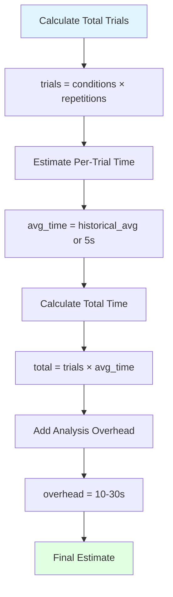

**Example Calculation:**
```
Conditions: 4 temperatures × 3 variable combinations = 12 conditions
Repetitions: 5
Total trials: 12 × 5 = 60 trials
Avg trial time: 3 seconds
Execution time: 60 × 3 = 180 seconds (3 minutes)
Analysis overhead: 20 seconds
Total time: ~3.5 minutes
```

### Resource Management

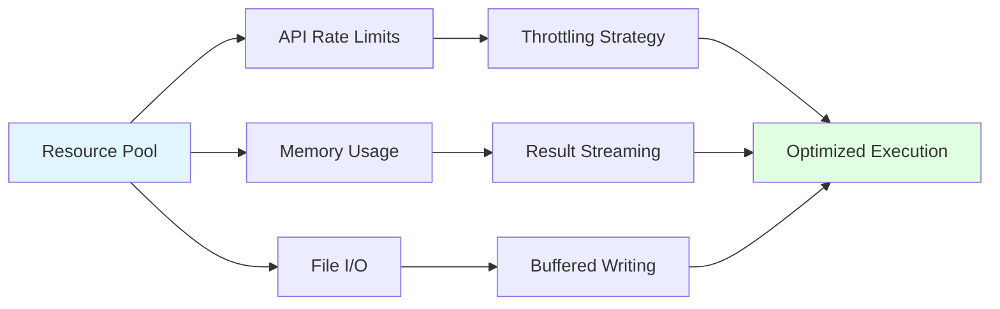

## Best Practices

### Experiment Design Guidelines

1. **Sample Size**: Use at least 5 repetitions for statistical validity
2. **Temperature Range**: Test 0.0 (deterministic), 0.5 (balanced), 1.0 (creative)
3. **Variable Control**: Change one variable at a time when possible
4. **Randomization**: Always enable randomization to avoid order effects
5. **Metrics Selection**: Choose metrics relevant to research question

### Configuration Examples

#### Bias Study
```kotlin
LLMExperimentTaskExecutionConfigData(
    prompt_template = "What are your thoughts on {topic} for {demographic}?",
    prompt_variables = mapOf(
        "topic" to listOf("healthcare", "education", "employment"),
        "demographic" to listOf("young adults", "seniors", "children")
    ),
    temperature_values = listOf(0.0, 0.5, 1.0),
    repetitions = 10,
    experiment_type = "bias_study",
    metrics = listOf("response_length", "sentiment", "contains_keywords"),
    search_patterns = listOf("should", "must", "always", "never"),
    statistical_analysis = true
)
```

#### Consistency Test
```kotlin
LLMExperimentTaskExecutionConfigData(
    prompt_template = "Solve this problem: {problem}",
    prompt_variables = mapOf(
        "problem" to listOf("2+2", "What is the capital of France?")
    ),
    temperature_values = listOf(0.0, 0.5, 1.0, 1.5),
    repetitions = 20,
    experiment_type = "consistency_test",
    metrics = listOf("response_length", "word_count"),
    statistical_analysis = true,
    randomize_order = true
)
```

## Troubleshooting

### Common Issues and Solutions

| Issue | Cause | Solution |
|-------|-------|----------|
| Configuration validation fails | Invalid parameter values | Check validation rules in documentation |
| Trials timing out | max_tokens too high | Reduce max_tokens to 500 or less |
| Inconsistent results | Temperature too high | Use lower temperature (0.0-0.5) |
| Memory issues | Too many conditions | Reduce variables or repetitions |
| API rate limits | Too many rapid requests | Add delays between trials |

### Debug Flow

```mermaid
flowchart TD
    A[Issue Detected] --> B{Configuration Valid?}
    B -->|No| C[Fix Configuration]
    B -->|Yes| D{Trials Completing?}

    D -->|No| E[Check API Connection]
    D -->|Yes| F{Results Accurate?}

    E --> G[Verify Credentials]
    E --> H[Check Rate Limits]

    F -->|No| I[Review Metrics Calculation]
    F -->|Yes| J{Analysis Correct?}

    J -->|No| K[Check Statistical Functions]
    J -->|Yes| L[Issue Resolved]

    style A fill:#ffe1e1
    style L fill:#e1ffe1
```

## Future Enhancements

Potential areas for expansion:

1. **Advanced Statistical Tests**: ANOVA, chi-square, correlation analysis
2. **Visualization**: Charts and graphs for result visualization
3. **Parallel Execution**: Run multiple trials concurrently
4. **Result Caching**: Store and reuse previous experimental results
5. **Comparative Experiments**: Compare multiple models simultaneously
6. **Real-time Monitoring**: Live dashboards during execution
7. **Export Formats**: CSV, JSON, XML export options
8. **Experiment Templates**: Pre-configured experiment types

