# LLMExperimentTask Technical Documentation

## Overview

The `LLMExperimentTask` is a sophisticated experimental framework for conducting controlled experiments on Large Language Model (LLM) behavior. It enables researchers and developers to systematically test LLM responses under varying conditions, collect metrics, and perform statistical analysis on the results.

## Architecture

### Class Hierarchy

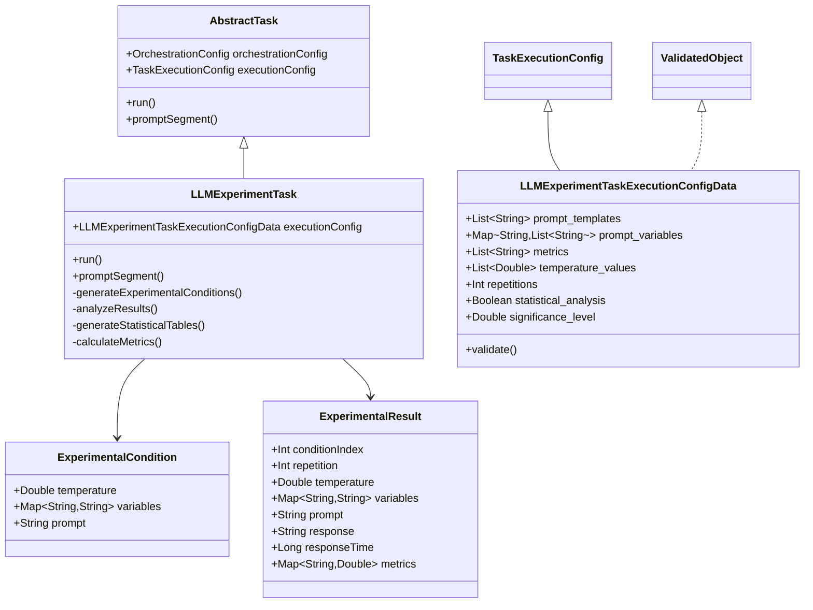

## Data Flow

### High-Level Experiment Flow

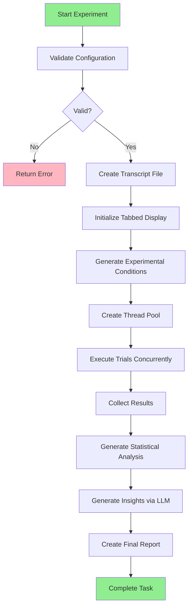

### Detailed Execution Flow

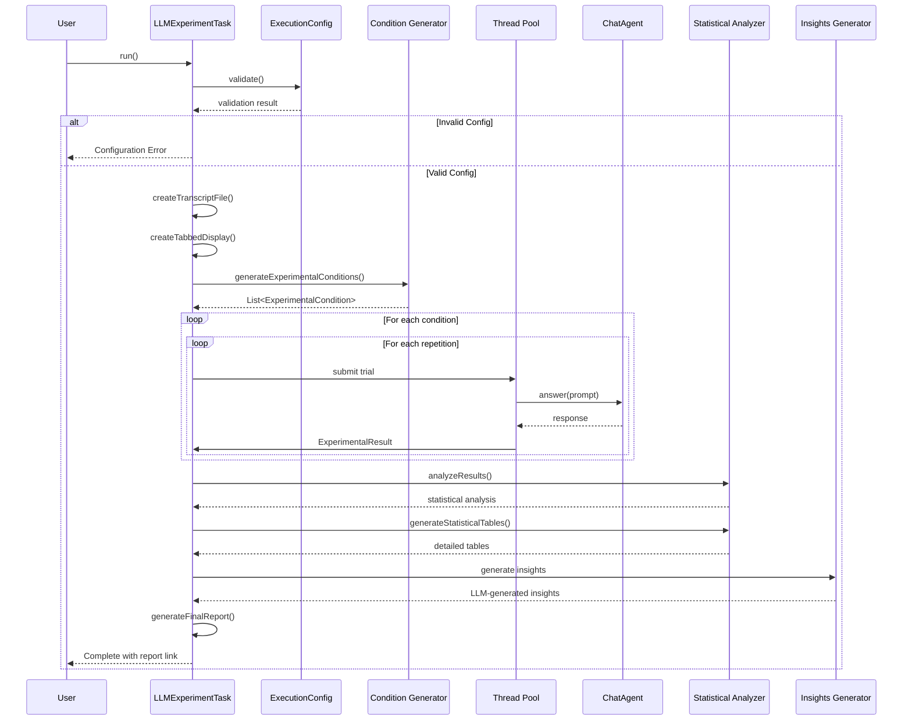

## Core Components

### 1. Configuration Data Structure

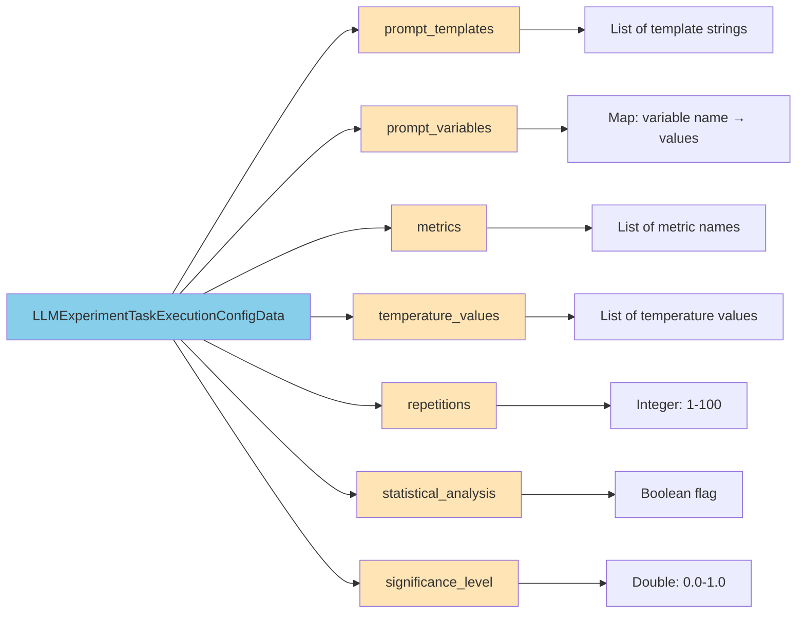

### 2. Experimental Condition Generation

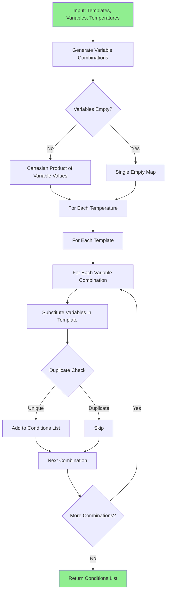

**Algorithm Details:**

The condition generation uses a recursive Cartesian product algorithm:

```kotlin
fun generateVariableCombinations(variables: Map<String, List<String>>): List<Map<String, String>> {
    if (variables.isEmpty()) return listOf(emptyMap())

    val keys = variables.keys.toList()
    val values = keys.map { variables[it]!! }

    fun combine(index: Int, current: Map<String, String>): List<Map<String, String>> {
        if (index == keys.size) return listOf(current)

        val results = mutableListOf<Map<String, String>>()
        values[index].forEach { value ->
            results.addAll(combine(index + 1, current + (keys[index] to value)))
        }
        return results
    }

    return combine(0, emptyMap())
}
```

### 3. Trial Execution Pipeline

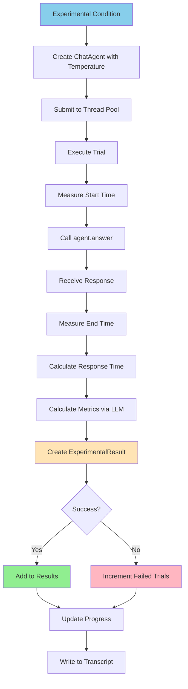

### 4. Metrics Calculation Flow

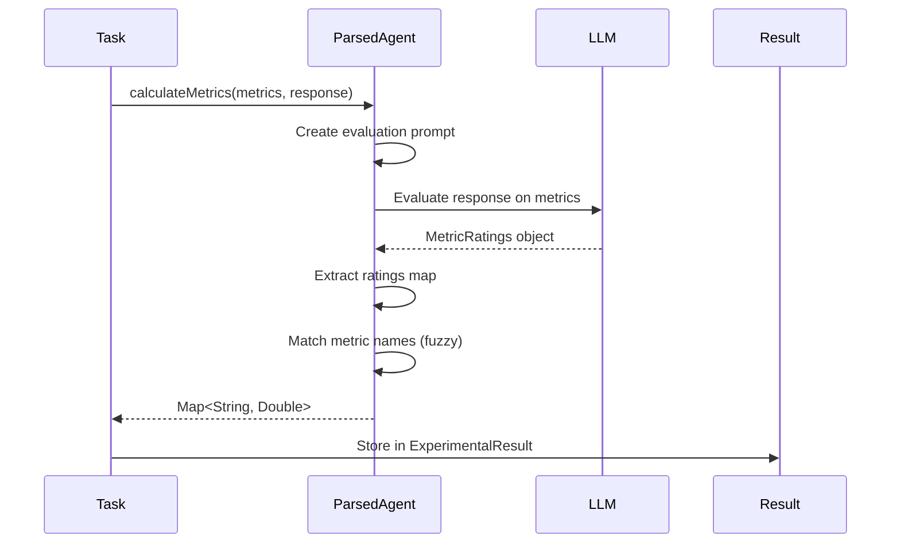

**Metric Rating Structure:**

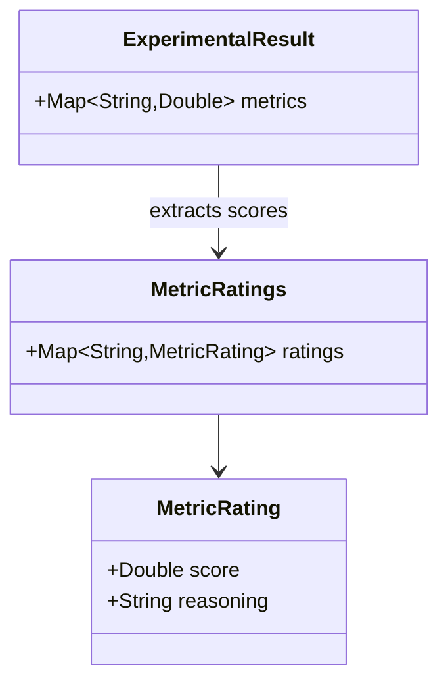

## Statistical Analysis

### 5. Analysis Pipeline

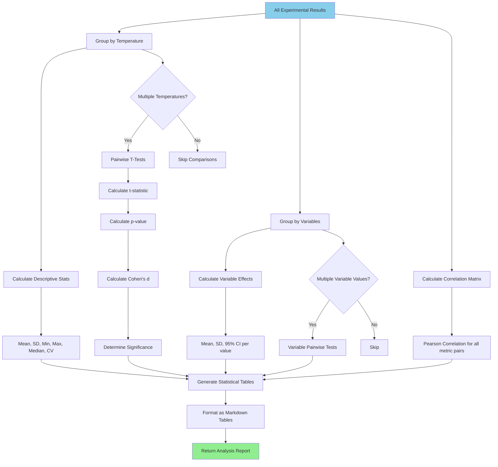

### 6. Statistical Tables Generation

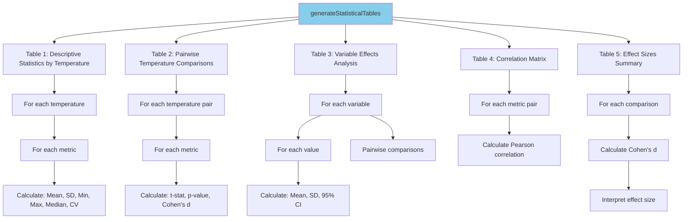

### 7. T-Test Calculation

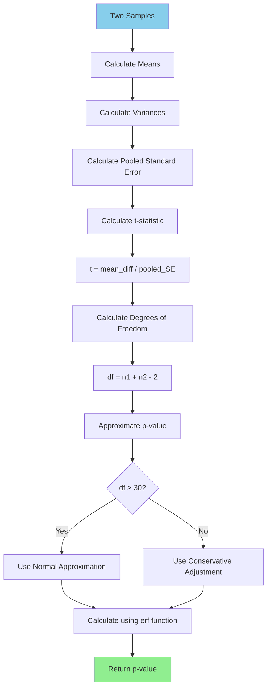

**Mathematical Formulas:**

1. **T-Statistic:**
   ```
   t = (μ₁ - μ₂) / √(σ₁²/n₁ + σ₂²/n₂)
   ```

2. **Cohen's d:**
   ```
   d = (μ₁ - μ₂) / σ_pooled
   where σ_pooled = √((σ₁² + σ₂²) / 2)
   ```

3. **Coefficient of Variation:**
   ```
   CV = σ / μ
   ```

4. **Pearson Correlation:**
   ```
   r = Σ((x - μₓ)(y - μᵧ)) / √(Σ(x - μₓ)² × Σ(y - μᵧ)²)
   ```

### 8. Response Diversity Calculation

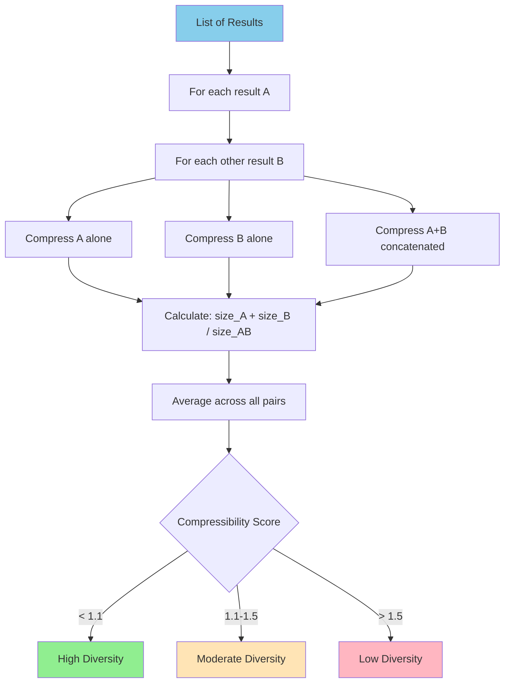

**Diversity Interpretation:**
- **Compressibility ≈ 1.0**: Responses are highly unique (incompressible together)
- **Compressibility ≈ 2.0**: Responses are nearly identical (highly compressible)

## Output Generation

### 9. Tabbed Display Structure

```mermaid
graph TD
    A[TabbedDisplay] --> B[Overview Tab]
    A --> C[Progress Tab]
    A --> D[Statistical Tables Tab]
    A --> E[Analysis Tab]
    A --> F[Insights Tab]

    B --> B1[Experiment Design Summary]
    B --> B2[Progress Updates]
    B --> B3[Completion Status]

    C --> C1[Condition-by-Condition Progress]
    C --> C2[Trial Completion Stats]
    C --> C3[Condition Summaries]

    D --> D1[Table 1: Descriptive Stats]
    D --> D2[Table 2: Pairwise Comparisons]
    D --> D3[Table 3: Variable Effects]
    D --> D4[Table 4: Correlation Matrix]
    D --> D5[Table 5: Effect Sizes]

    E --> E1[Summary Statistics]
    E --> E2[Temperature Effects]
    E --> E3[Variable Effects]
    E --> E4[Response Diversity]

    F --> F1[LLM-Generated Insights]
    F --> F2[Key Patterns]
    F --> F3[Recommendations]

    style A fill:#87CEEB
```

### 10. Transcript File Generation

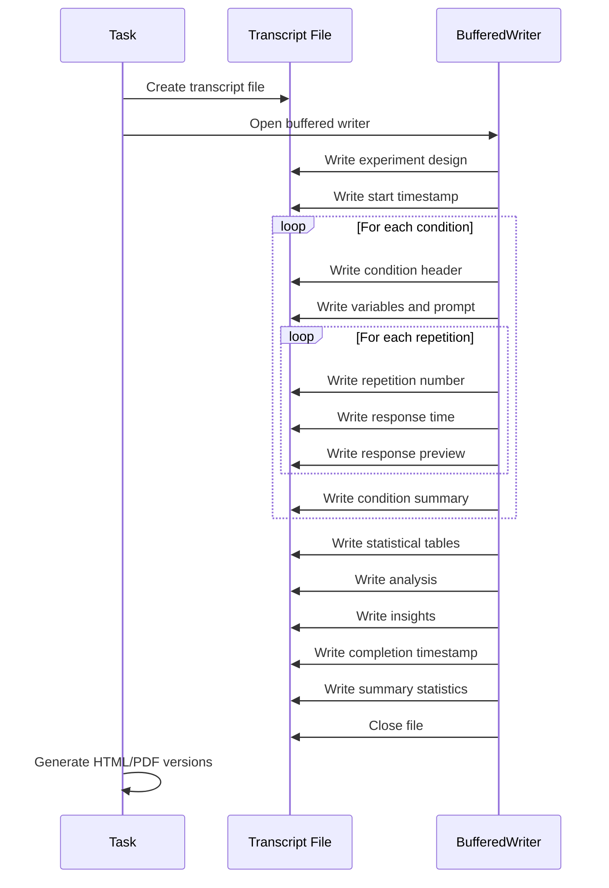

## Concurrency Model

### 11. Thread Pool Execution

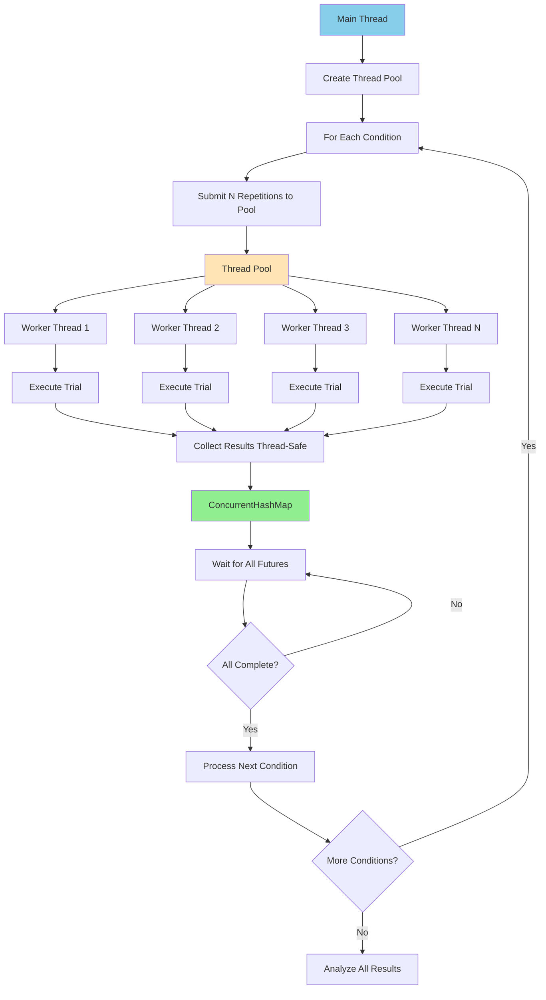

**Thread Safety Mechanisms:**

1. **ConcurrentHashMap**: Thread-safe storage for results
2. **AtomicInteger**: Thread-safe counters for completed/failed trials
3. **Synchronized blocks**: For transcript writing
4. **Future.get()**: Ensures all trials complete before proceeding

## Error Handling

### 12. Error Flow

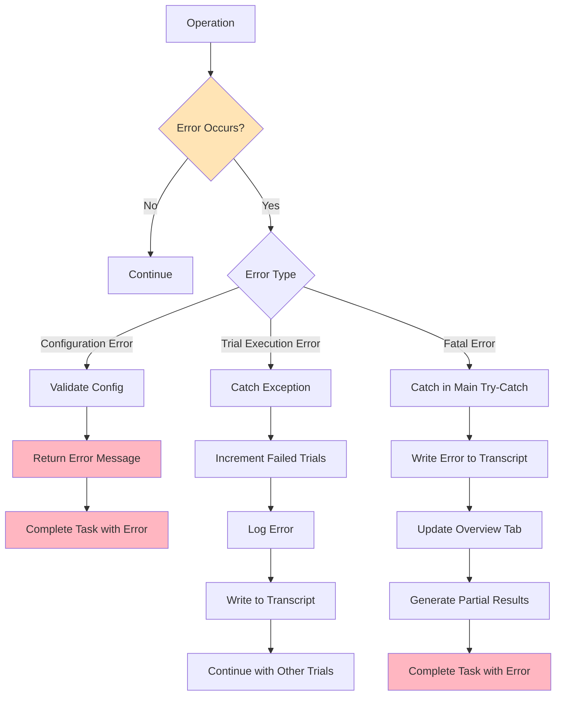

## Data Structures

### 13. Key Data Structures

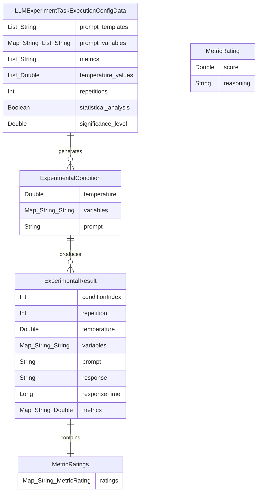

## Performance Characteristics

### 14. Performance Metrics

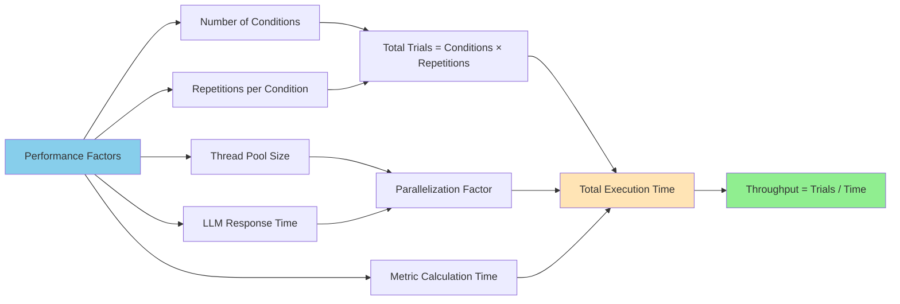

**Time Complexity:**
- Condition Generation: O(T × P × V) where T=templates, P=prompt variables (Cartesian product), V=variable values
- Trial Execution: O(C × R × M) where C=conditions, R=repetitions, M=LLM response time
- Statistical Analysis: O(C² × M) for pairwise comparisons
- Overall: O(C × R × M) dominated by trial execution

**Space Complexity:**
- Results Storage: O(C × R × (P + M)) where P=prompt size, M=metrics count
- Transcript File: O(C × R × R_size) where R_size=average response size

## Usage Examples

### 15. Example Configuration Flow

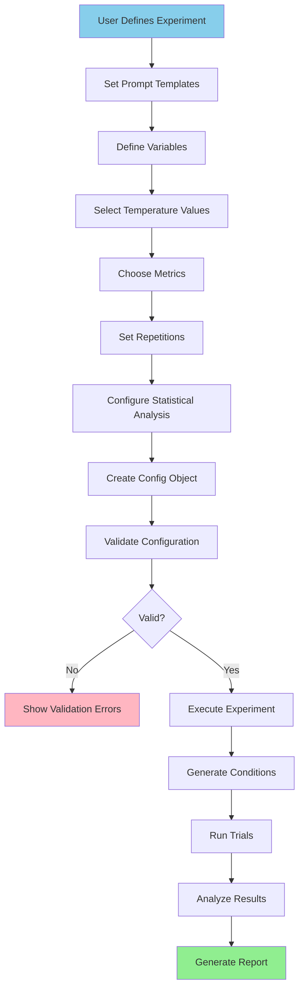

**Example Configuration:**

```kotlin
val config = LLMExperimentTaskExecutionConfigData(
    prompt_templates = listOf(
        "Explain {concept} in simple terms",
        "What is {concept}? Provide a detailed explanation"
    ),
    prompt_variables = mapOf(
        "concept" to listOf("quantum computing", "machine learning", "blockchain")
    ),
    temperature_values = listOf(0.1, 0.5, 0.9),
    repetitions = 5,
    metrics = listOf("clarity", "technical_accuracy", "completeness"),
    statistical_analysis = true,
    significance_level = 0.05
)
```

This generates:
- 2 templates × 3 concepts × 3 temperatures = 18 conditions
- 18 conditions × 5 repetitions = 90 total trials

## Integration Points

### 16. System Integration

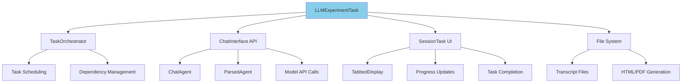

## Best Practices

### 17. Recommended Workflow

```mermaid
flowchart TD
    A[Start] --> B[Define Research Question]
    B --> C[Design Prompt Templates]
    C --> D[Identify Variables]
    D --> E[Select Temperature Range]
    E --> F[Choose Appropriate Metrics]
    F --> G[Determine Sample Size]
    G --> H{Pilot Test}
    H -->|Issues Found| I[Refine Design]
    I --> C
    H -->|Looks Good| J[Run Full Experiment]
    J --> K[Review Statistical Tables]
    K --> L[Analyze Insights]
    L --> M[Draw Conclusions]
    M --> N{Need Follow-up?}
    N -->|Yes| O[Design Follow-up Experiment]
    O --> C
    N -->|No| P[Document Findings]

    style A fill:#90EE90
    style P fill:#90EE90
```

## Limitations and Considerations

### 18. System Constraints

```mermaid
mindmap
    root((Limitations))
        Configuration
            Max 100 repetitions
            Temperature 0.0-2.0
            Prompt template required
        Performance
            LLM API rate limits
            Memory for large experiments
            Disk space for transcripts
        Statistical
            Assumes normal distribution
            Simplified p-value calculation
            Limited to t-tests
        Metrics
            LLM-based evaluation bias
            Subjective metric interpretation
            Consistency across trials
```
