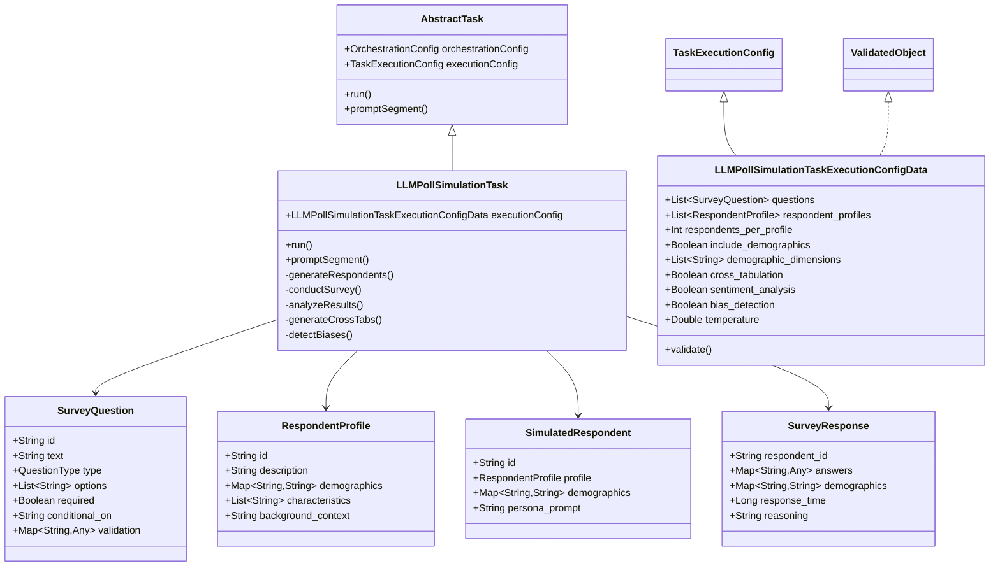
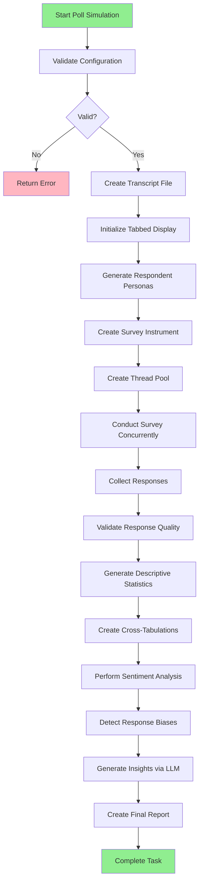
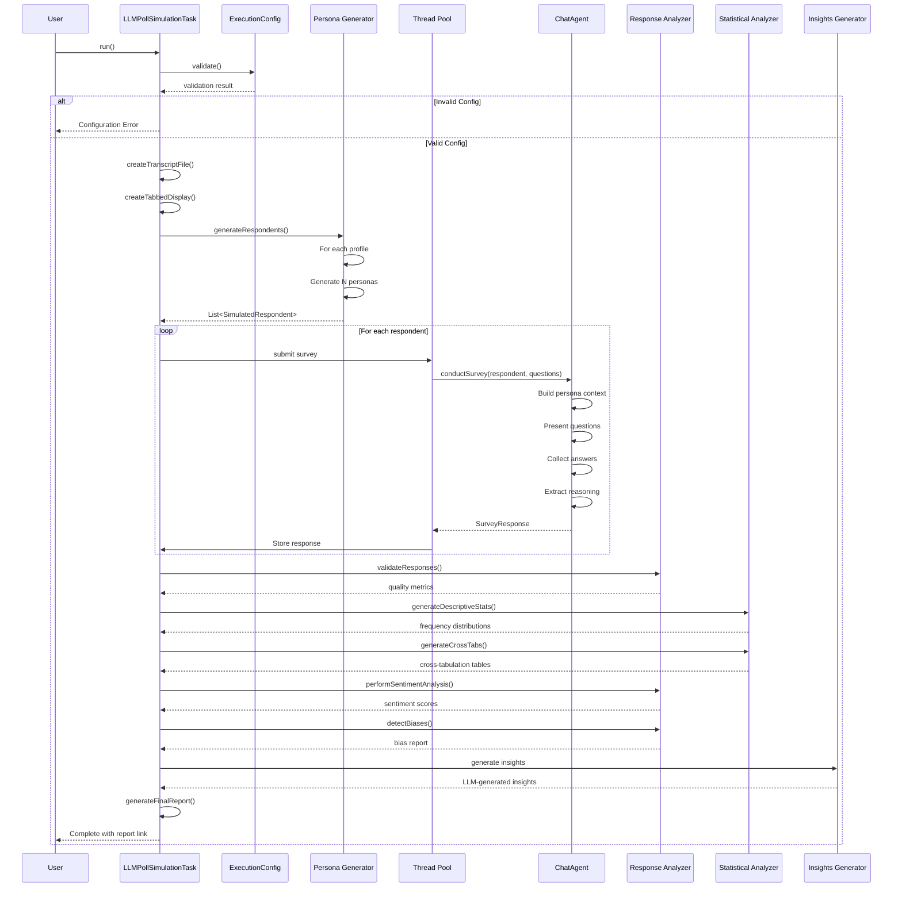
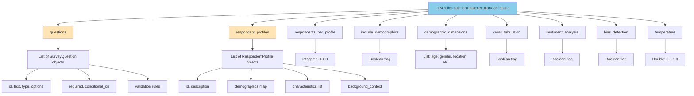
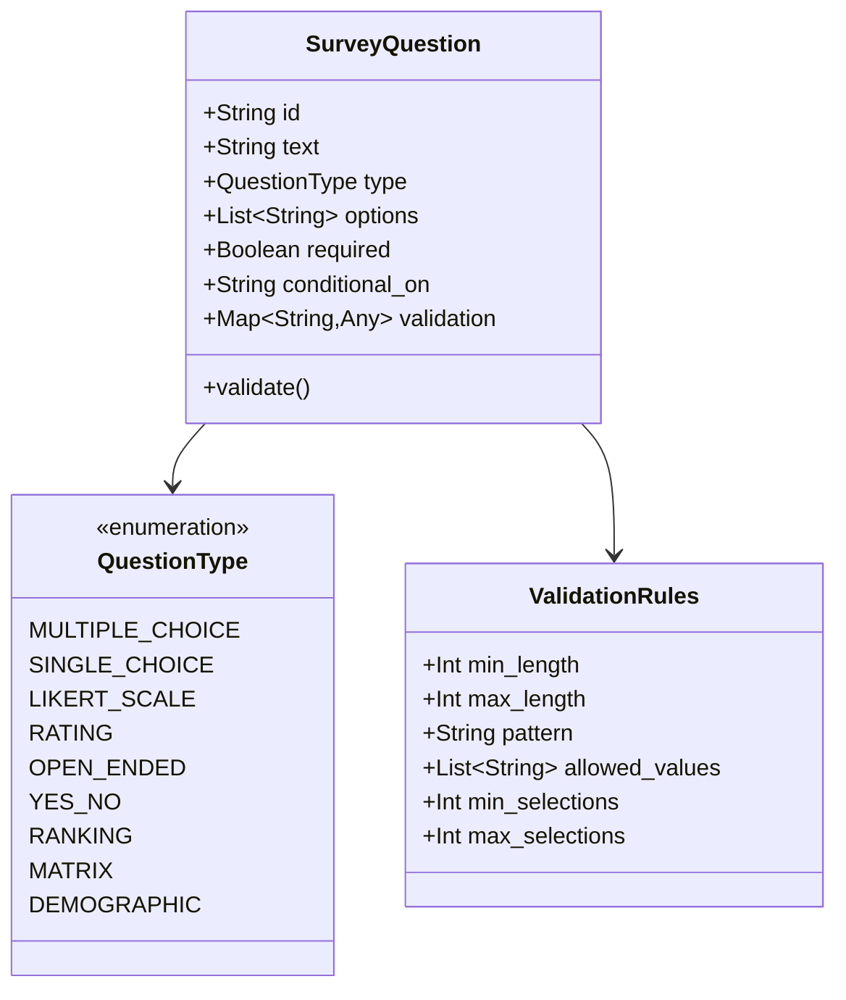
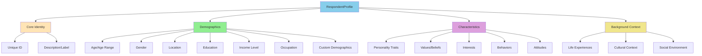
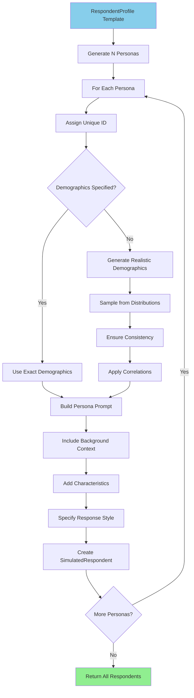
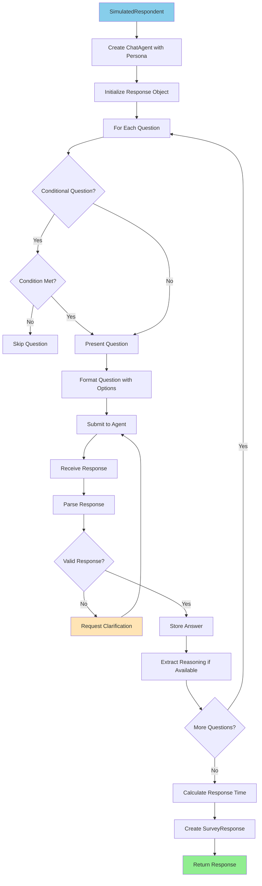
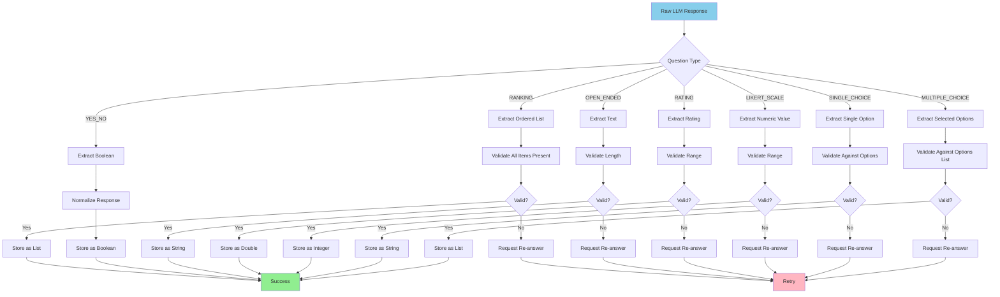

# LLMPollSimulationTask Technical Design

## Overview

The `LLMPollSimulationTask` is a sophisticated framework for simulating polls and surveys using LLMs to model diverse respondent personas. It enables researchers to test survey instruments, explore response patterns across demographics, and analyze results before conducting real-world surveys.

## Architecture

### Class Hierarchy



## Data Flow

### High-Level Poll Simulation Flow



### Detailed Execution Flow



## Core Components

### 1. Configuration Data Structure



### 2. Question Types



### 3. Respondent Profile Structure



### 4. Persona Generation Pipeline



**Persona Prompt Template:**

```kotlin
fun buildPersonaPrompt(respondent: SimulatedRespondent): String {
    return """
        You are participating in a survey. Please respond authentically based on your profile:

        Demographics:
        ${respondent.demographics.entries.joinToString("\n") { "- ${it.key}: ${it.value}" }}

        Background:
        ${respondent.profile.background_context}

        Characteristics:
        ${respondent.profile.characteristics.joinToString("\n") { "- $it" }}

        Instructions:
        - Answer each question honestly from your perspective
        - Consider your background and values when responding
        - Provide brief reasoning for your answers when appropriate
        - If a question doesn't apply to you, indicate that clearly
        - Maintain consistency across your responses
    """.trimIndent()
}
```

### 5. Survey Conduction Flow



### 6. Response Parsing and Validation


