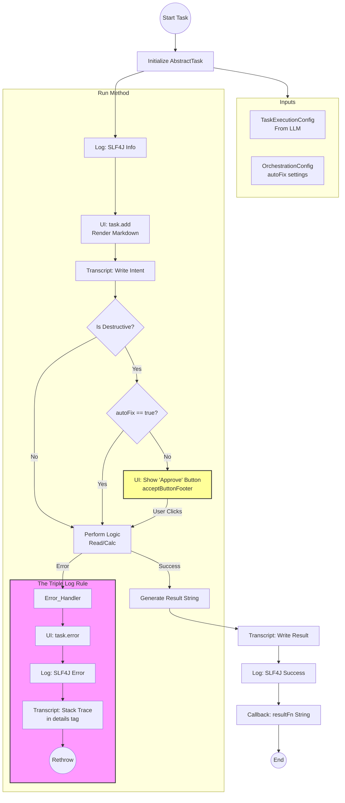
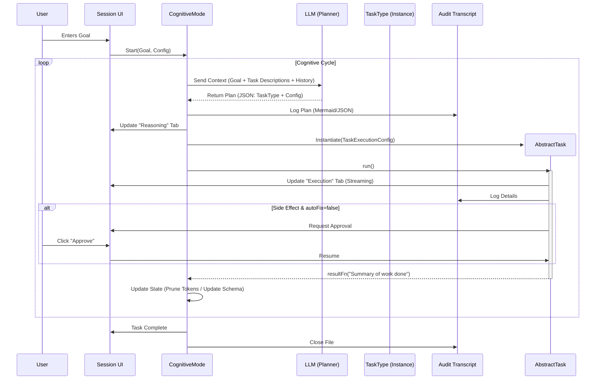
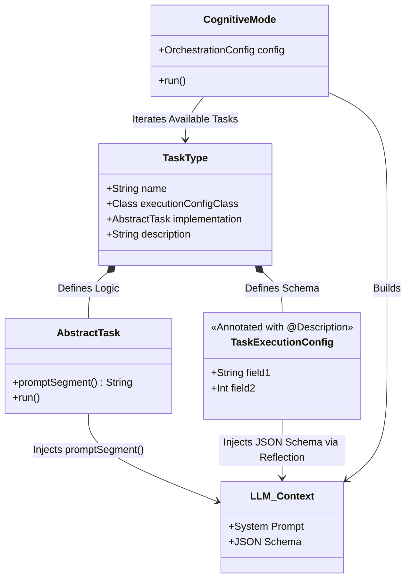

# Cognotik IO Best Practices Guide

Effective IO management in Cognotik is critical because your code speaks to four distinct audiences simultaneously:

1. **The User** (via the UI)
2. **The Auditor** (via Transcripts)
3. **The Developer** (via SLF4J Logs)
4. **The LLM** (via Inter-agent Context)

This guide defines the standards for each output channel to ensure system stability, usability, and context efficiency.

---

## 1. SessionTask UI Display (`task.ui`)

The UI is the **real-time, user-facing** layer. It should be visually structured, concise, and responsive.

* **Format:** HTML (generated via Markdown).
* **Audience:** The end-user interacting with the browser.

### Best Practices

* **Always Render Markdown:** Never inject raw text strings directly if they contain formatting. Use the Kotlin
  extension method `.renderMarkdown()` to convert Markdown to sanitized, styled HTML.
* **Use Structure:** Use `TabbedDisplay` to organize complex outputs (e.g., separating "Reasoning" from "Code
  Execution").
* **Feedback Loops:** Use `task.add()` for sequential updates. Ensure `task.complete()` is called to remove loading
  spinners.

### Example

```kotlin
// BAD: Raw text, hard to read, no styling
task.add("Found 3 files: \n - file1.txt \n - file2.txt")

// GOOD: Structured Markdown rendered to HTML
val message = """
    ### Search Results
    Found **3** files matching your criteria:
    * `file1.txt`
    * `file2.txt`
""".trimIndent()

task.add(message.renderMarkdown())
```

---

## 2. Task & Cognitive Mode Transcripts (`task.transcript()`)

The Transcript is the **comprehensive audit trail**. It is a permanent file record of exactly what the agent thought,
did, and saw.

* **Format:** Markdown.
* **Audience:** Users reviewing work history and Developers debugging logic failures.

### Best Practices

* **The `<details>` Tag Rule:** High-volume data (JSON dumps, stack traces, long file contents) **must** be wrapped in
  HTML `<details>` tags. This keeps the transcript readable while preserving the raw data for deep dives.
* **Lifecycle Management:** Always close the transcript in a `finally` block.
* **Visuals:** Use Mermaid diagrams in the transcript to visualize flows or state changes.

### Example

```kotlin
val transcript = task.transcript()
try {
  // Log the intent
  transcript?.write("## Analyzing Database Schema\n".toByteArray())

  // Log verbose data using <details> to prevent clutter
  val schemaJson = database.getSchemaJSON()
  val logEntry = """
        <details>
        <summary>Raw Schema Dump</summary>

        ```json
        $schemaJson
        ```
        </details>
    """.trimIndent()

  transcript?.write(logEntry.toByteArray())
} finally {
  transcript?.close()
}
```

---

## 3. SLF4J Logging (`log.info`, `log.error`)

SLF4J is the **system operational layer**. It is used for monitoring system health, thread lifecycles, and error rates.

* **Format:** Plain Text (Single line preferred).
* **Audience:** System Administrators and Developers (via console/file logs).

### Best Practices

* **One Line per Event:** Avoid printing newlines (`\n`) in log messages. Multi-line logs break grep/search tools in log
  aggregators. If you must log multi-line data, indent subsequent lines or sanitize newlines.
* **No Data Dumps:** Do not log file contents or large JSON blobs here. Point to the Transcript or a saved file instead.
* **Context:** Include the Task ID or Agent Name in the log message if not automatically handled by the MDC.

### Example

```kotlin
// BAD: Clutters the console, hard to parse
log.info("Task started with config: \n $hugeConfigObject")

// GOOD: Concise, points to where the real data is
log.info("Task 'FileSearch' started. Config details logged to transcript.")
```

---

## 4. Output User Files (`task.saveFile`)

User Files are **deliverables**. Use this channel for the actual results of the work, especially if they are large.

* **Format:** Any (TXT, JSON, CSV, PDF, etc.).
* **Audience:** The user (for download/usage outside Cognotik).

### Best Practices

* **Link, Don't Dump:** If an agent generates a 50-page report or a 10MB CSV, do not render it in the UI or the
  Transcript. Save it to disk and provide a download link.
* **Naming:** Use descriptive filenames.

### Example

```kotlin
val reportContent = generateLargeReport()

// Save to session directory
val url = task.saveFile("reports/Q3_Analysis.md", reportContent.toByteArray())

// Provide link in UI
task.add("Report generated successfully. <a href='$url'>Download Q3 Analysis</a>")
```

---

## 5. Inter-Agent Data (`resultFn`, Context)

This is the **cognitive layer**. This data is fed back into the LLM's context window for the next step in the plan.

* **Format:** Markdown.
* **Audience:** The LLM (Orchestrator/Planner).

### Best Practices

* **Token Economy:** This output consumes context tokens. Be concise. Summarize results rather than returning raw data.
* **Markdown Structure:** LLMs parse Markdown headers and lists better than unstructured text.
* **Artifact Referencing:** If a file was created, the result string should mention the *path* of the file, not the
  *content* of the file.

### Example

```kotlin
// BAD: Wastes tokens, might overflow context window
resultFn(File("huge_log.txt").readText())

// GOOD: Summarizes outcome, provides reference
resultFn(
  """
    ## Analysis Complete
    * Processed 5000 lines.
    * Found 3 critical errors.
    * Full details saved to: `reports/error_summary.txt`
""".trimIndent()
)
```

---

## Summary: The "Triple Log" Rule

When an exception occurs or a critical action is taken, you must often output to three channels simultaneously,
respecting the format of each:

| Channel        | Method           | Format                 | Purpose                             |
|:---------------|:-----------------|:-----------------------|:------------------------------------|
| **UI**         | `task.error(e)`  | HTML (Visual)          | Inform the user immediately.        |
| **Log**        | `log.error(...)` | Text (Single Line)     | Alert the developer/system monitor. |
| **Transcript** | `write(...)`     | Markdown + `<details>` | Preserve the stack trace for audit. |


---

---

# Cognotik IO Best Practices: Component Analysis

---

# Part 1: Actors and Roles

Before analyzing the components, we must define the four distinct audiences (actors) that interact with the system, as defined in the IO Best Practices.

1.  **The User (Human):**
  *   **Role:** Sets goals, approves side effects, views progress.
  *   **Interface:** Browser-based UI (HTML/Markdown).
2.  **The LLM (AI Agent/Planner):**
  *   **Role:** Analyzes context, generates plans, configures tasks, and consumes task results to determine the next step.
  *   **Interface:** Context Window (Text/JSON).
3.  **The Auditor (Human/Compliance):**
  *   **Role:** Reviews historical actions for safety, logic failures, or compliance.
  *   **Interface:** Transcripts (Markdown files with `<details>` tags).
4.  **The Developer/System Admin (Human):**
  *   **Role:** Monitors system health, debugs crashes, optimizes performance.
  *   **Interface:** SLF4J Logs (Console/File).

---

# Part 2: Component Analysis - Task Types (The "Hands")

A `TaskType` is a self-describing, atomic unit of work (e.g., "Modify File", "Run Code"). It is the bridge between the LLM's intent and actual system execution.

### 1. Inputs
*   **From LLM (Dynamic):** `TaskExecutionConfig`. A JSON object containing specific arguments for *this* run (e.g., `target_file: "src/main.kt"`, `code: "println('hello')"`).
*   **From System (Static/Global):** `TaskTypeConfig`. Global settings for the tool (e.g., `api_keys`, `default_model`, `enabled_features`).
*   **From Context:** `SessionTask` (Handle to the UI), `OrchestrationConfig` (Global flags like `autoFix`).
*   **From Upstream:** `task_dependencies` or `getPriorCode(executionState)` to read results from previous tasks.

### 2. Outputs
*   **To LLM (`resultFn`):** A concise Markdown string summarizing the result (e.g., "File updated successfully. 3 lines changed."). *Crucial for the token economy.*
*   **To System (Side Effects):** File writes, network requests, shell command execution.
*   **To User (Artifacts):** Downloadable files (PDFs, CSVs) via `task.saveFile`.

### 3. Configuration & Schema
*   **Self-Description:** Uses `@Description` annotations on `TaskExecutionConfig` fields.
*   **Prompt Segment:** A method `promptSegment()` that returns a "sales pitch" string injected into the LLM's system prompt, explaining *what* the task does and *how* to use it.

### 4. IO Channels (The "Triple Log" Rule)
*   **UI (`task.ui`):** Renders Markdown to HTML. Uses `TabbedDisplay` for complex outputs. Must use `acceptButtonFooter` or `hrefLink` if `autoFix` is false.
*   **Transcript (`task.transcript`):** Detailed audit trail. Uses Mermaid diagrams for logic and `<details>` tags for heavy JSON/Stack traces.
*   **Logs (`log.info/error`):** Single-line, plain text system status updates.

### 5. Safety Mechanisms
*   **`autoFix` Logic:**
  *   If `true`: Execute side effects immediately, log to transcript, release semaphore.
  *   If `false`: Display proposed change, wait for user interaction via `acceptButtonFooter` or `Discussable`.

---

# Part 3: Component Analysis - Cognitive Modes (The "Brain")

A `CognitiveMode` is the control loop or strategy engine. It decides *which* tasks to use and in *what order* to achieve the user's goal.

### 1. Inputs
*   **User Goal:** High-level prompt (e.g., "Refactor the database layer").
*   **Available Tools:** A list of registered `TaskType`s.
*   **OrchestrationConfig:** Determines the `defaultSmart` (Reasoning) and `defaultFast` (Utility) models.

### 2. Outputs
*   **Plan:** A structured sequence of steps (often visualized via Mermaid).
*   **Execution:** The actual invocation of `TaskType` instances.
*   **Final Result:** A summary message indicating success or failure.

### 3. Configuration
*   **Model Selection:** Configurable via `OrchestrationConfig`.
*   **Prompts:** System prompts should be externalized in config, not hardcoded, allowing "personality" tuning.

### 4. State Management
*   **Cognitive Schema Strategy:** Uses structured state objects (e.g., `ScientificState`, `AgileState`) rather than raw message lists.
*   **Token Pruning:** Must implement "Garbage Collection" to summarize past steps and free up context window space.

### 5. IO Channels
*   **UI:** Uses `TabbedDisplay` to separate "Reasoning" (The Plan) from "Execution" (The Tasks).
*   **Transcript:** Logs the "Thought Process" (e.g., Reflection loops, Plan JSONs).

---

# Part 4: Interaction Analysis

The interaction follows a **Planning -> Instantiation -> Execution -> Feedback** cycle.

1.  **Discovery:** The `CognitiveMode` asks all `TaskType`s for their `promptSegment()` and `@Description` schema.
2.  **Planning:** The LLM (driven by the Mode) analyzes the User Goal and the Task Descriptions. It outputs a JSON plan selecting a specific Task and populating its `TaskExecutionConfig`.
3.  **Instantiation:** The System uses reflection to instantiate the specific `AbstractTask` using the config provided by the LLM.
4.  **Execution:**
  *   The Task runs.
  *   It updates the **UI** (User sees progress).
  *   It writes to the **Transcript** (Auditor record).
  *   It logs to **SLF4J** (System health).
5.  **Completion:** The Task calls `resultFn(String)`.
6.  **Feedback:** This String is fed back into the `CognitiveMode`'s context. The LLM analyzes the result and decides the next move.

---

# Part 5: Visualizing Interactions (Mermaid)

### Diagram 1: The "Triple Log" & Execution Flow (Task Level)
This diagram illustrates the internal lifecycle of a single Task, emphasizing the IO requirements and Safety checks.



### Diagram 2: The Cognitive Orchestration Loop (System Level)
This diagram shows how the `CognitiveMode` (The Brain) manipulates the `TaskTypes` (The Hands) and manages state.



### Diagram 3: The Self-Describing Architecture
This illustrates how Tasks "advertise" themselves to the Planner.

