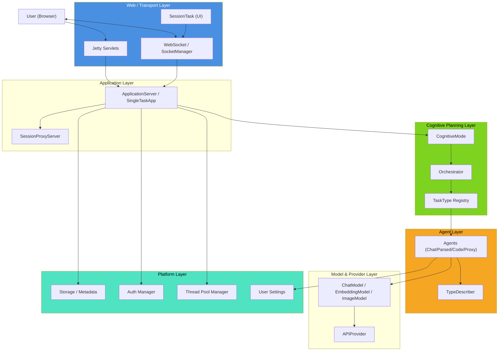
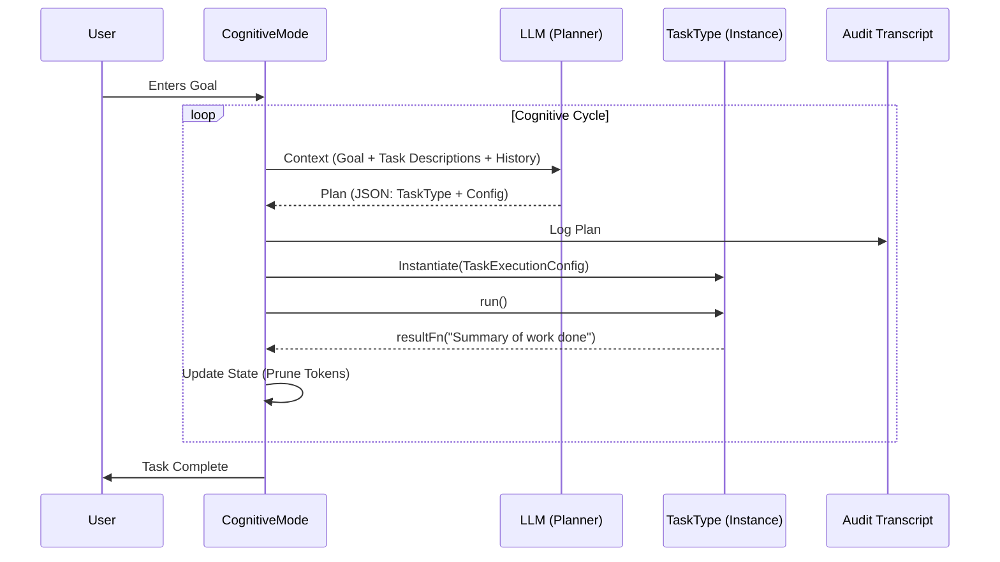

---
related:
  - ../extend/agent_types.md
  - ../extend/extending.md
  - ../extend/strategies.md
  - ../platform/platform.md
  - ../taskplanning.md
specifies: ../../site/cognotik.com/architecture.html
---

# Cognotik Architecture Overview

## 1. Introduction

**Cognotik** is a modular framework for building AI-powered applications. It combines a strongly-typed agent
abstraction layer, an extensible task-planning engine, a session-based web platform, and a rich server-driven UI
system. This document provides a high-level map of the system, explaining how the major subsystems fit together
and pointing to detailed documentation for each area.

The architecture is designed around several guiding principles:

* **Strong Typing:** LLM interactions are wrapped in typed abstractions (`BaseAgent<I, R>`) that convert
  unstructured model output into structured Kotlin/Java objects.
* **Extensibility via `DynamicEnum`:** New providers, tools, runtimes, cognitive modes, and task types can be
  registered at runtime without modifying the core codebase.
* **Multiplicative Composition:** Orthogonal strategy families (providers, models, tasks, processing modes)
  combine multiplicatively, so adding one strategy expands capability across all others.
* **Human-in-the-Loop Safety:** Side effects are guarded by approval mechanisms unless explicitly auto-applied.
* **Server-Driven UI:** The interface is generated server-side and pushed to the browser over WebSockets.

## 2. System Layers

Cognotik is organized into distinct layers, each with a clear responsibility. Higher layers depend on lower layers,
but not vice versa.

```
┌─────────────────────────────────────────────────────────────┐
│                     Application Layer                         │
│         (ApplicationServer, SingleTaskApp, custom apps)       │
├─────────────────────────────────────────────────────────────┤
│                  Cognitive Planning Layer                     │
│      (CognitiveMode, TaskType, OrchestrationConfig)           │
├─────────────────────────────────────────────────────────────┤
│                      Agent Layer                              │
│   (BaseAgent, ChatAgent, ParsedAgent, CodeAgent, ProxyAgent)  │
├─────────────────────────────────────────────────────────────┤
│                   Model & Provider Layer                      │
│    (APIProvider, ChatModel, EmbeddingModel, ImageModel)       │
├─────────────────────────────────────────────────────────────┤
│                     Platform Layer                            │
│  (Session, User, Storage, Auth, ThreadPool, CloudIntegration) │
├─────────────────────────────────────────────────────────────┤
│                    Web/Transport Layer                        │
│   (Jetty Servlets, WebSocket, SocketManager, SessionTask)     │
└─────────────────────────────────────────────────────────────┘
```

### Component Interaction



## 3. The Agent Layer

At the heart of Cognotik is the agent abstraction. All LLM interaction flows through
`BaseAgent<I, R>`, where `I` is the input type and `R` is the result type. This provides a consistent
contract for converting inputs into chat messages and returning typed results.

| Agent                | Input                | Output              | Purpose                              |
|:---------------------|:---------------------|:--------------------|:-------------------------------------|
| `ChatAgent`          | `List<String>`       | `String`            | Conversation, Q&A.                   |
| `ParsedAgent<T>`     | `List<String>`       | `ParsedResponse<T>` | Text-to-Object data extraction.      |
| `CodeAgent`          | `CodeRequest`        | `CodeResult`        | Writing & executing code, tool use.  |
| `ImageGenerationAgent`| `List<String>`      | `ImageAndText`      | Creating images from text.           |
| `ImageProcessingAgent`| `List<ImageAndText>`| `ImageAndText`      | Analyzing/captioning images.         |
| `ParsedImageAgent<T>`| `List<ImageAndText>` | `ParsedResponse<T>` | Visual data extraction to objects.   |
| `ProxyAgent<T>`      | Method args          | Method return       | Implementing interfaces via LLM.     |

Structured-data agents rely on the **Type Describer** subsystem to convert Kotlin/Java classes into
LLM-readable schemas (YAML, JSON, or TypeScript). This is what allows `ParsedAgent` and `CodeAgent` to
communicate class structures to the model reliably.

**See:** [Agent Types](../extend/agent_types.md), [Type Describers](../extend/type_describers.md).

## 4. The Model & Provider Layer

Below the agents lies a provider-agnostic model layer. Each `APIProvider` (OpenAI, Anthropic, Gemini,
AWS, Groq, Ollama, etc.) exposes a unified interface for chat, embedding, and image models. Models
(`ChatModel`, `EmbeddingModel`, `ImageModel`) carry pricing information and produce client instances that
handle authentication, token accounting, and cost tracking.

This layer uses the `DynamicEnum` pattern, so new providers and models can be registered at runtime.
The multiplicative scaling of these orthogonal strategy families is a defining characteristic of the
system: providers × models × tasks × processing strategies yield thousands of possible configurations
from a small amount of code.

**See:** [Extendable Strategies](../extend/strategies.md), [Extending Cognotik](../extend/extending.md).

## 5. The Cognitive Planning Layer

The planning layer is where high-level user goals are decomposed into executable steps. It has two
primary abstractions:

* **`CognitiveMode`** — The strategic "thinking style" (Waterfall, Conversational/Chat, Adaptive,
  Hierarchical, Parallel, Protocol, Council, PersonaChat, Coding). Each mode determines how a goal is
  planned and executed.
* **`TaskType`** — A self-describing, atomic unit of work (e.g., `FileModificationTask`, `RunCodeTask`,
  `CrawlerAgentTask`). Each task advertises its capabilities to the Planner via `promptSegment()` and
  `@Description` annotations on its configuration class.

The **`OrchestrationConfig`** ties everything together, specifying which models to use for reasoning
(`defaultSmart`) versus utility (`defaultFast`), execution limits, budgets, and enabled tasks.

### The Planning Cycle



Tasks are self-describing: the Planner reads their descriptions and JSON schemas (generated via the Type
Describer) to decide which tasks to select and how to configure them. This "self-describing architecture"
lets the LLM correctly use tasks it has never seen before.

**See:** [Task Planning Framework](../taskplanning.md),
[Task Type Best Practices](../tasks/task_type_best_practices.md).

## 6. The Platform Layer

The platform provides the runtime foundation: session management, user identity, data persistence,
authorization, and resource isolation.

* **`Session`** — Uniquely identifies an interaction, either global (`G-...`) or user-specific (`U-...`).
* **`User`** — Represents an authenticated user with credentials.
* **`StorageInterface` / `MetadataStorageInterface`** — Persist session content, messages, and metadata
  (file-based `DataStorage`, in-memory `HSQLMetadataStorage`).
* **`AuthenticationManager` / `AuthorizationManager`** — Handle identity and permission checks
  (`Read`, `Write`, `Delete`, `Share`, `Admin`, etc.).
* **`ThreadPoolManager`** — Provides session- and user-scoped execution contexts for resource isolation.
* **User Settings** — Manages API credentials and local tool paths with secure key masking.
* **Cloud Integration** — Optional AWS S3 sharing and KMS encryption.

`ApplicationServices` acts as the central registry for all these services.

**See:** [Platform Documentation](../platform/platform.md),
[User Settings](../platform/user_settings.md).

## 7. The Web & Transport Layer

Cognotik is built on Jetty servlets and WebSockets. The transport layer routes user traffic and drives
the UI.

### Routing

The **`SessionProxyServer`** acts as a router: incoming requests carrying a session ID are dispatched to
the correct `ApplicationServer` instance registered in `SessionProxyServer.chats[session]`.

### Server-Driven UI

The UI is generated server-side and pushed to the browser over WebSockets:

* **`SessionTask`** — The primary UI "canvas." Each task is an addressable block in the DOM where content
  is appended or updated. Supports Markdown rendering, tabbed displays (`TabbedDisplay`), interactive
  buttons/links, images, and human-in-the-loop workflows (`Discussable`, `Retryable`).
* **`SocketManager`** — Manages the WebSocket connection for a session, routing incoming events to the
  appropriate task or handler and maintaining UI state history for replay on reconnect.

The WebSocket protocol supports message replay (via `lastMessageTime`) so that page refreshes and network
reconnections don't lose UI state.

### Servlets

A rich set of servlets handles authentication (OAuth), session management, file browsing/upload
(`FileServlet`, `SessionFileServlet` with integrated Git support), user settings, API proxying, and
usage analytics.

**See:** [User Interface Guide](../platform/user_interface.md),
[WebSocket Protocol](../platform/websocket_protocol.md),
[Servlets](../platform/servlets.md), [FileServlet](../platform/fileServelet.md).

## 8. IO Discipline: The Four Audiences

A defining architectural convention in Cognotik is that code communicates with four distinct audiences
simultaneously, each with its own output channel and format:

| Audience       | Channel                    | Format                 | Purpose                             |
|:---------------|:---------------------------|:-----------------------|:------------------------------------|
| **User**       | `task.ui`                  | HTML (Markdown)        | Real-time visual feedback.          |
| **Auditor**    | `task.transcript()`        | Markdown + `<details>` | Permanent audit trail.              |
| **Developer**  | SLF4J (`log.info/error`)   | Single-line text       | System health & debugging.          |
| **LLM**        | `resultFn()` / context     | Concise Markdown       | Inter-agent context (token economy).|

The **"Triple Log Rule"** requires that critical events (especially errors) be reported to the UI,
the system log, and the transcript simultaneously — respecting each channel's format.

**See:** [IO Best Practices](../tasks/agentic_io_best_practices.md).

## 9. Extensibility Model

Cognotik's extension system is built on the `DynamicEnum` pattern, which provides a runtime-extensible
alternative to Java enums with built-in registration, lookup, and JSON serialization. This pattern
underpins virtually every extension point:

* **API Providers** — Connect to new AI services.
* **Tool Providers** — Register external executables for discovery.
* **Code Runtimes** — Execute code in additional languages.
* **Cognitive Modes** — Add new planning strategies.
* **Cognitive Schema Strategies** — Customize adaptive planning state.
* **Task Types** — Add new discrete operations to the planner's toolkit.

Because these are orthogonal, adding a single new strategy multiplies capability across all existing
strategies — the "multiplicative scaling" advantage.

**See:** [Extending Cognotik](../extend/extending.md), [Strategies](../extend/strategies.md).

## 10. Supporting Subsystems

Several cross-cutting subsystems support the core layers:

* **PatchProcessor** — Intelligent, fuzzy code patching for AI-assisted modifications (Fuzzy, Strict,
  Lenient, Python, Thermodynamic, FullReplacement strategies).
  See [Patch Processors](../extend/patch_processors.md).
* **Interpreter Subsystem** — Unified code execution across languages (Kotlin, Groovy, process-based).
  See [Interpreter](../extend/interpreter.md).
* **Document Reading** — Unified extraction from PDF, Office, HTML, email, and text formats.
  See [Documents](../extend/documents.md).
* **DocProcessor** — Frontmatter-driven documentation-as-specification pipeline that keeps docs and
  source code in sync. See [Frontmatter Schema](../tasks/frontmatter_schema.md).
* **Plugin Platform** — Runtime loading of JAR-packaged plugins via `ServiceLoader`, with a multi-step
  authorization framework. See [Plugin Platform](../platform/plugin_platform.md).

## 11. Building Applications

Developers build on Cognotik in two primary ways:

1. **General Applications** — Extend `ApplicationServer` for interactive, stateful chat experiences with
   custom message handling.
2. **Single-Task Applications** — Extend `SingleTaskApp` for "fire-and-forget" workflows that run a
   pre-configured task immediately upon session start.

Sessions are launched by creating a `Session`, mapping its storage, instantiating the app, registering it
with `SessionProxyServer`, and opening a browser to the session URL. This same mechanism powers IDE
plugin integrations (e.g., IntelliJ actions that launch agent sessions).

For programmatic embedding and testing, the `PlanHarness` and `TaskHarness` wrap the full server
infrastructure into a simple, synchronous API.

**See:** [Application Development](../extend/application_dev.md),
[Application API](../extend/application_api.md),
[Task Planning Launch API](../tasks/task_planning_launch_api.md).

## 12. Summary

Cognotik layers a typed agent abstraction over a provider-agnostic model layer, drives it with an
extensible cognitive-planning engine, and exposes it through a session-based, server-driven web platform.
Its `DynamicEnum`-based extension model and orthogonal strategy families give it multiplicative scaling
characteristics, while its human-in-the-loop safety conventions and disciplined multi-audience IO make it
suitable for building trustworthy, auditable AI applications.

| Layer                | Key Abstractions                              | Primary Docs                          |
|:---------------------|:----------------------------------------------|:--------------------------------------|
| Application          | `ApplicationServer`, `SingleTaskApp`          | application_dev, application_api       |
| Cognitive Planning   | `CognitiveMode`, `TaskType`, `OrchestrationConfig` | taskplanning, task_type_best_practices |
| Agent                | `BaseAgent`, `ParsedAgent`, `CodeAgent`       | agent_types, type_describers           |
| Model & Provider     | `APIProvider`, `ChatModel`                    | strategies, extending                  |
| Platform             | `Session`, `Storage`, `Auth`, `ThreadPool`    | platform, user_settings                |
| Web / Transport      | `SessionProxyServer`, `SocketManager`, `SessionTask` | user_interface, websocket_protocol, servlets |