---
related:
- architecture_overview.md
- ../platform/platform.md
- ../taskplanning.md
- ../extend/extending.md
- ../extend/strategies.md
- ../cognitive/cognitive_modes.md
specifies: ../../site/cognotik.com/diagrams.html
---

# Cognotik Platform & Application Diagrams

This document provides a series of Mermaid diagrams illustrating the Cognotik platform architecture,
its major subsystems, and the flow of control and data through the system.

## 1. System Layer Overview

Cognotik is organized into distinct layers, each with a clear responsibility. Higher layers depend
on lower layers, but not vice versa.

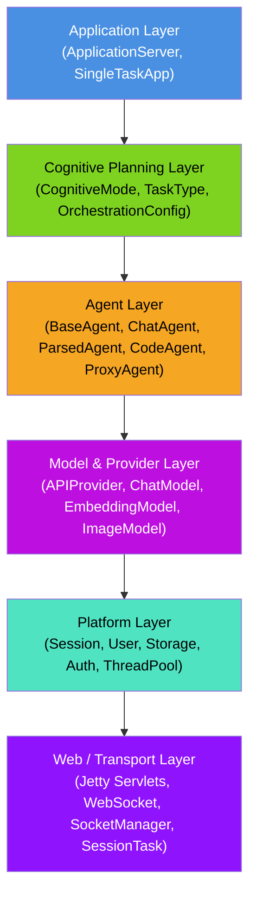

## 2. Component Interaction

This diagram shows how the major components interact at runtime, from the user's browser
down through the platform services.

```mermaid
graph TD
  User["User (Browser)"]

  subgraph WebLayer["Web / Transport Layer"]
      Servlets["Jetty Servlets"]
      WS["WebSocket / SocketManager"]
      Task["SessionTask (UI)"]
  end

  subgraph AppLayer["Application Layer"]
      App["ApplicationServer / SingleTaskApp"]
      Proxy["SessionProxyServer"]
  end

  subgraph CognitiveLayer["Cognitive Planning Layer"]
      Mode["CognitiveMode"]
      Orchestrator["Orchestrator"]
      Tasks["TaskType Registry"]
  end

  subgraph AgentLayer["Agent Layer"]
      Agents["Agents (Chat/Parsed/Code/Proxy)"]
      Describer["TypeDescriber"]
  end

  subgraph ModelLayer["Model & Provider Layer"]
      Providers["APIProvider"]
      Models["ChatModel / EmbeddingModel / ImageModel"]
  end

  subgraph PlatformLayer["Platform Layer"]
      Storage["Storage / Metadata"]
      Auth["Auth Manager"]
      Pools["Thread Pool Manager"]
      Settings["User Settings"]
  end

  User --> Servlets
  User <--> WS
  Servlets --> App
  WS --> App
  App --> Proxy
  App --> Mode
  Mode --> Orchestrator
  Orchestrator --> Tasks
  Tasks --> Agents
  Agents --> Describer
  Agents --> Models
  Models --> Providers
  Task --> WS
  App --> Storage
  App --> Auth
  App --> Pools
  Agents --> Settings

  style WebLayer fill:#4A90E2,color:#fff
  style CognitiveLayer fill:#7ED321,color:#000
  style AgentLayer fill:#F5A623,color:#000
  style ModelLayer fill:#BD10E0,color:#fff
  style PlatformLayer fill:#50E3C2,color:#000
```

## 3. Agent Layer Type Hierarchy

All LLM interaction flows through `BaseAgent<I, R>`, where `I` is the input type and `R` is
the result type. The following diagram shows the agent inheritance and their input/output types.

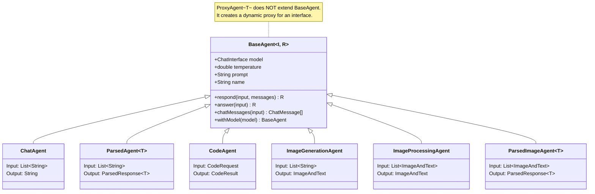

## 4. The Planning Cycle

The cognitive planning layer decomposes high-level goals into executable tasks. This sequence
diagram shows the general planning cycle used by cognitive modes.

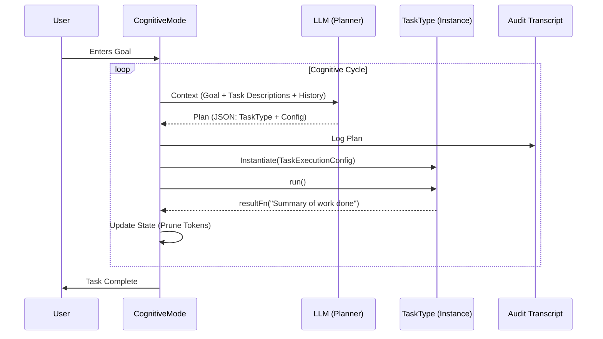

## 5. Cognitive Modes Overview

Cognotik provides several cognitive modes, each representing a different strategy for how the
AI thinks, plans, and executes tasks.

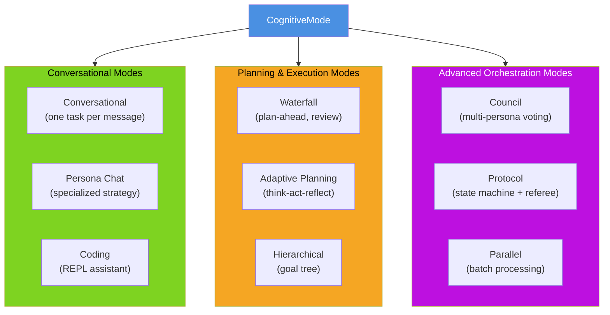

## 6. Adaptive Planning Mode: Think-Act-Reflect Loop

The Adaptive Planning Mode operates as an autonomous agent in a cyclical loop.

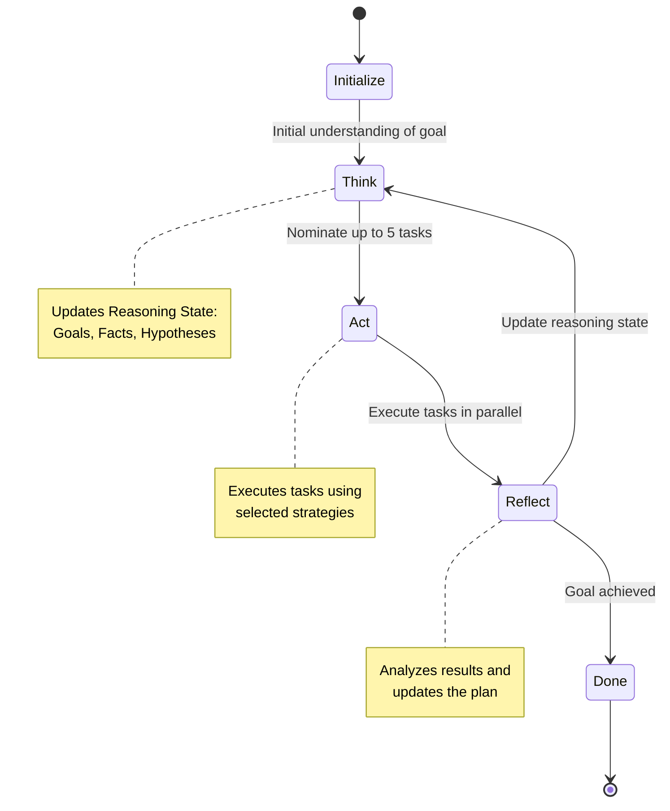

## 7. Platform Layer: Storage Structure

The platform provides file-based storage with a well-defined directory structure for
global sessions, user sessions, and user settings.

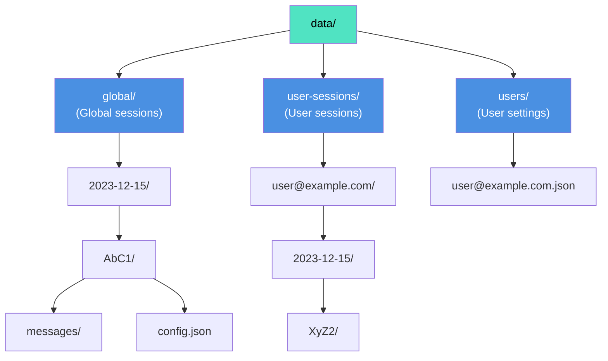

## 8. Session ID Format

Sessions are uniquely identified and can be either global or user-specific.

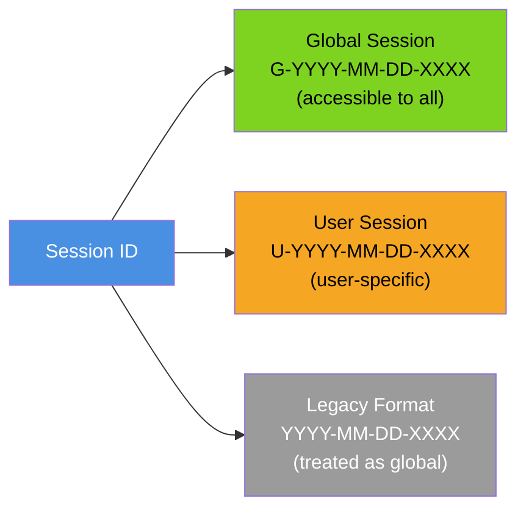

## 9. Extensibility Model: DynamicEnum Pattern

Cognotik's extension system is built on the `DynamicEnum` pattern, providing a runtime-extensible
alternative to Java enums.

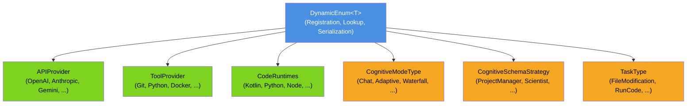

## 10. Multiplicative Strategy Scaling

Orthogonal strategy families combine multiplicatively, so adding one strategy expands
capability across all others.

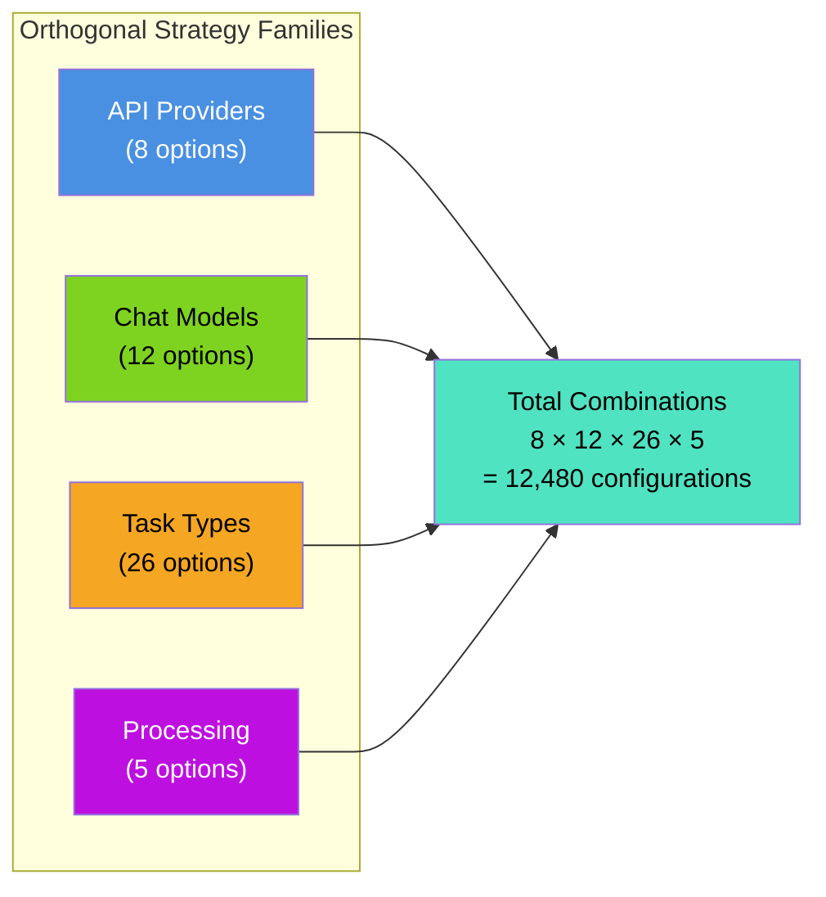

## 11. Web Request Routing

The `SessionProxyServer` acts as a router, dispatching incoming requests to the correct
`ApplicationServer` instance based on session ID.

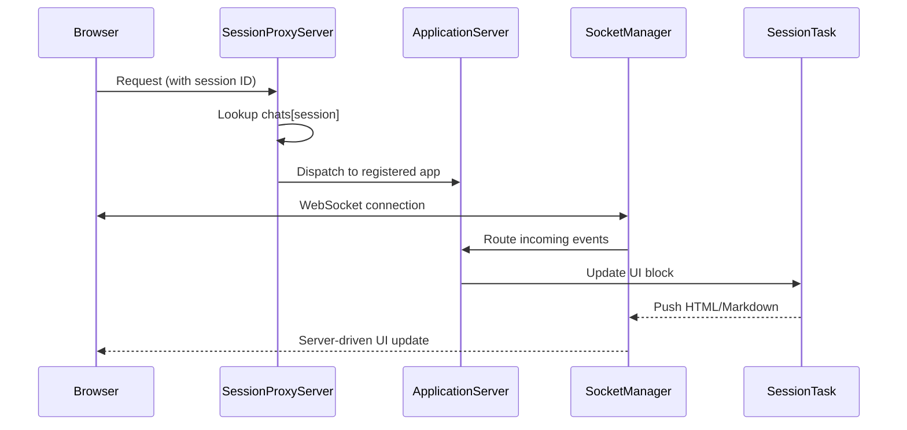

## 12. IO Discipline: The Four Audiences

A defining architectural convention is that code communicates with four distinct audiences
simultaneously, each with its own output channel and format.

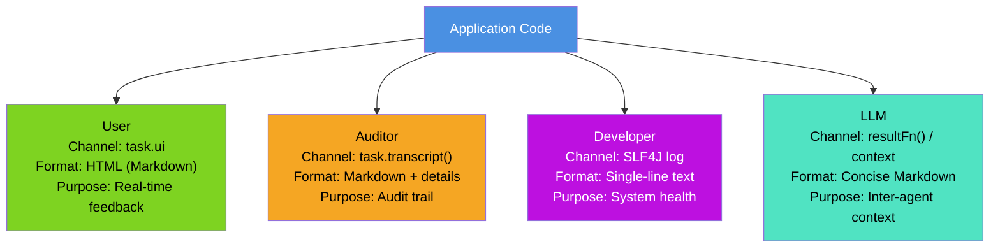

## 13. DocProcessor Pipeline

The DocProcessor is a frontmatter-driven documentation-as-specification pipeline that keeps
docs and source code in sync.

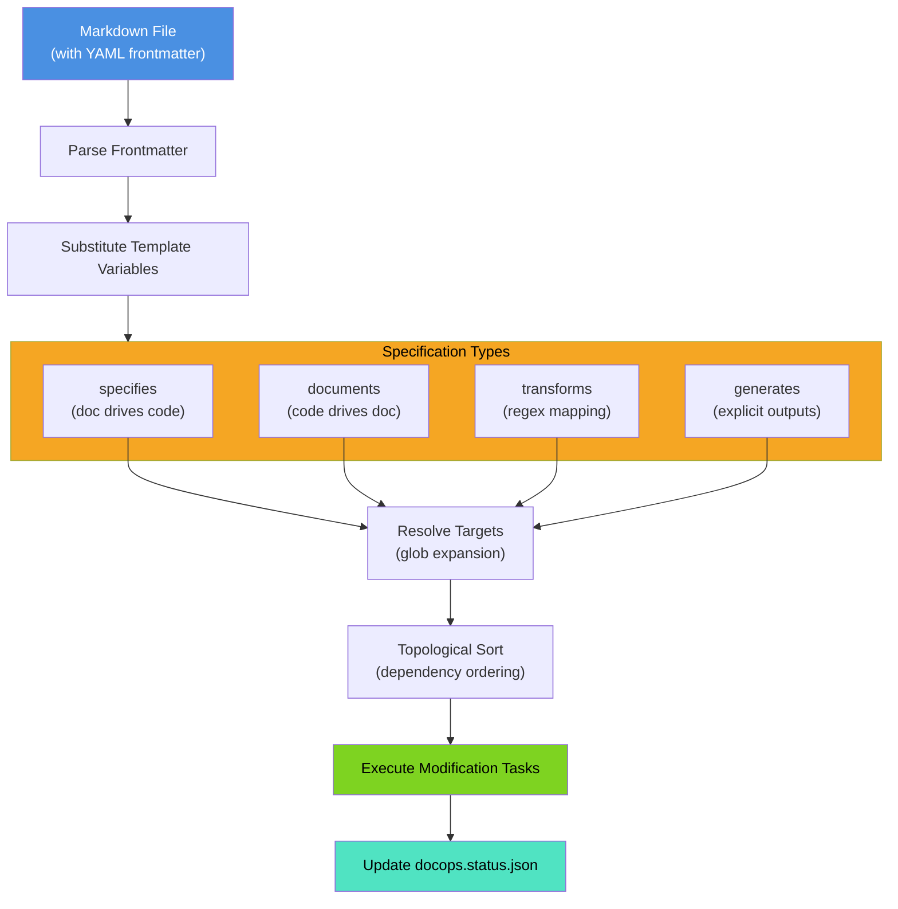

## 14. PatchProcessor Strategy Selection

PatchProcessor provides multiple matching strategies optimized for different use cases.

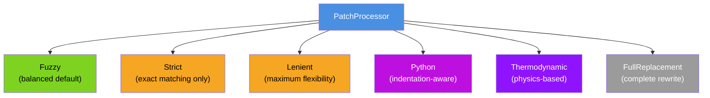

## 15. FuzzyPatchMatcher Multi-Phase Algorithm

The primary patch matcher uses a sophisticated multi-phase matching algorithm.

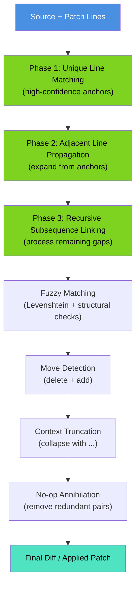

## 16. Crawler Task Pipeline

The web crawler combines seed, fetch, and processing strategies in a continuation loop.

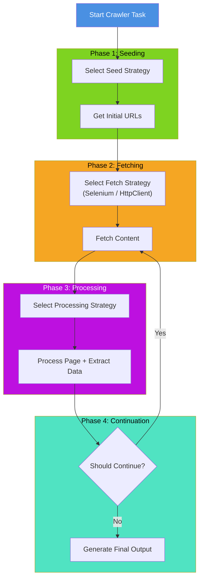

## 17. Building Applications

Developers build on Cognotik in two primary ways, both of which use the same session
launch mechanism.

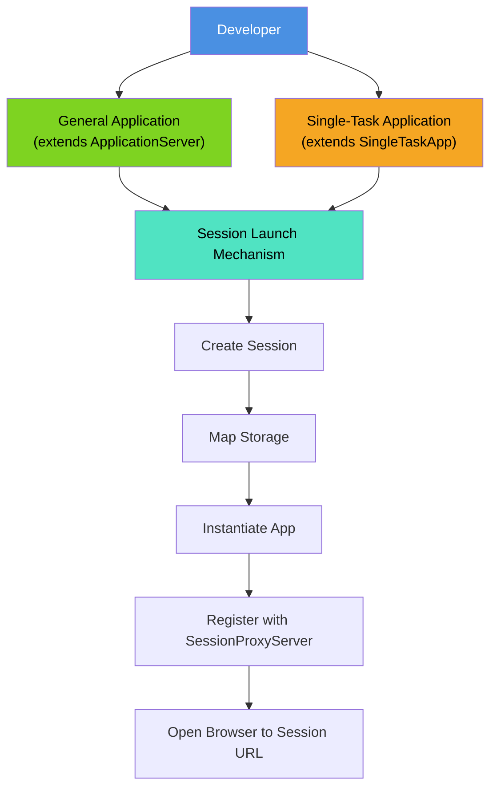

## 18. Document Reader Hierarchy

The document reading module provides a unified interface for extracting text and rendering
images from various document formats.

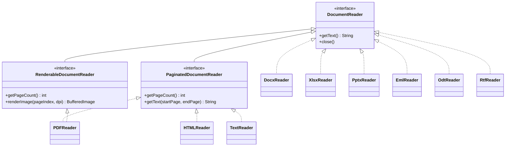

## 19. Task Status Lifecycle

The DocProcessor tracks the status of each target generation task through a defined lifecycle.

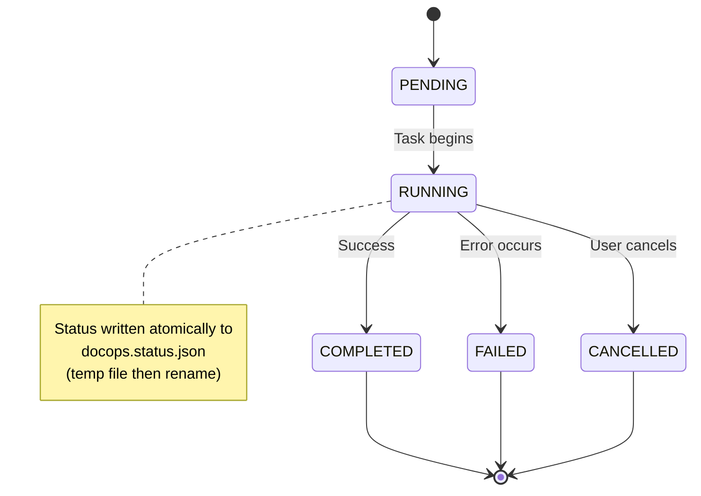

## 20. End-to-End Request Flow

This diagram ties together the full flow from a user goal to task execution and result delivery.

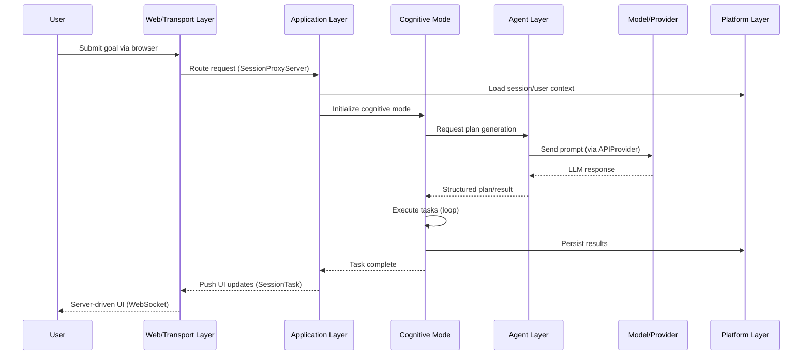