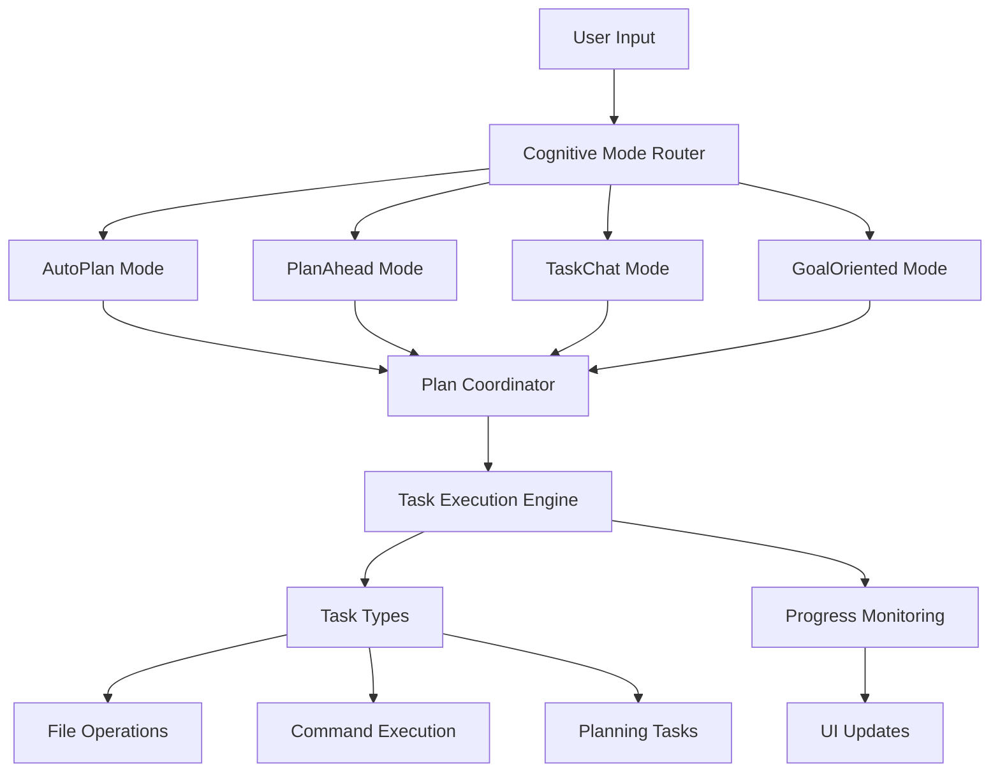

# Developer Guide: Planning and Cognition System

## Table of Contents

1. [Overview](#overview)
2. [Architecture](#architecture)
3. [Cognitive Modes](#cognitive-modes)
4. [Planning System](#planning-system)
5. [Task Execution](#task-execution)
6. [Implementation Guide](#implementation-guide)
7. [Configuration](#configuration)
8. [Best Practices](#best-practices)
9. [Troubleshooting](#troubleshooting)

## Overview

The Planning and Cognition system is a sophisticated AI-driven framework that enables intelligent task planning,
execution, and iterative problem-solving. It provides multiple cognitive strategies for handling user requests, from
simple task execution to complex goal-oriented planning.

### Key Features

- **Multiple Cognitive Modes**: Different strategies for handling user input
- **Intelligent Task Planning**: Automated breakdown of complex requests into actionable tasks
- **Iterative Execution**: Continuous learning and adaptation during execution
- **Dependency Management**: Automatic handling of task dependencies
- **Real-time Monitoring**: Live updates and progress tracking

## Architecture

### Core Components



### Key Classes

1. **CognitiveMode**: Base interface for all cognitive strategies
2. **PlanCoordinator**: Orchestrates plan execution and task management
3. **TaskType**: Defines available task implementations
4. **PlanSettings**: Configuration for planning behavior
5. **PlanProcessingState**: Tracks execution state and progress

## Cognitive Modes

### 1. AutoPlan Mode

The most sophisticated mode that implements iterative thinking and adaptive planning.

```kotlin
class AutoPlanMode(
    override val ui: ApplicationInterface,
    override val api: API,
    override val planSettings: PlanSettings,
    override val session: Session,
    override val user: User?,
    val describer: TypeDescriber
) : CognitiveMode
```

**Key Features:**

- **Iterative Thinking**: Maintains a `ThinkingStatus` that evolves with each iteration
- **Adaptive Planning**: Chooses tasks based on current context and progress
- **Parallel Execution**: Runs multiple tasks concurrently when possible
- **Context Awareness**: Considers previous task results when planning next steps

**Thinking Status Structure:**

```kotlin
data class ThinkingStatus(
    var initialPrompt: String? = null,
    var confidence: Double? = null,
    var iteration: Int = 0,
    val goals: Goals? = null,
    val knowledge: Knowledge? = null,
    val executionContext: ExecutionContext? = null
)
```

**Usage Example:**

```kotlin
val autoMode = AutoPlanMode(ui, api, planSettings, session, user, describer)
autoMode.initialize()
autoMode.handleUserMessage("Create a web application with user authentication", task)
```

### 2. PlanAhead Mode

Traditional planning approach that creates a complete plan before execution.

```kotlin
class PlanAheadMode(
    override val ui: ApplicationInterface,
    override val api: API,
    override val planSettings: PlanSettings,
    override val session: Session,
    override val user: User?,
    val describer: TypeDescriber
) : CognitiveMode
```

**Key Features:**

- **Complete Planning**: Creates full task breakdown upfront
- **Sequential Execution**: Follows predetermined execution order
- **Dependency Resolution**: Handles task dependencies automatically
- **Traditional Workflow**: Familiar plan-then-execute pattern

### 3. TaskChat Mode

Conversational mode that executes tasks based on ongoing dialogue.

```kotlin
class TaskChatMode(
    override val ui: ApplicationInterface,
    override val api: API,
    override val planSettings: PlanSettings,
    override val session: Session,
    override val user: User?,
    val describer: TypeDescriber
) : CognitiveMode
```

**Key Features:**

- **Conversational Interface**: Maintains chat history
- **Single Task Focus**: Executes one task per user message
- **Context Preservation**: Remembers previous interactions
- **Real-time Response**: Immediate task execution

### 4. GoalOriented Mode

Hierarchical goal decomposition with dependency management.

```kotlin
class GoalOrientedMode(
    override val ui: ApplicationInterface,
    override val api: API,
    override val planSettings: PlanSettings,
    override val session: Session,
    override val user: User?,
    val describer: TypeDescriber
) : CognitiveMode
```

**Key Features:**

- **Goal Hierarchy**: Breaks down high-level goals into subgoals
- **Status Tracking**: Monitors goal and task completion
- **Dependency Management**: Handles complex interdependencies
- **Visual Progress**: Tree-like goal visualization

## Planning System

### Plan Settings

Configuration object that controls planning behavior:

```kotlin
class PlanSettings(
    var defaultModel: ChatModel,
    var parsingModel: ChatModel,
    val shellCmd: List<String> = listOf(if (isWindows) "powershell" else "bash"),
    var temperature: Double = 0.2,
    val budget: Double = 2.0,
    val taskSettings: MutableMap<String, TaskSettingsBase> = ...,
    var autoFix: Boolean = false,
    val env: Map<String, String>? = mapOf(),
    val workingDir: String? = ".",
    val language: String? = if (isWindows) "powershell" else "bash",
    var maxTaskHistoryChars: Int = 10000,
    var maxTasksPerIteration: Int = 3,
    var maxIterations: Int = 10
)
```

### Task Types

Available task implementations:

1. **FileModificationTask**: File creation and editing
2. **CommandAutoFixTask**: Command execution with error handling
3. **PlanningTask**: Recursive planning capabilities
4. **InsightTask**: Analysis and documentation
5. **InquiryTask**: Information gathering

### Plan Coordinator

Central orchestrator for plan execution:

```kotlin
class PlanCoordinator(
    val user: User?,
    val session: Session,
    val dataStorage: StorageInterface,
    val ui: ApplicationInterface,
    val planSettings: PlanSettings,
    val root: Path
)
```

**Key Methods:**

- `executePlan()`: Executes a complete plan
- `newState()`: Creates initial processing state
- `await()`: Waits for task completion

## Task Execution

### Task Lifecycle

1. **Planning Phase**: Tasks are identified and dependencies resolved
2. **Queuing Phase**: Tasks are ordered for execution
3. **Execution Phase**: Tasks run with dependency checking
4. **Monitoring Phase**: Progress is tracked and reported
5. **Completion Phase**: Results are collected and processed

### Dependency Management

The system automatically handles task dependencies:

```kotlin
fun executionOrder(tasks: Map<String, TaskConfigBase>): List<String> {
    val taskIds: MutableList<String> = mutableListOf()
    val taskMap = tasks.toMutableMap()
    while (taskMap.isNotEmpty()) {
        val nextTasks = taskMap.filter { (_, task) ->
            task.task_dependencies?.filter { entry ->
                entry in tasks.keys
            }?.all { taskIds.contains(it) } ?: true
        }
        if (nextTasks.isEmpty()) {
            throw RuntimeException("Circular dependency detected")
        }
        taskIds.addAll(nextTasks.keys)
        nextTasks.keys.forEach { taskMap.remove(it) }
    }
    return taskIds
}
```

### Progress Monitoring

Real-time progress tracking with visual updates:

```kotlin
data class PlanProcessingState(
    val subTasks: Map<String, TaskConfigBase>,
    val tasksByDescription: MutableMap<String?, TaskConfigBase>,
    val taskIdProcessingQueue: MutableList<String>,
    val taskResult: MutableMap<String, String>,
    val completedTasks: MutableList<String>,
    val taskFutures: MutableMap<String, Future<*>>,
    val uitaskMap: MutableMap<String, SessionTask>
)
```

## Implementation Guide

### Creating a Custom Cognitive Mode

1. **Implement the Interface**:

```kotlin
class CustomMode(
    override val ui: ApplicationInterface,
    override val api: API,
    override val planSettings: PlanSettings,
    override val session: Session,
    override val user: User?,
    val describer: TypeDescriber
) : CognitiveMode {

    override fun initialize() {
        // Initialize mode-specific state
    }

    override fun handleUserMessage(userMessage: String, task: SessionTask) {
        // Process user input and execute tasks
    }

    override fun contextData(): List<String> {
        // Return context information
        return emptyList()
    }
}
```

2. **Register the Mode**:

```kotlin
companion object : CognitiveModeStrategy {
    override val inputCnt = 1
    override fun getCognitiveMode(
        ui: ApplicationInterface,
        api: API,
        planSettings: PlanSettings,
        session: Session,
        user: User?,
        describer: TypeDescriber
    ) = CustomMode(ui, api, planSettings, session, user, describer)
}
```

3. **Add to Registry**:

```kotlin
object CognitiveModes {
    val allModes: Map<String, CognitiveModeStrategy> = mapOf(
        "AutoPlan" to AutoPlanMode,
        "PlanAhead" to PlanAheadMode,
        "TaskChat" to TaskChatMode,
        "GoalOriented" to GoalOrientedMode,
        "Custom" to CustomMode
    )
}
```

### Creating Custom Task Types

1. **Define Task Configuration**:

```kotlin
data class CustomTaskConfig(
    override val task_type: String? = "CustomTask",
    override val task_description: String? = null,
    override val task_dependencies: MutableList<String>? = null,
    val customParameter: String? = null
) : TaskConfigBase()
```

2. **Implement Task Logic**:

```kotlin
class CustomTask : AbstractTask<CustomTaskConfig>() {
    override fun promptSegment(): String = """
        CustomTask - Performs custom operations
        ** Specify custom parameters and requirements
    """.trimIndent()

    override fun run(
        agent: PlanCoordinator,
        messages: List<String>,
        task: SessionTask,
        api: API,
        resultFn: (String) -> Unit,
        planSettings: PlanSettings
    ) {
        // Implement task execution logic
        val result = performCustomOperation()
        resultFn(result)
    }
}
```

## Configuration

### Environment Setup

```kotlin
val planSettings = PlanSettings(
    defaultModel = ChatModel.GPT4o,
    parsingModel = ChatModel.GPT4oMini,
    temperature = 0.2,
    budget = 5.0,
    autoFix = true,
    workingDir = "/path/to/project",
    maxIterations = 15,
    maxTasksPerIteration = 5
)
```

### Task Settings

```kotlin
planSettings.taskSettings["FileModificationTask"] = TaskSettingsBase(
    task_type = "FileModificationTask",
    enabled = true,
    model = ChatModel.GPT4o
)
```

### API Configuration

```kotlin
val api = OpenAIClient(apiKey = "your-api-key")
val chatClient = api as ChatClient
chatClient.budget = planSettings.budget
```

## Best Practices

### 1. Mode Selection

- **AutoPlan**: Complex, multi-step projects requiring adaptation
- **PlanAhead**: Well-defined projects with clear requirements
- **TaskChat**: Interactive development and exploration
- **GoalOriented**: Projects with complex hierarchical goals

### 2. Task Design

- Keep tasks focused and atomic
- Define clear dependencies
- Provide detailed descriptions
- Include error handling

### 3. Performance Optimization

- Set appropriate budget limits
- Use parallel execution when possible
- Monitor resource usage
- Implement caching for repeated operations

### 4. Error Handling

```kotlin
try {
    val result = executeTask(task)
    resultFn(result)
} catch (e: Exception) {
    log.error("Task execution failed", e)
    task.error(ui, e)
    resultFn("Error: ${e.message}")
}
```

### 5. Progress Monitoring

```kotlin
// Update UI with progress
task.add("Starting task execution...".renderMarkdown())
// ... perform work ...
task.complete("Task completed successfully".renderMarkdown())
```

## Troubleshooting

### Common Issues

1. **Circular Dependencies**
    - Check task dependency chains
    - Use `executionOrder()` to validate
    - Simplify complex dependency graphs

2. **Memory Issues**
    - Reduce `maxTaskHistoryChars`
    - Limit concurrent tasks
    - Clear completed task data

3. **API Budget Exceeded**
    - Increase budget limits
    - Optimize prompt efficiency
    - Use cheaper models for parsing

4. **Task Execution Failures**
    - Check file permissions
    - Validate working directory
    - Review environment variables

### Debugging Tools

1. **Logging**:

```kotlin
private val log = LoggerFactory.getLogger(YourClass::class.java)
log.debug("Task execution started: $taskId")
```

2. **State Inspection**:

```kotlin
log.info("Current state: ${JsonUtil.toJson(planProcessingState)}")
```

3. **Progress Tracking**:

```kotlin
task.verbose("Detailed execution information")
```

### Performance Monitoring

Monitor key metrics:

- Task execution time
- API call frequency
- Memory usage
- Concurrent task count

```kotlin
val startTime = System.currentTimeMillis()
// ... execute task ...
val duration = System.currentTimeMillis() - startTime
log.info("Task completed in ${duration}ms")
```
