# webui\src\main\kotlin\com\simiacryptus\cognotik\plan\tools\writing\ArticleGenerationTask.kt

## ArticleGenerationTask Documentation

### Overview

`ArticleGenerationTask` is a comprehensive journalistic article generation system that extends `JournalismReasoningTask`
to produce publication-ready articles. It combines investigative journalism analysis with structured article writing,
supporting multiple formats, styles, and publication targets.

### Key Features

- **Multi-phase article generation** (Investigation → Structure → Writing → Revision)
- **Flexible article formats** (news, feature, investigative, opinion, profile)
- **Configurable writing styles** (AP style, narrative, analytical, conversational)
- **Optional social media snippet generation**
- **Quality improvement through revision passes**
- **Comprehensive transcript generation**
- **Real-time progress tracking with tabbed interface**

### Data Flow

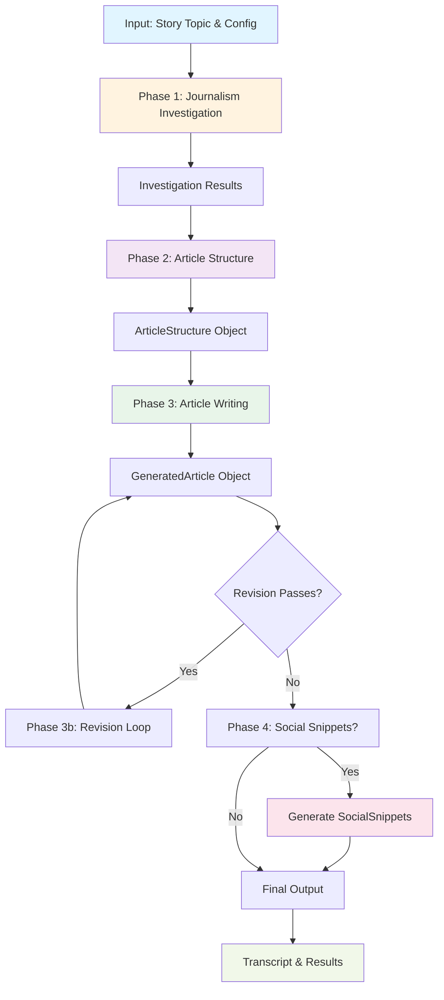

### Configuration Data Model

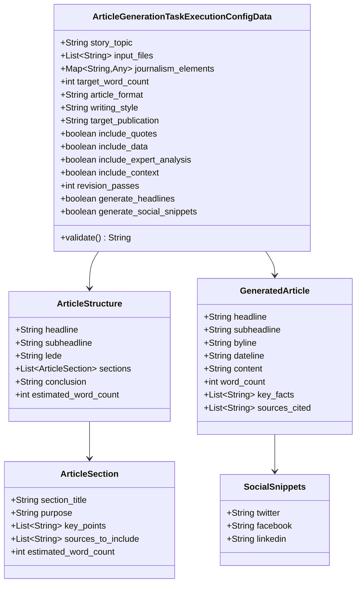

### Execution Flow

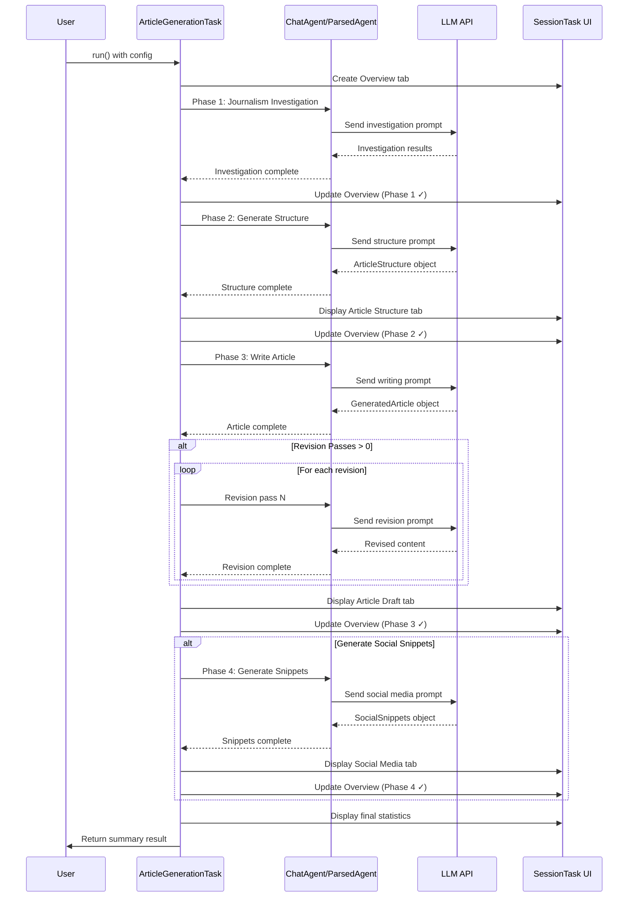

### Configuration Parameters

#### Core Parameters

| Parameter             | Type         | Default  | Description                                       |
|-----------------------|--------------|----------|---------------------------------------------------|
| `story_topic`         | String       | Required | The main topic or event to write about            |
| `input_files`         | List<String> | []       | File patterns (glob) to use as reference material |
| `journalism_elements` | Map          | {}       | Who, what, when, where, why, how details          |

#### Article Specifications

| Parameter            | Type   | Default        | Description                                            |
|----------------------|--------|----------------|--------------------------------------------------------|
| `target_word_count`  | int    | 1000           | Desired article length in words                        |
| `article_format`     | String | "news"         | Format: news, feature, investigative, opinion, profile |
| `writing_style`      | String | "AP style"     | Style: AP style, narrative, analytical, conversational |
| `target_publication` | String | "general news" | Publication type (affects tone/depth)                  |

#### Content Options

| Parameter                 | Type    | Default | Description                        |
|---------------------------|---------|---------|------------------------------------|
| `include_quotes`          | boolean | true    | Include direct quotes from sources |
| `include_data`            | boolean | true    | Include statistics and data        |
| `include_expert_analysis` | boolean | true    | Include expert interpretation      |
| `include_context`         | boolean | true    | Include background and history     |

#### Quality & Output

| Parameter                  | Type    | Default | Description                         |
|----------------------------|---------|---------|-------------------------------------|
| `revision_passes`          | int     | 1       | Number of editorial revision passes |
| `generate_headlines`       | boolean | true    | Generate headline and subheadline   |
| `generate_social_snippets` | boolean | false   | Generate social media snippets      |

### Output Structure

#### GeneratedArticle Object

```json
{
  "headline": "Breaking News: Major Development",
  "subheadline": "Detailed context and significance",
  "byline": "By Reporter Name",
  "dateline": "City, State — Date",
  "content": "Full article text...",
  "word_count": 1247,
  "key_facts": [
    "Fact 1",
    "Fact 2"
  ],
  "sources_cited": [
    "Source 1",
    "Source 2"
  ]
}
```

#### SocialSnippets Object

```json
{
  "twitter": "280-char tweet with hashtags #news",
  "facebook": "2-3 sentence post with call-to-action",
  "linkedin": "Professional angle, 2-3 sentences"
}
```

### Usage Example

#### Basic Configuration

```kotlin
val config = ArticleGenerationTaskExecutionConfigData(
    story_topic = "Climate Change Summit Results",
    target_word_count = 1500,
    article_format = "feature",
    writing_style = "narrative",
    target_publication = "environmental magazine",
    include_quotes = true,
    include_data = true,
    include_expert_analysis = true,
    revision_passes = 2,
    generate_social_snippets = true
)
```

#### With Input Files

```kotlin
val config = ArticleGenerationTaskExecutionConfigData(
    story_topic = "Company Merger Analysis",
    input_files = listOf(
        "reports/**/*.pdf",
        "documents/**/*.docx",
        "data/**/*.csv"
    ),
    target_word_count = 2000,
    article_format = "investigative",
    writing_style = "analytical",
    target_publication = "business news",
    revision_passes = 3
)
```

#### With Journalism Elements

```kotlin
val config = ArticleGenerationTaskExecutionConfigData(
    story_topic = "Local Community Initiative",
    journalism_elements = mapOf(
        "who" to "Community leaders and residents",
        "what" to "New urban garden project",
        "when" to "Launched this month",
        "where" to "Downtown neighborhood",
        "why" to "Food security and community building",
        "how" to "Volunteer-driven initiative"
    ),
    target_word_count = 800,
    article_format = "news",
    writing_style = "AP style"
)
```

### Execution Phases

#### Phase 1: Journalism Investigation

- Inherits from `JournalismReasoningTask`
- Performs comprehensive analysis
- Verifies facts and identifies perspectives
- Analyzes context and identifies biases
- Finds information gaps
- Generates alternative angles

#### Phase 2: Article Structure

- Creates detailed outline
- Defines headline and subheadline
- Plans lede (opening paragraph)
- Structures 3-5 main sections
- Specifies key points per section
- Estimates word count distribution

#### Phase 3: Article Writing

- Writes complete article following structure
- Integrates quotes and data
- Maintains journalistic standards
- Applies specified style and tone
- Includes proper attribution
- Performs optional revision passes

#### Phase 4: Social Media (Optional)

- Creates platform-specific snippets
- Optimizes for Twitter (280 chars)
- Crafts Facebook post (conversational)
- Writes LinkedIn snippet (professional)
- Includes relevant hashtags

### Validation Rules

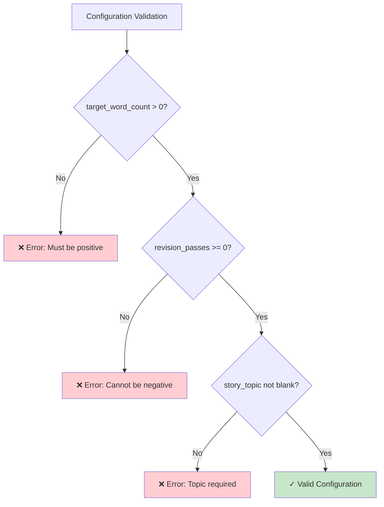

### Error Handling

The task implements comprehensive error handling:

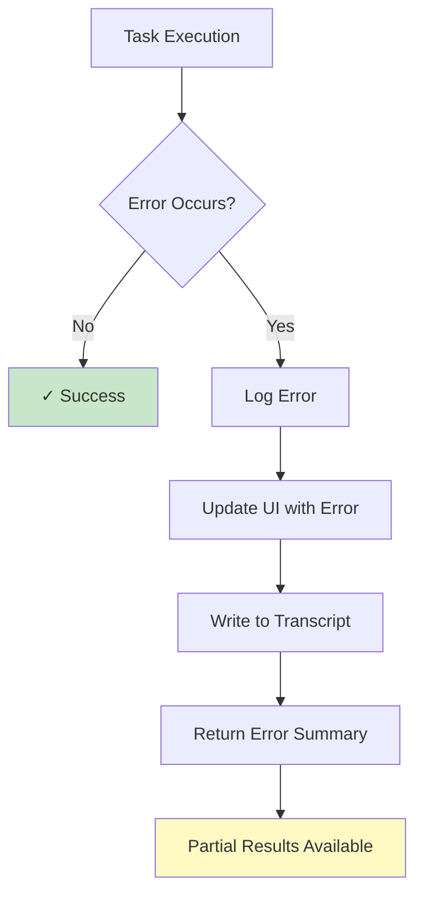

### Performance Metrics

The task tracks and reports:

- **Word Count**: Actual vs. target (with accuracy percentage)
- **Sources Cited**: Number of sources referenced
- **Key Facts**: Number of key facts extracted
- **Execution Time**: Total time in seconds
- **Revision Passes**: Number of quality improvement iterations

### Output Artifacts

#### Generated Files

1. **Article Draft** - Full article with formatting
2. **Transcript** - Complete execution log (Markdown)
3. **Social Snippets** - Platform-specific content (if enabled)

#### UI Tabs

- **Overview** - Progress and statistics
- **Article Structure** - Outline and planning
- **Article Draft** - Final article content
- **Social Media** - Platform snippets (if enabled)

### Best Practices

#### Configuration

✅ **DO:**

- Specify clear, detailed story topics
- Include relevant journalism elements
- Set realistic word count targets
- Use appropriate format for content type
- Enable revision passes for important articles

❌ **DON'T:**

- Leave story_topic blank
- Set negative revision passes
- Use incompatible format/style combinations
- Ignore input file patterns
- Skip validation before execution

#### Input Files

✅ **DO:**

- Use glob patterns for flexibility
- Include diverse source materials
- Provide context documents
- Use standard file formats

❌ **DON'T:**

- Include binary files without extraction
- Use overly broad patterns
- Mix unrelated source materials
- Exceed reasonable file sizes

### Troubleshooting

| Issue                        | Cause                | Solution                                        |
|------------------------------|----------------------|-------------------------------------------------|
| "Invalid configuration type" | Wrong config class   | Verify ArticleGenerationTaskExecutionConfigData |
| "No story topic specified"   | Empty story_topic    | Provide clear, specific topic                   |
| "API validation failed"      | Missing API key      | Configure API credentials                       |
| "Word count mismatch"        | LLM variation        | Increase revision passes                        |
| "File not found"             | Invalid glob pattern | Verify file paths and patterns                  |

### Integration Points

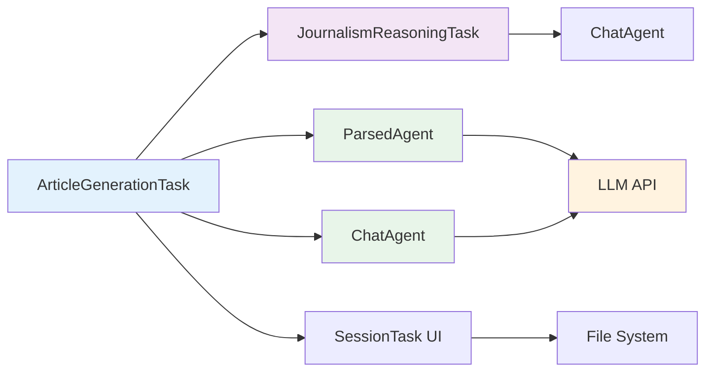

### Related Tasks

- **JournalismReasoningTask** - Base class for journalism analysis
- **NarrativeGenerationTask** - Story and narrative writing
- **ReportGenerationTask** - Technical and business reports
- **TutorialGenerationTask** - Educational content

# webui\src\main\kotlin\com\simiacryptus\cognotik\plan\tools\writing\BusinessProposalTask.kt

## Business Proposal Task - User Documentation

### Overview

The **BusinessProposalTask** is a comprehensive tool for generating professional business proposals with integrated
financial analysis, risk assessment, and competitive positioning. It uses AI agents to create multi-section proposals
tailored to specific stakeholder needs and proposal types.

### Key Features

- 🎯 **Stakeholder Analysis** - Identifies decision-makers and their interests
- 💰 **ROI Analysis** - Generates financial projections and cost breakdowns
- ⚠️ **Risk Assessment** - Identifies risks with mitigation strategies
- 🏆 **Competitive Analysis** - Compares alternatives and positioning
- 📅 **Timeline Planning** - Creates project phases with milestones
- ✍️ **Content Generation** - Writes executive summary and main sections
- 🔄 **Revision Passes** - Optional quality improvement iterations
- 📊 **Multiple Formats** - Outputs Markdown, HTML, and PDF

### Configuration Parameters

#### Required Parameters

| Parameter        | Type   | Description                       | Example                                       |
|------------------|--------|-----------------------------------|-----------------------------------------------|
| `proposal_title` | String | The title or name of the proposal | "Cloud Migration Initiative"                  |
| `objective`      | String | The primary goal of the proposal  | "Migrate on-premises infrastructure to cloud" |

#### Proposal Type & Scope

| Parameter                | Type    | Default   | Options                                               |
|--------------------------|---------|-----------|-------------------------------------------------------|
| `proposal_type`          | String  | "project" | project, investment, grant, partnership, rfp_response |
| `proposing_organization` | String  | null      | Your organization name                                |
| `target_word_count`      | Integer | 3000      | Recommended: 2000-5000                                |

#### Stakeholder Configuration

| Parameter         | Type                | Description                                     |
|-------------------|---------------------|-------------------------------------------------|
| `decision_makers` | List[String]        | Key people who will evaluate the proposal       |
| `stakeholders`    | Map[String, String] | Stakeholder names and their interests           |
| `urgency_level`   | String              | critical, high, moderate, low                   |
| `tone`            | String              | formal, professional, persuasive, collaborative |

#### Financial & Timeline

| Parameter      | Type   | Description                             |
|----------------|--------|-----------------------------------------|
| `budget_range` | String | e.g., "$50,000-$100,000" or "under $1M" |
| `timeline`     | String | e.g., "6 months" or "2024-2025"         |

#### Analysis Components (Boolean Flags)

| Parameter                       | Default | Purpose                                    |
|---------------------------------|---------|--------------------------------------------|
| `include_roi_analysis`          | true    | Financial projections and ROI calculations |
| `include_risk_assessment`       | true    | Risk identification and mitigation         |
| `include_competitive_analysis`  | true    | Alternatives comparison                    |
| `include_timeline_milestones`   | true    | Project phases and critical path           |
| `include_resource_requirements` | true    | Team and resource needs                    |
| `include_appendices`            | true    | Supporting documents section               |

#### Content Control

| Parameter         | Type         | Default | Description                                    |
|-------------------|--------------|---------|------------------------------------------------|
| `revision_passes` | Integer      | 1       | Number of quality improvement iterations (0-5) |
| `related_files`   | List[String] | null    | Research files to incorporate                  |
| `input_files`     | List[String] | null    | File patterns (e.g., `**/*.kt`) for context    |

### Execution Flow

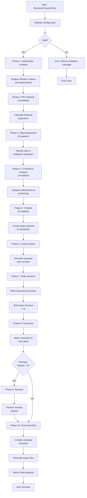

### Data Flow Architecture

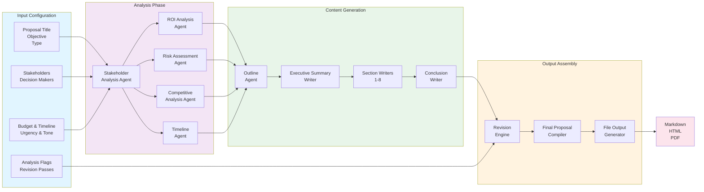

### Agent Interaction Pattern

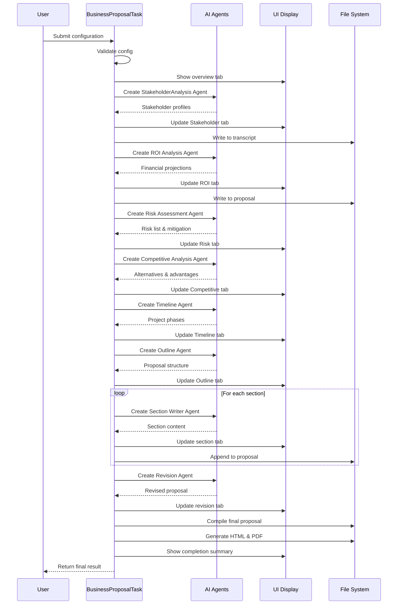

### Data Structure Hierarchy

```mermaid
graph TD
    A["BusinessProposalTaskExecutionConfigData"] --> B["Proposal Metadata"]
    A --> C["Stakeholder Config"]
    A --> D["Analysis Flags"]
    A --> E["Content Config"]
    
    B --> B1["proposal_title"]
    B --> B2["proposal_type"]
    B --> B3["objective"]
    
    C --> C1["decision_makers"]
    C --> C2["stakeholders"]
    C --> C3["urgency_level"]
    
    D --> D1["include_roi_analysis"]
    D --> D2["include_risk_assessment"]
    D --> D3["include_competitive_analysis"]
    
    E --> E1["target_word_count"]
    E --> E2["revision_passes"]
    E --> E3["tone"]
    
    F["ProposalOutline"] --> F1["title"]
    F --> F2["executive_summary"]
    F --> F3["sections: List[ProposalSection]"]
    F --> F4["success_metrics"]
    
    G["StakeholderAnalysis"] --> G1["stakeholders: List[StakeholderProfile]"]
    G1 --> G1A["name, interests, concerns"]
    G1 --> G1B["addressing_strategy"]
    G1 --> G1C["influence_level"]
    
    H["ROIAnalysis"] --> H1["financial_projections"]
    H --> H2["cost_breakdown: List[CostItem]"]
    H --> H3["expected_benefits: List[Benefit]"]
    H --> H4["roi_summary, payback_period"]
    
    I["RiskAssessment"] --> I1["risks: List[Risk]"]
    I1 --> I1A["category, description"]
    I1 --> I1B["probability, impact"]
    I1 --> I1C["mitigation_strategy"]
    I --> I2["overall_risk_level"]
    
    J["CompetitiveAnalysis"] --> J1["alternatives: List[Alternative]"]
    J --> J2["competitive_advantages"]
    J --> J3["superiority_statement"]
    
    K["TimelineMilestones"] --> K1["phases: List[ProjectPhase]"]
    K1 --> K1A["name, duration"]
    K1 --> K1B["deliverables, dependencies"]
    K --> K2["critical_path"]
```

### Output Structure

```mermaid
graph TD
    A["Complete Proposal Output"] --> B["Markdown File"]
    A --> C["HTML File"]
    A --> D["PDF File"]
    A --> E["Transcript File"]
    
    B --> B1["# Title"]
    B --> B2["## Executive Summary"]
    B --> B3["## Main Sections 1-8"]
    B --> B4["## Conclusion"]
    B --> B5["## Appendices"]
    
    B3 --> B3A["Background/Context"]
    B3 --> B3B["Proposed Solution"]
    B3 --> B3C["Implementation"]
    B3 --> B3D["Financial Analysis"]
    B3 --> B3E["Risk Management"]
    B3 --> B3F["Competitive Position"]
    B3 --> B3G["Timeline & Milestones"]
    B3 --> B3H["Resource Requirements"]
    
    E --> E1["Phase 1: Stakeholder Analysis"]
    E --> E2["Phase 2: ROI Analysis"]
    E --> E3["Phase 3: Risk Assessment"]
    E --> E4["Phase 4: Competitive Analysis"]
    E --> E5["Phase 5: Timeline"]
    E --> E6["Phase 6: Outline"]
    E --> E7["Phase 7: Content Generation"]
    E --> E8["Phase 8: Conclusion"]
    E --> E9["Phase 9: Revision"]
    E --> E10["Phase 10: Final Assembly"]
```

### Usage Examples

#### Example 1: Project Proposal

```json
{
  "proposal_title": "Enterprise Cloud Migration",
  "proposal_type": "project",
  "objective": "Migrate legacy on-premises infrastructure to AWS cloud",
  "proposing_organization": "TechCorp Solutions",
  "decision_makers": ["CTO", "VP Operations", "CFO"],
  "budget_range": "$500,000 - $750,000",
  "timeline": "12 months",
  "urgency_level": "high",
  "tone": "professional",
  "target_word_count": 4000,
  "include_roi_analysis": true,
  "include_risk_assessment": true,
  "include_competitive_analysis": true,
  "include_timeline_milestones": true,
  "revision_passes": 2
}
```

#### Example 2: Grant Proposal

```json
{
  "proposal_title": "Community Tech Education Initiative",
  "proposal_type": "grant",
  "objective": "Fund technology education programs for underserved communities",
  "proposing_organization": "Digital Futures Foundation",
  "decision_makers": ["Grant Committee", "Executive Director"],
  "budget_range": "$100,000 - $250,000",
  "timeline": "2 years",
  "urgency_level": "moderate",
  "tone": "persuasive",
  "target_word_count": 3500,
  "include_roi_analysis": true,
  "include_risk_assessment": true,
  "include_competitive_analysis": false,
  "revision_passes": 1
}
```

#### Example 3: RFP Response

```json
{
  "proposal_title": "Government IT Services RFP Response",
  "proposal_type": "rfp_response",
  "objective": "Respond to government RFP for managed IT services",
  "proposing_organization": "Enterprise IT Solutions Inc.",
  "decision_makers": ["Procurement Officer", "Technical Evaluator", "Budget Committee"],
  "budget_range": "As specified in RFP",
  "timeline": "3 years with renewal options",
  "urgency_level": "critical",
  "tone": "formal",
  "target_word_count": 5000,
  "include_roi_analysis": true,
  "include_risk_assessment": true,
  "include_competitive_analysis": true,
  "include_timeline_milestones": true,
  "revision_passes": 3
}
```

### Output Files

The task generates multiple output files in the session directory:

#### 1. **proposal.md** (Main Deliverable)

- Complete proposal in Markdown format
- Includes all sections, analysis, and appendices
- Easily convertible to HTML and PDF

#### 2. **transcript.md** (Generation Log)

- Detailed log of all generation phases
- Timestamps and progress indicators
- Useful for auditing and understanding decisions

#### 3. **proposal.html** (Web Version)

- Formatted HTML version for web viewing
- Professional styling and navigation
- Shareable via email or web link

#### 4. **proposal.pdf** (Print Version)

- Print-ready PDF format
- Professional layout and formatting
- Suitable for formal submission

### Performance Metrics

| Metric               | Typical Value | Range        |
|----------------------|---------------|--------------|
| Generation Time      | 2-5 minutes   | 1-10 minutes |
| Word Count           | 3000-4000     | 2000-5000+   |
| Number of Sections   | 8-10          | 6-12         |
| API Calls            | 10-15         | 8-20         |
| File Size (Markdown) | 50-150 KB     | 30-300 KB    |

### Best Practices

#### 1. **Configuration**

- ✅ Provide specific, measurable objectives
- ✅ List actual decision-makers and stakeholders
- ✅ Set realistic word count targets
- ✅ Choose appropriate tone for audience

#### 2. **Content Quality**

- ✅ Include related research files for context
- ✅ Specify input files for technical proposals
- ✅ Use 2-3 revision passes for important proposals
- ✅ Review and customize generated content

#### 3. **Stakeholder Analysis**

- ✅ Identify all key decision-makers
- ✅ Map stakeholder interests and concerns
- ✅ Tailor messaging to each stakeholder group
- ✅ Address objections proactively

#### 4. **Financial Projections**

- ✅ Provide realistic budget ranges
- ✅ Include detailed cost breakdowns
- ✅ Specify expected benefits and timelines
- ✅ Calculate conservative ROI estimates

#### 5. **Risk Management**

- ✅ Identify realistic risks
- ✅ Provide concrete mitigation strategies
- ✅ Assess probability and impact
- ✅ Show preparedness and planning

### Troubleshooting

#### Issue: Proposal is too short

**Solution:** Increase `target_word_count` or add more sections via analysis flags

#### Issue: Content doesn't match tone

**Solution:** Adjust `tone` parameter and increase `revision_passes`

#### Issue: Missing stakeholder perspectives

**Solution:** Populate `decision_makers` and `stakeholders` fields more completely

#### Issue: Financial analysis seems unrealistic

**Solution:** Provide specific `budget_range` and include context files with financial data

#### Issue: Timeline doesn't align with budget

**Solution:** Ensure `timeline` and `budget_range` are realistic and aligned

### Advanced Features

#### Context Integration

```json
{
  "related_files": [
    "market_research.md",
    "financial_data.xlsx",
    "competitor_analysis.pdf"
  ],
  "input_files": [
    "src/**/*.kt",
    "docs/**/*.md"
  ]
}
```

#### Multi-Pass Revision

```json
{
  "revision_passes": 3
}
```

Each pass refines language, flow, and persuasiveness.

#### Comprehensive Analysis

```json
{
  "include_roi_analysis": true,
  "include_risk_assessment": true,
  "include_competitive_analysis": true,
  "include_timeline_milestones": true,
  "include_resource_requirements": true,
  "include_appendices": true
}
```

### Integration with Other Tasks

The BusinessProposalTask can be combined with:

- **FileModificationTask** - Update proposal files
- **GenerateDocumentationTask** - Create supporting docs
- **ArticleGenerationTask** - Expand sections
- **KnowledgeIndexingTask** - Index proposal content

---

**Last Updated:** 2024
**Version:** 1.0
**Status:** Production Ready

# webui\src\main\kotlin\com\simiacryptus\cognotik\plan\tools\writing\EmailCampaignTask.kt

## EmailCampaignTask User Documentation

### Overview

The **EmailCampaignTask** is a comprehensive email marketing automation tool that generates complete, production-ready
email sequences. It combines strategic planning, content generation, and quality refinement to create cohesive
multi-email campaigns tailored to specific marketing goals.

#### Key Capabilities

- 🎯 **Strategic Planning**: Develops campaign strategy, key messages, and progression logic
- ✉️ **Email Generation**: Creates complete emails with bodies, CTAs, and personalization
- 🔤 **Subject Line Variants**: Generates A/B test options using different psychological approaches
- 🎨 **Customization**: Configurable brand voice, tone, audience targeting, and email length
- 📊 **Quality Assurance**: Optional revision passes to refine and improve content
- 📋 **Documentation**: Comprehensive transcripts and implementation guides

---

### Configuration Guide

#### Basic Parameters

| Parameter         | Type   | Default            | Description                                                                                  |
|-------------------|--------|--------------------|----------------------------------------------------------------------------------------------|
| `campaign_goal`   | String | Required           | The primary objective of the email campaign                                                  |
| `subject_matter`  | String | Required           | The product, service, or topic being promoted                                                |
| `target_audience` | String | "general audience" | Demographics, role, and pain points of recipients                                            |
| `campaign_type`   | String | "nurture"          | Type: `welcome_series`, `nurture`, `sales`, `re_engagement`, `newsletter`, `event_promotion` |
| `num_emails`      | Int    | 3                  | Number of emails in sequence (1-10)                                                          |

#### Campaign Strategy Parameters

| Parameter        | Type      | Default        | Description                                                                          |
|------------------|-----------|----------------|--------------------------------------------------------------------------------------|
| `brand_voice`    | String    | "professional" | Tone: `professional`, `friendly`, `casual`, `authoritative`, `playful`               |
| `primary_cta`    | String    | "learn_more"   | Main action: `schedule_demo`, `download_resource`, `make_purchase`, `register_event` |
| `send_intervals` | List[Int] | null           | Days between emails (e.g., `[1, 3, 7]` = day 1, 4, 11)                               |

#### Subject Line Configuration

| Parameter                   | Type    | Default | Description                    |
|-----------------------------|---------|---------|--------------------------------|
| `generate_subject_variants` | Boolean | true    | Create A/B test variants       |
| `subject_variants_count`    | Int     | 3       | Variants per email (1-5)       |
| `max_subject_length`        | Int     | 60      | Character limit (20-100)       |
| `use_emoji`                 | Boolean | false   | Include emoji in subject lines |

#### Email Content Configuration

| Parameter                 | Type    | Default  | Description                                                     |
|---------------------------|---------|----------|-----------------------------------------------------------------|
| `body_length`             | String  | "medium" | Length: `short` (<150 words), `medium` (150-300), `long` (>300) |
| `include_personalization` | Boolean | true     | Add tokens like `{{first_name}}`, `{{company}}`                 |
| `include_preview_text`    | Boolean | true     | Inbox preview snippet (40-90 chars)                             |
| `include_ps`              | Boolean | true     | Add P.S. section to emails                                      |
| `revision_passes`         | Int     | 1        | Quality refinement iterations (0-5)                             |

#### Context Parameters

| Parameter       | Type         | Default | Description                                       |
|-----------------|--------------|---------|---------------------------------------------------|
| `input_files`   | List[String] | null    | File patterns for brand context (e.g., `**/*.md`) |
| `related_files` | List[String] | null    | Specific files with brand guidelines              |

---

### Workflow Phases

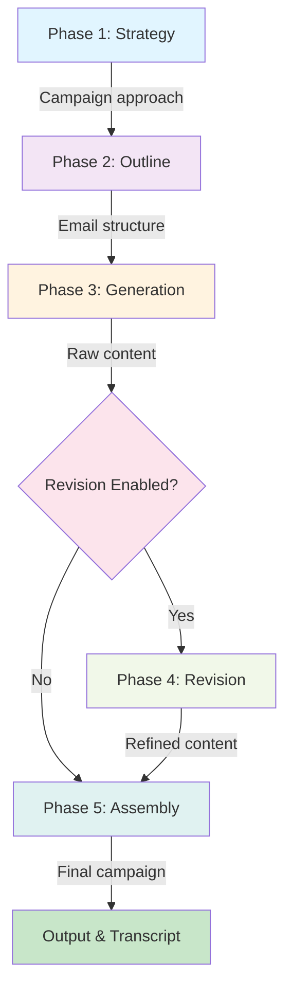

#### Phase 1: Campaign Strategy Development

**Objective**: Establish the strategic foundation for the entire campaign

**Process**:

1. Analyzes campaign goal and subject matter
2. Considers target audience and campaign type
3. Develops overall positioning and approach
4. Identifies 3-5 key messages
5. Creates progression logic (how emails build on each other)
6. Maps audience pain points and value propositions
7. Recommends send timing

**Output**: `CampaignStrategy` object with strategic framework

**Example Strategy Output**:

```
Strategy: "Position as trusted advisor through educational content"
Key Messages:
  - Problem awareness and validation
  - Solution introduction and benefits
  - Social proof and credibility
  - Limited-time opportunity
  - Final call-to-action

Progression Logic: "Build trust → Educate → Demonstrate → Convince → Convert"
```

---

#### Phase 2: Email Sequence Outline

**Objective**: Create detailed structure for each email

**Process**:

1. For each email in sequence:
    - Defines specific purpose and goal
    - Establishes main message/theme
    - Lists 3-5 key points to cover
    - Specifies call-to-action
    - Sets emotional tone
    - Connects to previous email (if applicable)
    - Estimates word count

**Output**: List of `EmailOutline` objects

**Example Outline**:

```
Email 1: "Welcome & Problem Recognition"
  Purpose: Establish connection and set expectations
  Main Message: "We understand your challenge"
  Key Points:
    - Industry problem overview
    - Common pain points
    - Why this matters now
  CTA: "Learn how we help"
  Emotional Tone: Welcoming, empathetic
  Est. Words: 225
```

---

#### Phase 3: Email Generation

**Objective**: Write complete, production-ready emails

**Process for each email**:

##### 3a. Subject Line Generation

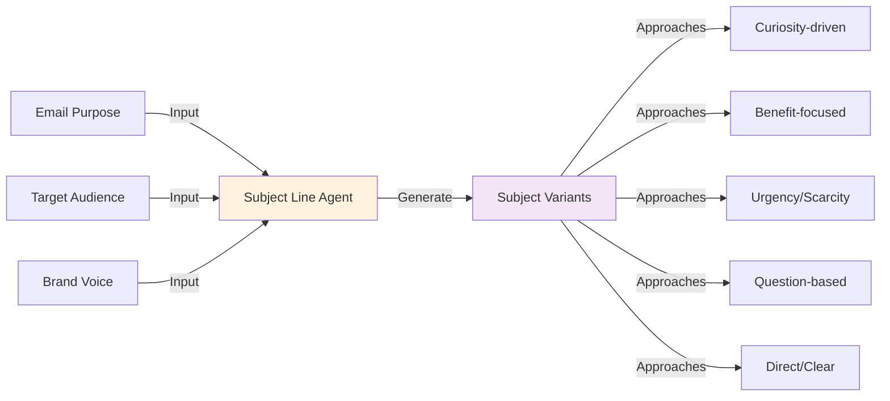

**Subject Line Approaches**:

- **Curiosity**: "The one thing most [audience] miss about [topic]"
- **Benefit**: "How to [benefit] in [timeframe]"
- **Urgency**: "Only [X] spots left for [offer]"
- **Question**: "Are you making this [topic] mistake?"
- **Direct**: "[Specific benefit] for [audience]"

##### 3b. Email Body Generation

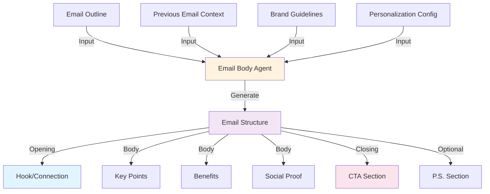

**Email Structure**:

```
1. Preview Text (40-90 chars)
   └─ Appears in inbox before subject line

2. Opening (1-2 sentences)
   └─ Hook or connection to recipient

3. Body (3-5 paragraphs)
   ├─ Problem/situation
   ├─ Solution/benefits
   ├─ Social proof/credibility
   └─ Value proposition

4. Call-to-Action
   ├─ CTA text (persuasive)
   └─ Button text (action-oriented)

5. P.S. (optional)
   └─ Key point, urgency, or secondary CTA
```

**Output**: `EmailContent` object with complete email

---

#### Phase 4: Revision (Optional)

**Objective**: Refine and improve email quality

**Process** (repeated for each revision pass):

1. Reviews each email for clarity and conciseness
2. Enhances persuasive impact
3. Improves flow and transitions
4. Strengthens call-to-action
5. Ensures emotional resonance
6. Validates brand voice consistency

**Maintains**:

- All key points and messages
- Word count targets
- Personalization tokens
- Overall structure

---

#### Phase 5: Final Assembly

**Objective**: Compile complete campaign with all variants and documentation

**Output Components**:

1. **Campaign Overview**: Goals, audience, configuration
2. **Strategy Summary**: Approach, key messages, progression
3. **Complete Email Sequence**: All emails with variants
4. **Subject Line A/B Tests**: All variants with approaches
5. **Implementation Guide**: Best practices and setup instructions
6. **Campaign Metrics**: Word counts, duration, complexity

---

### Data Flow Diagram

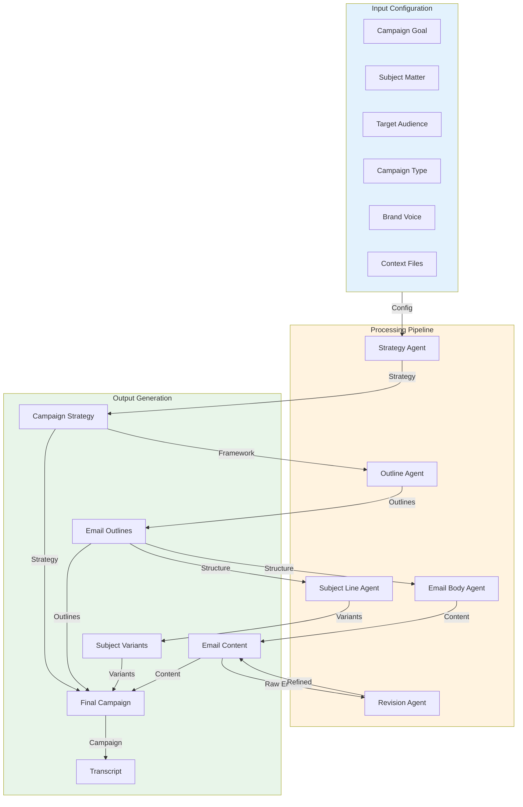

---

### Usage Examples

#### Example 1: SaaS Product Launch Campaign

```json
{
  "campaign_goal": "Drive signups for new project management tool",
  "subject_matter": "Collaborative project management platform",
  "target_audience": "Team leads and project managers at mid-size companies",
  "campaign_type": "sales",
  "num_emails": 4,
  "send_intervals": [1, 3, 7],
  "brand_voice": "professional",
  "primary_cta": "schedule_demo",
  "body_length": "medium",
  "generate_subject_variants": true,
  "subject_variants_count": 3,
  "include_personalization": true,
  "revision_passes": 2
}
```

**Expected Output**:

- 4 emails over 11 days
- 3 subject line variants per email (12 total)
- ~900-1200 total words
- Personalization tokens: `{{first_name}}`, `{{company}}`
- 2 revision passes for quality

---

#### Example 2: E-commerce Re-engagement Campaign

```json
{
  "campaign_goal": "Win back inactive customers with special offer",
  "subject_matter": "Exclusive 30% discount for returning customers",
  "target_audience": "Customers inactive for 6+ months",
  "campaign_type": "re_engagement",
  "num_emails": 3,
  "send_intervals": [2, 5],
  "brand_voice": "friendly",
  "primary_cta": "make_purchase",
  "body_length": "short",
  "use_emoji": true,
  "include_ps": true,
  "revision_passes": 1
}
```

**Expected Output**:

- 3 emails over 7 days
- Friendly, casual tone with emoji
- Shorter emails (~400-450 total words)
- Focus on value and exclusivity
- P.S. sections with urgency

---

#### Example 3: Educational Newsletter Series

```json
{
  "campaign_goal": "Establish thought leadership in AI/ML space",
  "subject_matter": "Weekly insights on machine learning applications",
  "target_audience": "Data scientists and ML engineers",
  "campaign_type": "newsletter",
  "num_emails": 5,
  "send_intervals": [7, 7, 7, 7],
  "brand_voice": "authoritative",
  "primary_cta": "learn_more",
  "body_length": "long",
  "generate_subject_variants": false,
  "include_personalization": false,
  "revision_passes": 2,
  "input_files": ["docs/**/*.md", "research/**/*.pdf"]
}
```

**Expected Output**:

- 5 weekly emails
- Authoritative, educational tone
- Longer-form content (~2000+ total words)
- Single subject line per email
- Incorporates brand documentation

---

### Output Structure

#### Campaign Transcript

The task generates a comprehensive markdown transcript containing:

```

## Email Campaign: [Goal]


### Campaign Overview
- Subject Matter
- Target Audience
- Configuration Summary


### Campaign Strategy
- Overall Approach
- Key Messages
- Progression Logic
- Pain Points & Value Props


### Email Sequence Outline
- Email 1-N Outlines
- Purpose, Key Points, CTAs


### Email 1

#### Subject Line Options
- [A] Variant 1 (curiosity approach)
- [B] Variant 2 (benefit approach)
- [C] Variant 3 (urgency approach)


#### Preview Text
> [40-90 character preview]


#### Email Body
[Complete email content]


#### Call-to-Action
**CTA Text:** [Persuasive text]
**Button:** [Action text]


#### P.S.
[Optional postscript]

---


### Campaign Metrics
- Total Emails: 4
- Total Word Count: 1,247
- Average Words per Email: 312
- Campaign Duration: 11 days


### Implementation Notes
1. Personalization Tokens
2. A/B Testing Strategy
3. Send Timing Recommendations
4. Mobile Optimization
5. Compliance Checklist
```

---

### Best Practices

#### 1. Subject Line Optimization

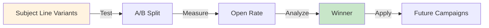

**Tips**:

- Test 2-3 variants per email
- Measure open rates for 24-48 hours
- Apply winning patterns to future campaigns
- Keep under 60 characters for mobile
- Avoid spam trigger words

#### 2. Personalization Strategy

**Effective Tokens**:

- `{{first_name}}` - Most impactful
- `{{company}}` - Industry relevance
- `{{role}}` - Job-specific messaging
- `{{location}}` - Regional offers

**Implementation**:

```
"Hi {{first_name}},

At {{company}}, we know that {{role}}s face unique challenges..."
```

#### 3. Call-to-Action Progression

```
Email 1: "Learn More" (low commitment)
    ↓
Email 2: "See Demo" (medium commitment)
    ↓
Email 3: "Start Free Trial" (high commitment)
    ↓
Email 4: "Schedule Consultation" (highest commitment)
```

#### 4. Send Timing

**Recommended Intervals**:

- **Welcome Series**: Day 0, 1, 3, 7
- **Nurture Campaign**: Day 0, 3, 7, 14
- **Sales Campaign**: Day 0, 2, 5, 10
- **Re-engagement**: Day 0, 5, 10

**Optimal Send Times**:

- Tuesday-Thursday: 10 AM - 2 PM
- Avoid: Monday morning, Friday afternoon
- Test: Segment by timezone

#### 5. Content Guidelines

**Email Body Best Practices**:

- Keep paragraphs to 2-3 sentences
- Use short lines (40-50 characters)
- Include white space for readability
- Use "you" language (not "we")
- Focus on benefits, not features
- Include social proof/credibility
- Make CTA specific and action-oriented

**Word Count Targets**:

- **Short**: 100-150 words (quick reads)
- **Medium**: 150-300 words (balanced)
- **Long**: 300+ words (detailed/educational)

---

### Troubleshooting

#### Issue: Generated emails feel generic

**Solution**:

1. Provide more specific `target_audience` details
2. Include brand context files via `input_files`
3. Increase `revision_passes` to 2-3
4. Specify `brand_voice` more precisely
5. Add related brand guidelines via `related_files`

#### Issue: Subject lines are too similar

**Solution**:

1. Increase `subject_variants_count` to 4-5
2. Ensure `generate_subject_variants` is true
3. Vary `use_emoji` setting
4. Provide more specific campaign context

#### Issue: Emails are too long/short

**Solution**:

1. Adjust `body_length` setting
2. Modify `num_emails` to spread content
3. Adjust `send_intervals` for pacing
4. Review generated word counts in output

#### Issue: Personalization tokens not working

**Solution**:

1. Verify `include_personalization` is true
2. Check email platform supports tokens
3. Ensure token format: `{{token_name}}`
4. Test with sample data before sending

---

### Integration Guide

#### Email Platform Integration

**Mailchimp**:

```
Personalization: *|FNAME|*, *|COMPANY|*
Subject Line: *|FNAME|*, check this out
```

**HubSpot**:

```
Personalization: {{contact.firstname}}, {{company}}
Subject Line: {{contact.firstname}}, we have something special
```

**Klaviyo**:

```
Personalization: {{first_name}}, {{company}}
Subject Line: {{first_name}}, exclusive offer inside
```

**Custom Platform**:

```
Personalization: {{first_name}}, {{company}}, {{email}}
Subject Line: {{first_name}}, your personalized offer
```

---

### Performance Metrics

#### Expected Results by Campaign Type

| Metric           | Welcome | Nurture | Sales  | Re-engagement |
|------------------|---------|---------|--------|---------------|
| Avg Open Rate    | 45-55%  | 25-35%  | 20-30% | 15-25%        |
| Avg Click Rate   | 5-10%   | 2-5%    | 2-4%   | 1-3%          |
| Conversion Rate  | 2-5%    | 0.5-2%  | 1-3%   | 0.5-1.5%      |
| Unsubscribe Rate | <0.5%   | <0.3%   | <0.3%  | <0.5%         |

#### Optimization Checklist

- [ ] Subject lines A/B tested
- [ ] Preview text optimized (40-90 chars)
- [ ] Mobile preview verified
- [ ] Personalization tokens tested
- [ ] Links tracked with UTM parameters
- [ ] Unsubscribe link included
- [ ] Compliance verified (CAN-SPAM, GDPR)
- [ ] Send times optimized by timezone
- [ ] Sender name and email verified
- [ ] Reply-to address configured

---

### Advanced Features

#### Custom Brand Context

Provide specific files to influence email tone and messaging:

```json
{
  "input_files": [
    "brand/voice_guidelines.md",
    "brand/messaging_framework.md",
    "docs/product_features.md"
  ],
  "related_files": [
    "brand/case_studies.md",
    "brand/testimonials.md"
  ]
}
```

#### Multi-Pass Revision

Enable multiple revision passes for higher quality:

```json
{
  "revision_passes": 3
}
```

**Revision Focus**:

- Pass 1: Clarity and flow
- Pass 2: Persuasive impact
- Pass 3: Brand voice consistency

---

### Support & Resources

#### Common Questions

**Q: How long does campaign generation take?**
A: Typically 2-5 minutes depending on number of emails and revision passes.

**Q: Can I edit generated emails?**
A: Yes! All output is in markdown format and fully editable.

**Q: How many emails should I send?**
A: 3-5 emails is optimal for most campaigns. More than 7 risks fatigue.

**Q: Should I use all subject line variants?**
A: No, test 2 variants (A/B test) to find the winner, then use that for future sends.

**Q: How do I measure campaign success?**
A: Track open rates, click rates, conversions, and unsubscribes. Compare against industry benchmarks.

---

### Conclusion

The EmailCampaignTask provides a complete, AI-powered solution for generating professional email campaigns. By following
the configuration guidelines and best practices outlined in this documentation, you can create high-performing email
sequences that drive engagement and conversions.

For optimal results:

1. ✅ Provide clear, specific campaign goals
2. ✅ Define target audience characteristics
3. ✅ Include brand context and guidelines
4. ✅ Enable A/B testing for subject lines
5. ✅ Use revision passes for quality
6. ✅ Test and optimize based on metrics

# webui\src\main\kotlin\com\simiacryptus\cognotik\plan\tools\writing\InteractiveStoryTask.kt

## InteractiveStoryTask User Documentation

### Overview

The **InteractiveStoryTask** is a sophisticated tool for generating complete choose-your-own-adventure narratives with
branching paths, multiple endings, and state tracking. It creates immersive interactive stories suitable for
entertainment, education, training scenarios, and game development.

### Key Features

- 🎭 **Branching Narratives** - Creates complex decision trees with multiple paths
- 🎯 **Multiple Endings** - Generates distinct conclusions based on player choices
- 📊 **State Tracking** - Monitors variables like health, reputation, inventory, and relationships
- 🔄 **Consequence Tracking** - Ensures choices have meaningful, lasting impacts
- 🎮 **Replay Value** - Optimizes for significantly different experiences on replays
- 📝 **Customizable Style** - Supports various genres, tones, and writing styles
- 🚫 **No Dead Ends** - Ensures all narrative paths lead to meaningful conclusions

### Configuration Parameters

#### Story Premise & Genre

| Parameter         | Type   | Default         | Description                                                                 |
|-------------------|--------|-----------------|-----------------------------------------------------------------------------|
| `premise`         | String | Required        | The starting scenario or hook for your story                                |
| `genre`           | String | "fantasy"       | Story genre (fantasy, sci-fi, mystery, horror, romance, etc.)               |
| `target_audience` | String | "young_adult"   | Intended audience (children, young_adult, adult)                            |
| `tone`            | String | "serious"       | Story tone (lighthearted, serious, dark, humorous)                          |
| `writing_style`   | String | "descriptive"   | Narrative style (descriptive, action-packed, dialogue-heavy, introspective) |
| `point_of_view`   | String | "second_person" | POV perspective (second_person, first_person, third_person)                 |

#### Story Structure

| Parameter              | Type    | Default | Description                               |
|------------------------|---------|---------|-------------------------------------------|
| `num_decision_points`  | Integer | 5       | Number of major decision points (1-20)    |
| `choices_per_decision` | Integer | 3       | Number of choices at each decision (2-5)  |
| `num_endings`          | Integer | 3       | Number of distinct endings (1-10)         |
| `segment_word_count`   | Integer | 300     | Target words per story segment (100-1000) |

#### Advanced Features

| Parameter               | Type         | Default | Description                                                       |
|-------------------------|--------------|---------|-------------------------------------------------------------------|
| `track_state_variables` | Boolean      | true    | Enable state variable tracking                                    |
| `state_variables`       | List[String] | null    | Variables to track (health, reputation, gold, ally_trust, etc.)   |
| `prevent_dead_ends`     | Boolean      | true    | Ensure all paths lead to meaningful endings                       |
| `track_consequences`    | Boolean      | true    | Track impacts of choices across the story                         |
| `optimize_replay_value` | Boolean      | true    | Create significantly different experiences per playthrough        |
| `input_files`           | List[String] | null    | File patterns for context (supports glob patterns like `**/*.kt`) |

### Generation Process

The task executes in five phases:

#### Phase 1: Story Structure Planning

- Creates high-level outline with title and opening concept
- Designs decision tree architecture
- Maps connections between decision points and endings
- Defines state variables and their initial values

#### Phase 2: Opening Segment

- Writes compelling opening (~300 words by default)
- Establishes setting, atmosphere, and protagonist
- Hooks the reader immediately
- Sets up the initial situation

#### Phase 3: Decision Points

- Generates narrative for each decision point
- Presents meaningful choices with distinct consequences
- Tracks state changes from each choice
- Ensures narrative flow between segments

#### Phase 4: Endings

- Creates distinct conclusions for each ending type
- Reflects consequences of player choices
- Provides satisfying closure
- Honors the journey taken

#### Phase 5: Interactive Map

- Compiles complete playable story
- Shows all paths and connections
- Provides statistics and replay information

### Data Flow Diagram

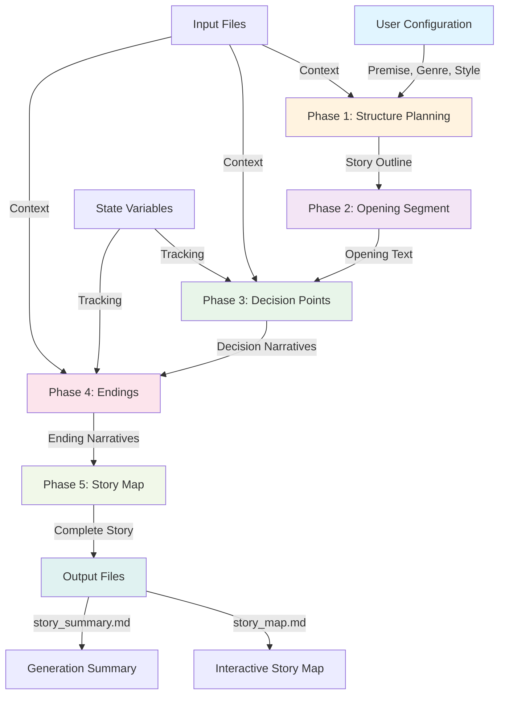

### Story Structure Diagram

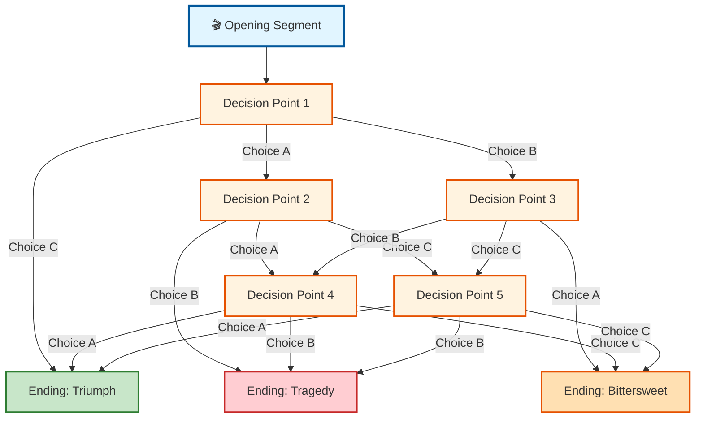

### State Variable Tracking

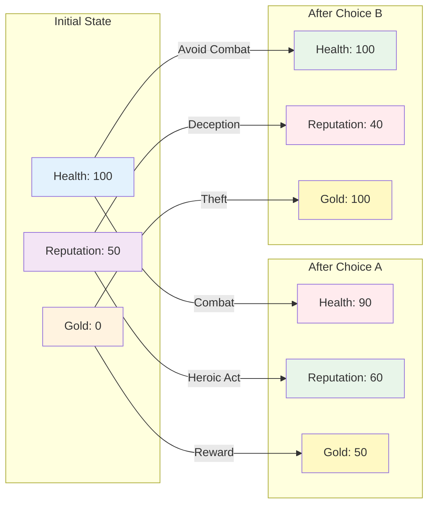

### Choice Consequence Flow

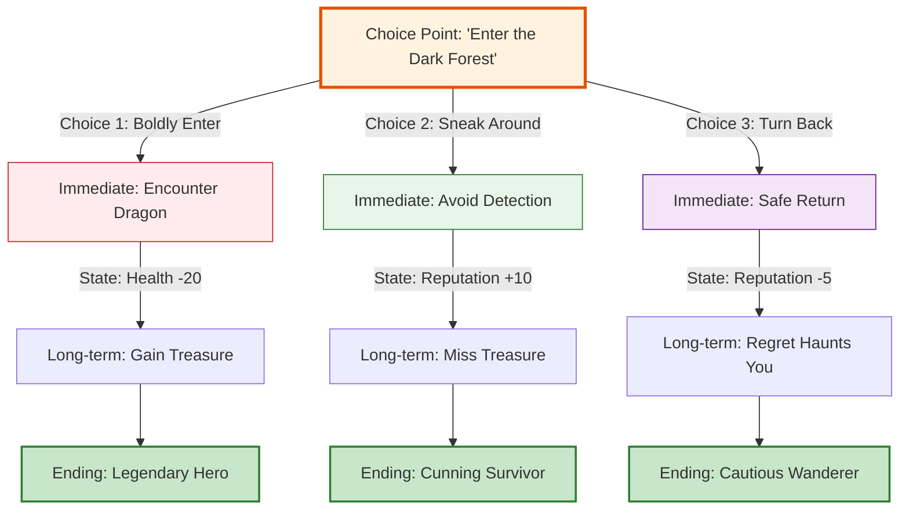

### Output Structure

```mermaid
graph TD
    TASK["InteractiveStoryTask"]
    
    TASK -->|Generates| MAP["story_map.md"]
    TASK -->|Generates| SUMMARY["story_summary.md"]
    TASK -->|Generates| TRANSCRIPT["transcript.md"]
    
    MAP -->|Converts to| MAPHTML["story_map.html"]
    MAP -->|Converts to| MAPPDF["story_map.pdf"]
    
    SUMMARY -->|Converts to| SUMMHTML["story_summary.html"]
    SUMMARY -->|Converts to| SUMMPDF["story_summary.pdf"]
    
    TRANSCRIPT -->|Contains| PHASES["5 Generation Phases"]
    TRANSCRIPT -->|Contains| STATS["Story Statistics"]
    
    style TASK fill:#e1f5ff,stroke:#01579b,stroke-width:3px
    style MAP fill:#e8f5e9,stroke:#2e7d32,stroke-width:2px
    style SUMMARY fill:#e8f5e9,stroke:#2e7d32,stroke-width:2px
    style TRANSCRIPT fill:#e8f5e9,stroke:#2e7d32,stroke-width:2px
    style MAPHTML fill:#fff9c4,stroke:#f57f17
    style MAPPDF fill:#fff9c4,stroke:#f57f17
    style SUMMHTML fill:#fff9c4,stroke:#f57f17
    style SUMMPDF fill:#fff9c4,stroke:#f57f17
```

### Usage Examples

#### Example 1: Fantasy Adventure

```json
{
  "premise": "You wake in a mysterious tavern with no memory of how you got there",
  "genre": "fantasy",
  "target_audience": "young_adult",
  "tone": "serious",
  "num_decision_points": 5,
  "choices_per_decision": 3,
  "num_endings": 3,
  "track_state_variables": true,
  "state_variables": ["health", "reputation", "gold", "allies"],
  "prevent_dead_ends": true,
  "optimize_replay_value": true
}
```

#### Example 2: Science Fiction Mystery

```json
{
  "premise": "A distress signal from a space station requires investigation",
  "genre": "sci-fi",
  "target_audience": "adult",
  "tone": "dark",
  "writing_style": "action-packed",
  "point_of_view": "first_person",
  "num_decision_points": 7,
  "choices_per_decision": 4,
  "num_endings": 4,
  "track_state_variables": true,
  "state_variables": ["oxygen", "crew_trust", "mission_status"],
  "segment_word_count": 400
}
```

#### Example 3: Interactive Training Scenario

```json
{
  "premise": "You're a new manager facing your first team conflict",
  "genre": "contemporary",
  "target_audience": "adult",
  "tone": "serious",
  "writing_style": "dialogue-heavy",
  "num_decision_points": 4,
  "choices_per_decision": 3,
  "num_endings": 3,
  "track_state_variables": true,
  "state_variables": ["team_morale", "trust_level", "productivity"],
  "input_files": ["docs/company_policies.md", "docs/team_profiles.md"]
}
```

### Output Statistics

The task generates comprehensive statistics:

- **Total Word Count** - Complete narrative length
- **Decision Points** - Number of branching points
- **Total Choices** - Sum of all available options
- **Unique Paths** - Estimated number of distinct story routes
- **Generation Time** - Total processing duration
- **Tracked Variables** - Number of state variables monitored

### Best Practices

#### 1. **Premise Clarity**

- Write specific, compelling premises
- Avoid vague or overly broad starting scenarios
- Include enough context for the AI to understand the setting

#### 2. **Configuration Balance**

- 5-7 decision points works well for most stories
- 3-4 choices per decision maintains manageability
- 2-4 endings provides good variety without overwhelming complexity

#### 3. **State Variables**

- Choose 3-5 variables for optimal tracking
- Use meaningful names (health, reputation, trust, etc.)
- Ensure variables affect story outcomes

#### 4. **Genre & Tone Consistency**

- Match writing style to genre
- Ensure tone aligns with target audience
- POV should match narrative style

#### 5. **Input Context**

- Provide relevant files for better story grounding
- Use glob patterns for flexible file selection
- Context helps maintain consistency

### Validation Rules

The task validates all configurations:

| Field                  | Validation                 |
|------------------------|----------------------------|
| `premise`              | Must not be null or blank  |
| `num_decision_points`  | Must be 1-20               |
| `choices_per_decision` | Must be 2-5                |
| `num_endings`          | Must be 1-10               |
| `segment_word_count`   | Must be 100-1000           |
| `genre`                | Must not be blank          |
| `point_of_view`        | Must not be blank          |
| `input_files`          | Patterns must not be blank |

### Troubleshooting

#### Issue: Story feels disconnected

**Solution:** Provide more context via input files or ensure premise is detailed enough

#### Issue: Choices don't feel meaningful

**Solution:** Enable state variable tracking and ensure variables affect story outcomes

#### Issue: Too many similar endings

**Solution:** Increase `num_endings` or provide more specific ending type guidance

#### Issue: Generation takes too long

**Solution:** Reduce `num_decision_points` or `segment_word_count`

### Advanced Features

#### Consequence Tracking

When enabled, the system ensures that:

- Choices have immediate and long-term impacts
- State variables change meaningfully
- Paths converge logically
- All endings feel earned

#### Replay Value Optimization

The system creates significantly different experiences by:

- Varying narrative content based on choices
- Changing available options based on state
- Creating multiple distinct endings
- Ensuring no two playthroughs feel identical

#### Dead End Prevention

The system ensures:

- All decision paths lead to an ending
- No narrative branches terminate prematurely
- All endings are meaningful and satisfying
- Player choices always matter

### Output Files

#### story_map.md

Complete interactive story with all paths, choices, and endings in a playable format.

#### story_summary.md

Generation summary including statistics, configuration, and quick reference guide.

#### transcript.md

Detailed transcript of all five generation phases with intermediate outputs.

---

**Generated by InteractiveStoryTask** | Part of the Cognotik Planning System

# webui\src\main\kotlin\com\simiacryptus\cognotik\plan\tools\writing\JournalismReasoningTask.kt

## JournalismReasoningTask User Documentation

### Overview

The **JournalismReasoningTask** is a comprehensive investigative journalism tool that applies professional journalistic
standards and methods to analyze stories. It systematically investigates topics through fact-checking, perspective
analysis, context research, bias detection, and editorial synthesis.

#### Key Features

- ✅ **Fact Verification** - Validates claims against evidence
- 👥 **Perspective Analysis** - Identifies multiple viewpoints and sources
- 📚 **Context Research** - Analyzes background and implications
- ⚖️ **Bias Detection** - Identifies potential biases and balance issues
- 🎯 **Story Angles** - Explores alternative coverage approaches
- ❓ **Gap Analysis** - Finds unanswered questions
- 📊 **Editorial Synthesis** - Generates comprehensive assessment

---

### Configuration Parameters

#### Required Parameters

| Parameter     | Type   | Description                             |
|---------------|--------|-----------------------------------------|
| `story_topic` | String | The story topic or event to investigate |

#### Optional Parameters

| Parameter               | Type         | Default | Description                                                |
|-------------------------|--------------|---------|------------------------------------------------------------|
| `input_files`           | List[String] | null    | Glob patterns for input files to analyze                   |
| `journalism_elements`   | Map          | {}      | Key journalism elements (who, what, when, where, why, how) |
| `verify_facts`          | Boolean      | true    | Enable fact verification                                   |
| `identify_perspectives` | Boolean      | true    | Identify multiple perspectives                             |
| `analyze_context`       | Boolean      | true    | Analyze background and context                             |
| `identify_biases`       | Boolean      | true    | Detect biases and balance issues                           |
| `find_gaps`             | Boolean      | true    | Find information gaps                                      |
| `alternative_angles`    | Integer      | 3       | Number of story angles to explore (1-10)                   |
| `assess_newsworthiness` | Boolean      | true    | Assess news value                                          |
| `include_file_content`  | Boolean      | false   | Include file content in analysis                           |

#### Example Configuration

```json
{
  "story_topic": "Climate Policy Implementation in Urban Centers",
  "journalism_elements": {
    "who": "City officials, environmental groups, residents",
    "what": "New climate policy rollout",
    "when": "Q1 2024",
    "where": "Major metropolitan areas",
    "why": "Address carbon emissions",
    "how": "Regulatory framework and incentives"
  },
  "input_files": ["docs/*.md", "reports/*.pdf"],
  "verify_facts": true,
  "identify_perspectives": true,
  "analyze_context": true,
  "identify_biases": true,
  "find_gaps": true,
  "alternative_angles": 5,
  "assess_newsworthiness": true,
  "include_file_content": true
}
```

---

### Data Flow Diagram

```mermaid
graph TD
    A["📋 Story Topic & Configuration"] --> B["🔍 Investigation Pipeline"]
    
    B --> C1["✅ Fact Verification"]
    B --> C2["👥 Perspective Analysis"]
    B --> C3["📚 Context Analysis"]
    B --> C4["⚖️ Bias Detection"]
    B --> C5["🎯 Story Angles"]
    B --> C6["❓ Gap Analysis"]
    
    C1 --> D1["FactChecks<br/>- Claim<br/>- Source<br/>- Status<br/>- Evidence"]
    C2 --> D2["SourcePerspectives<br/>- Name<br/>- Role<br/>- Perspective<br/>- Credibility"]
    C3 --> D3["ContextAnalysis<br/>- Background<br/>- Trends<br/>- Implications"]
    C4 --> D4["BiasAnalysis<br/>- Biases<br/>- Conflicts<br/>- Balance"]
    C5 --> D5["StoryAngles<br/>- Title<br/>- Focus<br/>- Audience<br/>- Score"]
    C6 --> D6["InformationGaps<br/>- Question<br/>- Importance<br/>- Sources"]
    
    D1 --> E["📊 Editorial Synthesis"]
    D2 --> E
    D3 --> E
    D4 --> E
    D5 --> E
    D6 --> E
    
    E --> F["📄 Output Files"]
    F --> F1["journalism_analysis.md"]
    F --> F2["journalism_transcript.md"]
    
    style A fill:#e1f5ff
    style B fill:#fff3e0
    style C1 fill:#f3e5f5
    style C2 fill:#f3e5f5
    style C3 fill:#f3e5f5
    style C4 fill:#f3e5f5
    style C5 fill:#f3e5f5
    style C6 fill:#f3e5f5
    style E fill:#e8f5e9
    style F fill:#fce4ec
```

---

### Investigation Pipeline

```mermaid
sequenceDiagram
    participant User
    participant Task as JournalismTask
    participant Agent as AI Agent
    participant Output as File System
    
    User->>Task: Submit story topic & config
    Task->>Task: Initialize transcript
    
    rect rgb(200, 220, 255)
    Note over Task,Agent: Step 1: Fact Verification
    Task->>Agent: Verify facts & claims
    Agent-->>Task: FactChecks object
    Task->>Output: Write facts to transcript
    end
    
    rect rgb(200, 220, 255)
    Note over Task,Agent: Step 2: Perspective Analysis
    Task->>Agent: Identify sources & viewpoints
    Agent-->>Task: SourcePerspectives object
    Task->>Output: Write perspectives to transcript
    end
    
    rect rgb(200, 220, 255)
    Note over Task,Agent: Step 3: Context Analysis
    Task->>Agent: Analyze background & context
    Agent-->>Task: ContextAnalysis object
    Task->>Output: Write context to transcript
    end
    
    rect rgb(200, 220, 255)
    Note over Task,Agent: Step 4: Bias Detection
    Task->>Agent: Identify biases & balance
    Agent-->>Task: BiasAnalysis object
    Task->>Output: Write bias analysis to transcript
    end
    
    rect rgb(200, 220, 255)
    Note over Task,Agent: Step 5: Story Angles
    Task->>Agent: Explore alternative angles
    Agent-->>Task: StoryAngles object
    Task->>Output: Write angles to transcript
    end
    
    rect rgb(200, 220, 255)
    Note over Task,Agent: Step 6: Gap Analysis
    Task->>Agent: Find information gaps
    Agent-->>Task: InformationGaps object
    Task->>Output: Write gaps to transcript
    end
    
    rect rgb(200, 220, 255)
    Note over Task,Agent: Step 7: Editorial Synthesis
    Task->>Agent: Generate synthesis
    Agent-->>Task: Synthesis text
    Task->>Output: Write synthesis to transcript
    end
    
    Task->>Output: Write final analysis.md
    Task->>User: Return summary & links
```

---

### Data Structure Diagrams

#### Fact Verification Structure

```mermaid
classDiagram
    class FactCheck {
        +String claim
        +String source
        +String verification_status
        +List~String~ supporting_evidence
        +List~String~ contradicting_evidence
        +String confidence_level
        +validate() String
    }
    
    class FactChecks {
        +List~FactCheck~ facts
    }
    
    FactChecks "1" *-- "*" FactCheck
```

#### Source Perspective Structure

```mermaid
classDiagram
    class SourcePerspective {
        +String source_name
        +String role
        +String perspective
        +List~String~ key_quotes
        +String potential_bias
        +String credibility_assessment
        +validate() String
    }
    
    class SourcePerspectives {
        +List~SourcePerspective~ sources
    }
    
    SourcePerspectives "1" *-- "*" SourcePerspective
```

#### Story Angle Structure

```mermaid
classDiagram
    class StoryAngle {
        +String angle_title
        +String focus
        +String target_audience
        +List~String~ key_questions
        +String unique_value
        +Double newsworthiness_score
        +validate() String
    }
    
    class StoryAngles {
        +List~StoryAngle~ angles
    }
    
    StoryAngles "1" *-- "*" StoryAngle
```

#### Information Gap Structure

```mermaid
classDiagram
    class InformationGap {
        +String question
        +String importance
        +List~String~ potential_sources
        +String research_approach
        +validate() String
    }
    
    class InformationGaps {
        +List~InformationGap~ gaps
    }
    
    InformationGaps "1" *-- "*" InformationGap
```

---

### Output Structure

#### Generated Files

```
📁 Session Directory
├── 📄 journalism_analysis.md
│   ├── Key Facts (verified claims)
│   ├── Key Perspectives (source viewpoints)
│   ├── Context (background & implications)
│   ├── Balance Assessment (bias analysis)
│   ├── Story Angles (alternative approaches)
│   ├── Information Gaps (unanswered questions)
│   └── Editorial Synthesis (comprehensive assessment)
│
└── 📄 journalism_transcript.md
    ├── Investigation metadata
    ├── Input files (if included)
    ├── Step-by-step findings
    ├── Timestamps
    └── Completion status
```

#### Output Example

```markdown

## Journalism Investigation: Climate Policy Implementation


### Key Facts
✅ VERIFIED: City council approved policy on March 15, 2024
⚠️ PARTIALLY TRUE: 80% emissions reduction target by 2030
❌ FALSE: Policy requires immediate factory closures


### Key Perspectives
- **Mayor Johnson** (Government): Supports balanced approach
- **Environmental Coalition** (Advocacy): Demands stronger measures
- **Business Council** (Industry): Concerned about costs


### Context
The policy emerges from 2023 climate commitments...


### Balance Assessment
The coverage emphasizes environmental benefits while underrepresenting business concerns...


### Story Angles
1. **Human Impact** (85% newsworthiness)
2. **Economic Analysis** (72% newsworthiness)
3. **Policy Deep Dive** (68% newsworthiness)


### Information Gaps
🔴 CRITICAL: Implementation timeline details
🟡 IMPORTANT: Funding mechanism specifics
```

---

### Validation Rules

#### Configuration Validation

```mermaid
graph TD
    A["Configuration Input"] --> B{Validate story_topic}
    B -->|Empty/Null| C["❌ Error: Topic required"]
    B -->|Valid| D{Validate alternative_angles}
    D -->|< 1 or > 10| E["❌ Error: Angles 1-10"]
    D -->|Valid| F{Validate input_files}
    F -->|Invalid glob| G["❌ Error: Invalid pattern"]
    F -->|Valid| H["✅ Configuration Valid"]
    
    style C fill:#ffcdd2
    style E fill:#ffcdd2
    style G fill:#ffcdd2
    style H fill:#c8e6c9
```

#### Data Validation

```mermaid
graph TD
    A["Generated Data"] --> B{Validate FactCheck}
    B -->|Blank claim| C["❌ Invalid"]
    B -->|Valid| D{Validate SourcePerspective}
    D -->|Blank name/perspective| E["❌ Invalid"]
    D -->|Valid| F{Validate StoryAngle}
    F -->|Score not 0-1| G["❌ Invalid"]
    F -->|Valid| H{Validate InformationGap}
    H -->|Invalid importance| I["❌ Invalid"]
    H -->|Valid| J["✅ All Data Valid"]
    
    style C fill:#ffcdd2
    style E fill:#ffcdd2
    style G fill:#ffcdd2
    style I fill:#ffcdd2
    style J fill:#c8e6c9
```

---

### Usage Examples

#### Example 1: Basic Investigation

```json
{
  "story_topic": "Local School Board Budget Cuts",
  "verify_facts": true,
  "identify_perspectives": true,
  "analyze_context": true
}
```

**Output:** Comprehensive analysis with verified facts, multiple perspectives, and historical context.

#### Example 2: Deep Investigative Analysis

```json
{
  "story_topic": "Corporate Environmental Violations",
  "journalism_elements": {
    "who": "Company executives, regulators, affected residents",
    "what": "Alleged pollution violations",
    "when": "Past 18 months",
    "where": "Industrial zone near residential area",
    "why": "Cost-cutting measures",
    "how": "Bypassing environmental controls"
  },
  "input_files": ["reports/*.pdf", "documents/*.docx"],
  "verify_facts": true,
  "identify_perspectives": true,
  "analyze_context": true,
  "identify_biases": true,
  "find_gaps": true,
  "alternative_angles": 5,
  "include_file_content": true
}
```

**Output:** Multi-faceted investigation with document analysis, bias detection, and editorial recommendations.

#### Example 3: Quick Fact-Check

```json
{
  "story_topic": "Election Results Analysis",
  "verify_facts": true,
  "identify_perspectives": false,
  "analyze_context": false,
  "identify_biases": false,
  "find_gaps": false,
  "alternative_angles": 0
}
```

**Output:** Focused fact verification without other analysis components.

---

### Performance Characteristics

```mermaid
graph LR
    A["Investigation Scope"] --> B["Time Estimate"]
    
    A1["Fact Verification Only"] --> B1["30-60 seconds"]
    A2["Full Investigation<br/>6 Steps"] --> B2["3-5 minutes"]
    A3["Deep Analysis<br/>+ File Processing"] --> B3["5-10 minutes"]
    
    style B1 fill:#c8e6c9
    style B2 fill:#fff9c4
    style B3 fill:#ffccbc
```

#### Typical Execution Times

| Configuration      | Steps     | Estimated Time |
|--------------------|-----------|----------------|
| Minimal            | 1-2       | 30-60s         |
| Standard           | 4-5       | 2-3 min        |
| Comprehensive      | 6-7       | 4-6 min        |
| With File Analysis | 6-7 + I/O | 5-10 min       |

---

### Error Handling

```mermaid
graph TD
    A["Task Execution"] --> B{Error Occurs?}
    B -->|No| C["✅ Complete Successfully"]
    B -->|Yes| D{Error Type}
    
    D -->|Configuration| E["Log error<br/>Return config message"]
    D -->|API| F["Log error<br/>Return API error"]
    D -->|Processing| G["Log error<br/>Return partial results"]
    
    E --> H["Write error to transcript"]
    F --> H
    G --> H
    
    H --> I["Return error output"]
    
    style C fill:#c8e6c9
    style I fill:#ffcdd2
```

---

### Best Practices

#### ✅ Do's

- ✅ Provide clear, specific story topics
- ✅ Include relevant journalism elements (who, what, when, where, why, how)
- ✅ Use glob patterns for file selection
- ✅ Enable all analysis steps for comprehensive investigation
- ✅ Review generated transcript for quality assurance
- ✅ Use alternative angles for editorial planning

#### ❌ Don'ts

- ❌ Leave story_topic blank or vague
- ❌ Set alternative_angles outside 1-10 range
- ❌ Include irrelevant files in analysis
- ❌ Disable all analysis steps
- ❌ Ignore information gaps in follow-up reporting
- ❌ Overlook bias analysis findings

---

### Integration Points

```mermaid
graph TB
    A["JournalismReasoningTask"] --> B["Task Orchestrator"]
    A --> C["AI Agent APIs"]
    A --> D["File System"]
    A --> E["Session Management"]
    
    C --> C1["ParsedAgent<br/>Structured output"]
    C --> C2["ChatAgent<br/>Synthesis"]
    
    D --> D1["Input files"]
    D --> D2["Output files"]
    
    E --> E1["Transcript"]
    E --> E2["UI Updates"]
    
    style A fill:#e3f2fd
    style B fill:#f3e5f5
    style C fill:#fff3e0
    style D fill:#e8f5e9
    style E fill:#fce4ec
```

---

### Troubleshooting

| Issue               | Cause                | Solution                                   |
|---------------------|----------------------|--------------------------------------------|
| Empty results       | No story topic       | Provide clear story_topic                  |
| Incomplete analysis | Steps disabled       | Enable required analysis steps             |
| File not found      | Invalid glob pattern | Verify glob pattern syntax                 |
| Slow execution      | Large file set       | Reduce input files or disable file content |
| API errors          | Rate limiting        | Reduce alternative_angles or wait          |
| Validation errors   | Invalid data         | Check configuration parameters             |

---

### Summary

The **JournalismReasoningTask** provides a systematic, professional approach to story investigation through:

1. **Fact Verification** - Validates claims with evidence
2. **Perspective Analysis** - Identifies diverse viewpoints
3. **Context Research** - Provides background and implications
4. **Bias Detection** - Identifies balance issues
5. **Story Angles** - Explores coverage approaches
6. **Gap Analysis** - Finds unanswered questions
7. **Editorial Synthesis** - Generates comprehensive assessment

Perfect for investigative reporting, fact-checking, editorial planning, and comprehensive story analysis.

# webui\src\main\kotlin\com\simiacryptus\cognotik\plan\tools\writing\NarrativeGenerationTask.kt

## NarrativeGenerationTask User Documentation

### Overview

The **NarrativeGenerationTask** is an advanced narrative generation system that creates complete, publication-ready
stories from a subject or scenario. It extends the `NarrativeReasoningTask` to produce full narratives with consistent
style, character development, and structured storytelling.

#### Key Capabilities

- 📖 Generate complete narratives from analysis and outlines
- 🎬 Scene-by-scene generation with contextual continuity
- 🎨 Customizable writing style, point of view, and tone
- 🖼️ Optional AI-generated cover and scene images
- ✏️ Iterative revision passes for quality improvement
- 📊 Detailed progress tracking and statistics

---

### Configuration Parameters

#### Core Narrative Settings

| Parameter            | Type             | Default  | Description                                              |
|----------------------|------------------|----------|----------------------------------------------------------|
| `subject`            | String           | Required | The subject or scenario to develop into a full narrative |
| `input_files`        | List[String]     | Optional | File patterns (e.g., `**/*.kt`) to use as context        |
| `narrative_elements` | Map[String, Any] | Optional | Characters, setting, conflict, timeline, etc.            |

#### Structure Configuration

| Parameter           | Type | Default | Description                                         |
|---------------------|------|---------|-----------------------------------------------------|
| `target_word_count` | Int  | 5000    | Total desired word count for the complete narrative |
| `number_of_acts`    | Int  | 3       | Number of acts in the story structure               |
| `scenes_per_act`    | Int  | 3       | Average number of scenes per act                    |

#### Writing Style Configuration

| Parameter       | Type   | Default                | Description                                                            |
|-----------------|--------|------------------------|------------------------------------------------------------------------|
| `writing_style` | String | "literary"             | Style: `literary`, `thriller`, `technical`, `conversational`           |
| `point_of_view` | String | "third person limited" | POV: `first person`, `third person limited`, `third person omniscient` |
| `tone`          | String | "dramatic"             | Tone: `dramatic`, `humorous`, `suspenseful`, `reflective`              |

#### Content Options

| Parameter                | Type    | Default | Description                                   |
|--------------------------|---------|---------|-----------------------------------------------|
| `detailed_descriptions`  | Boolean | true    | Include vivid sensory descriptions            |
| `include_dialogue`       | Boolean | true    | Include character dialogue                    |
| `show_internal_thoughts` | Boolean | true    | Show character internal thoughts and feelings |
| `revision_passes`        | Int     | 1       | Number of revision passes per scene           |

#### Image Generation

| Parameter               | Type    | Default  | Description                              |
|-------------------------|---------|----------|------------------------------------------|
| `generate_scene_images` | Boolean | false    | Generate images for each scene           |
| `generate_cover_image`  | Boolean | false    | Generate a cover image for the narrative |
| `image_model`           | String  | "DallE3" | Image model: `DallE3`, `DallE2`          |
| `image_width`           | Int     | 1024     | Width of generated images in pixels      |
| `image_height`          | Int     | 1024     | Height of generated images in pixels     |

---

### Workflow Phases

```mermaid
graph TD
    A["Phase 1: Narrative Analysis"] -->|Inherited from NarrativeReasoning| B["Phase 2: Outline Generation"]
    B -->|Scene-by-scene structure| C["Phase 3: Scene Generation"]
    C -->|Iterative with context| D["Phase 4: Final Assembly"]
    D -->|Complete narrative| E["Output & Statistics"]
    
    style A fill:#e1f5ff
    style B fill:#f3e5f5
    style C fill:#e8f5e9
    style D fill:#fff3e0
    style E fill:#fce4ec
```

#### Phase 1: Narrative Analysis

- Runs base narrative reasoning analysis
- Analyzes plot points, character motivations, and story structure
- Identifies inconsistencies and alternative outcomes
- Generates foundational understanding of the narrative

#### Phase 2: Outline Generation

- Creates detailed scene-by-scene outline
- Specifies for each scene:
    - Setting (time and place)
    - Characters present
    - Purpose and key events
    - Emotional arc
    - Estimated word count
- Ensures classic story structure (setup → rising action → climax → resolution)

#### Phase 3: Scene Generation

- Generates each scene iteratively
- Provides context from previous scenes to maintain continuity
- Optional revision passes for quality improvement
- Generates scene images if enabled
- Tracks word count and character states

#### Phase 4: Final Assembly

- Compiles all scenes into complete narrative
- Organizes by acts and scenes
- Generates final statistics
- Creates publication-ready output

---

### Data Flow Diagram

```mermaid
graph LR
    subgraph Input["Input"]
        Subject["Subject/Scenario"]
        Files["Input Files"]
        Elements["Narrative Elements"]
    end
    
    subgraph Analysis["Analysis Phase"]
        NR["Narrative Reasoning<br/>Analysis"]
    end
    
    subgraph Outline["Outline Phase"]
        OA["Outline Agent<br/>ParsedAgent"]
        OutlineData["NarrativeOutline<br/>- Acts<br/>- Scenes<br/>- Word Counts"]
    end
    
    subgraph Generation["Scene Generation"]
        SG["Scene Agent<br/>ParsedAgent"]
        Context["Previous Scene<br/>Context"]
        Revision["Revision Agent<br/>ChatAgent"]
        GenScene["GeneratedScene<br/>- Content<br/>- Word Count<br/>- Key Moments"]
    end
    
    subgraph Images["Image Generation"]
        CoverImg["Cover Image<br/>ImageProcessingAgent"]
        SceneImg["Scene Images<br/>ImageProcessingAgent"]
    end
    
    subgraph Output["Output"]
        Final["Complete Narrative"]
        Stats["Statistics"]
        Transcript["Transcript"]
    end
    
    Input --> Analysis
    Analysis --> Outline
    Outline --> OA
    OA --> OutlineData
    OutlineData --> Generation
    Generation --> SG
    Context --> SG
    SG --> GenScene
    GenScene --> Revision
    Revision --> GenScene
    GenScene --> Images
    GenScene --> Output
    Images --> Output
    Output --> Final
    Output --> Stats
    Output --> Transcript
    
    style Input fill:#e3f2fd
    style Analysis fill:#f3e5f5
    style Outline fill:#ede7f6
    style Generation fill:#e8f5e9
    style Images fill:#fff3e0
    style Output fill:#fce4ec
```

---

### Configuration Example

```json
{
  "subject": "A detective's investigation into a mysterious disappearance",
  "input_files": ["**/*.md", "**/*.txt"],
  "narrative_elements": {
    "protagonist": "Detective Sarah Chen, 40s, haunted by a past case",
    "setting": "Modern-day Seattle, rainy and atmospheric",
    "conflict": "Missing person case with supernatural undertones",
    "timeline": "Present day, 7-day investigation"
  },
  "target_word_count": 8000,
  "number_of_acts": 3,
  "scenes_per_act": 4,
  "writing_style": "thriller",
  "point_of_view": "third person limited",
  "tone": "suspenseful",
  "detailed_descriptions": true,
  "include_dialogue": true,
  "show_internal_thoughts": true,
  "revision_passes": 2,
  "generate_scene_images": true,
  "generate_cover_image": true,
  "image_model": "DallE3",
  "image_width": 1024,
  "image_height": 1024
}
```

---

### Output Structure

```mermaid
graph TD
    A["NarrativeGenerationTask Output"] --> B["UI Tabs"]
    A --> C["Transcript File"]
    A --> D["Result Summary"]
    
    B --> B1["Overview Tab"]
    B --> B2["Outline Tab"]
    B --> B3["Scene Tabs<br/>Scene 1, Scene 2, ..."]
    B --> B4["Complete Narrative Tab"]
    B --> B5["Image Tabs<br/>Cover, Scene Images"]
    
    B1 --> B1a["Configuration Summary"]
    B1 --> B1b["Progress Tracking"]
    B1 --> B1c["Final Statistics"]
    
    B2 --> B2a["Act Breakdowns"]
    B2 --> B2b["Scene Outlines"]
    B2 --> B2c["Word Count Estimates"]
    
    B3 --> B3a["Scene Content"]
    B3 --> B3b["Key Moments"]
    B3 --> B3c["Character States"]
    
    B4 --> B4a["Full Narrative Text"]
    B4 --> B4b["Organized by Acts"]
    B4 --> B4c["Total Statistics"]
    
    C --> C1["Markdown Transcript"]
    C --> C2["HTML Export"]
    C --> C3["PDF Export"]
    
    D --> D1["Summary Statistics"]
    D --> D2["Scene Count"]
    D --> D3["Word Count"]
    D --> D4["Generation Time"]
    
    style A fill:#fce4ec
    style B fill:#f3e5f5
    style C fill:#e1f5ff
    style D fill:#fff3e0
```

---

### Scene Generation Context Flow

```mermaid
sequenceDiagram
    participant User
    participant Task as NarrativeGenerationTask
    participant Outline as Outline Agent
    participant Scene as Scene Agent
    participant Revision as Revision Agent
    participant API as LLM API
    
    User->>Task: Start with subject & config
    Task->>Outline: Generate outline
    Outline->>API: Request outline structure
    API-->>Outline: Return NarrativeOutline
    Outline-->>Task: Outline complete
    
    loop For each scene
        Task->>Scene: Generate scene with context
        Note over Scene: Include previous 2 scenes
        Scene->>API: Request scene content
        API-->>Scene: Return GeneratedScene
        
        opt If revision_passes > 0
            Scene->>Revision: Request revision
            Revision->>API: Improve scene quality
            API-->>Revision: Return revised content
            Revision-->>Scene: Updated scene
        end
        
        Scene-->>Task: Scene complete
        Task->>Task: Store scene & context
    end
    
    Task-->>User: Complete narrative
```

---

### Key Classes and Data Structures

#### NarrativeGenerationTaskExecutionConfigData

Configuration class containing all parameters for narrative generation.

```kotlin
data class NarrativeOutline(
    val title: String,
    val premise: String,
    val acts: List<ActOutline>,
    val estimated_word_count: Int
)

data class ActOutline(
    val act_number: Int,
    val title: String,
    val purpose: String,
    val scenes: List<SceneOutline>
)

data class SceneOutline(
    val scene_number: Int,
    val title: String,
    val setting: String,
    val characters: List<String>,
    val purpose: String,
    val key_events: List<String>,
    val emotional_arc: String,
    val estimated_word_count: Int
)

data class GeneratedScene(
    val scene_number: Int,
    val title: String,
    val content: String,
    val word_count: Int,
    val key_moments: List<String>,
    val character_states: Map<String, String>
)
```

---

### Usage Tips

#### ✅ Best Practices

1. **Provide Clear Subject**: Be specific about what narrative you want generated
2. **Define Narrative Elements**: Include key characters, settings, and conflicts
3. **Set Realistic Word Counts**: Ensure target word count is achievable (typically 1000-10000 words)
4. **Use Input Files Wisely**: Provide relevant context files to inform the narrative
5. **Enable Revisions for Quality**: Use 1-2 revision passes for better prose quality
6. **Test with Smaller Narratives First**: Start with 3 acts × 3 scenes before scaling up

#### ⚠️ Considerations

- **Generation Time**: Longer narratives take proportionally more time
- **API Costs**: Image generation significantly increases API usage
- **Token Limits**: Very long narratives may exceed model token limits
- **Consistency**: Revision passes improve quality but increase generation time
- **Memory**: Large narratives with many scenes require more memory

#### 🎯 Common Use Cases

| Use Case            | Recommended Config           |
|---------------------|------------------------------|
| Short Story         | 3 acts, 3 scenes, 3000 words |
| Novel Chapter       | 5 acts, 5 scenes, 8000 words |
| Scenario Planning   | 3 acts, 4 scenes, 5000 words |
| User Journey        | 3 acts, 3 scenes, 4000 words |
| Technical Narrative | 4 acts, 4 scenes, 6000 words |

---

### Error Handling

The task includes comprehensive error handling:

- **Configuration Validation**: Validates all parameters before execution
- **API Error Recovery**: Gracefully handles API failures
- **Partial Results**: Saves progress even if generation fails
- **Detailed Logging**: Tracks all phases and decisions
- **User Feedback**: Clear error messages in UI and transcript

---

### Output Examples

#### Overview Tab

Shows configuration, progress tracking, and final statistics with completion time and word count metrics.

#### Scene Tab

Displays individual scene content with:

- Scene title and setting
- Full narrative text
- Key moments summary
- Character state changes
- Word count

#### Complete Narrative Tab

Full compiled narrative organized by acts, ready for export or publication.

#### Transcript

Markdown file with complete generation log, useful for:

- Auditing generation decisions
- Reviewing intermediate outputs
- Exporting to HTML/PDF
- Sharing with collaborators

---

### Integration with Other Tasks

NarrativeGenerationTask extends `NarrativeReasoningTask`, inheriting:

- Plot analysis capabilities
- Character motivation analysis
- Inconsistency detection
- Alternative outcome prediction
- Causal inference

This makes it suitable for:

- Story-driven applications
- Scenario planning systems
- Interactive fiction generation
- Content creation workflows
- Educational narrative tools

# webui\src\main\kotlin\com\simiacryptus\cognotik\plan\tools\writing\NarrativeReasoningTask.kt

## NarrativeReasoningTask User Documentation

### Overview

The **NarrativeReasoningTask** is an advanced analytical tool that examines complex scenarios through narrative
structures and storytelling frameworks. It transforms raw scenario data into coherent narratives, identifies critical
plot points, analyzes stakeholder motivations, and predicts potential outcomes.

#### Key Use Cases

- **User Journey Analysis**: Map customer experiences as narrative arcs
- **System Evolution Planning**: Understand how systems change over time through story
- **Change Management**: Analyze organizational transitions as narrative scenarios
- **Risk Analysis**: Explore alternative outcomes and narrative paths
- **Stakeholder Communication**: Present complex scenarios as compelling stories

---

### Configuration Guide

#### Basic Parameters

| Parameter            | Type         | Required | Description                                                                 |
|----------------------|--------------|----------|-----------------------------------------------------------------------------|
| `subject`            | String       | ✅ Yes    | The main topic or scenario to analyze (e.g., "Customer onboarding process") |
| `input_files`        | List[String] | ❌ No     | File patterns to include (e.g., `["**/*.md", "docs/**/*.txt"]`)             |
| `additional_context` | String       | ❌ No     | Extra information to guide the analysis                                     |

#### Analysis Options

| Parameter              | Type    | Default | Description                                    |
|------------------------|---------|---------|------------------------------------------------|
| `construct_narrative`  | Boolean | `true`  | Build a coherent story from elements           |
| `identify_plot_points` | Boolean | `true`  | Find key narrative moments and turning points  |
| `predict_outcomes`     | Boolean | `true`  | Generate alternative scenarios and resolutions |
| `analyze_motivations`  | Boolean | `true`  | Examine character/stakeholder drivers          |
| `find_inconsistencies` | Boolean | `true`  | Detect gaps and contradictions                 |
| `alternatives`         | Integer | `3`     | Number of outcome scenarios (1-10)             |

#### Image Generation

| Parameter         | Type    | Default    | Description                       |
|-------------------|---------|------------|-----------------------------------|
| `generate_images` | Boolean | `false`    | Create visual representations     |
| `image_model`     | String  | `"DallE3"` | Model for image generation        |
| `image_width`     | Integer | `1024`     | Image width in pixels (256-2048)  |
| `image_height`    | Integer | `1024`     | Image height in pixels (256-2048) |

#### Narrative Elements

```json
{
  "narrative_elements": {
    "characters": ["Alice", "Bob", "Charlie"],
    "setting": "Corporate headquarters, Q1 2024",
    "conflict": "Resource allocation dispute",
    "timeline": "3 months",
    "stakes": "Project success and team morale"
  }
}
```

---

### Data Flow Architecture

```mermaid
graph TD
    A["Input Configuration"] -->|Subject & Context| B["Narrative Analysis Engine"]
    C["Input Files"] -->|File Content| B
    D["Narrative Elements"] -->|Story Components| B
    
    B -->|Step 1| E["Construct Main Narrative"]
    B -->|Step 2| F["Identify Plot Points"]
    B -->|Step 3| G["Analyze Characters"]
    B -->|Step 4| H["Predict Outcomes"]
    B -->|Step 5| I["Find Inconsistencies"]
    
    E -->|Narrative Structure| J["Synthesis Engine"]
    F -->|Critical Moments| J
    G -->|Motivations| J
    H -->|Scenarios| J
    I -->|Gaps & Issues| J
    
    J -->|Comprehensive Analysis| K["Output Generation"]
    
    K -->|Markdown Files| L["01_main_narrative.md"]
    K -->|Plot Analysis| M["02_plot_points.md"]
    K -->|Character Data| N["03_character_analysis.md"]
    K -->|Scenarios| O["04_predicted_outcomes.md"]
    K -->|Issues| P["05_inconsistencies.md"]
    K -->|Insights| Q["06_synthesis.md"]
    
    K -->|Optional| R["Image Generation"]
    R -->|Visual Assets| S["Narrative Images"]
    
    L --> T["Final Report"]
    M --> T
    N --> T
    O --> T
    P --> T
    Q --> T
    S --> T
```

---

### Processing Pipeline

```mermaid
sequenceDiagram
    participant User
    participant Task as NarrativeReasoningTask
    participant API as AI Model
    participant Storage as File System
    participant UI as User Interface
    
    User->>Task: Submit Configuration
    Task->>Task: Validate Input
    Task->>UI: Initialize Tabs & Overview
    
    Task->>API: Step 1: Construct Narrative
    API-->>Task: ParsedNarrative Object
    Task->>Storage: Save 01_main_narrative.md
    Task->>UI: Update Main Narrative Tab
    
    Task->>API: Step 2: Identify Plot Points
    API-->>Task: PlotPoints Object
    Task->>Storage: Save 02_plot_points.md
    Task->>UI: Update Plot Points Tab
    
    Task->>API: Step 3: Analyze Characters
    API-->>Task: CharacterAnalyses Object
    Task->>Storage: Save 03_character_analysis.md
    Task->>UI: Update Characters Tab
    
    Task->>API: Step 4: Predict Outcomes
    API-->>Task: NarrativeOutcomes Object
    Task->>Storage: Save 04_predicted_outcomes.md
    Task->>UI: Update Outcomes Tab
    
    Task->>API: Step 5: Find Inconsistencies
    API-->>Task: NarrativeInconsistencies Object
    Task->>Storage: Save 05_inconsistencies.md
    Task->>UI: Update Inconsistencies Tab
    
    Task->>API: Step 6: Generate Synthesis
    API-->>Task: Synthesis Text
    Task->>Storage: Save 06_synthesis.md
    Task->>UI: Update Synthesis Tab
    
    opt Image Generation Enabled
        Task->>API: Generate Narrative Images
        API-->>Task: Image Data
        Task->>Storage: Save PNG Images
        Task->>UI: Display Images
    end
    
    Task->>Storage: Close Transcript
    Task->>UI: Mark Complete
    Task-->>User: Final Report
```

---

### Analysis Workflow

#### Step 1: Narrative Construction

**Purpose**: Create a coherent story from scenario elements

**Output Structure**:

```kotlin
data class ParsedNarrative(
    val title: String,           // Story title
    val summary: String,         // 2-3 sentence overview
    val acts: List<NarrativeAct>, // Three-act structure
    val themes: List<String>,    // Underlying themes
    val tone: String             // Overall narrative tone
)
```

**Example Output**:

```
Title: "The Great Resource Reallocation"
Summary: "A team navigates organizational change..."
Acts:
  - Act 1: Setup - Introduce conflict
  - Act 2: Confrontation - Escalate tensions
  - Act 3: Resolution - Find balance
Themes: ["Change Management", "Collaboration", "Innovation"]
Tone: "Professional yet hopeful"
```

---

#### Step 2: Plot Points Analysis

**Purpose**: Identify critical narrative moments and turning points

**Output Structure**:

```kotlin
data class PlotPoint(
    val type: String,                    // "Inciting Incident", "Climax", etc.
    val description: String,             // What happens
    val significance: String,            // Why it matters
    val timing: String,                  // When in the story
    val affected_characters: List<String> // Who is impacted
)
```

**Plot Point Types**:

- **Inciting Incident**: Event that starts the story
- **First Plot Point**: Initial complication
- **Midpoint**: Story shifts direction
- **Climax**: Highest tension point
- **Resolution**: How things conclude

---

#### Step 3: Character Motivation Analysis

**Purpose**: Understand stakeholder perspectives and drivers

**Output Structure**:

```kotlin
data class CharacterAnalysis(
    val name: String,                    // Character/stakeholder name
    val role: String,                    // Their position
    val motivations: List<String>,       // What drives them
    val goals: List<String>,             // What they want
    val conflicts: List<String>,         // Internal/external conflicts
    val arc: String                      // How they change
)
```

**Analysis Dimensions**:

- Psychological motivations
- Organizational goals
- Personal conflicts
- Growth trajectory

---

#### Step 4: Outcome Prediction

**Purpose**: Explore alternative scenarios and resolutions

**Output Structure**:

```kotlin
data class NarrativeOutcome(
    val scenario: String,                // Description of outcome
    val probability: String,             // High/Medium/Low
    val key_factors: List<String>,       // What leads to this
    val consequences: List<String>,      // Implications
    val resolution_path: String          // How to achieve it
)
```

**Scenario Types**:

- Most likely outcome
- Best case scenario
- Worst case scenario
- Alternative paths

---

#### Step 5: Inconsistency Detection

**Purpose**: Identify gaps, contradictions, and unrealistic elements

**Output Structure**:

```kotlin
data class NarrativeInconsistency(
    val type: String,                    // Type of issue
    val description: String,             // What's wrong
    val location: String,                // Where it occurs
    val severity: String,                // Critical/Major/Minor
    val suggested_resolution: String     // How to fix it
)
```

**Inconsistency Types**:

- Logical contradictions
- Timeline gaps
- Character behavior mismatches
- Missing information
- Unrealistic assumptions

---

### Output Files

All analysis results are saved to `.narrative_analysis/` directory:

```
.narrative_analysis/
├── 01_main_narrative.md          # Complete narrative with acts
├── 02_plot_points.md             # Key plot points and turning points
├── 03_character_analysis.md      # Character motivations and arcs
├── 04_predicted_outcomes.md      # Alternative scenarios
├── 05_inconsistencies.md         # Gaps and contradictions
├── 06_synthesis.md               # Key insights and recommendations
├── narrative_transcript.md       # Complete session transcript
├── 01_main_narrative_image.png   # (Optional) Narrative visualization
├── 02_plot_point_image.png       # (Optional) Key plot point image
└── 03_character_*.png            # (Optional) Character portraits
```

---

### Example Usage

#### Scenario: Customer Onboarding Process

```json
{
  "subject": "Customer onboarding experience for enterprise SaaS platform",
  "narrative_elements": {
    "characters": ["New Customer", "Onboarding Specialist", "Product Manager"],
    "setting": "Virtual onboarding, 2-week timeline",
    "conflict": "Balancing customization with standardization",
    "timeline": "2 weeks from signup to first value",
    "stakes": "Customer success and retention"
  },
  "input_files": ["docs/onboarding/**/*.md"],
  "construct_narrative": true,
  "identify_plot_points": true,
  "analyze_motivations": true,
  "predict_outcomes": true,
  "find_inconsistencies": true,
  "alternatives": 3,
  "generate_images": true
}
```

**Expected Insights**:

- Narrative arc of customer journey
- Critical moments (first login, first success, etc.)
- Stakeholder motivations and conflicts
- Success scenarios and failure modes
- Process gaps and improvement opportunities

---

### Advanced Features

#### Image Generation

When enabled, generates visual representations:

```mermaid
graph LR
    A["Narrative Description"] -->|Image Prompt| B["Image Generation Model"]
    B -->|Visual Output| C["PNG Image"]
    C -->|Embedded in Report| D["Final Documentation"]
```

**Generated Images**:

- Main narrative visualization
- Key plot point scenes
- Character portraits
- Setting/environment depictions

#### Transcript Management

Automatic transcript generation captures:

- Configuration details
- Analysis steps and timing
- Key findings
- Completion status
- Error logs (if any)

---

### Best Practices

#### 1. **Clear Subject Definition**

```
✅ Good: "Customer journey through mobile app signup and first purchase"
❌ Poor: "Mobile app"
```

#### 2. **Rich Narrative Elements**

```json
{
  "characters": ["Specific roles/personas"],
  "setting": ["Time, place, context"],
  "conflict": ["Core tension or challenge"],
  "timeline": ["Duration and key dates"],
  "stakes": ["What's at risk"]
}
```

#### 3. **Relevant Input Files**

- Include documentation, requirements, user stories
- Use glob patterns for flexibility
- Keep file sizes reasonable

#### 4. **Balanced Configuration**

- Enable all analysis steps for comprehensive view
- Use 3-5 alternative scenarios for good coverage
- Generate images for stakeholder presentations

---

### Troubleshooting

| Issue                     | Solution                                                |
|---------------------------|---------------------------------------------------------|
| Analysis takes too long   | Reduce `alternatives` count or disable image generation |
| Inconsistencies not found | Provide more detailed narrative elements                |
| Images not generating     | Check image model availability and API quota            |
| Files not reading         | Verify glob patterns and file permissions               |
| API errors                | Check API key and model availability                    |

---

### Integration Points

```mermaid
graph TB
    A["NarrativeReasoningTask"] -->|Extends| B["AbstractTask"]
    A -->|Uses| C["ParsedAgent"]
    A -->|Uses| D["ChatAgent"]
    A -->|Uses| E["ImageProcessingAgent"]
    A -->|Stores| F["File System"]
    A -->|Displays| G["TabbedDisplay UI"]
    A -->|Logs| H["Logger"]
    
    C -->|Parses JSON| I["Data Classes"]
    D -->|Generates Text| J["Synthesis"]
    E -->|Creates Images| K["Visual Assets"]
```

---

### Performance Metrics

- **Typical Analysis Time**: 2-5 minutes (depending on complexity)
- **Output Size**: 50-200 KB per analysis
- **API Calls**: 6-8 calls (one per analysis step)
- **Image Generation**: +30-60 seconds per image

---

### Related Tasks

- **BrainstormingTask**: Generate ideas for narrative elements
- **DecompositionSynthesisTask**: Break down complex narratives
- **SystemsThinkingTask**: Analyze system-level narratives
- **AdversarialReasoningTask**: Challenge narrative assumptions

# webui\src\main\kotlin\com\simiacryptus\cognotik\plan\tools\writing\PersuasiveEssayTask.kt

## PersuasiveEssayTask User Documentation

### Overview

The **PersuasiveEssayTask** is a comprehensive tool for generating well-structured, rhetorically sophisticated
persuasive essays. It guides users through a seven-phase process to create compelling arguments tailored to specific
audiences and purposes.

### Key Features

- 🎯 **Thesis-Driven Generation**: Start with a clear position and develop supporting arguments
- 📊 **Structured Outline**: Automatic creation of essay structure with arguments and counterarguments
- 🎨 **Rhetorical Techniques**: Integration of ethos, pathos, and logos for maximum persuasive impact
- 🔄 **Iterative Refinement**: Optional revision passes to polish and strengthen the essay
- 📝 **Multi-Format Output**: Generates markdown, HTML, and PDF versions
- 🎭 **Audience Customization**: Tailor tone and content to specific target audiences
- 💬 **Counterargument Handling**: Automatically addresses opposing viewpoints with rebuttals

### Configuration Parameters

#### Required Parameters

| Parameter | Type   | Description                             | Example                                                        |
|-----------|--------|-----------------------------------------|----------------------------------------------------------------|
| `thesis`  | String | The main position or claim to argue for | "Remote work increases productivity and employee satisfaction" |

#### Optional Parameters

| Parameter                  | Type         | Default          | Description                                                                                |
|----------------------------|--------------|------------------|--------------------------------------------------------------------------------------------|
| `target_audience`          | String       | "general public" | Who the essay addresses: "academics", "policymakers", "business leaders", "general public" |
| `tone`                     | String       | "formal"         | Writing style: "formal", "conversational", "passionate", "analytical"                      |
| `target_word_count`        | Integer      | 1500             | Desired essay length in words                                                              |
| `num_arguments`            | Integer      | 3                | Number of main arguments (1-10)                                                            |
| `include_counterarguments` | Boolean      | true             | Whether to address opposing viewpoints                                                     |
| `use_rhetorical_devices`   | Boolean      | true             | Whether to employ ethos, pathos, logos                                                     |
| `include_evidence`         | Boolean      | true             | Whether to include statistics and citations                                                |
| `use_analogies`            | Boolean      | true             | Whether to use examples and analogies                                                      |
| `call_to_action`           | String       | "strong"         | Type of conclusion: "strong", "moderate", "reflective", "none"                             |
| `revision_passes`          | Integer      | 1                | Number of editing passes (0-5)                                                             |
| `input_files`              | List[String] | null             | Glob patterns for research files (e.g., `["**/*.md", "docs/**"]`)                          |
| `related_files`            | List[String] | null             | Specific files to incorporate as research                                                  |

### Usage Examples

#### Example 1: Academic Argument

```json
{
  "thesis": "Artificial intelligence should be regulated by international governance frameworks",
  "target_audience": "academics",
  "tone": "analytical",
  "target_word_count": 2000,
  "num_arguments": 4,
  "include_counterarguments": true,
  "use_rhetorical_devices": true,
  "include_evidence": true,
  "revision_passes": 2
}
```

#### Example 2: Business Proposal

```json
{
  "thesis": "Companies should implement four-day work weeks to improve productivity",
  "target_audience": "business leaders",
  "tone": "formal",
  "target_word_count": 1200,
  "num_arguments": 3,
  "call_to_action": "strong",
  "include_evidence": true,
  "revision_passes": 1
}
```

#### Example 3: Advocacy with Research

```json
{
  "thesis": "Climate change requires immediate individual and collective action",
  "target_audience": "general public",
  "tone": "passionate",
  "target_word_count": 1500,
  "num_arguments": 3,
  "include_counterarguments": true,
  "input_files": ["research/**/*.md", "data/**/*.txt"],
  "revision_passes": 2
}
```

### Output Structure

#### Generated Files

1. **persuasive_essay.md** - Complete essay in markdown format
2. **transcript.md** - Detailed generation transcript with all phases
3. **HTML & PDF versions** - Auto-converted from markdown

#### Essay Structure

```
1. Introduction (200-300 words)
   ├── Hook/Opening statement
   ├── Background context
   └── Thesis statement

2. Body Arguments (60% of word count)
   ├── Argument 1 with evidence
   ├── Argument 2 with evidence
   └── Argument 3+ with evidence

3. Counterarguments (15% of word count, optional)
   ├── Opposing viewpoint 1
   ├── Rebuttal strategy 1
   └── Additional counterarguments

4. Conclusion (200-250 words)
   ├── Thesis restatement
   ├── Synthesis of arguments
   └── Call to action
```

### Generation Process

The task follows a seven-phase workflow:

```mermaid
graph TD
    A["Phase 1: Research & Outline"] -->|Creates structure| B["Phase 2: Introduction"]
    B -->|Sets context| C["Phase 3: Body Arguments"]
    C -->|Develops claims| D{Include<br/>Counterarguments?}
    D -->|Yes| E["Phase 4: Counterarguments"]
    D -->|No| F["Phase 5: Conclusion"]
    E -->|Addresses objections| F
    F -->|Synthesizes| G["Phase 6: Revision"]
    G -->|Polishes| H["Phase 7: Final Assembly"]
    H -->|Compiles| I["Complete Essay"]
    
    style A fill:#e1f5ff
    style B fill:#e1f5ff
    style C fill:#e1f5ff
    style E fill:#fff3e0
    style F fill:#e1f5ff
    style G fill:#f3e5f5
    style H fill:#e8f5e9
    style I fill:#c8e6c9
```

### Data Flow Architecture

```mermaid
graph LR
    subgraph Input["Input Layer"]
        A["Configuration<br/>Parameters"]
        B["Input Files<br/>Glob Patterns"]
        C["Related Files<br/>Research"]
    end
    
    subgraph Processing["Processing Layer"]
        D["Outline<br/>Generation"]
        E["Section<br/>Writing"]
        F["Evidence<br/>Integration"]
        G["Revision<br/>Engine"]
    end
    
    subgraph Output["Output Layer"]
        H["Markdown<br/>Essay"]
        I["Transcript<br/>Log"]
        J["HTML/PDF<br/>Conversion"]
    end
    
    A --> D
    B --> F
    C --> F
    D --> E
    E --> F
    F --> G
    G --> H
    D --> I
    E --> I
    G --> I
    H --> J
    I --> J
    
    style Input fill:#e3f2fd
    style Processing fill:#fff3e0
    style Output fill:#e8f5e9
```

### Rhetorical Devices Integration

The task automatically incorporates classical rhetoric techniques:

```mermaid
graph TB
    subgraph Ethos["ETHOS<br/>(Credibility)"]
        E1["Establish authority"]
        E2["Cite experts"]
        E3["Show experience"]
    end
    
    subgraph Pathos["PATHOS<br/>(Emotion)"]
        P1["Use analogies"]
        P2["Tell stories"]
        P3["Appeal to values"]
    end
    
    subgraph Logos["LOGOS<br/>(Logic)"]
        L1["Present evidence"]
        L2["Use statistics"]
        L3["Build arguments"]
    end
    
    E1 --> Introduction["Introduction"]
    P1 --> Body["Body Arguments"]
    L1 --> Body
    E2 --> Body
    P3 --> Conclusion["Conclusion"]
    L3 --> Conclusion
    
    style Ethos fill:#c8e6c9
    style Pathos fill:#ffccbc
    style Logos fill:#bbdefb
```

### Argument Development Process

```mermaid
sequenceDiagram
    participant User
    participant Task
    participant OutlineAgent
    participant ArgumentAgent
    participant RevisionAgent
    participant FileSystem
    
    User->>Task: Submit configuration with thesis
    Task->>OutlineAgent: Generate essay outline
    OutlineAgent-->>Task: Return structured outline
    Task->>ArgumentAgent: Write each argument section
    ArgumentAgent-->>Task: Return argument with evidence
    Task->>ArgumentAgent: Write counterarguments
    ArgumentAgent-->>Task: Return rebuttals
    Task->>RevisionAgent: Polish essay (if enabled)
    RevisionAgent-->>Task: Return revised essay
    Task->>FileSystem: Save essay.md
    Task->>FileSystem: Save transcript.md
    Task-->>User: Complete with file links
```

### Quality Metrics

The task tracks and reports:

- **Word Count**: Actual vs. target word count
- **Completion Percentage**: How close to target length
- **Argument Count**: Number of main arguments developed
- **Counterargument Coverage**: Whether opposing views addressed
- **Revision Passes**: Number of quality improvement iterations
- **Generation Time**: Total time from start to completion

### Best Practices

#### 1. **Thesis Clarity**

- Use specific, arguable statements
- ❌ Avoid: "Climate change is important"
- ✅ Use: "Climate change requires immediate policy intervention at the national level"

#### 2. **Audience Targeting**

- Match tone to audience expertise level
- Academics: analytical, evidence-heavy
- General public: conversational, relatable examples
- Business leaders: ROI-focused, practical benefits

#### 3. **Evidence Integration**

- Provide research files for stronger arguments
- Use glob patterns for multiple file types
- Include statistics and expert quotes

#### 4. **Counterargument Strategy**

- Enable for academic and policy arguments
- Strengthens credibility through balanced treatment
- Shows understanding of opposing perspectives

#### 5. **Revision Optimization**

- 1-2 passes for most use cases
- 2-3 passes for high-stakes arguments
- More than 3 passes shows diminishing returns

### Troubleshooting

#### Issue: Generated essay is too short

**Solution**:

- Increase `target_word_count`
- Increase `num_arguments`
- Enable `include_counterarguments`
- Provide more `input_files` for research

#### Issue: Arguments lack evidence

**Solution**:

- Set `include_evidence: true`
- Provide research files via `input_files`
- Increase `revision_passes` for refinement

#### Issue: Tone doesn't match audience

**Solution**:

- Verify `tone` parameter matches audience
- Increase `revision_passes` for tone adjustment
- Provide example files showing desired tone

#### Issue: Counterarguments too weak

**Solution**:

- Increase `revision_passes`
- Provide opposing viewpoint research
- Ensure `use_rhetorical_devices: true`

### Advanced Configuration

#### For Academic Papers

```json
{
  "tone": "analytical",
  "include_evidence": true,
  "use_rhetorical_devices": true,
  "include_counterarguments": true,
  "revision_passes": 3,
  "num_arguments": 4,
  "target_word_count": 2500
}
```

#### For Marketing/Advocacy

```json
{
  "tone": "passionate",
  "use_analogies": true,
  "use_rhetorical_devices": true,
  "call_to_action": "strong",
  "revision_passes": 2,
  "num_arguments": 3,
  "target_word_count": 1200
}
```

#### For Policy Documents

```json
{
  "tone": "formal",
  "include_evidence": true,
  "include_counterarguments": true,
  "call_to_action": "moderate",
  "revision_passes": 2,
  "num_arguments": 5,
  "target_word_count": 3000
}
```

### Performance Characteristics

| Configuration                    | Est. Time | Output Size |
|----------------------------------|-----------|-------------|
| Basic (3 args, 1 pass)           | 2-3 min   | 1500 words  |
| Standard (3 args, 2 passes)      | 4-5 min   | 1500 words  |
| Comprehensive (5 args, 3 passes) | 8-10 min  | 2500 words  |
| With research files              | +1-2 min  | +500 words  |

### Integration with Other Tasks

PersuasiveEssayTask can be combined with:

- **FileModificationTask**: Save essays to project files
- **GenerateDocumentationTask**: Create supporting documentation
- **ArticleGenerationTask**: Expand into longer-form content
- **SubPlanningTask**: Break into smaller writing tasks

---

### Support & Resources

For additional help:

- Review generated **transcript.md** for detailed phase-by-phase output
- Check **HTML preview** for formatting verification
- Examine **rhetorical_devices** and **persuasive_elements** in output
- Adjust parameters and regenerate for different approaches

# webui\src\main\kotlin\com\simiacryptus\cognotik\plan\tools\writing\ReportGenerationTask.kt

## ReportGenerationTask Documentation

### Overview

`ReportGenerationTask` is a comprehensive business report generation system that creates professional, data-driven
reports with structured analysis, recommendations, and risk assessments. It supports multiple report types and tailors
content to specific audiences.

### Key Features

- **Multi-phase report generation** with data analysis, outlining, and content creation
- **Flexible report types**: status updates, quarterly reviews, incident reports, performance analysis, market research
- **Data-driven content** with metrics analysis and trend evaluation
- **Executive summaries** and dashboards for quick insights
- **Actionable recommendations** with priority levels and implementation timelines
- **Risk assessment** with mitigation strategies
- **Visualization suggestions** for data presentation
- **Quality revision passes** for polished output
- **Audience-specific tailoring** (executives, team members, stakeholders)

### Configuration

#### ReportGenerationTaskExecutionConfigData

```kotlin
data class ReportGenerationTaskExecutionConfigData(
    val report_topic: String,              // Subject/topic of the report (required)
    val report_type: String,               // Type: status_update, quarterly_review, etc.
    val target_audience: String,           // Audience: executives, team_members, etc.
    val time_period: String?,              // Coverage period: Q1 2024, January 2024, etc.
    val key_metrics: List<String>?,        // Metrics to analyze
    val data_points: Map<String, Any>?,    // Statistics and data to include
    val include_trend_analysis: Boolean,   // Compare to previous periods
    val include_visualizations: Boolean,   // Suggest charts/graphs
    val include_executive_summary: Boolean,// Dashboard/summary section
    val include_recommendations: Boolean,  // Actionable recommendations
    val include_comparative_analysis: Boolean, // Benchmarks/competitors
    val include_risk_assessment: Boolean,  // Risk identification
    val tone: String,                      // formal, professional, analytical, conversational
    val target_word_count: Int,            // Desired report length
    val revision_passes: Int,              // Quality improvement iterations
    val related_files: List<String>?,      // Data sources to incorporate
    val input_files: List<String>?         // File patterns for input
)
```

### Data Flow

```mermaid
graph TD
    A["Input Configuration"] -->|Validate| B["Configuration Validation"]
    B -->|Valid| C["Phase 1: Data Analysis"]
    B -->|Invalid| Z["Error Output"]
    
    C -->|Analyze Metrics| D["DataAnalyses"]
    D -->|Extract Insights| E["Phase 2: Report Outline"]
    
    E -->|Structure Sections| F["ReportOutline"]
    F -->|Plan Content| G["Phase 3: Content Generation"]
    
    G -->|Write Sections| H["GeneratedSection"]
    H -->|Accumulate| I["Report Body"]
    
    I -->|If Enabled| J["Phase 4: Recommendations"]
    J -->|Generate| K["RecommendationSet"]
    
    I -->|If Enabled| L["Phase 5: Risk Assessment"]
    L -->|Identify| M["RiskAssessment"]
    
    I -->|If Enabled| N["Phase 6: Revision"]
    N -->|Polish| O["Revised Report"]
    
    K --> P["Phase 7: Final Assembly"]
    M --> P
    O --> P
    
    P -->|Compile| Q["Complete Report"]
    Q -->|Output| R["Final Result"]
    
    style A fill:#e1f5ff
    style C fill:#fff3e0
    style E fill:#fff3e0
    style G fill:#fff3e0
    style J fill:#f3e5f5
    style L fill:#f3e5f5
    style N fill:#e8f5e9
    style Q fill:#c8e6c9
    style R fill:#a5d6a7
```

### Execution Phases

#### Phase 1: Data Analysis

Analyzes provided metrics and data points to extract meaningful insights.

```mermaid
sequenceDiagram
    participant Task as ReportGenerationTask
    participant Agent as ParsedAgent
    participant API as LLM API
    
    Task->>Agent: Create DataAnalysisAgent
    Agent->>API: Analyze metrics with context
    API-->>Agent: DataAnalyses object
    Agent-->>Task: Analyzed metrics
    Task->>Task: Display analysis results
```

**Output**: `DataAnalyses` containing:

- Metric name and current value
- Comparison to previous periods
- Trend direction (increasing/decreasing/stable)
- Interpretation and significance level

#### Phase 2: Report Outline

Creates structured outline with sections, key points, and visualization suggestions.

```mermaid
graph LR
    A["Data Analyses"] -->|Input| B["OutlineAgent"]
    B -->|Generate| C["ReportOutline"]
    C -->|Contains| D["Title"]
    C -->|Contains| E["Executive Summary"]
    C -->|Contains| F["Sections"]
    C -->|Contains| G["Key Findings"]
    C -->|Contains| H["Visualizations"]
    
    F -->|Each Section| I["Section Title"]
    F -->|Each Section| J["Purpose"]
    F -->|Each Section| K["Key Points"]
    F -->|Each Section| L["Metrics"]
    F -->|Each Section| M["Word Count"]
```

#### Phase 3: Content Generation

Generates each report section with data-driven content.

```mermaid
graph TD
    A["ReportOutline"] -->|For Each Section| B["SectionAgent"]
    B -->|Context| C["Previous Sections"]
    B -->|Context| D["Relevant Data"]
    B -->|Generate| E["GeneratedSection"]
    
    E -->|Contains| F["Section Content"]
    E -->|Contains| G["Word Count"]
    E -->|Contains| H["Key Insights"]
    
    F -->|Accumulate| I["Report Body"]
    G -->|Sum| J["Total Word Count"]
    H -->|Collect| K["Insights Summary"]
```

#### Phase 4: Recommendations (Optional)

Generates prioritized, actionable recommendations based on findings.

```mermaid
graph LR
    A["Key Findings"] -->|Input| B["RecommendationAgent"]
    C["Data Analysis"] -->|Input| B
    D["Section Insights"] -->|Input| B
    
    B -->|Generate| E["RecommendationSet"]
    E -->|Contains| F["High Priority"]
    E -->|Contains| G["Medium Priority"]
    E -->|Contains| H["Low Priority"]
    
    F -->|Each| I["Action"]
    F -->|Each| J["Rationale"]
    F -->|Each| K["Expected Impact"]
    F -->|Each| L["Timeline"]
    F -->|Each| M["Resources"]
```

#### Phase 5: Risk Assessment (Optional)

Identifies and assesses risks with mitigation strategies.

```mermaid
graph LR
    A["Critical Findings"] -->|Input| B["RiskAgent"]
    C["Data Analysis"] -->|Input| B
    
    B -->|Identify| D["RiskAssessment"]
    D -->|Contains| E["Operational Risks"]
    D -->|Contains| F["Financial Risks"]
    D -->|Contains| G["Strategic Risks"]
    D -->|Contains| H["Technical Risks"]
    
    E -->|Each| I["Description"]
    E -->|Each| J["Likelihood"]
    E -->|Each| K["Impact"]
    E -->|Each| L["Mitigation"]
```

#### Phase 6: Revision (Optional)

Performs quality improvement passes on the complete report.

```mermaid
graph TD
    A["Generated Report"] -->|Pass 1| B["RevisionAgent"]
    B -->|Improve| C["Revised Report v1"]
    C -->|Pass 2| D["RevisionAgent"]
    D -->|Improve| E["Revised Report v2"]
    E -->|Pass N| F["RevisionAgent"]
    F -->|Improve| G["Final Revised Report"]
    
    B -->|Focus| H["Clarity"]
    B -->|Focus| I["Flow"]
    B -->|Focus| J["Tone"]
    B -->|Focus| K["Formatting"]
```

#### Phase 7: Final Assembly

Compiles all components into complete report with metadata.

```mermaid
graph TD
    A["Report Title"] -->|Combine| H["Complete Report"]
    B["Executive Summary"] -->|Combine| H
    C["Report Sections"] -->|Combine| H
    D["Recommendations"] -->|Combine| H
    E["Risk Assessment"] -->|Combine| H
    F["Metadata"] -->|Combine| H
    G["Statistics"] -->|Combine| H
    
    H -->|Output| I["Final Result"]
    I -->|Display| J["UI Tabs"]
    I -->|Save| K["Transcript File"]
```

### Data Structures

#### ReportOutline

```kotlin
data class ReportOutline(
    val title: String,                              // Report title
    val executive_summary: String,                  // Key highlights
    val sections: List<ReportSection>,              // Main sections
    val key_findings: List<String>,                 // Takeaways
    val visualization_suggestions: List<VisualizationSuggestion>
)
```

#### ReportSection

```kotlin
data class ReportSection(
    val section_number: Int,                        // Order
    val title: String,                              // Section name
    val purpose: String,                            // Focus area
    val key_points: List<String>,                   // Topics to cover
    val metrics: List<String>,                      // Data to include
    val estimated_word_count: Int                   // Target length
)
```

#### DataAnalysis

```kotlin
data class DataAnalysis(
    val metric_name: String,                        // What's being measured
    val current_value: String,                      // Current status
    val comparison: String,                         // vs. previous period
    val trend: String,                              // Direction
    val interpretation: String,                     // Meaning
    val significance: String                        // critical/important/notable/minor
)
```

#### Recommendation

```kotlin
data class Recommendation(
    val priority: String,                           // high/medium/low
    val action: String,                             // What to do
    val rationale: String,                          // Why
    val expected_impact: String,                    // Benefit
    val timeline: String,                           // When
    val resources_required: List<String>            // What's needed
)
```

#### Risk

```kotlin
data class Risk(
    val category: String,                           // operational/financial/strategic/technical
    val description: String,                        // What's the risk
    val likelihood: String,                         // high/medium/low
    val impact: String,                             // high/medium/low
    val mitigation: String                          // How to address
)
```

### UI Organization

The task displays results in tabbed interface:

```mermaid
graph LR
    A["Overview"] -->|Progress| B["Tabs"]
    C["Data Sources"] -->|Context| B
    D["Data Analysis"] -->|Metrics| B
    E["Outline"] -->|Structure| B
    F["Section 1"] -->|Content| B
    G["Section 2"] -->|Content| B
    H["Section N"] -->|Content| B
    I["Recommendations"] -->|Actions| B
    J["Risk Assessment"] -->|Risks| B
    K["Revision"] -->|Quality| B
    L["Complete Report"] -->|Final| B
```

### Usage Example

```kotlin
val config = ReportGenerationTaskExecutionConfigData(
    report_topic = "Q1 2024 Sales Performance",
    report_type = "quarterly_review",
    target_audience = "executives",
    time_period = "Q1 2024",
    key_metrics = listOf("Revenue", "Customer Acquisition", "Market Share"),
    data_points = mapOf(
        "Revenue" to "$2.5M",
        "Growth" to "15%",
        "Customers" to "500"
    ),
    include_trend_analysis = true,
    include_recommendations = true,
    include_risk_assessment = true,
    target_word_count = 2500,
    revision_passes = 2
)

val task = ReportGenerationTask(orchestrationConfig, config)
task.run(agent, messages, sessionTask, resultFn, orchestrationConfig)
```

### Error Handling

```mermaid
graph TD
    A["Start Task"] -->|Validate| B{Config Valid?}
    B -->|No| C["Validation Error"]
    C -->|Output| D["Error Message"]
    
    B -->|Yes| E["Execute Phases"]
    E -->|Exception| F["Catch Error"]
    F -->|Log| G["Error Details"]
    G -->|Partial Results| H["Partial Report"]
    H -->|Output| I["Error Output"]
    
    E -->|Success| J["Complete Report"]
    J -->|Output| K["Final Result"]
```

### Performance Considerations

- **Token Usage**: Varies by report complexity and revision passes
- **Execution Time**: Typically 30-120 seconds depending on phases enabled
- **Memory**: Accumulates sections in memory; suitable for reports up to 10,000 words
- **API Calls**: One call per phase (7 maximum) plus revision passes

### Best Practices

1. **Set realistic word counts** - Target 1500-3000 words for balanced reports
2. **Provide quality data** - More specific metrics yield better analysis
3. **Limit revision passes** - 1-2 passes usually sufficient; diminishing returns after
4. **Enable relevant features** - Disable unused features to reduce processing time
5. **Specify audience clearly** - Affects tone, depth, and recommendations
6. **Use related files** - Provide context files for richer analysis

### Supported Report Types

| Type                   | Use Case                        | Typical Audience |
|------------------------|---------------------------------|------------------|
| `status_update`        | Regular progress reports        | Team members     |
| `quarterly_review`     | Periodic performance analysis   | Executives       |
| `incident_report`      | Problem analysis and resolution | Stakeholders     |
| `performance_analysis` | Detailed metrics evaluation     | Executives       |
| `market_research`      | Market and competitive analysis | Leadership       |
| `post_mortem`          | Incident retrospective          | Technical team   |
| `financial_report`     | Financial performance           | Finance team     |
| `project_summary`      | Project completion report       | Stakeholders     |

### Tone Options

- **formal**: Professional, structured, minimal casual language
- **professional**: Business-appropriate, clear, balanced
- **analytical**: Data-focused, detailed, technical
- **conversational**: Accessible, engaging, narrative-driven
- **technical**: Specialized terminology, detailed specifications

# webui\src\main\kotlin\com\simiacryptus\cognotik\plan\tools\writing\ScriptwritingTask.kt

## ScriptwritingTask Documentation

### Overview

The `ScriptwritingTask` is a comprehensive script generation tool that creates production-ready scripts for videos,
podcasts, and presentations. It uses AI-powered agents to generate structured, timed scripts with dialogue, visual
directions, and production notes.

### Key Features

- **Multi-phase script generation**: Outline creation → Segment writing → Revision → Final assembly
- **Flexible configuration**: Customizable tone, pacing, duration, and audience targeting
- **Production-ready output**: Includes timing markers, B-roll suggestions, and production notes
- **Multiple script types**: Video, podcast, presentation, commercial, and more
- **Quality assurance**: Optional revision passes for refinement
- **Rich media support**: Visual directions, graphics overlays, and speaker notes

---

### Configuration

#### ScriptwritingTaskExecutionConfigData

The configuration class defines all parameters for script generation:

```kotlin
class ScriptwritingTaskExecutionConfigData(
    val topic: String? = null,                    // Required: Script subject
    val script_type: String = "video",            // Type: video, podcast, presentation
    val target_duration_minutes: Int = 5,         // Target length (1-180 minutes)
    val target_audience: String = "general public", // Intended viewers/listeners
    val tone: String = "professional",            // Tone: professional, casual, formal, etc.
    val include_directions: Boolean = true,       // Include visual directions
    val include_timing: Boolean = true,           // Include timing markers
    val suggest_b_roll: Boolean = true,           // Suggest supporting visuals
    val include_notes: Boolean = true,            // Include production notes
    val mark_key_points: Boolean = true,          // Mark emphasis points
    val pacing: String = "moderate",              // Pacing: slow, moderate, fast, dynamic
    val include_hook: Boolean = true,             // Include opening hook
    val include_cta: Boolean = true,              // Include call-to-action
    val input_files: List<String>? = null,        // Glob patterns for context files
    val revision_passes: Int = 1,                 // Number of revision iterations
    val related_files: List<String>? = null       // Research files to incorporate
)
```

#### Validation Rules

- `topic`: Must not be null or blank
- `target_duration_minutes`: Must be between 1 and 180
- `script_type`: Must not be blank
- `pacing`: Must be one of: slow, moderate, fast, dynamic
- `revision_passes`: Must be between 0 and 5

---

### Data Models

#### ScriptOutline

Represents the high-level structure of the script:

```kotlin
data class ScriptOutline(
    val title: String,                      // Script title
    val hook: String,                       // Opening attention-grabber
    val sections: List<ScriptSection>,      // Main content sections
    val closing: String,                    // Closing statement
    val estimated_duration_seconds: Int,    // Total duration estimate
    val key_messages: List<String>           // Core messages to convey
)
```

#### ScriptSection

Represents a major section within the script:

```kotlin
data class ScriptSection(
    val section_number: Int,                // Sequential number
    val title: String,                      // Section title
    val key_points: List<String>,           // Points to cover
    val visual_suggestions: List<String>,   // Visual recommendations
    val estimated_duration_seconds: Int     // Section duration
)
```

#### ScriptSegment

Represents a single segment of dialogue and directions:

```kotlin
data class ScriptSegment(
    val segment_type: String,               // Type of segment
    val dialogue: String,                   // Spoken text
    val visual_direction: String,           // Scene/visual description
    val b_roll_suggestions: List<String>,   // Supporting visuals
    val notes: String,                      // Production notes
    val timing: String,                     // MM:SS format timing
    val key_points_marked: List<String>,    // Emphasis points
    val duration_seconds: Int                // Segment duration
)
```

---

### Execution Flow

#### Phase 1: Research & Outline

```mermaid
graph TD
    A["Start: Validate Config"] --> B["Gather Context"]
    B --> C["Load Prior Context"]
    B --> D["Load Related Files"]
    C --> E["Create Script Outline"]
    D --> E
    E --> F["Validate Outline"]
    F --> G{Valid?}
    G -->|No| H["Error: Return"]
    G -->|Yes| I["Phase 2"]
    
    style A fill:#e1f5ff
    style E fill:#fff3e0
    style H fill:#ffebee
    style I fill:#e8f5e9
```

**Key Activities:**

1. Validate configuration parameters
2. Load context from prior tasks
3. Load related research files
4. Generate script outline with sections and timing
5. Validate outline structure

**Output:** `ScriptOutline` with title, sections, key messages, and timing

---

#### Phase 2: Script Writing

```mermaid
graph TD
    A["Phase 2: Start"] --> B{Include Hook?}
    B -->|Yes| C["Write Opening Hook"]
    B -->|No| D["Write Section 1"]
    C --> E["Add to Segments"]
    E --> D
    
    D --> F["Write Section N"]
    F --> G["Add to Segments"]
    G --> H{More Sections?}
    H -->|Yes| F
    H -->|No| I["Write Closing"]
    
    I --> J["Add to Segments"]
    J --> K["Calculate Timing"]
    K --> L["Phase 3"]
    
    style A fill:#e1f5ff
    style C fill:#fff3e0
    style F fill:#fff3e0
    style I fill:#fff3e0
    style L fill:#e8f5e9
```

**Key Activities:**

1. Write opening hook (if enabled)
2. Write each section with:
    - Natural, conversational dialogue
    - Visual directions
    - B-roll suggestions
    - Production notes
    - Key points for graphics
3. Write closing with call-to-action
4. Calculate cumulative timing and word count

**Output:** List of `ScriptSegment` objects with dialogue and metadata

---

#### Phase 3: Revision (Optional)

```mermaid
graph TD
    A["Phase 3: Start"] --> B{Revision Passes > 0?}
    B -->|No| E["Skip to Phase 4"]
    B -->|Yes| C["Compile Full Script"]
    C --> D["Revision Pass N"]
    D --> F{More Passes?}
    F -->|Yes| D
    F -->|No| E
    
    style A fill:#e1f5ff
    style D fill:#fff3e0
    style E fill:#e8f5e9
```

**Key Activities:**

1. Compile complete script from segments
2. For each revision pass:
    - Review for flow and pacing
    - Check dialogue naturalness
    - Verify timing accuracy
    - Ensure tone consistency
    - Refine transitions

**Output:** Refined script with improved flow and timing

---

#### Phase 4: Final Assembly

```mermaid
graph TD
    A["Phase 4: Start"] --> B["Compile Final Script"]
    B --> C["Add Timing Markers"]
    C --> D["Add Visual Directions"]
    D --> E["Add B-Roll Suggestions"]
    E --> F["Add Production Notes"]
    F --> G["Generate Statistics"]
    G --> H["Create Production Notes Tab"]
    H --> I["Output Final Result"]
    
    style A fill:#e1f5ff
    style B fill:#fff3e0
    style G fill:#fff3e0
    style I fill:#e8f5e9
```

**Key Activities:**

1. Compile all segments into final script
2. Add timing markers (if enabled)
3. Include visual directions (if enabled)
4. Include B-roll suggestions (if enabled)
5. Include production notes (if enabled)
6. Calculate statistics:
    - Total duration
    - Word count
    - Average WPM
    - Duration accuracy
7. Generate production notes tab
8. Output summary and complete script

**Output:** Complete, production-ready script with all metadata

---

### Data Flow Diagram

```mermaid
graph LR
    subgraph Input["Input"]
        A["Configuration"]
        B["Context Files"]
        C["Related Files"]
    end
    
    subgraph Processing["Processing"]
        D["Outline Agent"]
        E["Hook Agent"]
        F["Section Agents"]
        G["Closing Agent"]
        H["Revision Agent"]
    end
    
    subgraph Output["Output"]
        I["Script Outline"]
        J["Script Segments"]
        K["Final Script"]
        L["Production Notes"]
        M["Statistics"]
    end
    
    A --> D
    B --> D
    C --> D
    D --> I
    I --> E
    I --> F
    I --> G
    E --> J
    F --> J
    G --> J
    J --> H
    H --> K
    K --> L
    K --> M
    
    style Input fill:#e3f2fd
    style Processing fill:#fff3e0
    style Output fill:#e8f5e9
```

---

### UI Structure

The task creates a tabbed interface with the following tabs:

```mermaid
graph TD
    A["Tabbed Display"] --> B["Overview"]
    A --> C["Research Context"]
    A --> D["Outline"]
    A --> E["Opening"]
    A --> F["Section 1...N"]
    A --> G["Closing"]
    A --> H["Revision"]
    A --> I["Complete Script"]
    A --> J["Production Notes"]
    
    style A fill:#e1f5ff
    style B fill:#fff3e0
    style I fill:#e8f5e9
    style J fill:#e8f5e9
```

#### Tab Descriptions

| Tab                  | Content                                         |
|----------------------|-------------------------------------------------|
| **Overview**         | Progress summary, configuration, and statistics |
| **Research Context** | Prior context and related files loaded          |
| **Outline**          | Script structure with sections and timing       |
| **Opening**          | Opening hook with dialogue and directions       |
| **Section N**        | Individual sections with dialogue and metadata  |
| **Closing**          | Closing segment with call-to-action             |
| **Revision**         | Revision pass summaries                         |
| **Complete Script**  | Full production-ready script                    |
| **Production Notes** | Timing breakdown, B-roll requirements, graphics |

---

### Timing Calculation

```mermaid
graph TD
    A["Target Duration"] --> B["Calculate WPM"]
    B --> C{Pacing}
    C -->|Slow| D["120 WPM"]
    C -->|Moderate| E["150 WPM"]
    C -->|Fast| F["180 WPM"]
    C -->|Dynamic| G["160 WPM"]
    D --> H["Target Word Count"]
    E --> H
    F --> H
    G --> H
    H --> I["Allocate to Sections"]
    I --> J["Generate Segments"]
    J --> K["Calculate Actual Duration"]
    K --> L["Measure Accuracy"]
    
    style A fill:#e3f2fd
    style C fill:#fff3e0
    style K fill:#fff3e0
    style L fill:#e8f5e9
```

**Formula:**

```
Target Word Count = Target Duration (minutes) × Words Per Minute
Duration Accuracy = 100 - (|Actual - Target| / Target × 100)
Average WPM = Total Word Count / (Total Duration / 60)
```

---

### Error Handling

```mermaid
graph TD
    A["Task Execution"] --> B{Error?}
    B -->|No| C["Continue Processing"]
    B -->|Yes| D["Log Error"]
    D --> E["Update UI with Error"]
    E --> F["Return Error Output"]
    F --> G["Close Resources"]
    
    C --> H["Complete Successfully"]
    H --> G
    
    style A fill:#e3f2fd
    style B fill:#fff3e0
    style D fill:#ffebee
    style H fill:#e8f5e9
    style G fill:#e8f5e9
```

**Error Scenarios:**

- Configuration validation failure
- Missing topic
- API unavailability
- File reading errors
- Outline validation failure
- Segment generation failure

---

### Usage Example

```kotlin
// Create configuration
val config = ScriptwritingTaskExecutionConfigData(
    topic = "Introduction to Machine Learning",
    script_type = "video",
    target_duration_minutes = 10,
    target_audience = "beginners",
    tone = "educational",
    pacing = "moderate",
    include_hook = true,
    include_cta = true,
    revision_passes = 2,
    input_files = listOf("docs/**/*.md"),
    related_files = listOf("research/ml-basics.md")
)

// Create task
val task = ScriptwritingTask(orchestrationConfig, config)

// Execute
task.run(
    agent = orchestrator,
    messages = listOf(),
    task = sessionTask,
    resultFn = { result -> println(result) },
    orchestrationConfig = orchestrationConfig
)
```

---

### Output Example

```markdown

## Introduction to Machine Learning

**Script Type:** Video
**Duration:** 10:45 (645s)
**Word Count:** 1,620
**Tone:** Educational
**Target Audience:** Beginners

---

**[00:00]**

*Upbeat background music, host standing in modern tech office*

"Have you ever wondered how Netflix knows what shows you'll love? 
Or how your email filters out spam? That's machine learning in action!"

**B-Roll:**
- Netflix interface showing recommendations
- Email spam folder

**Notes:** Speak with enthusiasm, make eye contact with camera

---

[Additional segments...]

---

**END OF SCRIPT**

**Total Duration:** 10:45
**Total Word Count:** 1,620
**Average Words Per Minute:** 151
```

---

### Best Practices

#### Configuration Tips

1. **Duration**: Set realistic target durations (5-15 minutes for videos, 20-60 for podcasts)
2. **Pacing**: Match pacing to content type (slow for technical, fast for promotional)
3. **Tone**: Choose tone that matches audience expectations
4. **Revisions**: Use 1-2 passes for most scripts, 3+ for high-stakes content

#### Content Tips

1. **Topic**: Be specific and clear about the subject matter
2. **Audience**: Define target audience precisely for better tone matching
3. **Context Files**: Include relevant research and background materials
4. **Related Files**: Link to supporting documentation and resources

#### Production Tips

1. **B-Roll**: Review suggestions and source appropriate visuals
2. **Timing**: Account for visual transitions and effects
3. **Graphics**: Prepare graphics for marked key points
4. **Speaker Notes**: Review production notes before recording

---

### Performance Considerations

- **API Calls**: 4-6 API calls per script (outline + segments + revisions)
- **Processing Time**: 30-120 seconds depending on script length and revisions
- **Token Usage**: ~2,000-5,000 tokens per script
- **File I/O**: Minimal; primarily transcript writing

---

### Troubleshooting

| Issue             | Solution                                                      |
|-------------------|---------------------------------------------------------------|
| Script too short  | Increase `target_duration_minutes` or reduce `pacing` speed   |
| Script too long   | Decrease `target_duration_minutes` or increase `pacing` speed |
| Poor tone match   | Adjust `tone` parameter or provide better context files       |
| Timing inaccurate | Review `pacing` setting and segment duration estimates        |
| Missing elements  | Verify corresponding `include_*` flags are enabled            |

# webui\src\main\kotlin\com\simiacryptus\cognotik\plan\tools\writing\TechnicalExplanationTask.kt

## TechnicalExplanationTask Documentation

### Overview

The `TechnicalExplanationTask` is a sophisticated task orchestration component that generates clear,
audience-appropriate explanations of complex technical topics. It employs a multi-phase approach to break down intricate
subjects into digestible, well-structured content tailored to specific audience expertise levels.

### Purpose

This task automates the creation of technical documentation by:

- Analyzing complex topics and creating structured outlines
- Generating content sections with progressive complexity
- Adapting language and depth to target audiences
- Including analogies, code examples, and visual descriptions
- Performing iterative refinement for clarity
- Producing publication-ready technical explanations

### Key Features

| Feature                        | Description                                                                                                  |
|--------------------------------|--------------------------------------------------------------------------------------------------------------|
| **Audience Adaptation**        | Tailors content for layperson, beginner, intermediate, expert, manager, software engineer, or data scientist |
| **Configurable Detail Levels** | Supports high-level overview to comprehensive coverage                                                       |
| **Multiple Formats**           | Markdown, Q&A, step-by-step, narrative, or tutorial formats                                                  |
| **Code Examples**              | Includes language-specific code snippets with explanations                                                   |
| **Analogies & Metaphors**      | Makes complex concepts relatable through comparisons                                                         |
| **Terminology Definition**     | Defines essential terms in context                                                                           |
| **Visual Descriptions**        | Describes diagrams and visual aids                                                                           |
| **Comparative Analysis**       | Compares with related concepts for clarity                                                                   |
| **Iterative Refinement**       | Optional revision passes for quality improvement                                                             |

### Configuration Parameters

#### TechnicalExplanationTaskExecutionConfigData

```kotlin
data class TechnicalExplanationTaskExecutionConfigData(
    val topic: String                          // The complex technical subject to explain
    val target_audience: String                // Expertise level (layperson, beginner, intermediate, expert, etc.)
    val level_of_detail: String                // Detail level (high_level_overview, moderate_detail, detailed_walkthrough, comprehensive)
    val include_code_examples: Boolean         // Whether to include code snippets
    val explanation_format: String             // Format type (markdown, q_and_a, step_by_step, narrative, tutorial)
    val use_analogies: Boolean                 // Whether to generate analogies and metaphors
    val include_visual_descriptions: Boolean   // Whether to include diagram descriptions
    val define_terminology: Boolean            // Whether to define key terms
    val include_examples: Boolean              // Whether to include practical examples
    val include_comparisons: Boolean           // Whether to compare with related concepts
    val input_files: List<String>?             // File patterns for context
    val code_language: String?                 // Programming language for code examples
    val revision_passes: Int                   // Number of clarity improvement passes (0-5)
    val related_files: List<String>?           // Related documentation files
)
```

### Data Flow Diagram

```mermaid
graph TD
    A["Start: TechnicalExplanationTask"] --> B["Validate Configuration"]
    B --> C{Valid?}
    C -->|No| D["Return Error"]
    C -->|Yes| E["Load Input Files & Context"]
    
    E --> F["Phase 1: Create Outline"]
    F --> F1["ParsedAgent: Generate ExplanationOutline"]
    F1 --> F2["Validate Outline Structure"]
    F2 --> F3["Display Outline Tab"]
    
    F3 --> G["Phase 2: Generate Content Sections"]
    G --> G1["For Each Key Concept"]
    G1 --> G2["ParsedAgent: Generate ExplanationSection"]
    G2 --> G3["Create Section Tab"]
    G3 --> G4{More Concepts?}
    G4 -->|Yes| G1
    G4 -->|No| H
    
    H{Include Comparisons?} -->|Yes| I["Phase 3: Generate Comparisons"]
    H -->|No| J
    I --> I1["ChatAgent: Compare Related Concepts"]
    I1 --> I2["Display Comparisons Tab"]
    I2 --> J
    
    J{Revision Passes > 0?} -->|Yes| K["Phase 4: Iterative Refinement"]
    J -->|No| L
    K --> K1["For Each Revision Pass"]
    K1 --> K2["ChatAgent: Improve Clarity"]
    K2 --> K3{More Passes?}
    K3 -->|Yes| K1
    K3 -->|No| L
    
    L["Phase 5: Final Assembly"] --> M["Compile Complete Explanation"]
    M --> N["Generate Statistics"]
    N --> O["Write Transcript"]
    O --> P["Return Final Result"]
    P --> Q["End: Success"]
    
    D --> R["End: Error"]
    
    style A fill:#90EE90
    style Q fill:#90EE90
    style R fill:#FFB6C6
    style B fill:#87CEEB
    style F fill:#FFD700
    style G fill:#FFD700
    style I fill:#FFD700
    style K fill:#FFD700
    style L fill:#FFD700
```

### Execution Phases

#### Phase 1: Analysis & Outline Creation

**Purpose:** Analyze the topic and create a structured outline

**Process:**

1. Validates configuration parameters
2. Loads input files and context documentation
3. Uses `ParsedAgent` to generate `ExplanationOutline`
4. Validates outline structure
5. Displays outline with key concepts, terminology, analogies, and code examples

**Output:** Structured outline with:

- Title and overview
- 3-6 key concepts (ordered logically)
- 5-10 essential terms
- 2-4 analogies
- 3-5 code examples
- Visual descriptions

#### Phase 2: Content Generation

**Purpose:** Write detailed explanation sections for each concept

**Process:**

1. Iterates through each key concept
2. Builds context from previously written sections
3. Uses `ParsedAgent` to generate `ExplanationSection`
4. Creates individual section tabs
5. Accumulates content for final assembly

**Output:** For each concept:

- Comprehensive section content
- Code snippets with explanations
- Key takeaways
- Smooth transitions

#### Phase 3: Comparative Analysis (Optional)

**Purpose:** Compare with related concepts for clarity

**Process:**

1. Uses `ChatAgent` to identify related concepts
2. Explains similarities and differences
3. Clarifies when to use each concept
4. Helps readers understand boundaries

**Output:** Comparison section with:

- Related concepts identification
- Similarity analysis
- Difference highlights
- Usage guidance

#### Phase 4: Iterative Refinement (Optional)

**Purpose:** Improve clarity through multiple revision passes

**Process:**

1. Performs 1-5 revision passes (configurable)
2. Each pass uses `ChatAgent` to improve:
    - Language clarity
    - Logical flow
    - Analogy effectiveness
    - Technical accuracy
    - Audience appropriateness
3. Maintains all key information and structure

**Output:** Progressively refined explanation

#### Phase 5: Final Assembly

**Purpose:** Compile complete, publication-ready explanation

**Process:**

1. Combines all sections with proper formatting
2. Adds terminology definitions
3. Includes summary with key takeaways
4. Generates statistics (word count, examples, etc.)
5. Writes transcript file
6. Returns final result

**Output:** Complete explanation with:

- Formatted sections
- Terminology reference
- Summary
- Statistics
- Transcript file

### Data Structure Diagram

```mermaid
graph LR
    A["ExplanationOutline"] --> B["title"]
    A --> C["overview"]
    A --> D["key_concepts: List<ConceptOutline>"]
    A --> E["terminology: List<TermDefinition>"]
    A --> F["analogies: List<AnalogyMapping>"]
    A --> G["code_examples: List<CodeExampleOutline>"]
    A --> H["visual_descriptions: List<String>"]
    
    D --> D1["concept: String"]
    D --> D2["importance: String"]
    D --> D3["subtopics: List<String>"]
    D --> D4["complexity: String"]
    D --> D5["estimated_paragraphs: Int"]
    
    E --> E1["term: String"]
    E --> E2["definition: String"]
    E --> E3["context: String"]
    
    F --> F1["technical_concept: String"]
    F --> F2["analogy: String"]
    F --> F3["mapping_explanation: String"]
    
    G --> G1["purpose: String"]
    G --> G2["language: String"]
    G --> G3["complexity: String"]
    G --> G4["key_points: List<String>"]
    
    I["ExplanationSection"] --> J["title: String"]
    I --> K["content: String"]
    I --> L["code_snippets: List<CodeSnippet>"]
    I --> M["key_takeaways: List<String>"]
    
    L --> L1["language: String"]
    L --> L2["code: String"]
    L --> L3["explanation: String"]
    L --> L4["highlights: List<String>"]
    
    style A fill:#E6F3FF
    style I fill:#E6F3FF
    style D fill:#FFF4E6
    style E fill:#FFF4E6
    style F fill:#FFF4E6
    style G fill:#FFF4E6
```

### Audience Guidance Mapping

```mermaid
graph TD
    A["Target Audience"] --> B["Layperson"]
    A --> C["Beginner"]
    A --> D["Intermediate"]
    A --> E["Expert"]
    A --> F["Manager"]
    A --> G["Software Engineer"]
    A --> H["Data Scientist"]
    
    B --> B1["No technical background"]
    B --> B2["Everyday language"]
    B --> B3["Avoid jargon"]
    
    C --> C1["Basic familiarity"]
    C --> C2["Limited domain knowledge"]
    C --> C3["Foundational concepts"]
    
    D --> D1["Solid foundation"]
    D --> D2["Practical experience"]
    D --> D3["Balanced depth"]
    
    E --> E1["Deep technical knowledge"]
    E --> E2["Nuances & advanced topics"]
    E --> E3["Implementation details"]
    
    F --> F1["High-level concepts"]
    F --> F2["Business value"]
    F --> F3["Practical implications"]
    
    G --> G1["Programming knowledge"]
    G --> G2["Implementation details"]
    G --> G3["Code examples"]
    
    H --> H1["Statistical knowledge"]
    H --> H2["Algorithmic concepts"]
    H --> H3["Mathematical foundations"]
    
    style A fill:#FFE6E6
    style B fill:#FFE6E6
    style C fill:#FFE6E6
    style D fill:#FFE6E6
    style E fill:#FFE6E6
    style F fill:#FFE6E6
    style G fill:#FFE6E6
    style H fill:#FFE6E6
```

### Detail Level Progression

```mermaid
graph LR
    A["high_level_overview"] -->|"What & Why"| B["moderate_detail"]
    B -->|"What, Why & How"| C["detailed_walkthrough"]
    C -->|"Comprehensive Coverage"| D["comprehensive"]
    
    A --> A1["Bird's-eye view"]
    A --> A2["Essential concepts only"]
    A --> A3["Quick understanding"]
    
    B --> B1["Balanced approach"]
    B --> B2["Key details included"]
    B --> B3["Practical understanding"]
    
    C --> C1["Step-by-step"]
    C --> C2["Implementation focus"]
    C --> C3["Hands-on learning"]
    
    D --> D1["All aspects covered"]
    D --> D2["Edge cases included"]
    D --> D3["Advanced topics"]
    
    style A fill:#C8E6C9
    style B fill:#A5D6A7
    style C fill:#81C784
    style D fill:#66BB6A
```

### Agent Interaction Flow

```mermaid
sequenceDiagram
    participant Task as TechnicalExplanationTask
    participant Outline as ParsedAgent<br/>ExplanationOutline
    participant Section as ParsedAgent<br/>ExplanationSection
    participant Compare as ChatAgent<br/>Comparisons
    participant Revise as ChatAgent<br/>Revision
    
    Task->>Outline: Generate outline for topic
    Outline-->>Task: ExplanationOutline object
    
    loop For each concept
        Task->>Section: Generate section content
        Section-->>Task: ExplanationSection object
    end
    
    alt Include Comparisons
        Task->>Compare: Compare with related concepts
        Compare-->>Task: Comparison text
    end
    
    loop For each revision pass
        Task->>Revise: Improve clarity
        Revise-->>Task: Revised explanation
    end
    
    Task->>Task: Assemble final output
    Task-->>User: Complete explanation
```

### Validation Flow

```mermaid
graph TD
    A["Configuration Validation"] --> B{Topic Valid?}
    B -->|No| C["Return Error"]
    B -->|Yes| D{Audience Valid?}
    
    D -->|No| C
    D -->|Yes| E{Detail Level Valid?}
    
    E -->|No| C
    E -->|Yes| F{Format Valid?}
    
    F -->|No| C
    F -->|Yes| G{Revision Passes Valid?}
    
    G -->|No| C
    G -->|Yes| H{Input Files Valid?}
    
    H -->|No| C
    H -->|Yes| I["Outline Validation"]
    
    I --> J{Outline Valid?}
    J -->|No| C
    J -->|Yes| K["Section Validation"]
    
    K --> L{All Sections Valid?}
    L -->|No| C
    L -->|Yes| M["Proceed to Generation"]
    
    style C fill:#FFB6C6
    style M fill:#90EE90
```

### Output Structure

```mermaid
graph TD
    A["Final Explanation Output"] --> B["Title & Overview"]
    A --> C["Terminology Reference"]
    A --> D["Content Sections"]
    A --> E["Comparisons"]
    A --> F["Summary"]
    A --> G["Statistics"]
    
    D --> D1["Section 1: Concept"]
    D --> D2["Section 2: Concept"]
    D --> D3["Section N: Concept"]
    
    D1 --> D1A["Content"]
    D1 --> D1B["Code Examples"]
    D1 --> D1C["Key Takeaways"]
    
    G --> G1["Word Count"]
    G --> G2["Section Count"]
    G --> G3["Code Examples Count"]
    G --> G4["Analogies Count"]
    G --> G5["Execution Time"]
    
    style A fill:#E6F3FF
    style B fill:#FFF4E6
    style C fill:#FFF4E6
    style D fill:#FFF4E6
    style E fill:#FFF4E6
    style F fill:#FFF4E6
    style G fill:#FFF4E6
```

### Error Handling Flow

```mermaid
graph TD
    A["Task Execution"] --> B{Error Occurs?}
    B -->|No| C["Complete Successfully"]
    B -->|Yes| D["Log Error"]
    
    D --> E["Add Error to UI"]
    E --> F["Close Transcript"]
    F --> G["Return Error Output"]
    
    G --> H{Partial Results?}
    H -->|Yes| I["Include Partial Results"]
    H -->|No| J["Error Message Only"]
    
    I --> K["Return to User"]
    J --> K
    
    style C fill:#90EE90
    style K fill:#FFB6C6
```

### Usage Example

```kotlin
// Configuration
val config = TechnicalExplanationTaskExecutionConfigData(
    topic = "Machine Learning Model Overfitting",
    target_audience = "intermediate",
    level_of_detail = "moderate_detail",
    include_code_examples = true,
    explanation_format = "markdown",
    use_analogies = true,
    include_visual_descriptions = true,
    define_terminology = true,
    include_examples = true,
    include_comparisons = true,
    code_language = "Python",
    revision_passes = 2,
    input_files = listOf("**/*.kt", "**/*.md"),
    related_files = listOf("docs/ml-basics.md", "docs/validation.md")
)

// Create and run task
val task = TechnicalExplanationTask(orchestrationConfig, config)
task.run(
    agent = orchestrator,
    messages = listOf("Explain overfitting in detail"),
    task = sessionTask,
    resultFn = { result -> println(result) },
    orchestrationConfig = orchestrationConfig
)
```

### Key Takeaways

- **Multi-Phase Approach:** Systematic progression from outline to final assembly
- **Audience-Centric:** Adapts content to specific expertise levels
- **Flexible Configuration:** Highly customizable for different needs
- **Quality Assurance:** Optional revision passes for clarity
- **Rich Content:** Includes analogies, code examples, and visual descriptions
- **Comprehensive Output:** Produces publication-ready technical explanations
- **Error Resilience:** Graceful error handling with partial result preservation

# webui\src\main\kotlin\com\simiacryptus\cognotik\plan\tools\writing\TutorialGenerationTask.kt

## TutorialGenerationTask Documentation

### Overview

`TutorialGenerationTask` is a comprehensive tutorial generation system that creates step-by-step instructional content.
It orchestrates a multi-phase process to produce publication-ready tutorials with prerequisites, detailed steps, code
examples, troubleshooting guides, and learning paths.

### Architecture & Data Flow

```mermaid
graph TD
    A["TutorialGenerationTask<br/>(Orchestrator)"] -->|Phase 1| B["Outline Generation<br/>(ParsedAgent)"]
    B -->|Creates| C["TutorialOutline<br/>(Structure)"]
    C -->|Validates| D{Validation<br/>Check}
    D -->|Pass| E["Phase 2: Step Writing"]
    D -->|Fail| Z["Error Handler"]
    
    E -->|For Each Step| F["Step Agent<br/>(ParsedAgent)"]
    F -->|Generates| G["TutorialStep<br/>(Detailed)"]
    G -->|Accumulates| H["Step Collection"]
    
    H -->|If Enabled| I["Phase 3:<br/>Troubleshooting"]
    I -->|Creates| J["TroubleshootingSection"]
    
    J -->|If Enabled| K["Phase 4:<br/>Next Steps"]
    K -->|Creates| L["NextSteps"]
    
    L -->|Phase 5| M["Final Assembly"]
    M -->|Compiles| N["Complete Tutorial<br/>Markdown"]
    N -->|Outputs| O["tutorial.md<br/>transcript.md"]
    
    O -->|Renders| P["UI Display<br/>TabbedDisplay"]
    P -->|Updates| Q["SessionTask"]
    Q -->|Calls| R["resultFn<br/>Final Result"]
    
    Z -->|Error| R
```

### Configuration Data Model

```mermaid
classDiagram
    class TutorialGenerationTaskExecutionConfigData {
        +String goal
        +String target_platform
        +Boolean include_screenshots_placeholders
        +String verbosity
        +Boolean include_troubleshooting
        +String skill_level
        +Integer estimated_duration
        +Boolean include_code_examples
        +Boolean include_validation_steps
        +Boolean include_learning_objectives
        +Boolean include_next_steps
        +Integer target_step_count
        +List~String~ related_files
        +List~String~ input_files
        +validate() String?
    }
    
    class TaskExecutionConfig {
        +String task_type
        +String task_description
        +List~String~ task_dependencies
        +TaskState state
    }
    
    TutorialGenerationTaskExecutionConfigData --|> TaskExecutionConfig
```

### Output Data Structures

```mermaid
classDiagram
    class TutorialOutline {
        +String title
        +String description
        +List~String~ learning_objectives
        +List~Prerequisite~ prerequisites
        +List~TutorialStepOutline~ steps
        +Integer estimated_time
        +validate() String?
    }
    
    class Prerequisite {
        +String type
        +String name
        +String description
        +Boolean required
        +String link
        +validate() String?
    }
    
    class TutorialStepOutline {
        +Integer step_number
        +String title
        +String purpose
        +List~String~ actions
        +Boolean has_code
        +Boolean needs_screenshot
        +String expected_outcome
        +Integer estimated_time
        +validate() String?
    }
    
    class TutorialStep {
        +Integer step_number
        +String title
        +String explanation
        +List~CodeBlock~ code_blocks
        +String expected_outcome
        +List~String~ validation_steps
        +List~String~ screenshot_placeholders
        +List~String~ common_issues
        +validate() String?
    }
    
    class CodeBlock {
        +String language
        +String code
        +String description
        +String working_directory
        +validate() String?
    }
    
    class TroubleshootingSection {
        +List~TroubleshootingIssue~ issues
    }
    
    class TroubleshootingIssue {
        +String problem
        +List~String~ symptoms
        +List~String~ causes
        +List~String~ solutions
        +validate() String?
    }
    
    class NextSteps {
        +List~String~ suggestions
        +List~String~ related_resources
        +List~String~ advanced_topics
    }
    
    TutorialOutline --> Prerequisite
    TutorialOutline --> TutorialStepOutline
    TutorialStep --> CodeBlock
    TroubleshootingSection --> TroubleshootingIssue
```

### Execution Flow

```mermaid
sequenceDiagram
    participant User
    participant Task as SessionTask
    participant Orchestrator as TutorialGenerationTask
    participant Agent as ParsedAgent
    participant API as LLM API
    participant UI as TabbedDisplay
    
    User->>Orchestrator: run(config)
    Orchestrator->>Orchestrator: Validate Configuration
    Orchestrator->>UI: Create Overview Tab
    
    Orchestrator->>Agent: Phase 1: Generate Outline
    Agent->>API: Request outline structure
    API-->>Agent: TutorialOutline
    Agent-->>Orchestrator: Outline with steps
    Orchestrator->>Orchestrator: Validate outline
    Orchestrator->>UI: Display outline
    
    loop For Each Step
        Orchestrator->>Agent: Phase 2: Write Step Detail
        Agent->>API: Request step content
        API-->>Agent: TutorialStep
        Agent-->>Orchestrator: Detailed step
        Orchestrator->>UI: Add step tab
    end
    
    alt If Troubleshooting Enabled
        Orchestrator->>Agent: Phase 3: Generate Troubleshooting
        Agent->>API: Request issues & solutions
        API-->>Agent: TroubleshootingSection
        Agent-->>Orchestrator: Troubleshooting content
        Orchestrator->>UI: Display troubleshooting
    end
    
    alt If Next Steps Enabled
        Orchestrator->>Agent: Phase 4: Generate Next Steps
        Agent->>API: Request learning paths
        API-->>Agent: NextSteps
        Agent-->>Orchestrator: Next steps content
        Orchestrator->>UI: Display next steps
    end
    
    Orchestrator->>Orchestrator: Phase 5: Assemble Final Tutorial
    Orchestrator->>Task: Write tutorial.md
    Orchestrator->>Task: Write transcript.md
    Orchestrator->>UI: Display complete tutorial
    Orchestrator->>User: resultFn(finalResult)
```

### Phase Breakdown

#### Phase 1: Outline Generation

**Purpose:** Create structured tutorial skeleton

```mermaid
graph LR
    A["Input:<br/>Goal + Config"] -->|ParsedAgent| B["LLM Analysis"]
    B -->|Generates| C["TutorialOutline"]
    C -->|Contains| D["Title"]
    C -->|Contains| E["Prerequisites"]
    C -->|Contains| F["Step Outlines"]
    C -->|Contains| G["Learning Objectives"]
    D --> H["Validation"]
    E --> H
    F --> H
    G --> H
    H -->|Pass| I["Phase 2"]
    H -->|Fail| J["Error"]
```

#### Phase 2: Step Writing

**Purpose:** Generate detailed instructions for each step

```mermaid
graph TD
    A["Outline Steps"] -->|Iterate| B["Step N"]
    B -->|Context| C["Previous Steps<br/>Summary"]
    B -->|Context| D["Goal & Config"]
    C --> E["ParsedAgent"]
    D --> E
    E -->|Generates| F["TutorialStep"]
    F -->|Contains| G["Explanation"]
    F -->|Contains| H["Code Blocks"]
    F -->|Contains| I["Validation Steps"]
    F -->|Contains| J["Common Issues"]
    G --> K["Accumulate"]
    H --> K
    I --> K
    J --> K
    K -->|All Steps| L["Phase 3"]
```

#### Phase 3: Troubleshooting (Optional)

**Purpose:** Identify and document common problems

```mermaid
graph LR
    A["All Steps<br/>Summary"] -->|ParsedAgent| B["LLM Analysis"]
    B -->|Identifies| C["Common Issues"]
    C -->|For Each| D["Problem"]
    D -->|Includes| E["Symptoms"]
    D -->|Includes| F["Causes"]
    D -->|Includes| G["Solutions"]
    E --> H["TroubleshootingSection"]
    F --> H
    G --> H
    H -->|Phase 4| I["Next Steps"]
```

#### Phase 4: Next Steps (Optional)

**Purpose:** Suggest continued learning paths

```mermaid
graph LR
    A["Completed<br/>Tutorial"] -->|ParsedAgent| B["LLM Analysis"]
    B -->|Generates| C["NextSteps"]
    C -->|Contains| D["Suggestions"]
    C -->|Contains| E["Resources"]
    C -->|Contains| F["Advanced Topics"]
    D --> G["Phase 5"]
    E --> G
    F --> G
```

#### Phase 5: Final Assembly

**Purpose:** Compile all components into publication-ready markdown

```mermaid
graph TD
    A["Outline"] --> B["Final Tutorial<br/>Markdown"]
    C["Steps"] --> B
    D["Troubleshooting"] --> B
    E["Next Steps"] --> B
    B -->|Write| F["tutorial.md"]
    B -->|Render| G["UI Display"]
    F --> H["Output Files"]
    G --> H
```

### Key Features

#### 1. **Multi-Phase Generation**

- Structured outline creation
- Detailed step-by-step writing
- Optional troubleshooting section
- Optional learning path suggestions
- Final assembly and validation

#### 2. **Configurable Output**

```kotlin
// Example configuration
val config = TutorialGenerationTaskExecutionConfigData(
    goal = "Deploy a web app to AWS",
    target_platform = "Linux",
    skill_level = "beginner",
    estimated_duration = 45,
    include_code_examples = true,
    include_validation_steps = true,
    include_troubleshooting = true,
    verbosity = "detailed"
)
```

#### 3. **Context Integration**

- Input files support (glob patterns)
- Related documentation files
- Prior code context
- User messages

#### 4. **Validation Framework**

- Configuration validation
- Outline validation
- Step validation
- Prerequisite validation

#### 5. **Rich Output**

- Markdown formatting
- Code blocks with language specification
- Screenshot placeholders
- Validation steps
- Common issues per step
- Troubleshooting section
- Next steps and resources

### Usage Example

```kotlin
// Create task configuration
val config = TutorialGenerationTaskExecutionConfigData(
    goal = "Build a REST API with Kotlin",
    target_platform = "cross-platform",
    skill_level = "intermediate",
    estimated_duration = 60,
    target_step_count = 8,
    include_code_examples = true,
    include_validation_steps = true,
    include_troubleshooting = true,
    include_next_steps = true,
    verbosity = "detailed",
    input_files = listOf("**/*.kt", "README.md")
)

// Execute task
val task = TutorialGenerationTask(orchestrationConfig, config)
task.run(
    agent = orchestrator,
    messages = userMessages,
    task = sessionTask,
    resultFn = { result -> println(result) },
    orchestrationConfig = orchestrationConfig
)
```

### Output Files

#### tutorial.md

Complete, publication-ready tutorial containing:

- Title and description
- Learning objectives
- Prerequisites (required and optional)
- Numbered steps with:
    - Detailed explanations
    - Code examples
    - Expected outcomes
    - Validation steps
    - Common issues
- Troubleshooting section (if enabled)
- Next steps and resources (if enabled)

#### transcript.md

Execution transcript containing:

- Configuration summary
- Phase-by-phase progress
- Statistics (steps, prerequisites, word count)
- Timestamps
- Error logs (if any)

### Error Handling

```mermaid
graph TD
    A["Execution"] -->|Error| B["Catch Exception"]
    B -->|Log| C["Error Details"]
    C -->|Update| D["UI Error Display"]
    D -->|Write| E["Transcript Error"]
    E -->|Call| F["resultFn with Error"]
    F -->|Include| G["Partial Results"]
    G -->|Return| H["Error Output"]
```

### Performance Considerations

- **API Calls:** 2-5 calls (outline + steps + optional sections)
- **Processing Time:** Typically 30-120 seconds depending on step count
- **Memory:** Accumulates all steps in memory before final assembly
- **File I/O:** Streaming writes to transcript and output files

### Validation Rules

| Field                | Rule                      |
|----------------------|---------------------------|
| `goal`               | Must not be null or blank |
| `estimated_duration` | Must be positive          |
| `target_step_count`  | Must be between 3 and 20  |
| `verbosity`          | Must not be blank         |
| `skill_level`        | Must not be blank         |
| Step `title`         | Must not be blank         |
| Step `explanation`   | Must not be blank         |
| Prerequisite `name`  | Must not be blank         |
| Problem `problem`    | Must not be blank         |
| Problem `solutions`  | Must not be empty         |

### Integration Points

- **SessionTask:** UI updates and file creation
- **ParsedAgent:** LLM-based content generation
- **TabbedDisplay:** Multi-tab UI organization
- **OrchestrationConfig:** API and model configuration
- **TaskOrchestrator:** Task dependency management