# Decision Tree for Reasoning Strategy Selection

## Analysis

Based on the comprehensive documentation of reasoning task types, I'll create a decision tree that helps select the most appropriate reasoning strategy based on the problem characteristics.

## Decision Tree Plan

The decision tree will branch based on:
1. **Problem Type** (What are you trying to do?)
2. **Uncertainty Level** (How much is known?)
3. **Complexity** (How complex is the problem?)
4. **Time Dimension** (Does time matter?)
5. **Perspective Needs** (Single vs. multiple viewpoints?)
6. **Creative Requirements** (Conventional vs. novel solutions?)

## Mermaid Decision Tree

```mermaid
graph TD
    Start([What is your primary goal?])

    Start --> Explain[Explain/Understand<br/>an observation]
    Start --> Solve[Solve a problem/<br/>Make a decision]
    Start --> Analyze[Analyze a system/<br/>or concept]
    Start --> Generate[Generate/Create<br/>something new]

    %% EXPLAIN BRANCH
    Explain --> ExplainUncertain{High uncertainty<br/>about causes?}
    ExplainUncertain -->|Yes| AbductiveReasoning[Abductive Reasoning<br/>Generate & evaluate<br/>explanatory hypotheses]
    ExplainUncertain -->|No| ExplainCausal{Need to prove<br/>causation?}
    ExplainCausal -->|Yes| CausalInference[Causal Inference<br/>Identify root causes<br/>& relationships]
    ExplainCausal -->|No| ExplainTime{Does time<br/>evolution matter?}
    ExplainTime -->|Yes| TemporalReasoning[Temporal Reasoning<br/>Analyze evolution<br/>over time]
    ExplainTime -->|No| NarrativeReasoning[Narrative Reasoning<br/>Understand through<br/>storytelling]

    %% SOLVE BRANCH
    Solve --> SolveUncertain{High uncertainty<br/>in outcomes?}
    SolveUncertain -->|Yes| ProbabilisticReasoning[Probabilistic Reasoning<br/>Bayesian analysis<br/>under uncertainty]
    SolveUncertain -->|No| SolveConstraints{Multiple competing<br/>constraints?}
    SolveConstraints -->|Yes| SolveOverConstrained{Over-constrained<br/>problem?}
    SolveOverConstrained -->|Yes| ConstraintRelaxation[Constraint Relaxation<br/>Progressive constraint<br/>reintroduction]
    SolveOverConstrained -->|No| ConstraintSatisfaction[Constraint Satisfaction<br/>Balance hard & soft<br/>constraints]
    SolveConstraints -->|No| SolveComplex{Complex multi-step<br/>problem?}
    SolveComplex -->|Yes| SolveDecompose{Can be broken<br/>into subproblems?}
    SolveDecompose -->|Yes| DecompositionSynthesis[Decomposition Synthesis<br/>Divide & conquer<br/>approach]
    SolveDecompose -->|No| ChainOfThought[Chain of Thought<br/>Step-by-step<br/>reasoning]
    SolveComplex -->|No| SolveStrategic{Strategic interaction<br/>with others?}
    SolveStrategic -->|Yes| GameTheory[Game Theory<br/>Analyze strategic<br/>interactions]
    SolveStrategic -->|No| SolveMultiView{Need multiple<br/>perspectives?}
    SolveMultiView -->|Yes| MultiPerspective[Multi-Perspective Analysis<br/>Analyze from multiple<br/>viewpoints]
    SolveMultiView -->|No| Brainstorming[Brainstorming<br/>Generate & analyze<br/>options]

    %% ANALYZE BRANCH
    Analyze --> AnalyzeType{What type of<br/>analysis?}
    AnalyzeType --> AnalyzeSystem[System/Process]
    AnalyzeType --> AnalyzeConcept[Concept/Idea]
    AnalyzeType --> AnalyzeArgument[Argument/Position]

    AnalyzeSystem --> SystemComplex{Complex with<br/>feedback loops?}
    SystemComplex -->|Yes| SystemsThinking[Systems Thinking<br/>Feedback loops &<br/>dynamics]
    SystemComplex -->|No| SystemStates{Discrete states<br/>& transitions?}
    SystemStates -->|Yes| FiniteStateMachine[Finite State Machine<br/>Model states &<br/>transitions]
    SystemStates -->|No| TemporalReasoning2[Temporal Reasoning<br/>Analyze evolution]

    AnalyzeConcept --> ConceptAbstract{Need abstraction<br/>levels?}
    ConceptAbstract -->|Yes| AbstractionLadder[Abstraction Ladder<br/>Traverse abstraction<br/>levels]
    ConceptAbstract -->|No| ConceptDeep{Need deep<br/>exploration?}
    ConceptDeep -->|Yes| SocraticDialogue[Socratic Dialogue<br/>Question-driven<br/>exploration]
    ConceptDeep -->|No| ConceptMeta{Critique existing<br/>reasoning?}
    ConceptMeta -->|Yes| MetaCognitive[Meta-Cognitive Reflection<br/>Analyze reasoning<br/>process]
    ConceptMeta -->|No| NarrativeReasoning2[Narrative Reasoning<br/>Story-based<br/>understanding]

    AnalyzeArgument --> ArgumentOpposing{Two opposing<br/>positions?}
    ArgumentOpposing -->|Yes| DialecticalReasoning[Dialectical Reasoning<br/>Thesis-antithesis-<br/>synthesis]
    ArgumentOpposing -->|No| ArgumentWeakness{Find weaknesses<br/>& vulnerabilities?}
    ArgumentWeakness -->|Yes| AdversarialReasoning[Adversarial Reasoning<br/>Red team analysis]
    ArgumentWeakness -->|No| ArgumentAlternatives{Explore what-if<br/>scenarios?}
    ArgumentAlternatives -->|Yes| CounterfactualAnalysis[Counterfactual Analysis<br/>What-if scenario<br/>exploration]
    ArgumentAlternatives -->|No| MultiPerspective2[Multi-Perspective Analysis<br/>Multiple viewpoints]

    %% GENERATE BRANCH
    Generate --> GenerateType{What are you<br/>generating?}
    GenerateType --> GenSolution[Solutions/Ideas]
    GenerateType --> GenNarrative[Story/Narrative]
    GenerateType --> GenOptimized[Optimized Content]

    GenSolution --> GenCreative{Need unconventional<br/>solutions?}
    GenCreative -->|Yes| LateralThinking[Lateral Thinking<br/>Break conventional<br/>patterns]
    GenCreative -->|No| GenAnalogy{Use analogies from<br/>other domains?}
    GenAnalogy -->|Yes| AnalogicalReasoning[Analogical Reasoning<br/>Apply cross-domain<br/>analogies]
    GenAnalogy -->|No| Brainstorming2[Brainstorming<br/>Generate & evaluate<br/>options]

    GenNarrative --> NarrativeComplete{Need complete<br/>narrative?}
    NarrativeComplete -->|Yes| NarrativeGeneration[Narrative Generation<br/>Full story with<br/>scenes]
    NarrativeComplete -->|No| NarrativeReasoning3[Narrative Reasoning<br/>Narrative analysis]

    GenOptimized --> GeneticOptimization[Genetic Optimization<br/>Iterative evolution<br/>of text]

    %% STYLING
    classDef explainClass fill:#e1f5ff,stroke:#0066cc,stroke-width:2px
    classDef solveClass fill:#fff4e1,stroke:#cc8800,stroke-width:2px
    classDef analyzeClass fill:#f0e1ff,stroke:#8800cc,stroke-width:2px
    classDef generateClass fill:#e1ffe1,stroke:#00cc44,stroke-width:2px
    classDef decisionClass fill:#fff,stroke:#333,stroke-width:2px
    classDef startClass fill:#ffcccc,stroke:#cc0000,stroke-width:3px

    class Start startClass
    class Explain,ExplainUncertain,ExplainCausal,ExplainTime decisionClass
    class Solve,SolveUncertain,SolveConstraints,SolveOverConstrained,SolveComplex,SolveDecompose,SolveStrategic,SolveMultiView decisionClass
    class Analyze,AnalyzeType,AnalyzeSystem,AnalyzeConcept,AnalyzeArgument,SystemComplex,SystemStates,ConceptAbstract,ConceptDeep,ConceptMeta,ArgumentOpposing,ArgumentWeakness,ArgumentAlternatives decisionClass
    class Generate,GenerateType,GenSolution,GenNarrative,GenOptimized,GenCreative,GenAnalogy,NarrativeComplete decisionClass

    class AbductiveReasoning,CausalInference,TemporalReasoning,NarrativeReasoning explainClass
    class ProbabilisticReasoning,ConstraintRelaxation,ConstraintSatisfaction,DecompositionSynthesis,ChainOfThought,GameTheory,MultiPerspective,Brainstorming solveClass
    class SystemsThinking,FiniteStateMachine,TemporalReasoning2,AbstractionLadder,SocraticDialogue,MetaCognitive,NarrativeReasoning2,DialecticalReasoning,AdversarialReasoning,CounterfactualAnalysis,MultiPerspective2 analyzeClass
    class LateralThinking,AnalogicalReasoning,Brainstorming2,NarrativeGeneration,NarrativeReasoning3,GeneticOptimization generateClass
```

## Decision Tree Usage Guide

### Quick Reference by Problem Type:

**🔍 EXPLAIN/UNDERSTAND (Blue)**
- Unknown causes → **Abductive Reasoning**
- Prove causation → **Causal Inference**
- Time-based evolution → **Temporal Reasoning**
- Story-based understanding → **Narrative Reasoning**

**🎯 SOLVE/DECIDE (Orange)**
- High uncertainty → **Probabilistic Reasoning**
- Many constraints → **Constraint Satisfaction** or **Constraint Relaxation**
- Complex multi-step → **Chain of Thought** or **Decomposition Synthesis**
- Strategic interactions → **Game Theory**
- Need options → **Brainstorming**

**📊 ANALYZE (Purple)**
- Complex systems → **Systems Thinking**
- State machines → **Finite State Machine**
- Concepts/abstractions → **Abstraction Ladder** or **Socratic Dialogue**
- Opposing views → **Dialectical Reasoning**
- Find vulnerabilities → **Adversarial Reasoning**
- What-if scenarios → **Counterfactual Analysis**

**✨ GENERATE/CREATE (Green)**
- Unconventional ideas → **Lateral Thinking**
- Cross-domain analogies → **Analogical Reasoning**
- Complete stories → **Narrative Generation**
- Optimize text → **Genetic Optimization**

This decision tree provides a systematic way to select the most appropriate reasoning strategy based on your specific problem characteristics and goals.
