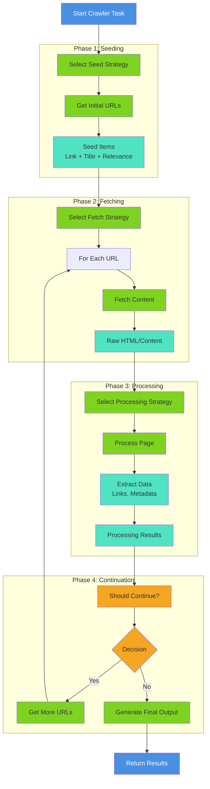

# Extendable Strategies in the Application

## Overview

This application employs several sophisticated strategy patterns that allow for extensibility and customization. These strategies enable developers to add new
capabilities without modifying core code, following the Open/Closed Principle.

## Table of Contents

1. [Strategic Scaling: Multiplicative Growth](#strategic-scaling-multiplicative-growth-through-orthogonal-strategies)
2. [Historical Context: Interoperability and Analogies](#historical-context-interoperability-and-analogies-as-foundational-principles)
3. [Model Provider Strategies](#model-provider-strategies)
4. [Interoperability Strategies](#interoperability-strategies)
5. [Task Planning Strategies](#task-planning-strategies)
6. [Crawler Strategies](#crawler-strategies)
7. [Design and Extension Guidelines](#design-and-extension-guidelines)

## Strategic Scaling: Multiplicative Growth Through Orthogonal Strategies

### The Scaling Paradox

One of the most powerful but underappreciated aspects of well-designed strategy systems is their **multiplicative scaling characteristic**. Unlike linear
systems where adding a new feature increases capability by a fixed amount, strategy systems exhibit **exponential capability expansion** where each new strategy
makes all existing strategies more powerful.
This creates a paradox: a small increment in code (one new strategy) produces a significant expansion in overall application capability (that strategy works
with all existing strategies).

### Mathematical Model of Strategy Scaling

#### Linear Scaling (Traditional Monolithic Design)

 ```
 Total Capability = Sum of Individual Features
 New Feature Impact = +1 unit of capability
 Example: 10 features = 10 units of capability
           Add 1 feature = 11 units of capability
           Growth: +10%
 ```

#### Multiplicative Scaling (Strategy Pattern Design)

 ```
 Total Capability = Product of Strategy Families
 New Strategy Impact = Multiplies across all other strategies
 Example with 4 strategy families:
   - API Providers: 8 options
   - Chat Models: 12 options
   - Task Types: 26 options
   - Processing Strategies: 5 options
   Total Combinations = 8 × 12 × 26 × 5 = 12,480 possible configurations
   Add 1 new API Provider:
   New Total = 9 × 12 × 26 × 5 = 14,040 configurations
   Growth: +1,560 new configurations (+12.5%)
   Add 1 new Task Type:
   New Total = 8 × 12 × 27 × 5 = 12,960 configurations
   Growth: +480 new configurations (+3.8%)
   Add 1 new Processing Strategy:
   New Total = 8 × 12 × 26 × 6 = 14,976 configurations
   Growth: +2,496 new configurations (+20%)
 ```

#### Real-World Growth Pattern in This Application

The application demonstrates this scaling principle in practice:
| Phase | API Providers | Chat Models | Task Types | Processing | Total Configs | Growth |
|-------|---------------|-------------|-----------|------------|---------------|--------|
| v1.0 | 3 | 6 | 8 | 2 | 288 | — |
| v1.5 | 5 | 9 | 12 | 3 | 1,620 | +462% |
| v2.0 | 8 | 12 | 26 | 5 | 12,480 | +670% |
| v2.5 | 8 | 15 | 26 | 5 | 15,600 | +25% |
Notice: Adding 3 chat models (v2.0→v2.5) increased total capability by 25%, despite being only a 20% increase in one dimension.

### Why Strategies Scale Multiplicatively

#### 1. Orthogonal Independence

Strategies are **orthogonal**—each strategy family operates independently along its own dimension:

 ```
 API Provider (dimension 1) ⊥ Chat Model (dimension 2) ⊥ Task Type (dimension 3) ⊥ Processing (dimension 4)
 ```

This orthogonality means:

* Each strategy can be combined with any other strategy
* No strategy "blocks" or "conflicts" with another
* New strategies automatically work with all existing strategies
* The system grows in multiple dimensions simultaneously

#### 2. Composability

Each strategy is **composable**—they combine to create new capabilities:

 ```kotlin
 // A single task execution combines multiple strategies:
val execution = TaskExecution(
  apiProvider = OpenAI,           // Strategy 1
  chatModel = GPT4Turbo,          // Strategy 2

  taskType = ChainOfThought,      // Strategy 3
  processingStrategy = Summarize  // Strategy 4
)
// This single execution represents ONE of 12,480 possible combinations
// Each combination is a distinct capability
 ```

#### 3. Emergent Capabilities

New capabilities emerge from strategy combinations that weren't explicitly programmed:

 ```
 Explicit Code: ~50,000 lines
 Explicit Features: ~100
 Emergent Capabilities: 12,480+
 Capability Density = 12,480 / 50,000 = 0.25 capabilities per line of code
 ```

This is the power of composition: the system does far more than the sum of its explicit code.

### Concrete Examples of Multiplicative Scaling

#### Example 1: Adding a New API Provider

**Scenario**: Add support for a new AI provider (e.g., Cohere)
**Code Added**: ~500 lines

* Provider implementation: 200 lines
* Model definitions: 150 lines
* Tests: 150 lines
  **Capability Expansion**:

 ```
 Before: 8 providers × 12 models × 26 tasks × 5 processing = 12,480 configs
 After:  9 providers × 12 models × 26 tasks × 5 processing = 14,040 configs
 New Configurations: +1,560 (+12.5%)
 Code-to-Capability Ratio: 1,560 new capabilities / 500 lines = 3.12 capabilities per line
 ```

**What This Means**:

* Every existing task type now works with Cohere
* Every existing chat model can be compared against Cohere models
* Every existing processing strategy can use Cohere
* Users can now mix Cohere with any other strategy
* All without modifying a single line of existing code

#### Example 2: Adding a New Task Type

**Scenario**: Add a new reasoning task (e.g., "Debate Analysis")
**Code Added**: ~800 lines

* Task implementation: 400 lines
* Configuration: 150 lines
* Prompts and utilities: 150 lines
* Tests: 100 lines
  **Capability Expansion**:

 ```
 Before: 8 providers × 12 models × 26 tasks × 5 processing = 12,480 configs
 After:  8 providers × 12 models × 27 tasks × 5 processing = 12,960 configs
 New Configurations: +480 (+3.8%)
 Code-to-Capability Ratio: 480 new capabilities / 800 lines = 0.6 capabilities per line
 ```

**What This Means**:

* Debate Analysis works with all 8 API providers
* Debate Analysis works with all 12 chat models
* Debate Analysis works with all 5 processing strategies
* Users can combine Debate Analysis with any other strategy
* The new task type automatically benefits from all existing infrastructure

#### Example 3: Adding a New Processing Strategy

**Scenario**: Add a new processing approach (e.g., "Sentiment-Aware Summarization")
**Code Added**: ~600 lines

* Strategy implementation: 300 lines
* Sentiment analysis integration: 150 lines
* Configuration: 100 lines
* Tests: 50 lines
  **Capability Expansion**:

 ```
 Before: 8 providers × 12 models × 26 tasks × 5 processing = 12,480 configs
 After:  8 providers × 12 models × 26 tasks × 6 processing = 14,976 configs
 New Configurations: +2,496 (+20%)
 Code-to-Capability Ratio: 2,496 new capabilities / 600 lines = 4.16 capabilities per line
 ```

**What This Means**:

* All 26 task types can now use sentiment-aware processing
* All 12 chat models can leverage sentiment analysis
* All 8 API providers can support this new capability
* Users get a 20% expansion in total capability from a single new strategy

### The Scaling Advantage Over Time

#### Traditional Monolithic Approach

 ```
 Time  | Features | Code   | Capability | Code per Feature
 ----  | -------- | ------ | ---------- | ----------------
 Week1 | 10       | 5K     | 10         | 500 lines
 Week2 | 15       | 8K     | 15         | 533 lines
 Week3 | 20       | 12K    | 20         | 600 lines
 Week4 | 25       | 16K    | 25         | 640 lines
 Trend: Code grows faster than capability (diminishing returns)
 ```

#### Strategy-Based Approach

 ```
 Time  | Strategies | Code   | Configs | Code per Config
 ----  | ---------- | ------ | ------- | ---------------
 Week1 | 4 families | 8K     | 288     | 28 lines
 Week2 | 4 families | 12K    | 1,620   | 7 lines
 Week3 | 4 families | 15K    | 12,480  | 1.2 lines
 Week4 | 4 families | 18K    | 12,480  | 1.4 lines
 Trend: Code grows linearly, capability grows exponentially (increasing returns)
 ```

### Why This Matters for Development

#### 1. Accelerating Development Velocity

As the system grows, each new strategy has **more existing strategies to combine with**, making each addition more valuable:

 ```
 Strategy #1: Creates 1 new capability
 Strategy #2: Creates 2 new capabilities (combines with #1)
 Strategy #3: Creates 3 new capabilities (combines with #1 and #2)
 Strategy #N: Creates N new capabilities (combines with all previous)
 ```

#### 2. Reducing Development Cost Per Feature

The cost to add a new strategy remains roughly constant, but the value increases:

 ```
 Cost to add new strategy: ~500-1000 lines of code (constant)
 Value of new strategy: Multiplies across all existing strategies (increasing)
 ROI = Value / Cost = Increasing over time
 ```

#### 3. Enabling AI-Assisted Development at Scale

The multiplicative nature of strategies makes them ideal for AI assistance:

 ```
 AI can:
 1. Analyze existing strategies (e.g., 8 API providers)
 2. Extract patterns and standards
 3. Generate new strategies following those patterns
 4. Automatically multiply capability across all combinations
 Result: 1 AI-generated strategy = N new capabilities (where N = product of other strategy families)
 ```

### Practical Implications

#### For Project Planning

 ```
 Traditional Approach:
 "To add 50% more capability, we need 50% more code"
 Strategy Approach:
 "To add 50% more capability, we might only need 10-20% more code
  (depending on which strategy family we extend)"
 ```

#### For Resource Allocation

 ```
 High-Impact Strategies (multiply across many others):
 - API Providers (8 options) → multiplies across 12 × 26 × 5 = 1,560 combinations
 - Chat Models (12 options) → multiplies across 8 × 26 × 5 = 1,040 combinations
 Medium-Impact Strategies:
 - Task Types (26 options) → multiplies across 8 × 12 × 5 = 480 combinations
 Lower-Impact Strategies:
 - Processing (5 options) → multiplies across 8 × 12 × 26 = 2,496 combinations
 Insight: Prioritize strategies that multiply across the most other strategies
 ```

#### For User Value

 ```
 User Perspective:
 "I can now use Cohere with all 26 task types and 5 processing strategies"
 = 26 × 5 = 130 new workflows
 = All from adding one API provider
 ```

### The Scaling Ceiling

While multiplicative scaling is powerful, it does have practical limits:

#### 1. Combinatorial Explosion

 ```
 10 × 10 × 10 × 10 = 10,000 combinations (manageable)
 20 × 20 × 20 × 20 = 160,000 combinations (getting complex)
 50 × 50 × 50 × 50 = 6,250,000 combinations (overwhelming)
 ```

**Solution**: Not all combinations are equally valuable. Focus on:

* High-value combinations
* Frequently-used combinations
* Combinations that solve real problems

#### 2. Compatibility Matrix

 ```
 As strategies grow, ensuring all combinations work becomes challenging:
 Compatibility Matrix Size = N × M × P × Q
 For 8 × 12 × 26 × 5 = 12,480 combinations
 Testing all combinations: Impractical
 Solution: Test representative combinations + property-based testing
 ```

#### 3. User Cognitive Load

 ```
 12,480 possible configurations is overwhelming for users
 Solution: Provide sensible defaults, templates, and guided selection
 ```

### Strategies for Managing Scaling

#### 1. Organize by Compatibility

 ```kotlin
 // Group strategies by compatibility
data class StrategyBundle(
  val name: String,
  val providers: List<APIProvider>,
  val models: List<ChatModel>,
  val tasks: List<TaskType>,
  val processing: List<ProcessingStrategy>,
  val description: String
)

val bundles = listOf(
  StrategyBundle(
    name = "Fast & Cheap",
    providers = listOf(Groq, Ollama),
    models = listOf(Haiku, Mistral7B),
    tasks = listOf(SimpleQA, Summarization),
    processing = listOf(DefaultSummarizer)
  ),
  StrategyBundle(
    name = "Powerful & Accurate",
    providers = listOf(OpenAI, Anthropic),
    models = listOf(GPT4Turbo, Claude3Opus),
    tasks = listOf(ChainOfThought, SystemsThinking),
    processing = listOf(AdvancedAnalysis)
  )
)
 ```

#### 2. Provide Smart Defaults

 ```kotlin
 // Recommend strategies based on use case
fun recommendStrategies(useCase: String): StrategyRecommendation {
  return when (useCase) {
    "research" -> StrategyRecommendation(
      provider = Anthropic,
      model = Claude3Opus,
      task = ChainOfThought,
      processing = AdvancedAnalysis
    )
    "quick-summary" -> StrategyRecommendation(
      provider = Groq,
      model = Mixtral,
      task = Summarization,
      processing = DefaultSummarizer
    )
    else -> StrategyRecommendation() // sensible defaults
  }
}
 ```

#### 3. Document High-Value Combinations

 ```
 # Recommended Strategy Combinations
 ## For Research Tasks
 - Provider: Anthropic (best reasoning)
 - Model: Claude 3 Opus (largest context)
 - Task: Chain of Thought (step-by-step reasoning)
 - Processing: Advanced Analysis (comprehensive extraction)
 ## For Quick Summaries
 - Provider: Groq (fastest)
 - Model: Mixtral 8x7B (good quality, fast)
 - Task: Summarization (focused output)
 - Processing: Default Summarizer (simple, fast)
 ## For Cost-Sensitive Operations
 - Provider: Ollama (local, free)
 - Model: Mistral 7B (efficient)
 - Task: Simple QA (minimal processing)
 - Processing: Lightweight (minimal overhead)
 ```

#### 4. Use AI to Navigate Combinations

 ```kotlin
 // AI-powered strategy recommendation
fun recommendStrategies(
  requirements: UserRequirements,
  constraints: Constraints
): List<StrategyRecommendation> {
  val candidates = generateCandidates(requirements)
  val filtered = candidates.filter { satisfies(it, constraints) }
  val ranked = rankByValue(filtered, requirements)
  return ranked.take(5) // Top 5 recommendations
}
 ```

### Historical Precedent: Scaling Through Composition

This multiplicative scaling principle has deep historical roots:

#### LEGO Bricks

 ```
 1 brick type: 1 possible structure
 2 brick types: 4 possible structures
 3 brick types: 27 possible structures
 4 brick types: 256 possible structures
 With just 4 orthogonal brick types, you get 256 possible combinations
 LEGO's actual success comes from having ~100 brick types
 = Billions of possible structures from a small set of orthogonal components
 ```

#### Unix Philosophy

 ```
 "Do one thing and do it well"
 "Write programs to work together"
 Result: Small, focused tools (strategies) that compose into powerful systems
 Example: grep × sed × awk × sort × uniq = Infinite possibilities
 ```

#### Periodic Table of Elements

 ```
 118 elements (strategies)
 Millions of possible compounds (combinations)
 Infinite possible materials (emergent properties)
 Each new element discovered multiplies the possible compounds
 ```

#### Programming Languages

 ```
 Small set of orthogonal language features:
 - Variables, functions, loops, conditionals, data structures
 Result: Infinite possible programs from finite language features
 Each new language feature multiplies the expressiveness
 ```

### Conclusion: The Scaling Advantage

The strategy pattern provides a **multiplicative scaling advantage** that becomes more pronounced as the system grows:
| Aspect | Traditional | Strategy-Based |
|--------|-------------|----------------|
| Growth Pattern | Linear | Exponential |
| Code Growth | Accelerating | Linear |
| Capability Growth | Decelerating | Accelerating |
| Development Cost | Increasing | Constant |
| ROI per Feature | Decreasing | Increasing |
| Time to Market | Slowing | Accelerating |
This is why the application grew from a handful of implementations to 26+ task types not through months of manual coding, but through an iterative process of
AI-assisted generation and refinement—each new strategy multiplied the value of all existing strategies, creating a virtuous cycle of capability expansion.
The key insight: **In a well-designed strategy system, adding one new strategy doesn't just add one new capability—it multiplies capability across all existing
strategies, creating exponential growth from linear code additions.**

## Historical Context: Interoperability and Analogies as Foundational Principles

### The Enduring Power of Interoperability

Interoperability—the ability of different systems to work together seamlessly—is not a modern software concept. It represents one of humanity's most fundamental
and enduring challenges, solved repeatedly across millennia:

#### Ancient and Classical Examples

* **Trade Routes and Standards**: The Silk Road succeeded not just through geography but through standardized measurements, weights, and exchange protocols that
  allowed merchants from vastly different cultures to trade effectively
* **Roman Engineering**: The Roman Empire's dominance partly stemmed from standardized construction methods, materials specifications, and measurement systems
  that allowed infrastructure to be built consistently across diverse territories
* **Maritime Navigation**: The development of standardized nautical charts, compass conventions, and port protocols enabled ships from different nations to
  navigate and trade together
* **Printing Press**: Gutenberg's innovation wasn't just the press itself, but the standardization of typefaces, paper sizes, and binding methods that made
  books interoperable across printers and regions

#### Industrial Revolution Interoperability

The Industrial Revolution was fundamentally an interoperability revolution:

* **Standardized Parts**: Eli Whitney's interchangeable parts manufacturing (1798) transformed production by ensuring components from different makers could
  work together
* **Railway Standards**: The adoption of standard gauge tracks (4 ft 8.5 in) allowed trains and cargo to move seamlessly across different railway companies and
  nations
* **Electrical Standards**: The "War of Currents" (AC vs DC) was ultimately resolved through standardization, enabling electrical systems from different
  manufacturers to interoperate
* **Screw Threads**: The adoption of standardized screw threads (Whitworth, metric) allowed fasteners from different manufacturers to work together reliably

#### Modern Industrial Examples

* **Container Shipping**: The ISO 20-foot and 40-foot container standards revolutionized global trade by making cargo interoperable across ships, trains, and
  trucks
* **Telecommunications**: The OSI model and TCP/IP protocols enable networks from different vendors to communicate
* **Manufacturing**: Industry 4.0 relies on standardized interfaces allowing robots, sensors, and systems from different manufacturers to work together

### The Philosophical Importance of Analogies

Analogical reasoning is not merely a rhetorical device—it's a fundamental cognitive tool that has driven human understanding across all disciplines:

#### Ancient Philosophy

* **Plato's Allegory of the Cave**: Used analogy to explain the nature of reality and perception
* **Aristotle's Analogical Reasoning**: Formalized analogy as a logical tool, recognizing it as essential to scientific reasoning
* **Buddhist Philosophy**: Extensively used analogies (the raft, the finger pointing at the moon) to convey non-conceptual truths

#### Scientific Discovery Through Analogy

* **Maxwell's Electromagnetic Theory**: James Clerk Maxwell used mechanical analogies (rotating cells, idle wheels) to develop equations describing
  electromagnetic phenomena
* **Bohr's Atomic Model**: Niels Bohr used the solar system as an analogy to explain atomic structure, providing crucial intuition despite later refinement
* **Darwin's Evolution**: Darwin used artificial selection (breeding) as an analogy to understand natural selection
* **Rutherford's Nuclear Model**: Used the solar system analogy to propose the nuclear structure of atoms
* **Schrödinger's Wave Equation**: Developed through analogies between particle motion and wave phenomena

#### Engineering and Design

* **Biomimicry**: The Velcro fastener was developed by analogy to burrs clinging to fur; modern aircraft designs use bird wing analogies
* **Structural Engineering**: Suspension bridges use analogies to hanging chains; arch bridges use analogies to natural stone formations
* **Materials Science**: Understanding material properties often proceeds through analogies to familiar substances

#### Business and Economics

* **Supply Chain Management**: Modern supply chains use analogies to biological systems (metabolism, immune response)
* **Organizational Structure**: Companies use analogies to organisms, ecosystems, and military hierarchies to understand organizational dynamics
* **Market Dynamics**: Economists use analogies to fluid dynamics, thermodynamics, and evolutionary biology

#### Medicine and Biology

* **Germ Theory**: Pasteur's understanding of disease used analogies to fermentation and decay
* **Immune System**: Described through military analogies (defense, attack, memory) that shaped research directions
* **Neuroscience**: Brain function understood through analogies to telephone networks, then computers, now distributed systems

### Why Analogies and Interoperability Matter

#### Cognitive Function

Analogies work because they:

* **Bridge the Unknown**: Map unfamiliar domains to familiar ones
* **Enable Transfer**: Allow knowledge from one domain to illuminate another
* **Compress Complexity**: Reduce complex systems to understandable patterns
* **Suggest Hypotheses**: Point toward new research directions and questions

#### Practical Value

Interoperability and analogical thinking provide:

* **Scalability**: Systems designed for interoperability can grow without redesign
* **Resilience**: Interoperable systems can substitute components without failure
* **Innovation**: Analogies from other domains often spark breakthrough innovations
* **Efficiency**: Standardized interfaces reduce duplication and waste
* **Accessibility**: Analogies make complex ideas understandable to broader audiences

#### Philosophical Significance

* **Universality**: The same principles appear across vastly different domains
* **Emergence**: Complex systems emerge from simple interoperable components
* **Abstraction**: Both interoperability and analogies work through abstraction—identifying essential patterns beneath surface differences
* **Understanding**: True understanding often comes through recognizing analogies between domains

### The Danger of Forgetting These Principles

History shows that when organizations or societies ignore interoperability and analogical thinking:

* **Fragmentation**: Incompatible systems proliferate (pre-standardization railways, pre-TCP/IP networks)
* **Inefficiency**: Duplication and waste increase dramatically
* **Stagnation**: Innovation slows when knowledge can't transfer between domains
* **Brittleness**: Systems become fragile and difficult to maintain
* **Missed Insights**: Analogies from other domains go unexplored

---

## The Critical Role of Strategies in AI-Assisted Development

### Why Strategies Matter for Generative AI

In any large software project, you'll frequently encounter what's known as the Strategy Pattern—essentially, an interface with multiple implementations that can
be plugged in various ways. This architectural pattern becomes particularly crucial when working with generative AI for several key reasons:
The strategy pattern is powerful precisely because it embodies the principles of interoperability and analogical thinking that have proven valuable across human
endeavor. By creating standardized interfaces (interoperability) and recognizing that different implementations solve similar problems in different ways (
analogical thinking), we create systems that are both flexible and maintainable.

#### 1. Managing Growing Libraries at Scale

Managing a growing library of implementations—like the 26+ different reasoning patterns in this application—can become increasingly expensive and cause scaling
problems in your project. Traditional manual approaches to maintaining consistency across dozens of similar implementations quickly become:

* **Time-consuming**: Manually updating each implementation with new patterns or utilities
* **Error-prone**: Inconsistencies creep in across similar files
* **Expensive**: Developer time spent on repetitive tasks rather than innovation
* **Difficult to document**: Keeping documentation synchronized across many files

This is where AI assistance becomes invaluable. The strategy pattern provides the perfect structure for AI-powered tools to:

* **Generate documentation at scale**: Establish standards from exemplar implementations, then apply them consistently across all strategy implementations
* **Suggest new implementations**: Analyze existing patterns to propose complementary strategies that fill gaps in functionality
* **Create implementations from specifications**: Use existing strategies as templates to generate new, fully-functional implementations
* **Refactor consistently**: Apply improvements across entire families of related implementations simultaneously

#### 2. Enabling AI-Driven Evolution

The strategy pattern creates a framework where AI can actively participate in codebase evolution:

```kotlin
// AI can analyze this pattern across 26+ implementations
abstract class TaskType<out T : TaskExecutionConfig, out U : TaskTypeConfig>(
  name: String,
  val executionConfigClass: Class<out T>,
  val taskSettingsClass: Class<out U>
)
```

With this structure, AI tools can:

1. **Learn from examples**: Analyze 2-3 high-quality implementations to understand patterns
2. **Generate standards**: Create documentation guidelines based on exemplar code
3. **Propose additions**: Suggest new strategy implementations that complement existing ones
4. **Implement automatically**: Generate complete, compilable implementations from specifications
5. **Maintain consistency**: Apply refactorings and improvements across all implementations

#### 3. Reducing Cognitive Load

When you have 26+ different reasoning task implementations, keeping them all consistent and up-to-date manually is cognitively overwhelming. The strategy
pattern combined with AI assistance allows developers to:

* Focus on high-level design decisions rather than repetitive implementation details
* Maintain consistency without manually reviewing every file
* Quickly expand capabilities by describing desired behavior rather than coding from scratch
* Ensure quality through pattern-based generation rather than error-prone manual coding

#### 4. Accelerating Innovation

The combination of strategy patterns and AI assistance creates a virtuous cycle:

1. **Start small**: Begin with a few core implementations
2. **Document patterns**: Use AI to extract and formalize patterns from examples
3. **Generate ideas**: AI suggests complementary strategies based on existing patterns
4. **Rapid implementation**: AI generates new implementations following established patterns
5. **Iterate and improve**: Use AI to refactor and enhance all implementations simultaneously

This is how the application grew from a handful of task types to 26+ implementations—not through months of manual coding, but through an iterative process of AI-assisted generation and refinement.

### Practical Benefits in This Codebase

The strategy patterns in this application are specifically designed to work well with AI assistance:

* **Task Types**: 26+ reasoning patterns that can be documented, analyzed, and extended using AI
* **API Providers**: Multiple AI service integrations that follow consistent patterns
* **Processing Strategies**: Different approaches to web crawling and analysis that can be generated from templates
* **Cognitive Modes**: Planning strategies that can be mixed and matched, with AI helping to create new combinations

Each of these strategy families benefits from AI-powered:
* Documentation generation
* Implementation suggestion
* Code generation from specifications
* Consistent refactoring across all implementations

---

# Model Provider Strategies

## 1. API Provider Strategy

### Purpose

Manages different AI service providers (OpenAI, Anthropic, Google, etc.) with a unified interface.

### Implementation

Located in `APIProvider.kt`, this uses a dynamic enum pattern:

```kotlin
abstract class APIProvider(name: String, val base: String) : DynamicEnum<APIProvider>(name)
```

### Key Features

* **Dynamic Registration**: Providers can be registered at runtime
* **Unified Interface**: All providers implement common methods:
  - `getChatClient()` - Returns chat interface
  - `getChatModels()` - Lists available models
  - `getEmbeddingModels()` - Lists embedding models
  - `getImageModels()` - Lists image generation models
  - `authorize()` - Handles authentication

### Built-in Providers

* **OpenAI**: GPT models, DALL-E, Whisper
* **Anthropic**: Claude models
* **Google**: Gemini models with vision capabilities
* **AWS**: Bedrock models
* **Groq**: Fast inference models
* **Ollama**: Local model hosting
* **Mistral**: Mistral AI models
* **DeepSeek**: DeepSeek models

### Extension Example

```kotlin
val CustomProvider: APIProvider = object : APIProvider("Custom", "https://api.custom.com") {
  override fun getChatModels(key: String, baseUrl: String) = listOf(...)
  override fun getChatClient(...) = CustomChatClient(...)
}
```

### AI-Assisted Development

This strategy pattern is ideal for AI-assisted expansion:

1. **Documentation**: AI can analyze existing providers to generate comprehensive API documentation
2. **New Providers**: AI can generate new provider implementations by following the pattern of existing ones
3. **Consistency**: AI can ensure all providers implement the interface correctly and follow naming conventions
4. **Testing**: AI can generate test cases by analyzing how existing providers are tested

---

## 2. Chat Model Strategy

### Purpose

Manages chat/conversation models with unified interface for different AI providers and model variants.

### Analogical Understanding

The `ChatModel` abstraction works through multiple useful analogies:

#### Analogy to Vehicles

Different chat models are like different vehicles:

* **Claude 4.1 Opus**: A luxury sedan—high capacity (200K tokens), high cost, excellent performance
* **Claude 4.5 Sonnet**: A sports car—balanced performance and efficiency
* **Claude 3.5 Haiku**: A motorcycle—lightweight, fast, economical
  Just as you choose a vehicle based on your journey's requirements (distance, cargo, speed, cost), you choose a model based on your task's requirements (
  context size, output length, cost, latency).

#### Analogy to Shipping Classes

Like shipping services (economy, standard, express, overnight):

* **Economy Models** (Haiku): Lower cost, acceptable latency, suitable for simple tasks
* **Standard Models** (Sonnet): Balanced cost and performance, suitable for most tasks
* **Premium Models** (Opus): Higher cost, superior performance, suitable for complex reasoning

#### Analogy to Restaurant Service Tiers

Like restaurants offering different service levels:

* **Fast Casual** (Haiku): Quick, affordable, good for simple needs
* **Fine Dining** (Opus): Expensive, high quality, suitable for special occasions
* **Mid-Range** (Sonnet): Good balance of quality and cost
  These analogies aren't just rhetorical—they help developers make better decisions about model selection by mapping unfamiliar AI concepts to familiar
  real-world trade-offs.

### Implementation

Located in `ChatModel.kt`:

```kotlin
@JsonDeserialize(using = ChatModelsDeserializer::class)
@JsonSerialize(using = ChatModelsSerializer::class)
open class ChatModel(
  val name: String = "",
  modelName: String = name,
  maxTotalTokens: Int = -1,
  maxOutTokens: Int = maxTotalTokens,
  provider: APIProvider? = null,
  val inputTokenPricePerK: Double = 0.0,
  val outputTokenPricePerK: Double = inputTokenPricePerK,
) : LLMModel(
  modelName = modelName,
  maxTotalTokens = maxTotalTokens,
  maxOutTokens = maxOutTokens,
  provider = provider,
) {
  override fun pricing(usage: Usage) =
    (usage.prompt_tokens * inputTokenPricePerK + usage.completion_tokens * outputTokenPricePerK) / 1000.0

  fun instance(
    key: String,
    base: String = provider?.base!!,
    logLevel: Level = Level.INFO,
    logStreams: MutableList<BufferedOutputStream> = mutableListOf(),
    workPool: ExecutorService,
    temperature: Double = 0.1,
    scheduledPool: ListeningScheduledExecutorService,
    onUsage: (LLMModel, Usage) -> Unit,
  ): ChatInterface = ChatInterface(...)
}
```

### Key Features

* **Provider Agnostic**: Works with any API provider (OpenAI, Anthropic, Google, etc.)
* **Token Accounting**: Tracks input and output tokens separately
* **Cost Calculation**: Automatic pricing based on token usage
* **Dynamic Configuration**: Runtime model selection and configuration
* **Serialization Support**: JSON serialization for persistence and configuration

### Model Properties

| Property               | Purpose                     | Example                    |
|------------------------|-----------------------------|----------------------------|
| `name`                 | Unique identifier           | "Claude41Opus"             |
| `modelName`            | Provider's model identifier | "claude-opus-4-1-20250805" |
| `maxTotalTokens`       | Maximum context window      | 200000                     |
| `maxOutTokens`         | Maximum output tokens       | 32000                      |
| `provider`             | API provider                | APIProvider.Anthropic      |
| `inputTokenPricePerK`  | Cost per 1K input tokens    | 0.015                      |
| `outputTokenPricePerK` | Cost per 1K output tokens   | 0.075                      |

### Pricing and Cost Tracking

```kotlin
// Calculate cost for a single request
val model = ChatModel.values()["Claude41Opus"]!!
val usage = Usage(prompt_tokens = 1000, completion_tokens = 500)
val cost = model.pricing(usage)
// cost = (1000 * 0.015 + 500 * 0.075) / 1000 = 0.0525

// Track cumulative costs
class CostTracker(val model: ChatModel) {
  private var totalCost = 0.0
  private var totalInputTokens = 0L
  private var totalOutputTokens = 0L

  fun recordUsage(usage: Usage) {
    totalCost += model.pricing(usage)
    totalInputTokens += usage.prompt_tokens
    totalOutputTokens += usage.completion_tokens
  }

  fun getReport() = """
        Model: ${model.name}
        Total Cost: $$totalCost
        Input Tokens: $totalInputTokens
        Output Tokens: $totalOutputTokens
        Avg Input Cost: $${totalCost * totalInputTokens / (totalInputTokens + totalOutputTokens)}
    """.trimIndent()
}
```

### AI-Assisted Development

Chat model strategies benefit from AI assistance:

1. **Model Comparison**: AI can analyze pricing and capabilities to recommend optimal models
2. **Cost Optimization**: AI can suggest model switches to reduce costs while maintaining quality
3. **Documentation**: AI can generate comparison matrices and selection guides
4. **New Models**: AI can generate model definitions when new models are released

---

## 3. Embedding Model Strategy

### Purpose

Manages embedding/vector models for semantic search and similarity operations.

### Implementation

Located in `EmbeddingModel.kt`:

```kotlin
@JsonDeserialize(using = EmbeddingModelsDeserializer::class)
@JsonSerialize(using = EmbeddingModelsSerializer::class)
open class EmbeddingModel(
  modelName: String = "",
  maxTokens: Int = 0,
  provider: APIProvider? = null,
  private val tokenPricePerK: Double = 0.0,
) : LLMModel(
  modelName = modelName,
  provider = provider,
  maxTotalTokens = maxTokens
) {
  override fun pricing(usage: ModelSchema.Usage) =
    usage.prompt_tokens * tokenPricePerK / 1000.0

  fun instance(
    key: String = "",
    base: String = provider?.base ?: "",
    logLevel: Level = Level.INFO,
    logStreams: MutableList<BufferedOutputStream> = mutableListOf(),
    workPool: ExecutorService = Executors.newFixedThreadPool(8),
    scheduledPool: ListeningScheduledExecutorService =
      MoreExecutors.listeningDecorator(Executors.newScheduledThreadPool(1)),
    onUsage: (LLMModel, ModelSchema.Usage) -> Unit = { _, _ -> },
  ): EmbedderClient {
    val client = provider?.getEmbeddingClient(
      key = key,
      base = base,
      workPool = workPool,
      logLevel = logLevel,
      logStreams = logStreams,
      scheduledPool = scheduledPool
    ) ?: throw IllegalArgumentException("Unsupported provider: $provider")

    return EmbedderClient(client, this, onUsage)
  }
}
```

### Key Features

* **Vector Generation**: Convert text to embeddings
* **Semantic Search**: Find similar content using embeddings
* **Dimension Flexibility**: Support for different embedding dimensions
* **Batch Processing**: Efficient batch embedding operations
* **Cost Tracking**: Token-based pricing for embeddings

### AI-Assisted Development

Embedding model strategies enable:

1. **Vector Database Optimization**: AI can recommend optimal embedding models for specific use cases
2. **Dimension Selection**: AI can suggest appropriate embedding dimensions for performance/accuracy tradeoffs
3. **Batch Processing**: AI can optimize batch sizes for cost efficiency
4. **Model Comparison**: AI can analyze embedding quality across different models

---

## 4. Image Model Strategy

### Purpose

Manages image generation models with support for different quality levels, sizes, and pricing models.

### Implementation

Located in `ImageModel.kt`:

```kotlin
class ImageModel(
  val name: String,
  override val modelName: String,
  val maxPrompt: Int,
  override val provider: APIProvider,
  val quality: String = "standard",
  val pricingFunction: (width: Int, height: Int) -> Double
) : AIModel {
  fun pricing(width: Int, height: Int): Double = pricingFunction(width, height)
}
```

### Key Features

* **Flexible Pricing**: Support for dimension-based and quality-based pricing
* **Quality Levels**: Standard, HD, and custom quality options
* **Prompt Limits**: Track maximum prompt length per model
* **Size Constraints**: Define supported image dimensions

### AI-Assisted Development

Image model strategies enable:

1. **Model Recommendation**: AI suggests optimal models based on prompt complexity and quality requirements
2. **Batch Optimization**: AI optimizes batch image generation for cost efficiency
3. **Quality Analysis**: AI analyzes generated images and recommends model adjustments
4. **Pricing Analysis**: AI tracks and analyzes image generation costs across models

---

# Interoperability Strategies

## 5. Patch Processor Strategy

### Purpose

Different algorithms for applying code changes with varying levels of fuzzy matching.

### Implementation

Located in `PatchProcessor.kt` and `PatchProcessors.kt`:

```kotlin
interface PatchProcessor {
  val label: String
  val patchFormatPrompt: String
  fun generatePatch(oldCode: String, newCode: String): String
  fun applyPatch(source: String, patch: String): String
}
```

### Available Processors

#### FullReplacement

* **Strategy**: Complete file replacement
* **Use Case**: Major rewrites
* **Reliability**: 100% (no fuzzy matching)

#### Strict

* **Strategy**: Exact matching only
* **Use Case**: Critical files requiring precision
* **Reliability**: High, but may fail on minor differences

#### Fuzzy (Default)

* **Strategy**: Balanced fuzzy matching
* **Use Case**: General purpose editing
* **Reliability**: Good balance of flexibility and accuracy

#### Lenient

* **Strategy**: Maximum fuzzy matching
* **Use Case**: Files with significant formatting differences
* **Reliability**: Most flexible, may introduce errors

#### Thermodynamic

* **Strategy**: DNA-like binding energy approach
* **Use Case**: Experimental, biologically-inspired matching
* **Reliability**: Novel approach, still being refined

### Extension Example

```kotlin
enum class PatchProcessors : PatchProcessor {
  Custom {
    override val label = "Custom"
    override val matcher = CustomPatchMatcher()
    override fun extractCodeBlocks(response: String) = matcher.extractCodeBlocks(response)
  }
}
```

### AI-Assisted Development

Patch processors are crucial for AI-generated code modifications:

1. **Mass Patching**: Apply AI-generated changes across multiple files simultaneously
2. **Fuzzy Matching**: Handle variations in AI-generated patches
3. **Quality Control**: Review patches before applying to ensure correctness
4. **Iterative Refinement**: AI can adjust patch strategies based on success rates

---

## 6. Document Reader Strategy

### Purpose

Read various document formats with unified interface.

### Implementation

Located in `DocumentReader.kt`:

```kotlin
interface DocumentReader : AutoCloseable {
  fun getText(): String
}

interface PaginatedDocumentReader : DocumentReader {
  fun getPageCount(): Int
  fun getText(startPage: Int, endPage: Int): String
}
```

### Supported Formats

* **PDF**: PDFReader
* **Word**: DocxReader, DocReader
* **Excel**: XlsxReader, XlsReader
* **PowerPoint**: PptxReader, PptReader
* **HTML**: HTMLReader
* **Email**: EmlReader
* **Text**: TextReader (fallback)

### Extension Pattern

```kotlin
fun File.getReader(): DocumentReader = when {
  this.name.endsWith(".custom") -> CustomReader(this)
  else -> TextReader(this)
}
```

---

## 7. Type Describer Strategy

### Purpose

Generate human-readable descriptions of types for AI prompts.

### Implementation

Located in `TypeDescriber.kt`:

```kotlin
abstract class TypeDescriber {
  abstract val markupLanguage: String
  abstract fun describe(rawType: Class<in Nothing>, ...): String
  abstract fun registerSubType(parentClass: Class<T>, subClass: Class<U>)
}
```

### Use Cases

* Generate API documentation for AI
* Create type-aware prompts
* Support polymorphic type handling

### Extension Example

```kotlin
class CustomDescriber : TypeDescriber() {
  override val markupLanguage = "custom-markup"
  override fun describe(rawType: Class<in Nothing>, ...): String {
    // Generate custom format description
  }
}
```

---

## 8. Code Runtime Strategy

### Purpose

Execute code in different languages with unified interface.

### Implementation

Located in `CodeRuntime.kt`:

```kotlin
interface CodeRuntime : EnabledStrategy {
  fun getLanguage(): String
  fun getSymbols(): Map<String, Any>
  fun run(code: String): Any?
  fun validate(code: String): Throwable?
  fun wrapCode(code: String): String
}
```

### Supported Runtimes

* **Kotlin**: JVM-based execution
* **JavaScript**: V8/Nashorn engine
* **Python**: Jython or external process
* **Shell**: System command execution

### Extension Example

```kotlin
class CustomRuntime : CodeRuntime {
  override fun getLanguage() = "custom"
  override fun getSymbols() = mapOf("api" to customApi)
  override fun run(code: String): Any? {
    // Execute in custom interpreter
  }
  override fun validate(code: String): Throwable? {
    // Syntax validation
  }
}
```

---

# Task Planning Strategies

## 9. Task Type Strategy

### Purpose

Extensible task execution system supporting various specialized operations.

### Implementation

Located in `TaskType.kt`:

```kotlin
class TaskType<out T : TaskExecutionConfig, out U : TaskTypeConfig>(
  name: String,
  val executionConfigClass: Class<out T>,
  val taskSettingsClass: Class<out U>
)
```

### Task Categories

#### File Operations

* **FileModification**: Edit files with AI assistance
* **FileSearch**: Search codebase with semantic understanding
* **Analysis**: Analyze code structure and patterns

#### Knowledge Management

* **KnowledgeIndexing**: Build vector databases
* **VectorSearch**: Semantic search across documents

#### Reasoning Tasks

* **ChainOfThought**: Step-by-step reasoning
* **MetaCognitiveReflection**: Self-analysis of reasoning
* **CausalInference**: Identify cause-effect relationships
* **AbstractionLadder**: Move between concrete and abstract
* **CounterfactualAnalysis**: "What if" scenarios
* **AnalogicalReasoning**: Find and apply analogies
* **SocraticDialogue**: Question-driven exploration

#### Writing Tasks

* **ArticleGeneration**: Create articles
* **PersuasiveEssay**: Write persuasive content
* **BusinessProposal**: Generate proposals
* **TechnicalExplanation**: Explain technical concepts
* **TutorialGeneration**: Create tutorials

#### Advanced Reasoning

* **SystemsThinking**: Analyze complex systems
* **GameTheory**: Strategic decision analysis
* **ProbabilisticReasoning**: Handle uncertainty
* **TemporalReasoning**: Time-based reasoning
* **EthicalReasoning**: Ethical analysis

### Registration Pattern

```kotlin
registerConstructor(CustomTask) { settings, task ->
  CustomTaskImplementation(settings, task)
}
```

### Extension Example

```kotlin
class CustomTask(
  orchestrationConfig: OrchestrationConfig,
  planTask: CustomTaskConfig?
) : AbstractTask<CustomTaskConfig, CustomTaskSettings>(
  orchestrationConfig, planTask
) {
  override fun promptSegment(): String = "Custom task prompt"
  override fun run(...): TaskResult<*> {
    // Implementation
  }
}
```

### AI-Assisted Development at Scale

The Task Type strategy is the prime example of how AI assistance transforms development:

#### Documentation Generation

1. **Establish Standards**: Select 2-3 exemplar task implementations
2. **Generate Guidelines**: AI analyzes examples to create documentation standards
3. **Apply at Scale**: AI generates documentation for all 26+ task types following the standards
4. **Maintain Consistency**: Documentation stays synchronized as implementations evolve

#### Idea Generation

```kotlin
// AI can analyze existing tasks and suggest:
// - Complementary reasoning patterns
// - Missing cognitive approaches
// - Hybrid task types combining existing strategies
// - Domain-specific task variations
```

#### Implementation from Specification

```kotlin
// Process:
// 1. AI suggests "Ethical Reasoning" task
// 2. Developer selects 2-3 similar tasks as templates
// 3. AI generates complete implementation following patterns
// 4. Result: Fully functional, compilable code integrated with existing system
```

#### Mass Refactoring

```kotlin
// AI can:
// 1. Analyze utility functions across all task implementations
// 2. Identify opportunities to use shared utilities
// 3. Generate patches for each implementation
// 4. Apply changes consistently across all 26+ files
```

### Real-World Growth Pattern

This application demonstrates the power of AI-assisted strategy development:

* **Started with**: ~6 core task types
* **Grew to**: 26+ implementations
* **Timeline**: Weeks, not months
* **Method**: Iterative AI-assisted generation and refinement
* **Quality**: Consistent patterns, comprehensive documentation, minimal bugs
  The key to this growth was:

1. Establishing clear patterns in initial implementations
2. Using AI to analyze and extract those patterns
3. Generating new implementations following established patterns
4. Iteratively refining both patterns and implementations
5. Maintaining consistency through AI-assisted documentation and refactoring

---

## 10. Cognitive Mode Strategy

### Purpose

Defines different reasoning and planning approaches for AI task execution.

### Implementation

Located in `CognitiveMode.kt`:

```kotlin
interface CognitiveModeStrategy {
  val inputCnt: Int
  fun getCognitiveMode(...): CognitiveMode
}
```

### Available Modes

#### Chat Mode

* **Purpose**: Simple conversational interaction
* **Use Case**: Direct Q&A, simple tasks
* **Characteristics**: No planning overhead, immediate responses

#### Adaptive Mode

* **Purpose**: Dynamic planning with iterative refinement
* **Use Case**: Complex tasks requiring flexibility
* **Characteristics**: Adjusts plan based on execution results

#### Waterfall Mode

* **Purpose**: Sequential execution with dependencies
* **Use Case**: Tasks with clear sequential steps
* **Characteristics**: Linear progression, each step builds on previous

#### Hierarchical Mode

* **Purpose**: Nested sub-planning for complex problems
* **Use Case**: Large projects requiring decomposition
* **Characteristics**: Tree-like task structure, recursive planning

### Extension Example

```kotlin
enum class CognitiveModeStrategies : CognitiveModeStrategy {
  Custom {
    override val inputCnt: Int get() = 3
    override fun getCognitiveMode(...): CognitiveMode {
      return CustomPlanningMode(...)
    }
  }
}
```

### AI-Assisted Development

Cognitive modes benefit significantly from AI assistance:

1. **Pattern Analysis**: AI can analyze existing modes to suggest new planning strategies
2. **Hybrid Modes**: AI can propose combinations of existing modes for specific use cases
3. **Documentation**: AI can generate detailed explanations of when to use each mode
4. **Optimization**: AI can analyze execution patterns to suggest mode improvements

---

# Crawler Strategies



## 11. Fetch Strategy

### Purpose

Provides different methods for retrieving web content, from simple HTTP requests to full browser automation.

### Implementation

Located in `FetchMethod.kt`:

```kotlin
interface FetchStrategy : EnabledStrategy {
  fun fetch(
    url: String,
    webSearchDir: File,
    index: Int,
    pool: ExecutorService,
    orchestrationConfig: OrchestrationConfig
  ): String
}

interface FetchMethodFactory {
  fun createStrategy(task: CrawlerAgentTask): FetchStrategy
}
```

### Available Methods

#### Selenium

* **Purpose**: Full browser automation with JavaScript execution
* **Use Case**: Dynamic websites requiring JavaScript rendering
* **Characteristics**:
  - Handles SPAs (Single Page Applications)
  - Executes JavaScript
  - Supports complex interactions
  - Higher resource usage
* **Configuration**: Requires `FetchConfig.isSeleniumEnabled = true`

#### HttpClient

* **Purpose**: Lightweight HTTP requests
* **Use Case**: Static content, APIs, simple web pages
* **Characteristics**:
  - Fast and efficient
  - Low resource usage
  - No JavaScript execution
  - Direct HTTP/HTTPS support

### Extension Example

```kotlin
enum class FetchMethod : FetchMethodFactory {
  CustomFetch {
    override fun createStrategy(task: CrawlerAgentTask) = object : FetchStrategy {
      override fun isEnabled() = true
      override fun fetch(
        url: String,
        webSearchDir: File,
        index: Int,
        pool: ExecutorService,
        orchestrationConfig: OrchestrationConfig
      ): String {
        // Custom fetching logic
        // Could use Playwright, Puppeteer, or custom HTTP client
        return fetchedContent
      }
    }
  }
}
```

### Integration Points

* Works with `CrawlerAgentTask` for web scraping
* Supports concurrent fetching via `ExecutorService`
* Configurable via `OrchestrationConfig`
* Results stored in `webSearchDir` for caching

### Best Practices

1. **Choose Appropriately**: Use HttpClient for static content, Selenium for dynamic
2. **Handle Timeouts**: Implement proper timeout handling
3. **Respect Robots.txt**: Check and honor robots.txt directives
4. **Rate Limiting**: Implement delays between requests
5. **Error Recovery**: Handle network failures gracefully

---

## 12. Seed Strategy

### Purpose

Generates initial URLs for web crawling from various search sources and methods.

### Implementation

Located in `SeedMethod.kt`:

```kotlin
data class SeedItem(
  val link: String,
  val title: String,
  val tags: List<String>? = null,
  @Description("1-100") val relevance_score: Double = 100.0,
  val additionalData: Map<String, Any> = emptyMap()
)

interface SeedStrategy : EnabledStrategy {
  fun getSeedItems(
    taskConfig: CrawlerTaskExecutionConfigData?,
    orchestrationConfig: OrchestrationConfig
  ): List<SeedItem>?
}

interface SeedMethodFactory {
  fun createStrategy(task: CrawlerAgentTask, user: User?): SeedStrategy
}
```

### Available Methods

#### Google-Based Methods

##### GoogleProxy

* **Purpose**: Google search via proxy service
* **Use Case**: Low rate limits, no authentication needed
* **Characteristics**: Indirect access, may have latency

##### GoogleSearch

* **Purpose**: Direct Google search integration
* **Use Case**: Standard web search
* **Characteristics**: Direct API access, subject to rate limits

#### SearchIO Integration

The application integrates with SearchIO API for multiple search engines:

##### SearchIO_Google_Search

* **Purpose**: General web search
* **Data Source**: `organic_results`
* **Use Case**: Broad web content discovery

##### SearchIO_Google_Maps

* **Purpose**: Location-based search
* **Data Source**: `local_results`
* **Use Case**: Finding businesses, locations, geographic data

##### SearchIO_Google_Scholar

* **Purpose**: Academic paper search
* **Data Source**: `organic_results`
* **Use Case**: Research, academic content, citations

##### SearchIO_Google_Patents

* **Purpose**: Patent database search
* **Data Source**: `organic_results`
* **Use Case**: Patent research, prior art searches

##### SearchIO_Google_News

* **Purpose**: News article search
* **Data Source**: `organic_results`
* **Use Case**: Current events, news aggregation

##### SearchIO_Google_Jobs

* **Purpose**: Job listing search
* **Data Source**: `jobs`
* **Use Case**: Employment opportunities, job market analysis

##### SearchIO_Amazon

* **Purpose**: Product search on Amazon
* **Data Source**: `organic_results`
* **Use Case**: E-commerce, product research

##### SearchIO_Bing

* **Purpose**: Bing search engine
* **Data Source**: `organic_results`
* **Use Case**: Alternative to Google, different result sets

##### SearchIO_DuckDuckGo

* **Purpose**: Privacy-focused search
* **Data Source**: `organic_results`
* **Use Case**: Privacy-conscious searching

##### SearchIO_EBay

* **Purpose**: eBay product search
* **Data Source**: `organic_results`
* **Use Case**: Auction items, price comparison

#### DirectUrls

* **Purpose**: Manual URL specification
* **Use Case**: Known URLs, specific targets
* **Characteristics**: No search required, direct targeting

### Extension Example

```kotlin
enum class SeedMethod : SeedMethodFactory {
  CustomSearch {
    override fun createStrategy(task: CrawlerAgentTask, user: User?): SeedStrategy {
      return object : SeedStrategy {
        override fun isEnabled() = true

        override fun getSeedItems(
          taskConfig: CrawlerTaskExecutionConfigData?,
          orchestrationConfig: OrchestrationConfig
        ): List<SeedItem>? {
          // Custom search implementation
          val query = taskConfig?.searchQuery ?: return null
          val results = customSearchAPI.search(query)

          return results.map { result ->
            SeedItem(
              link = result.url,
              title = result.title,
              tags = result.categories,
              relevance_score = result.score,
              additionalData = mapOf(
                "source" to "custom",
                "timestamp" to System.currentTimeMillis()
              )
            )
          }
        }
      }
    }
  }
}
```

### SearchIO Integration Pattern

```kotlin
class SearchAPISearch(
  private val engine: String,
  private val resultsKey: String
) : SeedMethodFactory {
  override fun createStrategy(task: CrawlerAgentTask, user: User?): SeedStrategy {
    return object : SeedStrategy {
      override fun getSeedItems(...): List<SeedItem>? {
        val apiKey = getSearchIOApiKey()
        val response = searchIOClient.search(
          engine = engine,
          query = taskConfig?.searchQuery,
          apiKey = apiKey
        )
        return extractResults(response, resultsKey)
      }
    }
  }
}
```

### Best Practices

1. **API Key Management**: Securely store and rotate API keys
2. **Rate Limiting**: Respect API rate limits
3. **Result Filtering**: Filter results by relevance score
4. **Error Handling**: Handle API failures gracefully
5. **Caching**: Cache results to reduce API calls
6. **Diversity**: Use multiple seed sources for comprehensive coverage

---

## 13. Page Processing Strategy

### Purpose

Defines how crawled web pages are analyzed, summarized, and integrated into the overall task execution.

### Implementation

Located in `PageProcessingStrategy.kt`:

```kotlin
interface PageProcessingStrategy {
  val description: String

  fun processPage(
    url: String,
    content: String,
    context: ProcessingContext
  ): PageProcessingResult

  fun shouldContinueCrawling(
    currentResults: List<PageProcessingResult>,
    context: ProcessingContext
  ): ContinuationDecision

  fun generateFinalOutput(
    results: List<PageProcessingResult>,
    context: ProcessingContext
  ): String

  fun validateConfig(config: Any?): String?
}
```

### Core Data Structures

#### ProcessingContext

```kotlin
data class ProcessingContext(
  val executionConfig: CrawlerTaskExecutionConfigData,
  val typeConfig: CrawlerTaskTypeConfig,
  val orchestrationConfig: OrchestrationConfig,
  val messages: List<String> = emptyList(),
  val task: SessionTask,
  val webSearchDir: File = File("websearch"),
  val processedCount: AtomicInteger = AtomicInteger(0),
  val maxPages: Int = Int.MAX_VALUE,
  val transcriptStream: FileOutputStream? = null
)
```

#### PageProcessingResult

```kotlin
data class PageProcessingResult(
  val url: String = "",
  val pageType: PageType = PageType.Error,
  val content: String = "",
  val extractedLinks: List<LinkData>? = null,
  val metadata: Map<String, Any> = emptyMap(),
  val shouldTerminate: Boolean = false,
  val terminationReason: String? = null,
  val error: Throwable? = null
)
```

#### ContinuationDecision

```kotlin
data class ContinuationDecision(
  val shouldContinue: Boolean = true,
  val reason: String = "No specific reason"
)
```

### Available Strategies

#### DefaultSummarizer

* **Purpose**: General-purpose page summarization
* **Use Case**: Content aggregation, research
* **Process**:
  1. Extract main content from HTML
  2. Generate AI-powered summary
  3. Extract relevant links
  4. Score relevance to query
* **Output**: Structured summaries with metadata

#### FactChecking

* **Purpose**: Verify claims and statements
* **Use Case**: Fact verification, claim validation
* **Process**:
  1. Extract factual claims
  2. Cross-reference with multiple sources
  3. Assign confidence scores
  4. Track source credibility
* **Output**: Fact-check report with evidence

#### JobMatching

* **Purpose**: Match job listings to criteria
* **Use Case**: Job search, candidate matching
* **Process**:
  1. Extract job details (title, requirements, salary)
  2. Score against candidate profile
  3. Identify matching skills
  4. Flag missing qualifications
* **Output**: Ranked job matches with fit analysis

#### SchemaExtraction

* **Purpose**: Extract structured data from pages
* **Use Case**: Data mining, structured information extraction
* **Process**:
  1. Identify schema.org markup
  2. Extract JSON-LD data
  3. Parse microdata
  4. Normalize to common schema
* **Output**: Structured data objects

#### DataTableAccumulation

* **Purpose**: Aggregate tabular data across pages
* **Use Case**: Price comparison, data collection
* **Process**:
  1. Identify HTML tables
  2. Extract and normalize data
  3. Merge with existing dataset
  4. Handle schema variations
* **Output**: Consolidated data table

### Extension Example

```kotlin
enum class ProcessingStrategyType {
  CustomAnalysis {
    override fun createStrategy(): PageProcessingStrategy {
      return object : PageProcessingStrategy {
        override val description = "Custom page analysis"

        override fun processPage(
          url: String,
          content: String,
          context: ProcessingContext
        ): PageProcessingResult {
          // Custom processing logic
          val analysis = analyzeContent(content)
          val links = extractRelevantLinks(content, context)

          return PageProcessingResult(
            url = url,
            pageType = determinePageType(analysis),
            content = formatAnalysis(analysis),
            extractedLinks = links,
            metadata = mapOf(
              "sentiment" to analysis.sentiment,
              "topics" to analysis.topics,
              "entities" to analysis.entities
            ),
            shouldTerminate = analysis.isComplete
          )
        }

        override fun shouldContinueCrawling(
          currentResults: List<PageProcessingResult>,
          context: ProcessingContext
        ): ContinuationDecision {
          val coverage = calculateCoverage(currentResults)
          val quality = assessQuality(currentResults)

          return ContinuationDecision(
            shouldContinue = coverage < 0.8 && quality > 0.5,
            reason = "Coverage: $coverage, Quality: $quality"
          )
        }

        override fun generateFinalOutput(
          results: List<PageProcessingResult>,
          context: ProcessingContext
        ): String {
          return buildReport(results, context)
        }

        override fun validateConfig(config: Any?): String? {
          // Validation logic
          return null // or error message
        }
      }
    }
  }
}
```

### Advanced Processing Patterns

#### Multi-Stage Processing

```kotlin
class MultiStageProcessor : PageProcessingStrategy {
  private val stages = listOf(
    ContentExtractionStage(),
    EntityRecognitionStage(),
    SentimentAnalysisStage(),
    SummarizationStage()
  )

  override fun processPage(...): PageProcessingResult {
    var result = initialResult
    for (stage in stages) {
      result = stage.process(result, context)
      if (result.shouldTerminate) break
    }
    return result
  }
}
```

#### Adaptive Processing

```kotlin
class AdaptiveProcessor : PageProcessingStrategy {
  override fun processPage(...): PageProcessingResult {
    val pageType = detectPageType(content)
    val processor = selectProcessor(pageType)
    return processor.process(url, content, context)
  }

  private fun selectProcessor(type: PageType) = when (type) {
    PageType.Article -> ArticleProcessor()
    PageType.Product -> ProductProcessor()
    PageType.Forum -> ForumProcessor()
    else -> DefaultProcessor()
  }
}
```

#### Incremental Aggregation

```kotlin
class IncrementalAggregator : PageProcessingStrategy {
  private val accumulator = DataAccumulator()

  override fun processPage(...): PageProcessingResult {
    val extracted = extractData(content)
    accumulator.add(extracted)

    return PageProcessingResult(
      content = accumulator.getSummary(),
      shouldTerminate = accumulator.isComplete(),
      metadata = mapOf("total_items" to accumulator.size())
    )
  }
}
```

### AI-Assisted Development

Page processing strategies benefit from AI assistance in several ways:

1. **Strategy Generation**: AI can analyze existing processors and suggest new ones for specific domains
2. **Pattern Recognition**: AI can identify common processing patterns and extract them into reusable components
3. **Quality Improvement**: AI can analyze processing results and suggest improvements to extraction logic
4. **Documentation**: AI can generate comprehensive documentation for each processing strategy

### Best Practices

#### 1. Efficient Processing

* Stream large content instead of loading entirely
* Use parallel processing for independent pages
* Cache intermediate results

#### 2. Robust Error Handling

```kotlin
override fun processPage(...): PageProcessingResult {
  return try {
    doProcessing(url, content, context)
  } catch (e: Exception) {
    PageProcessingResult(
      url = url,
      pageType = PageType.Error,
      error = e,
      shouldTerminate = !isRecoverable(e)
    )
  }
}
```

#### 3. Quality Control

* Validate extracted data
* Score result quality
* Filter low-quality results
* Track processing metrics

#### 4. Continuation Logic

```kotlin
override fun shouldContinueCrawling(...): ContinuationDecision {
  val reasons = mutableListOf<String>()

  // Check page limit
  if (context.processedCount.get() >= context.maxPages) {
    return ContinuationDecision(false, "Max pages reached")
  }

  // Check quality threshold
  val avgQuality = currentResults.map { it.quality }.average()
  if (avgQuality < 0.3) {
    return ContinuationDecision(false, "Quality too low")
  }

  // Check goal completion
  if (isGoalMet(currentResults, context)) {
    return ContinuationDecision(false, "Goal achieved")
  }

  return ContinuationDecision(true, "Continue crawling")
}
```

#### 5. Output Generation

```kotlin
override fun generateFinalOutput(...): String {
  return buildString {
    appendLine("# Processing Report")
    appendLine()
    appendLine("## Summary")
    appendLine("Processed ${results.size} pages")
    appendLine()
    appendLine("## Results")
    results.forEach { result ->
      appendLine("### ${result.url}")
      appendLine(result.content)
      appendLine()
    }
    appendLine("## Metadata")
    appendLine(formatMetadata(results))
  }
}
```

### Integration with Other Strategies

#### With Fetch Strategy

```kotlin
val content = fetchStrategy.fetch(url, webSearchDir, index, pool, config)
val result = processingStrategy.processPage(url, content, context)
```

#### With Seed Strategy

```kotlin
val seeds = seedStrategy.getSeedItems(taskConfig, orchestrationConfig)
val results = seeds.map { seed ->
  val content = fetch(seed.link)
  processingStrategy.processPage(seed.link, content, context)
}
```

#### With Task Types

```kotlin
class CrawlerTask : AbstractTask<...> {
  override fun run(...): TaskResult<*> {
    val strategy = typeConfig.processingStrategy.createStrategy()
    val results = crawlAndProcess(strategy)
    val output = strategy.generateFinalOutput(results, context)
    return TaskResult(output)
  }
}
```

---

---

# Design and Extension Guidelines

## Design Principles

### 1. Open/Closed Principle

All strategies are open for extension but closed for modification. New implementations can be added without changing existing code.

### 2. Strategy Pattern

Each strategy family defines an interface and multiple implementations, allowing runtime selection.

### 3. Dynamic Registration

Many strategies use dynamic registration, allowing plugins to add new implementations at runtime.

### 4. Type Safety

Generic types ensure compile-time safety while maintaining flexibility.

### 5. Separation of Concerns

Each strategy focuses on a single responsibility, making the system modular and maintainable.

### 6. AI-First Design

Strategies are designed to work seamlessly with AI-assisted development tools, enabling:
* Automated documentation generation
* Pattern-based code generation
* Consistent mass refactoring
* Intelligent suggestion systems

---

## Best Practices for Extension

### 1. Follow Existing Patterns

Study existing implementations before creating new ones. Use AI tools to analyze patterns across multiple implementations.

### 2. Register Properly

Use the registration mechanisms provided (e.g., `register()` methods).

### 3. Handle Errors Gracefully

Implement proper error handling and validation.

### 4. Document Thoroughly

Provide clear documentation for new strategies. Consider using AI to generate initial documentation based on exemplar implementations.

### 5. Test Comprehensively

Include unit tests for new implementations.

### 6. Consider Performance

Be mindful of performance implications, especially for frequently-used strategies.

### 7. Leverage AI Assistance

When extending strategies:
* Use AI to analyze existing implementations and extract patterns
* Generate documentation standards from exemplar code
* Create new implementations from specifications using AI
* Apply refactorings consistently across all implementations
* Validate that new implementations follow established patterns

### 8. Maintain Consistency

When you have many implementations (like 26+ task types):
* Use AI to ensure consistent naming conventions
* Apply utility functions uniformly across all implementations
* Keep documentation synchronized
* Maintain similar code structure and patterns

---

# Conclusion

The application's extensible strategy system provides a robust framework for adding new capabilities while maintaining code quality and consistency.

The combination of well-designed strategy patterns and AI-assisted development tools creates a powerful environment where:

* **Documentation scales**: Generate and maintain documentation for dozens of implementations automatically
* **Innovation accelerates**: Quickly prototype and implement new strategies based on existing patterns
* **Quality remains high**: AI ensures consistency and catches deviations from established patterns
* **Maintenance simplifies**: Apply improvements across entire strategy families simultaneously

By understanding and extending these strategies—and leveraging AI assistance throughout the process—developers can create powerful, customized web crawling and analysis workflows tailored to specific use cases, without the traditional overhead of managing large collections of similar implementations.

The growth from a handful of implementations to 26+ task types demonstrates the practical power of this approach: what would traditionally take months of careful manual coding can be accomplished in weeks through intelligent use of AI-assisted development within a well-designed strategy framework.

Interoperability and analogical thinking provide:

* **Scalability**: Systems designed for interoperability can grow without redesign
* **Resilience**: Interoperable systems can substitute components without failure
* **Innovation**: Analogies from other domains often spark breakthrough innovations
* **Efficiency**: Standardized interfaces reduce duplication and waste
* **Accessibility**: Analogies make complex ideas understandable to broader audiences

#### Philosophical Significance

* **Universality**: The same principles appear across vastly different domains
* **Emergence**: Complex systems emerge from simple interoperable components
* **Abstraction**: Both interoperability and analogies work through abstraction—identifying essential patterns beneath surface differences
* **Understanding**: True understanding often comes through recognizing analogies between domains

### The Danger of Forgetting These Principles

History shows that when organizations or societies ignore interoperability and analogical thinking:

* **Fragmentation**: Incompatible systems proliferate (pre-standardization railways, pre-TCP/IP networks)
* **Inefficiency**: Duplication and waste increase dramatically
* **Stagnation**: Innovation slows when knowledge can't transfer between domains
* **Brittleness**: Systems become fragile and difficult to maintain
* **Missed Insights**: Analogies from other domains go unexplored

---