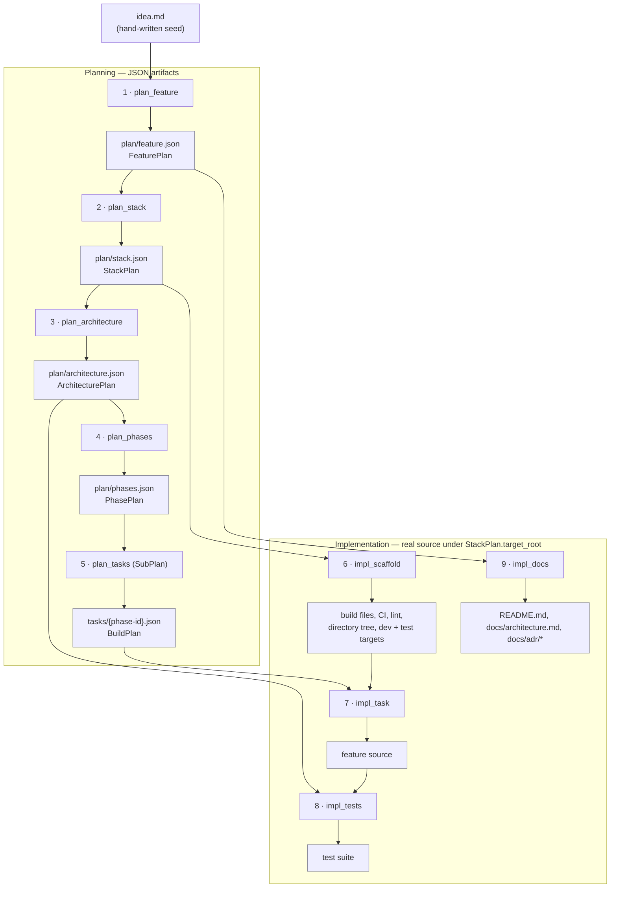
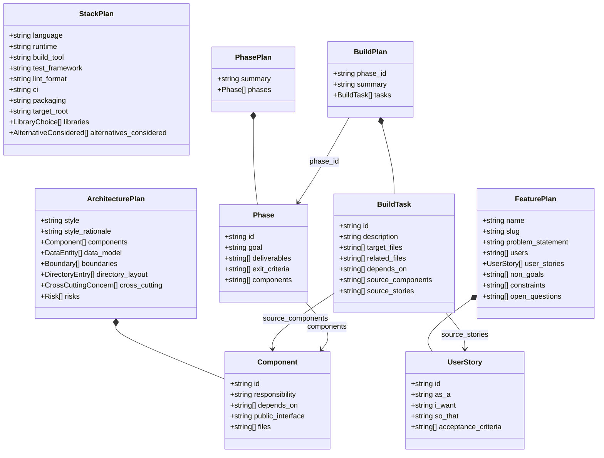
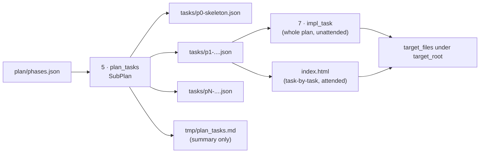
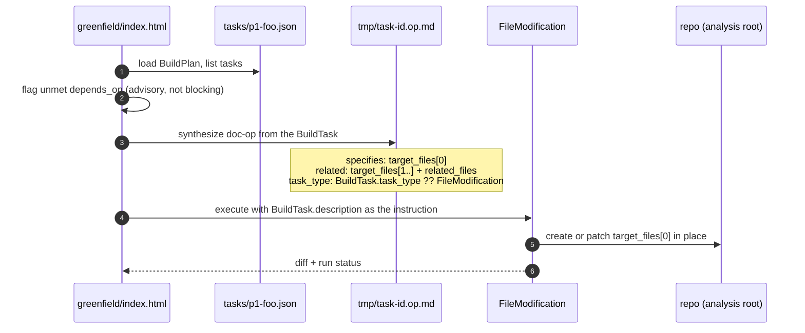

# greenfield/ops — the pipeline

This directory is the **executable definition** of the greenfield pipeline: a chain of doc-ops that take a one-page seed
([`idea.md`](../idea.md)) and turn it into a planned, scaffolded, implemented, tested and documented project.

Two ideas drive the design:

1. **Schema-first.** Every planning stage emits JSON validated against a code-defined schema
    ([`plan_schema.ts`](plan_schema.ts), [`task_schema.ts`](task_schema.ts)) rather than prose. Plans are renderable,
    diffable and *executable*.
2. **One stage, one artifact.** Each [`*.op.md`](.) declares its input → output in front-matter, so stages can be
    re-run individually and the whole thing is restartable at any point.

---

## Layout

`code-utils/greenfield/`

- [`idea.md`](../idea.md) — human input: the seed
- [`index.html`](../index.html) — UI: browses `tasks/**.json`, runs tasks one at a time
- [`ops/`](.)
     - [`plan_schema.ts`](plan_schema.ts) — `FeaturePlan | StackPlan | ArchitecturePlan | PhasePlan` (+ JSON Schemas)
     - [`task_schema.ts`](task_schema.ts) — `BuildTask | BuildPlan` (+ `BUILD_PLAN_JSON_SCHEMA`)
     - [`plan.task.json`](plan.task.json) — `SubPlan` config for the planning fan-out stage
     - [`impl.task.json`](impl.task.json) — `SubPlan` config for the implementation stages
     - [`plan_feature.op.md`](plan_feature.op.md) — 1
     - [`plan_stack.op.md`](plan_stack.op.md) — 2
     - [`plan_architecture.op.md`](plan_architecture.op.md) — 3
     - [`plan_phases.op.md`](plan_phases.op.md) — 4
     - [`plan_tasks.op.md`](plan_tasks.op.md) — 5 (fan-out)
     - [`impl_scaffold.op.md`](impl_scaffold.op.md) — 6
     - [`impl_task.op.md`](impl_task.op.md) — 7
     - [`impl_tests.op.md`](impl_tests.op.md) — 8
     - [`impl_docs.op.md`](impl_docs.op.md) — 9
- `plan/` — generated: feature/stack/architecture/phases JSON
- `tasks/` — generated: one `BuildPlan` per phase
- `tmp/` — generated: run summaries + synthesized per-task doc-ops

---

## The pipeline


Stage 6 ([`impl_scaffold`](impl_scaffold.op.md)) **runs first and alone** in the implementation half: nothing can be
verified until the build runs and the test target passes.

---

## Stage reference

| # | Op file                                             | Transform (paths relative to `ops/`)              | task_type                    | Config                              |
|---|-----------------------------------------------------|---------------------------------------------------|------------------------------|-------------------------------------|
| 1 | [`plan_feature.op.md`](plan_feature.op.md)          | `../idea.md → ../plan/feature.json`               | default (`FileModification`) | —                                   |
| 2 | [`plan_stack.op.md`](plan_stack.op.md)              | `../plan/feature.json → ../plan/stack.json`       | default                      | —                                   |
| 3 | [`plan_architecture.op.md`](plan_architecture.op.md)| `../plan/stack.json → ../plan/architecture.json`  | default                      | —                                   |
| 4 | [`plan_phases.op.md`](plan_phases.op.md)            | `../plan/architecture.json → ../plan/phases.json` | default                      | —                                   |
| 5 | [`plan_tasks.op.md`](plan_tasks.op.md)              | `../plan/phases.json → ../tmp/plan_tasks.md`      | `SubPlan`                    | [`plan.task.json`](plan.task.json)  |
| 6 | [`impl_scaffold.op.md`](impl_scaffold.op.md)        | `../plan/stack.json → ../tmp/scaffold.md`         | `SubPlan`                    | [`impl.task.json`](impl.task.json)  |
| 7 | [`impl_task.op.md`](impl_task.op.md)                | `../tasks/(.*).json → ../tmp/$1.impl.md`          | `SubPlan`                    | [`impl.task.json`](impl.task.json)  |
| 8 | [`impl_tests.op.md`](impl_tests.op.md)              | `../plan/architecture.json → ../tmp/tests.md`     | `SubPlan`                    | [`impl.task.json`](impl.task.json)  |
| 9 | [`impl_docs.op.md`](impl_docs.op.md)                | `../plan/feature.json → ../tmp/docs.md`           | `SubPlan`                    | [`impl.task.json`](impl.task.json)  |

For stages 5–9 the declared output under `tmp/` is only the **run summary**. The real payload is written elsewhere:
`tasks/*.json` for stage 5, source/tests/docs under
`StackPlan.target_root` for stages 6–9.

---

## Anatomy of a doc-op

```md
---
transforms: ../plan/stack.json -> ../plan/architecture.json   # or a list, with regex capture
task_type: SubPlan                                            # omit for plain FileModification
task_config_json: impl.task.json                              # required by SubPlan stages
folder: ../../..                                              # the *analysis root*
related:                                                      # read-only context
    - plan_schema.ts
    - ../plan/feature.json
---

Prose instructions for the stage.
```

Path rules — get these wrong and everything lands in the wrong place:

| Path appears in                                           | Resolved against                                           |
|-----------------------------------------------------------|------------------------------------------------------------|
| `transforms:`, `related:`, `task_config_json:`, `folder:` | the **op file's directory** (`code-utils/greenfield/ops/`) |
| `folder: ../../..`                                        | → the repo root; this is the **analysis root**             |
| `BuildTask.target_files`, `BuildTask.related_files`       | the **analysis root**                                      |
| `StackPlan.target_root`                                   | the **analysis root** (defaults to `"."`)                  |
| `Component.files`, `DirectoryEntry.path`                  | `StackPlan.target_root`                                    |

### `*.task.json` configs

[`plan.task.json`](plan.task.json) and [`impl.task.json`](impl.task.json) are near-identical `SubPlan` configs
(`cognitiveMode: Waterfall`) that differ only in `purpose` and `summaryPrompt`. Both enable exactly one child task
type:

```json
"taskSettings": {
  "FileModification_FileModification": {
    "task_type": "FileModification"
  }
}
```

That is a deliberate blast-radius limit: sub-plans may **only edit files** — no shell execution — so a runaway stage can
be reviewed as a diff.

---

## Artifact contracts



Every arrow is an id reference that must resolve. Consequences for maintainers:

- `Component.id` values are **stable API** — `Phase.components` and
  `BuildTask.source_components` point at them. Renaming a component invalidates downstream plans; re-run stages 4–5
  after doing so.
- `Component.depends_on` must be **acyclic**. If two components need each other, extract a third.
- `acceptance_criteria` are the contract stage 8 writes tests against, so they must be observable ("returns 400 with an
  error body", not "handles errors well").

Both schema files — [`plan_schema.ts`](plan_schema.ts) and [`task_schema.ts`](task_schema.ts) — export draft-07 JSON
Schemas for runtime validation (e.g. with ajv):

```ts
import {
    FEATURE_PLAN_JSON_SCHEMA, STACK_PLAN_JSON_SCHEMA,
    ARCHITECTURE_PLAN_JSON_SCHEMA, PHASE_PLAN_JSON_SCHEMA
} from "./plan_schema";
import {BUILD_PLAN_JSON_SCHEMA} from "./task_schema";
```

All of them are `additionalProperties: false` — an unexpected key is a hard failure, which is how drifted output gets
caught early. [`plan_schema.ts`](plan_schema.ts) and [`task_schema.ts`](task_schema.ts) are intentionally
**self-contained wire formats**: do not import them from [`reviewer/`](../../reviewer), and do not import
[`reviewer/ops/followup_schema.ts`](../../reviewer/ops/followup_schema.ts) here, even though `BuildTask` is largely a
copy of `FollowupTask`.

---

## Fan-out: from one phase plan to many file edits

Stage 5 ([`plan_tasks.op.md`](plan_tasks.op.md)) explodes `plan/phases.json` into one `BuildPlan` per phase; stage 7
([`impl_task.op.md`](impl_task.op.md)) or the UI ([`index.html`](../index.html)) executes the tasks inside it.



The attended path is the normal one; [`impl_task.op.md`](impl_task.op.md) is the unattended fallback for running a
whole phase in one go.



Because the doc-op is *derived* from the task, `target_files[0]` must be the **primary** file — it becomes the
`specifies:` target. Tasks with an empty `target_files` cannot be executed at all (the schema in
[`task_schema.ts`](task_schema.ts) enforces `minItems: 1`).

---

## Running it

Run the stages in numeric order. Each stage reads only committed artifacts, so you can stop, inspect the JSON, hand-edit
it, and continue.

1. Write [`../idea.md`](../idea.md).
2. Stages 1–4 ([1](plan_feature.op.md), [2](plan_stack.op.md), [3](plan_architecture.op.md),
    [4](plan_phases.op.md)): review each JSON before moving on. These are cheap to re-run and expensive to get wrong — a bad
   `ArchitecturePlan` propagates into every task in every phase.
3. Stage 5 ([`plan_tasks.op.md`](plan_tasks.op.md)): check `tasks/*.json` — one file per phase, ids unique within a
    plan, no task touching more than two files.
4. Stage 6 ([`impl_scaffold.op.md`](impl_scaffold.op.md)): verify the build tool actually runs `dev` and `test` before
    continuing. The test target must pass with zero or one trivial test, and there must be **no feature logic** yet.
5. Stage 7 ([`impl_task.op.md`](impl_task.op.md)): execute phase by phase, starting with `p0-skeleton`; run the build
    after each task.
6. Stage 8 ([`impl_tests.op.md`](impl_tests.op.md)): tests only. If a test cannot pass without changing production
    code, the mismatch gets **recorded in the run summary** — production source is not edited to make a test go green.
7. Stage 9 ([`impl_docs.op.md`](impl_docs.op.md)): docs. Every command shown in the README must be one stage 6 really created; a missing section beats an
   invented one.

### Re-running / re-planning

| You changed                         | Re-run                                           |
|-------------------------------------|--------------------------------------------------|
| [`idea.md`](../idea.md)             | 1 → 9 (expect a large diff)                      |
| `plan/feature.json`                 | 2 → 9                                            |
| `plan/stack.json`                   | 3 → 9, and re-check the scaffold                 |
| `plan/architecture.json`            | 4, 5, then 7 for affected phases, then 8         |
| `plan/phases.json`                  | 5, then 7                                        |
| a single `tasks/*.json`             | that task via the [UI](../index.html)            |
| tests are stale after a plan change | 8 wholesale (this is why it is a separate stage) |

Stages are written to **patch, not clobber**: an existing target file is modified in place with unrelated content
preserved. That is what makes re-runs safe.

---

## Invariants the pipeline is supposed to preserve

- **One stack.** No polyglot splits, no monorepos; a rejected language goes into
  `StackPlan.alternatives_considered`, not into a second build file.
- **Non-goals are load-bearing.** Anything the idea does not explicitly require is a non-goal, and a non-goal must never
  reappear as a phase.
- **Phase 0 is always the walking skeleton** (`p0-skeleton`): build runs, one test passes, one end-to-end path works.
  3–7 phases total, each independently demonstrable.
- **Coverage.** Every component appears in at least one phase; every `acceptance_criteria` is traceable to a phase
  `exit_criteria` and to a test named so the criterion is recognisable in the output.
- **Stage ownership.** Stage 6 writes no feature logic; stage 5 emits no test or doc tasks (stages 8 and 9 own those);
  stage 8 does not touch production source.
- **Planning stages emit raw JSON** — no commentary, no markdown fences. Anything else fails schema validation
  downstream.
- `tmp/` is disposable: run summaries and synthesized doc-ops. `plan/` and `tasks/` are the artifacts worth committing
  and reviewing.

---

## Extending the pipeline

To add a stage:

1. Decide its **single output artifact** and whether it is a schema-bound JSON document (extend
    [`plan_schema.ts`](plan_schema.ts) / [`task_schema.ts`](task_schema.ts), including the draft-07 export) or a
    fan-out stage that writes many files and summarises into `tmp/`.
2. Create `ops/<n>_<name>.op.md` with `transforms:`, `folder: ../../..`, and a `related:` list that includes the schema
   file it must conform to.
3. Fan-out stages need `task_type: SubPlan` plus a `task_config_json:`; reuse [`plan.task.json`](plan.task.json) /
    [`impl.task.json`](impl.task.json) unless the `purpose`/`summaryPrompt` genuinely differ.
4. Keep the instruction prose imperative and bounded — state what to produce, the rules, and
   "output valid, parseable JSON only" where applicable.
5. Update the stage table and the flowchart above.

## Troubleshooting

| Symptom                                      | Likely cause                                                                     |
|----------------------------------------------|----------------------------------------------------------------------------------|
| Generated files land outside the project     | `StackPlan.target_root` vs. analysis-root confusion; remember `folder: ../../..` |
| Schema validation fails on an extra key      | every schema ([`plan_schema.ts`](plan_schema.ts), [`task_schema.ts`](task_schema.ts)) is `additionalProperties: false`; the stage invented a field |
| A stage output starts with ```` ```json ```` | planning stages must emit bare JSON, no fences                                   |
| Task cannot be executed from the [UI](../index.html) | `target_files` empty, or the primary file is not first                   |
| `depends_on` cycle                           | components need a third extracted; the graph must be acyclic                     |
| Tests reference symbols that do not exist    | [stage 8](impl_tests.op.md) ran before [stage 7](impl_task.op.md) finished, or ran against a stale plan |
| README documents commands that fail          | [stage 9](impl_docs.op.md) invented them; only commands created by [stage 6](impl_scaffold.op.md) may appear |