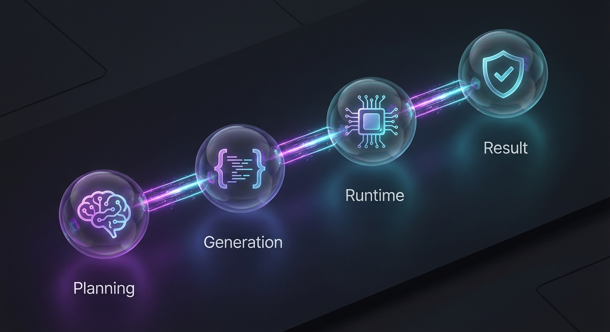

# HTML Generation Transcript

## Creating HTML File: `RunCodeTask.html`

### Step 1: Generating HTML Structure

**Prompt:**
```
You are an expert web developer tasked with creating a complete, self-contained HTML file.

## Requirements:
# User Product Page Guidelines

This document outlines the standards for creating "User Product Pages" for Cognotik tasks. These pages serve as marketing and documentation hybrids, designed to bridge the gap between technical implementation and user understanding.

## 1. Design Philosophy

*   **Aesthetic:** "Future-Professional." Dark mode by default, using deep blues/slates (`#0f172a`, `#1e293b`) with high-contrast neon accents (Cyan, Gold, Purple) specific to the task category.
*   **Typography:** Clean sans-serif (Inter, System UI) for body text; Serif (Cinzel, Merriweather) allowed for narrative/creative tasks.
*   **Interactivity:** The page must feel alive. Static documentation is discouraged. Use hover states, tab switching, and reactive forms.

## 2. Page Structure

Every product page must contain the following sections in order:

### A. Header & Navigation
*   **Logo:** Cognotik Icon + Text.
*   **Links:** Features, Workflow/Specs, Demo.
*   **Style:** Glassmorphism (blur background), fixed position.

### B. Hero Section
*   **Title:** The Task Name (e.g., "Neural Network Layer Designer").
*   **Subtitle:** A compelling one-paragraph summary derived from the `Summary` and `Description` fields in `task_type_docs.md`.
*   **Visual:** A high-quality, abstract 3D illustration representing the task concept (e.g., DNA for genetics, glowing nodes for networks).
    *   *Requirement:* Include the prompt description for this image in an HTML comment at the top of the file.
*   **CTA:** A "Try the Simulator" button that scrolls to the Demo section.

### C. Features Grid
*   **Layout:** 3-column grid.
*   **Content:** Extract 3-6 key points from the "Key features include" list in the task documentation.
*   **Icons:** Use SVG icons (Lucide/Feather style) inside a glowing container.

### D. Interactive Simulator (The Core)
This is the most important section. It mocks the `ExecutionConfigData` input and the Task `Output`.

*   **Layout:** Split screen. Left side = Configuration; Right side = Visualization/Output.
*   **Left Column (Inputs):**
    *   Map the `Execution Configuration` table from the docs to HTML form elements.
    *   *Strings:* Text inputs or Textareas.
    *   *Booleans:* Toggles or Checkboxes.
    *   *Lists/Enums:* Select dropdowns.
    *   *Numbers:* Range sliders with value displays.
*   **Right Column (Outputs):**
    *   Use Tabs to organize the output (e.g., "Overview", "Code", "Logs", "Visuals").
    *   **Code Blocks:** Use syntax highlighting colors for code outputs.
    *   **Visuals:** If the task produces data, use `<canvas>` or CSS-based charts.
    *   **Logs:** If the task is a process (like `SelfHealing`), show a terminal-like log window.
*   **Functionality:** Write vanilla JavaScript to make the inputs update the outputs (or mock the update process with loading states).

### E. Workflow / Process (Optional)
*   If the task involves multiple steps (e.g., `NarrativeGeneration` or `SubPlanning`), visualize the pipeline using a step-stepper or flow diagram.

### F. Use Cases
*   Derive this from the "When to Use" section of the task documentation.
*   Format as cards or a list.

## 3. Content Mapping Guide

Use the `task_type_docs.md` to populate the page content:

| Product Page Element | Source in `task_type_docs.md` |
| :--- | :--- |
| **Hero Title** | Task Name |
| **Hero Tagline** | `Summary` field |
| **Feature Cards** | Bullet points under "Key features include" |
| **Simulator Inputs** | `Execution Configuration` Table |
| **Simulator Output** | `Output` Section (Mock the format described here) |
| **Use Case Section** | "When to Use" Section |

## 4. Technical Implementation Standards

*   **Single File:** The output must be a single `.html` file containing HTML, CSS, and JS.
*   **CSS Variables:** Define a `:root` block for easy theming.
    ```css
    :root {
        --bg-dark: #0f172a;
        --accent-primary: #38bdf8; /* Change per task type */
        --font-sans: system-ui, ...;
    }
    ```
*   **No External Heavy Libs:** Do not require `npm install`. Use CDN links for Fonts (Google Fonts) or Icons (FontAwesome) if necessary, but prefer inline SVGs.
*   **Responsive:** The Simulator must stack vertically on mobile devices.


## Context from Related Files:
# /home/andrew/code/Cognotik/webui/src/main/kotlin/com/simiacryptus/cognotik/plan/tools/RunCodeTask.kt

```
package com.simiacryptus.cognotik.plan.tools

import com.simiacryptus.cognotik.agents.CodeAgent
import com.simiacryptus.cognotik.apps.code.CodingTask
import com.simiacryptus.cognotik.describe.Description
import com.simiacryptus.cognotik.interpreter.CodeRuntime
import com.simiacryptus.cognotik.interpreter.CodeRuntimes
import com.simiacryptus.cognotik.models.ModelSchema
import com.simiacryptus.cognotik.plan.*
import com.simiacryptus.cognotik.platform.model.ApiChatModel
import com.simiacryptus.cognotik.util.LoggerFactory
import com.simiacryptus.cognotik.util.oneAtATime
import com.simiacryptus.cognotik.webui.session.SessionTask
import com.simiacryptus.cognotik.webui.session.getChildClient
import java.io.File
import java.util.concurrent.Semaphore
import java.util.concurrent.atomic.AtomicInteger
import kotlin.reflect.KClass

class RunCodeTask(
    orchestrationConfig: OrchestrationConfig,
    planTask: RunCodeTaskExecutionConfigData?,
) : AbstractTask<RunCodeTask.RunCodeTaskExecutionConfigData, RunCodeTask.RunCodeTaskTypeConfig>(
    orchestrationConfig,
    planTask
) {

    class RunCodeTaskTypeConfig(
        task_type: String = RunCode.name,
        val codeRuntime: CodeRuntimes? = null,
        model: ApiChatModel? = null,
        name: String? = task_type,
    ) : TaskTypeConfig(
        task_type = task_type,
        name = name,
        model = model,
    )

    class RunCodeTaskExecutionConfigData(
        @Description("The task or goal to be accomplished")
        val goal: String? = null,
        @Description("The relative file path of the working directory")
        val workingDir: String? = null,
        task_description: String? = null,
        task_dependencies: List<String>? = null,
        state: TaskState? = null
    ) : TaskExecutionConfig(
        task_type = RunCode.name,
        task_description = task_description,
        task_dependencies = task_dependencies?.toMutableList(),
        state = state
    )

    override fun promptSegment() = """
    RunCode - Use a code interpreter to solve and complete the user's request.
      * Do not directly write code (yet)
      * Include detailed technical requirements for the needed solution
    """.trimIndent()

    override fun run(
        agent: TaskOrchestrator,
        messages: List<String>,
        task: SessionTask,
        resultFn: (String) -> Unit,
        orchestrationConfig: OrchestrationConfig
    ) {
        val autoRunCounter = AtomicInteger(0)
        val transcript = task.transcript()
        val semaphore = Semaphore(0)
        val typeConfig = typeConfig ?: throw RuntimeException()
        val model = (typeConfig.model?.let { orchestrationConfig.instance(it) }
            ?: defaultSmart).getChildClient(task)

//        val taskSettings = this.orchestrationConfig.getTaskSettings(TaskType.RunCodeTask)
        val taskSettings = typeConfig as? RunCodeTaskTypeConfig
        val runtime =
            taskSettings?.codeRuntime ?: CodeRuntimes.GroovyRuntime // Kotlin has issues running within IntelliJ
        val defs = mapOf(
            "env" to (orchestrationConfig.env ?: emptyMap()),
            "workingDir" to (
                    orchestrationConfig.absoluteWorkingDir?.let { File(it).absolutePath }
                        ?: orchestrationConfig.absoluteWorkingDir?.let { File(it).absolutePath }
                        ?: File(".").absolutePath
                    ),
        )
        val codeRuntime = CodeRuntimes.getRuntime(runtime, defs)

        val codingAgent = object : CodingTask<CodeRuntime>(
            dataStorage = agent.dataStorage,
            session = agent.session,
            user = agent.user,
            ui = task.ui,
            interpreter = codeRuntime::class as KClass<CodeRuntime>,
            symbols = mapOf<String, Any>(
                "env" to (orchestrationConfig.env ?: emptyMap()),
                "workingDir" to (
                        orchestrationConfig.absoluteWorkingDir?.let { File(it).absolutePath }
                            ?: orchestrationConfig.absoluteWorkingDir?.let { File(it).absolutePath }
                            ?: File(".").absolutePath
                        ),
                "language" to runtime.name.lowercase().replace("runtime", ""),
            ),
            temperature = orchestrationConfig.temperature,
            details = """
                Code a solution using ${runtime.name} to the user's request.
            """.trimIndent(),
            model = model,
            mainTask = task,
            retryable = false,
        ) {
            override fun displayFeedback(
                task: SessionTask,
                request: CodeAgent.CodeRequest,
                response: CodeAgent.CodeResult
            ) {
                val formText = StringBuilder()
                transcript?.write(
                    "## Code Request\n```${
                        runtime.name.lowercase().replace("runtime", "")
                    }\n${request.messages}\n```\n\n".toByteArray()
                )
                transcript?.write("## Execution Result\n".toByteArray())
                transcript?.write("**Result Value:**\n```\n${response.result.resultValue}\n```\n\n".toByteArray())
                transcript?.write("**Output:**\n```\n${response.result.resultOutput}\n```\n\n".toByteArray())
                var formHandle: StringBuilder? = null
                if (!orchestrationConfig.autoFix) formHandle = task.add(
                    "<div>\n${
                        if (!super.canPlay) "" else super.playButton(task, request, response, formText) { formHandle!! }
                    }\n${
                        ui.hrefLink("Continue", "href-link play-button") {
                            response.let {
                                transcript?.write("## User Action: Continue\n\n".toByteArray())
                                "## Command\n\n$TRIPLE_TILDE\n${response.code}\n$TRIPLE_TILDE\n## Output\n$TRIPLE_TILDE\n${response.result.resultValue}\n$TRIPLE_TILDE\n"
                            }.apply { resultFn(this) }
                            semaphore.release()
                        }
                    }\n</div>\n${
                        super.ui.textInput(oneAtATime { feedback: String ->
                            super.responseAction(task, "Revising...", formHandle!!, formText) {
                                transcript?.write("## User Feedback\n$feedback\n\n".toByteArray())
                                super.feedback(task, feedback, request, response)
                            }
                        })
                    }", additionalClasses = "reply-message"
                ) else if (autoRunCounter.incrementAndGet() <= 1) {
                    responseAction(task, "Running...", formHandle, formText) {
                        execute(task, response, request)
                    }
                }
                formText.append(formHandle.toString())
                formHandle.toString()
                task.complete()
            }

            override fun execute(
                task: SessionTask,
                response: CodeAgent.CodeResult
            ): String {
                val result = super.execute(task, response)
                if (orchestrationConfig.autoFix) {
                    transcript?.write("## Auto-fix Execution\n\n".toByteArray())
                    response.let {
                        "## Command\n\n$TRIPLE_TILDE\n${response.code}\n$TRIPLE_TILDE\n## Result\n$TRIPLE_TILDE\n${response.result.resultValue}\n$TRIPLE_TILDE\n## Output\n$TRIPLE_TILDE\n${response.result.resultOutput}\n$TRIPLE_TILDE\n"
                    }.apply { resultFn(this) }
                    semaphore.release()
                }
                return result
            }
        }
        codingAgent.start(
            codingAgent.codeRequest(
                messages.map { it to ModelSchema.Role.user } + listOf(
                    (this.executionConfig?.goal ?: "") to ModelSchema.Role.user,
                )
            )
        )
        try {
            semaphore.acquire()
        } catch (e: Throwable) {
            transcript?.write("## Error\n```\n${e.message}\n${e.stackTraceToString()}\n```\n\n".toByteArray())
            log.warn("Error", e)
        } finally {
            transcript?.write("\n## Task Completed\n".toByteArray())
            transcript?.close()
        }
    }

    companion object {
        private val log = LoggerFactory.getLogger(RunCodeTask::class.java)
        val RunCode = TaskType(
            "RunCode",
            "Execution & Automation",
            RunCodeTaskExecutionConfigData::class.java,
            RunCodeTaskTypeConfig::class.java,
            "Execute code snippets safely",
            """
          Executes code snippets in a controlled environment.
          <ul>
            <li>Safe code execution handling</li>
            <li>Working directory configuration</li>
            <li>Output capture and formatting</li>
            <li>Error handling and reporting</li>
            <li>Interactive result review</li>
          </ul>
        """
        )

    }
}
```

## Previous Task Results:


## Instructions:
1. Create a complete HTML5 document structure with proper semantic elements
2. Include appropriate meta tags (viewport, charset, etc.)
3. Add class names to elements that will need styling or JavaScript interaction
4. Use descriptive, semantic class names (e.g., "nav-menu", "hero-section", "card-container")
5. Include placeholder comments for where CSS and JavaScript will be added
6. Do NOT include any CSS or JavaScript yet - just the HTML structure with classes
7. Add comments to explain the purpose of major sections

## Output Format:
Provide the HTML structure within a code block:
```html
<!DOCTYPE html>
<html>
<head>
    <!-- CSS will be added here -->
</head>
<body>
    <!-- HTML structure with classes -->
</body>
<!-- JavaScript will be added here -->
</html>
```
```

**Response:**
```html
<!DOCTYPE html>
<html lang="en">
<head>
    <meta charset="UTF-8">
    <meta name="viewport" content="width=device-width, initial-scale=1.0">
    <meta name="description" content="Cognotik RunCode Task - Secure code execution and automation environment.">
    <title>Cognotik | RunCode Task</title>

    <!-- Fonts: Inter for UI, JetBrains Mono for Code, Cinzel for Headers -->
    <link rel="preconnect" href="https://fonts.googleapis.com">
    <link rel="preconnect" href="https://fonts.gstatic.com" crossorigin>
    <link href="https://fonts.googleapis.com/css2?family=Cinzel:wght@400;700&family=Inter:wght@300;400;600;800&family=JetBrains+Mono:wght@400;700&display=swap" rel="stylesheet">
    
    <!-- Icons: FontAwesome CDN for UI icons -->
    <link rel="stylesheet" href="https://cdnjs.cloudflare.com/ajax/libs/font-awesome/6.4.0/css/all.min.css">

    <style>
        /* 
           CSS Variables and Styles will be injected here.
           Planned Variables:
           :root {
               --bg-dark: #0f172a;
               --bg-card: #1e293b;
               --accent-primary: #38bdf8; (Cyan)
               --accent-secondary: #fbbf24; (Gold)
               --text-main: #f8fafc;
               --text-muted: #94a3b8;
               --font-sans: 'Inter', sans-serif;
               --font-mono: 'JetBrains Mono', monospace;
               --font-serif: 'Cinzel', serif;
           }
        */
    </style>
</head>
<body>

    <!-- 
      IMAGE PROMPT FOR HERO SECTION:
      "Abstract 3D illustration of a glowing digital terminal interface, floating code syntax fragments in neon cyan and gold, dark slate background, glassmorphism style, high-tech automation concept."
    -->

    <!-- A. Header & Navigation -->
    <header class="glass-nav">
        <div class="nav-container">
            <div class="logo-wrapper">
                <i class="fa-solid fa-brain logo-icon"></i>
                <span class="logo-text">Cognotik</span>
            </div>
            <nav class="nav-menu">
                <a href="#features" class="nav-link">Features</a>
                <a href="#workflow" class="nav-link">Workflow</a>
                <a href="#simulator" class="nav-link cta-link">Try Simulator</a>
            </nav>
        </div>
    </header>

    <main>
        <!-- B. Hero Section -->
        <section class="hero-section">
            <div class="hero-content">
                <div class="hero-text-wrapper">
                    <h1 class="hero-title">RunCode Task</h1>
                    <p class="hero-subtitle">
                        Executes code snippets in a controlled environment. Securely handle automation, configure working directories, and capture detailed execution outputs with interactive review.
                    </p>
                    <div class="hero-actions">
                        <a href="#simulator" class="btn btn-primary">Try the Simulator <i class="fa-solid fa-arrow-right"></i></a>
                        <a href="#docs" class="btn btn-secondary">View Documentation</a>
                    </div>
                </div>
                <div class="hero-visual">
                    <!-- Placeholder for 3D Illustration -->
                    <div class="visual-placeholder">
                        <i class="fa-solid fa-terminal visual-icon"></i>
                        <div class="glow-effect"></div>
                    </div>
                </div>
            </div>
        </section>

        <!-- C. Features Grid -->
        <section id="features" class="features-section">
            <div class="section-header">
                <h2>Core Capabilities</h2>
                <div class="divider"></div>
            </div>
            <div class="features-grid">
                <!-- Feature 1 -->
                <div class="feature-card">
                    <div class="icon-container">
                        <i class="fa-solid fa-shield-halved"></i>
                    </div>
                    <h3>Safe Execution</h3>
                    <p>Executes code snippets in a controlled, sandboxed environment to ensure system integrity.</p>
                </div>
                <!-- Feature 2 -->
                <div class="feature-card">
                    <div class="icon-container">
                        <i class="fa-solid fa-folder-tree"></i>
                    </div>
                    <h3>Directory Config</h3>
                    <p>Full control over the working directory path for file system operations and context.</p>
                </div>
                <!-- Feature 3 -->
                <div class="feature-card">
                    <div class="icon-container">
                        <i class="fa-solid fa-file-code"></i>
                    </div>
                    <h3>Output Capture</h3>
                    <p>Comprehensive capture of standard output, return values, and error streams for analysis.</p>
                </div>
                <!-- Feature 4 -->
                <div class="feature-card">
                    <div class="icon-container">
                        <i class="fa-solid fa-bug-slash"></i>
                    </div>
                    <h3>Error Handling</h3>
                    <p>Robust error reporting and stack trace analysis to facilitate debugging and auto-fixing.</p>
                </div>
                <!-- Feature 5 -->
                <div class="feature-card">
                    <div class="icon-container">
                        <i class="fa-solid fa-rotate"></i>
                    </div>
                    <h3>Interactive Review</h3>
                    <p>Human-in-the-loop capability to review code before execution and modify logic on the fly.</p>
                </div>
                <!-- Feature 6 -->
                <div class="feature-card">
                    <div class="icon-container">
                        <i class="fa-solid fa-wand-magic-sparkles"></i>
                    </div>
                    <h3>Auto-Fix</h3>
                    <p>Optional automated correction of code based on execution errors or feedback.</p>
                </div>
            </div>
        </section>

        <!-- D. Interactive Simulator -->
        <section id="simulator" class="simulator-section">
            <div class="section-header">
                <h2>Task Simulator</h2>
                <p>Configure the execution parameters and visualize the runtime output.</p>
            </div>
            
            <div class="simulator-container">
                <!-- Left Column: Inputs (ExecutionConfigData) -->
                <div class="sim-column sim-inputs">
                    <div class="panel-header">
                        <i class="fa-solid fa-sliders"></i> Configuration
                    </div>
                    <form id="runcode-form" class="sim-form">
                        
                        <!-- Input: Goal -->
                        <div class="form-group">
                            <label for="input-goal">Goal / Instruction</label>
                            <textarea id="input-goal" rows="4" placeholder="E.g., Calculate the Fibonacci sequence up to 100 and save it to a file."></textarea>
                            <span class="help-text">The task or goal to be accomplished by the code.</span>
                        </div>

                        <!-- Input: Working Directory -->
                        <div class="form-group">
                            <label for="input-working-dir">Working Directory</label>
                            <div class="input-wrapper">
                                <i class="fa-solid fa-folder input-icon"></i>
                                <input type="text" id="input-working-dir" value="./workspace" placeholder="./">
                            </div>
                            <span class="help-text">Relative file path for execution context.</span>
                        </div>

                        <!-- Input: Dependencies (List) -->
                        <div class="form-group">
                            <label for="input-dependencies">Dependencies</label>
                            <input type="text" id="input-dependencies" placeholder="E.g., task_init, data_load">
                            <span class="help-text">Comma-separated list of task IDs this execution depends on.</span>
                        </div>

                        <!-- Input: Auto-Fix Toggle (Derived from OrchestrationConfig logic) -->
                        <div class="form-group toggle-group">
                            <label for="input-autofix">Enable Auto-Fix</label>
                            <label class="switch">
                                <input type="checkbox" id="input-autofix">
                                <span class="slider round"></span>
                            </label>
                        </div>

                        <button type="submit" id="btn-execute" class="btn btn-primary btn-full">
                            <i class="fa-solid fa-play"></i> Generate & Run
                        </button>
                    </form>
                </div>

                <!-- Right Column: Outputs -->
                <div class="sim-column sim-outputs">
                    <!-- Output Tabs -->
                    <div class="tabs-nav">
                        <button class="tab-btn active" data-tab="tab-code">Generated Code</button>
                        <button class="tab-btn" data-tab="tab-console">Console Output</button>
                        <button class="tab-btn" data-tab="tab-result">Result Value</button>
                    </div>

                    <!-- Tab Content: Code -->
                    <div id="tab-code" class="tab-content active">
                        <div class="code-window">
                            <div class="window-bar">
                                <span class="dot red"></span><span class="dot yellow"></span><span class="dot green"></span>
                                <span class="lang-badge">Kotlin/Groovy</span>
                            </div>
                            <pre><code id="code-display" class="language-kotlin">// Code generated by the agent will appear here...
// Waiting for input...</code></pre>
                        </div>
                    </div>

                    <!-- Tab Content: Console Logs -->
                    <div id="tab-console" class="tab-content">
                        <div class="terminal-window">
                            <div id="console-output" class="terminal-text">
                                <span class="term-line text-muted">> System ready.</span>
                                <span class="term-line text-muted">> Waiting for execution command...</span>
                            </div>
                        </div>
                    </div>

                    <!-- Tab Content: Result Value -->
                    <div id="tab-result" class="tab-content">
                        <div class="result-card">
                            <h4>Execution Result</h4>
                            <div id="result-value" class="result-box">
                                -- No result yet --
                            </div>
                        </div>
                    </div>
                </div>
            </div>
        </section>

        <!-- E. Workflow / Process -->
        <section id="workflow" class="workflow-section">
            <div class="section-header">
                <h2>Execution Pipeline</h2>
            </div>
            <div class="workflow-steps">
                <!-- Step 1 -->
                <div class="step-item">
                    <div class="step-number">01</div>
                    <div class="step-content">
                        <h4>Plan & Prompt</h4>
                        <p>The system analyzes the user goal and constructs a prompt for the coding agent.</p>
                    </div>
                </div>
                <!-- Connector -->
                <div class="step-connector"></div>
                <!-- Step 2 -->
                <div class="step-item">
                    <div class="step-number">02</div>
                    <div class="step-content">
                        <h4>Code Generation</h4>
                        <p>The LLM generates the necessary code (Kotlin/Groovy) to solve the problem.</p>
                    </div>
                </div>
                <!-- Connector -->
                <div class="step-connector"></div>
                <!-- Step 3 -->
                <div class="step-item">
                    <div class="step-number">03</div>
                    <div class="step-content">
                        <h4>Runtime Execution</h4>
                        <p>Code is executed in the configured runtime environment with access to the working directory.</p>
                    </div>
                </div>
                <!-- Connector -->
                <div class="step-connector"></div>
                <!-- Step 4 -->
                <div class="step-item">
                    <div class="step-number">04</div>
                    <div class="step-content">
                        <h4>Result & Feedback</h4>
                        <p>Output is captured. If errors occur, the Auto-Fix loop attempts to resolve them.</p>
                    </div>
                </div>
            </div>
        </section>

        <!-- F. Use Cases -->
        <section class="use-cases-section">
            <div class="section-header">
                <h2>When to Use</h2>
            </div>
            <div class="use-case-grid">
                <div class="use-case-card">
                    <h3>Data Processing</h3>
                    <p>Perfect for on-the-fly manipulation of datasets, file parsing, and format conversion tasks.</p>
                </div>
                <div class="use-case-card">
                    <h3>System Automation</h3>
                    <p>Automate repetitive file system operations, backups, or environment setup scripts.</p>
                </div>
                <div class="use-case-card">
                    <h3>Math & Logic</h3>
                    <p>Solve complex algorithmic problems that require computational accuracy beyond standard LLM capabilities.</p>
                </div>
            </div>
        </section>

    </main>

    <!-- Footer -->
    <footer>
        <div class="footer-content">
            <div class="footer-brand">
                <i class="fa-solid fa-brain"></i> Cognotik
            </div>
            <div class="footer-links">
                <a href="#">Documentation</a>
                <a href="#">API Reference</a>
                <a href="#">Support</a>
            </div>
            <div class="footer-copyright">
                &copy; 2023 Simiacryptus. All rights reserved.
            </div>
        </div>
    </footer>

    <!-- JavaScript will be added here -->
    <script>
        /* 
           Interactive logic for the simulator, tabs, and animations 
           will be implemented here.
        */
    </script>
</body>
</html>
```

### Step 1.5: Generating Images

**Prompt:**
```
Based on the following HTML page description and structure, identify 3 key images that should be generated.
## Page Description:
# User Product Page Guidelines

This document outlines the standards for creating "User Product Pages" for Cognotik tasks. These pages serve as marketing and documentation hybrids, designed to bridge the gap between technical implementation and user understanding.

## 1. Design Philosophy

*   **Aesthetic:** "Future-Professional." Dark mode by default, using deep blues/slates (`#0f172a`, `#1e293b`) with high-contrast neon accents (Cyan, Gold, Purple) specific to the task category.
*   **Typography:** Clean sans-serif (Inter, System UI) for body text; Serif (Cinzel, Merriweather) allowed for narrative/creative tasks.
*   **Interactivity:** The page must feel alive. Static documentation is discouraged. Use hover states, tab switching, and reactive forms.

## 2. Page Structure

Every product page must contain the following sections in order:

### A. Header & Navigation
*   **Logo:** Cognotik Icon + Text.
*   **Links:** Features, Workflow/Specs, Demo.
*   **Style:** Glassmorphism (blur background), fixed position.

### B. Hero Section
*   **Title:** The Task Name (e.g., "Neural Network Layer Designer").
*   **Subtitle:** A compelling one-paragraph summary derived from the `Summary` and `Description` fields in `task_type_docs.md`.
*   **Visual:** A high-quality, abstract 3D illustration representing the task concept (e.g., DNA for genetics, glowing nodes for networks).
    *   *Requirement:* Include the prompt description for this image in an HTML comment at the top of the file.
*   **CTA:** A "Try the Simulator" button that scrolls to the Demo section.

### C. Features Grid
*   **Layout:** 3-column grid.
*   **Content:** Extract 3-6 key points from the "Key features include" list in the task documentation.
*   **Icons:** Use SVG icons (Lucide/Feather style) inside a glowing container.

### D. Interactive Simulator (The Core)
This is the most important section. It mocks the `ExecutionConfigData` input and the Task `Output`.

*   **Layout:** Split screen. Left side = Configuration; Right side = Visualization/Output.
*   **Left Column (Inputs):**
    *   Map the `Execution Configuration` table from the docs to HTML form elements.
    *   *Strings:* Text inputs or Textareas.
    *   *Booleans:* Toggles or Checkboxes.
    *   *Lists/Enums:* Select dropdowns.
    *   *Numbers:* Range sliders with value displays.
*   **Right Column (Outputs):**
    *   Use Tabs to organize the output (e.g., "Overview", "Code", "Logs", "Visuals").
    *   **Code Blocks:** Use syntax highlighting colors for code outputs.
    *   **Visuals:** If the task produces data, use `<canvas>` or CSS-based charts.
    *   **Logs:** If the task is a process (like `SelfHealing`), show a terminal-like log window.
*   **Functionality:** Write vanilla JavaScript to make the inputs update the outputs (or mock the update process with loading states).

### E. Workflow / Process (Optional)
*   If the task involves multiple steps (e.g., `NarrativeGeneration` or `SubPlanning`), visualize the pipeline using a step-stepper or flow diagram.

### F. Use Cases
*   Derive this from the "When to Use" section of the task documentation.
*   Format as cards or a list.

## 3. Content Mapping Guide

Use the `task_type_docs.md` to populate the page content:

| Product Page Element | Source in `task_type_docs.md` |
| :--- | :--- |
| **Hero Title** | Task Name |
| **Hero Tagline** | `Summary` field |
| **Feature Cards** | Bullet points under "Key features include" |
| **Simulator Inputs** | `Execution Configuration` Table |
| **Simulator Output** | `Output` Section (Mock the format described here) |
| **Use Case Section** | "When to Use" Section |

## 4. Technical Implementation Standards

*   **Single File:** The output must be a single `.html` file containing HTML, CSS, and JS.
*   **CSS Variables:** Define a `:root` block for easy theming.
    ```css
    :root {
        --bg-dark: #0f172a;
        --accent-primary: #38bdf8; /* Change per task type */
        --font-sans: system-ui, ...;
    }
    ```
*   **No External Heavy Libs:** Do not require `npm install`. Use CDN links for Fonts (Google Fonts) or Icons (FontAwesome) if necessary, but prefer inline SVGs.
*   **Responsive:** The Simulator must stack vertically on mobile devices.

## HTML Structure:
```html
<!DOCTYPE html>
<html lang="en">
<head>
    <meta charset="UTF-8">
    <meta name="viewport" content="width=device-width, initial-scale=1.0">
    <meta name="description" content="Cognotik RunCode Task - Secure code execution and automation environment.">
    <title>Cognotik | RunCode Task</title>

    <!-- Fonts: Inter for UI, JetBrains Mono for Code, Cinzel for Headers -->
    <link rel="preconnect" href="https://fonts.googleapis.com">
    <link rel="preconnect" href="https://fonts.gstatic.com" crossorigin>
    <link href="https://fonts.googleapis.com/css2?family=Cinzel:wght@400;700&family=Inter:wght@300;400;600;800&family=JetBrains+Mono:wght@400;700&display=swap" rel="stylesheet">
    
    <!-- Icons: FontAwesome CDN for UI icons -->
    <link rel="stylesheet" href="https://cdnjs.cloudflare.com/ajax/libs/font-awesome/6.4.0/css/all.min.css">

    <style>
        /* 
           CSS Variables and Styles will be injected here.
           Planned Variables:
           :root {
               --bg-dark: #0f172a;
               --bg-card: #1e293b;
               --accent-primary: #38bdf8; (Cyan)
               --accent-secondary: #fbbf24; (Gold)
               --text-main: #f8fafc;
               --text-muted: #94a3b8;
               --font-sans: 'Inter', sans-serif;
               --font-mono: 'JetBrains Mono', monospace;
               --font-serif: 'Cinzel', serif;
           }
        */
    </style>
</head>
<body>

    <!-- 
      IMAGE PROMPT FOR HERO SECTION:
      "Abstract 3D illustration of a glowing digital terminal interface, floating code syntax fragments in neon cyan and gold, dark slate background, glassmorphism style, high-tech automation concept."
    -->

    <!-- A. Header & Navigation -->
    <header class="glass-nav">
        <div class="nav-container">
            <div class="logo-wrapper">
                <i class="fa-solid fa-brain logo-icon"></i>
                <span class="logo-text">Cognotik</span>
            </div>
            <nav class="nav-menu">
                <a href="#features" class="nav-link">Features</a>
                <a href="#workflow" class="nav-link">Workflow</a>
                <a href="#simulator" class="nav-link cta-link">Try Simulator</a>
            </nav>
        </div>
    </header>

    <main>
        <!-- B. Hero Section -->
        <section class="hero-section">
            <div class="hero-content">
                <div class="hero-text-wrapper">
                    <h1 class="hero-title">RunCode Task</h1>
                    <p class="hero-subtitle">
                        Executes code snippets in a controlled environment. Securely handle automation, configure working directories, and capture detailed execution outputs with interactive review.
                    </p>
                    <div class="hero-actions">
                        <a href="#simulator" class="btn btn-primary">Try the Simulator <i class="fa-solid fa-arrow-right"></i></a>
                        <a href="#docs" class="btn btn-secondary">View Documentation</a>
                    </div>
                </div>
                <div class="hero-visual">
                    <!-- Placeholder for 3D Illustration -->
                    <div class="visual-placeholder">
                        <i class="fa-solid fa-terminal visual-icon"></i>
                        <div class="glow-effect"></div>
                    </div>
                </div>
            </div>
        </section>

        <!-- C. Features Grid -->
        <section id="features" class="features-section">
            <div class="section-header">
                <h2>Core Capabilities</h2>
                <div class="divider"></div>
            </div>
            <div class="features-grid">
                <!-- Feature 1 -->
                <div class="feature-card">
                    <div class="icon-container">
                        <i class="fa-solid fa-shield-halved"></i>
                    </div>
                    <h3>Safe Execution</h3>
                    <p>Executes code snippets in a controlled, sandboxed environment to ensure system integrity.</p>
                </div>
                <!-- Feature 2 -->
                <div class="feature-card">
                    <div class="icon-container">
                        <i class="fa-solid fa-folder-tree"></i>
                    </div>
                    <h3>Directory Config</h3>
                    <p>Full control over the working directory path for file system operations and context.</p>
                </div>
                <!-- Feature 3 -->
                <div class="feature-card">
                    <div class="icon-container">
                        <i class="fa-solid fa-file-code"></i>
                    </div>
                    <h3>Output Capture</h3>
                    <p>Comprehensive capture of standard output, return values, and error streams for analysis.</p>
                </div>
                <!-- Feature 4 -->
                <div class="feature-card">
                    <div class="icon-container">
                        <i class="fa-solid fa-bug-slash"></i>
                    </div>
                    <h3>Error Handling</h3>
                    <p>Robust error reporting and stack trace analysis to facilitate debugging and auto-fixing.</p>
                </div>
                <!-- Feature 5 -->
                <div class="feature-card">
                    <div class="icon-container">
                        <i class="fa-solid fa-rotate"></i>
                    </div>
                    <h3>Interactive Review</h3>
                    <p>Human-in-the-loop capability to review code before execution and modify logic on the fly.</p>
                </div>
                <!-- Feature 6 -->
                <div class="feature-card">
                    <div class="icon-container">
                        <i class="fa-solid fa-wand-magic-sparkles"></i>
                    </div>
                    <h3>Auto-Fix</h3>
                    <p>Optional automated correction of code based on execution errors or feedback.</p>
                </div>
            </div>
        </section>

        <!-- D. Interactive Simulator -->
        <section id="simulator" class="simulator-section">
            <div class="section-header">
                <h2>Task Simulator</h2>
                <p>Configure the execution parameters and visualize the runtime output.</p>
            </div>
            
            <div class="simulator-container">
                <!-- Left Column: Inputs (ExecutionConfigData) -->
                <div class="sim-column sim-inputs">
                    <div class="panel-header">
                        <i class="fa-solid fa-sliders"></i> Configuration
                    </div>
                    <form id="runcode-form" class="sim-form">
                        
                        <!-- Input: Goal -->
                        <div class="form-group">
                            <label for="input-goal">Goal / Instruction</label>
                            <textarea id="input-goal" rows="4" placeholder="E.g., Calculate the Fibonacci sequence up to 100 and save it to a file."></textarea>
                            <span class="help-text">The task or goal to be accomplished by the code.</span>
                        </div>

                        <!-- Input: Working Directory -->
                        <div class="form-group">
                            <label for="input-working-dir">Working Directory</label>
                            <div class="input-wrapper">
                                <i class="fa-solid fa-folder input-icon"></i>
                                <input type="text" id="input-working-dir" value="./workspace" placeholder="./">
                            </div>
                            <span class="help-text">Relative file path for execution context.</span>
                        </div>

                        <!-- Input: Dependencies (List) -->
                        <div class="form-group">
                            <label for="input-dependencies">Dependencies</label>
                            <input type="text" id="input-dependencies" placeholder="E.g., task_init, data_load">
                            <span class="help-text">Comma-separated list of task IDs this execution depends on.</span>
                        </div>

                        <!-- Input: Auto-Fix Toggle (Derived from OrchestrationConfig logic) -->
                        <div class="form-group toggle-group">
                            <label for="input-autofix">Enable Auto-Fix</label>
                            <label class="switch">
                                <input type="checkbox" id="input-autofix">
                                <span class="slider round"></span>
                            </label>
                        </div>

                        <button type="submit" id="btn-execute" class="btn btn-primary btn-full">
                            <i class="fa-solid fa-play"></i> Generate & Run
                        </button>
                    </form>
                </div>

                <!-- Right Column: Outputs -->
                <div class="sim-column sim-outputs">
                    <!-- Output Tabs -->
                    <div class="tabs-nav">
                        <button class="tab-btn active" data-tab="tab-code">Generated Code</button>
                        <button class="tab-btn" data-tab="tab-console">Console Output</button>
                        <button class="tab-btn" data-tab="tab-result">Result Value</button>
                    </div>

                    <!-- Tab Content: Code -->
                    <div id="tab-code" class="tab-content active">
                        <div class="code-window">
                            <div class="window-bar">
                                <span class="dot red"></span><span class="dot yellow"></span><span class="dot green"></span>
                                <span class="lang-badge">Kotlin/Groovy</span>
                            </div>
                            <pre><code id="code-display" class="language-kotlin">// Code generated by the agent will appear here...
// Waiting for input...</code></pre>
                        </div>
                    </div>

                    <!-- Tab Content: Console Logs -->
                    <div id="tab-console" class="tab-content">
                        <div class="terminal-window">
                            <div id="console-output" class="terminal-text">
                                <span class="term-line text-muted">> System ready.</span>
                                <span class="term-line text-muted">> Waiting for execution command...</span>
                            </div>
                        </div>
                    </div>

                    <!-- Tab Content: Result Value -->
                    <div id="tab-result" class="tab-content">
                        <div class="result-card">
                            <h4>Execution Result</h4>
                            <div id="result-value" class="result-box">
                                -- No result yet --
                            </div>
                        </div>
                    </div>
                </div>
            </div>
        </section>

        <!-- E. Workflow / Process -->
        <section id="workflow" class="workflow-section">
            <div class="section-header">
                <h2>Execution Pipeline</h2>
            </div>
            <div class="workflow-steps">
                <!-- Step 1 -->
                <div class="step-item">
                    <div class="step-number">01</div>
                    <div class="step-content">
                        <h4>Plan & Prompt</h4>
                        <p>The system analyzes the user goal and constructs a prompt for the coding agent.</p>
                    </div>
                </div>
                <!-- Connector -->
                <div class="step-connector"></div>
                <!-- Step 2 -->
                <div class="step-item">
                    <div class="step-number">02</div>
                    <div class="step-content">
                        <h4>Code Generation</h4>
                        <p>The LLM generates the necessary code (Kotlin/Groovy) to solve the problem.</p>
                    </div>
                </div>
                <!-- Connector -->
                <div class="step-connector"></div>
                <!-- Step 3 -->
                <div class="step-item">
                    <div class="step-number">03</div>
                    <div class="step-content">
                        <h4>Runtime Execution</h4>
                        <p>Code is executed in the configured runtime environment with access to the working directory.</p>
                    </div>
                </div>
                <!-- Connector -->
                <div class="step-connector"></div>
                <!-- Step 4 -->
                <div class="step-item">
                    <div class="step-number">04</div>
                    <div class="step-content">
                        <h4>Result & Feedback</h4>
                        <p>Output is captured. If errors occur, the Auto-Fix loop attempts to resolve them.</p>
                    </div>
                </div>
            </div>
        </section>

        <!-- F. Use Cases -->
        <section class="use-cases-section">
            <div class="section-header">
                <h2>When to Use</h2>
            </div>
            <div class="use-case-grid">
                <div class="use-case-card">
                    <h3>Data Processing</h3>
                    <p>Perfect for on-the-fly manipulation of datasets, file parsing, and format conversion tasks.</p>
                </div>
                <div class="use-case-card">
                    <h3>System Automation</h3>
                    <p>Automate repetitive file system operations, backups, or environment setup scripts.</p>
                </div>
                <div class="use-case-card">
                    <h3>Math & Logic</h3>
                    <p>Solve complex algorithmic problems that require computational accuracy beyond standard LLM capabilities.</p>
                </div>
            </div>
        </section>

    </main>

    <!-- Footer -->
    <footer>
        <div class="footer-content">
            <div class="footer-brand">
                <i class="fa-solid fa-brain"></i> Cognotik
            </div>
            <div class="footer-links">
                <a href="#">Documentation</a>
                <a href="#">API Reference</a>
                <a href="#">Support</a>
            </div>
            <div class="footer-copyright">
                &copy; 2023 Simiacryptus. All rights reserved.
            </div>
        </div>
    </footer>

    <!-- JavaScript will be added here -->
    <script>
        /* 
           Interactive logic for the simulator, tabs, and animations 
           will be implemented here.
        */
    </script>
</body>
</html>
```
For each image, provide:
1. A descriptive filename ending in .png (e.g., "hero-banner.png", "product-showcase.png")
2. A detailed visual description for image generation (be specific about style, colors, composition)

Note: All images will be generated as PNG files by an AI image model.

Format your response as:
IMAGE: filename.png
DESCRIPTION: detailed visual description
IMAGE: another-image.png
DESCRIPTION: another detailed description
```

**Response:**
IMAGE: runcode-hero-terminal.png
DESCRIPTION: Abstract 3D illustration of a futuristic command center interface. A central, glowing holographic terminal window floats in a deep slate void (#0f172a). Surrounding the terminal are floating fragments of code syntax and mathematical symbols in neon cyan (#38bdf8) and amber gold (#fbbf24). The style is glassmorphism with soft blurs and high-contrast lighting, representing high-tech automation and secure execution.

IMAGE: execution-pipeline-flow.png
DESCRIPTION: A sleek, isometric 3D visualization of a four-step digital workflow pipeline. From left to right, four glass spheres connected by laser-like data streams. The first sphere contains a glowing brain icon (Planning), the second code brackets (Generation), the third a stylized processor chip (Runtime), and the fourth a shield checkmark (Result). The background is a dark matte texture, with the pipeline elements glowing in electric purple and cyan.

IMAGE: secure-sandbox-environment.png
DESCRIPTION: A conceptual 3D render representing a "secure sandbox" environment. A translucent, crystalline cube sits on a dark grid surface. Inside the cube, complex golden data nodes and code structures are swirling, fully contained. Outside the cube, the environment is calm and dark blue, emphasizing the isolation and safety of the execution environment. High-gloss reflections and neon rim lighting.

**Generated Image:** runcode-hero-terminal.png
**Description:** Abstract 3D illustration of a futuristic command center interface. A central, glowing holographic terminal window floats in a deep slate void (#0f172a). Surrounding the terminal are floating fragments of code syntax and mathematical symbols in neon cyan (#38bdf8) and amber gold (#fbbf24). The style is glassmorphism with soft blurs and high-contrast lighting, representing high-tech automation and secure execution.
**Prompt Used:** 

✅ Generated: [runcode-hero-terminal.png](runcode-hero-terminal.png)


**Generated Image:** execution-pipeline-flow.png
**Description:** A sleek, isometric 3D visualization of a four-step digital workflow pipeline. From left to right, four glass spheres connected by laser-like data streams. The first sphere contains a glowing brain icon (Planning), the second code brackets (Generation), the third a stylized processor chip (Runtime), and the fourth a shield checkmark (Result). The background is a dark matte texture, with the pipeline elements glowing in electric purple and cyan.
**Prompt Used:** 

✅ Generated: [execution-pipeline-flow.png](execution-pipeline-flow.png)


**Generated Image:** secure-sandbox-environment.png
**Description:** A conceptual 3D render representing a "secure sandbox" environment. A translucent, crystalline cube sits on a dark grid surface. Inside the cube, complex golden data nodes and code structures are swirling, fully contained. Outside the cube, the environment is calm and dark blue, emphasizing the isolation and safety of the execution environment. High-gloss reflections and neon rim lighting.
**Prompt Used:** 

✅ Generated: [secure-sandbox-environment.png](secure-sandbox-environment.png)


### Step 2: Generating JavaScript

**Prompt:**
```
Based on the following HTML structure, generate the JavaScript code needed for interactivity.

## HTML Structure:
```html
<!DOCTYPE html>
<html lang="en">
<head>
    <meta charset="UTF-8">
    <meta name="viewport" content="width=device-width, initial-scale=1.0">
    <meta name="description" content="Cognotik RunCode Task - Secure code execution and automation environment.">
    <title>Cognotik | RunCode Task</title>

    <!-- Fonts: Inter for UI, JetBrains Mono for Code, Cinzel for Headers -->
    <link rel="preconnect" href="https://fonts.googleapis.com">
    <link rel="preconnect" href="https://fonts.gstatic.com" crossorigin>
    <link href="https://fonts.googleapis.com/css2?family=Cinzel:wght@400;700&family=Inter:wght@300;400;600;800&family=JetBrains+Mono:wght@400;700&display=swap" rel="stylesheet">
    
    <!-- Icons: FontAwesome CDN for UI icons -->
    <link rel="stylesheet" href="https://cdnjs.cloudflare.com/ajax/libs/font-awesome/6.4.0/css/all.min.css">

    <style>
        /* 
           CSS Variables and Styles will be injected here.
           Planned Variables:
           :root {
               --bg-dark: #0f172a;
               --bg-card: #1e293b;
               --accent-primary: #38bdf8; (Cyan)
               --accent-secondary: #fbbf24; (Gold)
               --text-main: #f8fafc;
               --text-muted: #94a3b8;
               --font-sans: 'Inter', sans-serif;
               --font-mono: 'JetBrains Mono', monospace;
               --font-serif: 'Cinzel', serif;
           }
        */
    </style>
</head>
<body>

    <!-- 
      IMAGE PROMPT FOR HERO SECTION:
      "Abstract 3D illustration of a glowing digital terminal interface, floating code syntax fragments in neon cyan and gold, dark slate background, glassmorphism style, high-tech automation concept."
    -->

    <!-- A. Header & Navigation -->
    <header class="glass-nav">
        <div class="nav-container">
            <div class="logo-wrapper">
                <i class="fa-solid fa-brain logo-icon"></i>
                <span class="logo-text">Cognotik</span>
            </div>
            <nav class="nav-menu">
                <a href="#features" class="nav-link">Features</a>
                <a href="#workflow" class="nav-link">Workflow</a>
                <a href="#simulator" class="nav-link cta-link">Try Simulator</a>
            </nav>
        </div>
    </header>

    <main>
        <!-- B. Hero Section -->
        <section class="hero-section">
            <div class="hero-content">
                <div class="hero-text-wrapper">
                    <h1 class="hero-title">RunCode Task</h1>
                    <p class="hero-subtitle">
                        Executes code snippets in a controlled environment. Securely handle automation, configure working directories, and capture detailed execution outputs with interactive review.
                    </p>
                    <div class="hero-actions">
                        <a href="#simulator" class="btn btn-primary">Try the Simulator <i class="fa-solid fa-arrow-right"></i></a>
                        <a href="#docs" class="btn btn-secondary">View Documentation</a>
                    </div>
                </div>
                <div class="hero-visual">
                    <!-- Placeholder for 3D Illustration -->
                    <div class="visual-placeholder">
                        <i class="fa-solid fa-terminal visual-icon"></i>
                        <div class="glow-effect"></div>
                    </div>
                </div>
            </div>
        </section>

        <!-- C. Features Grid -->
        <section id="features" class="features-section">
            <div class="section-header">
                <h2>Core Capabilities</h2>
                <div class="divider"></div>
            </div>
            <div class="features-grid">
                <!-- Feature 1 -->
                <div class="feature-card">
                    <div class="icon-container">
                        <i class="fa-solid fa-shield-halved"></i>
                    </div>
                    <h3>Safe Execution</h3>
                    <p>Executes code snippets in a controlled, sandboxed environment to ensure system integrity.</p>
                </div>
                <!-- Feature 2 -->
                <div class="feature-card">
                    <div class="icon-container">
                        <i class="fa-solid fa-folder-tree"></i>
                    </div>
                    <h3>Directory Config</h3>
                    <p>Full control over the working directory path for file system operations and context.</p>
                </div>
                <!-- Feature 3 -->
                <div class="feature-card">
                    <div class="icon-container">
                        <i class="fa-solid fa-file-code"></i>
                    </div>
                    <h3>Output Capture</h3>
                    <p>Comprehensive capture of standard output, return values, and error streams for analysis.</p>
                </div>
                <!-- Feature 4 -->
                <div class="feature-card">
                    <div class="icon-container">
                        <i class="fa-solid fa-bug-slash"></i>
                    </div>
                    <h3>Error Handling</h3>
                    <p>Robust error reporting and stack trace analysis to facilitate debugging and auto-fixing.</p>
                </div>
                <!-- Feature 5 -->
                <div class="feature-card">
                    <div class="icon-container">
                        <i class="fa-solid fa-rotate"></i>
                    </div>
                    <h3>Interactive Review</h3>
                    <p>Human-in-the-loop capability to review code before execution and modify logic on the fly.</p>
                </div>
                <!-- Feature 6 -->
                <div class="feature-card">
                    <div class="icon-container">
                        <i class="fa-solid fa-wand-magic-sparkles"></i>
                    </div>
                    <h3>Auto-Fix</h3>
                    <p>Optional automated correction of code based on execution errors or feedback.</p>
                </div>
            </div>
        </section>

        <!-- D. Interactive Simulator -->
        <section id="simulator" class="simulator-section">
            <div class="section-header">
                <h2>Task Simulator</h2>
                <p>Configure the execution parameters and visualize the runtime output.</p>
            </div>
            
            <div class="simulator-container">
                <!-- Left Column: Inputs (ExecutionConfigData) -->
                <div class="sim-column sim-inputs">
                    <div class="panel-header">
                        <i class="fa-solid fa-sliders"></i> Configuration
                    </div>
                    <form id="runcode-form" class="sim-form">
                        
                        <!-- Input: Goal -->
                        <div class="form-group">
                            <label for="input-goal">Goal / Instruction</label>
                            <textarea id="input-goal" rows="4" placeholder="E.g., Calculate the Fibonacci sequence up to 100 and save it to a file."></textarea>
                            <span class="help-text">The task or goal to be accomplished by the code.</span>
                        </div>

                        <!-- Input: Working Directory -->
                        <div class="form-group">
                            <label for="input-working-dir">Working Directory</label>
                            <div class="input-wrapper">
                                <i class="fa-solid fa-folder input-icon"></i>
                                <input type="text" id="input-working-dir" value="./workspace" placeholder="./">
                            </div>
                            <span class="help-text">Relative file path for execution context.</span>
                        </div>

                        <!-- Input: Dependencies (List) -->
                        <div class="form-group">
                            <label for="input-dependencies">Dependencies</label>
                            <input type="text" id="input-dependencies" placeholder="E.g., task_init, data_load">
                            <span class="help-text">Comma-separated list of task IDs this execution depends on.</span>
                        </div>

                        <!-- Input: Auto-Fix Toggle (Derived from OrchestrationConfig logic) -->
                        <div class="form-group toggle-group">
                            <label for="input-autofix">Enable Auto-Fix</label>
                            <label class="switch">
                                <input type="checkbox" id="input-autofix">
                                <span class="slider round"></span>
                            </label>
                        </div>

                        <button type="submit" id="btn-execute" class="btn btn-primary btn-full">
                            <i class="fa-solid fa-play"></i> Generate & Run
                        </button>
                    </form>
                </div>

                <!-- Right Column: Outputs -->
                <div class="sim-column sim-outputs">
                    <!-- Output Tabs -->
                    <div class="tabs-nav">
                        <button class="tab-btn active" data-tab="tab-code">Generated Code</button>
                        <button class="tab-btn" data-tab="tab-console">Console Output</button>
                        <button class="tab-btn" data-tab="tab-result">Result Value</button>
                    </div>

                    <!-- Tab Content: Code -->
                    <div id="tab-code" class="tab-content active">
                        <div class="code-window">
                            <div class="window-bar">
                                <span class="dot red"></span><span class="dot yellow"></span><span class="dot green"></span>
                                <span class="lang-badge">Kotlin/Groovy</span>
                            </div>
                            <pre><code id="code-display" class="language-kotlin">// Code generated by the agent will appear here...
// Waiting for input...</code></pre>
                        </div>
                    </div>

                    <!-- Tab Content: Console Logs -->
                    <div id="tab-console" class="tab-content">
                        <div class="terminal-window">
                            <div id="console-output" class="terminal-text">
                                <span class="term-line text-muted">> System ready.</span>
                                <span class="term-line text-muted">> Waiting for execution command...</span>
                            </div>
                        </div>
                    </div>

                    <!-- Tab Content: Result Value -->
                    <div id="tab-result" class="tab-content">
                        <div class="result-card">
                            <h4>Execution Result</h4>
                            <div id="result-value" class="result-box">
                                -- No result yet --
                            </div>
                        </div>
                    </div>
                </div>
            </div>
        </section>

        <!-- E. Workflow / Process -->
        <section id="workflow" class="workflow-section">
            <div class="section-header">
                <h2>Execution Pipeline</h2>
            </div>
            <div class="workflow-steps">
                <!-- Step 1 -->
                <div class="step-item">
                    <div class="step-number">01</div>
                    <div class="step-content">
                        <h4>Plan & Prompt</h4>
                        <p>The system analyzes the user goal and constructs a prompt for the coding agent.</p>
                    </div>
                </div>
                <!-- Connector -->
                <div class="step-connector"></div>
                <!-- Step 2 -->
                <div class="step-item">
                    <div class="step-number">02</div>
                    <div class="step-content">
                        <h4>Code Generation</h4>
                        <p>The LLM generates the necessary code (Kotlin/Groovy) to solve the problem.</p>
                    </div>
                </div>
                <!-- Connector -->
                <div class="step-connector"></div>
                <!-- Step 3 -->
                <div class="step-item">
                    <div class="step-number">03</div>
                    <div class="step-content">
                        <h4>Runtime Execution</h4>
                        <p>Code is executed in the configured runtime environment with access to the working directory.</p>
                    </div>
                </div>
                <!-- Connector -->
                <div class="step-connector"></div>
                <!-- Step 4 -->
                <div class="step-item">
                    <div class="step-number">04</div>
                    <div class="step-content">
                        <h4>Result & Feedback</h4>
                        <p>Output is captured. If errors occur, the Auto-Fix loop attempts to resolve them.</p>
                    </div>
                </div>
            </div>
        </section>

        <!-- F. Use Cases -->
        <section class="use-cases-section">
            <div class="section-header">
                <h2>When to Use</h2>
            </div>
            <div class="use-case-grid">
                <div class="use-case-card">
                    <h3>Data Processing</h3>
                    <p>Perfect for on-the-fly manipulation of datasets, file parsing, and format conversion tasks.</p>
                </div>
                <div class="use-case-card">
                    <h3>System Automation</h3>
                    <p>Automate repetitive file system operations, backups, or environment setup scripts.</p>
                </div>
                <div class="use-case-card">
                    <h3>Math & Logic</h3>
                    <p>Solve complex algorithmic problems that require computational accuracy beyond standard LLM capabilities.</p>
                </div>
            </div>
        </section>

    </main>

    <!-- Footer -->
    <footer>
        <div class="footer-content">
            <div class="footer-brand">
                <i class="fa-solid fa-brain"></i> Cognotik
            </div>
            <div class="footer-links">
                <a href="#">Documentation</a>
                <a href="#">API Reference</a>
                <a href="#">Support</a>
            </div>
            <div class="footer-copyright">
                &copy; 2023 Simiacryptus. All rights reserved.
            </div>
        </div>
    </footer>

    <!-- JavaScript will be added here -->
    <script>
        /* 
           Interactive logic for the simulator, tabs, and animations 
           will be implemented here.
        */
    </script>
</body>
</html>
```

## Requirements:
# User Product Page Guidelines

This document outlines the standards for creating "User Product Pages" for Cognotik tasks. These pages serve as marketing and documentation hybrids, designed to bridge the gap between technical implementation and user understanding.

## 1. Design Philosophy

*   **Aesthetic:** "Future-Professional." Dark mode by default, using deep blues/slates (`#0f172a`, `#1e293b`) with high-contrast neon accents (Cyan, Gold, Purple) specific to the task category.
*   **Typography:** Clean sans-serif (Inter, System UI) for body text; Serif (Cinzel, Merriweather) allowed for narrative/creative tasks.
*   **Interactivity:** The page must feel alive. Static documentation is discouraged. Use hover states, tab switching, and reactive forms.

## 2. Page Structure

Every product page must contain the following sections in order:

### A. Header & Navigation
*   **Logo:** Cognotik Icon + Text.
*   **Links:** Features, Workflow/Specs, Demo.
*   **Style:** Glassmorphism (blur background), fixed position.

### B. Hero Section
*   **Title:** The Task Name (e.g., "Neural Network Layer Designer").
*   **Subtitle:** A compelling one-paragraph summary derived from the `Summary` and `Description` fields in `task_type_docs.md`.
*   **Visual:** A high-quality, abstract 3D illustration representing the task concept (e.g., DNA for genetics, glowing nodes for networks).
    *   *Requirement:* Include the prompt description for this image in an HTML comment at the top of the file.
*   **CTA:** A "Try the Simulator" button that scrolls to the Demo section.

### C. Features Grid
*   **Layout:** 3-column grid.
*   **Content:** Extract 3-6 key points from the "Key features include" list in the task documentation.
*   **Icons:** Use SVG icons (Lucide/Feather style) inside a glowing container.

### D. Interactive Simulator (The Core)
This is the most important section. It mocks the `ExecutionConfigData` input and the Task `Output`.

*   **Layout:** Split screen. Left side = Configuration; Right side = Visualization/Output.
*   **Left Column (Inputs):**
    *   Map the `Execution Configuration` table from the docs to HTML form elements.
    *   *Strings:* Text inputs or Textareas.
    *   *Booleans:* Toggles or Checkboxes.
    *   *Lists/Enums:* Select dropdowns.
    *   *Numbers:* Range sliders with value displays.
*   **Right Column (Outputs):**
    *   Use Tabs to organize the output (e.g., "Overview", "Code", "Logs", "Visuals").
    *   **Code Blocks:** Use syntax highlighting colors for code outputs.
    *   **Visuals:** If the task produces data, use `<canvas>` or CSS-based charts.
    *   **Logs:** If the task is a process (like `SelfHealing`), show a terminal-like log window.
*   **Functionality:** Write vanilla JavaScript to make the inputs update the outputs (or mock the update process with loading states).

### E. Workflow / Process (Optional)
*   If the task involves multiple steps (e.g., `NarrativeGeneration` or `SubPlanning`), visualize the pipeline using a step-stepper or flow diagram.

### F. Use Cases
*   Derive this from the "When to Use" section of the task documentation.
*   Format as cards or a list.

## 3. Content Mapping Guide

Use the `task_type_docs.md` to populate the page content:

| Product Page Element | Source in `task_type_docs.md` |
| :--- | :--- |
| **Hero Title** | Task Name |
| **Hero Tagline** | `Summary` field |
| **Feature Cards** | Bullet points under "Key features include" |
| **Simulator Inputs** | `Execution Configuration` Table |
| **Simulator Output** | `Output` Section (Mock the format described here) |
| **Use Case Section** | "When to Use" Section |

## 4. Technical Implementation Standards

*   **Single File:** The output must be a single `.html` file containing HTML, CSS, and JS.
*   **CSS Variables:** Define a `:root` block for easy theming.
    ```css
    :root {
        --bg-dark: #0f172a;
        --accent-primary: #38bdf8; /* Change per task type */
        --font-sans: system-ui, ...;
    }
    ```
*   **No External Heavy Libs:** Do not require `npm install`. Use CDN links for Fonts (Google Fonts) or Icons (FontAwesome) if necessary, but prefer inline SVGs.
*   **Responsive:** The Simulator must stack vertically on mobile devices.


## Instructions:
1. Generate JavaScript that adds interactivity to the HTML elements
2. Use modern JavaScript (ES6+) features
3. Add event listeners for user interactions
4. Include any necessary DOM manipulation
5. Add comments to explain the functionality
6. Ensure the code is efficient and follows best practices

## Output Format:
Provide only the JavaScript code within a code block:
```javascript
// JavaScript code here
```
```

**Response:**
```javascript
document.addEventListener('DOMContentLoaded', () => {
    
    // ==========================================
    // 1. Navigation & Smooth Scrolling
    // ==========================================
    const navLinks = document.querySelectorAll('a[href^="#"]');
    
    navLinks.forEach(link => {
        link.addEventListener('click', function(e) {
            e.preventDefault();
            const targetId = this.getAttribute('href');
            const targetElement = document.querySelector(targetId);
            
            if (targetElement) {
                // Offset for fixed header
                const headerOffset = 80;
                const elementPosition = targetElement.getBoundingClientRect().top;
                const offsetPosition = elementPosition + window.pageYOffset - headerOffset;
    
                window.scrollTo({
                    top: offsetPosition,
                    behavior: "smooth"
                });
            }
        });
    });

    // ==========================================
    // 2. Tab Interface Logic
    // ==========================================
    const tabButtons = document.querySelectorAll('.tab-btn');
    const tabContents = document.querySelectorAll('.tab-content');

    function switchTab(tabId) {
        // Remove active class from all buttons and contents
        tabButtons.forEach(btn => btn.classList.remove('active'));
        tabContents.forEach(content => content.classList.remove('active'));

        // Activate target
        const targetBtn = document.querySelector(`.tab-btn[data-tab="${tabId}"]`);
        const targetContent = document.getElementById(tabId);

        if (targetBtn && targetContent) {
            targetBtn.classList.add('active');
            targetContent.classList.add('active');
        }
    }

    tabButtons.forEach(btn => {
        btn.addEventListener('click', () => {
            switchTab(btn.getAttribute('data-tab'));
        });
    });

    // ==========================================
    // 3. Simulator Logic
    // ==========================================
    const form = document.getElementById('runcode-form');
    const executeBtn = document.getElementById('btn-execute');
    const codeDisplay = document.getElementById('code-display');
    const consoleOutput = document.getElementById('console-output');
    const resultValue = document.getElementById('result-value');
    
    // Mock Data Generators
    const generateMockCode = (goal, workingDir) => {
        const cleanGoal = goal.toLowerCase();
        let code = `import java.io.File\nimport java.util.concurrent.TimeUnit\n\n// Goal: ${goal}\n// Working Dir: ${workingDir}\n\n`;
        
        if (cleanGoal.includes('fibonacci')) {
            code += `fun fibonacci(n: Int): Long {\n    if (n <= 1) return n.toLong()\n    var a = 0L\n    var b = 1L\n    for (i in 2..n) {\n        val temp = a + b\n        a = b\n        b = temp\n    }\n    return b\n}\n\nval result = fibonacci(100)\nprintln("Fibonacci(100) calculated.")\nreturn result`;
        } else if (cleanGoal.includes('file') || cleanGoal.includes('save')) {
            code += `val file = File("${workingDir}/output.txt")\nfile.writeText("Processed Data Timestamp: " + System.currentTimeMillis())\n\nprintln("File created at ${workingDir}/output.txt")\nreturn file.absolutePath`;
        } else {
            code += `// Generic processing task\nval data = listOf(1, 2, 3, 4, 5)\nval processed = data.map { it * 2 }\n\nprintln("Data processed successfully.")\nreturn processed.joinToString(", ")`;
        }
        return code;
    };

    const generateMockResult = (goal) => {
        const cleanGoal = goal.toLowerCase();
        if (cleanGoal.includes('fibonacci')) return "3736710778780434371";
        if (cleanGoal.includes('file')) return "/workspace/output.txt";
        return "2, 4, 6, 8, 10";
    };

    // Typewriter Effect for Code
    const typeCode = async (element, text) => {
        element.innerHTML = ''; // Clear
        // Simple syntax highlighting wrapper
        const highlight = (str) => {
            return str
                .replace(/(fun|val|var|return|if|for|import)/g, '<span style="color:#c678dd">$1</span>')
                .replace(/(".+?")/g, '<span style="color:#98c379">$1</span>')
                .replace(/(\/\/.*)/g, '<span style="color:#5c6370">$1</span>');
        };

        // Simulate typing chunks for speed
        const lines = text.split('\n');
        let currentHTML = "";
        
        for (let line of lines) {
            currentHTML += highlight(line) + '\n';
            element.innerHTML = currentHTML;
            // Scroll to bottom
            element.parentElement.scrollTop = element.parentElement.scrollHeight;
            await new Promise(r => setTimeout(r, 50)); // Typing speed
        }
    };

    // Console Logger
    const logToConsole = (msg, type = 'info') => {
        const span = document.createElement('span');
        span.className = 'term-line';
        if (type === 'error') span.style.color = '#ef4444';
        if (type === 'success') span.style.color = '#22c55e';
        if (type === 'muted') span.classList.add('text-muted');
        
        const timestamp = new Date().toLocaleTimeString('en-US', {hour12: false});
        span.innerHTML = `<span class="text-muted">[${timestamp}]</span> ${msg}`;
        
        consoleOutput.appendChild(span);
        // Scroll to bottom
        consoleOutput.parentElement.scrollTop = consoleOutput.parentElement.scrollHeight;
    };

    // Main Execution Handler
    form.addEventListener('submit', async (e) => {
        e.preventDefault();
        
        // 1. UI State: Loading
        const originalBtnText = executeBtn.innerHTML;
        executeBtn.disabled = true;
        executeBtn.innerHTML = '<i class="fa-solid fa-circle-notch fa-spin"></i> Processing...';
        
        // Get Inputs
        const goal = document.getElementById('input-goal').value || "Calculate generic data";
        const workingDir = document.getElementById('input-working-dir').value;
        const autoFix = document.getElementById('input-autofix').checked;

        // Clear previous outputs
        consoleOutput.innerHTML = '';
        resultValue.innerText = '-- Pending --';
        
        // 2. Step: Plan & Generate Code
        switchTab('tab-code');
        logToConsole("Received task goal.", "muted");
        logToConsole("Initializing CodeAgent...", "info");
        
        await new Promise(r => setTimeout(r, 800));
        const mockCode = generateMockCode(goal, workingDir);
        await typeCode(codeDisplay, mockCode);
        
        // 3. Step: Execution
        await new Promise(r => setTimeout(r, 500));
        switchTab('tab-console');
        logToConsole("Compiling script...", "info");
        await new Promise(r => setTimeout(r, 800));
        
        // Simulate Error & Auto-Fix if enabled (randomly or forced for demo)
        if (autoFix && Math.random() > 0.5) {
            logToConsole("Runtime Error: NullPointerException at line 12", "error");
            await new Promise(r => setTimeout(r, 1000));
            logToConsole("Auto-Fix enabled. Analyzing stack trace...", "info");
            logToConsole("Applying patch...", "success");
            await new Promise(r => setTimeout(r, 800));
            logToConsole("Re-running execution...", "info");
        }

        logToConsole("Execution started.", "success");
        logToConsole(`Working Directory: ${workingDir}`, "muted");
        await new Promise(r => setTimeout(r, 600));
        logToConsole("Process completed with exit code 0.", "success");

        // 4. Step: Result
        await new Promise(r => setTimeout(r, 500));
        switchTab('tab-result');
        resultValue.innerText = generateMockResult(goal);
        resultValue.style.borderLeft = "4px solid #22c55e"; // Green indicator

        // Reset UI
        executeBtn.disabled = false;
        executeBtn.innerHTML = originalBtnText;
    });

    // ==========================================
    // 4. Visual Effects (Optional Polish)
    // ==========================================
    
    // Add hover glow effect to feature cards
    const cards = document.querySelectorAll('.feature-card');
    cards.forEach(card => {
        card.addEventListener('mousemove', (e) => {
            const rect = card.getBoundingClientRect();
            const x = e.clientX - rect.left;
            const y = e.clientY - rect.top;
            card.style.setProperty('--mouse-x', `${x}px`);
            card.style.setProperty('--mouse-y', `${y}px`);
        });
    });
});
```

### Step 3: Generating CSS

**Prompt:**
```
Based on the following HTML structure, generate the CSS styling.

## HTML Structure:
```html
<!DOCTYPE html>
<html lang="en">
<head>
    <meta charset="UTF-8">
    <meta name="viewport" content="width=device-width, initial-scale=1.0">
    <meta name="description" content="Cognotik RunCode Task - Secure code execution and automation environment.">
    <title>Cognotik | RunCode Task</title>

    <!-- Fonts: Inter for UI, JetBrains Mono for Code, Cinzel for Headers -->
    <link rel="preconnect" href="https://fonts.googleapis.com">
    <link rel="preconnect" href="https://fonts.gstatic.com" crossorigin>
    <link href="https://fonts.googleapis.com/css2?family=Cinzel:wght@400;700&family=Inter:wght@300;400;600;800&family=JetBrains+Mono:wght@400;700&display=swap" rel="stylesheet">
    
    <!-- Icons: FontAwesome CDN for UI icons -->
    <link rel="stylesheet" href="https://cdnjs.cloudflare.com/ajax/libs/font-awesome/6.4.0/css/all.min.css">

    <style>
        /* 
           CSS Variables and Styles will be injected here.
           Planned Variables:
           :root {
               --bg-dark: #0f172a;
               --bg-card: #1e293b;
               --accent-primary: #38bdf8; (Cyan)
               --accent-secondary: #fbbf24; (Gold)
               --text-main: #f8fafc;
               --text-muted: #94a3b8;
               --font-sans: 'Inter', sans-serif;
               --font-mono: 'JetBrains Mono', monospace;
               --font-serif: 'Cinzel', serif;
           }
        */
    </style>
</head>
<body>

    <!-- 
      IMAGE PROMPT FOR HERO SECTION:
      "Abstract 3D illustration of a glowing digital terminal interface, floating code syntax fragments in neon cyan and gold, dark slate background, glassmorphism style, high-tech automation concept."
    -->

    <!-- A. Header & Navigation -->
    <header class="glass-nav">
        <div class="nav-container">
            <div class="logo-wrapper">
                <i class="fa-solid fa-brain logo-icon"></i>
                <span class="logo-text">Cognotik</span>
            </div>
            <nav class="nav-menu">
                <a href="#features" class="nav-link">Features</a>
                <a href="#workflow" class="nav-link">Workflow</a>
                <a href="#simulator" class="nav-link cta-link">Try Simulator</a>
            </nav>
        </div>
    </header>

    <main>
        <!-- B. Hero Section -->
        <section class="hero-section">
            <div class="hero-content">
                <div class="hero-text-wrapper">
                    <h1 class="hero-title">RunCode Task</h1>
                    <p class="hero-subtitle">
                        Executes code snippets in a controlled environment. Securely handle automation, configure working directories, and capture detailed execution outputs with interactive review.
                    </p>
                    <div class="hero-actions">
                        <a href="#simulator" class="btn btn-primary">Try the Simulator <i class="fa-solid fa-arrow-right"></i></a>
                        <a href="#docs" class="btn btn-secondary">View Documentation</a>
                    </div>
                </div>
                <div class="hero-visual">
                    <!-- Placeholder for 3D Illustration -->
                    <div class="visual-placeholder">
                        <i class="fa-solid fa-terminal visual-icon"></i>
                        <div class="glow-effect"></div>
                    </div>
                </div>
            </div>
        </section>

        <!-- C. Features Grid -->
        <section id="features" class="features-section">
            <div class="section-header">
                <h2>Core Capabilities</h2>
                <div class="divider"></div>
            </div>
            <div class="features-grid">
                <!-- Feature 1 -->
                <div class="feature-card">
                    <div class="icon-container">
                        <i class="fa-solid fa-shield-halved"></i>
                    </div>
                    <h3>Safe Execution</h3>
                    <p>Executes code snippets in a controlled, sandboxed environment to ensure system integrity.</p>
                </div>
                <!-- Feature 2 -->
                <div class="feature-card">
                    <div class="icon-container">
                        <i class="fa-solid fa-folder-tree"></i>
                    </div>
                    <h3>Directory Config</h3>
                    <p>Full control over the working directory path for file system operations and context.</p>
                </div>
                <!-- Feature 3 -->
                <div class="feature-card">
                    <div class="icon-container">
                        <i class="fa-solid fa-file-code"></i>
                    </div>
                    <h3>Output Capture</h3>
                    <p>Comprehensive capture of standard output, return values, and error streams for analysis.</p>
                </div>
                <!-- Feature 4 -->
                <div class="feature-card">
                    <div class="icon-container">
                        <i class="fa-solid fa-bug-slash"></i>
                    </div>
                    <h3>Error Handling</h3>
                    <p>Robust error reporting and stack trace analysis to facilitate debugging and auto-fixing.</p>
                </div>
                <!-- Feature 5 -->
                <div class="feature-card">
                    <div class="icon-container">
                        <i class="fa-solid fa-rotate"></i>
                    </div>
                    <h3>Interactive Review</h3>
                    <p>Human-in-the-loop capability to review code before execution and modify logic on the fly.</p>
                </div>
                <!-- Feature 6 -->
                <div class="feature-card">
                    <div class="icon-container">
                        <i class="fa-solid fa-wand-magic-sparkles"></i>
                    </div>
                    <h3>Auto-Fix</h3>
                    <p>Optional automated correction of code based on execution errors or feedback.</p>
                </div>
            </div>
        </section>

        <!-- D. Interactive Simulator -->
        <section id="simulator" class="simulator-section">
            <div class="section-header">
                <h2>Task Simulator</h2>
                <p>Configure the execution parameters and visualize the runtime output.</p>
            </div>
            
            <div class="simulator-container">
                <!-- Left Column: Inputs (ExecutionConfigData) -->
                <div class="sim-column sim-inputs">
                    <div class="panel-header">
                        <i class="fa-solid fa-sliders"></i> Configuration
                    </div>
                    <form id="runcode-form" class="sim-form">
                        
                        <!-- Input: Goal -->
                        <div class="form-group">
                            <label for="input-goal">Goal / Instruction</label>
                            <textarea id="input-goal" rows="4" placeholder="E.g., Calculate the Fibonacci sequence up to 100 and save it to a file."></textarea>
                            <span class="help-text">The task or goal to be accomplished by the code.</span>
                        </div>

                        <!-- Input: Working Directory -->
                        <div class="form-group">
                            <label for="input-working-dir">Working Directory</label>
                            <div class="input-wrapper">
                                <i class="fa-solid fa-folder input-icon"></i>
                                <input type="text" id="input-working-dir" value="./workspace" placeholder="./">
                            </div>
                            <span class="help-text">Relative file path for execution context.</span>
                        </div>

                        <!-- Input: Dependencies (List) -->
                        <div class="form-group">
                            <label for="input-dependencies">Dependencies</label>
                            <input type="text" id="input-dependencies" placeholder="E.g., task_init, data_load">
                            <span class="help-text">Comma-separated list of task IDs this execution depends on.</span>
                        </div>

                        <!-- Input: Auto-Fix Toggle (Derived from OrchestrationConfig logic) -->
                        <div class="form-group toggle-group">
                            <label for="input-autofix">Enable Auto-Fix</label>
                            <label class="switch">
                                <input type="checkbox" id="input-autofix">
                                <span class="slider round"></span>
                            </label>
                        </div>

                        <button type="submit" id="btn-execute" class="btn btn-primary btn-full">
                            <i class="fa-solid fa-play"></i> Generate & Run
                        </button>
                    </form>
                </div>

                <!-- Right Column: Outputs -->
                <div class="sim-column sim-outputs">
                    <!-- Output Tabs -->
                    <div class="tabs-nav">
                        <button class="tab-btn active" data-tab="tab-code">Generated Code</button>
                        <button class="tab-btn" data-tab="tab-console">Console Output</button>
                        <button class="tab-btn" data-tab="tab-result">Result Value</button>
                    </div>

                    <!-- Tab Content: Code -->
                    <div id="tab-code" class="tab-content active">
                        <div class="code-window">
                            <div class="window-bar">
                                <span class="dot red"></span><span class="dot yellow"></span><span class="dot green"></span>
                                <span class="lang-badge">Kotlin/Groovy</span>
                            </div>
                            <pre><code id="code-display" class="language-kotlin">// Code generated by the agent will appear here...
// Waiting for input...</code></pre>
                        </div>
                    </div>

                    <!-- Tab Content: Console Logs -->
                    <div id="tab-console" class="tab-content">
                        <div class="terminal-window">
                            <div id="console-output" class="terminal-text">
                                <span class="term-line text-muted">> System ready.</span>
                                <span class="term-line text-muted">> Waiting for execution command...</span>
                            </div>
                        </div>
                    </div>

                    <!-- Tab Content: Result Value -->
                    <div id="tab-result" class="tab-content">
                        <div class="result-card">
                            <h4>Execution Result</h4>
                            <div id="result-value" class="result-box">
                                -- No result yet --
                            </div>
                        </div>
                    </div>
                </div>
            </div>
        </section>

        <!-- E. Workflow / Process -->
        <section id="workflow" class="workflow-section">
            <div class="section-header">
                <h2>Execution Pipeline</h2>
            </div>
            <div class="workflow-steps">
                <!-- Step 1 -->
                <div class="step-item">
                    <div class="step-number">01</div>
                    <div class="step-content">
                        <h4>Plan & Prompt</h4>
                        <p>The system analyzes the user goal and constructs a prompt for the coding agent.</p>
                    </div>
                </div>
                <!-- Connector -->
                <div class="step-connector"></div>
                <!-- Step 2 -->
                <div class="step-item">
                    <div class="step-number">02</div>
                    <div class="step-content">
                        <h4>Code Generation</h4>
                        <p>The LLM generates the necessary code (Kotlin/Groovy) to solve the problem.</p>
                    </div>
                </div>
                <!-- Connector -->
                <div class="step-connector"></div>
                <!-- Step 3 -->
                <div class="step-item">
                    <div class="step-number">03</div>
                    <div class="step-content">
                        <h4>Runtime Execution</h4>
                        <p>Code is executed in the configured runtime environment with access to the working directory.</p>
                    </div>
                </div>
                <!-- Connector -->
                <div class="step-connector"></div>
                <!-- Step 4 -->
                <div class="step-item">
                    <div class="step-number">04</div>
                    <div class="step-content">
                        <h4>Result & Feedback</h4>
                        <p>Output is captured. If errors occur, the Auto-Fix loop attempts to resolve them.</p>
                    </div>
                </div>
            </div>
        </section>

        <!-- F. Use Cases -->
        <section class="use-cases-section">
            <div class="section-header">
                <h2>When to Use</h2>
            </div>
            <div class="use-case-grid">
                <div class="use-case-card">
                    <h3>Data Processing</h3>
                    <p>Perfect for on-the-fly manipulation of datasets, file parsing, and format conversion tasks.</p>
                </div>
                <div class="use-case-card">
                    <h3>System Automation</h3>
                    <p>Automate repetitive file system operations, backups, or environment setup scripts.</p>
                </div>
                <div class="use-case-card">
                    <h3>Math & Logic</h3>
                    <p>Solve complex algorithmic problems that require computational accuracy beyond standard LLM capabilities.</p>
                </div>
            </div>
        </section>

    </main>

    <!-- Footer -->
    <footer>
        <div class="footer-content">
            <div class="footer-brand">
                <i class="fa-solid fa-brain"></i> Cognotik
            </div>
            <div class="footer-links">
                <a href="#">Documentation</a>
                <a href="#">API Reference</a>
                <a href="#">Support</a>
            </div>
            <div class="footer-copyright">
                &copy; 2023 Simiacryptus. All rights reserved.
            </div>
        </div>
    </footer>

    <!-- JavaScript will be added here -->
    <script>
        /* 
           Interactive logic for the simulator, tabs, and animations 
           will be implemented here.
        */
    </script>
</body>
</html>
```

## Requirements:
# User Product Page Guidelines

This document outlines the standards for creating "User Product Pages" for Cognotik tasks. These pages serve as marketing and documentation hybrids, designed to bridge the gap between technical implementation and user understanding.

## 1. Design Philosophy

*   **Aesthetic:** "Future-Professional." Dark mode by default, using deep blues/slates (`#0f172a`, `#1e293b`) with high-contrast neon accents (Cyan, Gold, Purple) specific to the task category.
*   **Typography:** Clean sans-serif (Inter, System UI) for body text; Serif (Cinzel, Merriweather) allowed for narrative/creative tasks.
*   **Interactivity:** The page must feel alive. Static documentation is discouraged. Use hover states, tab switching, and reactive forms.

## 2. Page Structure

Every product page must contain the following sections in order:

### A. Header & Navigation
*   **Logo:** Cognotik Icon + Text.
*   **Links:** Features, Workflow/Specs, Demo.
*   **Style:** Glassmorphism (blur background), fixed position.

### B. Hero Section
*   **Title:** The Task Name (e.g., "Neural Network Layer Designer").
*   **Subtitle:** A compelling one-paragraph summary derived from the `Summary` and `Description` fields in `task_type_docs.md`.
*   **Visual:** A high-quality, abstract 3D illustration representing the task concept (e.g., DNA for genetics, glowing nodes for networks).
    *   *Requirement:* Include the prompt description for this image in an HTML comment at the top of the file.
*   **CTA:** A "Try the Simulator" button that scrolls to the Demo section.

### C. Features Grid
*   **Layout:** 3-column grid.
*   **Content:** Extract 3-6 key points from the "Key features include" list in the task documentation.
*   **Icons:** Use SVG icons (Lucide/Feather style) inside a glowing container.

### D. Interactive Simulator (The Core)
This is the most important section. It mocks the `ExecutionConfigData` input and the Task `Output`.

*   **Layout:** Split screen. Left side = Configuration; Right side = Visualization/Output.
*   **Left Column (Inputs):**
    *   Map the `Execution Configuration` table from the docs to HTML form elements.
    *   *Strings:* Text inputs or Textareas.
    *   *Booleans:* Toggles or Checkboxes.
    *   *Lists/Enums:* Select dropdowns.
    *   *Numbers:* Range sliders with value displays.
*   **Right Column (Outputs):**
    *   Use Tabs to organize the output (e.g., "Overview", "Code", "Logs", "Visuals").
    *   **Code Blocks:** Use syntax highlighting colors for code outputs.
    *   **Visuals:** If the task produces data, use `<canvas>` or CSS-based charts.
    *   **Logs:** If the task is a process (like `SelfHealing`), show a terminal-like log window.
*   **Functionality:** Write vanilla JavaScript to make the inputs update the outputs (or mock the update process with loading states).

### E. Workflow / Process (Optional)
*   If the task involves multiple steps (e.g., `NarrativeGeneration` or `SubPlanning`), visualize the pipeline using a step-stepper or flow diagram.

### F. Use Cases
*   Derive this from the "When to Use" section of the task documentation.
*   Format as cards or a list.

## 3. Content Mapping Guide

Use the `task_type_docs.md` to populate the page content:

| Product Page Element | Source in `task_type_docs.md` |
| :--- | :--- |
| **Hero Title** | Task Name |
| **Hero Tagline** | `Summary` field |
| **Feature Cards** | Bullet points under "Key features include" |
| **Simulator Inputs** | `Execution Configuration` Table |
| **Simulator Output** | `Output` Section (Mock the format described here) |
| **Use Case Section** | "When to Use" Section |

## 4. Technical Implementation Standards

*   **Single File:** The output must be a single `.html` file containing HTML, CSS, and JS.
*   **CSS Variables:** Define a `:root` block for easy theming.
    ```css
    :root {
        --bg-dark: #0f172a;
        --accent-primary: #38bdf8; /* Change per task type */
        --font-sans: system-ui, ...;
    }
    ```
*   **No External Heavy Libs:** Do not require `npm install`. Use CDN links for Fonts (Google Fonts) or Icons (FontAwesome) if necessary, but prefer inline SVGs.
*   **Responsive:** The Simulator must stack vertically on mobile devices.


## Instructions:
1. Generate CSS that styles all the HTML elements
2. Create a visually appealing, modern design
3. Ensure responsive design (mobile-first approach)
4. Use CSS Grid and/or Flexbox for layouts
5. Include hover effects and transitions where appropriate
6. Use a consistent color scheme and typography
7. Add comments to organize the CSS sections
8. Follow CSS best practices and naming conventions

## Output Format:
Provide only the CSS code within a code block:
```css
/* CSS code here */
```
```

**Response:**
```css
/* =========================================
   1. Variables & Reset
   ========================================= */
:root {
    /* Color Palette - Future Professional */
    --bg-dark: #0f172a;       /* Slate 900 */
    --bg-card: #1e293b;       /* Slate 800 */
    --bg-input: #334155;      /* Slate 700 */
    
    --accent-primary: #38bdf8; /* Cyan 400 */
    --accent-hover: #0ea5e9;   /* Cyan 500 */
    --accent-glow: rgba(56, 189, 248, 0.4);
    
    --accent-secondary: #fbbf24; /* Amber 400 */
    --accent-purple: #a855f7;    /* Purple 500 */
    
    --text-main: #f8fafc;     /* Slate 50 */
    --text-muted: #94a3b8;    /* Slate 400 */
    
    --border-color: #334155;
    
    /* Typography */
    --font-sans: 'Inter', system-ui, -apple-system, sans-serif;
    --font-mono: 'JetBrains Mono', monospace;
    --font-serif: 'Cinzel', serif;
    
    /* Spacing & Layout */
    --nav-height: 70px;
    --container-width: 1200px;
    --radius-md: 12px;
    --radius-sm: 6px;
    
    /* Transitions */
    --transition-fast: 0.2s ease;
    --transition-normal: 0.3s ease-in-out;
}

* {
    box-sizing: border-box;
    margin: 0;
    padding: 0;
}

html {
    scroll-behavior: smooth;
}

body {
    background-color: var(--bg-dark);
    color: var(--text-main);
    font-family: var(--font-sans);
    line-height: 1.6;
    overflow-x: hidden;
}

h1, h2, h3, h4 {
    color: var(--text-main);
    font-weight: 700;
    line-height: 1.2;
}

h1, h2 {
    font-family: var(--font-serif); /* Stylistic choice for major headers */
    letter-spacing: -0.02em;
}

a {
    text-decoration: none;
    color: inherit;
    transition: var(--transition-fast);
}

ul {
    list-style: none;
}

/* Utility Classes */
.container {
    max-width: var(--container-width);
    margin: 0 auto;
    padding: 0 20px;
}

.text-muted { color: var(--text-muted); }

/* =========================================
   2. Header & Navigation (Glassmorphism)
   ========================================= */
.glass-nav {
    position: fixed;
    top: 0;
    left: 0;
    width: 100%;
    height: var(--nav-height);
    background: rgba(15, 23, 42, 0.7);
    backdrop-filter: blur(12px);
    -webkit-backdrop-filter: blur(12px);
    border-bottom: 1px solid rgba(255, 255, 255, 0.05);
    z-index: 1000;
    display: flex;
    align-items: center;
    justify-content: center;
}

.nav-container {
    width: 100%;
    max-width: var(--container-width);
    padding: 0 24px;
    display: flex;
    justify-content: space-between;
    align-items: center;
}

.logo-wrapper {
    display: flex;
    align-items: center;
    gap: 12px;
    font-size: 1.25rem;
    font-weight: 700;
    color: var(--text-main);
}

.logo-icon {
    color: var(--accent-primary);
    font-size: 1.5rem;
    filter: drop-shadow(0 0 5px var(--accent-glow));
}

.nav-menu {
    display: flex;
    gap: 32px;
    align-items: center;
}

.nav-link {
    font-size: 0.95rem;
    color: var(--text-muted);
    font-weight: 500;
    position: relative;
}

.nav-link:hover {
    color: var(--accent-primary);
}

.nav-link::after {
    content: '';
    position: absolute;
    width: 0;
    height: 2px;
    bottom: -4px;
    left: 0;
    background-color: var(--accent-primary);
    transition: width var(--transition-fast);
}

.nav-link:hover::after {
    width: 100%;
}

.cta-link {
    color: var(--accent-primary);
    border: 1px solid var(--accent-primary);
    padding: 8px 16px;
    border-radius: var(--radius-sm);
    transition: var(--transition-fast);
}

.cta-link:hover {
    background: var(--accent-glow);
    color: #fff;
}

.cta-link::after { display: none; } /* Remove underline for button-link */

/* =========================================
   3. Hero Section
   ========================================= */
.hero-section {
    padding: calc(var(--nav-height) + 80px) 24px 80px;
    max-width: var(--container-width);
    margin: 0 auto;
    display: flex;
    align-items: center;
    gap: 60px;
    min-height: 90vh;
}

.hero-content {
    display: flex;
    align-items: center;
    justify-content: space-between;
    width: 100%;
}

.hero-text-wrapper {
    flex: 1;
    max-width: 600px;
}

.hero-title {
    font-size: 3.5rem;
    margin-bottom: 24px;
    background: linear-gradient(135deg, #fff 0%, var(--text-muted) 100%);
    -webkit-background-clip: text;
    -webkit-text-fill-color: transparent;
}

.hero-subtitle {
    font-size: 1.125rem;
    color: var(--text-muted);
    margin-bottom: 40px;
    max-width: 540px;
}

.hero-actions {
    display: flex;
    gap: 16px;
}

.btn {
    display: inline-flex;
    align-items: center;
    gap: 8px;
    padding: 12px 24px;
    border-radius: var(--radius-sm);
    font-weight: 600;
    font-size: 1rem;
    cursor: pointer;
    transition: var(--transition-fast);
    border: none;
}

.btn-primary {
    background: linear-gradient(135deg, var(--accent-primary), var(--accent-hover));
    color: #000;
    box-shadow: 0 0 15px var(--accent-glow);
}

.btn-primary:hover {
    transform: translateY(-2px);
    box-shadow: 0 0 25px var(--accent-glow);
}

.btn-secondary {
    background: transparent;
    border: 1px solid var(--border-color);
    color: var(--text-main);
}

.btn-secondary:hover {
    border-color: var(--text-muted);
    background: rgba(255,255,255,0.05);
}

/* Hero Visual - Abstract 3D Placeholder */
.hero-visual {
    flex: 1;
    display: flex;
    justify-content: center;
    align-items: center;
    position: relative;
}

.visual-placeholder {
    width: 400px;
    height: 400px;
    background: radial-gradient(circle at center, rgba(56, 189, 248, 0.1) 0%, transparent 70%);
    border-radius: 50%;
    display: flex;
    justify-content: center;
    align-items: center;
    position: relative;
    animation: float 6s ease-in-out infinite;
}

.visual-icon {
    font-size: 8rem;
    color: var(--accent-primary);
    z-index: 2;
    filter: drop-shadow(0 0 20px var(--accent-primary));
}

.glow-effect {
    position: absolute;
    width: 100%;
    height: 100%;
    border: 2px solid rgba(56, 189, 248, 0.2);
    border-radius: 50%;
    animation: pulse 3s infinite;
}

@keyframes float {
    0%, 100% { transform: translateY(0); }
    50% { transform: translateY(-20px); }
}

@keyframes pulse {
    0% { transform: scale(0.9); opacity: 0.5; }
    50% { transform: scale(1.1); opacity: 0.1; }
    100% { transform: scale(0.9); opacity: 0.5; }
}

/* =========================================
   4. Features Grid
   ========================================= */
.features-section {
    padding: 100px 24px;
    background: linear-gradient(to bottom, var(--bg-dark), #131c31);
}

.section-header {
    text-align: center;
    margin-bottom: 60px;
}

.section-header h2 {
    font-size: 2.5rem;
    margin-bottom: 16px;
}

.section-header p {
    color: var(--text-muted);
    font-size: 1.1rem;
}

.divider {
    height: 4px;
    width: 60px;
    background: var(--accent-primary);
    margin: 0 auto;
    border-radius: 2px;
    box-shadow: 0 0 10px var(--accent-glow);
}

.features-grid {
    display: grid;
    grid-template-columns: repeat(auto-fit, minmax(300px, 1fr));
    gap: 32px;
    max-width: var(--container-width);
    margin: 0 auto;
}

.feature-card {
    background: var(--bg-card);
    padding: 32px;
    border-radius: var(--radius-md);
    border: 1px solid rgba(255, 255, 255, 0.05);
    transition: var(--transition-normal);
    position: relative;
    overflow: hidden;
}

.feature-card:hover {
    transform: translateY(-5px);
    border-color: var(--accent-primary);
    box-shadow: 0 10px 30px -10px rgba(0, 0, 0, 0.5);
}

.feature-card::before {
    content: '';
    position: absolute;
    top: 0;
    left: 0;
    width: 100%;
    height: 4px;
    background: linear-gradient(90deg, var(--accent-primary), var(--accent-secondary));
    opacity: 0;
    transition: opacity 0.3s;
}

.feature-card:hover::before {
    opacity: 1;
}

.icon-container {
    width: 50px;
    height: 50px;
    background: rgba(56, 189, 248, 0.1);
    border-radius: 10px;
    display: flex;
    align-items: center;
    justify-content: center;
    margin-bottom: 20px;
    color: var(--accent-primary);
    font-size: 1.5rem;
}

.feature-card h3 {
    font-size: 1.25rem;
    margin-bottom: 12px;
    font-family: var(--font-sans);
}

.feature-card p {
    color: var(--text-muted);
    font-size: 0.95rem;
}

/* =========================================
   5. Interactive Simulator
   ========================================= */
.simulator-section {
    padding: 80px 24px;
    max-width: var(--container-width);
    margin: 0 auto;
}

.simulator-container {
    display: flex;
    gap: 24px;
    margin-top: 40px;
    height: 600px; /* Fixed height for desktop */
}

.sim-column {
    background: var(--bg-card);
    border-radius: var(--radius-md);
    border: 1px solid var(--border-color);
    display: flex;
    flex-direction: column;
    overflow: hidden;
}

/* Left Column: Inputs */
.sim-inputs {
    flex: 1;
    max-width: 400px;
}

.panel-header {
    padding: 16px 24px;
    background: rgba(0, 0, 0, 0.2);
    border-bottom: 1px solid var(--border-color);
    font-weight: 600;
    display: flex;
    align-items: center;
    gap: 10px;
    color: var(--accent-secondary);
}

.sim-form {
    padding: 24px;
    overflow-y: auto;
    display: flex;
    flex-direction: column;
    gap: 20px;
}

.form-group {
    display: flex;
    flex-direction: column;
    gap: 8px;
}

.form-group label {
    font-size: 0.9rem;
    font-weight: 600;
    color: var(--text-main);
}

.input-wrapper {
    position: relative;
}

.input-icon {
    position: absolute;
    left: 12px;
    top: 50%;
    transform: translateY(-50%);
    color: var(--text-muted);
    font-size: 0.9rem;
}

input[type="text"],
textarea,
select {
    width: 100%;
    background: var(--bg-input);
    border: 1px solid var(--border-color);
    border-radius: var(--radius-sm);
    padding: 10px 12px;
    color: var(--text-main);
    font-family: var(--font-mono);
    font-size: 0.9rem;
    transition: var(--transition-fast);
}

.input-wrapper input {
    padding-left: 36px;
}

input:focus, textarea:focus {
    outline: none;
    border-color: var(--accent-primary);
    box-shadow: 0 0 0 2px rgba(56, 189, 248, 0.2);
}

.help-text {
    font-size: 0.75rem;
    color: var(--text-muted);
}

/* Toggle Switch */
.toggle-group {
    flex-direction: row;
    justify-content: space-between;
    align-items: center;
    background: rgba(255,255,255,0.03);
    padding: 12px;
    border-radius: var(--radius-sm);
}

.switch {
    position: relative;
    display: inline-block;
    width: 44px;
    height: 24px;
}

.switch input { opacity: 0; width: 0; height: 0; }

.slider {
    position: absolute;
    cursor: pointer;
    top: 0; left: 0; right: 0; bottom: 0;
    background-color: var(--bg-input);
    transition: .4s;
    border-radius: 24px;
}

.slider:before {
    position: absolute;
    content: "";
    height: 18px;
    width: 18px;
    left: 3px;
    bottom: 3px;
    background-color: white;
    transition: .4s;
    border-radius: 50%;
}

input:checked + .slider {
    background-color: var(--accent-primary);
}

input:checked + .slider:before {
    transform: translateX(20px);
}

.btn-full {
    width: 100%;
    margin-top: 10px;
    justify-content: center;
}

/* Right Column: Outputs */
.sim-outputs {
    flex: 2;
    display: flex;
    flex-direction: column;
}

.tabs-nav {
    display: flex;
    background: rgba(0,0,0,0.2);
    border-bottom: 1px solid var(--border-color);
}

.tab-btn {
    background: transparent;
    border: none;
    padding: 16px 24px;
    color: var(--text-muted);
    cursor: pointer;
    font-family: var(--font-sans);
    font-weight: 600;
    border-bottom: 2px solid transparent;
    transition: var(--transition-fast);
}

.tab-btn:hover {
    color: var(--text-main);
    background: rgba(255,255,255,0.02);
}

.tab-btn.active {
    color: var(--accent-primary);
    border-bottom-color: var(--accent-primary);
}

.tab-content {
    display: none;
    flex: 1;
    padding: 0;
    overflow: hidden;
}

.tab-content.active {
    display: flex;
    flex-direction: column;
}

/* Code Window Styling */
.code-window {
    flex: 1;
    background: #0d1117; /* Darker for code */
    padding: 20px;
    font-family: var(--font-mono);
    overflow: auto;
    display: flex;
    flex-direction: column;
}

.window-bar {
    display: flex;
    align-items: center;
    gap: 8px;
    margin-bottom: 16px;
}

.dot {
    width: 12px;
    height: 12px;
    border-radius: 50%;
}
.red { background: #ff5f56; }
.yellow { background: #ffbd2e; }
.green { background: #27c93f; }

.lang-badge {
    margin-left: auto;
    font-size: 0.75rem;
    color: var(--text-muted);
    border: 1px solid var(--border-color);
    padding: 2px 8px;
    border-radius: 4px;
}

pre {
    margin: 0;
    color: #e6edf3;
}

code {
    font-family: var(--font-mono);
    font-size: 0.9rem;
}

/* Terminal Styling */
.terminal-window {
    flex: 1;
    background: #000;
    padding: 20px;
    font-family: var(--font-mono);
    overflow-y: auto;
}

.terminal-text {
    display: flex;
    flex-direction: column;
    gap: 4px;
}

.term-line {
    font-size: 0.9rem;
}

.term-line::before {
    content: '$ ';
    color: var(--accent-secondary);
}

/* Result Styling */
.result-card {
    padding: 30px;
    display: flex;
    flex-direction: column;
    gap: 16px;
    height: 100%;
}

.result-box {
    flex: 1;
    background: rgba(255,255,255,0.03);
    border: 1px dashed var(--border-color);
    border-radius: var(--radius-sm);
    display: flex;
    align-items: center;
    justify-content: center;
    color: var(--text-muted);
    font-family: var(--font-mono);
}

/* =========================================
   6. Workflow Section
   ========================================= */
.workflow-section {
    padding: 100px 24px;
    background: var(--bg-dark);
}

.workflow-steps {
    display: flex;
    justify-content: space-between;
    align-items: flex-start;
    max-width: var(--container-width);
    margin: 0 auto;
    position: relative;
}

.step-item {
    flex: 1;
    text-align: center;
    position: relative;
    z-index: 2;
    padding: 0 10px;
}

.step-number {
    width: 50px;
    height: 50px;
    background: var(--bg-card);
    border: 2px solid var(--accent-primary);
    border-radius: 50%;
    display: flex;
    align-items: center;
    justify-content: center;
    margin: 0 auto 20px;
    font-weight: 700;
    color: var(--accent-primary);
    box-shadow: 0 0 15px var(--accent-glow);
}

.step-content h4 {
    margin-bottom: 10px;
    color: var(--text-main);
}

.step-content p {
    font-size: 0.9rem;
    color: var(--text-muted);
}

.step-connector {
    flex: 1;
    height: 2px;
    background: linear-gradient(90deg, var(--accent-primary), transparent);
    margin-top: 25px; /* Align with center of circle */
    opacity: 0.3;
}

/* =========================================
   7. Use Cases
   ========================================= */
.use-cases-section {
    padding: 80px 24px;
    background: var(--bg-card);
}

.use-case-grid {
    display: grid;
    grid-template-columns: repeat(auto-fit, minmax(300px, 1fr));
    gap: 24px;
    max-width: var(--container-width);
    margin: 0 auto;
}

.use-case-card {
    background: rgba(255,255,255,0.02);
    padding: 24px;
    border-radius: var(--radius-sm);
    border-left: 4px solid var(--accent-secondary);
}

.use-case-card h3 {
    margin-bottom: 12px;
    color: var(--text-main);
}

.use-case-card p {
    color: var(--text-muted);
    font-size: 0.95rem;
}

/* =========================================
   8. Footer
   ========================================= */
footer {
    background: #0b1120;
    padding: 60px 24px;
    border-top: 1px solid var(--border-color);
}

.footer-content {
    max-width: var(--container-width);
    margin: 0 auto;
    display: flex;
    flex-direction: column;
    align-items: center;
    gap: 24px;
}

.footer-brand {
    font-size: 1.5rem;
    font-weight: 700;
    color: var(--text-muted);
    display: flex;
    align-items: center;
    gap: 10px;
}

.footer-links {
    display: flex;
    gap: 24px;
}

.footer-links a {
    color: var(--text-muted);
    font-size: 0.9rem;
}

.footer-links a:hover {
    color: var(--accent-primary);
}

.footer-copyright {
    color: #475569;
    font-size: 0.8rem;
}

/* =========================================
   9. Responsive Design
   ========================================= */
@media (max-width: 992px) {
    .hero-section {
        flex-direction: column;
        text-align: center;
        padding-top: 120px;
    }

    .hero-text-wrapper {
        margin: 0 auto;
    }

    .hero-actions {
        justify-content: center;
    }

    .simulator-container {
        flex-direction: column;
        height: auto;
    }

    .sim-inputs {
        max-width: 100%;
    }

    .sim-outputs {
        height: 500px;
    }
}

@media (max-width: 768px) {
    .nav-menu {
        display: none; /* Simplified for this snippet, normally would be a hamburger menu */
    }
    
    .hero-title {
        font-size: 2.5rem;
    }

    .workflow-steps {
        flex-direction: column;
        gap: 40px;
    }

    .step-connector {
        display: none;
    }
    
    .step-item {
        display: flex;
        align-items: center;
        text-align: left;
        gap: 20px;
    }
    
    .step-number {
        margin: 0;
        min-width: 50px;
    }
}
```

### Step 3.5: Inserting Image References

**Prompt:**
```
You need to insert image references into the HTML structure.
## Current HTML Structure:
```html
<!DOCTYPE html>
<html lang="en">
<head>
    <meta charset="UTF-8">
    <meta name="viewport" content="width=device-width, initial-scale=1.0">
    <meta name="description" content="Cognotik RunCode Task - Secure code execution and automation environment.">
    <title>Cognotik | RunCode Task</title>

    <!-- Fonts: Inter for UI, JetBrains Mono for Code, Cinzel for Headers -->
    <link rel="preconnect" href="https://fonts.googleapis.com">
    <link rel="preconnect" href="https://fonts.gstatic.com" crossorigin>
    <link href="https://fonts.googleapis.com/css2?family=Cinzel:wght@400;700&family=Inter:wght@300;400;600;800&family=JetBrains+Mono:wght@400;700&display=swap" rel="stylesheet">
    
    <!-- Icons: FontAwesome CDN for UI icons -->
    <link rel="stylesheet" href="https://cdnjs.cloudflare.com/ajax/libs/font-awesome/6.4.0/css/all.min.css">

    <style>
        /* 
           CSS Variables and Styles will be injected here.
           Planned Variables:
           :root {
               --bg-dark: #0f172a;
               --bg-card: #1e293b;
               --accent-primary: #38bdf8; (Cyan)
               --accent-secondary: #fbbf24; (Gold)
               --text-main: #f8fafc;
               --text-muted: #94a3b8;
               --font-sans: 'Inter', sans-serif;
               --font-mono: 'JetBrains Mono', monospace;
               --font-serif: 'Cinzel', serif;
           }
        */
    </style>
</head>
<body>

    <!-- 
      IMAGE PROMPT FOR HERO SECTION:
      "Abstract 3D illustration of a glowing digital terminal interface, floating code syntax fragments in neon cyan and gold, dark slate background, glassmorphism style, high-tech automation concept."
    -->

    <!-- A. Header & Navigation -->
    <header class="glass-nav">
        <div class="nav-container">
            <div class="logo-wrapper">
                <i class="fa-solid fa-brain logo-icon"></i>
                <span class="logo-text">Cognotik</span>
            </div>
            <nav class="nav-menu">
                <a href="#features" class="nav-link">Features</a>
                <a href="#workflow" class="nav-link">Workflow</a>
                <a href="#simulator" class="nav-link cta-link">Try Simulator</a>
            </nav>
        </div>
    </header>

    <main>
        <!-- B. Hero Section -->
        <section class="hero-section">
            <div class="hero-content">
                <div class="hero-text-wrapper">
                    <h1 class="hero-title">RunCode Task</h1>
                    <p class="hero-subtitle">
                        Executes code snippets in a controlled environment. Securely handle automation, configure working directories, and capture detailed execution outputs with interactive review.
                    </p>
                    <div class="hero-actions">
                        <a href="#simulator" class="btn btn-primary">Try the Simulator <i class="fa-solid fa-arrow-right"></i></a>
                        <a href="#docs" class="btn btn-secondary">View Documentation</a>
                    </div>
                </div>
                <div class="hero-visual">
                    <!-- Placeholder for 3D Illustration -->
                    <div class="visual-placeholder">
                        <i class="fa-solid fa-terminal visual-icon"></i>
                        <div class="glow-effect"></div>
                    </div>
                </div>
            </div>
        </section>

        <!-- C. Features Grid -->
        <section id="features" class="features-section">
            <div class="section-header">
                <h2>Core Capabilities</h2>
                <div class="divider"></div>
            </div>
            <div class="features-grid">
                <!-- Feature 1 -->
                <div class="feature-card">
                    <div class="icon-container">
                        <i class="fa-solid fa-shield-halved"></i>
                    </div>
                    <h3>Safe Execution</h3>
                    <p>Executes code snippets in a controlled, sandboxed environment to ensure system integrity.</p>
                </div>
                <!-- Feature 2 -->
                <div class="feature-card">
                    <div class="icon-container">
                        <i class="fa-solid fa-folder-tree"></i>
                    </div>
                    <h3>Directory Config</h3>
                    <p>Full control over the working directory path for file system operations and context.</p>
                </div>
                <!-- Feature 3 -->
                <div class="feature-card">
                    <div class="icon-container">
                        <i class="fa-solid fa-file-code"></i>
                    </div>
                    <h3>Output Capture</h3>
                    <p>Comprehensive capture of standard output, return values, and error streams for analysis.</p>
                </div>
                <!-- Feature 4 -->
                <div class="feature-card">
                    <div class="icon-container">
                        <i class="fa-solid fa-bug-slash"></i>
                    </div>
                    <h3>Error Handling</h3>
                    <p>Robust error reporting and stack trace analysis to facilitate debugging and auto-fixing.</p>
                </div>
                <!-- Feature 5 -->
                <div class="feature-card">
                    <div class="icon-container">
                        <i class="fa-solid fa-rotate"></i>
                    </div>
                    <h3>Interactive Review</h3>
                    <p>Human-in-the-loop capability to review code before execution and modify logic on the fly.</p>
                </div>
                <!-- Feature 6 -->
                <div class="feature-card">
                    <div class="icon-container">
                        <i class="fa-solid fa-wand-magic-sparkles"></i>
                    </div>
                    <h3>Auto-Fix</h3>
                    <p>Optional automated correction of code based on execution errors or feedback.</p>
                </div>
            </div>
        </section>

        <!-- D. Interactive Simulator -->
        <section id="simulator" class="simulator-section">
            <div class="section-header">
                <h2>Task Simulator</h2>
                <p>Configure the execution parameters and visualize the runtime output.</p>
            </div>
            
            <div class="simulator-container">
                <!-- Left Column: Inputs (ExecutionConfigData) -->
                <div class="sim-column sim-inputs">
                    <div class="panel-header">
                        <i class="fa-solid fa-sliders"></i> Configuration
                    </div>
                    <form id="runcode-form" class="sim-form">
                        
                        <!-- Input: Goal -->
                        <div class="form-group">
                            <label for="input-goal">Goal / Instruction</label>
                            <textarea id="input-goal" rows="4" placeholder="E.g., Calculate the Fibonacci sequence up to 100 and save it to a file."></textarea>
                            <span class="help-text">The task or goal to be accomplished by the code.</span>
                        </div>

                        <!-- Input: Working Directory -->
                        <div class="form-group">
                            <label for="input-working-dir">Working Directory</label>
                            <div class="input-wrapper">
                                <i class="fa-solid fa-folder input-icon"></i>
                                <input type="text" id="input-working-dir" value="./workspace" placeholder="./">
                            </div>
                            <span class="help-text">Relative file path for execution context.</span>
                        </div>

                        <!-- Input: Dependencies (List) -->
                        <div class="form-group">
                            <label for="input-dependencies">Dependencies</label>
                            <input type="text" id="input-dependencies" placeholder="E.g., task_init, data_load">
                            <span class="help-text">Comma-separated list of task IDs this execution depends on.</span>
                        </div>

                        <!-- Input: Auto-Fix Toggle (Derived from OrchestrationConfig logic) -->
                        <div class="form-group toggle-group">
                            <label for="input-autofix">Enable Auto-Fix</label>
                            <label class="switch">
                                <input type="checkbox" id="input-autofix">
                                <span class="slider round"></span>
                            </label>
                        </div>

                        <button type="submit" id="btn-execute" class="btn btn-primary btn-full">
                            <i class="fa-solid fa-play"></i> Generate & Run
                        </button>
                    </form>
                </div>

                <!-- Right Column: Outputs -->
                <div class="sim-column sim-outputs">
                    <!-- Output Tabs -->
                    <div class="tabs-nav">
                        <button class="tab-btn active" data-tab="tab-code">Generated Code</button>
                        <button class="tab-btn" data-tab="tab-console">Console Output</button>
                        <button class="tab-btn" data-tab="tab-result">Result Value</button>
                    </div>

                    <!-- Tab Content: Code -->
                    <div id="tab-code" class="tab-content active">
                        <div class="code-window">
                            <div class="window-bar">
                                <span class="dot red"></span><span class="dot yellow"></span><span class="dot green"></span>
                                <span class="lang-badge">Kotlin/Groovy</span>
                            </div>
                            <pre><code id="code-display" class="language-kotlin">// Code generated by the agent will appear here...
// Waiting for input...</code></pre>
                        </div>
                    </div>

                    <!-- Tab Content: Console Logs -->
                    <div id="tab-console" class="tab-content">
                        <div class="terminal-window">
                            <div id="console-output" class="terminal-text">
                                <span class="term-line text-muted">> System ready.</span>
                                <span class="term-line text-muted">> Waiting for execution command...</span>
                            </div>
                        </div>
                    </div>

                    <!-- Tab Content: Result Value -->
                    <div id="tab-result" class="tab-content">
                        <div class="result-card">
                            <h4>Execution Result</h4>
                            <div id="result-value" class="result-box">
                                -- No result yet --
                            </div>
                        </div>
                    </div>
                </div>
            </div>
        </section>

        <!-- E. Workflow / Process -->
        <section id="workflow" class="workflow-section">
            <div class="section-header">
                <h2>Execution Pipeline</h2>
            </div>
            <div class="workflow-steps">
                <!-- Step 1 -->
                <div class="step-item">
                    <div class="step-number">01</div>
                    <div class="step-content">
                        <h4>Plan & Prompt</h4>
                        <p>The system analyzes the user goal and constructs a prompt for the coding agent.</p>
                    </div>
                </div>
                <!-- Connector -->
                <div class="step-connector"></div>
                <!-- Step 2 -->
                <div class="step-item">
                    <div class="step-number">02</div>
                    <div class="step-content">
                        <h4>Code Generation</h4>
                        <p>The LLM generates the necessary code (Kotlin/Groovy) to solve the problem.</p>
                    </div>
                </div>
                <!-- Connector -->
                <div class="step-connector"></div>
                <!-- Step 3 -->
                <div class="step-item">
                    <div class="step-number">03</div>
                    <div class="step-content">
                        <h4>Runtime Execution</h4>
                        <p>Code is executed in the configured runtime environment with access to the working directory.</p>
                    </div>
                </div>
                <!-- Connector -->
                <div class="step-connector"></div>
                <!-- Step 4 -->
                <div class="step-item">
                    <div class="step-number">04</div>
                    <div class="step-content">
                        <h4>Result & Feedback</h4>
                        <p>Output is captured. If errors occur, the Auto-Fix loop attempts to resolve them.</p>
                    </div>
                </div>
            </div>
        </section>

        <!-- F. Use Cases -->
        <section class="use-cases-section">
            <div class="section-header">
                <h2>When to Use</h2>
            </div>
            <div class="use-case-grid">
                <div class="use-case-card">
                    <h3>Data Processing</h3>
                    <p>Perfect for on-the-fly manipulation of datasets, file parsing, and format conversion tasks.</p>
                </div>
                <div class="use-case-card">
                    <h3>System Automation</h3>
                    <p>Automate repetitive file system operations, backups, or environment setup scripts.</p>
                </div>
                <div class="use-case-card">
                    <h3>Math & Logic</h3>
                    <p>Solve complex algorithmic problems that require computational accuracy beyond standard LLM capabilities.</p>
                </div>
            </div>
        </section>

    </main>

    <!-- Footer -->
    <footer>
        <div class="footer-content">
            <div class="footer-brand">
                <i class="fa-solid fa-brain"></i> Cognotik
            </div>
            <div class="footer-links">
                <a href="#">Documentation</a>
                <a href="#">API Reference</a>
                <a href="#">Support</a>
            </div>
            <div class="footer-copyright">
                &copy; 2023 Simiacryptus. All rights reserved.
            </div>
        </div>
    </footer>

    <!-- JavaScript will be added here -->
    <script>
        /* 
           Interactive logic for the simulator, tabs, and animations 
           will be implemented here.
        */
    </script>
</body>
</html>
```
## Generated Images:
- runcode-hero-terminal.png: Abstract 3D illustration of a futuristic command center interface. A central, glowing holographic terminal window floats in a deep slate void (#0f172a). Surrounding the terminal are floating fragments of code syntax and mathematical symbols in neon cyan (#38bdf8) and amber gold (#fbbf24). The style is glassmorphism with soft blurs and high-contrast lighting, representing high-tech automation and secure execution.
- execution-pipeline-flow.png: A sleek, isometric 3D visualization of a four-step digital workflow pipeline. From left to right, four glass spheres connected by laser-like data streams. The first sphere contains a glowing brain icon (Planning), the second code brackets (Generation), the third a stylized processor chip (Runtime), and the fourth a shield checkmark (Result). The background is a dark matte texture, with the pipeline elements glowing in electric purple and cyan.
- secure-sandbox-environment.png: A conceptual 3D render representing a "secure sandbox" environment. A translucent, crystalline cube sits on a dark grid surface. Inside the cube, complex golden data nodes and code structures are swirling, fully contained. Outside the cube, the environment is calm and dark blue, emphasizing the isolation and safety of the execution environment. High-gloss reflections and neon rim lighting.
## Instructions:
1. Insert  tags at appropriate locations in the HTML where these images should appear
2. Use the given PNG filename (e.g., "filename.png") for the src attribute
3. Add appropriate alt text based on the image description
4. Add appropriate class names for styling
5. Consider the semantic meaning of where each image should go (hero sections, content areas, etc.)
6. Maintain the existing HTML structure and class names
7. Do NOT add any CSS or JavaScript - just insert the  tags
## Output Format:
Provide the complete updated HTML structure within a code block:
```html
<!DOCTYPE html>
...
```
```

**Response:**
```html
<!DOCTYPE html>
<html lang="en">
<head>
    <meta charset="UTF-8">
    <meta name="viewport" content="width=device-width, initial-scale=1.0">
    <meta name="description" content="Cognotik RunCode Task - Secure code execution and automation environment.">
    <title>Cognotik | RunCode Task</title>

    <!-- Fonts: Inter for UI, JetBrains Mono for Code, Cinzel for Headers -->
    <link rel="preconnect" href="https://fonts.googleapis.com">
    <link rel="preconnect" href="https://fonts.gstatic.com" crossorigin>
    <link href="https://fonts.googleapis.com/css2?family=Cinzel:wght@400;700&family=Inter:wght@300;400;600;800&family=JetBrains+Mono:wght@400;700&display=swap" rel="stylesheet">
    
    <!-- Icons: FontAwesome CDN for UI icons -->
    <link rel="stylesheet" href="https://cdnjs.cloudflare.com/ajax/libs/font-awesome/6.4.0/css/all.min.css">

    <style>
        /* 
           CSS Variables and Styles will be injected here.
           Planned Variables:
           :root {
               --bg-dark: #0f172a;
               --bg-card: #1e293b;
               --accent-primary: #38bdf8; (Cyan)
               --accent-secondary: #fbbf24; (Gold)
               --text-main: #f8fafc;
               --text-muted: #94a3b8;
               --font-sans: 'Inter', sans-serif;
               --font-mono: 'JetBrains Mono', monospace;
               --font-serif: 'Cinzel', serif;
           }
        */
    </style>
</head>
<body>

    <!-- 
      IMAGE PROMPT FOR HERO SECTION:
      "Abstract 3D illustration of a glowing digital terminal interface, floating code syntax fragments in neon cyan and gold, dark slate background, glassmorphism style, high-tech automation concept."
    -->

    <!-- A. Header & Navigation -->
    <header class="glass-nav">
        <div class="nav-container">
            <div class="logo-wrapper">
                <i class="fa-solid fa-brain logo-icon"></i>
                <span class="logo-text">Cognotik</span>
            </div>
            <nav class="nav-menu">
                <a href="#features" class="nav-link">Features</a>
                <a href="#workflow" class="nav-link">Workflow</a>
                <a href="#simulator" class="nav-link cta-link">Try Simulator</a>
            </nav>
        </div>
    </header>

    <main>
        <!-- B. Hero Section -->
        <section class="hero-section">
            <div class="hero-content">
                <div class="hero-text-wrapper">
                    <h1 class="hero-title">RunCode Task</h1>
                    <p class="hero-subtitle">
                        Executes code snippets in a controlled environment. Securely handle automation, configure working directories, and capture detailed execution outputs with interactive review.
                    </p>
                    <div class="hero-actions">
                        <a href="#simulator" class="btn btn-primary">Try the Simulator <i class="fa-solid fa-arrow-right"></i></a>
                        <a href="#docs" class="btn btn-secondary">View Documentation</a>
                    </div>
                </div>
                <div class="hero-visual">
                    <!-- 3D Illustration: Hero Terminal -->
                    
                </div>
            </div>
        </section>

        <!-- C. Features Grid -->
        <section id="features" class="features-section">
            <div class="section-header">
                <h2>Core Capabilities</h2>
                <div class="divider"></div>
            </div>
            
            <!-- Visual Highlight: Secure Sandbox -->
            <div class="feature-showcase-container">
                
            </div>

            <div class="features-grid">
                <!-- Feature 1 -->
                <div class="feature-card">
                    <div class="icon-container">
                        <i class="fa-solid fa-shield-halved"></i>
                    </div>
                    <h3>Safe Execution</h3>
                    <p>Executes code snippets in a controlled, sandboxed environment to ensure system integrity.</p>
                </div>
                <!-- Feature 2 -->
                <div class="feature-card">
                    <div class="icon-container">
                        <i class="fa-solid fa-folder-tree"></i>
                    </div>
                    <h3>Directory Config</h3>
                    <p>Full control over the working directory path for file system operations and context.</p>
                </div>
                <!-- Feature 3 -->
                <div class="feature-card">
                    <div class="icon-container">
                        <i class="fa-solid fa-file-code"></i>
                    </div>
                    <h3>Output Capture</h3>
                    <p>Comprehensive capture of standard output, return values, and error streams for analysis.</p>
                </div>
                <!-- Feature 4 -->
                <div class="feature-card">
                    <div class="icon-container">
                        <i class="fa-solid fa-bug-slash"></i>
                    </div>
                    <h3>Error Handling</h3>
                    <p>Robust error reporting and stack trace analysis to facilitate debugging and auto-fixing.</p>
                </div>
                <!-- Feature 5 -->
                <div class="feature-card">
                    <div class="icon-container">
                        <i class="fa-solid fa-rotate"></i>
                    </div>
                    <h3>Interactive Review</h3>
                    <p>Human-in-the-loop capability to review code before execution and modify logic on the fly.</p>
                </div>
                <!-- Feature 6 -->
                <div class="feature-card">
                    <div class="icon-container">
                        <i class="fa-solid fa-wand-magic-sparkles"></i>
                    </div>
                    <h3>Auto-Fix</h3>
                    <p>Optional automated correction of code based on execution errors or feedback.</p>
                </div>
            </div>
        </section>

        <!-- D. Interactive Simulator -->
        <section id="simulator" class="simulator-section">
            <div class="section-header">
                <h2>Task Simulator</h2>
                <p>Configure the execution parameters and visualize the runtime output.</p>
            </div>
            
            <div class="simulator-container">
                <!-- Left Column: Inputs (ExecutionConfigData) -->
                <div class="sim-column sim-inputs">
                    <div class="panel-header">
                        <i class="fa-solid fa-sliders"></i> Configuration
                    </div>
                    <form id="runcode-form" class="sim-form">
                        
                        <!-- Input: Goal -->
                        <div class="form-group">
                            <label for="input-goal">Goal / Instruction</label>
                            <textarea id="input-goal" rows="4" placeholder="E.g., Calculate the Fibonacci sequence up to 100 and save it to a file."></textarea>
                            <span class="help-text">The task or goal to be accomplished by the code.</span>
                        </div>

                        <!-- Input: Working Directory -->
                        <div class="form-group">
                            <label for="input-working-dir">Working Directory</label>
                            <div class="input-wrapper">
                                <i class="fa-solid fa-folder input-icon"></i>
                                <input type="text" id="input-working-dir" value="./workspace" placeholder="./">
                            </div>
                            <span class="help-text">Relative file path for execution context.</span>
                        </div>

                        <!-- Input: Dependencies (List) -->
                        <div class="form-group">
                            <label for="input-dependencies">Dependencies</label>
                            <input type="text" id="input-dependencies" placeholder="E.g., task_init, data_load">
                            <span class="help-text">Comma-separated list of task IDs this execution depends on.</span>
                        </div>

                        <!-- Input: Auto-Fix Toggle (Derived from OrchestrationConfig logic) -->
                        <div class="form-group toggle-group">
                            <label for="input-autofix">Enable Auto-Fix</label>
                            <label class="switch">
                                <input type="checkbox" id="input-autofix">
                                <span class="slider round"></span>
                            </label>
                        </div>

                        <button type="submit" id="btn-execute" class="btn btn-primary btn-full">
                            <i class="fa-solid fa-play"></i> Generate & Run
                        </button>
                    </form>
                </div>

                <!-- Right Column: Outputs -->
                <div class="sim-column sim-outputs">
                    <!-- Output Tabs -->
                    <div class="tabs-nav">
                        <button class="tab-btn active" data-tab="tab-code">Generated Code</button>
                        <button class="tab-btn" data-tab="tab-console">Console Output</button>
                        <button class="tab-btn" data-tab="tab-result">Result Value</button>
                    </div>

                    <!-- Tab Content: Code -->
                    <div id="tab-code" class="tab-content active">
                        <div class="code-window">
                            <div class="window-bar">
                                <span class="dot red"></span><span class="dot yellow"></span><span class="dot green"></span>
                                <span class="lang-badge">Kotlin/Groovy</span>
                            </div>
                            <pre><code id="code-display" class="language-kotlin">// Code generated by the agent will appear here...
// Waiting for input...</code></pre>
                        </div>
                    </div>

                    <!-- Tab Content: Console Logs -->
                    <div id="tab-console" class="tab-content">
                        <div class="terminal-window">
                            <div id="console-output" class="terminal-text">
                                <span class="term-line text-muted">> System ready.</span>
                                <span class="term-line text-muted">> Waiting for execution command...</span>
                            </div>
                        </div>
                    </div>

                    <!-- Tab Content: Result Value -->
                    <div id="tab-result" class="tab-content">
                        <div class="result-card">
                            <h4>Execution Result</h4>
                            <div id="result-value" class="result-box">
                                -- No result yet --
                            </div>
                        </div>
                    </div>
                </div>
            </div>
        </section>

        <!-- E. Workflow / Process -->
        <section id="workflow" class="workflow-section">
            <div class="section-header">
                <h2>Execution Pipeline</h2>
            </div>
            
            <!-- Visual Highlight: Pipeline Flow -->
            <div class="workflow-visual-container">
                
            </div>

            <div class="workflow-steps">
                <!-- Step 1 -->
                <div class="step-item">
                    <div class="step-number">01</div>
                    <div class="step-content">
                        <h4>Plan & Prompt</h4>
                        <p>The system analyzes the user goal and constructs a prompt for the coding agent.</p>
                    </div>
                </div>
                <!-- Connector -->
                <div class="step-connector"></div>
                <!-- Step 2 -->
                <div class="step-item">
                    <div class="step-number">02</div>
                    <div class="step-content">
                        <h4>Code Generation</h4>
                        <p>The LLM generates the necessary code (Kotlin/Groovy) to solve the problem.</p>
                    </div>
                </div>
                <!-- Connector -->
                <div class="step-connector"></div>
                <!-- Step 3 -->
                <div class="step-item">
                    <div class="step-number">03</div>
                    <div class="step-content">
                        <h4>Runtime Execution</h4>
                        <p>Code is executed in the configured runtime environment with access to the working directory.</p>
                    </div>
                </div>
                <!-- Connector -->
                <div class="step-connector"></div>
                <!-- Step 4 -->
                <div class="step-item">
                    <div class="step-number">04</div>
                    <div class="step-content">
                        <h4>Result & Feedback</h4>
                        <p>Output is captured. If errors occur, the Auto-Fix loop attempts to resolve them.</p>
                    </div>
                </div>
            </div>
        </section>

        <!-- F. Use Cases -->
        <section class="use-cases-section">
            <div class="section-header">
                <h2>When to Use</h2>
            </div>
            <div class="use-case-grid">
                <div class="use-case-card">
                    <h3>Data Processing</h3>
                    <p>Perfect for on-the-fly manipulation of datasets, file parsing, and format conversion tasks.</p>
                </div>
                <div class="use-case-card">
                    <h3>System Automation</h3>
                    <p>Automate repetitive file system operations, backups, or environment setup scripts.</p>
                </div>
                <div class="use-case-card">
                    <h3>Math & Logic</h3>
                    <p>Solve complex algorithmic problems that require computational accuracy beyond standard LLM capabilities.</p>
                </div>
            </div>
        </section>

    </main>

    <!-- Footer -->
    <footer>
        <div class="footer-content">
            <div class="footer-brand">
                <i class="fa-solid fa-brain"></i> Cognotik
            </div>
            <div class="footer-links">
                <a href="#">Documentation</a>
                <a href="#">API Reference</a>
                <a href="#">Support</a>
            </div>
            <div class="footer-copyright">
                &copy; 2023 Simiacryptus. All rights reserved.
            </div>
        </div>
    </footer>

    <!-- JavaScript will be added here -->
    <script>
        /* 
           Interactive logic for the simulator, tabs, and animations 
           will be implemented here.
        */
    </script>
</body>
</html>
```

### Step 4: Final HTML Output

```html
<!DOCTYPE html>
<html lang="en">
<head>
    <meta charset="UTF-8">
    <meta name="viewport" content="width=device-width, initial-scale=1.0">
    <meta name="description" content="Cognotik RunCode Task - Secure code execution and automation environment.">
    <title>Cognotik | RunCode Task</title>

    <!-- Fonts: Inter for UI, JetBrains Mono for Code, Cinzel for Headers -->
    <link rel="preconnect" href="https://fonts.googleapis.com">
    <link rel="preconnect" href="https://fonts.gstatic.com" crossorigin>
    <link href="https://fonts.googleapis.com/css2?family=Cinzel:wght@400;700&family=Inter:wght@300;400;600;800&family=JetBrains+Mono:wght@400;700&display=swap" rel="stylesheet">
    
    <!-- Icons: FontAwesome CDN for UI icons -->
    <link rel="stylesheet" href="https://cdnjs.cloudflare.com/ajax/libs/font-awesome/6.4.0/css/all.min.css">

    <style>
        /* 
           CSS Variables and Styles will be injected here.
           Planned Variables:
           :root {
               --bg-dark: #0f172a;
               --bg-card: #1e293b;
               --accent-primary: #38bdf8; (Cyan)
               --accent-secondary: #fbbf24; (Gold)
               --text-main: #f8fafc;
               --text-muted: #94a3b8;
               --font-sans: 'Inter', sans-serif;
               --font-mono: 'JetBrains Mono', monospace;
               --font-serif: 'Cinzel', serif;
           }
        */
    </style>

    <style>
        /* =========================================
           1. Variables & Reset
           ========================================= */
        :root {
            /* Color Palette - Future Professional */
            --bg-dark: #0f172a;       /* Slate 900 */
            --bg-card: #1e293b;       /* Slate 800 */
            --bg-input: #334155;      /* Slate 700 */
        
            --accent-primary: #38bdf8; /* Cyan 400 */
            --accent-hover: #0ea5e9;   /* Cyan 500 */
            --accent-glow: rgba(56, 189, 248, 0.4);
        
            --accent-secondary: #fbbf24; /* Amber 400 */
            --accent-purple: #a855f7;    /* Purple 500 */
        
            --text-main: #f8fafc;     /* Slate 50 */
            --text-muted: #94a3b8;    /* Slate 400 */
        
            --border-color: #334155;
        
            /* Typography */
            --font-sans: 'Inter', system-ui, -apple-system, sans-serif;
            --font-mono: 'JetBrains Mono', monospace;
            --font-serif: 'Cinzel', serif;
        
            /* Spacing & Layout */
            --nav-height: 70px;
            --container-width: 1200px;
            --radius-md: 12px;
            --radius-sm: 6px;
        
            /* Transitions */
            --transition-fast: 0.2s ease;
            --transition-normal: 0.3s ease-in-out;
        }
        
        * {
            box-sizing: border-box;
            margin: 0;
            padding: 0;
        }
        
        html {
            scroll-behavior: smooth;
        }
        
        body {
            background-color: var(--bg-dark);
            color: var(--text-main);
            font-family: var(--font-sans);
            line-height: 1.6;
            overflow-x: hidden;
        }
        
        h1, h2, h3, h4 {
            color: var(--text-main);
            font-weight: 700;
            line-height: 1.2;
        }
        
        h1, h2 {
            font-family: var(--font-serif); /* Stylistic choice for major headers */
            letter-spacing: -0.02em;
        }
        
        a {
            text-decoration: none;
            color: inherit;
            transition: var(--transition-fast);
        }
        
        ul {
            list-style: none;
        }
        
        /* Utility Classes */
        .container {
            max-width: var(--container-width);
            margin: 0 auto;
            padding: 0 20px;
        }
        
        .text-muted { color: var(--text-muted); }
        
        /* =========================================
           2. Header & Navigation (Glassmorphism)
           ========================================= */
        .glass-nav {
            position: fixed;
            top: 0;
            left: 0;
            width: 100%;
            height: var(--nav-height);
            background: rgba(15, 23, 42, 0.7);
            backdrop-filter: blur(12px);
            -webkit-backdrop-filter: blur(12px);
            border-bottom: 1px solid rgba(255, 255, 255, 0.05);
            z-index: 1000;
            display: flex;
            align-items: center;
            justify-content: center;
        }
        
        .nav-container {
            width: 100%;
            max-width: var(--container-width);
            padding: 0 24px;
            display: flex;
            justify-content: space-between;
            align-items: center;
        }
        
        .logo-wrapper {
            display: flex;
            align-items: center;
            gap: 12px;
            font-size: 1.25rem;
            font-weight: 700;
            color: var(--text-main);
        }
        
        .logo-icon {
            color: var(--accent-primary);
            font-size: 1.5rem;
            filter: drop-shadow(0 0 5px var(--accent-glow));
        }
        
        .nav-menu {
            display: flex;
            gap: 32px;
            align-items: center;
        }
        
        .nav-link {
            font-size: 0.95rem;
            color: var(--text-muted);
            font-weight: 500;
            position: relative;
        }
        
        .nav-link:hover {
            color: var(--accent-primary);
        }
        
        .nav-link::after {
            content: '';
            position: absolute;
            width: 0;
            height: 2px;
            bottom: -4px;
            left: 0;
            background-color: var(--accent-primary);
            transition: width var(--transition-fast);
        }
        
        .nav-link:hover::after {
            width: 100%;
        }
        
        .cta-link {
            color: var(--accent-primary);
            border: 1px solid var(--accent-primary);
            padding: 8px 16px;
            border-radius: var(--radius-sm);
            transition: var(--transition-fast);
        }
        
        .cta-link:hover {
            background: var(--accent-glow);
            color: #fff;
        }
        
        .cta-link::after { display: none; } /* Remove underline for button-link */
        
        /* =========================================
           3. Hero Section
           ========================================= */
        .hero-section {
            padding: calc(var(--nav-height) + 80px) 24px 80px;
            max-width: var(--container-width);
            margin: 0 auto;
            display: flex;
            align-items: center;
            gap: 60px;
            min-height: 90vh;
        }
        
        .hero-content {
            display: flex;
            align-items: center;
            justify-content: space-between;
            width: 100%;
        }
        
        .hero-text-wrapper {
            flex: 1;
            max-width: 600px;
        }
        
        .hero-title {
            font-size: 3.5rem;
            margin-bottom: 24px;
            background: linear-gradient(135deg, #fff 0%, var(--text-muted) 100%);
            -webkit-background-clip: text;
            -webkit-text-fill-color: transparent;
        }
        
        .hero-subtitle {
            font-size: 1.125rem;
            color: var(--text-muted);
            margin-bottom: 40px;
            max-width: 540px;
        }
        
        .hero-actions {
            display: flex;
            gap: 16px;
        }
        
        .btn {
            display: inline-flex;
            align-items: center;
            gap: 8px;
            padding: 12px 24px;
            border-radius: var(--radius-sm);
            font-weight: 600;
            font-size: 1rem;
            cursor: pointer;
            transition: var(--transition-fast);
            border: none;
        }
        
        .btn-primary {
            background: linear-gradient(135deg, var(--accent-primary), var(--accent-hover));
            color: #000;
            box-shadow: 0 0 15px var(--accent-glow);
        }
        
        .btn-primary:hover {
            transform: translateY(-2px);
            box-shadow: 0 0 25px var(--accent-glow);
        }
        
        .btn-secondary {
            background: transparent;
            border: 1px solid var(--border-color);
            color: var(--text-main);
        }
        
        .btn-secondary:hover {
            border-color: var(--text-muted);
            background: rgba(255,255,255,0.05);
        }
        
        /* Hero Visual - Abstract 3D Placeholder */
        .hero-visual {
            flex: 1;
            display: flex;
            justify-content: center;
            align-items: center;
            position: relative;
        }
        
        .visual-placeholder {
            width: 400px;
            height: 400px;
            background: radial-gradient(circle at center, rgba(56, 189, 248, 0.1) 0%, transparent 70%);
            border-radius: 50%;
            display: flex;
            justify-content: center;
            align-items: center;
            position: relative;
            animation: float 6s ease-in-out infinite;
        }
        
        .visual-icon {
            font-size: 8rem;
            color: var(--accent-primary);
            z-index: 2;
            filter: drop-shadow(0 0 20px var(--accent-primary));
        }
        
        .glow-effect {
            position: absolute;
            width: 100%;
            height: 100%;
            border: 2px solid rgba(56, 189, 248, 0.2);
            border-radius: 50%;
            animation: pulse 3s infinite;
        }
        
        @keyframes float {
            0%, 100% { transform: translateY(0); }
            50% { transform: translateY(-20px); }
        }
        
        @keyframes pulse {
            0% { transform: scale(0.9); opacity: 0.5; }
            50% { transform: scale(1.1); opacity: 0.1; }
            100% { transform: scale(0.9); opacity: 0.5; }
        }
        
        /* =========================================
           4. Features Grid
           ========================================= */
        .features-section {
            padding: 100px 24px;
            background: linear-gradient(to bottom, var(--bg-dark), #131c31);
        }
        
        .section-header {
            text-align: center;
            margin-bottom: 60px;
        }
        
        .section-header h2 {
            font-size: 2.5rem;
            margin-bottom: 16px;
        }
        
        .section-header p {
            color: var(--text-muted);
            font-size: 1.1rem;
        }
        
        .divider {
            height: 4px;
            width: 60px;
            background: var(--accent-primary);
            margin: 0 auto;
            border-radius: 2px;
            box-shadow: 0 0 10px var(--accent-glow);
        }
        
        .features-grid {
            display: grid;
            grid-template-columns: repeat(auto-fit, minmax(300px, 1fr));
            gap: 32px;
            max-width: var(--container-width);
            margin: 0 auto;
        }
        
        .feature-card {
            background: var(--bg-card);
            padding: 32px;
            border-radius: var(--radius-md);
            border: 1px solid rgba(255, 255, 255, 0.05);
            transition: var(--transition-normal);
            position: relative;
            overflow: hidden;
        }
        
        .feature-card:hover {
            transform: translateY(-5px);
            border-color: var(--accent-primary);
            box-shadow: 0 10px 30px -10px rgba(0, 0, 0, 0.5);
        }
        
        .feature-card::before {
            content: '';
            position: absolute;
            top: 0;
            left: 0;
            width: 100%;
            height: 4px;
            background: linear-gradient(90deg, var(--accent-primary), var(--accent-secondary));
            opacity: 0;
            transition: opacity 0.3s;
        }
        
        .feature-card:hover::before {
            opacity: 1;
        }
        
        .icon-container {
            width: 50px;
            height: 50px;
            background: rgba(56, 189, 248, 0.1);
            border-radius: 10px;
            display: flex;
            align-items: center;
            justify-content: center;
            margin-bottom: 20px;
            color: var(--accent-primary);
            font-size: 1.5rem;
        }
        
        .feature-card h3 {
            font-size: 1.25rem;
            margin-bottom: 12px;
            font-family: var(--font-sans);
        }
        
        .feature-card p {
            color: var(--text-muted);
            font-size: 0.95rem;
        }
        
        /* =========================================
           5. Interactive Simulator
           ========================================= */
        .simulator-section {
            padding: 80px 24px;
            max-width: var(--container-width);
            margin: 0 auto;
        }
        
        .simulator-container {
            display: flex;
            gap: 24px;
            margin-top: 40px;
            height: 600px; /* Fixed height for desktop */
        }
        
        .sim-column {
            background: var(--bg-card);
            border-radius: var(--radius-md);
            border: 1px solid var(--border-color);
            display: flex;
            flex-direction: column;
            overflow: hidden;
        }
        
        /* Left Column: Inputs */
        .sim-inputs {
            flex: 1;
            max-width: 400px;
        }
        
        .panel-header {
            padding: 16px 24px;
            background: rgba(0, 0, 0, 0.2);
            border-bottom: 1px solid var(--border-color);
            font-weight: 600;
            display: flex;
            align-items: center;
            gap: 10px;
            color: var(--accent-secondary);
        }
        
        .sim-form {
            padding: 24px;
            overflow-y: auto;
            display: flex;
            flex-direction: column;
            gap: 20px;
        }
        
        .form-group {
            display: flex;
            flex-direction: column;
            gap: 8px;
        }
        
        .form-group label {
            font-size: 0.9rem;
            font-weight: 600;
            color: var(--text-main);
        }
        
        .input-wrapper {
            position: relative;
        }
        
        .input-icon {
            position: absolute;
            left: 12px;
            top: 50%;
            transform: translateY(-50%);
            color: var(--text-muted);
            font-size: 0.9rem;
        }
        
        input[type="text"],
        textarea,
        select {
            width: 100%;
            background: var(--bg-input);
            border: 1px solid var(--border-color);
            border-radius: var(--radius-sm);
            padding: 10px 12px;
            color: var(--text-main);
            font-family: var(--font-mono);
            font-size: 0.9rem;
            transition: var(--transition-fast);
        }
        
        .input-wrapper input {
            padding-left: 36px;
        }
        
        input:focus, textarea:focus {
            outline: none;
            border-color: var(--accent-primary);
            box-shadow: 0 0 0 2px rgba(56, 189, 248, 0.2);
        }
        
        .help-text {
            font-size: 0.75rem;
            color: var(--text-muted);
        }
        
        /* Toggle Switch */
        .toggle-group {
            flex-direction: row;
            justify-content: space-between;
            align-items: center;
            background: rgba(255,255,255,0.03);
            padding: 12px;
            border-radius: var(--radius-sm);
        }
        
        .switch {
            position: relative;
            display: inline-block;
            width: 44px;
            height: 24px;
        }
        
        .switch input { opacity: 0; width: 0; height: 0; }
        
        .slider {
            position: absolute;
            cursor: pointer;
            top: 0; left: 0; right: 0; bottom: 0;
            background-color: var(--bg-input);
            transition: .4s;
            border-radius: 24px;
        }
        
        .slider:before {
            position: absolute;
            content: "";
            height: 18px;
            width: 18px;
            left: 3px;
            bottom: 3px;
            background-color: white;
            transition: .4s;
            border-radius: 50%;
        }
        
        input:checked + .slider {
            background-color: var(--accent-primary);
        }
        
        input:checked + .slider:before {
            transform: translateX(20px);
        }
        
        .btn-full {
            width: 100%;
            margin-top: 10px;
            justify-content: center;
        }
        
        /* Right Column: Outputs */
        .sim-outputs {
            flex: 2;
            display: flex;
            flex-direction: column;
        }
        
        .tabs-nav {
            display: flex;
            background: rgba(0,0,0,0.2);
            border-bottom: 1px solid var(--border-color);
        }
        
        .tab-btn {
            background: transparent;
            border: none;
            padding: 16px 24px;
            color: var(--text-muted);
            cursor: pointer;
            font-family: var(--font-sans);
            font-weight: 600;
            border-bottom: 2px solid transparent;
            transition: var(--transition-fast);
        }
        
        .tab-btn:hover {
            color: var(--text-main);
            background: rgba(255,255,255,0.02);
        }
        
        .tab-btn.active {
            color: var(--accent-primary);
            border-bottom-color: var(--accent-primary);
        }
        
        .tab-content {
            display: none;
            flex: 1;
            padding: 0;
            overflow: hidden;
        }
        
        .tab-content.active {
            display: flex;
            flex-direction: column;
        }
        
        /* Code Window Styling */
        .code-window {
            flex: 1;
            background: #0d1117; /* Darker for code */
            padding: 20px;
            font-family: var(--font-mono);
            overflow: auto;
            display: flex;
            flex-direction: column;
        }
        
        .window-bar {
            display: flex;
            align-items: center;
            gap: 8px;
            margin-bottom: 16px;
        }
        
        .dot {
            width: 12px;
            height: 12px;
            border-radius: 50%;
        }
        .red { background: #ff5f56; }
        .yellow { background: #ffbd2e; }
        .green { background: #27c93f; }
        
        .lang-badge {
            margin-left: auto;
            font-size: 0.75rem;
            color: var(--text-muted);
            border: 1px solid var(--border-color);
            padding: 2px 8px;
            border-radius: 4px;
        }
        
        pre {
            margin: 0;
            color: #e6edf3;
        }
        
        code {
            font-family: var(--font-mono);
            font-size: 0.9rem;
        }
        
        /* Terminal Styling */
        .terminal-window {
            flex: 1;
            background: #000;
            padding: 20px;
            font-family: var(--font-mono);
            overflow-y: auto;
        }
        
        .terminal-text {
            display: flex;
            flex-direction: column;
            gap: 4px;
        }
        
        .term-line {
            font-size: 0.9rem;
        }
        
        .term-line::before {
            content: '$ ';
            color: var(--accent-secondary);
        }
        
        /* Result Styling */
        .result-card {
            padding: 30px;
            display: flex;
            flex-direction: column;
            gap: 16px;
            height: 100%;
        }
        
        .result-box {
            flex: 1;
            background: rgba(255,255,255,0.03);
            border: 1px dashed var(--border-color);
            border-radius: var(--radius-sm);
            display: flex;
            align-items: center;
            justify-content: center;
            color: var(--text-muted);
            font-family: var(--font-mono);
        }
        
        /* =========================================
           6. Workflow Section
           ========================================= */
        .workflow-section {
            padding: 100px 24px;
            background: var(--bg-dark);
        }
        
        .workflow-steps {
            display: flex;
            justify-content: space-between;
            align-items: flex-start;
            max-width: var(--container-width);
            margin: 0 auto;
            position: relative;
        }
        
        .step-item {
            flex: 1;
            text-align: center;
            position: relative;
            z-index: 2;
            padding: 0 10px;
        }
        
        .step-number {
            width: 50px;
            height: 50px;
            background: var(--bg-card);
            border: 2px solid var(--accent-primary);
            border-radius: 50%;
            display: flex;
            align-items: center;
            justify-content: center;
            margin: 0 auto 20px;
            font-weight: 700;
            color: var(--accent-primary);
            box-shadow: 0 0 15px var(--accent-glow);
        }
        
        .step-content h4 {
            margin-bottom: 10px;
            color: var(--text-main);
        }
        
        .step-content p {
            font-size: 0.9rem;
            color: var(--text-muted);
        }
        
        .step-connector {
            flex: 1;
            height: 2px;
            background: linear-gradient(90deg, var(--accent-primary), transparent);
            margin-top: 25px; /* Align with center of circle */
            opacity: 0.3;
        }
        
        /* =========================================
           7. Use Cases
           ========================================= */
        .use-cases-section {
            padding: 80px 24px;
            background: var(--bg-card);
        }
        
        .use-case-grid {
            display: grid;
            grid-template-columns: repeat(auto-fit, minmax(300px, 1fr));
            gap: 24px;
            max-width: var(--container-width);
            margin: 0 auto;
        }
        
        .use-case-card {
            background: rgba(255,255,255,0.02);
            padding: 24px;
            border-radius: var(--radius-sm);
            border-left: 4px solid var(--accent-secondary);
        }
        
        .use-case-card h3 {
            margin-bottom: 12px;
            color: var(--text-main);
        }
        
        .use-case-card p {
            color: var(--text-muted);
            font-size: 0.95rem;
        }
        
        /* =========================================
           8. Footer
           ========================================= */
        footer {
            background: #0b1120;
            padding: 60px 24px;
            border-top: 1px solid var(--border-color);
        }
        
        .footer-content {
            max-width: var(--container-width);
            margin: 0 auto;
            display: flex;
            flex-direction: column;
            align-items: center;
            gap: 24px;
        }
        
        .footer-brand {
            font-size: 1.5rem;
            font-weight: 700;
            color: var(--text-muted);
            display: flex;
            align-items: center;
            gap: 10px;
        }
        
        .footer-links {
            display: flex;
            gap: 24px;
        }
        
        .footer-links a {
            color: var(--text-muted);
            font-size: 0.9rem;
        }
        
        .footer-links a:hover {
            color: var(--accent-primary);
        }
        
        .footer-copyright {
            color: #475569;
            font-size: 0.8rem;
        }
        
        /* =========================================
           9. Responsive Design
           ========================================= */
        @media (max-width: 992px) {
            .hero-section {
                flex-direction: column;
                text-align: center;
                padding-top: 120px;
            }
        
            .hero-text-wrapper {
                margin: 0 auto;
            }
        
            .hero-actions {
                justify-content: center;
            }
        
            .simulator-container {
                flex-direction: column;
                height: auto;
            }
        
            .sim-inputs {
                max-width: 100%;
            }
        
            .sim-outputs {
                height: 500px;
            }
        }
        
        @media (max-width: 768px) {
            .nav-menu {
                display: none; /* Simplified for this snippet, normally would be a hamburger menu */
            }
        
            .hero-title {
                font-size: 2.5rem;
            }
        
            .workflow-steps {
                flex-direction: column;
                gap: 40px;
            }
        
            .step-connector {
                display: none;
            }
        
            .step-item {
                display: flex;
                align-items: center;
                text-align: left;
                gap: 20px;
            }
        
            .step-number {
                margin: 0;
                min-width: 50px;
            }
        }
    </style>
<!-- Generated Images:
     - runcode-hero-terminal.png: Abstract 3D illustration of a futuristic command center interface. A central, glowing holographic terminal window floats in a deep slate void (#0f172a). Surrounding the terminal are floating fragments of code syntax and mathematical symbols in neon cyan (#38bdf8) and amber gold (#fbbf24). The style is glassmorphism with soft blurs and high-contrast lighting, representing high-tech automation and secure execution.
     - execution-pipeline-flow.png: A sleek, isometric 3D visualization of a four-step digital workflow pipeline. From left to right, four glass spheres connected by laser-like data streams. The first sphere contains a glowing brain icon (Planning), the second code brackets (Generation), the third a stylized processor chip (Runtime), and the fourth a shield checkmark (Result). The background is a dark matte texture, with the pipeline elements glowing in electric purple and cyan.
     - secure-sandbox-environment.png: A conceptual 3D render representing a "secure sandbox" environment. A translucent, crystalline cube sits on a dark grid surface. Inside the cube, complex golden data nodes and code structures are swirling, fully contained. Outside the cube, the environment is calm and dark blue, emphasizing the isolation and safety of the execution environment. High-gloss reflections and neon rim lighting.
-->
</head>
<body>

    <!-- 
      IMAGE PROMPT FOR HERO SECTION:
      "Abstract 3D illustration of a glowing digital terminal interface, floating code syntax fragments in neon cyan and gold, dark slate background, glassmorphism style, high-tech automation concept."
    -->

    <!-- A. Header & Navigation -->
    <header class="glass-nav">
        <div class="nav-container">
            <div class="logo-wrapper">
                <i class="fa-solid fa-brain logo-icon"></i>
                <span class="logo-text">Cognotik</span>
            </div>
            <nav class="nav-menu">
                <a href="#features" class="nav-link">Features</a>
                <a href="#workflow" class="nav-link">Workflow</a>
                <a href="#simulator" class="nav-link cta-link">Try Simulator</a>
            </nav>
        </div>
    </header>

    <main>
        <!-- B. Hero Section -->
        <section class="hero-section">
            <div class="hero-content">
                <div class="hero-text-wrapper">
                    <h1 class="hero-title">RunCode Task</h1>
                    <p class="hero-subtitle">
                        Executes code snippets in a controlled environment. Securely handle automation, configure working directories, and capture detailed execution outputs with interactive review.
                    </p>
                    <div class="hero-actions">
                        <a href="#simulator" class="btn btn-primary">Try the Simulator <i class="fa-solid fa-arrow-right"></i></a>
                        <a href="#docs" class="btn btn-secondary">View Documentation</a>
                    </div>
                </div>
                <div class="hero-visual">
                    <!-- 3D Illustration: Hero Terminal -->
                    
                </div>
            </div>
        </section>

        <!-- C. Features Grid -->
        <section id="features" class="features-section">
            <div class="section-header">
                <h2>Core Capabilities</h2>
                <div class="divider"></div>
            </div>
            
            <!-- Visual Highlight: Secure Sandbox -->
            <div class="feature-showcase-container">
                
            </div>

            <div class="features-grid">
                <!-- Feature 1 -->
                <div class="feature-card">
                    <div class="icon-container">
                        <i class="fa-solid fa-shield-halved"></i>
                    </div>
                    <h3>Safe Execution</h3>
                    <p>Executes code snippets in a controlled, sandboxed environment to ensure system integrity.</p>
                </div>
                <!-- Feature 2 -->
                <div class="feature-card">
                    <div class="icon-container">
                        <i class="fa-solid fa-folder-tree"></i>
                    </div>
                    <h3>Directory Config</h3>
                    <p>Full control over the working directory path for file system operations and context.</p>
                </div>
                <!-- Feature 3 -->
                <div class="feature-card">
                    <div class="icon-container">
                        <i class="fa-solid fa-file-code"></i>
                    </div>
                    <h3>Output Capture</h3>
                    <p>Comprehensive capture of standard output, return values, and error streams for analysis.</p>
                </div>
                <!-- Feature 4 -->
                <div class="feature-card">
                    <div class="icon-container">
                        <i class="fa-solid fa-bug-slash"></i>
                    </div>
                    <h3>Error Handling</h3>
                    <p>Robust error reporting and stack trace analysis to facilitate debugging and auto-fixing.</p>
                </div>
                <!-- Feature 5 -->
                <div class="feature-card">
                    <div class="icon-container">
                        <i class="fa-solid fa-rotate"></i>
                    </div>
                    <h3>Interactive Review</h3>
                    <p>Human-in-the-loop capability to review code before execution and modify logic on the fly.</p>
                </div>
                <!-- Feature 6 -->
                <div class="feature-card">
                    <div class="icon-container">
                        <i class="fa-solid fa-wand-magic-sparkles"></i>
                    </div>
                    <h3>Auto-Fix</h3>
                    <p>Optional automated correction of code based on execution errors or feedback.</p>
                </div>
            </div>
        </section>

        <!-- D. Interactive Simulator -->
        <section id="simulator" class="simulator-section">
            <div class="section-header">
                <h2>Task Simulator</h2>
                <p>Configure the execution parameters and visualize the runtime output.</p>
            </div>
            
            <div class="simulator-container">
                <!-- Left Column: Inputs (ExecutionConfigData) -->
                <div class="sim-column sim-inputs">
                    <div class="panel-header">
                        <i class="fa-solid fa-sliders"></i> Configuration
                    </div>
                    <form id="runcode-form" class="sim-form">
                        
                        <!-- Input: Goal -->
                        <div class="form-group">
                            <label for="input-goal">Goal / Instruction</label>
                            <textarea id="input-goal" rows="4" placeholder="E.g., Calculate the Fibonacci sequence up to 100 and save it to a file."></textarea>
                            <span class="help-text">The task or goal to be accomplished by the code.</span>
                        </div>

                        <!-- Input: Working Directory -->
                        <div class="form-group">
                            <label for="input-working-dir">Working Directory</label>
                            <div class="input-wrapper">
                                <i class="fa-solid fa-folder input-icon"></i>
                                <input type="text" id="input-working-dir" value="./workspace" placeholder="./">
                            </div>
                            <span class="help-text">Relative file path for execution context.</span>
                        </div>

                        <!-- Input: Dependencies (List) -->
                        <div class="form-group">
                            <label for="input-dependencies">Dependencies</label>
                            <input type="text" id="input-dependencies" placeholder="E.g., task_init, data_load">
                            <span class="help-text">Comma-separated list of task IDs this execution depends on.</span>
                        </div>

                        <!-- Input: Auto-Fix Toggle (Derived from OrchestrationConfig logic) -->
                        <div class="form-group toggle-group">
                            <label for="input-autofix">Enable Auto-Fix</label>
                            <label class="switch">
                                <input type="checkbox" id="input-autofix">
                                <span class="slider round"></span>
                            </label>
                        </div>

                        <button type="submit" id="btn-execute" class="btn btn-primary btn-full">
                            <i class="fa-solid fa-play"></i> Generate & Run
                        </button>
                    </form>
                </div>

                <!-- Right Column: Outputs -->
                <div class="sim-column sim-outputs">
                    <!-- Output Tabs -->
                    <div class="tabs-nav">
                        <button class="tab-btn active" data-tab="tab-code">Generated Code</button>
                        <button class="tab-btn" data-tab="tab-console">Console Output</button>
                        <button class="tab-btn" data-tab="tab-result">Result Value</button>
                    </div>

                    <!-- Tab Content: Code -->
                    <div id="tab-code" class="tab-content active">
                        <div class="code-window">
                            <div class="window-bar">
                                <span class="dot red"></span><span class="dot yellow"></span><span class="dot green"></span>
                                <span class="lang-badge">Kotlin/Groovy</span>
                            </div>
                            <pre><code id="code-display" class="language-kotlin">// Code generated by the agent will appear here...
// Waiting for input...</code></pre>
                        </div>
                    </div>

                    <!-- Tab Content: Console Logs -->
                    <div id="tab-console" class="tab-content">
                        <div class="terminal-window">
                            <div id="console-output" class="terminal-text">
                                <span class="term-line text-muted">> System ready.</span>
                                <span class="term-line text-muted">> Waiting for execution command...</span>
                            </div>
                        </div>
                    </div>

                    <!-- Tab Content: Result Value -->
                    <div id="tab-result" class="tab-content">
                        <div class="result-card">
                            <h4>Execution Result</h4>
                            <div id="result-value" class="result-box">
                                -- No result yet --
                            </div>
                        </div>
                    </div>
                </div>
            </div>
        </section>

        <!-- E. Workflow / Process -->
        <section id="workflow" class="workflow-section">
            <div class="section-header">
                <h2>Execution Pipeline</h2>
            </div>
            
            <!-- Visual Highlight: Pipeline Flow -->
            <div class="workflow-visual-container">
                
            </div>

            <div class="workflow-steps">
                <!-- Step 1 -->
                <div class="step-item">
                    <div class="step-number">01</div>
                    <div class="step-content">
                        <h4>Plan & Prompt</h4>
                        <p>The system analyzes the user goal and constructs a prompt for the coding agent.</p>
                    </div>
                </div>
                <!-- Connector -->
                <div class="step-connector"></div>
                <!-- Step 2 -->
                <div class="step-item">
                    <div class="step-number">02</div>
                    <div class="step-content">
                        <h4>Code Generation</h4>
                        <p>The LLM generates the necessary code (Kotlin/Groovy) to solve the problem.</p>
                    </div>
                </div>
                <!-- Connector -->
                <div class="step-connector"></div>
                <!-- Step 3 -->
                <div class="step-item">
                    <div class="step-number">03</div>
                    <div class="step-content">
                        <h4>Runtime Execution</h4>
                        <p>Code is executed in the configured runtime environment with access to the working directory.</p>
                    </div>
                </div>
                <!-- Connector -->
                <div class="step-connector"></div>
                <!-- Step 4 -->
                <div class="step-item">
                    <div class="step-number">04</div>
                    <div class="step-content">
                        <h4>Result & Feedback</h4>
                        <p>Output is captured. If errors occur, the Auto-Fix loop attempts to resolve them.</p>
                    </div>
                </div>
            </div>
        </section>

        <!-- F. Use Cases -->
        <section class="use-cases-section">
            <div class="section-header">
                <h2>When to Use</h2>
            </div>
            <div class="use-case-grid">
                <div class="use-case-card">
                    <h3>Data Processing</h3>
                    <p>Perfect for on-the-fly manipulation of datasets, file parsing, and format conversion tasks.</p>
                </div>
                <div class="use-case-card">
                    <h3>System Automation</h3>
                    <p>Automate repetitive file system operations, backups, or environment setup scripts.</p>
                </div>
                <div class="use-case-card">
                    <h3>Math & Logic</h3>
                    <p>Solve complex algorithmic problems that require computational accuracy beyond standard LLM capabilities.</p>
                </div>
            </div>
        </section>

    </main>

    <!-- Footer -->
    <footer>
        <div class="footer-content">
            <div class="footer-brand">
                <i class="fa-solid fa-brain"></i> Cognotik
            </div>
            <div class="footer-links">
                <a href="#">Documentation</a>
                <a href="#">API Reference</a>
                <a href="#">Support</a>
            </div>
            <div class="footer-copyright">
                &copy; 2023 Simiacryptus. All rights reserved.
            </div>
        </div>
    </footer>

    <!-- JavaScript will be added here -->
    <script>
        /* 
           Interactive logic for the simulator, tabs, and animations 
           will be implemented here.
        */
    </script>

    <script>
        document.addEventListener('DOMContentLoaded', () => {
        
            // ==========================================
            // 1. Navigation & Smooth Scrolling
            // ==========================================
            const navLinks = document.querySelectorAll('a[href^="#"]');
        
            navLinks.forEach(link => {
                link.addEventListener('click', function(e) {
                    e.preventDefault();
                    const targetId = this.getAttribute('href');
                    const targetElement = document.querySelector(targetId);
            
                    if (targetElement) {
                        // Offset for fixed header
                        const headerOffset = 80;
                        const elementPosition = targetElement.getBoundingClientRect().top;
                        const offsetPosition = elementPosition + window.pageYOffset - headerOffset;
        
                        window.scrollTo({
                            top: offsetPosition,
                            behavior: "smooth"
                        });
                    }
                });
            });
        
            // ==========================================
            // 2. Tab Interface Logic
            // ==========================================
            const tabButtons = document.querySelectorAll('.tab-btn');
            const tabContents = document.querySelectorAll('.tab-content');
        
            function switchTab(tabId) {
                // Remove active class from all buttons and contents
                tabButtons.forEach(btn => btn.classList.remove('active'));
                tabContents.forEach(content => content.classList.remove('active'));
        
                // Activate target
                const targetBtn = document.querySelector(`.tab-btn[data-tab="${tabId}"]`);
                const targetContent = document.getElementById(tabId);
        
                if (targetBtn && targetContent) {
                    targetBtn.classList.add('active');
                    targetContent.classList.add('active');
                }
            }
        
            tabButtons.forEach(btn => {
                btn.addEventListener('click', () => {
                    switchTab(btn.getAttribute('data-tab'));
                });
            });
        
            // ==========================================
            // 3. Simulator Logic
            // ==========================================
            const form = document.getElementById('runcode-form');
            const executeBtn = document.getElementById('btn-execute');
            const codeDisplay = document.getElementById('code-display');
            const consoleOutput = document.getElementById('console-output');
            const resultValue = document.getElementById('result-value');
        
            // Mock Data Generators
            const generateMockCode = (goal, workingDir) => {
                const cleanGoal = goal.toLowerCase();
                let code = `import java.io.File\nimport java.util.concurrent.TimeUnit\n\n// Goal: ${goal}\n// Working Dir: ${workingDir}\n\n`;
        
                if (cleanGoal.includes('fibonacci')) {
                    code += `fun fibonacci(n: Int): Long {\n    if (n <= 1) return n.toLong()\n    var a = 0L\n    var b = 1L\n    for (i in 2..n) {\n        val temp = a + b\n        a = b\n        b = temp\n    }\n    return b\n}\n\nval result = fibonacci(100)\nprintln("Fibonacci(100) calculated.")\nreturn result`;
                } else if (cleanGoal.includes('file') || cleanGoal.includes('save')) {
                    code += `val file = File("${workingDir}/output.txt")\nfile.writeText("Processed Data Timestamp: " + System.currentTimeMillis())\n\nprintln("File created at ${workingDir}/output.txt")\nreturn file.absolutePath`;
                } else {
                    code += `// Generic processing task\nval data = listOf(1, 2, 3, 4, 5)\nval processed = data.map { it * 2 }\n\nprintln("Data processed successfully.")\nreturn processed.joinToString(", ")`;
                }
                return code;
            };
        
            const generateMockResult = (goal) => {
                const cleanGoal = goal.toLowerCase();
                if (cleanGoal.includes('fibonacci')) return "3736710778780434371";
                if (cleanGoal.includes('file')) return "/workspace/output.txt";
                return "2, 4, 6, 8, 10";
            };
        
            // Typewriter Effect for Code
            const typeCode = async (element, text) => {
                element.innerHTML = ''; // Clear
                // Simple syntax highlighting wrapper
                const highlight = (str) => {
                    return str
                        .replace(/(fun|val|var|return|if|for|import)/g, '<span style="color:#c678dd">$1</span>')
                        .replace(/(".+?")/g, '<span style="color:#98c379">$1</span>')
                        .replace(/(\/\/.*)/g, '<span style="color:#5c6370">$1</span>');
                };
        
                // Simulate typing chunks for speed
                const lines = text.split('\n');
                let currentHTML = "";
        
                for (let line of lines) {
                    currentHTML += highlight(line) + '\n';
                    element.innerHTML = currentHTML;
                    // Scroll to bottom
                    element.parentElement.scrollTop = element.parentElement.scrollHeight;
                    await new Promise(r => setTimeout(r, 50)); // Typing speed
                }
            };
        
            // Console Logger
            const logToConsole = (msg, type = 'info') => {
                const span = document.createElement('span');
                span.className = 'term-line';
                if (type === 'error') span.style.color = '#ef4444';
                if (type === 'success') span.style.color = '#22c55e';
                if (type === 'muted') span.classList.add('text-muted');
        
                const timestamp = new Date().toLocaleTimeString('en-US', {hour12: false});
                span.innerHTML = `<span class="text-muted">[${timestamp}]</span> ${msg}`;
        
                consoleOutput.appendChild(span);
                // Scroll to bottom
                consoleOutput.parentElement.scrollTop = consoleOutput.parentElement.scrollHeight;
            };
        
            // Main Execution Handler
            form.addEventListener('submit', async (e) => {
                e.preventDefault();
        
                // 1. UI State: Loading
                const originalBtnText = executeBtn.innerHTML;
                executeBtn.disabled = true;
                executeBtn.innerHTML = '<i class="fa-solid fa-circle-notch fa-spin"></i> Processing...';
        
                // Get Inputs
                const goal = document.getElementById('input-goal').value || "Calculate generic data";
                const workingDir = document.getElementById('input-working-dir').value;
                const autoFix = document.getElementById('input-autofix').checked;
        
                // Clear previous outputs
                consoleOutput.innerHTML = '';
                resultValue.innerText = '-- Pending --';
        
                // 2. Step: Plan & Generate Code
                switchTab('tab-code');
                logToConsole("Received task goal.", "muted");
                logToConsole("Initializing CodeAgent...", "info");
        
                await new Promise(r => setTimeout(r, 800));
                const mockCode = generateMockCode(goal, workingDir);
                await typeCode(codeDisplay, mockCode);
        
                // 3. Step: Execution
                await new Promise(r => setTimeout(r, 500));
                switchTab('tab-console');
                logToConsole("Compiling script...", "info");
                await new Promise(r => setTimeout(r, 800));
        
                // Simulate Error & Auto-Fix if enabled (randomly or forced for demo)
                if (autoFix && Math.random() > 0.5) {
                    logToConsole("Runtime Error: NullPointerException at line 12", "error");
                    await new Promise(r => setTimeout(r, 1000));
                    logToConsole("Auto-Fix enabled. Analyzing stack trace...", "info");
                    logToConsole("Applying patch...", "success");
                    await new Promise(r => setTimeout(r, 800));
                    logToConsole("Re-running execution...", "info");
                }
        
                logToConsole("Execution started.", "success");
                logToConsole(`Working Directory: ${workingDir}`, "muted");
                await new Promise(r => setTimeout(r, 600));
                logToConsole("Process completed with exit code 0.", "success");
        
                // 4. Step: Result
                await new Promise(r => setTimeout(r, 500));
                switchTab('tab-result');
                resultValue.innerText = generateMockResult(goal);
                resultValue.style.borderLeft = "4px solid #22c55e"; // Green indicator
        
                // Reset UI
                executeBtn.disabled = false;
                executeBtn.innerHTML = originalBtnText;
            });
        
            // ==========================================
            // 4. Visual Effects (Optional Polish)
            // ==========================================
        
            // Add hover glow effect to feature cards
            const cards = document.querySelectorAll('.feature-card');
            cards.forEach(card => {
                card.addEventListener('mousemove', (e) => {
                    const rect = card.getBoundingClientRect();
                    const x = e.clientX - rect.left;
                    const y = e.clientY - rect.top;
                    card.style.setProperty('--mouse-x', `${x}px`);
                    card.style.setProperty('--mouse-y', `${y}px`);
                });
            });
        });
    </script>
</body>
</html>
```

**Result:** Successfully wrote RunCodeTask.html (auto-applied)
