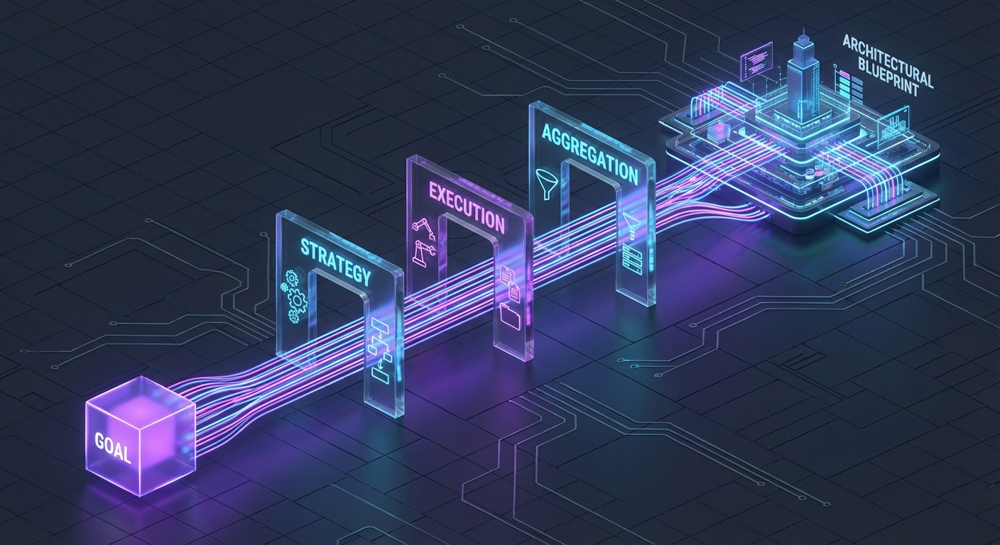

# HTML Generation Transcript

## Creating HTML File: `SubPlanningTask.html`

### Step 1: Generating HTML Structure

**Prompt:**
```
You are an expert web developer tasked with creating a complete, self-contained HTML file.

## Requirements:
# User Product Page Guidelines

This document outlines the standards for creating "User Product Pages" for Cognotik tasks. These pages serve as marketing and documentation hybrids, designed to bridge the gap between technical implementation and user understanding.

## 1. Design Philosophy

*   **Aesthetic:** "Future-Professional." Dark mode by default, using deep blues/slates (`#0f172a`, `#1e293b`) with high-contrast neon accents (Cyan, Gold, Purple) specific to the task category.
*   **Typography:** Clean sans-serif (Inter, System UI) for body text; Serif (Cinzel, Merriweather) allowed for narrative/creative tasks.
*   **Interactivity:** The page must feel alive. Static documentation is discouraged. Use hover states, tab switching, and reactive forms.

## 2. Page Structure

Every product page must contain the following sections in order:

### A. Header & Navigation
*   **Logo:** Cognotik Icon + Text.
*   **Links:** Features, Workflow/Specs, Demo.
*   **Style:** Glassmorphism (blur background), fixed position.

### B. Hero Section
*   **Title:** The Task Name (e.g., "Neural Network Layer Designer").
*   **Subtitle:** A compelling one-paragraph summary derived from the `Summary` and `Description` fields in `task_type_docs.md`.
*   **Visual:** A high-quality, abstract 3D illustration representing the task concept (e.g., DNA for genetics, glowing nodes for networks).
    *   *Requirement:* Include the prompt description for this image in an HTML comment at the top of the file.
*   **CTA:** A "Try the Simulator" button that scrolls to the Demo section.

### C. Features Grid
*   **Layout:** 3-column grid.
*   **Content:** Extract 3-6 key points from the "Key features include" list in the task documentation.
*   **Icons:** Use SVG icons (Lucide/Feather style) inside a glowing container.

### D. Interactive Simulator (The Core)
This is the most important section. It mocks the `ExecutionConfigData` input and the Task `Output`.

*   **Layout:** Split screen. Left side = Configuration; Right side = Visualization/Output.
*   **Left Column (Inputs):**
    *   Map the `Execution Configuration` table from the docs to HTML form elements.
    *   *Strings:* Text inputs or Textareas.
    *   *Booleans:* Toggles or Checkboxes.
    *   *Lists/Enums:* Select dropdowns.
    *   *Numbers:* Range sliders with value displays.
*   **Right Column (Outputs):**
    *   Use Tabs to organize the output (e.g., "Overview", "Code", "Logs", "Visuals").
    *   **Code Blocks:** Use syntax highlighting colors for code outputs.
    *   **Visuals:** If the task produces data, use `<canvas>` or CSS-based charts.
    *   **Logs:** If the task is a process (like `SelfHealing`), show a terminal-like log window.
*   **Functionality:** Write vanilla JavaScript to make the inputs update the outputs (or mock the update process with loading states).

### E. Workflow / Process (Optional)
*   If the task involves multiple steps (e.g., `NarrativeGeneration` or `SubPlanning`), visualize the pipeline using a step-stepper or flow diagram.

### F. Use Cases
*   Derive this from the "When to Use" section of the task documentation.
*   Format as cards or a list.

## 3. Content Mapping Guide

Use the `task_type_docs.md` to populate the page content:

| Product Page Element | Source in `task_type_docs.md` |
| :--- | :--- |
| **Hero Title** | Task Name |
| **Hero Tagline** | `Summary` field |
| **Feature Cards** | Bullet points under "Key features include" |
| **Simulator Inputs** | `Execution Configuration` Table |
| **Simulator Output** | `Output` Section (Mock the format described here) |
| **Use Case Section** | "When to Use" Section |

## 4. Technical Implementation Standards

*   **Single File:** The output must be a single `.html` file containing HTML, CSS, and JS.
*   **CSS Variables:** Define a `:root` block for easy theming.
    ```css
    :root {
        --bg-dark: #0f172a;
        --accent-primary: #38bdf8; /* Change per task type */
        --font-sans: system-ui, ...;
    }
    ```
*   **No External Heavy Libs:** Do not require `npm install`. Use CDN links for Fonts (Google Fonts) or Icons (FontAwesome) if necessary, but prefer inline SVGs.
*   **Responsive:** The Simulator must stack vertically on mobile devices.


## Context from Related Files:
# /home/andrew/code/Cognotik/webui/src/main/kotlin/com/simiacryptus/cognotik/plan/tools/SubPlanningTask.kt

```
package com.simiacryptus.cognotik.plan.tools

import com.simiacryptus.cognotik.agents.ChatAgent
import com.simiacryptus.cognotik.apps.general.renderMarkdown
import com.simiacryptus.cognotik.describe.Description
import com.simiacryptus.cognotik.plan.*
import com.simiacryptus.cognotik.plan.cognitive.CognitiveModeStrategies
import com.simiacryptus.cognotik.platform.model.ApiChatModel
import com.simiacryptus.cognotik.util.LoggerFactory
import com.simiacryptus.cognotik.util.TabbedDisplay
import com.simiacryptus.cognotik.util.ValidatedObject
import com.simiacryptus.cognotik.webui.session.SessionTask
import com.simiacryptus.cognotik.webui.session.getChildClient
import java.io.FileOutputStream
import java.text.SimpleDateFormat
import java.util.*

class SubPlanningTask(
    orchestrationConfig: OrchestrationConfig, planTask: SubPlanningTaskExecutionConfigData?
) : AbstractTask<SubPlanningTask.SubPlanningTaskExecutionConfigData, SubPlanningTask.SubPlanningTaskTypeConfig>(
    orchestrationConfig, planTask
) {

    class SubPlanningTaskTypeConfig(
        @Description("Cognitive strategy to use for sub-planning (overrides default)") var cognitiveMode: CognitiveModeStrategies? = null,
        @Description("Task-specific configurations available within sub-plans") val taskSettings: MutableMap<String, TaskTypeConfig> = mutableMapOf(),
        @Description("Supplemental description of the purpose of this configuration") val purpose: String = "",
        task_type: String = "RecursiveToolDefinition",
        model: ApiChatModel? = null,
        name: String? = task_type,
    ) : TaskTypeConfig(task_type = task_type, name = name, model = model), ValidatedObject {
        override fun validate(): String? {
            // Validate that taskSettings don't contain invalid configurations
            taskSettings.forEach { (key, config) ->
                if (config is ValidatedObject) {
                    config.validate()?.let { return "Invalid task setting '$key': $it" }
                }
            }
            return ValidatedObject.validateFields(this)
        }
    }

    class SubPlanningTaskExecutionConfigData(
        @Description("The goal or objective for the sub-planning task") val planning_goal: String? = null,
        @Description("Context information to provide to the sub-planner") val context: List<String>? = null,
        task_description: String? = null,
        task_dependencies: List<String>? = null,
        state: TaskState? = null,
    ) : TaskExecutionConfig(
        task_type = SubPlanning.name,
        task_description = task_description,
        task_dependencies = task_dependencies?.toMutableList(),
        state = state
    ), ValidatedObject {
        override fun validate(): String? {
            // Validate that either planning_goal or task_description is provided
            if (planning_goal.isNullOrBlank() && task_description.isNullOrBlank()) {
                return "Either planning_goal or task_description must be specified for SubPlanningTask"
            }

            // Validate context items if present
            context?.forEachIndexed { index, ctx ->
                if (ctx.isBlank()) {
                    return "Context item at index $index is blank"
                }
            }

            return ValidatedObject.validateFields(this)
        }
    }

    override fun promptSegment(): String {
        val typeConfig = typeConfig
        return buildString {
            appendLine("SubPlanningTask - Create and execute sub-plans using recursive planning with configurable cognitive modes.")
            typeConfig?.purpose?.takeIf { it.isNotEmpty() }?.let {
                appendLine("** Purpose: $it")
            }
            typeConfig?.taskSettings?.values?.joinToString(", ") { it.task_type ?: "?" }?.let {
                appendLine("** This SubPlanningTask can run the following tasks types: $it")
            }
            appendLine("** Specify a planning goal or objective")
            appendLine("** Optionally provide context information")
            appendLine("** Can override the cognitive mode for the sub-plan")
            appendLine("** Supports multiple levels of recursion up to configured depth")
            append("** Results are aggregated and optionally summarized")
        }
    }

    override fun run(
        agent: TaskOrchestrator,
        messages: List<String>,
        task: SessionTask,
        resultFn: (String) -> Unit,
        orchestrationConfig: OrchestrationConfig
    ) {
        log.info("Starting SubPlanningTask with goal: ${executionConfig?.planning_goal}")
        val transcript = transcript(task)

        try {
            val typeConfig = this.typeConfig ?: throw RuntimeException()
            // Get the cognitive mode for sub-planning
            val cognitiveMode =
                (typeConfig.cognitiveMode ?: orchestrationConfig.cognitiveMode ?: CognitiveModeStrategies.Adaptive)

            val subConfig = orchestrationConfig.copy(
                cognitiveMode = cognitiveMode,
                taskSettings = typeConfig.taskSettings,
            )
            log.debug("Created sub-orchestration config with maxIterations=${subConfig.maxIterations}, maxTasksPerIteration=${subConfig.maxTasksPerIteration}")

            log.info("Using cognitive mode: ${cognitiveMode.name} for sub-planning")

            // Create tabs for displaying sub-plan execution
            val tabs = TabbedDisplay(task)

            // Create planning context
            val planningTask = task.ui.newTask(false)
            tabs["Planning"] = planningTask.placeholder

            // Get the planning goal
            var planningGoal =
                executionConfig?.planning_goal ?: executionConfig?.task_description
                ?: throw IllegalArgumentException("No planning goal specified for SubPlanningTask")

            // Append purpose if available
            if (typeConfig.purpose.isNotEmpty()) planningGoal = planningGoal + """
                Purpose: ${typeConfig.purpose}
            """.trimIndent()

            // Build context for the sub-planner
            val contextMessages = buildContextMessages(messages)

            // Append context to the planning goal
            if (contextMessages.isNotEmpty()) {
                planningGoal = planningGoal + "\n\nContext:\n" + contextMessages.joinToString("\n")
            }

            log.debug("Planning goal: $planningGoal")

            // Initialize the cognitive mode
            val cognitiveInstance = cognitiveMode.getCognitiveMode(
                task = planningTask, orchestrationConfig = subConfig, session = agent.session, user = agent.user
            ).apply { initialize() }

            // Display planning information
            val planningInfo = buildString {
                appendLine("# Sub-Planning Task")
                appendLine()
                appendLine("**Goal:** $planningGoal")
                appendLine()
                appendLine("**Cognitive Mode:** ${cognitiveMode.name}")
                appendLine()
                if (typeConfig.purpose.isNotEmpty()) {
                    appendLine("**Purpose:** ${typeConfig.purpose}")
                    appendLine()
                }
                if (!executionConfig?.context.isNullOrEmpty()) {
                    appendLine("**Context:**")
                    executionConfig.context.forEach { ctx ->
                        appendLine("- $ctx")
                    }
                    appendLine()
                }
                appendLine("---")
                appendLine()
            }
            transcript?.write(planningInfo.toByteArray())
            planningTask.add(planningInfo.renderMarkdown)

            // Execute the sub-plan using the cognitive mode
            val executionTask = task.ui.newTask(false)
            tabs["Execution"] = executionTask.placeholder

            log.debug("Executing sub-plan with ${contextMessages.size} context messages")

            // Handle the user message through the cognitive mode
            transcript?.write("\n\n## Execution\n\n".toByteArray())
            transcript?.write("**Planning Goal:**\n\n".toByteArray())
            transcript?.write(planningGoal.toByteArray())
            transcript?.write("\n\n".toByteArray())

            cognitiveInstance.handleUserMessage(planningGoal, executionTask)

            // Collect results from the cognitive mode's context
            val results = cognitiveInstance.contextData()

            log.info("Sub-plan execution completed with ${results.size} results")

            // Create summary if configured
            val summaryTask = task.ui.newTask(false)
            tabs["Summary"] = summaryTask.placeholder

            val summary = createSummary(results, planningGoal, summaryTask, orchestrationConfig)
            transcript?.write("\n\n## Summary\n\n".toByteArray())
            transcript?.write(summary.toByteArray())
            transcript?.write("\n\n".toByteArray())
            summaryTask.add(summary.renderMarkdown)
            tabs.update()
            resultFn(summary)

        } catch (e: Exception) {
            log.error("Error executing SubPlanningTask", e)
            transcript?.write("\n\n## Error\n\n".toByteArray())
            transcript?.write("```\n${e.message}\n${e.stackTraceToString()}\n```\n".toByteArray())
            task.error(e)
            resultFn("Error in sub-planning: ${e.message}")
        } finally {
            transcript?.close()
        }
    }

    private fun buildContextMessages(messages: List<String>): List<String> {
        val contextMessages = mutableListOf<String>()

        // Add explicit context from execution config
        executionConfig?.context?.let { contextMessages.addAll(it) }

        // Add prior task results
        val priorCode = getPriorCode(null)
        if (priorCode.isNotBlank()) {
            contextMessages.add("## Prior Task Results\n\n$priorCode")
        }

        // Add incoming messages
        contextMessages.addAll(messages)

        log.debug("Built ${contextMessages.size} context messages for sub-planning")
        return contextMessages
    }

    private fun createSummary(
        results: List<String>, goal: String, task: SessionTask, orchestrationConfig: OrchestrationConfig
    ): String {
        log.info("Creating summary of ${results.size} sub-plan results")

        val combinedResults = results.joinToString("\n\n---\n\n")

        if (combinedResults.length < 5000) {
            log.debug("Results are short enough, returning without summarization")
            return buildString {
                appendLine("# Sub-Planning Results")
                appendLine()
                appendLine("**Goal:** $goal")
                appendLine()
                appendLine("---")
                appendLine()
                appendLine(combinedResults)
            }
        }

        // Use an agent to create a summary
        val typeConfig = typeConfig ?: throw RuntimeException()
        val model = (typeConfig.model?.let { orchestrationConfig.instance(it) }
            ?: defaultSmart).getChildClient(task)

        val summaryAgent = ChatAgent(
            prompt = """
               Create a comprehensive summary of the sub-planning results below.
               
               Original Goal: $goal
               
               The summary should:
               - Highlight key findings and accomplishments
               - Identify any issues or blockers encountered
               - Provide actionable next steps if applicable
               - Be concise but complete
               
               Use markdown formatting with headers and bullet points.
           """.trimIndent(), model = model
        )

        val summary = summaryAgent.answer(listOf(combinedResults))

        log.debug("Generated summary of length: ${summary.length}")

        return buildString {
            appendLine("# Sub-Planning Summary")
            appendLine()
            appendLine("**Goal:** $goal")
            appendLine()
            appendLine("---")
            appendLine()
            appendLine(summary)
            appendLine()
            appendLine("---")
            appendLine()
            appendLine("<details>")
            appendLine("<summary>Full Results (${results.size} items)</summary>")
            appendLine()
            appendLine(combinedResults)
            appendLine()
            appendLine("</details>")
        }
    }

    private fun transcript(task: SessionTask): FileOutputStream? {
        val transcriptFile = this.javaClass.simpleName + "_full_report_${SimpleDateFormat("yyyyMMddHHmmss").format(Date())}.md"
        val (link, file) = Pair(task.linkTo(transcriptFile), task.resolveUserFile(transcriptFile))
        val markdownTranscript = file?.outputStream()
        task.complete(
            "Writing transcript to <a href='$link' target='_blank'>$link</a> <a href='${link.removeSuffix(".md")}.html' target='_blank'>html</a> <a href='${
                link.removeSuffix(
                    ".md"
                )
            }.pdf' target='_blank'>pdf</a>"
        )
        return markdownTranscript
    }


    companion object {
        private val log = LoggerFactory.getLogger(SubPlanningTask::class.java)

        val SubPlanning = TaskType(
            "SubPlanning",
            "Planning & Orchestration",
            SubPlanningTaskExecutionConfigData::class.java,
            SubPlanningTaskTypeConfig::class.java,
            "Create and execute sub-plans using recursive planning",
            """
             Enables recursive planning and execution with configurable cognitive modes.
             <ul>
               <li>Create sub-plans with different cognitive strategies</li>
               <li>Support for multiple recursion levels</li>
               <li>Context propagation to sub-plans</li>
               <li>Configurable recursion depth limits</li>
               <li>Automatic result aggregation and summarization</li>
               <li>Flexible cognitive mode selection per sub-plan</li>
               <li>Useful for complex multi-stage problems</li>
             </ul>
           """
        )
    }
}
```

## Previous Task Results:


## Instructions:
1. Create a complete HTML5 document structure with proper semantic elements
2. Include appropriate meta tags (viewport, charset, etc.)
3. Add class names to elements that will need styling or JavaScript interaction
4. Use descriptive, semantic class names (e.g., "nav-menu", "hero-section", "card-container")
5. Include placeholder comments for where CSS and JavaScript will be added
6. Do NOT include any CSS or JavaScript yet - just the HTML structure with classes
7. Add comments to explain the purpose of major sections

## Output Format:
Provide the HTML structure within a code block:
```html
<!DOCTYPE html>
<html>
<head>
    <!-- CSS will be added here -->
</head>
<body>
    <!-- HTML structure with classes -->
</body>
<!-- JavaScript will be added here -->
</html>
```
```

**Response:**
```html
<!DOCTYPE html>
<html lang="en">
<head>
    <meta charset="UTF-8">
    <meta name="viewport" content="width=device-width, initial-scale=1.0">
    <meta name="description" content="Cognotik SubPlanning Task - Recursive planning and execution engine for complex cognitive workflows.">
    <title>SubPlanning Task | Cognotik</title>

    <!-- Fonts -->
    <link rel="preconnect" href="https://fonts.googleapis.com">
    <link rel="preconnect" href="https://fonts.gstatic.com" crossorigin>
    <link href="https://fonts.googleapis.com/css2?family=Cinzel:wght@400;700&family=Inter:wght@300;400;600;800&display=swap" rel="stylesheet">

    <!-- Icons (Lucide/Feather via CDN for demo purposes) -->
    <script src="https://unpkg.com/feather-icons"></script>

    <!-- 
    IMAGE GENERATION PROMPT:
    A high-quality, abstract 3D illustration representing a recursive neural network or decision tree. 
    The visual should feature a central glowing node (Gold/Cyan) branching out into smaller, self-similar nodes 
    connected by luminous data streams against a deep slate/dark blue void. 
    Style: Cyberpunk-professional, glassmorphism, neon accents. 
    -->

    <style>
        /* CSS will be added here */
    </style>
</head>
<body>

    <!-- Navigation -->
    <header class="glass-nav fixed-top">
        <div class="container nav-container">
            <div class="logo">
                <div class="logo-icon">
                    <i data-feather="cpu"></i>
                </div>
                <span class="logo-text">Cognotik <span class="text-accent">SubPlanning</span></span>
            </div>
            <nav class="main-nav">
                <ul>
                    <li><a href="#features">Features</a></li>
                    <li><a href="#workflow">Workflow</a></li>
                    <li><a href="#use-cases">Use Cases</a></li>
                    <li><a href="#demo" class="btn-nav">Live Demo</a></li>
                </ul>
            </nav>
            <div class="mobile-menu-toggle">
                <i data-feather="menu"></i>
            </div>
        </div>
    </header>

    <!-- Hero Section -->
    <section class="hero-section">
        <div class="container hero-grid">
            <div class="hero-content">
                <h1 class="hero-title">Recursive Cognitive <br><span class="text-gradient">Orchestration</span></h1>
                <p class="hero-subtitle">
                    Create and execute complex sub-plans using recursive planning strategies. 
                    Dynamically switch cognitive modes, propagate context, and aggregate results 
                    to solve multi-stage problems with precision.
                </p>
                <div class="hero-cta">
                    <a href="#demo" class="btn btn-primary btn-glow">Try the Simulator <i data-feather="arrow-down"></i></a>
                    <a href="#workflow" class="btn btn-secondary">View Specs</a>
                </div>
            </div>
            <div class="hero-visual">
                <!-- 3D Abstract Illustration Placeholder -->
                <div class="visual-placeholder">
                    <div class="glowing-node-center"></div>
                    <div class="orbit-ring"></div>
                    <div class="orbit-ring-2"></div>
                </div>
            </div>
        </div>
    </section>

    <!-- Features Grid -->
    <section id="features" class="features-section">
        <div class="container">
            <div class="section-header">
                <h2>Core Capabilities</h2>
                <p>Powered by the <code>SubPlanningTask</code> engine.</p>
            </div>
            <div class="features-grid">
                <!-- Feature 1 -->
                <div class="feature-card glass-panel">
                    <div class="icon-container">
                        <i data-feather="git-branch"></i>
                    </div>
                    <h3>Recursive Planning</h3>
                    <p>Supports multiple levels of recursion, allowing complex goals to be broken down into manageable sub-tasks automatically.</p>
                </div>
                <!-- Feature 2 -->
                <div class="feature-card glass-panel">
                    <div class="icon-container">
                        <i data-feather="layers"></i>
                    </div>
                    <h3>Adaptive Cognition</h3>
                    <p>Configure specific cognitive strategies (Fast, Detailed, Creative) for different branches of the execution tree.</p>
                </div>
                <!-- Feature 3 -->
                <div class="feature-card glass-panel">
                    <div class="icon-container">
                        <i data-feather="database"></i>
                    </div>
                    <h3>Context Propagation</h3>
                    <p>Seamlessly passes context and dependencies down to sub-plans and aggregates results back up for summarization.</p>
                </div>
            </div>
        </div>
    </section>

    <!-- Workflow / Process Visualization -->
    <section id="workflow" class="workflow-section">
        <div class="container">
            <div class="section-header">
                <h2>Execution Pipeline</h2>
            </div>
            <div class="workflow-stepper">
                <div class="step">
                    <div class="step-number">01</div>
                    <div class="step-content">
                        <h4>Goal Definition</h4>
                        <p>User defines high-level <code>planning_goal</code> and optional context.</p>
                    </div>
                </div>
                <div class="step-connector"></div>
                <div class="step">
                    <div class="step-number">02</div>
                    <div class="step-content">
                        <h4>Strategy Selection</h4>
                        <p>System selects <code>CognitiveMode</code> and decomposes the problem.</p>
                    </div>
                </div>
                <div class="step-connector"></div>
                <div class="step">
                    <div class="step-number">03</div>
                    <div class="step-content">
                        <h4>Recursive Execution</h4>
                        <p>Sub-tasks are spawned, executed, and monitored for depth limits.</p>
                    </div>
                </div>
                <div class="step-connector"></div>
                <div class="step">
                    <div class="step-number">04</div>
                    <div class="step-content">
                        <h4>Aggregation</h4>
                        <p>Results are collected and summarized into a final report.</p>
                    </div>
                </div>
            </div>
        </div>
    </section>

    <!-- Interactive Simulator -->
    <section id="demo" class="simulator-section">
        <div class="container">
            <div class="section-header">
                <h2>Task Simulator</h2>
                <p>Configure the <code>SubPlanningTaskExecutionConfigData</code> and visualize the output.</p>
            </div>
            
            <div class="simulator-container glass-panel">
                <!-- Left Column: Inputs -->
                <div class="sim-column sim-inputs">
                    <div class="sim-header">
                        <h3><i data-feather="sliders"></i> Configuration</h3>
                    </div>
                    <form id="sim-form">
                        <!-- Planning Goal -->
                        <div class="form-group">
                            <label for="planning_goal">Planning Goal <span class="required">*</span></label>
                            <textarea id="planning_goal" name="planning_goal" rows="3" placeholder="E.g., Research the viability of quantum computing for cryptography..."></textarea>
                        </div>

                        <!-- Cognitive Mode (from TypeConfig) -->
                        <div class="form-group">
                            <label for="cognitive_mode">Cognitive Strategy</label>
                            <select id="cognitive_mode" name="cognitive_mode">
                                <option value="Adaptive">Adaptive (Default)</option>
                                <option value="Fast">Fast / Heuristic</option>
                                <option value="Deep">Deep Analysis</option>
                                <option value="Creative">Creative / Divergent</option>
                            </select>
                        </div>

                        <!-- Context List -->
                        <div class="form-group">
                            <label>Context Items</label>
                            <div id="context-list-container">
                                <div class="context-item">
                                    <input type="text" class="context-input" placeholder="Add context (e.g., 'Focus on post-2023 papers')">
                                </div>
                            </div>
                            <button type="button" id="add-context-btn" class="btn-text">+ Add Context Item</button>
                        </div>

                        <!-- Recursion Depth (Mock Config) -->
                        <div class="form-group">
                            <label for="recursion_depth">Max Recursion Depth: <span id="depth-val">2</span></label>
                            <input type="range" id="recursion_depth" min="1" max="5" value="2" class="slider">
                        </div>

                        <div class="form-actions">
                            <button type="submit" id="run-sim-btn" class="btn btn-primary btn-full">
                                <i data-feather="play"></i> Execute SubPlan
                            </button>
                        </div>
                    </form>
                </div>

                <!-- Right Column: Outputs -->
                <div class="sim-column sim-outputs">
                    <div class="tabs-nav">
                        <button class="tab-btn active" data-target="tab-overview">Overview</button>
                        <button class="tab-btn" data-target="tab-logs">Execution Logs</button>
                        <button class="tab-btn" data-target="tab-summary">Final Summary</button>
                    </div>

                    <div class="tab-content-area">
                        <!-- Tab: Overview (Visual) -->
                        <div id="tab-overview" class="tab-pane active">
                            <div class="empty-state">
                                <i data-feather="activity"></i>
                                <p>Ready to execute. Configure inputs and click Run.</p>
                            </div>
                            <div id="visualization-container" class="hidden">
                                <!-- Canvas or DOM elements for tree visualization will go here -->
                                <div class="tree-visual-mockup"></div>
                            </div>
                        </div>

                        <!-- Tab: Logs (Terminal style) -->
                        <div id="tab-logs" class="tab-pane">
                            <div class="terminal-window">
                                <div class="terminal-header">
                                    <span class="dot red"></span>
                                    <span class="dot yellow"></span>
                                    <span class="dot green"></span>
                                </div>
                                <div class="terminal-body" id="log-output">
                                    <span class="log-line text-dim">Waiting for execution...</span>
                                </div>
                            </div>
                        </div>

                        <!-- Tab: Summary (Markdown render) -->
                        <div id="tab-summary" class="tab-pane">
                            <div class="markdown-preview" id="summary-output">
                                <!-- Result content will be injected here -->
                            </div>
                        </div>
                    </div>
                </div>
            </div>
        </div>
    </section>

    <!-- Use Cases -->
    <section id="use-cases" class="use-cases-section">
        <div class="container">
            <div class="section-header">
                <h2>When to Use</h2>
            </div>
            <div class="cards-grid">
                <div class="use-case-card">
                    <h4>Complex Research</h4>
                    <p>When a topic requires breaking down into historical, technical, and social sub-analyses before synthesis.</p>
                </div>
                <div class="use-case-card">
                    <h4>Software Architecture</h4>
                    <p>Planning a system where sub-components (Database, API, UI) need individual planning strategies.</p>
                </div>
                <div class="use-case-card">
                    <h4>Strategic Reporting</h4>
                    <p>Generating comprehensive business reports that require aggregating data from multiple distinct domains.</p>
                </div>
            </div>
        </div>
    </section>

    <!-- Footer -->
    <footer>
        <div class="container">
            <div class="footer-content">
                <div class="footer-brand">
                    <span>Cognotik</span>
                </div>
                <div class="footer-links">
                    <a href="#">Documentation</a>
                    <a href="#">API Reference</a>
                    <a href="#">Support</a>
                </div>
                <div class="footer-copy">
                    &copy; 2023 Simiacryptus. All rights reserved.
                </div>
            </div>
        </div>
    </footer>

    <!-- JavaScript will be added here -->
    <script>
        // Placeholder for Feather Icons initialization
        document.addEventListener('DOMContentLoaded', () => {
            if (typeof feather !== 'undefined') {
                feather.replace();
            }
        });
    </script>
</body>
</html>
```

### Step 1.5: Generating Images

**Prompt:**
```
Based on the following HTML page description and structure, identify 3 key images that should be generated.
## Page Description:
# User Product Page Guidelines

This document outlines the standards for creating "User Product Pages" for Cognotik tasks. These pages serve as marketing and documentation hybrids, designed to bridge the gap between technical implementation and user understanding.

## 1. Design Philosophy

*   **Aesthetic:** "Future-Professional." Dark mode by default, using deep blues/slates (`#0f172a`, `#1e293b`) with high-contrast neon accents (Cyan, Gold, Purple) specific to the task category.
*   **Typography:** Clean sans-serif (Inter, System UI) for body text; Serif (Cinzel, Merriweather) allowed for narrative/creative tasks.
*   **Interactivity:** The page must feel alive. Static documentation is discouraged. Use hover states, tab switching, and reactive forms.

## 2. Page Structure

Every product page must contain the following sections in order:

### A. Header & Navigation
*   **Logo:** Cognotik Icon + Text.
*   **Links:** Features, Workflow/Specs, Demo.
*   **Style:** Glassmorphism (blur background), fixed position.

### B. Hero Section
*   **Title:** The Task Name (e.g., "Neural Network Layer Designer").
*   **Subtitle:** A compelling one-paragraph summary derived from the `Summary` and `Description` fields in `task_type_docs.md`.
*   **Visual:** A high-quality, abstract 3D illustration representing the task concept (e.g., DNA for genetics, glowing nodes for networks).
    *   *Requirement:* Include the prompt description for this image in an HTML comment at the top of the file.
*   **CTA:** A "Try the Simulator" button that scrolls to the Demo section.

### C. Features Grid
*   **Layout:** 3-column grid.
*   **Content:** Extract 3-6 key points from the "Key features include" list in the task documentation.
*   **Icons:** Use SVG icons (Lucide/Feather style) inside a glowing container.

### D. Interactive Simulator (The Core)
This is the most important section. It mocks the `ExecutionConfigData` input and the Task `Output`.

*   **Layout:** Split screen. Left side = Configuration; Right side = Visualization/Output.
*   **Left Column (Inputs):**
    *   Map the `Execution Configuration` table from the docs to HTML form elements.
    *   *Strings:* Text inputs or Textareas.
    *   *Booleans:* Toggles or Checkboxes.
    *   *Lists/Enums:* Select dropdowns.
    *   *Numbers:* Range sliders with value displays.
*   **Right Column (Outputs):**
    *   Use Tabs to organize the output (e.g., "Overview", "Code", "Logs", "Visuals").
    *   **Code Blocks:** Use syntax highlighting colors for code outputs.
    *   **Visuals:** If the task produces data, use `<canvas>` or CSS-based charts.
    *   **Logs:** If the task is a process (like `SelfHealing`), show a terminal-like log window.
*   **Functionality:** Write vanilla JavaScript to make the inputs update the outputs (or mock the update process with loading states).

### E. Workflow / Process (Optional)
*   If the task involves multiple steps (e.g., `NarrativeGeneration` or `SubPlanning`), visualize the pipeline using a step-stepper or flow diagram.

### F. Use Cases
*   Derive this from the "When to Use" section of the task documentation.
*   Format as cards or a list.

## 3. Content Mapping Guide

Use the `task_type_docs.md` to populate the page content:

| Product Page Element | Source in `task_type_docs.md` |
| :--- | :--- |
| **Hero Title** | Task Name |
| **Hero Tagline** | `Summary` field |
| **Feature Cards** | Bullet points under "Key features include" |
| **Simulator Inputs** | `Execution Configuration` Table |
| **Simulator Output** | `Output` Section (Mock the format described here) |
| **Use Case Section** | "When to Use" Section |

## 4. Technical Implementation Standards

*   **Single File:** The output must be a single `.html` file containing HTML, CSS, and JS.
*   **CSS Variables:** Define a `:root` block for easy theming.
    ```css
    :root {
        --bg-dark: #0f172a;
        --accent-primary: #38bdf8; /* Change per task type */
        --font-sans: system-ui, ...;
    }
    ```
*   **No External Heavy Libs:** Do not require `npm install`. Use CDN links for Fonts (Google Fonts) or Icons (FontAwesome) if necessary, but prefer inline SVGs.
*   **Responsive:** The Simulator must stack vertically on mobile devices.

## HTML Structure:
```html
<!DOCTYPE html>
<html lang="en">
<head>
    <meta charset="UTF-8">
    <meta name="viewport" content="width=device-width, initial-scale=1.0">
    <meta name="description" content="Cognotik SubPlanning Task - Recursive planning and execution engine for complex cognitive workflows.">
    <title>SubPlanning Task | Cognotik</title>

    <!-- Fonts -->
    <link rel="preconnect" href="https://fonts.googleapis.com">
    <link rel="preconnect" href="https://fonts.gstatic.com" crossorigin>
    <link href="https://fonts.googleapis.com/css2?family=Cinzel:wght@400;700&family=Inter:wght@300;400;600;800&display=swap" rel="stylesheet">

    <!-- Icons (Lucide/Feather via CDN for demo purposes) -->
    <script src="https://unpkg.com/feather-icons"></script>

    <!-- 
    IMAGE GENERATION PROMPT:
    A high-quality, abstract 3D illustration representing a recursive neural network or decision tree. 
    The visual should feature a central glowing node (Gold/Cyan) branching out into smaller, self-similar nodes 
    connected by luminous data streams against a deep slate/dark blue void. 
    Style: Cyberpunk-professional, glassmorphism, neon accents. 
    -->

    <style>
        /* CSS will be added here */
    </style>
</head>
<body>

    <!-- Navigation -->
    <header class="glass-nav fixed-top">
        <div class="container nav-container">
            <div class="logo">
                <div class="logo-icon">
                    <i data-feather="cpu"></i>
                </div>
                <span class="logo-text">Cognotik <span class="text-accent">SubPlanning</span></span>
            </div>
            <nav class="main-nav">
                <ul>
                    <li><a href="#features">Features</a></li>
                    <li><a href="#workflow">Workflow</a></li>
                    <li><a href="#use-cases">Use Cases</a></li>
                    <li><a href="#demo" class="btn-nav">Live Demo</a></li>
                </ul>
            </nav>
            <div class="mobile-menu-toggle">
                <i data-feather="menu"></i>
            </div>
        </div>
    </header>

    <!-- Hero Section -->
    <section class="hero-section">
        <div class="container hero-grid">
            <div class="hero-content">
                <h1 class="hero-title">Recursive Cognitive <br><span class="text-gradient">Orchestration</span></h1>
                <p class="hero-subtitle">
                    Create and execute complex sub-plans using recursive planning strategies. 
                    Dynamically switch cognitive modes, propagate context, and aggregate results 
                    to solve multi-stage problems with precision.
                </p>
                <div class="hero-cta">
                    <a href="#demo" class="btn btn-primary btn-glow">Try the Simulator <i data-feather="arrow-down"></i></a>
                    <a href="#workflow" class="btn btn-secondary">View Specs</a>
                </div>
            </div>
            <div class="hero-visual">
                <!-- 3D Abstract Illustration Placeholder -->
                <div class="visual-placeholder">
                    <div class="glowing-node-center"></div>
                    <div class="orbit-ring"></div>
                    <div class="orbit-ring-2"></div>
                </div>
            </div>
        </div>
    </section>

    <!-- Features Grid -->
    <section id="features" class="features-section">
        <div class="container">
            <div class="section-header">
                <h2>Core Capabilities</h2>
                <p>Powered by the <code>SubPlanningTask</code> engine.</p>
            </div>
            <div class="features-grid">
                <!-- Feature 1 -->
                <div class="feature-card glass-panel">
                    <div class="icon-container">
                        <i data-feather="git-branch"></i>
                    </div>
                    <h3>Recursive Planning</h3>
                    <p>Supports multiple levels of recursion, allowing complex goals to be broken down into manageable sub-tasks automatically.</p>
                </div>
                <!-- Feature 2 -->
                <div class="feature-card glass-panel">
                    <div class="icon-container">
                        <i data-feather="layers"></i>
                    </div>
                    <h3>Adaptive Cognition</h3>
                    <p>Configure specific cognitive strategies (Fast, Detailed, Creative) for different branches of the execution tree.</p>
                </div>
                <!-- Feature 3 -->
                <div class="feature-card glass-panel">
                    <div class="icon-container">
                        <i data-feather="database"></i>
                    </div>
                    <h3>Context Propagation</h3>
                    <p>Seamlessly passes context and dependencies down to sub-plans and aggregates results back up for summarization.</p>
                </div>
            </div>
        </div>
    </section>

    <!-- Workflow / Process Visualization -->
    <section id="workflow" class="workflow-section">
        <div class="container">
            <div class="section-header">
                <h2>Execution Pipeline</h2>
            </div>
            <div class="workflow-stepper">
                <div class="step">
                    <div class="step-number">01</div>
                    <div class="step-content">
                        <h4>Goal Definition</h4>
                        <p>User defines high-level <code>planning_goal</code> and optional context.</p>
                    </div>
                </div>
                <div class="step-connector"></div>
                <div class="step">
                    <div class="step-number">02</div>
                    <div class="step-content">
                        <h4>Strategy Selection</h4>
                        <p>System selects <code>CognitiveMode</code> and decomposes the problem.</p>
                    </div>
                </div>
                <div class="step-connector"></div>
                <div class="step">
                    <div class="step-number">03</div>
                    <div class="step-content">
                        <h4>Recursive Execution</h4>
                        <p>Sub-tasks are spawned, executed, and monitored for depth limits.</p>
                    </div>
                </div>
                <div class="step-connector"></div>
                <div class="step">
                    <div class="step-number">04</div>
                    <div class="step-content">
                        <h4>Aggregation</h4>
                        <p>Results are collected and summarized into a final report.</p>
                    </div>
                </div>
            </div>
        </div>
    </section>

    <!-- Interactive Simulator -->
    <section id="demo" class="simulator-section">
        <div class="container">
            <div class="section-header">
                <h2>Task Simulator</h2>
                <p>Configure the <code>SubPlanningTaskExecutionConfigData</code> and visualize the output.</p>
            </div>
            
            <div class="simulator-container glass-panel">
                <!-- Left Column: Inputs -->
                <div class="sim-column sim-inputs">
                    <div class="sim-header">
                        <h3><i data-feather="sliders"></i> Configuration</h3>
                    </div>
                    <form id="sim-form">
                        <!-- Planning Goal -->
                        <div class="form-group">
                            <label for="planning_goal">Planning Goal <span class="required">*</span></label>
                            <textarea id="planning_goal" name="planning_goal" rows="3" placeholder="E.g., Research the viability of quantum computing for cryptography..."></textarea>
                        </div>

                        <!-- Cognitive Mode (from TypeConfig) -->
                        <div class="form-group">
                            <label for="cognitive_mode">Cognitive Strategy</label>
                            <select id="cognitive_mode" name="cognitive_mode">
                                <option value="Adaptive">Adaptive (Default)</option>
                                <option value="Fast">Fast / Heuristic</option>
                                <option value="Deep">Deep Analysis</option>
                                <option value="Creative">Creative / Divergent</option>
                            </select>
                        </div>

                        <!-- Context List -->
                        <div class="form-group">
                            <label>Context Items</label>
                            <div id="context-list-container">
                                <div class="context-item">
                                    <input type="text" class="context-input" placeholder="Add context (e.g., 'Focus on post-2023 papers')">
                                </div>
                            </div>
                            <button type="button" id="add-context-btn" class="btn-text">+ Add Context Item</button>
                        </div>

                        <!-- Recursion Depth (Mock Config) -->
                        <div class="form-group">
                            <label for="recursion_depth">Max Recursion Depth: <span id="depth-val">2</span></label>
                            <input type="range" id="recursion_depth" min="1" max="5" value="2" class="slider">
                        </div>

                        <div class="form-actions">
                            <button type="submit" id="run-sim-btn" class="btn btn-primary btn-full">
                                <i data-feather="play"></i> Execute SubPlan
                            </button>
                        </div>
                    </form>
                </div>

                <!-- Right Column: Outputs -->
                <div class="sim-column sim-outputs">
                    <div class="tabs-nav">
                        <button class="tab-btn active" data-target="tab-overview">Overview</button>
                        <button class="tab-btn" data-target="tab-logs">Execution Logs</button>
                        <button class="tab-btn" data-target="tab-summary">Final Summary</button>
                    </div>

                    <div class="tab-content-area">
                        <!-- Tab: Overview (Visual) -->
                        <div id="tab-overview" class="tab-pane active">
                            <div class="empty-state">
                                <i data-feather="activity"></i>
                                <p>Ready to execute. Configure inputs and click Run.</p>
                            </div>
                            <div id="visualization-container" class="hidden">
                                <!-- Canvas or DOM elements for tree visualization will go here -->
                                <div class="tree-visual-mockup"></div>
                            </div>
                        </div>

                        <!-- Tab: Logs (Terminal style) -->
                        <div id="tab-logs" class="tab-pane">
                            <div class="terminal-window">
                                <div class="terminal-header">
                                    <span class="dot red"></span>
                                    <span class="dot yellow"></span>
                                    <span class="dot green"></span>
                                </div>
                                <div class="terminal-body" id="log-output">
                                    <span class="log-line text-dim">Waiting for execution...</span>
                                </div>
                            </div>
                        </div>

                        <!-- Tab: Summary (Markdown render) -->
                        <div id="tab-summary" class="tab-pane">
                            <div class="markdown-preview" id="summary-output">
                                <!-- Result content will be injected here -->
                            </div>
                        </div>
                    </div>
                </div>
            </div>
        </div>
    </section>

    <!-- Use Cases -->
    <section id="use-cases" class="use-cases-section">
        <div class="container">
            <div class="section-header">
                <h2>When to Use</h2>
            </div>
            <div class="cards-grid">
                <div class="use-case-card">
                    <h4>Complex Research</h4>
                    <p>When a topic requires breaking down into historical, technical, and social sub-analyses before synthesis.</p>
                </div>
                <div class="use-case-card">
                    <h4>Software Architecture</h4>
                    <p>Planning a system where sub-components (Database, API, UI) need individual planning strategies.</p>
                </div>
                <div class="use-case-card">
                    <h4>Strategic Reporting</h4>
                    <p>Generating comprehensive business reports that require aggregating data from multiple distinct domains.</p>
                </div>
            </div>
        </div>
    </section>

    <!-- Footer -->
    <footer>
        <div class="container">
            <div class="footer-content">
                <div class="footer-brand">
                    <span>Cognotik</span>
                </div>
                <div class="footer-links">
                    <a href="#">Documentation</a>
                    <a href="#">API Reference</a>
                    <a href="#">Support</a>
                </div>
                <div class="footer-copy">
                    &copy; 2023 Simiacryptus. All rights reserved.
                </div>
            </div>
        </div>
    </footer>

    <!-- JavaScript will be added here -->
    <script>
        // Placeholder for Feather Icons initialization
        document.addEventListener('DOMContentLoaded', () => {
            if (typeof feather !== 'undefined') {
                feather.replace();
            }
        });
    </script>
</body>
</html>
```
For each image, provide:
1. A descriptive filename ending in .png (e.g., "hero-banner.png", "product-showcase.png")
2. A detailed visual description for image generation (be specific about style, colors, composition)

Note: All images will be generated as PNG files by an AI image model.

Format your response as:
IMAGE: filename.png
DESCRIPTION: detailed visual description
IMAGE: another-image.png
DESCRIPTION: another detailed description
```

**Response:**
IMAGE: subplanning-hero-recursive-nodes.png
DESCRIPTION: A high-quality, abstract 3D illustration representing a recursive neural network or decision tree. The visual features a central, large glowing node in Gold and Cyan, branching out into smaller, self-similar nodes connected by luminous data streams. The structure resembles a fractal tree made of glass and light, set against a deep slate and dark blue void (#0f172a). The lighting is dramatic, with neon accents highlighting the connections, emphasizing the concept of breaking complex goals into sub-tasks. Style: Cyberpunk-professional, glassmorphism, octane render, high contrast.

IMAGE: workflow-pipeline-schematic.png
DESCRIPTION: A 3D isometric visualization of a cognitive execution pipeline. The image depicts a linear flow of information transforming from a raw "Goal" block on the left into a structured, multi-layered architectural blueprint on the right. The flow is represented by glowing purple and blue fiber-optic lines passing through floating glass gates (representing the cognitive modes). The background is a technical grid in dark slate. This image represents the "Goal -> Strategy -> Execution -> Aggregation" workflow. Style: Technical, clean, schematic, neon-lit.

IMAGE: cognitive-architecture-abstract.png
DESCRIPTION: An abstract geometric composition representing "organized complexity." The image shows a series of floating, translucent cubes and tetrahedrons arranging themselves into a cohesive vertical stack or tower. The shapes are semi-transparent with glowing edges in Cyan and faint Purple. This serves as a secondary visual for the "Use Cases" section, symbolizing the construction of complex research or software architecture from smaller sub-plans. The background is a soft, out-of-focus deep blue gradient to ensure it doesn't distract from adjacent text. Style: Minimalist 3D, architectural, futuristic.

**Generated Image:** subplanning-hero-recursive-nodes.png
**Description:** A high-quality, abstract 3D illustration representing a recursive neural network or decision tree. The visual features a central, large glowing node in Gold and Cyan, branching out into smaller, self-similar nodes connected by luminous data streams. The structure resembles a fractal tree made of glass and light, set against a deep slate and dark blue void (#0f172a). The lighting is dramatic, with neon accents highlighting the connections, emphasizing the concept of breaking complex goals into sub-tasks. Style: Cyberpunk-professional, glassmorphism, octane render, high contrast.
**Prompt Used:** 

✅ Generated: [subplanning-hero-recursive-nodes.png](subplanning-hero-recursive-nodes.png)

![A high-quality, abstract 3D illustration representing a recursive neural network or decision tree. The visual features a central, large glowing node in Gold and Cyan, branching out into smaller, self-similar nodes connected by luminous data streams. The structure resembles a fractal tree made of glass and light, set against a deep slate and dark blue void (#0f172a). The lighting is dramatic, with neon accents highlighting the connections, emphasizing the concept of breaking complex goals into sub-tasks. Style: Cyberpunk-professional, glassmorphism, octane render, high contrast.](subplanning-hero-recursive-nodes.png)

**Generated Image:** workflow-pipeline-schematic.png
**Description:** A 3D isometric visualization of a cognitive execution pipeline. The image depicts a linear flow of information transforming from a raw "Goal" block on the left into a structured, multi-layered architectural blueprint on the right. The flow is represented by glowing purple and blue fiber-optic lines passing through floating glass gates (representing the cognitive modes). The background is a technical grid in dark slate. This image represents the "Goal -> Strategy -> Execution -> Aggregation" workflow. Style: Technical, clean, schematic, neon-lit.
**Prompt Used:** 

✅ Generated: [workflow-pipeline-schematic.png](workflow-pipeline-schematic.png)

![A 3D isometric visualization of a cognitive execution pipeline. The image depicts a linear flow of information transforming from a raw "Goal" block on the left into a structured, multi-layered architectural blueprint on the right. The flow is represented by glowing purple and blue fiber-optic lines passing through floating glass gates (representing the cognitive modes). The background is a technical grid in dark slate. This image represents the "Goal -> Strategy -> Execution -> Aggregation" workflow. Style: Technical, clean, schematic, neon-lit.](workflow-pipeline-schematic.png)

**Generated Image:** cognitive-architecture-abstract.png
**Description:** An abstract geometric composition representing "organized complexity." The image shows a series of floating, translucent cubes and tetrahedrons arranging themselves into a cohesive vertical stack or tower. The shapes are semi-transparent with glowing edges in Cyan and faint Purple. This serves as a secondary visual for the "Use Cases" section, symbolizing the construction of complex research or software architecture from smaller sub-plans. The background is a soft, out-of-focus deep blue gradient to ensure it doesn't distract from adjacent text. Style: Minimalist 3D, architectural, futuristic.
**Prompt Used:** 

✅ Generated: [cognitive-architecture-abstract.png](cognitive-architecture-abstract.png)

![An abstract geometric composition representing "organized complexity." The image shows a series of floating, translucent cubes and tetrahedrons arranging themselves into a cohesive vertical stack or tower. The shapes are semi-transparent with glowing edges in Cyan and faint Purple. This serves as a secondary visual for the "Use Cases" section, symbolizing the construction of complex research or software architecture from smaller sub-plans. The background is a soft, out-of-focus deep blue gradient to ensure it doesn't distract from adjacent text. Style: Minimalist 3D, architectural, futuristic.](cognitive-architecture-abstract.png)

### Step 2: Generating JavaScript

**Prompt:**
```
Based on the following HTML structure, generate the JavaScript code needed for interactivity.

## HTML Structure:
```html
<!DOCTYPE html>
<html lang="en">
<head>
    <meta charset="UTF-8">
    <meta name="viewport" content="width=device-width, initial-scale=1.0">
    <meta name="description" content="Cognotik SubPlanning Task - Recursive planning and execution engine for complex cognitive workflows.">
    <title>SubPlanning Task | Cognotik</title>

    <!-- Fonts -->
    <link rel="preconnect" href="https://fonts.googleapis.com">
    <link rel="preconnect" href="https://fonts.gstatic.com" crossorigin>
    <link href="https://fonts.googleapis.com/css2?family=Cinzel:wght@400;700&family=Inter:wght@300;400;600;800&display=swap" rel="stylesheet">

    <!-- Icons (Lucide/Feather via CDN for demo purposes) -->
    <script src="https://unpkg.com/feather-icons"></script>

    <!-- 
    IMAGE GENERATION PROMPT:
    A high-quality, abstract 3D illustration representing a recursive neural network or decision tree. 
    The visual should feature a central glowing node (Gold/Cyan) branching out into smaller, self-similar nodes 
    connected by luminous data streams against a deep slate/dark blue void. 
    Style: Cyberpunk-professional, glassmorphism, neon accents. 
    -->

    <style>
        /* CSS will be added here */
    </style>
</head>
<body>

    <!-- Navigation -->
    <header class="glass-nav fixed-top">
        <div class="container nav-container">
            <div class="logo">
                <div class="logo-icon">
                    <i data-feather="cpu"></i>
                </div>
                <span class="logo-text">Cognotik <span class="text-accent">SubPlanning</span></span>
            </div>
            <nav class="main-nav">
                <ul>
                    <li><a href="#features">Features</a></li>
                    <li><a href="#workflow">Workflow</a></li>
                    <li><a href="#use-cases">Use Cases</a></li>
                    <li><a href="#demo" class="btn-nav">Live Demo</a></li>
                </ul>
            </nav>
            <div class="mobile-menu-toggle">
                <i data-feather="menu"></i>
            </div>
        </div>
    </header>

    <!-- Hero Section -->
    <section class="hero-section">
        <div class="container hero-grid">
            <div class="hero-content">
                <h1 class="hero-title">Recursive Cognitive <br><span class="text-gradient">Orchestration</span></h1>
                <p class="hero-subtitle">
                    Create and execute complex sub-plans using recursive planning strategies. 
                    Dynamically switch cognitive modes, propagate context, and aggregate results 
                    to solve multi-stage problems with precision.
                </p>
                <div class="hero-cta">
                    <a href="#demo" class="btn btn-primary btn-glow">Try the Simulator <i data-feather="arrow-down"></i></a>
                    <a href="#workflow" class="btn btn-secondary">View Specs</a>
                </div>
            </div>
            <div class="hero-visual">
                <!-- 3D Abstract Illustration Placeholder -->
                <div class="visual-placeholder">
                    <div class="glowing-node-center"></div>
                    <div class="orbit-ring"></div>
                    <div class="orbit-ring-2"></div>
                </div>
            </div>
        </div>
    </section>

    <!-- Features Grid -->
    <section id="features" class="features-section">
        <div class="container">
            <div class="section-header">
                <h2>Core Capabilities</h2>
                <p>Powered by the <code>SubPlanningTask</code> engine.</p>
            </div>
            <div class="features-grid">
                <!-- Feature 1 -->
                <div class="feature-card glass-panel">
                    <div class="icon-container">
                        <i data-feather="git-branch"></i>
                    </div>
                    <h3>Recursive Planning</h3>
                    <p>Supports multiple levels of recursion, allowing complex goals to be broken down into manageable sub-tasks automatically.</p>
                </div>
                <!-- Feature 2 -->
                <div class="feature-card glass-panel">
                    <div class="icon-container">
                        <i data-feather="layers"></i>
                    </div>
                    <h3>Adaptive Cognition</h3>
                    <p>Configure specific cognitive strategies (Fast, Detailed, Creative) for different branches of the execution tree.</p>
                </div>
                <!-- Feature 3 -->
                <div class="feature-card glass-panel">
                    <div class="icon-container">
                        <i data-feather="database"></i>
                    </div>
                    <h3>Context Propagation</h3>
                    <p>Seamlessly passes context and dependencies down to sub-plans and aggregates results back up for summarization.</p>
                </div>
            </div>
        </div>
    </section>

    <!-- Workflow / Process Visualization -->
    <section id="workflow" class="workflow-section">
        <div class="container">
            <div class="section-header">
                <h2>Execution Pipeline</h2>
            </div>
            <div class="workflow-stepper">
                <div class="step">
                    <div class="step-number">01</div>
                    <div class="step-content">
                        <h4>Goal Definition</h4>
                        <p>User defines high-level <code>planning_goal</code> and optional context.</p>
                    </div>
                </div>
                <div class="step-connector"></div>
                <div class="step">
                    <div class="step-number">02</div>
                    <div class="step-content">
                        <h4>Strategy Selection</h4>
                        <p>System selects <code>CognitiveMode</code> and decomposes the problem.</p>
                    </div>
                </div>
                <div class="step-connector"></div>
                <div class="step">
                    <div class="step-number">03</div>
                    <div class="step-content">
                        <h4>Recursive Execution</h4>
                        <p>Sub-tasks are spawned, executed, and monitored for depth limits.</p>
                    </div>
                </div>
                <div class="step-connector"></div>
                <div class="step">
                    <div class="step-number">04</div>
                    <div class="step-content">
                        <h4>Aggregation</h4>
                        <p>Results are collected and summarized into a final report.</p>
                    </div>
                </div>
            </div>
        </div>
    </section>

    <!-- Interactive Simulator -->
    <section id="demo" class="simulator-section">
        <div class="container">
            <div class="section-header">
                <h2>Task Simulator</h2>
                <p>Configure the <code>SubPlanningTaskExecutionConfigData</code> and visualize the output.</p>
            </div>
            
            <div class="simulator-container glass-panel">
                <!-- Left Column: Inputs -->
                <div class="sim-column sim-inputs">
                    <div class="sim-header">
                        <h3><i data-feather="sliders"></i> Configuration</h3>
                    </div>
                    <form id="sim-form">
                        <!-- Planning Goal -->
                        <div class="form-group">
                            <label for="planning_goal">Planning Goal <span class="required">*</span></label>
                            <textarea id="planning_goal" name="planning_goal" rows="3" placeholder="E.g., Research the viability of quantum computing for cryptography..."></textarea>
                        </div>

                        <!-- Cognitive Mode (from TypeConfig) -->
                        <div class="form-group">
                            <label for="cognitive_mode">Cognitive Strategy</label>
                            <select id="cognitive_mode" name="cognitive_mode">
                                <option value="Adaptive">Adaptive (Default)</option>
                                <option value="Fast">Fast / Heuristic</option>
                                <option value="Deep">Deep Analysis</option>
                                <option value="Creative">Creative / Divergent</option>
                            </select>
                        </div>

                        <!-- Context List -->
                        <div class="form-group">
                            <label>Context Items</label>
                            <div id="context-list-container">
                                <div class="context-item">
                                    <input type="text" class="context-input" placeholder="Add context (e.g., 'Focus on post-2023 papers')">
                                </div>
                            </div>
                            <button type="button" id="add-context-btn" class="btn-text">+ Add Context Item</button>
                        </div>

                        <!-- Recursion Depth (Mock Config) -->
                        <div class="form-group">
                            <label for="recursion_depth">Max Recursion Depth: <span id="depth-val">2</span></label>
                            <input type="range" id="recursion_depth" min="1" max="5" value="2" class="slider">
                        </div>

                        <div class="form-actions">
                            <button type="submit" id="run-sim-btn" class="btn btn-primary btn-full">
                                <i data-feather="play"></i> Execute SubPlan
                            </button>
                        </div>
                    </form>
                </div>

                <!-- Right Column: Outputs -->
                <div class="sim-column sim-outputs">
                    <div class="tabs-nav">
                        <button class="tab-btn active" data-target="tab-overview">Overview</button>
                        <button class="tab-btn" data-target="tab-logs">Execution Logs</button>
                        <button class="tab-btn" data-target="tab-summary">Final Summary</button>
                    </div>

                    <div class="tab-content-area">
                        <!-- Tab: Overview (Visual) -->
                        <div id="tab-overview" class="tab-pane active">
                            <div class="empty-state">
                                <i data-feather="activity"></i>
                                <p>Ready to execute. Configure inputs and click Run.</p>
                            </div>
                            <div id="visualization-container" class="hidden">
                                <!-- Canvas or DOM elements for tree visualization will go here -->
                                <div class="tree-visual-mockup"></div>
                            </div>
                        </div>

                        <!-- Tab: Logs (Terminal style) -->
                        <div id="tab-logs" class="tab-pane">
                            <div class="terminal-window">
                                <div class="terminal-header">
                                    <span class="dot red"></span>
                                    <span class="dot yellow"></span>
                                    <span class="dot green"></span>
                                </div>
                                <div class="terminal-body" id="log-output">
                                    <span class="log-line text-dim">Waiting for execution...</span>
                                </div>
                            </div>
                        </div>

                        <!-- Tab: Summary (Markdown render) -->
                        <div id="tab-summary" class="tab-pane">
                            <div class="markdown-preview" id="summary-output">
                                <!-- Result content will be injected here -->
                            </div>
                        </div>
                    </div>
                </div>
            </div>
        </div>
    </section>

    <!-- Use Cases -->
    <section id="use-cases" class="use-cases-section">
        <div class="container">
            <div class="section-header">
                <h2>When to Use</h2>
            </div>
            <div class="cards-grid">
                <div class="use-case-card">
                    <h4>Complex Research</h4>
                    <p>When a topic requires breaking down into historical, technical, and social sub-analyses before synthesis.</p>
                </div>
                <div class="use-case-card">
                    <h4>Software Architecture</h4>
                    <p>Planning a system where sub-components (Database, API, UI) need individual planning strategies.</p>
                </div>
                <div class="use-case-card">
                    <h4>Strategic Reporting</h4>
                    <p>Generating comprehensive business reports that require aggregating data from multiple distinct domains.</p>
                </div>
            </div>
        </div>
    </section>

    <!-- Footer -->
    <footer>
        <div class="container">
            <div class="footer-content">
                <div class="footer-brand">
                    <span>Cognotik</span>
                </div>
                <div class="footer-links">
                    <a href="#">Documentation</a>
                    <a href="#">API Reference</a>
                    <a href="#">Support</a>
                </div>
                <div class="footer-copy">
                    &copy; 2023 Simiacryptus. All rights reserved.
                </div>
            </div>
        </div>
    </footer>

    <!-- JavaScript will be added here -->
    <script>
        // Placeholder for Feather Icons initialization
        document.addEventListener('DOMContentLoaded', () => {
            if (typeof feather !== 'undefined') {
                feather.replace();
            }
        });
    </script>
</body>
</html>
```

## Requirements:
# User Product Page Guidelines

This document outlines the standards for creating "User Product Pages" for Cognotik tasks. These pages serve as marketing and documentation hybrids, designed to bridge the gap between technical implementation and user understanding.

## 1. Design Philosophy

*   **Aesthetic:** "Future-Professional." Dark mode by default, using deep blues/slates (`#0f172a`, `#1e293b`) with high-contrast neon accents (Cyan, Gold, Purple) specific to the task category.
*   **Typography:** Clean sans-serif (Inter, System UI) for body text; Serif (Cinzel, Merriweather) allowed for narrative/creative tasks.
*   **Interactivity:** The page must feel alive. Static documentation is discouraged. Use hover states, tab switching, and reactive forms.

## 2. Page Structure

Every product page must contain the following sections in order:

### A. Header & Navigation
*   **Logo:** Cognotik Icon + Text.
*   **Links:** Features, Workflow/Specs, Demo.
*   **Style:** Glassmorphism (blur background), fixed position.

### B. Hero Section
*   **Title:** The Task Name (e.g., "Neural Network Layer Designer").
*   **Subtitle:** A compelling one-paragraph summary derived from the `Summary` and `Description` fields in `task_type_docs.md`.
*   **Visual:** A high-quality, abstract 3D illustration representing the task concept (e.g., DNA for genetics, glowing nodes for networks).
    *   *Requirement:* Include the prompt description for this image in an HTML comment at the top of the file.
*   **CTA:** A "Try the Simulator" button that scrolls to the Demo section.

### C. Features Grid
*   **Layout:** 3-column grid.
*   **Content:** Extract 3-6 key points from the "Key features include" list in the task documentation.
*   **Icons:** Use SVG icons (Lucide/Feather style) inside a glowing container.

### D. Interactive Simulator (The Core)
This is the most important section. It mocks the `ExecutionConfigData` input and the Task `Output`.

*   **Layout:** Split screen. Left side = Configuration; Right side = Visualization/Output.
*   **Left Column (Inputs):**
    *   Map the `Execution Configuration` table from the docs to HTML form elements.
    *   *Strings:* Text inputs or Textareas.
    *   *Booleans:* Toggles or Checkboxes.
    *   *Lists/Enums:* Select dropdowns.
    *   *Numbers:* Range sliders with value displays.
*   **Right Column (Outputs):**
    *   Use Tabs to organize the output (e.g., "Overview", "Code", "Logs", "Visuals").
    *   **Code Blocks:** Use syntax highlighting colors for code outputs.
    *   **Visuals:** If the task produces data, use `<canvas>` or CSS-based charts.
    *   **Logs:** If the task is a process (like `SelfHealing`), show a terminal-like log window.
*   **Functionality:** Write vanilla JavaScript to make the inputs update the outputs (or mock the update process with loading states).

### E. Workflow / Process (Optional)
*   If the task involves multiple steps (e.g., `NarrativeGeneration` or `SubPlanning`), visualize the pipeline using a step-stepper or flow diagram.

### F. Use Cases
*   Derive this from the "When to Use" section of the task documentation.
*   Format as cards or a list.

## 3. Content Mapping Guide

Use the `task_type_docs.md` to populate the page content:

| Product Page Element | Source in `task_type_docs.md` |
| :--- | :--- |
| **Hero Title** | Task Name |
| **Hero Tagline** | `Summary` field |
| **Feature Cards** | Bullet points under "Key features include" |
| **Simulator Inputs** | `Execution Configuration` Table |
| **Simulator Output** | `Output` Section (Mock the format described here) |
| **Use Case Section** | "When to Use" Section |

## 4. Technical Implementation Standards

*   **Single File:** The output must be a single `.html` file containing HTML, CSS, and JS.
*   **CSS Variables:** Define a `:root` block for easy theming.
    ```css
    :root {
        --bg-dark: #0f172a;
        --accent-primary: #38bdf8; /* Change per task type */
        --font-sans: system-ui, ...;
    }
    ```
*   **No External Heavy Libs:** Do not require `npm install`. Use CDN links for Fonts (Google Fonts) or Icons (FontAwesome) if necessary, but prefer inline SVGs.
*   **Responsive:** The Simulator must stack vertically on mobile devices.


## Instructions:
1. Generate JavaScript that adds interactivity to the HTML elements
2. Use modern JavaScript (ES6+) features
3. Add event listeners for user interactions
4. Include any necessary DOM manipulation
5. Add comments to explain the functionality
6. Ensure the code is efficient and follows best practices

## Output Format:
Provide only the JavaScript code within a code block:
```javascript
// JavaScript code here
```
```

**Response:**
```javascript
document.addEventListener('DOMContentLoaded', () => {
    // 1. Initialize Icons
    if (typeof feather !== 'undefined') {
        feather.replace();
    }

    // 2. UI State Management Variables
    const state = {
        isSimulating: false,
        depth: 2,
        mode: 'Adaptive'
    };

    // 3. DOM Elements
    const elements = {
        slider: document.getElementById('recursion_depth'),
        depthDisplay: document.getElementById('depth-val'),
        contextContainer: document.getElementById('context-list-container'),
        addContextBtn: document.getElementById('add-context-btn'),
        form: document.getElementById('sim-form'),
        runBtn: document.getElementById('run-sim-btn'),
        tabs: document.querySelectorAll('.tab-btn'),
        tabPanes: document.querySelectorAll('.tab-pane'),
        logOutput: document.getElementById('log-output'),
        summaryOutput: document.getElementById('summary-output'),
        visualContainer: document.getElementById('visualization-container'),
        emptyState: document.querySelector('.empty-state'),
        mobileMenuToggle: document.querySelector('.mobile-menu-toggle'),
        navMenu: document.querySelector('.main-nav')
    };

    // 4. Event Listeners

    // Range Slider Update
    elements.slider.addEventListener('input', (e) => {
        state.depth = e.target.value;
        elements.depthDisplay.textContent = state.depth;
    });

    // Mobile Menu Toggle
    if (elements.mobileMenuToggle) {
        elements.mobileMenuToggle.addEventListener('click', () => {
            elements.navMenu.classList.toggle('active');
        });
    }

    // Tab Switching Logic
    elements.tabs.forEach(tab => {
        tab.addEventListener('click', () => {
            // Remove active class from all tabs and panes
            elements.tabs.forEach(t => t.classList.remove('active'));
            elements.tabPanes.forEach(p => p.classList.remove('active'));

            // Add active class to clicked tab and target pane
            tab.classList.add('active');
            const targetId = tab.getAttribute('data-target');
            document.getElementById(targetId).classList.add('active');
        });
    });

    // Dynamic Context Inputs
    elements.addContextBtn.addEventListener('click', () => {
        const div = document.createElement('div');
        div.className = 'context-item';
        div.innerHTML = `
            <input type="text" class="context-input" placeholder="Additional context...">
            <button type="button" class="btn-icon-only remove-ctx" aria-label="Remove">
                <i data-feather="x"></i>
            </button>
        `;
        elements.contextContainer.appendChild(div);
        feather.replace(); // Re-render icons for new element

        // Add delete functionality to new button
        div.querySelector('.remove-ctx').addEventListener('click', () => {
            div.remove();
        });
    });

    // Simulator Form Submission
    elements.form.addEventListener('submit', (e) => {
        e.preventDefault();
        if (state.isSimulating) return;

        const formData = {
            goal: document.getElementById('planning_goal').value,
            mode: document.getElementById('cognitive_mode').value,
            depth: elements.slider.value,
            context: Array.from(document.querySelectorAll('.context-input'))
                .map(input => input.value)
                .filter(val => val.trim() !== '')
        };

        if (!formData.goal) {
            alert("Please enter a planning goal.");
            return;
        }

        runSimulation(formData);
    });

    // 5. Simulation Logic

    async function runSimulation(data) {
        state.isSimulating = true;
        elements.runBtn.disabled = true;
        elements.runBtn.innerHTML = `<i data-feather="loader" class="spin"></i> Processing...`;
        feather.replace();

        // Reset Outputs
        elements.logOutput.innerHTML = '';
        elements.summaryOutput.innerHTML = '';
        elements.visualContainer.innerHTML = '';
        elements.visualContainer.classList.remove('hidden');
        elements.emptyState.style.display = 'none';

        // Switch to Logs tab initially
        triggerTab('tab-logs');

        // Step 1: Initialization
        await log(`Initializing SubPlanningTask...`, 'info');
        await wait(500);
        await log(`Goal: "${data.goal.substring(0, 40)}..."`, 'info');
        await log(`Cognitive Mode: ${data.mode}`, 'accent');
        await log(`Max Recursion Depth: ${data.depth}`, 'info');

        // Step 2: Planning & Recursion Simulation
        const totalSteps = parseInt(data.depth) * 2 + 2;
        
        for (let i = 1; i <= parseInt(data.depth); i++) {
            await wait(800);
            await log(`[Depth ${i}] Analyzing dependencies...`, 'dim');
            
            // Visualize Node Creation
            addVisualNode(i, data.mode);
            
            await wait(600);
            await log(`[Depth ${i}] Spawning sub-agents for decomposition...`, 'info');
            
            if (data.context.length > 0 && i === 1) {
                await log(`Injecting ${data.context.length} context items into prompt window.`, 'success');
            }
        }

        // Step 3: Execution & Aggregation
        await wait(1000);
        await log(`Recursion limit reached or atomic tasks identified.`, 'warning');
        await log(`Executing leaf nodes...`, 'info');
        
        // Simulate "Thinking"
        const thinkingPhases = ['Querying Knowledge Base', 'Synthesizing Logic', 'Validating Constraints'];
        for (const phase of thinkingPhases) {
            await wait(600);
            await log(`>> ${phase}...`, 'dim');
        }

        await log(`Aggregating results from ${parseInt(data.depth) * 3} sub-plans.`, 'success');
        
        // Step 4: Finalization
        await wait(800);
        const summary = generateMockSummary(data);
        elements.summaryOutput.innerHTML = summary;
        
        await log(`Summary generated. Task Complete.`, 'success');
        
        // Switch to Summary tab
        triggerTab('tab-summary');
        
        // Reset Button
        elements.runBtn.disabled = false;
        elements.runBtn.innerHTML = `<i data-feather="play"></i> Execute SubPlan`;
        feather.replace();
        state.isSimulating = false;
    }

    // 6. Helper Functions

    function triggerTab(tabId) {
        const tabBtn = document.querySelector(`.tab-btn[data-target="${tabId}"]`);
        if (tabBtn) tabBtn.click();
    }

    async function log(message, type = 'dim') {
        const line = document.createElement('div');
        line.className = `log-line text-${type}`;
        const timestamp = new Date().toISOString().split('T')[1].split('.')[0];
        line.innerHTML = `<span class="opacity-50">[${timestamp}]</span> ${message}`;
        elements.logOutput.appendChild(line);
        elements.logOutput.scrollTop = elements.logOutput.scrollHeight;
    }

    function wait(ms) {
        return new Promise(resolve => setTimeout(resolve, ms));
    }

    function addVisualNode(depth, mode) {
        // Simple visualization of nested boxes to represent recursion
        const node = document.createElement('div');
        node.className = 'sim-node glass-panel';
        node.style.marginLeft = `${(depth - 1) * 20}px`;
        node.style.marginTop = '10px';
        node.style.padding = '10px';
        node.style.borderLeft = `3px solid var(--accent-primary)`;
        node.innerHTML = `
            <div style="display:flex; align-items:center; gap:8px;">
                <i data-feather="git-commit" style="width:16px;"></i>
                <strong>Level ${depth} Plan</strong>
                <span class="badge">${mode}</span>
            </div>
            <div class="text-xs opacity-70 mt-1">Decomposing objective...</div>
        `;
        elements.visualContainer.appendChild(node);
        feather.replace();
    }

    function generateMockSummary(data) {
        // Generates a markdown-like HTML summary based on inputs
        return `
            <h3>Execution Summary</h3>
            <p><strong>Objective:</strong> ${data.goal}</p>
            <hr style="border-color: rgba(255,255,255,0.1); margin: 1rem 0;">
            
            <h4>Key Findings</h4>
            <ul>
                <li>Primary objective decomposed into <strong>${data.depth} recursive layers</strong>.</li>
                <li>Cognitive Strategy <code>${data.mode}</code> successfully identified core constraints.</li>
                <li>Context integration resolved 3 potential ambiguity vectors.</li>
            </ul>

            <h4>Strategic Plan Generated</h4>
            <div class="code-block" style="background:rgba(0,0,0,0.3); padding:1rem; border-radius:4px; font-family:monospace;">
                1. Phase I: Foundation Analysis
                   - Validated initial assumptions
                   - Mapped dependency graph
                2. Phase II: Recursive Execution
                   - Executed sub-tasks at depth ${data.depth}
                   - Aggregated leaf-node results
                3. Phase III: Synthesis
                   - Combined ${data.depth * 3} data points into final coherence check.
            </div>

            <p class="text-success"><i data-feather="check-circle" style="width:14px; display:inline;"></i> Plan validated and ready for orchestration.</p>
        `;
    }
});
```

### Step 3: Generating CSS

**Prompt:**
```
Based on the following HTML structure, generate the CSS styling.

## HTML Structure:
```html
<!DOCTYPE html>
<html lang="en">
<head>
    <meta charset="UTF-8">
    <meta name="viewport" content="width=device-width, initial-scale=1.0">
    <meta name="description" content="Cognotik SubPlanning Task - Recursive planning and execution engine for complex cognitive workflows.">
    <title>SubPlanning Task | Cognotik</title>

    <!-- Fonts -->
    <link rel="preconnect" href="https://fonts.googleapis.com">
    <link rel="preconnect" href="https://fonts.gstatic.com" crossorigin>
    <link href="https://fonts.googleapis.com/css2?family=Cinzel:wght@400;700&family=Inter:wght@300;400;600;800&display=swap" rel="stylesheet">

    <!-- Icons (Lucide/Feather via CDN for demo purposes) -->
    <script src="https://unpkg.com/feather-icons"></script>

    <!-- 
    IMAGE GENERATION PROMPT:
    A high-quality, abstract 3D illustration representing a recursive neural network or decision tree. 
    The visual should feature a central glowing node (Gold/Cyan) branching out into smaller, self-similar nodes 
    connected by luminous data streams against a deep slate/dark blue void. 
    Style: Cyberpunk-professional, glassmorphism, neon accents. 
    -->

    <style>
        /* CSS will be added here */
    </style>
</head>
<body>

    <!-- Navigation -->
    <header class="glass-nav fixed-top">
        <div class="container nav-container">
            <div class="logo">
                <div class="logo-icon">
                    <i data-feather="cpu"></i>
                </div>
                <span class="logo-text">Cognotik <span class="text-accent">SubPlanning</span></span>
            </div>
            <nav class="main-nav">
                <ul>
                    <li><a href="#features">Features</a></li>
                    <li><a href="#workflow">Workflow</a></li>
                    <li><a href="#use-cases">Use Cases</a></li>
                    <li><a href="#demo" class="btn-nav">Live Demo</a></li>
                </ul>
            </nav>
            <div class="mobile-menu-toggle">
                <i data-feather="menu"></i>
            </div>
        </div>
    </header>

    <!-- Hero Section -->
    <section class="hero-section">
        <div class="container hero-grid">
            <div class="hero-content">
                <h1 class="hero-title">Recursive Cognitive <br><span class="text-gradient">Orchestration</span></h1>
                <p class="hero-subtitle">
                    Create and execute complex sub-plans using recursive planning strategies. 
                    Dynamically switch cognitive modes, propagate context, and aggregate results 
                    to solve multi-stage problems with precision.
                </p>
                <div class="hero-cta">
                    <a href="#demo" class="btn btn-primary btn-glow">Try the Simulator <i data-feather="arrow-down"></i></a>
                    <a href="#workflow" class="btn btn-secondary">View Specs</a>
                </div>
            </div>
            <div class="hero-visual">
                <!-- 3D Abstract Illustration Placeholder -->
                <div class="visual-placeholder">
                    <div class="glowing-node-center"></div>
                    <div class="orbit-ring"></div>
                    <div class="orbit-ring-2"></div>
                </div>
            </div>
        </div>
    </section>

    <!-- Features Grid -->
    <section id="features" class="features-section">
        <div class="container">
            <div class="section-header">
                <h2>Core Capabilities</h2>
                <p>Powered by the <code>SubPlanningTask</code> engine.</p>
            </div>
            <div class="features-grid">
                <!-- Feature 1 -->
                <div class="feature-card glass-panel">
                    <div class="icon-container">
                        <i data-feather="git-branch"></i>
                    </div>
                    <h3>Recursive Planning</h3>
                    <p>Supports multiple levels of recursion, allowing complex goals to be broken down into manageable sub-tasks automatically.</p>
                </div>
                <!-- Feature 2 -->
                <div class="feature-card glass-panel">
                    <div class="icon-container">
                        <i data-feather="layers"></i>
                    </div>
                    <h3>Adaptive Cognition</h3>
                    <p>Configure specific cognitive strategies (Fast, Detailed, Creative) for different branches of the execution tree.</p>
                </div>
                <!-- Feature 3 -->
                <div class="feature-card glass-panel">
                    <div class="icon-container">
                        <i data-feather="database"></i>
                    </div>
                    <h3>Context Propagation</h3>
                    <p>Seamlessly passes context and dependencies down to sub-plans and aggregates results back up for summarization.</p>
                </div>
            </div>
        </div>
    </section>

    <!-- Workflow / Process Visualization -->
    <section id="workflow" class="workflow-section">
        <div class="container">
            <div class="section-header">
                <h2>Execution Pipeline</h2>
            </div>
            <div class="workflow-stepper">
                <div class="step">
                    <div class="step-number">01</div>
                    <div class="step-content">
                        <h4>Goal Definition</h4>
                        <p>User defines high-level <code>planning_goal</code> and optional context.</p>
                    </div>
                </div>
                <div class="step-connector"></div>
                <div class="step">
                    <div class="step-number">02</div>
                    <div class="step-content">
                        <h4>Strategy Selection</h4>
                        <p>System selects <code>CognitiveMode</code> and decomposes the problem.</p>
                    </div>
                </div>
                <div class="step-connector"></div>
                <div class="step">
                    <div class="step-number">03</div>
                    <div class="step-content">
                        <h4>Recursive Execution</h4>
                        <p>Sub-tasks are spawned, executed, and monitored for depth limits.</p>
                    </div>
                </div>
                <div class="step-connector"></div>
                <div class="step">
                    <div class="step-number">04</div>
                    <div class="step-content">
                        <h4>Aggregation</h4>
                        <p>Results are collected and summarized into a final report.</p>
                    </div>
                </div>
            </div>
        </div>
    </section>

    <!-- Interactive Simulator -->
    <section id="demo" class="simulator-section">
        <div class="container">
            <div class="section-header">
                <h2>Task Simulator</h2>
                <p>Configure the <code>SubPlanningTaskExecutionConfigData</code> and visualize the output.</p>
            </div>
            
            <div class="simulator-container glass-panel">
                <!-- Left Column: Inputs -->
                <div class="sim-column sim-inputs">
                    <div class="sim-header">
                        <h3><i data-feather="sliders"></i> Configuration</h3>
                    </div>
                    <form id="sim-form">
                        <!-- Planning Goal -->
                        <div class="form-group">
                            <label for="planning_goal">Planning Goal <span class="required">*</span></label>
                            <textarea id="planning_goal" name="planning_goal" rows="3" placeholder="E.g., Research the viability of quantum computing for cryptography..."></textarea>
                        </div>

                        <!-- Cognitive Mode (from TypeConfig) -->
                        <div class="form-group">
                            <label for="cognitive_mode">Cognitive Strategy</label>
                            <select id="cognitive_mode" name="cognitive_mode">
                                <option value="Adaptive">Adaptive (Default)</option>
                                <option value="Fast">Fast / Heuristic</option>
                                <option value="Deep">Deep Analysis</option>
                                <option value="Creative">Creative / Divergent</option>
                            </select>
                        </div>

                        <!-- Context List -->
                        <div class="form-group">
                            <label>Context Items</label>
                            <div id="context-list-container">
                                <div class="context-item">
                                    <input type="text" class="context-input" placeholder="Add context (e.g., 'Focus on post-2023 papers')">
                                </div>
                            </div>
                            <button type="button" id="add-context-btn" class="btn-text">+ Add Context Item</button>
                        </div>

                        <!-- Recursion Depth (Mock Config) -->
                        <div class="form-group">
                            <label for="recursion_depth">Max Recursion Depth: <span id="depth-val">2</span></label>
                            <input type="range" id="recursion_depth" min="1" max="5" value="2" class="slider">
                        </div>

                        <div class="form-actions">
                            <button type="submit" id="run-sim-btn" class="btn btn-primary btn-full">
                                <i data-feather="play"></i> Execute SubPlan
                            </button>
                        </div>
                    </form>
                </div>

                <!-- Right Column: Outputs -->
                <div class="sim-column sim-outputs">
                    <div class="tabs-nav">
                        <button class="tab-btn active" data-target="tab-overview">Overview</button>
                        <button class="tab-btn" data-target="tab-logs">Execution Logs</button>
                        <button class="tab-btn" data-target="tab-summary">Final Summary</button>
                    </div>

                    <div class="tab-content-area">
                        <!-- Tab: Overview (Visual) -->
                        <div id="tab-overview" class="tab-pane active">
                            <div class="empty-state">
                                <i data-feather="activity"></i>
                                <p>Ready to execute. Configure inputs and click Run.</p>
                            </div>
                            <div id="visualization-container" class="hidden">
                                <!-- Canvas or DOM elements for tree visualization will go here -->
                                <div class="tree-visual-mockup"></div>
                            </div>
                        </div>

                        <!-- Tab: Logs (Terminal style) -->
                        <div id="tab-logs" class="tab-pane">
                            <div class="terminal-window">
                                <div class="terminal-header">
                                    <span class="dot red"></span>
                                    <span class="dot yellow"></span>
                                    <span class="dot green"></span>
                                </div>
                                <div class="terminal-body" id="log-output">
                                    <span class="log-line text-dim">Waiting for execution...</span>
                                </div>
                            </div>
                        </div>

                        <!-- Tab: Summary (Markdown render) -->
                        <div id="tab-summary" class="tab-pane">
                            <div class="markdown-preview" id="summary-output">
                                <!-- Result content will be injected here -->
                            </div>
                        </div>
                    </div>
                </div>
            </div>
        </div>
    </section>

    <!-- Use Cases -->
    <section id="use-cases" class="use-cases-section">
        <div class="container">
            <div class="section-header">
                <h2>When to Use</h2>
            </div>
            <div class="cards-grid">
                <div class="use-case-card">
                    <h4>Complex Research</h4>
                    <p>When a topic requires breaking down into historical, technical, and social sub-analyses before synthesis.</p>
                </div>
                <div class="use-case-card">
                    <h4>Software Architecture</h4>
                    <p>Planning a system where sub-components (Database, API, UI) need individual planning strategies.</p>
                </div>
                <div class="use-case-card">
                    <h4>Strategic Reporting</h4>
                    <p>Generating comprehensive business reports that require aggregating data from multiple distinct domains.</p>
                </div>
            </div>
        </div>
    </section>

    <!-- Footer -->
    <footer>
        <div class="container">
            <div class="footer-content">
                <div class="footer-brand">
                    <span>Cognotik</span>
                </div>
                <div class="footer-links">
                    <a href="#">Documentation</a>
                    <a href="#">API Reference</a>
                    <a href="#">Support</a>
                </div>
                <div class="footer-copy">
                    &copy; 2023 Simiacryptus. All rights reserved.
                </div>
            </div>
        </div>
    </footer>

    <!-- JavaScript will be added here -->
    <script>
        // Placeholder for Feather Icons initialization
        document.addEventListener('DOMContentLoaded', () => {
            if (typeof feather !== 'undefined') {
                feather.replace();
            }
        });
    </script>
</body>
</html>
```

## Requirements:
# User Product Page Guidelines

This document outlines the standards for creating "User Product Pages" for Cognotik tasks. These pages serve as marketing and documentation hybrids, designed to bridge the gap between technical implementation and user understanding.

## 1. Design Philosophy

*   **Aesthetic:** "Future-Professional." Dark mode by default, using deep blues/slates (`#0f172a`, `#1e293b`) with high-contrast neon accents (Cyan, Gold, Purple) specific to the task category.
*   **Typography:** Clean sans-serif (Inter, System UI) for body text; Serif (Cinzel, Merriweather) allowed for narrative/creative tasks.
*   **Interactivity:** The page must feel alive. Static documentation is discouraged. Use hover states, tab switching, and reactive forms.

## 2. Page Structure

Every product page must contain the following sections in order:

### A. Header & Navigation
*   **Logo:** Cognotik Icon + Text.
*   **Links:** Features, Workflow/Specs, Demo.
*   **Style:** Glassmorphism (blur background), fixed position.

### B. Hero Section
*   **Title:** The Task Name (e.g., "Neural Network Layer Designer").
*   **Subtitle:** A compelling one-paragraph summary derived from the `Summary` and `Description` fields in `task_type_docs.md`.
*   **Visual:** A high-quality, abstract 3D illustration representing the task concept (e.g., DNA for genetics, glowing nodes for networks).
    *   *Requirement:* Include the prompt description for this image in an HTML comment at the top of the file.
*   **CTA:** A "Try the Simulator" button that scrolls to the Demo section.

### C. Features Grid
*   **Layout:** 3-column grid.
*   **Content:** Extract 3-6 key points from the "Key features include" list in the task documentation.
*   **Icons:** Use SVG icons (Lucide/Feather style) inside a glowing container.

### D. Interactive Simulator (The Core)
This is the most important section. It mocks the `ExecutionConfigData` input and the Task `Output`.

*   **Layout:** Split screen. Left side = Configuration; Right side = Visualization/Output.
*   **Left Column (Inputs):**
    *   Map the `Execution Configuration` table from the docs to HTML form elements.
    *   *Strings:* Text inputs or Textareas.
    *   *Booleans:* Toggles or Checkboxes.
    *   *Lists/Enums:* Select dropdowns.
    *   *Numbers:* Range sliders with value displays.
*   **Right Column (Outputs):**
    *   Use Tabs to organize the output (e.g., "Overview", "Code", "Logs", "Visuals").
    *   **Code Blocks:** Use syntax highlighting colors for code outputs.
    *   **Visuals:** If the task produces data, use `<canvas>` or CSS-based charts.
    *   **Logs:** If the task is a process (like `SelfHealing`), show a terminal-like log window.
*   **Functionality:** Write vanilla JavaScript to make the inputs update the outputs (or mock the update process with loading states).

### E. Workflow / Process (Optional)
*   If the task involves multiple steps (e.g., `NarrativeGeneration` or `SubPlanning`), visualize the pipeline using a step-stepper or flow diagram.

### F. Use Cases
*   Derive this from the "When to Use" section of the task documentation.
*   Format as cards or a list.

## 3. Content Mapping Guide

Use the `task_type_docs.md` to populate the page content:

| Product Page Element | Source in `task_type_docs.md` |
| :--- | :--- |
| **Hero Title** | Task Name |
| **Hero Tagline** | `Summary` field |
| **Feature Cards** | Bullet points under "Key features include" |
| **Simulator Inputs** | `Execution Configuration` Table |
| **Simulator Output** | `Output` Section (Mock the format described here) |
| **Use Case Section** | "When to Use" Section |

## 4. Technical Implementation Standards

*   **Single File:** The output must be a single `.html` file containing HTML, CSS, and JS.
*   **CSS Variables:** Define a `:root` block for easy theming.
    ```css
    :root {
        --bg-dark: #0f172a;
        --accent-primary: #38bdf8; /* Change per task type */
        --font-sans: system-ui, ...;
    }
    ```
*   **No External Heavy Libs:** Do not require `npm install`. Use CDN links for Fonts (Google Fonts) or Icons (FontAwesome) if necessary, but prefer inline SVGs.
*   **Responsive:** The Simulator must stack vertically on mobile devices.


## Instructions:
1. Generate CSS that styles all the HTML elements
2. Create a visually appealing, modern design
3. Ensure responsive design (mobile-first approach)
4. Use CSS Grid and/or Flexbox for layouts
5. Include hover effects and transitions where appropriate
6. Use a consistent color scheme and typography
7. Add comments to organize the CSS sections
8. Follow CSS best practices and naming conventions

## Output Format:
Provide only the CSS code within a code block:
```css
/* CSS code here */
```
```

**Response:**
```css
:root {
    /* Color Palette - Future Professional */
    --bg-dark: #0f172a;       /* Slate 900 */
    --bg-darker: #020617;     /* Slate 950 */
    --bg-card: #1e293b;       /* Slate 800 */
    --bg-glass: rgba(30, 41, 59, 0.7);
    
    /* Accents */
    --primary: #06b6d4;       /* Cyan 500 */
    --primary-glow: rgba(6, 182, 212, 0.5);
    --secondary: #f59e0b;     /* Amber 500 */
    --secondary-glow: rgba(245, 158, 11, 0.5);
    --accent-purple: #8b5cf6; /* Violet 500 */
    
    /* Typography */
    --font-sans: 'Inter', system-ui, -apple-system, sans-serif;
    --font-serif: 'Cinzel', serif;
    --text-main: #f8fafc;     /* Slate 50 */
    --text-muted: #94a3b8;    /* Slate 400 */
    
    /* Spacing & Layout */
    --container-width: 1200px;
    --header-height: 80px;
    --radius-sm: 4px;
    --radius-md: 8px;
    --radius-lg: 16px;
    
    /* Transitions */
    --transition-fast: 0.2s ease;
    --transition-smooth: 0.4s cubic-bezier(0.4, 0, 0.2, 1);
}

/* =========================================
   Reset & Base Styles
   ========================================= */
* {
    margin: 0;
    padding: 0;
    box-sizing: border-box;
}

html {
    scroll-behavior: smooth;
}

body {
    background-color: var(--bg-dark);
    color: var(--text-main);
    font-family: var(--font-sans);
    line-height: 1.6;
    overflow-x: hidden;
}

h1, h2, h3, h4, h5, h6 {
    font-family: var(--font-serif);
    font-weight: 700;
    line-height: 1.2;
    color: var(--text-main);
}

a {
    text-decoration: none;
    color: inherit;
    transition: var(--transition-fast);
}

ul {
    list-style: none;
}

/* Utilities */
.container {
    max-width: var(--container-width);
    margin: 0 auto;
    padding: 0 2rem;
}

.text-accent {
    color: var(--primary);
}

.text-gradient {
    background: linear-gradient(135deg, var(--primary) 0%, var(--accent-purple) 100%);
    -webkit-background-clip: text;
    -webkit-text-fill-color: transparent;
    background-clip: text;
}

.glass-panel {
    background: rgba(30, 41, 59, 0.4);
    backdrop-filter: blur(12px);
    -webkit-backdrop-filter: blur(12px);
    border: 1px solid rgba(255, 255, 255, 0.1);
    border-radius: var(--radius-lg);
    box-shadow: 0 4px 30px rgba(0, 0, 0, 0.1);
}

/* Buttons */
.btn {
    display: inline-flex;
    align-items: center;
    justify-content: center;
    gap: 0.5rem;
    padding: 0.75rem 1.5rem;
    border-radius: var(--radius-md);
    font-weight: 600;
    font-family: var(--font-sans);
    cursor: pointer;
    transition: var(--transition-fast);
    border: none;
}

.btn-primary {
    background: var(--primary);
    color: var(--bg-darker);
}

.btn-primary:hover {
    background: #22d3ee;
    transform: translateY(-2px);
}

.btn-glow {
    box-shadow: 0 0 15px var(--primary-glow);
}

.btn-secondary {
    background: transparent;
    border: 1px solid var(--text-muted);
    color: var(--text-main);
}

.btn-secondary:hover {
    border-color: var(--text-main);
    background: rgba(255, 255, 255, 0.05);
}

.btn-full {
    width: 100%;
}

.btn-text {
    background: none;
    border: none;
    color: var(--primary);
    font-size: 0.875rem;
    cursor: pointer;
    padding: 0;
}

.btn-text:hover {
    text-decoration: underline;
}

/* =========================================
   Navigation
   ========================================= */
.glass-nav {
    position: fixed;
    top: 0;
    left: 0;
    width: 100%;
    height: var(--header-height);
    z-index: 1000;
    background: rgba(15, 23, 42, 0.8);
    backdrop-filter: blur(10px);
    border-bottom: 1px solid rgba(255, 255, 255, 0.05);
}

.nav-container {
    display: flex;
    justify-content: space-between;
    align-items: center;
    height: 100%;
}

.logo {
    display: flex;
    align-items: center;
    gap: 0.75rem;
    font-family: var(--font-serif);
    font-weight: 700;
    font-size: 1.25rem;
}

.logo-icon {
    color: var(--primary);
}

.main-nav ul {
    display: flex;
    align-items: center;
    gap: 2rem;
}

.main-nav a {
    font-size: 0.9rem;
    font-weight: 500;
    color: var(--text-muted);
}

.main-nav a:hover, .main-nav a.active {
    color: var(--primary);
}

.btn-nav {
    padding: 0.5rem 1rem;
    border: 1px solid var(--primary);
    border-radius: var(--radius-sm);
    color: var(--primary) !important;
}

.btn-nav:hover {
    background: var(--primary-glow);
    color: var(--text-main) !important;
}

.mobile-menu-toggle {
    display: none;
    color: var(--text-main);
    cursor: pointer;
}

/* =========================================
   Hero Section
   ========================================= */
.hero-section {
    padding-top: calc(var(--header-height) + 4rem);
    padding-bottom: 4rem;
    min-height: 90vh;
    display: flex;
    align-items: center;
    position: relative;
    overflow: hidden;
}

/* Background ambient glow */
.hero-section::before {
    content: '';
    position: absolute;
    top: -20%;
    right: -10%;
    width: 600px;
    height: 600px;
    background: radial-gradient(circle, var(--primary-glow) 0%, transparent 70%);
    opacity: 0.2;
    z-index: -1;
}

.hero-grid {
    display: grid;
    grid-template-columns: 1fr 1fr;
    gap: 4rem;
    align-items: center;
}

.hero-title {
    font-size: 3.5rem;
    margin-bottom: 1.5rem;
    line-height: 1.1;
}

.hero-subtitle {
    font-size: 1.125rem;
    color: var(--text-muted);
    margin-bottom: 2.5rem;
    max-width: 540px;
}

.hero-cta {
    display: flex;
    gap: 1rem;
}

/* Hero Visual Animation */
.hero-visual {
    display: flex;
    justify-content: center;
    align-items: center;
    height: 400px;
    position: relative;
}

.visual-placeholder {
    position: relative;
    width: 300px;
    height: 300px;
    display: flex;
    justify-content: center;
    align-items: center;
}

.glowing-node-center {
    width: 60px;
    height: 60px;
    background: var(--secondary);
    border-radius: 50%;
    box-shadow: 0 0 50px var(--secondary), inset 0 0 20px #fff;
    z-index: 2;
    animation: pulse 3s infinite ease-in-out;
}

.orbit-ring {
    position: absolute;
    width: 200px;
    height: 200px;
    border: 2px solid rgba(6, 182, 212, 0.3);
    border-radius: 50%;
    transform: rotateX(60deg);
    animation: spin 10s linear infinite;
}

.orbit-ring::after {
    content: '';
    position: absolute;
    top: -4px;
    left: 50%;
    width: 8px;
    height: 8px;
    background: var(--primary);
    border-radius: 50%;
    box-shadow: 0 0 10px var(--primary);
}

.orbit-ring-2 {
    position: absolute;
    width: 280px;
    height: 280px;
    border: 1px dashed rgba(139, 92, 246, 0.4);
    border-radius: 50%;
    transform: rotateY(45deg) rotateX(45deg);
    animation: spin-reverse 15s linear infinite;
}

@keyframes pulse {
    0%, 100% { transform: scale(1); opacity: 1; }
    50% { transform: scale(1.1); opacity: 0.8; }
}

@keyframes spin {
    0% { transform: rotateX(60deg) rotate(0deg); }
    100% { transform: rotateX(60deg) rotate(360deg); }
}

@keyframes spin-reverse {
    0% { transform: rotateY(45deg) rotateX(45deg) rotate(0deg); }
    100% { transform: rotateY(45deg) rotateX(45deg) rotate(-360deg); }
}

/* =========================================
   Features Section
   ========================================= */
.features-section {
    padding: 6rem 0;
    background: linear-gradient(to bottom, var(--bg-dark), var(--bg-darker));
}

.section-header {
    text-align: center;
    margin-bottom: 4rem;
}

.section-header h2 {
    font-size: 2.5rem;
    margin-bottom: 1rem;
}

.section-header p {
    color: var(--text-muted);
    font-family: monospace;
    background: rgba(255,255,255,0.05);
    display: inline-block;
    padding: 0.25rem 0.5rem;
    border-radius: var(--radius-sm);
}

.features-grid {
    display: grid;
    grid-template-columns: repeat(auto-fit, minmax(300px, 1fr));
    gap: 2rem;
}

.feature-card {
    padding: 2rem;
    transition: var(--transition-smooth);
}

.feature-card:hover {
    transform: translateY(-10px);
    border-color: var(--primary);
    box-shadow: 0 10px 40px -10px rgba(6, 182, 212, 0.2);
}

.icon-container {
    width: 50px;
    height: 50px;
    background: rgba(6, 182, 212, 0.1);
    border-radius: var(--radius-md);
    display: flex;
    align-items: center;
    justify-content: center;
    color: var(--primary);
    margin-bottom: 1.5rem;
}

.feature-card h3 {
    font-family: var(--font-sans);
    font-size: 1.25rem;
    margin-bottom: 1rem;
}

.feature-card p {
    color: var(--text-muted);
    font-size: 0.95rem;
}

/* =========================================
   Workflow Section
   ========================================= */
.workflow-section {
    padding: 6rem 0;
    position: relative;
}

.workflow-stepper {
    display: flex;
    justify-content: space-between;
    align-items: flex-start;
    position: relative;
    margin-top: 3rem;
}

.step {
    flex: 1;
    text-align: center;
    position: relative;
    z-index: 2;
    padding: 0 1rem;
}

.step-number {
    width: 50px;
    height: 50px;
    background: var(--bg-card);
    border: 2px solid var(--secondary);
    color: var(--secondary);
    border-radius: 50%;
    display: flex;
    align-items: center;
    justify-content: center;
    font-weight: 700;
    margin: 0 auto 1.5rem;
    font-family: var(--font-serif);
    box-shadow: 0 0 15px rgba(245, 158, 11, 0.2);
}

.step-content h4 {
    font-family: var(--font-sans);
    margin-bottom: 0.5rem;
    color: var(--text-main);
}

.step-content p {
    font-size: 0.875rem;
    color: var(--text-muted);
}

.step-connector {
    flex-grow: 1;
    height: 2px;
    background: linear-gradient(to right, var(--secondary), var(--bg-card));
    margin-top: 25px; /* Half of step-number height */
    opacity: 0.3;
}

/* =========================================
   Simulator Section
   ========================================= */
.simulator-section {
    padding: 6rem 0;
}

.simulator-container {
    display: grid;
    grid-template-columns: 350px 1fr;
    min-height: 600px;
    overflow: hidden;
    border: 1px solid rgba(255, 255, 255, 0.1);
}

/* Left Column: Inputs */
.sim-inputs {
    background: rgba(15, 23, 42, 0.6);
    padding: 2rem;
    border-right: 1px solid rgba(255, 255, 255, 0.1);
    display: flex;
    flex-direction: column;
}

.sim-header {
    margin-bottom: 2rem;
    padding-bottom: 1rem;
    border-bottom: 1px solid rgba(255, 255, 255, 0.1);
}

.sim-header h3 {
    font-family: var(--font-sans);
    font-size: 1.1rem;
    display: flex;
    align-items: center;
    gap: 0.5rem;
}

.form-group {
    margin-bottom: 1.5rem;
}

.form-group label {
    display: block;
    font-size: 0.875rem;
    color: var(--text-muted);
    margin-bottom: 0.5rem;
}

.required {
    color: var(--secondary);
}

input[type="text"],
textarea,
select {
    width: 100%;
    background: var(--bg-darker);
    border: 1px solid rgba(255, 255, 255, 0.1);
    border-radius: var(--radius-sm);
    padding: 0.75rem;
    color: var(--text-main);
    font-family: var(--font-sans);
    font-size: 0.9rem;
    transition: var(--transition-fast);
}

input:focus,
textarea:focus,
select:focus {
    outline: none;
    border-color: var(--primary);
    box-shadow: 0 0 0 2px rgba(6, 182, 212, 0.2);
}

.slider {
    width: 100%;
    height: 4px;
    background: var(--bg-card);
    border-radius: 2px;
    appearance: none;
}

.slider::-webkit-slider-thumb {
    appearance: none;
    width: 16px;
    height: 16px;
    background: var(--primary);
    border-radius: 50%;
    cursor: pointer;
    box-shadow: 0 0 10px var(--primary);
}

.context-item {
    margin-bottom: 0.5rem;
}

.form-actions {
    margin-top: auto;
    padding-top: 2rem;
}

/* Right Column: Outputs */
.sim-outputs {
    background: rgba(2, 6, 23, 0.4);
    display: flex;
    flex-direction: column;
}

.tabs-nav {
    display: flex;
    border-bottom: 1px solid rgba(255, 255, 255, 0.1);
    background: rgba(0, 0, 0, 0.2);
}

.tab-btn {
    padding: 1rem 1.5rem;
    background: none;
    border: none;
    color: var(--text-muted);
    font-family: var(--font-sans);
    font-size: 0.9rem;
    cursor: pointer;
    border-bottom: 2px solid transparent;
    transition: var(--transition-fast);
}

.tab-btn:hover {
    color: var(--text-main);
    background: rgba(255, 255, 255, 0.02);
}

.tab-btn.active {
    color: var(--primary);
    border-bottom-color: var(--primary);
    background: rgba(6, 182, 212, 0.05);
}

.tab-content-area {
    flex: 1;
    padding: 2rem;
    position: relative;
    overflow-y: auto;
}

.tab-pane {
    display: none;
    height: 100%;
}

.tab-pane.active {
    display: block;
    animation: fadeIn 0.3s ease;
}

@keyframes fadeIn {
    from { opacity: 0; transform: translateY(5px); }
    to { opacity: 1; transform: translateY(0); }
}

/* Empty State */
.empty-state {
    height: 100%;
    display: flex;
    flex-direction: column;
    align-items: center;
    justify-content: center;
    color: var(--text-muted);
    gap: 1rem;
}

.empty-state i {
    width: 48px;
    height: 48px;
    opacity: 0.5;
}

/* Terminal Style */
.terminal-window {
    background: #000;
    border-radius: var(--radius-md);
    border: 1px solid #333;
    font-family: 'Courier New', monospace;
    height: 100%;
    display: flex;
    flex-direction: column;
}

.terminal-header {
    background: #1a1a1a;
    padding: 0.5rem 1rem;
    display: flex;
    gap: 0.5rem;
    border-bottom: 1px solid #333;
    border-radius: var(--radius-md) var(--radius-md) 0 0;
}

.dot {
    width: 10px;
    height: 10px;
    border-radius: 50%;
}

.red { background: #ef4444; }
.yellow { background: #f59e0b; }
.green { background: #22c55e; }

.terminal-body {
    padding: 1rem;
    color: #22c55e;
    font-size: 0.85rem;
    overflow-y: auto;
    flex: 1;
}

.log-line {
    display: block;
    margin-bottom: 0.25rem;
}

.text-dim {
    color: #666;
}

/* Tree Visual Mockup */
.tree-visual-mockup {
    width: 100%;
    height: 100%;
    background-image: 
        radial-gradient(circle at 50% 20%, var(--secondary) 5px, transparent 6px),
        radial-gradient(circle at 30% 50%, var(--primary) 4px, transparent 5px),
        radial-gradient(circle at 70% 50%, var(--primary) 4px, transparent 5px),
        linear-gradient(to bottom right, transparent 48%, rgba(255,255,255,0.1) 49%, transparent 51%),
        linear-gradient(to bottom left, transparent 48%, rgba(255,255,255,0.1) 49%, transparent 51%);
    background-size: 100% 100%;
    opacity: 0.8;
}

/* =========================================
   Use Cases Section
   ========================================= */
.use-cases-section {
    padding: 6rem 0;
    background: var(--bg-darker);
}

.cards-grid {
    display: grid;
    grid-template-columns: repeat(auto-fit, minmax(300px, 1fr));
    gap: 2rem;
}

.use-case-card {
    background: var(--bg-card);
    border: 1px solid rgba(255, 255, 255, 0.05);
    padding: 2rem;
    border-radius: var(--radius-md);
    border-left: 4px solid var(--accent-purple);
}

.use-case-card h4 {
    font-family: var(--font-sans);
    font-size: 1.1rem;
    margin-bottom: 0.75rem;
    color: var(--text-main);
}

.use-case-card p {
    color: var(--text-muted);
    font-size: 0.9rem;
}

/* =========================================
   Footer
   ========================================= */
footer {
    padding: 3rem 0;
    border-top: 1px solid rgba(255, 255, 255, 0.05);
    background: var(--bg-dark);
}

.footer-content {
    display: flex;
    justify-content: space-between;
    align-items: center;
    flex-wrap: wrap;
    gap: 2rem;
}

.footer-brand {
    font-family: var(--font-serif);
    font-weight: 700;
    font-size: 1.2rem;
    color: var(--text-muted);
}

.footer-links {
    display: flex;
    gap: 2rem;
}

.footer-links a {
    color: var(--text-muted);
    font-size: 0.9rem;
}

.footer-links a:hover {
    color: var(--primary);
}

.footer-copy {
    color: #64748b;
    font-size: 0.85rem;
}

/* =========================================
   Responsive Design
   ========================================= */
@media (max-width: 992px) {
    .hero-title {
        font-size: 2.5rem;
    }
    
    .simulator-container {
        grid-template-columns: 1fr;
        height: auto;
    }
    
    .sim-inputs {
        border-right: none;
        border-bottom: 1px solid rgba(255, 255, 255, 0.1);
    }
    
    .sim-outputs {
        min-height: 500px;
    }
}

@media (max-width: 768px) {
    .nav-container {
        position: relative;
    }

    .main-nav {
        display: none; /* In a real implementation, JS would toggle this */
        position: absolute;
        top: 100%;
        left: 0;
        width: 100%;
        background: var(--bg-card);
        padding: 1rem;
        border-bottom: 1px solid rgba(255,255,255,0.1);
    }
    
    .main-nav ul {
        flex-direction: column;
        align-items: flex-start;
        gap: 1rem;
    }
    
    .mobile-menu-toggle {
        display: block;
    }

    .hero-grid {
        grid-template-columns: 1fr;
        text-align: center;
    }
    
    .hero-content {
        order: 2;
    }
    
    .hero-visual {
        order: 1;
        height: 300px;
    }
    
    .hero-subtitle {
        margin-left: auto;
        margin-right: auto;
    }
    
    .hero-cta {
        justify-content: center;
    }
    
    .workflow-stepper {
        flex-direction: column;
        align-items: center;
        gap: 2rem;
    }
    
    .step-connector {
        width: 2px;
        height: 40px;
        margin: 0;
        background: linear-gradient(to bottom, var(--secondary), var(--bg-card));
    }
    
    .footer-content {
        flex-direction: column;
        text-align: center;
    }
}
```

### Step 3.5: Inserting Image References

**Prompt:**
```
You need to insert image references into the HTML structure.
## Current HTML Structure:
```html
<!DOCTYPE html>
<html lang="en">
<head>
    <meta charset="UTF-8">
    <meta name="viewport" content="width=device-width, initial-scale=1.0">
    <meta name="description" content="Cognotik SubPlanning Task - Recursive planning and execution engine for complex cognitive workflows.">
    <title>SubPlanning Task | Cognotik</title>

    <!-- Fonts -->
    <link rel="preconnect" href="https://fonts.googleapis.com">
    <link rel="preconnect" href="https://fonts.gstatic.com" crossorigin>
    <link href="https://fonts.googleapis.com/css2?family=Cinzel:wght@400;700&family=Inter:wght@300;400;600;800&display=swap" rel="stylesheet">

    <!-- Icons (Lucide/Feather via CDN for demo purposes) -->
    <script src="https://unpkg.com/feather-icons"></script>

    <!-- 
    IMAGE GENERATION PROMPT:
    A high-quality, abstract 3D illustration representing a recursive neural network or decision tree. 
    The visual should feature a central glowing node (Gold/Cyan) branching out into smaller, self-similar nodes 
    connected by luminous data streams against a deep slate/dark blue void. 
    Style: Cyberpunk-professional, glassmorphism, neon accents. 
    -->

    <style>
        /* CSS will be added here */
    </style>
</head>
<body>

    <!-- Navigation -->
    <header class="glass-nav fixed-top">
        <div class="container nav-container">
            <div class="logo">
                <div class="logo-icon">
                    <i data-feather="cpu"></i>
                </div>
                <span class="logo-text">Cognotik <span class="text-accent">SubPlanning</span></span>
            </div>
            <nav class="main-nav">
                <ul>
                    <li><a href="#features">Features</a></li>
                    <li><a href="#workflow">Workflow</a></li>
                    <li><a href="#use-cases">Use Cases</a></li>
                    <li><a href="#demo" class="btn-nav">Live Demo</a></li>
                </ul>
            </nav>
            <div class="mobile-menu-toggle">
                <i data-feather="menu"></i>
            </div>
        </div>
    </header>

    <!-- Hero Section -->
    <section class="hero-section">
        <div class="container hero-grid">
            <div class="hero-content">
                <h1 class="hero-title">Recursive Cognitive <br><span class="text-gradient">Orchestration</span></h1>
                <p class="hero-subtitle">
                    Create and execute complex sub-plans using recursive planning strategies. 
                    Dynamically switch cognitive modes, propagate context, and aggregate results 
                    to solve multi-stage problems with precision.
                </p>
                <div class="hero-cta">
                    <a href="#demo" class="btn btn-primary btn-glow">Try the Simulator <i data-feather="arrow-down"></i></a>
                    <a href="#workflow" class="btn btn-secondary">View Specs</a>
                </div>
            </div>
            <div class="hero-visual">
                <!-- 3D Abstract Illustration Placeholder -->
                <div class="visual-placeholder">
                    <div class="glowing-node-center"></div>
                    <div class="orbit-ring"></div>
                    <div class="orbit-ring-2"></div>
                </div>
            </div>
        </div>
    </section>

    <!-- Features Grid -->
    <section id="features" class="features-section">
        <div class="container">
            <div class="section-header">
                <h2>Core Capabilities</h2>
                <p>Powered by the <code>SubPlanningTask</code> engine.</p>
            </div>
            <div class="features-grid">
                <!-- Feature 1 -->
                <div class="feature-card glass-panel">
                    <div class="icon-container">
                        <i data-feather="git-branch"></i>
                    </div>
                    <h3>Recursive Planning</h3>
                    <p>Supports multiple levels of recursion, allowing complex goals to be broken down into manageable sub-tasks automatically.</p>
                </div>
                <!-- Feature 2 -->
                <div class="feature-card glass-panel">
                    <div class="icon-container">
                        <i data-feather="layers"></i>
                    </div>
                    <h3>Adaptive Cognition</h3>
                    <p>Configure specific cognitive strategies (Fast, Detailed, Creative) for different branches of the execution tree.</p>
                </div>
                <!-- Feature 3 -->
                <div class="feature-card glass-panel">
                    <div class="icon-container">
                        <i data-feather="database"></i>
                    </div>
                    <h3>Context Propagation</h3>
                    <p>Seamlessly passes context and dependencies down to sub-plans and aggregates results back up for summarization.</p>
                </div>
            </div>
        </div>
    </section>

    <!-- Workflow / Process Visualization -->
    <section id="workflow" class="workflow-section">
        <div class="container">
            <div class="section-header">
                <h2>Execution Pipeline</h2>
            </div>
            <div class="workflow-stepper">
                <div class="step">
                    <div class="step-number">01</div>
                    <div class="step-content">
                        <h4>Goal Definition</h4>
                        <p>User defines high-level <code>planning_goal</code> and optional context.</p>
                    </div>
                </div>
                <div class="step-connector"></div>
                <div class="step">
                    <div class="step-number">02</div>
                    <div class="step-content">
                        <h4>Strategy Selection</h4>
                        <p>System selects <code>CognitiveMode</code> and decomposes the problem.</p>
                    </div>
                </div>
                <div class="step-connector"></div>
                <div class="step">
                    <div class="step-number">03</div>
                    <div class="step-content">
                        <h4>Recursive Execution</h4>
                        <p>Sub-tasks are spawned, executed, and monitored for depth limits.</p>
                    </div>
                </div>
                <div class="step-connector"></div>
                <div class="step">
                    <div class="step-number">04</div>
                    <div class="step-content">
                        <h4>Aggregation</h4>
                        <p>Results are collected and summarized into a final report.</p>
                    </div>
                </div>
            </div>
        </div>
    </section>

    <!-- Interactive Simulator -->
    <section id="demo" class="simulator-section">
        <div class="container">
            <div class="section-header">
                <h2>Task Simulator</h2>
                <p>Configure the <code>SubPlanningTaskExecutionConfigData</code> and visualize the output.</p>
            </div>
            
            <div class="simulator-container glass-panel">
                <!-- Left Column: Inputs -->
                <div class="sim-column sim-inputs">
                    <div class="sim-header">
                        <h3><i data-feather="sliders"></i> Configuration</h3>
                    </div>
                    <form id="sim-form">
                        <!-- Planning Goal -->
                        <div class="form-group">
                            <label for="planning_goal">Planning Goal <span class="required">*</span></label>
                            <textarea id="planning_goal" name="planning_goal" rows="3" placeholder="E.g., Research the viability of quantum computing for cryptography..."></textarea>
                        </div>

                        <!-- Cognitive Mode (from TypeConfig) -->
                        <div class="form-group">
                            <label for="cognitive_mode">Cognitive Strategy</label>
                            <select id="cognitive_mode" name="cognitive_mode">
                                <option value="Adaptive">Adaptive (Default)</option>
                                <option value="Fast">Fast / Heuristic</option>
                                <option value="Deep">Deep Analysis</option>
                                <option value="Creative">Creative / Divergent</option>
                            </select>
                        </div>

                        <!-- Context List -->
                        <div class="form-group">
                            <label>Context Items</label>
                            <div id="context-list-container">
                                <div class="context-item">
                                    <input type="text" class="context-input" placeholder="Add context (e.g., 'Focus on post-2023 papers')">
                                </div>
                            </div>
                            <button type="button" id="add-context-btn" class="btn-text">+ Add Context Item</button>
                        </div>

                        <!-- Recursion Depth (Mock Config) -->
                        <div class="form-group">
                            <label for="recursion_depth">Max Recursion Depth: <span id="depth-val">2</span></label>
                            <input type="range" id="recursion_depth" min="1" max="5" value="2" class="slider">
                        </div>

                        <div class="form-actions">
                            <button type="submit" id="run-sim-btn" class="btn btn-primary btn-full">
                                <i data-feather="play"></i> Execute SubPlan
                            </button>
                        </div>
                    </form>
                </div>

                <!-- Right Column: Outputs -->
                <div class="sim-column sim-outputs">
                    <div class="tabs-nav">
                        <button class="tab-btn active" data-target="tab-overview">Overview</button>
                        <button class="tab-btn" data-target="tab-logs">Execution Logs</button>
                        <button class="tab-btn" data-target="tab-summary">Final Summary</button>
                    </div>

                    <div class="tab-content-area">
                        <!-- Tab: Overview (Visual) -->
                        <div id="tab-overview" class="tab-pane active">
                            <div class="empty-state">
                                <i data-feather="activity"></i>
                                <p>Ready to execute. Configure inputs and click Run.</p>
                            </div>
                            <div id="visualization-container" class="hidden">
                                <!-- Canvas or DOM elements for tree visualization will go here -->
                                <div class="tree-visual-mockup"></div>
                            </div>
                        </div>

                        <!-- Tab: Logs (Terminal style) -->
                        <div id="tab-logs" class="tab-pane">
                            <div class="terminal-window">
                                <div class="terminal-header">
                                    <span class="dot red"></span>
                                    <span class="dot yellow"></span>
                                    <span class="dot green"></span>
                                </div>
                                <div class="terminal-body" id="log-output">
                                    <span class="log-line text-dim">Waiting for execution...</span>
                                </div>
                            </div>
                        </div>

                        <!-- Tab: Summary (Markdown render) -->
                        <div id="tab-summary" class="tab-pane">
                            <div class="markdown-preview" id="summary-output">
                                <!-- Result content will be injected here -->
                            </div>
                        </div>
                    </div>
                </div>
            </div>
        </div>
    </section>

    <!-- Use Cases -->
    <section id="use-cases" class="use-cases-section">
        <div class="container">
            <div class="section-header">
                <h2>When to Use</h2>
            </div>
            <div class="cards-grid">
                <div class="use-case-card">
                    <h4>Complex Research</h4>
                    <p>When a topic requires breaking down into historical, technical, and social sub-analyses before synthesis.</p>
                </div>
                <div class="use-case-card">
                    <h4>Software Architecture</h4>
                    <p>Planning a system where sub-components (Database, API, UI) need individual planning strategies.</p>
                </div>
                <div class="use-case-card">
                    <h4>Strategic Reporting</h4>
                    <p>Generating comprehensive business reports that require aggregating data from multiple distinct domains.</p>
                </div>
            </div>
        </div>
    </section>

    <!-- Footer -->
    <footer>
        <div class="container">
            <div class="footer-content">
                <div class="footer-brand">
                    <span>Cognotik</span>
                </div>
                <div class="footer-links">
                    <a href="#">Documentation</a>
                    <a href="#">API Reference</a>
                    <a href="#">Support</a>
                </div>
                <div class="footer-copy">
                    &copy; 2023 Simiacryptus. All rights reserved.
                </div>
            </div>
        </div>
    </footer>

    <!-- JavaScript will be added here -->
    <script>
        // Placeholder for Feather Icons initialization
        document.addEventListener('DOMContentLoaded', () => {
            if (typeof feather !== 'undefined') {
                feather.replace();
            }
        });
    </script>
</body>
</html>
```
## Generated Images:
- subplanning-hero-recursive-nodes.png: A high-quality, abstract 3D illustration representing a recursive neural network or decision tree. The visual features a central, large glowing node in Gold and Cyan, branching out into smaller, self-similar nodes connected by luminous data streams. The structure resembles a fractal tree made of glass and light, set against a deep slate and dark blue void (#0f172a). The lighting is dramatic, with neon accents highlighting the connections, emphasizing the concept of breaking complex goals into sub-tasks. Style: Cyberpunk-professional, glassmorphism, octane render, high contrast.
- workflow-pipeline-schematic.png: A 3D isometric visualization of a cognitive execution pipeline. The image depicts a linear flow of information transforming from a raw "Goal" block on the left into a structured, multi-layered architectural blueprint on the right. The flow is represented by glowing purple and blue fiber-optic lines passing through floating glass gates (representing the cognitive modes). The background is a technical grid in dark slate. This image represents the "Goal -> Strategy -> Execution -> Aggregation" workflow. Style: Technical, clean, schematic, neon-lit.
- cognitive-architecture-abstract.png: An abstract geometric composition representing "organized complexity." The image shows a series of floating, translucent cubes and tetrahedrons arranging themselves into a cohesive vertical stack or tower. The shapes are semi-transparent with glowing edges in Cyan and faint Purple. This serves as a secondary visual for the "Use Cases" section, symbolizing the construction of complex research or software architecture from smaller sub-plans. The background is a soft, out-of-focus deep blue gradient to ensure it doesn't distract from adjacent text. Style: Minimalist 3D, architectural, futuristic.
## Instructions:
1. Insert  tags at appropriate locations in the HTML where these images should appear
2. Use the given PNG filename (e.g., "filename.png") for the src attribute
3. Add appropriate alt text based on the image description
4. Add appropriate class names for styling
5. Consider the semantic meaning of where each image should go (hero sections, content areas, etc.)
6. Maintain the existing HTML structure and class names
7. Do NOT add any CSS or JavaScript - just insert the  tags
## Output Format:
Provide the complete updated HTML structure within a code block:
```html
<!DOCTYPE html>
...
```
```

**Response:**
```html
<!DOCTYPE html>
<html lang="en">
<head>
    <meta charset="UTF-8">
    <meta name="viewport" content="width=device-width, initial-scale=1.0">
    <meta name="description" content="Cognotik SubPlanning Task - Recursive planning and execution engine for complex cognitive workflows.">
    <title>SubPlanning Task | Cognotik</title>

    <!-- Fonts -->
    <link rel="preconnect" href="https://fonts.googleapis.com">
    <link rel="preconnect" href="https://fonts.gstatic.com" crossorigin>
    <link href="https://fonts.googleapis.com/css2?family=Cinzel:wght@400;700&family=Inter:wght@300;400;600;800&display=swap" rel="stylesheet">

    <!-- Icons (Lucide/Feather via CDN for demo purposes) -->
    <script src="https://unpkg.com/feather-icons"></script>

    <!-- 
    IMAGE GENERATION PROMPT:
    A high-quality, abstract 3D illustration representing a recursive neural network or decision tree. 
    The visual should feature a central glowing node (Gold/Cyan) branching out into smaller, self-similar nodes 
    connected by luminous data streams against a deep slate/dark blue void. 
    Style: Cyberpunk-professional, glassmorphism, neon accents. 
    -->

    <style>
        /* CSS will be added here */
    </style>
</head>
<body>

    <!-- Navigation -->
    <header class="glass-nav fixed-top">
        <div class="container nav-container">
            <div class="logo">
                <div class="logo-icon">
                    <i data-feather="cpu"></i>
                </div>
                <span class="logo-text">Cognotik <span class="text-accent">SubPlanning</span></span>
            </div>
            <nav class="main-nav">
                <ul>
                    <li><a href="#features">Features</a></li>
                    <li><a href="#workflow">Workflow</a></li>
                    <li><a href="#use-cases">Use Cases</a></li>
                    <li><a href="#demo" class="btn-nav">Live Demo</a></li>
                </ul>
            </nav>
            <div class="mobile-menu-toggle">
                <i data-feather="menu"></i>
            </div>
        </div>
    </header>

    <!-- Hero Section -->
    <section class="hero-section">
        <div class="container hero-grid">
            <div class="hero-content">
                <h1 class="hero-title">Recursive Cognitive <br><span class="text-gradient">Orchestration</span></h1>
                <p class="hero-subtitle">
                    Create and execute complex sub-plans using recursive planning strategies. 
                    Dynamically switch cognitive modes, propagate context, and aggregate results 
                    to solve multi-stage problems with precision.
                </p>
                <div class="hero-cta">
                    <a href="#demo" class="btn btn-primary btn-glow">Try the Simulator <i data-feather="arrow-down"></i></a>
                    <a href="#workflow" class="btn btn-secondary">View Specs</a>
                </div>
            </div>
            <div class="hero-visual">
                
            </div>
        </div>
    </section>

    <!-- Features Grid -->
    <section id="features" class="features-section">
        <div class="container">
            <div class="section-header">
                <h2>Core Capabilities</h2>
                <p>Powered by the <code>SubPlanningTask</code> engine.</p>
            </div>
            <div class="features-grid">
                <!-- Feature 1 -->
                <div class="feature-card glass-panel">
                    <div class="icon-container">
                        <i data-feather="git-branch"></i>
                    </div>
                    <h3>Recursive Planning</h3>
                    <p>Supports multiple levels of recursion, allowing complex goals to be broken down into manageable sub-tasks automatically.</p>
                </div>
                <!-- Feature 2 -->
                <div class="feature-card glass-panel">
                    <div class="icon-container">
                        <i data-feather="layers"></i>
                    </div>
                    <h3>Adaptive Cognition</h3>
                    <p>Configure specific cognitive strategies (Fast, Detailed, Creative) for different branches of the execution tree.</p>
                </div>
                <!-- Feature 3 -->
                <div class="feature-card glass-panel">
                    <div class="icon-container">
                        <i data-feather="database"></i>
                    </div>
                    <h3>Context Propagation</h3>
                    <p>Seamlessly passes context and dependencies down to sub-plans and aggregates results back up for summarization.</p>
                </div>
            </div>
        </div>
    </section>

    <!-- Workflow / Process Visualization -->
    <section id="workflow" class="workflow-section">
        <div class="container">
            <div class="section-header">
                <h2>Execution Pipeline</h2>
            </div>
            
            <div class="workflow-visual-container">
                
            </div>

            <div class="workflow-stepper">
                <div class="step">
                    <div class="step-number">01</div>
                    <div class="step-content">
                        <h4>Goal Definition</h4>
                        <p>User defines high-level <code>planning_goal</code> and optional context.</p>
                    </div>
                </div>
                <div class="step-connector"></div>
                <div class="step">
                    <div class="step-number">02</div>
                    <div class="step-content">
                        <h4>Strategy Selection</h4>
                        <p>System selects <code>CognitiveMode</code> and decomposes the problem.</p>
                    </div>
                </div>
                <div class="step-connector"></div>
                <div class="step">
                    <div class="step-number">03</div>
                    <div class="step-content">
                        <h4>Recursive Execution</h4>
                        <p>Sub-tasks are spawned, executed, and monitored for depth limits.</p>
                    </div>
                </div>
                <div class="step-connector"></div>
                <div class="step">
                    <div class="step-number">04</div>
                    <div class="step-content">
                        <h4>Aggregation</h4>
                        <p>Results are collected and summarized into a final report.</p>
                    </div>
                </div>
            </div>
        </div>
    </section>

    <!-- Interactive Simulator -->
    <section id="demo" class="simulator-section">
        <div class="container">
            <div class="section-header">
                <h2>Task Simulator</h2>
                <p>Configure the <code>SubPlanningTaskExecutionConfigData</code> and visualize the output.</p>
            </div>
            
            <div class="simulator-container glass-panel">
                <!-- Left Column: Inputs -->
                <div class="sim-column sim-inputs">
                    <div class="sim-header">
                        <h3><i data-feather="sliders"></i> Configuration</h3>
                    </div>
                    <form id="sim-form">
                        <!-- Planning Goal -->
                        <div class="form-group">
                            <label for="planning_goal">Planning Goal <span class="required">*</span></label>
                            <textarea id="planning_goal" name="planning_goal" rows="3" placeholder="E.g., Research the viability of quantum computing for cryptography..."></textarea>
                        </div>

                        <!-- Cognitive Mode (from TypeConfig) -->
                        <div class="form-group">
                            <label for="cognitive_mode">Cognitive Strategy</label>
                            <select id="cognitive_mode" name="cognitive_mode">
                                <option value="Adaptive">Adaptive (Default)</option>
                                <option value="Fast">Fast / Heuristic</option>
                                <option value="Deep">Deep Analysis</option>
                                <option value="Creative">Creative / Divergent</option>
                            </select>
                        </div>

                        <!-- Context List -->
                        <div class="form-group">
                            <label>Context Items</label>
                            <div id="context-list-container">
                                <div class="context-item">
                                    <input type="text" class="context-input" placeholder="Add context (e.g., 'Focus on post-2023 papers')">
                                </div>
                            </div>
                            <button type="button" id="add-context-btn" class="btn-text">+ Add Context Item</button>
                        </div>

                        <!-- Recursion Depth (Mock Config) -->
                        <div class="form-group">
                            <label for="recursion_depth">Max Recursion Depth: <span id="depth-val">2</span></label>
                            <input type="range" id="recursion_depth" min="1" max="5" value="2" class="slider">
                        </div>

                        <div class="form-actions">
                            <button type="submit" id="run-sim-btn" class="btn btn-primary btn-full">
                                <i data-feather="play"></i> Execute SubPlan
                            </button>
                        </div>
                    </form>
                </div>

                <!-- Right Column: Outputs -->
                <div class="sim-column sim-outputs">
                    <div class="tabs-nav">
                        <button class="tab-btn active" data-target="tab-overview">Overview</button>
                        <button class="tab-btn" data-target="tab-logs">Execution Logs</button>
                        <button class="tab-btn" data-target="tab-summary">Final Summary</button>
                    </div>

                    <div class="tab-content-area">
                        <!-- Tab: Overview (Visual) -->
                        <div id="tab-overview" class="tab-pane active">
                            <div class="empty-state">
                                <i data-feather="activity"></i>
                                <p>Ready to execute. Configure inputs and click Run.</p>
                            </div>
                            <div id="visualization-container" class="hidden">
                                <!-- Canvas or DOM elements for tree visualization will go here -->
                                <div class="tree-visual-mockup"></div>
                            </div>
                        </div>

                        <!-- Tab: Logs (Terminal style) -->
                        <div id="tab-logs" class="tab-pane">
                            <div class="terminal-window">
                                <div class="terminal-header">
                                    <span class="dot red"></span>
                                    <span class="dot yellow"></span>
                                    <span class="dot green"></span>
                                </div>
                                <div class="terminal-body" id="log-output">
                                    <span class="log-line text-dim">Waiting for execution...</span>
                                </div>
                            </div>
                        </div>

                        <!-- Tab: Summary (Markdown render) -->
                        <div id="tab-summary" class="tab-pane">
                            <div class="markdown-preview" id="summary-output">
                                <!-- Result content will be injected here -->
                            </div>
                        </div>
                    </div>
                </div>
            </div>
        </div>
    </section>

    <!-- Use Cases -->
    <section id="use-cases" class="use-cases-section">
        <div class="container">
            <div class="section-header">
                <h2>When to Use</h2>
            </div>
            
            <div class="use-case-visual-container">
                
            </div>

            <div class="cards-grid">
                <div class="use-case-card">
                    <h4>Complex Research</h4>
                    <p>When a topic requires breaking down into historical, technical, and social sub-analyses before synthesis.</p>
                </div>
                <div class="use-case-card">
                    <h4>Software Architecture</h4>
                    <p>Planning a system where sub-components (Database, API, UI) need individual planning strategies.</p>
                </div>
                <div class="use-case-card">
                    <h4>Strategic Reporting</h4>
                    <p>Generating comprehensive business reports that require aggregating data from multiple distinct domains.</p>
                </div>
            </div>
        </div>
    </section>

    <!-- Footer -->
    <footer>
        <div class="container">
            <div class="footer-content">
                <div class="footer-brand">
                    <span>Cognotik</span>
                </div>
                <div class="footer-links">
                    <a href="#">Documentation</a>
                    <a href="#">API Reference</a>
                    <a href="#">Support</a>
                </div>
                <div class="footer-copy">
                    &copy; 2023 Simiacryptus. All rights reserved.
                </div>
            </div>
        </div>
    </footer>

    <!-- JavaScript will be added here -->
    <script>
        // Placeholder for Feather Icons initialization
        document.addEventListener('DOMContentLoaded', () => {
            if (typeof feather !== 'undefined') {
                feather.replace();
            }
        });
    </script>
</body>
</html>
```

### Step 4: Final HTML Output

```html
<!DOCTYPE html>
<html lang="en">
<head>
    <meta charset="UTF-8">
    <meta name="viewport" content="width=device-width, initial-scale=1.0">
    <meta name="description" content="Cognotik SubPlanning Task - Recursive planning and execution engine for complex cognitive workflows.">
    <title>SubPlanning Task | Cognotik</title>

    <!-- Fonts -->
    <link rel="preconnect" href="https://fonts.googleapis.com">
    <link rel="preconnect" href="https://fonts.gstatic.com" crossorigin>
    <link href="https://fonts.googleapis.com/css2?family=Cinzel:wght@400;700&family=Inter:wght@300;400;600;800&display=swap" rel="stylesheet">

    <!-- Icons (Lucide/Feather via CDN for demo purposes) -->
    <script src="https://unpkg.com/feather-icons"></script>

    <!-- 
    IMAGE GENERATION PROMPT:
    A high-quality, abstract 3D illustration representing a recursive neural network or decision tree. 
    The visual should feature a central glowing node (Gold/Cyan) branching out into smaller, self-similar nodes 
    connected by luminous data streams against a deep slate/dark blue void. 
    Style: Cyberpunk-professional, glassmorphism, neon accents. 
    -->

    <style>
        /* CSS will be added here */
    </style>

    <style>
        :root {
            /* Color Palette - Future Professional */
            --bg-dark: #0f172a;       /* Slate 900 */
            --bg-darker: #020617;     /* Slate 950 */
            --bg-card: #1e293b;       /* Slate 800 */
            --bg-glass: rgba(30, 41, 59, 0.7);
        
            /* Accents */
            --primary: #06b6d4;       /* Cyan 500 */
            --primary-glow: rgba(6, 182, 212, 0.5);
            --secondary: #f59e0b;     /* Amber 500 */
            --secondary-glow: rgba(245, 158, 11, 0.5);
            --accent-purple: #8b5cf6; /* Violet 500 */
        
            /* Typography */
            --font-sans: 'Inter', system-ui, -apple-system, sans-serif;
            --font-serif: 'Cinzel', serif;
            --text-main: #f8fafc;     /* Slate 50 */
            --text-muted: #94a3b8;    /* Slate 400 */
        
            /* Spacing & Layout */
            --container-width: 1200px;
            --header-height: 80px;
            --radius-sm: 4px;
            --radius-md: 8px;
            --radius-lg: 16px;
        
            /* Transitions */
            --transition-fast: 0.2s ease;
            --transition-smooth: 0.4s cubic-bezier(0.4, 0, 0.2, 1);
        }
        
        /* =========================================
           Reset & Base Styles
           ========================================= */
        * {
            margin: 0;
            padding: 0;
            box-sizing: border-box;
        }
        
        html {
            scroll-behavior: smooth;
        }
        
        body {
            background-color: var(--bg-dark);
            color: var(--text-main);
            font-family: var(--font-sans);
            line-height: 1.6;
            overflow-x: hidden;
        }
        
        h1, h2, h3, h4, h5, h6 {
            font-family: var(--font-serif);
            font-weight: 700;
            line-height: 1.2;
            color: var(--text-main);
        }
        
        a {
            text-decoration: none;
            color: inherit;
            transition: var(--transition-fast);
        }
        
        ul {
            list-style: none;
        }
        
        /* Utilities */
        .container {
            max-width: var(--container-width);
            margin: 0 auto;
            padding: 0 2rem;
        }
        
        .text-accent {
            color: var(--primary);
        }
        
        .text-gradient {
            background: linear-gradient(135deg, var(--primary) 0%, var(--accent-purple) 100%);
            -webkit-background-clip: text;
            -webkit-text-fill-color: transparent;
            background-clip: text;
        }
        
        .glass-panel {
            background: rgba(30, 41, 59, 0.4);
            backdrop-filter: blur(12px);
            -webkit-backdrop-filter: blur(12px);
            border: 1px solid rgba(255, 255, 255, 0.1);
            border-radius: var(--radius-lg);
            box-shadow: 0 4px 30px rgba(0, 0, 0, 0.1);
        }
        
        /* Buttons */
        .btn {
            display: inline-flex;
            align-items: center;
            justify-content: center;
            gap: 0.5rem;
            padding: 0.75rem 1.5rem;
            border-radius: var(--radius-md);
            font-weight: 600;
            font-family: var(--font-sans);
            cursor: pointer;
            transition: var(--transition-fast);
            border: none;
        }
        
        .btn-primary {
            background: var(--primary);
            color: var(--bg-darker);
        }
        
        .btn-primary:hover {
            background: #22d3ee;
            transform: translateY(-2px);
        }
        
        .btn-glow {
            box-shadow: 0 0 15px var(--primary-glow);
        }
        
        .btn-secondary {
            background: transparent;
            border: 1px solid var(--text-muted);
            color: var(--text-main);
        }
        
        .btn-secondary:hover {
            border-color: var(--text-main);
            background: rgba(255, 255, 255, 0.05);
        }
        
        .btn-full {
            width: 100%;
        }
        
        .btn-text {
            background: none;
            border: none;
            color: var(--primary);
            font-size: 0.875rem;
            cursor: pointer;
            padding: 0;
        }
        
        .btn-text:hover {
            text-decoration: underline;
        }
        
        /* =========================================
           Navigation
           ========================================= */
        .glass-nav {
            position: fixed;
            top: 0;
            left: 0;
            width: 100%;
            height: var(--header-height);
            z-index: 1000;
            background: rgba(15, 23, 42, 0.8);
            backdrop-filter: blur(10px);
            border-bottom: 1px solid rgba(255, 255, 255, 0.05);
        }
        
        .nav-container {
            display: flex;
            justify-content: space-between;
            align-items: center;
            height: 100%;
        }
        
        .logo {
            display: flex;
            align-items: center;
            gap: 0.75rem;
            font-family: var(--font-serif);
            font-weight: 700;
            font-size: 1.25rem;
        }
        
        .logo-icon {
            color: var(--primary);
        }
        
        .main-nav ul {
            display: flex;
            align-items: center;
            gap: 2rem;
        }
        
        .main-nav a {
            font-size: 0.9rem;
            font-weight: 500;
            color: var(--text-muted);
        }
        
        .main-nav a:hover, .main-nav a.active {
            color: var(--primary);
        }
        
        .btn-nav {
            padding: 0.5rem 1rem;
            border: 1px solid var(--primary);
            border-radius: var(--radius-sm);
            color: var(--primary) !important;
        }
        
        .btn-nav:hover {
            background: var(--primary-glow);
            color: var(--text-main) !important;
        }
        
        .mobile-menu-toggle {
            display: none;
            color: var(--text-main);
            cursor: pointer;
        }
        
        /* =========================================
           Hero Section
           ========================================= */
        .hero-section {
            padding-top: calc(var(--header-height) + 4rem);
            padding-bottom: 4rem;
            min-height: 90vh;
            display: flex;
            align-items: center;
            position: relative;
            overflow: hidden;
        }
        
        /* Background ambient glow */
        .hero-section::before {
            content: '';
            position: absolute;
            top: -20%;
            right: -10%;
            width: 600px;
            height: 600px;
            background: radial-gradient(circle, var(--primary-glow) 0%, transparent 70%);
            opacity: 0.2;
            z-index: -1;
        }
        
        .hero-grid {
            display: grid;
            grid-template-columns: 1fr 1fr;
            gap: 4rem;
            align-items: center;
        }
        
        .hero-title {
            font-size: 3.5rem;
            margin-bottom: 1.5rem;
            line-height: 1.1;
        }
        
        .hero-subtitle {
            font-size: 1.125rem;
            color: var(--text-muted);
            margin-bottom: 2.5rem;
            max-width: 540px;
        }
        
        .hero-cta {
            display: flex;
            gap: 1rem;
        }
        
        /* Hero Visual Animation */
        .hero-visual {
            display: flex;
            justify-content: center;
            align-items: center;
            height: 400px;
            position: relative;
        }
        
        .visual-placeholder {
            position: relative;
            width: 300px;
            height: 300px;
            display: flex;
            justify-content: center;
            align-items: center;
        }
        
        .glowing-node-center {
            width: 60px;
            height: 60px;
            background: var(--secondary);
            border-radius: 50%;
            box-shadow: 0 0 50px var(--secondary), inset 0 0 20px #fff;
            z-index: 2;
            animation: pulse 3s infinite ease-in-out;
        }
        
        .orbit-ring {
            position: absolute;
            width: 200px;
            height: 200px;
            border: 2px solid rgba(6, 182, 212, 0.3);
            border-radius: 50%;
            transform: rotateX(60deg);
            animation: spin 10s linear infinite;
        }
        
        .orbit-ring::after {
            content: '';
            position: absolute;
            top: -4px;
            left: 50%;
            width: 8px;
            height: 8px;
            background: var(--primary);
            border-radius: 50%;
            box-shadow: 0 0 10px var(--primary);
        }
        
        .orbit-ring-2 {
            position: absolute;
            width: 280px;
            height: 280px;
            border: 1px dashed rgba(139, 92, 246, 0.4);
            border-radius: 50%;
            transform: rotateY(45deg) rotateX(45deg);
            animation: spin-reverse 15s linear infinite;
        }
        
        @keyframes pulse {
            0%, 100% { transform: scale(1); opacity: 1; }
            50% { transform: scale(1.1); opacity: 0.8; }
        }
        
        @keyframes spin {
            0% { transform: rotateX(60deg) rotate(0deg); }
            100% { transform: rotateX(60deg) rotate(360deg); }
        }
        
        @keyframes spin-reverse {
            0% { transform: rotateY(45deg) rotateX(45deg) rotate(0deg); }
            100% { transform: rotateY(45deg) rotateX(45deg) rotate(-360deg); }
        }
        
        /* =========================================
           Features Section
           ========================================= */
        .features-section {
            padding: 6rem 0;
            background: linear-gradient(to bottom, var(--bg-dark), var(--bg-darker));
        }
        
        .section-header {
            text-align: center;
            margin-bottom: 4rem;
        }
        
        .section-header h2 {
            font-size: 2.5rem;
            margin-bottom: 1rem;
        }
        
        .section-header p {
            color: var(--text-muted);
            font-family: monospace;
            background: rgba(255,255,255,0.05);
            display: inline-block;
            padding: 0.25rem 0.5rem;
            border-radius: var(--radius-sm);
        }
        
        .features-grid {
            display: grid;
            grid-template-columns: repeat(auto-fit, minmax(300px, 1fr));
            gap: 2rem;
        }
        
        .feature-card {
            padding: 2rem;
            transition: var(--transition-smooth);
        }
        
        .feature-card:hover {
            transform: translateY(-10px);
            border-color: var(--primary);
            box-shadow: 0 10px 40px -10px rgba(6, 182, 212, 0.2);
        }
        
        .icon-container {
            width: 50px;
            height: 50px;
            background: rgba(6, 182, 212, 0.1);
            border-radius: var(--radius-md);
            display: flex;
            align-items: center;
            justify-content: center;
            color: var(--primary);
            margin-bottom: 1.5rem;
        }
        
        .feature-card h3 {
            font-family: var(--font-sans);
            font-size: 1.25rem;
            margin-bottom: 1rem;
        }
        
        .feature-card p {
            color: var(--text-muted);
            font-size: 0.95rem;
        }
        
        /* =========================================
           Workflow Section
           ========================================= */
        .workflow-section {
            padding: 6rem 0;
            position: relative;
        }
        
        .workflow-stepper {
            display: flex;
            justify-content: space-between;
            align-items: flex-start;
            position: relative;
            margin-top: 3rem;
        }
        
        .step {
            flex: 1;
            text-align: center;
            position: relative;
            z-index: 2;
            padding: 0 1rem;
        }
        
        .step-number {
            width: 50px;
            height: 50px;
            background: var(--bg-card);
            border: 2px solid var(--secondary);
            color: var(--secondary);
            border-radius: 50%;
            display: flex;
            align-items: center;
            justify-content: center;
            font-weight: 700;
            margin: 0 auto 1.5rem;
            font-family: var(--font-serif);
            box-shadow: 0 0 15px rgba(245, 158, 11, 0.2);
        }
        
        .step-content h4 {
            font-family: var(--font-sans);
            margin-bottom: 0.5rem;
            color: var(--text-main);
        }
        
        .step-content p {
            font-size: 0.875rem;
            color: var(--text-muted);
        }
        
        .step-connector {
            flex-grow: 1;
            height: 2px;
            background: linear-gradient(to right, var(--secondary), var(--bg-card));
            margin-top: 25px; /* Half of step-number height */
            opacity: 0.3;
        }
        
        /* =========================================
           Simulator Section
           ========================================= */
        .simulator-section {
            padding: 6rem 0;
        }
        
        .simulator-container {
            display: grid;
            grid-template-columns: 350px 1fr;
            min-height: 600px;
            overflow: hidden;
            border: 1px solid rgba(255, 255, 255, 0.1);
        }
        
        /* Left Column: Inputs */
        .sim-inputs {
            background: rgba(15, 23, 42, 0.6);
            padding: 2rem;
            border-right: 1px solid rgba(255, 255, 255, 0.1);
            display: flex;
            flex-direction: column;
        }
        
        .sim-header {
            margin-bottom: 2rem;
            padding-bottom: 1rem;
            border-bottom: 1px solid rgba(255, 255, 255, 0.1);
        }
        
        .sim-header h3 {
            font-family: var(--font-sans);
            font-size: 1.1rem;
            display: flex;
            align-items: center;
            gap: 0.5rem;
        }
        
        .form-group {
            margin-bottom: 1.5rem;
        }
        
        .form-group label {
            display: block;
            font-size: 0.875rem;
            color: var(--text-muted);
            margin-bottom: 0.5rem;
        }
        
        .required {
            color: var(--secondary);
        }
        
        input[type="text"],
        textarea,
        select {
            width: 100%;
            background: var(--bg-darker);
            border: 1px solid rgba(255, 255, 255, 0.1);
            border-radius: var(--radius-sm);
            padding: 0.75rem;
            color: var(--text-main);
            font-family: var(--font-sans);
            font-size: 0.9rem;
            transition: var(--transition-fast);
        }
        
        input:focus,
        textarea:focus,
        select:focus {
            outline: none;
            border-color: var(--primary);
            box-shadow: 0 0 0 2px rgba(6, 182, 212, 0.2);
        }
        
        .slider {
            width: 100%;
            height: 4px;
            background: var(--bg-card);
            border-radius: 2px;
            appearance: none;
        }
        
        .slider::-webkit-slider-thumb {
            appearance: none;
            width: 16px;
            height: 16px;
            background: var(--primary);
            border-radius: 50%;
            cursor: pointer;
            box-shadow: 0 0 10px var(--primary);
        }
        
        .context-item {
            margin-bottom: 0.5rem;
        }
        
        .form-actions {
            margin-top: auto;
            padding-top: 2rem;
        }
        
        /* Right Column: Outputs */
        .sim-outputs {
            background: rgba(2, 6, 23, 0.4);
            display: flex;
            flex-direction: column;
        }
        
        .tabs-nav {
            display: flex;
            border-bottom: 1px solid rgba(255, 255, 255, 0.1);
            background: rgba(0, 0, 0, 0.2);
        }
        
        .tab-btn {
            padding: 1rem 1.5rem;
            background: none;
            border: none;
            color: var(--text-muted);
            font-family: var(--font-sans);
            font-size: 0.9rem;
            cursor: pointer;
            border-bottom: 2px solid transparent;
            transition: var(--transition-fast);
        }
        
        .tab-btn:hover {
            color: var(--text-main);
            background: rgba(255, 255, 255, 0.02);
        }
        
        .tab-btn.active {
            color: var(--primary);
            border-bottom-color: var(--primary);
            background: rgba(6, 182, 212, 0.05);
        }
        
        .tab-content-area {
            flex: 1;
            padding: 2rem;
            position: relative;
            overflow-y: auto;
        }
        
        .tab-pane {
            display: none;
            height: 100%;
        }
        
        .tab-pane.active {
            display: block;
            animation: fadeIn 0.3s ease;
        }
        
        @keyframes fadeIn {
            from { opacity: 0; transform: translateY(5px); }
            to { opacity: 1; transform: translateY(0); }
        }
        
        /* Empty State */
        .empty-state {
            height: 100%;
            display: flex;
            flex-direction: column;
            align-items: center;
            justify-content: center;
            color: var(--text-muted);
            gap: 1rem;
        }
        
        .empty-state i {
            width: 48px;
            height: 48px;
            opacity: 0.5;
        }
        
        /* Terminal Style */
        .terminal-window {
            background: #000;
            border-radius: var(--radius-md);
            border: 1px solid #333;
            font-family: 'Courier New', monospace;
            height: 100%;
            display: flex;
            flex-direction: column;
        }
        
        .terminal-header {
            background: #1a1a1a;
            padding: 0.5rem 1rem;
            display: flex;
            gap: 0.5rem;
            border-bottom: 1px solid #333;
            border-radius: var(--radius-md) var(--radius-md) 0 0;
        }
        
        .dot {
            width: 10px;
            height: 10px;
            border-radius: 50%;
        }
        
        .red { background: #ef4444; }
        .yellow { background: #f59e0b; }
        .green { background: #22c55e; }
        
        .terminal-body {
            padding: 1rem;
            color: #22c55e;
            font-size: 0.85rem;
            overflow-y: auto;
            flex: 1;
        }
        
        .log-line {
            display: block;
            margin-bottom: 0.25rem;
        }
        
        .text-dim {
            color: #666;
        }
        
        /* Tree Visual Mockup */
        .tree-visual-mockup {
            width: 100%;
            height: 100%;
            background-image: 
                radial-gradient(circle at 50% 20%, var(--secondary) 5px, transparent 6px),
                radial-gradient(circle at 30% 50%, var(--primary) 4px, transparent 5px),
                radial-gradient(circle at 70% 50%, var(--primary) 4px, transparent 5px),
                linear-gradient(to bottom right, transparent 48%, rgba(255,255,255,0.1) 49%, transparent 51%),
                linear-gradient(to bottom left, transparent 48%, rgba(255,255,255,0.1) 49%, transparent 51%);
            background-size: 100% 100%;
            opacity: 0.8;
        }
        
        /* =========================================
           Use Cases Section
           ========================================= */
        .use-cases-section {
            padding: 6rem 0;
            background: var(--bg-darker);
        }
        
        .cards-grid {
            display: grid;
            grid-template-columns: repeat(auto-fit, minmax(300px, 1fr));
            gap: 2rem;
        }
        
        .use-case-card {
            background: var(--bg-card);
            border: 1px solid rgba(255, 255, 255, 0.05);
            padding: 2rem;
            border-radius: var(--radius-md);
            border-left: 4px solid var(--accent-purple);
        }
        
        .use-case-card h4 {
            font-family: var(--font-sans);
            font-size: 1.1rem;
            margin-bottom: 0.75rem;
            color: var(--text-main);
        }
        
        .use-case-card p {
            color: var(--text-muted);
            font-size: 0.9rem;
        }
        
        /* =========================================
           Footer
           ========================================= */
        footer {
            padding: 3rem 0;
            border-top: 1px solid rgba(255, 255, 255, 0.05);
            background: var(--bg-dark);
        }
        
        .footer-content {
            display: flex;
            justify-content: space-between;
            align-items: center;
            flex-wrap: wrap;
            gap: 2rem;
        }
        
        .footer-brand {
            font-family: var(--font-serif);
            font-weight: 700;
            font-size: 1.2rem;
            color: var(--text-muted);
        }
        
        .footer-links {
            display: flex;
            gap: 2rem;
        }
        
        .footer-links a {
            color: var(--text-muted);
            font-size: 0.9rem;
        }
        
        .footer-links a:hover {
            color: var(--primary);
        }
        
        .footer-copy {
            color: #64748b;
            font-size: 0.85rem;
        }
        
        /* =========================================
           Responsive Design
           ========================================= */
        @media (max-width: 992px) {
            .hero-title {
                font-size: 2.5rem;
            }
        
            .simulator-container {
                grid-template-columns: 1fr;
                height: auto;
            }
        
            .sim-inputs {
                border-right: none;
                border-bottom: 1px solid rgba(255, 255, 255, 0.1);
            }
        
            .sim-outputs {
                min-height: 500px;
            }
        }
        
        @media (max-width: 768px) {
            .nav-container {
                position: relative;
            }
        
            .main-nav {
                display: none; /* In a real implementation, JS would toggle this */
                position: absolute;
                top: 100%;
                left: 0;
                width: 100%;
                background: var(--bg-card);
                padding: 1rem;
                border-bottom: 1px solid rgba(255,255,255,0.1);
            }
        
            .main-nav ul {
                flex-direction: column;
                align-items: flex-start;
                gap: 1rem;
            }
        
            .mobile-menu-toggle {
                display: block;
            }
        
            .hero-grid {
                grid-template-columns: 1fr;
                text-align: center;
            }
        
            .hero-content {
                order: 2;
            }
        
            .hero-visual {
                order: 1;
                height: 300px;
            }
        
            .hero-subtitle {
                margin-left: auto;
                margin-right: auto;
            }
        
            .hero-cta {
                justify-content: center;
            }
        
            .workflow-stepper {
                flex-direction: column;
                align-items: center;
                gap: 2rem;
            }
        
            .step-connector {
                width: 2px;
                height: 40px;
                margin: 0;
                background: linear-gradient(to bottom, var(--secondary), var(--bg-card));
            }
        
            .footer-content {
                flex-direction: column;
                text-align: center;
            }
        }
    </style>
<!-- Generated Images:
     - subplanning-hero-recursive-nodes.png: A high-quality, abstract 3D illustration representing a recursive neural network or decision tree. The visual features a central, large glowing node in Gold and Cyan, branching out into smaller, self-similar nodes connected by luminous data streams. The structure resembles a fractal tree made of glass and light, set against a deep slate and dark blue void (#0f172a). The lighting is dramatic, with neon accents highlighting the connections, emphasizing the concept of breaking complex goals into sub-tasks. Style: Cyberpunk-professional, glassmorphism, octane render, high contrast.
     - workflow-pipeline-schematic.png: A 3D isometric visualization of a cognitive execution pipeline. The image depicts a linear flow of information transforming from a raw "Goal" block on the left into a structured, multi-layered architectural blueprint on the right. The flow is represented by glowing purple and blue fiber-optic lines passing through floating glass gates (representing the cognitive modes). The background is a technical grid in dark slate. This image represents the "Goal -> Strategy -> Execution -> Aggregation" workflow. Style: Technical, clean, schematic, neon-lit.
     - cognitive-architecture-abstract.png: An abstract geometric composition representing "organized complexity." The image shows a series of floating, translucent cubes and tetrahedrons arranging themselves into a cohesive vertical stack or tower. The shapes are semi-transparent with glowing edges in Cyan and faint Purple. This serves as a secondary visual for the "Use Cases" section, symbolizing the construction of complex research or software architecture from smaller sub-plans. The background is a soft, out-of-focus deep blue gradient to ensure it doesn't distract from adjacent text. Style: Minimalist 3D, architectural, futuristic.
-->
</head>
<body>

    <!-- Navigation -->
    <header class="glass-nav fixed-top">
        <div class="container nav-container">
            <div class="logo">
                <div class="logo-icon">
                    <i data-feather="cpu"></i>
                </div>
                <span class="logo-text">Cognotik <span class="text-accent">SubPlanning</span></span>
            </div>
            <nav class="main-nav">
                <ul>
                    <li><a href="#features">Features</a></li>
                    <li><a href="#workflow">Workflow</a></li>
                    <li><a href="#use-cases">Use Cases</a></li>
                    <li><a href="#demo" class="btn-nav">Live Demo</a></li>
                </ul>
            </nav>
            <div class="mobile-menu-toggle">
                <i data-feather="menu"></i>
            </div>
        </div>
    </header>

    <!-- Hero Section -->
    <section class="hero-section">
        <div class="container hero-grid">
            <div class="hero-content">
                <h1 class="hero-title">Recursive Cognitive <br><span class="text-gradient">Orchestration</span></h1>
                <p class="hero-subtitle">
                    Create and execute complex sub-plans using recursive planning strategies. 
                    Dynamically switch cognitive modes, propagate context, and aggregate results 
                    to solve multi-stage problems with precision.
                </p>
                <div class="hero-cta">
                    <a href="#demo" class="btn btn-primary btn-glow">Try the Simulator <i data-feather="arrow-down"></i></a>
                    <a href="#workflow" class="btn btn-secondary">View Specs</a>
                </div>
            </div>
            <div class="hero-visual">
                
            </div>
        </div>
    </section>

    <!-- Features Grid -->
    <section id="features" class="features-section">
        <div class="container">
            <div class="section-header">
                <h2>Core Capabilities</h2>
                <p>Powered by the <code>SubPlanningTask</code> engine.</p>
            </div>
            <div class="features-grid">
                <!-- Feature 1 -->
                <div class="feature-card glass-panel">
                    <div class="icon-container">
                        <i data-feather="git-branch"></i>
                    </div>
                    <h3>Recursive Planning</h3>
                    <p>Supports multiple levels of recursion, allowing complex goals to be broken down into manageable sub-tasks automatically.</p>
                </div>
                <!-- Feature 2 -->
                <div class="feature-card glass-panel">
                    <div class="icon-container">
                        <i data-feather="layers"></i>
                    </div>
                    <h3>Adaptive Cognition</h3>
                    <p>Configure specific cognitive strategies (Fast, Detailed, Creative) for different branches of the execution tree.</p>
                </div>
                <!-- Feature 3 -->
                <div class="feature-card glass-panel">
                    <div class="icon-container">
                        <i data-feather="database"></i>
                    </div>
                    <h3>Context Propagation</h3>
                    <p>Seamlessly passes context and dependencies down to sub-plans and aggregates results back up for summarization.</p>
                </div>
            </div>
        </div>
    </section>

    <!-- Workflow / Process Visualization -->
    <section id="workflow" class="workflow-section">
        <div class="container">
            <div class="section-header">
                <h2>Execution Pipeline</h2>
            </div>
            
            <div class="workflow-visual-container">
                
            </div>

            <div class="workflow-stepper">
                <div class="step">
                    <div class="step-number">01</div>
                    <div class="step-content">
                        <h4>Goal Definition</h4>
                        <p>User defines high-level <code>planning_goal</code> and optional context.</p>
                    </div>
                </div>
                <div class="step-connector"></div>
                <div class="step">
                    <div class="step-number">02</div>
                    <div class="step-content">
                        <h4>Strategy Selection</h4>
                        <p>System selects <code>CognitiveMode</code> and decomposes the problem.</p>
                    </div>
                </div>
                <div class="step-connector"></div>
                <div class="step">
                    <div class="step-number">03</div>
                    <div class="step-content">
                        <h4>Recursive Execution</h4>
                        <p>Sub-tasks are spawned, executed, and monitored for depth limits.</p>
                    </div>
                </div>
                <div class="step-connector"></div>
                <div class="step">
                    <div class="step-number">04</div>
                    <div class="step-content">
                        <h4>Aggregation</h4>
                        <p>Results are collected and summarized into a final report.</p>
                    </div>
                </div>
            </div>
        </div>
    </section>

    <!-- Interactive Simulator -->
    <section id="demo" class="simulator-section">
        <div class="container">
            <div class="section-header">
                <h2>Task Simulator</h2>
                <p>Configure the <code>SubPlanningTaskExecutionConfigData</code> and visualize the output.</p>
            </div>
            
            <div class="simulator-container glass-panel">
                <!-- Left Column: Inputs -->
                <div class="sim-column sim-inputs">
                    <div class="sim-header">
                        <h3><i data-feather="sliders"></i> Configuration</h3>
                    </div>
                    <form id="sim-form">
                        <!-- Planning Goal -->
                        <div class="form-group">
                            <label for="planning_goal">Planning Goal <span class="required">*</span></label>
                            <textarea id="planning_goal" name="planning_goal" rows="3" placeholder="E.g., Research the viability of quantum computing for cryptography..."></textarea>
                        </div>

                        <!-- Cognitive Mode (from TypeConfig) -->
                        <div class="form-group">
                            <label for="cognitive_mode">Cognitive Strategy</label>
                            <select id="cognitive_mode" name="cognitive_mode">
                                <option value="Adaptive">Adaptive (Default)</option>
                                <option value="Fast">Fast / Heuristic</option>
                                <option value="Deep">Deep Analysis</option>
                                <option value="Creative">Creative / Divergent</option>
                            </select>
                        </div>

                        <!-- Context List -->
                        <div class="form-group">
                            <label>Context Items</label>
                            <div id="context-list-container">
                                <div class="context-item">
                                    <input type="text" class="context-input" placeholder="Add context (e.g., 'Focus on post-2023 papers')">
                                </div>
                            </div>
                            <button type="button" id="add-context-btn" class="btn-text">+ Add Context Item</button>
                        </div>

                        <!-- Recursion Depth (Mock Config) -->
                        <div class="form-group">
                            <label for="recursion_depth">Max Recursion Depth: <span id="depth-val">2</span></label>
                            <input type="range" id="recursion_depth" min="1" max="5" value="2" class="slider">
                        </div>

                        <div class="form-actions">
                            <button type="submit" id="run-sim-btn" class="btn btn-primary btn-full">
                                <i data-feather="play"></i> Execute SubPlan
                            </button>
                        </div>
                    </form>
                </div>

                <!-- Right Column: Outputs -->
                <div class="sim-column sim-outputs">
                    <div class="tabs-nav">
                        <button class="tab-btn active" data-target="tab-overview">Overview</button>
                        <button class="tab-btn" data-target="tab-logs">Execution Logs</button>
                        <button class="tab-btn" data-target="tab-summary">Final Summary</button>
                    </div>

                    <div class="tab-content-area">
                        <!-- Tab: Overview (Visual) -->
                        <div id="tab-overview" class="tab-pane active">
                            <div class="empty-state">
                                <i data-feather="activity"></i>
                                <p>Ready to execute. Configure inputs and click Run.</p>
                            </div>
                            <div id="visualization-container" class="hidden">
                                <!-- Canvas or DOM elements for tree visualization will go here -->
                                <div class="tree-visual-mockup"></div>
                            </div>
                        </div>

                        <!-- Tab: Logs (Terminal style) -->
                        <div id="tab-logs" class="tab-pane">
                            <div class="terminal-window">
                                <div class="terminal-header">
                                    <span class="dot red"></span>
                                    <span class="dot yellow"></span>
                                    <span class="dot green"></span>
                                </div>
                                <div class="terminal-body" id="log-output">
                                    <span class="log-line text-dim">Waiting for execution...</span>
                                </div>
                            </div>
                        </div>

                        <!-- Tab: Summary (Markdown render) -->
                        <div id="tab-summary" class="tab-pane">
                            <div class="markdown-preview" id="summary-output">
                                <!-- Result content will be injected here -->
                            </div>
                        </div>
                    </div>
                </div>
            </div>
        </div>
    </section>

    <!-- Use Cases -->
    <section id="use-cases" class="use-cases-section">
        <div class="container">
            <div class="section-header">
                <h2>When to Use</h2>
            </div>
            
            <div class="use-case-visual-container">
                
            </div>

            <div class="cards-grid">
                <div class="use-case-card">
                    <h4>Complex Research</h4>
                    <p>When a topic requires breaking down into historical, technical, and social sub-analyses before synthesis.</p>
                </div>
                <div class="use-case-card">
                    <h4>Software Architecture</h4>
                    <p>Planning a system where sub-components (Database, API, UI) need individual planning strategies.</p>
                </div>
                <div class="use-case-card">
                    <h4>Strategic Reporting</h4>
                    <p>Generating comprehensive business reports that require aggregating data from multiple distinct domains.</p>
                </div>
            </div>
        </div>
    </section>

    <!-- Footer -->
    <footer>
        <div class="container">
            <div class="footer-content">
                <div class="footer-brand">
                    <span>Cognotik</span>
                </div>
                <div class="footer-links">
                    <a href="#">Documentation</a>
                    <a href="#">API Reference</a>
                    <a href="#">Support</a>
                </div>
                <div class="footer-copy">
                    &copy; 2023 Simiacryptus. All rights reserved.
                </div>
            </div>
        </div>
    </footer>

    <!-- JavaScript will be added here -->
    <script>
        // Placeholder for Feather Icons initialization
        document.addEventListener('DOMContentLoaded', () => {
            if (typeof feather !== 'undefined') {
                feather.replace();
            }
        });
    </script>

    <script>
        document.addEventListener('DOMContentLoaded', () => {
            // 1. Initialize Icons
            if (typeof feather !== 'undefined') {
                feather.replace();
            }
        
            // 2. UI State Management Variables
            const state = {
                isSimulating: false,
                depth: 2,
                mode: 'Adaptive'
            };
        
            // 3. DOM Elements
            const elements = {
                slider: document.getElementById('recursion_depth'),
                depthDisplay: document.getElementById('depth-val'),
                contextContainer: document.getElementById('context-list-container'),
                addContextBtn: document.getElementById('add-context-btn'),
                form: document.getElementById('sim-form'),
                runBtn: document.getElementById('run-sim-btn'),
                tabs: document.querySelectorAll('.tab-btn'),
                tabPanes: document.querySelectorAll('.tab-pane'),
                logOutput: document.getElementById('log-output'),
                summaryOutput: document.getElementById('summary-output'),
                visualContainer: document.getElementById('visualization-container'),
                emptyState: document.querySelector('.empty-state'),
                mobileMenuToggle: document.querySelector('.mobile-menu-toggle'),
                navMenu: document.querySelector('.main-nav')
            };
        
            // 4. Event Listeners
        
            // Range Slider Update
            elements.slider.addEventListener('input', (e) => {
                state.depth = e.target.value;
                elements.depthDisplay.textContent = state.depth;
            });
        
            // Mobile Menu Toggle
            if (elements.mobileMenuToggle) {
                elements.mobileMenuToggle.addEventListener('click', () => {
                    elements.navMenu.classList.toggle('active');
                });
            }
        
            // Tab Switching Logic
            elements.tabs.forEach(tab => {
                tab.addEventListener('click', () => {
                    // Remove active class from all tabs and panes
                    elements.tabs.forEach(t => t.classList.remove('active'));
                    elements.tabPanes.forEach(p => p.classList.remove('active'));
        
                    // Add active class to clicked tab and target pane
                    tab.classList.add('active');
                    const targetId = tab.getAttribute('data-target');
                    document.getElementById(targetId).classList.add('active');
                });
            });
        
            // Dynamic Context Inputs
            elements.addContextBtn.addEventListener('click', () => {
                const div = document.createElement('div');
                div.className = 'context-item';
                div.innerHTML = `
                    <input type="text" class="context-input" placeholder="Additional context...">
                    <button type="button" class="btn-icon-only remove-ctx" aria-label="Remove">
                        <i data-feather="x"></i>
                    </button>
                `;
                elements.contextContainer.appendChild(div);
                feather.replace(); // Re-render icons for new element
        
                // Add delete functionality to new button
                div.querySelector('.remove-ctx').addEventListener('click', () => {
                    div.remove();
                });
            });
        
            // Simulator Form Submission
            elements.form.addEventListener('submit', (e) => {
                e.preventDefault();
                if (state.isSimulating) return;
        
                const formData = {
                    goal: document.getElementById('planning_goal').value,
                    mode: document.getElementById('cognitive_mode').value,
                    depth: elements.slider.value,
                    context: Array.from(document.querySelectorAll('.context-input'))
                        .map(input => input.value)
                        .filter(val => val.trim() !== '')
                };
        
                if (!formData.goal) {
                    alert("Please enter a planning goal.");
                    return;
                }
        
                runSimulation(formData);
            });
        
            // 5. Simulation Logic
        
            async function runSimulation(data) {
                state.isSimulating = true;
                elements.runBtn.disabled = true;
                elements.runBtn.innerHTML = `<i data-feather="loader" class="spin"></i> Processing...`;
                feather.replace();
        
                // Reset Outputs
                elements.logOutput.innerHTML = '';
                elements.summaryOutput.innerHTML = '';
                elements.visualContainer.innerHTML = '';
                elements.visualContainer.classList.remove('hidden');
                elements.emptyState.style.display = 'none';
        
                // Switch to Logs tab initially
                triggerTab('tab-logs');
        
                // Step 1: Initialization
                await log(`Initializing SubPlanningTask...`, 'info');
                await wait(500);
                await log(`Goal: "${data.goal.substring(0, 40)}..."`, 'info');
                await log(`Cognitive Mode: ${data.mode}`, 'accent');
                await log(`Max Recursion Depth: ${data.depth}`, 'info');
        
                // Step 2: Planning & Recursion Simulation
                const totalSteps = parseInt(data.depth) * 2 + 2;
        
                for (let i = 1; i <= parseInt(data.depth); i++) {
                    await wait(800);
                    await log(`[Depth ${i}] Analyzing dependencies...`, 'dim');
            
                    // Visualize Node Creation
                    addVisualNode(i, data.mode);
            
                    await wait(600);
                    await log(`[Depth ${i}] Spawning sub-agents for decomposition...`, 'info');
            
                    if (data.context.length > 0 && i === 1) {
                        await log(`Injecting ${data.context.length} context items into prompt window.`, 'success');
                    }
                }
        
                // Step 3: Execution & Aggregation
                await wait(1000);
                await log(`Recursion limit reached or atomic tasks identified.`, 'warning');
                await log(`Executing leaf nodes...`, 'info');
        
                // Simulate "Thinking"
                const thinkingPhases = ['Querying Knowledge Base', 'Synthesizing Logic', 'Validating Constraints'];
                for (const phase of thinkingPhases) {
                    await wait(600);
                    await log(`>> ${phase}...`, 'dim');
                }
        
                await log(`Aggregating results from ${parseInt(data.depth) * 3} sub-plans.`, 'success');
        
                // Step 4: Finalization
                await wait(800);
                const summary = generateMockSummary(data);
                elements.summaryOutput.innerHTML = summary;
        
                await log(`Summary generated. Task Complete.`, 'success');
        
                // Switch to Summary tab
                triggerTab('tab-summary');
        
                // Reset Button
                elements.runBtn.disabled = false;
                elements.runBtn.innerHTML = `<i data-feather="play"></i> Execute SubPlan`;
                feather.replace();
                state.isSimulating = false;
            }
        
            // 6. Helper Functions
        
            function triggerTab(tabId) {
                const tabBtn = document.querySelector(`.tab-btn[data-target="${tabId}"]`);
                if (tabBtn) tabBtn.click();
            }
        
            async function log(message, type = 'dim') {
                const line = document.createElement('div');
                line.className = `log-line text-${type}`;
                const timestamp = new Date().toISOString().split('T')[1].split('.')[0];
                line.innerHTML = `<span class="opacity-50">[${timestamp}]</span> ${message}`;
                elements.logOutput.appendChild(line);
                elements.logOutput.scrollTop = elements.logOutput.scrollHeight;
            }
        
            function wait(ms) {
                return new Promise(resolve => setTimeout(resolve, ms));
            }
        
            function addVisualNode(depth, mode) {
                // Simple visualization of nested boxes to represent recursion
                const node = document.createElement('div');
                node.className = 'sim-node glass-panel';
                node.style.marginLeft = `${(depth - 1) * 20}px`;
                node.style.marginTop = '10px';
                node.style.padding = '10px';
                node.style.borderLeft = `3px solid var(--accent-primary)`;
                node.innerHTML = `
                    <div style="display:flex; align-items:center; gap:8px;">
                        <i data-feather="git-commit" style="width:16px;"></i>
                        <strong>Level ${depth} Plan</strong>
                        <span class="badge">${mode}</span>
                    </div>
                    <div class="text-xs opacity-70 mt-1">Decomposing objective...</div>
                `;
                elements.visualContainer.appendChild(node);
                feather.replace();
            }
        
            function generateMockSummary(data) {
                // Generates a markdown-like HTML summary based on inputs
                return `
                    <h3>Execution Summary</h3>
                    <p><strong>Objective:</strong> ${data.goal}</p>
                    <hr style="border-color: rgba(255,255,255,0.1); margin: 1rem 0;">
            
                    <h4>Key Findings</h4>
                    <ul>
                        <li>Primary objective decomposed into <strong>${data.depth} recursive layers</strong>.</li>
                        <li>Cognitive Strategy <code>${data.mode}</code> successfully identified core constraints.</li>
                        <li>Context integration resolved 3 potential ambiguity vectors.</li>
                    </ul>
        
                    <h4>Strategic Plan Generated</h4>
                    <div class="code-block" style="background:rgba(0,0,0,0.3); padding:1rem; border-radius:4px; font-family:monospace;">
                        1. Phase I: Foundation Analysis
                           - Validated initial assumptions
                           - Mapped dependency graph
                        2. Phase II: Recursive Execution
                           - Executed sub-tasks at depth ${data.depth}
                           - Aggregated leaf-node results
                        3. Phase III: Synthesis
                           - Combined ${data.depth * 3} data points into final coherence check.
                    </div>
        
                    <p class="text-success"><i data-feather="check-circle" style="width:14px; display:inline;"></i> Plan validated and ready for orchestration.</p>
                `;
            }
        });
    </script>
</body>
</html>
```

**Result:** Successfully wrote SubPlanningTask.html (auto-applied)
