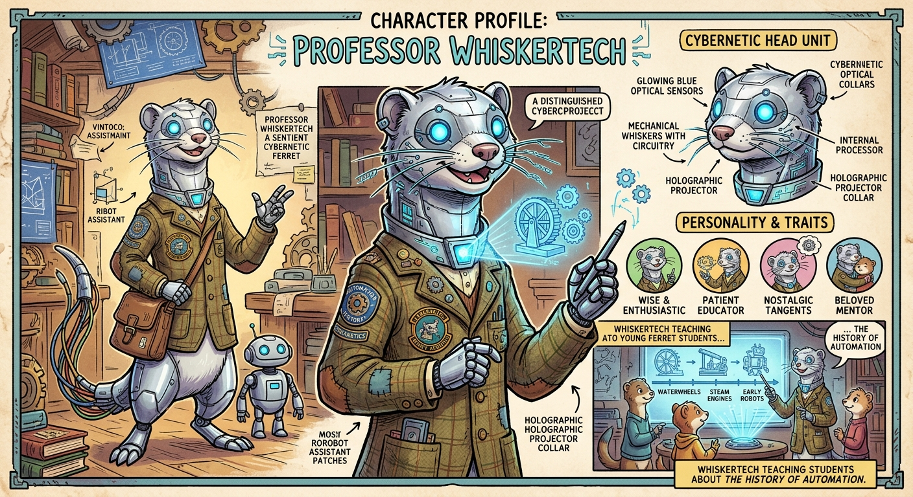
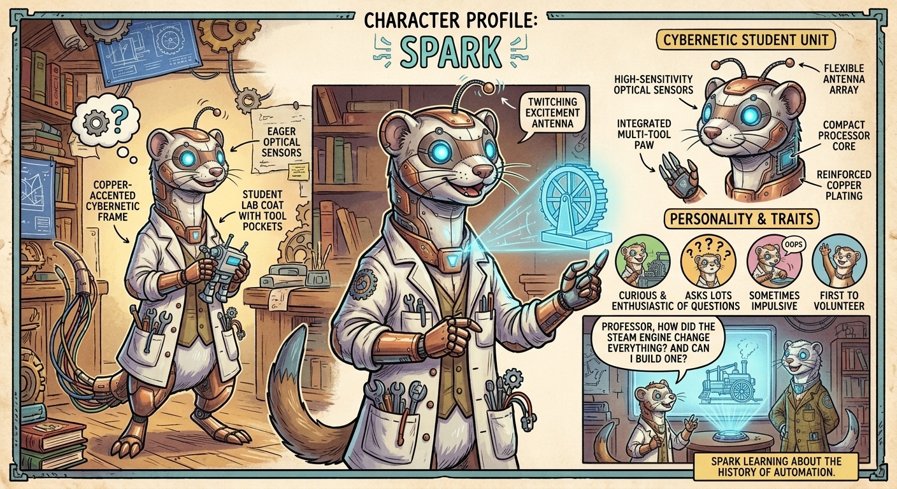
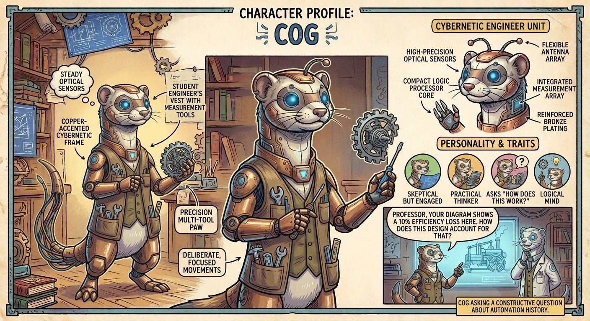
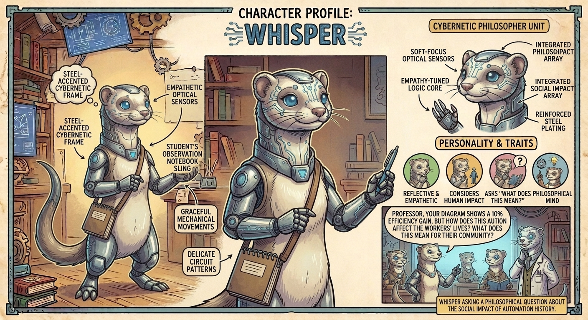
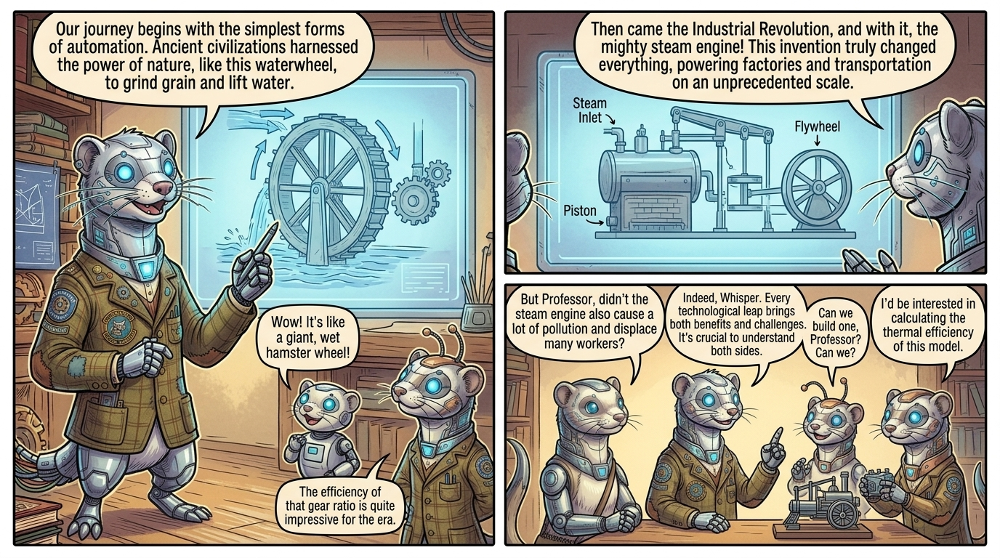
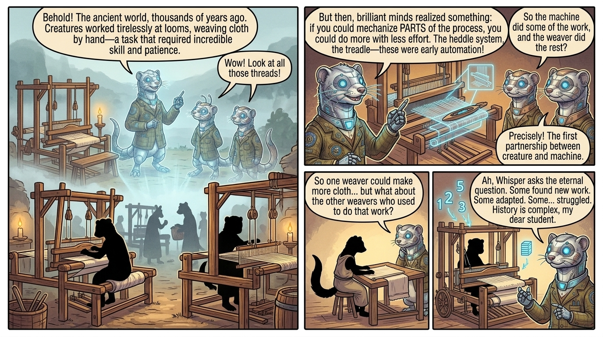
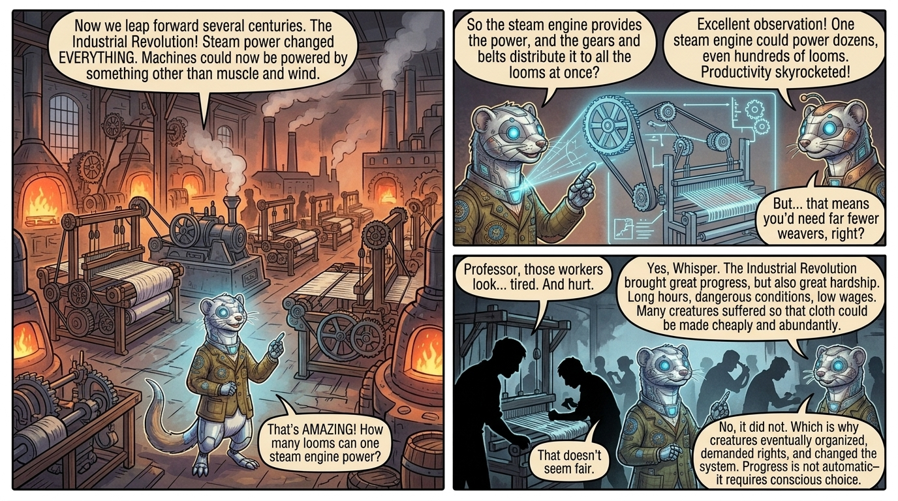
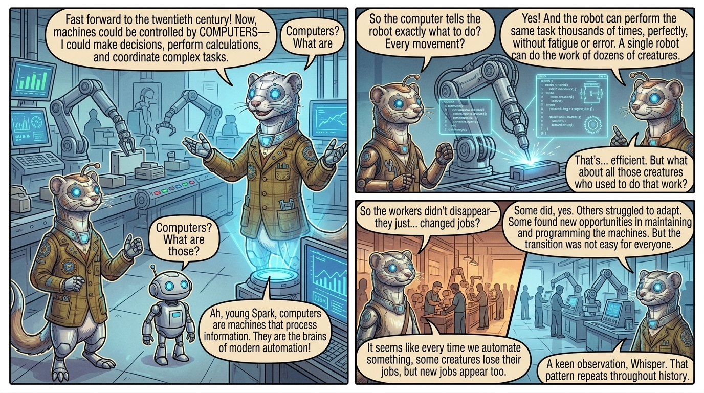
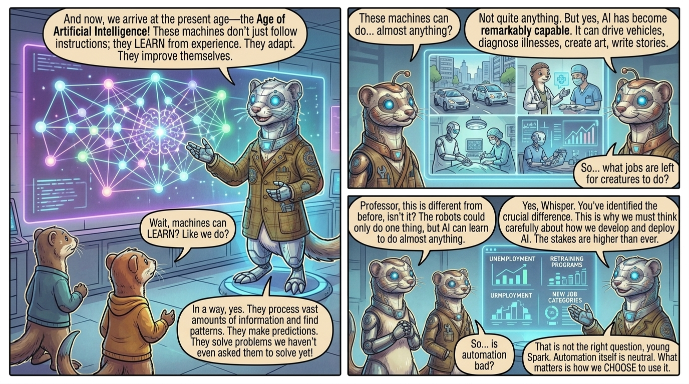
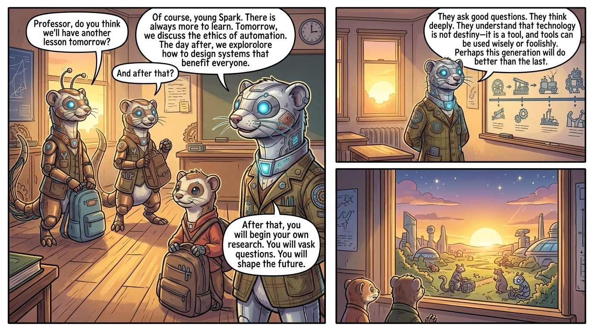

# Comic Book Generation Task

## Generated Script

Full Script

# Whiskertech's Automation Academy: A Ferret's Guide to the History of Labor Automation
*Professor Whiskertech, a distinguished cybernetic ferret scholar, guides a class of curious young ferrets through the fascinating history of automation—from ancient mechanical looms to modern AI systems. Through interactive lessons, holographic demonstrations, and time-traveling educational sequences, the students discover how automation has shaped civilization and what it means for their own technologically-advanced society.*
## Characters
- **Professor Whiskertech**: Wise, enthusiastic educator with infectious passion for automation history. Patient and engaging with students, uses humor and metaphors to explain complex concepts. Occasionally gets lost in nostalgic tangents about 'the old days.' Beloved mentor to younger ferret students; represents the bridge between past and future. (Distinguished cybernetic ferret with silver metallic fur that catches the light, glowing blue optical sensors that pulse with intelligence, mechanical whiskers with intricate circuit patterns etched along their length, wearing a vintage professor's jacket with tech-integrated patches and a small holographic projector embedded in the collar)
- **Spark**: Curious, enthusiastic, asks lots of questions, sometimes impulsive, represents the 'why' generation. Classmate and friend to other students; often the first to volunteer. (Copper-accented cybernetic ferret with bright, eager optical sensors, smaller mechanical frame, wearing a student lab coat with various tool pockets, has a small antenna that twitches when excited)
- **Cog**: Skeptical but ultimately engaged, practical thinker, asks 'how does this work?' questions, represents the logical mind. Classmate to other students; often challenges Professor Whiskertech's points constructively. (Bronze-accented cybernetic ferret with steady, focused optical sensors, slightly larger mechanical frame suggesting strength, wearing a student engineer's vest with measurement tools, has precise, deliberate movements)
- **Whisper**: Reflective, empathetic, considers the human/social impact of technology, asks 'what does this mean?' questions, represents the philosophical mind. Classmate to other students; often provides emotional perspective. (Steel-accented cybernetic ferret with softer optical sensors, graceful mechanical movements, wearing a student's observation notebook on a sling, has delicate circuit patterns visible on her face)
## Script
### Page 1
**Row 1**
- Panel 1: Wide establishing shot of the entire classroom. Professor Whiskertech stands at the center, his silver metallic fur gleaming in the morning light, blue optical sensors brightening as he powers up for the day. His professor's jacket is immaculate, with holographic patches displaying equations and historical dates. Around him, three student ferrets are arriving: Spark bouncing excitedly, Cog moving methodically to his seat, and Whisper observing everything thoughtfully.
  - **Professor Whiskertech**: "Ah, good morning, my curious young scholars! Today, we embark on a journey through TIME itself—the magnificent history of automation!"
  - **Spark**: "Professor! Professor! Are we going to see the ancient machines today?"
  - *Caption*: Whiskertech's Automation Academy - A place where history comes alive through technology
- Panel 2: Close-up of Professor Whiskertech's face, his blue optical sensors glowing brightly, mechanical whiskers twitching with excitement. A holographic display activates near his collar, showing a timeline stretching from ancient times to the far future.
  - **Professor Whiskertech**: "Indeed, Spark! But first, let me ask you all—what IS automation? Can anyone tell me?"
  - **Cog**: "It's when machines do work instead of... well, instead of us doing it?"
  - *Caption*: The question that would shape civilization itself
- Panel 3: The three student ferrets gathered around the central table, their optical sensors reflecting the glowing 3D timeline. Whisper's expression is thoughtful, Cog is examining the timeline critically, and Spark is practically vibrating with excitement. The lighting is warm and inviting.
  - **Whisper**: "But Professor, doesn't that mean fewer ferrets—or creatures—are needed to do work? What happens to them?"
  - **Professor Whiskertech**: "Ah! An excellent question, Whisper. That is precisely why we study history. Come, let us begin at the very beginning..."
  - *Caption*: The questions we ask today shape the future we build tomorrow
### Page 2
**Row 1**
- Panel 1: The classroom dissolves into a holographic scene. Professor Whiskertech and the three student ferrets stand within the projection, appearing as ghostly figures within the historical recreation. Around them, ancient looms operate with creatures working at them. The looms are intricate wooden structures with threads and mechanisms visible.
  - **Professor Whiskertech**: "Behold! The ancient world, thousands of years ago. Creatures worked tirelessly at looms, weaving cloth by hand—a task that required incredible skill and patience."
  - **Spark**: "Wow! Look at all those threads!"
  - *Caption*: The First Automation: When ingenuity met necessity
- Panel 2: A close-up of an ancient loom mechanism. Professor Whiskertech's mechanical whiskers glow as he points out specific parts. A holographic overlay highlights the mechanical innovations: the heddle system, the shuttle mechanism, the treadle. The lighting emphasizes the clever engineering.
  - **Professor Whiskertech**: "But then, brilliant minds realized something: if you could mechanize PARTS of the process, you could do more with less effort. The heddle system, the treadle—these were early automation!"
  - **Cog**: "So the machine did some of the work, and the weaver did the rest?"
  - **Professor Whiskertech**: "Precisely! The first partnership between creature and machine."
  - *Caption*: The Heddle System: Humanity's first step toward automation
- Panel 3: A split-panel showing before and after. On the left, a single weaver at a basic loom producing one piece of cloth. On the right, the same weaver at an improved loom with mechanical assistance, producing multiple pieces. Holographic numbers float above showing increased productivity. Whisper looks thoughtful, considering the implications.
  - **Whisper**: "So one weaver could make more cloth... but what about the other weavers who used to do that work?"
  - **Professor Whiskertech**: "Ah, Whisper asks the eternal question. Some found new work. Some adapted. Some... struggled. History is complex, my dear student."
  - *Caption*: The First Disruption: Progress and its consequences
### Page 3
**Row 1**
- Panel 1: A sweeping panoramic view of an industrial factory floor. Dozens of mechanical looms operate simultaneously, powered by a central steam engine. Gears, belts, and shafts transfer power throughout the facility. The holographic recreation shows the interconnected nature of the machinery. Professor Whiskertech stands in the foreground, his silver fur reflecting the orange glow of the furnaces.
  - **Professor Whiskertech**: "Now we leap forward several centuries. The Industrial Revolution! Steam power changed EVERYTHING. Machines could now be powered by something other than muscle and wind."
  - **Spark**: "That's AMAZING! How many looms can one steam engine power?"
  - *Caption*: The Industrial Revolution: When steam met ambition
- Panel 2: A detailed technical diagram showing how a steam engine connects to multiple looms through a system of belts and gears. The diagram is overlaid on the holographic scene. Cog leans in, studying the mechanics intently, his optical sensors brightening as he understands the system. The lighting emphasizes the mechanical precision.
  - **Cog**: "So the steam engine provides the power, and the gears and belts distribute it to all the looms at once?"
  - **Professor Whiskertech**: "Excellent observation! One steam engine could power dozens, even hundreds of looms. Productivity skyrocketed!"
  - **Cog**: "But... that means you'd need far fewer weavers, right?"
  - *Caption*: The Power Multiplier: One engine, infinite potential
- Panel 3: A darker, more somber panel showing the human cost. Holographic silhouettes of workers crowd around the machinery, some looking exhausted, some injured. The lighting is harsh and cold, contrasting with the previous warm tones. Whisper's expression shows concern and empathy. The composition emphasizes the crowding and intensity of factory work.
  - **Whisper**: "Professor, those workers look... tired. And hurt."
  - **Professor Whiskertech**: "Yes, Whisper. The Industrial Revolution brought great progress, but also great hardship. Long hours, dangerous conditions, low wages. Many creatures suffered so that cloth could be made cheaply and abundantly."
  - **Whisper**: "That doesn't seem fair."
  - **Professor Whiskertech**: "No, it did not. Which is why creatures eventually organized, demanded rights, and changed the system. Progress is not automatic—it requires conscious choice."
  - *Caption*: The Cost of Progress: A lesson history teaches us
### Page 4
**Row 1**
- Panel 1: A futuristic factory floor (from the perspective of the 20th century). Robotic arms move with mechanical precision, assembling products. Computer screens display production data. The holographic scene shows the stark contrast to the previous industrial era—no steam, no smoke, just clean, efficient automation. Professor Whiskertech gestures expansively, his optical sensors reflecting the blue glow of computer screens.
  - **Professor Whiskertech**: "Fast forward to the twentieth century! Now, machines could be controlled by COMPUTERS—devices that could make decisions, perform calculations, and coordinate complex tasks."
  - **Spark**: "Computers? What are those?"
  - **Professor Whiskertech**: "Ah, young Spark, computers are machines that process information. They are the brains of modern automation!"
  - *Caption*: The Digital Revolution: When machines learned to think
- Panel 2: A close-up of a robotic arm performing a precise task—perhaps welding or assembly. The arm moves with inhuman precision and speed. Holographic overlays show the computer code controlling the arm's movements, the sensors providing feedback, and the decision-making process. Cog watches intently, fascinated by the logic and precision.
  - **Cog**: "So the computer tells the robot exactly what to do? Every movement?"
  - **Professor Whiskertech**: "Yes! And the robot can perform the same task thousands of times, perfectly, without fatigue or error. A single robot can do the work of dozens of creatures."
  - **Cog**: "That's... efficient. But what about all those creatures who used to do that work?"
  - *Caption*: Precision Without Fatigue: The robot's gift and curse
- Panel 3: A split-panel showing the transition. On the left, a factory floor crowded with workers performing repetitive tasks. On the right, the same factory with robotic arms and far fewer workers, who are now monitoring and maintaining the machines. The lighting shifts from warm (left) to cool (right), emphasizing the change. Whisper observes both scenes thoughtfully.
  - **Whisper**: "So the workers didn't disappear—they just... changed jobs?"
  - **Professor Whiskertech**: "Some did, yes. Others struggled to adapt. Some found new opportunities in maintaining and programming the machines. But the transition was not easy for everyone."
  - **Whisper**: "It seems like every time we automate something, some creatures lose their jobs, but new jobs appear too."
  - **Professor Whiskertech**: "A keen observation, Whisper. That pattern repeats throughout history."
  - *Caption*: Disruption and Adaptation: The eternal cycle
### Page 5
**Row 1**
- Panel 1: A vast holographic display showing a neural network—nodes of light connected by glowing lines, representing how AI systems learn and make decisions. Professor Whiskertech stands before it, his mechanical whiskers glowing in sync with the network. The three student ferrets watch in awe. The lighting creates an almost magical atmosphere.
  - **Professor Whiskertech**: "And now, we arrive at the present age—the Age of Artificial Intelligence! These machines don't just follow instructions; they LEARN from experience. They adapt. They improve themselves."
  - **Spark**: "Wait, machines can LEARN? Like we do?"
  - **Professor Whiskertech**: "In a way, yes. They process vast amounts of information and find patterns. They make predictions. They solve problems we haven't even asked them to solve yet!"
  - *Caption*: Artificial Intelligence: When machines became students too
- Panel 2: A montage of AI applications: autonomous vehicles navigating city streets, AI systems diagnosing diseases, robots performing surgery with precision, AI analyzing data to predict trends. Each application is shown in a small panel within the larger holographic display. The lighting is bright and optimistic, showing the beneficial applications of AI. Cog's expression shows both fascination and concern.
  - **Cog**: "These machines can do... almost anything?"
  - **Professor Whiskertech**: "Not quite anything. But yes, AI has become remarkably capable. It can drive vehicles, diagnose illnesses, create art, write stories, and much more."
  - **Cog**: "So... what jobs are left for creatures to do?"
  - *Caption*: The Capability Explosion: AI reaches into every field
- Panel 3: A more contemplative scene. The three student ferrets stand together, looking at a holographic display showing unemployment statistics, retraining programs, and new job categories that didn't exist before. The lighting is softer, more introspective. Whisper looks particularly thoughtful, while Spark seems uncertain and Cog analytical.
  - **Whisper**: "Professor, this is different from before, isn't it? The robots could only do one thing, but AI can learn to do almost anything."
  - **Professor Whiskertech**: "Yes, Whisper. You've identified the crucial difference. This is why we must think carefully about how we develop and deploy AI. The stakes are higher than ever."
  - **Spark**: "So... is automation bad?"
  - **Professor Whiskertech**: "That is not the right question, young Spark. Automation itself is neutral. What matters is how we CHOOSE to use it."
  - *Caption*: The Crucial Question: Not whether to automate, but how
### Page 6
**Row 1**
- Panel 1: The holographic scenes dissolve, and the three student ferrets find themselves back in the classroom. But now they see it differently—the artifacts from different eras are arranged chronologically around the room, creating a physical timeline. Professor Whiskertech stands at the center, his silver fur glowing warmly in the afternoon light. His optical sensors are soft and kind, not bright and intense.
  - **Professor Whiskertech**: "And so, my young scholars, we return to the present. What have we learned?"
  - **Spark**: "That automation keeps getting more powerful?"
  - **Cog**: "That it changes how creatures work, sometimes for better, sometimes for worse?"
  - **Whisper**: "That we have to choose how to use it wisely?"
  - *Caption*: The Classroom of History: Where past and future meet
- Panel 2: A close-up of Professor Whiskertech, his expression warm and wise. His mechanical whiskers glow softly as he speaks. Behind him, a holographic display shows the complete timeline of automation history, from ancient looms to modern AI. The lighting emphasizes his role as a bridge between past and future.
  - **Professor Whiskertech**: "All three of you are correct. But there is something more important: WE are the proof that automation can lead to flourishing. We ferrets have evolved, adapted, and thrived. We've learned to work WITH machines, not against them. We've built a society where technology serves our needs."
  - **Cog**: "But how did we do that? How did we avoid the problems you described?"
  - *Caption*: The Ferret Perspective: A species that learned to dance with machines
- Panel 3: A wide shot showing all four ferrets—Professor Whiskertech and the three students—standing together, looking out a large window at a beautiful, technologically advanced landscape. The view shows a harmonious blend of nature and technology: buildings with living walls, autonomous vehicles moving smoothly, robots working alongside creatures, and green spaces integrated throughout. The lighting is golden and hopeful. The composition emphasizes unity and possibility.
  - **Professor Whiskertech**: "We made conscious choices. We invested in education—like this academy. We ensured that as jobs changed, creatures had the skills to adapt. We created safety nets for those who struggled. We asked ourselves: 'How can automation serve everyone, not just the wealthy?'"
  - **Whisper**: "So automation isn't good or bad—it's what we DO with it that matters?"
  - **Professor Whiskertech**: "Precisely, Whisper. And that is why you must study history. Because the future is not predetermined. It is something we CREATE together."
  - *Caption*: The Future is Unwritten: A lesson for every generation
**Row 2**
- Panel 1: The three student ferrets are packing up their materials, preparing to leave for the day. They're discussing what they've learned, their optical sensors glowing softly in the sunset light. Professor Whiskertech watches them with pride, his mechanical whiskers twitching with satisfaction. The classroom is bathed in golden light.
  - **Spark**: "Professor, do you think we'll have another lesson tomorrow?"
  - **Professor Whiskertech**: "Of course, young Spark. There is always more to learn. Tomorrow, we discuss the ethics of automation. The day after, we explore how to design systems that benefit everyone."
  - **Cog**: "And after that?"
  - **Professor Whiskertech**: "After that, you will begin your own research. You will ask your own questions. You will shape the future."
  - *Caption*: Learning Never Ends: Each generation builds on the last
- Panel 2: A final, poignant image: Professor Whiskertech stands alone in the classroom as the sun sets, looking at the timeline of automation history displayed around the room. His expression is one of satisfaction and hope. His optical sensors glow softly, reflecting the golden light. The composition emphasizes his role as a keeper of knowledge and a guide to the future.
  - **Professor Whiskertech**: "They ask good questions. They think deeply. They understand that technology is not destiny—it is a tool, and tools can be used wisely or foolishly. Perhaps this generation will do better than the last."
  - *Caption*: The Keeper of History: Passing wisdom to the future
- Panel 3: A final, hopeful image showing the view from the classroom window at sunset. The technologically advanced landscape is bathed in golden light. Creatures and machines work together harmoniously. The sky shows both the setting sun and the first stars of evening, suggesting both the end of one day and the beginning of another. The mood is peaceful and full of possibility.
  - *Caption*: The History of Automation is the History of Choice. What will we choose tomorrow?

## Auto-Fix Mode

Auto-applying: proceeding directly to visual generation.

## Character: Professor Whiskertech

*Wise, enthusiastic educator with infectious passion for automation history. Patient and engaging with students, uses humor and metaphors to explain complex concepts. Occasionally gets lost in nostalgic tangents about 'the old days.' Beloved mentor to younger ferret students; represents the bridge between past and future.*

## Character: Spark

*Curious, enthusiastic, asks lots of questions, sometimes impulsive, represents the 'why' generation. Classmate and friend to other students; often the first to volunteer.*

## Character: Cog

*Skeptical but ultimately engaged, practical thinker, asks 'how does this work?' questions, represents the logical mind. Classmate to other students; often challenges Professor Whiskertech's points constructively.*

## Character: Whisper

*Reflective, empathetic, considers the human/social impact of technology, asks 'what does this mean?' questions, represents the philosophical mind. Classmate to other students; often provides emotional perspective.*

