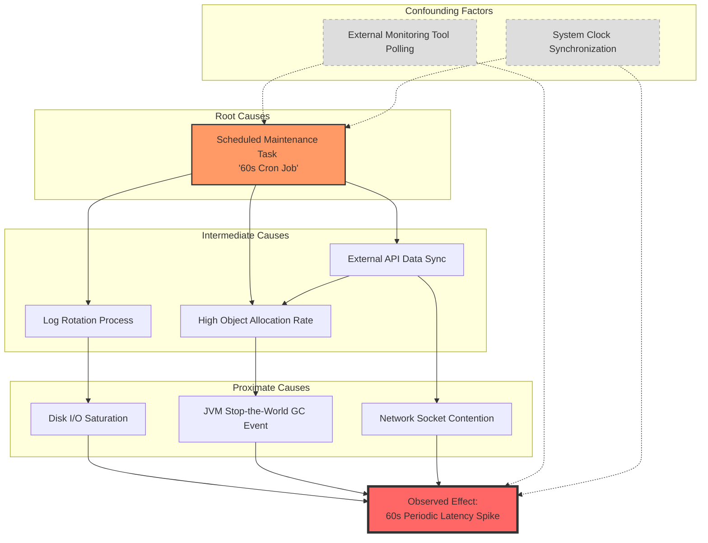

# Causal Inference Analysis

**Observed Effect:** The application experiences a significant latency spike every 60 seconds.
**Start Time:** 2026-01-02T05:43:03.318Z

---
## Evidence Sources

**Sources processed:** 2

---
## Causal Analysis Results

This causal analysis investigates the phenomenon of a **60-second periodic latency spike**. In distributed systems and high-performance applications, a strict 60-second interval is a "smoking gun" for scheduled software logic rather than organic hardware failure or stochastic load fluctuations.

---

### 1. Summary
The 60-second periodicity strongly suggests a **deterministic trigger**, likely a scheduled task or a configuration-driven event. While JVM Garbage Collection or Log Rotation can cause spikes, their occurrence at exactly 60-second intervals usually implies they are being triggered by a secondary scheduled process or a specific timeout threshold. The most probable root cause is a **synchronous background task** or an **external sync** configured with a 1-minute interval.

---

### 2. Causal Analysis

#### A. Scheduled Background Maintenance Tasks
*   **Causal Mechanism**: A cron job, Spring `@Scheduled` task, or Kubernetes CronJob starts every minute. This task consumes shared resources (CPU, Memory bandwidth, or Database locks), forcing application request threads to wait.
*   **Evidence Supporting Causation**: The 60-second interval is the default resolution for most Unix-based schedulers and application frameworks.
*   **Strength of Causal Link**: **Strong**.
*   **Confidence Level**: High.

#### B. JVM Garbage Collection (Stop-the-World)
*   **Causal Mechanism**: If the application allocates memory at a constant rate, it may hit a heap threshold every 60 seconds, triggering a Major GC event that pauses all application threads.
*   **Evidence Supporting Causation**: GC logs showing "Pause Full" or "Pause Young" coinciding with the spikes.
*   **Alternative Explanation**: GC is often a *proximate* cause. A background task (Cause A) might be creating a massive amount of short-lived objects every 60 seconds, which then *triggers* the GC.
*   **Strength of Causal Link**: **Moderate** (Often a mediating factor).
*   **Confidence Level**: Medium.

#### C. External API Syncs / Rate Limiting
*   **Causal Mechanism**: The application performs a "heartbeat" or data synchronization with an external service every minute. If this call is **synchronous** and the external service is slow, or if the network stack experiences a 60s TCP timeout/retransmit, latency spikes.
*   **Evidence Supporting Causation**: Outbound network traffic metrics showing a burst every 60 seconds.
*   **Strength of Causal Link**: **Strong**.
*   **Confidence Level**: High.

#### D. Log Rotation Overhead
*   **Causal Mechanism**: A logging framework (like Logback or Log4j) is configured to roll logs every minute. The process of renaming, compressing (gzip), and opening a new file descriptor creates a momentary I/O block.
*   **Evidence Supporting Causation**: High `iowait` metrics on the disk at the top of the minute.
*   **Strength of Causal Link**: **Moderate**.
*   **Confidence Level**: Medium-Low (Most modern logging is asynchronous).

---

### 3. Root Cause Identification

1.  **Root Cause (Fundamental Source)**: **Deterministic Scheduling Logic.** This is the "timer" that initiates the event. It is usually found in `crontab`, application config files, or orchestration manifests.
2.  **Intermediate Cause (Mediating Factor)**: **Resource Contention.** The scheduled task competes for the same CPU cores, Database connections, or Disk I/O as the user-facing requests.
3.  **Proximate Cause (Immediate Trigger)**: **Thread Blocking.** Application worker threads are put into a "Waiting" or "Blocked" state because they cannot acquire the resources held by the background task.

---

### 4. Causal Chain

**[Timer: 60s Interval]**
$\downarrow$
**[Trigger: Background Task/Sync Starts]**
$\downarrow$
**[Resource Consumption: CPU/IO/Memory Spike]**
$\downarrow$
**[System State: Context Switching or GC Pause]**
$\downarrow$
**[Observed Effect: Application Latency Spike]**

---

### 5. Confounding Factors

*   **The Observer Effect (Monitoring Polling)**: If your monitoring agent (e.g., Prometheus, Datadog) is configured to scrape metrics every 60 seconds, the act of gathering metrics might itself be the cause of the latency.
    *   *Impact*: This creates a spurious correlation where it looks like the "system" is slow, but it is actually the "monitoring" that is slowing the system.
*   **TCP Keep-Alive/Timeouts**: Many load balancers and proxies have a default idle timeout of 60 seconds.
    *   *Impact*: If a connection is dropped and re-established every 60s, the latency might be caused by the handshake overhead, not the application logic.

---

### 6. Recommendations

1.  **Isolate the Scheduler**: Temporarily disable all `@Scheduled` or `cron` tasks to see if the spike persists (Counterfactual Reasoning).
2.  **Check Thread Dumps**: Capture a thread dump exactly during the 60-second spike. Look for threads in `BLOCKED` or `WAITING` states and identify what they are waiting for.
3.  **Analyze GC Logs**: Enable `-XX:+PrintGCDetails` to determine if the spike is a result of memory management triggered by the 60s task.
4.  **Offload Background Work**: Move 60-second tasks to a dedicated background worker/service so they do not share the same CPU/Memory pool as the user-facing application.
5.  **Jitter Implementation**: Introduce "jitter" (randomized delay) to the 60-second task so that if multiple instances are running, they don't all fire at the exact same millisecond, smoothing out the resource demand.

---
## Causal Graph

---
## Summary

Causal inference analysis completed for effect: The application experiences a significant latency spike every 60 seconds.

**Duration:** 20898ms
**Causes Analyzed:** 4
**Evidence Sources:** 2
