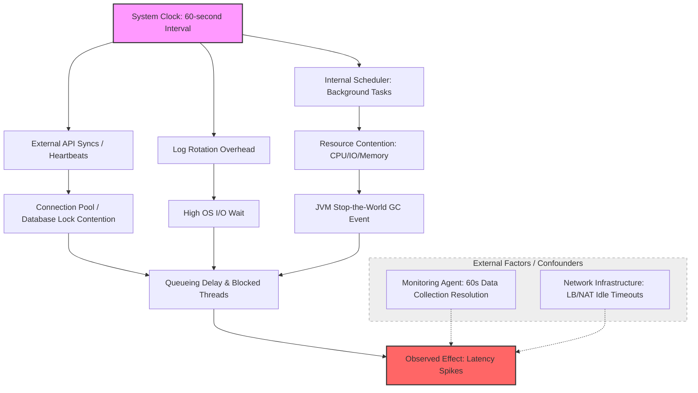

# Causal Inference Analysis

**Observed Effect:** The application experiences a significant latency spike every 60 seconds.
**Start Time:** 2026-01-09T16:28:18.747Z

---
## Evidence Sources

**Sources processed:** 2

---
## Causal Analysis Results

### Summary
The 60-second periodicity indicates a clock-driven trigger, likely a scheduled background task or synchronized external dependency causing resource bursts, rather than stochastic user traffic.

### Identified Causes
- **Scheduled Background Maintenance Tasks** (Strong): A software scheduler triggers a heavy task (e.g., cache refreshing, database cleanup) that consumes CPU cycles or holds database locks, forcing incoming requests to queue.
- **JVM Garbage Collection (Stop-the-World)** (Moderate): Constant memory allocation hits a heap threshold every 60 seconds, or JVM configurations force a GC, triggering a Stop-the-World event.
- **External API Syncs / Rate Limiting** (Strong): A heartbeat or data sync with an external vendor every 60 seconds blocks a shared connection pool, stalling other threads.
- **Log Rotation Overhead** (Weak): A logging daemon or framework checks/rotates files every minute, causing I/O Wait spikes during compression or disk operations.

### Root Causes
- Misconfigured or Unoptimized Scheduled Task
- Resource Contention (CPU/IO/Memory)
- Queueing Delay

### Causal Chain
1. Trigger: System clock reaches 60-second mark -> 2. Action: Internal Scheduler initiates task -> 3. Resource Impact: Task triggers heavy allocation or Disk I/O -> 4. System Response: JVM triggers Major GC or OS enters high iowait -> 5. Observed Effect: Application threads are paused/blocked, causing latency spikes.

### Confounding Factors
- Monitoring Resolution (The 'Observer Effect'): Overhead from the monitoring agent's own 60-second data collection.
- Network Infrastructure: Load balancer or NAT gateway idle timeouts or session re-validation periods.

### Recommendations
- Task Offloading: Move background tasks to dedicated worker nodes.
- Jitter Injection: Add random delays to scheduled tasks to prevent synchronized spikes.
- Asynchronous Execution: Use background thread pools with lower priority and non-blocking I/O for periodic tasks.
- Profiling: Use tools like async-profiler to identify specific method contention or lock issues.
- GC Tuning: Switch to concurrent collectors like G1GC or ZGC to minimize pauses.

---
## Causal Graph

---
## Summary

Causal inference analysis completed for effect: The application experiences a significant latency spike every 60 seconds.

**Duration:** 32142ms
**Causes Analyzed:** 4
**Evidence Sources:** 2
