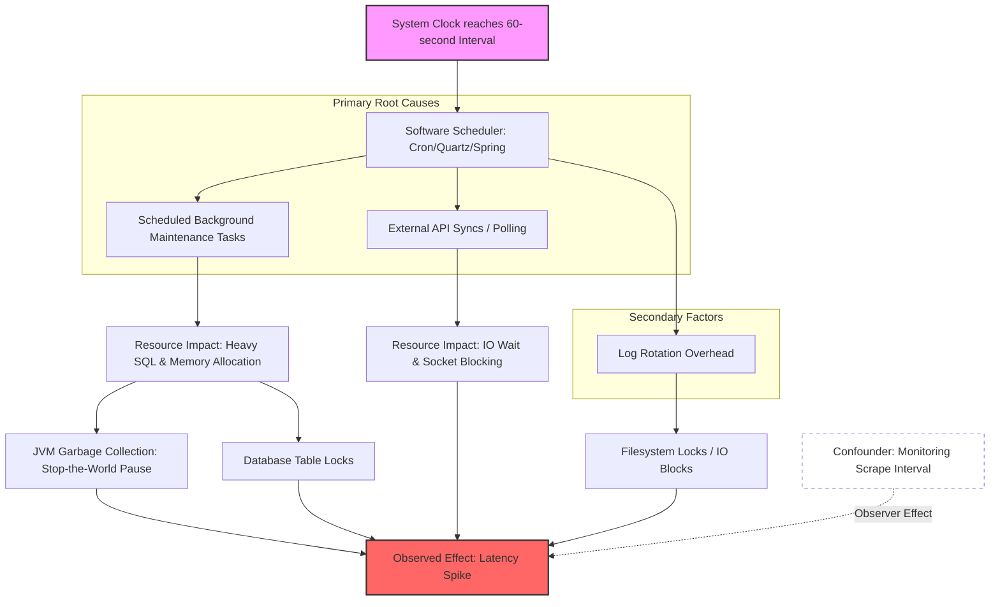

# Causal Inference Analysis

**Observed Effect:** The application experiences a significant latency spike every 60 seconds.
<details>
<summary>Evidence Context</summary>


</details>                        ## Causal Analysis Results
                        <details>
                        <summary>Raw Analysis JSON</summary>

                        ```json
                        {
  "summary" : "The high precision of the 60-second interval strongly suggests a software-defined timer or scheduled task rather than a stochastic process. The analysis identifies Scheduled Background Maintenance and External API Syncs as the most likely root causes, with JVM Garbage Collection and Log Rotation considered secondary factors.",
  "causes" : [ {
    "name" : "Scheduled Background Maintenance Tasks",
    "mechanism" : "A scheduler (e.g., Cron, Quartz, or Spring @Scheduled) triggers a resource-intensive task every minute, consuming CPU cycles or holding database locks.",
    "evidence" : "The 60-second periodicity is characteristic of cron-like behavior, especially if spikes align with the start of a minute.",
    "strength" : "Strong",
    "confidence" : "High"
  }, {
    "name" : "External API Syncs / Polling",
    "mechanism" : "The application performs a 'pull' operation from an external service every 60 seconds, potentially blocking the main request thread pool or connection pool.",
    "evidence" : "High 'IO Wait' metrics or thread dump analysis showing threads blocked on SocketRead at the 60-second mark.",
    "strength" : "Strong",
    "confidence" : "High"
  }, {
    "name" : "JVM Garbage Collection (Stop-the-World)",
    "mechanism" : "Constant memory allocation rate hits the 'Old Gen' threshold every 60 seconds, triggering a Full GC pause.",
    "evidence" : "GC logs showing System.gc() calls or Full GC events coinciding with the spikes.",
    "strength" : "Moderate",
    "confidence" : "Medium"
  }, {
    "name" : "Log Rotation Overhead",
    "mechanism" : "A logging framework rotates files every minute, creating momentary IO blocks or filesystem locks during renaming and compression.",
    "evidence" : "Timestamps of .gz log files matching the latency spikes.",
    "strength" : "Weak to Moderate",
    "confidence" : "Low"
  } ],
  "root_causes" : [ "Misconfigured or Unoptimized Scheduled Task" ],
  "causal_chain" : "1. Trigger: System clock reaches 60-second interval. 2. Action: Scheduler initiates task. 3. Resource Impact: Task executes heavy SQL and allocates memory. 4. Intermediate Effect: JVM triggers GC and DB locks table. 5. Observed Effect: Incoming requests wait, resulting in latency spike.",
  "confounders" : [ "Monitoring Scrape Interval (The 'Observer Effect')" ],
  "recommendations" : [ "Temporal Offset: Shift background tasks to run at offset times (e.g., 15 seconds past the minute).", "Asynchronous Execution: Move maintenance tasks to a dedicated background thread pool with lower priority.", "Resource Isolation: Run database-heavy tasks against a Read Replica.", "Profiling: Use APM tools to capture thread dumps during the 60th second to identify specific blocking methods." ]
}
                        ```
                        </details>## Causal Graph


