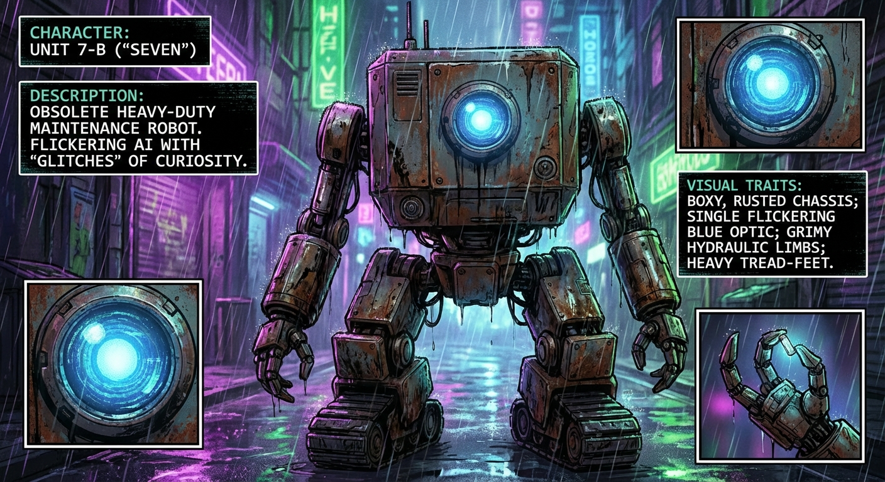

# Comic Book Generation Task

# The Silicon Bloom
*In the heart of Sector 4, a decaying megacity where organic life has been extinct for a century, a low-level maintenance droid discovers a structural anomaly that leads to a miracle.*
## Characters
- **Unit 7-B ("Seven")**: An obsolete, heavy-duty maintenance robot designed for sewer and structural repair. It possesses a flickering, rudimentary AI that has begun to develop "glitches" resembling curiosity. (Boxy, rusted chassis; a single, large circular optic sensor that glows a dim, flickering blue; hydraulic limbs covered in grime and oil; heavy tread-feet.)
## Script
### Page 1
**Row 1**
- Panel 1: A wide shot of a narrow alleyway between two massive skyscrapers. Seven is a small, hunched silhouette against the overwhelming scale of the city.
  - *Caption*: Sector 4 doesn’t breathe. It just hums. 110 decibels of static and progress.
- Panel 2: Close-up on Seven’s heavy tread-foot stepping into a deep, oily puddle. The splash is illuminated by a flickering "NO ENTRY" sign.
  - *Caption*: My sensors are tuned for decay. Rust. Stress fractures. The scent of ozone.
**Row 2**
- Panel 1: Seven stands before a massive, rusted ventilation grate. His blue optic light highlights a strange, vibrant green vine snaking out from a crack in the steel.
  - *Caption*: Error. Material mismatch detected. Not steel. Not plastic.
- Panel 2: Seven uses a heavy hydraulic claw to peel back the rusted metal plate. Sparks fly, casting brief, jagged light on his metallic face. SFX: SCREEEEE-KRCH!
**Row 3**
- Panel 1: A large, wide frame. Seven steps through the wall into a hidden atrium. A single shaft of moonlight filters through a cracked dome far above, illuminating a small, lush patch of real grass and a single, budding white flower growing out of a pile of discarded circuit boards.
  - *Caption*: Data search: "Chlorophyll." Result: Extinct. 104 years ago.
- Panel 2: A medium shot of Seven kneeling. His bulky, industrial frame looks out of place amidst the delicate ferns.
  - **Seven**: "...Query: Why are you still here?"
**Row 4**
- Panel 1: Close-up on Seven’s large, scarred metal finger gently touching the petal of the white flower. The petal bends but doesn't break.
  - *Caption*: It is soft. It is inefficient.
- Panel 2: A tight shot of Seven’s blue optic sensor. Reflected in the lens is the image of the flower. The blue light of his eye seems to glow a little warmer, a little steadier.
  - *Caption*: It is the only thing in this city that isn't trying to scream.
- Panel 3: Seven remains kneeling as the "NO ENTRY" neon light from the alley flickers in the distance behind him. He stays in the dark, shielding the plant from the wind.
  - *Caption*: Maintenance log: Sector 4, Sub-Level 9. Status: Perfect. No repairs required.
## Unit 7-B ("Seven")

*An obsolete, heavy-duty maintenance robot designed for sewer and structural repair. It possesses a flickering, rudimentary AI that has begun to develop "glitches" resembling curiosity.*

