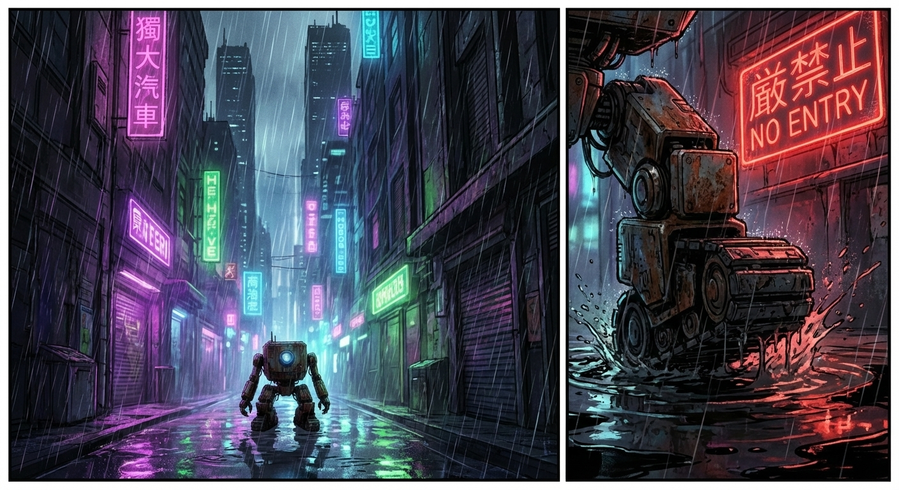
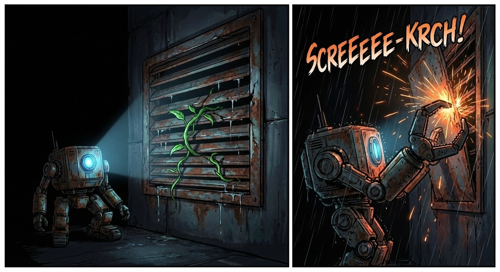
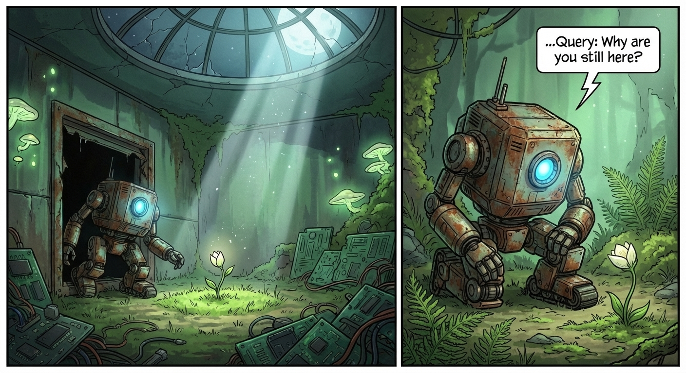
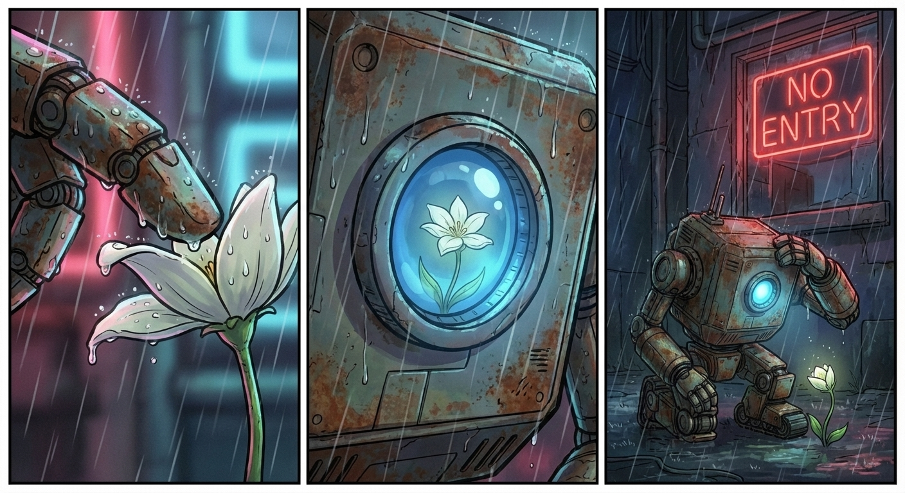

# The Silicon Bloom

## Page 1

*Sector 4 doesn’t breathe. It just hums. 110 decibels of static and progress.*
*My sensors are tuned for decay. Rust. Stress fractures. The scent of ozone.*

*Error. Material mismatch detected. Not steel. Not plastic.*

*Data search: "Chlorophyll." Result: Extinct. 104 years ago.*
**Seven**: ...Query: Why are you still here?

*It is soft. It is inefficient.*
*It is the only thing in this city that isn't trying to scream.*
*Maintenance log: Sector 4, Sub-Level 9. Status: Perfect. No repairs required.*

