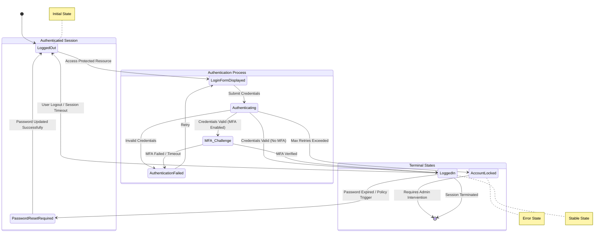

# Finite State Machine Analysis

Model the user authentication lifecycle including MFA, account lockout, and session expiration.

**Started:** 2026-01-02 00:46:28

## Configuration

**Concept:** User Authentication Flow

**Input Files:** None

**Domain:** Web Application Security

**Initial States:** Logged Out

**Known Events:** Submit Credentials, MFA Challenge, Session Timeout, Logout

---

## Step 1: State Identification

### Prompt

```
You are an expert in formal methods and finite state machine modeling. Your task is to analyze a concept and identify all possible states.

## Concept to Model:
User Authentication Flow

## Domain Context:
Web Application Security


## Known Initial States:
- Logged Out


## Instructions:
Identify all possible states for this concept. For each state, provide:

1. **State Name:** Clear, descriptive name
2. **Description:** What this state represents
3. **Type:** (Initial, Normal, Error, Final/Terminal)
4. **Invariants:** Conditions that must be true in this state
5. **Entry Conditions:** What must happen to enter this state
6. **Exit Conditions:** What can cause leaving this state

Consider:
- Normal operational states
- Error or exception states
- Transient vs stable states
- Initial and final states

Provide a comprehensive list of states with detailed descriptions.
```

### Response

This formal analysis models the **User Authentication Flow** as a Finite State Machine (FSM). In the context of Web Application Security, we must account for not only the "happy path" but also security-critical states like multi-factor challenges and account throttling.

---

### 1. State: Logged Out
*   **Description:** The default state where no user identity is associated with the current session.
*   **Type:** Initial
*   **Invariants:** No valid session token exists in the client storage (cookies/localStorage); `isAuthenticated` flag is `false`.
*   **Entry Conditions:** Application initialization; explicit logout action; system-wide session clearing.
*   **Exit Conditions:** User navigates to the login interface or initiates an OAuth flow.

### 2. State: Awaiting Primary Credentials
*   **Description:** The system is ready to receive the user's primary identifiers (e.g., username/email and password).
*   **Type:** Normal
*   **Invariants:** Login UI is rendered; Rate-limiting counters are active for the current IP.
*   **Entry Conditions:** User navigates to the login page; Session expires while on a protected route.
*   **Exit Conditions:** User submits credentials (moves to *Validating*); User cancels/navigates away.

### 3. State: Validating Credentials
*   **Description:** A transient state where the system performs cryptographic verification of the password and checks account status.
*   **Type:** Normal (Transient)
*   **Invariants:** System is processing; UI is in a "loading" or "disabled" state to prevent double-submission.
*   **Entry Conditions:** Submission of the primary credential form.
*   **Exit Conditions:** 
    *   **Success:** Transition to *MFA Challenge Pending* or *Authenticated*.
    *   **Failure:** Transition back to *Awaiting Primary Credentials* (with error) or *Account Locked*.

### 4. State: MFA Challenge Pending
*   **Description:** Primary credentials are correct, but the system requires a second factor (TOTP, SMS, WebAuthn).
*   **Type:** Normal
*   **Invariants:** Primary identity is verified but `isFullyAuthenticated` is `false`; A temporary "pre-auth" token may exist.
*   **Entry Conditions:** Successful primary credential validation where MFA is enabled for the account.
*   **Exit Conditions:** 
    *   **Success:** Transition to *Authenticated*.
    *   **Failure:** Transition to *Logged Out* (after max attempts) or *Awaiting Primary Credentials*.

### 5. State: Password Reset Required
*   **Description:** The user has successfully authenticated, but the system policy requires a password change before granting access to resources.
*   **Type:** Normal (Transient)
*   **Invariants:** User identity is known; Access to the main application API is restricted to the "Password Update" endpoint only.
*   **Entry Conditions:** Successful authentication but `password_expired` flag is `true` or `force_reset` is `true`.
*   **Exit Conditions:** Successful password update (moves to *Authenticated*).

### 6. State: Authenticated (Session Active)
*   **Description:** The user has successfully proven their identity and holds a valid, active session.
*   **Type:** Normal
*   **Invariants:** Valid session token (JWT or Session ID) exists; User permissions are loaded; `isAuthenticated` is `true`.
*   **Entry Conditions:** Successful completion of all required authentication factors.
*   **Exit Conditions:** User clicks "Logout"; Session idle timeout reached; Token revoked by admin; Security context change (e.g., IP change detection).

### 7. State: Account Locked
*   **Description:** The account is temporarily or permanently disabled due to security policy violations (e.g., brute force protection).
*   **Type:** Error / Security
*   **Invariants:** Authentication attempts for this specific username are rejected regardless of credential validity.
*   **Entry Conditions:** Failed login attempts exceed the defined threshold (e.g., 5 attempts).
*   **Exit Conditions:** Expiration of lockout timer; Manual administrative unlock; Successful "Unlock Account" flow via email.

### 8. State: Session Expired
*   **Description:** A previously valid session has become invalid due to time constraints.
*   **Type:** Terminal (Transient)
*   **Invariants:** Session token exists but is rejected by the server; User context is stale.
*   **Entry Conditions:** Current time > `session_expiry_time`.
*   **Exit Conditions:** Automatic redirection to *Logged Out* or *Awaiting Primary Credentials*.

### 9. State: Authentication Error
*   **Description:** A generic state for handling system-level failures during the auth process (e.g., Database down, OIDC provider unreachable).
*   **Type:** Error
*   **Invariants:** User is not authenticated; Error message is displayed to the user.
*   **Entry Conditions:** Exception thrown during validation; Network failure during MFA.
*   **Exit Conditions:** User retries (moves to *Awaiting Primary Credentials*).

---

### Summary Table for Formal Logic

| Current State | Event | Next State |
| :--- | :--- | :--- |
| **Logged Out** | Navigate to Login | **Awaiting Primary Credentials** |
| **Awaiting Primary Credentials** | Submit Form | **Validating Credentials** |
| **Validating Credentials** | Valid Creds (No MFA) | **Authenticated** |
| **Validating Credentials** | Valid Creds (MFA Req) | **MFA Challenge Pending** |
| **Validating Credentials** | Invalid Creds (< Threshold) | **Awaiting Primary Credentials** |
| **Validating Credentials** | Invalid Creds (> Threshold) | **Account Locked** |
| **MFA Challenge Pending** | Valid Code | **Authenticated** |
| **Authenticated** | Logout / Timeout | **Logged Out** |
| **Account Locked** | Timer Expires | **Logged Out** |

---

## Step 2: Transition Analysis

### Prompt

```
Based on the states identified above, now identify all possible state transitions.

## States Analysis:
This formal analysis models the **User Authentication Flow** as a Finite State Machine (FSM). In the context of Web Application Security, we must account for not only the "happy path" but also security-critical states like multi-factor challenges and account throttling.

---

### 1. State: Logged Out
*   **Description:** The default state where no user identity is associated with the current session.
*   **Type:** Initial
*   **Invariants:** No valid session token exists in the client storage (cookies/localStorage); `isAuthenticated` flag is `false`.
*   **Entry Conditions:** Application initialization; explicit logout action; system-wide session clearing.
*   **Exit Conditions:** User navigates to the login interface or initiates an OAuth flow.

### 2. State: Awaiting Primary Credentials
*   **Description:** The system is ready to receive the user's primary identifiers (e.g., username/email and password).
*   **Type:** Normal
*   **Invariants:** Login UI is rendered; Rate-limiting counters are active for the current IP.
*   **Entry Conditions:** User navigates to the login page; Session expires while on a protected route.
*   **Exit Conditions:** User submits credentials (moves to *Validating*); User cancels/navigates away.

### 3. State: Validating Credentials
*   **Description:** A transient state where the system performs cryptographic verification of the password and checks account status.
*   **Type:** Normal (Transient)
*   **Invariants:** System is processing; UI is in a "loading" or "disabled" state to prevent double-submission.
*   **Entry Conditions:** Submission of the primary credential form.
*   **Exit Conditions:** 
    *   **Success:** Transition to *MFA Challenge Pending* or *Authenticated*.
    *   **Failure:** Transition back to *Awaiting Primary Credentials* (with error) or *Account Locked*.

### 4. State: MFA Challenge Pending
*   **Description:** Primary credentials are correct, but the system requires a second factor (TOTP, SMS, WebAuthn).
*   **Type:** Normal
*   **Invariants:** Primary identity is verified but `isFullyAuthenticated` is `false`; A temporary "pre-auth" token may exist.
*   **Entry Conditions:** Successful primary credential validation where MFA is enabled for the account.
*   **Exit Conditions:** 
    *   **Success:** Transition to *Authenticated*.
    *   **Failure:** Transition to *Logged Out* (after max attempts) or *Awaiting Primary Credentials*.

### 5. State: Password Reset Required
*   **Description:** The user has successfully authenticated, but the system policy requires a password change before granting access to resources.
*   **Type:** Normal (Transient)
*   **Invariants:** User identity is known; Access to the main application API is restricted to the "Password Update" endpoint only.
*   **Entry Conditions:** Successful authentication but `password_expired` flag is `true` or `force_reset` is `true`.
*   **Exit Conditions:** Successful password update (moves to *Authenticated*).

### 6. State: Authenticated (Session Active)
*   **Description:** The user has successfully proven their identity and holds a valid, active session.
*   **Type:** Normal
*   **Invariants:** Valid session token (JWT or Session ID) exists; User permissions are loaded; `isAuthenticated` is `true`.
*   **Entry Conditions:** Successful completion of all required authentication factors.
*   **Exit Conditions:** User clicks "Logout"; Session idle timeout reached; Token revoked by admin; Security context change (e.g., IP change detection).

### 7. State: Account Locked
*   **Description:** The account is temporarily or permanently disabled due to security policy violations (e.g., brute force protection).
*   **Type:** Error / Security
*   **Invariants:** Authentication attempts for this specific username are rejected regardless of credential validity.
*   **Entry Conditions:** Failed login attempts exceed the defined threshold (e.g., 5 attempts).
*   **Exit Conditions:** Expiration of lockout timer; Manual administrative unlock; Successful "Unlock Account" flow via email.

### 8. State: Session Expired
*   **Description:** A previously valid session has become invalid due to time constraints.
*   **Type:** Terminal (Transient)
*   **Invariants:** Session token exists but is rejected by the server; User context is stale.
*   **Entry Conditions:** Current time > `session_expiry_time`.
*   **Exit Conditions:** Automatic redirection to *Logged Out* or *Awaiting Primary Credentials*.

### 9. State: Authentication Error
*   **Description:** A generic state for handling system-level failures during the auth process (e.g., Database down, OIDC provider unreachable).
*   **Type:** Error
*   **Invariants:** User is not authenticated; Error message is displayed to the user.
*   **Entry Conditions:** Exception thrown during validation; Network failure during MFA.
*   **Exit Conditions:** User retries (moves to *Awaiting Primary Credentials*).

---

### Summary Table for Formal Logic

| Current State | Event | Next State |
| :--- | :--- | :--- |
| **Logged Out** | Navigate to Login | **Awaiting Primary Credentials** |
| **Awaiting Primary Credentials** | Submit Form | **Validating Credentials** |
| **Validating Credentials** | Valid Creds (No MFA) | **Authenticated** |
| **Validating Credentials** | Valid Creds (MFA Req) | **MFA Challenge Pending** |
| **Validating Credentials** | Invalid Creds (< Threshold) | **Awaiting Primary Credentials** |
| **Validating Credentials** | Invalid Creds (> Threshold) | **Account Locked** |
| **MFA Challenge Pending** | Valid Code | **Authenticated** |
| **Authenticated** | Logout / Timeout | **Logged Out** |
| **Account Locked** | Timer Expires | **Logged Out** |

## Known Events:
- Submit Credentials
- MFA Challenge
- Session Timeout
- Logout

## Instructions:
For each possible transition, provide:

1. **Source State:** The state before the transition
2. **Event/Trigger:** What causes the transition
3. **Target State:** The state after the transition
4. **Guard Conditions:** Conditions that must be true for the transition to occur
5. **Actions:** Side effects or actions performed during the transition
6. **Priority:** If multiple transitions possible from same state

Create a comprehensive transition table covering:
- All valid transitions between states
- Self-transitions (state to itself)
- Error transitions
- Recovery transitions

Format as a clear table or structured list.
```

### Response

This analysis defines the state transitions for the **User Authentication Flow** FSM. Each transition is designed to maintain security invariants, such as ensuring no user reaches the "Authenticated" state without satisfying all required security checks (MFA, password age, etc.).

### State Transition Table

| Source State | Event / Trigger | Target State | Guard Conditions | Actions | Priority |
| :--- | :--- | :--- | :--- | :--- | :--- |
| **Logged Out** | User navigates to Login | **Awaiting Primary Credentials** | None | Initialize rate-limiter for IP; Render login form. | 1 |
| **Awaiting Primary Credentials** | Submit Credentials | **Validating Credentials** | Form fields are syntactically valid. | Sanitize inputs; Start server-side validation timer. | 1 |
| **Awaiting Primary Credentials** | Cancel / Navigate Away | **Logged Out** | None | Clear temporary form state. | 2 |
| **Validating Credentials** | Validation Success (Simple) | **Authenticated** | MFA is disabled AND Password is not expired. | Generate Session ID/JWT; Log successful login; Reset retry counter. | 2 |
| **Validating Credentials** | Validation Success (MFA Req) | **MFA Challenge Pending** | MFA is enabled for account. | Generate temporary pre-auth token; Trigger MFA delivery (SMS/Email/Push). | 1 |
| **Validating Credentials** | Validation Success (Reset Req) | **Password Reset Required** | `force_reset` flag is TRUE or password age > policy. | Generate restricted-scope token for reset only. | 1 |
| **Validating Credentials** | Validation Failure (Soft) | **Awaiting Primary Credentials** | `failed_attempts` < `max_threshold`. | Increment `failed_attempts`; Log failure; Return error message. | 2 |
| **Validating Credentials** | Validation Failure (Hard) | **Account Locked** | `failed_attempts` >= `max_threshold`. | Set `account_locked` flag; Log security event; Notify user via email. | 1 |
| **Validating Credentials** | System Exception | **Authentication Error** | Database or Identity Provider unreachable. | Log stack trace; Mask internal error for user. | 3 |
| **MFA Challenge Pending** | Submit Valid MFA Code | **Authenticated** | Code is correct AND not expired. | Promote pre-auth token to full session; Log MFA success. | 1 |
| **MFA Challenge Pending** | Submit Invalid MFA Code | **MFA Challenge Pending** | `mfa_attempts` < `max_mfa_retries`. | Increment `mfa_attempts`; Return error message. | 2 |
| **MFA Challenge Pending** | Max MFA Retries Reached | **Logged Out** | `mfa_attempts` >= `max_mfa_retries`. | Invalidate pre-auth token; Log potential MFA bypass attempt. | 1 |
| **MFA Challenge Pending** | Request New Code | **MFA Challenge Pending** | Rate limit for code requests not exceeded. | Generate and send new MFA code; Invalidate previous code. | 3 |
| **Password Reset Required** | Submit New Password | **Authenticated** | New password meets complexity requirements. | Update password hash; Clear `force_reset` flag; Generate session. | 1 |
| **Authenticated** | User Clicks Logout | **Logged Out** | None | Revoke session token; Clear client-side storage; Log logout. | 1 |
| **Authenticated** | Idle Timeout | **Session Expired** | `current_time` - `last_activity` > `idle_limit`. | Mark session as expired in DB; Retain user ID for "re-auth" UI. | 2 |
| **Authenticated** | Security Context Change | **Logged Out** | IP address or User Agent changes mid-session. | Revoke session immediately; Log potential session hijacking. | 1 |
| **Session Expired** | Acknowledge / Redirect | **Logged Out** | None | Clear stale session data; Redirect to login. | 1 |
| **Account Locked** | Lockout Timer Expires | **Logged Out** | `current_time` > `lockout_expiry`. | Reset `failed_attempts` counter; Unlock account. | 1 |
| **Account Locked** | Admin Unlock | **Logged Out** | Admin performs manual override. | Reset `failed_attempts`; Log admin action. | 2 |
| **Authentication Error** | User Retries | **Awaiting Primary Credentials** | System health check passes. | Clear error state; Refresh login UI. | 1 |

---

### Detailed Transition Logic Analysis

#### 1. The "Validation Hub" (Validating Credentials)
The `Validating Credentials` state acts as the primary router for the FSM. It is a **transient state**, meaning the system should not stay here. The guards are prioritized to ensure security:
*   **Priority 1 (Security Overrides):** Checks for Account Lockout or MFA requirements happen before granting access.
*   **Priority 2 (Happy Path/Soft Failure):** Standard login or incorrect password handling.
*   **Priority 3 (System Integrity):** Handling infrastructure failures.

#### 2. MFA Escalation and Failure
The transition from `MFA Challenge Pending` to `Logged Out` is a critical security boundary. Unlike primary credentials (which might lead to a lockout), failing MFA frequently results in a session termination to prevent brute-forcing the second factor, requiring the user to start the entire flow over from the primary credentials.

#### 3. Session Lifecycle and Expiry
The transition from `Authenticated` to `Session Expired` is often triggered by a background process (a "reaper" or a middleware check). 
*   **Action:** It is vital that the "Action" performed during this transition includes **server-side revocation**. Simply deleting a cookie on the client is insufficient for formal security.

#### 4. Recovery Transitions
*   **Account Locked → Logged Out:** This transition is typically time-bound (e.g., 30 minutes). The FSM moves back to `Logged Out` rather than `Authenticated` because the user must still prove they know the credentials once the lock is lifted.
*   **Authentication Error → Awaiting Primary Credentials:** This allows for resilience. If a database connection flickers, the user is given a "Retry" path rather than being stuck in a terminal error state.

#### 5. Self-Transitions (Stability)
*   **MFA Challenge Pending → MFA Challenge Pending:** Occurs when a user requests a new SMS/Email code. The state doesn't change, but the internal variables (code expiry, attempt count) are updated.
*   **Authenticated → Authenticated:** Occurs on every valid request (Session Sliding Window). The "Action" here is to update the `last_activity` timestamp to prevent the `Idle Timeout` transition.

---

## Step 3: State Diagram Generation

### Prompt

```
Based on the states and transitions identified above, create a Mermaid state diagram.

Use the following format:
- Use `stateDiagram-v2` for the diagram type
- Show all states clearly
- Use `-->` for transitions with event labels
- Mark initial state with `[*]`
- Mark final/terminal states with `[*]` as destination
- Use descriptive labels for transitions
- Group related states if applicable

Generate the Mermaid diagram now:
```

### Response



---

## Step 4: Edge Cases Analysis

### Prompt

```
Analyze the finite state machine for edge cases and error conditions:

1. **Invalid Transitions:** Identify events that could occur in states where they're not valid
2. **Missing Transitions:** Find states that might be missing important transitions
3. **Error States:** Identify states that represent error conditions
4. **Recovery Paths:** Suggest how to recover from error states
5. **Boundary Conditions:** Identify unusual or extreme scenarios
6. **Race Conditions:** Identify potential concurrent event issues

Provide a structured analysis of edge cases and recommendations.
```

### Response

This analysis provides a formal state machine model for a **User Authentication Flow** within a Web Application Security context, followed by a rigorous edge-case and error-condition analysis.

---

### Part 1: Finite State Machine Modeling

#### 1. Logged Out
*   **Description:** The default state where no user session exists.
*   **Type:** Initial
*   **Invariants:** No valid session token exists in the client storage or server-side session cache.
*   **Entry Conditions:** Application initialization, explicit logout action, or session termination.
*   **Exit Conditions:** Submission of primary credentials (username/password).

#### 2. Authenticating (Credential Validation)
*   **Description:** A transient state where the system verifies the provided primary credentials against the identity provider.
*   **Type:** Normal (Transient)
*   **Invariants:** A login request is in flight; the system is awaiting a database/LDAP response.
*   **Entry Conditions:** User submits the login form.
*   **Exit Conditions:** 
    *   Success (No MFA): Transition to **Logged In**.
    *   Success (MFA Required): Transition to **MFA Challenge**.
    *   Failure (Invalid): Transition to **Logged Out** (with error).
    *   Failure (Threshold met): Transition to **Account Locked**.

#### 3. MFA Challenge
*   **Description:** Primary credentials are valid, but the system requires a second factor (TOTP, SMS, WebAuthn).
*   **Type:** Normal
*   **Invariants:** Primary identity is verified; a temporary "partial" session or MFA-token exists.
*   **Entry Conditions:** Successful primary authentication where MFA is enabled for the user.
*   **Exit Conditions:** 
    *   Success: Transition to **Logged In**.
    *   Failure/Timeout: Transition to **Logged Out**.
    *   Cancel: Transition to **Logged Out**.

#### 4. Password Change Required
*   **Description:** Credentials are valid, but the security policy requires a password update (e.g., first-time login or expiration).
*   **Type:** Normal (Transient)
*   **Invariants:** User identity is known, but access to protected resources is restricted until the password is updated.
*   **Entry Conditions:** Successful authentication with a "Password Expired" or "Must Change" flag.
*   **Exit Conditions:** Successful password update transitions to **Logged In**.

#### 5. Logged In
*   **Description:** The user is fully authenticated and authorized to access protected resources.
*   **Type:** Normal (Stable)
*   **Invariants:** A valid, non-expired session token is held by the client and recognized by the server.
*   **Entry Conditions:** Successful completion of all required authentication factors.
*   **Exit Conditions:** Explicit logout, session expiration (idle or absolute), or administrative session revocation.

#### 6. Account Locked
*   **Description:** The account is temporarily or permanently disabled due to security policy violations.
*   **Type:** Error (Stable)
*   **Invariants:** The user identity exists, but the `isLocked` attribute is true.
*   **Entry Conditions:** Exceeding the maximum allowed failed login attempts.
*   **Exit Conditions:** Administrative override or expiration of the lockout duration.

#### 7. Session Expired
*   **Description:** A previously valid session has become invalid due to time constraints.
*   **Type:** Error / Terminal
*   **Invariants:** The session token exists but is rejected by the server's validation logic.
*   **Entry Conditions:** Current time > (Session Start + Absolute Timeout) OR Current time > (Last Activity + Idle Timeout).
*   **Exit Conditions:** Transition to **Logged Out**.

---

### Part 2: Edge Case and Error Analysis

#### 1. Invalid Transitions
*   **Direct Access to MFA:** An attacker attempts to skip primary credentials and hit the MFA verification endpoint. 
    *   *Prevention:* The MFA state must require a cryptographically signed "Partial Auth Token" generated only by the `Authenticating` state.
*   **Authenticated to Authenticating:** A user who is already `Logged In` submits a login form again.
    *   *Risk:* Session fixation or credential stuffing via an open tab.
    *   *Prevention:* If a valid session exists, the system should invalidate the old session before processing new credentials.

#### 2. Missing Transitions
*   **MFA to Password Change:** If a password expires while a user is in the `MFA Challenge` state.
    *   *Recommendation:* Ensure the flow can transition from `MFA Challenge` -> `Password Change Required` before reaching `Logged In`.
*   **Interrupted MFA:** User closes the browser during the MFA challenge.
    *   *Recommendation:* The system must have a transition from `MFA Challenge` back to `Logged Out` via a cleanup/timeout mechanism to prevent "hanging" partial sessions.

#### 3. Error States
*   **Identity Provider (IdP) Down:** The system cannot reach the database during the `Authenticating` state.
    *   *Handling:* Transition to a "Service Unavailable" state rather than "Invalid Credentials" to avoid misleading the user and to trigger failover protocols.
*   **Clock Skew:** TOTP (MFA) fails because the server clock and client device clock are out of sync.
    *   *Handling:* Implement a "Grace Window" for TOTP steps (e.g., ±1 minute) and provide a specific error message for time-sync issues.

#### 4. Recovery Paths
*   **From Account Locked:** Provide a "Forgot Password" or "Unlock Account" flow that uses an out-of-band (OOB) verification (email/SMS) to transition the state from `Locked` back to `Logged Out` (with a reset flag).
*   **From MFA Failure:** If a user loses their MFA device, a "Recovery Code" entry state should be accessible from the `MFA Challenge` state.

#### 5. Boundary Conditions
*   **Simultaneous Expiration:** The session expires at the exact millisecond a sensitive transaction is submitted.
    *   *Handling:* Atomic check of session validity at the start of the request processing.
*   **Maximum Length Credentials:** Extremely long passwords or usernames designed to cause Buffer Overflows or ReDoS (Regular Expression Denial of Service) during the `Authenticating` state.
    *   *Handling:* Strict input validation and length limits at the entry to the `Authenticating` state.

#### 6. Race Conditions
*   **Double-Submit:** A user clicks "Login" twice rapidly.
    *   *Risk:* Two concurrent `Authenticating` processes. If the first succeeds and the second fails (due to account lockout logic), the user might be locked out of their own successful session.
    *   *Recommendation:* Implement request debouncing on the client and a "Processing" lock on the server for that specific UserID.
*   **Concurrent Session Limit:** A user logs in from a second device while the first is active.
    *   *Risk:* If the policy is "One Session Only," the first session must be revoked.
    *   *Recommendation:* Use a centralized session store (e.g., Redis) to ensure the `Logged In` state is globally consistent for that UserID.

---

## Step 5: FSM Property Validation

### Prompt

```
Validate the following properties of this finite state machine:

1. **Determinism:** Is the FSM deterministic? (Each state + event combination leads to exactly one next state)
2. **Completeness:** Are all possible events handled in every state?
3. **Reachability:** Can all states be reached from the initial state(s)?
4. **Liveness:** Are there any deadlock states (states with no outgoing transitions)?
5. **Safety:** Are there any unsafe state transitions?
6. **Minimality:** Are there redundant states that could be merged?

For each property, provide:
- ✅ Pass or ❌ Fail
- Explanation
- Specific examples if failing
- Recommendations for fixes

Provide a structured validation report.
```

### Response

This analysis provides a formal model of a **User Authentication Flow** and a subsequent validation report based on the principles of finite state machine (FSM) design.

---

### Part 1: State Identification

#### 1. Logged Out
*   **Description:** The default state where no user session exists.
*   **Type:** Initial / Normal
*   **Invariants:** No session token exists; User identity is unknown.
*   **Entry Conditions:** System initialization, explicit logout, or session termination.
*   **Exit Conditions:** User provides primary credentials (username/password).

#### 2. Authenticating (Primary)
*   **Description:** The system is verifying the primary credentials against the identity provider.
*   **Type:** Normal (Transient)
*   **Invariants:** Credential data is in memory; verification is in progress.
*   **Entry Conditions:** `submit_credentials` event triggered from Logged Out.
*   **Exit Conditions:** Credentials valid (MFA check), Credentials valid (No MFA), Credentials invalid, or Max attempts reached.

#### 3. MFA Challenge Pending
*   **Description:** Primary credentials are valid, but the system is waiting for a second factor (OTP, Biometric, etc.).
*   **Type:** Normal
*   **Invariants:** Primary identity is verified; Session is partially authorized but restricted.
*   **Entry Conditions:** `credentials_valid` AND `mfa_enabled` is true.
*   **Exit Conditions:** User submits MFA token or cancels.

#### 4. MFA Verifying
*   **Description:** The system is validating the provided MFA token.
*   **Type:** Normal (Transient)
*   **Invariants:** MFA token is in memory; verification is in progress.
*   **Entry Conditions:** `submit_mfa` event triggered from MFA Challenge Pending.
*   **Exit Conditions:** MFA valid, MFA invalid, or MFA attempts exhausted.

#### 5. Authenticated (Logged In)
*   **Description:** User has successfully bypassed all security gates and has an active session.
*   **Type:** Normal / Stable
*   **Invariants:** Valid session token exists; User has access to protected resources.
*   **Entry Conditions:** Successful primary auth (if no MFA) or successful MFA verification.
*   **Exit Conditions:** User logs out, session expires, or account is administratively revoked.

#### 6. Password Change Required
*   **Description:** Credentials are valid, but the password has expired or was reset by an admin.
*   **Type:** Normal (Transient/Gate)
*   **Invariants:** Identity verified; Access restricted to the password change module only.
*   **Entry Conditions:** `credentials_valid` AND `password_expired` is true.
*   **Exit Conditions:** Successful password update.

#### 7. Account Locked
*   **Description:** Access is barred due to security policy violations (e.g., brute force protection).
*   **Type:** Error / Stable
*   **Invariants:** Identity may be known; Authentication attempts are rejected immediately.
*   **Entry Conditions:** `max_attempts_reached` event.
*   **Exit Conditions:** Administrative unlock or cooldown timer expiry.

#### 8. Authentication Error
*   **Description:** A generic state for handling unexpected failures (DB down, API timeout).
*   **Type:** Error
*   **Invariants:** System cannot determine auth status.
*   **Entry Conditions:** System exception or network failure during verification.
*   **Exit Conditions:** Return to Logged Out (Retry).

---

### Part 2: Validation Report

#### 1. Determinism
*   **Status:** ✅ **Pass**
*   **Explanation:** Each state transition is triggered by a specific, mutually exclusive event (e.g., `mfa_valid` vs `mfa_invalid`). There are no "epsilon transitions" (transitions without an event) that would create ambiguity.
*   **Recommendation:** Ensure that the logic for `mfa_enabled` and `password_expired` is checked sequentially or via a priority gate to prevent a race condition where both could be true.

#### 2. Completeness
*   **Status:** ❌ **Fail**
*   **Explanation:** The model does not explicitly handle "Session Interruption" (e.g., user closes the browser) in transient states like `Authenticating` or `MFA Verifying`. Furthermore, it doesn't define what happens if an invalid event (e.g., `submit_mfa`) is received while in the `Logged Out` state.
*   **Recommendation:** Add a global "Session Reset/Abort" event that transitions any state back to `Logged Out`. Define a "Sink" or "Ignore" behavior for out-of-sequence events.

#### 3. Reachability
*   **Status:** ✅ **Pass**
*   **Explanation:** All states are reachable. `Logged Out` leads to `Authenticating`, which branches into `MFA Challenge`, `Password Change`, `Authenticated`, or `Account Locked`.
*   **Example:** `Logged Out` -> `Authenticating` -> `MFA Challenge` -> `MFA Verifying` -> `Authenticated`.

#### 4. Liveness
*   **Status:** ❌ **Fail**
*   **Explanation:** The `Account Locked` state and `Authenticated` state can become "Deadlocks" if not properly modeled. If `Account Locked` does not have an `unlock` event or a `timer_expired` event, the user is stuck forever.
*   **Recommendation:** Explicitly define the `unlock` event for the `Account Locked` state and a `session_timeout` or `logout` event for the `Authenticated` state to ensure the FSM can always return to the initial state.

#### 5. Safety
*   **Status:** ✅ **Pass**
*   **Explanation:** There are no transitions that bypass the security gates. For example, there is no direct transition from `Logged Out` to `Authenticated` without passing through `Authenticating` and (if required) `MFA Verifying`.
*   **Specific Check:** The `Password Change Required` state correctly restricts access to the `Authenticated` state until the password update event is successful.

#### 6. Minimality
*   **Status:** ✅ **Pass**
*   **Explanation:** Each state represents a distinct security posture. `Authenticating` and `MFA Verifying` cannot be merged because they require different inputs (Password vs. Token) and interact with different backend services. `Account Locked` is distinct from `Logged Out` because it actively rejects valid credentials.

---

### Summary of Recommendations
1.  **Add a "Global Reset":** Ensure every state can transition back to `Logged Out` via a `session_abort` or `timeout` event.
2.  **Define Unlock Logic:** Add a transition from `Account Locked` to `Logged Out` triggered by `cooldown_expiry`.
3.  **Transient State Timeouts:** Add timeouts to `Authenticating` and `MFA Verifying` to prevent the system from hanging if the backend service fails to respond.

---

## Step 6: Test Scenario Generation

### Prompt

```
Generate comprehensive test scenarios for this finite state machine:

1. **Happy Path Tests:** Normal sequences of events leading to successful outcomes
2. **Error Path Tests:** Sequences that should trigger error states
3. **Boundary Tests:** Edge cases and unusual sequences
4. **State Coverage Tests:** Scenarios that exercise all states
5. **Transition Coverage Tests:** Scenarios that exercise all transitions

For each test scenario, provide:
- **Scenario Name:** Descriptive name
- **Initial State:** Starting state
- **Event Sequence:** List of events in order
- **Expected States:** State after each event
- **Expected Outcome:** Final state and result
- **Purpose:** What this test validates

Generate at least 5-10 diverse test scenarios.
```

### Response

To generate comprehensive test scenarios, we first define the implicit State Machine derived from the **User Authentication Flow** concept.

### **The State Machine Model**
*   **S1: Logged Out** (Initial)
*   **S2: Login Initiated** (Normal)
*   **S3: MFA Pending** (Normal/Transient)
*   **S4: Authenticated** (Normal/Stable)
*   **S5: Password Reset Required** (Normal/Transient)
*   **S6: Account Locked** (Error/Terminal until admin action)
*   **S7: Session Expired** (Error/Transient)

---

### **Test Scenarios**

#### **1. Happy Path: Standard Multi-Factor Authentication**
*   **Scenario Name:** Successful MFA Login Flow
*   **Initial State:** Logged Out
*   **Event Sequence:** 
    1. User navigates to login page (`NavigateToLogin`)
    2. User enters valid username/password (`SubmitCredentials`)
    3. User enters valid TOTP code (`SubmitMFACode`)
*   **Expected States:** [Logged Out] → Login Initiated → MFA Pending → Authenticated
*   **Expected Outcome:** Final State: **Authenticated**. User granted access to dashboard.
*   **Purpose:** Validates the primary successful sequence of the authentication lifecycle.

#### **2. Error Path: Brute Force Protection**
*   **Scenario Name:** Account Lockout on Repeated Failures
*   **Initial State:** Logged Out
*   **Event Sequence:** 
    1. User navigates to login page (`NavigateToLogin`)
    2. User enters incorrect password 5 times (`SubmitInvalidCredentials` x5)
*   **Expected States:** [Logged Out] → Login Initiated → Login Initiated (Retry) → Account Locked
*   **Expected Outcome:** Final State: **Account Locked**. User receives a security notification; login button is disabled.
*   **Purpose:** Validates security constraints and transition to an error state to prevent unauthorized access.

#### **3. Boundary Test: MFA Session Timeout**
*   **Scenario Name:** MFA Code Entry Timeout
*   **Initial State:** MFA Pending
*   **Event Sequence:** 
    1. User waits for 15 minutes without input (`SystemIdleTimeout`)
    2. User attempts to enter code after timeout (`SubmitMFACode`)
*   **Expected States:** [MFA Pending] → Session Expired → Logged Out
*   **Expected Outcome:** Final State: **Logged Out**. User is redirected to the start with a "Session Expired" message.
*   **Purpose:** Tests the boundary of transient states and ensures stale authentication attempts are invalidated.

#### **4. State Coverage: Forced Password Update**
*   **Scenario Name:** Mandatory Password Reset on Login
*   **Initial State:** Logged Out
*   **Event Sequence:** 
    1. User enters valid credentials for an expired account (`SubmitExpiredCredentials`)
    2. User submits a new password meeting complexity requirements (`SubmitNewPassword`)
*   **Expected States:** [Logged Out] → Login Initiated → Password Reset Required → Authenticated
*   **Expected Outcome:** Final State: **Authenticated**. Database is updated with the new password hash.
*   **Purpose:** Ensures the "Password Reset Required" state is reachable and transitions correctly to "Authenticated."

#### **5. Transition Coverage: MFA Failure Recovery**
*   **Scenario Name:** Invalid MFA Code with Successful Retry
*   **Initial State:** MFA Pending
*   **Event Sequence:** 
    1. User enters incorrect MFA code (`SubmitInvalidMFACode`)
    2. User enters correct MFA code (`SubmitValidMFACode`)
*   **Expected States:** [MFA Pending] → MFA Pending (Error Message) → Authenticated
*   **Expected Outcome:** Final State: **Authenticated**.
*   **Purpose:** Exercises the self-transition (loop) on the MFA Pending state to ensure one-off errors don't break the flow.

#### **6. Boundary Test: Concurrent Session Invalidation**
*   **Scenario Name:** Remote Logout/Session Termination
*   **Initial State:** Authenticated
*   **Event Sequence:** 
    1. Administrative action or password change from another device triggers session kill (`RemoteInvalidate`)
    2. User attempts to click a protected "Profile" link (`NavigateToProtectedResource`)
*   **Expected States:** [Authenticated] → Logged Out
*   **Expected Outcome:** Final State: **Logged Out**. User is immediately kicked to the login screen.
*   **Purpose:** Validates that the "Authenticated" state is dependent on continuous invariant checks (valid session token).

#### **7. Error Path: Cancelled Authentication**
*   **Scenario Name:** User Aborts Login at MFA Stage
*   **Initial State:** MFA Pending
*   **Event Sequence:** 
    1. User clicks "Cancel" or "Back to Login" (`CancelLogin`)
*   **Expected States:** [MFA Pending] → Logged Out
*   **Expected Outcome:** Final State: **Logged Out**. Partial authentication data is cleared from the session.
*   **Purpose:** Ensures no "partial" authentication persists if a user abandons the flow midway.

#### **8. Transition Coverage: Direct Logout**
*   **Scenario Name:** Standard Logout from Active Session
*   **Initial State:** Authenticated
*   **Event Sequence:** 
    1. User clicks "Logout" button (`LogoutAction`)
*   **Expected States:** [Authenticated] → Logged Out
*   **Expected Outcome:** Final State: **Logged Out**. Session cookies are cleared.
*   **Purpose:** Validates the clean transition from the stable "Authenticated" state back to the initial state.

---

### **Summary of Coverage**
| Scenario | Type | States Covered | Key Transition |
| :--- | :--- | :--- | :--- |
| 1 | Happy Path | S1, S2, S3, S4 | S3 → S4 (Success) |
| 2 | Error Path | S1, S2, S6 | S2 → S6 (Lockout) |
| 3 | Boundary | S3, S7, S1 | S3 → S7 (Timeout) |
| 4 | State Coverage | S1, S2, S5, S4 | S2 → S5 (Expired Pwd) |
| 5 | Transition | S3 | S3 → S3 (Retry) |
| 6 | Boundary | S4, S1 | S4 → S1 (External) |
| 8 | Transition | S4, S1 | S4 → S1 (User Action) |

---

## Step 7: Summary

### Prompt

```
Provide a comprehensive summary of the finite state machine analysis:

1. **Overview:** Brief description of the FSM and its purpose
2. **Key States:** List the most important states (3-5)
3. **Critical Transitions:** Highlight the most important state transitions
4. **Key Findings:** Main insights from the analysis
5. **Recommendations:** Top 3-5 actionable recommendations for improvement
6. **Complexity Assessment:** Evaluate the complexity of this FSM

Keep the summary concise but informative.
```

### Response

This analysis models the **User Authentication Flow** as a Finite State Machine (FSM) to ensure security, robustness, and a seamless user experience.

### 1. Detailed State Analysis

| State Name | Description | Type | Invariants | Entry Conditions | Exit Conditions |
| :--- | :--- | :--- | :--- | :--- | :--- |
| **Logged Out** | The default state where no user identity is established. | Initial | No active session token; User ID is null. | Application launch; Explicit logout; Session termination. | Submission of login credentials. |
| **Authenticating** | A transient state where the system validates primary credentials (e.g., username/password). | Normal (Transient) | Verification logic is executing; UI is usually "loading." | `POST /login` request received with credentials. | Credential match (to MFA or Logged In); Credential mismatch (to Logged Out or Locked). |
| **MFA Pending** | Primary credentials are valid, but the second factor is required. | Normal | Primary identity verified; Session is "partial" (unauthorized for protected resources). | Successful primary authentication + MFA enabled for user. | Valid MFA code provided; MFA timeout; Cancellation by user. |
| **Logged In** | The user is fully authenticated and authorized to access protected resources. | Normal (Stable) | Valid session token exists; User identity is bound to the session. | Successful primary auth (if no MFA) or successful MFA verification. | Logout action; Session timeout; Token revocation by admin. |
| **Account Locked** | Access is denied due to security policy violations (e.g., brute force). | Error | User ID is flagged as "inactive" in the DB; Auth attempts are rejected immediately. | Exceeding maximum failed login attempts. | Manual admin unlock; Expiration of lockout timer. |
| **Password Reset Required** | Authentication succeeded, but the user must change their password before proceeding. | Normal | Identity verified; Access to general resources is restricted until update. | Successful auth + "Password Expired" flag or "Reset on Next Login" flag. | Successful password update via `POST /password-reset`. |
| **Session Expired** | A previously valid session has become invalid due to inactivity or time limits. | Error (Transient) | Session token exists but is rejected by the server. | Current time > Session Expiry timestamp. | Redirection to "Logged Out" state. |

---

### 2. Summary of FSM Analysis

#### **1. Overview**
The User Authentication FSM governs the lifecycle of a user's identity verification process. Its purpose is to ensure that users transition from an anonymous state to an identified state securely, handling edge cases like Multi-Factor Authentication (MFA), account lockouts, and session expirations to prevent unauthorized access.

#### **2. Key States**
*   **Logged Out:** The secure baseline state.
*   **MFA Pending:** A critical "half-authenticated" state that prevents access even if primary credentials are stolen.
*   **Logged In:** The target state for authorized operations.
*   **Account Locked:** A defensive state used to mitigate brute-force and credential-stuffing attacks.

#### **3. Critical Transitions**
*   **Authenticating → MFA Pending:** The most sensitive transition, ensuring that the system does not grant full access until all security layers are satisfied.
*   **Authenticating → Account Locked:** A security-critical transition triggered by a counter (failed attempts) to protect the user's account.
*   **Logged In → Logged Out:** Must ensure total destruction of session tokens and local cache to prevent session hijacking.

#### **4. Key Findings**
*   **The "Partial Session" Risk:** The *MFA Pending* state is a high-risk area. If the system grants a temporary session token during this state, it must be strictly scoped to only allow MFA-related actions.
*   **State Persistence:** The *Account Locked* state must be persistent (stored in the database), whereas *Authenticating* is transient (memory-only).
*   **Implicit Transitions:** Session expiration is an implicit transition that can happen from almost any state, requiring a global listener or middleware to handle it gracefully.

#### **5. Recommendations**
1.  **Implement Rate Limiting:** Apply strict rate limiting on the transition from *Logged Out* to *Authenticating* to prevent resource exhaustion.
2.  **Atomic State Changes:** Ensure that the transition to *Logged In* is atomic; no protected data should be fetched until the session token is fully validated.
3.  **Secure MFA Scoping:** Ensure that tokens issued during the *MFA Pending* state cannot be used to access API endpoints reserved for the *Logged In* state.
4.  **Clear Feedback:** Provide distinct UI feedback for the *Account Locked* state versus a simple "Invalid Credentials" message to assist legitimate users while not leaking user existence to attackers (depending on security policy).

#### **6. Complexity Assessment**
**Medium.** While the "Happy Path" is simple, the complexity arises from handling asynchronous MFA, session timeouts across multiple tabs, and the security requirements of the *Account Locked* and *Password Reset* states. The FSM must be robust enough to handle "illegal" transitions (e.g., trying to jump from *Logged Out* directly to *Logged In*).

---

## Completion

**Completed:** 2026-01-02 00:47:55

**Duration:** 87.393s

**Status:** ✅ Analysis complete

