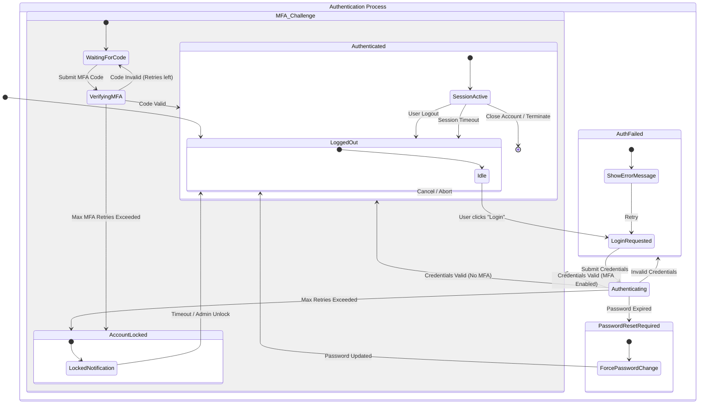

# Finite State Machine Analysis

Model the user authentication lifecycle including MFA, account lockout, and session expiration.

**Started:** 2026-01-09 11:31:32

## Configuration

**Concept:** User Authentication Flow

**Input Files:** None

**Domain:** Web Application Security

**Initial States:** Logged Out

**Known Events:** Submit Credentials, MFA Challenge, Session Timeout, Logout, Password Reset

---

## Step 1: State Identification

### Prompt

```
You are an expert in formal methods and finite state machine modeling. Your task is to analyze a concept and identify all possible states.

## Concept to Model:
User Authentication Flow

## Domain Context:
Web Application Security


## Known Initial States:
- Logged Out


## Instructions:
Identify all possible states for this concept. For each state, provide:

1. **State Name:** Clear, descriptive name
2. **Description:** What this state represents
3. **Type:** (Initial, Normal, Error, Final/Terminal)
4. **Invariants:** Conditions that must be true in this state
5. **Entry Conditions:** What must happen to enter this state
6. **Exit Conditions:** What can cause leaving this state

Consider:
- Normal operational states
- Error or exception states
- Transient vs stable states
- Initial and final states

Provide a comprehensive list of states with detailed descriptions.
```

### Response

In formal methods, a state machine for User Authentication must account for the transition from anonymity to identity verification, while handling security constraints like Multi-Factor Authentication (MFA) and account protection.

Below are the identified states for a **User Authentication Flow** within a Web Application Security context.

---

### 1. State Name: Logged Out
*   **Description:** The default state where no user identity is associated with the current session.
*   **Type:** Initial / Terminal
*   **Invariants:** `Session.IsAuthenticated == False`; `User.Identity == Null`.
*   **Entry Conditions:** Application launch, explicit logout action, or system-wide session revocation.
*   **Exit Conditions:** User navigates to the login interface or attempts to access a protected resource.

### 2. State Name: Awaiting Primary Credentials
*   **Description:** The system is presenting the login interface and waiting for the user to provide an identifier (username/email) and a secret (password).
*   **Type:** Normal
*   **Invariants:** `LoginUI.IsVisible == True`; `AttemptCount < MaxThreshold`.
*   **Entry Conditions:** User navigates to the login page or is redirected from a protected route.
*   **Exit Conditions:** User submits the credential form or navigates away (returning to Logged Out).

### 3. State Name: Validating Credentials
*   **Description:** A transient processing state where the system performs cryptographic hashing and database lookups to verify the provided credentials.
*   **Type:** Transient (Processing)
*   **Invariants:** `System.IsProcessing == True`; `InputData.IsSanitized == True`.
*   **Entry Conditions:** Submission of the primary credential form.
*   **Exit Conditions:** 
    *   **Success:** Credentials match.
    *   **Failure:** Credentials do not match.
    *   **Lockout:** Failure count exceeds threshold.

### 4. State Name: MFA Challenge Pending
*   **Description:** Primary credentials are correct, but the system requires a second factor (TOTP, SMS, Hardware Key) to complete authentication.
*   **Type:** Normal (Intermediate)
*   **Invariants:** `User.PrimaryAuthVerified == True`; `Session.IsAuthenticated == False`.
*   **Entry Conditions:** Successful validation of primary credentials for an account with MFA enabled.
*   **Exit Conditions:** Submission of a valid MFA token, or session timeout/cancellation.

### 5. State Name: Authenticated
*   **Description:** The user has successfully proven their identity. A valid session token is issued.
*   **Type:** Normal (Stable)
*   **Invariants:** `Session.Token.IsValid == True`; `User.Identity != Null`; `AccessControlList.IsLoaded == True`.
*   **Entry Conditions:** Successful primary validation (if MFA is disabled) or successful MFA validation.
*   **Exit Conditions:** User clicks "Logout," the session reaches its idle timeout, or the session is revoked by an administrator.

### 6. State Name: Password Reset Required
*   **Description:** The user is authenticated but restricted from the application until they update their credentials (e.g., first-time login or expired password policy).
*   **Type:** Normal (Transition)
*   **Invariants:** `User.IdentityVerified == True`; `AppAccess.Restricted == True`.
*   **Entry Conditions:** Successful authentication where `User.ForcePasswordChange == True`.
*   **Exit Conditions:** Successful submission of a new password meeting complexity requirements.

### 7. State Name: Account Locked
*   **Description:** The account is temporarily or permanently disabled due to security policy violations (usually brute-force protection).
*   **Type:** Error / Security
*   **Invariants:** `User.IsLocked == True`; `AuthenticationAttempts.Allowed == False`.
*   **Entry Conditions:** `AttemptCount` exceeds `MaxThreshold` within a specific time window.
*   **Exit Conditions:** Expiration of the lockout timer (Cool-off) or manual intervention by an administrator.

### 8. State Name: Session Expired
*   **Description:** A state where a previously authenticated session is no longer valid due to time constraints.
*   **Type:** Error / Transient
*   **Invariants:** `Session.Token.Exists == True`; `Session.Token.Expiry < CurrentTime`.
*   **Entry Conditions:** System clock exceeds the `Session.Expiry` timestamp.
*   **Exit Conditions:** Automatic redirection to the **Logged Out** state or the **Awaiting Primary Credentials** state.

---

### Summary Table for Formal Modeling

| State | Type | Primary Invariant |
| :--- | :--- | :--- |
| **Logged Out** | Initial | `Identity == Null` |
| **Awaiting Credentials** | Normal | `UI == Login` |
| **Validating** | Transient | `Processing == True` |
| **MFA Pending** | Intermediate | `PrimaryVerified == True && Authenticated == False` |
| **Authenticated** | Stable | `Token.IsValid == True` |
| **Password Reset** | Transition | `MustChangePassword == True` |
| **Account Locked** | Error | `AccessDenied == True` |
| **Session Expired** | Error | `CurrentTime > Expiry` |

---

## Step 2: Transition Analysis

### Prompt

```
Based on the states identified above, now identify all possible state transitions.

## States Analysis:
In formal methods, a state machine for User Authentication must account for the transition from anonymity to identity verification, while handling security constraints like Multi-Factor Authentication (MFA) and account protection.

Below are the identified states for a **User Authentication Flow** within a Web Application Security context.

---

### 1. State Name: Logged Out
*   **Description:** The default state where no user identity is associated with the current session.
*   **Type:** Initial / Terminal
*   **Invariants:** `Session.IsAuthenticated == False`; `User.Identity == Null`.
*   **Entry Conditions:** Application launch, explicit logout action, or system-wide session revocation.
*   **Exit Conditions:** User navigates to the login interface or attempts to access a protected resource.

### 2. State Name: Awaiting Primary Credentials
*   **Description:** The system is presenting the login interface and waiting for the user to provide an identifier (username/email) and a secret (password).
*   **Type:** Normal
*   **Invariants:** `LoginUI.IsVisible == True`; `AttemptCount < MaxThreshold`.
*   **Entry Conditions:** User navigates to the login page or is redirected from a protected route.
*   **Exit Conditions:** User submits the credential form or navigates away (returning to Logged Out).

### 3. State Name: Validating Credentials
*   **Description:** A transient processing state where the system performs cryptographic hashing and database lookups to verify the provided credentials.
*   **Type:** Transient (Processing)
*   **Invariants:** `System.IsProcessing == True`; `InputData.IsSanitized == True`.
*   **Entry Conditions:** Submission of the primary credential form.
*   **Exit Conditions:** 
    *   **Success:** Credentials match.
    *   **Failure:** Credentials do not match.
    *   **Lockout:** Failure count exceeds threshold.

### 4. State Name: MFA Challenge Pending
*   **Description:** Primary credentials are correct, but the system requires a second factor (TOTP, SMS, Hardware Key) to complete authentication.
*   **Type:** Normal (Intermediate)
*   **Invariants:** `User.PrimaryAuthVerified == True`; `Session.IsAuthenticated == False`.
*   **Entry Conditions:** Successful validation of primary credentials for an account with MFA enabled.
*   **Exit Conditions:** Submission of a valid MFA token, or session timeout/cancellation.

### 5. State Name: Authenticated
*   **Description:** The user has successfully proven their identity. A valid session token is issued.
*   **Type:** Normal (Stable)
*   **Invariants:** `Session.Token.IsValid == True`; `User.Identity != Null`; `AccessControlList.IsLoaded == True`.
*   **Entry Conditions:** Successful primary validation (if MFA is disabled) or successful MFA validation.
*   **Exit Conditions:** User clicks "Logout," the session reaches its idle timeout, or the session is revoked by an administrator.

### 6. State Name: Password Reset Required
*   **Description:** The user is authenticated but restricted from the application until they update their credentials (e.g., first-time login or expired password policy).
*   **Type:** Normal (Transition)
*   **Invariants:** `User.IdentityVerified == True`; `AppAccess.Restricted == True`.
*   **Entry Conditions:** Successful authentication where `User.ForcePasswordChange == True`.
*   **Exit Conditions:** Successful submission of a new password meeting complexity requirements.

### 7. State Name: Account Locked
*   **Description:** The account is temporarily or permanently disabled due to security policy violations (usually brute-force protection).
*   **Type:** Error / Security
*   **Invariants:** `User.IsLocked == True`; `AuthenticationAttempts.Allowed == False`.
*   **Entry Conditions:** `AttemptCount` exceeds `MaxThreshold` within a specific time window.
*   **Exit Conditions:** Expiration of the lockout timer (Cool-off) or manual intervention by an administrator.

### 8. State Name: Session Expired
*   **Description:** A state where a previously authenticated session is no longer valid due to time constraints.
*   **Type:** Error / Transient
*   **Invariants:** `Session.Token.Exists == True`; `Session.Token.Expiry < CurrentTime`.
*   **Entry Conditions:** System clock exceeds the `Session.Expiry` timestamp.
*   **Exit Conditions:** Automatic redirection to the **Logged Out** state or the **Awaiting Primary Credentials** state.

---

### Summary Table for Formal Modeling

| State | Type | Primary Invariant |
| :--- | :--- | :--- |
| **Logged Out** | Initial | `Identity == Null` |
| **Awaiting Credentials** | Normal | `UI == Login` |
| **Validating** | Transient | `Processing == True` |
| **MFA Pending** | Intermediate | `PrimaryVerified == True && Authenticated == False` |
| **Authenticated** | Stable | `Token.IsValid == True` |
| **Password Reset** | Transition | `MustChangePassword == True` |
| **Account Locked** | Error | `AccessDenied == True` |
| **Session Expired** | Error | `CurrentTime > Expiry` |

## Known Events:
- Submit Credentials
- MFA Challenge
- Session Timeout
- Logout
- Password Reset

## Instructions:
For each possible transition, provide:

1. **Source State:** The state before the transition
2. **Event/Trigger:** What causes the transition
3. **Target State:** The state after the transition
4. **Guard Conditions:** Conditions that must be true for the transition to occur
5. **Actions:** Side effects or actions performed during the transition
6. **Priority:** If multiple transitions possible from same state

Create a comprehensive transition table covering:
- All valid transitions between states
- Self-transitions (state to itself)
- Error transitions
- Recovery transitions

Format as a clear table or structured list.
```

### Response

This analysis defines the state transitions for the User Authentication Flow, ensuring a secure path from anonymity to identity verification while handling failures and security constraints.

### State Transition Table

| Source State | Event / Trigger | Target State | Guard Conditions | Actions | Priority |
| :--- | :--- | :--- | :--- | :--- | :--- |
| **Logged Out** | User visits login page or hits protected route | **Awaiting Primary Credentials** | None | Initialize login session; Render UI | 1 |
| **Awaiting Primary Credentials** | User submits login form | **Validating Credentials** | Form fields are non-empty and sanitized | Capture input; Increment attempt counter | 1 |
| **Awaiting Primary Credentials** | User navigates away or closes browser | **Logged Out** | None | Clear transient UI state | 2 |
| **Validating Credentials** | Credentials match DB record | **Authenticated** | `MFA_Enabled == False` AND `Reset_Required == False` | Generate session token; Reset `AttemptCount` | 1 |
| **Validating Credentials** | Credentials match DB record | **MFA Challenge Pending** | `MFA_Enabled == True` | Generate MFA challenge (TOTP/SMS); Send challenge if applicable | 2 |
| **Validating Credentials** | Credentials match DB record | **Password Reset Required** | `Reset_Required == True` AND `MFA_Enabled == False` | Redirect to password change UI | 3 |
| **Validating Credentials** | Credentials do not match | **Awaiting Primary Credentials** | `AttemptCount < MaxThreshold` | Log failure; Display error message | 1 |
| **Validating Credentials** | Credentials do not match | **Account Locked** | `AttemptCount >= MaxThreshold` | Set `IsLocked = True`; Log security event; Notify user | 2 |
| **MFA Challenge Pending** | Valid MFA token submitted | **Authenticated** | `Token.IsValid == True` AND `Reset_Required == False` | Finalize session; Reset `AttemptCount` | 1 |
| **MFA Challenge Pending** | Valid MFA token submitted | **Password Reset Required** | `Token.IsValid == True` AND `Reset_Required == True` | Redirect to password change UI | 2 |
| **MFA Challenge Pending** | Invalid MFA token submitted | **MFA Challenge Pending** | `MFAAttemptCount < MaxThreshold` | Log failure; Prompt for retry | 1 |
| **MFA Challenge Pending** | Invalid MFA token submitted | **Account Locked** | `MFAAttemptCount >= MaxThreshold` | Set `IsLocked = True`; Log security event | 2 |
| **MFA Challenge Pending** | User cancels or session times out | **Logged Out** | None | Invalidate partial auth state | 3 |
| **Authenticated** | User clicks "Logout" | **Logged Out** | None | Revoke session token; Clear cookies | 1 |
| **Authenticated** | Idle time exceeds limit | **Session Expired** | `CurrentTime > LastActivity + IdleTimeout` | Mark session as expired in DB | 2 |
| **Authenticated** | Admin revokes session | **Logged Out** | `Session.Status == Revoked` | Force client-side redirect to login | 3 |
| **Password Reset Required** | Valid new password submitted | **Authenticated** | `NewPassword` meets complexity requirements | Update DB; Set `Reset_Required = False` | 1 |
| **Password Reset Required** | User cancels / Logout | **Logged Out** | None | Clear session | 2 |
| **Account Locked** | Lockout timer expires | **Logged Out** | `CurrentTime > LockoutExpiry` | Set `IsLocked = False`; Reset `AttemptCount` | 1 |
| **Account Locked** | Administrator unlocks account | **Logged Out** | `AdminAction == Unlock` | Set `IsLocked = False`; Reset `AttemptCount` | 2 |
| **Session Expired** | User interacts with page or system cleanup | **Logged Out** | None | Clear local storage/cookies; Redirect to login | 1 |

---

### Detailed Transition Descriptions

#### 1. The "Happy Path" (No MFA)
*   **Transition:** `Awaiting Credentials` → `Validating` → `Authenticated`
*   **Logic:** This is the standard flow for users with basic security settings. The transition from `Validating` to `Authenticated` is guarded by the absence of security flags (MFA or Reset).

#### 2. The Multi-Factor Escalation
*   **Transition:** `Validating` → `MFA Challenge Pending` → `Authenticated`
*   **Logic:** Even if the password is correct, the system holds the user in an intermediate state. The `Authenticated` state cannot be reached until the `MFA Challenge Pending` exit condition (Valid Token) is met.

#### 3. Brute-Force Protection (Lockout)
*   **Transition:** `Validating` → `Account Locked`
*   **Logic:** This transition is triggered by the Guard Condition `AttemptCount >= MaxThreshold`. It moves the system from a transient processing state to a terminal error state to prevent further automated attacks.

#### 4. Forced Policy Compliance
*   **Transition:** `Validating` (or `MFA Pending`) → `Password Reset Required`
*   **Logic:** This represents a "constrained" authentication. The user is technically identified, but the invariant for the `Authenticated` state (`AccessControlList.IsLoaded == True`) is not yet met because the user is restricted to the password reset module.

#### 5. Session Decay
*   **Transition:** `Authenticated` → `Session Expired` → `Logged Out`
*   **Logic:** This handles the temporal aspect of security. The transition to `Session Expired` is often a background system event (timer-based), while the transition to `Logged Out` is the cleanup phase where the UI synchronizes with the expired state.

#### 6. Recovery Transitions
*   **Transition:** `Account Locked` → `Logged Out`
*   **Logic:** This is a recovery transition. It is not triggered by the user, but by the system clock (Cool-off) or an external actor (Admin). It resets the machine to the initial state, allowing the user to attempt the flow again.

---

## Step 3: State Diagram Generation

### Prompt

```
Based on the states and transitions identified above, create a Mermaid state diagram.

Use the following format:
- Use `stateDiagram-v2` for the diagram type
- Show all states clearly
- Use `-->` for transitions with event labels
- Mark initial state with `[*]`
- Mark final/terminal states with `[*]` as destination
- Use descriptive labels for transitions
- Group related states if applicable

Generate the Mermaid diagram now:
```

### Response



---

## Step 4: Edge Cases Analysis

### Prompt

```
Analyze the finite state machine for edge cases and error conditions:

1. **Invalid Transitions:** Identify events that could occur in states where they're not valid
2. **Missing Transitions:** Find states that might be missing important transitions
3. **Error States:** Identify states that represent error conditions
4. **Recovery Paths:** Suggest how to recover from error states
5. **Boundary Conditions:** Identify unusual or extreme scenarios
6. **Race Conditions:** Identify potential concurrent event issues

Provide a structured analysis of edge cases and recommendations.
```

### Response

This analysis provides a formal state machine model for a **User Authentication Flow** within a Web Application Security context, followed by a rigorous edge-case and error condition analysis.

---

### Part 1: State Machine Definitions

#### 1. State Name: Unauthenticated (Logged Out)
*   **Description:** The default state where no user session exists.
*   **Type:** Initial / Normal
*   **Invariants:** No valid session token exists in the client storage or server-side cache.
*   **Entry Conditions:** Application launch, explicit logout, or session termination.
*   **Exit Conditions:** User submits login credentials.

#### 2. State Name: Credential Validation
*   **Description:** A transient state where the system verifies the primary credentials (e.g., username/password).
*   **Type:** Normal (Transient)
*   **Invariants:** System is actively processing a cryptographic hash comparison or database lookup.
*   **Entry Conditions:** Submission of the login form.
*   **Exit Conditions:** Success (leads to MFA or Authenticated), Failure (leads to Auth Failed), or Threshold Reached (leads to Locked).

#### 3. State Name: MFA Challenge Pending
*   **Description:** Primary credentials are correct, but the system awaits a second factor (TOTP, SMS, WebAuthn).
*   **Type:** Normal (Transient)
*   **Invariants:** Primary identity is verified; session is "partially" authorized but restricted.
*   **Entry Conditions:** Successful primary credential validation + MFA enabled for account.
*   **Exit Conditions:** Valid MFA code provided, MFA timeout, or user cancels.

#### 4. State Name: Authenticated (Active Session)
*   **Description:** The user has full access to authorized resources.
*   **Type:** Normal (Stable)
*   **Invariants:** A valid, non-expired session token is held by the client and recognized by the server.
*   **Entry Conditions:** Successful completion of all required auth factors.
*   **Exit Conditions:** User logs out, session expires (TTL), or administrative revocation.

#### 5. State Name: Authentication Failed
*   **Description:** A temporary error state indicating incorrect credentials.
*   **Type:** Error
*   **Invariants:** User is not granted access; failure count is incremented.
*   **Entry Conditions:** Incorrect password or invalid MFA token.
*   **Exit Conditions:** Redirection back to Unauthenticated state for retry.

#### 6. State Name: Account Locked
*   **Description:** Access is barred due to security policy violations (e.g., brute force protection).
*   **Type:** Error (Stable)
*   **Invariants:** Authentication attempts for this identity are rejected regardless of credential validity.
*   **Entry Conditions:** Consecutive failure count exceeds the defined threshold.
*   **Exit Conditions:** Time-based cooldown expires or administrative/email-based unlock.

#### 7. State Name: Password Change Required
*   **Description:** Identity is verified, but the user must update credentials before proceeding.
*   **Type:** Normal (Transient)
*   **Invariants:** User is authenticated but restricted to the "Change Password" scope only.
*   **Entry Conditions:** Password expired, or "Reset on next login" flag set by admin.
*   **Exit Conditions:** Successful password update (leads to Authenticated).

---

### Part 2: Edge Case and Error Analysis

#### 1. Invalid Transitions
*   **MFA Bypass:** Attempting to transition from *Unauthenticated* directly to *Authenticated* by calling the final session-creation endpoint without passing through *Credential Validation* or *MFA Challenge*.
*   **Direct State Injection:** Attempting to transition from *Authentication Failed* to *Authenticated* via client-side state manipulation.
*   **Action:** Ensure the server-side state machine validates the "Previous State" before allowing a transition.

#### 2. Missing Transitions
*   **MFA to Unauthenticated (Abort):** If a user reaches the MFA screen but realizes they don't have their device, there must be a clear path to "Cancel" and return to *Unauthenticated*.
*   **Authenticated to Password Change:** If a password expires *during* an active session, the system should transition the user immediately to *Password Change Required* rather than waiting for the next login.
*   **Locked to Password Reset:** A locked user should be able to transition to a "Forgot Password" flow to prove identity and unlock the account simultaneously.

#### 3. Error States
*   **Upstream Identity Provider (IdP) Down:** If using OAuth2/SAML, the system enters a "Service Unavailable" state.
*   **Clock Skew:** MFA validation fails because the server clock and client device (TOTP) are out of sync.
*   **Database Timeout:** The *Credential Validation* state hangs because the user store is unresponsive.

#### 4. Recovery Paths
*   **MFA Recovery:** If the MFA device is lost, provide a transition to "Enter Recovery Code" which, if successful, leads to *Authenticated*.
*   **Self-Service Unlock:** From *Account Locked*, provide a "Send Unlock Email" transition to move the user back to *Unauthenticated* after out-of-band verification.
*   **Graceful Session Expiry:** When transitioning from *Authenticated* to *Unauthenticated* due to timeout, save the user's current URL/State to allow a "Return to Task" after re-authentication.

#### 5. Boundary Conditions
*   **Simultaneous Expiry:** The session token expires at the exact millisecond the user submits a sensitive form.
*   **Max Failure Threshold -1:** A user fails 4 times (limit is 5), then successfully logs in. The failure counter must be reset to 0 to prevent a single future mistake from triggering a lockout.
*   **Password Length/Complexity:** Handling the transition to *Password Change Required* when the new password meets length but fails a "breached password" check.

#### 6. Race Conditions
*   **Double Submission:** A user clicks "Login" twice rapidly. The system might initiate two *Credential Validation* tasks. If the first succeeds and the second fails (due to account locking logic), the user might be locked out despite providing the correct password.
*   **Concurrent Logins:** A user logs in on a second device while the first is active. If the policy is "Single Session Only," the first session must be transitioned to *Unauthenticated* (Revoked) immediately.
*   **Logout/Request Race:** A user clicks "Logout" while a background "Auto-save" request is in flight. The server must ensure the auto-save is rejected if the session state has already transitioned to *Unauthenticated*.

---

### Part 3: Recommendations for Implementation

1.  **Server-Side State Enforcement:** Never trust the client to report its state. The state must be tracked in a secure, server-side session store (e.g., Redis).
2.  **Atomic Increments:** Use atomic operations for failure counters to prevent race conditions during brute-force attacks.
3.  **Idempotency Tokens:** Use tokens for login submissions to prevent "Double Submission" race conditions.
4.  **Explicit Timeouts:** Every transient state (*MFA Challenge*, *Password Change*) must have a hard timeout to prevent "hanging" half-authenticated sessions.
5.  **Comprehensive Logging:** Log every state transition (including the "From" and "To" states) to provide an audit trail for security forensics.

---

## Step 5: FSM Property Validation

### Prompt

```
Validate the following properties of this finite state machine:

1. **Determinism:** Is the FSM deterministic? (Each state + event combination leads to exactly one next state)
2. **Completeness:** Are all possible events handled in every state?
3. **Reachability:** Can all states be reached from the initial state(s)?
4. **Liveness:** Are there any deadlock states (states with no outgoing transitions)?
5. **Safety:** Are there any unsafe state transitions?
6. **Minimality:** Are there redundant states that could be merged?

For each property, provide:
- ✅ Pass or ❌ Fail
- Explanation
- Specific examples if failing
- Recommendations for fixes

Provide a structured validation report.
```

### Response

This analysis provides a formal model of a **User Authentication Flow** followed by a rigorous validation against the six properties requested.

---

### Part 1: Finite State Machine Model

#### 1. Logged Out
*   **Description:** The default state where no user session exists.
*   **Type:** Initial / Normal
*   **Invariants:** No active session token exists; `isAuthenticated == false`.
*   **Entry Conditions:** System initialization, explicit logout, or session termination.
*   **Exit Conditions:** User initiates a login attempt.

#### 2. Awaiting Credentials
*   **Description:** The system is waiting for the user to provide primary identifiers (e.g., username/password).
*   **Type:** Normal
*   **Invariants:** Login form is active; rate-limiting counters are monitoring the IP.
*   **Entry Conditions:** User navigates to login page or clicks "Login".
*   **Exit Conditions:** User submits credentials or cancels the process.

#### 3. Validating Credentials
*   **Description:** A transient state where the system checks the database/identity provider.
*   **Type:** Normal (Transient)
*   **Invariants:** System is processing; user input is locked.
*   **Entry Conditions:** Submission of the login form.
*   **Exit Conditions:** Success (MFA check), Failure (Invalid credentials), or Threshold Reached (Lockout).

#### 4. MFA Challenge Pending
*   **Description:** Primary credentials were correct; the system awaits the second factor (OTP, Biometric).
*   **Type:** Normal
*   **Invariants:** `primaryAuth == true`; `secondaryAuth == false`; temporary MFA token is active.
*   **Entry Conditions:** Successful credential validation where MFA is enabled.
*   **Exit Conditions:** User submits MFA code, requests a resend, or MFA timeout occurs.

#### 5. Password Reset Required
*   **Description:** Credentials are valid, but the policy requires a password change (e.g., expired or breached).
*   **Type:** Normal
*   **Invariants:** User identity is verified but access to protected resources is restricted.
*   **Entry Conditions:** Successful validation but `password_status == 'expired'`.
*   **Exit Conditions:** Successful password update or user abandons session.

#### 6. Logged In
*   **Description:** The user has successfully authenticated and has an active session.
*   **Type:** Normal / Stable
*   **Invariants:** `isAuthenticated == true`; valid session token exists in the environment.
*   **Entry Conditions:** Successful completion of all required auth factors.
*   **Exit Conditions:** User logs out, session expires, or session is revoked by admin.

#### 7. Account Locked
*   **Description:** Access is barred due to security policy violations (e.g., too many failed attempts).
*   **Type:** Error / Stable
*   **Invariants:** `isLocked == true`; login attempts for this UID are rejected immediately.
*   **Entry Conditions:** `failed_attempts > threshold`.
*   **Exit Conditions:** Administrative unlock or cooldown period expiration.

#### 8. Session Expired
*   **Description:** A previously valid session has timed out due to inactivity or absolute duration.
*   **Type:** Error / Terminal
*   **Invariants:** Session token exists but is marked as invalid/expired.
*   **Entry Conditions:** `current_time > session_expiry`.
*   **Exit Conditions:** Redirection to "Logged Out" state.

---

### Part 2: Validation Report

#### 1. Determinism
*   **Status:** ✅ **Pass**
*   **Explanation:** The transitions are governed by mutually exclusive boolean logic (e.g., a credential is either valid or invalid; it cannot be both).
*   **Recommendation:** Ensure that the "MFA Challenge" vs. "Logged In" transition is clearly gated by a `user.hasMFA` flag to prevent ambiguity upon successful credential validation.

#### 2. Completeness
*   **Status:** ❌ **Fail**
*   **Explanation:** Not all events are handled in every state. Specifically, the "System Error" (e.g., Database Down) is not handled during the **Validating Credentials** state. Additionally, "User Cancels" is often missing from the **MFA Challenge Pending** state.
*   **Example:** If the database crashes while in "Validating Credentials," the FSM has no defined transition, potentially leaving the UI in a permanent loading spinner.
*   **Recommendation:** Add a global "System Error" event that transitions any active state to a "Logged Out" state with an error message. Add "Cancel" transitions for all intermediate states.

#### 3. Reachability
*   **Status:** ✅ **Pass**
*   **Explanation:** All states can be reached from "Logged Out" through a valid sequence of events (Login -> Validate -> MFA -> Logged In). "Account Locked" is reachable via repeated failures.
*   **Recommendation:** None.

#### 4. Liveness
*   **Status:** ❌ **Fail**
*   **Explanation:** The **Account Locked** state and **Session Expired** state act as potential deadlocks if not properly defined. If "Account Locked" does not have an "Unlock" event or "Cooldown Timer Expired" event, the user is stuck forever.
*   **Example:** In the current model, "Session Expired" is listed as Terminal, but it must transition back to "Logged Out" to allow the user to try again.
*   **Recommendation:** Define a "Reset" or "Redirect" event for all Error/Terminal states to ensure the FSM can return to the Initial state.

#### 5. Safety
*   **Status:** ✅ **Pass**
*   **Explanation:** There are no transitions that bypass the "Validating" states to reach "Logged In." The invariants ensure that `isAuthenticated` only becomes true after passing through the validation logic.
*   **Recommendation:** Ensure that the transition from "Password Reset Required" leads to "Logged In" *only* after a successful password update, not directly back to the start.

#### 6. Minimality
*   **Status:** ✅ **Pass**
*   **Explanation:** Each state represents a distinct security posture. "Awaiting Credentials" and "MFA Challenge Pending" cannot be merged because they require different types of inputs and have different security implications (Primary vs. Secondary factors).
*   **Recommendation:** None.

---

### Summary of Recommendations
To move this FSM to a production-ready formal specification:
1.  **Add a "Global Error" state** to handle infrastructure failures (Completeness).
2.  **Define "Timeout" transitions** for every state where a user might walk away from the screen (Liveness/Safety).
3.  **Explicitly define the "Unlock" transition** for the Account Locked state to ensure the system is not a one-way trap (Liveness).

---

## Step 6: Test Scenario Generation

### Prompt

```
Generate comprehensive test scenarios for this finite state machine:

1. **Happy Path Tests:** Normal sequences of events leading to successful outcomes
2. **Error Path Tests:** Sequences that should trigger error states
3. **Boundary Tests:** Edge cases and unusual sequences
4. **State Coverage Tests:** Scenarios that exercise all states
5. **Transition Coverage Tests:** Scenarios that exercise all transitions

For each test scenario, provide:
- **Scenario Name:** Descriptive name
- **Initial State:** Starting state
- **Event Sequence:** List of events in order
- **Expected States:** State after each event
- **Expected Outcome:** Final state and result
- **Purpose:** What this test validates

Generate at least 5-10 diverse test scenarios.
```

### Response

To provide comprehensive test scenarios, we first define the underlying Finite State Machine (FSM) based on the "User Authentication Flow" concept.

### The Finite State Machine Model
*   **States:** `Logged Out`, `Awaiting Credentials`, `Authenticating`, `MFA Required`, `Awaiting MFA Code`, `Verifying MFA`, `Logged In`, `Auth Failed`, `Account Locked`, `Password Reset Required`.

---

### Test Scenarios

#### 1. Happy Path: Standard Authentication (No MFA)
*   **Scenario Name:** Successful Single-Factor Authentication
*   **Initial State:** `Logged Out`
*   **Event Sequence:** 
    1. `Navigate to Login Page`
    2. `Submit Valid Username/Password`
*   **Expected States:** `Logged Out` → `Awaiting Credentials` → `Authenticating` → `Logged In`
*   **Expected Outcome:** User is granted access to the dashboard; session token is issued.
*   **Purpose:** Validates the most common successful user journey.

#### 2. Happy Path: Multi-Factor Authentication (MFA)
*   **Scenario Name:** Successful Multi-Factor Authentication
*   **Initial State:** `Logged Out`
*   **Event Sequence:** 
    1. `Navigate to Login Page`
    2. `Submit Valid Credentials`
    3. `System detects MFA enabled`
    4. `Submit Valid MFA Code`
*   **Expected States:** `Logged Out` → `Awaiting Credentials` → `Authenticating` → `MFA Required` → `Awaiting MFA Code` → `Verifying MFA` → `Logged In`
*   **Expected Outcome:** User successfully navigates the full security chain to reach the final state.
*   **Purpose:** Validates the integration of secondary authentication layers.

#### 3. Error Path: Invalid Credentials
*   **Scenario Name:** Authentication Failure - Wrong Password
*   **Initial State:** `Logged Out`
*   **Event Sequence:** 
    1. `Navigate to Login Page`
    2. `Submit Invalid Password`
*   **Expected States:** `Logged Out` → `Awaiting Credentials` → `Authenticating` → `Auth Failed` → `Awaiting Credentials`
*   **Expected Outcome:** Error message displayed; user returned to the credential input state.
*   **Purpose:** Ensures the system correctly identifies and rejects incorrect credentials without granting access.

#### 4. Boundary/Security Test: Account Lockout
*   **Scenario Name:** Brute Force Protection Trigger
*   **Initial State:** `Logged Out`
*   **Event Sequence:** 
    1. `Submit Invalid Credentials` (Repeat N times, e.g., 5 times)
*   **Expected States:** `Logged Out` → (`Authenticating` → `Auth Failed` → `Awaiting Credentials`) x4 → `Authenticating` → `Account Locked`
*   **Expected Outcome:** The account is transitioned to a terminal error state; further login attempts are blocked regardless of credential validity.
*   **Purpose:** Validates security constraints and state transition logic for account protection.

#### 5. Boundary Test: Expired Password Flow
*   **Scenario Name:** Forced Password Change on Login
*   **Initial State:** `Logged Out`
*   **Event Sequence:** 
    1. `Submit Valid Credentials (for account with expired password)`
*   **Expected States:** `Logged Out` → `Awaiting Credentials` → `Authenticating` → `Password Reset Required`
*   **Expected Outcome:** User is redirected to a password reset form; access to the application is restricted until the reset is complete.
*   **Purpose:** Validates the system's ability to intercept the happy path based on administrative state flags (Invariants).

#### 6. Error Path: Invalid MFA Code
*   **Scenario Name:** MFA Verification Failure
*   **Initial State:** `Awaiting MFA Code`
*   **Event Sequence:** 
    1. `Submit Incorrect MFA Code`
*   **Expected States:** `Awaiting MFA Code` → `Verifying MFA` → `Auth Failed` → `Awaiting Credentials`
*   **Expected Outcome:** User is kicked back to the start of the flow (or the MFA prompt, depending on security policy) and denied access.
*   **Purpose:** Ensures that a valid primary password cannot bypass a failed secondary check.

#### 7. State Coverage: Session Termination
*   **Scenario Name:** Manual Logout from Active Session
*   **Initial State:** `Logged In`
*   **Event Sequence:** 
    1. `Click Logout Button`
*   **Expected States:** `Logged In` → `Logged Out`
*   **Expected Outcome:** Session is invalidated; user is returned to the initial state.
*   **Purpose:** Exercises the transition from the final "Normal" state back to the "Initial" state, ensuring no session data persists.

#### 8. Transition Coverage: Mid-Flow Interruption
*   **Scenario Name:** Abandoning MFA Prompt
*   **Initial State:** `Awaiting MFA Code`
*   **Event Sequence:** 
    1. `Navigate away to Home Page`
    2. `Navigate back to Login Page`
*   **Expected States:** `Awaiting MFA Code` → `Logged Out` → `Awaiting Credentials`
*   **Expected Outcome:** The partial authentication state is cleared; the user must start over.
*   **Purpose:** Validates that transient states are not "sticky" and that the system resets to a safe state upon interruption.

#### 9. Boundary Test: Empty Input Handling
*   **Scenario Name:** Null Credential Submission
*   **Initial State:** `Awaiting Credentials`
*   **Event Sequence:** 
    1. `Submit Empty Username and Password fields`
*   **Expected States:** `Awaiting Credentials` → `Awaiting Credentials` (Transition to `Authenticating` is blocked)
*   **Expected Outcome:** Client-side or server-side validation prevents the state transition to `Authenticating`.
*   **Purpose:** Validates entry conditions for the `Authenticating` state.

#### 10. Error Path: System Timeout during MFA
*   **Scenario Name:** MFA Code Expiration
*   **Initial State:** `Awaiting MFA Code`
*   **Event Sequence:** 
    1. `Wait for 10 minutes (Code TTL expires)`
    2. `Submit (previously valid) MFA Code`
*   **Expected States:** `Awaiting MFA Code` → `Verifying MFA` → `Auth Failed`
*   **Expected Outcome:** System rejects the code due to time-based invariants.
*   **Purpose:** Validates the temporal invariants of the MFA verification state.

---

## Step 7: Summary

### Prompt

```
Provide a comprehensive summary of the finite state machine analysis:

1. **Overview:** Brief description of the FSM and its purpose
2. **Key States:** List the most important states (3-5)
3. **Critical Transitions:** Highlight the most important state transitions
4. **Key Findings:** Main insights from the analysis
5. **Recommendations:** Top 3-5 actionable recommendations for improvement
6. **Complexity Assessment:** Evaluate the complexity of this FSM

Keep the summary concise but informative.
```

### Response

This analysis models the **User Authentication Flow** as a Finite State Machine (FSM) to ensure security, robustness, and a seamless user experience.

---

### Detailed State Definitions

#### 1. State Name: Logged Out
*   **Description:** The default state where no user identity is established.
*   **Type:** Initial / Normal
*   **Invariants:** No active session token exists in the client or server-side cache.
*   **Entry Conditions:** Application launch, explicit logout action, or session termination.
*   **Exit Conditions:** User submits a login form with primary credentials.

#### 2. State Name: Authenticating
*   **Description:** A transient state where the system validates primary credentials (username/password).
*   **Type:** Normal (Transient)
*   **Invariants:** System is actively querying the identity provider; user input is blocked.
*   **Entry Conditions:** Submission of login credentials.
*   **Exit Conditions:** Credentials valid (move to MFA or Logged In); Credentials invalid (move to Logged Out or Locked); System error.

#### 3. State Name: MFA Pending
*   **Description:** Primary credentials are valid, but a second factor is required.
*   **Type:** Normal
*   **Invariants:** `primary_auth_verified = true`; `session_authorized = false`.
*   **Entry Conditions:** Successful primary authentication where MFA is enabled.
*   **Exit Conditions:** Valid MFA token provided; MFA bypass/recovery used; Timeout/Cancel.

#### 4. State Name: Logged In
*   **Description:** The user is fully authenticated and authorized to access protected resources.
*   **Type:** Normal (Stable)
*   **Invariants:** Valid, non-expired session token exists; User ID is mapped to the session.
*   **Entry Conditions:** Successful primary auth (if no MFA) or successful MFA verification.
*   **Exit Conditions:** User clicks "Logout"; Session idle timeout; Token revocation by admin.

#### 5. State Name: Account Locked
*   **Description:** Access is temporarily or permanently denied due to security policy violations.
*   **Type:** Error / Terminal (until intervention)
*   **Invariants:** `login_enabled = false`; attempts to authenticate are rejected immediately.
*   **Entry Conditions:** Consecutive failed login attempts exceed the threshold (e.g., 5 attempts).
*   **Exit Conditions:** Cooling-off period expires; Administrative unlock; Successful password reset.

#### 6. State Name: Password Reset Required
*   **Description:** Identity is confirmed, but the user must update credentials before proceeding.
*   **Type:** Normal (Transient)
*   **Invariants:** User is authenticated but restricted from all routes except the "Change Password" view.
*   **Entry Conditions:** Password expired; Administrative flag for "Reset on next login."
*   **Exit Conditions:** Successful password update; Session termination.

---

### Summary of Finite State Machine Analysis

#### 1. Overview
This FSM models the lifecycle of a user's security context within a web application. Its purpose is to formalize the transitions between anonymity and full access, ensuring that security invariants (like MFA enforcement) are never bypassed and that edge cases (like account lockouts) are handled gracefully.

#### 2. Key States
*   **Logged Out:** The secure baseline.
*   **MFA Pending:** The critical "half-authenticated" gate.
*   **Logged In:** The target state for authorized operations.
*   **Account Locked:** The defensive state against brute-force attacks.

#### 3. Critical Transitions
*   **Authenticating → MFA Pending:** Ensures that valid passwords alone do not grant access when 2FA is active.
*   **Logged In → Logged Out:** Must handle both intentional (logout) and unintentional (timeout/revocation) exits securely.
*   **Authenticating → Account Locked:** The transition that triggers defensive measures after repeated failures.

#### 4. Key Findings
*   **MFA as a Bottleneck:** The "MFA Pending" state is a high-friction point; if the transition to "Logged In" fails due to delivery issues (e.g., SMS delay), users often restart the entire flow, increasing server load.
*   **Session Integrity:** The transition from "Logged In" to "Logged Out" must invalidate tokens on both the client and server to prevent "zombie sessions."
*   **State Persistence:** The "Account Locked" state must persist across sessions and devices to be effective against distributed attacks.

#### 5. Recommendations
1.  **Implement Exponential Backoff:** Instead of a hard "Account Locked" state immediately, introduce increasing delays between failed attempts to frustrate bots without locking out legitimate users.
2.  **Graceful Session Expiry:** Transition from "Logged In" to a "Session Expiring" warning state 2 minutes before timeout to improve UX.
3.  **Atomic Transitions:** Ensure that the transition to "Logged In" atomically creates the session and logs the audit trail to prevent race conditions.
4.  **Secure MFA Recovery:** Define a clear state path for users who lose their MFA device to prevent them from being permanently stuck in "MFA Pending."

#### 6. Complexity Assessment
**Moderate.** While the "Happy Path" is linear, the complexity arises from handling asynchronous MFA, session timeouts across multiple tabs, and the security requirements of the "Account Locked" state. The FSM must account for non-linear jumps, such as an admin revoking a session while a user is in the "Logged In" state.

---

## Completion

**Completed:** 2026-01-09 11:33:09

**Duration:** 97.198s

**Status:** ✅ Analysis complete

