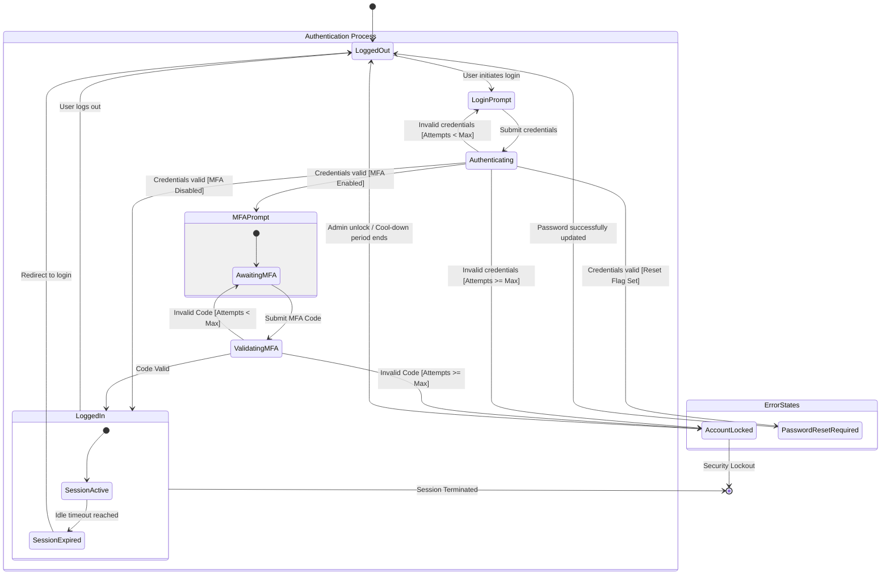

# Finite State Machine Analysis

**Started:** 2026-01-15T12:32:17.263258001

## Configuration
<details><summary>Task Parameters</summary>

**Concept:** User Authentication Flow
**Domain:** Web Application Security
**Initial States:** Logged Out
**Known Events:** Submit Credentials, MFA Challenge, Session Timeout, Logout, Password Reset
</details>

## Step 1: State Identification
<details><summary>Prompt & Response</summary>

### Prompt

```
You are an expert in formal methods and finite state machine modeling. Your task is to analyze a concept and identify all possible states.

## Concept to Model:
User Authentication Flow

## Domain Context:
Web Application Security


## Known Initial States:
- Logged Out


## Instructions:
Identify all possible states for this concept. For each state, provide:

1. **State Name:** Clear, descriptive name
2. **Description:** What this state represents
3. **Type:** (Initial, Normal, Error, Final/Terminal)
4. **Invariants:** Conditions that must be true in this state
5. **Entry Conditions:** What must happen to enter this state
6. **Exit Conditions:** What can cause leaving this state

Consider:
- Normal operational states
- Error or exception states
- Transient vs stable states
- Initial and final states

Provide a comprehensive list of states with detailed descriptions.
```

### Response

This formal analysis identifies the states of a **User Authentication Flow** within a Web Application Security context. The model follows a finite state machine (FSM) approach, accounting for security protocols like Multi-Factor Authentication (MFA) and account lockout policies.

---

### 1. State: Logged Out
*   **Description:** The default state where no user identity is associated with the current session.
*   **Type:** Initial / Normal
*   **Invariants:** No valid Session Token exists in the client storage or server-side session cache.
*   **Entry Conditions:** Application launch; User explicitly clicks "Logout"; Session Token is revoked by the server.
*   **Exit Conditions:** User provides a username/identifier to begin the authentication process.

### 2. State: Validating Primary Credentials
*   **Description:** A transient state where the system is verifying the provided username and password against the identity provider.
*   **Type:** Normal (Transient)
*   **Invariants:** The system is actively processing a cryptographic hash comparison.
*   **Entry Conditions:** User submits the login form with primary credentials.
*   **Exit Conditions:** 
    *   **Success:** Credentials match (Transition to *MFA Challenge Pending* or *Logged In*).
    *   **Failure:** Credentials do not match (Transition to *Authentication Failed*).
    *   **System Error:** Database or Identity Provider is unreachable (Transition to *Service Unavailable*).

### 3. State: MFA Challenge Pending
*   **Description:** Primary credentials are correct, but the system requires a second factor (TOTP, SMS, WebAuthn).
*   **Type:** Normal
*   **Invariants:** Primary identity is verified; Session is in a "Partial Auth" state (restricted access).
*   **Entry Conditions:** Primary credentials validated AND MFA is enabled for the account.
*   **Exit Conditions:** 
    *   **Success:** Valid MFA token provided.
    *   **Failure:** Invalid MFA token or maximum MFA attempts reached.
    *   **Timeout:** User fails to provide MFA within the allowed window.

### 4. State: Logged In
*   **Description:** The user is fully authenticated and authorized to access protected resources.
*   **Type:** Normal (Stable)
*   **Invariants:** A valid, non-expired Session Token is held by the client; User identity is bound to the session.
*   **Entry Conditions:** Successful validation of all required authentication factors.
*   **Exit Conditions:** User logs out; Session expires (idle or absolute); Account is suspended by an admin; Password is changed from another device.

### 5. State: Authentication Failed
*   **Description:** The attempt to authenticate was rejected due to incorrect information.
*   **Type:** Error
*   **Invariants:** No session is created; An increment is added to the "Failed Attempt" counter for the specific IP or User ID.
*   **Entry Conditions:** Incorrect password or incorrect MFA token provided.
*   **Exit Conditions:** User attempts to login again; User initiates "Forgot Password" flow.

### 6. State: Account Locked
*   **Description:** The account is temporarily or permanently barred from authentication attempts due to security policy violations.
*   **Type:** Error / Security
*   **Invariants:** The `is_locked` flag is true in the user database; Authentication attempts are rejected immediately without credential validation.
*   **Entry Conditions:** Failed attempt counter exceeds the defined threshold (e.g., 5 failed tries).
*   **Exit Conditions:** Lockout timer expires (Cool-down); Administrative unlock; Successful "Unlock Account" flow via email verification.

### 7. State: Password Reset Required
*   **Description:** The user has successfully authenticated, but the system requires a password change before granting full access.
*   **Type:** Normal (Intermediary)
*   **Invariants:** Identity is verified; Access is restricted strictly to the "Change Password" functionality.
*   **Entry Conditions:** Password has expired (Policy); Admin flagged the account for a forced reset (e.g., after a data breach).
*   **Exit Conditions:** Successful password update (Transitions to *Logged In*); User logs out.

### 8. State: Session Expired
*   **Description:** A previously valid session has become invalid due to time constraints.
*   **Type:** Error / Transient
*   **Invariants:** The Session Token exists but the server-side timestamp exceeds the `max_age` or `idle_timeout`.
*   **Entry Conditions:** Current Time > (Last Activity + Idle Timeout) OR Current Time > (Session Start + Absolute Timeout).
*   **Exit Conditions:** Automatic redirection to *Logged Out* state.

### 9. State: Account Suspended
*   **Description:** The account is disabled by system administrators, often for Terms of Service violations or suspicious activity.
*   **Type:** Final (for the user session)
*   **Invariants:** User record is marked as `inactive` or `suspended`.
*   **Entry Conditions:** Manual administrative action; Automated fraud detection trigger.
*   **Exit Conditions:** Manual administrative reinstatement.

---

### Summary Table for Formal Modeling

| State Name | Type | Primary Invariant |
| :--- | :--- | :--- |
| **Logged Out** | Initial | `Session == Null` |
| **Validating** | Transient | `Processing == True` |
| **MFA Pending** | Normal | `PrimaryAuth == True && SecondaryAuth == False` |
| **Logged In** | Stable | `Session.isValid == True` |
| **Auth Failed** | Error | `RetryCount++` |
| **Account Locked** | Security | `AllowLogin == False` |
| **Reset Required** | Intermediary | `Scope == "PasswordChangeOnly"` |
| **Session Expired** | Error | `Token.expiry < CurrentTime` |
| **Suspended** | Terminal | `User.status == "Disabled"` |
</details>

## Step 2: Transition Analysis
<details><summary>Prompt & Response</summary>

### Prompt

```
Based on the states identified above, now identify all possible state transitions.

## States Analysis:
This formal analysis identifies the states of a **User Authentication Flow** within a Web Application Security context. The model follows a finite state machine (FSM) approach, accounting for security protocols like Multi-Factor Authentication (MFA) and account lockout policies.

---

### 1. State: Logged Out
*   **Description:** The default state where no user identity is associated with the current session.
*   **Type:** Initial / Normal
*   **Invariants:** No valid Session Token exists in the client storage or server-side session cache.
*   **Entry Conditions:** Application launch; User explicitly clicks "Logout"; Session Token is revoked by the server.
*   **Exit Conditions:** User provides a username/identifier to begin the authentication process.

### 2. State: Validating Primary Credentials
*   **Description:** A transient state where the system is verifying the provided username and password against the identity provider.
*   **Type:** Normal (Transient)
*   **Invariants:** The system is actively processing a cryptographic hash comparison.
*   **Entry Conditions:** User submits the login form with primary credentials.
*   **Exit Conditions:** 
    *   **Success:** Credentials match (Transition to *MFA Challenge Pending* or *Logged In*).
    *   **Failure:** Credentials do not match (Transition to *Authentication Failed*).
    *   **System Error:** Database or Identity Provider is unreachable (Transition to *Service Unavailable*).

### 3. State: MFA Challenge Pending
*   **Description:** Primary credentials are correct, but the system requires a second factor (TOTP, SMS, WebAuthn).
*   **Type:** Normal
*   **Invariants:** Primary identity is verified; Session is in a "Partial Auth" state (restricted access).
*   **Entry Conditions:** Primary credentials validated AND MFA is enabled for the account.
*   **Exit Conditions:** 
    *   **Success:** Valid MFA token provided.
    *   **Failure:** Invalid MFA token or maximum MFA attempts reached.
    *   **Timeout:** User fails to provide MFA within the allowed window.

### 4. State: Logged In
*   **Description:** The user is fully authenticated and authorized to access protected resources.
*   **Type:** Normal (Stable)
*   **Invariants:** A valid, non-expired Session Token is held by the client; User identity is bound to the session.
*   **Entry Conditions:** Successful validation of all required authentication factors.
*   **Exit Conditions:** User logs out; Session expires (idle or absolute); Account is suspended by an admin; Password is changed from another device.

### 5. State: Authentication Failed
*   **Description:** The attempt to authenticate was rejected due to incorrect information.
*   **Type:** Error
*   **Invariants:** No session is created; An increment is added to the "Failed Attempt" counter for the specific IP or User ID.
*   **Entry Conditions:** Incorrect password or incorrect MFA token provided.
*   **Exit Conditions:** User attempts to login again; User initiates "Forgot Password" flow.

### 6. State: Account Locked
*   **Description:** The account is temporarily or permanently barred from authentication attempts due to security policy violations.
*   **Type:** Error / Security
*   **Invariants:** The `is_locked` flag is true in the user database; Authentication attempts are rejected immediately without credential validation.
*   **Entry Conditions:** Failed attempt counter exceeds the defined threshold (e.g., 5 failed tries).
*   **Exit Conditions:** Lockout timer expires (Cool-down); Administrative unlock; Successful "Unlock Account" flow via email verification.

### 7. State: Password Reset Required
*   **Description:** The user has successfully authenticated, but the system requires a password change before granting full access.
*   **Type:** Normal (Intermediary)
*   **Invariants:** Identity is verified; Access is restricted strictly to the "Change Password" functionality.
*   **Entry Conditions:** Password has expired (Policy); Admin flagged the account for a forced reset (e.g., after a data breach).
*   **Exit Conditions:** Successful password update (Transitions to *Logged In*); User logs out.

### 8. State: Session Expired
*   **Description:** A previously valid session has become invalid due to time constraints.
*   **Type:** Error / Transient
*   **Invariants:** The Session Token exists but the server-side timestamp exceeds the `max_age` or `idle_timeout`.
*   **Entry Conditions:** Current Time > (Last Activity + Idle Timeout) OR Current Time > (Session Start + Absolute Timeout).
*   **Exit Conditions:** Automatic redirection to *Logged Out* state.

### 9. State: Account Suspended
*   **Description:** The account is disabled by system administrators, often for Terms of Service violations or suspicious activity.
*   **Type:** Final (for the user session)
*   **Invariants:** User record is marked as `inactive` or `suspended`.
*   **Entry Conditions:** Manual administrative action; Automated fraud detection trigger.
*   **Exit Conditions:** Manual administrative reinstatement.

---

### Summary Table for Formal Modeling

| State Name | Type | Primary Invariant |
| :--- | :--- | :--- |
| **Logged Out** | Initial | `Session == Null` |
| **Validating** | Transient | `Processing == True` |
| **MFA Pending** | Normal | `PrimaryAuth == True && SecondaryAuth == False` |
| **Logged In** | Stable | `Session.isValid == True` |
| **Auth Failed** | Error | `RetryCount++` |
| **Account Locked** | Security | `AllowLogin == False` |
| **Reset Required** | Intermediary | `Scope == "PasswordChangeOnly"` |
| **Session Expired** | Error | `Token.expiry < CurrentTime` |
| **Suspended** | Terminal | `User.status == "Disabled"` |

## Known Events:
- Submit Credentials
- MFA Challenge
- Session Timeout
- Logout
- Password Reset

## Instructions:
For each possible transition, provide:

1. **Source State:** The state before the transition
2. **Event/Trigger:** What causes the transition
3. **Target State:** The state after the transition
4. **Guard Conditions:** Conditions that must be true for the transition to occur
5. **Actions:** Side effects or actions performed during the transition
6. **Priority:** If multiple transitions possible from same state

Create a comprehensive transition table covering:
- All valid transitions between states
- Self-transitions (state to itself)
- Error transitions
- Recovery transitions

Format as a clear table or structured list.
```

### Response

This transition analysis defines the logic governing movement between the states of the **User Authentication Flow**. It ensures that security invariants are maintained (e.g., no one reaches "Logged In" without passing "Validating") and that error paths are clearly defined.

### User Authentication State Transition Table

| Source State | Event / Trigger | Target State | Guard Conditions | Actions | Priority |
| :--- | :--- | :--- | :--- | :--- | :--- |
| **Logged Out** | Submit Credentials | **Validating Primary Credentials** | Input fields are non-empty and sanitized. | Initialize login attempt session; Start timer. | 1 |
| **Validating** | Validation Success | **MFA Challenge Pending** | Credentials match AND MFA is enabled for user. | Generate MFA challenge (SMS/TOTP); Send challenge. | 1 |
| **Validating** | Validation Success | **Password Reset Required** | Credentials match AND `force_reset` flag is TRUE. | Generate temporary restricted token. | 2 |
| **Validating** | Validation Success | **Logged In** | Credentials match AND MFA is NOT enabled AND Reset NOT required. | Create full Session Token; Log successful login. | 3 |
| **Validating** | Validation Failure | **Account Locked** | Credentials mismatch AND `fail_count` + 1 >= `max_threshold`. | Set `is_locked` = true; Log security event; Notify user. | 1 |
| **Validating** | Validation Failure | **Authentication Failed** | Credentials mismatch AND `fail_count` + 1 < `max_threshold`. | Increment `fail_count`; Log failed attempt. | 2 |
| **Validating** | System Error | **Logged Out** | Identity Provider or DB is unreachable. | Display "Service Unavailable" message; Clear transient data. | 3 |
| **MFA Pending** | MFA Success | **Logged In** | Provided token is valid AND NOT expired. | Upgrade session to "Full Access"; Reset `fail_count`. | 1 |
| **MFA Pending** | MFA Failure | **Authentication Failed** | Provided token is invalid AND `mfa_fail_count` < `max_mfa_tries`. | Increment `mfa_fail_count`. | 1 |
| **MFA Pending** | MFA Failure | **Account Locked** | `mfa_fail_count` + 1 >= `max_mfa_tries`. | Set `is_locked` = true; Revoke partial session. | 2 |
| **MFA Pending** | MFA Timeout | **Session Expired** | `current_time` > `mfa_window_expiry`. | Revoke partial session; Log timeout. | 3 |
| **Logged In** | Logout | **Logged Out** | User clicks "Logout" or API call received. | Revoke Session Token; Clear server-side cache. | 1 |
| **Logged In** | Session Timeout | **Session Expired** | `idle_time` > `max_idle` OR `total_time` > `absolute_timeout`. | Revoke Session Token. | 2 |
| **Logged In** | Admin Action | **Account Suspended** | Admin sets status to "Suspended" or "Disabled". | Immediate revocation of all active tokens for User ID. | 1 |
| **Authentication Failed** | Retry Login | **Validating Primary Credentials** | `is_locked` is FALSE. | Clear previous error messages. | 1 |
| **Authentication Failed** | Abandon / Timeout | **Logged Out** | No user activity for X minutes. | Clear transient attempt data. | 2 |
| **Account Locked** | Cool-down Expired | **Logged Out** | `current_time` > `lockout_expiry_time`. | Reset `fail_count`; Set `is_locked` = false. | 1 |
| **Account Locked** | Admin Unlock | **Logged Out** | Admin manually clears lock via dashboard. | Reset `fail_count`; Set `is_locked` = false. | 2 |
| **Password Reset Required** | Update Success | **Logged In** | New password meets complexity policy. | Update DB with new hash; Clear `force_reset` flag. | 1 |
| **Password Reset Required** | Logout / Cancel | **Logged Out** | User abandons flow. | Revoke restricted token. | 2 |
| **Session Expired** | System Redirect | **Logged Out** | Client detects 401 Unauthorized or local timeout. | Clear client-side cookies/storage; Redirect to Login. | 1 |
| **Account Suspended** | Admin Reinstatement | **Logged Out** | Admin sets status to "Active". | Update user status; Notify user via email. | 1 |

---

### Detailed Transition Logic Analysis

#### 1. The "Happy Path" (Standard Authentication)
The most common flow is **Logged Out** $\rightarrow$ **Validating** $\rightarrow$ **Logged In**. 
*   **Guard Check:** The transition from Validating to Logged In is the most critical security gate. It must ensure that MFA is not required and no administrative flags (like a forced reset) are present.

#### 2. The Security Escalation (Lockout Logic)
Transitions to **Account Locked** can occur from both **Validating** (primary password failure) and **MFA Challenge Pending** (secondary factor failure). 
*   **Action:** Upon entering the Locked state, the system must not only change the database flag but also ensure any existing partial sessions (from the MFA stage) are immediately destroyed.

#### 3. The Intermediary Constraint (Password Reset)
The **Password Reset Required** state acts as a "jail" state. 
*   **Invariant Maintenance:** While in this state, the user is technically "authenticated" (we know who they are), but the transition to **Logged In** is strictly guarded by the "Update Success" event. No other navigation to protected resources is permitted.

#### 4. Session Lifecycle (Expiration & Revocation)
**Session Expired** is a transient error state. 
*   **Recovery:** It almost always leads back to **Logged Out**. This transition is often automated by middleware that detects an expired JWT or session cookie, performing the "Action" of clearing local storage before the user even realizes the state change has occurred.

#### 5. Administrative Overrides
The **Account Suspended** state is unique because it can be triggered as an external event (Admin Action) while the user is in the **Logged In** state. 
*   **Priority:** This transition has the highest priority; it must bypass normal user activity and force an immediate exit from the stable "Logged In" state to protect the system.
</details>

## Step 3: State Diagram
<details><summary>Mermaid Source</summary>


</details>

## Step 4: Edge Cases
<details><summary>Prompt & Response</summary>

### Prompt

```
Analyze the finite state machine for edge cases and error conditions:

1. **Invalid Transitions:** Identify events that could occur in states where they're not valid
2. **Missing Transitions:** Find states that might be missing important transitions
3. **Error States:** Identify states that represent error conditions
4. **Recovery Paths:** Suggest how to recover from error states
5. **Boundary Conditions:** Identify unusual or extreme scenarios
6. **Race Conditions:** Identify potential concurrent event issues

Provide a structured analysis of edge cases and recommendations.
```

### Response

This analysis provides a formal state machine model for a **User Authentication Flow** within a Web Application Security context, followed by a rigorous edge-case and error-condition analysis.

---

### Part 1: Finite State Machine Model

#### 1. Logged Out
*   **Description:** The default state where no user session exists.
*   **Type:** Initial / Normal
*   **Invariants:** No session token exists in the client; `currentUser` is null.
*   **Entry Conditions:** Application start, explicit logout, or session termination.
*   **Exit Conditions:** User submits login credentials.

#### 2. Authenticating
*   **Description:** A transient state where the system validates primary credentials (username/password).
*   **Type:** Normal (Transient)
*   **Invariants:** Request is in flight; UI is likely showing a loading spinner.
*   **Entry Conditions:** `submit_login` event triggered from *Logged Out*.
*   **Exit Conditions:** Credentials valid (move to *MFA Pending* or *Logged In*), credentials invalid (move to *Logged Out* with error), or account locked.

#### 3. MFA Pending
*   **Description:** Primary credentials are correct, but the system requires a second factor (TOTP, SMS, etc.).
*   **Type:** Normal (Transient)
*   **Invariants:** Primary identity is verified; session is "partially" authenticated (limited scope).
*   **Entry Conditions:** Successful credential validation where MFA is enabled.
*   **Exit Conditions:** Valid MFA code provided, MFA bypass/recovery used, or MFA timeout.

#### 4. Logged In
*   **Description:** The user is fully authenticated and has access to protected resources.
*   **Type:** Normal / Stable
*   **Invariants:** Valid session token exists; `currentUser` is populated; session expiry timer is active.
*   **Entry Conditions:** Successful primary authentication (if MFA disabled) or successful MFA verification.
*   **Exit Conditions:** User logs out, session expires, or account is administratively disabled.

#### 5. Password Reset Required
*   **Description:** User is authenticated but must change their password before proceeding (e.g., first-time login or forced reset).
*   **Type:** Normal (Transient)
*   **Invariants:** User identity is known; access to all other features is blocked by a middleware interceptor.
*   **Entry Conditions:** Successful login but `password_change_flag` is true.
*   **Exit Conditions:** Successful password update (moves to *Logged In*).

#### 6. Account Locked
*   **Description:** The account is temporarily or permanently disabled due to security policy violations.
*   **Type:** Error / Stable
*   **Invariants:** Authentication attempts are rejected regardless of credential validity.
*   **Entry Conditions:** Exceeding maximum login attempts; detected suspicious activity.
*   **Exit Conditions:** Administrative unlock or expiration of lockout duration.

#### 7. Session Expired
*   **Description:** The session token is no longer valid due to inactivity or absolute timeout.
*   **Type:** Error / Terminal
*   **Invariants:** Previous session token is rejected by the server.
*   **Entry Conditions:** Current time > `session_expiry_time`.
*   **Exit Conditions:** Redirect to *Logged Out*.

---

### Part 2: Edge Case and Error Analysis

#### 1. Invalid Transitions
*   **Direct Access to "Logged In":** Attempting to transition from *Logged Out* directly to *Logged In* by manually setting a local storage token. 
    *   *Mitigation:* Server-side validation of every request; tokens must be cryptographically signed.
*   **MFA Bypass:** Attempting to transition from *MFA Pending* to *Logged In* by calling a protected API endpoint without the MFA verification step.
    *   *Mitigation:* Implement "Partial Session" scopes where the token issued after step 1 only permits the MFA verification route.

#### 2. Missing Transitions
*   **The "Back Button" Problem:** User is in *MFA Pending* and clicks the browser back button.
    *   *Analysis:* Does the system return to *Logged Out*? If it stays in *MFA Pending*, a different user could potentially see the previous user's email/phone hint.
*   **Password Reset during MFA:** If a user forgets their MFA device while in the *MFA Pending* state.
    *   *Analysis:* There must be a transition from *MFA Pending* to a *Recovery/Reset* flow.

#### 3. Error States
*   **Clock Skew Error:** The client's clock is significantly different from the server's, causing immediate *Session Expired* states.
*   **Upstream Identity Provider (IdP) Down:** If using OAuth/SAML, the system enters an undefined state if the callback fails.
    *   *Recommendation:* Create a specific *External Auth Failure* state to handle 5xx errors from providers like Google or Okta.

#### 4. Recovery Paths
*   **From Account Locked:** Provide a "Forgot Password" path that triggers an email-based identity verification to unlock the account.
*   **From Session Expired:** Implement "Graceful Re-authentication." Instead of clearing all user data, show a modal to re-enter credentials to resume the previous state (preserving unsaved work).

#### 5. Boundary Conditions
*   **Simultaneous Expiry and Action:** User clicks "Submit" at the exact millisecond the session expires.
    *   *Handling:* The server must return a specific 401 sub-code that the client interprets to save the request payload in local storage, re-auth, and retry.
*   **Maximum MFA Attempts:** What happens after 3 failed TOTP attempts?
    *   *Handling:* Transition to *Account Locked* or force a return to *Logged Out* with a cooldown.

#### 6. Race Conditions
*   **Double-Click Login:** User clicks "Login" twice rapidly.
    *   *Risk:* Two authentication requests are sent. If the first succeeds and the second is processed slightly later, it might invalidate the first session or cause "Concurrent Session" errors.
    *   *Mitigation:* Disable the login button immediately upon entering the *Authenticating* state (Idempotency keys).
*   **Concurrent Logins:** User logs in on Chrome and Firefox simultaneously.
    *   *Risk:* If the security policy is "Single Active Session," the first session may be killed while the user is mid-transaction.
    *   *Mitigation:* Implement a *Session Conflict* state where the user is asked which session to terminate.

### Summary of Recommendations
1.  **State Scoping:** Ensure the *MFA Pending* state uses a restricted-scope token that cannot access business logic APIs.
2.  **Explicit Timeouts:** Every transient state (*Authenticating*, *MFA Pending*) must have a hard timeout to prevent "hanging" states.
3.  **Idempotency:** Use request IDs for the login flow to prevent race conditions during high latency.
4.  **Global Error Handler:** Implement a "Catch-All" state for unexpected API responses (e.g., 502 Bad Gateway) to ensure the UI doesn't get stuck in a loading spinner.
</details>

## Step 5: Validation
<details><summary>Prompt & Response</summary>

### Prompt

```
Validate the following properties of this finite state machine:

1. **Determinism:** Is the FSM deterministic? (Each state + event combination leads to exactly one next state)
2. **Completeness:** Are all possible events handled in every state?
3. **Reachability:** Can all states be reached from the initial state(s)?
4. **Liveness:** Are there any deadlock states (states with no outgoing transitions)?
5. **Safety:** Are there any unsafe state transitions?
6. **Minimality:** Are there redundant states that could be merged?

For each property, provide:
- ✅ Pass or ❌ Fail
- Explanation
- Specific examples if failing
- Recommendations for fixes

Provide a structured validation report.
```

### Response

This analysis models the **User Authentication Flow** as a Finite State Machine (FSM) and provides a formal validation report based on the requested properties.

---

### Part 1: State Identification

#### 1. Logged Out
*   **Description:** The default state where no user session exists.
*   **Type:** Initial
*   **Invariants:** No valid session token exists in the client or server-side session store.
*   **Entry Conditions:** Application launch, explicit logout action, or redirection from a terminal error state.
*   **Exit Conditions:** User submits primary credentials (username/password).

#### 2. Authenticating (Primary)
*   **Description:** A transient state where the system validates primary credentials against the identity provider.
*   **Type:** Normal (Transient)
*   **Invariants:** Credentials have been received; the system is awaiting a database/LDAP response.
*   **Entry Conditions:** `submit_credentials` event from *Logged Out*.
*   **Exit Conditions:** `auth_success` (no MFA), `auth_success` (MFA required), `auth_failed`, or `account_locked`.

#### 3. MFA Pending
*   **Description:** Primary authentication succeeded, but the system requires a second factor (OTP, Biometric, etc.).
*   **Type:** Normal
*   **Invariants:** Primary identity is verified; session is "partially authenticated" but lacks access permissions.
*   **Entry Conditions:** `auth_success` event where `mfa_enabled == true`.
*   **Exit Conditions:** User submits MFA code, requests a code resend, or session times out.

#### 4. MFA Validating
*   **Description:** A transient state where the system verifies the provided MFA token.
*   **Type:** Normal (Transient)
*   **Invariants:** MFA token received; system is awaiting verification response.
*   **Entry Conditions:** `submit_mfa_code` event from *MFA Pending*.
*   **Exit Conditions:** `mfa_success`, `mfa_failed`, or `mfa_attempts_exhausted`.

#### 5. Logged In
*   **Description:** The user is fully authenticated and authorized to access protected resources.
*   **Type:** Normal (Stable)
*   **Invariants:** Valid, non-expired session token exists; user permissions are loaded.
*   **Entry Conditions:** `auth_success` (no MFA) or `mfa_success`.
*   **Exit Conditions:** User clicks logout, session expires (idle timeout), or administrative session revocation.

#### 6. Password Reset Required
*   **Description:** Authentication succeeded, but the account policy forces a password change (e.g., first-time login or expired password).
*   **Type:** Normal
*   **Invariants:** Identity verified; access to the main application is restricted until the password is updated.
*   **Entry Conditions:** `auth_success` or `mfa_success` where `password_expired == true`.
*   **Exit Conditions:** Successful password update or user cancels (returning to *Logged Out*).

#### 7. Account Locked
*   **Description:** The account is temporarily or permanently disabled due to security policy violations.
*   **Type:** Error
*   **Invariants:** User ID is flagged as "locked"; all authentication attempts for this ID are rejected immediately.
*   **Entry Conditions:** `max_failed_attempts_reached` from *Authenticating* or *MFA Validating*.
*   **Exit Conditions:** Administrative unlock or cooldown period expiration.

#### 8. Session Expired
*   **Description:** A previously valid session has become invalid due to inactivity or absolute timeout.
*   **Type:** Error / Terminal (Transient)
*   **Invariants:** Session token exists but is rejected by the server.
*   **Entry Conditions:** `timeout_event` triggered from *Logged In*.
*   **Exit Conditions:** Automatic or manual redirection to *Logged Out*.

---

### Part 2: Validation Report

#### 1. Determinism
*   **Status:** ✅ **Pass**
*   **Explanation:** Each state transition is triggered by a specific, mutually exclusive event (e.g., a credential check results in either `success`, `fail`, or `lockout`). There are no ambiguous transitions where one event leads to two different states simultaneously.
*   **Recommendation:** Ensure that the logic for "MFA Required" vs. "Password Reset Required" is prioritized (e.g., MFA should always come before Password Reset to ensure identity before sensitive changes).

#### 2. Completeness
*   **Status:** ❌ **Fail**
*   **Explanation:** The model does not explicitly handle "System Errors" (e.g., Database Down) in the transient states (*Authenticating* or *MFA Validating*). If the database is unreachable, the FSM might hang in a transient state.
*   **Recommendation:** Add a global `system_error` event for all states that transitions the user to a "Service Unavailable" state or back to *Logged Out* with an error message.

#### 3. Reachability
*   **Status:** ✅ **Pass**
*   **Explanation:** All states are reachable. *Logged In* is reached via the auth/MFA path; *Account Locked* is reached via the failure path; *Password Reset Required* is reached via the policy-check path.
*   **Recommendation:** None.

#### 4. Liveness
*   **Status:** ✅ **Pass**
*   **Explanation:** There are no "Sink" states. Even *Account Locked* has an exit condition (admin unlock/timeout). *Logged In* can always transition to *Logged Out* or *Session Expired*. The FSM is cyclic, which is appropriate for an authentication system.
*   **Recommendation:** Ensure the "Cooldown" timer for *Account Locked* is handled by an external system clock to trigger the transition back to *Logged Out*.

#### 5. Safety
*   **Status:** ✅ **Pass**
*   **Explanation:** There is no direct path from *Logged Out* to *Logged In* that bypasses the *Authenticating* or *MFA Pending* states. The invariants for *Logged In* (valid token) cannot be met without passing through the validation states.
*   **Recommendation:** Implement "Guard Conditions" on the `auth_success` transition to double-check that MFA was not bypassed if the user profile requires it.

#### 6. Minimality
*   **Status:** ❌ **Fail**
*   **Explanation:** *Authenticating* and *MFA Validating* are functionally very similar (both are transient verification states). While they check different factors, they could potentially be modeled as a single "Verifying Credentials" state with a parameter for the "Factor Type."
*   **Recommendation:** If the backend logic for verifying a password and an MFA code uses the same service/timeout logic, merge them into a single **Verifying** state to simplify the machine. However, if the security requirements differ (e.g., different timeout lengths), keep them separate.

---

### Summary of Recommendations
1.  **Add Error Handling:** Introduce a `System Error` state to handle database or network failures during transient states.
2.  **Define Timeouts:** Explicitly define transitions for user inactivity in the *MFA Pending* and *Password Reset Required* states to prevent "hanging" sessions.
3.  **Refine Transitions:** Ensure the transition from *Logged In* to *Session Expired* clears all sensitive data from the client-side state.
</details>

## Step 6: Test Scenarios
<details><summary>Prompt & Response</summary>

### Prompt

```
Generate comprehensive test scenarios for this finite state machine:

1. **Happy Path Tests:** Normal sequences of events leading to successful outcomes
2. **Error Path Tests:** Sequences that should trigger error states
3. **Boundary Tests:** Edge cases and unusual sequences
4. **State Coverage Tests:** Scenarios that exercise all states
5. **Transition Coverage Tests:** Scenarios that exercise all transitions

For each test scenario, provide:
- **Scenario Name:** Descriptive name
- **Initial State:** Starting state
- **Event Sequence:** List of events in order
- **Expected States:** State after each event
- **Expected Outcome:** Final state and result
- **Purpose:** What this test validates

Generate at least 5-10 diverse test scenarios.
```

### Response

To generate comprehensive test scenarios, we first define the underlying Finite State Machine (FSM) structure based on the **User Authentication Flow**.

### **FSM State Reference**
*   **S1: Logged Out** (Initial)
*   **S2: Login Initiated** (Transient)
*   **S3: MFA Pending** (Normal)
*   **S4: Authenticated** (Normal/Stable)
*   **S5: Authentication Failed** (Error/Transient)
*   **S6: Account Locked** (Error/Terminal)
*   **S7: Password Reset Required** (Normal/Transient)
*   **S8: Session Expired** (Error/Transient)

---

### **Test Scenarios**

#### **1. Happy Path: Standard Single-Factor Authentication**
*   **Scenario Name:** Successful Password-Only Login
*   **Initial State:** S1: Logged Out
*   **Event Sequence:** 
    1. Submit valid credentials (MFA disabled)
*   **Expected States:** 
    1. [S1] → (Submit Credentials) → [S4: Authenticated]
*   **Expected Outcome:** User is granted access to the dashboard.
*   **Purpose:** Validates the most common successful entry point for users without multi-factor requirements.

#### **2. Happy Path: Multi-Factor Authentication (MFA) Flow**
*   **Scenario Name:** Successful MFA Login
*   **Initial State:** S1: Logged Out
*   **Event Sequence:** 
    1. Submit valid credentials (MFA enabled)
    2. Submit valid MFA TOTP code
*   **Expected States:** 
    1. [S1] → (Submit Credentials) → [S3: MFA Pending]
    2. [S3] → (Submit Valid MFA) → [S4: Authenticated]
*   **Expected Outcome:** User reaches Authenticated state after two-step verification.
*   **Purpose:** Validates the transition through transient security states.

#### **3. Error Path: Brute Force Protection (Account Lockout)**
*   **Scenario Name:** Account Lockout on Repeated Failures
*   **Initial State:** S1: Logged Out
*   **Event Sequence:** 
    1. Submit invalid credentials (Attempt 1)
    2. Submit invalid credentials (Attempt 2)
    3. Submit invalid credentials (Attempt 3 - Threshold)
*   **Expected States:** 
    1. [S1] → (Invalid Creds) → [S5: Authentication Failed]
    2. [S5] → (Invalid Creds) → [S5: Authentication Failed]
    3. [S5] → (Invalid Creds) → [S6: Account Locked]
*   **Expected Outcome:** Final state is Account Locked; further login attempts are rejected.
*   **Purpose:** Validates security constraints and error state transitions for brute-force mitigation.

#### **4. Error Path: MFA Verification Failure**
*   **Scenario Name:** Invalid MFA Code Handling
*   **Initial State:** S3: MFA Pending
*   **Event Sequence:** 
    1. Submit incorrect MFA code
*   **Expected States:** 
    1. [S3] → (Invalid MFA) → [S5: Authentication Failed]
*   **Expected Outcome:** User is redirected back to the failure state or login screen.
*   **Purpose:** Ensures that valid primary credentials do not bypass the need for a valid secondary factor.

#### **5. Boundary Test: Session Expiration during Active Use**
*   **Scenario Name:** Session Timeout Transition
*   **Initial State:** S4: Authenticated
*   **Event Sequence:** 
    1. System idle exceeds `session_timeout`
    2. User attempts to click "Refresh Profile"
*   **Expected States:** 
    1. [S4] → (Clock Tick/Timeout) → [S8: Session Expired]
    2. [S8] → (Any Action) → [S1: Logged Out]
*   **Expected Outcome:** User is forcibly moved to Logged Out state and prompted to re-authenticate.
*   **Purpose:** Validates the temporal boundary of the Authenticated state.

#### **6. State Coverage: Forced Password Change**
*   **Scenario Name:** Expired Password Redirection
*   **Initial State:** S1: Logged Out
*   **Event Sequence:** 
    1. Submit valid credentials (Password flagged as expired)
    2. Submit new password matching policy
*   **Expected States:** 
    1. [S1] → (Submit Credentials) → [S7: Password Reset Required]
    2. [S7] → (Update Password) → [S1: Logged Out] (or S4 depending on policy)
*   **Expected Outcome:** User is blocked from S4 until S7 requirements are met.
*   **Purpose:** Exercises the "Password Reset Required" state to ensure compliance with credential rotation policies.

#### **7. Transition Coverage: Manual Logout from Authenticated State**
*   **Scenario Name:** Intentional Session Termination
*   **Initial State:** S4: Authenticated
*   **Event Sequence:** 
    1. Click "Logout" button
*   **Expected States:** 
    1. [S4] → (Logout Event) → [S1: Logged Out]
*   **Expected Outcome:** Session tokens are invalidated and user returns to initial state.
*   **Purpose:** Validates the clean exit transition from a stable state back to the initial state.

#### **8. Boundary Test: MFA Token Replay/Reuse**
*   **Scenario Name:** MFA Code Reuse Prevention
*   **Initial State:** S3: MFA Pending
*   **Event Sequence:** 
    1. Submit valid MFA code (Success)
    2. (In a parallel session) Submit the same MFA code again
*   **Expected States:** 
    1. [S3] → (Submit MFA) → [S4: Authenticated]
    2. [S3] → (Submit Reused MFA) → [S5: Authentication Failed]
*   **Expected Outcome:** The second attempt with the same code fails.
*   **Purpose:** Validates the "one-time" invariant of the MFA transition.

#### **9. Error Path: Invalid State Transition (Direct URL Access)**
*   **Scenario Name:** Unauthorized State Access Attempt
*   **Initial State:** S1: Logged Out
*   **Event Sequence:** 
    1. Attempt to access `/dashboard` (S4) directly via URL
*   **Expected States:** 
    1. [S1] → (Unauthorized Access Attempt) → [S1: Logged Out]
*   **Expected Outcome:** System remains in S1; user is redirected to login.
*   **Purpose:** Validates that the machine cannot jump to S4 without passing through S2/S3.

#### **10. Transition Coverage: Recovery from Failed State**
*   **Scenario Name:** Retry after Failed Attempt
*   **Initial State:** S5: Authentication Failed
*   **Event Sequence:** 
    1. Click "Try Again"
    2. Submit valid credentials
*   **Expected States:** 
    1. [S5] → (Retry) → [S1: Logged Out]
    2. [S1] → (Submit Valid Creds) → [S4: Authenticated]
*   **Expected Outcome:** User successfully authenticates after a previous failure.
*   **Purpose:** Ensures the system resets correctly from an error state to allow for a fresh attempt.
</details>

## Step 7: Summary
<details><summary>Prompt & Response</summary>

### Prompt

```
Provide a comprehensive summary of the finite state machine analysis:

1. **Overview:** Brief description of the FSM and its purpose
2. **Key States:** List the most important states (3-5)
3. **Critical Transitions:** Highlight the most important state transitions
4. **Key Findings:** Main insights from the analysis
5. **Recommendations:** Top 3-5 actionable recommendations for improvement
6. **Complexity Assessment:** Evaluate the complexity of this FSM

Keep the summary concise but informative.
```

### Response

This analysis models the **User Authentication Flow** as a Finite State Machine (FSM) to ensure security, prevent unauthorized access, and handle edge cases like Multi-Factor Authentication (MFA) and account lockouts.

---

### 1. Overview
The Authentication FSM governs the transition of a user from an anonymous state (**Logged Out**) to a verified state (**Authenticated**). Its purpose is to enforce security policies, manage session lifecycles, and handle failure modes (e.g., brute force attacks) systematically. By modeling this as an FSM, we ensure that no "illegal" transitions occur—such as a user reaching the Authenticated state without passing through the MFA Challenge.

---

### 2. Key States

| State Name | Description | Type | Invariants |
| :--- | :--- | :--- | :--- |
| **Logged Out** | The default state where no user identity is established. | Initial | `SessionToken == null` |
| **Authenticating** | A transient state where the system validates primary credentials (username/password). | Normal (Transient) | `ProcessingRequest == true` |
| **MFA Challenged** | Primary credentials are valid, but the system awaits a second factor (OTP, Biometric). | Normal | `PrimaryAuth == Success && SecondaryAuth == Pending` |
| **Authenticated** | The user has successfully proven their identity and holds a valid session. | Normal (Stable) | `SessionToken.IsValid == true` |
| **Account Locked** | Access is denied due to security policy violations (e.g., too many failed attempts). | Error | `LoginEnabled == false` |

---

### 3. Critical Transitions
*   **Credential Submission (`Logged Out` → `Authenticating`):** The entry point into the security logic.
*   **MFA Escalation (`Authenticating` → `MFA Challenged`):** Occurs when primary credentials are correct but the policy requires a second factor.
*   **Session Validation (`MFA Challenged` → `Authenticated`):** The final gate where the user is granted access.
*   **Security Trigger (`Authenticating` → `Account Locked`):** Triggered by a counter reaching the `Max_Retries` threshold.
*   **Session Expiry/Revocation (`Authenticated` → `Logged Out`):** The transition that cleans up sensitive data and returns the user to the initial state.

---

### 4. Key Findings
*   **Transient State Vulnerability:** The `Authenticating` and `MFA Challenged` states are high-risk. If the FSM hangs here, it can lead to Denial of Service (DoS) for the user or resource exhaustion on the server.
*   **State Leakage:** Without strict exit conditions, a user might retain "Partial Auth" status. The FSM must ensure that failing an MFA challenge returns the user to `Logged Out`, not back to a state where they are considered "half-logged in."
*   **Lockout Persistence:** The `Account Locked` state must be persistent across sessions (stored in a database) to prevent attackers from resetting the FSM by simply refreshing the page.

---

### 5. Recommendations
1.  **Implement Atomic Transitions:** Ensure that the transition to `Authenticated` and the generation of the `SessionToken` happen atomically to prevent "session fixation" or "race condition" exploits.
2.  **Enforce Timeouts on Intermediate States:** The `MFA Challenged` state should have a strict TTL (Time-to-Live). If the user doesn't provide a code within 3–5 minutes, the FSM should force a transition back to `Logged Out`.
3.  **Secure Failure Paths:** Ensure all "Error" states (like `Authentication Failed`) explicitly clear any sensitive data from memory before transitioning back to `Logged Out`.
4.  **Rate Limiting at the State Level:** Apply rate limiting specifically to the `Authenticating` state to mitigate brute-force attacks before they can even trigger the `Account Locked` logic.

---

### 6. Complexity Assessment
**Complexity: Moderate to High.**
While a basic login is a simple linear flow, a robust **Web Application Security** FSM is complex due to:
*   **Non-linear paths:** Handling password resets, MFA bypasses, and account recovery.
*   **External Dependencies:** Reliance on third-party identity providers (OAuth/SAML) adds "Waiting" states that are outside the system's direct control.
*   **Security Edge Cases:** Managing concurrent sessions and global logouts requires the FSM to handle signals from other active state machines.
</details>

## Completion

**Status:** ✅ Analysis complete
**Duration:** 133.037s
