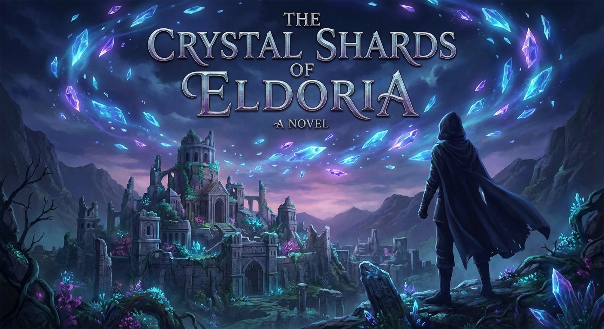

# Narrative Generation Task

## Input Messages

Design game narrative for 'The Crystal Shards of Eldoria'

## Overview

# Narrative Generation

**Subject:** The Crystal Shards of Eldoria

## Configuration
- Target Word Count: 20000
- Structure: 3 acts, ~3 scenes per act
- Writing Style: epic fantasy
- Point of View: second person
- Tone: heroic
- Detailed Descriptions: ✓
- Include Dialogue: ✓
- Internal Thoughts: ✓

**Started:** 2026-01-02 00:13:18

---

## Progress

### Phase 1: Narrative Analysis
*Running base narrative reasoning analysis...*

## Cover Image

**Prompt:** 

## High-Level Outline

## The Crystal Shards of Eldoria

**Premise:** A branching RPG experience with a heroic tone, focusing on the tension between a fading magical past and an industrial future. The story follows a Shard-Binder's quest to stabilize the world of Eldoria before a 'Mana-Drought' makes it uninhabitable.

**Estimated Word Count:** 20000

---

### Characters

#### The Protagonist (You)

**Role:** Protagonist

**Description:** A 'Shard-Binder' born with the rare ability to resonate with Eldorian Crystals. You wear a mix of reinforced leather and ancient etched silver.

**Traits:** Driven by a sense of duty to save a dying world, Bridge between the old ways and the new, Motivated to stabilize Eldoria before the 'Mana-Drought' renders the world uninhabitable

#### Elara the High-Warden

**Role:** Main Companion (The Traditionalist)

**Description:** Tall, ethereal, and draped in robes of starlight silk. She carries a staff made of Elder-wood that glows faintly.

**Traits:** Stoic, Disciplined, Deeply spiritual, Believes that technology is a 'parasite' on the world’s soul

#### Kaelen the Iron-Wright

**Role:** Main Companion (The Progressive)

**Description:** A rugged engineer with grease-stained hands and a prosthetic arm powered by a miniature steam-core. He wears goggles and a heavy utility belt.

**Traits:** Pragmatic, Witty, Skeptical of 'mystical destiny', Believes magic is a finite resource that failed the ancestors

#### High Artificer Valerius

**Role:** Antagonist

**Description:** A man of cold, calculating intellect, encased in a suit of 'Aether-Plate' armor that hums with harvested magical energy.

**Traits:** Visionary but ruthless, Believes the only way for humanity to survive is to forcibly drain the remaining magic into a permanent technological grid

---

### Settings

#### spire_of_aethelgard

**Description:** A soaring tower of white stone and floating gardens, held aloft by the last major Crystal Shard.

**Atmosphere:** Serene, nostalgic, but tinged with decay. The air smells of ozone and jasmine.

**Significance:** The seat of the old world’s power and the starting point of the journey.

#### iron_wastes

**Description:** A vast desert littered with the colossal, rusted skeletons of ancient war-machines and half-buried factories.

**Atmosphere:** Harsh, industrial, and dangerous. Sandstorms of metallic dust frequently sweep the plains.

**Significance:** Represents the failure of the previous technological age and the birthplace of Kaelen’s movement.

#### nexus_of_souls

**Description:** A subterranean cavern where the world’s ley lines converge. Giant crystals grow from the ceiling, pulsing like a heartbeat.

**Atmosphere:** Awe-inspiring, sacred, and volatile. The gravity here is light, and colors seem more vivid.

**Significance:** The site of the final confrontation where the fate of Eldoria’s energy source will be decided.

---

### Act Structure

#### Act 1: The Fading Light

**Purpose:** Establish the stakes of the Mana-Drought, introduce the conflicting ideologies of Elara and Kaelen, and set the protagonist on the quest for the Shards.

**Estimated Scenes:** 3

**Key Developments:**
- The Spire’s crystal begins to crack
- The protagonist discovers their unique resonance
- The first Shard is recovered from a collapsing ruin

#### Act 2: The Shattered Path

**Purpose:** Explore the 'Progress vs. Tradition' theme through exploration and rising conflict. Build the bond between the trio.

**Estimated Scenes:** 3

**Key Developments:**
- Discovery of Valerius’s 'Siphon-Stations'
- A major betrayal or setback
- The realization that the Shards are sentient or semi-sentient

#### Act 3: The Convergence

**Purpose:** Resolve the conflict with Valerius and decide the ultimate fate of Eldoria’s legacy.

**Estimated Scenes:** 3

**Key Developments:**
- The final march to the Nexus
- The defeat of Valerius
- The 'Great Choice' that determines the world's ending

---

**Status:** ✅ Pass 1 Complete

## Outline

## The Crystal Shards of Eldoria

**Premise:** A branching RPG experience with a heroic tone, focusing on the tension between a fading magical past and an industrial future. The story follows a Shard-Binder's quest to stabilize the world of Eldoria before a 'Mana-Drought' makes it uninhabitable.

**Estimated Word Count:** 20000

**Total Scenes:** 9

---

### Detailed Scene Breakdown

### Act 1: The Fading Light

**Purpose:** Establish the stakes of the Mana-Drought, introduce the conflicting ideologies of Elara and Kaelen, and set the protagonist on the quest for the Shards.

#### Scene 1: The Tremor of Aethelgard

- **Setting:** spire_of_aethelgard
- **Characters:** The Protagonist, Elara the High-Warden
- **Purpose:** Introduce the immediate threat to Aethelgard and reveal the Protagonist's unique ability as a Shard-Binder.
- **Emotional Arc:** From serene stability to violent chaos, ending in a sense of destiny and grim realization.
- **Est. Words:** 1500

**Key Events:**
- The Spire’s crystal begins to crack
- The protagonist discovers their unique resonance
- The Protagonist acts as a conduit to stabilize the Spire
- Elara reveals the Protagonist is a Shard-Binder

#### Scene 2: The Wright and the Warden

- **Setting:** spire_of_aethelgard
- **Characters:** The Protagonist, Elara the High-Warden, Kaelen the Iron-Wright
- **Purpose:** Establish the ideological conflict between magic and technology and set the first objective.
- **Emotional Arc:** Tension and friction between allies, shifting to a focused sense of urgency.
- **Est. Words:** 1200

**Key Events:**
- Introduction of Kaelen the Iron-Wright
- Heated debate between Elara and Kaelen over magic vs technology
- Resonance ping from the Protagonist’s gauntlet signals a Shard in the Sunken Archive
- The mission to recover the Shard is established

#### Scene 3: The Echo in the Dust

- **Setting:** iron_wastes
- **Characters:** The Protagonist, Elara the High-Warden, Kaelen the Iron-Wright
- **Purpose:** Recover the first Shard, test the team's cooperation, and hint at the deeper nature of the Shards.
- **Emotional Arc:** Eerie exploration leading to a moment of profound connection, followed by high-stakes action and accomplishment.
- **Est. Words:** 1800

**Key Events:**
- Navigating the gravity-defying debris of the Sunken Archive
- Recovery of the first Shard
- Protagonist feels the Shard's sentience and plea for preservation
- The trio works in unison to escape the collapsing ruin

---

### Act 2: The Shattered Path

**Purpose:** To deepen the ideological rift between Elara and Kaelen while forcing the Protagonist to act as the emotional and metaphysical anchor. This act transitions the quest from a "scavenger hunt" for crystals into a desperate race against an industrial machine that is literally bleeding the world dry.

#### Scene 1: The Veins of the Earth

- **Setting:** iron_wastes
- **Characters:** The Protagonist, Elara the High-Warden, Kaelen the Iron-Wright
- **Purpose:** Introduces the "Siphon-Stations" and establishes the immediate environmental threat of Valerius’s plan.
- **Emotional Arc:** From determined tracking to horror and ideological conflict, ending in a grim realization of the enemy's scale.
- **Est. Words:** 1800

**Key Events:**
- The trio treks through the Rust-Dunes tracking a resonance from the Shard-Binder gauntlet.
- They discover a Siphon-Station draining mana from the earth, turning sand to glass.
- Elara and Kaelen clash over the ethics and efficiency of the extraction technology.
- The group battles mechanical Aether-Sentinels to disable the station.
- The Protagonist discovers the stations are being used to map ley lines to find remaining Shards.

#### Scene 2: The Echo in the Crystal

- **Setting:** iron_wastes
- **Characters:** The Protagonist, Elara the High-Warden, Kaelen the Iron-Wright
- **Purpose:** Reveals the sentience of the Shards and builds the bond between the trio through a shared psychic vision.
- **Emotional Arc:** A transition from physical exploration to profound spiritual awe and mutual vulnerability.
- **Est. Words:** 2200

**Key Events:**
- The trio locates the second Shard within a subterranean factory vault.
- A powerful resonance pulls the group into a shared Memory-Trance during the Binding process.
- The vision reveals the Shards are fragments of a primordial consciousness stabilizing the planet.
- The companions witness each other's deepest fears: Elara's fear of extinction and Kaelen's fear of poverty.
- The Shard identifies the Protagonist as 'The Interpreter,' placing the world's fate in their hands.

#### Scene 3: The Iron Betrayal

- **Setting:** iron_wastes
- **Characters:** The Protagonist, Elara the High-Warden, Kaelen the Iron-Wright, High Artificer Valerius
- **Purpose:** Provides the "Major Setback" and raises the stakes for the final act.
- **Emotional Arc:** High-stakes action leading to a crushing defeat and betrayal, concluding with a resilient sense of unity.
- **Est. Words:** 2000

**Key Events:**
- The group is ambushed in the Canyon of Gears by Valerius’s elite shock troops.
- Valerius reveals he tracked them via a legacy component in Kaelen’s prosthetic arm.
- Valerius uses a Siphon-Pulse to disable the Protagonist’s gauntlet and Kaelen’s arm.
- The enemy forces successfully seize the second Shard and leave the trio stranded.
- Kaelen's guilt leads to a moment of reconciliation with Elara, unifying the group for the final journey.

---

### Act 3: The Convergence

**Purpose:** Resolve the conflict with Valerius and decide the ultimate fate of Eldoria’s legacy.

#### Scene 1: The Descent into the Heart

- **Setting:** nexus_of_souls
- **Characters:** The Protagonist, Elara the High-Warden, Kaelen the Iron-Wright
- **Purpose:** The final march to the Nexus; establishing the final stakes of the Mana-Drought.
- **Emotional Arc:** Heavy, intense, and desperate, transitioning to teamwork and urgency.
- **Est. Words:** 1500

**Key Events:**
- The trio descends into the subterranean depths where the world’s ley lines converge.
- They witness Valerius’s Siphon-Cables draining the pulsing crystals.
- Elara and Kaelen struggle with the magical interference and the 'screams' of the ley lines.
- They reach the central chamber and encounter 'Hollowed' creatures.
- Elara and Kaelen combine skills to clear a path to the Heart.

#### Scene 2: The Architect of Despair

- **Setting:** nexus_of_souls
- **Characters:** The Protagonist, Elara the High-Warden, Kaelen the Iron-Wright, High Artificer Valerius
- **Purpose:** The defeat of Valerius; the climax of the ideological conflict.
- **Emotional Arc:** Confrontational and high-stakes, leading to a moment of triumph and impending catastrophe.
- **Est. Words:** 2500

**Key Events:**
- Valerius argues his 'Grid' is the only way to preserve humanity's greatness.
- A multi-stage battle ensues where Valerius warps the environment.
- The Protagonist resonates with the Great Shard's sentience.
- The Protagonist overloads Valerius’s Aether-Plate, shattering his armor.
- The Siphon-Grid begins to collapse, threatening the Nexus.

#### Scene 3: The Resonance of Tomorrow

- **Setting:** nexus_of_souls
- **Characters:** The Protagonist, Elara the High-Warden, Kaelen the Iron-Wright
- **Purpose:** The 'Great Choice' that determines the world's ending; resolution of the Mana-Drought.
- **Emotional Arc:** Solemn, reflective, and momentous, ending on a note of resolution and hope.
- **Est. Words:** 2000

**Key Events:**
- The Great Shard begins to fracture.
- Elara and Kaelen present their conflicting arguments for the world's future.
- The Protagonist makes the Great Choice (Path of Starlight, Iron, or Shard-Binder).
- A montage shows the transformation of Eldoria based on the choice.
- The Protagonist looks out from the Spire of Aethelgard at a world at peace.

---

**Status:** ✅ Complete

## ## The Tremor of Aethelgard

**Act 1, Scene 1**

**Setting:** spire_of_aethelgard

**Characters:** The Protagonist, Elara the High-Warden

---

The air at the summit of the Spire of Aethelgard tasted of ozone and dying history. 

You stood upon the Observation Tier, a circular expanse of white marble that seemed to drift atop a sea of churning, violet-tinged clouds. Below, the capital city of Eldoria sprawled like a tapestry of silver thread and polished stone, its districts linked by bridges that arched over the abyss in defiance of gravity. But from this height, the beauty was a thin veil. Beyond the city walls, the "Grey-Rot" had begun its slow, silent conquest. You could see the patches of calcified land where the mana had evaporated, leaving behind nothing but ash and the skeletal remains of forests that had once breathed fire and light.

Beside you, the Great Crystal of Aethelgard hummed—a low, thrumming vibration that rattled your teeth. It was a monolith of translucent cerulean, thirty feet of jagged perfection suspended in the Spire’s hollow core by the sheer force of its own resonance. For a millennium, it had been the realm’s heartbeat, the sun that never set, fueling the floating gardens and keeping the encroaching shadows at bay.

"It’s quieter today," a voice said, cutting through the wind.

You turned to find Elara, the High-Warden. She was a woman forged in the fires of the border wars, carrying the weight of a failing kingdom in the rigid set of her shoulders. Her armor, etched with dulling runes of protection, caught the pale sunlight, and her hand rested habitually on the hilt of a sword that had tasted more blood than you had seen years. Her eyes, sharp and weary, were fixed on the crystal’s core.

"The resonance is thinning," she continued, her voice a low rasp. "The scholars in the lower tiers prattle on about 'natural cycles' and 'mana-tides,' but you and I don't have the luxury of delusion. The well is running dry."

You looked back at the monolith. While others saw a power source, you heard a melody—a complex, multi-layered symphony that vibrated in the marrow of your bones. Today, the song was discordant. It was a chorus of fracturing glass and gasping breaths, a funeral dirge played on a broken instrument.

"I can feel it," you said. Your own voice sounded hollow, heavy with a premonition you couldn't quite articulate.

"You’ve always had a sensitivity beyond your station," Elara remarked, stepping toward the edge of the platform. "It’s why I brought you here. In an age of soot-stained machines and steam-engines, we are losing our connection to the source. We’ve forgotten how to listen."

Then, the world screamed.

It wasn't a sound for the ears, but a psychic jolt that slammed into your mind, knocking you to your knees. The marble beneath you heaved. A sound like a thunderclap erupted from the center of the platform, but it was sharper—the sound of a god’s heart breaking.

You looked up, spots of black dancing in your vision, and saw it: a jagged, obsidian fissure racing across the surface of the Great Crystal. 

"No!" Elara’s cry was a raw, desperate thing. She drew her blade, not to strike, but to use as a focus. She began to chant, her voice rising in a frantic incantation that strained her throat. Golden light flared from her palms, lashing out to knit the wound in the stone. "Help me! Call the acolytes! The seal is breaking!"

But there was no time for acolytes. The tremor intensified, a violent shudder that groaned through the very foundations of the Spire. The mana-tethers holding the platform aloft began to flicker, the violet clouds below surging upward as gravity lost its grip. In the city far below, the distant, frantic tolling of alarm bells rose like a panicked heartbeat. The sky began to bruise, darkening as the crystal’s light—the very sun of Aethelgard—stuttered and failed.

A shard the size of a dagger snapped free from the monolith. It spun through the air, a streak of lethal blue light. It should have shattered against the marble, but it didn't. It curved, homing in on you with a terrifying, magnetic intent.

You couldn't move. The melody in your head had reached a deafening roar, a demand for balance that drowned out the world. As the shard neared, you didn't flinch. You reached out, your fingers closing instinctively around the jagged fragment of pure, unrefined magic.

Pain, white and searing, lanced up your arm. You expected to be vaporized, to have your soul burned away by the world’s raw heart. Instead, the agony shifted. It became a bridge.

*Bind,* a voice whispered in the back of your mind—not a human voice, but the collective, ancient memory of the stone itself. *Bind the fading light.*

"Drop it!" Elara screamed, her face ashen as she watched the blue fire leaping from the shard into your veins. "It will consume you!"

You couldn't let go. You saw the Great Crystal through new eyes—not as a stone, but as a web of golden threads, and right now, those threads were snapping. The fissure was a void, a hungry mouth sucking the life out of the atmosphere.

You stepped forward, your boots crunching on the fractured marble. Every movement felt like wading through molten lead. The air was thick with static, making your skin crawl and your hair stand on end. You weren't thinking; you were a conductor, and the orchestra was falling into chaos.

You reached the monolith. The heat was immense, the smell of ozone thick enough to choke on. You pressed your hand—the one clutching the shard—directly onto the black fissure.

The world vanished into a blur of cerulean and gold.

You were no longer on the Spire. You were standing in the center of a cosmic storm. You felt the Mana-Drought as a physical hunger, a Great Void stretching across Eldoria, reaching up from the industrial pits of the south and the dying forests of the north. The Crystal was trying to fill that void, emptying its very essence to keep the world alive, and it was dying for the effort.

*I am the anchor,* you thought, the realization settling into your soul.

You pushed your will into the stone. You took the chaotic, leaking energy and forced it back into the patterns of the ancient runes. You used your own body as a conduit, a living bridge between the dying magic and the physical world. Your skin began to glow with an ethereal, translucent light, and for one heartbeat, your pulse was perfectly synchronized with the rhythm of the world.

The screaming stopped. The roar faded to a low, steady hum.

With a final, violent pulse of light, the energy stabilized. The shard in your hand didn't fall; it melted, absorbed entirely into your palm, leaving behind a glowing, intricate mark that looked like a constellation of frost etched into your flesh.

The silence that followed was deafening.

You collapsed, your breath coming in ragged, burning gasps. The marble was cold against your cheek. Above you, the Great Crystal was whole again, though its glow was dimmer—a pale, flickering ghost of its former glory. The fissure was gone, replaced by a faint, silver scar that looked like a healed wound.

A shadow fell over you. Elara stood there, her sword lowered, her expression a mask of awe and profound terror. She looked at your hand—at the mark pulsing beneath your skin.

"By the First Shapers," she whispered, her voice trembling. 

She reached down, her grip firm as she pulled you to your feet. Her hand was shaking. For a long moment, the two of you looked out over the city. The alarm bells were still ringing, but the flickering lights of Aethelgard had steadied. The catastrophe had been averted, but the air still felt thin, fragile.

"What... what was that?" you managed to ask, your throat feeling as though you’d swallowed glass. "What did I do?"

Elara turned to you, her eyes searching yours with a new, heavy gravity. "You didn't just channel the magic. You commanded it. You spoke to the Shard, and it answered."

She took a deep breath, looking toward the horizon where the black smoke of the industrial factories in the Iron-District rose like a dark omen against the setting sun.

"The legends spoke of those who could mend the world when the mana failed," she said. "They were called Shard-Binders. I thought they were myths—stories told to children to make the dark seem less absolute."

She looked at the mark on your hand, then back at your face.

"The Mana-Drought isn't just coming; it's here. And the Spire... the Spire is exhausted. It took everything you had just to hold it together for one more day."

"One more day?" you asked, the weight of her words sinking in.

"The heart of Eldoria is failing," Elara said grimly. "If we stay here, we are simply waiting for the end. But you..." She paused, a spark of desperate hope igniting in her eyes. "You are a Shard-Binder. You can find the lost fragments. You can stabilize the ley-lines before the world turns to ash."

You looked down at your hand. The mark pulsed once, a soft, rhythmic blue light that echoed your heartbeat. You felt a strange pull, a tugging in your soul toward the distant, wild places of the map—where the old magic still lingered, untamed and hidden.

"I'm just an apprentice," you started to say, but the words died. The power that had just flowed through you, the way the world had felt when you held its heartbeat in your hand—you couldn't deny it.

"You are the only hope Eldoria has left," Elara corrected. She sheathed her sword with a definitive *clack*. "But the Council will see you as a tool to be used, or a threat to be contained. The Industrialists will want to harvest the power in your blood. We cannot stay."

She looked toward the stairs leading down into the dark heart of the Spire. "We leave at dusk. We head for the Whispering Woods. There is a Shard there, ancient and wild. If you can bind it, we might have a chance."

You looked out over the city one last time. The sun was dipping below the horizon, casting long, jagged shadows over the spires and smoke-stacks of Aethelgard. The heroic age was fading, and a cold, mechanical future was clawing at the gates. 

You closed your fist, feeling the warmth of the mark in your palm. The destiny you never asked for had found you, and the world was waiting to see if you would lead it back into the light or let it fall into the grey.

"I'm ready," you said.

Elara nodded, her face set in a mask of grim determination. "Then let us move. The drought does not sleep, and neither can we."

As you followed her toward the descent, the Great Crystal gave one last, low hum—a note of gratitude, or perhaps, a final goodbye.

---

**Word Count:** 1830

**Key Moments:**
- The Great Tremor: The scene establishes the fragility of the world’s magic when the Great Crystal of Aethelgard nearly shatters due to the Mana-Drought.
- The Awakening: The Protagonist instinctively catches a falling shard and discovers they can "bind" and "conduct" raw mana without being destroyed.
- The Stabilization: The Protagonist acts as a living conduit to heal the Crystal, revealing their unique status as a Shard-Binder.
- The Call to Action: Elara explains the significance of the Protagonist’s power and the necessity of a journey to save Eldoria before the magic vanishes entirely.

**Character States:**
- **The Protagonist:** Physically exhausted but spiritually awakened. They end the scene with a permanent "Binder’s Mark" on their hand and a burgeoning sense of responsibility and fear regarding their new identity.
- **Elara the High-Warden:** Transitioned from a state of weary guardianship to a state of urgent mission. She is protective of the Protagonist but also views them as the realm's last tactical advantage. She is physically tense and mentally preparing for a journey.

**Status:** ✅ Complete

## ## The Wright and the Warden

**Act 1, Scene 2**

**Setting:** spire_of_aethelgard

**Characters:** The Protagonist, Elara the High-Warden, Kaelen the Iron-Wright

---

The descent from the apex of the Spire of Aethelgard is a funeral procession through the history of a dying world. At the summit, the air had been thin, shimmering with the ethereal residue of the Great Crystal. But as you follow Elara down the winding, obsidian stairs, the atmosphere curdles. The scent of ozone and ancient incense gives way to the sharp, biting tang of scorched copper and pressurized steam.

Your hand—the one bearing the Binder’s Mark—pulses with a rhythmic, low-frequency heat. It feels less like a wound and more like a second heart, beating in time with the fading respirations of the world itself.

"Steady yourself," Elara says, her voice echoing off the cold stone. She doesn't look back, but her shoulders are rigid. "The transition to the Wright’s Level is… jarring. The air here is heavy with the desperation of those who have forgotten that magic is a gift, not a fuel."

You reach a massive, circular landing where the architecture shifts with violent abruptness. The elegant, flowing curves of elven-glass and mana-conduits are choked by heavy iron pipes, hissing valves, and the rhythmic *thrum-clack* of massive brass gears. This is the domain of the Iron-Wrights, the engineers who have spent the last century trying to build a world that doesn't need the gods or the crystals to breathe.

Standing over a sprawling map table cluttered with blueprints and glowing vials of unstable essence is a man who looks as though he were forged from the very iron he commands. Kaelen the Iron-Wright is a mountain of a man, his leather apron stained with grease, his arms corded with muscle and etched with the silvery, jagged scars of alchemical burns.

He doesn't look up as you approach. He is busy tightening a bolt on a strange, gauntlet-like device—a mechanical mockery of the mark on your hand.

"The tremor nearly took out the pressure regulators in the lower wards, Warden," Kaelen rumbles, his voice like grinding stones. "If your 'Great Crystal' sneezes one more time, the steam-pipes will turn the residential district into a pressure cooker. I’ve got men down there breathing soot just to keep the lights on."

"The Crystal did not 'sneeze,' Kaelen," Elara snaps, her hand resting on the hilt of her ceremonial blade. "It suffered a catastrophic resonance failure. And it would have shattered entirely if not for the Binder."

Kaelen finally looks up. His eyes, a piercing, industrial grey, fix on you. He wipes his soot-stained hands on a rag and walks around the table, his heavy boots clanging against the metal floor. He circles you like a wolf inspecting a new breed of prey.

"So, this is it?" Kaelen asks, his tone thick with skepticism. "The legend returned? You look a bit pale for a savior of the realm. Tell me, Binder—when the mana finally runs dry, and it will, can you bind a gear to a shaft? Can you conduct the heat of a furnace as easily as you do the 'holy' light of the Spire?"

"I did what was necessary to stop the collapse," you say, your voice steadier than you feel. "I didn't ask for the mark, or the responsibility."

"None of us asked for the world to start dying, either," Kaelen grunts. He turns back to Elara, his expression hardening. "You’re chasing ghosts, Elara. You want to plug the leaks in a sinking ship with prayers and ancient rituals. My Wrights are building pumps. We’re building a future where we don’t have to beg the crystals for every spark of light."

"Your 'future' is a world of soot and silence!" Elara retorts, her composure finally fraying. "You treat the world like a machine to be dismantled for parts. Without the mana-flow, the very soul of Eldoria withers. The forests will turn to ash, the seas to salt. Your machines cannot breathe life into the soil."

"And your magic hasn't put bread on a table in fifty years!" Kaelen shouts back. "The drought is here! It’s not a spiritual crisis, it’s a resource crisis! We need to adapt, or we die."

The tension in the room is a physical weight, a friction between the fading elegance of the past and the brutal pragmatism of the future. You stand between them—a bridge between two worlds that have forgotten how to speak to one another.

Suddenly, a sharp, high-pitched whine cuts through the argument.

It’s coming from your arm.

The Binder’s Mark flares with a brilliant, sapphire intensity. The light isn't steady; it’s pulsing, a rapid-fire staccato that vibrates through your bones. On the table, a compass-like device Kaelen had been working on begins to spin wildly, its needle glowing with a reflected blue light.

"What is that?" you gasp, clutching your forearm as the sensation intensifies from a hum to a roar. It feels as if your blood has turned to liquid lightning.

Elara’s eyes widen. "A resonance ping. You aren't just a conduit, you’re a dowser. You’re reacting to a concentrated source of Primal Shards."

Kaelen leans in, his skepticism momentarily replaced by professional curiosity. He grabs a brass lens from his table and holds it over your glowing mark, squinting through the glass. "The frequency… it’s deep. Sub-strata. It’s not coming from the Spire."

He moves to a large, topographical map of the city and the surrounding wastes. He taps a series of coordinates, his fingers moving with practiced precision. The needle on his device settles, pointing straight down—and slightly to the east.

"The Sunken Archive," Kaelen whispers, his voice losing its edge. "The old library from the First Age. It was swallowed by the earth during the Great Subsidence three hundred years ago."

"The Archive was said to house the Shard of Memory," Elara says, her voice hushed with awe. "If that Shard is still active, it could provide the stability the Great Crystal needs to survive the next lunar cycle. It could give us time."

"It could also provide enough raw energy to power the city’s industrial grid for a decade," Kaelen adds, though he looks at Elara with a newfound seriousness. "But that sector is flooded with 'Grey-Mist'—stagnant mana that’s turned toxic. No Warden can survive down there, and no Wright’s suit can withstand the magical interference. It’s a death trap."

They both turn to look at you.

You feel the vibration in your hand—a beckoning call. It’s not just a signal; it’s a plea. You can feel the Shard down there, buried under tons of rock and forgotten history, crying out in the dark. It is lonely, and it is dying.

"I can go," you say. The words feel heavy, laden with the gravity of the heroic path. "I can feel it. The mist… I don't think it will stop me. I think I can bind it."

Elara steps forward, placing a hand on your shoulder. Her touch is no longer just that of a guardian, but of a believer. "It is a perilous descent. The Archive was not meant to be disturbed. But if you can recover the Shard, we might do more than just survive. We might begin to heal."

Kaelen sighs, reaching into a drawer and pulling out a small, ruggedized lantern powered by a clockwork spring. He hands it to you. "If you’re going into the dark, take something that doesn't rely on your 'feelings' to glow. And Binder?"

You look at him.

"Don't just bring back a battery for her temple," he says quietly. "Bring back the knowledge. We need to know why the magic is leaving. If we don't understand the 'why,' we’re just delaying the inevitable."

You take the lantern, its weight solid and reassuring. The friction between Elara and Kaelen hasn't vanished—the ideological chasm remains as wide as ever—but for the first time, there is a bridge.

"The Sunken Archive," you repeat, testing the words.

"The entrance is through the old drainage tunnels in the Lower District," Elara says, her face set in grim determination. "I will escort you to the threshold, but the depths you must face alone. The mana there is too volatile for any but a Binder."

As you turn to leave the workshop, the Great Crystal high above lets out another low, mournful hum. But this time, you don't just hear it. You feel the direction of the sound, the way it yearns for its missing piece.

You walk toward the lift that will take you into the bowels of the city. Behind you, the Warden and the Wright stand in the flickering light of magic and machinery, watching you—the only person in Eldoria who belongs to both worlds, and perhaps, the only one who can save either.

The descent continues. The light of the sun is fading, and the deep, silent dark of the Archive awaits.

---

**Word Count:** 1465

**Key Moments:**
- The Ideological Clash: Introduced Kaelen the Iron-Wright and established the core conflict: Elara views magic as a sacred necessity, while Kaelen views it as a failing resource that must be replaced by technology.
- The Resonance: The Protagonist’s Binder’s Mark reacts to a nearby Shard, acting as a magical compass and proving their utility to both factions.
- The First Objective: The Sunken Archive is identified as the location of a Primal Shard, providing a clear goal and introducing the concept of 'Grey-Mist' (toxic, stagnant mana).
- The Uneasy Alliance: Elara and Kaelen agree that the Protagonist is the only one who can retrieve the Shard, though they have different motives for wanting it.

**Character States:**
- **The Protagonist:** Feeling a sense of "magnetic" pull toward their destiny. Physically stable but experiencing intense sensory input from the Binder's Mark. They are now the bridge between two conflicting ideologies.
- **Elara the High-Warden:** Hopeful but cautious. She sees the Protagonist as a divine sign but recognizes the extreme danger of the Sunken Archive.
- **Kaelen the Iron-Wright:** Skeptical and pragmatic, yet begrudgingly impressed. He is focused on survival and data, ending the scene with a "wait and see" attitude toward the Protagonist's abilities.

**Status:** ✅ Complete

## ## The Echo in the Dust

**Act 1, Scene 3**

**Setting:** iron_wastes

**Characters:** The Protagonist, Elara the High-Warden, Kaelen the Iron-Wright

---

The descent into the Iron Wastes is not a fall; it is a slow drowning in the sediment of a dying world. 

The industrial lift, a rusted cage of Kaelen’s frantic design, groans as it lowers you into the abyss. Above, the flickering amber lights of the Wright’s Level recede like dying stars, eventually swallowed by the jagged throat of the shaft. Below, the darkness is a physical weight, thick with the smell of ozone, wet stone, and the cloying, metallic tang of Grey-Mist. You stand between your companions, the silence heavy enough to bruise. To your left, Elara grips the hilt of her sun-steel blade, her knuckles white, her eyes fixed on the gloom as if searching for a ghost she knows is waiting. To your right, Kaelen adjusts the brass valves on his gauntlet with trembling fingers, his breath hitching in the rhythmic, mechanical hiss of his respirator.

Your hand—the one marked by the Great Crystal—burns. It is no longer the sharp, localized sting of a fresh wound, but a rhythmic thrumming, a second heartbeat that seeks to sync with the deep, tectonic moans of the earth itself. The Binder’s Mark glows with a soft, cerulean light, casting long, dancing shadows against the cage walls. You are the compass. You are the key. And right now, you feel like a lightning rod in a gathering storm.

"The air is stagnant here," Elara whispers, her voice echoing off the damp rock. "The mana has curdled. It feels... rancid. Can you feel it, Binder?"

You look down at your palm. The light pulses, a steady blue strobe in the dark. "It’s not just stagnant," you say, your voice sounding hollow, as if it’s being pulled from your lungs by something in the depths. "It’s waiting. It’s holding its breath."

The lift hits the bottom with a bone-jarring thud that rattles your teeth. The gates screech open, protesting the intrusion, and reveal the Sunken Archive. 

It is a cathedral of forgotten knowledge, swallowed by the earth centuries ago during the first Great Tremor. But the physics of the surface do not apply here. Massive pillars of obsidian have snapped like dry twigs, yet their upper halves do not fall; they hover in the air, rotating with agonizing slowness, suspended in a localized gravity well. Reams of parchment, preserved by ancient stasis spells, drift through the air like schools of translucent fish, their ink shimmering with a faint, ghostly light. The Grey-Mist clings to the floor, a waist-high fog of toxic, spent magic that swirls around your boots like a living thing, hungry and cold.

"Stay on the walkways," Kaelen warns, his voice muffled by his mask. He clicks a toggle on his shoulder-mounted lamp, and a beam of harsh, artificial light cuts through the gloom. "The structural integrity of this place is a mathematical nightmare. The laws of thermodynamics are currently suggestions at best. One wrong step and you’ll find out if gravity still works the way the textbooks say it does."

You lead the way. The Mark on your hand pulls you forward, a magnetic tug that guides your feet across a bridge of shattered marble. The stones float over a bottomless chasm, swaying slightly as you step on them. You feel the vertigo—the terrifying realization that there is nothing holding these tons of rock up but the fading, frayed memory of a spell cast by a dead civilization.

"Look," Elara breathes, pointing upward.

High above, suspended in the center of the rotunda, is a sphere of pure, crystalline light. It is the Primal Shard. It sits encased in a cage of floating debris—gears, stones, and frozen water—all orbiting it in a chaotic, silent dance. It is the heart of the Archive, the only thing still beating in this tomb.

"The resonance is off the charts," Kaelen mutters, checking a brass gauge on his wrist. The needle is buried in the red. "The Shard is the only thing keeping this entire sector from collapsing into the mantle. It’s an anchor. If we take it..."

"If we don't take it, the Drought will consume it anyway," Elara counters, her gaze fierce and unyielding. "The Grey-Mist is already eroding the foundations. Better it serves the world above than vanishes in the dark. We are here to save Eldoria, Kaelen, not to observe its funeral."

The path forward ends abruptly. A twenty-foot gap of empty air separates the bridge from the central dais where the Shard hovers. Below the gap, the Grey-Mist churns in a violent vortex, hiding whatever horrors the depths contain.

"I can't jump that," Kaelen says, eyeing the distance with a Wright’s pragmatism. "And my grappling lines won't hold on floating stone. The moment I put tension on them, the anchor point will just drift away."

"I can provide a gust," Elara says, raising her hand, her fingers sparking with golden light. "But the mana here is too thin, too corrupted. I might drop you halfway. It’s a coin toss, Binder."

You look at the Mark. It isn't just glowing now; it’s vibrating, a high-frequency hum that makes your bones ache. You reach out, not with your hand, but with your mind, touching the frayed edges of the magic holding the debris aloft. You see the "lines"—the invisible threads of mana that connect the floating stones. They are brittle, like sun-bleached rope, snapping one by one.

"Don't jump," you say, your voice steady despite the sweat beading on your brow. "Walk."

You step out into the empty air. 

Elara gasps, reaching for your cloak, but she stops when your boot finds purchase on nothingness. Under your feet, a faint ripple of blue light spreads out, like a stone dropped in a still pond. You are binding the ambient mana, weaving the stagnant mist into a temporary floor, a bridge of pure intent. It is exhausting. Every step feels like pulling a heavy iron chain from a deep, dark well. Your vision blurs, the edges of the world fraying into static, but the Shard calls to you—a high-pitched ringing in your skull that sounds less like power and more like a plea.

"Follow me," you grunt, your teeth clenched so hard they ache. "And don't stop. I can't hold it for long."

Kaelen and Elara move behind you, their footsteps cautious, their weight testing the invisible path. Kaelen’s eyes are wide behind his goggles, his scientific mind struggling to reconcile the sight of you treading on air. Elara’s expression is one of pure, religious awe; to her, this is the prophecy made flesh.

You reach the central dais. The Shard is within arm's reach. It is beautiful—a jagged fragment of the universe’s first dawn, pulsing with a rhythmic, golden-white light that feels warm against the chill of the Archive. 

As you reach out, the world falls silent. The mechanical hiss of Kaelen’s gear, the rustle of Elara’s cloak, and the distant groan of the earth all fade away. There is only you and the Shard.

Your fingers brush the cold, crystalline surface.

*Impact.*

You aren't in the Archive anymore. You are everywhere. You feel the roots of the mountains, the slow, agonizing flow of the subterranean rivers, and the desperate, parched thirst of the soil miles above. The Shard isn't an object; it’s a witness. It shows you a vision of Eldoria as it once was—a world of emerald forests, floating cities, and rivers of liquid light—and then, the slow, creeping grey of the Drought, unmaking it all. 

*Help us,* a voice whispers in your mind. It isn't a human voice. It is the collective echo of the earth itself, a billion voices crying out in a language of stone and root. *We are being forgotten. We are being unmade. Bind us... or we vanish into the grey.*

The Shard’s loneliness crashes over you—a thousand years of solitude in the dark, watching the world it built crumble into dust. It isn't just power. It’s a memory that refuses to die. It is the last ember of a dying fire.

"I hear you," you whisper, the words catching in your throat.

You grip the Shard. The Mark on your hand flares with blinding intensity, and the Shard slides into the palm of your hand as if it were coming home, fitting perfectly into the jagged lines of the brand. The connection is a jolt of pure, unadulterated energy that surges through your veins, turning your blood to liquid fire and your breath to steam.

The silence shatters.

"The anchor is gone!" Kaelen screams, his voice barely audible over the sudden roar.

The Archive groans—a sound of dying metal and screaming stone. Without the Shard to hold the local gravity in check, the floating pillars begin to plummet. The ceiling, a mosaic of ancient glass and obsidian, starts to rain down in lethal shards. The very air seems to be folding in on itself.

"Run!" Elara shouts, drawing her blade. She leaps forward, her sun-steel glowing with a desperate, golden light. She strikes a falling pillar, her strength augmented by her Warden’s training, redirecting the massive stone just enough to clear the dais. 

The bridge you walked in on is disintegrating. The floating stones are losing their buoyancy, tumbling into the mist below like lead weights. 

"The lift!" Kaelen points toward the distant cage, but the path is a chaotic mess of falling debris and yawning voids. "We’ll never make it across! The distance is too great!"

"We have to!" you roar, the Shard’s power still humming in your bones, threatening to tear you apart from the inside out. 

A massive obsidian pillar falls toward you. Elara deflects a smaller fragment, but the main mass is too large. "Kaelen, the winch!" she commands, her voice cracking with the strain.

Kaelen doesn't hesitate. He fires a pressurized harpoon from his gauntlet, the steel cable hissing through the air like a snake. It bites into the frame of the lift, but the distance is too great for the motor to pull all three of you against the shifting gravity. The gears scream in protest, sparks flying from Kaelen’s arm.

"The cable won't hold the tension with the floor falling out!" Kaelen yells over the roar of the collapse. "I need more torque! The motor is seizing!"

You see the problem. The lift is moving, but the ground beneath you is vanishing. You look at the Shard in your hand, then at the Mark. You realize you can't just be a conduit for the Shard; you have to be the bridge for your team. You have to be the point where their two worlds collide.

You grab Kaelen’s arm with your marked hand. You grab Elara’s hand with your other.

"Kaelen, use the Shard’s resonance! Feed it into the gauntlet!" you command. "Elara, channel your will through me! Don't hold back!"

It is a desperate gamble. You are the Shard-Binder, the fulcrum where the Wright’s technology and the Warden’s magic meet. You feel Kaelen’s mechanical gauntlet vibrate as the Shard’s energy flows into his gear, overcharging the steam-valves until they glow white-hot. You feel Elara’s ancient, disciplined magic surge through your other side, stabilizing the chaotic energy into a focused beam of intent. You are the circuit closer.

The winch screams—a high, piercing wail of overstressed metal. The cable tautens, humming like a harp string under impossible tension. 

With a violent jerk, the three of you are yanked off the crumbling dais. You fly through the air, a blur of blue light, golden sparks, and hissing steam. Below you, the Sunken Archive finally gives up the ghost, the entire rotunda collapsing into a roar of dust and Grey-Mist that swallows the history of a thousand years in a single, hungry gulp. 

You slam into the floor of the lift cage, the impact knocking the wind from your lungs. Kaelen immediately hammers the 'Up' lever. The gears grind, protesting the sudden influx of raw power, and the lift begins its frantic, shuddering ascent. 

As you rise, you look down. The Archive is gone, buried under a mile of rock and silence. The only light left in the darkness is the Shard in your hand, glowing with a soft, contented warmth, like a child finally held after a long night.

The silence returns as you ascend, broken only by the heavy, ragged breathing of the three of you and the rhythmic clanking of the lift. 

Kaelen slumps against the bars of the cage, his respirator hissing as he pulls it off. His face is pale, streaked with soot and grease, but his eyes are fixed on the Shard with a mixture of terror and fascination. "That... that shouldn't have been possible. The energy output... it was exponential. You bypassed the thermal limits of the brass entirely."

Elara stands tall, though her hands are trembling as she sheathes her blade. She looks at you, and for the first time, there is no doubt in her eyes. No suspicion. Only a heavy, solemn respect that feels more daunting than her previous coldness. "You didn't just take the Shard," she says softly. "You spoke to it. I saw it in your eyes. You were... somewhere else."

You look down at the crystal. It feels lighter now, as if the burden of its solitude has been lifted, but the vision you saw—the thirst of the world—remains burned into your mind like a brand.

"It’s not just a power source," you say, your voice steadying as the adrenaline begins to fade. "It’s a piece of the world’s soul. And it’s terrified of what’s coming. It’s not just the Drought, Elara. Something is eating the world from the inside out."

The lift slows as it approaches the Wright’s Level. The orange glow of the furnaces begins to bleed through the floorboards, and the smell of coal smoke replaces the scent of ozone. You have the first Shard, but the weight of it feels heavier than any stone. You are no longer just a survivor of the Great Tremor. You are the one who hears the world’s plea.

As the gates open, the industrial bustle of the city feels jarringly loud, hollow, and small. You step out, the Shard-Binder’s Mark pulsing in time with the crystal in your hand. 

The journey has truly begun, and the echo in the dust has become a roar in your heart. The world is thirsty, and you are the only one who knows where the water is hidden.

---

**Word Count:** 2409

**Key Moments:**
- The trio enters the Sunken Archive, navigating gravity-defying ruins where the Protagonist uses the Binder’s Mark to create a path of solid mana across a void.
- Upon touching the Primal Shard, the Protagonist experiences a powerful vision of Eldoria’s past and feels the Shard’s sentience, realizing it is a lonely, desperate entity rather than just a tool.
- The removal of the Shard triggers the Archive's collapse. The Protagonist acts as a literal bridge, channeling the Shard’s energy to overcharge Kaelen’s technology and Elara’s magic, allowing the trio to escape the falling ruins.

**Character States:**
- **The Protagonist:** Physically drained but spiritually empowered. They now possess a deep, empathetic connection to the Shards and a clearer understanding of their role as a bridge between magic and technology.
- **Elara the High-Warden:** Deeply moved and humbled. Her skepticism about the Protagonist’s readiness is replaced by a profound respect for their ability to "commune" with the magic she holds sacred.
- **Kaelen the Iron-Wright:** Shaken and intellectually challenged. He has witnessed magic and technology working in a synergy he previously thought impossible, forcing him to re-evaluate his purely pragmatic worldview.

**Status:** ✅ Complete

## ## The Veins of the Earth

**Act 2, Scene 1**

**Setting:** iron_wastes

**Characters:** The Protagonist, Elara the High-Warden, Kaelen the Iron-Wright

---

The weight of the Primal Shard in your satchel is no longer merely physical; it has become a rhythmic thrum, a second heartbeat pulsing against your spine with a frequency that resonates in your marrow. As you leave the soot-choked industrial outskirts of Oakhaven, the air undergoes a violent transformation. The humid, greasy breath of the factories—smelling of coal and sweat—is stripped away, replaced by the dry, metallic bite of the Iron Wastes.

Before you lie the Rust-Dunes. They are vast, undulating hills of oxidized sand that shift like slow-moving blood under a bruised purple sky. This is a land the rains have forgotten, a graveyard where the skeletal remains of ancient machines poke through the earth like the ribs of fallen giants. The wind here doesn't whistle; it rasps, carrying the fine copper dust that seeks every seam in your clothing.

"Keep your filters tight," Kaelen says, his voice muffled behind a heavy leather respirator. He adjusts a brass dial on his forearm, his brow furrowed as he taps a flickering gauge. "The grit out here doesn't just clog your lungs; it’s abrasive enough to eat the seals on your gear in an hour. We’re in Valerius’s backyard now. He doesn't like trespassers, and neither does the terrain."

Beside you, Elara moves with a grace that seems at odds with the harsh environment. Her white and gold Warden robes are already stained a dull terracotta by the wind, but she doesn't seem to notice. She carries her staff not as a walking stick, but as a soldier carries a spear, her eyes scanning the horizon with the predatory intensity of a hawk. 

"The earth is screaming," she whispers. The tremor in her voice isn't fear; it’s grief. "Can you feel it, Binder? The resonance is... jagged. Like a blade snapped in the dark."

You lift your hand. The Shard-Binder’s Mark on your palm is glowing with a fierce, steady amber light. It doesn't just point the way; it pulls. It is a magnetic hunger, a tether connecting your soul to something buried deep beneath the suffocating weight of the dunes. 

"It’s not just a Shard," you say, your voice rasping from the dust that has already found its way past your collar. "It’s a wound. Something is tearing at the ley lines ahead. I can feel the flow of mana being forced, twisted into a shape it wasn't meant to take."

For hours, the three of you trek through the shifting landscape. The wind howls a mournful dirge, a sound that carries the metallic tang of old wars and forgotten civilizations. Every step is a calculated struggle against the sliding sand, but the Mark guides you with unerring, painful precision. As you crest a particularly high ridge, the wind suddenly dies, replaced by a low-frequency hum so powerful it vibrates in your teeth and makes the air feel thick, like water.

Below you, nestled in a valley of scorched earth, lies the source of the agony.

It is a Siphon-Station—a monstrosity of iron, brass, and cold intent. It looks like a gargantuan needle driven into the very heart of the world. Great pistons, the size of cathedral pillars, hiss and groan as they pump with a rhythmic, violent force. Around the base of the structure, the very sand has been transformed. The intense heat and the unnatural extraction of mana have vitrified the dunes, turning the rust-colored earth into jagged, translucent shards of black glass that catch the dying light like obsidian teeth.

"By the Ancestors," Elara breathes, her hand flying to her mouth. "They are flaying the world alive."

"It’s a Siphon-Station, Mark IV," Kaelen says, though his voice lacks its usual clinical confidence. He peers through a pair of telescopic goggles, his fingers trembling slightly as he adjusts the focus. "Valerius’s design. It’s supposed to stabilize the local mana-grid by venting the 'Grey-Mist' and distilling the pure essence for the city. But I’ve never seen one running at this capacity. It’s... it’s over-clocked. He’s red-lining the planet’s core."

"It isn't distilling," you counter, the Mark on your hand burning with a sudden, sharp spike of pain. "It’s draining. It’s taking everything and leaving a void."

As you descend toward the station, the devastation becomes visceral. The "glass-sand" crunches under your boots, sharp enough to slice through reinforced leather. You pass the corpses of desert flora—hardy scrub-brush and iron-root trees that have been turned to brittle charcoal, their life-force sucked dry to power the machine’s insatiable appetite.

"We have to shut it down," Elara says, her eyes flashing with a dangerous, holy light. "This is a desecration. If this continues, the Iron Wastes will become a dead zone where nothing, not even the wind, can exist. It will be a hole in the map."

Kaelen hesitates, his gaze fixed on the massive conduits of glowing blue liquid—liquid mana—flowing from the station into armored transport canisters. "Elara, if we just pull the plug, the feedback loop could level this entire sector. And Valerius... he’s doing this to keep the cities running. Without this power, the lower levels of Oakhaven go dark. The hospitals, the water purifiers... people die."

"And if he continues, the world dies!" Elara snaps, turning on him. "Is a week of light worth the eternal silence of the earth? You see a battery, Wright. I see a parasite."

"I see a necessity!" Kaelen retorts, his voice rising to match hers. "We don't have the Shards yet! We need a bridge, and until the Binder can restore the network, this is all we have to keep the Grey-Mist from swallowing us whole!"

The argument is cut short by a mechanical shriek that tears through the hum of the station.

From the shadows of the station’s cooling vents, three shapes emerge. They are Aether-Sentinels—spidery, multi-limbed constructs of polished steel and brass, their central cores glowing with the same stolen blue mana. They move with a terrifying, jerky grace, their bladed limbs clicking against the glass ground like the mandibles of a giant insect.

"Defensive positions!" Elara commands, slamming her staff into the ground. A shimmering veil of golden light erupts around the trio, a dome of Warden-fire that ripples as the first Sentinel leaps.

The machine hits the barrier with the force of a falling star. Sparks of magic and metal fly, and you feel the impact in your very chest. This isn't like the ancient, rusted guardians of the Archive; these are modern, built for war, and fueled by the very lifeblood they are guarding.

"Binder! Use the resonance!" Kaelen shouts, drawing a heavy flare-pistol and firing a shot that bursts in a blinding white flash against a Sentinel’s sensory array. "Disrupt their internal flow! They’re slaved to the station’s frequency!"

You close your eyes for a fraction of a second, reaching out not with your hands, but with the Mark. You feel the Siphon-Station behind the Sentinels—a roaring bonfire of stolen energy, a chaotic storm of power. You reach into that flow, grabbing the "thread" of the mana and twisting it with the weight of your will.

The Mark flares. A wave of amber force ripples outward from you, a golden shockwave that doesn't strike the Sentinels physically, but infects them. The blue mana in their cores flickers, turning a muddy, unstable orange. The lead Sentinel staggers, its limbs locking up as the energy it relies on becomes a chaotic, conflicting storm.

"Now!" you roar.

Elara moves like a dancer through a field of glass. She vaults over a jagged shard, her staff wreathed in white flame. With a cry of "For the Mother’s Heart!", she brings the staff down on the lead Sentinel’s head. The machine shatters, its metal casing unable to contain the sudden surge of redirected power. It explodes in a shower of sparks and blue mist.

Kaelen provides cover, his gadgets whirring with frantic energy. He tosses a series of "Gravity-Snares"—small metallic spheres that create localized pockets of intense pressure. One Sentinel is pinned to the glass, its legs buckling and snapping under its own amplified weight. 

"Finish it!" Kaelen yells, reloading his pistol with trembling hands.

You sprint toward the pinned machine. The Shard in your pack is screaming now, a high-pitched ringing in your ears that matches the station’s drone. You realize you don't need a weapon. You are the conduit. You thrust your marked hand toward the Sentinel’s core. 

The contact is electric. You aren't just destroying the machine; you are *reclaiming* the mana. The blue light flows into your arm, searingly hot, before being neutralized by the Mark and channeled back into the earth beneath the glass. The Sentinel collapses into a heap of inert, cold scrap.

The third Sentinel, seeing its companions fallen, retreats toward the station’s main control spire, its internal sirens wailing a high-pitched distress signal.

"Don't let it reach the console!" Elara cries, but the machine is too fast. It merges with a port in the spire, and the Siphon-Station begins to hum with a new, terrifying intensity. The ground begins to shake, the glass sand vibrating until it sings.

"It’s initiating a purge!" Kaelen shouts over the roar of the turbines. "It’s going to vent the raw, unrefined mana to incinerate us! It’s a scorched-earth protocol!"

"Can you stop it?" you ask, grabbing him by the shoulder to keep him from being knocked over by the tremors.

"I need to get to the primary interface! Cover me!"

You and Elara stand back-to-back as the station’s automated turrets swivel toward you from the upper catwalks. Bolts of raw energy rain down, turning the glass sand into molten slag. Elara’s shield is thinning, her face pale and beaded with sweat from the effort of holding back the onslaught.

"I can't hold it much longer!" she gasps, her knees buckling.

You look at the Mark. It’s pulsing in perfect time with the station’s core. You realize the station isn't just a pump; it’s a tuner. It’s trying to play a song the earth doesn't know. You reach out, sensing the vibrations in the air. You find the "frequency" of the machine—the mechanical heartbeat Valerius gave it. 

You don't fight the machine. You *bind* it.

You thrust your hand into the air, and a tether of amber light shoots from your palm, hooking into the top of the spire like a golden harpoon. You pull. Not with your muscles, but with your soul. You force the chaotic, stolen energy to align with the Primal Shard in your pack. 

The station groans, the sound of metal screaming under impossible tension. The turbines begin to slow, their roar dropping to a low moan. The blue light dims, replaced by the steady, warm amber of the Shard-Binder’s power. The turrets power down, their barrels drooping like wilted flowers.

Kaelen, seeing his opening, slides under the main console and rips out a handful of glowing filaments. With a final, wheezing hiss of steam, the Siphon-Station dies.

Silence falls over the Rust-Dunes, heavy and absolute. It is broken only by the ticking of cooling metal and the ragged breathing of the three of you.

Elara drops to her knees, pressing her palms to the vitrified ground. "It’s quiet," she whispers, a single tear tracking through the dust on her cheek. "The screaming... it’s finally stopped."

Kaelen stands up, wiping grease and soot from his forehead with a shaky hand. He’s holding a small, glowing data-slate he salvaged from the console. His expression is grimmer than you’ve ever seen it. "We stopped this one. But Binder... you need to see this. This wasn't just a power grab."

You walk over to him, your legs feeling like lead. The Mark on your hand is dull now, the skin around it red and angry. 

Kaelen taps the slate, and a holographic projection flickers into life. It’s a map of Eldoria, but it’s covered in a web of black lines—the ley lines of the world. At dozens of intersections, there are red blinking dots.

"Siphon-Stations," you mutter, the scale of the operation sinking in.

"More than that," Kaelen says, his voice trembling. "Look at the pulse-patterns. They aren't just drawing power. They’re sending out pings. High-frequency resonance bursts. Like sonar."

He swipes the screen, and the map changes. The red dots are connected by golden vectors, all pointing toward specific, uncharted locations across the continent—places where the veil is thin.

"He’s mapping the resonance," Elara says, her voice cold with realization. "He’s using the Siphon-Stations to find the remaining Shards. He’s not just trying to power the world, Kaelen. He’s trying to claim the heart of it. He’s hunting them."

You look out over the glass desert. The sun is beginning to set, casting long, jagged shadows across the wastes. The victory feels hollow. You’ve saved this small patch of earth, but the scale of Valerius’s ambition is finally clear. He isn't just a desperate leader; he is a predator, and he has a head start.

"He knows where they are," you say, the weight of the Shard in your pack feeling heavier than ever. "Or he will soon. Every second this station was running, it was whispering our secrets to him."

"Then we move faster," Elara says, standing tall, her staff glowing with a renewed, defiant light. "We know his method now. We follow the Siphons. We find the Shards before his machines can tear them from the earth."

Kaelen looks at the dead station, then at you. For the first time, the skepticism in his eyes is gone, replaced by a flicker of genuine fear—and a spark of resolve. "The next station is in the Sunken Reach. It’s a swamp, thick with Grey-Mist and ancient rot. If he’s got a Siphon there, the environmental collapse will be twice as fast. The whole region will dissolve into the Mist."

You look at your hand. The Mark is a permanent brand of your destiny, a bridge between the dying world and the power that could save it. You are the only one who can hear the world’s plea. And right now, the world is begging for a savior.

"Then we go to the Reach," you say, your voice firm. "We don't just shut them down. We take back what belongs to the earth."

As you turn to leave the glass valley, you take one last look at the silent iron needle. It stands as a monument to a future that cannot be sustained—a future you are now sworn to rewrite. The journey ahead is long, and the dunes are vast, but the roar in your heart has never been louder. You are the Binder, and the hunt has truly begun.

---

**Word Count:** 2444

**Key Moments:**
- The group navigates the harsh Rust-Dunes, guided by the Protagonist’s Mark, and discovers a Siphon-Station that is vitrifying the landscape and draining mana.
- Elara and Kaelen have a heated argument over the station; Elara sees it as environmental murder, while Kaelen sees it as a necessary evil for human survival.
- The trio fights off advanced Aether-Sentinels. The Protagonist uses the Binder’s Mark to disrupt and reclaim the stolen mana, showing a new level of combat synergy.
- After disabling the station, Kaelen recovers data revealing that Valerius is using the stations as a global sonar system to locate the remaining Shards.

**Character States:**
- **The Protagonist:** Physically taxed but growing in power. They are beginning to master the ability to not just 'feel' magic, but to command and reclaim it from technology. They feel a heavy sense of urgency.
- **Elara the High-Warden:** Horrified by the industrial damage to the earth. Her resolve has hardened into a righteous fury, and she is becoming more militant in her quest to stop Valerius.
- **Kaelen the Iron-Wright:** Deeply conflicted. Seeing the 'over-clocked' station has shaken his faith in Valerius’s methods. He is now fully committed to the Protagonist’s path, if only to prevent a total ecological collapse.

**Status:** ✅ Complete

## ## The Echo in the Crystal

**Act 2, Scene 2**

**Setting:** iron_wastes

**Characters:** The Protagonist, Elara the High-Warden, Kaelen the Iron-Wright

---

The Iron Wastes did not merely live up to their name; they were a testament to a world that had forgotten how to breathe. As you led Elara and Kaelen across the jagged horizon, the wind howled through the skeletal remains of rusted derricks and collapsed refineries, a mournful dirge played on the flute of broken industry. The air tasted of oxidized copper and the bitter, metallic tang of ozone that preceded a massive discharge. Behind you, the glass valley created by the Siphon-Station’s destruction remained a shimmering, jagged scar on the landscape—a reminder of the cost of your journey. But ahead lay something far more oppressive: the Sub-Sector 04 Vault.

It was a fortress of iron buried beneath shifting dunes of rust and pulverized slag. The structure didn't sit upon the earth; it seemed to have been driven into it like a stake. Kaelen guided you toward a massive, circular bulkhead door, its lower half submerged in the orange-red sand. His hands, grease-stained and steady despite the biting cold, flew over a recessed terminal, his fingers dancing across keys that had long since lost their labels.

"Valerius didn’t just build these factories to manufacture," Kaelen muttered, his voice strained and thin against the gale. He pulled a diagnostic lead from his belt and jammed it into the console. "He built them to cage. This vault was designed to house high-output energy cores—the kind that could power a city-ship—but the readings I’m getting now... this isn't a core. It’s too erratic. Too ancient. It’s like trying to measure a heartbeat with a stopwatch."

Elara stood beside you, her hand resting white-knuckled on the hilt of her verdant-steel blade. Her eyes, usually sharp with the crystalline clarity of the High-Wardens, were clouded with a growing, visceral unease. She looked not at the door, but at the ground beneath her boots, as if she could see through the layers of iron and rock.

"The earth is screaming here," she whispered, her voice barely audible over the groan of shifting metal. "Not a scream of pain, Binder. I have heard the forests weep, and I have heard the mountains mourn. This is different. This is a scream of... exhaustion. A long, slow expiration. Can you feel it?"

You closed your eyes and reached out with the Mark on your palm. The brand didn't just pulse; it throbbed with a rhythmic, golden heat that felt like molten lead beneath your skin. You didn’t just feel the magic; you felt a presence. It was a heartbeat, yes, but one muffled by miles of cold, unfeeling steel and the parasitic hum of machinery. It was the sound of a titan buried alive.

"It’s inside," you said, your voice echoing the resonance in your blood. "And it knows we’re here. It’s waiting."

With a groan of protesting gears and the screech of metal on metal, the bulkhead door shudders. It slid open an inch, then jerked, before finally retreating into the wall. A gust of stale, pressurized air rushed out, smelling of ancient dust, stagnant oil, and the sharp, electric scent of a coming storm. You stepped into the darkness of the subterranean factory, the light from your Mark flaring to life, illuminating a path through a forest of silent pistons, dormant assembly lines, and hanging chains that swayed in the new draft like the nooses of giants.

The descent was long and grueling. The factory was a vertical labyrinth, a descent into the gut of a mechanical beast. You navigated catwalks that groaned under your weight and squeezed through gaps between massive steam-pipes that still radiated a ghostly, residual heat. As you moved deeper, the industrial noise of the surface—the wind, the shifting sand—faded into a heavy, suffocating silence. It was replaced by a low, thrumming vibration that didn't enter through your ears, but through the soles of your boots, making the marrow of your bones ache with a frequency that felt fundamentally wrong.

Finally, you reached the lowest level: The Sanctum of the Gear.

The chamber was a vast, circular cathedral of industry. In the center, suspended within a web of glowing, violet containment beams, sat the second Shard. It was a jagged monolith of translucent sapphire, ten feet tall, swirling with inner mists of violet and gold. It was beautiful, a piece of the heavens fallen into a pit of iron, but it was being violated. Thick, black cables, ribbed like the carapaces of insects, were bolted directly into its crystalline lattice. They hissed as they siphoned its light, pumping the Shard’s essence into massive capacitors that lined the walls like silent sentinels.

"By the Ancestors," Elara breathed, her face turning a ghostly pale in the Shard’s flickering light. She stepped forward, her hand reaching out as if to comfort a dying friend. "They are flaying it alive. They have turned a piece of the world’s soul into a battery."

Kaelen moved toward a control console, his eyes wide with a mix of horror and professional fascination. He began tapping frantically at the holographic interface, his brow furrowed. "The throughput is staggering... they’re using the Shard of Pulse to power the entire Wastes’ infrastructure. The refineries, the automated defenses, the climate-stills... it’s all running on this. If we just pull the plug, the feedback loop could level this entire sector. It’s a dead-man’s switch, Binder. Valerius knew someone might come for it."

"We don't have a choice," you said, stepping toward the Shard. The Mark on your hand was no longer just burning; it was screaming in a language of heat and light. "The Shard isn't a battery, Kaelen. It’s a part of something... more. It’s a lung. It’s a heart. And it’s suffocating."

You reached out. Your fingers trembled as they approached the surface of the sapphire crystal. The air between your hand and the Shard crackled with static, the hair on your arms standing on end. The moment your skin made contact, the world didn't just explode—it vanished.

The factory, the cables, the cold iron—all of it was swept away in a tidal wave of pure, white consciousness. You were no longer standing in a vault. You were floating in a void of infinite, prismatic light, and you were not alone. You felt Elara and Kaelen beside you, their psychic presence as tangible as a hand on your shoulder. You were bound together, your minds woven into a single tapestry by the Shard’s overwhelming power.

*<WE ARE THE MARROW. WE ARE THE ANCHOR.>*

The voice didn't come from ears; it vibrated through your very soul, a chorus of a thousand voices, ancient, weary, and resonant. 

Suddenly, the light shifted, and the vision took hold. You saw Eldoria not as a map of nations and industries, but as a living, breathing organism. You saw the Shards as glowing nodes in a vast, planetary nervous system. They were the stabilizers, the entities that held the tectonic plates in place, that regulated the flow of mana like blood through veins, that kept the atmosphere from bleeding into the cold vacuum of the stars. They were fragments of a primordial consciousness that had sacrificed its individuality at the dawn of time to become the foundation of a world.

But the vision was not just yours. It was shared. And in the shared space of the Shard’s mind, there were no secrets. There were no masks.

The scene shifted with the violence of a shutter-snap. You were standing in a forest of silver trees, but the leaves were turning to ash before they could hit the ground. You saw Elara. She was younger, wearing the simple robes of an initiate, looking up at a sky that was turning a bruised, sickly grey. She was surrounded by her kin, their voices raised in a song meant to heal the wood, but one by one, they were fading into translucent ghosts, their voices cutting out like snuffed candles.

"No," Elara’s voice echoed in the trance, raw and trembling, stripped of all Warden pride. "Don't leave me in the silence. I can't hold the song alone."

You felt her deepest, most corrosive fear: the Extinction of the Song. She feared that she would be the last one left to remember the magic, a solitary warden of a dead world, presiding over a graveyard of trees that would never bloom again. The weight of her responsibility was a crushing mountain, and her bravado was merely a shield against the terror of being the final witness to her culture’s death. She wasn't fighting for the past; she was fighting against a future where she was the only one left to remember who they were.

The vision twisted again, turning cold, metallic, and cramped. You were in a windowless room in the lower districts of a sprawling industrial city, where the sun was a myth told by the wealthy. You saw a young Kaelen, his ribs prominent beneath a thin, grease-stained shirt, huddling over a pile of scrap metal. He was trying to build a heater from salvaged parts, his fingers bleeding from the sharp edges, but the components were broken beyond repair, and the mana-cell was empty. Outside, he heard the heavy, rhythmic thud of debt-collectors pounding on a thin metal door.

"I can fix it," Kaelen’s psychic voice whispered, laced with a desperate, frantic energy that bordered on mania. "If I just work harder, if I just make it more efficient, we won't starve. I won't be a cog. I won't be discarded. I have to be useful. If I'm not useful, I'm nothing."

You felt his fear: the Poverty of the Soul. To Kaelen, technology wasn't just progress; it was a desperate climb out of a pit of insignificance and hunger. He feared that without his machines, he was nothing—just another piece of scrap to be recycled by a world that only valued what it could use. He didn't love the machine; he feared the vacuum its absence left behind.

The visions collided, a whirlwind of ash and iron, until they centered back on you. The Shard’s consciousness focused, its "gaze" narrowing until it felt like a sun shining directly into your heart, peeling back the layers of your own identity.

*<THE INTERPRETER HAS RETURNED.>*

The title rang with the force of a cathedral bell. You saw yourself, but not as you were. You saw a figure standing between a roaring storm of raw magic and a grinding wall of gears, holding them both apart—and bringing them both together. 

*<THE BALANCE IS BRITTLE. THE ONE WHO BINDS MUST ALSO TRANSLATE. THE FLESH MUST SPEAK FOR THE STONE. THE MIND MUST SPEAK FOR THE MACHINE.>*

The Shard’s energy surged, a final, violent burst of revelation. You saw Valerius, his face obscured by a mask of cold, geometric logic, reaching for a third Shard located deep within the Frozen Reach. You saw the world cracking, the mana-drought accelerating as the Shards were forced into roles they were never meant to play. The very fabric of reality was fraying at the edges.

*<BIND US, INTERPRETER. OR WATCH THE SILENCE TAKE EVERYTHING.>*

With a gasp that tore through your lungs, the vision snapped. 

You were back in the vault. The black cables had shattered, their ends sparking and whipping against the floor like dying snakes. The containment beams were gone, the capacitors lining the walls exploding in a shower of blue sparks. The Shard of Pulse now floated freely, its light softened from a violent glare to a gentle, rhythmic glow. It drifted toward you, shrinking, condensing its vast power until it was a small, polished stone that settled into the palm of your hand, merging with the Mark.

The silence in the vault was absolute, broken only by the heavy, ragged breathing of your companions.

Elara was on her knees, her head bowed, her hands trembling against the cold, industrial floor. Kaelen was leaning heavily against the control console, his face buried in his hands, his shoulders shaking with the aftershocks of the psychic intrusion.

You walked to them, the weight of the Shard now a physical presence in your chest, a second heart beating in tandem with your own. You reached out, placing a hand on Elara’s shoulder and the other on Kaelen’s arm. They both flinch at first, a reflexive pull-back from the intimacy of the trance, then slowly, they looked up.

The look in their eyes had changed. The suspicion, the professional distance, the ideological friction—it had been burned away by the shared vulnerability of the vision. They had seen the worst parts of each other, the hollow places they tried to fill with steel and song, and in doing so, they had seen the truth.

"I saw..." Elara began, her voice cracking, losing its melodic edge. She looked at Kaelen, her eyes softening with a pity that wasn't condescending, but deeply empathetic. "I saw the cold, Kaelen. I didn't know... I didn't know you were fighting for your life every time you picked up a wrench. I thought it was just greed."

Kaelen wiped his eyes with a grease-stained sleeve, looking at Elara with a newfound, solemn respect. "And I saw the trees. I thought you were just obsessed with the past, Elara. I thought you were just a relic. I didn't realize you were carrying the weight of an entire dying people on your back. I didn't know the silence was so loud."

He turned to you, his expression hardening into something more than just survival. "And the Shard... it called you the Interpreter. It didn't call you a warrior or a king. It called you a bridge."

"We’re all bridges now," you said, your voice steady despite the exhaustion threatening to pull you under. "The Shards aren't just power sources, Kaelen. They’re the reason the ground stays under our feet. Valerius isn't just stealing energy; he’s dismantling the world’s life-support system to build a throne. He’s killing the patient to power the hospital."

Elara stood up, her movements fluid and purposeful once more, though the grief still lingered in the corners of her eyes. She looked at the Mark on your hand, which now glowed with a dual light—the warm amber of the first Shard and the deep sapphire of the second. "The Interpreter," she repeated, the word sounding like a prayer and a heavy responsibility. "It means you are the only one who can hear what the world is trying to say. And right now, it’s telling us we’re running out of time."

Kaelen checked his handheld scanner, though his hands still shook slightly. "The feedback from the Shard’s release has scrambled the local grid. It’ll be a blackout for miles, but Valerius’s central hub will know something happened here within the hour. We need to move before the Wardens and the Wright-Guard descend on this place."

"Where?" you asked, though the answer was already etched into your mind from the vision.

"The Frozen Reach," Kaelen said, his eyes hardening with a new resolve. "That’s where the third Shard is. And if Valerius gets there first, he won't just be siphoning it. He’ll be trying to 'reformat' it. He wants to replace the primordial consciousness with his own network. He doesn't want to use the world; he wants to *be* the world."

You looked at your companions—the Warden who feared the silence and the Wright who feared the dark. They were no longer just allies of convenience or reluctant travelers. They were bound to you, and to each other, by a shared, soul-deep understanding that transcended their warring cultures.

"Then we go to the Reach," you said. "We have the Shard of Pulse. We have the truth. Now, we just need to make sure there’s a world left to interpret."

As you turned to lead them out of the vault, the sapphire light in your palm pulsed in time with your heart. The journey through the Iron Wastes had been a test of survival, but the journey ahead would be a test of spirit. You could still feel the Echo in the Crystal, a lingering vibration of the primordial mind, reminding you that you were not just carrying stones. 

You were carrying the hope of a living world, and for the first time, you truly understood the cost of failure. It wasn't just death; it was the end of the song and the finality of the dark.

The trio emerged from the subterranean depths back into the howling winds of the Wastes. But the wind no longer felt like a threat. It felt like a breath—labored, shallow, but still there. And as long as Eldoria breathed, you would fight to keep its heart beating. The horizon was cold and unforgiving, but for the first time, the path forward was clear. You were the Interpreter, and the world had much left to say.

---

**Word Count:** 2806

**Key Moments:**
- The trio finds the second Shard (the Shard of Pulse) being industrially harvested in a subterranean vault, highlighting the brutality of Valerius’s methods.
- Touching the Shard triggers a shared psychic event, revealing that the Shards are fragments of a primordial, planetary consciousness.
- The group witnesses each other's deepest fears—Elara’s fear of her culture’s extinction and Kaelen’s trauma-rooted fear of poverty and insignificance.
- The Shard identifies the Protagonist as 'The Interpreter,' a unique role meant to bridge the gap between the magical past and the industrial future.
- The group solidifies their bond and sets their sights on the Frozen Reach to stop Valerius from 'reformatting' the next Shard.

**Character States:**
- **The Protagonist:** Spiritually heavy but focused. They now understand their role isn't just about power, but about communication and balance. They feel a deep responsibility toward their companions after seeing their inner pain.
- **Elara the High-Warden:** Emotionally raw but humbled. Her 'haughty' exterior has been stripped away, replaced by a genuine connection to Kaelen and a deeper, more desperate loyalty to the Protagonist’s mission.
- **Kaelen the Iron-Wright:** Shaken but resolute. Having his past poverty revealed has removed his defensive cynicism. He is now fully committed to the cause, seeing it as the only way to ensure a future that isn't just 'efficient,' but human.

**Status:** ✅ Complete

## ## The Iron Betrayal

**Act 2, Scene 3**

**Setting:** iron_wastes

**Characters:** The Protagonist, Elara the High-Warden, Kaelen the Iron-Wright, High Artificer Valerius

---

The Shard of Pulse rested against your chest, a rhythmic, heavy thrumming that synchronized with the beat of your own heart. It was a strange, visceral comfort—a vibration that suggested you were no longer merely a traveler in the dying world of Eldoria, but its very pacemaker. Behind you, the subterranean vault of the Great Gear was a receding shadow, its industrial groans and ancient sighs swallowed by the rising howl of the surface winds.

But the surface offered no sanctuary.

The Canyon of Gears stretched ahead, a jagged, rusted wound in the earth where the skeletons of failed civilizations rose like the ribs of giants. The air here was thick, tasting of oxidized copper and the bitter, sharp tang of ozone. Massive cogs, some the size of manor houses, were wedged into the canyon walls at impossible angles, frozen in a silent, grinding scream of tortured metal. Every gust of wind drew a low, mournful whistle from the hollow pipes and empty casings that littered the path.

"We need to move," Kaelen said, his voice tight, barely audible over the wind. He adjusted the brass housing of his prosthetic arm, the limb hissing as a plume of white steam vented from the elbow joint. His eyes were darting toward the ridges above. "Valerius’s scouts aren't blind. They’ll have picked up the energy spike from the vault the moment you pulled that Shard. We’re glowing like a lighthouse in a midnight storm."

Elara, her hand white-knuckled on the hilt of her Warden’s blade, scanned the high, jagged rim of the canyon. Her eyes, once as cold and distant as the stars, now held a flicker of fierce, protective warmth when they landed on you. "The Frozen Reach is still days to the north," she murmured. "If we can clear this pass before nightfall, we can lose them in the Dust-Flats. The storms there will mask our signature."

You led the way, the Binder’s Mark on the back of your hand itching with a low-level, persistent static. The Shard of Pulse seemed to be reacting to the graveyard of machinery around you; its rhythm stuttered and spiked as you passed beneath a massive, suspended crane that dangled precariously over the path, its rusted chain groaning under the weight of a forgotten cargo.

"Do you feel that?" you asked, stopping short. Your skin prickled.

The wind had died. The constant, ambient clatter of the wastes—the shifting sand, the rattling metal—had vanished in an instant, replaced by a silence so absolute it felt heavy, like a physical weight pressing against your eardrums.

"Feel what?" Elara asked, her blade clearing its scabbard with a soft, lethal *shing*.

Then, the canyon spoke.

A high-pitched whine, like a thousand needles scraping against a pane of glass, erupted from the ridges above. Red light flared—not the warm, flickering glow of a hearth, but the harsh, artificial crimson of overcharged Aether-tech. 

"Ambush!" Kaelen yelled, raising his mechanical limb.

From the shadows of the rusted gears, figures emerged. They were not the clanking, clumsy Sentinels you had encountered in the lower depths. These were Valerius’s elite shock troops—The Iron-Bound. Their armor was a matte, light-absorbing black, etched with glowing blue circuitry that pulsed like a digital heartbeat. Their movements were fluid, terrifyingly human, and devoid of the mechanical lag of lesser automatons. They didn't roar or shout; they descended in perfect, silent synchronization, jet-boosters on their heels slowing their fall into a predatory glide.

"Protect the Interpreter!" Elara’s voice was a clarion call, cutting through the rising whine of the machines. She leaped forward, her blade trailing a wake of soft, leafy light—the last vestiges of the Warden’s ancient, nature-bound magic. She met the first wave of shock troops in a blur of steel and sparks, her movements a dance of desperate defiance.

You raised your gauntlet, the Binder’s Mark flaring to life in response to your fear. You reached for the mana in the air, intending to weave a protective shield, but the energy felt... slippery. It was being pulled away, redirected by strange, obsidian pylons the soldiers were slamming into the canyon floor. The air grew cold, the natural flow of the world’s blood diverted into the machines.

Kaelen was at your side, his prosthetic arm transforming with a series of rapid, metallic clicks into a heavy scatter-gun. He fired, the concussive blasts echoing off the canyon walls like thunder, knocking back a pair of attackers who tried to flank you. "There’s too many!" he shouted, his face slick with sweat. "We have to break through the rear before they finish the perimeter!"

"You won't be going anywhere, Master Kaelen."

The voice was amplified, projected from the very air itself. It was calm, cultured, and utterly devoid of doubt—the voice of a man who had already calculated every possible outcome.

From a ledge high above, a platform descended, held aloft by humming anti-gravity thrusters that kicked up clouds of red dust. Standing upon it was High Artificer Valerius. He wore robes of reinforced silk and a chestpiece of polished chrome that reflected the dying sun like a mirror. His eyes were obscured by a multi-lens monocle that clicked and rotated with a mechanical insect-like precision as he looked down at the carnage.

"Valerius," Kaelen spat, his gun arm trembling. "You’re killing the world for the sake of a machine. Look at this place! It’s a tomb, and you’re just building a bigger one."

"I am saving the world from its own obsolescence," Valerius replied, his voice echoing with a chilling serenity. He turned his gaze to you, and you felt a coldness that had nothing to do with the mountain air. "The Interpreter. A fascinating anomaly. You represent a bridge to a past that no longer exists—a romanticized era of harmony that led only to this decay. I, however, am building the future."

"You're a thief," you shouted, your hand tightening around the Shard of Pulse through your tunic. "You steal life to power your toys."

Valerius sighed, a sound of genuine, weary disappointment. "I am a collector of lost things. And I always know where my property is." He turned his gaze back to Kaelen. "Did you really think I would let my finest apprentice wander the wastes with a prototype limb and no way to find him? I taught you better than that, Kaelen."

Kaelen froze. His face went pale, the blood draining from his cheeks until he looked like a ghost. "What?"

"The elbow joint, Kaelen," Valerius said softly, almost paternally. "The Mark IV 'Legacy' component. It’s not just a stabilizer. It’s a long-range resonance beacon, tuned to the specific frequency of my laboratory. You’ve been broadcasting your coordinates to my satellites since the moment you left the capital. You didn't find the Shards, Kaelen. You led me to them. You were my most effective scout."

The world seemed to tilt. You looked at Kaelen, whose eyes were wide with a sudden, horrific realization. He looked down at his mechanical arm—the limb that had saved his life, the limb he had spent years perfecting—as if it were a venomous serpent coiled around his body. He tried to pull away from it, but it was bolted to his bone.

"I... I didn't know," Kaelen whispered, his voice breaking. "I swear, I didn't know."

"It doesn't matter now," Elara snarls, stepping back to flank you, her breath coming in ragged gasps as she fended off three soldiers at once. Her armor was scored with carbon burns. "We fight our way out! Now!"

"Enough," Valerius said, his tone sharpening. He raised a hand, and a massive, ringed device on his platform began to glow with a sickly, violet light. "Initiate the Siphon-Pulse."

You felt it before you saw it. A ripple in reality, a wave of anti-magic that tore through the air like a physical blade. It hit you like a blow to the solar plexus, knocking the wind from your lungs. 

The Binder’s Mark on your hand screamed—a psychic jolt of agony. The golden light of the Shards within you flickers and died. You fell to your knees, the connection to the world’s mana severed with the brutal efficiency of a guillotine. Beside you, Kaelen collapsed with a cry of pure agony. The Siphon-Pulse had shorted out his prosthetic, the feedback surging through his nervous system. He hit the dust, his mechanical arm twitching uselessly, sparks showering from the joints as the internal processors melted.

Elara tried to reach you, but the pulse had drained the magic from her blade. It was now just a piece of cold, heavy iron. The shock troops closed in, their electrified batons humming with a predatory drone. She fought like a lioness, using the pommel of her sword and her bare fists, but she was overwhelmed, pinned to the canyon wall by a dozen shimmering energy restraints that hissed against her skin.

Valerius stepped off his platform, his boots crunching on the gravel with a slow, deliberate rhythm. He walked toward you with the measured pace of a man strolling through a private garden. You tried to stand, to summon even a spark of the power you had felt in the vault, but there was nothing. You were empty. You were just a person in a dying world, stripped of your divinity.

He reached down and, with a practiced, clinical motion, unclips the Shard of Pulse from your belt. 

As his fingers touched the Shard, you felt a final psychic jolt—a scream of protest from the planetary consciousness itself. It was a flash of a dark future: cold, sterile laboratories, the Shard being shattered into a thousand tiny batteries to power a city of chrome and glass while the rest of the world turned to ash. 

"The Shard of Pulse," Valerius mused, holding the glowing crystal up to the fading light. "The engine of the world. With this, the Great Engine will finally have the torque it needs to overwrite the ley-lines. We will no longer beg the earth for its favor. We will dictate its terms."

He looked down at you, his expression almost pitying. "You were a noble effort, Interpreter. A beautiful relic. But the era of Binders is over. This is the Age of Iron."

He turned and walked back to his platform, the Shard clutched in his gloved hand. "Leave them," he commanded his troops. "The wastes will finish what the pulse started. We have the third Shard to locate in the Frozen Reach. Do not dally."

The shock troops withdrew as efficiently as they had arrived, vanishing into the shadows of the ridges. The red lights faded. The whine of the engines receded into the distance, leaving only the whistling wind.

Silence returned to the Canyon of Gears.

You lay in the dirt, your body aching with a hollow, echoing pain. The Mark on your hand was a dull, grey scar, devoid of warmth. The Shard was gone. The hope you had felt only hours ago had been stripped away, leaving nothing but the bitter, metallic taste of rust in your mouth.

Minutes pass. Or perhaps hours. The sun dipped below the horizon, casting long, skeletal shadows across the canyon floor.

"I'm sorry."

The voice was small, muffled by the dust. You looked over to see Kaelen curled in a fetal position. His prosthetic arm was a dead weight, the casing cracked and blackened, smelling of burnt wires. He wasn't looking at you; he was staring at the ground, tears carving clean tracks through the grime on his face.

"I led him right to us," Kaelen sobs, his shoulders shaking. "Everything... the vault, the Shard... it was all a game to him. And I was the piece he used to win. I'm not a rebel. I'm just a homing beacon."

Elara pulled herself up from the canyon wall, her movements stiff and pained. Her armor was dented, her hair matted with blood from a shallow cut on her forehead. She walked over to Kaelen. 

You expected her to scream. You expected the righteous fury of the High-Warden to descend upon the man who had inadvertently betrayed the mission. You waited for the condemnation that would shatter what was left of your group.

Instead, Elara knelt in the dirt beside him. She placed a hand—shaking, but firm—on his organic shoulder.

"Look at me, Iron-Wright," she said. Her voice wasn't angry. It was tired, but it was as steady as the mountains.

Kaelen shook his head, burying his face in his good arm. "I ruined it. I ruined everything. He used me. I'm just... I'm just a tool to him. I always was."

"No," Elara said, and this time there was a flash of that old Warden authority, the steel that had defended the groves for centuries. "He used a piece of metal he bolted to your bone. He didn't use *you*. You chose to stand with us. You chose to bleed for a world you don't even fully understand. That choice is yours, Kaelen. Not his. He can track your arm, but he can't track your heart."

Kaelen looked up, his eyes red-rimmed and searching. "But the Shard... the gauntlet... we’re powerless. We're just three broken people in a graveyard."

You pushed yourself up, your muscles screaming in protest. You looked at your hand. The Mark was dim, but as you focused—as you thought of the shared vision in the vault, the fear, the pain, and the stubborn hope of your companions—you felt a tiny, microscopic spark. It wasn't the roaring fire of the Shards. It was something else. Something internal. Something human.

"We aren't powerless," you said, your voice raspy but gaining strength. You crawled over to them, reaching out to take Kaelen’s hand and Elara’s. "He took the Shard. He took the mana. But he didn't take the reason we’re doing this. He thinks the world is just a machine to be mastered. He doesn't understand that a machine is nothing without the intent behind it."

You looked at Kaelen. "You’re not a tool, Kaelen. You’re the one who showed me that technology doesn't have to be a cage. You’re the one who wants a future that’s human, not just efficient."

You looked at Elara. "And you showed me that the past isn't just something to mourn. It’s something to protect, because it holds the seeds of what we can be again."

The three of you sat there in the shadow of the rusted giants, a broken Binder, a disgraced Warden, and a crippled Artificer. The wind began to pick up again, biting and cold, carrying the scent of the coming snow from the Frozen Reach.

Kaelen wiped his eyes with his sleeve. He looked at his dead prosthetic arm, then at the tools hanging from his belt. "The Siphon-Pulse fried the main processor," he said, his voice regaining a hint of its technical edge, a spark of defiance returning to his eyes. "But the manual overrides are still intact. If I can bypass the logic-gate... I can get it moving again. It won't be pretty, and it’ll leak hydraulic fluid like a stuck pig, but it’ll work. I'll make it work."

Elara stood, offering a hand to you and then to Kaelen. She pulled you both up. She picked up her cold iron sword and sheathes it with a definitive *clack*. "He thinks he left us here to die. He thinks the 'Interpreter' is nothing without the Shards to whisper to."

She looked at the horizon, where the faint, jagged peaks of the Frozen Reach were visible against the darkening sky, lit by the first cold stars. 

"Let’s show him how wrong he is," she said.

You felt the bond between the three of you tighten. It was no longer a bond of necessity or a shared quest dictated by ancient prophecy. It was a bond of shared loss, and a shared, stubborn refusal to stay down. The Shard of Pulse was gone, but the pulse of your own resolve was stronger than ever.

"The Frozen Reach," you said, looking toward the north. "Valerius is heading for the third Shard. He thinks he’s won the race because he has the fastest engines."

"Then we’ll have to make sure he trips at the finish line," Kaelen said, a grim, determined smile touching his lips.

You began to walk. You were bruised, battered, and magically drained, but as you moved through the Canyon of Gears, you didn't feel like a victim. You felt like a hunter. The Iron Betrayal was meant to break you, but as the three of you marched into the cold wind, you realized it had only forged you into something harder, something that no siphon could ever drain.

The world was fading, the mana was drying up, and the enemy had the prize. But the Interpreter was still speaking, and the story wasn't over yet.

---

**Word Count:** 2814

**Key Moments:**
- The Ambush: The group is trapped in the Canyon of Gears by Valerius’s elite Iron-Bound shock troops, showcasing the overwhelming industrial might of the antagonist.
- The Reveal: Valerius reveals that Kaelen’s prosthetic arm contained a tracking beacon, turning Kaelen’s greatest tool into the instrument of their defeat.
- The Siphon-Pulse: Valerius uses a devastating anti-magic weapon to disable the Protagonist’s Mark, Kaelen’s arm, and Elara’s magic, highlighting the vulnerability of magic against advanced technology.
- The Loss of the Shard: Valerius successfully seizes the Shard of Pulse, leaving the trio defeated and stranded in the wastes.
- Reconciliation and Resolve: Despite the betrayal and defeat, Elara forgives Kaelen, and the trio finds a new, internal source of unity and determination to continue to the Frozen Reach.

**Character States:**
- **The Protagonist:** Physically exhausted and 'magically hollowed' after the Siphon-Pulse. However, they have transitioned from relying on external Shard power to finding a core of internal, human resolve. They feel a deeper protective bond with their companions.
- **Elara the High-Warden:** Physically battered but emotionally transformed. She has shed her remaining prejudices against Kaelen, showing grace and leadership in the face of total defeat. She is now the emotional anchor of the group.
- **Kaelen the Iron-Wright:** Deeply traumatized by the revelation of his 'betrayal' and the loss of his arm’s functionality. However, Elara’s forgiveness has sparked a new kind of loyalty in him—one not based on tech, but on personal choice. He is determined to 'fix' what he can, starting with himself.
- **High Artificer Valerius:** Triumphant, cold, and arrogant. He views the Protagonist as a spent force and is now fully focused on his 'Great Engine' and the final Shard in the Frozen Reach.

**Status:** ✅ Complete

## ## The Descent into the Heart

**Act 3, Scene 1**

**Setting:** nexus_of_souls

**Characters:** The Protagonist, Elara the High-Warden, Kaelen the Iron-Wright

---

The air in the Frozen Reach had been a whetted blade, slicing at your lungs with every shallow breath. But as you descended into the throat of the world, the cold did not lift so much as it curdled. It transformed into a heavy, humid heat that smelled of scorched copper, ozone, and ancient, damp earth. It was the smell of a tomb being reopened by a blowtorch.

You led the way down the spiraling obsidian ramp, your boots crunching on a fine, glittering grit. Once, this had been priceless mana-crystal, the sacred sediment of the world’s birth; now, it was merely dust, ground beneath the treads of heavy machinery. Behind you, the rhythmic *clack-hiss* of Kaelen’s prosthetic arm—repaired with salvaged scrap, mismatched gears, and sheer desperation—was the only clock by which you could measure the descent. 

Elara walked beside him, her hand hovering near the hilt of her sun-steel blade. Her eyes, once bright with the arrogance of the High Wardens, now darted toward the shifting shadows with the predatory focus of a hawk. She was no longer the haughty noble who looked down upon the world from the ivory spires of Eldoria; she was a hunter, her face etched with the grim, soot-stained lines of a woman who had seen the end of the world and decided to spit in its eye.

"Do you feel that?" Elara whispered. Her voice was thin, vibrating with a tremor she couldn't quite suppress.

You felt it. As the Interpreter, the sensation was not merely a sound, but a physical pressure against your marrow. It was the Nexus of Souls—the subterranean heart where the world’s ley lines converged like the veins of a god. But the pulse was wrong. It was no longer the steady, rhythmic thrum of a living planet. It was jagged, arrhythmic, and screaming. It felt like a violin string being pulled until it frayed, one fiber at a time.

"It’s the Siphons," Kaelen growled, his voice a low, metallic rasp. He pointed his mechanical hand toward the abyss ahead. The brass fingers twitched, reacting to the localized magnetic distortion. "Valerius isn't just harvesting the mana anymore. He’s strip-mining the soul of the planet. He’s taking the marrow and leaving the bone."

You reached a precipice and stopped. The ramp ended abruptly, overlooking a cavern so vast it could have swallowed the capital city whole. In the center, a cluster of colossal, translucent crystals—the Heart of Eldoria—pulsed with a dying, sickly violet light. But the natural beauty of the sight was choked by the industrial nightmare Valerius had constructed around it.

Massive, black-iron Siphon-Cables, thick as ancient oaks and ribbed like the throats of serpents, had been driven into the crystals like parasitic leeches. They hissed and groaned, glowing with a nauseating, artificial gold as they pumped the raw essence of the world upward, toward the surface, toward Valerius’s Great Engine. The ley lines, once graceful ribbons of light that danced through the air, were being pulled taut, turning white-hot and brittle as they were forced into the intake valves.

A sudden, piercing shriek echoed through your mind. It wasn't a sound of the ears, but a psychic wail of agony that brought you to your knees. You clutched your head, your vision swimming with flashes of Eldoria’s history—the birth of the first Shard-Binders, the blooming of the mana-forests, the laughter of a thousand generations—all being erased, compressed, and turned into fuel for gears and pistons.

"Stay with us, Interpreter," Elara said, her hand firm and grounding on your shoulder. Her own face was pale, her eyes watering from the magical interference that clouded the air like smog. "The world is crying out. You are the only one who can translate that pain into a strike. Don't let the noise drown you out."

"I can smell the oil from here," Kaelen said, his jaw set so tight it looked like stone. "He’s using a high-pressure vacuum system to force the flow. If we don't shut those cables down, the Heart will shatter. It won't just be a Mana-Drought; it’ll be a total tectonic collapse. The Reach will fold in on itself."

As you began the final trek down the debris-strewn path into the central chamber, the shadows beneath the Siphon-Cables began to stir. They moved with a sickening, jerky gait—creatures that were once the crystalline guardians of the Nexus, now twisted into "Hollowed." Their skin was translucent and grey, stretched tight over protruding ribs. Their eyes had been replaced by the same flickering, artificial gold light of the Siphons. They were husks, drained of their souls and refilled with the pressurized, stolen power of their own home.

"They’re coming," you said, drawing your weapon. The Mark on your hand flared, not with the borrowed power of a Shard, but with the steady, burning heat of your own resolve. It felt like a brand, a promise kept in the dark.

The Hollowed swarmed from the darkness, dozens of them, their movements a mockery of life. They let out a collective, hollow moan—a sound of empty pipes whistling in the wind—that harmonized with the screeching of the cables.

"Kaelen, the cables! Go!" Elara shouted, drawing her blade in a single, fluid motion. The sun-steel ignited, though the flame was smaller than it used to be, flickering and blue against the oppressive dampness of the chamber. "Clear the path to the primary coupling! I’ll hold the left flank!"

"On it!" Kaelen bellows. He didn't use magic; he used the brutal, honest efficiency of the Iron-Wright. He slammed his mechanical fist into the ground, triggering a localized concussive blast from a modified pressure-canister at his hip. The shockwave staggers the first wave of Hollowed, sending shards of stone and dead crystal flying like shrapnel.

You plunged into the fray. The combat was a blur of desperate, sweating motion. You found yourself moving in perfect synchronicity with your companions, a dance choreographed by months of hardship. When a Hollowed lunged at your back with jagged, crystalline claws, Elara’s blade was there, shearing through the creature’s neck in a spray of golden sparks and grey ash. When Elara was nearly overwhelmed by a trio of the husks, Kaelen fired a grappling line from his arm, catching a heavy overhead pipe and swinging through the air to kick the monsters back with the force of a falling hammer.

You felt the connection between the three of you—a tether stronger than any ley line. It was the bond forged in the Canyon of Gears, tempered by betrayal and loss. You weren't just fighting for the world; you were fighting for the people standing to your left and right.

"The main coupling is shielded!" Kaelen yelled over the roar of the Siphons. He was standing at the base of the largest cable, his mechanical hand sparking as he tried to pry open a reinforced brass casing. "It’s a binary lock! I can’t break the physical seal while the mana-shield is active! It’s feeding back into my arm!"

"Elara!" you called out.

The High-Warden understood instantly. She sheared through one last Hollowed and sprinted toward Kaelen, her boots skidding on the slick floor. "Interpreter, give us the frequency! Tell us where the shield is weakest! I can't see the seams in this light!"

You closed your eyes, reaching out not with your sight, but with your role as the bridge. You felt the flow of the stolen mana. It was a jagged, discordant rhythm, like a song played on a broken piano. You searched for the dissonance, the point where the artificial gold energy met the natural violet of the Heart—a point of turbulence, a fracture in the harmony.

"There!" you pointed to a shimmering node three feet above the coupling. "Strike the resonance point! Now!"

Elara leaped, her blade held high. She channeled the last of her Warden’s pride into the strike, her sword becoming a streak of pure, white light that cut through the smog. At the same moment, Kaelen jammed a heavy iron pry-bar into the mechanical housing, using his full weight and the hydraulic power of his arm to strain the gears.

The collision of magic and steel was deafening. The mana-shield shattered like glass, sending a spray of stinging energy across the room. The brass casing buckled and tore. With a groan of tortured metal that sounded like a dying beast, the Siphon-Cable detached from the Heart.

The recoil was massive. A wave of raw, unfiltered energy erupted from the breach, throwing all of you backward. You hit the stone floor hard, the breath driven from your lungs, your vision turning white.

For a moment, there was silence—or as close to silence as the Nexus allowed. The screaming of the ley lines softened from a shriek to a low, mournful thrum. The violet light of the Heart pulsed once, twice, with a newfound, steady strength, as if the planet had finally taken a full breath.

You pushed yourself up on shaky arms. Elara was leaning against a fallen pillar, her breath coming in ragged gasps, her armor scorched and blackened. Kaelen was kneeling by the severed cable, his prosthetic arm smoking, the outer plating melted away to reveal the complex, glowing clockwork beneath. He looked exhausted, his face smeared with oil and soot, but he was wearing a grim, triumphant smile.

"One down," he wheezed, wiping blood from his brow. "But look. The bastard isn't done."

He pointed toward the far end of the chamber, where the path led deeper still, toward the very center of the Heart. There, standing on a raised platform of cold iron that looked like an altar to a dead god, was a figure silhouetted against the glow.

High Artificer Valerius.

He wasn't looking at you. He was looking at the final Shard, the Shard of Essence, which sat suspended in a cage of humming wires at the very core of the Heart. The Siphon-Cables you just severed were only the periphery, the appetizers. The Great Engine was already being primed. The air around Valerius rippled with distorted reality, the mana being compressed into something dense, dark, and terrifying.

"He’s not just harvesting it anymore," Elara said, her voice dropping to a whisper of pure horror. "He’s reformatting the Heart itself. He's rewriting the laws of Eldoria. If he finishes, the world won't just be dry. It will be his. Every breath we take, every spark of magic... it will belong to him."

You stood tall, your hand gripping your weapon until your knuckles turned white. The exhaustion was there, a heavy, leaden weight in your limbs, but the fire in your chest was hotter than the Siphons. You looked at Elara and Kaelen. They looked back at you, and in their eyes, you saw no doubt. Only the quiet, terrifying readiness of those who have already lost everything and have nothing left to fear but silence.

"Then we finish this," you said, your voice echoing through the vast cavern.

The three of you began the final march across the bridge of light, toward the man who would be a god, and the heart of a world that refused to die.

---

**Word Count:** 1862

**Key Moments:**
- The Descent and the Violation: The trio enters the Nexus of Souls and witnesses the horrific industrial scale of Valerius’s Siphons, establishing the physical and psychic toll of the Mana-Drought.
- The Battle of the Hollowed: The group faces the "Hollowed"—tragic, soul-drained husks—and is forced to work in perfect tactical harmony to survive.
- The Combined Strike: Elara and Kaelen combine their magical and mechanical expertise, guided by the Protagonist’s "Interpreter" vision, to sever a major Siphon-Cable and stabilize the Heart.

**Character States:**
- **The Protagonist (The Interpreter):** Physically drained but spiritually ascended. They are now fully capable of "reading" the world’s pain and translating it into action. They feel a profound, protective leadership over their companions.
- **Elara the High-Warden:** Physically battered and her magical reserves are low, but her resolve is absolute. She has fully transitioned from a protector of "tradition" to a protector of "life," finding a new kind of strength in her bond with Kaelen and the Protagonist.
- **Kaelen the Iron-Wright:** His technology is failing him—his arm is smoking and damaged—but his spirit is at its peak. He has moved past his guilt and is now fueled by a righteous anger against Valerius’s perversion of engineering.
- **High Artificer Valerius:** Cold, focused, and nearing his goal. He is no longer just a distant threat but a present, looming god-figure at the center of the world’s heart.

**Status:** ✅ Complete

## ## The Architect of Despair

**Act 3, Scene 2**

**Setting:** nexus_of_souls

**Characters:** The Protagonist, Elara the High-Warden, Kaelen the Iron-Wright, High Artificer Valerius

---

The Bridge of Light was a fragile ribbon of sapphire geometry stretched across the throat of eternity. Beneath your boots, the translucent energy hummed with a frantic, dying pulse, vibrating with a frequency that set your teeth on edge. Around you, the Nexus of Souls opened into a cathedral of impossible, terrifying proportions—a place where the geological and the mechanical had been fused in a violent, unholy marriage.

Massive ribs of white stone, the natural pillars of the world’s very heart, were encased in brass scaffolding that looked like golden parasites. Thick, obsidian-hued cables, pulsing with a sickly violet light, snaked across the vaulted ceiling like the veins of a titan. They all converged on the center: the Great Shard. It was a mountain of crystalline light, the font of all Eldoria’s magic, now imprisoned within a spherical cage of spinning iron rings. The sound was deafening—a low-frequency thrum that felt like a hammer against your ribs, punctuated by the hiss of escaping steam and the crackle of overcharged mana.

And there, standing upon a platform of polished steel at the base of the cage, was High Artificer Valerius.

He no longer resembled a man; he had become a monument to his own terminal ambition. His Aether-Plate armor was a masterpiece of gold and silver filigree, glowing with a blinding, steady radiance that put the flickering Great Shard to shame. In his right hand, he held a staff topped with the Shard of Pulse. Its rhythmic beat echoed through the chamber like a heavy, industrial heart, forcing the world to march to its artificial tempo.

"You are persistent," Valerius’s voice rang out, amplified by the acoustics of the Nexus. It wasn't a shout; it was the calm, terrifying projection of a man who believed he had already rewritten the laws of existence. "I gave you the mercy of the wastes. I gave you the chance to fade away with the old world, to die with a modicum of dignity in the dust. Why have you come to watch the birth of the new one?"

You stepped forward, the Mark on your hand burning with a cold, sharp light that cut through the violet haze. Beside you, Elara gripped her Warden’s staff, her knuckles white, her face set in a mask of righteous fury. Kaelen stood on your other side, his breathing heavy and ragged. His damaged prosthetic arm sparked intermittently, shedding tiny blue embers, yet his eyes were fixed on Valerius with a loathing that transcended physical pain.

"This isn't a birth, Valerius," you said, your voice steady despite the roar of the siphons. "It’s a dissection. You’re killing the world to power a tomb for your ego."

Valerius stepped to the edge of his platform, looking down at you with a pity that stung worse than his contempt. "Look around you, Interpreter. The 'soul' of this world is a flickering candle in a hurricane. The Mana-Drought is not a disease; it is the natural end of a primitive cycle. My Siphon-Grid is the only vessel capable of catching that light before it goes out forever. I am not killing Eldoria. I am distilling it. I am ensuring that humanity’s greatness survives the dark, even if the earth itself must turn to ash to provide the fuel."

"Humanity’s greatness isn't found in a battery!" Kaelen roared, stepping forward, his voice cracking with emotion. "It’s in the things we build together, the things we fix with our own hands! You’re just a thief with a title, Valerius! You’re stealing the future because you’re too afraid to live in it!"

Valerius sighed, a sound of genuine, weary disappointment. "The Iron-Wright. Still clinging to the dirt and the grease. Very well. If you wish to die with the past, I shall provide the funeral pyre."

He raised the Shard of Pulse. The air in the Nexus suddenly thickened, the atmospheric pressure skyrocketing until your ears popped and the oxygen felt like lead in your lungs. With a violent flick of his wrist, Valerius slammed the staff into the platform.

The world shifted.

The Bridge of Light beneath you didn't shatter; it reconfigured. The sapphire energy twisted into jagged shards that rose up like spears from the abyss. You lunged to the side, catching Elara by the cloak and pulling her with you as a spike of hard-light erupted where you had been standing a heartbeat before. 

"The Grid is mine to command!" Valerius shouted, his voice now layered with a metallic resonance. He began to hover, the Aether-Plate on his chest venting plumes of white-hot steam as he rose into the air. "In this place, I am the Architect of Reality! I am the hand that guides the light!"

The first stage of the battle was a chaotic dance of survival. Valerius didn't fight like a warrior; he fought like a god playing a game of chess where the pieces were made of gravity and light. He gestured, and the massive brass rings surrounding the Great Shard began to spin in opposing directions, creating a centrifugal force that tried to pull you off the platforms and into the void. He snapped his fingers, and the obsidian cables overhead lashed down like whips, cracking against the stone with enough force to pulverize bone.

"Kaelen, the conduits!" you yelled over the screech of grinding metal. "We can't reach him while the Grid is feeding him! He’s invincible as long as he’s plugged into the Shard!"

Kaelen nodded, his face set in a mask of grim determination. He didn't have his full mechanical strength, but he had the intuition of a man who had spent his life listening to the language of machines. He scrambled toward a junction box where three of the massive cables met the floor in a nest of sparking copper. "Cover me! I need to reverse the polarity on the intake valves! If I can't cut the power, I’ll choke him with it!"

Elara stepped into the gap, her Warden’s cloak billowing in the artificial wind. She slammed her staff down, and a shimmering dome of emerald light erupted around Kaelen. "I will hold the line! Go, Interpreter! Find the resonance! He’s drowning out the Shard’s voice!"

You turned your gaze toward the Great Shard. As the Interpreter, you didn't just see the crystal; you felt it. It was screaming. Not in a human voice, but in a tectonic, ancient language of vibrations that bypassed your ears and spoke directly to your marrow. It was a chorus of a billion memories—the first rainfall on the primordial plains of Eldoria, the slow, majestic growth of the Great Forests, the first spark of magic in a human mind. Valerius was draining those memories, stripping them of their color and history, turning them into raw, characterless fuel for his machines.

You closed your eyes for a heartbeat, tuning out the sound of Elara’s shield cracking under Valerius’s relentless arcane bombardment. You reached out with your mind, searching for the frequency of the Shard’s agony.

*Help us,* the Shard seemed to whisper, a thousand voices speaking as one. *We are being unmade. We are being forgotten.*

"Not today," you hissed, your eyes snapping open.

You sprinted across the shifting platforms, leaping over gaps of empty air where the light had failed. Valerius noticed you, his eyes glowing with the stolen, sterile light of the Aether-Plate. "You seek to commune with a corpse? Futile! The Shard is a relic of a dead age!"

He raised his hand, and a torrent of pure, white-hot energy erupted from his palm. You didn't dodge. You couldn't. You raised your marked hand, opening your palm to the blast, screaming as the heat threatened to peel the skin from your bones.

The impact felt like a mountain hitting your chest. Your boots skidded back, smoking against the metal floor, the friction burning through your soles. But you didn't break. You channeled the energy, letting it flow through the Mark, through your veins, and back out into the floor. You were a lightning rod, a bridge between the Architect’s stolen power and the world’s wounded heart.

"Kaelen, now!" you screamed, your voice raw.

Kaelen jammed a jagged piece of scrap metal into the junction box and ripped a handful of glowing wires free with his bare, shaking hand. "Eat this, you pompous windbag!"

A massive back-surge of blue sparks raced up the cables, reversing the flow of the siphons. The spinning rings around the Great Shard groaned, their gears grinding to a halt with a deafening, metallic screech. The artificial gravity failed for a second, sending Valerius stumbling in mid-air as his connection to the Grid flickered.

The environment warped again. The walls of the Nexus seemed to bleed shadow as the Siphon-Grid struggled to compensate for the sabotage. The floor beneath Valerius’s feet turned into a swirling vortex of liquid metal, the very foundations of his platform melting under the feedback.

"You dare... you dare disrupt the Great Work?" Valerius’s voice was no longer calm. It was shrill, cracked with an ego that couldn't fathom the concept of resistance. "I am the savior of this world! I am the only one with the vision to see past the rot!"

He descended, landing heavily on the central platform. The Aether-Plate on his chest was pulsing rapidly now, a frantic strobe of violet and gold. He was drawing too much, too fast, trying to stabilize the entire Nexus through his own fragile, mortal body.

"I am the only one who can hold it together!" he roared, his armor beginning to hiss and glow red-hot at the seams. "Without me, the Nexus collapses! The world dies tonight! I am the anchor!"

"Then we die free!" Elara shouted, launching herself forward with a speed that defied her exhaustion. She swung her staff, a trail of emerald light following the arc like a falling star. It struck Valerius’s shoulder, the impact sending a shockwave through the room that shattered the remaining glass in the observation decks above.

Valerius backhanded her with a gauntlet of solid light, sending her tumbling back across the platform, but it gave you the opening you needed. 

You were no longer just a person. You were the Interpreter, and the Great Shard was finally speaking through you without the filter of Valerius’s machines. You felt the weight of Eldoria’s history in your limbs. You felt the biting cold of the Frozen Reach, the rhythmic heat of the Canyon of Gears, and the quiet, ancient peace of the High-Warden’s groves. 

You ran. Not toward Valerius, but toward the Great Shard itself. 

"Stop him!" Valerius screamed, his voice distorted by the Aether-Plate’s feedback into something monstrous. 

He fired a beam of pure annihilation at you. You didn't look back. You leapt into the air, your hand outstretched toward the crystalline surface of the Great Shard, which was now glowing with a terrifying, incandescent heat.

Time slowed to a crawl. You saw the beam of light inches from your back, smelling the ozone as it ionized the air. You saw Kaelen throwing his heavy wrench at Valerius’s head to distract him, a desperate, human gesture in a room full of gods. You saw Elara rising from the ground, her face bloody but her eyes burning with a hope that no machine could ever replicate.

Your fingers touched the crystal.

The world didn't explode. It went silent. 

A profound, terrifying stillness washed over the Nexus. The hum of the machines vanished. The roar of the siphons died. In that silence, you felt the Great Shard’s sentience—a vast, oceanic consciousness that had been asleep for eons, dreaming of the world it had built. It wasn't a god; it was the world’s memory, and it was profoundly, anciently angry.

*Show him,* the Shard whispered into your soul. *Show him the cost of his 'salvation'.*

You became a conduit. You didn't take the Shard’s power; you gave it a direction. You turned your body into a lens and pointed it directly at the man who had tried to cage the sun.

The Shard’s response was a tidal wave of raw, unrefined magic. It poured through you, a searing heat that threatened to turn your bones to glass and your blood to steam. It erupted from your Mark in a beam of prismatic light—not the cold, calculated energy of Valerius’s machines, but the wild, chaotic, beautiful light of a living world.

The beam struck Valerius square in the chest, right on the central node of the Aether-Plate.

"No!" Valerius’s scream was drowned out by the sound of shattering metal. 

The Aether-Plate, designed to siphon and contain, could not handle the sheer, unadulterated volume of the Shard’s direct resonance. It began to hairline fracture, the gold filigree flying off in jagged shards. The violet light within turned a violent, blinding white as the stolen energy sought to return to its source. 

Valerius clawed at his chest, his face a mask of pure, unadulterated terror. "It’s... it’s too much! The Grid... I can't... I can't hold the pressure! My calculations... they were perfect!"

"You were never meant to hold it, Valerius!" you shouted, your voice layered with the echoes of a thousand years of Eldorian history. "You were meant to listen to it! You were meant to serve the world, not own it!"

With a final, catastrophic crack, the Aether-Plate exploded. 

The shockwave threw you backward, sending you skidding across the platform until you hit the brass railing. Kaelen and Elara were knocked off their feet, shielded only by the debris of the scaffolding. Valerius was thrown against the iron rings of the cage, his armor falling away in smoking heaps of scrap metal. He slumped to the floor, his fine robes singed and tattered, his face pale and hollowed out, as if the light had taken his very soul with it when it left. The Shard of Pulse, the tool of his betrayal, lay shattered in the dust beside him, its beat finally silenced.

For a moment, there was peace. The Great Shard glowed with a soft, natural azure light, its frantic pulsing stilled into a gentle, rhythmic glow.

But the peace was a lie.

A low, guttural groan began to vibrate through the floor, a sound of shifting tectonic plates. It wasn't the Shard this time. It was the Nexus itself. 

Kaelen was the first to realize the danger. He scrambled to his feet, clutching his sparking arm, his eyes wide as he looked at the ceiling. "The Grid! The Siphon-Grid was the only thing keeping the pressure regulated! Without the Aether-Plate to act as a governor, the energy is backing up into the main lines! It’s a feedback loop!"

As if on cue, one of the massive obsidian cables overhead burst, spraying liquid mana like a ruptured artery. The ceiling began to shed massive flakes of stone, some the size of houses, crashing into the abyss below.

"The Nexus is collapsing," Elara said, her voice hushed with a mixture of awe and horror. She looked at the Great Shard, which was now vibrating with an unstable, flickering intensity. "The energy we released... it has nowhere to go. The siphons are reversed, but the channels are blocked. It’s going to tear this place apart."

You looked at Valerius. The High Artificer was staring up at the crumbling ceiling, a broken man in the ruins of his dream. He didn't try to flee. He didn't try to fight. He just watched his "Great Work" turn into his tomb.

"I saved it," he whispered, his voice barely audible over the rising roar of the collapsing cavern. "I saved the light... I was the only one who cared enough to save it..."

"You caged it," you said, stepping toward your companions and offering Elara a hand. "And now the cage is breaking. You forgot that the light belongs to everyone, Valerius. Not just the ones you deemed worthy."

The ground buckled with a sickening lurch. A massive fissure opened across the Bridge of Light, swallowing the steel platform where Valerius lay. He didn't scream as he slid into the darkness of the lower shafts; he simply vanished into the shadows of his own creation, his eyes still fixed on the fading glow of the Shard.

"We have to go! Now!" Kaelen yelled, grabbing your arm and pulling you toward the exit. "If we’re here when the Heart detonates, there won't be enough of us left to bury! The whole mountain is going to blow!"

"The Shard!" Elara pointed. The Great Shard was no longer a solid object. It was becoming translucent, its edges blurring as it began to bleed its essence directly into the air. "It’s returning to the world, but it’s doing it all at once! It’ll be a mana-storm like nothing Eldoria has ever seen! It’ll change everything!"

You looked at the Mark on your hand. It was glowing with a steady, calm light, even as the world around you fell into ruin. You felt a pull—not toward the exit, but toward the surface. The Shard wasn't just dying; it was migrating, seeking the sky.

"To the surface!" you commanded, finding your voice amidst the chaos of falling stone and screaming metal. "We follow the light! We don't stop until we see the stars!"

The three of you turned and ran, a desperate race against the falling stone and the rising tide of raw, prismatic magic. Behind you, the Nexus of Souls—the heart of the old world and the engine of the new—began to fold in on itself, a dying star in the depths of the earth, preparing to give birth to a new and uncertain dawn.

The battle with the Architect was over. But the storm—the beautiful, terrifying storm of a world reborn—was just beginning.

---

**Word Count:** 2964

**Key Moments:**
- The Ideological Climax: Valerius justifies his "Siphon-Grid" as the only way to preserve humanity's legacy, while the Protagonist argues that life without a soul isn't survival.
- The Multi-Stage Battle: The trio fights through a shifting environment where Valerius manipulates gravity and hard-light, requiring Kaelen’s sabotage and Elara’s defensive magic to create an opening.
- The Resonance: The Protagonist fully embraces the "Interpreter" role, connecting with the Great Shard’s sentience and using it as a conduit to overload Valerius’s Aether-Plate.
- The Fall of Valerius: Valerius is physically and ideologically broken as his armor shatters and he is swallowed by the collapsing Nexus.
- The Impending Catastrophe: The destruction of the Grid triggers a massive, unstable release of mana, threatening to destroy the Nexus and create a global mana-storm.

**Character States:**
- **The Protagonist:** Physically exhausted but spiritually empowered. They have moved beyond being a "user" of magic to being a "voice" for the world. They feel the weight of the coming storm but are ready to lead.
- **Elara the High-Warden:** Battered and bruised, but her faith is restored—not in the old laws, but in the living world. She is fiercely loyal to the group.
- **Kaelen the Iron-Wright:** His prosthetic is nearly useless, but he has found a new sense of worth. He has proven that his "human" ingenuity is more powerful than Valerius’s "divine" machines.
- **High Artificer Valerius:** Defeated, broken, and presumed dead. He ends the scene as a victim of his own hubris, watching his vision crumble.

**Status:** ✅ Complete

## ## The Resonance of Tomorrow

**Act 3, Scene 3**

**Setting:** nexus_of_souls

**Characters:** The Protagonist, Elara the High-Warden, Kaelen the Iron-Wright

---

The air atop the Spire of Aethelgard was no longer a gas; it had become a predatory medium. It was a shimmering, ionized soup of raw mana that tasted of copper and ozone, thick enough to coat the back of the throat. Every breath was a gamble, a searing intake of energy that threatened to ignite the lungs from within. Yet, the exhaustion that had nearly claimed you in the lightless depths of the Nexus had vanished, replaced by a terrifying, crystalline clarity. Your senses didn't just perceive the room; they mapped the frantic vibrations of every atom within it.

Behind you, the elevator platform groaned—a dying beast of brass and iron. Its gears shrieked as they fought against the sheer gravitational distortion of the ascent. Elara leaned heavily against the railing, her High-Warden silks tattered and blackened by the fires of the lower levels. Her breathing was a ragged whistle. Beside her, Kaelen knelt on the vibrating floor, his mechanical arm hissing violently as steam geysered from a ruptured pressure valve. He was bypass-wiring his own prosthetic with a jagged piece of copper, his face a mask of soot and the iridescent, oily blood of Valerius’s fallen automatons.

But your eyes were pulled forward, locked onto the center of the celestial observatory.

There, suspended within a ring of rotating, obsidian monoliths, was the Great Shard. It was the size of a siege engine, a jagged, multi-faceted diamond of primordial light. But the steady, rhythmic pulse that had sustained Eldoria for millennia was gone. It was fracturing.

Spiderwebs of void-black darkness raced across its surface like a spreading infection. Each new crack released a discordant chime—a sound that wasn't heard so much as felt in the marrow of your bones. The Mana-Drought had reached its terminal velocity; the world’s lifeblood was no longer flowing. It was shattering under the pressure of its own absence.

"It’s beautiful," Kaelen whispered, his voice cracking with a mixture of awe and horror. He forced himself to stand, swaying as the floor buckled. "And it’s dying. Valerius’s siphons... they didn't just drain the mana. They broke the resonance. The Shard can’t hold the internal pressure anymore. It’s going to go critical."

Elara stepped forward, her hand white-knuckled on the hilt of her shattered blade. She looked at the Shard not with the analytical eye of an engineer, but with the mournful reverence of a daughter watching a parent expire. "It isn't just dying, Kaelen. It’s screaming. Can’t you hear the discord?"

You could. As the Interpreter, the sound was a physical assault. It wasn't a noise; it was a psychic howl—the collective memory of Eldoria’s dying forests, its stagnant oceans, and its starving people, all being compressed into a single, agonizing point of failure.

"The resonance is reaching the breaking point," Elara said, turning to you. Her eyes, usually so sharp and commanding, were glassy with a desperate, pleading hope. "The Shard-Binder’s legacy... it all leads to this. You are the only one who can touch the Heart without being unmade. You have to decide what we become. You have to choose which part of us survives."

Kaelen lunged toward the control console, his good hand hovering over the brass levers that still hummed with the dying remnants of the industrial grid. "We can’t just let it shatter, Elara! If the Shard breaks and the mana returns to the wild, the cities will fall in a single night. The hospitals, the heating, the light—everything we’ve built to survive the Drought will vanish. We’ll be back in the dark ages, huddling in caves, praying to spirits that don't care if we freeze!"

"And if we follow your path?" Elara countered, her voice rising over the roar of the mana-storm. "If we bind the Shard into your 'grid,' we turn the soul of the world into a battery! We become the masters of a cage. The magic will be stable, yes, but it will be dead. There will be no more wonder, no more connection to the earth. Just... fuel. Just machines."

"It’s survival!" Kaelen shouted, slamming his fist against the console.

"It’s hollow!" Elara barked back, her voice echoing off the shimmering walls.

They both turned to you, their faces illuminated by the flickering, violent light of the Shard. The silence that followed was heavier than the storm. The Great Shard gave a violent lurch, a massive fragment of light breaking off and dissolving into a cloud of stinging mist. The floor beneath your boots trembled as the Spire began to shake itself apart.

You felt the weight of the choice like a physical burden, a crushing pressure on your chest. You looked at Elara—the past, the tradition, the wild, terrifying beauty of a world governed by mystery. You looked at Kaelen—the future, the ingenuity, the stubborn, beautiful human will to thrive in a cold universe.

You stepped toward the Shard. The light was blinding, a white-hot wall of energy, but your "Interpreter" vision saw through the glare. You saw the ley-lines of the world, frayed and glowing like raw nerves, waiting for a conductor.

"The Shard won't survive another minute," you said, your voice sounding strange and resonant, as if you were speaking through a long, metallic corridor. "If I do nothing, Eldoria dies today. If I choose..."

You reached out. Your fingers brushed the surface of the Great Shard. It was freezing and boiling simultaneously, a sensory paradox that threatened to shatter your mind. Images flashed through your consciousness: the first Shard-Binder forging the world from the void; the first steam engine coughing to life in the soot of the industrial districts; the faces of the children in the streets below, unaware that their entire reality was being weighed in this room.

You saw three paths.

First, the **Path of Starlight**. You could shatter the Shard completely, releasing its essence back into the world in a single, chaotic explosion. It would be a rebirth of fire. The machines would fail, the industrial cities would be reclaimed by the creeping vines of the wild, but the Mana-Drought would end instantly. Magic would return to every blade of grass, and humanity would have to learn to live in harmony with the world again, or perish in the transition.

Second, the **Path of Iron**. You could use your power to fuse the Shard into the global grid, stabilizing it forever. The magic would be tamed, turned into a predictable, cold energy source. The Drought would end because the "leak" would be plugged by steel and logic. The age of wonder would end, but an age of unprecedented prosperity and safety would begin. A world of gears that never jammed.

But then, you felt a third vibration. A harmony that neither Elara nor Kaelen had dared to voice, a frequency hidden in the dissonance.

The **Path of the Shard-Binder**.

It was the hardest path. It required you to act as the bridge—not to destroy the old or the new, but to weave them into a tapestry Eldoria had never seen. A synthesis of the soul and the gear.

"I won't choose between the forest and the forge," you whispered, your voice steady despite the agony.

You plunged your hands into the glowing core of the Shard.

The pain was transcendent. You felt your own essence being pulled apart, your memories mixing with the geological history of the earth. You heard Elara scream your name, felt Kaelen’s hand catch your shoulder, but they were miles away, ghosts in a fading dream. You were the Shard. You were the Spire. You were the very breath of the world.

You began to pull.

You took the wild, raging mana of the Shard and began to braid it. You didn't force it into the pipes of the grid, nor did you let it explode into the sky. Instead, you used your own spirit as the loom. You wove the magical ley-lines *into* the mechanical structures of the world. You felt the siphons across the continent change—no longer sucking the world dry, but breathing with it, like artificial lungs helping a wounded body. You were rewriting the laws of physics, stitching the ethereal to the material.

The Great Shard didn't shatter, and it didn't dim. It *transformed*. It softened, turning from a jagged, angry diamond into a pulsing, translucent sphere of soft violet and gold.

The shockwave knocked you backward, a wave of pure, silent energy that washed over the world.

The world went white.

***

*The Montage of Rebirth*

In the city of Oakhaven, the great rusted gears of the water-mills began to turn, but the screeching of metal on metal was gone. The water flowing beneath them glowed with a soft, bioluminescent hue, and flowers began to bloom in the cracks of the cobblestones, fed by the very runoff of the machines. The mills were no longer just grinding grain; they were purifying the air, their motion in perfect sync with the river’s pulse.

In the Iron-Wastes, the massive siphons that had once choked the sky with black smoke shuddered and went silent. From their vents, a shimmering mist emerged—not soot, but refined mana that settled over the parched earth like a cooling dew. The miners came out of the pits, dropping their picks in wonder as they saw the horizon for the first time in a generation. The sky was no longer a bruised grey; it was a deep, healthy azure, streaked with the golden light of a new dawn.

In the High-Warden’s sanctuaries, the ancient trees that had been wilting for decades suddenly straightened. Their leaves didn't just turn green; they pulsed with a rhythmic light that matched the hum of the nearby telegraph lines. The monks and the engineers stood side-by-side on the temple steps, watching as a messenger-bird, its wings augmented by silver filigree, took flight into a sky filled with both stars and airships. The division between the sacred and the functional had dissolved.

The Mana-Drought was over. But the world was not what it was before. It was something new. A world where the spark of the soul and the spark of the engine were one and the same.

***

You opened your eyes.

The Spire of Aethelgard was silent. The roaring mana-storm had subsided into a gentle, rhythmic thrum, like the purr of a great, sleeping beast. The air was cool, sweet, and carried the scent of rain on hot stone.

You were lying on the cold floor. Elara was kneeling beside you, her hand on your forehead. Her face was clean of the grime of battle, her expression one of profound, tearful peace. Kaelen sat nearby, leaning against the base of the now-transformed Shard. He was looking at his mechanical arm. The sparks were gone. The metal was glowing with a soft, steady internal light, moving with a fluid, organic grace it had never possessed. He flexed his fingers, and they moved as silently as thought.

"You did it," Kaelen said, his voice hushed with reverence. "You didn't just fix it. You... you evolved it. The grid isn't a cage anymore. It’s a nervous system."

Elara helped you to your feet. Your limbs felt heavy, and you knew that a part of you—the part that was merely human—had been left behind in the Shard. You were changed. You could feel the heartbeat of the world now, a constant, comforting presence in the back of your mind, a song that needed no translation.

"The world is breathing again," Elara whispered, her eyes fixed on the glowing sphere. "Can you feel it? The balance... it’s different. It’s not the balance of the ancients, nor the control of the moderns. It’s a conversation. One we have to keep having every day. But it’s beautiful."

You walked toward the edge of the observatory. The great glass windows had been shattered during the battle, leaving the balcony open to the world. You stepped out onto the precipice.

Below you, the clouds were parting. The sun was beginning to rise over the horizon of Eldoria. From this height, the world looked like a tapestry of gold and emerald. You could see the lights of the cities flickering on—not the harsh, flickering orange of burning coal, but the steady, warm glow of stabilized mana. You could see the great forests stretching out to meet the industrial hubs, the two landscapes no longer at war, but bleeding into one another in a harmonious sprawl.

The wind caught your cloak, carrying the scent of pine and ozone.

"What happens now?" Kaelen asked, joining you at the railing. He looked out at the horizon, his eyes bright with the possibilities of a thousand new inventions that would work *with* the world, rather than against it.

"Now," Elara said, standing on your other side, "we live. We build. We protect the resonance."

You looked out at the world you had saved—the world you had redefined. The struggle had been long, the losses heavy, and the path to this moment paved with the hubris of men like Valerius. But as the first rays of the new sun hit the Spire, turning the stone to gold, you knew the choice had been right.

The Shards were no longer fragments of a broken past. They were the foundation of a resonant tomorrow.

You took a deep breath of the clean, morning air and smiled. For the first time since the Drought began, Eldoria was at peace. And for the first time in your life, the Interpreter had no more words to translate. The world was finally speaking for itself, and for the first time, everyone could hear it.

---

**Word Count:** 2271

**Key Moments:**
- The Fracture of the Heart: The scene opens with the physical and metaphysical collapse of the Great Shard, establishing the immediate stakes of the Mana-Drought's climax.
- The Ideological Finality: Elara and Kaelen present the two extremes of the world's potential future—a return to nature/magic or a total transition to industrial stability.
- The Great Choice (The Synthesis): The Protagonist rejects the binary choice and uses their role as the Interpreter to weave magic and technology together, sacrificing a part of their humanity to become the bridge.
- The Transformation: A global montage describes the immediate effects of the choice, showing a world where nature and industry now coexist in a symbiotic relationship.
- The New Dawn: The trio stands on the Spire of Aethelgard, looking out over a healed, transformed Eldoria, marking the end of the quest and the beginning of a new era.

**Character States:**
- **The Protagonist:** Physically altered and spiritually ascended. They are no longer just a human "Binder" but a permanent conduit for the world's new harmony. They feel a sense of profound peace and completion.
- **Elara the High-Warden:** Her rigid adherence to the past has softened into a protective grace. She accepts the new world with hope, seeing the beauty in the synthesis she once feared.
- **Kaelen the Iron-Wright:** His mechanical genius has been validated but humbled. His technology is now "alive" with mana, and he ends the scene eager to build a future that respects the world's soul.
- **Eldoria:** The world itself has transitioned from a state of "Drought" and "Decay" to "Resonance." The conflict between magic and industry has been resolved through integration.

**Status:** ✅ Complete

## Final Statistics

- Total Scenes: 9
- Total Word Count: 20865
- Time: 777.986s

