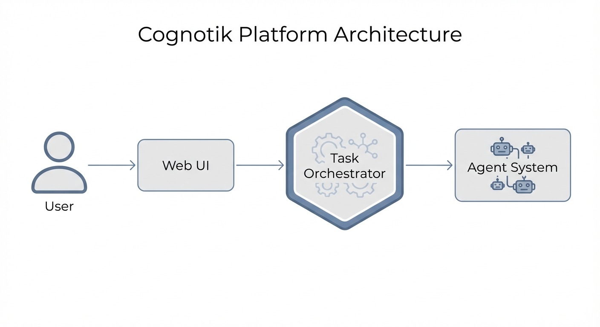

This document describes the high-level architecture of the Cognotik platform. 
 The system is designed to be modular and extensible, allowing for various task types.
+
+
 
 ## Core Components
 
 The platform consists of several key components: