## Page 1 of 3

### Depth 0 - Full Image
Analyzing region at depth 0 with bounds (0, 0, 1159, 1703)

### Depth 0 - Full Image
<details><summary>Raw JSON</summary>

```json
{
  "regions" : [ {
    "label" : "Patent Header",
    "description" : "Header information including the inventor's name, the title of the invention, the patent number, and the patent date.",
    "requires_zoom" : true,
    "x" : 115,
    "y" : 120,
    "width" : 625,
    "height" : 75
  }, {
    "label" : "Fig. 2: Straight Joint Cross-section",
    "description" : "Figure 2 of the patent drawing, showing a cross-sectional view of the submerged pipe joint in a straight configuration.",
    "requires_zoom" : true,
    "x" : 95,
    "y" : 195,
    "width" : 455,
    "height" : 245
  }, {
    "label" : "Fig. 1: Angled Joint Cross-section",
    "description" : "Figure 1 of the patent drawing, showing a cross-sectional view of the flexible pipe joint at an angle, illustrating its flexibility.",
    "requires_zoom" : true,
    "x" : 100,
    "y" : 480,
    "width" : 455,
    "height" : 385
  }, {
    "label" : "Fig. 3: Submerged Pipe Application",
    "description" : "Figure 3 of the patent drawing, showing a schematic of the pipe being laid on a submerged surface, demonstrating how the flexible joints allow it to follow the terrain.",
    "requires_zoom" : true,
    "x" : 540,
    "y" : 180,
    "width" : 255,
    "height" : 675
  }, {
    "label" : "Witnesses Signatures",
    "description" : "Signatures of the witnesses to the patent application.",
    "requires_zoom" : true,
    "x" : 100,
    "y" : 785,
    "width" : 155,
    "height" : 85
  }, {
    "label" : "Inventor and Attorney Signatures",
    "description" : "Signatures of the inventor, Max G. Schinke, and his attorney, H. G. Underwood.",
    "requires_zoom" : true,
    "x" : 585,
    "y" : 750,
    "width" : 205,
    "height" : 125
  } ],
  "summary" : "This image is a patent drawing for a 'SUBMERGED PIPE' invented by M. G. Schinke, patented on November 29, 1892 (No. 486,986). It features three figures: Fig. 1 and Fig. 2 show detailed cross-sections of a flexible joint mechanism, while Fig. 3 illustrates the practical application of these joints in laying a pipe along an uneven underwater surface. The drawing includes various labels (letters) referring to specific parts of the mechanism, and signatures of the inventor, attorney, and witnesses at the bottom."
}
```
</details>
                        
#### Sub-image for Patent Header at depth 1 
<a href="../page_0_0.png" target="_blank">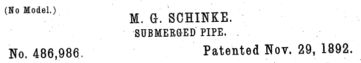</a>

### Depth 1 - Patent Header
Analyzing region at depth 1 with bounds (133, 204, 724, 127)

### Depth 1 - Patent Header
<details><summary>Raw JSON</summary>

```json
{
  "regions" : [ {
    "label" : "(No Model.)",
    "description" : "Text indicating that no physical model was submitted with the patent application.",
    "requires_zoom" : false,
    "x" : 11,
    "y" : 48,
    "width" : 154,
    "height" : 138
  }, {
    "label" : "M. G. SCHINKE.",
    "description" : "The name of the inventor, M. G. Schinke.",
    "requires_zoom" : false,
    "x" : 354,
    "y" : 101,
    "width" : 293,
    "height" : 138
  }, {
    "label" : "SUBMERGED PIPE.",
    "description" : "The title of the invention, 'Submerged Pipe'.",
    "requires_zoom" : false,
    "x" : 367,
    "y" : 255,
    "width" : 266,
    "height" : 112
  }, {
    "label" : "No. 486,986.",
    "description" : "The patent number assigned to this invention.",
    "requires_zoom" : false,
    "x" : 21,
    "y" : 713,
    "width" : 218,
    "height" : 213
  }, {
    "label" : "Patented Nov. 29, 1892.",
    "description" : "The date the patent was officially granted.",
    "requires_zoom" : false,
    "x" : 559,
    "y" : 718,
    "width" : 426,
    "height" : 186
  } ],
  "summary" : "This image is the header of a United States patent document. It identifies the inventor as M. G. Schinke, the invention as a 'Submerged Pipe', the patent number as 486,986, and the patent date as November 29, 1892. It also notes that no model was provided."
}
```
</details>
                        

### Leaf Analysis - (No Model.)
The image segment contains the text '(No Model.)' in a black, serif font against a white background. The text is enclosed in parentheses and includes a period after the word 'Model'. The characters appear slightly pixelated or distressed, suggesting it may be a scan from an older printed document, such as a patent application.


### Leaf Analysis - M. G. SCHINKE.
The image is a narrow horizontal segment containing black, bold, serif-style text on a white background. The text appears to be the word 'SCIENCE' in all capital letters, though it is heavily cropped, showing only the middle section of the characters. There are several small black specks or noise artifacts scattered across the white background above and around the letters.


### Leaf Analysis - SUBMERGED PIPE.
The image contains a horizontal line of black text on a white background. The text is in an uppercase, serif font that resembles a typewriter or old printing press style. The characters are "M. G. SCHINKE". There are periods after the 'M' and the 'G', and a space before the word 'SCHINKE'. The letters have a slightly grainy and irregular texture, typical of scanned historical documents or physical ink on paper.


### Leaf Analysis - No. 486,986.
The image contains the text "No. 486,986." printed in a black, serif font on a white background. The text consists of the abbreviation "No." followed by a space, then the number "486,986", which includes a comma as a thousands separator, and ends with a final period. The style of the typeface is reminiscent of older printed documents, such as those found in historical patents or legal records.


### Leaf Analysis - Patented Nov. 29, 1892.
The image contains a single line of black text on a white background. The text is in a serif font and reads: "Patented Nov. 29, 1892." The typography has a classic, slightly weathered appearance characteristic of late 19th-century printing. There are minor speckles and imperfections in the background and around the letters, suggesting it is a scan or photograph of an old document.

#### Sub-image for Fig. 2: Straight Joint Cross-section at depth 1 
<a href="../page_0_1.png" target="_blank">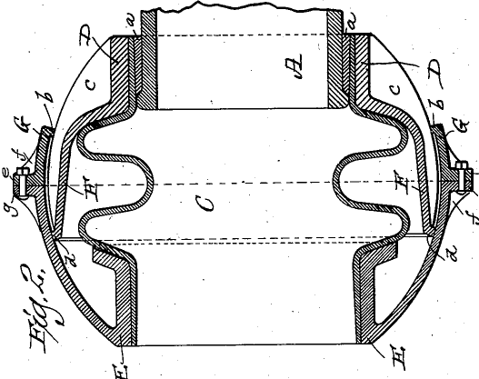</a>

### Depth 1 - Fig. 2: Straight Joint Cross-section
Analyzing region at depth 1 with bounds (110, 332, 527, 417)

### Depth 1 - Fig. 2: Straight Joint Cross-section
<details><summary>Raw JSON</summary>

```json
{
  "regions" : [ {
    "label" : "Fig. 2.",
    "description" : "The label 'Fig. 2.' indicating the figure number of the technical drawing.",
    "requires_zoom" : false,
    "x" : 40,
    "y" : 680,
    "width" : 100,
    "height" : 250
  }, {
    "label" : "A (Shaft/Pipe)",
    "description" : "Central shaft or pipe component labeled 'A', entering the top of the assembly.",
    "requires_zoom" : false,
    "x" : 300,
    "y" : 20,
    "width" : 400,
    "height" : 250
  }, {
    "label" : "C (Chamber)",
    "description" : "The internal chamber or main body of the joint, labeled 'C'.",
    "requires_zoom" : false,
    "x" : 350,
    "y" : 300,
    "width" : 300,
    "height" : 300
  }, {
    "label" : "D (Upper Housing)",
    "description" : "Upper housing or flange component labeled 'D', which surrounds the shaft 'A'.",
    "requires_zoom" : false,
    "x" : 220,
    "y" : 80,
    "width" : 100,
    "height" : 200
  }, {
    "label" : "E (Lower Housing)",
    "description" : "Lower housing or base component labeled 'E'.",
    "requires_zoom" : false,
    "x" : 200,
    "y" : 650,
    "width" : 100,
    "height" : 250
  }, {
    "label" : "F (Bellows/Diaphragm)",
    "description" : "Flexible, corrugated bellows or diaphragm element labeled 'F', allowing for movement while maintaining a seal.",
    "requires_zoom" : false,
    "x" : 150,
    "y" : 300,
    "width" : 150,
    "height" : 350
  }, {
    "label" : "G (Outer Casing)",
    "description" : "Outer casing or clamp labeled 'G' that holds the assembly together.",
    "requires_zoom" : false,
    "x" : 60,
    "y" : 330,
    "width" : 100,
    "height" : 300
  }, {
    "label" : "e, f, g (Fasteners)",
    "description" : "Fastening mechanism including a bolt 'e', flange 'f', and nut 'g' holding the outer casing halves together.",
    "requires_zoom" : true,
    "x" : 0,
    "y" : 420,
    "width" : 100,
    "height" : 100
  } ],
  "summary" : "This image is a cross-sectional technical drawing labeled 'Fig. 2', depicting a mechanical flexible joint or expansion seal. It consists of a central shaft (A) entering a chamber (C). A flexible bellows (F) provides a seal between the upper (D) and lower (E) housing components. The entire assembly is secured by an outer casing (G) held together with bolted flanges (e, f, g)."
}
```
</details>
                        

### Leaf Analysis - Fig. 2.
The image segment contains the text 'Fig. 2.' written in a vertical, cursive script. The text is oriented so that it reads from bottom to top. In the upper right corner, there is a small portion of a hatched or shaded area, consisting of parallel diagonal lines within a border. The entire image is in black and white, typical of a technical or patent drawing.


### Leaf Analysis - A (Shaft/Pipe)
This image segment is a black and white line drawing, likely part of a technical or scientific diagram. It features a central rectangular area bounded on the left and right by vertical bars filled with diagonal hatching, which often represents a solid material or a cross-section in technical drawings. Near the top of the central area, a horizontal dashed line spans the width between the two hatched bars. Above this dashed line, the top edge of the image is defined by a wavy, irregular line, possibly representing a liquid surface or an uneven boundary. On the right side of the central space, there is a stylized, script-like letter 'A' oriented vertically (rotated 90 degrees clockwise).


### Leaf Analysis - C (Chamber)
The image segment features a horizontal dashed line running across the middle. Below this line, towards the left, there is a thick, black, curved mark resembling a handwritten letter 'C' or a hook. The entire image is on a white background and is peppered with numerous small black dots or speckles, which appear to be digital noise or artifacts from a scan.


### Leaf Analysis - D (Upper Housing)
This image is a black and white technical drawing, specifically a cross-sectional view of a multi-layered structure. It features several vertical sections, each filled with a distinct diagonal hatching pattern to represent different materials or components. The leftmost section has diagonal lines sloping from the top-left to the bottom-right. Adjacent to it is a thinner vertical section with diagonal lines sloping in the opposite direction (top-right to bottom-left). To the right of that is another wider section with hatching similar to the first. A solid horizontal line defines the top boundary of these sections. There are also thin leader lines pointing towards the hatched areas, which are typically used in such diagrams to indicate labels or callouts that would be present in the full drawing.


### Leaf Analysis - E (Lower Housing)
This image segment is a black and white technical illustration or line drawing. It depicts a corner of a rectangular frame-like structure with rounded edges. The interior of the frame's body is filled with dense, parallel diagonal cross-hatching lines, a common convention in engineering drawings to represent a cross-section or a specific material. The drawing has a bold, high-contrast style with thick outer borders and finer internal lines, giving it a vintage or printed appearance. The frame is shown from an angled perspective, revealing its three-dimensional form.


### Leaf Analysis - F (Bellows/Diaphragm)
This image segment is a black and white technical illustration, likely from a patent or engineering diagram. It features a thick, undulating band that curves in an S-like shape. The band is filled with diagonal hatching lines, giving it a textured appearance. A horizontal dashed line passes through the center of the image, intersecting the curved band. To the left of the band's central curve, there is a stylized letter 'H' used as a label. The background is white with some minor black speckles or noise typical of scanned old documents.


### Leaf Analysis - G (Outer Casing)
This image is a black and white technical cross-section drawing of a mechanical component. It features two main parts, both indicated as solid material by diagonal cross-hatching. The part on the left has a central horizontal hub and a vertical, slightly curved flange. To its right is another thinner, slightly curved vertical component. A horizontal dashed centerline passes through the middle of the assembly, suggesting axial symmetry. Several thin, solid lines extend from the parts, likely serving as lead lines for dimensions or labels in a larger diagram. The overall structure is characteristic of a valve, seal, or diaphragm assembly.
Skipped recursion for e, f, g (Fasteners) (too small) at depth 2


### Leaf Analysis - e, f, g (Fasteners)
This image segment is a black and white technical cross-section diagram. It shows a vertical rectangular component, possibly a bolt or pin, passing through a material. The material is indicated by diagonal cross-hatching on either side of the central component. At the top of the vertical component is a wider, horizontal rectangular shape, which could represent a bolt head or a nut. To the left of the assembly, there is a lowercase letter 'v' with a leader line pointing towards the cross-hatched section. There are also some faint, indistinct markings above the main structure.

#### Sub-image for Fig. 1: Angled Joint Cross-section at depth 1 
<a href="../page_0_2.png" target="_blank">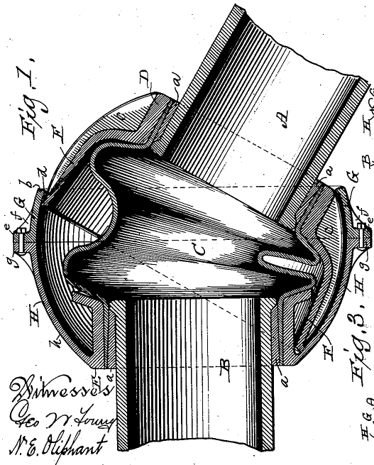</a>

### Depth 1 - Fig. 1: Angled Joint Cross-section
Analyzing region at depth 1 with bounds (115, 817, 527, 655)

### Depth 1 - Fig. 1: Angled Joint Cross-section
<details><summary>Raw JSON</summary>

```json
{
  "regions" : [ {
    "label" : "Fig 1",
    "description" : "Label for the first figure of the technical drawing.",
    "requires_zoom" : false,
    "x" : 35,
    "y" : 105,
    "width" : 120,
    "height" : 120
  }, {
    "label" : "Witnesses: Geo W. Young, N. E. Oliphant",
    "description" : "Signatures of the witnesses for the patent application, including 'Geo W. Young' and 'N. E. Oliphant'.",
    "requires_zoom" : true,
    "x" : 10,
    "y" : 795,
    "width" : 300,
    "height" : 200
  }, {
    "label" : "Main Joint Assembly",
    "description" : "The central mechanical assembly showing the internal structure of the joint, including pipes A and B, and flexible element C.",
    "requires_zoom" : true,
    "x" : 90,
    "y" : 10,
    "width" : 820,
    "height" : 980
  }, {
    "label" : "Right side labels (Fig 3, etc.)",
    "description" : "Labels and figure numbers on the right side of the drawing, including 'Fig 3' and various component letters.",
    "requires_zoom" : true,
    "x" : 915,
    "y" : 350,
    "width" : 80,
    "height" : 550
  } ],
  "summary" : "A technical cross-section drawing of a flexible pipe joint, likely from a patent. It depicts two pipes (A and B) connected by a flexible internal sleeve (C) within a spherical, multi-part housing (D, E, F, G, H). The drawing includes labels for various components and witness signatures in the bottom left corner."
}
```
</details>
                        

### Leaf Analysis - Fig 1
The image is a small, low-resolution segment showing handwritten black marks on a white background. The most prominent feature is a character that looks like a '7' with a horizontal crossbar or a stylized 'Z'. Above this character is a small, short horizontal dash. At the very bottom of the frame, the top part of another character is visible, consisting of two curved lines that suggest the upper portion of a letter like 'B' or a number like '8'. The strokes are somewhat jagged due to the low resolution.

#### Sub-image for Witnesses: Geo W. Young, N. E. Oliphant at depth 2 
<a href="../page_0_2_1.png" target="_blank">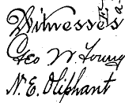</a>
Reached max depth at node Witnesses: Geo W. Young, N. E. Oliphant, performing leaf analysis.


### Leaf Analysis - Witnesses: Geo W. Young, N. E. Oliphant
The image shows a segment of a document with handwritten text in a formal, cursive script. The text is arranged in three lines:

1.  **Witnesses**: The word "Witnesses" is written at the top, featuring a highly decorative and ornate capital 'W'.
2.  **Geo W. Young**: The second line appears to be a signature or name, likely "Geo W. Young," where "Geo" is a common abbreviation for George. The capital 'G' is also quite stylized.
3.  **N. E. Oliphant**: The third line contains another name, "N. E. Oliphant," written in a clear, though still cursive, hand.

The handwriting style is characteristic of late 19th or early 20th-century official or legal documents. There are some faint, partially obscured markings in the upper right corner, possibly indicating a page or exhibit number.

#### Sub-image for Main Joint Assembly at depth 2 
<a href="../page_0_2_2.png" target="_blank">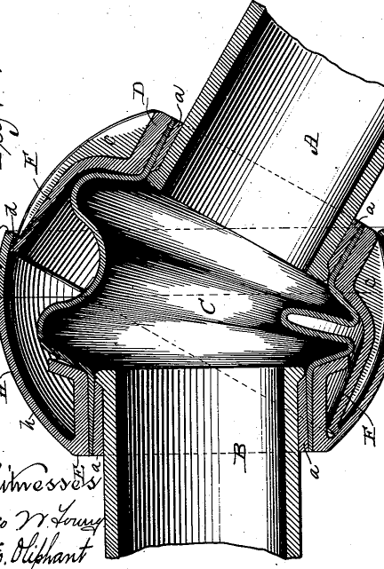</a>
Reached max depth at node Main Joint Assembly, performing leaf analysis.


### Leaf Analysis - Main Joint Assembly
This image is a detailed technical cross-section drawing, likely from a patent application, illustrating a flexible mechanical joint or coupling. The drawing uses black and white line art with extensive cross-hatching and shading to represent different materials and three-dimensional forms.

Key components are labeled with letters:
- **'A'** identifies a pipe or shaft entering the joint from the top right at an angle.
- **'B'** identifies a vertical pipe or shaft at the bottom of the assembly.
- **'C'** is a flexible, bellows-like component that connects pipes A and B, allowing for angular movement while maintaining a seal. It has a complex, convoluted shape.
- **'D'** and **'E'** appear to be parts of a spherical outer housing or casing that encloses the flexible joint.
- **'F'** indicates an internal component within the housing, possibly a bearing or a secondary seal.
- Small lowercase **'a'** labels point to various interfaces, likely representing gaskets, washers, or thin sealing layers between the larger components.
- The label **'b'** points to the outer surface of the spherical housing.

The drawing shows the joint in a flexed position, with pipe A tilted relative to pipe B. The flexible member 'C' is compressed on one side and extended on the other to accommodate this angle. In the bottom left corner, there is cursive text under the heading 'Witnesses', including the names 'Geo. W. Young' and 'H. Oliphant', which is typical for historical patent documents.
Skipped recursion for Right side labels (Fig 3, etc.) (too small) at depth 2


### Leaf Analysis - Right side labels (Fig 3, etc.)
This image segment is a black and white technical illustration, likely from a patent or engineering document, shown in a vertical orientation. It depicts a cross-sectional view of a mechanical assembly. Two main components, indicated by diagonal cross-hatching, are joined together by a central bolt or fastener. The assembly has a flared, somewhat conical shape. Several handwritten labels are present: 'Fig. 3' is clearly visible at the bottom, and individual parts or features are marked with letters such as 'G', 'H', 'e', and 'f'. The cross-hatching is a standard convention in technical drawing to represent solid material in a section view.

#### Sub-image for Fig. 3: Submerged Pipe Application at depth 1 
<a href="../page_0_3.png" target="_blank">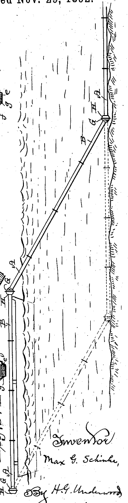</a>

### Depth 1 - Fig. 3: Submerged Pipe Application
Analyzing region at depth 1 with bounds (625, 306, 295, 1149)

### Depth 1 - Fig. 3: Submerged Pipe Application
<details><summary>Raw JSON</summary>

```json
{
  "regions" : [ {
    "label" : "ed Nov. 29, 1892.",
    "description" : "Partial date text from the top of the patent document, indicating the year 1892.",
    "requires_zoom" : false,
    "x" : 0,
    "y" : 0,
    "width" : 750,
    "height" : 40
  }, {
    "label" : "Right bank pipe assembly",
    "description" : "The upper right portion of the diagram showing a pipe (labeled A) on a ground surface, connected via a joint (labeled G, H) to another pipe section (labeled B) that enters the water.",
    "requires_zoom" : true,
    "x" : 780,
    "y" : 10,
    "width" : 220,
    "height" : 450
  }, {
    "label" : "Submerged pipe section",
    "description" : "The central part of the drawing showing the main pipe section (B) crossing through a body of water. Solid lines show its current position, while dashed lines indicate an alternative or lowered position.",
    "requires_zoom" : true,
    "x" : 150,
    "y" : 100,
    "width" : 700,
    "height" : 800
  }, {
    "label" : "Left side pipe assembly",
    "description" : "The lower left portion of the diagram showing the pipe assembly on the opposite side, with horizontal pipe A connected to pipe B. It includes detailed labels like e, f, g for specific components.",
    "requires_zoom" : true,
    "x" : 0,
    "y" : 550,
    "width" : 200,
    "height" : 450
  }, {
    "label" : "Inventor and Attorney signatures",
    "description" : "Handwritten signatures at the bottom right of the document, identifying the inventor and their attorney.",
    "requires_zoom" : true,
    "x" : 420,
    "y" : 820,
    "width" : 580,
    "height" : 180
  } ],
  "summary" : "This image is a segment of a technical patent drawing from 1892, likely for a flexible or movable underwater pipe system. It shows a jointed conduit crossing a body of water, with solid lines representing one state and dashed lines representing another (possibly lowered to the bed). Key components are labeled with letters (A, B, G, H, e, f, g), and the document is signed by inventor Max G. Schinke and attorney H.G. Underwood."
}
```
</details>
                        

### Leaf Analysis - ed Nov. 29, 1892.
The image is a small, black-and-white segment of a printed document. It contains the text 'ed Nov. 29, 1882.' in a serif typeface. The letters 'ed' at the beginning are partially cut off at the top. The background is white with some minor black speckling or noise, characteristic of an old scanned document. The text likely represents the conclusion of a word followed by a specific date.

#### Sub-image for Right bank pipe assembly at depth 2 
<a href="../page_0_3_1.png" target="_blank">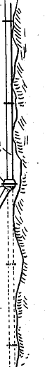</a>
Reached max depth at node Right bank pipe assembly, performing leaf analysis.


### Leaf Analysis - Right bank pipe assembly
This image segment is a black and white technical line drawing. It depicts a vertical rod or pipe positioned adjacent to a textured, uneven surface, which could represent a rock face or the side of a borehole. The rod is shown with solid lines in its upper portion and features several small horizontal markings. Near the bottom of the solid section, there is a flared collar or joint. Below this point, the rod's path is indicated by dashed lines, suggesting it continues underground or is a projected extension. The surface to the right is rendered with a wavy outline and short, diagonal hatch marks to indicate texture and depth.

#### Sub-image for Submerged pipe section at depth 2 
<a href="../page_0_3_2.png" target="_blank">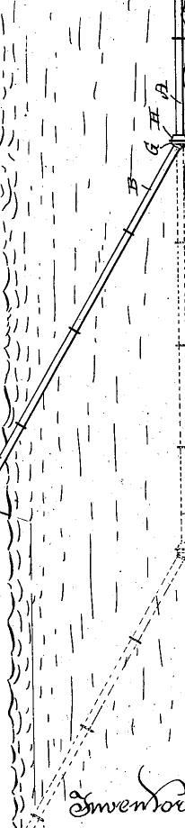</a>
Reached max depth at node Submerged pipe section, performing leaf analysis.


### Leaf Analysis - Submerged pipe section
This image segment is a portion of a technical or patent drawing, rendered in black and white line art. It depicts a mechanical apparatus, likely related to marine or hydraulic engineering, given the background texture of short, dashed lines commonly used to represent water. 

A prominent feature is a long, segmented rod or pipe labeled 'B', which extends diagonally across the frame. It is connected at its upper end to another horizontal rod labeled 'A' via a joint or coupling marked with the letters 'G' and 'H'. Below the solid line of rod 'B', a dashed-line version of the same structure is shown, indicating a range of motion or an alternative position. 

The left side of the image features a series of scalloped, wavy lines that likely represent a shoreline or the surface of a body of water. In the bottom right corner, stylized cursive text is partially visible, spelling out the word 'Inventor', which is typical for patent illustrations. The overall style is precise and functional, intended to illustrate the design and movement of a mechanical device.

#### Sub-image for Left side pipe assembly at depth 2 
<a href="../page_0_3_3.png" target="_blank">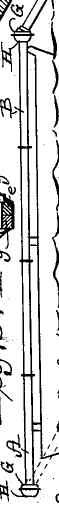</a>
Reached max depth at node Left side pipe assembly, performing leaf analysis.


### Leaf Analysis - Left side pipe assembly
This image segment is a vertical crop from a technical or patent drawing, rendered in black and white line art. It features a long, horizontal rod or pipe labeled with the letter 'B'. This rod has several small vertical marks along its length and is terminated at both ends by rounded, bulbous fittings labeled 'H' and 'G'. Below rod 'B', another parallel rod labeled 'A' is partially visible. To the left of the main rod, there is a small, cross-hatched rectangular component labeled with the letters 'e' and 'g'. A wavy line runs along the bottom of the frame, which might represent a water surface or uneven ground. The overall style is characteristic of early 20th-century mechanical diagrams.

#### Sub-image for Inventor and Attorney signatures at depth 2 
<a href="../page_0_3_4.png" target="_blank">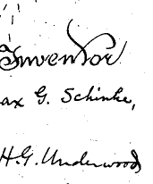</a>
Reached max depth at node Inventor and Attorney signatures, performing leaf analysis.


### Leaf Analysis - Inventor and Attorney signatures
The image segment contains handwritten text in black ink on a white, slightly grainy background. The text is arranged in three lines:

1.  **Top line:** The word "Inventor" written in an ornate, decorative cursive script. The capital 'I' is particularly flourished.
2.  **Middle line:** The name "Max G. Schinke," written in a clear, legible cursive hand. There is a comma following the name.
3.  **Bottom line:** The name "H. G. Underwood" written in a similar cursive style. 

The overall appearance is characteristic of the signature or attribution section of a late 19th or early 20th-century patent application or legal document. The background shows some minor speckling and noise, typical of a scanned historical document.

#### Sub-image for Witnesses Signatures at depth 1 
<a href="../page_0_4.png" target="_blank">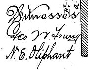</a>

### Depth 1 - Witnesses Signatures
Analyzing region at depth 1 with bounds (115, 1336, 179, 144)

### Depth 1 - Witnesses Signatures
<details><summary>Raw JSON</summary>

```json
{
  "regions" : [ {
    "label" : "Witnesses",
    "description" : "The word 'Witnesses' written in a decorative cursive script.",
    "requires_zoom" : false,
    "x" : 70,
    "y" : 60,
    "width" : 850,
    "height" : 280
  }, {
    "label" : "Geo W. Young",
    "description" : "The handwritten name 'Geo W. Young'. 'Geo' is a common abbreviation for George.",
    "requires_zoom" : false,
    "x" : 70,
    "y" : 330,
    "width" : 850,
    "height" : 280
  }, {
    "label" : "N. E. Oliphant",
    "description" : "The handwritten name 'N. E. Oliphant'.",
    "requires_zoom" : false,
    "x" : 70,
    "y" : 600,
    "width" : 850,
    "height" : 350
  }, {
    "label" : "Annotations",
    "description" : "Small, possibly reference characters or annotations near the top right corner.",
    "requires_zoom" : true,
    "x" : 720,
    "y" : 0,
    "width" : 200,
    "height" : 180
  } ],
  "summary" : "The image segment displays a section of a document, likely a patent or legal record, listing witnesses. It contains the heading 'Witnesses' followed by the names 'Geo W. Young' and 'N. E. Oliphant' in cursive handwriting. There are also some small, less distinct characters in the upper right corner."
}
```
</details>
                        

### Leaf Analysis - Witnesses
The image shows the word 'Witnesses' written in a highly decorative, calligraphic script. The style is characteristic of 19th-century formal documents, such as legal papers or patents. The initial 'W' is particularly ornate, featuring large loops and elegant flourishes. The subsequent letters are written in a smaller, flowing cursive. The ink is black against a plain white background, and the varying thickness of the lines suggests the use of a traditional pen. There are some small, faint markings or superscript characters above the latter part of the word, which may be part of the decorative style or a specific notation.


### Leaf Analysis - Geo W. Young
The image shows a black and white, low-resolution scan of a handwritten signature. The signature appears to read 'Geo W. Young'. The writing is in a formal, cursive script typical of the late 19th or early 20th century. 'Geo' is a common abbreviation for George, featuring a large, flourishing initial 'G'. This is followed by a middle initial 'W.' and the surname 'Young', which starts with a large, stylized 'Y' and ends with a 'g' that has a long, looping descender. The image has some digital noise and pixelation, consistent with a scanned document.


### Leaf Analysis - N. E. Oliphant
The image contains a handwritten name in black ink on a white background. The text reads "N. E. Oliphant". The handwriting is in a cursive, elegant style, likely from a historical document. The initials 'N.' and 'E.' are clearly followed by periods. The surname 'Oliphant' is written with a capital 'O', and features a prominent descender on the 'p' and a tall ascender on the 'h'. There is a small, upward-slanted mark at the end of the name, which could be a stylistic flourish or an apostrophe. The background is white with some minor digital noise or paper texture visible.
Skipped recursion for Annotations (too small) at depth 2


### Leaf Analysis - Annotations
The image is a small, low-resolution, black and white segment containing what appears to be handwritten or poorly printed text. On the left, there is a character that resembles a capital 'N' or possibly an 'H'. To its right is a lowercase letter 'a' or a Greek letter alpha 'α'. A horizontal line runs across the top of these characters. The image is highly pixelated and contains significant visual noise, suggesting it is a zoomed-in portion of a larger document or scan.

#### Sub-image for Inventor and Attorney Signatures at depth 1 
<a href="../page_0_5.png" target="_blank">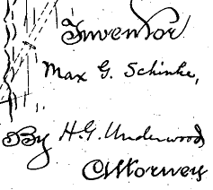</a>

### Depth 1 - Inventor and Attorney Signatures
Analyzing region at depth 1 with bounds (678, 1277, 237, 212)

### Depth 1 - Inventor and Attorney Signatures
<details><summary>Raw JSON</summary>

```json
{
  "regions" : [ {
    "label" : "Inventor",
    "description" : "Handwritten word 'Inventor' indicating the role of the person named below.",
    "requires_zoom" : false,
    "x" : 280,
    "y" : 0,
    "width" : 650,
    "height" : 250
  }, {
    "label" : "Max G. Schinke,",
    "description" : "Handwritten name of the inventor, 'Max G. Schinke,'.",
    "requires_zoom" : false,
    "x" : 200,
    "y" : 300,
    "width" : 750,
    "height" : 150
  }, {
    "label" : "By H.G. Underwood",
    "description" : "Handwritten phrase 'By H.G. Underwood', likely the name of the attorney or legal representative.",
    "requires_zoom" : false,
    "x" : 0,
    "y" : 630,
    "width" : 980,
    "height" : 250
  }, {
    "label" : "Attorney",
    "description" : "Handwritten word 'Attorney' identifying the role of H.G. Underwood.",
    "requires_zoom" : false,
    "x" : 380,
    "y" : 820,
    "width" : 600,
    "height" : 180
  }, {
    "label" : "Drawing elements",
    "description" : "Portion of a technical drawing, showing dashed and solid lines, typical of a patent illustration.",
    "requires_zoom" : false,
    "x" : 0,
    "y" : 0,
    "width" : 200,
    "height" : 600
  } ],
  "summary" : "This image segment contains handwritten text from a technical document, most likely a patent application. It identifies 'Max G. Schinke' as the inventor and 'H.G. Underwood' as the attorney. The text is written in a cursive script. To the left, there are fragments of a technical drawing with dashed and solid lines."
}
```
</details>
                        

### Leaf Analysis - Inventor
The image contains a single word, "Inventor", written in a highly decorative, calligraphic cursive script. The style is characteristic of historical handwriting, featuring an ornate capital 'I' with multiple loops and flourishes. The lowercase letters 'n', 'v', 'e', and 'n' are fluidly connected. The letter 't' has a prominent, sweeping ascender that curves back over the following letters 'o' and 'r'. The text is in black ink on a white background, with some minor black speckling or noise typical of a scan from an older document.


### Leaf Analysis - Max G. Schinke,
The image contains a handwritten name in black ink on a white background. The text reads 'Max G. Schinke,'. The handwriting is in a cursive style, with a prominent, slightly flourished capital 'M' in 'Max', a capital 'G' followed by a period, and a capital 'S' in 'Schinke'. The name is followed by a comma. The ink appears slightly uneven, characteristic of a pen on paper.


### Leaf Analysis - By H.G. Underwood
The image shows a snippet of handwritten text in black ink on a white background. The text clearly reads "By H.G. Underwood". The handwriting is in a cursive style, with a decorative, looped capital 'B' in the word "By". The initials "H.G." are followed by periods. Below this line, the tops of letters from a subsequent line are visible, which appear to be "D.D." followed by other partially obscured characters. The overall appearance is that of a signature or an author credit from an older document, with some minor scanning noise or speckles visible in the background.


### Leaf Analysis - Attorney
The image contains the word "Attorneys" written in a decorative, cursive script. The handwriting is elegant and calligraphic, featuring a large, stylized capital 'A' with a prominent loop. The subsequent letters are connected in a fluid, flowing manner. The text is black on a white background, and there are several small black dots or speckles scattered around the word, which may be artifacts from scanning or a textured paper surface.


### Leaf Analysis - Drawing elements
This image segment is a black and white line drawing, appearing to be a detail from a larger technical or architectural sketch. On the left, there are several vertical, wavy lines that suggest a textured surface or a specific material boundary. To the right of these, there are straighter vertical lines. A diagonal dashed line or a series of short strokes extends from the middle-left towards the upper right. Along this diagonal, there is some small, partially illegible text or numbers, possibly '4000', oriented parallel to the line. The drawing is composed of simple, rough strokes, giving it a hand-drawn or preliminary sketch quality.

## Page 2 of 3

### Depth 0 - Full Image
Analyzing region at depth 0 with bounds (0, 0, 1159, 1703)

### Depth 0 - Full Image
<details><summary>Raw JSON</summary>

```json
{
  "regions" : [ {
    "label" : "UNITED STATES PATENT OFFICE.",
    "description" : "The main header of the document identifying it as a United States Patent Office record.",
    "requires_zoom" : true,
    "x" : 132,
    "y" : 142,
    "width" : 665,
    "height" : 45
  }, {
    "label" : "MAX G. SCHINKE, OF MILWAUKEE, WISCONSIN. SUBMERGED PIPE.",
    "description" : "The name of the inventor, their location, and the title of the invention.",
    "requires_zoom" : true,
    "x" : 252,
    "y" : 211,
    "width" : 495,
    "height" : 55
  }, {
    "label" : "SPECIFICATION forming part of Letters Patent No. 486,986, dated November 29, 1892.",
    "description" : "Official patent details including the patent number, date of issue, and application filing information.",
    "requires_zoom" : true,
    "x" : 135,
    "y" : 276,
    "width" : 660,
    "height" : 42
  }, {
    "label" : "Left Column Text",
    "description" : "The first column of the detailed specification text, describing the invention and its purpose.",
    "requires_zoom" : true,
    "x" : 60,
    "y" : 320,
    "width" : 390,
    "height" : 600
  }, {
    "label" : "Right Column Text",
    "description" : "The second column of the detailed specification text, continuing the description of the invention's components and operation.",
    "requires_zoom" : true,
    "x" : 460,
    "y" : 320,
    "width" : 390,
    "height" : 600
  } ],
  "summary" : "This image is the first page of a United States Patent for a 'SUBMERGED PIPE' invented by Max G. Schinke of Milwaukee, Wisconsin. The patent is numbered 486,986 and is dated November 29, 1892. The document contains a formal header, inventor information, patent filing details, and a two-column text specification describing the invention's design for flexible, water-tight joints in submerged pipe systems."
}
```
</details>
                        
#### Sub-image for UNITED STATES PATENT OFFICE. at depth 1 
<a href="../page_1_0.png" target="_blank">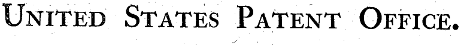</a>

### Depth 1 - UNITED STATES PATENT OFFICE.
Analyzing region at depth 1 with bounds (152, 241, 770, 76)

### Depth 1 - UNITED STATES PATENT OFFICE.
<details><summary>Raw JSON</summary>

```json
{
  "regions" : [ {
    "label" : "UNITED",
    "description" : "The word 'UNITED' in a serif, all-caps font.",
    "requires_zoom" : false,
    "x" : 0,
    "y" : 0,
    "width" : 250,
    "height" : 1000
  }, {
    "label" : "STATES",
    "description" : "The word 'STATES' in a serif, all-caps font.",
    "requires_zoom" : false,
    "x" : 250,
    "y" : 0,
    "width" : 250,
    "height" : 1000
  }, {
    "label" : "PATENT",
    "description" : "The word 'PATENT' in a serif, all-caps font.",
    "requires_zoom" : false,
    "x" : 500,
    "y" : 0,
    "width" : 250,
    "height" : 1000
  }, {
    "label" : "OFFICE.",
    "description" : "The word 'OFFICE.' in a serif, all-caps font, followed by a period.",
    "requires_zoom" : false,
    "x" : 750,
    "y" : 0,
    "width" : 250,
    "height" : 1000
  } ],
  "summary" : "The image displays the text 'UNITED STATES PATENT OFFICE.' in a formal, capitalized serif typeface. The text is black on a slightly speckled white background, typical of a scanned historical document header. The text is already in English."
}
```
</details>
                        

### Leaf Analysis - UNITED
The image shows the word 'UNITED' in a black, serif typeface against a white background. The first letter 'U' is larger than the subsequent letters 'NITED', which appear to be in a small-caps style. The overall appearance is somewhat distressed or aged, with visible grain, small black specks, and uneven ink distribution within the letters, suggesting a vintage print or a scanned document.


### Leaf Analysis - STATES
The image contains the word 'STATES' in all capital letters. The font is a bold, serif typeface with a classic, perhaps slightly aged appearance. The letters are black against a white background. There is a significant amount of visual noise, consisting of small black dots or specks scattered throughout the image, both on the letters themselves and in the surrounding white space. This texture suggests the image might be a scan of a physical document or a print with some wear. The edges of the letters are not perfectly smooth, further contributing to a printed or scanned aesthetic.


### Leaf Analysis - PATENT
The image contains the word "PATENT" in a black, serif, all-caps font against a white background. The first letter, 'P', is significantly larger than the following letters ('ATENT'), which are in a smaller capital style. The image has a grainy texture with numerous small black specks and artifacts scattered throughout, giving it the appearance of a scan from an older, printed document.


### Leaf Analysis - OFFICE.
The image contains the word "OFFICE." in a bold, serif, all-caps typeface. The first letter 'O' is slightly larger than the subsequent letters 'FFICE'. The text is followed by a period. The letters have a slightly textured or grainy appearance, characteristic of older printing or a scanned document. There are several small, dark specks or noise artifacts scattered across the light-colored background around the text.

#### Sub-image for MAX G. SCHINKE, OF MILWAUKEE, WISCONSIN. SUBMERGED PIPE. at depth 1 
<a href="../page_1_1.png" target="_blank">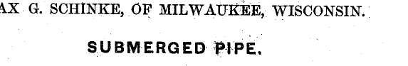</a>

### Depth 1 - MAX G. SCHINKE, OF MILWAUKEE, WISCONSIN. SUBMERGED PIPE.
Analyzing region at depth 1 with bounds (292, 359, 573, 93)

### Depth 1 - MAX G. SCHINKE, OF MILWAUKEE, WISCONSIN. SUBMERGED PIPE.
<details><summary>Raw JSON</summary>

```json
{
  "regions" : [ {
    "label" : "AX G. SCHINKE, OF MILWAUKEE, WISCONSIN.",
    "description" : "The first line of text, identifying an individual and their location. The first letter is partially cut off.",
    "requires_zoom" : false,
    "x" : 0,
    "y" : 0,
    "width" : 950,
    "height" : 400
  }, {
    "label" : "SUBMERGED PIPE.",
    "description" : "The second line of text, which serves as a title or subject heading, printed in a larger, bold font.",
    "requires_zoom" : false,
    "x" : 205,
    "y" : 600,
    "width" : 450,
    "height" : 350
  } ],
  "summary" : "The image segment contains two lines of printed English text. The first line identifies 'AX G. SCHINKE, OF MILWAUKEE, WISCONSIN.' (likely 'MAX G. SCHINKE' with the first letter cut off). The second line is a bold title: 'SUBMERGED PIPE.' This format is characteristic of a patent application header."
}
```
</details>
                        

### Leaf Analysis - AX G. SCHINKE, OF MILWAUKEE, WISCONSIN.
The image contains a single line of printed text in a black, all-caps, serif font against a white background that shows some minor scanning noise or speckling. The text reads: "AX G. SCHINKE, OF MILWAUKEE, WISCONSIN." The first word, "AX", is partially cut off on the left side, suggesting it is the end of a name like "MAX". The line appears to be from a formal document, such as a patent or legal record, identifying a person and their location.


### Leaf Analysis - SUBMERGED PIPE.
The image contains the text 'SUBMERGED PIPE.' in a bold, black, sans-serif font against a white background. The text is in all capital letters and ends with a period. There is some visible noise or speckling around the letters, giving it a slightly weathered or scanned appearance.

#### Sub-image for SPECIFICATION forming part of Letters Patent No. 486,986, dated November 29, 1892. at depth 1 
<a href="../page_1_2.png" target="_blank">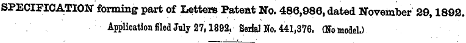</a>

### Depth 1 - SPECIFICATION forming part of Letters Patent No. 486,986, dated November 29, 1892.
Analyzing region at depth 1 with bounds (156, 470, 764, 71)

### Depth 1 - SPECIFICATION forming part of Letters Patent No. 486,986, dated November 29, 1892.
<details><summary>Raw JSON</summary>

```json
{
  "regions" : [ {
    "label" : "SPECIFICATION forming part of Letters Patent No. 486,986, dated November 29, 1892.",
    "description" : "The first line of the patent specification header, containing the patent number and date.",
    "requires_zoom" : false,
    "x" : 0,
    "y" : 50,
    "width" : 1000,
    "height" : 450
  }, {
    "label" : "Application filed July 27, 1892. Serial No. 441,376. (No model.)",
    "description" : "The second line of the patent specification header, containing application details.",
    "requires_zoom" : false,
    "x" : 0,
    "y" : 500,
    "width" : 1000,
    "height" : 450
  } ],
  "summary" : "The image is a header from a United States patent document. It specifies that this is a 'SPECIFICATION forming part of Letters Patent No. 486,986', which was dated November 29, 1892. It also notes that the application was filed on July 27, 1892, with Serial No. 441,376, and that no model was provided."
}
```
</details>
                        

### Leaf Analysis - SPECIFICATION forming part of Letters Patent No. 486,986, dated November 29, 1892.
The image contains a single line of printed text from a historical document, likely a United States patent. The text reads: 'SPECIFICATION forming part of Letters Patent No. 486,986, dated November 29, 1892.' The word 'SPECIFICATION' is in all capital letters and appears in a slightly bolder, larger serif font than the rest of the sentence. The entire line is in a black, serif typeface against a white background that shows some minor speckling and noise, typical of a scanned vintage document. The text is horizontally oriented and centered within the frame.


### Leaf Analysis - Application filed July 27, 1892. Serial No. 441,376. (No model.)
The image contains a single line of printed text in a bold, serif font, characteristic of late 19th-century official documents. The text reads: 'Application filed July 27, 1892. Serial No. 441,376. (No model.)'. The background is off-white with some visible grain and minor dark spots, indicating it is a scan of an aged paper document. This line likely comes from a United States patent specification header.

#### Sub-image for Left Column Text at depth 1 
<a href="../page_1_3.png" target="_blank">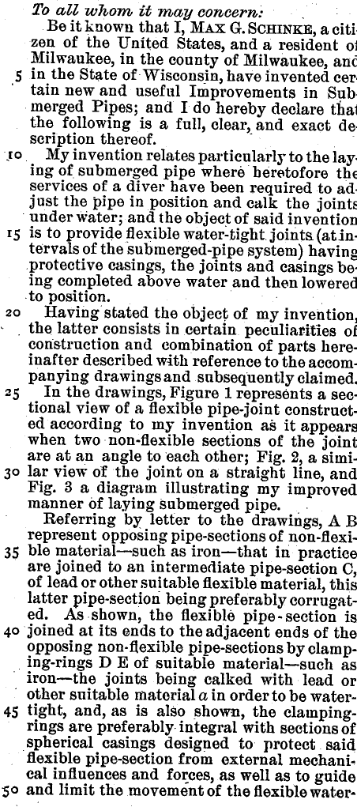</a>

### Depth 1 - Left Column Text
Analyzing region at depth 1 with bounds (69, 544, 452, 1021)

### Depth 1 - Left Column Text
<details><summary>Raw JSON</summary>

```json
{
  "regions" : [ {
    "label" : "Introductory Statement (Lines 1-9)",
    "description" : "Introductory statement of the patent, identifying the inventor Max G. Schinke and the subject of the invention: 'Improvements in Submerged Pipes'.",
    "requires_zoom" : false,
    "x" : 0,
    "y" : 0,
    "width" : 1000,
    "height" : 180
  }, {
    "label" : "Object of Invention (Lines 10-19)",
    "description" : "Description of the problem being solved (need for divers to work underwater) and the primary object of the invention: providing flexible, water-tight joints with protective casings that can be assembled above water.",
    "requires_zoom" : false,
    "x" : 0,
    "y" : 180,
    "width" : 1000,
    "height" : 190
  }, {
    "label" : "General Description (Lines 20-24)",
    "description" : "A general statement transitioning to the detailed description and referencing the accompanying drawings.",
    "requires_zoom" : false,
    "x" : 0,
    "y" : 370,
    "width" : 1000,
    "height" : 80
  }, {
    "label" : "Brief Description of Drawings (Lines 25-32)",
    "description" : "Brief description of what each figure in the patent drawings represents (Figures 1, 2, and 3).",
    "requires_zoom" : false,
    "x" : 0,
    "y" : 450,
    "width" : 1000,
    "height" : 180
  }, {
    "label" : "Detailed Description (Lines 33-50)",
    "description" : "Detailed technical description of the pipe joint components, including non-flexible sections (A, B), an intermediate flexible section (C), and clamping rings (D, E) with protective spherical casings.",
    "requires_zoom" : false,
    "x" : 0,
    "y" : 630,
    "width" : 1000,
    "height" : 370
  } ],
  "summary" : "This image contains a portion of a patent specification for 'Improvements in Submerged Pipes' by Max G. Schinke. The text describes a flexible, water-tight pipe joint designed to be assembled above water and then lowered into position, thereby avoiding the need for underwater work by divers. It details the construction using non-flexible pipe sections joined by a flexible intermediate section, secured with clamping rings and protected by spherical casings."
}
```
</details>
                        

### Leaf Analysis - Introductory Statement (Lines 1-9)
The image is a black-and-white scan of a text segment from what appears to be a formal legal or patent document. The text is printed in a classic serif typeface. 

The content of the text is as follows:
"To all whom it may concern:
Be it known that I, MAX G. SCHINKE, a citizen of the United States, and a resident of Milwaukee, in the county of Milwaukee, and in the State of Wisconsin, have invented certain new and useful Improvements in Submerged Pipes; and I do hereby declare that the following is a full, clear, and exact description thereof."

Key visual features include:
- The opening phrase "To all whom it may concern:" is in italics.
- The name "MAX G. SCHINKE" is written in small capital letters.
- A line number "5" is visible on the left margin, indicating this is part of a larger numbered text.
- The text is justified, and some words are hyphenated at the end of lines (e.g., "citi-", "cer-", "Sub-", "de-").
- The background is a light grey with some visible grain and speckles, characteristic of an old scanned document.


### Leaf Analysis - Object of Invention (Lines 10-19)
This image segment contains a block of printed text, likely from a historical patent document. The text is set in a classic serif typeface and is justified. On the left margin, there are line numbers '10' and '15'. 

The full text in the segment reads:
"10 My invention relates particularly to the lay-
ing of submerged pipe where heretofore the
services of a diver have been required to ad-
just the pipe in position and calk the joints
under water; and the object of said invention
15 is to provide flexible water-tight joints (at in-
tervals of the submerged-pipe system) having
protective casings, the joints and casings be-
ing completed above water and then lowered
to position."

The content describes an invention designed to improve the process of laying underwater pipes by creating flexible, water-tight joints that can be assembled above water, thereby eliminating the need for a diver to adjust and seal them underwater. The image has a grainy texture with some speckling, characteristic of a scanned old document.


### Leaf Analysis - General Description (Lines 20-24)
This image segment contains a portion of a printed document, likely a legal or technical text such as a patent application. The text is in a serif font and appears somewhat aged, with visible grain and minor speckling. 

The visible text reads:
"to position."
"20 Having stated the object of my invention,"
"the latter consists in certain peculiarities of"
"construction and combination of parts here-"
"inafter described with reference to the accom-"

The number "20" is positioned in the left margin, indicating line numbering common in legal or patent documents. The text is left-aligned and the snippet ends mid-sentence and mid-word ("here-inafter", "accom-").


### Leaf Analysis - Brief Description of Drawings (Lines 25-32)
This image segment contains a portion of a printed technical document, likely a patent specification, given the formal language and the presence of line numbers (25 and 30) in the left margin. The text is printed in a classic serif typeface and describes the figures included in the document's drawings.

The transcribed text is as follows:
"matter described with reference to the accom-
panying drawings and subsequently claimed.
25 In the drawings, Figure 1 represents a sec-
tional view of a flexible pipe-joint construct-
ed according to my invention as it appears
when two non-flexible sections of the joint
are at an angle to each other; Fig. 2, a simi-
30 lar view of the joint on a straight line, and
Fig. 3 a diagram illustrating my improved
manner of laying submerged pipe."

The content specifically outlines that Figure 1 shows a sectional view of a flexible pipe-joint at an angle, Figure 2 shows the same joint in a straight line, and Figure 3 illustrates a method for laying submerged pipe. The print shows some signs of age, such as slight ink bleed and minor speckling on the background.


### Leaf Analysis - Detailed Description (Lines 33-50)
The image is a segment of a printed document, likely a patent specification, containing a block of text with line numbers on the left margin. The text describes a mechanical assembly involving pipe sections. 

Specifically, the text reads:
'Referring by letter to the drawings, A B represent opposing pipe-sections of non-flexible material—such as iron—that in practice are joined to an intermediate pipe-section C, of lead or other suitable flexible material, this latter pipe-section being preferably corrugated. As shown, the flexible pipe-section is joined at its ends to the adjacent ends of the opposing non-flexible pipe-sections by clamping-rings D E of suitable material—such as iron—the joints being calked with lead or other suitable material a in order to be watertight, and, as is also shown, the clamping-rings are preferably integral with sections of spherical casings designed to protect said flexible pipe-section from external mechanical influences and forces, as well as to guide and limit the movement of the flexible water-'

The line numbers 35, 40, 45, and 50 are visible on the left, indicating the position of the text within a larger document. The font is a classic serif style, and the print quality shows some age-related characteristics like slight ink bleed and unevenness.

#### Sub-image for Right Column Text at depth 1 
<a href="../page_1_4.png" target="_blank">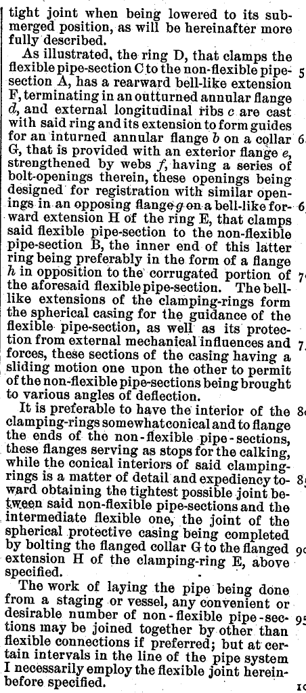</a>

### Depth 1 - Right Column Text
Analyzing region at depth 1 with bounds (533, 544, 452, 1021)

### Depth 1 - Right Column Text
<details><summary>Raw JSON</summary>

```json
{
  "regions" : [ {
    "label" : "tight joint when being lowered to its submerged position, as will be hereinafter more fully described.",
    "description" : "The first partial paragraph of the text, concluding a previous thought about a tight joint in a submerged position.",
    "requires_zoom" : false,
    "x" : 0,
    "y" : 0,
    "width" : 1000,
    "height" : 65
  }, {
    "label" : "As illustrated, the ring D, that clamps the flexible pipe-section C to the non-flexible pipe-section A, has a rearward bell-like extension F, terminating in an outturned annular flange d, and external longitudinal ribs c are cast with said ring and its extension to form guides for an inturned annular flange b on a collar G, that is provided with an exterior flange e, strengthened by webs f, having a series of bolt-openings therein, these openings being designed for registration with similar openings in an opposing flange g on a bell-like forward extension H of the ring E, that clamps said flexible pipe-section to the non-flexible pipe-section B, the inner end of this latter ring being preferably in the form of a flange h in opposition to the corrugated portion of the aforesaid flexible pipe-section. The bell-like extensions of the clamping-rings form the spherical casing for the guidance of the flexible pipe-section, as well as its protection from external mechanical influences and forces, these sections of the casing having a sliding motion one upon the other to permit of the non-flexible pipe-sections being brought to various angles of deflection.",
    "description" : "A detailed paragraph describing the mechanical components of a flexible pipe joint, including rings (D, E), pipe sections (A, B, C), extensions (F, H), flanges (b, d, e, g, h), and a collar (G). It explains how these parts form a protective spherical casing that allows for angular deflection.",
    "requires_zoom" : false,
    "x" : 0,
    "y" : 65,
    "width" : 1000,
    "height" : 505
  }, {
    "label" : "It is preferable to have the interior of the clamping-rings somewhat conical and to flange the ends of the non-flexible pipe-sections, these flanges serving as stops for the calking, while the conical interiors of said clamping-rings is a matter of detail and expediency toward obtaining the tightest possible joint between said non-flexible pipe-sections and the intermediate flexible one, the joint of the spherical protective casing being completed by bolting the flanged collar G to the flanged extension H of the clamping-ring E, above specified.",
    "description" : "This paragraph discusses design preferences for the interior of the clamping rings (conical shape) and the use of flanges as stops for caulking to ensure a tight joint. It also mentions the final assembly step of bolting the collar G to extension H.",
    "requires_zoom" : false,
    "x" : 0,
    "y" : 570,
    "width" : 1000,
    "height" : 255
  }, {
    "label" : "The work of laying the pipe being done from a staging or vessel, any convenient or desirable number of non-flexible pipe-sections may be joined together by other than flexible connections if preferred; but at certain intervals in the line of the pipe system I necessarily employ the flexible joint hereinbefore specified.",
    "description" : "The final paragraph explains the practical application of laying the pipe from a vessel, noting that while most sections can be joined with non-flexible connections, the flexible joint described is used at necessary intervals.",
    "requires_zoom" : false,
    "x" : 0,
    "y" : 825,
    "width" : 1000,
    "height" : 175
  } ],
  "summary" : "The image contains a technical description, likely from a patent, detailing the construction and assembly of a flexible pipe joint. The text describes various components like clamping rings, bell-like extensions, and flanges that together form a protective spherical casing. This casing allows the pipe sections to move at different angles while maintaining a tight, protected joint, which is particularly useful for laying pipes in submerged positions from a vessel."
}
```
</details>
                        

### Leaf Analysis - tight joint when being lowered to its submerged position, as will be hereinafter more fully described.
The image contains three lines of printed text in a serif font, likely from an old document or patent. The text reads: 'tight joint when being lowered to its sub-', 'merged position, as will be hereinafter more', and 'fully described.' The word 'submerged' is hyphenated between the first and second lines. There is a thin vertical line on the left side of the text. The background is light with some visible grain and small dark specks.


### Leaf Analysis - As illustrated, the ring D, that clamps the flexible pipe-section C to the non-flexible pipe-section A, has a rearward bell-like extension F, terminating in an outturned annular flange d, and external longitudinal ribs c are cast with said ring and its extension to form guides for an inturned annular flange b on a collar G, that is provided with an exterior flange e, strengthened by webs f, having a series of bolt-openings therein, these openings being designed for registration with similar openings in an opposing flange g on a bell-like forward extension H of the ring E, that clamps said flexible pipe-section to the non-flexible pipe-section B, the inner end of this latter ring being preferably in the form of a flange h in opposition to the corrugated portion of the aforesaid flexible pipe-section. The bell-like extensions of the clamping-rings form the spherical casing for the guidance of the flexible pipe-section, as well as its protection from external mechanical influences and forces, these sections of the casing having a sliding motion one upon the other to permit of the non-flexible pipe-sections being brought to various angles of deflection.
The image contains a block of technical text, likely from a patent specification or a mechanical engineering manual. The text describes a mechanical assembly for connecting flexible and non-flexible pipe sections. 

Key components mentioned include:
- **Ring D**: Clamps flexible pipe-section C to non-flexible pipe-section A.
- **Extension F**: A rearward bell-like extension of ring D, ending in an outturned annular flange 'd'.
- **Ribs 'c'**: External longitudinal ribs on ring D and extension F that act as guides.
- **Collar G**: Features an inturned annular flange 'b' and an exterior flange 'e' strengthened by webs 'f'. It contains bolt-openings.
- **Ring E**: Clamps the flexible pipe-section to non-flexible pipe-section B.
- **Extension H**: A forward bell-like extension of ring E, featuring an opposing flange 'g' with bolt-openings that align with those on collar G.
- **Flange 'h'**: Located at the inner end of ring E, opposing the corrugated portion of the flexible pipe-section.

The text explains that the bell-like extensions form a spherical casing that guides and protects the flexible pipe-section from external forces. This casing allows for a sliding motion, enabling the non-flexible pipe sections to be positioned at various angles of deflection. 

Small numbers (5, 6, 6, 7, 7) are visible along the right margin, indicating line numbering common in legal or patent documents.


### Leaf Analysis - It is preferable to have the interior of the clamping-rings somewhat conical and to flange the ends of the non-flexible pipe-sections, these flanges serving as stops for the calking, while the conical interiors of said clamping-rings is a matter of detail and expediency toward obtaining the tightest possible joint between said non-flexible pipe-sections and the intermediate flexible one, the joint of the spherical protective casing being completed by bolting the flanged collar G to the flanged extension H of the clamping-ring E, above specified.
This image segment contains a block of printed text, likely from a patent or technical document. The text is set in a serif typeface and is justified. On the right margin, there are line numbers: 80, 85, and 90. The background is a light, slightly textured off-white, characteristic of a scanned paper document.

The text reads as follows:
"to various angles of deflection.
It is preferable to have the interior of the 80
clamping-rings somewhat conical and to flange
the ends of the non-flexible pipe-sections,
these flanges serving as stops for the calking,
while the conical interiors of said clamping-
rings is a matter of detail and expediency to- 85
ward obtaining the tightest possible joint be-
tween said non-flexible pipe-sections and the
intermediate flexible one, the joint of the
spherical protective casing being completed
by bolting the flanged collar G to the flanged 90
extension H of the clamping-ring E, above
specified."

The content describes mechanical details of a pipe joint assembly, specifically mentioning clamping-rings, non-flexible pipe-sections, flanges, calking, and a spherical protective casing. It also references specific parts labeled 'G', 'H', and 'E'.


### Leaf Analysis - The work of laying the pipe being done from a staging or vessel, any convenient or desirable number of non-flexible pipe-sections may be joined together by other than flexible connections if preferred; but at certain intervals in the line of the pipe system I necessarily employ the flexible joint hereinbefore specified.
This image segment contains a block of printed text, likely from a historical patent document or technical manual. The text is set in a classic serif typeface and is slightly grainy, characteristic of an older scan. 

The transcribed text reads:
"specified.
The work of laying the pipe being done
from a staging or vessel, any convenient or
desirable number of non-flexible pipe-sec- 95
tions may be joined together by other than
flexible connections if preferred; but at cer-
tain intervals in the line of the pipe system
I necessarily employ the flexible joint herein-
before specified."

Key features of the image include:
- **Line Numbers:** The number "95" is visible on the right margin, aligned with the fourth line of the main paragraph. A partial "10" (likely part of "100") is visible at the bottom right corner.
- **Content:** The text describes a method for laying pipe from a platform or ship. It explains that while multiple non-flexible pipe sections can be joined with rigid connections, flexible joints must be used at specific intervals within the overall pipe system.
- **Visual Quality:** The image is a black-and-white scan with some visible 'noise' or speckling throughout the background, typical of aged paper or microfilm reproductions.

## Page 3 of 3

### Depth 0 - Full Image
Analyzing region at depth 0 with bounds (0, 0, 1159, 1703)

### Depth 0 - Full Image
<details><summary>Raw JSON</summary>

```json
{
  "regions" : [ {
    "label" : "Header",
    "description" : "The header of the patent page, containing the page number '2' and the patent number '486,986'.",
    "requires_zoom" : true,
    "x" : 142,
    "y" : 112,
    "width" : 385,
    "height" : 35
  }, {
    "label" : "Left Column Text",
    "description" : "The left column of text, describing the process of lifting and joining submerged pipe sections.",
    "requires_zoom" : true,
    "x" : 142,
    "y" : 145,
    "width" : 395,
    "height" : 375
  }, {
    "label" : "Claims Section",
    "description" : "The top part of the right column, containing the formal claims (1 and 2) of the invention.",
    "requires_zoom" : true,
    "x" : 540,
    "y" : 145,
    "width" : 395,
    "height" : 275
  }, {
    "label" : "Testimony and Signatures",
    "description" : "The bottom part of the right column, containing the inventor's testimony, signature (Max G. Schinke), and witness names (N. E. Oliphant, John E. Wiles).",
    "requires_zoom" : true,
    "x" : 540,
    "y" : 415,
    "width" : 395,
    "height" : 105
  } ],
  "summary" : "This image is the second page of US Patent No. 486,986. It contains technical descriptions of a submerged pipe-laying method in the left column, followed by two formal claims, a concluding testimony statement, and the names of the inventor and witnesses in the right column."
}
```
</details>
                        
#### Sub-image for Header at depth 1 
<a href="../page_2_0.png" target="_blank">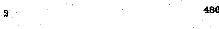</a>

### Depth 1 - Header
Analyzing region at depth 1 with bounds (164, 190, 446, 59)

### Depth 1 - Header
<details><summary>Raw JSON</summary>

```json
{
  "regions" : [ {
    "label" : "2",
    "description" : "A single character, possibly a number '2' or a stylized letter, located on the far left of the image segment.",
    "requires_zoom" : true,
    "x" : 10,
    "y" : 280,
    "width" : 50,
    "height" : 450
  }, {
    "label" : "486",
    "description" : "A three-digit number '486' located on the far right of the image segment.",
    "requires_zoom" : true,
    "x" : 925,
    "y" : 110,
    "width" : 75,
    "height" : 400
  } ],
  "summary" : "The image segment contains a single character on the left and the number '486' on the right, with a large empty space in between containing some minor noise or specks."
}
```
</details>
                        Skipped recursion for 2 (too small) at depth 2


### Leaf Analysis - 2
The image contains a single, bold, black character that appears to be the number '2' on a white background. The character has a slightly stylized or handwritten appearance with some pixelation along its edges. There are a few small, faint artifacts or noise marks around the character: a small dot to the upper right, a thin diagonal line segment to the left, and two small dots to the lower right.
Skipped recursion for 486 (too small) at depth 2


### Leaf Analysis - 486
The image segment contains the number '486' in a bold, black, sans-serif typeface. The characters appear slightly pixelated, suggesting a low-resolution or zoomed-in source. The background is a solid white. There is a small, faint greyish artifact or dot located above the digit '8'.

#### Sub-image for Left Column Text at depth 1 
<a href="../page_2_1.png" target="_blank">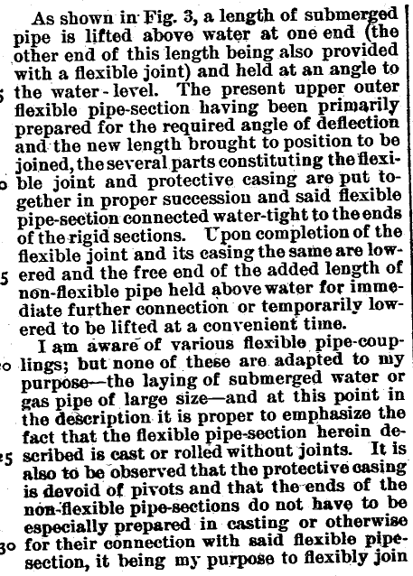</a>

### Depth 1 - Left Column Text
Analyzing region at depth 1 with bounds (164, 246, 457, 638)

### Depth 1 - Left Column Text
<details><summary>Raw JSON</summary>

```json
{
  "regions" : [ {
    "label" : "First paragraph: pipe lifting and joining process",
    "description" : "The first paragraph of the text, which describes the process of lifting a submerged pipe section above water to join it with a new section using a flexible joint and protective casing.",
    "requires_zoom" : true,
    "x" : 20,
    "y" : 0,
    "width" : 980,
    "height" : 575
  }, {
    "label" : "Second paragraph: distinction from prior art",
    "description" : "The second paragraph of the text, where the author distinguishes their invention from existing flexible pipe couplings, emphasizing that the flexible section is cast or rolled without joints and the casing is devoid of pivots.",
    "requires_zoom" : true,
    "x" : 20,
    "y" : 575,
    "width" : 980,
    "height" : 425
  } ],
  "summary" : "The image contains two paragraphs of technical text, likely from a patent specification, detailing a method for joining submerged pipes. The first paragraph explains the mechanical steps of lifting and connecting pipe sections above the water level. The second paragraph highlights the unique features of the invention, such as the jointless construction of the flexible section and the lack of pivots in the protective casing, contrasting it with existing technology."
}
```
</details>
                        
#### Sub-image for First paragraph: pipe lifting and joining process at depth 2 
<a href="../page_2_1_0.png" target="_blank">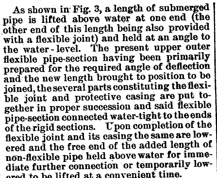</a>
Reached max depth at node First paragraph: pipe lifting and joining process, performing leaf analysis.


### Leaf Analysis - First paragraph: pipe lifting and joining process
The image contains a block of printed text in a serif font, characteristic of late 19th or early 20th-century technical documents or patents. The text is justified and describes a mechanical process involving submerged pipes and flexible joints. 

The full text reads:
"As shown in Fig. 3, a length of submerged pipe is lifted above water at one end (the other end of this length being also provided with a flexible joint) and held at an angle to the water-level. The present upper outer flexible pipe-section having been primarily prepared for the required angle of deflection and the new length brought to position to be joined, the several parts constituting the flexible joint and protective casing are put together in proper succession and said flexible pipe-section connected water-tight to the ends of the rigid sections. Upon completion of the flexible joint and its casing the same are lowered and the free end of the added length of non-flexible pipe held above water for immediate further connection or temporarily lowered to be lifted at a convenient time."

The printing shows some signs of age, such as slight ink bleeding and unevenness in the letterforms. A vertical black line is visible along the right edge of the text block.

#### Sub-image for Second paragraph: distinction from prior art at depth 2 
<a href="../page_2_1_1.png" target="_blank">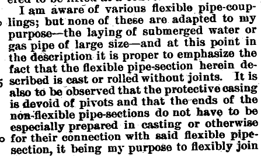</a>
Reached max depth at node Second paragraph: distinction from prior art, performing leaf analysis.


### Leaf Analysis - Second paragraph: distinction from prior art
This image segment contains a block of printed text, likely from a historical technical document or patent application. The text is set in a classic serif typeface and appears to be black ink on an aged, slightly speckled off-white background. 

The visible text reads:
"I am aware of various flexible pipe-coup-
lings; but none of these are adapted to my
purpose—the laying of submerged water or
gas pipe of large size—and at this point in
the description it is proper to emphasize the
fact that the flexible pipe-section herein de-
scribed is cast or rolled without joints. It is
also to be observed that the protective casing
is devoid of pivots and that the ends of the
non-flexible pipe-sections do not have to be
especially prepared in casting or otherwise
for their connection with said flexible pipe-
section, it being my purpose to flexibly join"

On the left margin, there are partial line numbers visible, specifically a '5' and what appears to be a '10' (partially cut off as 'o'). The text discusses the unique features of a flexible pipe coupling design, specifically for large-diameter submerged pipes, highlighting that the flexible section is seamless and the casing lacks pivots.

#### Sub-image for Claims Section at depth 1 
<a href="../page_2_2.png" target="_blank">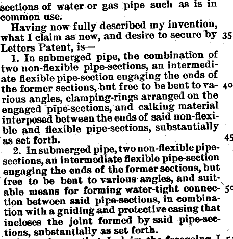</a>

### Depth 1 - Claims Section
Analyzing region at depth 1 with bounds (625, 246, 457, 468)

### Depth 1 - Claims Section
<details><summary>Raw JSON</summary>

```json
{
  "regions" : [ {
    "label" : "sections of water or gas pipe such as is in common use.",
    "description" : "The concluding sentence of the preceding descriptive section of the patent.",
    "requires_zoom" : true,
    "x" : 0,
    "y" : 0,
    "width" : 950,
    "height" : 90
  }, {
    "label" : "Having now fully described my invention, what I claim as new, and desire to secure by Letters Patent, is—",
    "description" : "The formal introductory statement for the patent claims.",
    "requires_zoom" : true,
    "x" : 0,
    "y" : 90,
    "width" : 950,
    "height" : 120
  }, {
    "label" : "1. In submerged pipe, the combination of two non-flexible pipe-sections, an intermediate flexible pipe-section engaging the ends of the former sections, but free to be bent to various angles, clamping-rings arranged on the engaged pipe-sections, and calking material interposed between the ends of said non-flexible and flexible pipe-sections, substantially as set forth.",
    "description" : "The first claim of the patent, describing a combination of pipe sections and sealing materials.",
    "requires_zoom" : true,
    "x" : 0,
    "y" : 210,
    "width" : 950,
    "height" : 380
  }, {
    "label" : "2. In submerged pipe, two non-flexible pipe-sections, an intermediate flexible pipe-section engaging the ends of the former sections, but free to be bent to various angles, and suitable means for forming water-tight connection between said pipe-sections, in combination with a guiding and protective casing that incloses the joint formed by said pipe-sections, substantially as set forth.",
    "description" : "The second claim of the patent, describing a pipe connection with a protective casing.",
    "requires_zoom" : true,
    "x" : 0,
    "y" : 590,
    "width" : 950,
    "height" : 410
  } ],
  "summary" : "This image segment contains the formal claims section of a patent document. It includes an introductory paragraph followed by two numbered claims (1 and 2) detailing the construction of submerged pipe joints. The text describes combinations of flexible and non-flexible pipe sections, clamping rings, caulking, and protective casings."
}
```
</details>
                        Skipped recursion for sections of water or gas pipe such as is in common use. (too small) at depth 2


### Leaf Analysis - sections of water or gas pipe such as is in common use.
The image contains two lines of printed text in a black, serif font against a light, slightly speckled background. The text reads: "sections of water or gas pipe such as is in" on the first line, and "common use." on the second line. The print quality appears aged, with some minor ink bleed and background noise typical of scanned historical documents.

#### Sub-image for Having now fully described my invention, what I claim as new, and desire to secure by Letters Patent, is— at depth 2 
<a href="../page_2_2_1.png" target="_blank">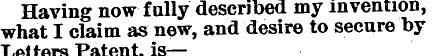</a>
Reached max depth at node Having now fully described my invention, what I claim as new, and desire to secure by Letters Patent, is—, performing leaf analysis.


### Leaf Analysis - Having now fully described my invention, what I claim as new, and desire to secure by Letters Patent, is—
The image contains three lines of printed text in a bold, serif typeface, characteristic of historical legal or patent documents. The text is black on a light, slightly textured background. The transcription of the text is as follows:

Line 1: "Having now fully described my invention,"
Line 2: "what I claim as new, and desire to secure by"
Line 3: "Letters Patent, is—"

The text is left-aligned, and the final line concludes with an em-dash. There are minor printing artifacts and speckles visible throughout the image, indicating it is likely a scan of an older physical document.

#### Sub-image for 1. In submerged pipe, the combination of two non-flexible pipe-sections, an intermediate flexible pipe-section engaging the ends of the former sections, but free to be bent to various angles, clamping-rings arranged on the engaged pipe-sections, and calking material interposed between the ends of said non-flexible and flexible pipe-sections, substantially as set forth. at depth 2 
<a href="../page_2_2_2.png" target="_blank">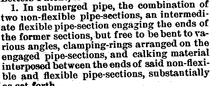</a>
Reached max depth at node 1. In submerged pipe, the combination of two non-flexible pipe-sections, an intermediate flexible pipe-section engaging the ends of the former sections, but free to be bent to various angles, clamping-rings arranged on the engaged pipe-sections, and calking material interposed between the ends of said non-flexible and flexible pipe-sections, substantially as set forth., performing leaf analysis.


### Leaf Analysis - 1. In submerged pipe, the combination of two non-flexible pipe-sections, an intermediate flexible pipe-section engaging the ends of the former sections, but free to be bent to various angles, clamping-rings arranged on the engaged pipe-sections, and calking material interposed between the ends of said non-flexible and flexible pipe-sections, substantially as set forth.
The image contains a block of printed text, which appears to be a claim from a patent document. The text is in a black serif font on a light, slightly textured background. 

The text reads:
"1. In submerged pipe, the combination of two non-flexible pipe-sections, an intermediate flexible pipe-section engaging the ends of the former sections, but free to be bent to various angles, clamping-rings arranged on the engaged pipe-sections, and calking material interposed between the ends of said non-flexible and flexible pipe-sections, substantially as set forth."

At the very top, the words "Letters Patent," are partially visible and cut off. The number "1." at the beginning of the paragraph is slightly larger or bolder than the rest of the text, indicating it is the first claim. The overall appearance is that of an old, scanned document.

#### Sub-image for 2. In submerged pipe, two non-flexible pipe-sections, an intermediate flexible pipe-section engaging the ends of the former sections, but free to be bent to various angles, and suitable means for forming water-tight connection between said pipe-sections, in combination with a guiding and protective casing that incloses the joint formed by said pipe-sections, substantially as set forth. at depth 2 
<a href="../page_2_2_3.png" target="_blank">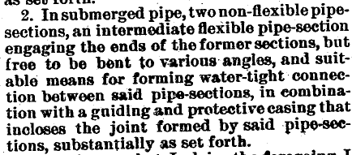</a>
Reached max depth at node 2. In submerged pipe, two non-flexible pipe-sections, an intermediate flexible pipe-section engaging the ends of the former sections, but free to be bent to various angles, and suitable means for forming water-tight connection between said pipe-sections, in combination with a guiding and protective casing that incloses the joint formed by said pipe-sections, substantially as set forth., performing leaf analysis.


### Leaf Analysis - 2. In submerged pipe, two non-flexible pipe-sections, an intermediate flexible pipe-section engaging the ends of the former sections, but free to be bent to various angles, and suitable means for forming water-tight connection between said pipe-sections, in combination with a guiding and protective casing that incloses the joint formed by said pipe-sections, substantially as set forth.
The image contains a block of printed text, which appears to be a numbered claim from a technical or legal document, such as a patent. The text is in a black, serif font on a light, slightly textured background with some visible noise or speckling. 

The text reads as follows:
"as set forth.
2. In submerged pipe, two non-flexible pipe-sections, an intermediate flexible pipe-section engaging the ends of the former sections, but free to be bent to various angles, and suitable means for forming water-tight connection between said pipe-sections, in combination with a guiding and protective casing that incloses the joint formed by said pipe-sections, substantially as set forth."

The paragraph describes a mechanical assembly for submerged pipes, specifically focusing on a flexible joint between two non-flexible pipe sections, protected by a casing.

#### Sub-image for Testimony and Signatures at depth 1 
<a href="../page_2_3.png" target="_blank">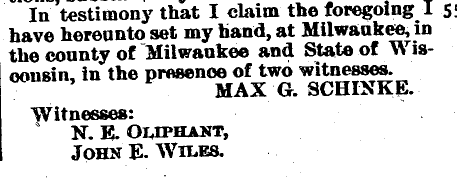</a>

### Depth 1 - Testimony and Signatures
Analyzing region at depth 1 with bounds (625, 706, 457, 178)

### Depth 1 - Testimony and Signatures
<details><summary>Raw JSON</summary>

```json
{
  "regions" : [ {
    "label" : "In testimony that I claim the foregoing I 55\nhave hereunto set my hand, at Milwaukee, in\nthe county of Milwaukee and State of Wis-\nconsin, in the presence of two witnesses.",
    "description" : "The main body of the concluding statement, declaring the signing of the document in Milwaukee, Wisconsin.",
    "requires_zoom" : false,
    "x" : 10,
    "y" : 0,
    "width" : 980,
    "height" : 450
  }, {
    "label" : "MAX G. SCHINKE.",
    "description" : "The name of the individual signing the document.",
    "requires_zoom" : false,
    "x" : 460,
    "y" : 450,
    "width" : 460,
    "height" : 100
  }, {
    "label" : "Witnesses:\nN. E. OLIPHANT,\nJOHN E. WILES.",
    "description" : "The section listing the witnesses to the signature.",
    "requires_zoom" : false,
    "x" : 60,
    "y" : 580,
    "width" : 460,
    "height" : 370
  } ],
  "summary" : "The image contains the concluding text of a legal or formal document, likely a patent application. It states: 'In testimony that I claim the foregoing I have hereunto set my hand, at Milwaukee, in the county of Milwaukee and State of Wisconsin, in the presence of two witnesses.' It is signed by 'MAX G. SCHINKE' and witnessed by 'N. E. OLIPHANT' and 'JOHN E. WILES'. The number '55' appears at the end of the first line, likely as a line reference."
}
```
</details>
                        

### Leaf Analysis - In testimony that I claim the foregoing I 55
have hereunto set my hand, at Milwaukee, in
the county of Milwaukee and State of Wis-
consin, in the presence of two witnesses.
This image segment contains four lines of printed text in a bold, serif typeface, characteristic of late 19th or early 20th-century documents, such as a patent application. The text is black on a light, slightly textured background, showing some signs of age or scanning artifacts like small speckles. 

The text reads:
"In testimony that I claim the foregoing I 5"
"have hereunto set my hand, at Milwaukee, in"
"the county of Milwaukee and State of Wis-"
"consin, in the presence of two witnesses."

Key details include:
- A formal legal declaration or closing statement.
- The location is specified as Milwaukee, in the county of Milwaukee and the State of Wisconsin.
- The word "Wisconsin" is hyphenated between the third and fourth lines ("Wis-" and "consin").
- There is a small numeral "5" at the far right of the first line, likely a line number or part of a page numbering system.
- The overall appearance is that of a scanned historical document.


### Leaf Analysis - MAX G. SCHINKE.
The image contains the text 'MAX G. SCHINKE.' in a bold, black, serif typeface. The letters are all capitalized and set against a plain white background. There is a period at the end of the name. The print quality shows some slight irregularities and speckling, characteristic of an older printed document or a scan.


### Leaf Analysis - Witnesses:
N. E. OLIPHANT,
JOHN E. WILES.
The image is a black and white text segment, likely from a legal or official document. It contains three lines of text in a bold, serif typeface. The first line reads 'Witnesses:' followed by a colon. The second line is indented and reads 'N. E. OLIPHANT,'. The third line is also indented and reads 'JOHN E. WILES.'. The background is white with some minor digital noise or artifacts typical of a scanned document.
