## Page 1 of 1

### Depth 0 - Full Image
Analyzing region at depth 0 with bounds (0, 0, 1024, 683)

### Depth 0 - Full Image
<details><summary>Raw JSON</summary>

```json
{
  "regions" : [ {
    "label" : "Left Hieroglyphic Columns",
    "description" : "A series of five vertical columns containing Egyptian hieroglyphs. These likely represent funerary spells or titles of the deceased.",
    "requires_zoom" : true,
    "x" : 60,
    "y" : 100,
    "width" : 460,
    "height" : 820
  }, {
    "label" : "Seated Deity Scene",
    "description" : "A central scene depicting a seated figure, likely a deity such as Osiris, holding the crook and flail. Above the figure is a Wedjat eye (Eye of Horus).",
    "requires_zoom" : true,
    "x" : 520,
    "y" : 50,
    "width" : 310,
    "height" : 870
  }, {
    "label" : "Right Hieroglyphic Columns",
    "description" : "Two vertical columns of hieroglyphic text located to the right of the seated figure.",
    "requires_zoom" : true,
    "x" : 830,
    "y" : 100,
    "width" : 170,
    "height" : 820
  } ],
  "summary" : "The image segment displays a section of an ancient Egyptian funerary object, possibly a coffin or sarcophagus. It features multiple vertical columns of hieroglyphic text surrounding a central figure of a seated deity, likely Osiris, who is shown with traditional regalia including the crook and flail. An Eye of Horus is positioned above the figure. The overall composition suggests a religious or protective context, typical of funerary art intended to assist the deceased in the afterlife."
}
```
</details>
                        
#### Sub-image for Left Hieroglyphic Columns at depth 1 
<a href="../root_0.png" target="_blank">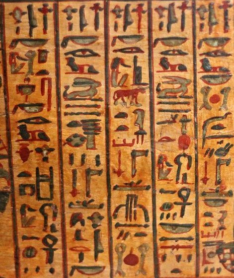</a>

### Depth 1 - Left Hieroglyphic Columns
Analyzing region at depth 1 with bounds (61, 68, 471, 560)

### Depth 1 - Left Hieroglyphic Columns
<details><summary>Raw JSON</summary>

```json
{
  "regions" : [ {
    "label" : "First column of hieroglyphs",
    "description" : "The first vertical column of Egyptian hieroglyphs on the left side of the image.",
    "requires_zoom" : true,
    "x" : 10,
    "y" : 0,
    "width" : 235,
    "height" : 1000
  }, {
    "label" : "Second column of hieroglyphs",
    "description" : "The second vertical column of Egyptian hieroglyphs from the left.",
    "requires_zoom" : true,
    "x" : 245,
    "y" : 0,
    "width" : 210,
    "height" : 1000
  }, {
    "label" : "Third column of hieroglyphs",
    "description" : "The third vertical column of Egyptian hieroglyphs, located in the center.",
    "requires_zoom" : true,
    "x" : 455,
    "y" : 0,
    "width" : 200,
    "height" : 1000
  }, {
    "label" : "Fourth column of hieroglyphs",
    "description" : "The fourth vertical column of Egyptian hieroglyphs from the left.",
    "requires_zoom" : true,
    "x" : 655,
    "y" : 0,
    "width" : 190,
    "height" : 1000
  }, {
    "label" : "Fifth column of hieroglyphs",
    "description" : "The fifth vertical column of Egyptian hieroglyphs on the far right side of the image.",
    "requires_zoom" : true,
    "x" : 845,
    "y" : 0,
    "width" : 155,
    "height" : 1000
  } ],
  "summary" : "The image displays five vertical columns of Egyptian hieroglyphs, separated by black vertical lines. The characters are painted in black and red ink on a yellowish-brown background, which appears to be papyrus or a wooden surface. The text likely represents a funerary or religious inscription, common in ancient Egyptian artifacts like the Book of the Dead. Each column contains a series of phonetic and ideographic signs that require closer inspection for accurate transliteration and translation."
}
```
</details>
                        
#### Sub-image for First column of hieroglyphs at depth 2 
<a href="../root_0_0.png" target="_blank">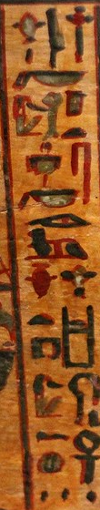</a>
Reached max depth at node First column of hieroglyphs, performing leaf analysis.


### Leaf Analysis - First column of hieroglyphs
This image segment features a vertical column of ancient Egyptian hieroglyphs painted on a textured, yellowish-tan background that resembles papyrus or aged wood. The column is bordered by thin, dark vertical lines. The hieroglyphs are rendered in a combination of black, red, and muted green pigments. The symbols are arranged vertically and include recognizable forms such as a bird, a bowl or basket shape, an eye, various vessels, and an ankh symbol near the bottom. The style is somewhat simplified, characteristic of later periods or more cursive scripts like hieratic. The overall appearance is that of a fragment from a funerary text or a decorative panel from an ancient Egyptian artifact.

#### Sub-image for Second column of hieroglyphs at depth 2 
<a href="../root_0_1.png" target="_blank">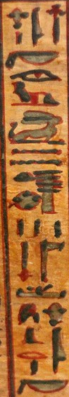</a>
Reached max depth at node Second column of hieroglyphs, performing leaf analysis.


### Leaf Analysis - Second column of hieroglyphs
This image segment displays a vertical column of Egyptian hieroglyphs painted on a textured, yellowish-tan background that resembles aged papyrus. The hieroglyphs are rendered in dark grey or black ink with distinct red accents. The column is bounded on the left by a dark vertical line. 

Starting from the top and moving downwards, the symbols include:
- A set of three small glyphs, including two cross-like shapes flanking a vertical stroke.
- A horizontal, bowl-shaped glyph (possibly the 'nb' sign).
- A stylized eye (the 'ir' sign).
- A seated figure or a complex glyph with a red base.
- A reclining animal figure, possibly a lion or a hare.
- Three horizontal wavy lines, which typically represent water (the 'n' sign).
- A cluster of symbols including a circular shape with internal dots and various strokes.
- Three short vertical strokes.
- A vertical staff-like symbol with a crossbar.
- A horizontal bar.
- A seated human figure next to another vertical glyph.
- Another horizontal bowl-shaped glyph at the bottom.

The painting style is somewhat fluid and illustrative, characteristic of funerary texts like the Book of the Dead.

#### Sub-image for Third column of hieroglyphs at depth 2 
<a href="../root_0_2.png" target="_blank">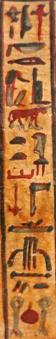</a>
Reached max depth at node Third column of hieroglyphs, performing leaf analysis.


### Leaf Analysis - Third column of hieroglyphs
This image segment shows a vertical column of Egyptian hieroglyphs painted on a textured, yellowish-tan background that resembles papyrus or linen. The column is bordered by dark, vertical lines. The hieroglyphs are rendered in a palette of red, black, and a muted greenish-grey. 

Starting from the top and moving downwards, the symbols include:
- A set of small phonetic signs, including what appears to be a loaf of bread ('t').
- A horizontal, bowl-shaped sign.
- A clearly defined eye symbol ('ir').
- A seated figure or a complex glyph below the eye.
- A prominent reddish-brown quadruped animal, likely a bull or a cow, depicted in profile.
- A series of smaller signs, including another loaf shape and a bird-like figure.
- Further down, there are vertical and horizontal strokes, including a sign that resembles a stylized bundle of reeds or a plant.
- At the bottom of the segment, a circular red symbol is flanked by two vertical, greyish signs.

The painting style is hand-drawn with visible brushstrokes, characteristic of funerary texts such as those found in the Book of the Dead.

#### Sub-image for Fourth column of hieroglyphs at depth 2 
<a href="../root_0_3.png" target="_blank">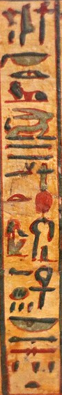</a>
Reached max depth at node Fourth column of hieroglyphs, performing leaf analysis.


### Leaf Analysis - Fourth column of hieroglyphs
This image segment shows a vertical column of ancient Egyptian hieroglyphs painted on a yellowish-tan background, likely papyrus or a similar material. The column is bordered on the right by a dark vertical line. The hieroglyphs are rendered with black outlines and filled with various colors, including red, a muted green-grey, and black. 

From top to bottom, several recognizable signs can be identified:
- A horizontal bowl or basket shape (the 'nb' sign).
- An eye (the 'ir' sign).
- A reclining lion (the 'rw' sign).
- A hare (the 'wn' sign).
- Three horizontal wavy lines representing water (the 'n' sign).
- A small figure followed by a prominent red sun disk (the 'ra' sign).
- A seated figure, possibly a deity or a person of status.
- An 'ankh' symbol, representing life.
- Another bowl or basket shape ('nb').
- Various horizontal strokes and small wedge-shaped marks near the bottom.
- A small semi-circular sign (the 't' sign) at the very base.

The style is characteristic of funerary texts or decorative inscriptions from ancient Egypt, where color was often used to enhance the symbolic meaning of the signs.

#### Sub-image for Fifth column of hieroglyphs at depth 2 
<a href="../root_0_4.png" target="_blank">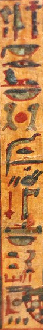</a>
Reached max depth at node Fifth column of hieroglyphs, performing leaf analysis.


### Leaf Analysis - Fifth column of hieroglyphs
This image segment shows a vertical column of Egyptian hieroglyphs painted on a textured, yellowish-tan background that resembles aged papyrus. The column is bordered on the left by a thin, vertical red line. The hieroglyphs are rendered in a combination of black, red, and a muted greenish-grey paint. From top to bottom, the symbols include various recognizable forms: a tall staff-like figure, a horizontal basket or bowl shape, an eye symbol, another basket, a central red sun disk flanked by two vertical elements, a wavy water line above a horizontal bar, a bird-like figure, and several other more complex phonetic or ideographic signs. The painting style is hand-drawn with slightly irregular, thick lines, giving it an authentic, ancient appearance. The overall composition is a narrow, vertical strip, typical of a column of text from a larger scroll or wall painting.

#### Sub-image for Seated Deity Scene at depth 1 
<a href="../root_1.png" target="_blank">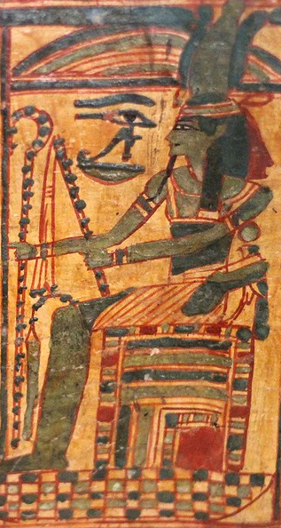</a>

### Depth 1 - Seated Deity Scene
Analyzing region at depth 1 with bounds (532, 34, 317, 594)

### Depth 1 - Seated Deity Scene
<details><summary>Raw JSON</summary>

```json
{
  "regions" : [ {
    "label" : "Head and Crown of Osiris",
    "description" : "The head of the figure, featuring green skin, a divine beard, and a complex crown (likely the Atef crown). The green skin is a traditional depiction of Osiris, the god of the afterlife and rebirth.",
    "requires_zoom" : true,
    "x" : 550,
    "y" : 0,
    "width" : 450,
    "height" : 450
  }, {
    "label" : "Eye of Horus (Wedjat)",
    "description" : "The Eye of Horus (Wedjat eye) positioned in front of the figure. It sits atop a 'neb' basket symbol, which can mean 'lord' or 'all'. This symbol represents protection, royal power, and good health.",
    "requires_zoom" : true,
    "x" : 250,
    "y" : 160,
    "width" : 300,
    "height" : 200
  }, {
    "label" : "Crook and Flail",
    "description" : "The figure's hands holding the crook (heka) and flail (nekhakha), which are primary symbols of pharaonic authority and the god Osiris.",
    "requires_zoom" : true,
    "x" : 30,
    "y" : 200,
    "width" : 500,
    "height" : 400
  }, {
    "label" : "Ornate Throne",
    "description" : "The ornate throne upon which the figure is seated. It features a patterned design with horizontal bands of different colors, typical of Egyptian artistic conventions for royal or divine seating.",
    "requires_zoom" : true,
    "x" : 350,
    "y" : 500,
    "width" : 600,
    "height" : 450
  }, {
    "label" : "Lower Body and Base",
    "description" : "The lower portion of the figure and the base of the scene, showing a checkered or tiled floor pattern.",
    "requires_zoom" : true,
    "x" : 0,
    "y" : 550,
    "width" : 400,
    "height" : 450
  } ],
  "summary" : "This image segment depicts a seated deity, almost certainly Osiris, characterized by his green skin, divine beard, Atef crown, and the crook and flail he holds. In front of him is a prominent Eye of Horus (Wedjat eye) resting on a 'neb' basket. The figure is seated on a highly decorated throne above a patterned floor. The style is characteristic of ancient Egyptian funerary art, possibly from a papyrus or a tomb wall painting."
}
```
</details>
                        
#### Sub-image for Head and Crown of Osiris at depth 2 
<a href="../root_1_0.png" target="_blank">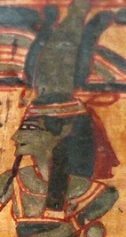</a>
Reached max depth at node Head and Crown of Osiris, performing leaf analysis.


### Leaf Analysis - Head and Crown of Osiris
This image segment depicts a figure in profile, rendered in a style characteristic of ancient Egyptian art, likely from a papyrus or tomb painting. The figure faces left and has a greenish-grey skin tone. They are shown with a stylized eye and a long, thin, dark beard. On their head, they wear a headband with horizontal red and yellow-white stripes. Above this is a tall, greenish-grey headdress or crown, flanked by dark, curved elements that could represent feathers or horns. The figure's clothing consists of a garment with red and yellow-white straps or borders across the chest and shoulders. A long, dark wig or hair falls down the back. The background is a warm, aged yellow-tan color, and the entire scene is outlined with bold red and dark brown lines, typical of the period's artistic conventions.

#### Sub-image for Eye of Horus (Wedjat) at depth 2 
<a href="../root_1_1.png" target="_blank">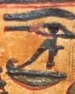</a>
Reached max depth at node Eye of Horus (Wedjat), performing leaf analysis.


### Leaf Analysis - Eye of Horus (Wedjat)
This image segment features a prominent ancient Egyptian hieroglyph, specifically the Eye of Horus, also known as the Wedjat eye. The eye is rendered in dark, thick outlines, possibly black or a very dark blue-green, against a warm, yellowish-orange background that resembles aged papyrus or painted plaster. 

The Eye of Horus is composed of several distinct elements: a stylized eye with an upper and lower lid, a thick curved eyebrow above it, a vertical 'tear' mark extending from the inner corner, and a long, curling line extending from the outer corner that spirals downwards. 

Directly beneath the Eye of Horus is another hieroglyph, a shallow, bowl-shaped sign (the 'nb' sign). The entire composition is framed by a thin red horizontal line at the top and a similar curved red line at the bottom, following the contour of the bowl. There are small touches of reddish-brown paint at the ends of the lines forming the eye, adding a bit of color variation. The overall appearance is weathered and ancient, with visible texture and slight imperfections in the paint application.

#### Sub-image for Crook and Flail at depth 2 
<a href="../root_1_2.png" target="_blank">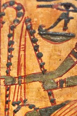</a>
Reached max depth at node Crook and Flail, performing leaf analysis.


### Leaf Analysis - Crook and Flail
This image segment shows a portion of ancient Egyptian artwork, likely from a papyrus scroll or a painted tomb wall. The background is a warm, textured yellow-orange, resembling aged papyrus. The artwork features several symbolic elements rendered with bold red outlines and filled with dark grey, black, and muted green pigments. In the upper right, a partial Eye of Horus (Wedjat eye) is visible. To the left, there are vertical, staff-like structures outlined in red and decorated with a series of dark, rounded spots or beads. A horizontal band of greenish-grey pigment, also outlined in red, crosses the middle of the frame. The overall style is characteristic of Egyptian iconography, with its flat perspective and symbolic representation. The surface appears aged, with visible cracks and a fibrous texture.

#### Sub-image for Ornate Throne at depth 2 
<a href="../root_1_3.png" target="_blank">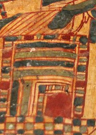</a>
Reached max depth at node Ornate Throne, performing leaf analysis.


### Leaf Analysis - Ornate Throne
This image segment depicts a stylized architectural structure, likely a shrine or a building, rendered in the characteristic style of ancient Egyptian art. The central feature is a rectangular form composed of horizontal bands in dark grey, olive green, and reddish-brown, separated by thin orange lines. This structure is framed by a border of alternating red and dark grey blocks. Within this larger frame, a smaller rectangular opening or doorway is visible, also bordered by similar geometric patterns. The base of the structure rests on a checkered floor pattern of red, dark grey, and tan squares. Above the main body, diagonal orange lines suggest a sloped roof or a decorative cornice. The overall color palette is warm, featuring ochre, red, and dark tones, and the texture suggests a surface like papyrus or aged plaster.

#### Sub-image for Lower Body and Base at depth 2 
<a href="../root_1_4.png" target="_blank">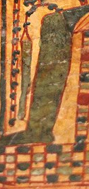</a>
Reached max depth at node Lower Body and Base, performing leaf analysis.


### Leaf Analysis - Lower Body and Base
This image segment features a vertical composition in an ancient artistic style, characterized by a warm ochre background and a palette of dark green, red, and black. The central focus is a large, elongated, dark green form outlined in red, which curves slightly. To its left is a similar but much thinner vertical shape. On the far left, vertical red lines are punctuated by dark, rounded spots. To the right of the central green form is a vertical structure resembling a ladder or a decorated column, with red horizontal bands and dark spots. The bottom of the segment contains a checkerboard-like grid formed by red lines, with dark grey or black spots within each square. At the top, dark, rounded shapes suggest clusters of fruit, possibly grapes, hanging from a thin red vine. The overall appearance is aged, with visible texture and some wear on the painted surface.

#### Sub-image for Right Hieroglyphic Columns at depth 1 
<a href="../root_2.png" target="_blank">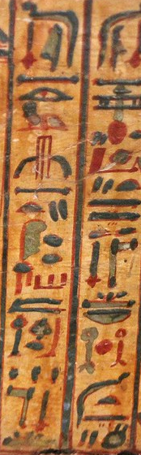</a>

### Depth 1 - Right Hieroglyphic Columns
Analyzing region at depth 1 with bounds (849, 68, 174, 560)

### Depth 1 - Right Hieroglyphic Columns
<details><summary>Raw JSON</summary>

```json
{
  "regions" : [ {
    "label" : "Left Hieroglyphic Column",
    "description" : "The left vertical column of Egyptian hieroglyphs, featuring signs such as a seated figure, an eye, and various phonetic and ideographic markers in black, red, and green ink.",
    "requires_zoom" : true,
    "x" : 20,
    "y" : 0,
    "width" : 480,
    "height" : 1000
  }, {
    "label" : "Right Hieroglyphic Column",
    "description" : "The right vertical column of Egyptian hieroglyphs, separated from the left by a black line. It contains signs including a seated figure, a red sun disk, and horizontal bars.",
    "requires_zoom" : true,
    "x" : 520,
    "y" : 0,
    "width" : 480,
    "height" : 1000
  } ],
  "summary" : "The image displays two vertical columns of Egyptian hieroglyphs painted on papyrus. The text is likely funerary in nature, possibly from a version of the Book of the Dead. The signs are rendered in multiple colors, which often had symbolic meaning or were used for specific types of words. Further magnification is needed to accurately identify and translate the individual glyphs."
}
```
</details>
                        
#### Sub-image for Left Hieroglyphic Column at depth 2 
<a href="../root_2_0.png" target="_blank">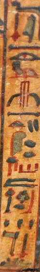</a>
Reached max depth at node Left Hieroglyphic Column, performing leaf analysis.


### Leaf Analysis - Left Hieroglyphic Column
This image segment shows a vertical column of Egyptian hieroglyphs written on a textured, yellowish-tan background that resembles aged papyrus. The text is framed by dark vertical lines on either side. The hieroglyphs are rendered in a combination of black, red, and muted green or blue-grey pigments. 

Starting from the top, the symbols include:
- A horizontal bar with a vertical element above it.
- A clearly defined eye symbol (resembling the Eye of Horus or the 'ir' glyph).
- A horizontal line with small markings.
- A three-pronged vertical symbol, possibly representing a stylized plant or a specific phonetic value.
- A horizontal bar.
- A semi-circular 'bread loaf' symbol ('t') accompanied by two vertical strokes.
- A larger, green-tinted glyph that appears to be a seated figure or a specific object, next to several dark dots.
- A horizontal bar followed by three vertical red strokes.
- A horizontal wavy line, the standard symbol for water ('n').
- A complex grouping of symbols near the bottom, including a vertical staff-like shape and various smaller dots and strokes.

The style is characteristic of cursive hieroglyphs or hieratic script often found in funerary texts like the Book of the Dead. The use of red ink for certain elements is a common practice in such manuscripts to highlight specific words or sections.

#### Sub-image for Right Hieroglyphic Column at depth 2 
<a href="../root_2_1.png" target="_blank">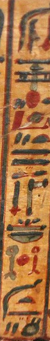</a>
Reached max depth at node Right Hieroglyphic Column, performing leaf analysis.


### Leaf Analysis - Right Hieroglyphic Column
This image segment displays a vertical column of Egyptian hieroglyphs painted on a textured, light-brown background that resembles papyrus. The column is bordered by dark vertical lines. The hieroglyphs are rendered in black and red ink, with some hints of a greyish-green pigment. 

Starting from the top and moving downwards, the symbols include:
- A dark, curved shape at the very top.
- A horizontal structure with multiple crossbars, reminiscent of a 'djed' pillar.
- A prominent red oval or circular shape.
- A red rectangular or wedge-shaped symbol.
- Two small, slanted black strokes.
- Two parallel horizontal black bars.
- A small, simplified black figure or bird-like shape.
- Two vertical black lines, the left one ending in a red tip.
- A horizontal bowl-like shape with small dots or strokes above it.
- A cluster of three small symbols: a greyish-green shape on the left, a red circle in the center, and a red vertical stroke on the right.
- A curved black line, possibly representing a hill or a snake.
- A final horizontal black line with small strokes and a circle below it.

The overall style is characteristic of ancient Egyptian funerary texts, such as those found in the Book of the Dead, where hieroglyphs were hand-painted with a brush.
