# Software Design Document: Task Management System

**System:** A web-based application for managing tasks, projects, and team collaboration. 
The system should support user authentication, task creation, assignment, 
status tracking (Kanban style), and basic reporting. 
It needs to handle multiple projects and teams.

**Generated:** 2026-01-02 02:25:34

---

## Use Cases & Actors

# Use Case Documentation: Task Management System

This document outlines the functional requirements of the Task Management System through detailed actor identification and use case analysis.

---

## 1. Actor Identification

The following actors interact with the Task Management System. Actors represent roles played by human users or external systems.

| Actor | Type | Description | Primary Goals |
| :--- | :--- | :--- | :--- |
| **Project Manager (PM)** | Human | Responsible for project delivery and resource allocation. | Create projects, track progress, and manage team workloads. |
| **Developer** | Human | Responsible for executing technical tasks. | View assigned tasks, update progress, and collaborate via comments. |
| **QA Engineer** | Human | Responsible for quality assurance and verification. | Validate completed tasks, report bugs, and move tasks to "Done". |
| **Product Owner (PO)** | Human | Responsible for product vision and backlog prioritization. | Define requirements, prioritize tasks, and review project reports. |
| **System Admin** | Human | Responsible for system configuration and user management. | Manage user accounts, permissions, and system integrations. |
| **Notification Service** | System | External service (e.g., SendGrid, Slack API). | Deliver real-time alerts and email notifications to users. |

### Actor Relationships
- **Team Member (Abstract):** PM, Developer, and QA Engineer all inherit from a general "Team Member" role, allowing them to perform basic actions like commenting and viewing tasks.
- **Stakeholder:** PM and PO share reporting and oversight capabilities.

---

## 2. Use Case Catalog

### UC-101: Create New Task
- **Primary Actor:** PM, PO, Developer
- **Preconditions:** 
    - User is authenticated.
    - User has "Write" permissions for the selected project.
- **Main Success Scenario:**
    1. User navigates to the Project Dashboard.
    2. User clicks the "Create Task" button.
    3. User enters task details: Title, Description, Priority, and Due Date.
    4. User selects an Assignee from the project team list.
    5. User clicks "Save".
    6. System validates the input data.
    7. System persists the task to the PostgreSQL database.
    8. System triggers a notification to the Assignee.
- **Alternative Flows:**
    - **AF-101.1: Missing Required Fields:** System highlights missing fields and prevents submission.
    - **AF-101.2: Invalid Assignee:** If the assignee is removed from the project during creation, the system prompts the user to select a new member.
- **Postconditions:** Task is visible on the Kanban board; Assignee is notified.
- **Business Rules:** 
    - BR-01: Every task must have a unique ID within the project.
    - BR-02: Tasks cannot be created with a due date in the past.

### UC-102: Update Task Status (Kanban Transition)
- **Primary Actor:** Developer, QA Engineer
- **Preconditions:**
    - Task exists in a non-terminal state (e.g., "To Do" or "In Progress").
- **Main Success Scenario:**
    1. User opens the Kanban Board view.
    2. User drags a task card from the current column to a new column (e.g., "In Progress" to "In Review").
    3. System checks if the transition is valid based on the workflow schema.
    4. System updates the `status` and `updated_at` timestamp.
    5. System logs the transition in the audit trail.
- **Alternative Flows:**
    - **AF-102.1: Unauthorized Transition:** If a Developer tries to move a task directly to "Done" without QA approval, the system blocks the move and displays a permission error.
- **Postconditions:** Task status is updated; Board view refreshes for all concurrent users via WebSockets.
- **Business Rules:**
    - BR-03: Only QA Engineers can move tasks to the "Done" column.

### UC-103: Generate Project Health Report
- **Primary Actor:** Project Manager, Product Owner
- **Preconditions:**
    - Project contains at least one task.
- **Main Success Scenario:**
    1. User navigates to the "Reports" section.
    2. User selects the Project and Date Range.
    3. User clicks "Generate Report".
    4. System aggregates data: Burndown rate, task completion velocity, and bottleneck identification.
    5. System renders a visual dashboard with charts.
    6. User selects "Export to PDF".
- **Postconditions:** A downloadable report is generated.

---

## 3. Use Case Diagram

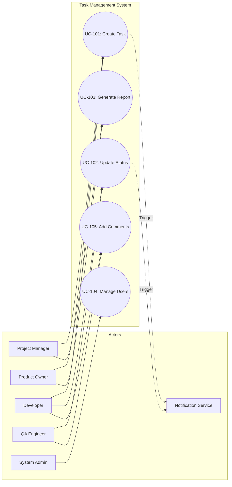
```mermaid
graph LR
    subgraph Actors
        PM[Project Manager]
        PO[Product Owner]
        DEV[Developer]
        QA[QA Engineer]
        ADMIN[System Admin]
        NOTIF[Notification Service]
    end

    subgraph "Task Management System"
        UC101((UC-101: Create Task))
        UC102((UC-102: Update Status))
        UC103((UC-103: Generate Report))
        UC104((UC-104: Manage Users))
        UC105((UC-105: Add Comments))
    end

    PM --> UC101
    PM --> UC103
    PO --> UC101
    PO --> UC103
    DEV --> UC101
    DEV --> UC102
    DEV --> UC105
    QA --> UC102
    QA --> UC105
    ADMIN --> UC104
    
    UC101 -.->|Trigger| NOTIF
    UC102 -.->|Trigger| NOTIF
```

---

## 4. Actor-Use Case Matrix

This matrix maps actors to their level of participation in each use case.
(P = Primary Actor, S = Supporting/Secondary Actor)

| Use Case ID | Use Case Name | PM | PO | Dev | QA | Admin | Notif. Service |
| :--- | :--- | :---: | :---: | :---: | :---: | :---: | :---: |
| **UC-101** | Create New Task | P | P | P | - | - | S |
| **UC-102** | Update Task Status | S | - | P | P | - | S |
| **UC-103** | Generate Project Report | P | P | - | - | - | - |
| **UC-104** | Manage Users/Teams | S | - | - | - | P | - |
| **UC-105** | Add Comments | P | P | P | P | - | S |
| **UC-106** | Configure Workflow | P | - | - | - | S | - |

---

## 5. Traceability & Acceptance Criteria

| UC-ID | Acceptance Criteria (Testable) |
| :--- | :--- |
| **UC-101** | Verify that a task cannot be saved without a title. Verify that the assigned user receives an email notification within 30 seconds. |
| **UC-102** | Verify that a Developer role receives a "403 Forbidden" when attempting to move a task from "In Review" to "Done". |
| **UC-103** | Verify that the PDF export contains the correct number of completed tasks for the selected date range. |
| **UC-105** | Verify that comments support Markdown formatting and are visible to all team members assigned to the project. |

---

## Requirements Specification

# Task Management System: Requirements Documentation

**Version:** 1.0.0  
**Status:** Draft  
**Architect:** System Architect  
**Tech Stack:** Kotlin, Spring Boot, React, PostgreSQL, Docker

---

## 1. Functional Requirements (FR)

The functional requirements define the specific behaviors and services the Task Management System must provide.

| FR-ID | Description | Priority | Source | Acceptance Criteria |
|:---|:---|:---|:---|:---|
| **FR-101** | **User Authentication** | Must Have | UC-101 | 1. Users can register with email/password.<br>2. Users can login via JWT-based auth.<br>3. Password must be hashed (BCrypt). |
| **FR-102** | **Role-Based Access Control (RBAC)** | Must Have | UC-101 | 1. Roles: Admin, Project Manager, Developer.<br>2. Permissions enforced at API level. |
| **FR-201** | **Project Creation** | Must Have | UC-201 | 1. PMs can create projects with name, description, and deadline.<br>2. Projects must have a unique ID. |
| **FR-202** | **Team Assignment** | Must Have | UC-201 | 1. PMs can add/remove users to/from projects.<br>2. Users only see projects they are assigned to. |
| **FR-301** | **Task Lifecycle Management** | Must Have | UC-301 | 1. Tasks support states: To Do, In Progress, Review, Done.<br>2. Status transitions are logged. |
| **FR-302** | **Task Assignment** | Must Have | UC-301 | 1. Tasks can be assigned to one or more project members.<br>2. Assignees receive notification on change. |
| **FR-303** | **Kanban Board View** | Should Have | UC-302 | 1. Visual drag-and-drop interface for task status.<br>2. Columns represent task states. |
| **FR-401** | **Project Reporting** | Could Have | UC-401 | 1. Generate PDF/CSV reports of task completion rates.<br>2. Display burn-down charts for active sprints. |
| **FR-501** | **Real-time Comments** | Should Have | UC-303 | 1. Users can comment on tasks.<br>2. Comments support Markdown formatting. |

---

## 2. Non-Functional Requirements (NFR)

These requirements define the quality attributes and constraints of the system.

### 2.1 Performance
*   **NFR-P1 (Latency):** 95% of API requests must respond within < 200ms under normal load.
*   **NFR-P2 (Throughput):** The system must support at least 500 concurrent transactions per second (TPS).
*   **NFR-P3 (Load Time):** Initial React application load time must be < 2 seconds on a 4G connection.

### 2.2 Scalability
*   **NFR-S1 (Horizontal Scaling):** The Spring Boot backend must be stateless to allow horizontal scaling via Docker/Kubernetes.
*   **NFR-S2 (Data Volume):** The PostgreSQL schema must support up to 1 million tasks without significant query degradation (using indexing and partitioning).

### 2.3 Security
*   **NFR-SEC1 (Encryption):** All data in transit must be encrypted via TLS 1.3. Sensitive data at rest must use AES-256.
*   **NFR-SEC2 (Audit Log):** All destructive actions (Delete Project/Task) must be logged with User ID and Timestamp.
*   **NFR-SEC3 (OWASP):** The system must be protected against SQL Injection, XSS, and CSRF.

### 2.4 Reliability
*   **NFR-R1 (Uptime):** The system shall maintain 99.9% availability (excluding scheduled maintenance).
*   **NFR-R2 (Backups):** Automated daily database backups with a Recovery Point Objective (RPO) of 24 hours.

### 2.5 Usability & Compatibility
*   **NFR-U1 (Accessibility):** UI must comply with WCAG 2.1 Level AA standards.
*   **NFR-U2 (Responsiveness):** The web application must be fully functional on Chrome, Firefox, Safari, and Edge (latest 2 versions).
*   **NFR-U3 (Mobile):** The UI must be responsive for screen widths down to 375px.

---

## 3. Requirements Traceability Matrix (RTM)

This matrix ensures that every use case is covered by requirements and every requirement is verified by a test case.

| Use Case ID | Functional Requirement | Test Case ID | Status |
|:---|:---|:---|:---|
| **UC-101: User Auth** | FR-101, FR-102 | TC-AUTH-01, TC-AUTH-02 | Pending |
| **UC-201: Project Mgmt** | FR-201, FR-202 | TC-PROJ-01, TC-PROJ-02 | Pending |
| **UC-301: Task Lifecycle** | FR-301, FR-302 | TC-TASK-01, TC-TASK-02 | Pending |
| **UC-302: Kanban View** | FR-303 | TC-UI-01 | Pending |
| **UC-303: Collaboration** | FR-501 | TC-COLL-01 | Pending |
| **UC-401: Reporting** | FR-401 | TC-REP-01 | Pending |

---

## 4. Requirements Dependency Diagram

The following diagram illustrates the logical dependencies between functional and non-functional requirements.

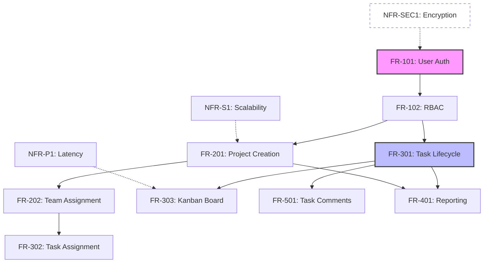
```mermaid
graph TD
    %% Functional Requirements
    FR101[FR-101: User Auth] --> FR102[FR-102: RBAC]
    FR102 --> FR201[FR-201: Project Creation]
    FR102 --> FR301[FR-301: Task Lifecycle]
    
    FR201 --> FR202[FR-202: Team Assignment]
    FR202 --> FR302[FR-302: Task Assignment]
    
    FR301 --> FR303[FR-303: Kanban Board]
    FR301 --> FR501[FR-501: Task Comments]
    
    FR301 --> FR401[FR-401: Reporting]
    FR201 --> FR401

    %% Non-Functional Requirements Dependencies
    NFR_SEC1[NFR-SEC1: Encryption] -.-> FR101
    NFR_P1[NFR-P1: Latency] -.-> FR303
    NFR_S1[NFR-S1: Scalability] -.-> FR201
    
    %% Styling
    style FR101 fill:#f9f,stroke:#333,stroke-width:2px
    style FR301 fill:#bbf,stroke:#333,stroke-width:2px
    style NFR_SEC1 fill:#fff,stroke-dasharray: 5 5
```

---

## 5. System State Machine (Task Lifecycle)

To further clarify **FR-301**, the following state diagram defines the allowed transitions for a task.

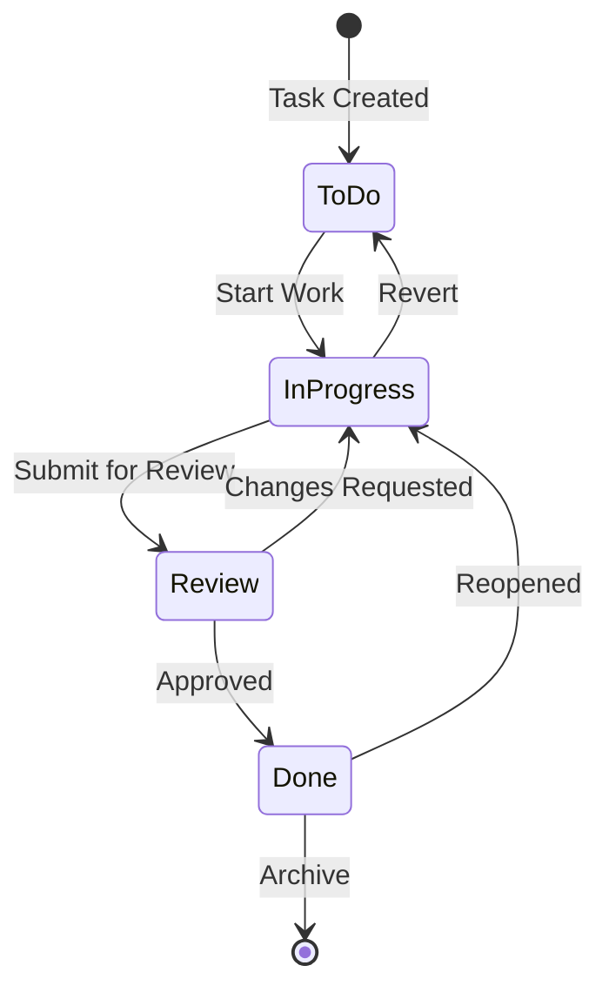
```mermaid
stateDiagram-v2
    [*] --> ToDo: Task Created
    ToDo --> InProgress: Start Work
    InProgress --> ToDo: Revert
    InProgress --> Review: Submit for Review
    Review --> InProgress: Changes Requested
    Review --> Done: Approved
    Done --> InProgress: Reopened
    Done --> [*]: Archive
```

---

## 6. Data Model (High-Level ERD)

To support the functional requirements, the following data structure is required.

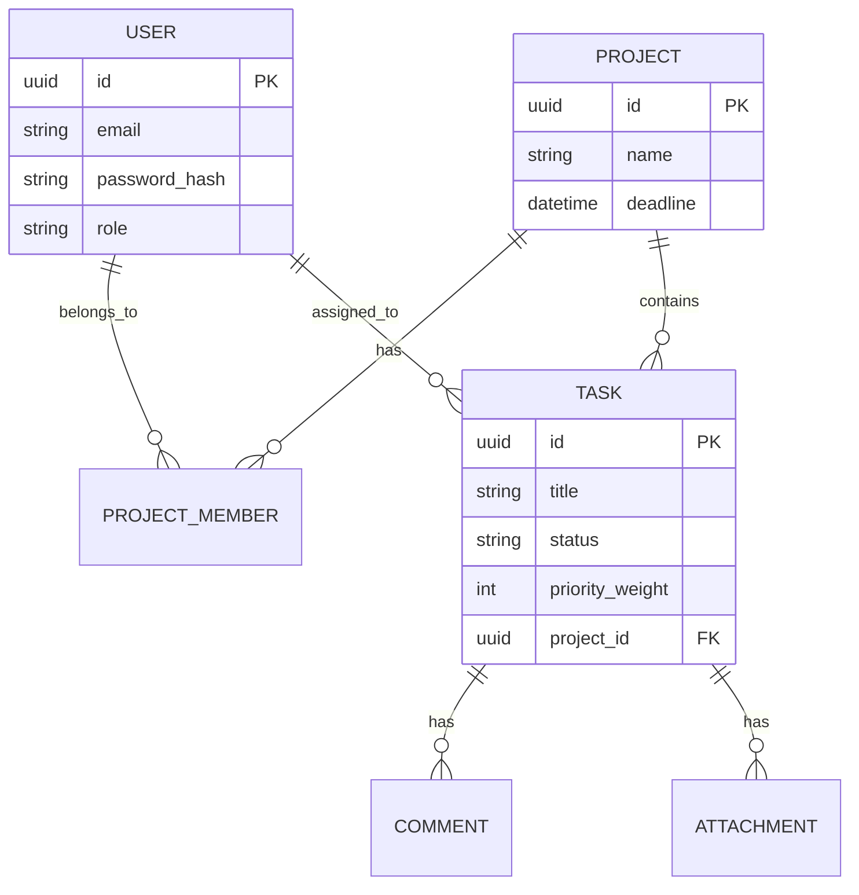
```mermaid
erDiagram
    USER ||--o{ PROJECT_MEMBER : belongs_to
    PROJECT ||--o{ PROJECT_MEMBER : has
    PROJECT ||--o{ TASK : contains
    USER ||--o{ TASK : assigned_to
    TASK ||--o{ COMMENT : has
    TASK ||--o{ ATTACHMENT : has
    
    USER {
        uuid id PK
        string email
        string password_hash
        string role
    }
    
    PROJECT {
        uuid id PK
        string name
        datetime deadline
    }
    
    TASK {
        uuid id PK
        string title
        string status
        int priority_weight
        uuid project_id FK
    }
```

---

## 7. Acceptance Criteria Summary for Stakeholders

| Stakeholder | Key Interest | Primary Requirement |
|:---|:---|:---|
| **Project Manager** | Oversight & Reporting | FR-201, FR-401 |
| **Developer** | Task Execution | FR-301, FR-303, FR-501 |
| **QA Engineer** | Traceability & Logic | RTM, FR-301 |
| **Product Owner** | Security & Scalability | NFR-SEC1, NFR-S1 |

---

## System Architecture

# Architecture Design Document: Task Management System (TMS)

**Version:** 1.0.0  
**Status:** Draft  
**Date:** October 26, 2023  
**Architect:** Expert Software Architect

---

## 1. System Context Diagram (C4 Level 1)

The Task Management System (TMS) serves as a central hub for project coordination. It interacts with internal users (Project Managers, Developers) and external systems for notifications and authentication.

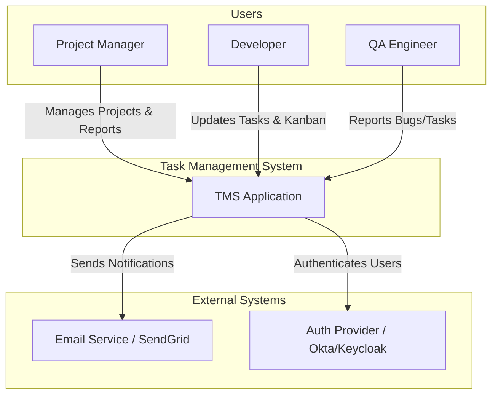
```mermaid
graph TB
    subgraph Users
        PM[Project Manager]
        DEV[Developer]
        QA[QA Engineer]
    end

    subgraph "Task Management System"
        TMS[TMS Application]
    end

    subgraph External Systems
        SMTP[Email Service / SendGrid]
        OIDC[Auth Provider / Okta/Keycloak]
    end

    PM -->|Manages Projects & Reports| TMS
    DEV -->|Updates Tasks & Kanban| TMS
    QA -->|Reports Bugs/Tasks| TMS

    TMS -->|Sends Notifications| SMTP
    TMS -->|Authenticates Users| OIDC
```

---

## 2. Container Diagram (C4 Level 2)

This diagram illustrates the high-level technology choices and how the responsibilities are distributed across the system containers.

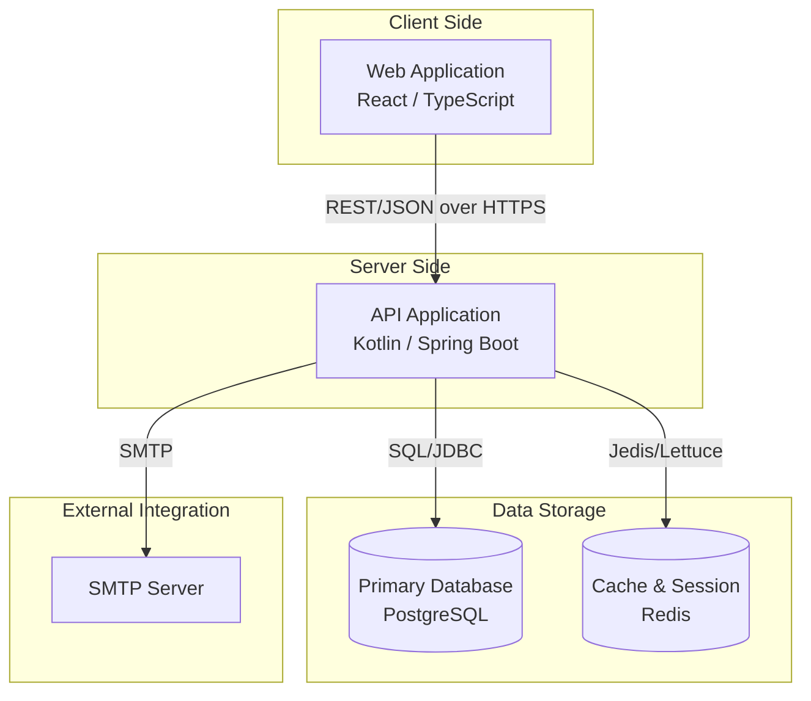
```mermaid
graph TB
    subgraph "Client Side"
        SPA[Web Application<br/>React / TypeScript]
    end

    subgraph "Server Side"
        API[API Application<br/>Kotlin / Spring Boot]
    end

    subgraph "Data Storage"
        DB[(Primary Database<br/>PostgreSQL)]
        CACHE[(Cache & Session<br/>Redis)]
    end

    SPA -->|REST/JSON over HTTPS| API
    API -->|SQL/JDBC| DB
    API -->|Jedis/Lettuce| CACHE
    
    subgraph "External Integration"
        SMTP[SMTP Server]
    end
    
    API -->|SMTP| SMTP
```

---

## 3. Component Diagram (C4 Level 3)

Focusing on the **API Application (Spring Boot)** container, this diagram shows the internal structural components and their interactions.

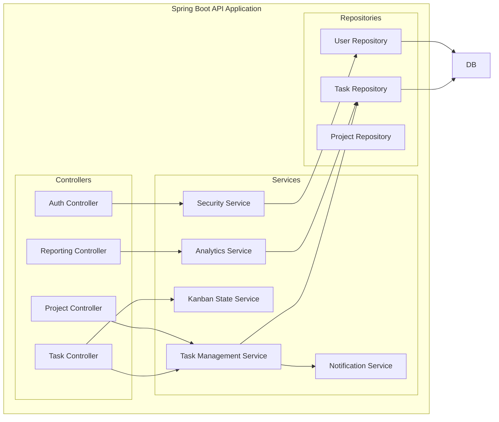
```mermaid
graph LR
    subgraph "Spring Boot API Application"
        direction TB
        
        subgraph "Controllers"
            AuthCtrl[Auth Controller]
            TaskCtrl[Task Controller]
            ProjCtrl[Project Controller]
            RepoCtrl[Reporting Controller]
        end

        subgraph "Services"
            AuthSvc[Security Service]
            TaskSvc[Task Management Service]
            KanbanSvc[Kanban State Service]
            NotifSvc[Notification Service]
            ReportSvc[Analytics Service]
        end

        subgraph "Repositories"
            TaskRepo[Task Repository]
            UserRepo[User Repository]
            ProjRepo[Project Repository]
        end
    end

    AuthCtrl --> AuthSvc
    TaskCtrl --> TaskSvc
    TaskCtrl --> KanbanSvc
    ProjCtrl --> TaskSvc
    RepoCtrl --> ReportSvc

    TaskSvc --> TaskRepo
    TaskSvc --> NotifSvc
    AuthSvc --> UserRepo
    ReportSvc --> TaskRepo
    
    TaskRepo --> DB
    UserRepo --> DB
```

---

## 4. Deployment Diagram

The system is designed for high availability using Docker containers orchestrated in a cloud environment.

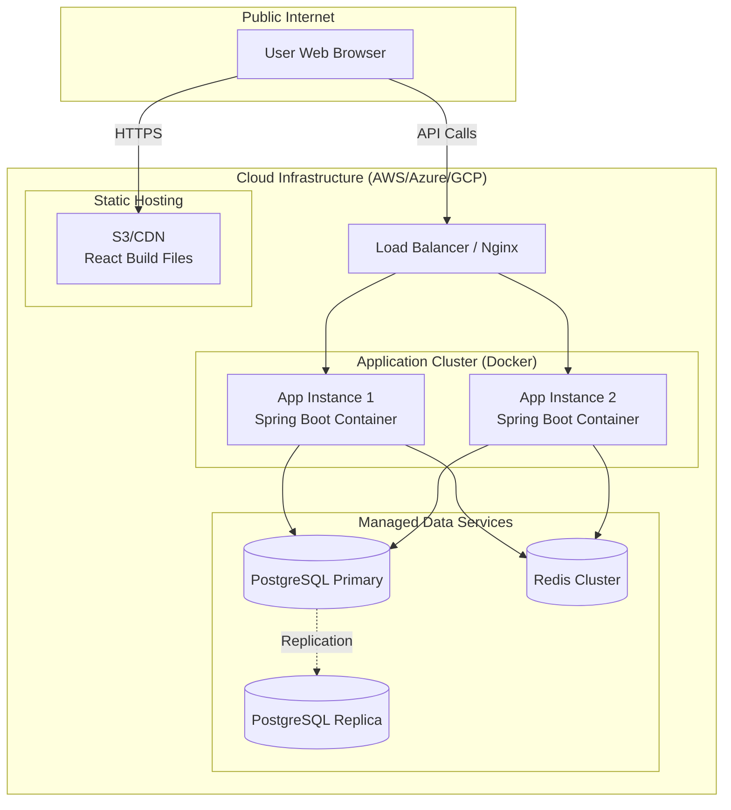
```mermaid
graph TB
    subgraph "Public Internet"
        UserBrowser[User Web Browser]
    end

    subgraph "Cloud Infrastructure (AWS/Azure/GCP)"
        LB[Load Balancer / Nginx]

        subgraph "Application Cluster (Docker)"
            direction LR
            Node1[App Instance 1<br/>Spring Boot Container]
            Node2[App Instance 2<br/>Spring Boot Container]
        end

        subgraph "Static Hosting"
            S3[S3/CDN<br/>React Build Files]
        end

        subgraph "Managed Data Services"
            direction TB
            RDS_P[(PostgreSQL Primary)]
            RDS_S[(PostgreSQL Replica)]
            RedisClus[(Redis Cluster)]
        end
    end

    UserBrowser -->|HTTPS| S3
    UserBrowser -->|API Calls| LB
    LB --> Node1
    LB --> Node2
    
    Node1 --> RDS_P
    Node2 --> RDS_P
    Node1 --> RedisClus
    Node2 --> RedisClus
    
    RDS_P -.->|Replication| RDS_S
```

---

## 5. Technology Stack Summary

| Layer | Technology | Rationale |
| :--- | :--- | :--- |
| **Frontend** | React 18, TypeScript, Tailwind CSS | High performance, type safety, and rapid UI development. |
| **Backend** | Kotlin 1.9, Spring Boot 3.x | Concise syntax, null-safety, and robust enterprise ecosystem. |
| **Database** | PostgreSQL 15 | Relational integrity, support for complex queries and JSONB. |
| **Caching** | Redis | Low-latency session management and query caching. |
| **Containerization** | Docker | Environment parity and simplified deployment pipelines. |
| **CI/CD** | GitHub Actions / Jenkins | Automated testing and deployment to staging/production. |

---

## 6. Architecture Decision Records (ADRs)

### ADR-001: Use of Kotlin for Backend Development
*   **Context:** The team needs a language that runs on the JVM but offers modern features to improve developer productivity and code safety.
*   **Decision:** We will use Kotlin instead of Java.
*   **Consequences:** 
    *   Reduced boilerplate code (Data classes, Extension functions).
    *   Enhanced null-safety reducing `NullPointerExceptions`.
    *   Full interoperability with existing Spring Boot libraries.

### ADR-002: Implementation of Kanban State Machine
*   **Context:** Task status transitions (e.g., *To Do* -> *In Progress* -> *Done*) must follow strict business rules to prevent invalid states.
*   **Decision:** Implement a formal State Machine pattern within the `KanbanSvc`.
*   **Consequences:** 
    *   Centralized logic for status transitions.
    *   Easier to implement "Transition Guards" (e.g., cannot move to *Done* if subtasks are open).
    *   Improved audit logging for status changes.

### ADR-003: Database Choice - PostgreSQL
*   **Context:** The system requires complex relationships between Users, Teams, Projects, and Tasks, with a need for ACID compliance.
*   **Decision:** Use PostgreSQL as the primary relational database.
*   **Consequences:** 
    *   Strong consistency for financial/time-tracking reporting.
    *   Ability to use JSONB for flexible task metadata without schema migrations.
    *   Excellent support for window functions used in reporting.

---

## 7. Data Model (ER Diagram)

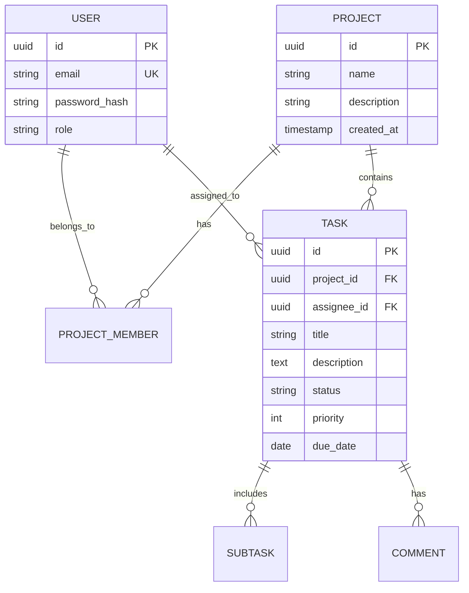
```mermaid
erDiagram
    USER ||--o{ PROJECT_MEMBER : belongs_to
    PROJECT ||--o{ PROJECT_MEMBER : has
    PROJECT ||--o{ TASK : contains
    USER ||--o{ TASK : assigned_to
    TASK ||--o{ SUBTASK : includes
    TASK ||--o{ COMMENT : has
    
    USER {
        uuid id PK
        string email UK
        string password_hash
        string role
    }
    
    PROJECT {
        uuid id PK
        string name
        string description
        timestamp created_at
    }
    
    TASK {
        uuid id PK
        uuid project_id FK
        uuid assignee_id FK
        string title
        text description
        string status
        int priority
        date due_date
    }
```

---

## 8. Traceability Matrix (Sample)

| Req ID | Description | Component | Test Case |
| :--- | :--- | :--- | :--- |
| **FR-101** | User must be able to move tasks on Kanban board | `KanbanSvc` | `TC-TASK-01: Verify status transition` |
| **FR-102** | System must generate project progress reports | `ReportSvc` | `TC-REP-05: Validate burn-down calculation` |
| **NFR-201** | API response time < 200ms for 95th percentile | `Redis Cache` | `TC-PERF-01: Load test API endpoints` |

---

## Data Model & ERD

# Data Model Documentation: Task Management System

This document outlines the data architecture for the Task Management System. It defines the structure, relationships, and constraints of the data to ensure integrity, scalability, and performance.

## 1. Entity-Relationship Diagram (ERD)

The following diagram illustrates the logical structure of the database. We utilize a relational model optimized for PostgreSQL.

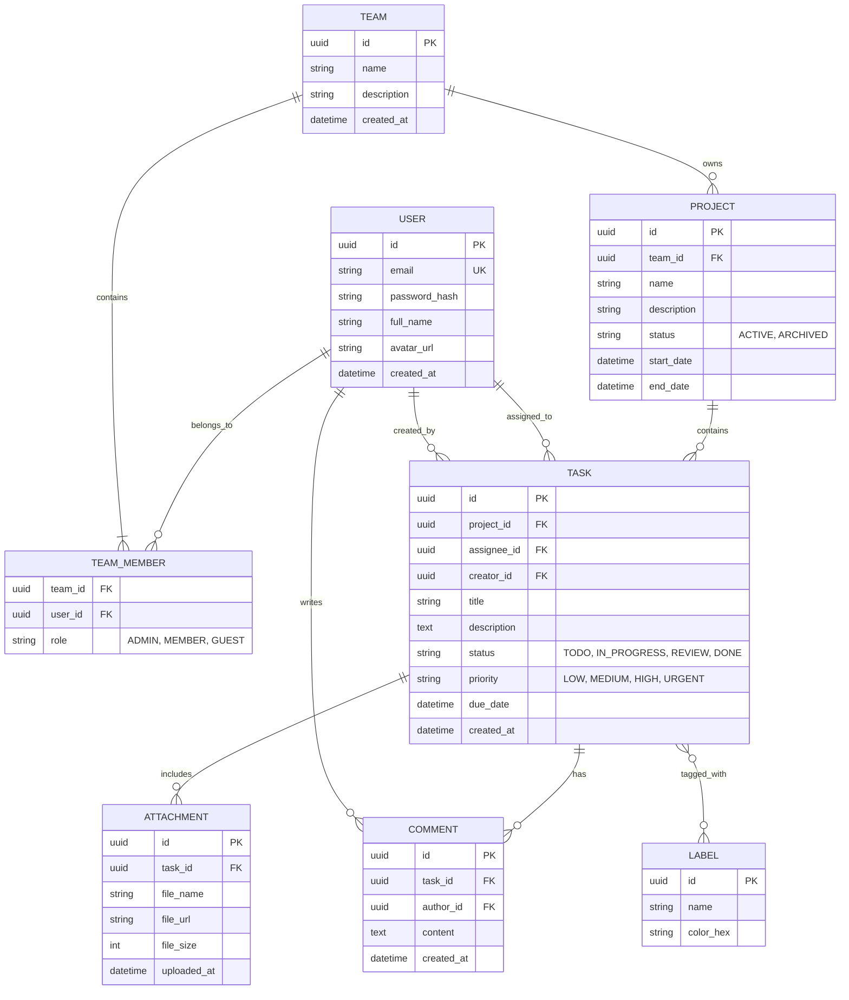
```mermaid
erDiagram
    USER ||--o{ TEAM_MEMBER : belongs_to
    TEAM ||--|{ TEAM_MEMBER : contains
    TEAM ||--o{ PROJECT : owns
    PROJECT ||--o{ TASK : contains
    USER ||--o{ TASK : "assigned_to"
    USER ||--o{ TASK : "created_by"
    TASK ||--o{ COMMENT : has
    USER ||--o{ COMMENT : writes
    TASK ||--o{ ATTACHMENT : includes
    TASK }o--o{ LABEL : tagged_with

    USER {
        uuid id PK
        string email UK
        string password_hash
        string full_name
        string avatar_url
        datetime created_at
    }

    TEAM {
        uuid id PK
        string name
        string description
        datetime created_at
    }

    TEAM_MEMBER {
        uuid team_id FK
        uuid user_id FK
        string role "ADMIN, MEMBER, GUEST"
    }

    PROJECT {
        uuid id PK
        uuid team_id FK
        string name
        string description
        string status "ACTIVE, ARCHIVED"
        datetime start_date
        datetime end_date
    }

    TASK {
        uuid id PK
        uuid project_id FK
        uuid assignee_id FK
        uuid creator_id FK
        string title
        text description
        string status "TODO, IN_PROGRESS, REVIEW, DONE"
        string priority "LOW, MEDIUM, HIGH, URGENT"
        datetime due_date
        datetime created_at
    }

    COMMENT {
        uuid id PK
        uuid task_id FK
        uuid author_id FK
        text content
        datetime created_at
    }

    LABEL {
        uuid id PK
        string name
        string color_hex
    }

    ATTACHMENT {
        uuid id PK
        uuid task_id FK
        string file_name
        string file_url
        int file_size
        datetime uploaded_at
    }
```

---

## 2. Entity Descriptions

### 2.1 User
*   **Purpose:** Represents an individual with access to the system.
*   **Attributes:** 
    *   `email`: Unique identifier for login.
    *   `password_hash`: BCrypt hashed password.
*   **Relationships:** One user can belong to multiple teams and be assigned many tasks.
*   **Indexes:** Unique index on `email`.

### 2.2 Project
*   **Purpose:** A high-level container for tasks, belonging to a specific team.
*   **Attributes:** 
    *   `status`: Controls visibility and editability.
*   **Relationships:** Belongs to one `Team`; contains many `Tasks`.
*   **Indexes:** Foreign key index on `team_id`.

### 2.3 Task
*   **Purpose:** The core unit of work.
*   **Attributes:** 
    *   `status`: Drives the Kanban board state.
    *   `priority`: Used for sorting and filtering.
*   **Relationships:** Linked to a `Project`, an `Assignee` (User), and a `Creator` (User).
*   **Indexes:** Composite index on `(project_id, status)` for board rendering performance.

---

## 3. Data Dictionary

| Entity | Attribute | Type | Constraints | Description |
| :--- | :--- | :--- | :--- | :--- |
| **User** | id | UUID | PK | Unique identifier (v4) |
| **User** | email | VARCHAR(255) | UK, NOT NULL | User's login email |
| **Project** | name | VARCHAR(100) | NOT NULL | Name of the project |
| **Project** | team_id | UUID | FK, NOT NULL | Reference to owning team |
| **Task** | title | VARCHAR(255) | NOT NULL | Short summary of the task |
| **Task** | status | ENUM | NOT NULL | TODO, IN_PROGRESS, REVIEW, DONE |
| **Task** | due_date | TIMESTAMP | NULLABLE | Deadline for task completion |
| **Comment** | content | TEXT | NOT NULL | The body of the comment |
| **Label** | color_hex | CHAR(7) | NOT NULL | Hex code for UI rendering (e.g., #FF5733) |

---

## 4. Data Flow Diagram (DFD)

This diagram shows how task data moves from creation through the lifecycle to reporting.

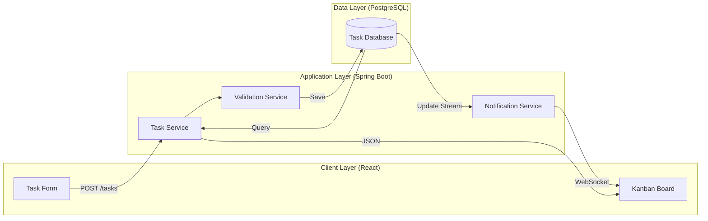
```mermaid
graph LR
    subgraph "Client Layer (React)"
        UI[Task Form]
        Board[Kanban Board]
    end

    subgraph "Application Layer (Spring Boot)"
        TS[Task Service]
        VS[Validation Service]
        NS[Notification Service]
    end

    subgraph "Data Layer (PostgreSQL)"
        DB[(Task Database)]
    end

    UI -->|POST /tasks| TS
    TS --> VS
    VS -->|Save| DB
    DB -->|Update Stream| NS
    NS -->|WebSocket| Board
    DB -->|Query| TS
    TS -->|JSON| Board
```

---

## 5. Data Validation Rules

To maintain data integrity, the following business rules are enforced at the database and application levels:

| Rule ID | Entity | Field | Validation Logic |
| :--- | :--- | :--- | :--- |
| **VAL-001** | Task | `due_date` | Must be greater than or equal to `created_at`. |
| **VAL-002** | Project | `end_date` | Must be after `start_date`. |
| **VAL-003** | Task | `status` | Transitions must follow: `TODO` -> `IN_PROGRESS` -> `REVIEW` -> `DONE`. |
| **VAL-004** | TeamMember | `role` | Must be one of: `ADMIN`, `MEMBER`, `GUEST`. |
| **VAL-005** | Label | `color_hex` | Must match regex `^#([A-Fa-f0-9]{6})$`. |

---

## 6. Data Migration Considerations

When migrating from legacy systems (e.g., Jira, Trello, or Excel), the following factors must be addressed:

1.  **ID Mapping:** Legacy integer IDs must be mapped to new UUIDs. A temporary mapping table is recommended during the ETL process.
2.  **User Reconciliation:** Match legacy users by email. If a user doesn't exist, create a "Pending Invite" state.
3.  **Status Mapping:** Legacy statuses (e.g., "In QA") must be mapped to the system's standard ENUM values (`REVIEW`).
4.  **Attachment Migration:** Files should be migrated to S3/Object Storage, and only the metadata (URLs) should be stored in the PostgreSQL `ATTACHMENT` table.
5.  **Audit Logs:** Historical "Created At" and "Updated At" timestamps must be preserved using database overrides during the migration script execution.
6.  **Data Cleansing:** Remove orphaned tasks (tasks without projects) and sanitize HTML/Markdown in task descriptions to prevent XSS.

---

## Flow Diagrams

# Task Management System: System Interaction Documentation

This document outlines the critical behavioral flows and logic of the Task Management System. It serves as a technical blueprint for developers and a process reference for stakeholders.

---

## 1. Sequence Diagrams (Critical User Journeys)

These diagrams illustrate the chronological interaction between system components for high-priority use cases.

### SD-001: Task Creation and Assignment
This flow covers the process of a Project Manager creating a task, assigning it to a developer, and the system triggering notifications.

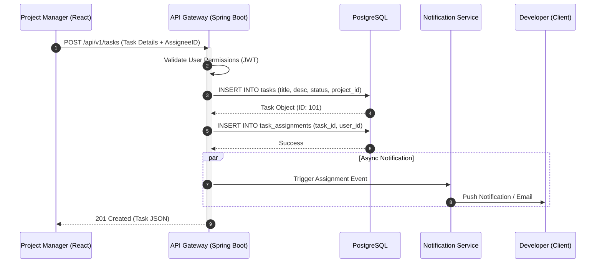
```mermaid
sequenceDiagram
    autonumber
    participant PM as Project Manager (React)
    participant API as API Gateway (Spring Boot)
    participant DB as PostgreSQL
    participant NS as Notification Service
    participant DEV as Developer (Client)

    PM->>API: POST /api/v1/tasks (Task Details + AssigneeID)
    activate API
    API->>API: Validate User Permissions (JWT)
    API->>DB: INSERT INTO tasks (title, desc, status, project_id)
    DB-->>API: Task Object (ID: 101)
    API->>DB: INSERT INTO task_assignments (task_id, user_id)
    DB-->>API: Success
    
    par Async Notification
        API->>NS: Trigger Assignment Event
        NS->>DEV: Push Notification / Email
    end

    API-->>PM: 201 Created (Task JSON)
    deactivate API
```

### SD-002: Real-time Kanban Board Update
Demonstrates how a task status change is propagated to other team members viewing the same project.

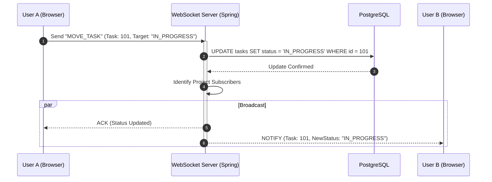
```mermaid
sequenceDiagram
    autonumber
    participant U1 as User A (Browser)
    participant WS as WebSocket Server (Spring)
    participant DB as PostgreSQL
    participant U2 as User B (Browser)

    U1->>WS: Send "MOVE_TASK" (Task: 101, Target: "IN_PROGRESS")
    activate WS
    WS->>DB: UPDATE tasks SET status = 'IN_PROGRESS' WHERE id = 101
    DB-->>WS: Update Confirmed
    
    WS->>WS: Identify Project Subscribers
    
    par Broadcast
        WS-->>U1: ACK (Status Updated)
        WS-->>U2: NOTIFY (Task: 101, NewStatus: "IN_PROGRESS")
    end
    deactivate WS
```

---

## 2. Activity Diagrams (Business Processes)

### AD-001: Project Onboarding & Team Setup
This diagram describes the logic for initializing a new project and inviting team members.

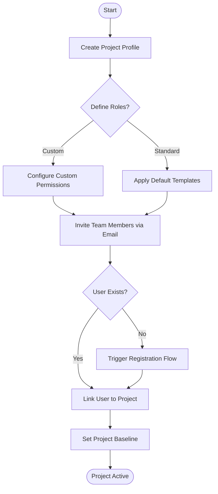
```mermaid
graph TD
    Start([Start]) --> CreateProj[Create Project Profile]
    CreateProj --> DefineRoles{Define Roles?}
    
    DefineRoles -->|Custom| CR[Configure Custom Permissions]
    DefineRoles -->|Standard| SR[Apply Default Templates]
    
    CR --> Invite[Invite Team Members via Email]
    SR --> Invite
    
    Invite --> Wait{User Exists?}
    Wait -->|Yes| Link[Link User to Project]
    Wait -->|No| Reg[Trigger Registration Flow]
    
    Reg --> Link
    Link --> Finalize[Set Project Baseline]
    Finalize --> End([Project Active])
```

---

## 3. State Diagrams (Entity Lifecycles)

### STD-001: Task Lifecycle (Kanban State Machine)
Tasks follow a strict transition logic to ensure data integrity and accurate reporting.

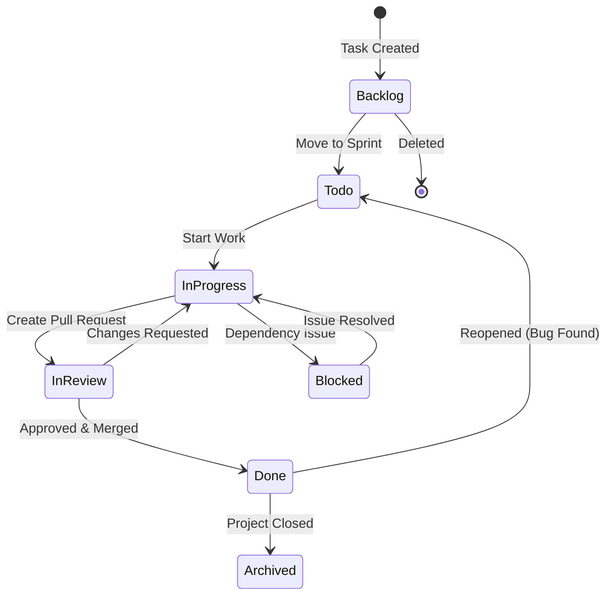
```mermaid
stateDiagram-v2
    [*] --> Backlog: Task Created
    Backlog --> Todo: Move to Sprint
    Todo --> InProgress: Start Work
    
    InProgress --> InReview: Create Pull Request
    InProgress --> Blocked: Dependency Issue
    
    Blocked --> InProgress: Issue Resolved
    
    InReview --> InProgress: Changes Requested
    InReview --> Done: Approved & Merged
    
    Done --> Archived: Project Closed
    Done --> Todo: Reopened (Bug Found)
    
    Backlog --> [*]: Deleted
```

---

## 4. Integration Flow Diagrams

### IFD-001: System Architecture & Data Flow
Shows how the React frontend interacts with the Spring Boot backend and external services.

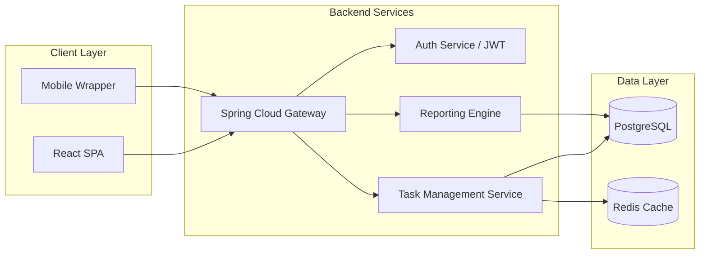
```mermaid
graph LR
    subgraph Client_Layer [Client Layer]
        React[React SPA]
        Mobile[Mobile Wrapper]
    end

    subgraph API_Layer [Backend Services]
        Gateway[Spring Cloud Gateway]
        Auth[Auth Service / JWT]
        TaskSvc[Task Management Service]
        ReportSvc[Reporting Engine]
    end

    subgraph Persistence_Layer [Data Layer]
        Postgres[(PostgreSQL)]
        Redis[(Redis Cache)]
    end

    React --> Gateway
    Mobile --> Gateway
    
    Gateway --> Auth
    Gateway --> TaskSvc
    Gateway --> ReportSvc
    
    TaskSvc --> Postgres
    TaskSvc --> Redis
    ReportSvc --> Postgres
```

---

## 5. Error Handling Flows

### EHF-001: API Exception Propagation
This flow ensures that backend errors are gracefully handled and presented to the user without exposing sensitive system internals.

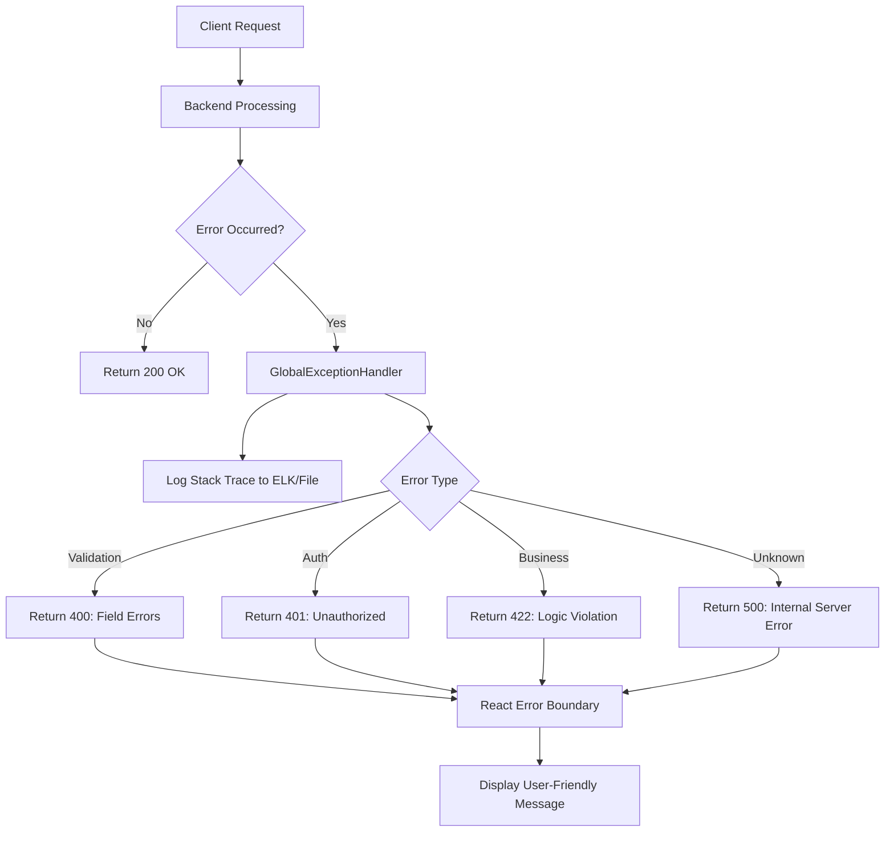
```mermaid
graph TD
    Req[Client Request] --> Process[Backend Processing]
    Process --> Check{Error Occurred?}
    
    Check -->|No| Success[Return 200 OK]
    Check -->|Yes| Catch[GlobalExceptionHandler]
    
    Catch --> Log[Log Stack Trace to ELK/File]
    
    Catch --> Type{Error Type}
    Type -->|Validation| VErr[Return 400: Field Errors]
    Type -->|Auth| AErr[Return 401: Unauthorized]
    Type -->|Business| BErr[Return 422: Logic Violation]
    Type -->|Unknown| UErr[Return 500: Internal Server Error]
    
    VErr --> UI[React Error Boundary]
    AErr --> UI
    BErr --> UI
    UErr --> UI
    
    UI --> Toast[Display User-Friendly Message]
```

---

## 6. Traceability Matrix (Summary)

| ID | Artifact Name | Primary Stakeholder | Purpose |
|:---|:---|:---|:---|
| **SD-001** | Task Creation | Developers | Define API & DB interaction |
| **SD-002** | Kanban Update | Developers/QA | Define WebSocket behavior |
| **AD-001** | Project Onboarding | Product Owners | Define business logic for growth |
| **STD-001**| Task Lifecycle | QA Engineers | Define valid test transitions |
| **IFD-001**| System Architecture| Architects | High-level infrastructure view |
| **EHF-001**| Error Handling | Developers | Standardize API responses |

---

## 7. Acceptance Criteria for Flows

1.  **Performance:** All sequence flows must complete within < 200ms for API responses (excluding external notifications).
2.  **Consistency:** Task state transitions must be validated server-side; unauthorized transitions (e.g., `Backlog` -> `Done`) must return a `422 Unprocessable Entity`.
3.  **Resilience:** If the Notification Service is down, the Task Creation (SD-001) must still succeed (Eventual Consistency).
4.  **Security:** Every request in the sequence diagrams must pass through the JWT Validation filter.

---

## Test Plan

# Test Plan Documentation: Task Management System

## 1. Test Strategy Overview

### 1.1 Testing Objectives
*   Ensure all functional requirements (FR) for task management, project tracking, and collaboration are met.
*   Validate system stability under expected load (100+ concurrent users).
*   Verify security protocols for user authentication and data isolation between teams.
*   Maintain high code quality through automated regression testing.

### 1.2 Testing Scope
*   **In-Scope:**
    *   User Authentication & Authorization (JWT/RBAC).
    *   Task Lifecycle (Creation, Update, Deletion, Status Transitions).
    *   Kanban Board functionality (Drag-and-drop, filtering).
    *   Project and Team management.
    *   Reporting dashboards.
    *   API Endpoints (REST).
*   **Out-of-Scope:**
    *   Third-party calendar integrations (Phase 2).
    *   Mobile native application testing (Web-only for Phase 1).
    *   Legacy data migration from external tools.

### 1.3 Testing Approach
The project follows a **Shift-Left** testing approach, integrating testing early in the SDLC via CI/CD pipelines.
*   **Automation First:** All API and Unit tests must be automated.
*   **Continuous Integration:** Tests trigger on every Pull Request to the `develop` branch.
*   **Manual Testing:** Reserved for Exploratory testing and UI/UX validation.

### 1.4 Entry & Exit Criteria
| Criterion | Entry Requirements | Exit Requirements |
| :--- | :--- | :--- |
| **Unit Testing** | Code is written and compiles. | 80% Line coverage; 0 compilation errors. |
| **Integration** | Unit tests pass; API modules deployed. | All endpoints return expected JSON schemas. |
| **System (E2E)** | Integration tests pass; UI deployed. | 100% of Critical/High TCs passed. |
| **UAT** | System testing complete; Staging ready. | Product Owner sign-off on all User Stories. |

---

## 2. Test Levels

### 2.1 Unit Testing
*   **Backend (Kotlin/Spring Boot):** JUnit 5, MockK, and AssertJ.
*   **Frontend (React):** Jest and React Testing Library.
*   **Target:** 85% branch coverage for business logic services.

### 2.2 Integration Testing
*   **API Testing:** Spring Boot `@SpringBootTest` with `Testcontainers` for real PostgreSQL instances.
*   **Contract Testing:** Verify frontend-backend communication using Spring Cloud Contract or Pact.

### 2.3 System Testing (End-to-End)
*   **Framework:** Playwright (Cross-browser testing: Chrome, Firefox, Safari).
*   **Scenarios:** Complete user journeys from registration to project completion.

### 2.4 Acceptance Testing (UAT)
*   **Criteria:** Validation against "Definition of Done" (DoD) for each Jira ticket.
*   **Environment:** Production-like Staging environment.

---

## 3. Test Case Catalog

| TC-ID | Requirement | Description | Steps | Expected Result | Priority |
|:---|:---|:---|:---|:---|:---|
| **TC-001** | FR-001 | Valid User Login | 1. Navigate to /login<br>2. Enter valid email/pass<br>3. Click Login | JWT stored; Redirect to Dashboard | High |
| **TC-002** | FR-002 | Create New Task | 1. Click "New Task"<br>2. Fill title/desc<br>3. Assign to user<br>4. Save | Task appears in "To Do" column | High |
| **TC-003** | FR-003 | Kanban Drag-and-Drop | 1. Select task in "To Do"<br>2. Drag to "In Progress" | Task status updates in DB; UI persists | Medium |
| **TC-004** | FR-004 | Team Data Isolation | 1. Login as User A (Team 1)<br>2. Attempt to access Project B (Team 2) | System returns 403 Forbidden | High |
| **TC-005** | FR-005 | Generate Project Report | 1. Navigate to Reports<br>2. Select Project<br>3. Click Export | PDF/CSV downloads with correct data | Low |

---

## 4. Test Coverage Matrix

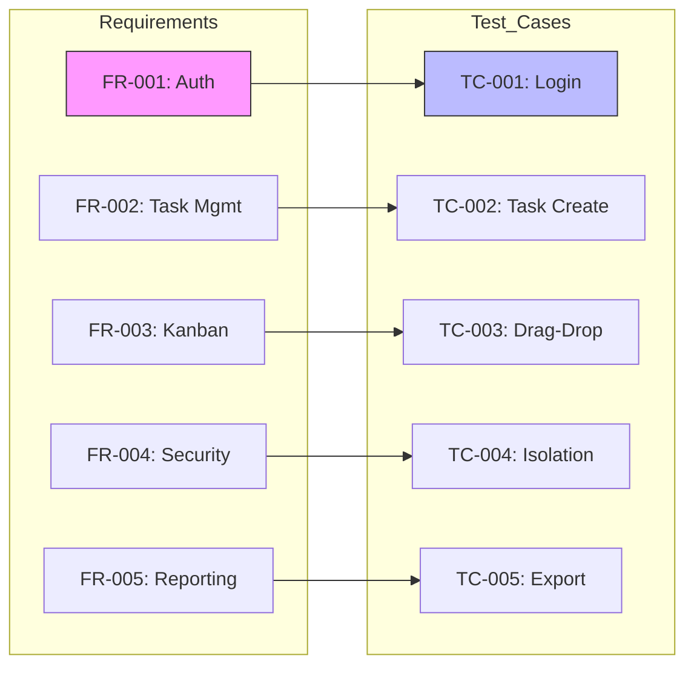
```mermaid
graph LR
    subgraph Requirements
        FR1[FR-001: Auth]
        FR2[FR-002: Task Mgmt]
        FR3[FR-003: Kanban]
        FR4[FR-004: Security]
        FR5[FR-005: Reporting]
    end

    subgraph Test_Cases
        TC1[TC-001: Login]
        TC2[TC-002: Task Create]
        TC3[TC-003: Drag-Drop]
        TC4[TC-004: Isolation]
        TC5[TC-005: Export]
    end

    FR1 --> TC1
    FR2 --> TC2
    FR3 --> TC3
    FR4 --> TC4
    FR5 --> TC5
    
    style FR1 fill:#f9f,stroke:#333
    style TC1 fill:#bbf,stroke:#333
```

---

## 5. Non-Functional Test Cases

### 5.1 Performance Testing
*   **Scenario:** 500 concurrent users performing "Task Update" operations.
*   **Tool:** JMeter / Gatling.
*   **Target:** Response time < 200ms for 95th percentile.

### 5.2 Security Testing
*   **SQL Injection:** Validate all input fields on Task Creation.
*   **XSS:** Ensure task descriptions are sanitized before rendering in React.
*   **Broken Auth:** Verify JWT expiration and invalidation on logout.

### 5.3 Usability Testing
*   **Responsiveness:** Verify Kanban board usability on 13" laptops vs 27" monitors.
*   **Accessibility:** Ensure WCAG 2.1 compliance (Alt tags, keyboard navigation).

---

## 6. Test Environment Requirements

### 6.1 Hardware & Software
*   **CI/CD:** GitHub Actions runners.
*   **Database:** PostgreSQL 15 (Dockerized).
*   **Browsers:** Chrome (Latest), Firefox, Edge.

### 6.2 Test Data Requirements
*   **Seeded Data:** A `data-seed.sql` script providing 5 projects, 10 users, and 50 tasks.
*   **Anonymization:** No real PII (Personally Identifiable Information) in test environments.

### 6.3 Tool Stack
*   **Defect Tracking:** Jira.
*   **API Testing:** Postman / RestAssured.
*   **Static Analysis:** SonarQube (Quality Gates).

---

## 7. Test Schedule

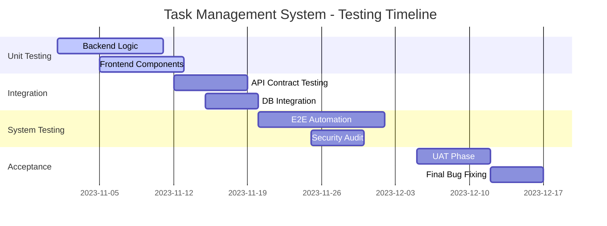
```mermaid
gantt
    title Task Management System - Testing Timeline
    dateFormat  YYYY-MM-DD
    section Unit Testing
    Backend Logic          :active, ut1, 2023-11-01, 10d
    Frontend Components    :active, ut2, 2023-11-05, 8d
    section Integration
    API Contract Testing   :int1, 2023-11-12, 7d
    DB Integration         :int2, 2023-11-15, 5d
    section System Testing
    E2E Automation         :st1, 2023-11-20, 12d
    Security Audit         :st2, 2023-11-25, 5d
    section Acceptance
    UAT Phase              :uat1, 2023-12-05, 7d
    Final Bug Fixing       :uat2, 2023-12-12, 5d
```

---

## 8. Risk Assessment

| Risk ID | Risk Description | Impact | Mitigation Strategy |
|:---|:---|:---|:---|
| **R-001** | Environment instability (Docker/Cloud) | High | Use Infrastructure as Code (Terraform) for reproducible environments. |
| **R-002** | Delayed API delivery impacts UI testing | Medium | Use WireMock to mock backend APIs for frontend development. |
| **R-003** | Sensitive data leak in logs | High | Implement log masking for credentials and PII in Spring Boot. |
| **R-004** | Scope creep in UAT | Medium | Strict adherence to signed-off User Stories; move new requests to Phase 2. |

---

## 9. Traceability Matrix (Summary)

| Requirement ID | Unit Test | Integration Test | System Test | Status |
|:---|:---|:---|:---|:---|
| FR-001 | AuthControllerTest | LoginIntegrationTest | E2E_Login_Flow | ✅ |
| FR-002 | TaskServiceTest | TaskRepositoryTest | E2E_Task_CRUD | ✅ |
| FR-003 | N/A | N/A | E2E_Kanban_DragDrop | 🔄 |
| FR-004 | SecurityConfigTest | RBAC_IntegrationTest | E2E_CrossTeam_Access | ✅ |

**Legend:** ✅ Passed | 🔄 In Progress | ❌ Failed | ⏳ Pending

---

## Phase Plan

# Development Phase Planning: Task Management System

This document outlines the strategic roadmap, resource allocation, and execution plan for the Task Management System. The plan follows an Agile-Scrum methodology within a structured phase-gate framework.

## 1. Project Timeline Overview

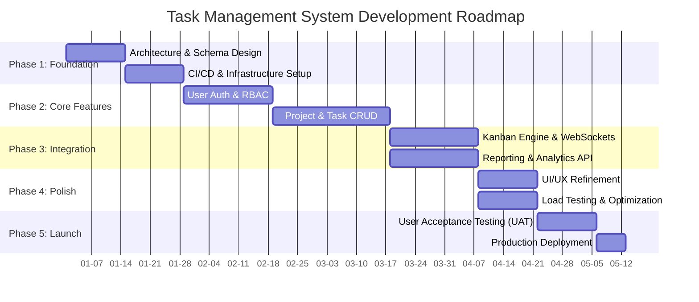
```mermaid
gantt
    title Task Management System Development Roadmap
    dateFormat  YYYY-MM-DD
    axisFormat  %m-%d
    
    section Phase 1: Foundation
    Architecture & Schema Design :a1, 2024-01-01, 14d
    CI/CD & Infrastructure Setup :a2, after a1, 14d
    
    section Phase 2: Core Features
    User Auth & RBAC            :b1, after a2, 21d
    Project & Task CRUD         :b2, after b1, 28d
    
    section Phase 3: Integration
    Kanban Engine & WebSockets  :c1, after b2, 21d
    Reporting & Analytics API   :c2, after b2, 21d
    
    section Phase 4: Polish
    UI/UX Refinement            :d1, after c1, 14d
    Load Testing & Optimization :d2, after c2, 14d
    
    section Phase 5: Launch
    User Acceptance Testing (UAT):e1, after d1, 14d
    Production Deployment       :e2, after e1, 7d
```

---

## 2. Phase Descriptions

### PH-01: Foundation (Weeks 1-4)
*   **Objectives:** Establish the technical backbone and development standards.
*   **Deliverables:** System Architecture Document (SAD), Dockerized local environment, PostgreSQL schema, CI/CD pipelines (GitHub Actions).
*   **Key Activities:** 
    *   Setting up Spring Boot (Kotlin) boilerplate.
    *   Configuring React (TypeScript) with Tailwind CSS.
    *   Database migration strategy (Flyway/Liquibase).
*   **Dependencies:** Finalized requirements and tech stack approval.
*   **Success Criteria:** "Hello World" end-to-end deployment successful in staging.
*   **Risks:** Scope creep in architecture. *Mitigation:* Stick to MVP requirements for the initial schema.

### PH-02: Core Features (Weeks 5-11)
*   **Objectives:** Implement the primary business logic for task and user management.
*   **Deliverables:** Auth Service, Project Management Module, Task Engine.
*   **Key Activities:** 
    *   JWT-based authentication.
    *   RESTful API development for Projects/Tasks.
    *   Frontend state management (Redux/Zustand).
*   **Dependencies:** Completion of PH-01.
*   **Success Criteria:** Users can create accounts, create projects, and assign tasks.
*   **Risks:** Complex RBAC (Role-Based Access Control) logic. *Mitigation:* Use Spring Security standard patterns.

### PH-03: Integration & Advanced Logic (Weeks 12-14)
*   **Objectives:** Enable real-time collaboration and data visualization.
*   **Deliverables:** Kanban Board (Drag-and-Drop), Real-time notifications, Exportable reports.
*   **Key Activities:** 
    *   WebSocket integration for live updates.
    *   Query optimization for reporting.
*   **Dependencies:** PH-02 Core APIs.
*   **Success Criteria:** Real-time task movement reflected across multiple client sessions.
*   **Risks:** WebSocket scalability. *Mitigation:* Implement Redis Pub/Sub for horizontal scaling.

---

## 3. Milestone Schedule

| ID | Milestone | Target Date | Deliverables | Success Criteria |
|:---|:---|:---|:---|:---|
| **MS-01** | Architecture Baseline | Week 4 | SAD, Docker Compose, CI/CD | 100% Infrastructure as Code (IaC) passing |
| **MS-02** | MVP Functional | Week 11 | Auth, Task CRUD, Project Logic | All FR-XXX requirements for MVP met |
| **MS-03** | Beta Release | Week 14 | Kanban Board, Reporting, UI | Zero "Critical" bugs in Jira |
| **MS-04** | Production Ready | Week 19 | Final Build, Documentation | UAT sign-off from Product Owner |

---

## 4. Resource Allocation

The team follows a cross-functional structure to minimize handoff delays.

| Role | Responsibility | Phase Focus |
|:---|:---|:---|
| **Project Manager** | Stakeholder comms, Sprint grooming | All Phases |
| **Backend Dev (2)** | Kotlin/Spring Boot, DB Design, Security | PH-01, PH-02, PH-03 |
| **Frontend Dev (2)** | React, Kanban UI, State Management | PH-02, PH-03, PH-04 |
| **QA Engineer** | Automated testing, UAT coordination | PH-02 onwards |
| **DevOps/SRE** | Cloud Infra, Docker, Monitoring | PH-01, PH-05 |

---

## 5. Sprint Planning Overview (MVP Cycle)

This overview covers the 8-week "Core Features" development cycle.

### Sprint 1: Identity & Access
*   **Goal:** Secure the platform and enable user profiles.
*   **Deliverables:** Login/Signup, JWT handling, User Profile UI.
*   **Capacity:** 80 Story Points.

### Sprint 2: Project Structure
*   **Goal:** Enable hierarchical organization of work.
*   **Deliverables:** Project CRUD, Team assignment, Workspace settings.
*   **Capacity:** 85 Story Points.

### Sprint 3: Task Lifecycle
*   **Goal:** Implement the core task engine.
*   **Deliverables:** Task creation, status transitions, file attachments.
*   **Capacity:** 80 Story Points.

### Sprint 4: Kanban & Collaboration
*   **Goal:** Visual task management.
*   **Deliverables:** Kanban board UI, Drag-and-drop logic, Commenting system.
*   **Capacity:** 75 Story Points (Lower due to UI complexity).

---

## 6. Release Plan

| Version | Type | Date | Key Features |
|:---|:---|:---|:---|
| **v0.1** | Alpha | Week 6 | Internal Auth & Project Setup |
| **v0.5** | Beta | Week 14 | Full Kanban, Reporting, Notifications |
| **v1.0** | GA | Week 19 | Performance tuned, Mobile responsive, Production-ready |

**Release Criteria:**
1.  **Code Quality:** >80% Unit Test coverage.
2.  **Security:** No "High" or "Critical" vulnerabilities in OWASP scan.
3.  **Performance:** Page load < 2s; API response < 200ms (95th percentile).

---

## 7. Risk Timeline

```mermaid
graph LR
    R1[Tech Debt Risk] -->|High| PH1(Foundation)
    R2[Scope Creep] -->|High| PH2(Core Features)
    R3[Integration Complexity] -->|Medium| PH3(Integration)
    R4[Performance Bottlenecks] -->|Medium| PH4(Polish)
    R5[Deployment Failure] -->|Low| PH5(Launch)

    style R1 fill:#f96,stroke:#333
    style R2 fill:#f96,stroke:#333
    style R5 fill:#9f6,stroke:#333
```

*   **Critical Window (Weeks 1-4):** Architecture decisions here are permanent. Mitigation: Senior Architect review of all ER diagrams.
*   **Critical Window (Weeks 17-18):** UAT feedback might trigger rework. Mitigation: Weekly stakeholder demos starting from Week 8 to ensure alignment.

---

## Project Data

Generated JSON file: task_management_system_project_data.json

```json
{
  "project_name" : "Task Management System",
  "description" : "A web-based application for managing tasks, projects, and team collaboration. \nThe system should support user authentication, task creation, assignment, \nstatus tracking (Kanban style), and basic reporting. \nIt needs to handle multiple projects and teams.",
  "created_date" : "2026-01-02T02:27:32.897222764",
  "epics" : [ {
    "id" : "EPIC-UC",
    "name" : "User Features",
    "description" : "Core user-facing functionality based on use cases",
    "priority" : "High",
    "status" : "Planned",
    "story_points" : 90
  }, {
    "id" : "EPIC-ARCH",
    "name" : "Architecture & Infrastructure",
    "description" : "Set up system architecture and infrastructure",
    "priority" : "High",
    "status" : "Planned",
    "story_points" : 21
  }, {
    "id" : "EPIC-TEST",
    "name" : "Quality Assurance",
    "description" : "Testing and quality assurance activities",
    "priority" : "High",
    "status" : "Planned",
    "story_points" : 13
  }, {
    "id" : "EPIC-101",
    "name" : "Epic EPIC-101",
    "description" : "Auto-extracted epic from analysis",
    "priority" : "Medium",
    "status" : "Planned",
    "story_points" : 13
  }, {
    "id" : "EPIC-102",
    "name" : "Epic EPIC-102",
    "description" : "Auto-extracted epic from analysis",
    "priority" : "Medium",
    "status" : "Planned",
    "story_points" : 13
  }, {
    "id" : "EPIC-103",
    "name" : "Epic EPIC-103",
    "description" : "Auto-extracted epic from analysis",
    "priority" : "Medium",
    "status" : "Planned",
    "story_points" : 13
  }, {
    "id" : "EPIC-104",
    "name" : "Epic EPIC-104",
    "description" : "Auto-extracted epic from analysis",
    "priority" : "Medium",
    "status" : "Planned",
    "story_points" : 13
  }, {
    "id" : "EPIC-105",
    "name" : "Epic EPIC-105",
    "description" : "Auto-extracted epic from analysis",
    "priority" : "Medium",
    "status" : "Planned",
    "story_points" : 13
  } ],
  "releases" : [ {
    "id" : "REL-1",
    "name" : "MVP Release",
    "version" : "1.0.0",
    "target_date" : "2026-01-30",
    "description" : "Minimum Viable Product release with core functionality",
    "epic_ids" : [ "EPIC-UC", "EPIC-ARCH", "EPIC-TEST", "EPIC-101" ],
    "status" : "Planned"
  }, {
    "id" : "REL-2",
    "name" : "Feature Complete Release",
    "version" : "1.1.0",
    "target_date" : "2026-02-27",
    "description" : "Full feature release with all planned functionality",
    "epic_ids" : [ "EPIC-UC", "EPIC-ARCH", "EPIC-TEST", "EPIC-101", "EPIC-102", "EPIC-103", "EPIC-104", "EPIC-105" ],
    "status" : "Planned"
  } ],
  "sprints" : [ {
    "id" : "SPRINT-1",
    "name" : "Sprint 1",
    "number" : 1,
    "start_date" : "2026-01-02",
    "end_date" : "2026-01-16",
    "goals" : [ "Complete sprint 1 deliverables" ],
    "capacity_points" : 40,
    "task_ids" : [ "TASK-101", "TASK-102", "TASK-103", "TASK-301", "TASK-302", "TASK-303", "TASK-501" ],
    "status" : "Planned"
  }, {
    "id" : "SPRINT-2",
    "name" : "Sprint 2",
    "number" : 2,
    "start_date" : "2026-01-16",
    "end_date" : "2026-01-30",
    "goals" : [ "Complete sprint 2 deliverables" ],
    "capacity_points" : 40,
    "task_ids" : [ "TASK-201", "TASK-502", "TASK-202", "TASK-304", "TASK-203", "TASK-305", "TASK-204" ],
    "status" : "Planned"
  }, {
    "id" : "SPRINT-3",
    "name" : "Sprint 3",
    "number" : 3,
    "start_date" : "2026-01-30",
    "end_date" : "2026-02-13",
    "goals" : [ "Complete sprint 3 deliverables" ],
    "capacity_points" : 40,
    "task_ids" : [ "TASK-306", "TASK-307", "TASK-401", "TASK-402", "TASK-403", "TASK-503", "TASK-504" ],
    "status" : "Planned"
  }, {
    "id" : "SPRINT-4",
    "name" : "Sprint 4",
    "number" : 4,
    "start_date" : "2026-02-13",
    "end_date" : "2026-02-27",
    "goals" : [ "Complete sprint 4 deliverables" ],
    "capacity_points" : 40,
    "task_ids" : [ ],
    "status" : "Planned"
  } ],
  "tasks" : [ {
    "id" : "TASK-101",
    "title" : "Task TASK-101",
    "description" : "Auto-extracted task from analysis",
    "type" : "task",
    "epic_id" : "EPIC-UC",
    "sprint_id" : "SPRINT-1",
    "priority" : "Medium",
    "story_points" : 3,
    "status" : "Backlog",
    "acceptance_criteria" : [ "Task completed successfully" ],
    "labels" : [ "auto-generated" ]
  }, {
    "id" : "TASK-102",
    "title" : "Task TASK-102",
    "description" : "Auto-extracted task from analysis",
    "type" : "task",
    "epic_id" : "EPIC-UC",
    "sprint_id" : "SPRINT-1",
    "priority" : "Medium",
    "story_points" : 3,
    "status" : "Backlog",
    "acceptance_criteria" : [ "Task completed successfully" ],
    "labels" : [ "auto-generated" ]
  }, {
    "id" : "TASK-103",
    "title" : "Task TASK-103",
    "description" : "Auto-extracted task from analysis",
    "type" : "task",
    "epic_id" : "EPIC-UC",
    "sprint_id" : "SPRINT-1",
    "priority" : "Medium",
    "story_points" : 3,
    "status" : "Backlog",
    "acceptance_criteria" : [ "Task completed successfully" ],
    "labels" : [ "auto-generated" ]
  }, {
    "id" : "TASK-301",
    "title" : "Task TASK-301",
    "description" : "Auto-extracted task from analysis",
    "type" : "task",
    "epic_id" : "EPIC-UC",
    "sprint_id" : "SPRINT-1",
    "priority" : "Medium",
    "story_points" : 3,
    "status" : "Backlog",
    "acceptance_criteria" : [ "Task completed successfully" ],
    "labels" : [ "auto-generated" ]
  }, {
    "id" : "TASK-302",
    "title" : "Task TASK-302",
    "description" : "Auto-extracted task from analysis",
    "type" : "task",
    "epic_id" : "EPIC-UC",
    "sprint_id" : "SPRINT-1",
    "priority" : "Medium",
    "story_points" : 3,
    "status" : "Backlog",
    "acceptance_criteria" : [ "Task completed successfully" ],
    "labels" : [ "auto-generated" ]
  }, {
    "id" : "TASK-303",
    "title" : "Task TASK-303",
    "description" : "Auto-extracted task from analysis",
    "type" : "task",
    "epic_id" : "EPIC-UC",
    "sprint_id" : "SPRINT-1",
    "priority" : "Medium",
    "story_points" : 3,
    "status" : "Backlog",
    "acceptance_criteria" : [ "Task completed successfully" ],
    "labels" : [ "auto-generated" ]
  }, {
    "id" : "TASK-501",
    "title" : "Task TASK-501",
    "description" : "Auto-extracted task from analysis",
    "type" : "task",
    "epic_id" : "EPIC-UC",
    "sprint_id" : "SPRINT-1",
    "priority" : "Medium",
    "story_points" : 3,
    "status" : "Backlog",
    "acceptance_criteria" : [ "Task completed successfully" ],
    "labels" : [ "auto-generated" ]
  }, {
    "id" : "TASK-201",
    "title" : "Task TASK-201",
    "description" : "Auto-extracted task from analysis",
    "type" : "task",
    "epic_id" : "EPIC-UC",
    "sprint_id" : "SPRINT-2",
    "priority" : "Medium",
    "story_points" : 3,
    "status" : "Backlog",
    "acceptance_criteria" : [ "Task completed successfully" ],
    "labels" : [ "auto-generated" ]
  }, {
    "id" : "TASK-502",
    "title" : "Task TASK-502",
    "description" : "Auto-extracted task from analysis",
    "type" : "task",
    "epic_id" : "EPIC-UC",
    "sprint_id" : "SPRINT-2",
    "priority" : "Medium",
    "story_points" : 3,
    "status" : "Backlog",
    "acceptance_criteria" : [ "Task completed successfully" ],
    "labels" : [ "auto-generated" ]
  }, {
    "id" : "TASK-202",
    "title" : "Task TASK-202",
    "description" : "Auto-extracted task from analysis",
    "type" : "task",
    "epic_id" : "EPIC-UC",
    "sprint_id" : "SPRINT-2",
    "priority" : "Medium",
    "story_points" : 3,
    "status" : "Backlog",
    "acceptance_criteria" : [ "Task completed successfully" ],
    "labels" : [ "auto-generated" ]
  }, {
    "id" : "TASK-304",
    "title" : "Task TASK-304",
    "description" : "Auto-extracted task from analysis",
    "type" : "task",
    "epic_id" : "EPIC-UC",
    "sprint_id" : "SPRINT-2",
    "priority" : "Medium",
    "story_points" : 3,
    "status" : "Backlog",
    "acceptance_criteria" : [ "Task completed successfully" ],
    "labels" : [ "auto-generated" ]
  }, {
    "id" : "TASK-203",
    "title" : "Task TASK-203",
    "description" : "Auto-extracted task from analysis",
    "type" : "task",
    "epic_id" : "EPIC-UC",
    "sprint_id" : "SPRINT-2",
    "priority" : "Medium",
    "story_points" : 3,
    "status" : "Backlog",
    "acceptance_criteria" : [ "Task completed successfully" ],
    "labels" : [ "auto-generated" ]
  }, {
    "id" : "TASK-305",
    "title" : "Task TASK-305",
    "description" : "Auto-extracted task from analysis",
    "type" : "task",
    "epic_id" : "EPIC-UC",
    "sprint_id" : "SPRINT-2",
    "priority" : "Medium",
    "story_points" : 3,
    "status" : "Backlog",
    "acceptance_criteria" : [ "Task completed successfully" ],
    "labels" : [ "auto-generated" ]
  }, {
    "id" : "TASK-204",
    "title" : "Task TASK-204",
    "description" : "Auto-extracted task from analysis",
    "type" : "task",
    "epic_id" : "EPIC-UC",
    "sprint_id" : "SPRINT-2",
    "priority" : "Medium",
    "story_points" : 3,
    "status" : "Backlog",
    "acceptance_criteria" : [ "Task completed successfully" ],
    "labels" : [ "auto-generated" ]
  }, {
    "id" : "TASK-306",
    "title" : "Task TASK-306",
    "description" : "Auto-extracted task from analysis",
    "type" : "task",
    "epic_id" : "EPIC-UC",
    "sprint_id" : "SPRINT-3",
    "priority" : "Medium",
    "story_points" : 3,
    "status" : "Backlog",
    "acceptance_criteria" : [ "Task completed successfully" ],
    "labels" : [ "auto-generated" ]
  }, {
    "id" : "TASK-307",
    "title" : "Task TASK-307",
    "description" : "Auto-extracted task from analysis",
    "type" : "task",
    "epic_id" : "EPIC-UC",
    "sprint_id" : "SPRINT-3",
    "priority" : "Medium",
    "story_points" : 3,
    "status" : "Backlog",
    "acceptance_criteria" : [ "Task completed successfully" ],
    "labels" : [ "auto-generated" ]
  }, {
    "id" : "TASK-401",
    "title" : "Task TASK-401",
    "description" : "Auto-extracted task from analysis",
    "type" : "task",
    "epic_id" : "EPIC-UC",
    "sprint_id" : "SPRINT-3",
    "priority" : "Medium",
    "story_points" : 3,
    "status" : "Backlog",
    "acceptance_criteria" : [ "Task completed successfully" ],
    "labels" : [ "auto-generated" ]
  }, {
    "id" : "TASK-402",
    "title" : "Task TASK-402",
    "description" : "Auto-extracted task from analysis",
    "type" : "task",
    "epic_id" : "EPIC-UC",
    "sprint_id" : "SPRINT-3",
    "priority" : "Medium",
    "story_points" : 3,
    "status" : "Backlog",
    "acceptance_criteria" : [ "Task completed successfully" ],
    "labels" : [ "auto-generated" ]
  }, {
    "id" : "TASK-403",
    "title" : "Task TASK-403",
    "description" : "Auto-extracted task from analysis",
    "type" : "task",
    "epic_id" : "EPIC-UC",
    "sprint_id" : "SPRINT-3",
    "priority" : "Medium",
    "story_points" : 3,
    "status" : "Backlog",
    "acceptance_criteria" : [ "Task completed successfully" ],
    "labels" : [ "auto-generated" ]
  }, {
    "id" : "TASK-503",
    "title" : "Task TASK-503",
    "description" : "Auto-extracted task from analysis",
    "type" : "task",
    "epic_id" : "EPIC-UC",
    "sprint_id" : "SPRINT-3",
    "priority" : "Medium",
    "story_points" : 3,
    "status" : "Backlog",
    "acceptance_criteria" : [ "Task completed successfully" ],
    "labels" : [ "auto-generated" ]
  }, {
    "id" : "TASK-504",
    "title" : "Task TASK-504",
    "description" : "Auto-extracted task from analysis",
    "type" : "task",
    "epic_id" : "EPIC-UC",
    "sprint_id" : "SPRINT-3",
    "priority" : "Medium",
    "story_points" : 3,
    "status" : "Backlog",
    "acceptance_criteria" : [ "Task completed successfully" ],
    "labels" : [ "auto-generated" ]
  } ],
  "milestones" : [ ],
  "dependencies" : [ ]
}
```

---


## Document Generation Complete

**Total Time:** 118.008s

**Completed:** 2026-01-02 02:27:32
