# Software Design Document: Task Management System

**System:** A web-based application for managing tasks, projects, and team collaboration. 
The system should support user authentication, task creation, assignment, 
status tracking (Kanban style), and basic reporting. 
It needs to handle multiple projects and teams.

**Generated:** 2026-01-09 13:56:10

---

## Use Cases & Actors

# Task Management System: Use Case Documentation

This document outlines the functional requirements and user interactions for the Task Management System (TMS). It serves as a foundational reference for developers, testers, and project stakeholders.

---

## 1. Actor Identification

The following actors interact with the Task Management System. Actors represent roles played by human users or external systems.

| Actor ID | Actor Name | Description | Primary Goals |
|:---|:---|:---|:---|
| **ACT-01** | **System Administrator** | Manages the global system configuration and user accounts. | Maintain system uptime, manage licenses, and handle global security. |
| **ACT-02** | **Project Manager (PM)** | Responsible for project planning, resource allocation, and reporting. | Create projects, monitor progress, and manage team compositions. |
| **ACT-03** | **Team Member** | Individual contributors (e.g., Developers, Designers) who execute tasks. | Update task progress, collaborate via comments, and track time. |
| **ACT-04** | **Guest/Stakeholder** | External parties with limited visibility. | View project status and high-level reports without editing rights. |
| **ACT-05** | **Notification Service** | External system (SMTP/Push) triggered by system events. | Deliver timely alerts to users regarding task changes. |
| **ACT-06** | **Auth Provider** | External Identity Provider (e.g., Okta, Google OAuth). | Authenticate user credentials. |

### Actor Relationships
- **Team Member** is the base role for internal users.
- **Project Manager** inherits all capabilities of a Team Member but adds administrative control over specific projects.
- **System Administrator** has global permissions overriding project-level restrictions.

---

## 2. Use Case Catalog

### UC-101: Create New Task
- **Primary Actor:** Project Manager, Team Member
- **Preconditions:** User is authenticated and has "Write" access to the specific project.
- **Main Success Scenario:**
    1. User navigates to the Project Board.
    2. User clicks the "Create Task" button.
    3. System displays the Task Creation Form.
    4. User enters Task Title, Description, Priority, and Due Date.
    5. User selects an Assignee from the project team list.
    6. User submits the form.
    7. System validates data, saves the task, and updates the Kanban board.
    8. System triggers a notification to the Assignee.
- **Alternative Flows:**
    - *A1: Missing Required Fields:* System highlights missing fields and prevents submission.
    - *A2: Invalid Assignee:* If the assignee is removed from the project during creation, system prompts for a new selection.
- **Postconditions:** Task is visible on the board; Assignee is notified.
- **Business Rules:** 
    - Tasks must have a unique ID within the project.
    - Due dates cannot be in the past.

### UC-102: Update Task Status (Kanban Move)
- **Primary Actor:** Team Member, Project Manager
- **Preconditions:** Task exists and is visible on the Kanban board.
- **Main Success Scenario:**
    1. User selects a task card on the Kanban board.
    2. User drags the card from the current column (e.g., "In Progress") to a new column (e.g., "Review").
    3. System updates the `status` attribute of the task.
    4. System records the transition in the Task Audit Log.
    5. System checks if the new status triggers any automation (e.g., moving to "Done" closes the task).
- **Alternative Flows:**
    - *A1: Transition Not Allowed:* If workflow rules restrict moving from "Backlog" directly to "Done," the system snaps the card back and shows an error.
- **Postconditions:** Task status is updated; Board view is refreshed for all concurrent users via WebSockets.
- **Business Rules:**
    - Only the Assignee or a PM can move a task to "Done."

### UC-103: Generate Project Productivity Report
- **Primary Actor:** Project Manager
- **Preconditions:** Project contains historical task data and completed items.
- **Main Success Scenario:**
    1. User navigates to the "Reports" section.
    2. User selects "Productivity Report" and defines a date range.
    3. System aggregates data: Velocity, Lead Time, and Cycle Time.
    4. System generates a visual chart (Burn-down or Cumulative Flow).
    5. User selects "Export as PDF."
    6. System generates and downloads the file.
- **Alternative Flows:**
    - *A1: Insufficient Data:* If the date range has no completed tasks, the system displays a "No Data Available" message.
- **Postconditions:** Report is displayed/downloaded.
- **Business Rules:**
    - Reports must exclude tasks marked as "Deleted" or "Archived."

### UC-104: Manage Project Team
- **Primary Actor:** Project Manager, System Administrator
- **Preconditions:** Project exists.
- **Main Success Scenario:**
    1. User opens "Project Settings" -> "Team Management."
    2. User searches for a user by email or name.
    3. User selects a role for the new member (e.g., Contributor, Viewer).
    4. User clicks "Add to Project."
    5. System updates project permissions and sends an invitation email.
- **Alternative Flows:**
    - *A1: User Not Found:* System offers to send an external email invitation to join the platform.
- **Postconditions:** User gains access to project resources.
- **Business Rules:**
    - A project must have at least one Project Manager at all times.

---

## 3. Use Case Diagram

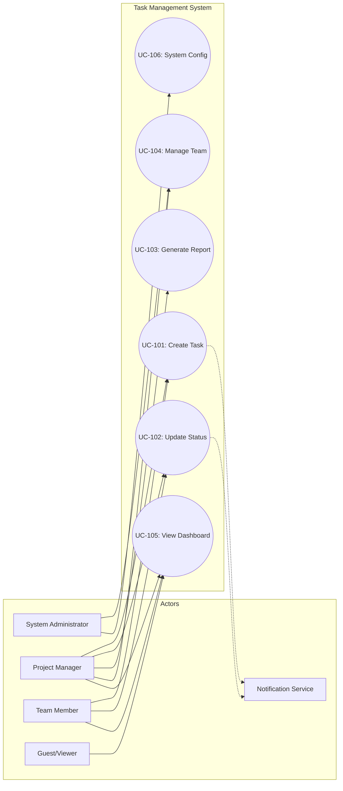

---

## 4. Actor-Use Case Matrix

This matrix provides a quick reference for access control and participation.

| Use Case ID | Use Case Name | Admin | Project Manager | Team Member | Guest |
|:---:|:---|:---:|:---:|:---:|:---:|
| **UC-101** | Create New Task | | **P** | **P** | |
| **UC-102** | Update Task Status | | **P** | **P** | |
| **UC-103** | Generate Project Report | | **P** | | |
| **UC-104** | Manage Project Team | **P** | **P** | | |
| **UC-105** | View Dashboard | **S** | **P** | **P** | **P** |
| **UC-106** | System Configuration | **P** | | | |

**Legend:**
- **P**: Primary Actor (Initiates the process)
- **S**: Secondary Actor (Participates or views results)
- **Empty**: No Access

---

## 5. Traceability & Business Rules Summary

| Rule ID | Description | Related Use Case |
|:---|:---|:---|
| **BR-001** | **Role Hierarchy:** PMs can perform any action a Team Member can. | All |
| **BR-002** | **Audit Trail:** Every status change must be logged with a timestamp and User ID. | UC-102 |
| **BR-003** | **Data Integrity:** Tasks cannot be deleted if they have logged time entries. | UC-101 |
| **BR-004** | **Privacy:** Guests cannot see "Internal Comments" on tasks. | UC-105 |

---

## Requirements Specification

# Software Requirements Specification (SRS)
## Project: Task Management System (TMS)

---

## 1. Functional Requirements (FR)

The functional requirements define the specific behaviors and services the Task Management System must provide.

| FR-ID | Description | Priority | Source | Acceptance Criteria |
| :--- | :--- | :--- | :--- | :--- |
| **FR-101** | **User Authentication** | Must Have | UC-001 | Users must be able to sign up, log in, and reset passwords via email. Supports OAuth2 (Google/GitHub). |
| **FR-102** | **Role-Based Access Control (RBAC)** | Must Have | UC-001 | System must distinguish between Admin, Project Manager, and Contributor roles with specific permissions. |
| **FR-201** | **Project Creation & Management** | Must Have | UC-002 | Users can create projects with a title, description, start/end dates, and unique identifiers. |
| **FR-202** | **Team Assignment** | Must Have | UC-002 | Project Managers can invite users to projects and assign them to specific teams. |
| **FR-301** | **Task CRUD Operations** | Must Have | UC-003 | Users can Create, Read, Update, and Delete tasks with attributes: Title, Description, Priority, Status, Assignee, and Due Date. |
| **FR-302** | **Kanban Board Visualization** | Must Have | UC-003 | Tasks must be displayed in columns (To Do, In Progress, Review, Done) with drag-and-drop status updates. |
| **FR-303** | **Task Comments & Attachments** | Should Have | UC-003 | Users can add comments and upload files (up to 10MB) to specific tasks. |
| **FR-401** | **Real-time Notifications** | Should Have | UC-004 | System sends in-app and email notifications for task assignments, mentions, and approaching deadlines. |
| **FR-501** | **Project Dashboard & Reporting** | Should Have | UC-005 | Generate visual reports (Burn-down charts, Velocity) and export project summaries to PDF/CSV. |
| **FR-601** | **Global Search** | Could Have | UC-006 | A search bar to find tasks, projects, or users across the entire workspace using keywords. |

---

## 2. Non-Functional Requirements (NFR)

Non-functional requirements define the system's quality attributes and constraints.

### 2.1 Performance
*   **NFR-P01 (Latency):** API response time for standard CRUD operations must be < 200ms for 95% of requests.
*   **NFR-P02 (Concurrency):** The system must support at least 500 concurrent users per project instance without performance degradation.

### 2.2 Scalability
*   **NFR-S01 (Horizontal Scaling):** The application tier must be stateless to allow horizontal scaling via Kubernetes.
*   **NFR-S02 (Data Volume):** The database must be optimized to handle up to 1,000,000 active tasks across all projects.

### 2.3 Security
*   **NFR-SEC01 (Encryption):** All data must be encrypted at rest (AES-256) and in transit (TLS 1.2+).
*   **NFR-SEC02 (MFA):** Multi-Factor Authentication must be available for all administrative accounts.
*   **NFR-SEC03 (Audit Logs):** All destructive actions (Delete Project/Task) must be logged with user ID and timestamp.

### 2.4 Reliability
*   **NFR-R01 (Uptime):** The system shall maintain 99.9% availability (SLA).
*   **NFR-R02 (Backup):** Automated database backups must occur every 6 hours with a Recovery Point Objective (RPO) of 6 hours.

### 2.5 Usability
*   **NFR-U01 (Accessibility):** The UI must comply with WCAG 2.1 Level AA standards.
*   **NFR-U02 (Responsiveness):** The web application must be fully functional on desktop, tablet, and mobile browsers (Responsive Design).

### 2.6 Maintainability
*   **NFR-M01 (Documentation):** All API endpoints must be documented using OpenAPI (Swagger) 3.0.
*   **NFR-M02 (Test Coverage):** Minimum 80% unit test coverage for backend business logic.

---

## 3. Requirements Traceability Matrix (RTM)

This matrix ensures that every requirement is linked to a use case and has a corresponding test case for validation.

| Use Case ID | Requirement ID | Test Case ID | Status |
| :--- | :--- | :--- | :--- |
| **UC-001: User Auth** | FR-101, FR-102 | TC-101, TC-102 | Pending |
| **UC-002: Project Mgmt** | FR-201, FR-202 | TC-201, TC-202 | Pending |
| **UC-003: Task Mgmt** | FR-301, FR-302, FR-303 | TC-301, TC-302 | Pending |
| **UC-004: Notifications** | FR-401 | TC-401 | Pending |
| **UC-005: Reporting** | FR-501 | TC-501 | Pending |
| **UC-006: Search** | FR-601 | TC-601 | Pending |
| **N/A (System Quality)** | NFR-P01, NFR-SEC01 | TC-PERF-01, TC-SEC-01 | Pending |

---

## 4. Requirements Dependency Diagram

The following diagram illustrates the logical dependencies between functional and non-functional requirements.

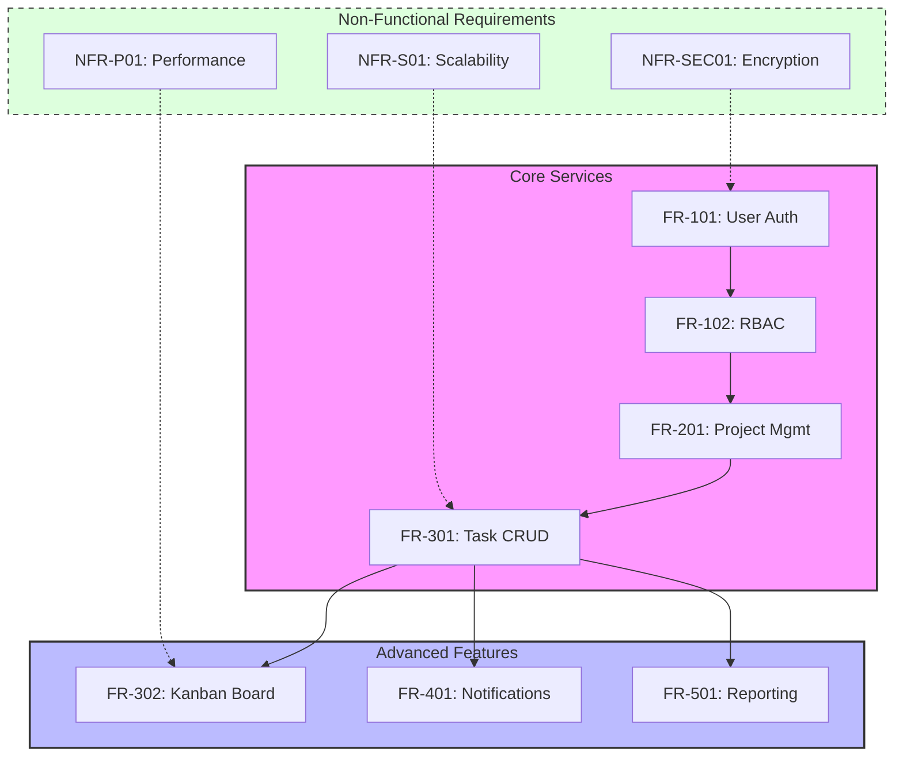

---

## 5. Data Model (ER Diagram)

To support the requirements above, the following data structure is proposed.

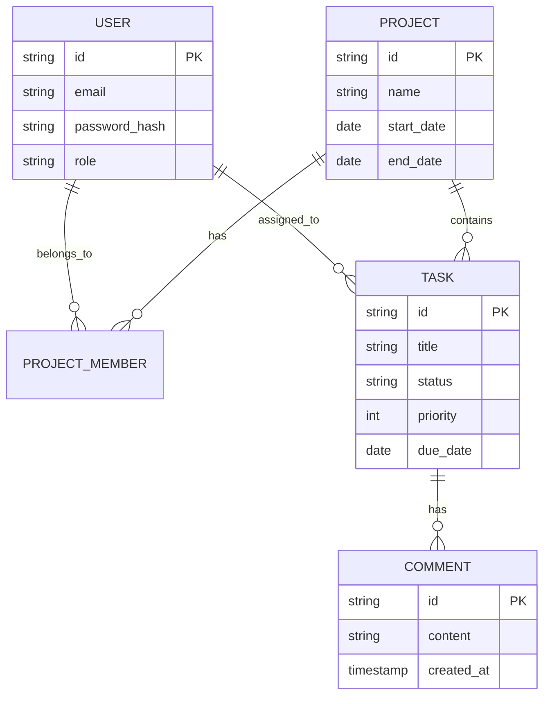

---

## 6. Task State Machine

Defines the lifecycle of a task as per **FR-302**.

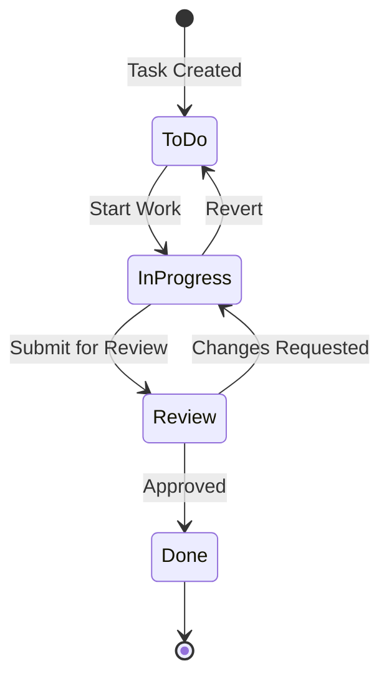

---

## 7. System Architecture Overview

High-level architecture to satisfy **NFR-S01** and **NFR-P01**.

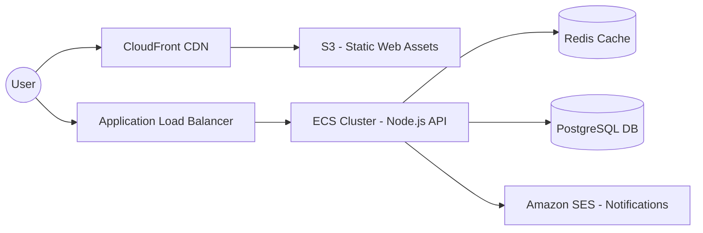

---

## System Architecture

# Software Architecture Document: Task Management System (TMS)

**Version:** 1.0.0  
**Status:** Draft  
**Architect:** System Architect  
**Date:** October 26, 2023

---

## 1. System Context Diagram (C4 Level 1)

The Task Management System (TMS) serves as the central hub for project orchestration. It interacts with internal team members, external stakeholders, and third-party services for authentication and communication.

```mermaid
graph TB
    title System Context Diagram (C4 Level 1)
    
    subgraph Users
        PM[Project Manager]
        TM[Team Member]
        ST[Stakeholder]
    end

    subgraph TMS_System [Task Management System]
        TMS[Core Application]
    end

    subgraph External_Systems [External Systems]
        IDP[Identity Provider<br/>Auth0/Google]
        Email[Email Service<br/>SendGrid]
        Storage[Cloud Storage<br/>AWS S3]
    end

    PM -->|Manages projects & reports| TMS
    TM -->|Updates tasks & status| TMS
    ST -->|Views progress| TMS

    TMS -->|Authenticates users| IDP
    TMS -->|Sends notifications| Email
    TMS -->|Stores attachments| Storage

    style TMS_System fill:#f9f,stroke:#333,stroke-width:4px
```

---

## 2. Container Diagram (C4 Level 2)

The system follows a decoupled architecture with a React-based Single Page Application (SPA) and a containerized Node.js API.

```mermaid
graph TB
    title Container Diagram (C4 Level 2)

    subgraph Client_Side [Client Side]
        SPA[Web Application<br/>React/TypeScript]
    end

    subgraph Server_Side [Server Side]
        API[API Application<br/>Node.js/NestJS]
        Worker[Background Worker<br/>Node.js]
    end

    subgraph Data_Storage [Data Storage]
        DB[(Primary Database<br/>PostgreSQL)]
        Cache[(Cache & PubSub<br/>Redis)]
        Queue[Message Queue<br/>RabbitMQ]
    end

    SPA -->|HTTPS/REST/WS| API
    API -->|SQL| DB
    API -->|Read/Write| Cache
    API -->|Enqueue Jobs| Queue
    
    Queue --> Worker
    Worker -->|Process Reports/Emails| Email[Email Service]
    Worker -->|Update| DB

    style API fill:#69f,stroke:#333,stroke-width:2px
    style DB fill:#f96,stroke:#333,stroke-width:2px
```

---

## 3. Component Diagram (C4 Level 3)

Focusing on the **API Application** container to show internal logic separation.

```mermaid
graph TD
    title Component Diagram: API Application (C4 Level 3)

    subgraph API_Container [API Application]
        AuthCtrl[Auth Controller]
        TaskCtrl[Task Controller]
        ProjCtrl[Project Controller]
        
        AuthSvc[Auth Service]
        TaskSvc[Task Service]
        ProjSvc[Project Service]
        NotifSvc[Notification Service]
        
        Repo[Data Access Layer<br/>Prisma ORM]
    end

    SPA[Web Application] --> AuthCtrl
    SPA --> TaskCtrl
    SPA --> ProjCtrl

    AuthCtrl --> AuthSvc
    TaskCtrl --> TaskSvc
    ProjCtrl --> ProjSvc

    TaskSvc --> Repo
    ProjSvc --> Repo
    TaskSvc --> NotifSvc
    
    Repo --> DB[(PostgreSQL)]
    NotifSvc --> Queue[RabbitMQ]

    style Repo fill:#ddd,stroke:#333
```

---

## 4. Deployment Diagram

The system is deployed on AWS using a highly available, multi-AZ (Availability Zone) architecture.

```mermaid
graph TB
    title Deployment Diagram - AWS Cloud

    subgraph AWS_Region [AWS Region: us-east-1]
        Route53[Route 53 DNS]
        WAF[AWS WAF]
        ALB[Application Load Balancer]

        subgraph AZ_A [Availability Zone A]
            subgraph Private_Subnet_A [Private Subnet]
                App_A[ECS Task: API Instance 1]
            end
        end

        subgraph AZ_B [Availability Zone B]
            subgraph Private_Subnet_B [Private Subnet]
                App_B[ECS Task: API Instance 2]
            end
        end

        subgraph Data_Tier [Data Tier]
            RDS_Primary[(RDS PostgreSQL Primary)]
            RDS_Replica[(RDS PostgreSQL Replica)]
            Redis_Cluster[(ElastiCache Redis)]
        end
    end

    Internet((Internet)) --> Route53
    Route53 --> WAF
    WAF --> ALB
    ALB --> App_A
    ALB --> App_B
    
    App_A --> RDS_Primary
    App_B --> RDS_Primary
    RDS_Primary -.->|Async Replication| RDS_Replica
    App_A --> Redis_Cluster
```

---

## 5. Technology Stack Summary

| Layer | Technology | Rationale |
| :--- | :--- | :--- |
| **Frontend** | React 18, TypeScript, Tailwind CSS | Component reusability, type safety, and rapid UI development. |
| **State Management** | TanStack Query (React Query) | Efficient server-state synchronization and caching. |
| **Backend** | Node.js, NestJS | Modular architecture, excellent TypeScript support, and high throughput. |
| **Database** | PostgreSQL 15 | Relational integrity for complex project/task structures and ACID compliance. |
| **Caching/Real-time** | Redis | Low-latency data retrieval and WebSocket Pub/Sub for Kanban updates. |
| **Infrastructure** | AWS (ECS Fargate, RDS, S3) | Serverless compute to reduce operational overhead. |
| **CI/CD** | GitHub Actions, Terraform | Infrastructure as Code (IaC) and automated deployment pipelines. |

---

## 6. Architecture Decision Records (ADRs)

### ADR-001: Selection of Modular Monolith over Microservices
*   **Context:** The initial team size is small (5-8 developers), and the domain boundaries are still evolving.
*   **Decision:** We will implement a **Modular Monolith** using NestJS modules.
*   **Consequences:** 
    *   *Pros:* Simplified deployment, lower latency (in-process calls), easier refactoring.
    *   *Cons:* Scaling is "all-or-nothing" for the entire application.
    *   *Mitigation:* Strict module boundaries will allow for extraction into microservices if specific modules (e.g., Reporting) require independent scaling later.

### ADR-002: Database Choice - Relational (PostgreSQL)
*   **Context:** The system requires complex joins between Users, Teams, Projects, Tasks, and Comments.
*   **Decision:** Use **PostgreSQL**.
*   **Consequences:**
    *   *Pros:* Strong consistency, support for JSONB for semi-structured task metadata, mature ecosystem.
    *   *Cons:* Vertical scaling is more complex than NoSQL.

### ADR-003: Real-time Updates via WebSockets
*   **Context:** Kanban boards must reflect changes made by other team members immediately to prevent stale data.
*   **Decision:** Implement **WebSockets (Socket.io)** with a Redis adapter for horizontal scalability.
*   **Consequences:**
    *   *Pros:* Instant UI updates, improved user experience.
    *   *Cons:* Increased server memory usage; requires sticky sessions or a Redis backplane.

---

## 7. Task State Machine

To ensure data integrity, tasks must follow a strict state transition flow.

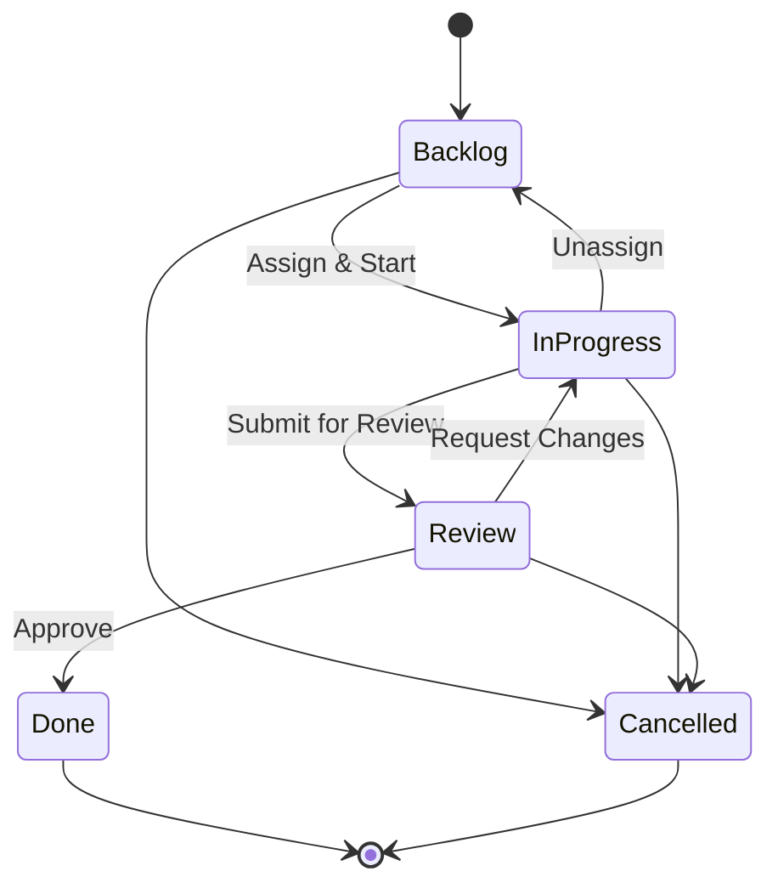

---

## 8. Traceability Matrix (Sample)

| Req ID | Component | Implementation Detail | Test Case ID |
| :--- | :--- | :--- | :--- |
| **FR-101** | TaskCtrl | Task Creation API Endpoint | TC-API-01 |
| **FR-102** | SPA / WS | Real-time Kanban Board Updates | TC-UI-05 |
| **NFR-201** | ALB / ECS | System must handle 1000 concurrent users | TC-PERF-01 |
| **SEC-301** | AuthSvc | JWT-based Authentication with OAuth2 | TC-SEC-02 |

---

## Data Model & ERD

# Data Model Documentation: Task Management System (TMS)

**Document ID:** TMS-DD-001  
**Version:** 1.0.0  
**Status:** Final  
**Date:** October 26, 2023

---

## 1. Entity-Relationship Diagram (ERD)

The following diagram illustrates the logical data structure of the Task Management System, emphasizing the relationships between users, teams, projects, and tasks.

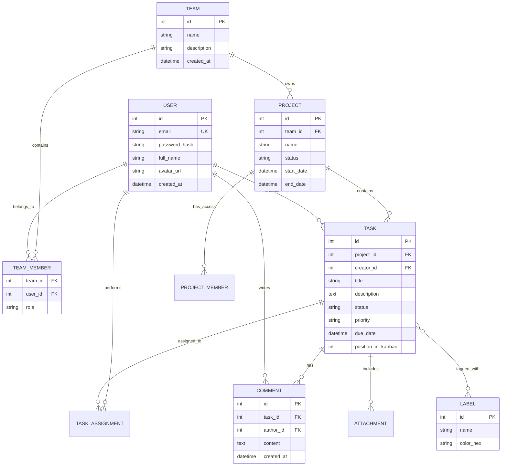

---

## 2. Entity Descriptions

### 2.1 USER
*   **Purpose:** Represents an individual authenticated actor within the system.
*   **Attributes:**
    *   `email`: Unique identifier for login; must be indexed for performance.
    *   `password_hash`: Argon2 or BCrypt hash; never stored in plain text.
*   **Relationships:** One user can belong to multiple teams and be assigned to multiple tasks.
*   **Indexes:** Unique index on `email`.

### 2.2 TASK
*   **Purpose:** The primary unit of work. Tracks specific requirements, deadlines, and progress.
*   **Attributes:**
    *   `status`: Enum (Backlog, To Do, In Progress, Review, Done).
    *   `position_in_kanban`: Integer used for drag-and-drop ordering within a column.
*   **Relationships:** Belongs to one Project; can have multiple assignees via `TASK_ASSIGNMENT`.
*   **Performance:** Composite index on `(project_id, status)` to optimize Kanban board loading.

### 2.3 PROJECT
*   **Purpose:** A container for tasks, usually tied to a specific business goal or timeline.
*   **Attributes:**
    *   `status`: Active, Archived, or Template.
*   **Relationships:** Owned by a Team. Access is restricted to members of that team or specific project-level invites.

### 2.4 TEAM
*   **Purpose:** A logical grouping of users (e.g., "Engineering", "Marketing").
*   **Relationships:** Acts as the primary billing and administrative boundary.

---

## 3. Data Dictionary

| Entity | Attribute | Type | Constraints | Description |
| :--- | :--- | :--- | :--- | :--- |
| **USER** | id | INT | PK, AUTO | Internal unique identifier. |
| **USER** | email | VARCHAR(255) | UK, NOT NULL | User's primary contact and login. |
| **USER** | full_name | VARCHAR(100) | NOT NULL | Display name for UI. |
| **PROJECT** | id | INT | PK, AUTO | Unique project identifier. |
| **PROJECT** | team_id | INT | FK, NOT NULL | Reference to the owning team. |
| **PROJECT** | name | VARCHAR(150) | NOT NULL | Name of the project. |
| **TASK** | id | INT | PK, AUTO | Unique task identifier. |
| **TASK** | project_id | INT | FK, NOT NULL | Project this task belongs to. |
| **TASK** | title | VARCHAR(255) | NOT NULL | Short summary of the task. |
| **TASK** | status | ENUM | NOT NULL | Current workflow state. |
| **TASK** | priority | ENUM | DEFAULT 'Med' | Low, Medium, High, Urgent. |
| **COMMENT** | id | INT | PK, AUTO | Unique comment identifier. |
| **COMMENT** | task_id | INT | FK, NOT NULL | Parent task. |
| **COMMENT** | author_id | INT | FK, NOT NULL | User who wrote the comment. |

---

## 4. Data Flow Diagram (DFD)

This diagram shows how data moves from the User Interface through the Application Logic to the Persistence Layer.

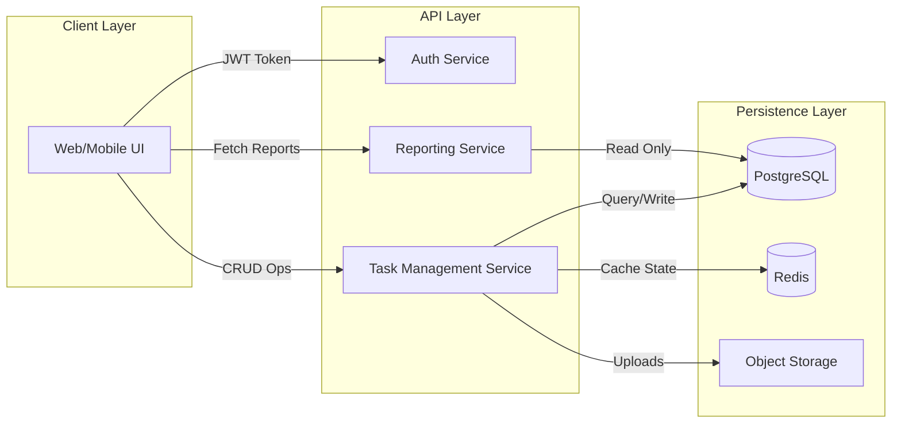

---

## 5. Data Validation Rules

To ensure data integrity (DI-XXX), the following rules must be enforced at the database and API levels:

| Rule ID | Entity | Attribute | Validation Logic |
| :--- | :--- | :--- | :--- |
| **VAL-001** | USER | email | Must match RFC 5322 standard regex. |
| **VAL-002** | TASK | due_date | Must be greater than or equal to `created_at`. |
| **VAL-003** | TASK | status | Must be one of: `BACKLOG`, `TODO`, `IN_PROGRESS`, `REVIEW`, `DONE`. |
| **VAL-004** | PROJECT | end_date | Must be after `start_date`. |
| **VAL-005** | LABEL | color_hex | Must be a valid 6-character Hex code (e.g., #FF5733). |
| **VAL-006** | TEAM_MEMBER | role | Must be one of: `OWNER`, `ADMIN`, `CONTRIBUTOR`, `VIEWER`. |

---

## 6. Data Migration Considerations

When migrating from legacy systems (e.g., CSV exports, Trello, or Jira), the following strategies apply:

1.  **ID Mapping Table:** Maintain a temporary mapping table (`legacy_id`, `new_id`, `entity_type`) to ensure relationships (like task-to-comment) remain intact during multi-stage imports.
2.  **Sanitization:** 
    *   Convert all legacy timestamps to UTC.
    *   Truncate strings that exceed the new `VARCHAR` limits.
3.  **Defaulting:** Legacy tasks without a status must be defaulted to the `BACKLOG` state.
4.  **Attachment Handling:** 
    *   Legacy attachments should be migrated to S3.
    *   Update the `ATTACHMENT` table with the new S3 URI.
5.  **Phased Migration:**
    *   **Phase 1:** Migrate Users and Teams.
    *   **Phase 2:** Migrate Projects and Labels.
    *   **Phase 3:** Migrate Tasks and Assignments.
    *   **Phase 4:** Migrate Comments and Attachments.

---

## 7. Traceability Matrix (Data to Requirements)

| Requirement ID | Entity/Attribute | Implementation Detail |
| :--- | :--- | :--- |
| **FR-101 (Auth)** | USER Table | Stores credentials and profile data. |
| **FR-202 (Kanban)** | TASK.status / TASK.position | Enables column-based visualization and ordering. |
| **FR-303 (Collab)** | COMMENT / ATTACHMENT | Supports team communication and file sharing. |
| **FR-404 (Reporting)** | PROJECT / TASK | Provides raw data for velocity and burn-down charts. |

---

## Flow Diagrams

# Task Management System: Interaction & Flow Documentation

This document outlines the critical behavioral paths, state transitions, and error-handling logic for the Task Management System. It serves as a technical reference for developers implementing the business logic and for QA engineers designing test cases.

---

## 1. Sequence Diagrams (Critical User Journeys)

### SD-101: Task Creation and Assignment
This journey covers the process of a Project Manager creating a task, assigning it to a developer, and the system triggering necessary notifications.

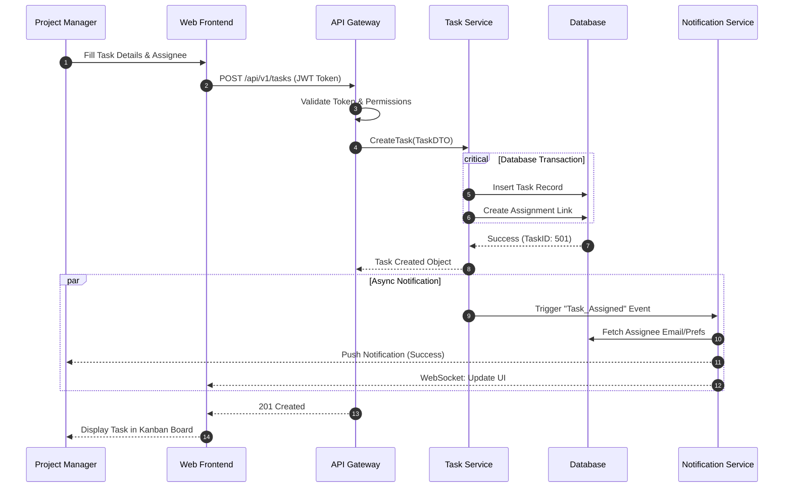

### SD-102: Real-time Kanban State Update
Ensures that when one user moves a card, all other team members viewing the same board see the update instantly.

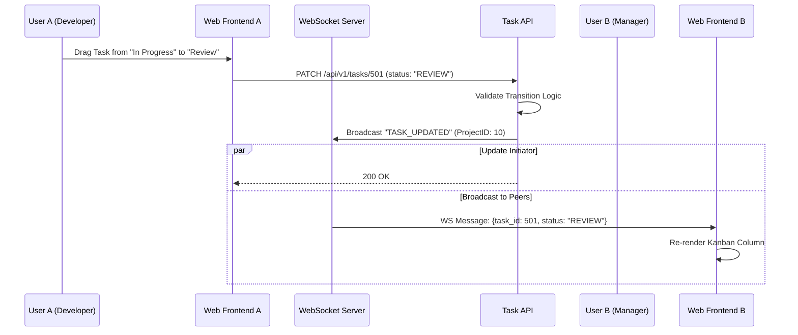

---

## 2. Activity Diagrams (Business Processes)

### AD-201: Task Completion Workflow
This process defines the logic required to move a task to the "Done" state, including sub-task validation.

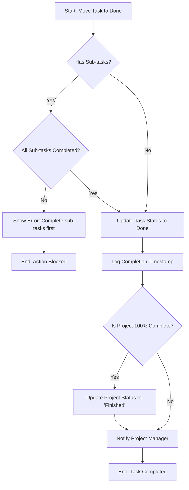

---

## 3. State Diagrams (Entity Life Cycles)

### ST-301: Task State Machine
Tasks follow a strict lifecycle to ensure data integrity and reporting accuracy.

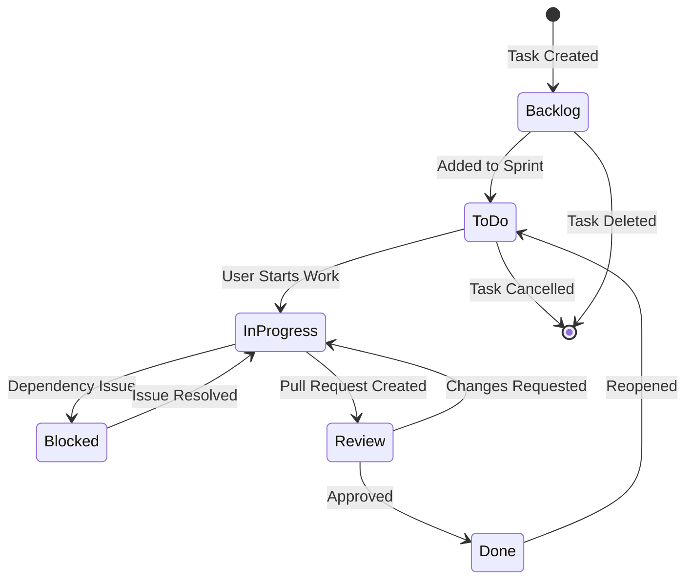

### ST-302: Project Lifecycle
Manages the high-level status of a project container.

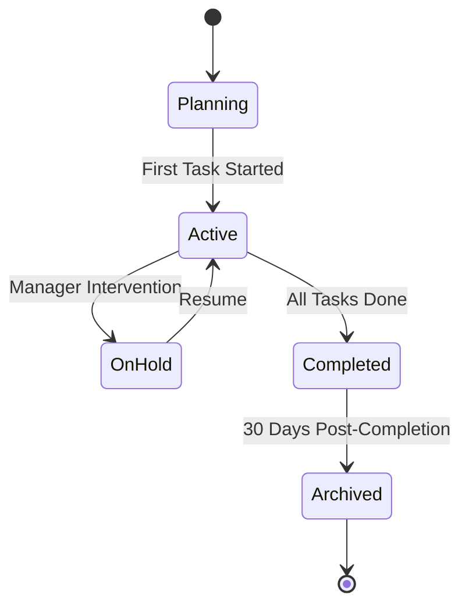

---

## 4. Integration Flow Diagrams

### IF-401: System Architecture & Data Flow
This diagram illustrates how the frontend interacts with the backend microservices and external integrations.

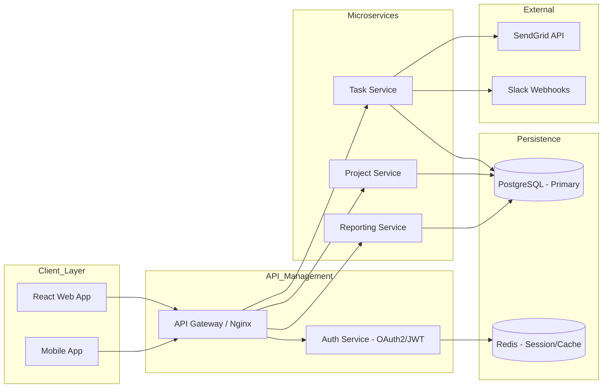

---

## 5. Error Handling Flows

### EH-501: API Request Failure & Retry Logic
Standardized approach for handling network partitions or service unavailability.

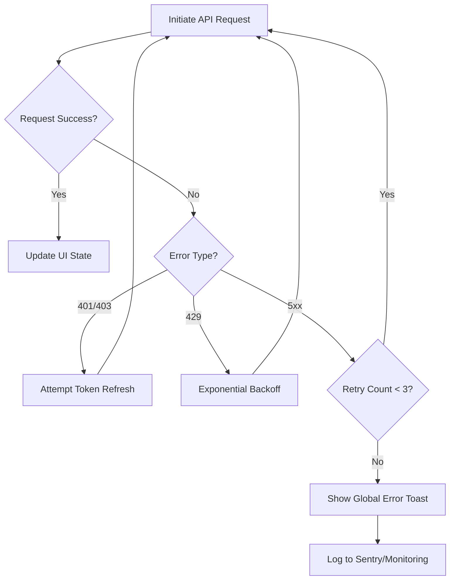

### EH-502: Conflict Resolution (Optimistic Locking)
Handles scenarios where two users edit the same task simultaneously.

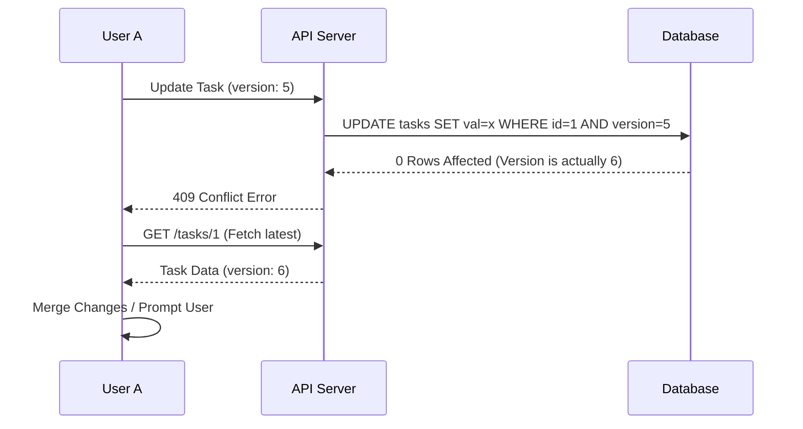

---

## 6. Traceability Matrix (Summary)

| ID | Name | Primary Actor | Related Entities |
|:---|:---|:---|:---|
| **SD-101** | Task Creation | Project Manager | Task, User, Notification |
| **SD-102** | Kanban Sync | Developer | WebSocket, Task |
| **AD-201** | Completion Logic | System/User | Sub-tasks, Project |
| **ST-301** | Task States | Developer | Task Status |
| **EH-501** | Error Handling | System | API Gateway, UI |

**End of Documentation**

---

## Test Plan

# Test Plan Documentation: Task Management System

**Project:** Task Management System (TMS)  
**Version:** 1.0.0  
**Status:** Draft  
**Date:** October 26, 2023

---

## 1. Test Strategy Overview

### 1.1 Testing Objectives
*   Ensure all functional requirements (FR-001 to FR-XXX) are validated.
*   Verify system stability under concurrent user loads (500+ users).
*   Validate data integrity across the Kanban board and reporting modules.
*   Ensure security compliance regarding User Role-Based Access Control (RBAC).

### 1.2 Testing Scope
*   **In-Scope:**
    *   User Authentication & Authorization (JWT/OAuth2).
    *   Task CRUD operations and state transitions.
    *   Project and Team management.
    *   Real-time Kanban board updates (WebSockets).
    *   Reporting dashboard accuracy.
*   **Out-of-Scope:**
    *   Third-party email server performance (SMTP).
    *   Legacy browser support (IE11 and below).
    *   Physical hardware failure recovery.

### 1.3 Testing Approach
We will adopt a **"Shift-Left"** testing approach, integrating automated tests into the CI/CD pipeline. Testing will follow the V-Model, mapping each development phase to a corresponding testing phase.

### 1.4 Entry & Exit Criteria
| Criterion | Entry Conditions | Exit Conditions |
| :--- | :--- | :--- |
| **Unit Testing** | Code compilation successful. | 80% Statement coverage achieved. |
| **System Testing** | Integration tests passed; Staging env ready. | 100% Critical/High test cases passed. |
| **UAT** | System testing complete; User guides ready. | Stakeholder sign-off on all User Stories. |

---

## 2. Test Levels

### 2.1 Unit Testing
*   **Frameworks:** Jest (Frontend/React), Mocha/Chai (Backend/Node.js).
*   **Targets:** Utility functions, Redux reducers, API controllers, and Database models.
*   **Coverage Target:** 85% Line coverage minimum.

### 2.2 Integration Testing
*   **Focus:** API Contract testing and Service-to-Service communication.
*   **Tools:** Postman/Newman, Supertest.
*   **Key Scenarios:** Database persistence, Middleware authentication, and Cache (Redis) hits/misses.

### 2.3 System Testing (End-to-End)
*   **Focus:** Complete user journeys across the UI.
*   **Tools:** Cypress or Playwright.
*   **Scenarios:** Creating a project, adding members, and moving a task from "To Do" to "Done."

### 2.4 Acceptance Testing (UAT)
*   **Focus:** Business requirements validation.
*   **Method:** Alpha testing by internal PMs; Beta testing by select client teams.
*   **Criteria:** Successful completion of the "Project Lifecycle" scenario without technical intervention.

---

## 3. Test Case Catalog

| TC-ID | Requirement | Description | Steps | Expected Result | Priority |
| :--- | :--- | :--- | :--- | :--- | :--- |
| **TC-001** | FR-001 | Valid User Login | 1. Navigate to /login<br>2. Enter valid email/pass<br>3. Click Login | User redirected to Dashboard; JWT stored. | High |
| **TC-002** | FR-002 | Create New Task | 1. Click "New Task"<br>2. Fill title/desc<br>3. Click Save | Task appears in "To Do" column. | High |
| **TC-003** | FR-003 | Kanban Drag-and-Drop | 1. Drag task from "To Do"<br>2. Drop in "In Progress" | Task status updates in DB; UI reflects change. | Medium |
| **TC-004** | FR-004 | Team Member Assignment | 1. Open Task details<br>2. Select user from dropdown<br>3. Save | Assigned user receives notification. | Medium |
| **TC-005** | FR-005 | Generate Project Report | 1. Navigate to Reports<br>2. Select Project<br>3. Click Export PDF | PDF downloads with correct task counts. | Low |

---

## 4. Test Coverage Matrix

```mermaid
graph LR
    subgraph Requirements
        FR1[FR-001: Auth]
        FR2[FR-002: Task Mgmt]
        FR3[FR-003: Kanban]
        FR4[FR-004: Collaboration]
        FR5[FR-005: Reporting]
    end

    subgraph Test_Cases
        TC1[TC-001: Login]
        TC2[TC-002: Create Task]
        TC3[TC-003: Drag-Drop]
        TC4[TC-004: Assignment]
        TC5[TC-005: PDF Export]
    end

    FR1 --> TC1
    FR2 --> TC2
    FR3 --> TC3
    FR4 --> TC4
    FR5 --> TC5
    
    style FR1 fill:#f9f,stroke:#333
    style TC1 fill:#bbf,stroke:#333
```

---

## 5. Non-Functional Test Cases

### 5.1 Performance Test Scenarios
*   **Load Testing:** Simulate 500 concurrent users performing task updates. Target response time: < 2 seconds.
*   **Stress Testing:** Increase load until system failure to identify the breaking point (Target: 2000 users).
*   **Soak Testing:** Run the system under moderate load for 24 hours to check for memory leaks.

### 5.2 Security Test Scenarios
*   **SQL Injection:** Attempt to bypass login via `' OR 1=1 --`.
*   **Broken Access Control:** Attempt to access Project B's tasks using a Project A user token.
*   **XSS:** Input `<script>alert('XSS')</script>` into task descriptions.

### 5.3 Usability Test Scenarios
*   **Responsiveness:** Verify Kanban board layout on Mobile (iOS/Android) and Tablet.
*   **Accessibility:** Ensure all buttons have `aria-labels` and the site is navigable via keyboard (Tab/Enter).

---

## 6. Test Environment Requirements

### 6.1 Hardware/Software Requirements
*   **Staging Server:** AWS t3.medium instance (Linux Ubuntu 22.04).
*   **Database:** Managed PostgreSQL 14.
*   **Browsers:** Chrome (Latest), Firefox (Latest), Safari (Latest).

### 6.2 Test Data Requirements
*   **Anonymized Data:** Use `Faker.js` to generate 100 users, 20 projects, and 500 tasks.
*   **Stateful Data:** Pre-configured "Admin" and "Viewer" accounts for RBAC testing.

### 6.3 Tool Requirements
*   **Management:** Jira / TestRail.
*   **Automation:** Playwright (E2E), k6 (Performance).
*   **CI/CD:** GitHub Actions.

---

## 7. Test Schedule

```mermaid
gantt
    title Task Management System - Testing Timeline
    dateFormat  YYYY-MM-DD
    section Unit Testing
    Component Tests          :active, ut1, 2023-11-01, 7d
    API Logic Tests          :ut2, after ut1, 5d
    section Integration
    API Contract Testing     :it1, 2023-11-10, 5d
    DB Integration           :it2, after it1, 3d
    section System Testing
    E2E Core Flows           :st1, 2023-11-18, 10d
    Regression Testing       :st2, after st1, 5d
    section Acceptance
    UAT Phase                :uat1, 2023-12-05, 5d
    Final Sign-off           :milestone, 2023-12-10, 0d
```

---

## 8. Risk Assessment

| Risk ID | Risk Description | Impact | Mitigation Strategy |
| :--- | :--- | :--- | :--- |
| **R-001** | Delay in Staging environment setup. | High | Use Docker containers for local integration testing. |
| **R-002** | Real-time WebSocket sync issues. | Medium | Implement fallback to Long Polling; add specific stress tests for Socket.io. |
| **R-003** | Sensitive data leak in logs. | High | Implement log masking for PII (Personally Identifiable Information). |
| **R-004** | Scope creep during UAT. | Medium | Strict adherence to the signed-off Functional Requirements Document (FRD). |

---

**Approvals:**

*   **QA Lead:** __________________________ Date: __________
*   **Project Manager:** ___________________ Date: __________

---

## Phase Plan

# Development Phase Planning: Task Management System

This document outlines the strategic roadmap, resource allocation, and execution plan for the Task Management System. The plan is designed to ensure a scalable, secure, and high-performance delivery over a 21-week timeline.

---

## 1. Project Timeline Overview

```mermaid
gantt
    title Task Management System - Development Roadmap
    dateFormat  YYYY-MM-DD
    axisFormat  %m-%d
    
    section Phase 1: Foundation
    Architecture & Schema Design :a1, 2024-01-01, 2w
    CI/CD & Cloud Infra Setup    :a2, after a1, 2w
    
    section Phase 2: Core Features
    Auth & User Management       :b1, after a2, 2w
    Workspace & Project Logic    :b2, after b1, 2w
    Kanban & Task Engine         :b3, after b2, 3w
    
    section Phase 3: Integration
    Notification Service         :c1, after b3, 1w
    External API & Webhooks      :c2, after c1, 2w
    
    section Phase 4: Polish
    Reporting & Analytics        :d1, after c2, 2w
    UI/UX Refinement             :d2, after d1, 1w
    Performance & Load Testing   :d3, after d2, 1w
    
    section Phase 5: Launch
    UAT & Bug Fixing             :e1, after d3, 2w
    Production Deployment        :e2, after e1, 1w
```

---

## 2. Phase Descriptions

### Phase 1: Foundation (Weeks 1-4)
*   **Objectives:** Establish the technical bedrock and deployment pipeline.
*   **Deliverables:** System Architecture Document (SAD), ERD, CI/CD pipelines, Kubernetes/Cloud environment.
*   **Key Activities:**
    *   Database schema design (PostgreSQL).
    *   Setting up Boilerplate (Node.js/React/TypeScript).
    *   Infrastructure as Code (Terraform/Helm).
*   **Dependencies:** Finalized requirements.
*   **Success Criteria:** Successful "Hello World" deployment to Staging via automated pipeline.
*   **Risks:** Scope creep in architecture. *Mitigation:* Strict adherence to MVP requirements.

### Phase 2: Core Features (Weeks 5-11)
*   **Objectives:** Build the primary value proposition (Task & Project management).
*   **Deliverables:** Functional Kanban boards, RBAC system, Task CRUD.
*   **Key Activities:**
    *   Implementing JWT/OAuth2 authentication.
    *   Developing the Drag-and-Drop Kanban interface.
    *   Real-time updates using WebSockets (Socket.io).
*   **Dependencies:** Phase 1 infrastructure.
*   **Success Criteria:** Users can create projects, invite members, and move tasks across states.
*   **Risks:** Complexity in real-time synchronization. *Mitigation:* Use a proven state-management library (Redux/Zustand) and robust locking mechanisms.

### Phase 3: Integration & API (Weeks 12-14)
*   **Objectives:** Enable ecosystem connectivity.
*   **Deliverables:** Public REST API, Slack/Email integration modules.
*   **Key Activities:**
    *   API Documentation (Swagger/OpenAPI).
    *   Webhook listener service.
    *   SMTP/SendGrid integration for notifications.
*   **Dependencies:** Core Business Logic (Phase 2).
*   **Success Criteria:** Successful task creation via API and notification delivery.

### Phase 4: Polish & Optimization (Weeks 15-18)
*   **Objectives:** Ensure system stability, speed, and data insights.
*   **Deliverables:** Analytics dashboard, Performance audit report.
*   **Key Activities:**
    *   Database indexing and query optimization.
    *   Frontend accessibility (WCAG) audit.
    *   Implementation of caching layers (Redis).
*   **Success Criteria:** Page load times < 2s; 99% test coverage for critical paths.

---

## 3. Milestone Schedule

| ID | Milestone | Target Date | Deliverables | Success Criteria |
|:---|:---|:---|:---|:---|
| **MS-01** | Architecture Baseline | Week 4 | Infra-as-Code, DB Schema | Staging env accessible |
| **MS-02** | MVP Functional | Week 11 | Kanban Board, Auth, Projects | End-to-end task flow works |
| **MS-03** | Integration Ready | Week 14 | Public API, Webhooks | 3rd party apps can sync data |
| **MS-04** | Production Ready | Week 18 | Final Build, Security Audit | Zero "Critical" vulnerabilities |
| **MS-05** | GA Launch | Week 21 | Production Environment | System live for all users |

---

## 4. Resource Allocation

```mermaid
graph TD
    subgraph "Project Team Structure"
    PM[Project Manager] --> TL[Tech Lead]
    TL --> FE[Frontend Team - 2 Devs]
    TL --> BE[Backend Team - 2 Devs]
    TL --> DO[DevOps Engineer]
    PM --> QA[QA/SDET - 1 Eng]
    PM --> UX[UI/UX Designer]
    end
```

| Role | Phase 1 | Phase 2 | Phase 3 | Phase 4 | Phase 5 |
|:---|:---:|:---:|:---:|:---:|:---:|
| **Backend** | High | High | High | Medium | Low |
| **Frontend** | Low | High | Medium | High | Low |
| **DevOps** | High | Low | Medium | Medium | High |
| **QA** | Low | Medium | High | High | High |

---

## 5. Sprint Planning Overview (First 4 Sprints)

| Sprint | Goal | Key Deliverables | Capacity |
|:---|:---|:---|:---|
| **SP-01** | Foundation | Repo setup, DB Schema, CI/CD | 80 pts |
| **SP-02** | Identity | Login/Register, RBAC, Profile Mgmt | 85 pts |
| **SP-03** | Structure | Workspace & Project CRUD, Member Invites | 90 pts |
| **SP-04** | Task Core | Task Creation, Statuses, Kanban View | 90 pts |

---

## 6. Release Plan

### v0.1 - Alpha (Internal)
*   **Date:** Week 8
*   **Features:** Basic Auth, Project creation, Simple Task list.
*   **Criteria:** Internal team can dogfood the application.

### v0.5 - Beta (Closed)
*   **Date:** Week 14
*   **Features:** Kanban boards, Notifications, Public API.
*   **Criteria:** Stable enough for 5-10 external "friendly" teams.

### v1.0 - General Availability (GA)
*   **Date:** Week 21
*   **Features:** Full reporting, Mobile responsiveness, All integrations.
*   **Criteria:** 99.9% Uptime, Load tested for 10k concurrent users.

---

## 7. Risk Timeline & Mitigation

```mermaid
graph LR
    R1[Technical Debt] -- High Risk --> P4(Phase 4)
    R2[Security Breach] -- Constant Risk --> P1-P5(All Phases)
    R3[Scope Creep] -- High Risk --> P2(Phase 2)
    R4[Perf Bottlenecks] -- High Risk --> P4(Phase 4)

    style R1 fill:#f96,stroke:#333
    style R3 fill:#f96,stroke:#333
```

| Risk ID | Risk Description | Mitigation Strategy | Window |
|:---|:---|:---|:---|
| **RK-01** | Data Concurrency Issues | Implement Optimistic Locking and Redis Pub/Sub for real-time. | Weeks 7-11 |
| **RK-02** | API Rate Limiting | Implement Throttling middleware early in Phase 3. | Weeks 12-14 |
| **RK-03** | Infrastructure Costs | Use Spot instances for Dev/Staging; Auto-scaling for Prod. | Weeks 3-21 |
| **RK-04** | UI Complexity | Conduct weekly UX reviews to prevent "feature clutter." | Weeks 5-18 |

---

## Project Data

Generated JSON file: task_management_system_project_data.json

```json
{
  "project_name" : "Task Management System",
  "description" : "A web-based application for managing tasks, projects, and team collaboration. \nThe system should support user authentication, task creation, assignment, \nstatus tracking (Kanban style), and basic reporting. \nIt needs to handle multiple projects and teams.",
  "created_date" : "2026-01-09T13:58:20.814767186",
  "epics" : [ {
    "id" : "EPIC-UC",
    "name" : "User Features",
    "description" : "Core user-facing functionality based on use cases",
    "priority" : "High",
    "status" : "Planned",
    "story_points" : 95
  }, {
    "id" : "EPIC-ARCH",
    "name" : "Architecture & Infrastructure",
    "description" : "Set up system architecture and infrastructure",
    "priority" : "High",
    "status" : "Planned",
    "story_points" : 21
  }, {
    "id" : "EPIC-TEST",
    "name" : "Quality Assurance",
    "description" : "Testing and quality assurance activities",
    "priority" : "High",
    "status" : "Planned",
    "story_points" : 13
  }, {
    "id" : "EPIC-101",
    "name" : "Epic EPIC-101",
    "description" : "Auto-extracted epic from analysis",
    "priority" : "Medium",
    "status" : "Planned",
    "story_points" : 13
  }, {
    "id" : "EPIC-102",
    "name" : "Epic EPIC-102",
    "description" : "Auto-extracted epic from analysis",
    "priority" : "Medium",
    "status" : "Planned",
    "story_points" : 13
  }, {
    "id" : "EPIC-103",
    "name" : "Epic EPIC-103",
    "description" : "Auto-extracted epic from analysis",
    "priority" : "Medium",
    "status" : "Planned",
    "story_points" : 13
  }, {
    "id" : "EPIC-104",
    "name" : "Epic EPIC-104",
    "description" : "Auto-extracted epic from analysis",
    "priority" : "Medium",
    "status" : "Planned",
    "story_points" : 13
  }, {
    "id" : "EPIC-105",
    "name" : "Epic EPIC-105",
    "description" : "Auto-extracted epic from analysis",
    "priority" : "Medium",
    "status" : "Planned",
    "story_points" : 13
  } ],
  "releases" : [ {
    "id" : "REL-1",
    "name" : "MVP Release",
    "version" : "1.0.0",
    "target_date" : "2026-02-06",
    "description" : "Minimum Viable Product release with core functionality",
    "epic_ids" : [ "EPIC-UC", "EPIC-ARCH", "EPIC-TEST", "EPIC-101" ],
    "status" : "Planned"
  }, {
    "id" : "REL-2",
    "name" : "Feature Complete Release",
    "version" : "1.1.0",
    "target_date" : "2026-03-06",
    "description" : "Full feature release with all planned functionality",
    "epic_ids" : [ "EPIC-UC", "EPIC-ARCH", "EPIC-TEST", "EPIC-101", "EPIC-102", "EPIC-103", "EPIC-104", "EPIC-105" ],
    "status" : "Planned"
  } ],
  "sprints" : [ {
    "id" : "SPRINT-1",
    "name" : "Sprint 1",
    "number" : 1,
    "start_date" : "2026-01-09",
    "end_date" : "2026-01-23",
    "goals" : [ "Complete sprint 1 deliverables" ],
    "capacity_points" : 40,
    "task_ids" : [ "TASK-101", "TASK-102", "TASK-103", "TASK-104", "TASK-301", "TASK-302", "TASK-303" ],
    "status" : "Planned"
  }, {
    "id" : "SPRINT-2",
    "name" : "Sprint 2",
    "number" : 2,
    "start_date" : "2026-01-23",
    "end_date" : "2026-02-06",
    "goals" : [ "Complete sprint 2 deliverables" ],
    "capacity_points" : 40,
    "task_ids" : [ "TASK-304", "TASK-201", "TASK-202", "TASK-305", "TASK-306", "TASK-401", "TASK-402" ],
    "status" : "Planned"
  }, {
    "id" : "SPRINT-3",
    "name" : "Sprint 3",
    "number" : 3,
    "start_date" : "2026-02-06",
    "end_date" : "2026-02-20",
    "goals" : [ "Complete sprint 3 deliverables" ],
    "capacity_points" : 40,
    "task_ids" : [ "TASK-403", "TASK-404", "TASK-203", "TASK-501", "TASK-502", "TASK-503", "TASK-504" ],
    "status" : "Planned"
  }, {
    "id" : "SPRINT-4",
    "name" : "Sprint 4",
    "number" : 4,
    "start_date" : "2026-02-20",
    "end_date" : "2026-03-06",
    "goals" : [ "Complete sprint 4 deliverables" ],
    "capacity_points" : 40,
    "task_ids" : [ "TASK-601", "TASK-602" ],
    "status" : "Planned"
  } ],
  "tasks" : [ {
    "id" : "TASK-101",
    "title" : "Task TASK-101",
    "description" : "Auto-extracted task from analysis",
    "type" : "task",
    "epic_id" : "EPIC-UC",
    "sprint_id" : "SPRINT-1",
    "priority" : "Medium",
    "story_points" : 3,
    "status" : "Backlog",
    "acceptance_criteria" : [ "Task completed successfully" ],
    "labels" : [ "auto-generated" ]
  }, {
    "id" : "TASK-102",
    "title" : "Task TASK-102",
    "description" : "Auto-extracted task from analysis",
    "type" : "task",
    "epic_id" : "EPIC-UC",
    "sprint_id" : "SPRINT-1",
    "priority" : "Medium",
    "story_points" : 3,
    "status" : "Backlog",
    "acceptance_criteria" : [ "Task completed successfully" ],
    "labels" : [ "auto-generated" ]
  }, {
    "id" : "TASK-103",
    "title" : "Task TASK-103",
    "description" : "Auto-extracted task from analysis",
    "type" : "task",
    "epic_id" : "EPIC-UC",
    "sprint_id" : "SPRINT-1",
    "priority" : "Medium",
    "story_points" : 3,
    "status" : "Backlog",
    "acceptance_criteria" : [ "Task completed successfully" ],
    "labels" : [ "auto-generated" ]
  }, {
    "id" : "TASK-104",
    "title" : "Task TASK-104",
    "description" : "Auto-extracted task from analysis",
    "type" : "task",
    "epic_id" : "EPIC-UC",
    "sprint_id" : "SPRINT-1",
    "priority" : "Medium",
    "story_points" : 3,
    "status" : "Backlog",
    "acceptance_criteria" : [ "Task completed successfully" ],
    "labels" : [ "auto-generated" ]
  }, {
    "id" : "TASK-301",
    "title" : "Task TASK-301",
    "description" : "Auto-extracted task from analysis",
    "type" : "task",
    "epic_id" : "EPIC-UC",
    "sprint_id" : "SPRINT-1",
    "priority" : "Medium",
    "story_points" : 3,
    "status" : "Backlog",
    "acceptance_criteria" : [ "Task completed successfully" ],
    "labels" : [ "auto-generated" ]
  }, {
    "id" : "TASK-302",
    "title" : "Task TASK-302",
    "description" : "Auto-extracted task from analysis",
    "type" : "task",
    "epic_id" : "EPIC-UC",
    "sprint_id" : "SPRINT-1",
    "priority" : "Medium",
    "story_points" : 3,
    "status" : "Backlog",
    "acceptance_criteria" : [ "Task completed successfully" ],
    "labels" : [ "auto-generated" ]
  }, {
    "id" : "TASK-303",
    "title" : "Task TASK-303",
    "description" : "Auto-extracted task from analysis",
    "type" : "task",
    "epic_id" : "EPIC-UC",
    "sprint_id" : "SPRINT-1",
    "priority" : "Medium",
    "story_points" : 3,
    "status" : "Backlog",
    "acceptance_criteria" : [ "Task completed successfully" ],
    "labels" : [ "auto-generated" ]
  }, {
    "id" : "TASK-304",
    "title" : "Task TASK-304",
    "description" : "Auto-extracted task from analysis",
    "type" : "task",
    "epic_id" : "EPIC-UC",
    "sprint_id" : "SPRINT-2",
    "priority" : "Medium",
    "story_points" : 3,
    "status" : "Backlog",
    "acceptance_criteria" : [ "Task completed successfully" ],
    "labels" : [ "auto-generated" ]
  }, {
    "id" : "TASK-201",
    "title" : "Task TASK-201",
    "description" : "Auto-extracted task from analysis",
    "type" : "task",
    "epic_id" : "EPIC-UC",
    "sprint_id" : "SPRINT-2",
    "priority" : "Medium",
    "story_points" : 3,
    "status" : "Backlog",
    "acceptance_criteria" : [ "Task completed successfully" ],
    "labels" : [ "auto-generated" ]
  }, {
    "id" : "TASK-202",
    "title" : "Task TASK-202",
    "description" : "Auto-extracted task from analysis",
    "type" : "task",
    "epic_id" : "EPIC-UC",
    "sprint_id" : "SPRINT-2",
    "priority" : "Medium",
    "story_points" : 3,
    "status" : "Backlog",
    "acceptance_criteria" : [ "Task completed successfully" ],
    "labels" : [ "auto-generated" ]
  }, {
    "id" : "TASK-305",
    "title" : "Task TASK-305",
    "description" : "Auto-extracted task from analysis",
    "type" : "task",
    "epic_id" : "EPIC-UC",
    "sprint_id" : "SPRINT-2",
    "priority" : "Medium",
    "story_points" : 3,
    "status" : "Backlog",
    "acceptance_criteria" : [ "Task completed successfully" ],
    "labels" : [ "auto-generated" ]
  }, {
    "id" : "TASK-306",
    "title" : "Task TASK-306",
    "description" : "Auto-extracted task from analysis",
    "type" : "task",
    "epic_id" : "EPIC-UC",
    "sprint_id" : "SPRINT-2",
    "priority" : "Medium",
    "story_points" : 3,
    "status" : "Backlog",
    "acceptance_criteria" : [ "Task completed successfully" ],
    "labels" : [ "auto-generated" ]
  }, {
    "id" : "TASK-401",
    "title" : "Task TASK-401",
    "description" : "Auto-extracted task from analysis",
    "type" : "task",
    "epic_id" : "EPIC-UC",
    "sprint_id" : "SPRINT-2",
    "priority" : "Medium",
    "story_points" : 3,
    "status" : "Backlog",
    "acceptance_criteria" : [ "Task completed successfully" ],
    "labels" : [ "auto-generated" ]
  }, {
    "id" : "TASK-402",
    "title" : "Task TASK-402",
    "description" : "Auto-extracted task from analysis",
    "type" : "task",
    "epic_id" : "EPIC-UC",
    "sprint_id" : "SPRINT-2",
    "priority" : "Medium",
    "story_points" : 3,
    "status" : "Backlog",
    "acceptance_criteria" : [ "Task completed successfully" ],
    "labels" : [ "auto-generated" ]
  }, {
    "id" : "TASK-403",
    "title" : "Task TASK-403",
    "description" : "Auto-extracted task from analysis",
    "type" : "task",
    "epic_id" : "EPIC-UC",
    "sprint_id" : "SPRINT-3",
    "priority" : "Medium",
    "story_points" : 3,
    "status" : "Backlog",
    "acceptance_criteria" : [ "Task completed successfully" ],
    "labels" : [ "auto-generated" ]
  }, {
    "id" : "TASK-404",
    "title" : "Task TASK-404",
    "description" : "Auto-extracted task from analysis",
    "type" : "task",
    "epic_id" : "EPIC-UC",
    "sprint_id" : "SPRINT-3",
    "priority" : "Medium",
    "story_points" : 3,
    "status" : "Backlog",
    "acceptance_criteria" : [ "Task completed successfully" ],
    "labels" : [ "auto-generated" ]
  }, {
    "id" : "TASK-203",
    "title" : "Task TASK-203",
    "description" : "Auto-extracted task from analysis",
    "type" : "task",
    "epic_id" : "EPIC-UC",
    "sprint_id" : "SPRINT-3",
    "priority" : "Medium",
    "story_points" : 3,
    "status" : "Backlog",
    "acceptance_criteria" : [ "Task completed successfully" ],
    "labels" : [ "auto-generated" ]
  }, {
    "id" : "TASK-501",
    "title" : "Task TASK-501",
    "description" : "Auto-extracted task from analysis",
    "type" : "task",
    "epic_id" : "EPIC-UC",
    "sprint_id" : "SPRINT-3",
    "priority" : "Medium",
    "story_points" : 3,
    "status" : "Backlog",
    "acceptance_criteria" : [ "Task completed successfully" ],
    "labels" : [ "auto-generated" ]
  }, {
    "id" : "TASK-502",
    "title" : "Task TASK-502",
    "description" : "Auto-extracted task from analysis",
    "type" : "task",
    "epic_id" : "EPIC-UC",
    "sprint_id" : "SPRINT-3",
    "priority" : "Medium",
    "story_points" : 3,
    "status" : "Backlog",
    "acceptance_criteria" : [ "Task completed successfully" ],
    "labels" : [ "auto-generated" ]
  }, {
    "id" : "TASK-503",
    "title" : "Task TASK-503",
    "description" : "Auto-extracted task from analysis",
    "type" : "task",
    "epic_id" : "EPIC-UC",
    "sprint_id" : "SPRINT-3",
    "priority" : "Medium",
    "story_points" : 3,
    "status" : "Backlog",
    "acceptance_criteria" : [ "Task completed successfully" ],
    "labels" : [ "auto-generated" ]
  }, {
    "id" : "TASK-504",
    "title" : "Task TASK-504",
    "description" : "Auto-extracted task from analysis",
    "type" : "task",
    "epic_id" : "EPIC-UC",
    "sprint_id" : "SPRINT-3",
    "priority" : "Medium",
    "story_points" : 3,
    "status" : "Backlog",
    "acceptance_criteria" : [ "Task completed successfully" ],
    "labels" : [ "auto-generated" ]
  }, {
    "id" : "TASK-601",
    "title" : "Task TASK-601",
    "description" : "Auto-extracted task from analysis",
    "type" : "task",
    "epic_id" : "EPIC-UC",
    "sprint_id" : "SPRINT-4",
    "priority" : "Medium",
    "story_points" : 3,
    "status" : "Backlog",
    "acceptance_criteria" : [ "Task completed successfully" ],
    "labels" : [ "auto-generated" ]
  }, {
    "id" : "TASK-602",
    "title" : "Task TASK-602",
    "description" : "Auto-extracted task from analysis",
    "type" : "task",
    "epic_id" : "EPIC-UC",
    "sprint_id" : "SPRINT-4",
    "priority" : "Medium",
    "story_points" : 3,
    "status" : "Backlog",
    "acceptance_criteria" : [ "Task completed successfully" ],
    "labels" : [ "auto-generated" ]
  } ],
  "milestones" : [ ],
  "dependencies" : [ ]
}
```

---

