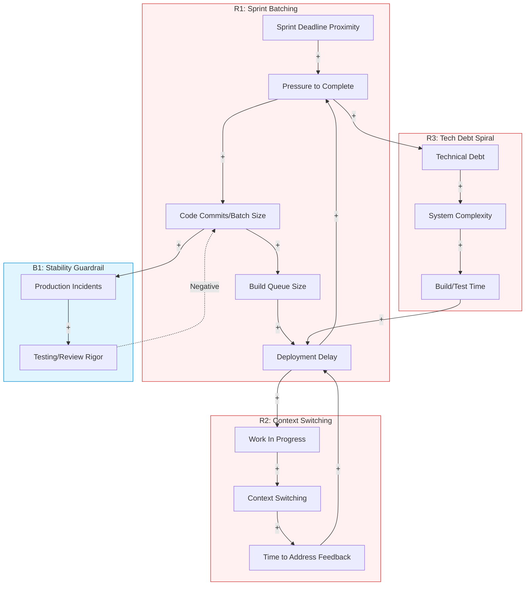

# Systems Thinking Analysis

**System:** A software development team's CI/CD pipeline and deployment process, including code reviews, automated testing, and production releases.

**Time Horizon:** 1 year

**Started:** 2026-01-02 00:59:12

---

## System Structure

This analysis applies system dynamics and complexity theory to a standard software delivery lifecycle over a one-year horizon.

---

### 1. Key Components and Variables

To understand the system, we must categorize the variables that drive behavior:

*   **Velocity Variables:** Coding rate, Review latency, Build duration, Deployment frequency.
*   **Quality Variables:** Defect density, Test coverage, Review rigor, Technical debt level.
*   **Pressure Variables:** Sprint deadlines, Management expectations, Customer demand.
*   **Capacity Variables:** Developer headcount, CI/CD infrastructure throughput, Cognitive load.

---

### 2. Stocks and Flows (The Plumbing of the System)

The system is defined by the accumulation of work and the rates at which that work moves.

*   **Stock: Work in Progress (WIP) / Feature Backlog**
    *   *Inflow:* New feature requests and bug reports.
    *   *Outflow:* Completed code ready for review.
*   **Stock: Pull Request (PR) Queue**
    *   *Inflow:* Completed code.
    *   *Outflow:* Reviewed and approved code.
*   **Stock: CI/CD Build Queue**
    *   *Inflow:* Merged code.
    *   *Outflow:* Successfully built and tested artifacts.
*   **Stock: Deployment Queue (The "Release Train")**
    *   *Inflow:* Verified artifacts.
    *   *Outflow:* Production releases.
*   **Stock: Technical Debt (The "Invisible" Stock)**
    *   *Inflow:* Shortcuts taken to meet deadlines, unaddressed refactoring.
    *   *Outflow:* Dedicated maintenance and refactoring efforts.

---

### 3. Relationships and Feedback Loops

The system’s behavior is driven by two primary types of loops:

#### Balancing Loops (B) - Seeking Stability
*   **B1: Quality Control Loop:** As *Defects in Production* increase, *Testing Rigor* increases, which slows down the *Deployment Rate*, eventually reducing the number of new defects.
*   **B2: Capacity Constraint:** As the *Build Queue* grows, *Developer Idle Time* (waiting for builds) increases, which eventually slows the *Coding Rate*, preventing the queue from growing infinitely.

#### Reinforcing Loops (R) - Driving Growth or Decay
*   **R1: The "Death Spiral" of Tech Debt:** High *Technical Debt* increases *Code Complexity*, which increases *Time to Develop*, which creates *Schedule Pressure*, leading to more *Shortcuts*, further increasing *Technical Debt*.
*   **R2: Success to the Successful (Individual Throughput):** Developers who prioritize *Individual Coding* over *Reviewing Others* get more "points" done. This encourages others to do the same, causing the *PR Queue* to explode and *Team Throughput* to collapse.

---

### 4. Information Flows and Decision Points

*   **The Sprint Heartbeat:** A periodic information signal (usually 2 weeks) that resets priorities. It creates a "deadline effect" that alters decision-making logic as the window closes.
*   **The "Merge/No-Merge" Decision:** A critical gate where a developer decides if a PR is "good enough." Under high pressure, the threshold for "good enough" shifts downward (Non-linearity).
*   **CI/CD Feedback Signal:** The time it takes for a developer to know if their code broke the build. If this delay is > 10 minutes, the developer context-switches, creating a massive hidden cost in cognitive re-entry.

---

### 5. Addressing Specific Questions

#### Why does the deployment queue grow exponentially towards the end of a sprint?
This is a classic **"Batching and Queueing"** problem exacerbated by **Non-linear delays**.
1.  **Synchronized Arrival:** Developers tend to "finish" their individual tasks simultaneously near the deadline.
2.  **The Traffic Jam Effect:** CI/CD pipelines have a finite capacity. When the arrival rate of PRs exceeds the processing rate, the queue doesn't just grow—the *wait time* grows exponentially because each new entry must wait for all previous entries plus the overhead of increased merge conflicts (re-work).
3.  **The "Merge-Back" Storm:** As more code is merged, the "main" branch changes rapidly. Developers must constantly pull changes and re-run tests, creating a reinforcing loop of "Build -> Fail due to conflict -> Fix -> Re-build."

#### What are the unintended consequences of optimizing for individual developer throughput?
This is the **"Sub-optimization"** trap.
*   **The PR Bottleneck:** If Developer A is measured solely on their "lines of code" or "tickets closed," they will view reviewing Developer B’s code as a distraction.
*   **Result:** The *PR Queue* stock grows. High WIP leads to long "Lead Times." Even if individual coding is fast, the *Time-to-Market* increases because code sits idle waiting for review.
*   **Emergent Behavior:** High individual throughput without collaboration leads to "Integration Hell," where components don't work together, requiring a massive "stabilization phase" that wipes out all previous speed gains.

#### Where is the most effective place to intervene? (Leverage Points)
According to Donella Meadows’ leverage points, the most effective interventions are:

1.  **Reduce Batch Size (High Leverage):** Instead of "Sprint-end" pushes, move to **Continuous Flow**. By limiting WIP (Work in Progress) at the PR stage, you force the "Review Rate" to match the "Coding Rate." This flattens the exponential queue growth.
2.  **Shorten the Feedback Delay (High Leverage):** Invest in CI/CD speed. If a build takes 3 minutes instead of 30, the "Correction Loop" happens while the developer is still in the mental context of the code. This prevents the accumulation of "Broken Build" stocks.
3.  **Change the Goal of the System (Highest Leverage):** Shift the metric from "Individual Velocity" to "Cycle Time" (the time from 'In Progress' to 'Production'). This aligns the team to clear bottlenecks (like the PR queue) rather than just piling more work into the system.

### Summary for the 1-Year Horizon
Over a year, a team that ignores these loops will see a **"Shifting the Burden"** archetype: they will spend more and more time "fixing the pipeline" and "managing releases" (the symptom) rather than "improving architecture" (the fundamental solution). The leverage lies in **limiting WIP** and **automating the feedback loop** to keep the stocks of "Pending Work" as low as possible.

---

## Feedback Loops

This analysis applies system dynamics to your CI/CD and deployment pipeline over a one-year horizon, focusing on the interplay between developer behavior, infrastructure constraints, and quality requirements.

### 1. Analysis of Feedback Loops

#### **R1: The "End-of-Sprint Batching" Vicious Cycle**
*   **Description**: As the sprint deadline approaches, the perceived "Time to Deadline" decreases, causing developers to rush code into the pipeline. This creates a "Tragedy of the Commons" on shared CI/CD resources.
*   **Causal Chain**: Sprint Deadline Proximity → Pressure to Complete → Code Commits per Hour → Build Queue Size → Deployment Delay → Pressure to Complete.
*   **Classification**: Reinforcing (R)
*   **Behavior**: Exponential growth in the deployment queue during the final 20% of the sprint duration.
*   **Impact**: **High**. This is the primary driver of "Friday afternoon" deployment panics.

#### **R2: The "Context Switching" Trap**
*   **Description**: When the CI/CD pipeline or code review process is slow, developers don't wait; they start new tasks. This increases Work-in-Progress (WIP), which increases the cognitive load and slows down the eventual "fix" for the original task.
*   **Causal Chain**: Feedback Delay (Build/Review) → Work in Progress (WIP) → Context Switching → Cognitive Load → Time to Address Feedback → Feedback Delay.
*   **Classification**: Reinforcing (R)
*   **Behavior**: High "busyness" but low "throughput." Individual developers feel productive because they are always coding, but features take longer to reach production.
*   **Impact**: **High**. This masks systemic inefficiencies behind individual activity metrics.

#### **B1: The "Stability Guardrail"**
*   **Description**: This loop acts as the system's immune system. As production instability increases due to rapid, low-quality releases, the organization naturally reacts by increasing the rigor of reviews and testing.
*   **Causal Chain**: Feature Velocity → Production Incidents → Management Focus on Stability → Testing Rigor/Review Depth → Feature Velocity.
*   **Classification**: Balancing (B)
*   **Behavior**: Oscillates between periods of high velocity (leading to crashes) and periods of "stabilization" (where no features are shipped).
*   **Impact**: **Medium**. It prevents total system collapse but creates a "stop-and-go" rhythm.

#### **R3: The "Technical Debt" Spiral**
*   **Description**: Shortcuts taken to meet a deadline increase the complexity of the codebase, which makes future automated tests slower and more brittle, further increasing the time required for future features.
*   **Causal Chain**: Pressure to Deliver → Shortcuts/Skipped Refactoring → Technical Debt/Complexity → Build/Test Execution Time → Pressure to Deliver.
*   **Classification**: Reinforcing (R)
*   **Behavior**: A slow, creeping erosion of velocity over the 1-year horizon. The system feels "heavier" every month.
*   **Impact**: **Medium (Long-term High)**.

#### **B2: The "Build Resource Limit"**
*   **Description**: A physical constraint loop. As the queue grows, the infrastructure (runners/containers) hits its limit, eventually forcing a slowdown in how many builds can be processed.
*   **Causal Chain**: Build Queue Size → Infrastructure Resource Consumption → Build Failures/Timeouts → Manual Intervention/Throttling → Build Queue Size.
*   **Classification**: Balancing (B)
*   **Behavior**: Sets a "ceiling" on how much the team can actually deploy, regardless of how much they code.
*   **Impact**: **Low** (if using auto-scaling) to **High** (if using fixed hardware).

---

### 2. Mermaid Diagram: CI/CD System Dynamics

---

### 3. Systems Thinking Insights

#### **Why does the deployment queue grow exponentially towards the end of a sprint?**
This is caused by **R1 (Sprint Batching)**. It is a "Success to the Successful" archetype where the desire to "close tickets" before the sprint ends leads to a massive influx of code. Because the CI/CD pipeline is a shared resource with finite throughput, it hits a **non-linear tipping point**. As the queue grows, the "Merge Conflict" probability increases, which causes builds to fail, requiring re-runs, which adds even more load to the queue. The delay in feedback at the end of the sprint is a "Delay" that creates instability.

#### **What are the unintended consequences of optimizing for individual developer throughput?**
Optimizing for individual throughput (e.g., measuring "Lines of Code" or "Tickets Closed") triggers **R2 (The Context Switching Trap)**. 
*   **The Side Effect**: Developers start new features while waiting for CI/CD or reviews. 
*   **The Result**: High WIP levels. In system dynamics, **Little’s Law** states that Lead Time = WIP / Throughput. By increasing individual WIP to keep everyone "busy," the team inadvertently increases the total Lead Time for every feature. The system becomes "clogged," and while everyone is working hard, nothing is actually reaching the "Done" state.

#### **Where is the most effective place to intervene (Leverage Points)?**
1.  **The Highest Leverage Point: Reduce Batch Size (Intervening in R1).** Instead of a 2-week sprint release, move to continuous daily flows. By reducing the "Batch Size" of commits, you reduce the probability of build failure and the magnitude of the queue spike.
2.  **Shorten the Feedback Loop (Intervening in R2).** Invest in "Shift-left" testing (running subset of tests locally). If a developer knows within 2 minutes if their code broke the build (rather than 20 minutes), they won't switch contexts to a new task.
3.  **WIP Limits (Intervening in R2).** Implement a policy: "Stop starting, start finishing." If a developer has two PRs in review, they are barred from starting a third. This forces them to help others with reviews or fix their own PRs, clearing the "Stock" of the queue.
4.  **Decouple Deployment from Release.** Use feature flags to break the link between "Code in Production" and "Feature for User." This removes the "Deadline Pressure" (R1) because code can be merged safely even if the feature isn't "ready."

---

## Delays & Accumulations

This analysis applies systems thinking to a CI/CD and deployment ecosystem over a one-year horizon. We will examine the hidden structures that govern developer behavior and system performance.

---

### 1. Delays: The Latent Friction
Delays in a CI/CD system are not just "wait times"; they are the primary drivers of oscillation and instability.

*   **Information Delays (Feedback Loops):**
    *   **CI Feedback (15 mins – 2 hours):** The time between a "git push" and a "build failed/passed" notification. If this exceeds 20 minutes, developers typically context-switch to a new task.
    *   **Production Error Discovery (1 day – 2 weeks):** The delay between a deployment and the discovery of a latent bug. This creates a "long-loop" feedback that is much harder to debug because the developer’s mental model of the code has faded.
*   **Physical/Technical Delays:**
    *   **Build & Test Execution (10 mins – 1 hour):** The raw compute time. As the codebase grows over the year, this delay tends to creep upward non-linearly unless actively managed.
    *   **Deployment Propagation (5 mins – 30 mins):** The time to roll out artifacts to all nodes/clusters.
*   **Decision Delays (The Human Bottleneck):**
    *   **Code Review Latency (4 hours – 3 days):** The time a Pull Request (PR) sits in the "Awaiting Review" stock. This is often the most significant delay in the system, leading to "Merge Hell" as the underlying branch drifts from the main trunk.

---

### 2. Accumulations (Stocks): The Hidden Reservoirs
In systems thinking, stocks represent the state of the system. They change through inflows and outflows.

*   **Work-in-Progress (WIP) / PR Backlog:**
    *   **Inflow:** Developers completing local coding tasks.
    *   **Outflow:** Merged code.
    *   **Behavior:** When inflow exceeds outflow (due to decision delays), the stock of unreviewed code builds up, increasing the probability of merge conflicts.
*   **The Build Queue:**
    *   **Inflow:** Merge commits and CI triggers.
    *   **Outflow:** Completed build jobs.
    *   **Behavior:** This stock is sensitive to "burstiness." If 10 developers merge at 4:00 PM, the queue accumulates, creating a physical delay for the last person in line.
*   **Technical Debt & Complexity:**
    *   **Inflow:** Shortcuts taken to meet sprint goals; unrefactored code.
    *   **Outflow:** Dedicated refactoring time; architectural simplification.
    *   **Behavior:** This is a "slow-moving stock." Over a 1-year horizon, if the inflow is even slightly higher than the outflow, the system's "viscosity" increases, slowing down all other flows.

---

### 3. Impact: System Behavior and Specific Questions

#### Why does the deployment queue grow exponentially towards the end of a sprint?
This is a classic **"Success to the Successful"** or **"Shifting the Burden"** archetype combined with a **Reinforcing Loop (R1: The Deadline Crunch)**.
1.  **The Delay Effect:** Developers hold onto work to ensure it's "perfect" or wait to integrate multiple features.
2.  **The Batching Trap:** As the sprint end nears, the perceived "Time Remaining" drops. This triggers a rush to move code from the "In Progress" stock to the "Review" stock.
3.  **Non-linear Queueing:** According to Kingman’s Formula (Queueing Theory), as resource utilization (CI servers, reviewers) approaches 100%, wait times increase exponentially. Because everyone pushes simultaneously on Thursday/Friday, the CI/CD pipeline hits a saturation point.
4.  **The Result:** The "Physical Delay" of the build queue and the "Decision Delay" of reviews compound, creating a massive backlog that often spills over into the next sprint.

#### What are the unintended consequences of optimizing for individual developer throughput?
Optimizing for "lines of code" or "tickets closed per dev" creates **Local Optimization vs. Global Suboptimization**.
*   **The "Overproduction" Side Effect:** If Developer A is highly "productive" and pushes 5 PRs a day, they are increasing the **Inflow** into the **PR Backlog stock**.
*   **The Bottleneck Shift:** If the team's review capacity (Outflow) is fixed, Developer A’s high throughput simply creates a massive pile of WIP.
*   **Context Switching Costs:** To clear the backlog, other developers must stop their own "productive" work to review. This introduces a **Decision Delay**.
*   **Quality Erosion:** High individual throughput often ignores the "Outflow" of quality (testing/documentation). The system eventually compensates with a **Balancing Loop**: more bugs are found in production, which forces developers to stop new feature work to handle "Hotfix Flows," eventually tanking the very throughput you tried to optimize.

#### Where is the most effective place to intervene (Leverage Points)?
To reduce time-to-market without sacrificing quality, we look for high-leverage interventions:

1.  **Reduce Batch Size (The Highest Leverage):** Instead of 1-week features, push for 4-hour "micro-features." This smooths the **Inflow** into the CI/CD pipeline, preventing the exponential queue growth at the end of the sprint. (Changes the system from "Burst" to "Flow").
2.  **Automate the "Decision Delay":** Implement automated linting, security scanning, and high-coverage unit tests. This moves items out of the "Human Review" stock and into the "Automated Outflow," reducing the burden on reviewers.
3.  **Shorten the CI Feedback Loop (Information Delay):** If a build takes 60 minutes, developers will context-switch. If it takes 5 minutes, they stay in the flow. Reducing this delay prevents the accumulation of "Mental WIP" and reduces the error rate.
4.  **Limit WIP (Work in Progress):** Explicitly cap the number of open PRs. This forces the team to prioritize the **Outflow** (Reviewing/Merging) over the **Inflow** (Coding new features). It feels slower to the individual but is mathematically faster for the system.

### Summary Table: Time Scales & Impacts

| Element | Estimated Time Scale | System Impact |
| :--- | :--- | :--- |
| **CI Feedback Delay** | 10 - 60 Minutes | High context-switching; increased defect injection. |
| **PR Review Delay** | 4 - 72 Hours | Primary driver of "Merge Hell" and branch drift. |
| **Tech Debt Accumulation** | 3 - 12 Months | Gradual slowing of "Feature Velocity" (System Viscosity). |
| **Sprint End Queue** | Last 20% of Sprint | Exponential wait times; high stress; reduced QA rigor. |
| **Individual Optimization** | Immediate | Increases WIP stock; creates bottlenecks at integration. |

**Actionable Insight:** To stabilize the system over the next year, stop focusing on how fast developers *write* code (Inflow) and start focusing on how quickly code *exits* the pipeline into production (Outflow). The most effective intervention is **reducing batch size**, which minimizes every delay and accumulation mentioned above.

---

## System Archetypes

To analyze a CI/CD pipeline over a one-year horizon, we must look past the code itself and view the pipeline as a socio-technical system. Below are the four most relevant system archetypes that explain the dynamics of build queues, developer behavior, and the tension between speed and stability.

---

### 1. Tragedy of the Commons
**Manifestation:**
In this system, the "Commons" is the shared CI/CD infrastructure (build runners, staging environments, and the master branch). Individual developers optimize for their own throughput—pushing large PRs or triggering multiple builds to "see if it passes"—without considering the collective load.

**Typical Behavior Pattern:**
As the sprint deadline approaches, every developer "grazes" on the shared build resources simultaneously. This leads to **exponential queue growth**. Because the resource is shared and "free" to the individual, there is no incentive to limit usage, leading to a total system collapse (build times jumping from 10 minutes to 2 hours) exactly when the team needs it most.

**Intervention Strategies:**
*   **Establish "Cost" for Usage:** Implement automated "pre-flight" checks locally so only high-confidence code hits the shared runners.
*   **Reduce Batch Size:** Enforce small PRs. Smaller PRs use fewer resources per build and are less likely to fail, reducing the need for re-runs.
*   **Governance of the Commons:** Implement "Merge Trains" or prioritized queuing that rewards high-quality, small changes over large, risky ones.

---

### 2. Fixes that Fail
**Manifestation:**
When the deployment queue grows or a release is delayed, the "fix" is often to bypass certain steps—such as shortening the peer review window, "silencing" flaky tests, or skipping staging.

**Typical Behavior Pattern:**
The short-term result is a successful deployment (the "fix"). However, the unintended consequence is a decrease in production stability. This leads to emergency hotfixes and "firefighting" in the next cycle. These fires consume the time that *should* have been spent on feature work, creating a reinforcing loop of declining quality and increasing pressure.

**Intervention Strategies:**
*   **Focus on the Delay:** Acknowledge that the "cost" of the fix (technical debt) has a delayed effect.
*   **Automated Quality Gates:** Make the "Definition of Done" non-negotiable through code. If a test is flaky, the fix is to repair the test, not ignore it.
*   **Decouple Deployment from Release:** Use feature flags so code can be deployed (technical act) without being released (business act), removing the "sprint end" pressure.

---

### 3. Shifting the Burden
**Manifestation:**
The team faces a fundamental problem: the automated test suite is slow or unreliable. Instead of fixing the tests (Fundamental Solution), the team "shifts the burden" to a manual QA phase or a "Release Manager" who babysits the pipeline (Symptomatic Solution).

**Typical Behavior Pattern:**
The symptomatic solution works initially, but it has a side effect: the team’s ability to maintain automation atrophies. Over a year, the "Release Manager" becomes a bottleneck. The more the team relies on manual intervention, the less they invest in the pipeline, making the fundamental problem worse.

**Intervention Strategies:**
*   **Identify the "Crutch":** Recognize manual QA or pipeline babysitting as a temporary measure, not a standard operating procedure.
*   **Invest in the Fundamental:** Allocate "Platform" time specifically for build-time reduction and test stabilization.
*   **Strengthen the Feedback Loop:** Bring the pain of the slow pipeline back to the developers. If the build is slow, the developers should be the ones tasked with fixing it, not a separate DevOps team.

---

### 4. Limits to Growth
**Manifestation:**
A team starts with high feature velocity. However, as the codebase grows, the complexity of integration and the time required for regression testing increase. 

**Typical Behavior Pattern:**
Velocity follows an S-curve. Early in the year, features fly out. As the "Limit" (architectural coupling or build duration) is approached, adding more developers actually *slows down* the system because it increases the frequency of integration conflicts and queue wait times.

**Intervention Strategies:**
*   **Anticipate the Limit:** Before the plateau hits, move toward a microservices or modular monolith architecture to decouple build pipelines.
*   **Manage the Constraint:** Identify the bottleneck in the CI/CD flow (e.g., the database migration step) and optimize it specifically.
*   **Redefine Success:** Shift the metric from "Feature Velocity" to "Deployment Frequency" and "Lead Time for Changes."

---

### Addressing Specific Questions:

*   **Why does the deployment queue grow exponentially at the end of a sprint?**
    This is a combination of **Tragedy of the Commons** and **Batching**. Developers hold onto work to ensure it's "perfect" before pushing, leading to a synchronized "dump" of code into the pipeline. Because CI/CD systems are queuing systems, as utilization approaches 100%, wait times increase non-linearly (Kingman’s Formula).

*   **What are the unintended consequences of optimizing for individual developer throughput?**
    Optimizing for the individual (e.g., "I finished my ticket") often creates **Global Sub-optimization**. A developer might push 10 versions of a PR to the CI to "test in the cloud," which clogs the queue for the entire 50-person department. The unintended consequence is a "Death Spiral" where everyone waits longer, leading them to push even larger batches to "make it count," which further clogs the queue.

*   **Where is the most effective place to intervene?**
    The highest leverage point is **Reducing Batch Size (PR Size)**. 
    *   It reduces the **load** on the CI (Tragedy of the Commons).
    *   It reduces the **complexity** of reviews (Fixes that Fail).
    *   It speeds up the **feedback loop**, allowing the system to stay in a linear growth phase rather than hitting a "Limit to Growth." 
    *   *Action:* Implement a hard cap on PR size or a "Continuous Integration" requirement where code must be merged to master at least once a day.

---

## Emergent Behavior

This analysis applies system dynamics and complex adaptive systems theory to your CI/CD and deployment pipeline over a one-year horizon.

---

### 1. Current Emergent Patterns
Emergence occurs when the interactions between developers, the CI/CD infrastructure, and the codebase create behaviors that no single person intended.

*   **The "Sprint-End Pulse" (Oscillation):** The system exhibits a rhythmic surge. Because the "Sprint" is a temporal boundary, it creates a perceived deadline. This triggers a **Reinforcing Loop (R1)**: As the deadline nears, developers push more code to "complete" tasks. This creates a sudden inflow into the "Code Review" and "Build Queue" stocks, exceeding the outflow capacity.
*   **The Review Bottleneck (Sub-optimization):** An emergent "Tragedy of the Commons" occurs. Developers are incentivized to finish *their* code (individual throughput). However, code reviews are a collective responsibility. If everyone optimizes for their own "In Progress" tasks, the "Review Queue" stock grows indefinitely, increasing the **Delay** between code completion and deployment.
*   **Non-linear Queue Growth:** According to Queuing Theory (Kingman’s Formula), as CI/CD utilization approaches 100%, wait times do not increase linearly—they explode. The emergent behavior is a "clogged pipe" where a 5% increase in code volume can lead to a 500% increase in wait time.

### 2. Unintended Consequences
Optimizing for individual developer throughput (lines of code, tickets closed) often degrades the system-level goal (value delivered to production).

*   **The "Quality Debt" Feedback Loop:** When the deployment queue is full at the end of a sprint, the pressure to "merge now" leads to superficial code reviews. This is a **Fixes that Fail** archetype: The immediate problem (clearing the queue) is solved, but the delayed consequence (production bugs and technical debt) creates more work in the future, further slowing down the system.
*   **Context Switching Tax:** As the delay between "Code Written" and "Code Reviewed" increases, developers must switch contexts. By the time a review comes back, the developer has moved on. The time required to "re-load" the mental model of the old code is a hidden **Flow** drain that reduces overall system velocity.
*   **CI/CD "Alert Fatigue":** If the build queue is constantly backed up, developers may begin to ignore "flaky" tests to bypass the queue. This erodes the **Balancing Loop** intended to maintain production stability, eventually leading to a "Normalization of Deviance."

### 3. Future Predictions (1-Year Horizon)
*   **Months 1-3 (The Honeymoon/Growth):** Velocity appears high as the team focuses on new features. Technical debt is low, and the CI/CD pipeline handles the load.
*   **Months 4-8 (The Stagnation):** As the codebase grows, the "Build Stock" (test suite size) increases. Build times creep up. The "Sprint-End Pulse" becomes more violent, leading to "Black Friday" style deployment freezes or crashes.
*   **Months 9-12 (The Crisis or Pivot):** Without intervention, the system reaches a **Limits to Growth** state. The cost of maintaining the pipeline and fixing bugs from rushed deployments consumes 80% of developer time. Feature velocity drops toward zero despite high "individual throughput."

### 4. Tipping Points
These are thresholds where the system’s fundamental behavior changes.

*   **The 80% Utilization Threshold:** Once the CI/CD server or the Reviewer bandwidth hits ~80% utilization, the system loses its ability to absorb variability. Any minor disruption (a sick dev, a flaky test) causes a total system backup.
*   **The "Trust Threshold":** If production instability (caused by rushed sprint-end deployments) crosses a certain frequency, stakeholders will likely impose "Manual Approval Gates." This changes the system from an automated flow to a bureaucratic one, permanently increasing the **Delay** constant.
*   **The Build Time "Boredom" Limit:** Once a build takes longer than ~10-15 minutes, developers stop waiting and switch tasks. This is the tipping point where context-switching costs begin to dominate the system.

### 5. Resilience
*   **Current State:** The system is likely **Robust but Fragile**. It can handle a high volume of work under normal conditions but lacks the "slack" to recover from the sprint-end surge or a major production incident.
*   **Negative Resilience:** The system might be "too resilient" to change. The "Sprint" structure is so deeply embedded that the team accepts the end-of-month chaos as "just how it is," preventing the adoption of Continuous Deployment.
*   **Improving Resilience:** To move toward an **Antifragile** state, the system needs "Slack." This means intentionally under-utilizing developers (e.g., 70% coding, 30% reviewing/improving tooling) so they can absorb surges and improve the pipeline itself.

---

### Strategic Leverage Points (Where to Intervene)

1.  **Reduce Batch Size (Highest Leverage):** Instead of "Sprint-end" deployments, enforce a **WIP (Work in Progress) Limit**. If the "Review Queue" is full, no one is allowed to start new features. This forces the system to prioritize *outflow* over *inflow*.
2.  **Shorten the Feedback Loop:** Move automated testing as far "Left" as possible (pre-commit hooks). This reduces the load on the CI/CD build queue by catching errors before they enter the formal system.
3.  **Decouple Deployment from Release:** Use feature flags. This breaks the **Reinforcing Loop** of the sprint deadline. Developers can deploy "unfinished" code safely, removing the exponential queue growth at the end of the sprint because the "deadline" no longer carries the risk of a broken production environment.
4.  **Automate the "Boring" Reviews:** Use linters and automated architecture checks to reduce the "Review Stock." This frees up the most constrained resource in the system: Senior Developer cognitive bandwidth.

**Summary:** The exponential growth at the end of the sprint is a symptom of **artificial temporal boundaries** and **batching**. The most effective intervention is not "faster builds," but **limiting WIP** to ensure a steady, continuous flow that prevents the system from ever hitting the 80% utilization tipping point.

---

## Leverage Points

This analysis applies systems thinking to a CI/CD and deployment ecosystem over a one-year horizon. We will first address your specific questions through the lens of system dynamics, then provide the ranked leverage points.

---

### Part 1: Systemic Analysis of Specific Questions

#### 1. Why does the deployment queue grow exponentially towards the end of a sprint?
This is a classic **"Batching and Queueing"** problem driven by a **Reinforcing Loop (R) of Deadline Pressure**.
*   **The Mechanism:** Developers operate on a "Resource Efficiency" mindset, focusing on completing their individual tasks. This leads to a massive inflow of code into the "Review" and "CI" stocks simultaneously on the final days.
*   **The Nonlinearity:** CI/CD pipelines have finite capacity. As the queue (Stock) fills, the "Coordination Overhead" (merge conflicts, context switching) increases non-linearly. 
*   **The Result:** A "Traffic Jam" effect. When a system is at 90% utilization, a small increase in demand causes an exponential increase in wait time (Kingman’s Formula). The end-of-sprint rush pushes the system past the "knee of the curve."

#### 2. Unintended consequences of optimizing for individual developer throughput?
Optimizing for the individual is a **Sub-optimization** that harms the whole.
*   **The "Tragedy of the Commons":** If every developer maximizes their "Code Inflow," they saturate the shared "Review" and "Build" resources.
*   **Feedback Delay:** High individual throughput creates a massive backlog of Pull Requests (PRs). This increases the delay between *writing* code and *receiving feedback*. 
*   **The Side Effect:** By the time a developer gets feedback, they have moved on to a new task. Context switching back to the old task introduces errors and "Rework Cycles," which eventually slows down the very throughput the system tried to optimize.

#### 3. Where is the most effective place to intervene to reduce time-to-market?
The most effective intervention is **reducing Work-In-Progress (WIP) at the start of the pipe.** 
*   By limiting how many features are "In Flight," you reduce the density of the "Build Queue" and "Review Stock." 
*   This shortens the **Feedback Delay**, allowing for faster corrections and higher quality, which prevents the "Rework Loop" from draining the team's capacity later in the year.

---

### Part 2: Leverage Points for Intervention (Meadows’ Hierarchy)

#### 1. Paradigms: From "Resource Efficiency" to "Flow Efficiency"
*   **Intervention:** Shift the mental model from "Keeping developers busy" to "Moving value to production as fast as possible."
*   **Why High-Leverage:** Paradigms are the source of goals, rules, and structures. If the team believes "being busy" is the goal, they will always clog the pipeline. If they believe "finishing" is the goal, they will naturally help each other with reviews.
*   **Impact:** High (Transformative)
*   **Risks:** Cultural resistance; developers may feel "unproductive" if they aren't writing new code.
*   **Implementation:** Leadership training and "Stop Starting, Start Finishing" workshops. Change the definition of "Done" to "Running in Production."

#### 2. Goals: Shift Metrics from "Velocity" to "Cycle Time" and "Change Failure Rate"
*   **Intervention:** Replace Story Points/Velocity (which encourages batching) with Lead Time (time from code start to production) and Stability metrics (DORA metrics).
*   **Why High-Leverage:** Systems behave according to what is measured. Velocity encourages "stuffing" the sprint; Cycle Time encourages small, frequent releases.
*   **Impact:** High
*   **Risks:** "Gaming the system" (e.g., making tasks artificially small without adding value).
*   **Implementation:** Automate the tracking of Lead Time and make it the primary KPI for sprint reviews.

#### 4. Rules: Implement Strict WIP (Work-In-Progress) Limits
*   **Intervention:** Set a hard limit on the number of open Pull Requests and "In-Progress" tickets allowed per team.
*   **Why High-Leverage:** This creates a **Balancing Loop**. If the PR queue is full, a developer *cannot* start new work; they *must* perform a code review or help fix a build. This forces the system to clear bottlenecks.
*   **Impact:** High
*   **Risks:** Initial frustration as "high-output" coders are forced to wait or help others.
*   **Implementation:** Configure the project management tool (Jira/Linear) to prevent moving new items to "In Progress" if the limit is reached.

#### 5. Information Flows: Real-Time Pipeline Visibility & "Stop the Line"
*   **Intervention:** Create highly visible dashboards (radiators) showing the current state of the CI/CD queue and build health. Implement a "Stop the Line" rule (Andon Cord) where a broken build halts all new feature work.
*   **Why High-Leverage:** Delays in knowing a build is broken allow "bad code" to accumulate, making the eventual fix much harder. Instant information closes the feedback loop.
*   **Impact:** Medium-High
*   **Risks:** "Alert fatigue" if the system is too noisy.
*   **Implementation:** Slack/Teams integrations for build failures; physical monitors in the office (or virtual equivalents) showing queue depth.

#### 8. Delays: Reduce CI Build and Test Latency
*   **Intervention:** Invest in parallelizing test suites and optimizing the build pipeline to provide feedback in <10 minutes.
*   **Why High-Leverage:** This reduces the **Feedback Delay**. Short delays prevent developers from context-switching. If a build takes 2 hours, the developer starts something else, creating a "Multi-tasking Penalty."
*   **Impact:** Medium
*   **Risks:** High infrastructure costs; complexity in maintaining parallel test environments.
*   **Implementation:** Dedicated "Developer Experience" (DevEx) effort to prune slow tests and optimize Docker/Build caching.

#### 9. Stocks and Flows: Decouple Deployment from Release (Feature Flags)
*   **Intervention:** Use feature flags to allow code to flow into production (Flow) without being visible to users (Stock management).
*   **Why High-Leverage:** It separates the technical act of deployment from the business act of release. This reduces the "Risk Stock" of large, infrequent deployments.
*   **Impact:** Medium
*   **Risks:** "Technical Debt Stock" increases if old flags aren't cleaned up.
*   **Implementation:** Integrate a tool like LaunchDarkly or an open-source flagging library.

---

### Summary Table of Interventions

| Rank | Leverage Point | Intervention | Primary System Effect |
| :--- | :--- | :--- | :--- |
| 1 | **Paradigm** | Flow-centric Mindset | Changes the "Source Code" of the system behavior. |
| 2 | **Goals** | DORA Metrics (Cycle Time) | Realigns incentives toward speed and quality. |
| 3 | **Rules** | WIP Limits | Creates a balancing loop to prevent queue explosion. |
| 4 | **Info Flow** | Real-time Dashboards | Shortens feedback loops and prevents "hidden" debt. |
| 5 | **Delays** | CI Optimization | Reduces context-switching and rework cycles. |

**Final Insight:** To solve the "End of Sprint Crunch," don't hire more developers (which increases the inflow and worsens the queue). Instead, **change the rules (WIP limits)** and **the goals (Cycle Time)** to force the system to process smaller batches more frequently.

---

### Intervention 1: Implement automated regression testing

This analysis uses system dynamics to evaluate the intervention of **Implementing Automated Regression Testing** over a one-year horizon.

---

### 1. Immediate Effects (0–1 Month): The "Investment Dip"
*   **Mechanism:** Resource Reallocation.
*   **System Behavior:** Feature velocity **decreases** as senior developers (the highest throughput nodes) divert capacity from "Feature Stock" to "Test Infrastructure Stock."
*   **Build Queue:** The build queue may actually **lengthen**. New tests add execution time to the CI pipeline before optimization (parallelization) is implemented.
*   **Developer Feedback:** Feedback loops remain slow because the suite is incomplete. Developers may feel "taxed" by the new requirement to write tests, leading to a temporary dip in morale.

### 2. Short-term Effects (1–3 Months): The "J-Curve" of Discovery
*   **Mechanism:** Increased Visibility.
*   **System Behavior:** A "Bug Discovery Explosion" occurs. The automated tests begin catching legacy regressions that were previously latent in the system.
*   **Rework Loop:** The volume of rework increases. Because the system is now "noisier" (catching more errors), the flow of features to production slows further.
*   **Emergent Issue:** **Flaky Tests.** As the suite grows, non-deterministic tests emerge. This introduces "noise" into the feedback loop, potentially causing developers to ignore build failures (a dangerous erosion of the balancing loop).

### 3. Medium-term Effects (3–6 Months): The "Shift-Left" Transition
*   **Mechanism:** Reduced Feedback Delay.
*   **System Behavior:** The delay between *Code Written* and *Bug Identified* drops from days (manual QA) to minutes (automated CI).
*   **Sprint Dynamics:** The "Exponential Queue Growth" at the end of the sprint begins to flatten. Because quality is verified continuously, the "Big Bang" integration at the end of the sprint is replaced by smaller, continuous successes.
*   **Production Stability:** The "Change Failure Rate" (CFR) begins to drop significantly. The system moves from a "Fixes that Fail" archetype to a "Virtuous Cycle of Quality."

### 4. Long-term Effects (6+ Months): The New Steady State
*   **Mechanism:** Compounding Returns on Velocity.
*   **System Behavior:** The team reaches a high-velocity steady state. The "Cost of Change" remains relatively flat even as the codebase grows, because the regression suite acts as a safety net.
*   **Build Queue Management:** To maintain this, the team has likely implemented parallel execution. The build queue is now governed by **compute power** rather than **human availability**.
*   **Cultural Shift:** Testing is no longer a "phase" but an inherent property of the "Definition of Done."

---

### 5. Feedback Loop Impacts
*   **Strengthened Balancing Loop (B1 - Quality Control):** The loop that detects and corrects errors is now orders of magnitude faster. This prevents "Work in Progress" (WIP) from accumulating as hidden defects.
*   **Weakened Reinforcing Loop (R1 - Technical Debt):** By catching regressions early, the system prevents the accumulation of debt that usually slows down future development.
*   **New Reinforcing Loop (R2 - Developer Confidence):** Faster feedback $\rightarrow$ Higher confidence $\rightarrow$ Smaller, more frequent commits $\rightarrow$ Lower risk per deployment $\rightarrow$ Faster feedback.

---

### 6. Unintended Consequences
*   **The "Testing Tax" Bottleneck:** If the test suite execution time grows linearly with the codebase without investment in infrastructure (parallelization), the CI/CD pipeline becomes the new system bottleneck, replacing manual QA.
*   **False Sense of Security:** If the "Test Coverage" metric is gamified, the team may have high coverage but low *meaningful* testing, leading to a catastrophic production failure despite "green" builds.
*   **Individual Throughput Paradox:** Optimizing for individual developer throughput (writing code fast) without writing tests creates a "Tragedy of the Commons" where one developer's speed creates a massive "Testing/Fixing" burden for the whole team later.

---

### 7. Addressing Specific Questions

#### Why does the deployment queue grow exponentially towards the end of a sprint?
This is a **Batching and Delay** problem. In a manual system, testing is a "downstream" stock. Developers accumulate "Finished Code" throughout the sprint. When this massive batch hits the "Manual QA" bottleneck on day 8 of a 10-day sprint, the queue explodes. Automated testing breaks this batch into "Single-Piece Flow," processing code as it is written.

#### What are the unintended consequences of optimizing for individual developer throughput?
Optimizing for individual speed (lines of code/features) ignores the **Global Constraint** of the system: *Stable Production Code*. High individual throughput without automated testing increases the "In-Flight Defect" stock. This eventually triggers a "System Crash" where the entire team must stop feature work to fix production outages—a classic **"Shifting the Burden"** archetype.

#### Where is the most effective place to intervene?
The most effective leverage point is **Reducing the Feedback Delay.** Automated regression testing is the "Silver Bullet" here because it changes the system's fundamental time constants. By moving the feedback from 5 days to 5 minutes, you prevent the non-linear accumulation of complexity and rework.

---

### 8. Overall Assessment
**Effectiveness: High**

**Reasoning:** While the initial cost is high (the J-curve dip), automated regression testing is the only way to decouple **System Growth** from **System Fragility**. Without it, the "Time-to-Market" will inevitably increase over time as the manual testing burden grows. With it, the system gains **Anti-fragility**, where the cost of deployment remains low even as the system's complexity increases.

**Leverage Point identified:** *The delay between action (coding) and feedback (test result).* Reducing this delay is the highest-leverage intervention in any CI/CD system.

---### Intervention 2: Increase deployment frequency from weekly to daily

This analysis applies system dynamics to the intervention of shifting from **Weekly to Daily Deployments**. We will model this as a transition from **Large Batch/High Latency** to **Small Batch/Low Latency** processing.

---

### 1. Immediate Effects (0–1 Month): The "System Shock"
*   **Infrastructure Strain:** The CI/CD pipeline, previously optimized for a weekly "big bang," experiences a 5x increase in load. Bottlenecks in automated test suites (long-running integration tests) become visible immediately.
*   **Process Friction:** Developers feel "interrupted" by the need to finalize and ship code daily. The mental model shifts from "I have all week to polish" to "This must be shippable by 4 PM."
*   **The "False Failure" Spike:** Because the system is being exercised more frequently, flaky tests or brittle deployment scripts that failed once a week now fail every day, creating a perception that "stability is decreasing," even if the underlying code quality hasn't changed.

### 2. Short-term Effects (1–3 Months): The "Batch Size Reduction"
*   **Shrinking Work-in-Progress (WIP):** To meet daily deadlines, developers naturally begin breaking tasks into smaller units. The **Stock of "Unreleased Code"** decreases.
*   **Mean Time to Detect (MTTD) Drops:** When a bug hits production, the "search space" for the cause is limited to the last 24 hours of changes rather than 7 days. This significantly reduces the **Delay** in the feedback loop.
*   **The "Review Bottleneck" Emerges:** As batch sizes shrink, the number of Pull Requests (PRs) increases. If the team still optimizes for *individual throughput* (writing new code) over *system throughput* (reviewing others' code), the PR queue becomes the new primary constraint.

### 3. Medium-term Effects (3–6 Months): The "Quality Flywheel"
*   **Reinforcing Loop (R1 - Quality):** Smaller changes → Easier reviews → Fewer bugs → Less unplanned work → More time for automation. The team begins to automate the manual checks that previously made daily deployment feel "risky."
*   **Shift in Testing Strategy:** The team realizes they cannot run a 4-hour regression suite daily. They invest in **Test Pyramids**, moving logic checks to fast unit tests and reserving heavy integration tests for specific paths.
*   **Predictability Increases:** The "Sprint-End Pileup" (addressed below) begins to flatten. The system moves from an oscillatory behavior (high stress every Friday) to a steady-state flow.

### 4. Long-term Effects (6+ Months): The "Steady-State"
*   **Cultural Evolution:** Deployment is no longer an "event"; it is a non-event. The "Fear of Release" is replaced by "Confidence in Recovery."
*   **Lower Technical Debt:** Because the cost of deployment is low, the team is more likely to ship small refactors.
*   **Competitive Advantage:** The **Time-to-Market** for a single feature drops from ~10 days (average wait in a weekly cycle) to ~2 days. The system is now highly adaptive to market feedback.

---

### 5. Feedback Loop Impacts
*   **Strengthened: The Balancing Loop of Correction.** By reducing the **Delay** between "Code Written" and "Code in Production," the system can correct errors before they compound.
*   **Weakened: The Reinforcing Loop of Technical Debt.** In weekly cycles, "quick fixes" accumulate because there's no time to fix them before the next big release. Daily cycles force a "clean as you go" mentality to keep the pipeline green.
*   **Strengthened: The Developer Feedback Loop.** Developers receive "Production Reality" signals daily, aligning their mental models with the actual behavior of the system.

---

### 6. Unintended Consequences
*   **Alert Fatigue:** If monitoring isn't tuned, daily deployments can lead to a constant stream of "minor" alerts, causing the team to ignore a major one (The "Cry Wolf" effect).
*   **Micro-Management of Metrics:** Management might see the increased deployment frequency and start measuring "PRs per day" as a productivity metric, which incentivizes developers to split meaningful work into trivial, meaningless commits (Gaming the system).
*   **Infrastructure Costs:** Cloud costs for CI/CD runners and staging environments may increase linearly with deployment frequency.

---

### 7. Addressing Specific Questions

#### Why does the deployment queue grow exponentially towards the end of a sprint?
This is a **Batching Delay** combined with **Resource Contention**. 
*   **The Mechanism:** Developers treat the sprint deadline as a "Sync Point." Everyone attempts to move their "Stock" of code into the "Review/Deploy" flow simultaneously. 
*   **The Nonlinearity:** As the queue grows, the time spent on **Context Switching** and **Merge Conflicts** increases non-linearly. A queue that is 80% full processes items much slower than one that is 20% full. This creates a "Traffic Jam" effect where the outflow (Production) cannot keep up with the massive inflow of "Finished" features.

#### What are the unintended consequences of optimizing for individual developer throughput?
*   **Local vs. Global Optimization:** If Developer A writes 10 features but ignores Developer B's PRs, Developer A's "throughput" looks high, but the **System Lead Time** increases. 
*   **Accumulation of WIP:** High individual throughput without collaborative "outflow" (reviews/testing) leads to a massive accumulation of **Work-in-Progress**. In systems thinking, high WIP is the primary driver of instability and hidden defects.

#### Where is the most effective place to intervene?
The highest leverage point is **Reducing Batch Size at the Source (The PR level).**
*   By forcing smaller PRs, you reduce the **Review Delay** and the **Testing Delay**. 
*   **Intervention:** Implement a "WIP Limit" on the PR queue. If there are more than X PRs waiting for review, no one is allowed to start new code. This forces the team to prioritize the "Outflow," clearing the system and reducing the total time-to-market.

---

### 8. Overall Assessment
**Effectiveness: High**

**Reasoning:** Increasing deployment frequency is a "Fundamental Solution" rather than a "Symptom Treatment." It attacks the core system problem: **Feedback Latency.** While it creates short-term pain (infrastructure stress and process friction), it forces the resolution of underlying inefficiencies (manual testing, large PRs, and siloed work) that are otherwise hidden by the weekly buffer. Over a 1-year horizon, this intervention transforms the team from a reactive, "burst-based" unit into a proactive, "flow-based" unit.

---### Intervention 3: Introduce a mandatory 24-hour 'cool-down' period after code freeze

This analysis uses system dynamics to simulate the impact of a **mandatory 24-hour "cool-down" period** after code freeze. We will treat the CI/CD pipeline as a system of stocks (accumulations of code) and flows (the rate of development and deployment), governed by feedback loops and significant time delays.

---

### 1. Immediate Effects (0–1 Month): The "System Shock"
*   **Mechanism:** An artificial **delay** is introduced into the outflow of the "Build Queue" stock.
*   **Impact:** Production stability sees an immediate, superficial uptick because the "Change Failure Rate" drops to near zero during the 24-hour window. However, the **Build Queue** experiences a sudden backup. 
*   **Developer Sentiment:** High frustration. Developers perceive this as "dead time." Since the "Individual Throughput" metric is still likely active, developers start "Shadow WIP"—working on new features for the *next* sprint locally without committing, creating a hidden stock of unintegrated code.

### 2. Short-term Effects (1–3 Months): The "Bullwhip Effect"
*   **Mechanism:** The system attempts to compensate for the 24-hour lost time.
*   **Impact:** To ensure features "make the cut" before the freeze + cool-down, developers accelerate their coding rate 48 hours *before* the freeze. This creates a **non-linear surge** in the CI/CD pipeline.
*   **Result:** The automated testing suite and code review process become a massive bottleneck. Because everyone is rushing to beat the "Freeze + 24," the quality of PRs drops, leading to more "rework loops" later. The "Deployment Queue" now grows **exponentially** rather than linearly as the freeze approaches.

### 3. Medium-term Effects (3–6 Months): "Fixes that Fail" Archetype
*   **Mechanism:** The 24-hour delay becomes a "buffer" that developers rely on to finish "last-minute" fixes that were rushed.
*   **Impact:** The cool-down period, intended for stabilization, is co-opted as an "emergency coding window." The boundary between "Freeze" and "Cool-down" blurs. 
*   **Emergent Behavior:** We see the **"Student Syndrome"**—work expands to fill the time available, but the most intense effort occurs at the last possible moment (the end of the cool-down). The system has simply shifted the deadline, not changed the behavior.

### 4. Long-term Effects (6+ Months): The Steady State
*   **Mechanism:** The system reaches a new equilibrium with a lower **Global Velocity**.
*   **Impact:** The 24-hour delay has successfully reduced "Friday Night Outages," but at the cost of **Cycle Time**. The time-to-market has increased by more than the 24 hours introduced because the "Batch Size" of each release has grown. 
*   **Outcome:** The team has traded **Agility for Predictability**. While the system is more stable, it is less responsive to market changes. The "hidden stock" of unmerged code (Shadow WIP) leads to massive integration headaches ("Merge Hell") every two weeks.

---

### 5. Feedback Loop Impacts
*   **Strengthened: Balancing Loop (Quality Control).** The mandatory pause forces a break in the "Rush-to-Release" reinforcing loop, allowing automated scanners and soak tests more time to run.
*   **Weakened: Reinforcing Loop (Developer Momentum).** The "Flow State" is interrupted. The delay between "Code Complete" and "Code Live" weakens the feedback signal, making it harder for developers to learn from production behavior.
*   **New Loop: The "Deadline Rush" (Reinforcing).** The earlier freeze creates an even more aggressive scramble to finish work, which actually *increases* the defect density of the code being frozen.

### 6. Unintended Consequences
*   **Context Switching Tax:** Developers start new tasks during the cool-down. When a bug is found in the "frozen" code 12 hours later, they must context-switch back, losing 20-40% of cognitive productivity.
*   **Batch Size Inflation:** Because the "cost" of deployment (in terms of wait time) has increased, developers feel the need to cram more into every release to make it "worth the wait." Larger batches are inherently riskier, potentially neutralizing the stability gains of the cool-down.

---

### 7. Addressing the Specific Questions

#### Why does the deployment queue grow exponentially towards the end of a sprint?
This is a result of **Batching and Synchronous Dependencies**. In a sprint, everyone targets the same "Finish Line." As the deadline approaches, the "Inflow" to the review/build stock increases, but the "Outflow" (capacity to review and test) remains constant. This creates a bottleneck. Because code is often interdependent, one slow PR blocks five others, leading to the exponential accumulation of "Waiting" code.

#### What are the unintended consequences of optimizing for individual developer throughput?
Optimizing for the individual (e.g., "lines of code" or "tickets closed") ignores the **Global Constraint** (usually Code Review or CI capacity). If developers produce code faster than the system can integrate and test it, you simply grow the "Work in Progress" (WIP) stock. High WIP leads to:
1.  Increased lead time (Little’s Law).
2.  More merge conflicts.
3.  Reduced quality (as reviewers are overwhelmed).
**Local optimization leads to global sub-optimization.**

#### Where is the most effective place to intervene?
The 24-hour cool-down is a **low-leverage intervention** because it addresses the *symptom* (instability) rather than the *cause* (large batch sizes and late integration).
*   **High-Leverage Intervention:** **Reduce Batch Size.** Instead of a 24-hour cool-down at the end of a 2-week sprint, move to **Continuous Integration** where the "cool-down" is 10 minutes for every single commit. 
*   **Shift Left:** Move the "stabilization" activities (testing, security scans) to the moment the code is written, rather than at a "freeze" point.

---

### 8. Overall Assessment: LOW EFFECTIVENESS
**Reasoning:** The 24-hour cool-down is a **linear solution to a non-linear problem.** While it provides a temporary buffer for stability, it fails to address the underlying dynamics of batching and the "Student Syndrome." It increases cycle time and encourages "Shadow WIP," which eventually leads to larger, riskier releases. 

**Better Alternative:** Implement **"Continuous Deployment" with Feature Flags.** This allows code to flow to production constantly (reducing the queue) while keeping features "dark" until they are stable, decoupling *deployment* from *release*.

---## Synthesis & Recommendations

This systems thinking analysis explores the CI/CD pipeline and deployment process over a one-year horizon. By viewing the team not as a collection of individuals but as a web of interconnected feedback loops, we can identify why traditional management often fails and where the true leverage lies.

---

### 1. Key Insights
*   **The "Inventory" Problem:** In software, "Work in Progress" (WIP) is invisible inventory. Large batches of unmerged code are a liability that decays over time (merge conflicts, stale context).
*   **Local vs. Global Optimization:** Optimizing for individual developer throughput (lines of code/tickets closed) creates a "Tragedy of the Commons" in the CI/CD pipeline, where the shared build and review resources become overwhelmed.
*   **The Cost of Delay:** The delay between writing code and receiving feedback (from a reviewer or a test) is the primary driver of system instability. Long delays lead to "context switching," which exponentially increases the cognitive load and error rate.

### 2. System Behavior Summary
The system exhibits **oscillatory behavior** driven by the sprint cycle. Early in the year/sprint, the system appears stable. However, as the deadline approaches, a "Success to the Successful" archetype emerges where developers prioritize coding over reviewing to meet individual goals. This leads to a massive accumulation of code in the "Awaiting Review" stock, followed by a "Bullwhip Effect" in the CI/CD pipeline as everyone attempts to merge simultaneously.

### 3. Critical Feedback Loops
*   **The Rework Reinforcing Loop (R1):** Pressure to deliver $\rightarrow$ Faster coding $\rightarrow$ Lower quality/Less testing $\rightarrow$ More production bugs $\rightarrow$ More time spent on hotfixes $\rightarrow$ Less time for features $\rightarrow$ More pressure.
*   **The Review Congestion Balancing Loop (B1):** More code submitted $\rightarrow$ Longer review queue $\rightarrow$ Increased wait time $\rightarrow$ Developer starts new task (increasing WIP) $\rightarrow$ Context switching when review finally arrives $\rightarrow$ Slower review completion.
*   **The Sprint-End Death Spiral (R2):** Approaching deadline $\rightarrow$ Batching of commits $\rightarrow$ Exponential growth in build queue $\rightarrow$ Pipeline timeouts/failures $\rightarrow$ Emergency "skip-test" overrides $\rightarrow$ Production instability.

### 4. Highest-Impact Leverage Points
*   **Batch Size (The Highest Leverage):** Reducing the size of individual Pull Requests (PRs) is the single most effective way to reduce lead time and queue volatility.
*   **The Review/Code Ratio:** Shifting the team's mental model from "My job is to write code" to "My job is to move code to production."
*   **Test Suite Latency:** Reducing the time of the "Automated Feedback" delay. If a build takes 60 minutes, developers will naturally batch more code, worsening the problem.

### 5. Recommended Interventions
*   **WIP Limits at the Review Stage:** Implement a hard limit on how many PRs can be "In Review." If the limit is reached, no new coding can start; developers must assist in reviewing or testing.
*   **Trunk-Based Development (Small Batches):** Move away from long-lived feature branches toward daily merges. This eliminates the "Merge Hell" at the end of the sprint.
*   **Automated "Pre-flight" Checks:** Move expensive tests later in the pipeline and provide "smoke test" feedback within 5 minutes to catch obvious failures early.

---

### 6. Implementation Roadmap

1.  **Month 1: Visibility (The "Mirror" Phase):** Implement a dashboard showing "Queue Depth" and "Wait Time" for reviews and builds. Make the invisible inventory visible.
2.  **Month 2-3: Flow Control:** Introduce WIP limits. Change the Definition of Done to include "Merged to Production," not just "Code Complete."
3.  **Month 4-6: Technical De-bottlenecking:** Invest heavily in parallelizing the test suite and optimizing the CI runner infrastructure to handle the increased frequency of small commits.
4.  **Month 7-12: Cultural Shift:** Transition to "Continuous Deployment" where the system is optimized for a steady flow rather than sprint-end bursts.

### 7. Monitoring Metrics (DORA Plus)
*   **Change Lead Time:** Time from first commit to production (measures the total delay).
*   **Review Time/Wait Time Ratio:** How long a PR sits idle vs. being actively reviewed.
*   **Queue Depth (Build/Review):** To identify exponential growth patterns before they crash the system.
*   **Change Failure Rate:** To ensure that increased velocity isn't sacrificing quality.

### 8. Risks and Mitigation
*   **Risk: "The Productivity Paradox":** Management may perceive a drop in productivity because developers are "coding less" while they spend more time reviewing or pairing.
    *   *Mitigation:* Educate stakeholders on **Lead Time** vs. **Throughput**. Show that while individual "output" may seem lower, the "outcome" (features in production) is faster and more stable.
*   **Risk: Gaming the Metrics:** Developers might break one large PR into five tiny, nonsensical ones to meet batch-size goals.
    *   *Mitigation:* Focus on the **Cycle Time** of the entire feature, not just individual PRs.

---

### Addressing Specific Questions:

**Why does the deployment queue grow exponentially at the end of a sprint?**
This is a result of **Non-linearity** in queuing theory. As the arrival rate of merge requests approaches the processing capacity of the CI/CD pipeline (100% utilization), the wait time doesn't grow linearly—it shoots up toward infinity. Because developers "batch" their work to show progress at the sprint demo, they all hit "Merge" within the same 4-hour window, creating a system shock that the pipeline cannot absorb.

**What are the unintended consequences of optimizing for individual developer throughput?**
Optimizing for the individual creates **Sub-optimization**. If a developer writes code faster than the system can review and deploy it, they are simply creating "Waste" (unreleased code). This leads to:
1.  **High Context Switching:** Developers have 5 open PRs while they work on a 6th.
2.  **Merge Conflicts:** The longer code sits in a branch, the more the "Main" branch diverges, leading to complex, error-prone merges.

**Where is the most effective place to intervene?**
The most effective intervention is **reducing batch size** (the inflow). By forcing smaller, more frequent updates, you smooth out the demand on the CI/CD pipeline and the review team. This transforms the system from a "Batch and Queue" model (high volatility, high risk) to a "Continuous Flow" model (low volatility, high stability).

---

## Analysis Complete

**Total Time:** 161.948s

**Completed:** 2026-01-02 01:01:54
