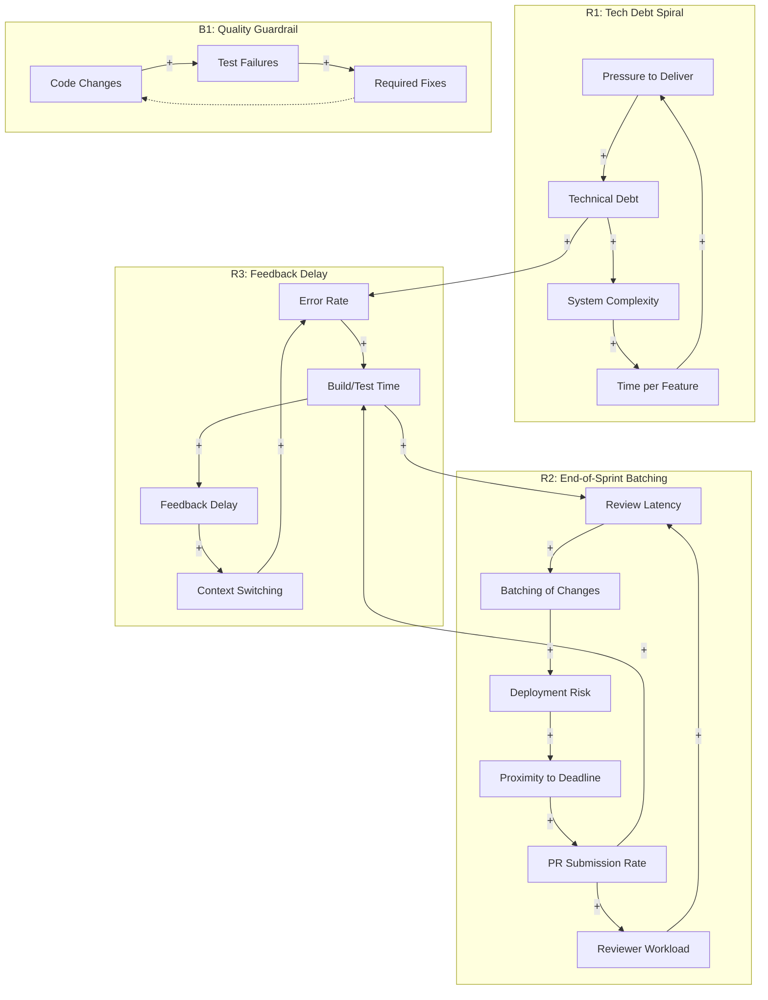

# Systems Thinking Analysis

**System:** A software development team's CI/CD pipeline and deployment process, including code reviews, automated testing, and production releases.

**Time Horizon:** 1 year

**Started:** 2026-01-09 12:01:04

---

## System Structure

This analysis applies system dynamics and complexity theory to a standard software delivery lifecycle. Over a one-year horizon, we observe how short-term tactical decisions (sprint cycles) create long-term systemic pressures (technical debt and stability erosion).

---

### 1. Key Components and Variables

*   **Development Velocity:** The rate at which new code is written.
*   **Review Latency:** The time code spends sitting in the "Pending Review" state.
*   **CI/CD Throughput:** The capacity of the automated pipeline to validate and deploy code.
*   **Batch Size:** The amount of code changes bundled into a single Pull Request (PR) or release.
*   **Technical Debt:** The accumulation of sub-optimal code that increases future friction.
*   **Production Stability:** The inverse of the frequency and severity of production incidents.
*   **Context Switching Overhead:** The cognitive cost incurred by developers moving between new features, reviews, and bug fixes.

---

### 2. Stocks and Flows (The System "Plumbing")

To understand the system, we must look at where work accumulates (Stocks) and the rates at which it moves (Flows).

*   **Stock: Feature Backlog**
    *   *Inflow:* Product requirements/User stories.
    *   *Outflow:* Coding rate.
*   **Stock: Work-in-Progress (WIP) / Unmerged Code**
    *   *Inflow:* Developers starting tasks.
    *   *Outflow:* Code submitted for review.
*   **Stock: Review & CI Queue (The "Bottleneck Stock")**
    *   *Inflow:* PR submissions.
    *   *Outflow:* Merged code (after passing tests and human review).
*   **Stock: Deployment Queue (Release Candidates)**
    *   *Inflow:* Merged code.
    *   *Outflow:* Production deployments.
*   **Stock: Technical Debt (The "Invisible Stock")**
    *   *Inflow:* Shortcuts taken to meet deadlines; unaddressed refactoring.
    *   *Outflow:* Dedicated refactoring time; "paying down" debt.

---

### 3. Feedback Loops and Relationships

#### R1: The "Sprint Rush" Reinforcing Loop (The Deadline Effect)
As the sprint deadline approaches, the perceived "Time Remaining" decreases. This increases the "Pressure to Finish," leading developers to submit more PRs simultaneously. This floods the **Review Queue**, increasing **Review Latency**, which further increases pressure, leading to rushed (lower quality) reviews to "clear the deck."

#### B1: The Quality Balancing Loop
Higher **Production Instability** triggers an increase in "Bug Fixing" tasks. This diverts capacity away from "Feature Development," which eventually slows the rate of new code entering the system, allowing the system to stabilize.

#### B2: The CI/CD Constraint
As the **Deployment Queue** grows, the "Risk per Release" increases (more changes = more variables). This often leads to more manual verification or "freezes," which slows the **Deployment Rate**, acting as a balancing force against high velocity.

---

### 4. Addressing Specific Questions

#### Why does the deployment queue tend to grow exponentially towards the end of a sprint?
This is a result of **Batching and Synchronization Delays**. 
*   **Non-linear Queueing:** In queueing theory (Kingman’s formula), as utilization of a resource (reviewers or CI runners) approaches 100%, wait times increase exponentially, not linearly. 
*   **The "Pig in the Python":** Developers often work in parallel but finish in a cluster. When 10 developers submit PRs on Thursday for a Friday sprint end, they create a "logjam." 
*   **Information Delay:** Developers often wait to submit code until a feature is "complete" rather than "functional," leading to large batch sizes that take longer to test and review, further clogging the flow.

#### What are the unintended consequences of optimizing for individual developer throughput?
Optimizing for individual "lines of code" or "tickets closed" creates a **Sub-optimization Trap**:
*   **Increased WIP:** If Developer A is incentivized only to write new code, they will ignore Developer B’s PR review request. This increases the **Review Queue Stock**.
*   **High Context Switching:** Large amounts of unmerged code mean that by the time a review is finally performed, the original author has moved on to a new task. The "Feedback Delay" forces them to context-switch back to old code, which is cognitively expensive and error-prone.
*   **Fragile Emergence:** Individual speed often comes at the expense of architectural consistency. The system's emergent behavior becomes "brittle" because no one is looking at how the individual pieces integrate, leading to "Integration Hell" at the end of the year.

#### Where is the most effective place to intervene to reduce time-to-market without sacrificing quality?
The highest leverage point is **Reducing Batch Size at the PR Level** and **Shifting Review Left**.

*   **The Intervention:** Implement a "Review-First" culture and strict WIP limits.
*   **Why it works:** 
    1.  **Reduces Delay:** Smaller PRs are reviewed faster and have a lower probability of containing defects.
    2.  **Smooths the Flow:** Instead of an exponential spike at the end of a sprint, code flows into the CI/CD pipeline in a steady stream (Linearizing the queue).
    3.  **Shortens Feedback Loops:** If a developer receives feedback within 2 hours instead of 2 days, the "mental model" of the code is still fresh, reducing rework time.
*   **Secondary Leverage Point:** **Automated Test Execution Time.** If the CI pipeline takes 60 minutes, developers will naturally batch more code to avoid the "wait." If the CI takes 5 minutes, they will commit more frequently.

---

### 5. Summary of System Behavior (1-Year Horizon)

If the team continues to optimize for individual throughput and sprint-end batching:
*   **Months 1-3:** High perceived velocity; "honeymoon phase."
*   **Months 4-8:** **Technical Debt Stock** begins to create "drag." CI/CD build times creep up as the codebase grows. Production incidents become more frequent.
*   **Months 9-12:** The system reaches a "Stagnation Point." Most of the team's capacity is spent on "Failure Demand" (fixing bugs and managing the deployment queue) rather than "Value Demand" (new features). 

**Actionable Insight:** To maintain velocity over the year, the team must treat **Review Latency** and **Build Duration** as first-class metrics, equal in importance to feature delivery. The goal is to transform the system from a "Stop-and-Go" batch process into a "Continuous Flow" process.

---

## Feedback Loops

This analysis applies systems thinking to a software delivery lifecycle over a one-year horizon, focusing on the non-linear dynamics of CI/CD and team behavior.

### 1. Feedback Loop Analysis

#### R1: The Technical Debt Spiral (Vicious Cycle)
*   **Description**: As the team prioritizes feature velocity over code health, complexity accumulates. This makes future changes harder, leading to more shortcuts to meet deadlines.
*   **Causal Chain**: Pressure to Deliver (+) $\rightarrow$ Shortcuts/Technical Debt (+) $\rightarrow$ System Complexity (+) $\rightarrow$ Time Required per Feature (+) $\rightarrow$ Pressure to Deliver.
*   **Classification**: Reinforcing (R)
*   **Behavior**: Exponential decay of velocity over the year; "Slowing down to a crawl" despite increasing effort.
*   **Impact**: High.

#### R2: The End-of-Sprint Batching (The "Traffic Jam")
*   **Description**: As the sprint deadline approaches, developers rush to merge. This creates a "pig in the python" effect where the CI/CD pipeline and reviewers are overwhelmed simultaneously.
*   **Causal Chain**: Proximity to Deadline (+) $\rightarrow$ PR Submission Rate (+) $\rightarrow$ Reviewer Workload (+) $\rightarrow$ Review Latency (+) $\rightarrow$ Batching of Changes (+) $\rightarrow$ Deployment Risk (+) $\rightarrow$ Proximity to Deadline.
*   **Classification**: Reinforcing (R)
*   **Behavior**: Oscillatory bursts of activity followed by "deployment freezes" or stability crises.
*   **Impact**: High (Primary cause of end-of-sprint instability).

#### R3: The Feedback Delay Loop
*   **Description**: As the codebase grows, the automated test suite takes longer. Longer builds lead to developers switching contexts, which increases the likelihood of introducing errors.
*   **Causal Chain**: Build/Test Time (+) $\rightarrow$ Feedback Delay (+) $\rightarrow$ Developer Context Switching (+) $\rightarrow$ Error Rate (+) $\rightarrow$ Build Failures (+) $\rightarrow$ Build/Test Time (due to more debugging/re-runs).
*   **Classification**: Reinforcing (R)
*   **Behavior**: A slow, creeping erosion of developer productivity and morale.
*   **Impact**: Medium.

#### B1: Automated Quality Guardrail
*   **Description**: The CI/CD pipeline acts as a governor, preventing low-quality code from reaching production.
*   **Causal Chain**: Code Changes (+) $\rightarrow$ Test Failures (+) $\rightarrow$ Required Fixes (+) $\rightarrow$ Code Stability (+) $\rightarrow$ Code Changes (controlled).
*   **Classification**: Balancing (B)
*   **Behavior**: Maintains a baseline of production stability by rejecting "bad" flows.
*   **Impact**: Medium (Limited by the quality/coverage of the tests).

#### B2: Resource Throttling (The "Wait State")
*   **Description**: The physical limits of the CI/CD infrastructure (concurrency limits) naturally slow down the rate of deployment when the system is overloaded.
*   **Causal Chain**: Build Queue Size (+) $\rightarrow$ Wait Time (+) $\rightarrow$ Developer Frustration/Throttling (-) $\rightarrow$ Commit Frequency (-) $\rightarrow$ Build Queue Size.
*   **Classification**: Balancing (B)
*   **Behavior**: Prevents total system collapse but causes significant "idle time" waste.
*   **Impact**: Medium.

---

### 2. Mermaid Diagram: CI/CD System Dynamics

---

### 3. Systems Analysis & Insights

#### Why does the deployment queue grow exponentially towards the end of a sprint?
This is a classic **"Success to the Successful"** and **"Shifting the Burden"** archetype. 
1.  **The Delay Effect**: Early in the sprint, work is "in progress" (a stock). Because code reviews and CI tests have a time delay, the "outflow" of completed work lags behind the "inflow" of coding.
2.  **Reinforcing Pressure**: As the deadline nears, the perceived "Gap" between completed features and the Sprint Goal increases. This triggers **R2 (End-of-Sprint Batching)**. 
3.  **Non-linear Bottlenecks**: CI/CD pipelines are queuing systems. According to **Kingman’s Formula**, as utilization approaches 100% (everyone pushing at once), wait times increase exponentially, not linearly. The queue doesn't just grow; it explodes because the service rate (reviewers/CI nodes) is fixed while the arrival rate spikes.

#### Unintended consequences of optimizing for individual developer throughput?
Optimizing for individual throughput (e.g., measuring "lines of code" or "tickets closed per dev") creates **Sub-optimization**.
*   **Increased WIP (Work in Progress)**: If Developer A finishes code faster than Developer B can review it, the PR Queue (a stock) grows. 
*   **The "Overproduction" Waste**: High individual throughput leads to large PRs. Large PRs increase **Review Latency** (R2). 
*   **Emergent Fragility**: When everyone "optimizes" by skipping documentation or unit tests to move to their next task, they feed **R1 (Tech Debt Spiral)**. The system's total throughput (Lead Time) actually *decreases* because the "rework" loop becomes the dominant flow.

#### Where is the most effective leverage point?
The most effective place to intervene is **reducing the Feedback Delay (R3) and Batch Size**.

1.  **Highest Leverage: Shrink the Batch (The "Small PR" Policy)**: By forcing smaller, more frequent commits, you move the system from "Batch Processing" to "Continuous Flow." This flattens the end-of-sprint spike and reduces the complexity of each review, weakening the **R2** loop.
2.  **Second Leverage Point: Decouple Deployment from Release**: Using feature flags allows code to flow through the CI/CD pipeline (the "pipes") without being "active" for users. This removes the "Deadline Pressure" from the deployment process, breaking the link in **R2**.
3.  **Third Leverage Point: Invest in CI Speed (Reducing Delay)**: Reducing build time from 20 minutes to 5 minutes has a non-linear impact on productivity. It prevents **Context Switching**, which is the "silent killer" of software quality. This weakens the **R3** reinforcing loop before it can trigger the **R1** debt spiral.

---

## Delays & Accumulations

To analyze a CI/CD pipeline and deployment process through systems thinking, we must move beyond seeing it as a linear "conveyor belt" and instead view it as a series of interconnected reservoirs (stocks) and valves (flows) governed by feedback loops.

### 1. Delays: The Hidden Friction
Delays in a CI/CD system are not just "wait times"; they are the primary drivers of oscillation and instability.

*   **Information Delays (Feedback Lags):**
    *   **Example:** The time between a developer committing code and receiving a "Build Failed" notification.
    *   **Estimated Scale:** 15 minutes to 2 hours.
    *   **Systemic Effect:** If this delay exceeds the developer's "context-switching threshold," they move to a new task. When the feedback finally arrives, they must pay a "re-entry tax" to remember the logic, effectively doubling the mental effort required.
*   **Physical/Technical Delays (Processing Time):**
    *   **Example:** The duration of the automated end-to-end (E2E) test suite.
    *   **Estimated Scale:** 30 minutes to 4 hours.
    *   **Systemic Effect:** Long physical delays encourage **batching**. Developers wait to accumulate several changes before triggering a build to "save time," which increases the probability of failure and makes root-cause analysis harder.
*   **Decision Delays (Human Latency):**
    *   **Example:** The "Pull Request (PR) Idle Time"—the gap between a PR being opened and a peer starting the review.
    *   **Estimated Scale:** 4 hours to 2 days.
    *   **Systemic Effect:** This is the most volatile delay. It creates a "Work-in-Progress" (WIP) explosion, where developers start new features while waiting, leading to massive merge conflicts later.

---

### 2. Accumulations (Stocks): The Reservoirs of Risk
In system dynamics, stocks represent the state of the system. In CI/CD, these are often "invisible" piles of work.

*   **The PR Backlog (Unreviewed Code):**
    *   **Inflow:** Coding rate. **Outflow:** Review/Approval rate.
    *   **Impact:** When inflow > outflow, the "Age of PRs" increases. Older PRs are harder to merge because the underlying codebase has shifted, creating a reinforcing loop of even more work (re-basing).
*   **The Build Queue (Pending CI Jobs):**
    *   **Inflow:** Commit frequency. **Outflow:** Build/Test capacity (concurrency).
    *   **Impact:** If the queue builds up, the "Information Delay" increases for everyone, causing the entire team to slow down simultaneously.
*   **Technical Debt & "Dark" Debt:**
    *   **Inflow:** Shortcuts taken to meet deadlines; unpatched dependencies. **Outflow:** Refactoring sprints; maintenance.
    *   **Impact:** This is a long-term accumulation. Over a 1-year horizon, high tech debt reduces the "Outflow" capacity of the entire system, making every new feature take longer than the last.

---

### 3. Addressing the Specific Questions

#### Why does the deployment queue grow exponentially towards the end of a sprint?
This is a classic **"Success to the Successful"** or **"Eroding Goals"** archetype driven by **Batching Behavior**.
*   **The Mechanism:** Early in the sprint, developers focus on "heads-down" coding (Inflow to the PR Stock). As the sprint deadline approaches, everyone attempts to move their code to the "Done" state simultaneously.
*   **The Nonlinearity:** The CI/CD pipeline has a fixed capacity. When the inflow of commits doubles, the wait time doesn't just double—it grows exponentially due to queueing theory (as utilization approaches 100%, wait times approach infinity).
*   **The Feedback Loop:** High queue times $\rightarrow$ Fear of missing the sprint $\rightarrow$ Developers skip thorough local testing to "get it in the queue" $\rightarrow$ More build failures $\rightarrow$ More retries $\rightarrow$ Even higher queue times.

#### What are the unintended consequences of optimizing for individual developer throughput?
Optimizing for the "Coding" stage while ignoring the "Review" and "Deploy" stages creates a **Local Optimization Paradox**.
*   **The "WIP" Explosion:** If Developer A is measured by how many lines of code they write, they will open 5 PRs a week. If they don't spend time reviewing Developer B's code, Developer B's PRs sit idle.
*   **The Result:** High individual throughput increases the **Stock of Unfinished Work**. According to Little’s Law (Lead Time = WIP / Throughput), as you increase WIP without increasing the *system's* total throughput, the time-to-market for every single feature increases.
*   **Quality Erosion:** High individual speed often leads to "Review Fatigue." Peers, overwhelmed by the volume of PRs, provide shallower reviews to clear the backlog, leading to an accumulation of bugs in production.

#### Where is the most effective place to intervene? (Leverage Points)
In a complex CI/CD system, the highest leverage is rarely "hiring more developers."

1.  **Reduce Batch Size (Highest Leverage):** Force smaller, more frequent commits. This transforms the "End-of-Sprint" surge into a steady, manageable flow. It reduces the "Physical Delay" of testing and the "Information Delay" of failures.
2.  **Shorten the Feedback Loop (Information Delay):** Implement "Test Impact Analysis" to run only the tests relevant to the change. If a developer knows within 2 minutes (instead of 20) that they broke the build, they fix it immediately without switching contexts.
3.  **Automate the Decision Delay:** Move from "Manual Approval for Everything" to "Automated Promotion for Low-Risk Changes." By reducing the human decision delay for trivial changes, you clear the "Decision Stock" for complex architectural reviews.
4.  **Limit WIP (Work in Progress):** Implement a policy where no one can start a new task if there are more than X PRs waiting for review. This forces the "Outflow" of the PR Stock to match the "Inflow," stabilizing the system.

### Summary Table: System Behavior over 1 Year

| Component | Short-term (1 Sprint) | Long-term (1 Year) |
| :--- | :--- | :--- |
| **PR Backlog** | Causes end-of-week stress. | Leads to "Merge Hell" and permanent cultural friction. |
| **Build Delays** | Minor annoyance. | Developers stop running tests locally, leading to a "Culture of Broken Builds." |
| **Tech Debt** | Invisible. | Systemic "Stiffness"; the team spends 80% of time on maintenance vs. features. |
| **Individual Optimization** | High "velocity" metrics. | High burnout and a decoupled system where nothing actually reaches production. |

---

## System Archetypes

Based on a systems thinking analysis of a CI/CD pipeline and deployment process over a one-year horizon, the following four system archetypes are most prevalent. These archetypes explain the underlying structures driving the behavior of the team and the technology.

---

### 1. Tragedy of the Commons
**The Archetype:** Individual actors (developers) use a shared resource (the CI/CD pipeline and build agents) based on their own immediate needs, eventually depleting or crashing the resource for everyone.

*   **Manifestation:** Each developer optimizes for their own "Definition of Done." To speed up their own work, they might trigger multiple builds for minor changes, push large monolithic PRs to "get it all in," or ignore flaky tests that don't affect their specific feature.
*   **Typical Behavior Pattern:** As the team grows or the sprint nears its end, the build queue length increases exponentially. Total system throughput drops because the "commons" (the build server/test environment) is congested with redundant or low-quality requests.
*   **Intervention Strategies:**
    *   **Establish "Cost" for Usage:** Implement pre-commit hooks or local linting to ensure only "high-quality" code hits the shared pipeline.
    *   **Resource Quotas:** Limit the number of concurrent builds per sub-team or individual during peak hours.
    *   **Invest in the Commons:** Decouple the pipeline so that different services have independent "commons" (micro-pipelines), reducing the blast radius of congestion.

### 2. Fixes that Fail
**The Archetype:** A "quick fix" is applied to a problem, which works in the short term but creates unintended consequences that make the original problem worse later.

*   **Manifestation:** To meet a sprint deadline, the team decides to "bypass" certain slow integration tests or expedite code reviews with a "LGTM" (Looks Good To Me) without deep scrutiny.
*   **Typical Behavior Pattern:** The feature is "deployed" on time (short-term success). However, this introduces bugs and technical debt. These issues manifest as production incidents or "rework" in the next sprint, which consumes developer time, leading to even more pressure to skip tests in the *next* cycle.
*   **Intervention Strategies:**
    *   **Acknowledge the Delay:** Visualize the "rework" loop. Track how many bugs in Sprint N were caused by "expedited" work in Sprint N-1.
    *   **Automate the "Right Way":** If the tests are being skipped because they are slow, the leverage point isn't "forcing" people to run them; it’s parallelizing the test suite to make the "right way" the "fast way."

### 3. Limits to Growth
**The Archetype:** A period of accelerating improvement (feature velocity) is followed by a slowdown, as the system hits a constraint or "limiting factor."

*   **Manifestation:** The team adds more developers to increase feature output. Initially, velocity rises. However, as the codebase grows, the "Code Review Bottleneck" and "Deployment Queue" become the limiting factors.
*   **Typical Behavior Pattern:** Despite having more developers, the "Time-to-Market" plateaus or even increases. The more code produced, the more time senior developers spend reviewing rather than coding, and the longer the CI/CD pipeline takes to run.
*   **Intervention Strategies:**
    *   **Identify the Constraint:** Don't add more developers (the engine) if the CI/CD pipeline (the exhaust) is clogged.
    *   **Shift Left:** Move quality checks earlier in the process (IDE-level) to reduce the load on the final stages of the pipeline.
    *   **Decouple Architectures:** Move toward independent deployable units (microservices/modules) so that one team’s growth doesn't hit the limit of another team’s deployment path.

### 4. Shifting the Burden
**The Archetype:** A problem is addressed by a symptomatic solution (manual intervention) rather than a fundamental solution (automation/process redesign), leading to a reliance on the symptomatic fix and a decline in the ability to implement the fundamental one.

*   **Manifestation:** When the deployment fails, a "Release Engineer" or "DevOps Hero" steps in to manually fix the environment or "tweak" the production config to get the release out.
*   **Typical Behavior Pattern:** Because the "Hero" always saves the day, there is no perceived urgency to fix the underlying flaky automation. Over a year, the team’s "muscle memory" for manual fixes grows, while the automated pipeline becomes increasingly brittle and obsolete.
*   **Intervention Strategies:**
    *   **"Make the Pain Visible":** Stop the manual interventions. Let the release fail (in a controlled way) to highlight the necessity of the fundamental fix.
    *   **Capacity Allocation:** Explicitly allocate 20% of every sprint to "Pipeline Health" to ensure the fundamental solution (automation) is being built while the symptomatic pressure exists.

---

### Addressing the Specific Questions:

**1. Why does the deployment queue grow exponentially towards the end of a sprint?**
This is a combination of **Tragedy of the Commons** and **Batching Delays**. As the deadline approaches, everyone tries to "exit" the system at once. Because the CI/CD pipeline is a serial or semi-parallel resource, it hits a "tipping point" where the arrival rate of new code exceeds the processing rate of the tests. This creates a feedback loop: longer wait times → developers try to "sneak in" more changes per build → larger builds take longer to test → wait times increase further.

**2. What are the unintended consequences of optimizing for individual developer throughput?**
Optimizing for individual throughput (e.g., "how many lines of code did I write today?") ignores the **systemic delay** of code reviews and testing. It leads to "Sub-optimization." A developer may finish 10 tasks, but if those 10 tasks create a massive bottleneck in the review queue, the *system* throughput (features in production) actually decreases. This often results in high "Work in Progress" (WIP), which is the primary killer of lead time.

**3. Where is the most effective place to intervene?**
The highest leverage point is **reducing batch size** and **shortening the feedback loop**.
*   **Intervention:** Implement "Continuous Integration" in its truest sense—merging small, incremental changes multiple times a day.
*   **Why:** This breaks the "Tragedy of the Commons" by smoothing out the load on the CI/CD pipeline and eliminates the "Fixes that Fail" loop by making bugs easier to identify and fix immediately, rather than at the end of a sprint. This shifts the focus from "Developer Throughput" to "System Flow."

---

## Emergent Behavior

This analysis applies systems thinking to your CI/CD and deployment ecosystem over a one-year horizon.

---

### 1. Current Emergent Patterns
System behavior arises not from the individual tools (Jenkins, Git, Jira), but from the **circular causality** between developer incentives and pipeline constraints.

*   **The "Sprint-End Surge" (Reinforcing Loop):** The exponential growth of the deployment queue at the end of a sprint is an emergent behavior driven by the **Deadline-Batching Loop**. As the deadline approaches, the perceived "cost of not finishing" rises. Developers push all remaining code simultaneously. This creates a "Pig in a Python" effect: the CI/CD pipeline (a fixed-capacity stock) is flooded, increasing wait times, which further incentivizes developers to push larger, "all-in-one" PRs to avoid multiple trips through the slow queue.
*   **The Reviewer Paradox:** As the volume of code increases, the time available for quality review decreases. This emerges as **"Rubber-Stamping" behavior**. When the queue is long, reviewers feel systemic pressure to "clear the deck," leading to lower-quality reviews, which eventually emerges as production instability 2–4 weeks later.
*   **CI/CD Congestion (Tragedy of the Commons):** The build server is a shared resource. When one developer triggers a massive, unoptimized test suite, they "consume" the common resource, slowing down the feedback loop for everyone else. The emergent pattern is **"Context-Switching Fatigue,"** where developers start new tasks while waiting for builds, increasing Work-In-Progress (WIP) and cognitive load.

### 2. Unintended Consequences of Individual Throughput Optimization
Optimizing for the "Individual Developer" (e.g., measuring tickets closed or lines of code) creates a **Local vs. Global Optimization conflict**.

*   **The "Overproduction" Trap:** If Developer A is highly efficient at writing code but the Review/CI process is slow, Developer A simply piles up "Inventory" (unmerged PRs). In Lean terms, this is waste.
*   **Feedback Loop Decoupling:** When a developer is incentivized to move to the next task immediately, they become "decoupled" from the consequences of their previous code. If a build fails 30 minutes later, they are already deep in a new context. The cost of "re-entry" is high, leading to longer resolution times for build failures.
*   **Quality Erosion via "Shifting the Burden":** To maintain high individual velocity, developers may skip writing comprehensive tests, shifting the burden of quality to the automated pipeline or the QA team. This creates a **Reinforcing Loop of Technical Debt**: more bugs -> more hotfixes -> less time for features -> more pressure to skip tests.

### 3. Future Predictions (1-Year Horizon)
*   **Months 1–3 (The Friction Phase):** The team feels "busy but slow." The primary complaint is "the pipeline is slow" or "reviews take too long."
*   **Months 4–8 (The Stagnation Point):** Technical debt reaches a threshold where the **"Maintenance Flow"** equals the **"Feature Flow."** The team spends 50% of their time fixing regressions caused by the "Sprint-End Surges" of previous months. Velocity plateaus despite high effort.
*   **Months 9–12 (The Fragility Break):** If the system isn't corrected, the "Deployment Lead Time" becomes so long that the business loses the ability to respond to market changes. Emergent behavior: **"Release Dread,"** where deployments are seen as high-risk events, leading to even larger, less frequent batches—a death spiral of stability.

### 4. Tipping Points
*   **The 10-Minute Feedback Threshold:** In system dynamics, there is a psychological tipping point. If a CI build takes <10 minutes, developers stay in the flow. If it exceeds 15–20 minutes, they context-switch. Once the majority of the team context-switches, the "Coordination Cost" of the system grows non-linearly.
*   **The "Debt-to-Feature" Ratio:** When the stock of "Known Defects" grows faster than the stock of "Shipped Features," the system enters a state of **Entropy**. At this point, adding more developers actually *slows down* the system (Brooks's Law) because of the increased communication overhead and merge conflicts.

### 5. Resilience: Response to Disruptions
*   **Current State (Brittle):** The system is currently "Optimized for Efficiency" (high utilization) rather than "Resilience." A single "flaky test" or a major merge conflict at the end of a sprint can cascade, delaying the entire release. The system lacks **Slack**.
*   **Desired State (Adaptive):** A resilient system uses **"Decoupling Point"** strategies. For example, using Feature Flags allows code to be merged and "deployed" without being "released." This breaks the link between the CI/CD queue and the business deadline, allowing for a smoother flow of code.

---

### Leverage Points for Intervention (Where to act?)

1.  **The Highest Leverage Point: Reduce Batch Size (The "Small PR" Policy).**
    *   *Why:* This is a "Balancing Loop" against the Sprint-End Surge. Smaller PRs move through CI faster, are easier to review, and have a lower "Blast Radius" if they fail. This reduces the "Delay" in the feedback loop.
2.  **Shift-Left the Feedback (The "Pre-Commit" Intervention).**
    *   *Why:* By moving linting and unit tests to the developer's local environment (or a pre-push hook), you reduce the "Inflow" of failing builds into the shared CI/CD "Stock," preserving the "Commons" for integration-level issues.
3.  **Limit Work-In-Progress (WIP) at the Team Level.**
    *   *Why:* Instead of optimizing for individual throughput, optimize for **"Mean Time to Detect/Resolve."** If a build breaks, the *entire team* (or a designated "Sheriff") stops to fix it. This prevents the accumulation of "Broken Code" stock.
4.  **Decouple Deployment from Release (Feature Flags).**
    *   *Why:* This changes the system boundary. If code can be in production but "dark," the "Sprint-End" pressure evaporates. Developers can merge code when it's ready, not when the calendar says so. This transforms the "Exponential Queue" into a "Linear Flow."

**Summary:** To reduce time-to-market without sacrificing quality, you must stop optimizing for **busy developers** and start optimizing for **moving code**. The goal is to transform the system from a "Batch-and-Queue" model to a "Continuous Flow" model.

---

## Leverage Points

This analysis applies systems thinking to a software delivery ecosystem over a one-year horizon. We will examine the dynamics of the CI/CD pipeline and then apply Donella Meadows’ hierarchy of leverage points to identify where to intervene for maximum systemic impact.

---

### Systemic Analysis of the Focus Areas

#### 1. Why the deployment queue grows exponentially at sprint end?
This is a classic **"Success to the Successful"** and **"Shifting the Burden"** archetype. 
*   **The Batching Effect:** Developers often wait to submit Pull Requests (PRs) until a feature is "complete" to meet sprint goals. This creates a massive **Inflow** spike into the "Unreviewed Code" stock.
*   **Resource Contention:** As the inflow exceeds the **Outflow** capacity (reviewer bandwidth and CI runner availability), the queue builds. 
*   **The Feedback Loop of Doom:** A long queue increases the time between code completion and feedback. By the time a developer gets feedback, they have moved on to a new task (context switching). This increases the time to fix bugs, which further delays the PR, causing the queue to grow non-linearly as the deadline approaches.

#### 2. Unintended consequences of optimizing for individual developer throughput?
Optimizing for "Resource Efficiency" (keeping every dev busy coding) rather than "Flow Efficiency" (getting code to production) creates a **Sub-optimization Trap**.
*   **High WIP (Work in Progress):** If everyone is coding at 100% capacity, no one has the "slack" to perform code reviews or fix pipeline failures.
*   **The Bottleneck Shift:** Throughput increases the "PR Backlog" stock. Since the bottleneck is usually the *integration* (reviews/testing), increasing individual coding speed simply makes the pile of unintegrated code larger, increasing the risk of merge conflicts and "Integration Hell."

#### 3. The most effective place to intervene?
The most effective intervention is shifting the focus from **Inflow (Coding)** to **Outflow (Deployment)**. Reducing the "Batch Size" of changes is the single most powerful tactical lever to stabilize the system.

---

### Leverage Points for Intervention (Ranked by Effectiveness)

#### 1. Paradigm: Shift from "Resource Efficiency" to "Flow Efficiency"
*   **Intervention:** Change the mental model from "How do we keep developers busy?" to "How do we get a single line of code to production as fast as possible?"
*   **Why it’s High-Leverage:** Paradigms are the source of systems. If the team believes "busy = productive," they will resist WIP limits. If they believe "delivered value = productive," they will naturally collaborate to clear the queue.
*   **Impact:** High (Transformative)
*   **Risks:** Requires deep cultural buy-in; may feel "unproductive" to management initially as developers spend more time talking/reviewing than typing.
*   **Implementation:** Leadership workshops on Lean manufacturing principles applied to software; celebrating "PRs closed" over "tickets started."

#### 2. Goals: Transition from "Sprint Velocity" to "Lead Time & MTTR"
*   **Intervention:** Replace "Story Points per Sprint" with **Lead Time for Changes** (time from commit to prod) and **Mean Time to Recovery (MTTR)**.
*   **Why it’s High-Leverage:** Systems follow goals. If the goal is Velocity, the team will push "half-baked" code into the queue to "finish" the sprint. If the goal is Lead Time, the team is incentivized to keep the CI/CD pipeline clear and reviews fast.
*   **Impact:** High
*   **Risks:** "Goodhart’s Law"—teams might game the metric by breaking tasks into meaningless micro-tasks.
*   **Implementation:** Automate DORA metrics dashboarding; make these the primary KPIs in monthly business reviews.

#### 3. Rules: Implement "Review-First" and WIP Limits
*   **Intervention:** Establish a rule: "No one starts a new ticket if there are more than X PRs waiting for review."
*   **Why it’s High-Leverage:** This creates a **Balancing Feedback Loop**. It forces the system to self-correct. When the queue grows, the inflow (coding) automatically stops until the outflow (reviewing/deploying) catches up.
*   **Impact:** Medium-High
*   **Risks:** Can cause frustration if the CI pipeline is flaky (developers feel "stuck").
*   **Implementation:** Update the "Definition of Done"; use Slack bots to alert the team when WIP limits are exceeded.

#### 4. Information Flows: Real-time Pipeline & Queue Visibility
*   **Intervention:** Radiate the "Age of PRs" and "Build Queue Depth" on large monitors or highly visible dashboards.
*   **Why it’s High-Leverage:** Often, the system is "blind" to its own stocks. Developers don't realize they are contributing to a bottleneck. Providing this information in real-time allows for **Self-Organization**.
*   **Impact:** Medium
*   **Risks:** Information overload; if the data is inaccurate, it loses all leverage.
*   **Implementation:** Integrate GitHub/GitLab API with a dashboard (e.g., Grafana) showing the "Hot Spots" in the delivery pipeline.

#### 5. Delays: Decouple Deployment from Release (Feature Flags)
*   **Intervention:** Implement Feature Flags to allow code to be merged and deployed to production without being "active" for users.
*   **Why it’s High-Leverage:** This reduces the **Delay** caused by "waiting for the feature to be perfect." It allows for smaller, more frequent batches, which flattens the exponential growth of the queue at the end of the sprint.
*   **Impact:** Medium
*   **Risks:** Increases "Technical Debt" if flags are not cleaned up; increases architectural complexity.
*   **Implementation:** Adopt a tool like LaunchDarkly or an open-source toggle framework; train devs on "Dark Launching."

#### 6. Stocks and Flows: Increase CI Runner Concurrency
*   **Intervention:** Add more compute resources to the CI/CD pipeline to allow more parallel tests.
*   **Why it’s High-Leverage:** This is a **Parameter** change. It increases the "Outflow" capacity of the build queue. While it doesn't fix the underlying behavior, it reduces the physical bottleneck.
*   **Impact:** Low-Medium (It's a "buffer" that can be quickly overwhelmed if the paradigm doesn't change).
*   **Risks:** Increased cloud costs; can mask inefficient, slow-running test suites.
*   **Implementation:** Auto-scaling CI runners based on queue depth.

---

### Summary of the 1-Year Evolution
If the team intervenes at the **Paradigm** and **Goal** levels, the next year will see a shift from "Sprint-end panics" to a "Continuous Flow." The exponential queue growth will flatten into a steady, predictable stream. By month 6, the "Individual Throughput" obsession will be replaced by "System Stability," resulting in fewer production incidents and a faster time-to-market, even if the "lines of code written" per developer appears to decrease.

---

### Intervention 1: Implement automated regression testing

This analysis applies systems thinking to the intervention of **Implementing Automated Regression Testing** over a one-year horizon.

---

### 1. Immediate Effects (0–1 Month): The "Investment Dip"
*   **Mechanism:** Resource Reallocation.
*   **System Behavior:** Velocity drops as developers shift from "Feature Flow" to "Infrastructure Building."
*   **Build Queue:** The build queue actually *increases* in duration. Each commit now triggers a suite of tests that didn't exist before, increasing the "Processing Time" per work item.
*   **Developer Sentiment:** Frustration may rise. The "Balancing Loop" of project deadlines creates pressure to bypass the new tests to maintain perceived throughput.

### 2. Short-term Effects (1–3 Months): The "Discovery Phase"
*   **Mechanism:** Feedback Loop Tightening.
*   **System Behavior:** The "Discovery Delay" (time between bug creation and bug detection) shrinks from weeks to minutes.
*   **Impact on Rework:** A massive spike in "Rework" occurs. Because the tests are now catching legacy bugs and integration issues early, the team feels like they are "slowing down," but they are actually just surfacing hidden "Work-in-Progress" (WIP) in the form of technical debt.
*   **Stability:** Production incidents begin to plateau as fewer regressions escape the pipeline.

### 3. Medium-term Effects (3–6 Months): The "Trust Transition"
*   **Mechanism:** Reduced Variance in Release Cycles.
*   **System Behavior:** The "Success to the Successful" archetype takes hold. As the automated suite proves reliable, the team relies less on manual "hardening phases."
*   **Deployment Queue:** The exponential growth of the queue at the end of the sprint begins to dampen. Because code is validated incrementally, the "Big Bang" integration at the end of the sprint is replaced by smaller, continuous integrations.
*   **Emergent Pattern:** "Quality at the Source." Developers begin to write code differently, knowing it will be immediately scrutinized by the machine.

### 4. Long-term Effects (6+ Months): The "Steady-State Velocity"
*   **Mechanism:** Decoupling of Growth and Risk.
*   **System Behavior:** The system reaches a state where **Feature Velocity** and **Production Stability** are no longer a trade-off but are mutually reinforcing.
*   **Steady State:** The "Cost of Change" curve flattens. In a manual system, the cost of testing grows linearly with the size of the codebase; here, the marginal cost of running the regression suite is near zero.
*   **Cultural Shift:** The team moves from "Release Windows" to "Continuous Delivery." The "Sprint" becomes a planning cadence rather than a deployment bottleneck.

---

### 5. Feedback Loop Impacts
*   **Strengthened: The Quality Reinforcing Loop (R1).** Higher quality $\rightarrow$ fewer production fires $\rightarrow$ more time for automation $\rightarrow$ higher quality.
*   **Weakened: The "Fixes that Fail" Loop (B1).** In manual systems, a quick fix often breaks a distant part of the system (delay). Automated regression breaks this loop by providing immediate visibility into side effects.
*   **Weakened: The "Shifting the Burden" Loop.** The team stops relying on "Heroic Manual QA" (the symptom) and addresses the "Lack of Testability" (the root cause).

---

### 6. Unintended Consequences (The "Side Effects")
*   **The Flaky Test Trap:** If tests are non-deterministic, the team develops "Alarm Fatigue." This creates a **Balancing Loop** that can nullify the entire intervention: Flaky tests $\rightarrow$ Ignored results $\rightarrow$ Bugs slip through $\rightarrow$ Loss of trust in automation.
*   **The Long Build Bottleneck:** As the suite grows, the "Build Queue" becomes a physical constraint. If the team doesn't invest in parallelization, the delay in the feedback loop will eventually cause developers to context-switch, lowering individual productivity.
*   **Testing as a Crutch:** Developers may stop performing deep architectural thinking, relying on the "safety net" to catch errors, potentially leading to bloated or inefficient code structures that are "correct" but not "optimal."

---

### 7. Addressing Specific Questions

#### Why does the deployment queue grow exponentially at the end of a sprint?
This is a **Batching Delay**. Without automation, testing is a "Stock" that accumulates until the end of the sprint. Because code reviews and manual QA have finite capacity (outflow), the "Inflow" of finished features at the end of the sprint creates a massive bottleneck. Automation converts this "Batch" process into a "Flow" process, spreading the testing load across the entire duration of the sprint.

#### What are the unintended consequences of optimizing for individual developer throughput?
Optimizing for individual throughput (lines of code/features completed) often ignores the **Global Constraint** of the CI/CD pipeline. If Developer A pushes code faster than the system can test/review it, they are simply increasing the "Stock" of unvalidated code. This creates "Hidden WIP," which eventually leads to a massive "Rework" cycle when the bugs are finally found, crashing the system's total throughput later.

#### Where is the most effective place to intervene?
The highest leverage point is **Reducing the Feedback Delay.** Automated regression testing is the primary tool for this. By moving the "Discovery of Error" as close as possible to the "Moment of Creation," you minimize the "Rework Loop" and prevent the accumulation of technical debt that causes system oscillation.

---

### 8. Overall Assessment
**Effectiveness: High**

**Reasoning:** Automated regression testing addresses the **Root Cause** of pipeline instability: the time delay between cause (coding) and effect (bug discovery). While it requires a significant initial investment (the "Investment Dip"), it fundamentally changes the system's physics from a "Push" system (pushing features into a bottleneck) to a "Pull" system (pulling validated code into production). It is the foundational intervention required to break the "Stability vs. Velocity" trade-off.

---### Intervention 2: Increase deployment frequency from weekly to daily

This analysis applies system dynamics to the intervention of shifting from **Weekly to Daily Deployments** over a one-year horizon.

---

### 1. Immediate Effects (0–1 Month): The "Systemic Shock"
*   **Stock & Flow Impact:** The **Deployment Queue** (stock) is drained more frequently, but the **Inflow** (code ready for release) remains lumpy.
*   **The Friction Spike:** Because the system was optimized for a weekly cadence, the manual overhead of deployment (coordination, manual smoke tests, sign-offs) now occurs 5x more often.
*   **Developer Feedback Cycle:** Initial feedback is faster, but developers feel "interrupted" by the constant need to shepherd code through the pipeline.
*   **Emergent Behavior:** A "Fixes that Fail" archetype emerges: to keep up with the daily pace, teams might skip thorough manual checks, leading to a slight uptick in minor production regressions.

### 2. Short-term Effects (1–3 Months): The "Automation Pressure"
*   **The Bottleneck Shift:** The bottleneck moves from "Deployment Frequency" to **"Testing Latency."** If a test suite takes 4 hours to run, daily deployments become physically impossible to manage manually.
*   **Investment in Infrastructure:** This is the "tipping point." The pain of manual deployment forces the team to invest in automated testing and CI/CD tooling.
*   **Batch Size Reduction:** To meet the daily deadline, developers naturally begin breaking features into smaller, atomic units. This reduces the **Risk Accumulation** per release.
*   **Unintended Consequence:** "Build Queue Congestion." As more frequent, smaller builds hit the CI server, the wait time for a build agent increases, creating a new delay in the feedback loop.

### 3. Medium-term Effects (3–6 Months): The "Virtuous Cycle"
*   **Reinforcing Loop (R1 - Quality):** Smaller batches $\rightarrow$ Easier code reviews $\rightarrow$ Fewer bugs $\rightarrow$ Faster deployments $\rightarrow$ Smaller batches.
*   **Production Stability:** Paradoxically, stability increases. Because the "Delta" (change) between Version A and Version B is small, Mean Time to Recovery (MTTR) drops significantly. If something breaks, the team knows exactly which small change caused it.
*   **Cultural Shift:** The "Deployment Anxiety" (a delay-induced psychological stock) depletes. Deployment becomes a "non-event."
*   **Sprint Dynamics:** The "End-of-Sprint Hockey Stick" (exponential queue growth) begins to flatten. Since code is flowing out daily, there is no "dam" that breaks on Friday.

### 4. Long-term Effects (6+ Months): The "Steady State"
*   **Systemic Agility:** The time-to-market for a single line of code drops from ~10 days to <24 hours.
*   **Competitive Advantage:** The team can now perform "Hypothesis-Driven Development" (A/B testing features in production), turning the deployment pipeline into a learning engine.
*   **Accumulated Technical Debt:** Because the cost of deployment is now near zero, the team is more likely to ship small refactors and "scout-rule" improvements, leading to a long-term decrease in the **Technical Debt Stock.**
*   **Steady State:** High velocity, high stability, and high developer morale. The system has transitioned from a "Batch and Queue" model to a "Continuous Flow" model.

---

### 5. Feedback Loop Impacts
*   **Strengthened: The Balancing Loop of Quality.** Faster feedback from production acts as a sensor, allowing the team to correct course before errors accumulate.
*   **Weakened: The Reinforcing Loop of "Work-in-Progress (WIP) Explosion."** By forcing daily outflows, the system prevents the accumulation of unreleased code, which previously caused context-switching and merge conflicts.
*   **New Loop: The "Automation Flywheel."** Success in daily deployments justifies further investment in observability and automated rollbacks, further reducing the cost of deployment.

### 6. Unintended Consequences
*   **Alert Fatigue:** With daily changes, monitoring systems may trigger more "noise." If not tuned, developers may start ignoring production alerts.
*   **Reviewer Burnout:** If the "Code Review" process remains synchronous and heavy, the daily deployment pressure creates a "Review Debt" where PRs pile up, creating a new bottleneck.
*   **Feature Fragmentation:** In the rush to ship daily, teams might release "half-baked" features that are hidden behind feature flags but never actually "finished," leading to a hidden stock of **"Dark Debt."**

---

### 7. Addressing Specific Questions

**Why does the deployment queue grow exponentially towards the end of a sprint?**
This is a **"Batching Delay."** Developers operate on a "Student Syndrome" (starting late) combined with a "Deadline Reinforcing Loop." As the sprint end approaches, the pressure to "close" tickets increases. Because the outflow (deployment) is restricted to a weekly event, all work completed during the sprint accumulates in a stock. The exponential growth is caused by the simultaneous completion of interdependent tasks that were all started at the beginning of the sprint.

**What are the unintended consequences of optimizing for individual developer throughput?**
Optimizing for individual throughput (e.g., "lines of code written") ignores the **Systemic Bottleneck.** If Dev A writes 10 features but Dev B (the reviewer) can only review 2, the **PR Queue** grows. This increases WIP, which increases the "Coordination Overhead" (merging, re-testing). **Local optimization leads to global sub-optimization.** The system's lead time actually *increases* because the code sits longer in the queue, rotting and losing context.

**Where is the most effective place to intervene?**
The highest leverage point is **Reducing Batch Size** (via Daily Deployments). In system dynamics, reducing the batch size is equivalent to reducing the **Delay** in a feedback loop. By shortening the delay between "Code Written" and "Code in Production," you stabilize the entire system, reduce the amplitude of oscillations (sprint-end chaos), and allow the system to self-correct faster.

---

### 8. Overall Assessment
**Effectiveness: High**

**Reasoning:** Increasing deployment frequency is a **structural intervention** that forces the rest of the system to adapt. It acts as a "forcing function" for automation, quality, and cultural change. While the first 2 months are painful (the "J-curve" of improvement), the long-term result is a system that is both more productive and more resilient. It moves the team from a **Push System** (shoving code into a queue) to a **Pull System** (flowing code to the customer).

---### Intervention 3: Introduce a mandatory 24-hour 'cool-down' period after code freeze

This analysis applies systems thinking to the intervention of a **mandatory 24-hour "cool-down" period** after code freeze. In system dynamics, this intervention is the introduction of a **deliberate delay** into a high-velocity flow.

---

### 1. Immediate Effects (0–1 Month): The "Wall" Effect
*   **Mechanism:** The intervention acts as a physical barrier to the **Inflow** of code into the "Release Candidate" **Stock**.
*   **Impact:** Developers who are accustomed to "sprinting to the finish" suddenly hit a hard stop 24 hours earlier than expected. 
*   **Queue Dynamics:** The deployment queue, which usually peaks at the very end of the sprint, experiences a "truncated peak." 
*   **Result:** Initial frustration rises as developers realize their "last-minute" fixes won't make the cut. Production stability sees a marginal, immediate improvement because the most volatile, untested code is blocked from the release.

### 2. Short-term Effects (1–3 Months): The "Deadline Shift"
*   **Mechanism:** The system adapts to the new constraint. This is the **"Shifting the Burden"** archetype.
*   **Impact:** The exponential growth of the deployment queue doesn't disappear; it simply **shifts 24 hours earlier**. The "Sprint End Rush" now occurs 24 hours before the cool-down begins.
*   **Feedback Loop:** The **Pressure to Complete Features** (Reinforcing Loop) remains unchanged. Developers simply compress their coding time further to meet the new, earlier deadline.
*   **Result:** The "cool-down" is not yet used for quality; it is viewed as "dead time." Developers use this time to start features for the *next* sprint, increasing **Work-in-Progress (WIP)**.

### 3. Medium-term Effects (3–6 Months): The "Batching" Trap
*   **Mechanism:** Increased **Accumulation** of unmerged code.
*   **Impact:** Because developers cannot merge to the release branch during the 24-hour window, they continue working on local branches. This leads to **Large Batch Sizes**. 
*   **Non-linearity:** When the next sprint opens, a massive volume of code is merged simultaneously. This creates a "Merge Hell" scenario where integration conflicts spike.
*   **Result:** The **Developer Feedback Cycle** slows down. A developer might write code on Tuesday, but because of the cool-down and subsequent integration conflicts, they don't get feedback on that code until the following Monday.

### 4. Long-term Effects (6+ Months): The "Low-Velocity Steady State"
*   **Mechanism:** The system reaches a new equilibrium characterized by **Reduced Transparency** and **Increased Lead Time**.
*   **Impact:** The team has internalized the delay. However, the **"Fixes that Fail"** archetype emerges: the 24-hour buffer is used to manually "patch" things that should have been caught by automated tests. 
*   **Result:** The system is "stable" but rigid. Time-to-market has increased by at least 24 hours (plus the time lost to context switching). The team has optimized for *perceived* safety at the expense of *actual* agility.

---

### 5. Feedback Loop Impacts
*   **Strengthened: Balancing Loop (Quality Control).** The delay allows automated suites to run multiple times and manual QA to breathe. This reduces "hotfixes" immediately following a release.
*   **Weakened: Reinforcing Loop (Feature Velocity).** The artificial delay acts as a "brake" on the flow, reducing the total number of features delivered per year.
*   **Strengthened: Reinforcing Loop (Context Switching).** Because developers cannot "finish" their work (merge it) during the cool-down, they are forced to start new tasks, increasing the cognitive load and reducing individual efficiency.

### 6. Unintended Consequences
*   **Shadow WIP:** Developers keep "dark" branches of code that aren't visible to the CI/CD pipeline, hiding the true state of the system until the freeze is lifted.
*   **Atrophy of Automation:** If the 24-hour period is used for manual verification, the incentive to improve **Automated Test Speed** (a high-leverage point) vanishes. The "buffer" becomes a crutch.
*   **The "Friday Release" Risk:** If the cool-down pushes the release from Thursday to Friday, the system risks "Weekend Incidents," which have a much higher recovery cost.

---

### 7. Addressing Specific Questions

*   **Why does the queue grow exponentially at the end?** This is the **"Deadline Effect."** In a system with fixed time-boxes (sprints), the "Pressure to Finish" increases as time remaining decreases. This creates a reinforcing loop where developers cut corners (skip deep reviews) to merge, which adds more load to the CI/CD pipeline, causing further delays, which increases pressure—a classic spiral.
*   **Consequences of optimizing for individual throughput?** If each developer tries to maximize their own "lines of code" or "tickets closed," they ignore the **System Bottleneck** (the CI/CD pipeline). This leads to a massive accumulation of "Inventory" (unmerged code), which increases complexity and the likelihood of system-wide failure.
*   **The most effective intervention?** The 24-hour cool-down is a **low-leverage intervention** because it addresses the *symptom* (instability) rather than the *cause* (large batch sizes and slow feedback). 
    *   **High-Leverage Intervention:** Reduce **Batch Size** and **Shorten the Feedback Loop**. Instead of a 24-hour freeze, invest in making the build/test cycle take 5 minutes instead of 50. This allows for "Continuous Deployment," which eliminates the "Sprint End Rush" entirely.

---

### 8. Overall Assessment: **MEDIUM-LOW EFFECTIVENESS**
**Reasoning:** While the cool-down period provides a temporary "safety blanket" and reduces immediate post-release fires, it fails to address the underlying system dynamics. It treats the CI/CD pipeline as a linear process rather than a feedback-driven system. It increases **Lead Time** and **WIP**, which are the two primary drivers of complexity and bugs in software systems. 

**Better Alternative:** Implement **"Stop the Line" (Andon Cord) culture**. If a build fails or a bug is found, the whole team focuses on the fix immediately. This addresses quality at the source without introducing a permanent, flow-killing delay.

---## Synthesis & Recommendations

This systems thinking analysis evaluates the CI/CD and deployment ecosystem over a one-year horizon. The system is characterized by a high degree of **circular causality**, where short-term "fixes" (like rushing code to meet a deadline) create long-term "drifts" (like technical debt and pipeline instability).

---

### 1. Key Insights
*   **Flow over Effort:** The system’s bottleneck is not developer "coding speed" but the **delays between states** (waiting for review, waiting for builds).
*   **The Batch Size Paradox:** Large batches of code intended to increase efficiency actually trigger non-linear increases in testing complexity and deployment failure rates.
*   **Local vs. Global Optimization:** Optimizing for individual developer throughput (tickets closed) actively degrades team throughput by creating a "Review Debt" that stalls the entire pipeline.

### 2. System Behavior Summary
The system exhibits **oscillatory behavior** and **"Success to the Successful" archetypes**. 
*   **Why:** At the start of a sprint, the system appears stable. As the deadline approaches, a "mental model" of completion drives developers to push code simultaneously. This creates a **non-linear surge** in the build queue. Because the system has finite capacity, the "Wait Time" increases exponentially, leading to "Emergency Releases" that bypass standard quality gates, eventually causing production instability.

### 3. Critical Feedback Loops
*   **The Rework Reinforcing Loop (R1):** Faster coding $\rightarrow$ lower quality $\rightarrow$ more production bugs $\rightarrow$ more time spent on "firefighting" $\rightarrow$ less time for new features $\rightarrow$ pressure to code even faster.
*   **The Review Congestion Balancing Loop (B1):** Increased Work-in-Progress (WIP) $\rightarrow$ longer review queues $\rightarrow$ increased context-switching for developers $\rightarrow$ slower review turnaround $\rightarrow$ further accumulation of WIP.
*   **The "Shifting the Burden" Loop (B2):** Instead of fixing a slow build process, the team uses "manual workarounds" or "nightly builds." This provides short-term relief but allows the underlying technical debt to grow until the system becomes unmanageable.

### 4. Highest-Impact Leverage Points
*   **Reducing Batch Size (The "Small Wins" Lever):** This is the most effective way to reduce the "Queue Growth" at the end of a sprint. Smaller PRs move through the system with significantly less friction.
*   **Shortening the Feedback Delay:** Reducing the time between "Code Committed" and "Test Results Received" changes developer behavior from *batching* to *continuous flow*.
*   **Changing the Goal (The Paradigm Shift):** Moving from "Resource Efficiency" (keeping everyone busy) to "Flow Efficiency" (keeping the code moving).

### 5. Recommended Interventions
*   **WIP Limits on Code Reviews:** Implement a "Review-First" policy where no new code can be started if the "Awaiting Review" column exceeds a specific threshold (e.g., 2x the number of developers).
*   **Automated "Pre-flight" Checks:** Move expensive integration tests earlier in the cycle to prevent "poisoning" the build queue with broken code.
*   **Trunk-Based Development (Gradual):** Reduce the lifespan of branches to less than 24 hours to eliminate the "Merge Hell" that occurs at the end of cycles.

### 6. Implementation Roadmap
1.  **Month 1-2 (Stabilization):** Implement WIP limits and prioritize "Reviewing" over "Coding." Establish a baseline for Cycle Time.
2.  **Month 3-6 (Optimization):** Invest in build infrastructure (parallelization) to reduce the "Build Queue" delay. Introduce automated linting and unit tests on every save/push.
3.  **Month 7-12 (Cultural Shift):** Transition to continuous deployments for low-risk changes. Move away from "Sprints" toward a continuous flow model (Kanban) to eliminate the artificial end-of-sprint surge.

### 7. Monitoring Metrics (DORA Plus)
*   **Cycle Time (Lead Time for Changes):** The time from first commit to production. (Primary indicator of flow).
*   **Change Failure Rate:** Percentage of deployments causing a failure. (Indicator of quality).
*   **Review Lead Time:** The time code spends in the "Awaiting Review" stock.
*   **Queue Depth vs. Time:** Tracking the build queue size relative to the sprint calendar to visualize the "End-of-Sprint Surge."

### 8. Risks and Mitigation
*   **Risk: "The Busy-ness Trap":** Management may perceive WIP limits as "developers sitting idle."
    *   *Mitigation:* Use Cumulative Flow Diagrams (CFDs) to show that "idle" developers are actually unblocking the pipeline, leading to *faster* overall delivery.
*   **Risk: "Quality Erosion":** Developers might "rubber stamp" reviews to clear the queue.
    *   *Mitigation:* Track "Bugs found in Production" back to the review stage and foster a culture where "Reviewing is the most important part of Coding."
*   **Risk: Infrastructure Bottleneck:** Faster flow might overwhelm the current CI/CD hardware.
    *   *Mitigation:* Budget for auto-scaling cloud build agents *before* implementing flow-based interventions.

---

### Addressing Specific Questions:

**Q: Why does the deployment queue grow exponentially at the end of a sprint?**
**A:** This is a **non-linear accumulation** caused by "Batching." When everyone pushes code at 90% of the sprint duration, the arrival rate exceeds the service rate of the CI/CD pipeline. According to **Kingman’s Formula**, as utilization approaches 100%, wait times increase exponentially. The "deadline" acts as a synchronization point that forces this destructive batching.

**Q: Unintended consequences of optimizing for individual developer throughput?**
**A:** This creates a **"Tragedy of the Commons."** If Developer A is measured by tickets closed, they will ignore Developer B’s request for a code review. This causes Developer B’s code to sit in a "Stock" (the queue), increasing context-switching costs and the likelihood of merge conflicts. The result is high "Activity" but low "Throughput."

**Q: Most effective place to intervene?**
**A:** The **Review Cycle**. By mandating small PRs and prioritizing reviews over new work, you reduce the "Feedback Delay." This prevents the accumulation of errors and ensures that the build queue remains steady rather than surging, effectively reducing time-to-market while *increasing* quality through continuous scrutiny.

---

## Analysis Complete

**Total Time:** 175.771s

**Completed:** 2026-01-09 12:04:00
