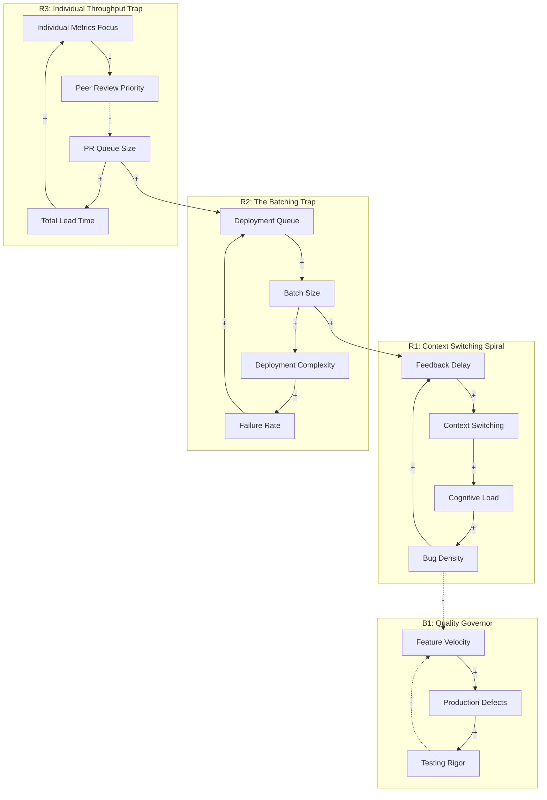

# Systems Thinking Analysis

**System:** A software development team's CI/CD pipeline and deployment process, including code reviews, automated testing, and production releases.

**Time Horizon:** 1 year

**Started:** 2026-01-15 12:57:04

---

## System Structure

This analysis applies system dynamics to a software delivery pipeline, treating it as a complex adaptive system where the goal is sustainable throughput and high stability.

---

### 1. Key Components and Variables

To understand the system, we must first identify the variables that fluctuate over time:

*   **Work in Progress (WIP):** The number of features/tickets currently being coded.
*   **Review Latency:** The time code sits waiting for a peer to review it.
*   **Batch Size:** The amount of code (LoC or complexity) included in a single Pull Request (PR) or deployment.
*   **Build/Test Duration:** The time required for the CI pipeline to validate a commit.
*   **Failure Rate (Change Failure Rate):** The percentage of deployments that cause production incidents.
*   **Context Switching Cost:** The cognitive tax paid by developers when moving between coding, reviewing, and fixing bugs.
*   **Technical Debt:** The accumulation of sub-optimal code that slows down future development.

---

### 2. Stocks and Flows

The CI/CD pipeline is a series of interconnected reservoirs (stocks) and the movement between them (flows).

*   **Stock: Feature Backlog**
    *   *Inflow:* Product requirements/User stories.
    *   *Outflow:* Developers pulling tasks into "In Progress."
*   **Stock: Code Pending Review (The Primary Bottleneck)**
    *   *Inflow:* Completed coding tasks.
    *   *Outflow:* Approved PRs moving to the Build Queue.
*   **Stock: Build/Deployment Queue**
    *   *Inflow:* Merged code.
    *   *Outflow:* Successful production releases.
*   **Stock: Technical Debt / Production Bugs**
    *   *Inflow:* Low-quality code, missed edge cases, "quick fixes."
    *   *Outflow:* Refactoring and bug-fixing efforts.

---

### 3. Relationships and Feedback Loops

#### Why the deployment queue grows exponentially towards the end of a sprint?
This is driven by a **Reinforcing Loop (R1: The Deadline Crunch)** and a significant **Delay**.
*   **The Mechanism:** As the sprint deadline approaches, the perceived "Time Pressure" increases. Developers rush to finish coding to meet "Definition of Done." This creates a massive **Inflow** into the *Code Pending Review* stock simultaneously.
*   **The Nonlinearity:** Because everyone is finishing code at the same time, no one is available to *review* code. Review Latency spikes. As the queue grows, merge conflicts increase (Non-linear complexity), which requires more rework, further clogging the queue. The "exponential" growth is the result of batching behavior meeting a fixed-capacity outflow.

#### Unintended consequences of optimizing for individual developer throughput?
This is a classic case of **Local Optimization vs. Global Sub-optimization**.
*   **The Goal:** Maximize "Tickets Closed" per developer.
*   **The Side Effect:** To maximize their own coding time, developers ignore PRs from others. This increases the *Code Pending Review* stock. 
*   **The Feedback Loop (B1: The Quality Erosion):** High individual throughput often leads to larger **Batch Sizes**. Larger batches are harder to review, leading to "rubber-stamping" (low-quality reviews). This increases the *Technical Debt* stock, which eventually creates a **Balancing Loop** that slows down the very throughput you tried to optimize, as developers spend more time on "Production Support" than new features.

---

### 4. Information Flows and Decision Points

*   **The "Merge" Decision:** This is a critical information gate. If the signal (test results) is delayed, the developer moves to a new task. When the signal finally arrives (test failed), the **Context Switching Cost** is high because the developer has lost the mental model of the previous task.
*   **The "Release" Trigger:** If releases are manual or scheduled (e.g., "Release Tuesdays"), it creates an artificial dam, causing the *Build Queue* to swell and increasing the risk of each release.

---

### 5. Leverage Points: Where to Intervene?

Based on the 1-year time horizon, here are the most effective interventions from lowest to highest leverage:

#### Low Leverage: Increasing Build Server Capacity
While reducing *Build Duration* helps, it often just moves the bottleneck to the *Review Queue*. It addresses a symptom, not the systemic cause.

#### Medium Leverage: Implementing "Review WIP Limits"
By forcing a policy where a developer cannot start a new ticket if there are more than X PRs pending review, you balance the flows. This reduces *Review Latency* and prevents the end-of-sprint "hockey stick" queue growth.

#### High Leverage: Reducing Batch Size (Continuous Deployment)
The most effective place to intervene is the **Batch Size**. 
*   **Why:** Small batches flow through the system faster, have lower merge conflict probability, and are easier to review. 
*   **Systemic Effect:** It breaks the Reinforcing Loop of the "End-of-Sprint Crunch." If code is deployed as soon as it is ready, the "Sprint" becomes an administrative boundary rather than a physical delivery boundary. This stabilizes the *Production Stability vs. Feature Velocity* trade-off by making releases "boring" and low-risk.

#### The "Golden" Leverage Point: Shifting Left on Quality
Investing in automated testing and local "pre-commit" feedback loops reduces the **Delay** between error creation and error detection. In system dynamics, **reducing delays** is often the most powerful way to stabilize an oscillating system (like a fluctuating deployment queue).

### Summary of Insights for the 1-Year Horizon:
If the team continues to optimize for individual throughput, the **Technical Debt** stock will likely reach a tipping point within 6–9 months, where "Feature Velocity" will drop significantly regardless of headcount. To prevent this, the system must be reoriented toward **Flow Efficiency** (how fast a ticket moves from start to finish) rather than **Resource Efficiency** (how busy each developer is).

---

## Feedback Loops

This analysis applies systems thinking to the CI/CD and deployment lifecycle, identifying the underlying structures that drive team behavior over a one-year horizon.

### 1. Feedback Loop Analysis

#### **R1: The Context Switching Death Spiral (Reinforcing)**
*   **Description**: As delays in the CI/CD pipeline or code review process increase, developers switch to new tasks to stay "productive." This increases cognitive load and bug density, which further slows down the pipeline due to rework.
*   **Causal Chain**: Delay in Feedback → Context Switching → Cognitive Load → Bug Density → Rework/Fixes → Delay in Feedback.
*   **Behavior**: Exponential increase in lead time and a steady decline in code quality.
*   **Impact**: **High**. This is the primary driver of "hidden" waste in software teams.

#### **R2: The Batching Trap (Reinforcing)**
*   **Description**: When the deployment process is slow or painful, developers wait to group multiple changes into a single release to "save time." However, larger batches are harder to test and more likely to fail, causing more delays.
*   **Causal Chain**: Deployment Delay → Batch Size → Deployment Complexity → Probability of Failure → Recovery Time → Deployment Delay.
*   **Behavior**: This explains the **exponential growth of the queue at the end of a sprint**. As the deadline nears, the perceived cost of individual deployments rises, leading to a "big bang" release attempt.
*   **Impact**: **High**. This creates the "all-hands-on-deck" crisis mode at the end of every cycle.

#### **B1: The Quality Governor (Balancing)**
*   **Description**: As the rate of production defects increases, the team is forced to divert energy from new features to bug fixing and strengthening automated tests.
*   **Causal Chain**: Feature Velocity → Production Defects → Testing Rigor/Bug Fixing → Feature Velocity.
*   **Behavior**: Seeks to stabilize production at a "tolerable" level of instability. If the "Testing Rigor" has a long delay, the system will oscillate wildly between high velocity and total stagnation.
*   **Impact**: **Medium**. Often overridden by management pressure for features.

#### **B2: Throughput Throttling (Balancing)**
*   **Description**: The physical limits of the CI/CD infrastructure (CPU, concurrency limits). As the build queue grows, the system eventually hits a ceiling where no more progress can be made until builds finish.
*   **Causal Chain**: Build Volume → Infrastructure Utilization → Build Wait Time → Developer Throttling (Waiting) → Build Volume.
*   **Behavior**: Limits the absolute maximum output of the team but causes frustration and "idle" time.
*   **Impact**: **Medium**.

#### **R3: The "Individual Hero" Vicious Cycle (Reinforcing)**
*   **Description**: Optimizing for individual throughput (lines of code/tickets closed) leads developers to prioritize their own "In Progress" work over reviewing others' code.
*   **Causal Chain**: Focus on Individual Throughput → Neglect of Peer Reviews → PR Queue Growth → Total Lead Time → Pressure to "Work Faster" → Focus on Individual Throughput.
*   **Behavior**: Creates a "Tragedy of the Commons" where the shared PR queue becomes a graveyard, and "Time-to-Market" stretches despite high "Developer Activity."
*   **Impact**: **High**. This is the most common cultural failure in CI/CD systems.

---

### 2. Mermaid Diagram: CI/CD System Dynamics



---

### 3. Addressing Specific Questions

#### **Why does the deployment queue tend to grow exponentially towards the end of a sprint?**
This is a result of **R2 (The Batching Trap)** and a **Time Delay** in the balancing loop of peer reviews. 
1.  **Accumulation**: Throughout the sprint, "Work in Progress" (WIP) accumulates. 
2.  **The Deadline Effect**: As the sprint boundary approaches, the "cost" of a failed deployment is perceived as higher, leading developers to merge "just one more thing" into the release branch to ensure it makes the cut. 
3.  **Non-linearity**: Complexity doesn't add up; it multiplies. A deployment with 10 changes is significantly more than 10x harder to debug than a deployment with 1 change because of the *interactions* between those changes. The queue grows exponentially because the time required to validate the batch grows non-linearly with batch size.

#### **What are the unintended consequences of optimizing for individual developer throughput?**
Optimizing for individual throughput (e.g., "How many tickets did *you* finish?") triggers **R3 (The Individual Hero Trap)**. 
*   **The Bottleneck Shifts**: You move the bottleneck from "Coding" to "Reviewing/Integrating." 
*   **Increased WIP**: Developers start new tickets because they are "done" with theirs, but since no one is reviewing, the number of open PRs explodes. 
*   **Fragility**: High individual throughput usually comes at the expense of documentation and shared knowledge, making the system highly sensitive to a single developer leaving (The "Bus Factor").

#### **Where is the most effective place to intervene to reduce time-to-market without sacrificing quality?**
The highest leverage point is **reducing Batch Size (Intervening in R2)** and **shifting the priority from "Starting" to "Finishing" (Intervening in R3).**

1.  **Limit WIP (Work In Progress):** Implement a policy where a developer cannot start a new ticket if there are more than X tickets waiting for review. This forces the "Outflow" of the PR queue to match the "Inflow."
2.  **Automate the "Boring" Reviews:** Use linting and automated architectural checks to reduce the "Feedback Delay" (R1). This keeps developers in the "Flow" state and prevents context switching.
3.  **Decouple Deployment from Release:** Use feature flags. This breaks the **Batching Trap (R2)** by allowing code to move to production continuously without "activating" it for users. This turns a high-stakes "Big Bang" event into a low-stakes "Non-event."
4.  **Shorten the Feedback Loop:** If the CI build takes 30 minutes, developers *will* context switch. Reducing build time to <5 minutes is a massive leverage point that collapses the R1 vicious cycle.

---

               <details>
               <summary>Error Occurred: No response</summary>
               
               ```
               java.lang.RuntimeException: No response
at com.simiacryptus.cognotik.agents.ChatAgent.respond(ChatAgent.kt:20)
at com.simiacryptus.cognotik.agents.ChatAgent.respond(ChatAgent.kt:7)
at com.simiacryptus.cognotik.agents.BaseAgent.answer(BaseAgent.kt:24)
at com.simiacryptus.cognotik.plan.tools.reasoning.SystemsThinkingTask.run(SystemsThinkingTask.kt:307)
at com.simiacryptus.cognotik.apps.SingleTaskApp.executeTask(SingleTaskApp.kt:105)
at com.simiacryptus.cognotik.apps.SingleTaskApp.startSession$lambda$0(SingleTaskApp.kt:83)
at java.base/java.util.concurrent.Executors$RunnableAdapter.call(Executors.java:572)
at java.base/java.util.concurrent.FutureTask.run$$$capture(FutureTask.java:317)
at java.base/java.util.concurrent.FutureTask.run(FutureTask.java)
at --- Async.Stack.Trace --- (captured by IntelliJ IDEA debugger)
at java.base/java.util.concurrent.FutureTask.<init>(FutureTask.java:151)
at java.base/java.util.concurrent.AbstractExecutorService.newTaskFor(AbstractExecutorService.java:98)
at java.base/java.util.concurrent.AbstractExecutorService.submit(AbstractExecutorService.java:122)
at com.simiacryptus.cognotik.util.ImmediateExecutorService.submit(ImmediateExecutorService.kt:77)
at com.simiacryptus.cognotik.apps.SingleTaskApp.startSession(SingleTaskApp.kt:83)
at com.simiacryptus.cognotik.util.UnifiedHarness$runTask$singleTaskApp$1.newSession(UnifiedHarness.kt:278)
at com.simiacryptus.cognotik.util.UnifiedHarness.runTask(UnifiedHarness.kt:298)
at com.simiacryptus.cognotik.util.TaskHarness.run(TaskHarness.kt:65)
at com.simiacryptus.cognotik.plan.tools.reasoning.SystemsThinkingTaskTest.test(SystemsThinkingTaskTest.kt:51)
at java.base/jdk.internal.reflect.DirectMethodHandleAccessor.invoke(DirectMethodHandleAccessor.java:103)
at java.base/java.lang.reflect.Method.invoke(Method.java:580)
at org.junit.platform.commons.util.ReflectionUtils.invokeMethod(ReflectionUtils.java:787)
at org.junit.platform.commons.support.ReflectionSupport.invokeMethod(ReflectionSupport.java:479)
at org.junit.jupiter.engine.execution.MethodInvocation.proceed(MethodInvocation.java:60)
at org.junit.jupiter.engine.execution.InvocationInterceptorChain$ValidatingInvocation.proceed(InvocationInterceptorChain.java:131)
at org.junit.jupiter.engine.extension.SameThreadTimeoutInvocation.proceed(SameThreadTimeoutInvocation.java:49)
at org.junit.jupiter.engine.extension.TimeoutExtension.intercept(TimeoutExtension.java:161)
at org.junit.jupiter.engine.extension.TimeoutExtension.interceptTestableMethod(TimeoutExtension.java:152)
at org.junit.jupiter.engine.extension.TimeoutExtension.interceptTestMethod(TimeoutExtension.java:91)
at org.junit.jupiter.engine.execution.InterceptingExecutableInvoker$ReflectiveInterceptorCall.lambda$ofVoidMethod$0(InterceptingExecutableInvoker.java:112)
at org.junit.jupiter.engine.execution.InterceptingExecutableInvoker.lambda$invoke$0(InterceptingExecutableInvoker.java:94)
at org.junit.jupiter.engine.execution.InvocationInterceptorChain$InterceptedInvocation.proceed(InvocationInterceptorChain.java:106)
at org.junit.jupiter.engine.execution.InvocationInterceptorChain.proceed(InvocationInterceptorChain.java:64)
at org.junit.jupiter.engine.execution.InvocationInterceptorChain.chainAndInvoke(InvocationInterceptorChain.java:45)
at org.junit.jupiter.engine.execution.InvocationInterceptorChain.invoke(InvocationInterceptorChain.java:37)
at org.junit.jupiter.engine.execution.InterceptingExecutableInvoker.invoke(InterceptingExecutableInvoker.java:93)
at org.junit.jupiter.engine.execution.InterceptingExecutableInvoker.invoke(InterceptingExecutableInvoker.java:87)
at org.junit.jupiter.engine.descriptor.TestMethodTestDescriptor.lambda$invokeTestMethod$4(TestMethodTestDescriptor.java:221)
at org.junit.platform.engine.support.hierarchical.ThrowableCollector.execute(ThrowableCollector.java:73)
at org.junit.jupiter.engine.descriptor.TestMethodTestDescriptor.invokeTestMethod(TestMethodTestDescriptor.java:217)
at org.junit.jupiter.engine.descriptor.TestMethodTestDescriptor.execute(TestMethodTestDescriptor.java:159)
at org.junit.jupiter.engine.descriptor.TestMethodTestDescriptor.execute(TestMethodTestDescriptor.java:70)
at org.junit.platform.engine.support.hierarchical.NodeTestTask.lambda$executeRecursively$6(NodeTestTask.java:157)
at org.junit.platform.engine.support.hierarchical.ThrowableCollector.execute(ThrowableCollector.java:73)
at org.junit.platform.engine.support.hierarchical.NodeTestTask.lambda$executeRecursively$8(NodeTestTask.java:147)
at org.junit.platform.engine.support.hierarchical.Node.around(Node.java:137)
at org.junit.platform.engine.support.hierarchical.NodeTestTask.lambda$executeRecursively$9(NodeTestTask.java:145)
at org.junit.platform.engine.support.hierarchical.ThrowableCollector.execute(ThrowableCollector.java:73)
at org.junit.platform.engine.support.hierarchical.NodeTestTask.executeRecursively(NodeTestTask.java:144)
at org.junit.platform.engine.support.hierarchical.NodeTestTask.execute(NodeTestTask.java:101)
at java.base/java.util.ArrayList.forEach(ArrayList.java:1596)
at org.junit.platform.engine.support.hierarchical.SameThreadHierarchicalTestExecutorService.invokeAll(SameThreadHierarchicalTestExecutorService.java:41)
at org.junit.platform.engine.support.hierarchical.NodeTestTask.lambda$executeRecursively$6(NodeTestTask.java:161)
at org.junit.platform.engine.support.hierarchical.ThrowableCollector.execute(ThrowableCollector.java:73)
at org.junit.platform.engine.support.hierarchical.NodeTestTask.lambda$executeRecursively$8(NodeTestTask.java:147)
at org.junit.platform.engine.support.hierarchical.Node.around(Node.java:137)
at org.junit.platform.engine.support.hierarchical.NodeTestTask.lambda$executeRecursively$9(NodeTestTask.java:145)
at org.junit.platform.engine.support.hierarchical.ThrowableCollector.execute(ThrowableCollector.java:73)
at org.junit.platform.engine.support.hierarchical.NodeTestTask.executeRecursively(NodeTestTask.java:144)
at org.junit.platform.engine.support.hierarchical.NodeTestTask.execute(NodeTestTask.java:101)
at java.base/java.util.ArrayList.forEach(ArrayList.java:1596)
at org.junit.platform.engine.support.hierarchical.SameThreadHierarchicalTestExecutorService.invokeAll(SameThreadHierarchicalTestExecutorService.java:41)
at org.junit.platform.engine.support.hierarchical.NodeTestTask.lambda$executeRecursively$6(NodeTestTask.java:161)
at org.junit.platform.engine.support.hierarchical.ThrowableCollector.execute(ThrowableCollector.java:73)
at org.junit.platform.engine.support.hierarchical.NodeTestTask.lambda$executeRecursively$8(NodeTestTask.java:147)
at org.junit.platform.engine.support.hierarchical.Node.around(Node.java:137)
at org.junit.platform.engine.support.hierarchical.NodeTestTask.lambda$executeRecursively$9(NodeTestTask.java:145)
at org.junit.platform.engine.support.hierarchical.ThrowableCollector.execute(ThrowableCollector.java:73)
at org.junit.platform.engine.support.hierarchical.NodeTestTask.executeRecursively(NodeTestTask.java:144)
at org.junit.platform.engine.support.hierarchical.NodeTestTask.execute(NodeTestTask.java:101)
at org.junit.platform.engine.support.hierarchical.SameThreadHierarchicalTestExecutorService.submit(SameThreadHierarchicalTestExecutorService.java:35)
at org.junit.platform.engine.support.hierarchical.HierarchicalTestExecutor.execute(HierarchicalTestExecutor.java:57)
at org.junit.platform.engine.support.hierarchical.HierarchicalTestEngine.execute(HierarchicalTestEngine.java:54)
at org.junit.platform.launcher.core.EngineExecutionOrchestrator.executeEngine(EngineExecutionOrchestrator.java:230)
at org.junit.platform.launcher.core.EngineExecutionOrchestrator.failOrExecuteEngine(EngineExecutionOrchestrator.java:204)
at org.junit.platform.launcher.core.EngineExecutionOrchestrator.execute(EngineExecutionOrchestrator.java:172)
at org.junit.platform.launcher.core.EngineExecutionOrchestrator.execute(EngineExecutionOrchestrator.java:101)
at org.junit.platform.launcher.core.EngineExecutionOrchestrator.lambda$execute$0(EngineExecutionOrchestrator.java:64)
at org.junit.platform.launcher.core.EngineExecutionOrchestrator.withInterceptedStreams(EngineExecutionOrchestrator.java:150)
at org.junit.platform.launcher.core.EngineExecutionOrchestrator.execute(EngineExecutionOrchestrator.java:63)
at org.junit.platform.launcher.core.DefaultLauncher.execute(DefaultLauncher.java:109)
at org.junit.platform.launcher.core.DefaultLauncher.execute(DefaultLauncher.java:91)
at org.junit.platform.launcher.core.DelegatingLauncher.execute(DelegatingLauncher.java:47)
at org.junit.platform.launcher.core.InterceptingLauncher.lambda$execute$1(InterceptingLauncher.java:39)
at org.junit.platform.launcher.core.ClasspathAlignmentCheckingLauncherInterceptor.intercept(ClasspathAlignmentCheckingLauncherInterceptor.java:25)
at org.junit.platform.launcher.core.InterceptingLauncher.execute(InterceptingLauncher.java:38)
at org.junit.platform.launcher.core.DelegatingLauncher.execute(DelegatingLauncher.java:47)
at org.gradle.api.internal.tasks.testing.junitplatform.JUnitPlatformTestClassProcessor$CollectAllTestClassesExecutor.processAllTestClasses(JUnitPlatformTestClassProcessor.java:135)
at org.gradle.api.internal.tasks.testing.junitplatform.JUnitPlatformTestClassProcessor$CollectAllTestClassesExecutor.access$000(JUnitPlatformTestClassProcessor.java:110)
at org.gradle.api.internal.tasks.testing.junitplatform.JUnitPlatformTestClassProcessor.stop(JUnitPlatformTestClassProcessor.java:104)
at org.gradle.api.internal.tasks.testing.SuiteTestClassProcessor.stop(SuiteTestClassProcessor.java:64)
at java.base/jdk.internal.reflect.DirectMethodHandleAccessor.invoke(DirectMethodHandleAccessor.java:103)
at java.base/java.lang.reflect.Method.invoke(Method.java:580)
at org.gradle.internal.dispatch.MethodInvocation.invokeOn(MethodInvocation.java:77)
at org.gradle.internal.dispatch.ReflectionDispatch.dispatch(ReflectionDispatch.java:28)
at org.gradle.internal.dispatch.ReflectionDispatch.dispatch(ReflectionDispatch.java:19)
at org.gradle.internal.dispatch.ContextClassLoaderDispatch.dispatch(ContextClassLoaderDispatch.java:33)
at org.gradle.internal.dispatch.ProxyDispatchAdapter$DispatchingInvocationHandler.invoke(ProxyDispatchAdapter.java:88)
at jdk.proxy2/jdk.proxy2.$Proxy6.stop(Unknown Source)
at org.gradle.api.internal.tasks.testing.worker.TestWorker$3.run(TestWorker.java:194)
at org.gradle.api.internal.tasks.testing.worker.TestWorker.executeAndMaintainThreadName(TestWorker.java:126)
at org.gradle.api.internal.tasks.testing.worker.TestWorker.execute(TestWorker.java:103)
at org.gradle.api.internal.tasks.testing.worker.TestWorker.execute(TestWorker.java:63)
at org.gradle.process.internal.worker.child.ActionExecutionWorker.execute(ActionExecutionWorker.java:56)
at org.gradle.process.internal.worker.child.SystemApplicationClassLoaderWorker.call(SystemApplicationClassLoaderWorker.java:122)
at org.gradle.process.internal.worker.child.SystemApplicationClassLoaderWorker.call(SystemApplicationClassLoaderWorker.java:72)
at worker.org.gradle.process.internal.worker.GradleWorkerMain.run(GradleWorkerMain.java:69)
at worker.org.gradle.process.internal.worker.GradleWorkerMain.main(GradleWorkerMain.java:74)

               ```
               </details>