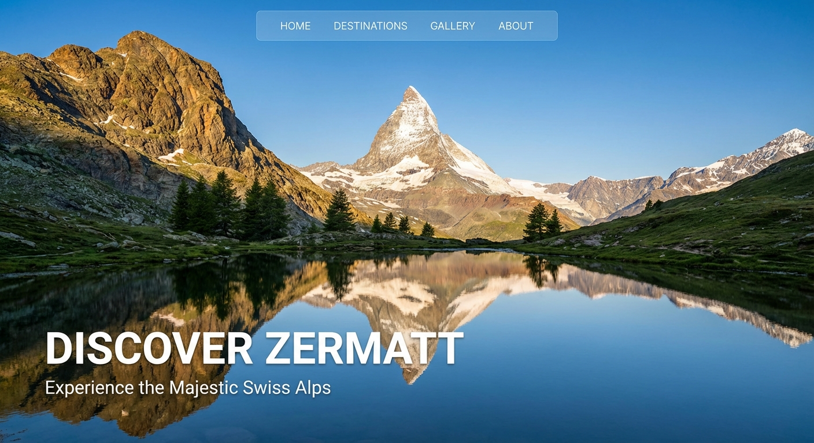

# HTML Generation Transcript

## Creating HTML File: `gallery.html`

### Step 1: Generating HTML Structure

**Prompt:**
```
You are an expert web developer tasked with creating a complete, self-contained HTML file.

## Requirements:
Create a photo gallery page for a travel blog with at least one image placeholder.

## Context from Related Files:


## Previous Task Results:


## Instructions:
1. Create a complete HTML5 document structure with proper semantic elements
2. Include appropriate meta tags (viewport, charset, etc.)
3. Add class names to elements that will need styling or JavaScript interaction
4. Use descriptive, semantic class names (e.g., "nav-menu", "hero-section", "card-container")
5. Include placeholder comments for where CSS and JavaScript will be added
6. Do NOT include any CSS or JavaScript yet - just the HTML structure with classes
7. Add comments to explain the purpose of major sections

## Output Format:
Provide the HTML structure within a code block:
```html
<!DOCTYPE html>
<html>
<head>
    <!-- CSS will be added here -->
</head>
<body>
    <!-- HTML structure with classes -->
</body>
<!-- JavaScript will be added here -->
</html>
```
```

**Response:**
```html
<!DOCTYPE html>
<html lang="en">
<head>
    <meta charset="UTF-8">
    <meta name="viewport" content="width=device-width, initial-scale=1.0">
    <meta name="description" content="A curated collection of travel photography from around the world.">
    <title>Wanderlust Chronicles | Photo Gallery</title>
    
    <!-- CSS will be added here -->
</head>
<body>

    <!-- Main Header: Contains site branding and primary navigation -->
    <header class="site-header">
        <div class="header-container">
            <h1 class="site-logo">Wanderlust Chronicles</h1>
            <nav class="main-nav">
                <ul class="nav-list">
                    <li class="nav-item"><a href="#" class="nav-link">Home</a></li>
                    <li class="nav-item"><a href="#" class="nav-link">Destinations</a></li>
                    <li class="nav-item"><a href="#" class="nav-link active">Gallery</a></li>
                    <li class="nav-item"><a href="#" class="nav-link">About</a></li>
                </ul>
            </nav>
        </div>
    </header>

    <main class="content-wrapper">
        
        <!-- Hero Section: Introduction to the gallery -->
        <section class="hero-section">
            <div class="hero-content">
                <h2 class="hero-title">Captured Moments</h2>
                <p class="hero-subtitle">Exploring the world through a lens, one destination at a time.</p>
            </div>
        </section>

        <!-- Gallery Controls: Filtering and sorting options -->
        <section class="gallery-controls">
            <div class="filter-group">
                <button class="filter-btn active" data-filter="all">All</button>
                <button class="filter-btn" data-filter="mountains">Mountains</button>
                <button class="filter-btn" data-filter="beaches">Beaches</button>
                <button class="filter-btn" data-filter="cities">Cities</button>
            </div>
        </section>

        <!-- Photo Gallery Grid: The main display area for images -->
        <section class="gallery-section">
            <div class="gallery-grid">
                
                <!-- Gallery Item 1 -->
                <figure class="gallery-item" data-category="mountains">
                    <div class="image-container">
                        
                        <div class="image-overlay">
                            <span class="view-icon">View Details</span>
                        </div>
                    </div>
                    <figcaption class="image-details">
                        <h3 class="image-title">Swiss Alps</h3>
                        <p class="image-location">Zermatt, Switzerland</p>
                    </figcaption>
                </figure>

                <!-- Gallery Item 2 -->
                <figure class="gallery-item" data-category="cities">
                    <div class="image-container">
                        
                        <div class="image-overlay">
                            <span class="view-icon">View Details</span>
                        </div>
                    </div>
                    <figcaption class="image-details">
                        <h3 class="image-title">Neon Nights</h3>
                        <p class="image-location">Tokyo, Japan</p>
                    </figcaption>
                </figure>

                <!-- Gallery Item 3 -->
                <figure class="gallery-item" data-category="beaches">
                    <div class="image-container">
                        
                        <div class="image-overlay">
                            <span class="view-icon">View Details</span>
                        </div>
                    </div>
                    <figcaption class="image-details">
                        <h3 class="image-title">Golden Hour</h3>
                        <p class="image-location">Bali, Indonesia</p>
                    </figcaption>
                </figure>

                <!-- Gallery Item 4 -->
                <figure class="gallery-item" data-category="mountains">
                    <div class="image-container">
                        
                        <div class="image-overlay">
                            <span class="view-icon">View Details</span>
                        </div>
                    </div>
                    <figcaption class="image-details">
                        <h3 class="image-title">Wild Patagonia</h3>
                        <p class="image-location">Torres del Paine, Chile</p>
                    </figcaption>
                </figure>

            </div>
        </section>

        <!-- Lightbox Modal: Hidden by default, used for full-screen image viewing -->
        <div class="lightbox-modal" aria-hidden="true">
            <button class="modal-close" aria-label="Close modal">&times;</button>
            <button class="modal-prev" aria-label="Previous image">&#10094;</button>
            <div class="modal-content">
                
                <div class="modal-caption"></div>
            </div>
            <button class="modal-next" aria-label="Next image">&#10095;</button>
        </div>

    </main>

    <!-- Site Footer: Copyright and social links -->
    <footer class="site-footer">
        <div class="footer-container">
            <p class="copyright">&copy; 2023 Wanderlust Chronicles. All rights reserved.</p>
            <div class="social-links">
                <a href="#" class="social-link">Instagram</a>
                <a href="#" class="social-link">Pinterest</a>
                <a href="#" class="social-link">Twitter</a>
            </div>
        </div>
    </footer>

    <!-- JavaScript will be added here -->
</body>
</html>
```

### Step 1.5: Generating Images

**Prompt:**
```
Based on the following HTML page description and structure, identify 1 key images that should be generated.
## Page Description:
Create a photo gallery page for a travel blog with at least one image placeholder.
## HTML Structure:
```html
<!DOCTYPE html>
<html lang="en">
<head>
    <meta charset="UTF-8">
    <meta name="viewport" content="width=device-width, initial-scale=1.0">
    <meta name="description" content="A curated collection of travel photography from around the world.">
    <title>Wanderlust Chronicles | Photo Gallery</title>
    
    <!-- CSS will be added here -->
</head>
<body>

    <!-- Main Header: Contains site branding and primary navigation -->
    <header class="site-header">
        <div class="header-container">
            <h1 class="site-logo">Wanderlust Chronicles</h1>
            <nav class="main-nav">
                <ul class="nav-list">
                    <li class="nav-item"><a href="#" class="nav-link">Home</a></li>
                    <li class="nav-item"><a href="#" class="nav-link">Destinations</a></li>
                    <li class="nav-item"><a href="#" class="nav-link active">Gallery</a></li>
                    <li class="nav-item"><a href="#" class="nav-link">About</a></li>
                </ul>
            </nav>
        </div>
    </header>

    <main class="content-wrapper">
        
        <!-- Hero Section: Introduction to the gallery -->
        <section class="hero-section">
            <div class="hero-content">
                <h2 class="hero-title">Captured Moments</h2>
                <p class="hero-subtitle">Exploring the world through a lens, one destination at a time.</p>
            </div>
        </section>

        <!-- Gallery Controls: Filtering and sorting options -->
        <section class="gallery-controls">
            <div class="filter-group">
                <button class="filter-btn active" data-filter="all">All</button>
                <button class="filter-btn" data-filter="mountains">Mountains</button>
                <button class="filter-btn" data-filter="beaches">Beaches</button>
                <button class="filter-btn" data-filter="cities">Cities</button>
            </div>
        </section>

        <!-- Photo Gallery Grid: The main display area for images -->
        <section class="gallery-section">
            <div class="gallery-grid">
                
                <!-- Gallery Item 1 -->
                <figure class="gallery-item" data-category="mountains">
                    <div class="image-container">
                        
                        <div class="image-overlay">
                            <span class="view-icon">View Details</span>
                        </div>
                    </div>
                    <figcaption class="image-details">
                        <h3 class="image-title">Swiss Alps</h3>
                        <p class="image-location">Zermatt, Switzerland</p>
                    </figcaption>
                </figure>

                <!-- Gallery Item 2 -->
                <figure class="gallery-item" data-category="cities">
                    <div class="image-container">
                        
                        <div class="image-overlay">
                            <span class="view-icon">View Details</span>
                        </div>
                    </div>
                    <figcaption class="image-details">
                        <h3 class="image-title">Neon Nights</h3>
                        <p class="image-location">Tokyo, Japan</p>
                    </figcaption>
                </figure>

                <!-- Gallery Item 3 -->
                <figure class="gallery-item" data-category="beaches">
                    <div class="image-container">
                        
                        <div class="image-overlay">
                            <span class="view-icon">View Details</span>
                        </div>
                    </div>
                    <figcaption class="image-details">
                        <h3 class="image-title">Golden Hour</h3>
                        <p class="image-location">Bali, Indonesia</p>
                    </figcaption>
                </figure>

                <!-- Gallery Item 4 -->
                <figure class="gallery-item" data-category="mountains">
                    <div class="image-container">
                        
                        <div class="image-overlay">
                            <span class="view-icon">View Details</span>
                        </div>
                    </div>
                    <figcaption class="image-details">
                        <h3 class="image-title">Wild Patagonia</h3>
                        <p class="image-location">Torres del Paine, Chile</p>
                    </figcaption>
                </figure>

            </div>
        </section>

        <!-- Lightbox Modal: Hidden by default, used for full-screen image viewing -->
        <div class="lightbox-modal" aria-hidden="true">
            <button class="modal-close" aria-label="Close modal">&times;</button>
            <button class="modal-prev" aria-label="Previous image">&#10094;</button>
            <div class="modal-content">
                
                <div class="modal-caption"></div>
            </div>
            <button class="modal-next" aria-label="Next image">&#10095;</button>
        </div>

    </main>

    <!-- Site Footer: Copyright and social links -->
    <footer class="site-footer">
        <div class="footer-container">
            <p class="copyright">&copy; 2023 Wanderlust Chronicles. All rights reserved.</p>
            <div class="social-links">
                <a href="#" class="social-link">Instagram</a>
                <a href="#" class="social-link">Pinterest</a>
                <a href="#" class="social-link">Twitter</a>
            </div>
        </div>
    </footer>

    <!-- JavaScript will be added here -->
</body>
</html>
```
For each image, provide:
1. A descriptive filename ending in .png (e.g., "hero-banner.png", "product-showcase.png")
2. A detailed visual description for image generation (be specific about style, colors, composition)

Note: All images will be generated as PNG files by an AI image model.

Format your response as:
IMAGE: filename.png
DESCRIPTION: detailed visual description
IMAGE: another-image.png
DESCRIPTION: another detailed description
```

**Response:**
IMAGE: swiss-alps-landscape.png
DESCRIPTION: A stunning, high-resolution landscape photograph of the Swiss Alps near Zermatt. The majestic, snow-dusted Matterhorn peak dominates the center of the frame under a crisp, clear azure sky. In the foreground, a crystal-clear alpine lake perfectly mirrors the mountain's silhouette. The surrounding terrain features vibrant green slopes and patches of hardy pine trees. The lighting is the warm, golden glow of early morning, casting soft shadows and emphasizing the rugged textures of the mountain face. Professional travel photography style with a wide-angle composition and deep depth of field.

**Generated Image:** swiss-alps-landscape.png
**Description:** A stunning, high-resolution landscape photograph of the Swiss Alps near Zermatt. The majestic, snow-dusted Matterhorn peak dominates the center of the frame under a crisp, clear azure sky. In the foreground, a crystal-clear alpine lake perfectly mirrors the mountain's silhouette. The surrounding terrain features vibrant green slopes and patches of hardy pine trees. The lighting is the warm, golden glow of early morning, casting soft shadows and emphasizing the rugged textures of the mountain face. Professional travel photography style with a wide-angle composition and deep depth of field.
**Prompt Used:** 

✅ Generated: [swiss-alps-landscape.png](swiss-alps-landscape.png)

### Step 2: Generating JavaScript

**Prompt:**
```
Based on the following HTML structure, generate the JavaScript code needed for interactivity.

## HTML Structure:
```html
<!DOCTYPE html>
<html lang="en">
<head>
    <meta charset="UTF-8">
    <meta name="viewport" content="width=device-width, initial-scale=1.0">
    <meta name="description" content="A curated collection of travel photography from around the world.">
    <title>Wanderlust Chronicles | Photo Gallery</title>
    
    <!-- CSS will be added here -->
</head>
<body>

    <!-- Main Header: Contains site branding and primary navigation -->
    <header class="site-header">
        <div class="header-container">
            <h1 class="site-logo">Wanderlust Chronicles</h1>
            <nav class="main-nav">
                <ul class="nav-list">
                    <li class="nav-item"><a href="#" class="nav-link">Home</a></li>
                    <li class="nav-item"><a href="#" class="nav-link">Destinations</a></li>
                    <li class="nav-item"><a href="#" class="nav-link active">Gallery</a></li>
                    <li class="nav-item"><a href="#" class="nav-link">About</a></li>
                </ul>
            </nav>
        </div>
    </header>

    <main class="content-wrapper">
        
        <!-- Hero Section: Introduction to the gallery -->
        <section class="hero-section">
            <div class="hero-content">
                <h2 class="hero-title">Captured Moments</h2>
                <p class="hero-subtitle">Exploring the world through a lens, one destination at a time.</p>
            </div>
        </section>

        <!-- Gallery Controls: Filtering and sorting options -->
        <section class="gallery-controls">
            <div class="filter-group">
                <button class="filter-btn active" data-filter="all">All</button>
                <button class="filter-btn" data-filter="mountains">Mountains</button>
                <button class="filter-btn" data-filter="beaches">Beaches</button>
                <button class="filter-btn" data-filter="cities">Cities</button>
            </div>
        </section>

        <!-- Photo Gallery Grid: The main display area for images -->
        <section class="gallery-section">
            <div class="gallery-grid">
                
                <!-- Gallery Item 1 -->
                <figure class="gallery-item" data-category="mountains">
                    <div class="image-container">
                        
                        <div class="image-overlay">
                            <span class="view-icon">View Details</span>
                        </div>
                    </div>
                    <figcaption class="image-details">
                        <h3 class="image-title">Swiss Alps</h3>
                        <p class="image-location">Zermatt, Switzerland</p>
                    </figcaption>
                </figure>

                <!-- Gallery Item 2 -->
                <figure class="gallery-item" data-category="cities">
                    <div class="image-container">
                        
                        <div class="image-overlay">
                            <span class="view-icon">View Details</span>
                        </div>
                    </div>
                    <figcaption class="image-details">
                        <h3 class="image-title">Neon Nights</h3>
                        <p class="image-location">Tokyo, Japan</p>
                    </figcaption>
                </figure>

                <!-- Gallery Item 3 -->
                <figure class="gallery-item" data-category="beaches">
                    <div class="image-container">
                        
                        <div class="image-overlay">
                            <span class="view-icon">View Details</span>
                        </div>
                    </div>
                    <figcaption class="image-details">
                        <h3 class="image-title">Golden Hour</h3>
                        <p class="image-location">Bali, Indonesia</p>
                    </figcaption>
                </figure>

                <!-- Gallery Item 4 -->
                <figure class="gallery-item" data-category="mountains">
                    <div class="image-container">
                        
                        <div class="image-overlay">
                            <span class="view-icon">View Details</span>
                        </div>
                    </div>
                    <figcaption class="image-details">
                        <h3 class="image-title">Wild Patagonia</h3>
                        <p class="image-location">Torres del Paine, Chile</p>
                    </figcaption>
                </figure>

            </div>
        </section>

        <!-- Lightbox Modal: Hidden by default, used for full-screen image viewing -->
        <div class="lightbox-modal" aria-hidden="true">
            <button class="modal-close" aria-label="Close modal">&times;</button>
            <button class="modal-prev" aria-label="Previous image">&#10094;</button>
            <div class="modal-content">
                
                <div class="modal-caption"></div>
            </div>
            <button class="modal-next" aria-label="Next image">&#10095;</button>
        </div>

    </main>

    <!-- Site Footer: Copyright and social links -->
    <footer class="site-footer">
        <div class="footer-container">
            <p class="copyright">&copy; 2023 Wanderlust Chronicles. All rights reserved.</p>
            <div class="social-links">
                <a href="#" class="social-link">Instagram</a>
                <a href="#" class="social-link">Pinterest</a>
                <a href="#" class="social-link">Twitter</a>
            </div>
        </div>
    </footer>

    <!-- JavaScript will be added here -->
</body>
</html>
```

## Requirements:
Create a photo gallery page for a travel blog with at least one image placeholder.

## Instructions:
1. Generate JavaScript that adds interactivity to the HTML elements
2. Use modern JavaScript (ES6+) features
3. Add event listeners for user interactions
4. Include any necessary DOM manipulation
5. Add comments to explain the functionality
6. Ensure the code is efficient and follows best practices

## Output Format:
Provide only the JavaScript code within a code block:
```javascript
// JavaScript code here
```
```

**Response:**
```javascript
/**
 * Wanderlust Chronicles - Gallery Interactivity
 * This script handles image filtering and the lightbox modal functionality.
 */

document.addEventListener('DOMContentLoaded', () => {
    // --- DOM Elements ---
    const filterButtons = document.querySelectorAll('.filter-btn');
    const galleryItems = Array.from(document.querySelectorAll('.gallery-item'));
    const modal = document.querySelector('.lightbox-modal');
    const modalImg = modal.querySelector('.modal-image');
    const modalCaption = modal.querySelector('.modal-caption');
    const closeModalBtn = modal.querySelector('.modal-close');
    const prevBtn = modal.querySelector('.modal-prev');
    const nextBtn = modal.querySelector('.modal-next');

    // --- State Management ---
    let currentVisibleItems = [...galleryItems];
    let currentIndex = 0;

    /**
     * Filtering Logic
     * Filters the gallery items based on the category selected.
     */
    const filterGallery = (filterValue) => {
        // Update active button state
        filterButtons.forEach(btn => {
            btn.classList.toggle('active', btn.dataset.filter === filterValue);
        });

        // Filter items in the DOM
        galleryItems.forEach(item => {
            const category = item.dataset.category;
            if (filterValue === 'all' || category === filterValue) {
                item.style.display = 'block';
                // Small timeout to allow for CSS transitions if added later
                setTimeout(() => item.style.opacity = '1', 10);
            } else {
                item.style.opacity = '0';
                item.style.display = 'none';
            }
        });

        // Update the list of items available for the lightbox navigation
        currentVisibleItems = galleryItems.filter(item => 
            filterValue === 'all' || item.dataset.category === filterValue
        );
    };

    // Add click events to filter buttons
    filterButtons.forEach(button => {
        button.addEventListener('click', () => {
            filterGallery(button.dataset.filter);
        });
    });

    /**
     * Lightbox Logic
     */

    const updateModalContent = (index) => {
        const item = currentVisibleItems[index];
        const img = item.querySelector('.gallery-image');
        const title = item.querySelector('.image-title').textContent;
        const location = item.querySelector('.image-location').textContent;

        // Set image source and accessibility text
        modalImg.src = img.src;
        modalImg.alt = img.alt;

        // Set caption
        modalCaption.innerHTML = `
            <h3>${title}</h3>
            <p>${location}</p>
        `;
        
        currentIndex = index;
    };

    const openModal = (index) => {
        updateModalContent(index);
        modal.classList.add('active');
        modal.setAttribute('aria-hidden', 'false');
        document.body.style.overflow = 'hidden'; // Prevent scrolling when modal is open
    };

    const closeModal = () => {
        modal.classList.remove('active');
        modal.setAttribute('aria-hidden', 'true');
        document.body.style.overflow = ''; // Restore scrolling
    };

    const showNext = () => {
        const nextIndex = (currentIndex + 1) % currentVisibleItems.length;
        updateModalContent(nextIndex);
    };

    const showPrev = () => {
        const prevIndex = (currentIndex - 1 + currentVisibleItems.length) % currentVisibleItems.length;
        updateModalContent(prevIndex);
    };

    // --- Event Listeners for Lightbox ---

    // Open modal when clicking a gallery item
    galleryItems.forEach((item) => {
        item.addEventListener('click', () => {
            // Find the index of this item within the currently filtered set
            const index = currentVisibleItems.indexOf(item);
            if (index !== -1) openModal(index);
        });
    });

    // Close button click
    closeModalBtn.addEventListener('click', closeModal);

    // Navigation clicks
    nextBtn.addEventListener('click', (e) => {
        e.stopPropagation();
        showNext();
    });

    prevBtn.addEventListener('click', (e) => {
        e.stopPropagation();
        showPrev();
    });

    // Close modal when clicking outside the content
    modal.addEventListener('click', (e) => {
        if (e.target === modal) closeModal();
    });

    /**
     * Keyboard Navigation
     */
    document.addEventListener('keydown', (e) => {
        if (modal.getAttribute('aria-hidden') === 'false') {
            if (e.key === 'Escape') closeModal();
            if (e.key === 'ArrowRight') showNext();
            if (e.key === 'ArrowLeft') showPrev();
        }
    });
});
```

### Step 3: Generating CSS

**Prompt:**
```
Based on the following HTML structure, generate the CSS styling.

## HTML Structure:
```html
<!DOCTYPE html>
<html lang="en">
<head>
    <meta charset="UTF-8">
    <meta name="viewport" content="width=device-width, initial-scale=1.0">
    <meta name="description" content="A curated collection of travel photography from around the world.">
    <title>Wanderlust Chronicles | Photo Gallery</title>
    
    <!-- CSS will be added here -->
</head>
<body>

    <!-- Main Header: Contains site branding and primary navigation -->
    <header class="site-header">
        <div class="header-container">
            <h1 class="site-logo">Wanderlust Chronicles</h1>
            <nav class="main-nav">
                <ul class="nav-list">
                    <li class="nav-item"><a href="#" class="nav-link">Home</a></li>
                    <li class="nav-item"><a href="#" class="nav-link">Destinations</a></li>
                    <li class="nav-item"><a href="#" class="nav-link active">Gallery</a></li>
                    <li class="nav-item"><a href="#" class="nav-link">About</a></li>
                </ul>
            </nav>
        </div>
    </header>

    <main class="content-wrapper">
        
        <!-- Hero Section: Introduction to the gallery -->
        <section class="hero-section">
            <div class="hero-content">
                <h2 class="hero-title">Captured Moments</h2>
                <p class="hero-subtitle">Exploring the world through a lens, one destination at a time.</p>
            </div>
        </section>

        <!-- Gallery Controls: Filtering and sorting options -->
        <section class="gallery-controls">
            <div class="filter-group">
                <button class="filter-btn active" data-filter="all">All</button>
                <button class="filter-btn" data-filter="mountains">Mountains</button>
                <button class="filter-btn" data-filter="beaches">Beaches</button>
                <button class="filter-btn" data-filter="cities">Cities</button>
            </div>
        </section>

        <!-- Photo Gallery Grid: The main display area for images -->
        <section class="gallery-section">
            <div class="gallery-grid">
                
                <!-- Gallery Item 1 -->
                <figure class="gallery-item" data-category="mountains">
                    <div class="image-container">
                        
                        <div class="image-overlay">
                            <span class="view-icon">View Details</span>
                        </div>
                    </div>
                    <figcaption class="image-details">
                        <h3 class="image-title">Swiss Alps</h3>
                        <p class="image-location">Zermatt, Switzerland</p>
                    </figcaption>
                </figure>

                <!-- Gallery Item 2 -->
                <figure class="gallery-item" data-category="cities">
                    <div class="image-container">
                        
                        <div class="image-overlay">
                            <span class="view-icon">View Details</span>
                        </div>
                    </div>
                    <figcaption class="image-details">
                        <h3 class="image-title">Neon Nights</h3>
                        <p class="image-location">Tokyo, Japan</p>
                    </figcaption>
                </figure>

                <!-- Gallery Item 3 -->
                <figure class="gallery-item" data-category="beaches">
                    <div class="image-container">
                        
                        <div class="image-overlay">
                            <span class="view-icon">View Details</span>
                        </div>
                    </div>
                    <figcaption class="image-details">
                        <h3 class="image-title">Golden Hour</h3>
                        <p class="image-location">Bali, Indonesia</p>
                    </figcaption>
                </figure>

                <!-- Gallery Item 4 -->
                <figure class="gallery-item" data-category="mountains">
                    <div class="image-container">
                        
                        <div class="image-overlay">
                            <span class="view-icon">View Details</span>
                        </div>
                    </div>
                    <figcaption class="image-details">
                        <h3 class="image-title">Wild Patagonia</h3>
                        <p class="image-location">Torres del Paine, Chile</p>
                    </figcaption>
                </figure>

            </div>
        </section>

        <!-- Lightbox Modal: Hidden by default, used for full-screen image viewing -->
        <div class="lightbox-modal" aria-hidden="true">
            <button class="modal-close" aria-label="Close modal">&times;</button>
            <button class="modal-prev" aria-label="Previous image">&#10094;</button>
            <div class="modal-content">
                
                <div class="modal-caption"></div>
            </div>
            <button class="modal-next" aria-label="Next image">&#10095;</button>
        </div>

    </main>

    <!-- Site Footer: Copyright and social links -->
    <footer class="site-footer">
        <div class="footer-container">
            <p class="copyright">&copy; 2023 Wanderlust Chronicles. All rights reserved.</p>
            <div class="social-links">
                <a href="#" class="social-link">Instagram</a>
                <a href="#" class="social-link">Pinterest</a>
                <a href="#" class="social-link">Twitter</a>
            </div>
        </div>
    </footer>

    <!-- JavaScript will be added here -->
</body>
</html>
```

## Requirements:
Create a photo gallery page for a travel blog with at least one image placeholder.

## Instructions:
1. Generate CSS that styles all the HTML elements
2. Create a visually appealing, modern design
3. Ensure responsive design (mobile-first approach)
4. Use CSS Grid and/or Flexbox for layouts
5. Include hover effects and transitions where appropriate
6. Use a consistent color scheme and typography
7. Add comments to organize the CSS sections
8. Follow CSS best practices and naming conventions

## Output Format:
Provide only the CSS code within a code block:
```css
/* CSS code here */
```
```

**Response:**
```css
/* 
========================================
1. VARIABLES & RESET
========================================
*/

:root {
    --primary-color: #2c3e50;
    --accent-color: #d4a373;
    --text-color: #333;
    --light-gray: #f8f9fa;
    --medium-gray: #e0e0e0;
    --white: #ffffff;
    --transition: all 0.3s ease;
    --max-width: 1200px;
    --header-height: 80px;
}

* {
    margin: 0;
    padding: 0;
    box-sizing: border-box;
}

body {
    font-family: 'Segoe UI', Roboto, Helvetica, Arial, sans-serif;
    line-height: 1.6;
    color: var(--text-color);
    background-color: var(--white);
}

img {
    max-width: 100%;
    display: block;
}

/* 
========================================
2. HEADER & NAVIGATION
========================================
*/

.site-header {
    background-color: var(--white);
    height: var(--header-height);
    display: flex;
    align-items: center;
    position: sticky;
    top: 0;
    z-index: 1000;
    box-shadow: 0 2px 10px rgba(0,0,0,0.05);
}

.header-container {
    width: 90%;
    max-width: var(--max-width);
    margin: 0 auto;
    display: flex;
    justify-content: space-between;
    align-items: center;
}

.site-logo {
    font-size: 1.5rem;
    font-weight: 700;
    text-transform: uppercase;
    letter-spacing: 2px;
    color: var(--primary-color);
}

.nav-list {
    display: flex;
    list-style: none;
    gap: 2rem;
}

.nav-link {
    text-decoration: none;
    color: var(--text-color);
    font-weight: 500;
    font-size: 0.9rem;
    text-transform: uppercase;
    transition: var(--transition);
}

.nav-link:hover, 
.nav-link.active {
    color: var(--accent-color);
}

/* 
========================================
3. HERO SECTION
========================================
*/

.hero-section {
    padding: 4rem 0;
    background-color: var(--light-gray);
    text-align: center;
}

.hero-content {
    max-width: 800px;
    margin: 0 auto;
    padding: 0 20px;
}

.hero-title {
    font-size: 2.5rem;
    margin-bottom: 1rem;
    color: var(--primary-color);
}

.hero-subtitle {
    font-size: 1.1rem;
    color: #666;
    font-style: italic;
}

/* 
========================================
4. GALLERY CONTROLS
========================================
*/

.gallery-controls {
    padding: 2rem 0;
    display: flex;
    justify-content: center;
}

.filter-group {
    display: flex;
    gap: 1rem;
    flex-wrap: wrap;
    justify-content: center;
}

.filter-btn {
    padding: 0.6rem 1.5rem;
    border: 1px solid var(--medium-gray);
    background: transparent;
    cursor: pointer;
    border-radius: 50px;
    font-size: 0.9rem;
    transition: var(--transition);
}

.filter-btn:hover,
.filter-btn.active {
    background-color: var(--primary-color);
    color: var(--white);
    border-color: var(--primary-color);
}

/* 
========================================
5. GALLERY GRID
========================================
*/

.gallery-section {
    padding: 2rem 0 5rem;
    width: 90%;
    max-width: var(--max-width);
    margin: 0 auto;
}

.gallery-grid {
    display: grid;
    grid-template-columns: repeat(auto-fill, minmax(300px, 1fr));
    gap: 2rem;
}

.gallery-item {
    background: var(--white);
    border-radius: 8px;
    overflow: hidden;
    box-shadow: 0 4px 15px rgba(0,0,0,0.1);
    transition: transform 0.3s ease;
}

.gallery-item:hover {
    transform: translateY(-5px);
}

.image-container {
    position: relative;
    overflow: hidden;
    aspect-ratio: 3 / 2;
}

/* Handle vertical images if they exist */
.gallery-item[data-category="cities"] .image-container {
    aspect-ratio: 3 / 4;
}

.gallery-image {
    width: 100%;
    height: 100%;
    object-fit: cover;
    transition: transform 0.5s ease;
}

.gallery-item:hover .gallery-image {
    transform: scale(1.1);
}

/* Overlay Effect */
.image-overlay {
    position: absolute;
    top: 0;
    left: 0;
    width: 100%;
    height: 100%;
    background: rgba(44, 62, 80, 0.6);
    display: flex;
    justify-content: center;
    align-items: center;
    opacity: 0;
    transition: var(--transition);
}

.gallery-item:hover .image-overlay {
    opacity: 1;
}

.view-icon {
    color: var(--white);
    border: 1px solid var(--white);
    padding: 0.5rem 1rem;
    font-size: 0.8rem;
    text-transform: uppercase;
    letter-spacing: 1px;
}

.image-details {
    padding: 1.5rem;
}

.image-title {
    font-size: 1.2rem;
    margin-bottom: 0.3rem;
    color: var(--primary-color);
}

.image-location {
    font-size: 0.85rem;
    color: #888;
    text-transform: uppercase;
    letter-spacing: 1px;
}

/* 
========================================
6. LIGHTBOX MODAL
========================================
*/

.lightbox-modal {
    position: fixed;
    top: 0;
    left: 0;
    width: 100%;
    height: 100%;
    background: rgba(0, 0, 0, 0.9);
    display: none; /* Hidden by default */
    justify-content: center;
    align-items: center;
    z-index: 2000;
    padding: 20px;
}

/* When active via JS */
.lightbox-modal.active {
    display: flex;
}

.modal-content {
    max-width: 90%;
    max-height: 80vh;
    position: relative;
}

.modal-image {
    max-width: 100%;
    max-height: 80vh;
    object-fit: contain;
    border: 3px solid var(--white);
}

.modal-close, .modal-prev, .modal-next {
    position: absolute;
    background: transparent;
    border: none;
    color: var(--white);
    font-size: 2rem;
    cursor: pointer;
    padding: 10px;
    transition: var(--transition);
}

.modal-close {
    top: 20px;
    right: 20px;
    font-size: 3rem;
}

.modal-prev {
    left: 20px;
    top: 50%;
    transform: translateY(-50%);
}

.modal-next {
    right: 20px;
    top: 50%;
    transform: translateY(-50%);
}

.modal-close:hover, .modal-prev:hover, .modal-next:hover {
    color: var(--accent-color);
}

/* 
========================================
7. FOOTER
========================================
*/

.site-footer {
    background-color: var(--primary-color);
    color: var(--white);
    padding: 3rem 0;
    margin-top: 4rem;
}

.footer-container {
    width: 90%;
    max-width: var(--max-width);
    margin: 0 auto;
    display: flex;
    flex-direction: column;
    align-items: center;
    gap: 1.5rem;
}

.social-links {
    display: flex;
    gap: 1.5rem;
}

.social-link {
    color: var(--medium-gray);
    text-decoration: none;
    font-size: 0.9rem;
    transition: var(--transition);
}

.social-link:hover {
    color: var(--accent-color);
}

.copyright {
    font-size: 0.8rem;
    opacity: 0.7;
}

/* 
========================================
8. RESPONSIVE DESIGN
========================================
*/

@media (max-width: 768px) {
    .header-container {
        flex-direction: column;
        gap: 1rem;
        padding: 1rem 0;
    }
    
    .site-header {
        height: auto;
        position: relative;
    }

    .nav-list {
        gap: 1rem;
    }

    .hero-title {
        font-size: 2rem;
    }

    .gallery-grid {
        grid-template-columns: 1fr;
    }

    .modal-prev, .modal-next {
        display: none; /* Hide arrows on small mobile for cleaner UI */
    }
}

@media (min-width: 769px) and (max-width: 1024px) {
    .gallery-grid {
        grid-template-columns: repeat(2, 1fr);
    }
}
```

### Step 3.5: Inserting Image References

**Prompt:**
```
You need to insert image references into the HTML structure.
## Current HTML Structure:
```html
<!DOCTYPE html>
<html lang="en">
<head>
    <meta charset="UTF-8">
    <meta name="viewport" content="width=device-width, initial-scale=1.0">
    <meta name="description" content="A curated collection of travel photography from around the world.">
    <title>Wanderlust Chronicles | Photo Gallery</title>
    
    <!-- CSS will be added here -->
</head>
<body>

    <!-- Main Header: Contains site branding and primary navigation -->
    <header class="site-header">
        <div class="header-container">
            <h1 class="site-logo">Wanderlust Chronicles</h1>
            <nav class="main-nav">
                <ul class="nav-list">
                    <li class="nav-item"><a href="#" class="nav-link">Home</a></li>
                    <li class="nav-item"><a href="#" class="nav-link">Destinations</a></li>
                    <li class="nav-item"><a href="#" class="nav-link active">Gallery</a></li>
                    <li class="nav-item"><a href="#" class="nav-link">About</a></li>
                </ul>
            </nav>
        </div>
    </header>

    <main class="content-wrapper">
        
        <!-- Hero Section: Introduction to the gallery -->
        <section class="hero-section">
            <div class="hero-content">
                <h2 class="hero-title">Captured Moments</h2>
                <p class="hero-subtitle">Exploring the world through a lens, one destination at a time.</p>
            </div>
        </section>

        <!-- Gallery Controls: Filtering and sorting options -->
        <section class="gallery-controls">
            <div class="filter-group">
                <button class="filter-btn active" data-filter="all">All</button>
                <button class="filter-btn" data-filter="mountains">Mountains</button>
                <button class="filter-btn" data-filter="beaches">Beaches</button>
                <button class="filter-btn" data-filter="cities">Cities</button>
            </div>
        </section>

        <!-- Photo Gallery Grid: The main display area for images -->
        <section class="gallery-section">
            <div class="gallery-grid">
                
                <!-- Gallery Item 1 -->
                <figure class="gallery-item" data-category="mountains">
                    <div class="image-container">
                        
                        <div class="image-overlay">
                            <span class="view-icon">View Details</span>
                        </div>
                    </div>
                    <figcaption class="image-details">
                        <h3 class="image-title">Swiss Alps</h3>
                        <p class="image-location">Zermatt, Switzerland</p>
                    </figcaption>
                </figure>

                <!-- Gallery Item 2 -->
                <figure class="gallery-item" data-category="cities">
                    <div class="image-container">
                        
                        <div class="image-overlay">
                            <span class="view-icon">View Details</span>
                        </div>
                    </div>
                    <figcaption class="image-details">
                        <h3 class="image-title">Neon Nights</h3>
                        <p class="image-location">Tokyo, Japan</p>
                    </figcaption>
                </figure>

                <!-- Gallery Item 3 -->
                <figure class="gallery-item" data-category="beaches">
                    <div class="image-container">
                        
                        <div class="image-overlay">
                            <span class="view-icon">View Details</span>
                        </div>
                    </div>
                    <figcaption class="image-details">
                        <h3 class="image-title">Golden Hour</h3>
                        <p class="image-location">Bali, Indonesia</p>
                    </figcaption>
                </figure>

                <!-- Gallery Item 4 -->
                <figure class="gallery-item" data-category="mountains">
                    <div class="image-container">
                        
                        <div class="image-overlay">
                            <span class="view-icon">View Details</span>
                        </div>
                    </div>
                    <figcaption class="image-details">
                        <h3 class="image-title">Wild Patagonia</h3>
                        <p class="image-location">Torres del Paine, Chile</p>
                    </figcaption>
                </figure>

            </div>
        </section>

        <!-- Lightbox Modal: Hidden by default, used for full-screen image viewing -->
        <div class="lightbox-modal" aria-hidden="true">
            <button class="modal-close" aria-label="Close modal">&times;</button>
            <button class="modal-prev" aria-label="Previous image">&#10094;</button>
            <div class="modal-content">
                
                <div class="modal-caption"></div>
            </div>
            <button class="modal-next" aria-label="Next image">&#10095;</button>
        </div>

    </main>

    <!-- Site Footer: Copyright and social links -->
    <footer class="site-footer">
        <div class="footer-container">
            <p class="copyright">&copy; 2023 Wanderlust Chronicles. All rights reserved.</p>
            <div class="social-links">
                <a href="#" class="social-link">Instagram</a>
                <a href="#" class="social-link">Pinterest</a>
                <a href="#" class="social-link">Twitter</a>
            </div>
        </div>
    </footer>

    <!-- JavaScript will be added here -->
</body>
</html>
```
## Generated Images:
- swiss-alps-landscape.png: A stunning, high-resolution landscape photograph of the Swiss Alps near Zermatt. The majestic, snow-dusted Matterhorn peak dominates the center of the frame under a crisp, clear azure sky. In the foreground, a crystal-clear alpine lake perfectly mirrors the mountain's silhouette. The surrounding terrain features vibrant green slopes and patches of hardy pine trees. The lighting is the warm, golden glow of early morning, casting soft shadows and emphasizing the rugged textures of the mountain face. Professional travel photography style with a wide-angle composition and deep depth of field.
## Instructions:
1. Insert  tags at appropriate locations in the HTML where these images should appear
2. Use the given PNG filename (e.g., "filename.png") for the src attribute
3. Add appropriate alt text based on the image description
4. Add appropriate class names for styling
5. Consider the semantic meaning of where each image should go (hero sections, content areas, etc.)
6. Maintain the existing HTML structure and class names
7. Do NOT add any CSS or JavaScript - just insert the  tags
## Output Format:
Provide the complete updated HTML structure within a code block:
```html
<!DOCTYPE html>
...
```
```

**Response:**
```html
<!DOCTYPE html>
<html lang="en">
<head>
    <meta charset="UTF-8">
    <meta name="viewport" content="width=device-width, initial-scale=1.0">
    <meta name="description" content="A curated collection of travel photography from around the world.">
    <title>Wanderlust Chronicles | Photo Gallery</title>
    
    <!-- CSS will be added here -->
</head>
<body>

    <!-- Main Header: Contains site branding and primary navigation -->
    <header class="site-header">
        <div class="header-container">
            <h1 class="site-logo">Wanderlust Chronicles</h1>
            <nav class="main-nav">
                <ul class="nav-list">
                    <li class="nav-item"><a href="#" class="nav-link">Home</a></li>
                    <li class="nav-item"><a href="#" class="nav-link">Destinations</a></li>
                    <li class="nav-item"><a href="#" class="nav-link active">Gallery</a></li>
                    <li class="nav-item"><a href="#" class="nav-link">About</a></li>
                </ul>
            </nav>
        </div>
    </header>

    <main class="content-wrapper">
        
        <!-- Hero Section: Introduction to the gallery -->
        <section class="hero-section">
            <div class="hero-content">
                <h2 class="hero-title">Captured Moments</h2>
                <p class="hero-subtitle">Exploring the world through a lens, one destination at a time.</p>
            </div>
        </section>

        <!-- Gallery Controls: Filtering and sorting options -->
        <section class="gallery-controls">
            <div class="filter-group">
                <button class="filter-btn active" data-filter="all">All</button>
                <button class="filter-btn" data-filter="mountains">Mountains</button>
                <button class="filter-btn" data-filter="beaches">Beaches</button>
                <button class="filter-btn" data-filter="cities">Cities</button>
            </div>
        </section>

        <!-- Photo Gallery Grid: The main display area for images -->
        <section class="gallery-section">
            <div class="gallery-grid">
                
                <!-- Gallery Item 1: Swiss Alps -->
                <figure class="gallery-item" data-category="mountains">
                    <div class="image-container">
                        
                        <div class="image-overlay">
                            <span class="view-icon">View Details</span>
                        </div>
                    </div>
                    <figcaption class="image-details">
                        <h3 class="image-title">Swiss Alps</h3>
                        <p class="image-location">Zermatt, Switzerland</p>
                    </figcaption>
                </figure>

                <!-- Gallery Item 2: Tokyo -->
                <figure class="gallery-item" data-category="cities">
                    <div class="image-container">
                        
                        <div class="image-overlay">
                            <span class="view-icon">View Details</span>
                        </div>
                    </div>
                    <figcaption class="image-details">
                        <h3 class="image-title">Neon Nights</h3>
                        <p class="image-location">Tokyo, Japan</p>
                    </figcaption>
                </figure>

                <!-- Gallery Item 3: Bali -->
                <figure class="gallery-item" data-category="beaches">
                    <div class="image-container">
                        
                        <div class="image-overlay">
                            <span class="view-icon">View Details</span>
                        </div>
                    </div>
                    <figcaption class="image-details">
                        <h3 class="image-title">Golden Hour</h3>
                        <p class="image-location">Bali, Indonesia</p>
                    </figcaption>
                </figure>

                <!-- Gallery Item 4: Patagonia -->
                <figure class="gallery-item" data-category="mountains">
                    <div class="image-container">
                        
                        <div class="image-overlay">
                            <span class="view-icon">View Details</span>
                        </div>
                    </div>
                    <figcaption class="image-details">
                        <h3 class="image-title">Wild Patagonia</h3>
                        <p class="image-location">Torres del Paine, Chile</p>
                    </figcaption>
                </figure>

            </div>
        </section>

        <!-- Lightbox Modal: Hidden by default, used for full-screen image viewing -->
        <div class="lightbox-modal" aria-hidden="true">
            <button class="modal-close" aria-label="Close modal">&times;</button>
            <button class="modal-prev" aria-label="Previous image">&#10094;</button>
            <div class="modal-content">
                
                <div class="modal-caption"></div>
            </div>
            <button class="modal-next" aria-label="Next image">&#10095;</button>
        </div>

    </main>

    <!-- Site Footer: Copyright and social links -->
    <footer class="site-footer">
        <div class="footer-container">
            <p class="copyright">&copy; 2023 Wanderlust Chronicles. All rights reserved.</p>
            <div class="social-links">
                <a href="#" class="social-link">Instagram</a>
                <a href="#" class="social-link">Pinterest</a>
                <a href="#" class="social-link">Twitter</a>
            </div>
        </div>
    </footer>

    <!-- JavaScript will be added here -->
</body>
</html>
```

### Step 4: Final HTML Output

```html
<!DOCTYPE html>
<html lang="en">
<head>
    <meta charset="UTF-8">
    <meta name="viewport" content="width=device-width, initial-scale=1.0">
    <meta name="description" content="A curated collection of travel photography from around the world.">
    <title>Wanderlust Chronicles | Photo Gallery</title>
    
    <!-- CSS will be added here -->

    <style>
        /* 
        ========================================
        1. VARIABLES & RESET
        ========================================
        */
        
        :root {
            --primary-color: #2c3e50;
            --accent-color: #d4a373;
            --text-color: #333;
            --light-gray: #f8f9fa;
            --medium-gray: #e0e0e0;
            --white: #ffffff;
            --transition: all 0.3s ease;
            --max-width: 1200px;
            --header-height: 80px;
        }
        
        * {
            margin: 0;
            padding: 0;
            box-sizing: border-box;
        }
        
        body {
            font-family: 'Segoe UI', Roboto, Helvetica, Arial, sans-serif;
            line-height: 1.6;
            color: var(--text-color);
            background-color: var(--white);
        }
        
        img {
            max-width: 100%;
            display: block;
        }
        
        /* 
        ========================================
        2. HEADER & NAVIGATION
        ========================================
        */
        
        .site-header {
            background-color: var(--white);
            height: var(--header-height);
            display: flex;
            align-items: center;
            position: sticky;
            top: 0;
            z-index: 1000;
            box-shadow: 0 2px 10px rgba(0,0,0,0.05);
        }
        
        .header-container {
            width: 90%;
            max-width: var(--max-width);
            margin: 0 auto;
            display: flex;
            justify-content: space-between;
            align-items: center;
        }
        
        .site-logo {
            font-size: 1.5rem;
            font-weight: 700;
            text-transform: uppercase;
            letter-spacing: 2px;
            color: var(--primary-color);
        }
        
        .nav-list {
            display: flex;
            list-style: none;
            gap: 2rem;
        }
        
        .nav-link {
            text-decoration: none;
            color: var(--text-color);
            font-weight: 500;
            font-size: 0.9rem;
            text-transform: uppercase;
            transition: var(--transition);
        }
        
        .nav-link:hover, 
        .nav-link.active {
            color: var(--accent-color);
        }
        
        /* 
        ========================================
        3. HERO SECTION
        ========================================
        */
        
        .hero-section {
            padding: 4rem 0;
            background-color: var(--light-gray);
            text-align: center;
        }
        
        .hero-content {
            max-width: 800px;
            margin: 0 auto;
            padding: 0 20px;
        }
        
        .hero-title {
            font-size: 2.5rem;
            margin-bottom: 1rem;
            color: var(--primary-color);
        }
        
        .hero-subtitle {
            font-size: 1.1rem;
            color: #666;
            font-style: italic;
        }
        
        /* 
        ========================================
        4. GALLERY CONTROLS
        ========================================
        */
        
        .gallery-controls {
            padding: 2rem 0;
            display: flex;
            justify-content: center;
        }
        
        .filter-group {
            display: flex;
            gap: 1rem;
            flex-wrap: wrap;
            justify-content: center;
        }
        
        .filter-btn {
            padding: 0.6rem 1.5rem;
            border: 1px solid var(--medium-gray);
            background: transparent;
            cursor: pointer;
            border-radius: 50px;
            font-size: 0.9rem;
            transition: var(--transition);
        }
        
        .filter-btn:hover,
        .filter-btn.active {
            background-color: var(--primary-color);
            color: var(--white);
            border-color: var(--primary-color);
        }
        
        /* 
        ========================================
        5. GALLERY GRID
        ========================================
        */
        
        .gallery-section {
            padding: 2rem 0 5rem;
            width: 90%;
            max-width: var(--max-width);
            margin: 0 auto;
        }
        
        .gallery-grid {
            display: grid;
            grid-template-columns: repeat(auto-fill, minmax(300px, 1fr));
            gap: 2rem;
        }
        
        .gallery-item {
            background: var(--white);
            border-radius: 8px;
            overflow: hidden;
            box-shadow: 0 4px 15px rgba(0,0,0,0.1);
            transition: transform 0.3s ease;
        }
        
        .gallery-item:hover {
            transform: translateY(-5px);
        }
        
        .image-container {
            position: relative;
            overflow: hidden;
            aspect-ratio: 3 / 2;
        }
        
        /* Handle vertical images if they exist */
        .gallery-item[data-category="cities"] .image-container {
            aspect-ratio: 3 / 4;
        }
        
        .gallery-image {
            width: 100%;
            height: 100%;
            object-fit: cover;
            transition: transform 0.5s ease;
        }
        
        .gallery-item:hover .gallery-image {
            transform: scale(1.1);
        }
        
        /* Overlay Effect */
        .image-overlay {
            position: absolute;
            top: 0;
            left: 0;
            width: 100%;
            height: 100%;
            background: rgba(44, 62, 80, 0.6);
            display: flex;
            justify-content: center;
            align-items: center;
            opacity: 0;
            transition: var(--transition);
        }
        
        .gallery-item:hover .image-overlay {
            opacity: 1;
        }
        
        .view-icon {
            color: var(--white);
            border: 1px solid var(--white);
            padding: 0.5rem 1rem;
            font-size: 0.8rem;
            text-transform: uppercase;
            letter-spacing: 1px;
        }
        
        .image-details {
            padding: 1.5rem;
        }
        
        .image-title {
            font-size: 1.2rem;
            margin-bottom: 0.3rem;
            color: var(--primary-color);
        }
        
        .image-location {
            font-size: 0.85rem;
            color: #888;
            text-transform: uppercase;
            letter-spacing: 1px;
        }
        
        /* 
        ========================================
        6. LIGHTBOX MODAL
        ========================================
        */
        
        .lightbox-modal {
            position: fixed;
            top: 0;
            left: 0;
            width: 100%;
            height: 100%;
            background: rgba(0, 0, 0, 0.9);
            display: none; /* Hidden by default */
            justify-content: center;
            align-items: center;
            z-index: 2000;
            padding: 20px;
        }
        
        /* When active via JS */
        .lightbox-modal.active {
            display: flex;
        }
        
        .modal-content {
            max-width: 90%;
            max-height: 80vh;
            position: relative;
        }
        
        .modal-image {
            max-width: 100%;
            max-height: 80vh;
            object-fit: contain;
            border: 3px solid var(--white);
        }
        
        .modal-close, .modal-prev, .modal-next {
            position: absolute;
            background: transparent;
            border: none;
            color: var(--white);
            font-size: 2rem;
            cursor: pointer;
            padding: 10px;
            transition: var(--transition);
        }
        
        .modal-close {
            top: 20px;
            right: 20px;
            font-size: 3rem;
        }
        
        .modal-prev {
            left: 20px;
            top: 50%;
            transform: translateY(-50%);
        }
        
        .modal-next {
            right: 20px;
            top: 50%;
            transform: translateY(-50%);
        }
        
        .modal-close:hover, .modal-prev:hover, .modal-next:hover {
            color: var(--accent-color);
        }
        
        /* 
        ========================================
        7. FOOTER
        ========================================
        */
        
        .site-footer {
            background-color: var(--primary-color);
            color: var(--white);
            padding: 3rem 0;
            margin-top: 4rem;
        }
        
        .footer-container {
            width: 90%;
            max-width: var(--max-width);
            margin: 0 auto;
            display: flex;
            flex-direction: column;
            align-items: center;
            gap: 1.5rem;
        }
        
        .social-links {
            display: flex;
            gap: 1.5rem;
        }
        
        .social-link {
            color: var(--medium-gray);
            text-decoration: none;
            font-size: 0.9rem;
            transition: var(--transition);
        }
        
        .social-link:hover {
            color: var(--accent-color);
        }
        
        .copyright {
            font-size: 0.8rem;
            opacity: 0.7;
        }
        
        /* 
        ========================================
        8. RESPONSIVE DESIGN
        ========================================
        */
        
        @media (max-width: 768px) {
            .header-container {
                flex-direction: column;
                gap: 1rem;
                padding: 1rem 0;
            }
        
            .site-header {
                height: auto;
                position: relative;
            }
        
            .nav-list {
                gap: 1rem;
            }
        
            .hero-title {
                font-size: 2rem;
            }
        
            .gallery-grid {
                grid-template-columns: 1fr;
            }
        
            .modal-prev, .modal-next {
                display: none; /* Hide arrows on small mobile for cleaner UI */
            }
        }
        
        @media (min-width: 769px) and (max-width: 1024px) {
            .gallery-grid {
                grid-template-columns: repeat(2, 1fr);
            }
        }
    </style>
<!-- Generated Images:
     - swiss-alps-landscape.png: A stunning, high-resolution landscape photograph of the Swiss Alps near Zermatt. The majestic, snow-dusted Matterhorn peak dominates the center of the frame under a crisp, clear azure sky. In the foreground, a crystal-clear alpine lake perfectly mirrors the mountain's silhouette. The surrounding terrain features vibrant green slopes and patches of hardy pine trees. The lighting is the warm, golden glow of early morning, casting soft shadows and emphasizing the rugged textures of the mountain face. Professional travel photography style with a wide-angle composition and deep depth of field.
-->
</head>
<body>

    <!-- Main Header: Contains site branding and primary navigation -->
    <header class="site-header">
        <div class="header-container">
            <h1 class="site-logo">Wanderlust Chronicles</h1>
            <nav class="main-nav">
                <ul class="nav-list">
                    <li class="nav-item"><a href="#" class="nav-link">Home</a></li>
                    <li class="nav-item"><a href="#" class="nav-link">Destinations</a></li>
                    <li class="nav-item"><a href="#" class="nav-link active">Gallery</a></li>
                    <li class="nav-item"><a href="#" class="nav-link">About</a></li>
                </ul>
            </nav>
        </div>
    </header>

    <main class="content-wrapper">
        
        <!-- Hero Section: Introduction to the gallery -->
        <section class="hero-section">
            <div class="hero-content">
                <h2 class="hero-title">Captured Moments</h2>
                <p class="hero-subtitle">Exploring the world through a lens, one destination at a time.</p>
            </div>
        </section>

        <!-- Gallery Controls: Filtering and sorting options -->
        <section class="gallery-controls">
            <div class="filter-group">
                <button class="filter-btn active" data-filter="all">All</button>
                <button class="filter-btn" data-filter="mountains">Mountains</button>
                <button class="filter-btn" data-filter="beaches">Beaches</button>
                <button class="filter-btn" data-filter="cities">Cities</button>
            </div>
        </section>

        <!-- Photo Gallery Grid: The main display area for images -->
        <section class="gallery-section">
            <div class="gallery-grid">
                
                <!-- Gallery Item 1: Swiss Alps -->
                <figure class="gallery-item" data-category="mountains">
                    <div class="image-container">
                        
                        <div class="image-overlay">
                            <span class="view-icon">View Details</span>
                        </div>
                    </div>
                    <figcaption class="image-details">
                        <h3 class="image-title">Swiss Alps</h3>
                        <p class="image-location">Zermatt, Switzerland</p>
                    </figcaption>
                </figure>

                <!-- Gallery Item 2: Tokyo -->
                <figure class="gallery-item" data-category="cities">
                    <div class="image-container">
                        
                        <div class="image-overlay">
                            <span class="view-icon">View Details</span>
                        </div>
                    </div>
                    <figcaption class="image-details">
                        <h3 class="image-title">Neon Nights</h3>
                        <p class="image-location">Tokyo, Japan</p>
                    </figcaption>
                </figure>

                <!-- Gallery Item 3: Bali -->
                <figure class="gallery-item" data-category="beaches">
                    <div class="image-container">
                        
                        <div class="image-overlay">
                            <span class="view-icon">View Details</span>
                        </div>
                    </div>
                    <figcaption class="image-details">
                        <h3 class="image-title">Golden Hour</h3>
                        <p class="image-location">Bali, Indonesia</p>
                    </figcaption>
                </figure>

                <!-- Gallery Item 4: Patagonia -->
                <figure class="gallery-item" data-category="mountains">
                    <div class="image-container">
                        
                        <div class="image-overlay">
                            <span class="view-icon">View Details</span>
                        </div>
                    </div>
                    <figcaption class="image-details">
                        <h3 class="image-title">Wild Patagonia</h3>
                        <p class="image-location">Torres del Paine, Chile</p>
                    </figcaption>
                </figure>

            </div>
        </section>

        <!-- Lightbox Modal: Hidden by default, used for full-screen image viewing -->
        <div class="lightbox-modal" aria-hidden="true">
            <button class="modal-close" aria-label="Close modal">&times;</button>
            <button class="modal-prev" aria-label="Previous image">&#10094;</button>
            <div class="modal-content">
                
                <div class="modal-caption"></div>
            </div>
            <button class="modal-next" aria-label="Next image">&#10095;</button>
        </div>

    </main>

    <!-- Site Footer: Copyright and social links -->
    <footer class="site-footer">
        <div class="footer-container">
            <p class="copyright">&copy; 2023 Wanderlust Chronicles. All rights reserved.</p>
            <div class="social-links">
                <a href="#" class="social-link">Instagram</a>
                <a href="#" class="social-link">Pinterest</a>
                <a href="#" class="social-link">Twitter</a>
            </div>
        </div>
    </footer>

    <!-- JavaScript will be added here -->

    <script>
        /**
         * Wanderlust Chronicles - Gallery Interactivity
         * This script handles image filtering and the lightbox modal functionality.
         */
        
        document.addEventListener('DOMContentLoaded', () => {
            // --- DOM Elements ---
            const filterButtons = document.querySelectorAll('.filter-btn');
            const galleryItems = Array.from(document.querySelectorAll('.gallery-item'));
            const modal = document.querySelector('.lightbox-modal');
            const modalImg = modal.querySelector('.modal-image');
            const modalCaption = modal.querySelector('.modal-caption');
            const closeModalBtn = modal.querySelector('.modal-close');
            const prevBtn = modal.querySelector('.modal-prev');
            const nextBtn = modal.querySelector('.modal-next');
        
            // --- State Management ---
            let currentVisibleItems = [...galleryItems];
            let currentIndex = 0;
        
            /**
             * Filtering Logic
             * Filters the gallery items based on the category selected.
             */
            const filterGallery = (filterValue) => {
                // Update active button state
                filterButtons.forEach(btn => {
                    btn.classList.toggle('active', btn.dataset.filter === filterValue);
                });
        
                // Filter items in the DOM
                galleryItems.forEach(item => {
                    const category = item.dataset.category;
                    if (filterValue === 'all' || category === filterValue) {
                        item.style.display = 'block';
                        // Small timeout to allow for CSS transitions if added later
                        setTimeout(() => item.style.opacity = '1', 10);
                    } else {
                        item.style.opacity = '0';
                        item.style.display = 'none';
                    }
                });
        
                // Update the list of items available for the lightbox navigation
                currentVisibleItems = galleryItems.filter(item => 
                    filterValue === 'all' || item.dataset.category === filterValue
                );
            };
        
            // Add click events to filter buttons
            filterButtons.forEach(button => {
                button.addEventListener('click', () => {
                    filterGallery(button.dataset.filter);
                });
            });
        
            /**
             * Lightbox Logic
             */
        
            const updateModalContent = (index) => {
                const item = currentVisibleItems[index];
                const img = item.querySelector('.gallery-image');
                const title = item.querySelector('.image-title').textContent;
                const location = item.querySelector('.image-location').textContent;
        
                // Set image source and accessibility text
                modalImg.src = img.src;
                modalImg.alt = img.alt;
        
                // Set caption
                modalCaption.innerHTML = `
                    <h3>${title}</h3>
                    <p>${location}</p>
                `;
        
                currentIndex = index;
            };
        
            const openModal = (index) => {
                updateModalContent(index);
                modal.classList.add('active');
                modal.setAttribute('aria-hidden', 'false');
                document.body.style.overflow = 'hidden'; // Prevent scrolling when modal is open
            };
        
            const closeModal = () => {
                modal.classList.remove('active');
                modal.setAttribute('aria-hidden', 'true');
                document.body.style.overflow = ''; // Restore scrolling
            };
        
            const showNext = () => {
                const nextIndex = (currentIndex + 1) % currentVisibleItems.length;
                updateModalContent(nextIndex);
            };
        
            const showPrev = () => {
                const prevIndex = (currentIndex - 1 + currentVisibleItems.length) % currentVisibleItems.length;
                updateModalContent(prevIndex);
            };
        
            // --- Event Listeners for Lightbox ---
        
            // Open modal when clicking a gallery item
            galleryItems.forEach((item) => {
                item.addEventListener('click', () => {
                    // Find the index of this item within the currently filtered set
                    const index = currentVisibleItems.indexOf(item);
                    if (index !== -1) openModal(index);
                });
            });
        
            // Close button click
            closeModalBtn.addEventListener('click', closeModal);
        
            // Navigation clicks
            nextBtn.addEventListener('click', (e) => {
                e.stopPropagation();
                showNext();
            });
        
            prevBtn.addEventListener('click', (e) => {
                e.stopPropagation();
                showPrev();
            });
        
            // Close modal when clicking outside the content
            modal.addEventListener('click', (e) => {
                if (e.target === modal) closeModal();
            });
        
            /**
             * Keyboard Navigation
             */
            document.addEventListener('keydown', (e) => {
                if (modal.getAttribute('aria-hidden') === 'false') {
                    if (e.key === 'Escape') closeModal();
                    if (e.key === 'ArrowRight') showNext();
                    if (e.key === 'ArrowLeft') showPrev();
                }
            });
        });
    </script>
</body>
</html>
```

**Result:** Successfully wrote gallery.html (auto-applied)
