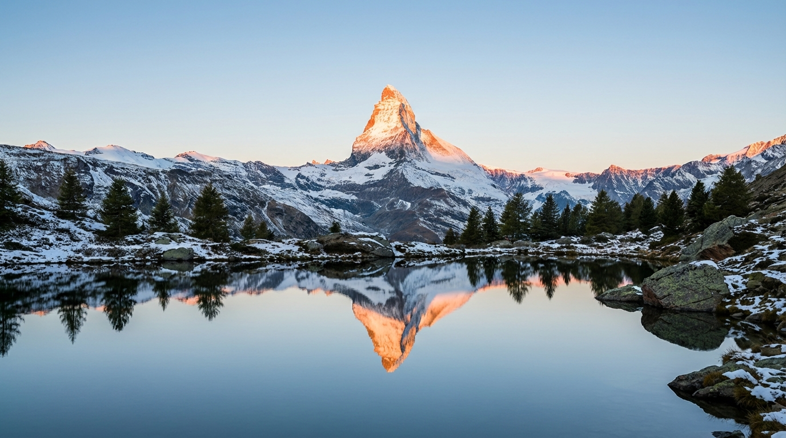

# HTML Generation Transcript

## Creating HTML File: `gallery.html`

### Step 1: Generating HTML Structure

**Prompt:**
```
You are an expert web developer tasked with creating a complete, self-contained HTML file.

## Requirements:
Create a photo gallery page for a travel blog with at least one image placeholder.

## Context from Related Files:


## Previous Task Results:


## Instructions:
1. Create a complete HTML5 document structure with proper semantic elements
2. Include appropriate meta tags (viewport, charset, etc.)
3. Add class names to elements that will need styling or JavaScript interaction
4. Use descriptive, semantic class names (e.g., "nav-menu", "hero-section", "card-container")
5. Include placeholder comments for where CSS and JavaScript will be added
6. Do NOT include any CSS or JavaScript yet - just the HTML structure with classes
7. Add comments to explain the purpose of major sections

## Output Format:
Provide the HTML structure within a code block:
```html
<!DOCTYPE html>
<html>
<head>
    <!-- CSS will be added here -->
</head>
<body>
    <!-- HTML structure with classes -->
</body>
<!-- JavaScript will be added here -->
</html>
```
```

**Response:**
```html
<!DOCTYPE html>
<html lang="en">
<head>
    <meta charset="UTF-8">
    <meta name="viewport" content="width=device-width, initial-scale=1.0">
    <title>Wanderlust Captures | Travel Photo Gallery</title>
    
    <!-- CSS will be added here -->
    <!-- <link rel="stylesheet" href="styles.css"> -->
</head>
<body>

    <!-- Main Header: Contains site branding and primary navigation -->
    <header class="site-header">
        <div class="header-container">
            <h1 class="site-logo">Wanderlust Captures</h1>
            <nav class="main-nav">
                <ul class="nav-list">
                    <li class="nav-item"><a href="#" class="nav-link">Home</a></li>
                    <li class="nav-item"><a href="#" class="nav-link active">Gallery</a></li>
                    <li class="nav-item"><a href="#" class="nav-link">Destinations</a></li>
                    <li class="nav-item"><a href="#" class="nav-link">About</a></li>
                </ul>
            </nav>
        </div>
    </header>

    <main class="content-wrapper">
        
        <!-- Hero Section: Introduction to the gallery -->
        <section class="hero-section">
            <div class="hero-content">
                <h2 class="hero-title">Global Perspectives</h2>
                <p class="hero-subtitle">A collection of moments captured across seven continents.</p>
            </div>
        </section>

        <!-- Gallery Controls: Filtering and sorting options -->
        <section class="gallery-controls">
            <div class="filter-container">
                <button class="filter-btn active" data-filter="all">All</button>
                <button class="filter-btn" data-filter="nature">Nature</button>
                <button class="filter-btn" data-filter="architecture">Architecture</button>
                <button class="filter-btn" data-filter="culture">Culture</button>
            </div>
        </section>

        <!-- Photo Gallery Grid: The main display area for images -->
        <section class="gallery-section">
            <div class="gallery-grid">
                
                <!-- Gallery Item 1 -->
                <figure class="gallery-item" data-category="nature">
                    <div class="image-wrapper">
                        
                        <div class="image-overlay">
                            <span class="view-icon">View Full Size</span>
                        </div>
                    </div>
                    <figcaption class="image-details">
                        <h3 class="image-title">Alpine Sunrise</h3>
                        <p class="image-location">Zermatt, Switzerland</p>
                    </figcaption>
                </figure>

                <!-- Gallery Item 2 -->
                <figure class="gallery-item" data-category="architecture">
                    <div class="image-wrapper">
                        
                        <div class="image-overlay">
                            <span class="view-icon">View Full Size</span>
                        </div>
                    </div>
                    <figcaption class="image-details">
                        <h3 class="image-title">Gion District</h3>
                        <p class="image-location">Kyoto, Japan</p>
                    </figcaption>
                </figure>

                <!-- Gallery Item 3 -->
                <figure class="gallery-item" data-category="culture">
                    <div class="image-wrapper">
                        
                        <div class="image-overlay">
                            <span class="view-icon">View Full Size</span>
                        </div>
                    </div>
                    <figcaption class="image-details">
                        <h3 class="image-title">Golden Sands</h3>
                        <p class="image-location">Merzouga, Morocco</p>
                    </figcaption>
                </figure>

                <!-- Additional items would follow the same structure -->

            </div>
        </section>

        <!-- Lightbox Modal: Hidden by default, used for viewing enlarged images -->
        <div class="lightbox-modal" aria-hidden="true">
            <button class="modal-close" aria-label="Close modal">&times;</button>
            <button class="modal-prev" aria-label="Previous image">&#10094;</button>
            <div class="modal-content">
                
                <div class="modal-caption"></div>
            </div>
            <button class="modal-next" aria-label="Next image">&#10095;</button>
        </div>

    </main>

    <!-- Site Footer: Copyright and social links -->
    <footer class="site-footer">
        <div class="footer-container">
            <p class="copyright">&copy; 2023 Wanderlust Captures. All rights reserved.</p>
            <div class="social-links">
                <a href="#" class="social-link">Instagram</a>
                <a href="#" class="social-link">Twitter</a>
                <a href="#" class="social-link">Pinterest</a>
            </div>
        </div>
    </footer>

    <!-- JavaScript will be added here -->
    <!-- <script src="scripts.js"></script> -->
</body>
</html>
```

### Step 1.5: Generating Images

**Prompt:**
```
Based on the following HTML page description and structure, identify 1 key images that should be generated.
## Page Description:
Create a photo gallery page for a travel blog with at least one image placeholder.
## HTML Structure:
```html
<!DOCTYPE html>
<html lang="en">
<head>
    <meta charset="UTF-8">
    <meta name="viewport" content="width=device-width, initial-scale=1.0">
    <title>Wanderlust Captures | Travel Photo Gallery</title>
    
    <!-- CSS will be added here -->
    <!-- <link rel="stylesheet" href="styles.css"> -->
</head>
<body>

    <!-- Main Header: Contains site branding and primary navigation -->
    <header class="site-header">
        <div class="header-container">
            <h1 class="site-logo">Wanderlust Captures</h1>
            <nav class="main-nav">
                <ul class="nav-list">
                    <li class="nav-item"><a href="#" class="nav-link">Home</a></li>
                    <li class="nav-item"><a href="#" class="nav-link active">Gallery</a></li>
                    <li class="nav-item"><a href="#" class="nav-link">Destinations</a></li>
                    <li class="nav-item"><a href="#" class="nav-link">About</a></li>
                </ul>
            </nav>
        </div>
    </header>

    <main class="content-wrapper">
        
        <!-- Hero Section: Introduction to the gallery -->
        <section class="hero-section">
            <div class="hero-content">
                <h2 class="hero-title">Global Perspectives</h2>
                <p class="hero-subtitle">A collection of moments captured across seven continents.</p>
            </div>
        </section>

        <!-- Gallery Controls: Filtering and sorting options -->
        <section class="gallery-controls">
            <div class="filter-container">
                <button class="filter-btn active" data-filter="all">All</button>
                <button class="filter-btn" data-filter="nature">Nature</button>
                <button class="filter-btn" data-filter="architecture">Architecture</button>
                <button class="filter-btn" data-filter="culture">Culture</button>
            </div>
        </section>

        <!-- Photo Gallery Grid: The main display area for images -->
        <section class="gallery-section">
            <div class="gallery-grid">
                
                <!-- Gallery Item 1 -->
                <figure class="gallery-item" data-category="nature">
                    <div class="image-wrapper">
                        
                        <div class="image-overlay">
                            <span class="view-icon">View Full Size</span>
                        </div>
                    </div>
                    <figcaption class="image-details">
                        <h3 class="image-title">Alpine Sunrise</h3>
                        <p class="image-location">Zermatt, Switzerland</p>
                    </figcaption>
                </figure>

                <!-- Gallery Item 2 -->
                <figure class="gallery-item" data-category="architecture">
                    <div class="image-wrapper">
                        
                        <div class="image-overlay">
                            <span class="view-icon">View Full Size</span>
                        </div>
                    </div>
                    <figcaption class="image-details">
                        <h3 class="image-title">Gion District</h3>
                        <p class="image-location">Kyoto, Japan</p>
                    </figcaption>
                </figure>

                <!-- Gallery Item 3 -->
                <figure class="gallery-item" data-category="culture">
                    <div class="image-wrapper">
                        
                        <div class="image-overlay">
                            <span class="view-icon">View Full Size</span>
                        </div>
                    </div>
                    <figcaption class="image-details">
                        <h3 class="image-title">Golden Sands</h3>
                        <p class="image-location">Merzouga, Morocco</p>
                    </figcaption>
                </figure>

                <!-- Additional items would follow the same structure -->

            </div>
        </section>

        <!-- Lightbox Modal: Hidden by default, used for viewing enlarged images -->
        <div class="lightbox-modal" aria-hidden="true">
            <button class="modal-close" aria-label="Close modal">&times;</button>
            <button class="modal-prev" aria-label="Previous image">&#10094;</button>
            <div class="modal-content">
                
                <div class="modal-caption"></div>
            </div>
            <button class="modal-next" aria-label="Next image">&#10095;</button>
        </div>

    </main>

    <!-- Site Footer: Copyright and social links -->
    <footer class="site-footer">
        <div class="footer-container">
            <p class="copyright">&copy; 2023 Wanderlust Captures. All rights reserved.</p>
            <div class="social-links">
                <a href="#" class="social-link">Instagram</a>
                <a href="#" class="social-link">Twitter</a>
                <a href="#" class="social-link">Pinterest</a>
            </div>
        </div>
    </footer>

    <!-- JavaScript will be added here -->
    <!-- <script src="scripts.js"></script> -->
</body>
</html>
```
For each image, provide:
1. A descriptive filename ending in .png (e.g., "hero-banner.png", "product-showcase.png")
2. A detailed visual description for image generation (be specific about style, colors, composition)

Note: All images will be generated as PNG files by an AI image model.

Format your response as:
IMAGE: filename.png
DESCRIPTION: detailed visual description
IMAGE: another-image.png
DESCRIPTION: another detailed description
```

**Response:**
IMAGE: alpine-sunrise.png
DESCRIPTION: A stunning, high-resolution landscape photograph of the Matterhorn mountain in the Swiss Alps during sunrise. The jagged peak is illuminated with a warm, golden-orange alpenglow against a clear, pale blue morning sky. In the foreground, a calm, mirror-like alpine lake reflects the mountain and the surrounding snow-dusted rocks. The composition is wide and cinematic, capturing the vastness and serenity of the mountain range. Professional travel photography style with deep contrast and rich natural colors.

**Generated Image:** alpine-sunrise.png
**Description:** A stunning, high-resolution landscape photograph of the Matterhorn mountain in the Swiss Alps during sunrise. The jagged peak is illuminated with a warm, golden-orange alpenglow against a clear, pale blue morning sky. In the foreground, a calm, mirror-like alpine lake reflects the mountain and the surrounding snow-dusted rocks. The composition is wide and cinematic, capturing the vastness and serenity of the mountain range. Professional travel photography style with deep contrast and rich natural colors.
**Prompt Used:** 

✅ Generated: [alpine-sunrise.png](alpine-sunrise.png)

### Step 2: Generating JavaScript

**Prompt:**
```
Based on the following HTML structure, generate the JavaScript code needed for interactivity.

## HTML Structure:
```html
<!DOCTYPE html>
<html lang="en">
<head>
    <meta charset="UTF-8">
    <meta name="viewport" content="width=device-width, initial-scale=1.0">
    <title>Wanderlust Captures | Travel Photo Gallery</title>
    
    <!-- CSS will be added here -->
    <!-- <link rel="stylesheet" href="styles.css"> -->
</head>
<body>

    <!-- Main Header: Contains site branding and primary navigation -->
    <header class="site-header">
        <div class="header-container">
            <h1 class="site-logo">Wanderlust Captures</h1>
            <nav class="main-nav">
                <ul class="nav-list">
                    <li class="nav-item"><a href="#" class="nav-link">Home</a></li>
                    <li class="nav-item"><a href="#" class="nav-link active">Gallery</a></li>
                    <li class="nav-item"><a href="#" class="nav-link">Destinations</a></li>
                    <li class="nav-item"><a href="#" class="nav-link">About</a></li>
                </ul>
            </nav>
        </div>
    </header>

    <main class="content-wrapper">
        
        <!-- Hero Section: Introduction to the gallery -->
        <section class="hero-section">
            <div class="hero-content">
                <h2 class="hero-title">Global Perspectives</h2>
                <p class="hero-subtitle">A collection of moments captured across seven continents.</p>
            </div>
        </section>

        <!-- Gallery Controls: Filtering and sorting options -->
        <section class="gallery-controls">
            <div class="filter-container">
                <button class="filter-btn active" data-filter="all">All</button>
                <button class="filter-btn" data-filter="nature">Nature</button>
                <button class="filter-btn" data-filter="architecture">Architecture</button>
                <button class="filter-btn" data-filter="culture">Culture</button>
            </div>
        </section>

        <!-- Photo Gallery Grid: The main display area for images -->
        <section class="gallery-section">
            <div class="gallery-grid">
                
                <!-- Gallery Item 1 -->
                <figure class="gallery-item" data-category="nature">
                    <div class="image-wrapper">
                        
                        <div class="image-overlay">
                            <span class="view-icon">View Full Size</span>
                        </div>
                    </div>
                    <figcaption class="image-details">
                        <h3 class="image-title">Alpine Sunrise</h3>
                        <p class="image-location">Zermatt, Switzerland</p>
                    </figcaption>
                </figure>

                <!-- Gallery Item 2 -->
                <figure class="gallery-item" data-category="architecture">
                    <div class="image-wrapper">
                        
                        <div class="image-overlay">
                            <span class="view-icon">View Full Size</span>
                        </div>
                    </div>
                    <figcaption class="image-details">
                        <h3 class="image-title">Gion District</h3>
                        <p class="image-location">Kyoto, Japan</p>
                    </figcaption>
                </figure>

                <!-- Gallery Item 3 -->
                <figure class="gallery-item" data-category="culture">
                    <div class="image-wrapper">
                        
                        <div class="image-overlay">
                            <span class="view-icon">View Full Size</span>
                        </div>
                    </div>
                    <figcaption class="image-details">
                        <h3 class="image-title">Golden Sands</h3>
                        <p class="image-location">Merzouga, Morocco</p>
                    </figcaption>
                </figure>

                <!-- Additional items would follow the same structure -->

            </div>
        </section>

        <!-- Lightbox Modal: Hidden by default, used for viewing enlarged images -->
        <div class="lightbox-modal" aria-hidden="true">
            <button class="modal-close" aria-label="Close modal">&times;</button>
            <button class="modal-prev" aria-label="Previous image">&#10094;</button>
            <div class="modal-content">
                
                <div class="modal-caption"></div>
            </div>
            <button class="modal-next" aria-label="Next image">&#10095;</button>
        </div>

    </main>

    <!-- Site Footer: Copyright and social links -->
    <footer class="site-footer">
        <div class="footer-container">
            <p class="copyright">&copy; 2023 Wanderlust Captures. All rights reserved.</p>
            <div class="social-links">
                <a href="#" class="social-link">Instagram</a>
                <a href="#" class="social-link">Twitter</a>
                <a href="#" class="social-link">Pinterest</a>
            </div>
        </div>
    </footer>

    <!-- JavaScript will be added here -->
    <!-- <script src="scripts.js"></script> -->
</body>
</html>
```

## Requirements:
Create a photo gallery page for a travel blog with at least one image placeholder.

## Instructions:
1. Generate JavaScript that adds interactivity to the HTML elements
2. Use modern JavaScript (ES6+) features
3. Add event listeners for user interactions
4. Include any necessary DOM manipulation
5. Add comments to explain the functionality
6. Ensure the code is efficient and follows best practices

## Output Format:
Provide only the JavaScript code within a code block:
```javascript
// JavaScript code here
```
```

**Response:**
```javascript
/**
 * Wanderlust Captures - Gallery Interactivity
 * Handles filtering, lightbox functionality, and keyboard navigation.
 */

document.addEventListener('DOMContentLoaded', () => {
    // --- Selectors ---
    const filterButtons = document.querySelectorAll('.filter-btn');
    const galleryItems = document.querySelectorAll('.gallery-item');
    const lightbox = document.querySelector('.lightbox-modal');
    const modalImg = document.querySelector('.modal-image');
    const modalCaption = document.querySelector('.modal-caption');
    const closeBtn = document.querySelector('.modal-close');
    const prevBtn = document.querySelector('.modal-prev');
    const nextBtn = document.querySelector('.modal-next');

    let currentVisibleItems = [...galleryItems];
    let currentIndex = 0;

    // --- Filtering Logic ---
    filterButtons.forEach(button => {
        button.addEventListener('click', () => {
            // Update active button state
            filterButtons.forEach(btn => btn.classList.remove('active'));
            button.classList.add('active');

            const filterValue = button.getAttribute('data-filter');

            galleryItems.forEach(item => {
                const category = item.getAttribute('data-category');
                if (filterValue === 'all' || category === filterValue) {
                    item.style.display = 'block';
                } else {
                    item.style.display = 'none';
                }
            });

            // Update the list of visible items for lightbox navigation
            currentVisibleItems = [...galleryItems].filter(item => item.style.display !== 'none');
        });
    });

    // --- Lightbox Logic ---

    /**
     * Updates the content of the lightbox based on the current index
     */
    const updateLightbox = (index) => {
        const item = currentVisibleItems[index];
        const img = item.querySelector('.gallery-image');
        const title = item.querySelector('.image-title').textContent;
        const location = item.querySelector('.image-location').textContent;

        modalImg.src = img.src;
        modalImg.alt = img.alt;
        modalCaption.innerHTML = `<h3>${title}</h3><p>${location}</p>`;
        currentIndex = index;
    };

    /**
     * Opens the lightbox
     */
    const openLightbox = (index) => {
        updateLightbox(index);
        lightbox.style.display = 'flex';
        lightbox.setAttribute('aria-hidden', 'false');
        document.body.style.overflow = 'hidden'; // Prevent scrolling
    };

    /**
     * Closes the lightbox
     */
    const closeLightbox = () => {
        lightbox.style.display = 'none';
        lightbox.setAttribute('aria-hidden', 'true');
        document.body.style.overflow = 'auto';
    };

    /**
     * Navigation functions
     */
    const showNext = () => {
        const nextIndex = (currentIndex + 1) % currentVisibleItems.length;
        updateLightbox(nextIndex);
    };

    const showPrev = () => {
        const prevIndex = (currentIndex - 1 + currentVisibleItems.length) % currentVisibleItems.length;
        updateLightbox(prevIndex);
    };

    // --- Event Listeners ---

    // Open lightbox when clicking a gallery item
    galleryItems.forEach((item) => {
        item.addEventListener('click', () => {
            const index = currentVisibleItems.indexOf(item);
            if (index !== -1) openLightbox(index);
        });
    });

    // Control buttons
    closeBtn.addEventListener('click', closeLightbox);
    nextBtn.addEventListener('click', (e) => {
        e.stopPropagation();
        showNext();
    });
    prevBtn.addEventListener('click', (e) => {
        e.stopPropagation();
        showPrev();
    });

    // Close lightbox when clicking outside the image
    lightbox.addEventListener('click', (e) => {
        if (e.target === lightbox) closeLightbox();
    });

    // Keyboard Navigation
    document.addEventListener('keydown', (e) => {
        if (lightbox.getAttribute('aria-hidden') === 'false') {
            if (e.key === 'Escape') closeLightbox();
            if (e.key === 'ArrowRight') showNext();
            if (e.key === 'ArrowLeft') showPrev();
        }
    });
});
```

### Step 3: Generating CSS

**Prompt:**
```
Based on the following HTML structure, generate the CSS styling.

## HTML Structure:
```html
<!DOCTYPE html>
<html lang="en">
<head>
    <meta charset="UTF-8">
    <meta name="viewport" content="width=device-width, initial-scale=1.0">
    <title>Wanderlust Captures | Travel Photo Gallery</title>
    
    <!-- CSS will be added here -->
    <!-- <link rel="stylesheet" href="styles.css"> -->
</head>
<body>

    <!-- Main Header: Contains site branding and primary navigation -->
    <header class="site-header">
        <div class="header-container">
            <h1 class="site-logo">Wanderlust Captures</h1>
            <nav class="main-nav">
                <ul class="nav-list">
                    <li class="nav-item"><a href="#" class="nav-link">Home</a></li>
                    <li class="nav-item"><a href="#" class="nav-link active">Gallery</a></li>
                    <li class="nav-item"><a href="#" class="nav-link">Destinations</a></li>
                    <li class="nav-item"><a href="#" class="nav-link">About</a></li>
                </ul>
            </nav>
        </div>
    </header>

    <main class="content-wrapper">
        
        <!-- Hero Section: Introduction to the gallery -->
        <section class="hero-section">
            <div class="hero-content">
                <h2 class="hero-title">Global Perspectives</h2>
                <p class="hero-subtitle">A collection of moments captured across seven continents.</p>
            </div>
        </section>

        <!-- Gallery Controls: Filtering and sorting options -->
        <section class="gallery-controls">
            <div class="filter-container">
                <button class="filter-btn active" data-filter="all">All</button>
                <button class="filter-btn" data-filter="nature">Nature</button>
                <button class="filter-btn" data-filter="architecture">Architecture</button>
                <button class="filter-btn" data-filter="culture">Culture</button>
            </div>
        </section>

        <!-- Photo Gallery Grid: The main display area for images -->
        <section class="gallery-section">
            <div class="gallery-grid">
                
                <!-- Gallery Item 1 -->
                <figure class="gallery-item" data-category="nature">
                    <div class="image-wrapper">
                        
                        <div class="image-overlay">
                            <span class="view-icon">View Full Size</span>
                        </div>
                    </div>
                    <figcaption class="image-details">
                        <h3 class="image-title">Alpine Sunrise</h3>
                        <p class="image-location">Zermatt, Switzerland</p>
                    </figcaption>
                </figure>

                <!-- Gallery Item 2 -->
                <figure class="gallery-item" data-category="architecture">
                    <div class="image-wrapper">
                        
                        <div class="image-overlay">
                            <span class="view-icon">View Full Size</span>
                        </div>
                    </div>
                    <figcaption class="image-details">
                        <h3 class="image-title">Gion District</h3>
                        <p class="image-location">Kyoto, Japan</p>
                    </figcaption>
                </figure>

                <!-- Gallery Item 3 -->
                <figure class="gallery-item" data-category="culture">
                    <div class="image-wrapper">
                        
                        <div class="image-overlay">
                            <span class="view-icon">View Full Size</span>
                        </div>
                    </div>
                    <figcaption class="image-details">
                        <h3 class="image-title">Golden Sands</h3>
                        <p class="image-location">Merzouga, Morocco</p>
                    </figcaption>
                </figure>

                <!-- Additional items would follow the same structure -->

            </div>
        </section>

        <!-- Lightbox Modal: Hidden by default, used for viewing enlarged images -->
        <div class="lightbox-modal" aria-hidden="true">
            <button class="modal-close" aria-label="Close modal">&times;</button>
            <button class="modal-prev" aria-label="Previous image">&#10094;</button>
            <div class="modal-content">
                
                <div class="modal-caption"></div>
            </div>
            <button class="modal-next" aria-label="Next image">&#10095;</button>
        </div>

    </main>

    <!-- Site Footer: Copyright and social links -->
    <footer class="site-footer">
        <div class="footer-container">
            <p class="copyright">&copy; 2023 Wanderlust Captures. All rights reserved.</p>
            <div class="social-links">
                <a href="#" class="social-link">Instagram</a>
                <a href="#" class="social-link">Twitter</a>
                <a href="#" class="social-link">Pinterest</a>
            </div>
        </div>
    </footer>

    <!-- JavaScript will be added here -->
    <!-- <script src="scripts.js"></script> -->
</body>
</html>
```

## Requirements:
Create a photo gallery page for a travel blog with at least one image placeholder.

## Instructions:
1. Generate CSS that styles all the HTML elements
2. Create a visually appealing, modern design
3. Ensure responsive design (mobile-first approach)
4. Use CSS Grid and/or Flexbox for layouts
5. Include hover effects and transitions where appropriate
6. Use a consistent color scheme and typography
7. Add comments to organize the CSS sections
8. Follow CSS best practices and naming conventions

## Output Format:
Provide only the CSS code within a code block:
```css
/* CSS code here */
```
```

**Response:**
```css
/* 
========================================
    VARIABLES & RESET
========================================
*/

:root {
    --primary-color: #2d3436;
    --accent-color: #00cec9;
    --text-main: #2d3436;
    --text-light: #636e72;
    --bg-light: #f9f9f9;
    --white: #ffffff;
    --transition: all 0.3s ease;
    --container-width: 1200px;
    --shadow: 0 4px 15px rgba(0, 0, 0, 0.1);
}

* {
    margin: 0;
    padding: 0;
    box-sizing: border-box;
}

body {
    font-family: 'Segoe UI', Roboto, Helvetica, Arial, sans-serif;
    line-height: 1.6;
    color: var(--text-main);
    background-color: var(--bg-light);
}

img {
    max-width: 100%;
    display: block;
}

a {
    text-decoration: none;
    color: inherit;
}

ul {
    list-style: none;
}

/* 
========================================
    HEADER & NAVIGATION
========================================
*/

.site-header {
    background-color: var(--white);
    padding: 1.5rem 0;
    position: sticky;
    top: 0;
    z-index: 1000;
    box-shadow: 0 2px 10px rgba(0,0,0,0.05);
}

.header-container {
    max-width: var(--container-width);
    margin: 0 auto;
    padding: 0 2rem;
    display: flex;
    justify-content: space-between;
    align-items: center;
    flex-wrap: wrap;
}

.site-logo {
    font-size: 1.5rem;
    font-weight: 800;
    text-transform: uppercase;
    letter-spacing: 2px;
    color: var(--primary-color);
}

.nav-list {
    display: flex;
    gap: 2rem;
}

.nav-link {
    font-weight: 500;
    font-size: 0.9rem;
    text-transform: uppercase;
    color: var(--text-light);
    transition: var(--transition);
    position: relative;
}

.nav-link:hover, 
.nav-link.active {
    color: var(--accent-color);
}

.nav-link.active::after {
    content: '';
    position: absolute;
    bottom: -5px;
    left: 0;
    width: 100%;
    height: 2px;
    background-color: var(--accent-color);
}

/* 
========================================
    HERO SECTION
========================================
*/

.hero-section {
    padding: 5rem 2rem;
    text-align: center;
    background: linear-gradient(rgba(0,0,0,0.02), rgba(0,0,0,0.05));
}

.hero-title {
    font-size: 3rem;
    margin-bottom: 1rem;
    font-weight: 700;
}

.hero-subtitle {
    font-size: 1.2rem;
    color: var(--text-light);
    max-width: 600px;
    margin: 0 auto;
}

/* 
========================================
    GALLERY CONTROLS
========================================
*/

.gallery-controls {
    padding: 2rem;
    display: flex;
    justify-content: center;
}

.filter-container {
    display: flex;
    gap: 1rem;
    flex-wrap: wrap;
    justify-content: center;
}

.filter-btn {
    padding: 0.6rem 1.5rem;
    border: 1px solid #ddd;
    background: var(--white);
    cursor: pointer;
    border-radius: 50px;
    font-weight: 500;
    transition: var(--transition);
}

.filter-btn:hover {
    border-color: var(--accent-color);
    color: var(--accent-color);
}

.filter-btn.active {
    background-color: var(--accent-color);
    color: var(--white);
    border-color: var(--accent-color);
}

/* 
========================================
    GALLERY GRID
========================================
*/

.gallery-section {
    max-width: var(--container-width);
    margin: 0 auto 5rem;
    padding: 0 2rem;
}

.gallery-grid {
    display: grid;
    grid-template-columns: repeat(auto-fill, minmax(350px, 1fr));
    gap: 2rem;
}

.gallery-item {
    background: var(--white);
    border-radius: 12px;
    overflow: hidden;
    box-shadow: var(--shadow);
    transition: transform 0.3s ease;
}

.gallery-item:hover {
    transform: translateY(-5px);
}

.image-wrapper {
    position: relative;
    overflow: hidden;
    aspect-ratio: 4 / 3;
}

.gallery-image {
    width: 100%;
    height: 100%;
    object-fit: cover;
    transition: transform 0.5s ease;
}

.gallery-item:hover .gallery-image {
    transform: scale(1.1);
}

.image-overlay {
    position: absolute;
    top: 0;
    left: 0;
    width: 100%;
    height: 100%;
    background: rgba(0, 0, 0, 0.4);
    display: flex;
    justify-content: center;
    align-items: center;
    opacity: 0;
    transition: var(--transition);
    cursor: pointer;
}

.gallery-item:hover .image-overlay {
    opacity: 1;
}

.view-icon {
    color: var(--white);
    border: 2px solid var(--white);
    padding: 0.5rem 1.2rem;
    border-radius: 4px;
    font-weight: 600;
    text-transform: uppercase;
    font-size: 0.8rem;
}

.image-details {
    padding: 1.5rem;
}

.image-title {
    font-size: 1.2rem;
    margin-bottom: 0.3rem;
}

.image-location {
    font-size: 0.9rem;
    color: var(--text-light);
    display: flex;
    align-items: center;
    gap: 0.4rem;
}

.image-location::before {
    content: '📍';
    font-size: 0.8rem;
}

/* 
========================================
    LIGHTBOX MODAL
========================================
*/

.lightbox-modal {
    position: fixed;
    top: 0;
    left: 0;
    width: 100%;
    height: 100%;
    background: rgba(0, 0, 0, 0.95);
    display: none; /* Hidden by default */
    justify-content: center;
    align-items: center;
    z-index: 2000;
    padding: 2rem;
}

/* When active via JS */
.lightbox-modal.active {
    display: flex;
}

.modal-content {
    max-width: 90%;
    max-height: 80vh;
    text-align: center;
}

.modal-image {
    max-width: 100%;
    max-height: 70vh;
    border-radius: 4px;
    box-shadow: 0 0 30px rgba(0,0,0,0.5);
}

.modal-caption {
    color: var(--white);
    margin-top: 1.5rem;
    font-size: 1.2rem;
}

.modal-close, .modal-prev, .modal-next {
    position: absolute;
    background: none;
    border: none;
    color: var(--white);
    font-size: 2.5rem;
    cursor: pointer;
    transition: var(--transition);
    padding: 1rem;
}

.modal-close { top: 20px; right: 30px; }
.modal-prev { left: 30px; top: 50%; transform: translateY(-50%); }
.modal-next { right: 30px; top: 50%; transform: translateY(-50%); }

.modal-close:hover, .modal-prev:hover, .modal-next:hover {
    color: var(--accent-color);
}

/* 
========================================
    FOOTER
========================================
*/

.site-footer {
    background-color: var(--white);
    padding: 4rem 2rem;
    border-top: 1px solid #eee;
}

.footer-container {
    max-width: var(--container-width);
    margin: 0 auto;
    display: flex;
    justify-content: space-between;
    align-items: center;
    flex-wrap: wrap;
    gap: 2rem;
}

.copyright {
    color: var(--text-light);
    font-size: 0.9rem;
}

.social-links {
    display: flex;
    gap: 1.5rem;
}

.social-link {
    font-size: 0.9rem;
    font-weight: 600;
    color: var(--text-main);
    transition: var(--transition);
}

.social-link:hover {
    color: var(--accent-color);
}

/* 
========================================
    RESPONSIVE DESIGN
========================================
*/

@media (max-width: 768px) {
    .hero-title {
        font-size: 2.2rem;
    }
    
    .header-container {
        flex-direction: column;
        gap: 1.5rem;
    }

    .nav-list {
        gap: 1rem;
    }

    .gallery-grid {
        grid-template-columns: 1fr;
    }

    .modal-prev, .modal-next {
        display: none; /* Hide arrows on small mobile for cleaner look */
    }
}

@media (max-width: 480px) {
    .filter-container {
        gap: 0.5rem;
    }
    
    .filter-btn {
        padding: 0.5rem 1rem;
        font-size: 0.8rem;
    }
}
```

### Step 3.5: Inserting Image References

**Prompt:**
```
You need to insert image references into the HTML structure.
## Current HTML Structure:
```html
<!DOCTYPE html>
<html lang="en">
<head>
    <meta charset="UTF-8">
    <meta name="viewport" content="width=device-width, initial-scale=1.0">
    <title>Wanderlust Captures | Travel Photo Gallery</title>
    
    <!-- CSS will be added here -->
    <!-- <link rel="stylesheet" href="styles.css"> -->
</head>
<body>

    <!-- Main Header: Contains site branding and primary navigation -->
    <header class="site-header">
        <div class="header-container">
            <h1 class="site-logo">Wanderlust Captures</h1>
            <nav class="main-nav">
                <ul class="nav-list">
                    <li class="nav-item"><a href="#" class="nav-link">Home</a></li>
                    <li class="nav-item"><a href="#" class="nav-link active">Gallery</a></li>
                    <li class="nav-item"><a href="#" class="nav-link">Destinations</a></li>
                    <li class="nav-item"><a href="#" class="nav-link">About</a></li>
                </ul>
            </nav>
        </div>
    </header>

    <main class="content-wrapper">
        
        <!-- Hero Section: Introduction to the gallery -->
        <section class="hero-section">
            <div class="hero-content">
                <h2 class="hero-title">Global Perspectives</h2>
                <p class="hero-subtitle">A collection of moments captured across seven continents.</p>
            </div>
        </section>

        <!-- Gallery Controls: Filtering and sorting options -->
        <section class="gallery-controls">
            <div class="filter-container">
                <button class="filter-btn active" data-filter="all">All</button>
                <button class="filter-btn" data-filter="nature">Nature</button>
                <button class="filter-btn" data-filter="architecture">Architecture</button>
                <button class="filter-btn" data-filter="culture">Culture</button>
            </div>
        </section>

        <!-- Photo Gallery Grid: The main display area for images -->
        <section class="gallery-section">
            <div class="gallery-grid">
                
                <!-- Gallery Item 1 -->
                <figure class="gallery-item" data-category="nature">
                    <div class="image-wrapper">
                        
                        <div class="image-overlay">
                            <span class="view-icon">View Full Size</span>
                        </div>
                    </div>
                    <figcaption class="image-details">
                        <h3 class="image-title">Alpine Sunrise</h3>
                        <p class="image-location">Zermatt, Switzerland</p>
                    </figcaption>
                </figure>

                <!-- Gallery Item 2 -->
                <figure class="gallery-item" data-category="architecture">
                    <div class="image-wrapper">
                        
                        <div class="image-overlay">
                            <span class="view-icon">View Full Size</span>
                        </div>
                    </div>
                    <figcaption class="image-details">
                        <h3 class="image-title">Gion District</h3>
                        <p class="image-location">Kyoto, Japan</p>
                    </figcaption>
                </figure>

                <!-- Gallery Item 3 -->
                <figure class="gallery-item" data-category="culture">
                    <div class="image-wrapper">
                        
                        <div class="image-overlay">
                            <span class="view-icon">View Full Size</span>
                        </div>
                    </div>
                    <figcaption class="image-details">
                        <h3 class="image-title">Golden Sands</h3>
                        <p class="image-location">Merzouga, Morocco</p>
                    </figcaption>
                </figure>

                <!-- Additional items would follow the same structure -->

            </div>
        </section>

        <!-- Lightbox Modal: Hidden by default, used for viewing enlarged images -->
        <div class="lightbox-modal" aria-hidden="true">
            <button class="modal-close" aria-label="Close modal">&times;</button>
            <button class="modal-prev" aria-label="Previous image">&#10094;</button>
            <div class="modal-content">
                
                <div class="modal-caption"></div>
            </div>
            <button class="modal-next" aria-label="Next image">&#10095;</button>
        </div>

    </main>

    <!-- Site Footer: Copyright and social links -->
    <footer class="site-footer">
        <div class="footer-container">
            <p class="copyright">&copy; 2023 Wanderlust Captures. All rights reserved.</p>
            <div class="social-links">
                <a href="#" class="social-link">Instagram</a>
                <a href="#" class="social-link">Twitter</a>
                <a href="#" class="social-link">Pinterest</a>
            </div>
        </div>
    </footer>

    <!-- JavaScript will be added here -->
    <!-- <script src="scripts.js"></script> -->
</body>
</html>
```
## Generated Images:
- alpine-sunrise.png: A stunning, high-resolution landscape photograph of the Matterhorn mountain in the Swiss Alps during sunrise. The jagged peak is illuminated with a warm, golden-orange alpenglow against a clear, pale blue morning sky. In the foreground, a calm, mirror-like alpine lake reflects the mountain and the surrounding snow-dusted rocks. The composition is wide and cinematic, capturing the vastness and serenity of the mountain range. Professional travel photography style with deep contrast and rich natural colors.
## Instructions:
1. Insert  tags at appropriate locations in the HTML where these images should appear
2. Use the given PNG filename (e.g., "filename.png") for the src attribute
3. Add appropriate alt text based on the image description
4. Add appropriate class names for styling
5. Consider the semantic meaning of where each image should go (hero sections, content areas, etc.)
6. Maintain the existing HTML structure and class names
7. Do NOT add any CSS or JavaScript - just insert the  tags
## Output Format:
Provide the complete updated HTML structure within a code block:
```html
<!DOCTYPE html>
...
```
```

**Response:**
```html
<!DOCTYPE html>
<html lang="en">
<head>
    <meta charset="UTF-8">
    <meta name="viewport" content="width=device-width, initial-scale=1.0">
    <title>Wanderlust Captures | Travel Photo Gallery</title>
    
    <!-- CSS will be added here -->
    <!-- <link rel="stylesheet" href="styles.css"> -->
</head>
<body>

    <!-- Main Header: Contains site branding and primary navigation -->
    <header class="site-header">
        <div class="header-container">
            <h1 class="site-logo">Wanderlust Captures</h1>
            <nav class="main-nav">
                <ul class="nav-list">
                    <li class="nav-item"><a href="#" class="nav-link">Home</a></li>
                    <li class="nav-item"><a href="#" class="nav-link active">Gallery</a></li>
                    <li class="nav-item"><a href="#" class="nav-link">Destinations</a></li>
                    <li class="nav-item"><a href="#" class="nav-link">About</a></li>
                </ul>
            </nav>
        </div>
    </header>

    <main class="content-wrapper">
        
        <!-- Hero Section: Introduction to the gallery -->
        <section class="hero-section">
            <div class="hero-content">
                <h2 class="hero-title">Global Perspectives</h2>
                <p class="hero-subtitle">A collection of moments captured across seven continents.</p>
            </div>
        </section>

        <!-- Gallery Controls: Filtering and sorting options -->
        <section class="gallery-controls">
            <div class="filter-container">
                <button class="filter-btn active" data-filter="all">All</button>
                <button class="filter-btn" data-filter="nature">Nature</button>
                <button class="filter-btn" data-filter="architecture">Architecture</button>
                <button class="filter-btn" data-filter="culture">Culture</button>
            </div>
        </section>

        <!-- Photo Gallery Grid: The main display area for images -->
        <section class="gallery-section">
            <div class="gallery-grid">
                
                <!-- Gallery Item 1: Alpine Sunrise -->
                <figure class="gallery-item" data-category="nature">
                    <div class="image-wrapper">
                        
                        <div class="image-overlay">
                            <span class="view-icon">View Full Size</span>
                        </div>
                    </div>
                    <figcaption class="image-details">
                        <h3 class="image-title">Alpine Sunrise</h3>
                        <p class="image-location">Zermatt, Switzerland</p>
                    </figcaption>
                </figure>

                <!-- Gallery Item 2: Kyoto Streets -->
                <figure class="gallery-item" data-category="architecture">
                    <div class="image-wrapper">
                        
                        <div class="image-overlay">
                            <span class="view-icon">View Full Size</span>
                        </div>
                    </div>
                    <figcaption class="image-details">
                        <h3 class="image-title">Gion District</h3>
                        <p class="image-location">Kyoto, Japan</p>
                    </figcaption>
                </figure>

                <!-- Gallery Item 3: Sahara Caravan -->
                <figure class="gallery-item" data-category="culture">
                    <div class="image-wrapper">
                        
                        <div class="image-overlay">
                            <span class="view-icon">View Full Size</span>
                        </div>
                    </div>
                    <figcaption class="image-details">
                        <h3 class="image-title">Golden Sands</h3>
                        <p class="image-location">Merzouga, Morocco</p>
                    </figcaption>
                </figure>

                <!-- Additional items would follow the same structure -->

            </div>
        </section>

        <!-- Lightbox Modal: Hidden by default, used for viewing enlarged images -->
        <div class="lightbox-modal" aria-hidden="true">
            <button class="modal-close" aria-label="Close modal">&times;</button>
            <button class="modal-prev" aria-label="Previous image">&#10094;</button>
            <div class="modal-content">
                
                <div class="modal-caption"></div>
            </div>
            <button class="modal-next" aria-label="Next image">&#10095;</button>
        </div>

    </main>

    <!-- Site Footer: Copyright and social links -->
    <footer class="site-footer">
        <div class="footer-container">
            <p class="copyright">&copy; 2023 Wanderlust Captures. All rights reserved.</p>
            <div class="social-links">
                <a href="#" class="social-link">Instagram</a>
                <a href="#" class="social-link">Twitter</a>
                <a href="#" class="social-link">Pinterest</a>
            </div>
        </div>
    </footer>

    <!-- JavaScript will be added here -->
    <!-- <script src="scripts.js"></script> -->
</body>
</html>
```

### Step 4: Final HTML Output

```html
<!DOCTYPE html>
<html lang="en">
<head>
    <meta charset="UTF-8">
    <meta name="viewport" content="width=device-width, initial-scale=1.0">
    <title>Wanderlust Captures | Travel Photo Gallery</title>
    
    <!-- CSS will be added here -->
    <!-- <link rel="stylesheet" href="styles.css"> -->

    <style>
        /* 
        ========================================
            VARIABLES & RESET
        ========================================
        */
        
        :root {
            --primary-color: #2d3436;
            --accent-color: #00cec9;
            --text-main: #2d3436;
            --text-light: #636e72;
            --bg-light: #f9f9f9;
            --white: #ffffff;
            --transition: all 0.3s ease;
            --container-width: 1200px;
            --shadow: 0 4px 15px rgba(0, 0, 0, 0.1);
        }
        
        * {
            margin: 0;
            padding: 0;
            box-sizing: border-box;
        }
        
        body {
            font-family: 'Segoe UI', Roboto, Helvetica, Arial, sans-serif;
            line-height: 1.6;
            color: var(--text-main);
            background-color: var(--bg-light);
        }
        
        img {
            max-width: 100%;
            display: block;
        }
        
        a {
            text-decoration: none;
            color: inherit;
        }
        
        ul {
            list-style: none;
        }
        
        /* 
        ========================================
            HEADER & NAVIGATION
        ========================================
        */
        
        .site-header {
            background-color: var(--white);
            padding: 1.5rem 0;
            position: sticky;
            top: 0;
            z-index: 1000;
            box-shadow: 0 2px 10px rgba(0,0,0,0.05);
        }
        
        .header-container {
            max-width: var(--container-width);
            margin: 0 auto;
            padding: 0 2rem;
            display: flex;
            justify-content: space-between;
            align-items: center;
            flex-wrap: wrap;
        }
        
        .site-logo {
            font-size: 1.5rem;
            font-weight: 800;
            text-transform: uppercase;
            letter-spacing: 2px;
            color: var(--primary-color);
        }
        
        .nav-list {
            display: flex;
            gap: 2rem;
        }
        
        .nav-link {
            font-weight: 500;
            font-size: 0.9rem;
            text-transform: uppercase;
            color: var(--text-light);
            transition: var(--transition);
            position: relative;
        }
        
        .nav-link:hover, 
        .nav-link.active {
            color: var(--accent-color);
        }
        
        .nav-link.active::after {
            content: '';
            position: absolute;
            bottom: -5px;
            left: 0;
            width: 100%;
            height: 2px;
            background-color: var(--accent-color);
        }
        
        /* 
        ========================================
            HERO SECTION
        ========================================
        */
        
        .hero-section {
            padding: 5rem 2rem;
            text-align: center;
            background: linear-gradient(rgba(0,0,0,0.02), rgba(0,0,0,0.05));
        }
        
        .hero-title {
            font-size: 3rem;
            margin-bottom: 1rem;
            font-weight: 700;
        }
        
        .hero-subtitle {
            font-size: 1.2rem;
            color: var(--text-light);
            max-width: 600px;
            margin: 0 auto;
        }
        
        /* 
        ========================================
            GALLERY CONTROLS
        ========================================
        */
        
        .gallery-controls {
            padding: 2rem;
            display: flex;
            justify-content: center;
        }
        
        .filter-container {
            display: flex;
            gap: 1rem;
            flex-wrap: wrap;
            justify-content: center;
        }
        
        .filter-btn {
            padding: 0.6rem 1.5rem;
            border: 1px solid #ddd;
            background: var(--white);
            cursor: pointer;
            border-radius: 50px;
            font-weight: 500;
            transition: var(--transition);
        }
        
        .filter-btn:hover {
            border-color: var(--accent-color);
            color: var(--accent-color);
        }
        
        .filter-btn.active {
            background-color: var(--accent-color);
            color: var(--white);
            border-color: var(--accent-color);
        }
        
        /* 
        ========================================
            GALLERY GRID
        ========================================
        */
        
        .gallery-section {
            max-width: var(--container-width);
            margin: 0 auto 5rem;
            padding: 0 2rem;
        }
        
        .gallery-grid {
            display: grid;
            grid-template-columns: repeat(auto-fill, minmax(350px, 1fr));
            gap: 2rem;
        }
        
        .gallery-item {
            background: var(--white);
            border-radius: 12px;
            overflow: hidden;
            box-shadow: var(--shadow);
            transition: transform 0.3s ease;
        }
        
        .gallery-item:hover {
            transform: translateY(-5px);
        }
        
        .image-wrapper {
            position: relative;
            overflow: hidden;
            aspect-ratio: 4 / 3;
        }
        
        .gallery-image {
            width: 100%;
            height: 100%;
            object-fit: cover;
            transition: transform 0.5s ease;
        }
        
        .gallery-item:hover .gallery-image {
            transform: scale(1.1);
        }
        
        .image-overlay {
            position: absolute;
            top: 0;
            left: 0;
            width: 100%;
            height: 100%;
            background: rgba(0, 0, 0, 0.4);
            display: flex;
            justify-content: center;
            align-items: center;
            opacity: 0;
            transition: var(--transition);
            cursor: pointer;
        }
        
        .gallery-item:hover .image-overlay {
            opacity: 1;
        }
        
        .view-icon {
            color: var(--white);
            border: 2px solid var(--white);
            padding: 0.5rem 1.2rem;
            border-radius: 4px;
            font-weight: 600;
            text-transform: uppercase;
            font-size: 0.8rem;
        }
        
        .image-details {
            padding: 1.5rem;
        }
        
        .image-title {
            font-size: 1.2rem;
            margin-bottom: 0.3rem;
        }
        
        .image-location {
            font-size: 0.9rem;
            color: var(--text-light);
            display: flex;
            align-items: center;
            gap: 0.4rem;
        }
        
        .image-location::before {
            content: '📍';
            font-size: 0.8rem;
        }
        
        /* 
        ========================================
            LIGHTBOX MODAL
        ========================================
        */
        
        .lightbox-modal {
            position: fixed;
            top: 0;
            left: 0;
            width: 100%;
            height: 100%;
            background: rgba(0, 0, 0, 0.95);
            display: none; /* Hidden by default */
            justify-content: center;
            align-items: center;
            z-index: 2000;
            padding: 2rem;
        }
        
        /* When active via JS */
        .lightbox-modal.active {
            display: flex;
        }
        
        .modal-content {
            max-width: 90%;
            max-height: 80vh;
            text-align: center;
        }
        
        .modal-image {
            max-width: 100%;
            max-height: 70vh;
            border-radius: 4px;
            box-shadow: 0 0 30px rgba(0,0,0,0.5);
        }
        
        .modal-caption {
            color: var(--white);
            margin-top: 1.5rem;
            font-size: 1.2rem;
        }
        
        .modal-close, .modal-prev, .modal-next {
            position: absolute;
            background: none;
            border: none;
            color: var(--white);
            font-size: 2.5rem;
            cursor: pointer;
            transition: var(--transition);
            padding: 1rem;
        }
        
        .modal-close { top: 20px; right: 30px; }
        .modal-prev { left: 30px; top: 50%; transform: translateY(-50%); }
        .modal-next { right: 30px; top: 50%; transform: translateY(-50%); }
        
        .modal-close:hover, .modal-prev:hover, .modal-next:hover {
            color: var(--accent-color);
        }
        
        /* 
        ========================================
            FOOTER
        ========================================
        */
        
        .site-footer {
            background-color: var(--white);
            padding: 4rem 2rem;
            border-top: 1px solid #eee;
        }
        
        .footer-container {
            max-width: var(--container-width);
            margin: 0 auto;
            display: flex;
            justify-content: space-between;
            align-items: center;
            flex-wrap: wrap;
            gap: 2rem;
        }
        
        .copyright {
            color: var(--text-light);
            font-size: 0.9rem;
        }
        
        .social-links {
            display: flex;
            gap: 1.5rem;
        }
        
        .social-link {
            font-size: 0.9rem;
            font-weight: 600;
            color: var(--text-main);
            transition: var(--transition);
        }
        
        .social-link:hover {
            color: var(--accent-color);
        }
        
        /* 
        ========================================
            RESPONSIVE DESIGN
        ========================================
        */
        
        @media (max-width: 768px) {
            .hero-title {
                font-size: 2.2rem;
            }
        
            .header-container {
                flex-direction: column;
                gap: 1.5rem;
            }
        
            .nav-list {
                gap: 1rem;
            }
        
            .gallery-grid {
                grid-template-columns: 1fr;
            }
        
            .modal-prev, .modal-next {
                display: none; /* Hide arrows on small mobile for cleaner look */
            }
        }
        
        @media (max-width: 480px) {
            .filter-container {
                gap: 0.5rem;
            }
        
            .filter-btn {
                padding: 0.5rem 1rem;
                font-size: 0.8rem;
            }
        }
    </style>
<!-- Generated Images:
     - alpine-sunrise.png: A stunning, high-resolution landscape photograph of the Matterhorn mountain in the Swiss Alps during sunrise. The jagged peak is illuminated with a warm, golden-orange alpenglow against a clear, pale blue morning sky. In the foreground, a calm, mirror-like alpine lake reflects the mountain and the surrounding snow-dusted rocks. The composition is wide and cinematic, capturing the vastness and serenity of the mountain range. Professional travel photography style with deep contrast and rich natural colors.
-->
</head>
<body>

    <!-- Main Header: Contains site branding and primary navigation -->
    <header class="site-header">
        <div class="header-container">
            <h1 class="site-logo">Wanderlust Captures</h1>
            <nav class="main-nav">
                <ul class="nav-list">
                    <li class="nav-item"><a href="#" class="nav-link">Home</a></li>
                    <li class="nav-item"><a href="#" class="nav-link active">Gallery</a></li>
                    <li class="nav-item"><a href="#" class="nav-link">Destinations</a></li>
                    <li class="nav-item"><a href="#" class="nav-link">About</a></li>
                </ul>
            </nav>
        </div>
    </header>

    <main class="content-wrapper">
        
        <!-- Hero Section: Introduction to the gallery -->
        <section class="hero-section">
            <div class="hero-content">
                <h2 class="hero-title">Global Perspectives</h2>
                <p class="hero-subtitle">A collection of moments captured across seven continents.</p>
            </div>
        </section>

        <!-- Gallery Controls: Filtering and sorting options -->
        <section class="gallery-controls">
            <div class="filter-container">
                <button class="filter-btn active" data-filter="all">All</button>
                <button class="filter-btn" data-filter="nature">Nature</button>
                <button class="filter-btn" data-filter="architecture">Architecture</button>
                <button class="filter-btn" data-filter="culture">Culture</button>
            </div>
        </section>

        <!-- Photo Gallery Grid: The main display area for images -->
        <section class="gallery-section">
            <div class="gallery-grid">
                
                <!-- Gallery Item 1: Alpine Sunrise -->
                <figure class="gallery-item" data-category="nature">
                    <div class="image-wrapper">
                        
                        <div class="image-overlay">
                            <span class="view-icon">View Full Size</span>
                        </div>
                    </div>
                    <figcaption class="image-details">
                        <h3 class="image-title">Alpine Sunrise</h3>
                        <p class="image-location">Zermatt, Switzerland</p>
                    </figcaption>
                </figure>

                <!-- Gallery Item 2: Kyoto Streets -->
                <figure class="gallery-item" data-category="architecture">
                    <div class="image-wrapper">
                        
                        <div class="image-overlay">
                            <span class="view-icon">View Full Size</span>
                        </div>
                    </div>
                    <figcaption class="image-details">
                        <h3 class="image-title">Gion District</h3>
                        <p class="image-location">Kyoto, Japan</p>
                    </figcaption>
                </figure>

                <!-- Gallery Item 3: Sahara Caravan -->
                <figure class="gallery-item" data-category="culture">
                    <div class="image-wrapper">
                        
                        <div class="image-overlay">
                            <span class="view-icon">View Full Size</span>
                        </div>
                    </div>
                    <figcaption class="image-details">
                        <h3 class="image-title">Golden Sands</h3>
                        <p class="image-location">Merzouga, Morocco</p>
                    </figcaption>
                </figure>

                <!-- Additional items would follow the same structure -->

            </div>
        </section>

        <!-- Lightbox Modal: Hidden by default, used for viewing enlarged images -->
        <div class="lightbox-modal" aria-hidden="true">
            <button class="modal-close" aria-label="Close modal">&times;</button>
            <button class="modal-prev" aria-label="Previous image">&#10094;</button>
            <div class="modal-content">
                
                <div class="modal-caption"></div>
            </div>
            <button class="modal-next" aria-label="Next image">&#10095;</button>
        </div>

    </main>

    <!-- Site Footer: Copyright and social links -->
    <footer class="site-footer">
        <div class="footer-container">
            <p class="copyright">&copy; 2023 Wanderlust Captures. All rights reserved.</p>
            <div class="social-links">
                <a href="#" class="social-link">Instagram</a>
                <a href="#" class="social-link">Twitter</a>
                <a href="#" class="social-link">Pinterest</a>
            </div>
        </div>
    </footer>

    <!-- JavaScript will be added here -->
    <!-- <script src="scripts.js"></script> -->

    <script>
        /**
         * Wanderlust Captures - Gallery Interactivity
         * Handles filtering, lightbox functionality, and keyboard navigation.
         */
        
        document.addEventListener('DOMContentLoaded', () => {
            // --- Selectors ---
            const filterButtons = document.querySelectorAll('.filter-btn');
            const galleryItems = document.querySelectorAll('.gallery-item');
            const lightbox = document.querySelector('.lightbox-modal');
            const modalImg = document.querySelector('.modal-image');
            const modalCaption = document.querySelector('.modal-caption');
            const closeBtn = document.querySelector('.modal-close');
            const prevBtn = document.querySelector('.modal-prev');
            const nextBtn = document.querySelector('.modal-next');
        
            let currentVisibleItems = [...galleryItems];
            let currentIndex = 0;
        
            // --- Filtering Logic ---
            filterButtons.forEach(button => {
                button.addEventListener('click', () => {
                    // Update active button state
                    filterButtons.forEach(btn => btn.classList.remove('active'));
                    button.classList.add('active');
        
                    const filterValue = button.getAttribute('data-filter');
        
                    galleryItems.forEach(item => {
                        const category = item.getAttribute('data-category');
                        if (filterValue === 'all' || category === filterValue) {
                            item.style.display = 'block';
                        } else {
                            item.style.display = 'none';
                        }
                    });
        
                    // Update the list of visible items for lightbox navigation
                    currentVisibleItems = [...galleryItems].filter(item => item.style.display !== 'none');
                });
            });
        
            // --- Lightbox Logic ---
        
            /**
             * Updates the content of the lightbox based on the current index
             */
            const updateLightbox = (index) => {
                const item = currentVisibleItems[index];
                const img = item.querySelector('.gallery-image');
                const title = item.querySelector('.image-title').textContent;
                const location = item.querySelector('.image-location').textContent;
        
                modalImg.src = img.src;
                modalImg.alt = img.alt;
                modalCaption.innerHTML = `<h3>${title}</h3><p>${location}</p>`;
                currentIndex = index;
            };
        
            /**
             * Opens the lightbox
             */
            const openLightbox = (index) => {
                updateLightbox(index);
                lightbox.style.display = 'flex';
                lightbox.setAttribute('aria-hidden', 'false');
                document.body.style.overflow = 'hidden'; // Prevent scrolling
            };
        
            /**
             * Closes the lightbox
             */
            const closeLightbox = () => {
                lightbox.style.display = 'none';
                lightbox.setAttribute('aria-hidden', 'true');
                document.body.style.overflow = 'auto';
            };
        
            /**
             * Navigation functions
             */
            const showNext = () => {
                const nextIndex = (currentIndex + 1) % currentVisibleItems.length;
                updateLightbox(nextIndex);
            };
        
            const showPrev = () => {
                const prevIndex = (currentIndex - 1 + currentVisibleItems.length) % currentVisibleItems.length;
                updateLightbox(prevIndex);
            };
        
            // --- Event Listeners ---
        
            // Open lightbox when clicking a gallery item
            galleryItems.forEach((item) => {
                item.addEventListener('click', () => {
                    const index = currentVisibleItems.indexOf(item);
                    if (index !== -1) openLightbox(index);
                });
            });
        
            // Control buttons
            closeBtn.addEventListener('click', closeLightbox);
            nextBtn.addEventListener('click', (e) => {
                e.stopPropagation();
                showNext();
            });
            prevBtn.addEventListener('click', (e) => {
                e.stopPropagation();
                showPrev();
            });
        
            // Close lightbox when clicking outside the image
            lightbox.addEventListener('click', (e) => {
                if (e.target === lightbox) closeLightbox();
            });
        
            // Keyboard Navigation
            document.addEventListener('keydown', (e) => {
                if (lightbox.getAttribute('aria-hidden') === 'false') {
                    if (e.key === 'Escape') closeLightbox();
                    if (e.key === 'ArrowRight') showNext();
                    if (e.key === 'ArrowLeft') showPrev();
                }
            });
        });
    </script>
</body>
</html>
```

**Result:** Successfully wrote gallery.html (auto-applied)
